## 依赖及配置

```xml
<!-- 流程引擎-->
<dependency>
    <groupId>org.camunda.bpm.springboot</groupId>
    <artifactId>camunda-bpm-spring-boot-starter</artifactId>
    <version>7.18.0</version>
</dependency>
<!-- rest api操作接口包-->
<dependency>
    <groupId>org.camunda.bpm.springboot</groupId>
    <artifactId>camunda-bpm-spring-boot-starter-rest</artifactId>
    <version>7.18.0</version>
</dependency>
<!-- Web管理平台-->
<dependency>
    <groupId>org.camunda.bpm.springboot</groupId>
    <artifactId>camunda-bpm-spring-boot-starter-webapp</artifactId>
    <version>7.18.0</version>
</dependency>
<dependency>
    <groupId>mysql</groupId>
    <artifactId>mysql-connector-java</artifactId>
</dependency>
<dependency>
    <groupId>com.baomidou</groupId>
    <artifactId>mybatis-plus-boot-starter</artifactId>
    <version>3.5.6</version>
</dependency>
```

1. camunda-bpm-spring-boot-starter

这个依赖包是 Camunda 与 Spring Boot 集成的基础，包含了启动 Camunda BPM 引擎所需的基本组件，如 Camunda BPM Engine、Spring Integration 以及 Spring Boot 自动配置。它使开发者能够快速启动 Camunda BPM 引擎，并提供默认配置选项。

2. camunda-bpm-spring-boot-starter-rest

此依赖包提供了 Camunda REST API 的支持，允许通过 HTTP 请求访问 Camunda BPM 引擎的功能，如启动流程实例、查询状态、管理任务及部署定义。这使得前端应用或其他服务可以通过 RESTful 方式与 Camunda 交互。

3. camunda-bpm-spring-boot-starter-webapp

这个依赖包用于创建集成 Camunda Web 客户端（如 Cockpit）和任务列表（Tasklist）的 Web 应用程序，方便在浏览器中管理和监控 Camunda 流程。这提高了开发和运维的效率。

```yaml
camunda:
  bpm:
    # 配置账户密码来访问Camunda自带的管理界面
    admin-user:
      id: demo
      password: demo
      first-name: demo
    filter:
      create: All tasks
    database:
      # 指定数据库类型
      type: mysql
      # 是否自动建表，但我测试为true时，创建表会出现，因此还是改成false由手工建表。
      schema-update: true
    # 禁止自动部署resources下面的bpmn文件
    auto-deployment-enabled: true
    # 禁止index跳转到Camunda自带的管理界面，默认true
#    webapp:
#      index-redirect-enabled: false

spring:
  datasource:
    driver-class-name: com.mysql.cj.jdbc.Driver
    url: jdbc:mysql://localhost:3306/camunda?serverTimezone=Asia/Shanghai&useUnicode=true&characterEncoding=utf-8&allowMultiQueries=true&useSSL=false
    username: root
    password: 123456
```

resources 下新建 BPMN 文件夹用于存放流程文件

注意：Camunda 需要数据库的隔离级别为 READ COMMITTED，需要对数据库进行修改

```sql
-- 查看当前隔离级别
SELECT @@transaction_isolation;
-- 设置全局隔离级别
SET GLOBAL TRANSACTION ISOLATION LEVEL READ COMMITTED;
```

项目启动后，会自动配置好数据库和生成对应表，浏览器输入 localhost: 8080

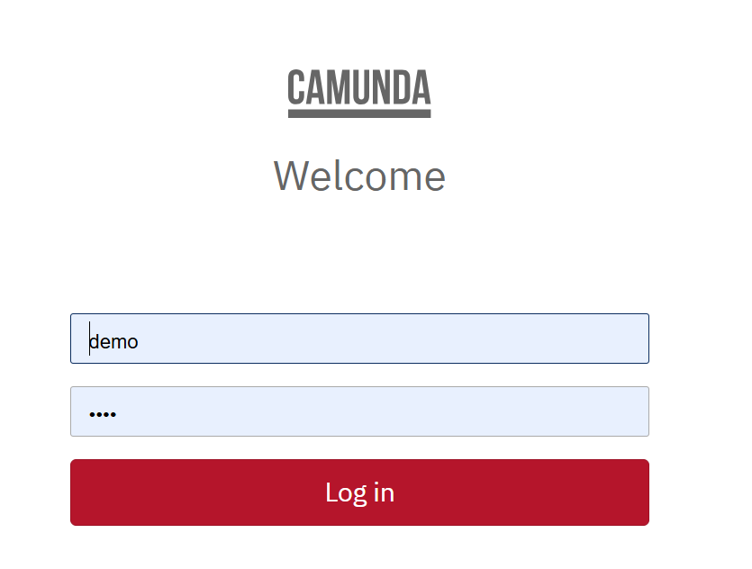

## 监听器

在 Camunda 中大多数节点元素都可以设置执行监听器（Execution listeners），例如事件、顺序流、用户任务、服务任务和网关。其中用户任务除了可以设置执行监听器，还可以设置独有的用户任务监听器（Task listeners），相比于执行监听器，用户任务监听器可以设置更加细粒度的事件类型。

监听器需要实现以下接口：

1. 用户任务（UserTask）的监听器为 TaskListener
2. 服务任务（ServiceTask）的监听器为 JavaDelegate
3. 其他任务的监听器为 ExecutionListener

```java
public class ExampleExecutionListener implements ExecutionListener {
    
    public void notify(DelegateExecution execution) throws Exception {
        execution.setVariable("variableSetInExecutionListener", "firstValue");
        execution.setVariable("eventReceived", execution.getEventName());
    }
}
```

### 执行监听器（Execution listeners）

执行监听器支持的 Listener type 如下，有 Java class、Expression、Delegate expression 和 Script，下面针对这几种的配置和代码实现进行说明

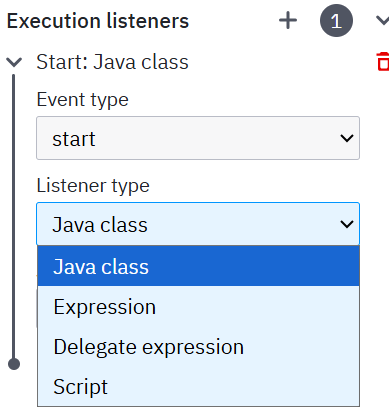

#### Java class

Java class 配置完整的包名和类名，并选择 Event type 是开始或结束事件类型，对应节点执行前和执行后。

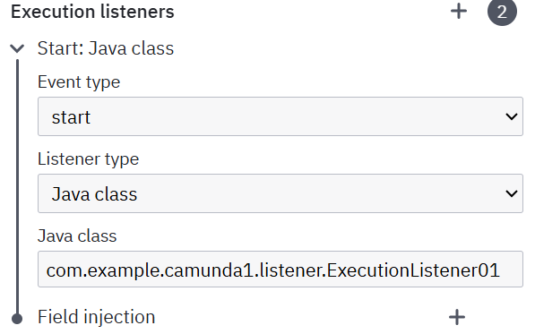

新增一个 java 类，实现 JavaDelegate 接口，并重写 execute 方法，利用 @Component 注解注入 bean，配置当前类的完整路径即可。根据 eventName 区分是什么事件，在里面实现对应的逻辑，代码示例如下：

```java
@Component
@Slf4j
public class ExecutionListener01 implements ExecutionListener {

    @Override
    public void notify(DelegateExecution execution) throws Exception {
        String eventName = execution.getEventName();
        String currentActivityName = execution.getCurrentActivityName();
        if (ExecutionListener.EVENTNAME_END.equals(eventName)) {

        } else if (ExecutionListener.EVENTNAME_START.equals(eventName)) {

        } else if (ExecutionListener.EVENTNAME_TAKE.equals(eventName)) {

        }
        log.info("ExecutionListener01 execute,taskName={},eventName={}", currentActivityName, eventName);
    }
}
```

#### Expression

针对自定义的 java 类和方法，支持通过表达式的方式配置，配置如下：

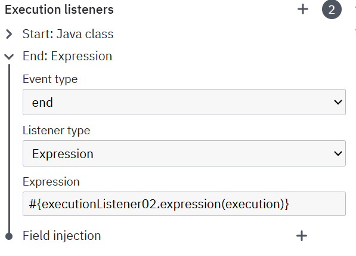

EL 表达式不需要实现 JavaDelegate 接口，直接使用 Spring Bean 的名称和方法名称即可，根据 eventName 区分是 start 事件还是 end 事件，在里面实现自己的逻辑。

注：camunda 内置了一部分上下文参数，可以在表达式中直接使用

代码示例如下：

```java
@Component("executionListener02")
@Slf4j
public class ExecutionListener02 {

    public void expression(DelegateExecution execution) {
        String eventName = execution.getEventName();
        String currentActivityName = execution.getCurrentActivityName();
        log.info("ExecutionListener02 execute,taskName={},eventName={}", currentActivityName, eventName);
    }
}
```

#### Delegate expression

委托表达式配置如下：

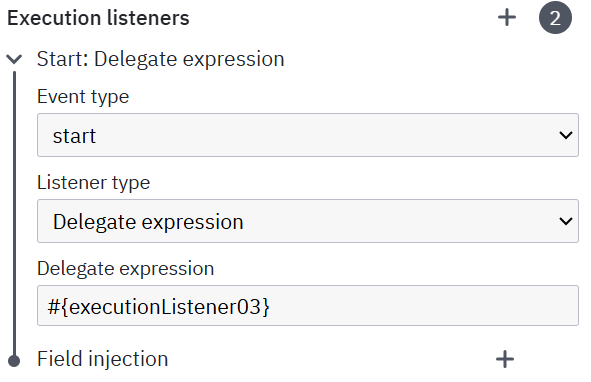

DelegateExpression 和 Expression 类似，区别在于需要实现 JavaDelegate 接口，此时只需要传入 bean 的名称即可，不需要指定方法名和参数。

示例代码如下：

```java
@Component("executionListener03")
@Slf4j
public class ExecutionListener03 implements ExecutionListener {

    @Override
    public void notify(DelegateExecution execution) throws Exception {
        String eventName = execution.getEventName();
        String currentActivityName = execution.getCurrentActivityName();
        if (ExecutionListener.EVENTNAME_END.equals(eventName)) {

        } else if (ExecutionListener.EVENTNAME_START.equals(eventName)) {

        } else if (ExecutionListener.EVENTNAME_TAKE.equals(eventName)) {

        }
        log.info("ExecutionListener03 execute,taskName={},eventName={}", currentActivityName, eventName);
    }
}
```

#### Script

camunda 支持在执行监听器中编写脚本进行处理，如下可以在 Script 框中编写脚本，没有使用过，不进行详细说明，感兴趣可以自行研究

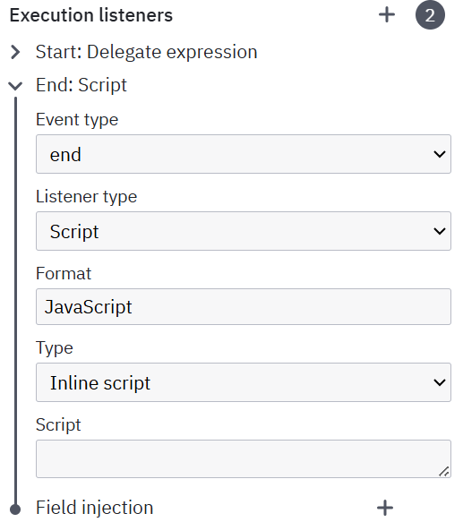

### 用户任务监听器（Task listeners）

任务监听器是独属于用户任务的，其支持的事件类型和监听器类型分别如下所示：

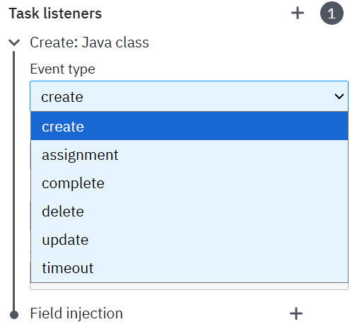

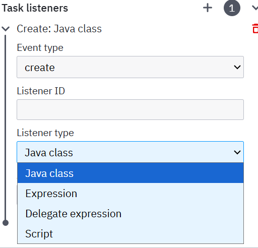

从上面可以看到，与执行监听器相比，任务监听器支持的事件类型更加丰富，意味这个可以在用户任务的各个阶段处理我们自定义的逻辑；其监听器类型和 Execution listeners 一样，同样支持四种方式。

#### Java class

用户任务监听器和执行监听器的 Java class 配置和代码实现类似，区别在于实现的接口不同，eventName 的种类更多，示例配置如下所示：

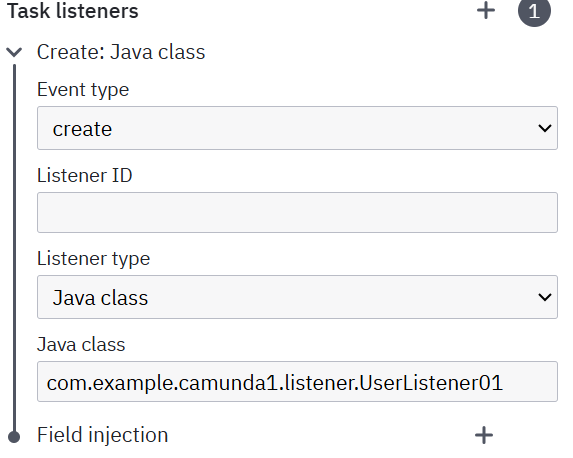

新增一个 java 类，实现 TaskListener 接口，并重写 notify 方法，利用 @Component 注解注入 bean，最后配置当前类的完整路径即可。

代码示例如下：

```java
@Component
@Slf4j
public class UserListener01 implements TaskListener {

    @Override
    public void notify(DelegateTask delegateTask) {
        String eventName = delegateTask.getEventName();
        String name = delegateTask.getName();
        if (TaskListener.EVENTNAME_CREATE.equals(eventName)) {

        } else if (TaskListener.EVENTNAME_ASSIGNMENT.equals(eventName)) {

        } else if (TaskListener.EVENTNAME_COMPLETE.equals(eventName)) {

        } else if (TaskListener.EVENTNAME_DELETE.equals(eventName)) {

        } else if (TaskListener.EVENTNAME_TIMEOUT.equals(eventName)) {

        } else if (TaskListener.EVENTNAME_UPDATE.equals(eventName)) {

        }
        log.info("UserListener01 execute,userTaskName={},eventName={}", name, eventName);
    }
}
```

#### Delegate expression

其在委托表达式的配置示例如下所示：只需要实现 TaskListener 接口，利用 @Component 注解，传入设置的 Bean 的名称即可。

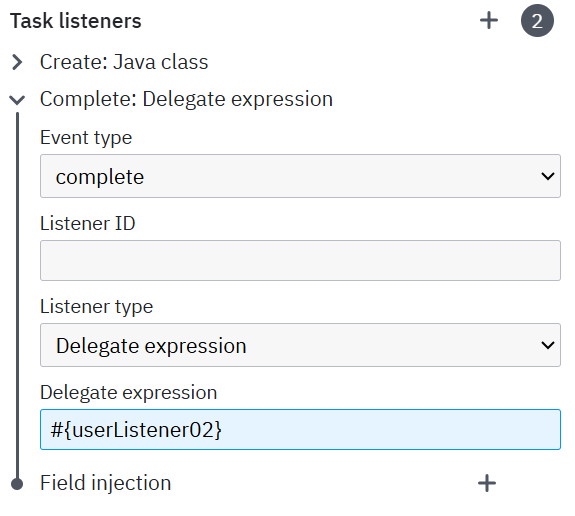

代码示例如下：

```java
@Component("userListener02")
@Slf4j
public class UserListener02 implements TaskListener {

    @Override
    public void notify(DelegateTask delegateTask) {
        String eventName = delegateTask.getEventName();
        String name = delegateTask.getName();
        if (TaskListener.EVENTNAME_CREATE.equals(eventName)) {

        } else if (TaskListener.EVENTNAME_ASSIGNMENT.equals(eventName)) {

        } else if (TaskListener.EVENTNAME_COMPLETE.equals(eventName)) {

        } else if (TaskListener.EVENTNAME_DELETE.equals(eventName)) {

        } else if (TaskListener.EVENTNAME_TIMEOUT.equals(eventName)) {

        } else if (TaskListener.EVENTNAME_UPDATE.equals(eventName)) {

        }
        log.info("UserListener02 execute,userTaskName={},eventName={}", name, eventName);
    }
}
```

#### Expression

用户任务监听器的表达式写法和上面执行监听器的表达式写法一样，区别在于其用到的上下文参数不一样，执行监听器用到的方法参数是 `DelegateExecution execution`，用户任务监听器用到的方法参数是 `DelegateTask task`，详细见上面的 Camunda 内置的上下文参数，其示例配置如下：

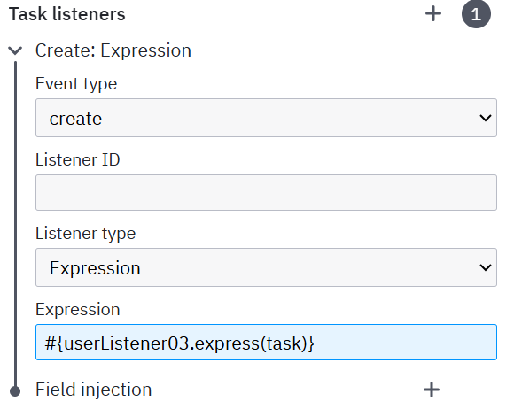

示例代码如下：

```java
@Component("userListener03")
@Slf4j
public class UserListener03 {
    
    public void expression(DelegateTask task) {
        String eventName = task.getEventName();
        String name = task.getName();
        //根据 eventName 来进行自定义逻辑
        log.info("userListener03 execute,userTaskName={},eventName={}", name, eventName);
    }
}
```

#### Script

和上面的执行监听器类似，不再赘述。

## 服务任务

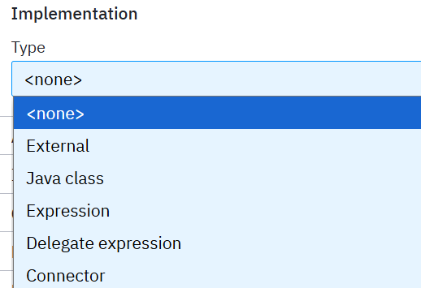

接入方式：

1. External（外部服务）：外部服务订阅消息，服务需加@ExternalTaskSubscription(“topicName”)注解，一般用于复杂的外部系统

2. Java class（类）：执行 java 代码，如：com.lt.camunda.ClassName

3. Expression（表达式）：执行 EL 表达式 ，可直接调用 JavaBean 的方法

4. Delegate Expression：基本使用和 Expression 使用方式类似，支持 EL 表达式，也可以直接使用 Bean 名称

5. HTTP Connector（连接器）：用于与外部系统或服务交互（HTTP Client），一般用于简单的接口请求，该方式需要 Camunda8 支持

### Java Class

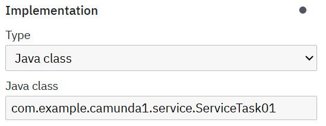

配置 java 类名，需要实现 JavaDelegate 接口，注意是全路径名，不可以使用 Spring 的 bean 配置

```java
@Component
@Slf4j
public class ServiceTask01 implements JavaDelegate {

    @Override
    public void execute(DelegateExecution execution) throws Exception {
        String taskId = execution.getId();
        String instanceId = execution.getProcessInstanceId();
        Map<String, Object> variables = execution.getVariables();
        log.info("ServiceTask01 execute,taskId={},instanceId={},variables={}", taskId, instanceId, variables);
    }
}
```

### Delegate Expression

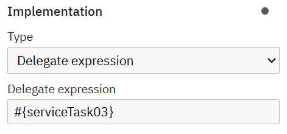

在系统任务中，因为是自动执行，所以实际应用中需要嵌入各种业务逻辑，可以在流程图设计中，按照下面方式调用 java 代码执行，在 spring 中配置同名的 bean

```java
@Component("serviceTask03")
@Slf4j
public class ServiceTask03 implements JavaDelegate {

    @Override
    public void execute(DelegateExecution execution) throws Exception {
        String taskId = execution.getId();
        String instanceId = execution.getProcessInstanceId();
        Map<String, Object> variables = execution.getVariables();
        log.info("ServiceTask03 execute,taskId={},instanceId={},variables={}", taskId, instanceId, variables);
    }
}
```

### Expression

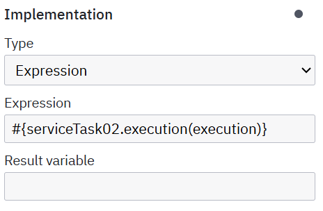

EL 表达式，调用 java 类的方法 

```java
@Component("serviceTask02")
@Slf4j
public class ServiceTask02 {

    public void execution(DelegateExecution execution){
        String processInstanceId = execution.getProcessInstanceId();
        String taskId = execution.getId();
        Map<String, Object> variables = execution.getVariables();
        log.info("ServiceTask02 execute,taskId={},processInstanceId={},variables={}", taskId, processInstanceId, variables);
    }
}
```

## 创建流程图

### 填写审批人

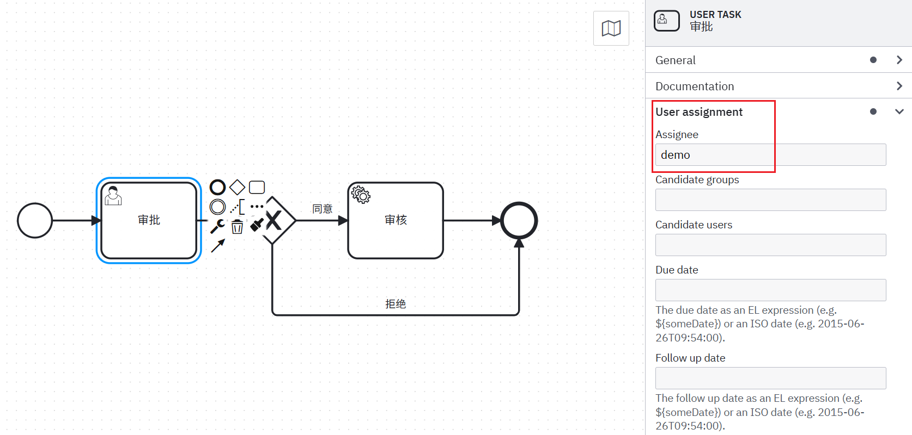  

### 设置同意分支

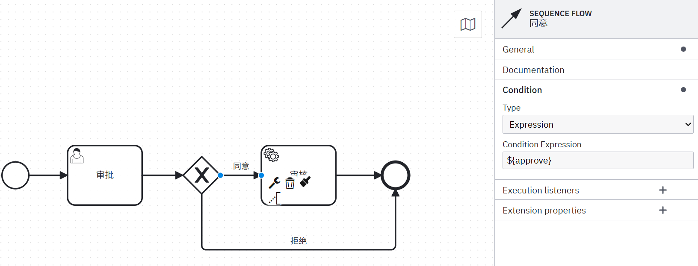

${approve} 这个就是我们需要传递的参数

### 设置拒绝分支

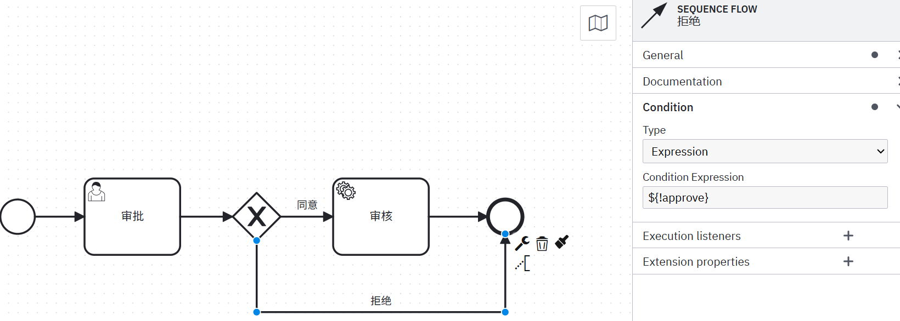

${! approve} 代表取反，上面是通过，这里设置不通过

### 配置回调

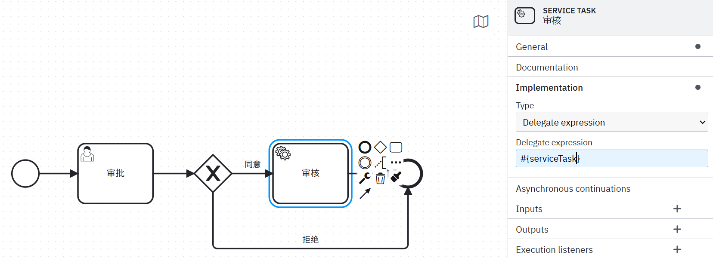

配置一个回调 Java 方法，打印信息（可以作为逻辑处理节点）

```java
@Component("serviceTask")
@Slf4j
public class ServiceTask implements JavaDelegate {

    @Override
    public void execute(DelegateExecution execution) throws Exception {
        System.out.println("审核流程 - SERVICE TASK - 回调");
        Object approved=execution.getVariable("approve");
        System.out.println("审批结果："+ approved);
        System.out.println("===========================");
    }
}
```

### 发布

点击左下角的火箭，开启一个进程


进入 taskList 页面，点击右上角的 Start process，选择刚才的流程

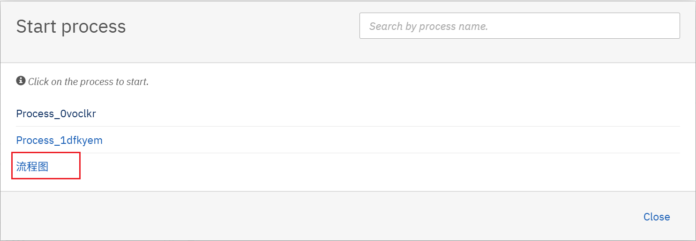  

### 审批

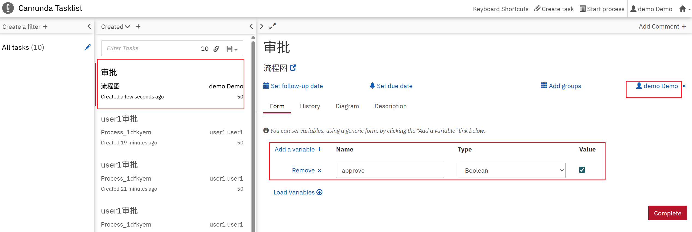

点击 Add a variable，新增一个 approve 参数，这里就是个${approve} 传参，选择 Boolean，Value 选中代表 True（同意）

