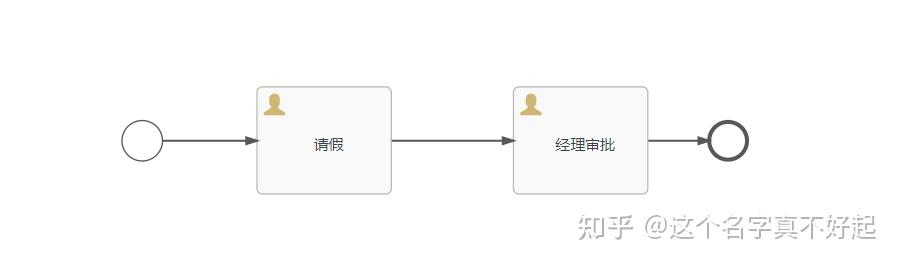
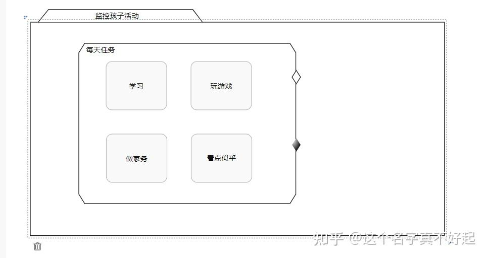
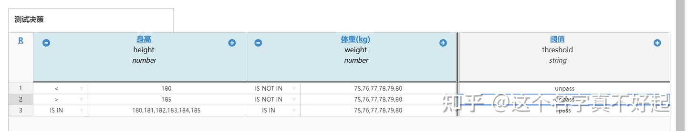

## 框架比较

| 框架        | 来源 | 是否收费   | 社区活跃度 | 建模工具内容   | 持久层引擎 | 扩展节点 | SpringBoot | SpringCloud | Rest 接口 | 功能 | 级别   | 生成表数 | 性能 | 稳定性 | 外部任务   | 缺点                                                         | 优点                                                  |
| ----------- | ---- | ---------- | ---------- | -------------- | ---------- | -------- | ---------- | ----------- | -------- | ---- | ------ | -------- | ---- | ------ | ---------- | ------------------------------------------------------------ | ----------------------------------------------------- |
| Flowable    | 国外 | 社区版开源 | 较活跃     | BPMN2/CMMN/DMN | JPA        | √        | √          | ×           | √        | 多   | 重量级 | 47 张     | 优   | 优     | 支持的不好 | 开源版维护不及时、部分功能闭环、仅支持从开始节点运维实例     | 功能完善，性能稳定性都好                              |
| JBPM        | 国外 | 开源       | 较活跃     | BPMN2          | JPA        | ×        | √          | ×           | √        | 少   | 轻量级 | 18 张     | 中   | 中     | 不支持     | 接口不友好，整个架构体系很乱                                 | 无                                                    |
| Activiti    | 国外 | 开源       | 活跃       | BPMN2          | MyBatis    | ×        | √          | √           | √        | 少   | 轻量级 | 25 张     | 中   | 中     | 不支持     | 维护不及时、功能缺少                                         | 社区用户多，遇到问题容易找到解决方案，支持 SpringCloud |
| Camunda     | 国外 | 社区版开源 | 不活跃     | BPMN2/CMMN/DMN | MyBatis    | √        | √          | ×           | √        | 多   | 轻量级 | 19 张     | 优   | 优     | 支持       | 对 SpringCloud 支持不好，需要自己实现分布式，文档少遇到问题可能需要直接找作者 | 功能完善，架构轻量，性能稳定性都好                    |
| OSWorkflow  | 国外 | 开源       | 不活跃     | BPMN2          | MyBatis    | ×        | √          | ×           | √        | 少   | 轻量级 | 9 张      | 优   | 优     | 不支持     | 不支持会签、跳转、退回、加签等操作，需要自己扩展开发         | 架构轻量                                              |
| CompileFlow | 国内 | 开源       | 不活跃     | 淘宝 BPM        | MyBatis    | ×        | √          | ×           | √        | 少   | 轻量级 | 10 张     | 优   | 优     | 不支持     | 阿里 2020 年刚开源，用户少，稳定性有待考证，与 OSWorkflow 功能类似 | 无                                                    |

## BPM 模型符号协议

### BPMN （业务流程模型和标记法）

业务流程模型和标记法（BPMN, Business Process Model and Notation）是一套图形化表示法，用于以业务流程模型详细说明各种业务流程。它最初由业务流程管理倡议组织（BPMI, Business Process Management Initiative）开发，名称为 "Business Process Modeling Notation"，即“业务流程建模标记法”。

### CMMN （案例管理模型符号）

Case Management Model Notation 案例管理模型符号。CMMN 是一种图形符号，用于捕获基于处理需要各种活动的案例的工作方法，这些活动可能以不可预测的顺序执行以响应不断变化的情况。使用以事件为中心的方法和案例文件的概念，CMMN 扩展了可以用 BPMN 建模的界限，包括结构化工作量减少和知识工作者推动的工作量。使用 BPMN 和 CMMN 的组合允许用户覆盖更广泛的工作方法。

### DMN（决策模型符号）

DMN 是决策模型和符号（Decision Model and Notation）的英文缩写，是由 BMN 背后的组织 OMG 管理的一个标准。DMN 是一种用于精确规范业务决策和业务规则的建模语言和符号。DMN 旨在与 BPMN 和/或 CMMN 一起工作，提供一种机制来对与流程和案例相关的决策进行建模。虽然 BPMN、CMMN 和 DMN 可以独立使用，但它们经过精心设计以相互补充。BPMN、CMMN 和 DMN 真正构成了流程改进标准的“三冠王”。

### 区别

1. 请假流程 BPMN

案例：请假流程是一个有严格流程顺序定义的执行流程，这种就类似我们项目中大部分工作流了，有严格执行顺序，并且根据任务类型，进行顺序执行等，这种就非常适合采用 BPMN 去创建

2. 管理流程 CMMN

案例：大人白天需要上班，想监控孩子每天在家里都干什么了？写作业、看电视、玩游戏、做家务，这种没有固定的顺序的就不适合采用 BPMN 协议去实现了，因此 CMMN 协议就出来了，通过定义阶段（stage） 开始、结束事件、包含哪些任务 的形式进行流程定义 ，当规定在早上 9 点到晚上 5 点这个出发点内，阶段任务里面都执行了哪些进行定义，当孩子执行了某个事件就下发对应通知，这样就更符合我们的要求了

3. 决策流程 DMN

案例：学校的升旗手招聘，需要招聘 3 名符合身高 180~185 的，体重 75~80KG 的气质男生当升旗手，于是大家踊跃报名，那么此刻通过 DMN 决策流程进行条件筛选，只有符合条件的同学会进入下一轮筛选

## 流程引擎相关术语

### 流程定义（Process Definition）

指通过建模生成的一个符合 BPMN 规范的完整流程模型定义文件。Process Definition 定义了流程的结构，或者说定义了业务活动的执行过程。Camunda bpm 使用 bpmn2.0 作为其流程定义的主要建模语言。

### 流程实例（Process Instance）

流程实例是流程定义的单独执行，流程定义和流程实例是一对多关系。流程实例与流程定义的关系与面向对象编程中对象与类的关系相同（在这种类比中，流程实例扮演对象的角色，流程定义扮演类的角色）。

流程定义设计完成后，发布到 BPM，通过流程引擎解析流程定义，发起一次流程即创建了一个流程实例，比如：创建了一个“请假流程”，这是一个流程定义，张三发起了一次请假流程，即创建了一个流程实例，李四也发起了一次请假，就是创建了另一个流程实例，这两个实例均基于流程定义创建生成。

### 执行实例（Execution）

如果流程实例包含多个执行路径（例如，在并行网关之后），则会同时产生多个执行实例，即 execution，通过 excutionId 能够区分流程实例内的当前活动路径。

Execution（执行）是分层的，流程实例中的所有 Execution（执行）组成一个树，Process Instance（流程实例）是树中的根节点，Process Instance（流程实例）本身就是一个 Execution（执行）。

### 活动实例（Activity Instance）

活动实例概念与执行概念类似，但采用了不同的视角。虽然可以将执行想象为在流程中移动的令牌，但活动实例表示活动（任务、子流程等）的单个实例。因此，活动实例的概念更面向状态。

### 流向/顺序流（Flow）

顺序流是连接两个流程节点的连线。顺序流是一端带有箭头的实线，可在图中或单个池中链接流程内的各个元素，并显示各个元素的执行顺序。消息流是一端带有箭头的点线，可链接两个单独的池（或两个单独的池中的元素），并显示消息发送的方向。

### 任务（Task）

task 所有的任务都是活动，但是活动不全是任务，任务是一个流程的节点，但是并非所有流程节点都是任务。

1. 发送任务（send task）：用来向外部 Participant 发送消息的任务，一旦消息发送出去，该任务就完成了
2. 接收任务（receive task）：用来等待外部 Participant 消息的任务, 一旦接收到外部消息该任务就标记为完成状态，很多时候，一个流程都会以一个 Receive Task 作为开始，通过接收一条外部消息来启动流程
3. 用户任务（user task）：需要人工完成的任务，需要指定执行的用户或角色，并提供相应的输入（表单），才能继续执行
4. 手动任务（manual task）：需要人工完成的任务，此任务是否完成不影响流程引擎的继续执行
5. 业务规则任务（business rule task）：被用作同步执行一个或者多个规则，一般引用 DMN 决策模型标记。
6. 服务任务（service task）：通过 Web 服务来自动完成的任务
7. 脚本任务（script task）：通过引擎可识别的脚本语言来进行自动化操作，如 Groovy 脚本

#### 服务任务（Service Task）

Camunda 中的 Service Task（服务任务）用于调用服务。在 Camunda 中，可以通过调用本地 Java 代码、外部工作项、web 服务形式实现的逻辑来完成的。

#### 脚本任务（Script Task）

在 Camunda 中，脚本任务是一个自动活动，当流程执行到脚本任务时，相关的脚本自动执行。camunda 支持大多是兼容 JSR-223 的脚本引擎实现，比如 Groovy、JavaScript、JRuby and Jython。

### 定时任务（Job and Job Definition）

Camunda 流程引擎包含一个名为 Job Executor 的组件。作业执行器是一个调度组件，负责执行异步后台工作。考虑一个计时器事件的例子：每当流程引擎到达计时器事件时，它将停止执行，将当前状态保存到数据库，并创建一个作业以在将来继续执行。部署流程时，流程引擎会为流程中的每个活动创建作业定义，这些活动将在运行时创建作业。

### 事件（event）

event 事件是 BPMN 流程建模元素，表示在流程过程中“发生”的事情，事件会影响流程的走向。BPMN 定义了不同的事件类型。事件包含开始（Start）、中间（Intermediate）、边界（Boundary）和结束（End）四种类型。根据触发方式不同，可以分为捕获事件（Catching Event）和抛出事件（Throwing Event）。

1. 开始事件（Start Event）：必须定义的流程开始节点

2. 结束事件（End Event）：必须定义的流程结束节点

3. 中间事件（Intermediate Event）：这个事件虽然没有具体的触发器，但定义为抛出事件

4. 消息事件（Message Event)：消息事件可以出现在流程的任何位置，与消息任务不同点在于消息任务还可以挂载其它边界事件

5. 定时事件（Timer Event)：定时事件可用作开始事件、中间事件、边界事件，同时作为边界事件支持中断和非中断

6. 信号事件（Signal Event）：信号事件是全局范围的，它通过广播的形式通知所有关注此事件的流程

7. 条件事件（Conditional Event）：条件事件是一种等待事件，只有当变量满足条件时才会触发

### 流程变量（Process Variable）

流程变量在整个工作流中扮演很重要的作用，是业务和流程引擎之间交互信息的载体，业务可以把数据放到流程变量里传递给流程引擎，流程引擎也可以把信息放到流程变量给传递给业务，流程变量最常见的用途有路由条件表达式、流程执行事件参数等。

例如：请假流程中有请假天数、请假原因等一些参数都为流程变量的范围。流程变量的作用域范围是流程实例，也就是说各个流程实例的流程变量是不相互影响的。

### 网关/门路（Gateways）

Gateway 是 BPMN2 规范中的流程定义元素，中文可称为“网关”、“决策”、“判断”。网关用来控制流程的执行流向，当在拆分路径时产生令牌，在合并路径时消费令牌。常用网关可分为排他网关（XOR）、并行网关（AND）和包容网关（OR）。BPMN2.0 规范中提供了 bpmn: exclusiveGateway 排他网关标签、bpmn: parallelGateway 并行网关标签来定义，activiti、flowable、camunda 等开源工作流引擎均支持该标签。

1. 排它门路（Exclusive (XOR)）：用于多选一的场景。从它分出的路径上可以设置判断条件

2. 并行门路（Parallel (AND)）： 用于多条路径共同执行的场景。从它分出的路径上不可设置判断条件

3. 包含门路（Inclusive (OR)）：用于执行部分路径的场景（判断成功的路径）。从它分出的路径上可设置判断条件

4. 事件门路（Event-based）：用于由事件触发执行路径的场景。发出的路径上不设置判断条件

### 泳道（Swimlanes）

BPMN 中的泳道对象（也称为泳道）是表示业务流程参与者的矩形框。泳道可能包含由该泳道（参与者）执行的流对象，除了必须有一个空体的黑盒子。泳道可以水平排列，也可以垂直排列。它们在语义上是相同的，只是表示不同。对于水平泳道，流程从左到右流动，而垂直泳道中的流程从上到下流动。泳道的例子包括客户、客户部门、支付网关和开发团队。

1. 池（Pools）：pool 代表业务流程中的参与者。它可以是一个特定的实体（如部门）或一个角色（如助理经理、医生、学生、供应商）。
2. 游道（Lanes）：lane 是池的子分区。例如，当您有一个池部门时，您可以将部门主管和普通职员作为泳道。与池一样，您可以使用 lane 来表示流程中涉及的特定实体或角色。

### 子流程（SubProcess）

子流程是包含其他活动、网关、事件等的活动，其本身形成的流程是更大流程的一部分。子流程完全在父流程中定义(这就是为什么它通常被称为嵌入式子流程)。

BPMN 2.0 区分了嵌入式子流程（Embedded Subprocess）和调用活动（Call Activity）。从概念上看，当流程执行到达活动时，两者都将调用子流程。

不同之处在于，调用活动引用流程定义外部的流程，而子流程嵌入在原始流程定义中。调用活动的主要用例是拥有可重用的流程定义，可以从多个其他流程定义调用该定义。子流程的流程定义是在运行时解析的。如果需要，也可以独立调用子流程。

当流程执行到达调用活动时，将创建一个新的流程实例，该实例用于执行子流程，可能会像在常规流程中那样创建并行子执行。主流程实例将一直等待，直到子流程完全结束，然后继续原始流程。

子流程允许分层建模。许多建模工具允许折叠子流程，隐藏子流程的所有细节，并显示业务流程的高级端到端概述。

1. 嵌套子流程（Embedded Subprocess）：子流程是包含其他活动、网关、事件等的活动，其本身形成的流程是更大流程的一部分。子流程完全在父流程中定义，由父流程调用
2. 事件子流程（Event Subprocess）：只有事件触发的子流程才能由此活动调起

### 特别流程（Ad-hoc）

临时流程是一组业务活动和相应的工件（例如，信息，决策和产品），只能在高级别的聚合中进行标准化。实际的活动种类及其排序因个案而异。临时流程在国内也被称为“任意流”。以下是 Ad-hoc 流程的特征：

虽然可以预测某些活动，但是一开始就无法完全指定大部分过程，因为它需要的信息只能以某种方式进入项目。

如果我们假设在 ad-hoc 流程的上下文中永远不会确定下一步，则它们的执行不能由传统的基于流程的信息系统控制，在大多数情况下，知识工作者可以控制流程。

似乎不可能在设计时考虑临时过程的所有可能性，这样的过程模型将变得复杂且难以管理。

### 部署（deployment）

Deployment（部署）是指将流程定义发布到工作量引擎中之后称为 deployment。

### 身份管理（IDM）

提供 SSO 功能凭证管理工作，可以用来管理权限、用户、组

### 流程设计器（Modeler）

模型管理工具，用于定义流程模型、表单及应用定义。在 Camunda BPM 中，提供了 C/S 流程建模工具（Modeler）和 B/S 流程建模工具，用户通过拖拉拽的方式设计流程图，这个设计完的 xml 文件就是流程定义。

### 表单（Form）

form 表单配置给每个流程节点使用，如请假申请中需要用户填写请假天数事由，审批节点中需要审批人填写审批意见等。

表单可以嵌入到用户任务中，后续可以在审批中填入相应数据以流转到相应节点

1. 外置表单：可以自己创建表单生成 HTML 文件，然后让用户任务引用

2. 内置表单：Camunda 自己提供 数字、日期、文本、多选、下拉、单选、图片、iFrame、按钮等...并可以转换为 JSON 格式数据

## 中国特色流程操作概念

### 会签

会签分并行会签和顺序会签两种：

+ 并行会签：指同一个审批节点设置多个人，如 A、B、C 三人，三人会同时收到待办任务，需全部同意之后，审批才可到下一审批节点。
+ 顺序会签：指同一个审批节点设置多个人，如 A、B、C 三人，三人按顺序依次收到待办，即 A 先审批，A 提交后 B 才能审批，需全部同意之后，审批才可到下一审批节点。

### 或签

一个流程审批节点里有多个处理人，任意一个人处理后就能进入下一个节点。例如：员工发起采购申请，提交给多名领导审批，只要有一名领导同意即可提交到下一节点。

### 抄送

抄送：将审批结果通知给抄送列表对应的人。

### 驳回

驳回：将审批重置发送给某节点，重新审批。驳回也叫退回，也可以分退回申请人、退回上一步、任意退回等。

+ 退回申请人： 直接把流程退回给申请节点
+ 退回上一步： 退回流程上一节点
+ 退回任意节点： 退回到流程走过任意一个节点

### 转办

转办：A 转给其 B 审批，B 审批后，进入下一节点。

### 委派

委派：A 转给其 B 审批，B 审批后，转给 A，A 审批后进入下一节点。

### 跳转

跳转：可以将当前流程实例跳转到任意办理节点

### 拿回

拿回：在当前办理人尚未处理文件前，允许上一节点提交人员执行拿回

### 撤销

撤销：流程发起者可以对流程进行撤销处理

### 催办

催办：可以给当前办理人员发送催办通知消息

### 加签

加签：允许当前办理人根据需要自行增加当前办理节点的办理人员

### 减签

减签：在当前办理人操作之前减少办理人

