## 安装部署 Camunda

下载 camunda-bpm 7.24 稳定版：https://downloads.camunda.cloud/release/camunda-bpm/run/7.24/

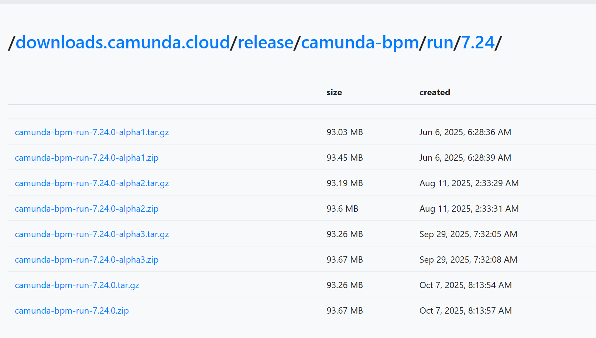

Camunda Platform Run 是 Camunda Platform 的预打包发行版，包括 Camunda webapps (Cockpit, Tasklist, Admin)， REST API 和 Swagger UI 的捆绑版本。Swagger UI 是一个 web-GUI，允许你探索 Camunda Platform Run 的 REST API 端点。

下载完成后，解压到一个目录下，绿色的无需安装。 

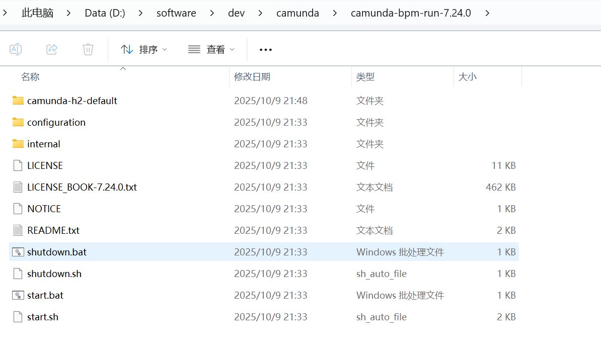

执行两个启动脚本之一（windows 为 start.bat, Linux/Mac 为 start.sh）。 

1. 通过 `http://localhost:8080/camunda/app/` 访问 Camunda webapps

2. 通过 `http://localhost:8080/engine-rest/` 访问 REST API

3. 通过 `http://localhost:8080/swaggerui/` 访问 Swagger UI

启动完成后，访问：`http://localhost:8080/camunda/app/ `

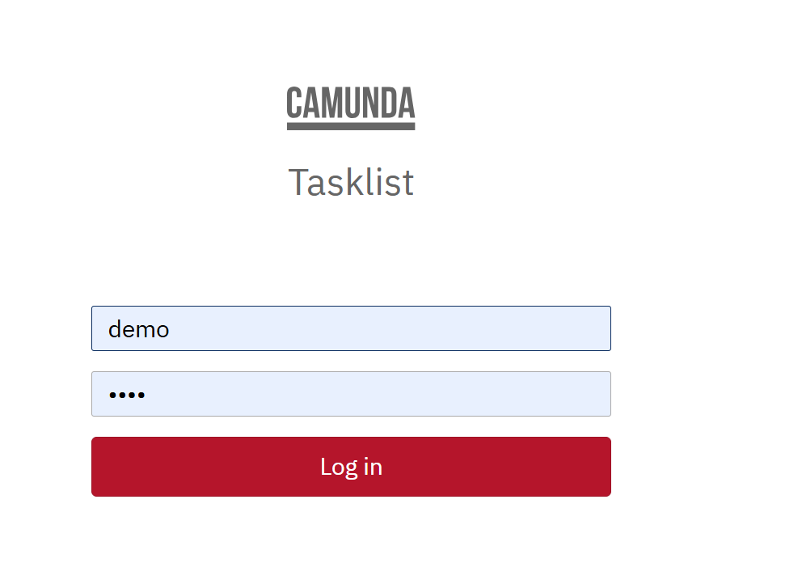

Camunda 默认密码是 demo / demo，在配置文件里有配置，目前我们默认使用官方自带的 H2 数据库。

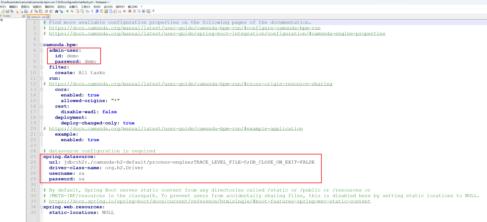

- **Cockpit**：这是Camunda的管理控制台，用于监视和调试流程实例。你可以在这里查看流程定义、流程实例、历史数据等。它是开发人员和管理员的主要工具，用于理解流程行为和诊断问题。
- **Tasklist**：这是一个任务列表，用于查看和管理当前待办事项。对于那些需要完成任务的用户来说，这是一个重要的入口点。
- **Admin**：这是Camunda的管理工具，用于管理用户、组、权限和数据库连接等。它提供了对系统设置的全面控制。

登录完成后，进入“Admin”后台界面，可以对用户、群组、租户、权限、系统进行管理。 

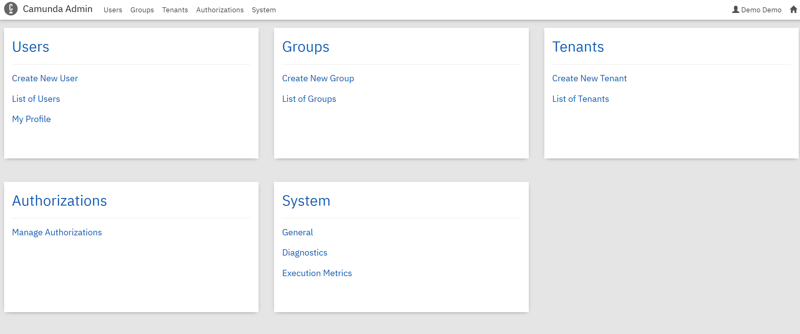

先创建 user1, user2 几个账号，后面流程审批时用到。 

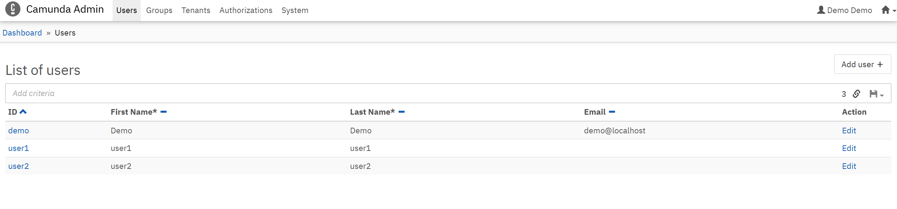

## 安装流程设计器 Modeler

下载 camunda-modeler 流程设计器，是一个客户端应用。 https://camunda.com/download/modeler/ 

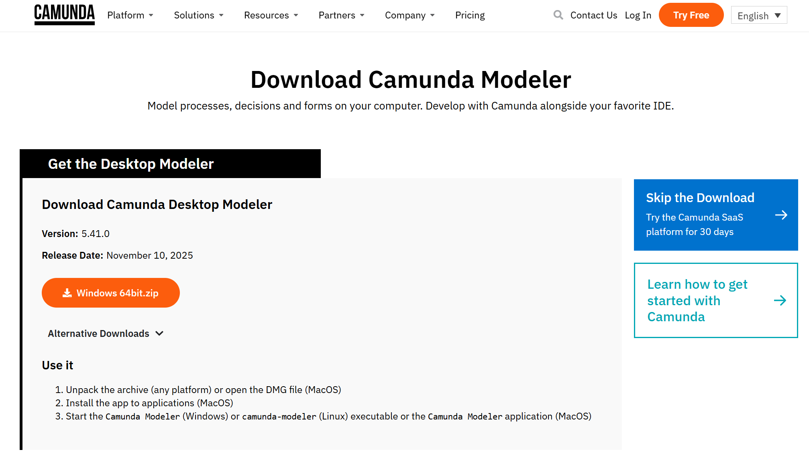

下载完成后，解压到一个目录下，绿色的无需安装，点击即可启动。 

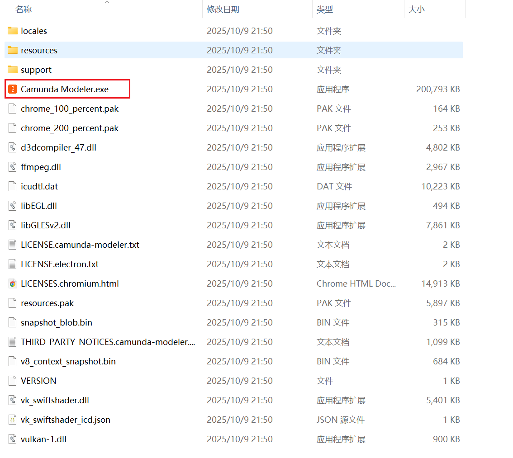

## 流程设计

选择 BPMN 流程图 

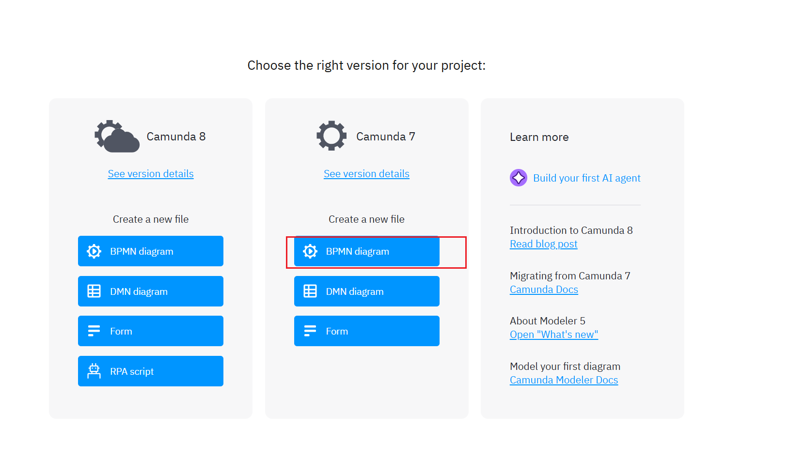

画一个人工审批流程，注意点击配置按钮，设置为 User Task 类型 

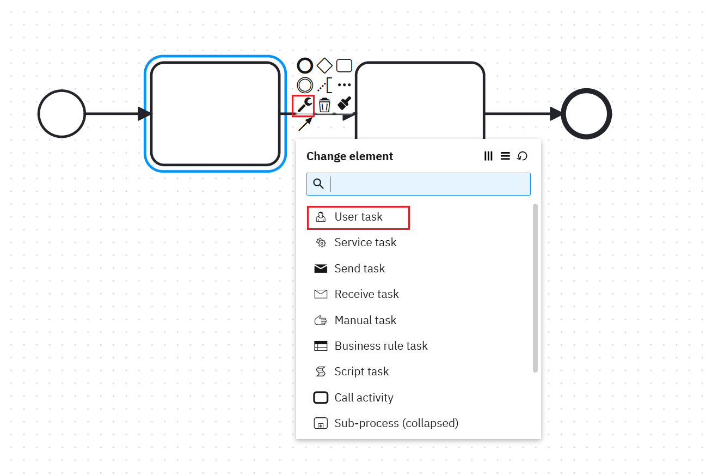

给审批节点设置流程处理人，直接写用户 ID，要跟系统里的用户对应起来。 

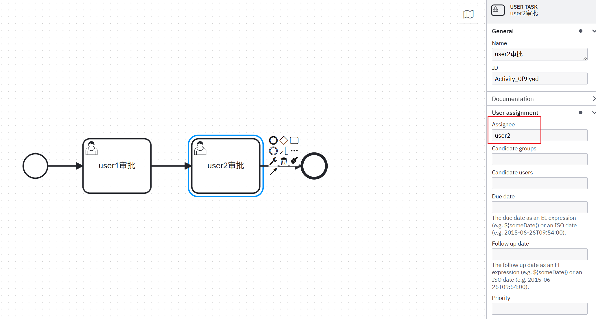

## 流程发布

流程设计完成后，点击发布流程，给流程起一个名称，配置好 REST 服务地址，点击 Deploy 即可。 

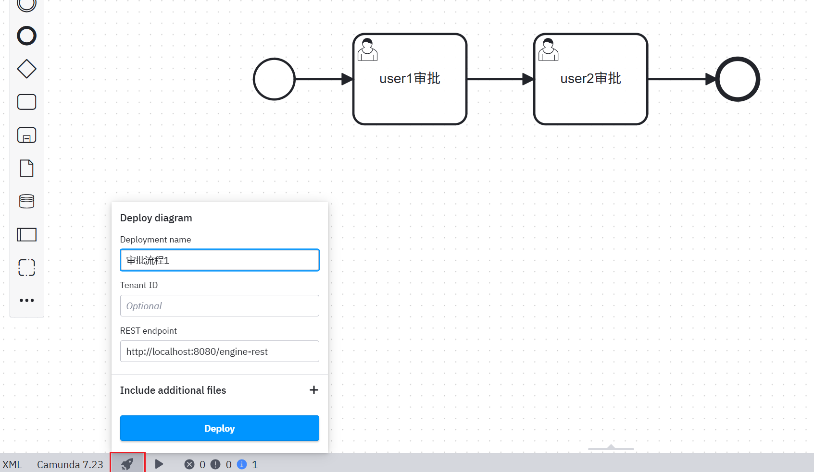

发布完成后，进入控制台查看是否成功。点击右上方的“Cockpit”进入流程管控台，可以看到有一个流程发布成功了。 

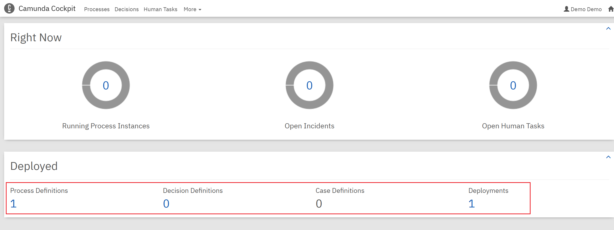

点击进入该流程定义，可以查看流程模型具体信息 

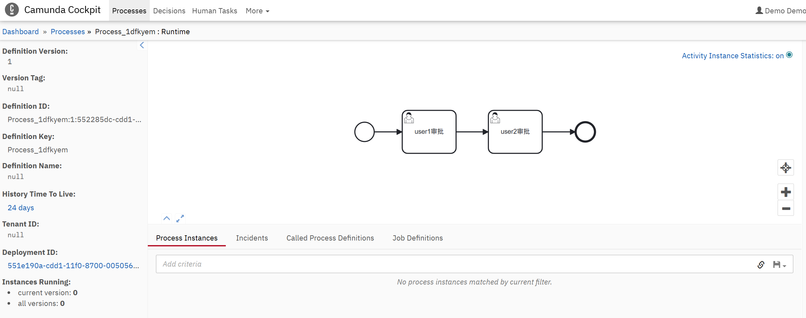

## 流程启动

进入“Tasklist”流程任务门面界面，点击右上角的“start process”按钮，即可发起流程。 

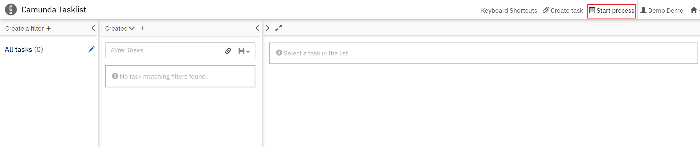

可以给该流程实例起一个名称，便于后面查找，具体应用中要跟业务表单关联。也可以给该流程增加一些流程变量，实际应用中要跟业务表单字段关联。 

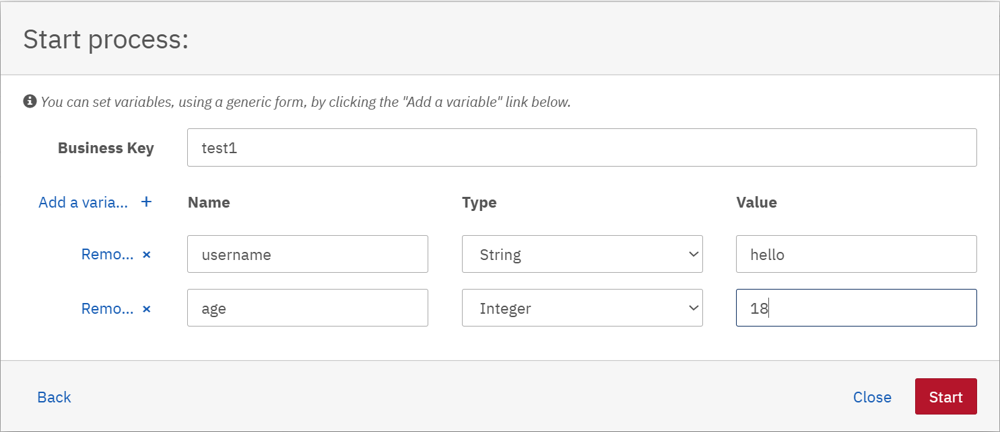

## 流程审批

通过 user1 账号登录，可查看到提交过来的流程待办任务

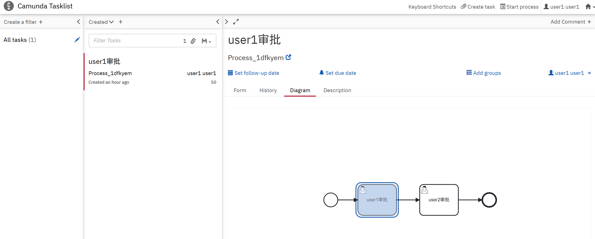

可以添加流程审批意见，也可以不填写。 

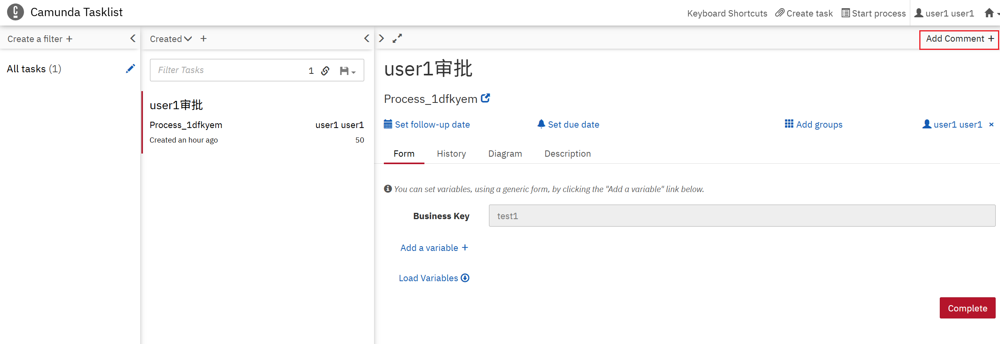

点击“complete”即可完成流程提交。 

## 流程监控

上面操作完成了流程启动和审批，在流程实例监控页面可以动态查看流程实例情况。 

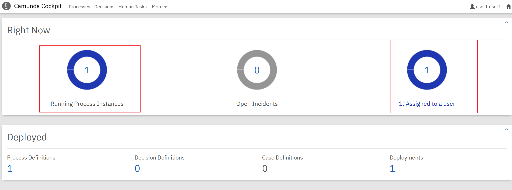

点击该流程实例进入，可以查看详细的流程状态。 

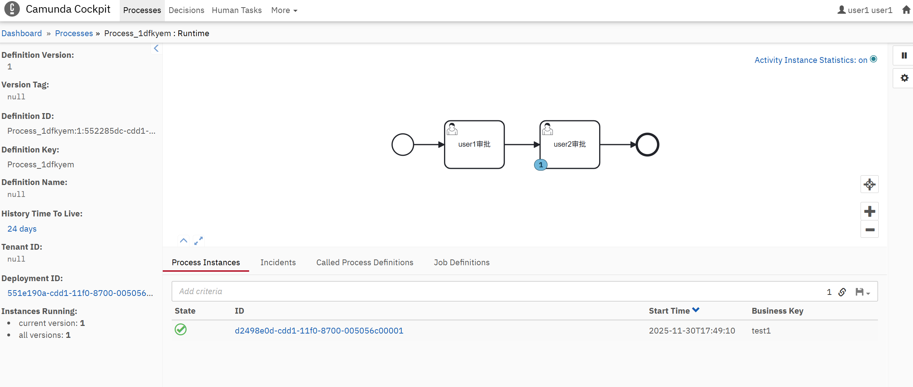
