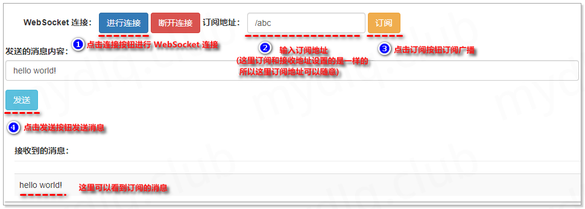
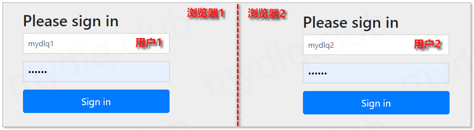
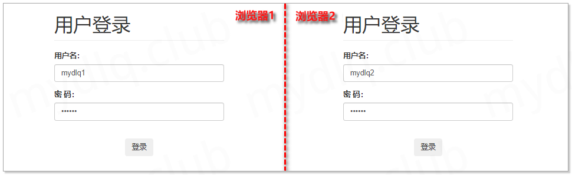
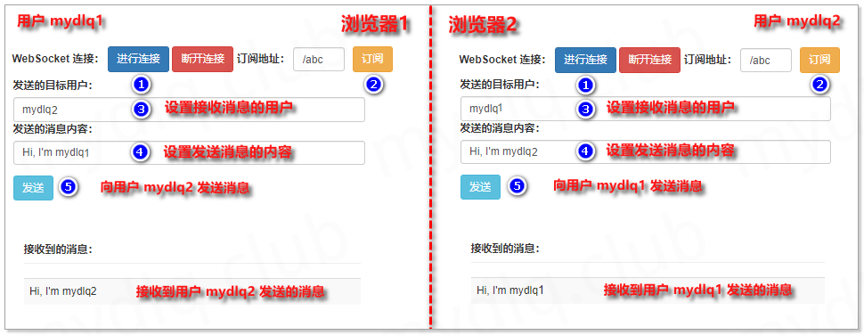

## SpringBoot 整合

### 原生注解

这里有几个注解需要注意一下，首先是他们的包都在 javax.websocket 下。并不是 spring 提供的，而 jdk 自带的，下面是他们的具体作用。

1. @ServerEndpoint

暴露出的 ws 应用的路径，支持 RESTful 风格传参，类似/websocket/{username}

2. @OnOpen

与当前客户端连接成功，有入参 Session 对象（当前连接对象），同时可以利用@PathParam()获取上述应用路径中传递的参数，比如@PathParam("username") String username。

3. @OnClose

与当前客户端连接失败，有入参 Session 对象（当前连接对象），同时也可以利用@PathParam()获取上述应用路径中传递的参数。

4. @OnError

与当前客户端连接异常，有入参 Session 对象（当前连接对象）、Throwable 对象（异常对象），同时也可以利用@PathParam()获取上述应用路径中传递的参数。

5. @OnMessage

当前客户端发送消息，有入参 Session 对象（当前连接对象）、String message 对象（当前客户端传递过来的字符串消息）

### 基本使用

```xml
<dependency>
    <groupId>org.springframework.boot</groupId>
    <artifactId>spring-boot-starter-websocket</artifactId>
</dependency>
```

```java
@Configuration
@EnableWebSocket
public class WebSocketConfig {

    //这个bean的注册,用于扫描带有@ServerEndpoint的注解成为websocket,
    //如果你使用外置的tomcat就不需要该配置文件
    @Bean
    public ServerEndpointExporter serverEndpointExporter(){
        return new ServerEndpointExporter();
        
        //ServerEndpointExporter exporter = new ServerEndpointExporter();
        // 手动注册 WebSocket 端点，WebSocket 类上可以不用加 @Component 注解
        //exporter.setAnnotatedEndpointClasses(WebSocket.class);
        //return exporter;
    }
}
```

```java
@Component
@Slf4j
//暴露的ws应用的路径，主要是将目前的类定义成一个websocket服务器端, 注解的值将被
//用于监听用户连接的终端访问URL地址，客户端可以通过这个URL来连接到WebSocket服务器端
@ServerEndpoint("/websocket")
public class WebSocket {

    // 用来存储服务连接对象
    private static Map<String ,Session> clientMap = new ConcurrentHashMap<>();

    /**
     * 客户端与服务端连接成功
     */
    @OnOpen
    public void onOpen(Session session){
        clientMap.put(session.getId(),session);
    }

    /**
     * 客户端与服务端连接关闭
     */
    @OnClose
    public void onClose(Session session){
        clientMap.remove(session.getId());
    }

    /**
     * 客户端与服务端连接异常
     */
    @OnError
    public void onError(Throwable error,Session session) {
        error.printStackTrace();
    }

    /**
     * 客户端向服务端发送消息
     */
    @OnMessage
    public void onMsg(Session session,String message) throws IOException {
        //收到来自当前客户端的消息时
        sendAllMessage(message);
    }

    //向所有客户端发送消息（广播）
    private void sendAllMessage(String message){
        Set<String> sessionIdSet = clientMap.keySet();
        // 此处相当于一个广播操作
        for (String sessionId : sessionIdSet) {
            Session session = clientMap.get(sessionId);
            //发送消息给客户端
            session.getAsyncRemote().sendText(message);
        }
    }
}
```

**传参**

```java
@Component
@ServerEndpoint("/websocket/{userId}")
public class WebSocketServer {
    /**
     * 日志工具
     */
    private Logger logger = LoggerFactory.getLogger(this.getClass());
    /**
     * 与某个客户端的连接会话，需要通过它来给客户端发送数据
     */
    private Session session;
    /**
     * 用户id
     */
    private String userId;
    /**
     * 用来存放每个客户端对应的MyWebSocket对象
     */
    private static CopyOnWriteArraySet<WebSocketServer> webSockets = new CopyOnWriteArraySet<>();
    /**
     * 用来存在线连接用户信息
     */
    private static ConcurrentHashMap<String, Session> sessionPool = new ConcurrentHashMap<String, Session>();

    /**
     * 链接成功调用的方法
     */
    @OnOpen
    public void onOpen(Session session, @PathParam(value = "userId") String userId) {
        try {
            this.session = session;
            this.userId = userId;
            webSockets.add(this);
            sessionPool.put(userId, session);
            logger.info("【websocket消息】有新的连接，总数为:" + webSockets.size());
        } catch (Exception e) {
        }
    }

    /**
     * 链接关闭调用的方法
     */
    @OnClose
    public void onClose() {
        try {
            webSockets.remove(this);
            sessionPool.remove(this.userId);
            logger.info("【websocket消息】连接断开，总数为:" + webSockets.size());
        } catch (Exception e) {
        }
    }

    /**
     * 收到客户端消息后调用的方法
     */
    @OnMessage
    public void onMessage(String message) {
        logger.info("【websocket消息】收到客户端消息:" + message);
    }

    /**
     * 发送错误时的处理
     */
    @OnError
    public void onError(Session session, Throwable error) {
        logger.error("用户错误,原因:" + error.getMessage());
        error.printStackTrace();
    }

    /**
     * 此为广播消息
     */
    public void sendAllMessage(String message) {
        logger.info("【websocket消息】广播消息:" + message);
        for (WebSocketServer webSocket : webSockets) {
            try {
                if (webSocket.session.isOpen()) {
                    webSocket.session.getAsyncRemote().sendText(message);
                }
            } catch (Exception e) {
                e.printStackTrace();
            }
        }
    }

    /**
     * 此为单点消息
     */
    public void sendOneMessage(String userId, String message) {
        Session session = sessionPool.get(userId);
        if (session != null && session.isOpen()) {
            try {
                logger.info("【websocket消息】 单点消息:" + message);
                session.getAsyncRemote().sendText(message);
            } catch (Exception e) {
                e.printStackTrace();
            }
        }
    }

    /**
     * 此为单点消息(多人)
     */
    public void sendMoreMessage(String[] userIds, String message) {
        for (String userId : userIds) {
            Session session = sessionPool.get(userId);
            if (session != null && session.isOpen()) {
                try {
                    logger.info("【websocket消息】 单点消息:" + message);
                    session.getAsyncRemote().sendText(message);
                } catch (Exception e) {
                    e.printStackTrace();
                }
            }
        }
    }
}
```

### 在端点中注入 Bean

我们现在要在端点中注入使用它，很多人会直接在端点类上使用 `@Component` 注解，然后注入

```java
@ServerEndpoint(value = "/channel/echo")
@Component
public class EchoChannel {

    @Autowired
    private UserService userService;

    // ...

    @OnOpen
    public void onOpen(Session session, EndpointConfig endpointConfig){
        this.session = session;
        // 在业务中使用
        this.userService.foo();
    }
}
```

服务可以正常启动，看似一切都没问题！可是当你在事件方法中使用这 Bean 的时候就会导致 `NullPointerException` 异常。

**原因：运行时的 WebSocket 连接对象，也就是端点实例，是由服务器创建，而不是 Spring，所以不能使用自动装配**。上文也提到过 “服务器会为每个连接创建一个端点实例对象”。

知道了原因后，解决办法也很简单，我们可以使用 Spring 的 `ApplicationContextAware` 接口，在应用启动时获取到 `ApplicationContext` 并且保存在全局静态变量中。

服务器每次创建连接的时候，我们就在 `@OnOpen` 事件方法中从 `ApplicationContext` 获取到需要 Bean 来初始化端点对象。

```java
@ServerEndpoint(value = "/channel/echo")
@Component
public class EchoChannel implements ApplicationContextAware {

    private static final Logger LOGGER = LoggerFactory.getLogger(EchoChannel.class);

    // 全局静态变量，保存 ApplicationContext
    private static ApplicationContext applicationContext;

    private Session session;

    // 声明需要的 Bean
    private UserService userService;

    // 保存 Spring 注入的 ApplicationContext 到静态变量
    @Override
    public void setApplicationContext(ApplicationContext applicationContext) throws BeansException {
        EchoChannel.applicationContext = applicationContext;
    }

    @OnOpen
    public void onOpen(Session session, EndpointConfig endpointConfig){
        // 保存 session 到对象
        this.session = session;
        // 连接创建的时候，从 ApplicationContext 获取到 Bean 进行初始化
        this.userService = EchoChannel.applicationContext.getBean(UserService.class);
        // 在业务中使用
        this.userService.foo();
        LOGGER.info("[websocket] 新的连接：id={}", this.session.getId());
    }
    
    // ....
}
```

### 定时推送前端

```java
@Component
public class Test {

    @Resource
    private WebSocketServer webSocketServer;

    //设置定时十秒一次
    @Scheduled(cron = "0/10 * * * * ?")
    public void sendMessage() throws Exception {
        Map<String,Object> map = new HashMap<>();

        // 获取当前日期和时间
        LocalDateTime nowDateTime = LocalDateTime.now();
        DateTimeFormatter dateTimeFormatter = DateTimeFormatter.ofPattern("yyyy-MM-dd HH:mm:ss");
        System.out.println(dateTimeFormatter.format(nowDateTime));
        map.put("server_time",dateTimeFormatter.format(nowDateTime));
        map.put("server_code","200");
        map.put("server_message","这是服务器推送到客户端的消息哦！！");
        JSONObject jsonObject =  new JSONObject(map);
        webSocketServer.sendAllMessage(jsonObject.toString());
    }
}
```

当项目同时集成 WebSocket+定时任务时会报错：Bean named 'defaultSockJsTaskScheduler' is expected to be of type···，

报错大致意思是：名为'defaultSockJsTaskScheduler'的 Bean 应为'org.springframework.scheduling.TaskScheduler“但实际上是类型”org.springframework.beans.factory.support.NullBean'。这个异常是由(AbstractBeanFactory.java: 395)抛出的。

websocket 需要创建线程，定时任务也需要创建线程，应该是 websocket 和定时任务在创建线程的时候发生了冲突，定时任务创建线程没有成功。

**解决方案**

手动添加一个定时任务的配置类来创建一个 ThreadPoolTaskScheduler 对象。

```java
@Configuration
public class ScheduledConfig {
 
	@Bean
	public TaskScheduler taskScheduler() {
		ThreadPoolTaskScheduler scheduling = new ThreadPoolTaskScheduler();
		scheduling.setPoolSize(10);
		scheduling.initialize();
		return scheduling;
	}
}
```

### 方法替代注解

```java
@Component
public class HttpAuthHandler extends TextWebSocketHandler {

    /**
     * socket 建立成功事件
     */
    @Override
    public void afterConnectionEstablished(WebSocketSession session) throws Exception {
        Object token = session.getAttributes().get("token");
        if (token != null) {
            // 用户连接成功，放入在线用户缓存
            WsSessionManager.add(token.toString(), session);
        } else {
            throw new RuntimeException("用户登录已经失效!");
        }
    }

    /**
     * 接收消息事件
     */
    @Override
    protected void handleTextMessage(WebSocketSession session, TextMessage message) throws Exception {
        // 获得客户端传来的消息
        String payload = message.getPayload();
        Object token = session.getAttributes().get("token");
        System.out.println("server 接收到 " + token + " 发送的 " + payload);
        session.sendMessage(new TextMessage("server 发送给 " + token + " 消息 " + payload + " " + LocalDateTime.now()));
    }

    /**
     * socket 断开连接时
     */
    @Override
    public void afterConnectionClosed(WebSocketSession session, CloseStatus status) throws Exception {
        Object token = session.getAttributes().get("token");
        if (token != null) {
            // 用户退出，移除缓存
            WsSessionManager.remove(token.toString());
        }
    }

    /**
     * 发生错误时调用
     */
    @Override
    public void handleTransportError(WebSocketSession session, Throwable exception) throws Exception {
        exception.printStackTrace();
    }
    
	@Override
    public boolean supportsPartialMessages() {
        //是否支持接收不完整的消息
        return false;
    }
}
```

```java
@Slf4j
public class WsSessionManager {
    /**
     * 保存连接 session 的地方
     */
    private static final ConcurrentHashMap<String, WebSocketSession> SESSION_POOL = new ConcurrentHashMap<>();

    /**
     * 添加 session
     */
    public static void add(String key, WebSocketSession session) {
        SESSION_POOL.put(key, session);
    }

    /**
     * 删除 session,会返回删除的 session
     */
    public static WebSocketSession remove(String key) {
        return SESSION_POOL.remove(key);
    }

    /**
     * 删除并同步关闭连接
     */
    public static void removeAndClose(String key) {
        WebSocketSession session = remove(key);
        if (session != null) {
            try {
                // 关闭连接
                session.close();
            } catch (IOException e) {
                // todo: 关闭出现异常处理
                e.printStackTrace();
            }
        }
    }

    /**
     * 获得 session
     */
    public static WebSocketSession get(String key) {
        return SESSION_POOL.get(key);
    }
}
```

```java
@Component
public class MyInterceptor implements HandshakeInterceptor {

    /**
     * 握手前
     */
    @Override
    public boolean beforeHandshake(ServerHttpRequest request, ServerHttpResponse response, WebSocketHandler wsHandler,
                                   Map<String, Object> attributes) throws Exception {
        System.out.println("握手开始");
        // 获得请求参数
        Map<String, String> paramMap = HttpUtil.decodeParamMap(request.getURI().getQuery(), StandardCharsets.UTF_8);
        String uid = paramMap.get("token");
        if (StrUtil.isNotBlank(uid)) {
            // 放入属性域
            attributes.put("token", uid);
            System.out.println("用户 token " + uid + " 握手成功！");
            return true;
        }
        System.out.println("用户登录已失效");
        return false;
    }

    /**
     * 握手后
     */
    @Override
    public void afterHandshake(ServerHttpRequest request, ServerHttpResponse response, WebSocketHandler wsHandler, Exception exception) {
        System.out.println("握手完成");
    }
}
```

```java
@Configuration
@EnableWebSocket
public class WebSocketConfig implements WebSocketConfigurer {

    @Autowired
    private HttpAuthHandler httpAuthHandler;
    @Autowired
    private MyInterceptor myInterceptor;

    @Override
    public void registerWebSocketHandlers(WebSocketHandlerRegistry registry) {
        registry.addHandler(httpAuthHandler, "/myWS")
                .addInterceptors(myInterceptor)
                .setAllowedOrigins("*");
    }
}
```

**获取 URL 参数**

```java
@Configuration
@EnableWebSocket
public class WebSocketConfig implements WebSocketConfigurer {
    private final MyWebSocketHandler handler;

    // 构造器注入自定义Handler
    public WebSocketConfig(MyWebSocketHandler handler) {
    	this.handler = handler;
    }

    @Override
    public void registerWebSocketHandlers(WebSocketHandlerRegistry registry) {
        registry.addHandler(handler, "/ws/{sid}")  // 定义WebSocket端点路径
             	.setAllowedOrigins("*");      // 允许跨域访问
    }
}
```

```java
@Component
public class MyWebSocketHandler extends TextWebSocketHandler {

    @OnOpen
    public void afterConnectionEstablished(WebSocketSession session) throws Exception {
        // 从URI路径中提取sid参数
        String path = Objects.requireNonNull(session.getUri()).getPath(); // 示例：/ws/pknqmqttai8
        String sid = path.substring(path.lastIndexOf('/') + 1);

        sessionMap.put(sid, session);
        session.getAttributes().put("CLIENT_ID", sid); // 存入会话属性
    }
}
```

**发送消息**

```java
import org.springframework.web.socket.*;

WebSocketSession session = ...

//发送文本消息
session.sendMessage(new TextMessage(CharSequence message);

//发送二进制消息
session.sendMessage(new BinaryMessage(ByteBuffer message));

//发送ping
session.sendMessage(new PingMessage(ByteBuffer message));

//发送pong
session.sendMessage(new PongMessage(ByteBuffer message));
```

### 消息大小限制

一般情况下，以上配置不会有什么问题，但是有一个隐藏的限制是，Websocket 消息的接收与发送限制了长度在 65535 以内，否则连接就会异常并中断

**Websocket 服务配置**

首先调整的消息体大小限制, 具体的方式就是指定 @OnMessage 注解的 maxMessageSize 属性, 比如修改到 3000000 字节 (约 3M)

```java
@OnMessage(maxMessageSize = 3000000)
public void onMessage(String message, Session session) throws IOException{
    message = message.length() > 100 ? message.substring(0, 100) + "..." : message;
    message = "收到消息: " + message;
    System.out.println(message);
    sendMessage(session, message);
}
```

**Gateway 网关配置**

注意：根据 gateway 的版本来配置，不同版本不一样，以下是配置之一

```properties
spring.cloud.gateway.httpclient.websocket.max-frame-payload-length=3000000
```

## STOMP

### 广播模式

#### 后端

```xml
<dependency>
    <groupId>org.springframework.boot</groupId>
    <artifactId>spring-boot-starter-websocket</artifactId>
</dependency>
<dependency>
    <groupId>org.projectlombok</groupId>
    <artifactId>lombok</artifactId>
</dependency>
```

```java
@Data
public class MessageBody {
    /** 消息内容 */
    private String content;
    /** 广播转发的目标地址（告知 STOMP 代理转发到哪个地方） */
    private String destination;
}
```

```java
@Configuration
@EnableWebSocketMessageBroker
public class WebSocketConfig implements WebSocketMessageBrokerConfigurer {

    /**
     * 配置 WebSocket 进入点及开启使用 SockJS，这些配置主要用配置连接端点，用于 WebSocket 连接
     */
    @Override
    public void registerStompEndpoints(StompEndpointRegistry registry) {
        // 设置连接节点，前端请求的建立连接的地址就是 http://ip:端口/mydlq
        registry.addEndpoint("/mydlq")
            	// 开启sockJS支持，这里可以对不支持stomp的浏览器进行兼容。
            	.withSockJS();
    }

    /**
     * 配置消息代理选项
     */
    @Override
    public void configureMessageBroker(MessageBrokerRegistry registry) {
        // 设置一个或者多个代理前缀，在 Controller 类中的方法里面发生的消息，会首先转发到代理从而发送到对应广播或者队列中。前端在订阅群发地址的时候需要加上"/topic"
        registry.enableSimpleBroker("/topic");
        // 配置客户端发送请求消息的一个或多个前缀，该前缀会筛选消息目标转发到 Controller 类中注解对应的方法里
        registry.setApplicationDestinationPrefixes("/app");
    }
}
```

在方法上面添加 @MessageMapping 注解，当客户端发送消息请求的前缀匹配上 WebSocket 配置类中的 /app 前缀后，会进入到 Controller 类中进行匹配，如果匹配成功则执行注解所在的方法内容

**@MessageMapping** 是用来接收客户端对某个地址发送的消息，需要注意的是客户端发送的地址，如果在之前的配置类中配置了发送前缀，则必须携带前缀才能发送消息到客户端，如：`/app/hello`，但是服务器仍然只需要这样写 **@MessageMapping("/hello")**。

**@SendTo** 是用来向客户端发送消息的注解，这里填写的参数就是订阅地址的全名 `/topic/hello` 不能省略 `/topic`，返回消息只需要 return 消息对象即可。与之类似的还有一个@SendToUser 只不过他是发送给用户端一对一通信的

除了注解的方式发送消息，还有一种灵活的方式使用消息模板来发送，`simpMessagingTemplate.convertAndSendToUser`（一对一）和 `simpMessagingTemplate.convertAndSend`（群发）

```java
@Controller
public class MessageController {

    /** 消息发送工具对象 */
    @Autowired
    private SimpMessageSendingOperations simpMessageSendingOperations;

    /** 广播发送消息，将消息发送到指定的目标地址 */
    @MessageMapping("/test")
    public void sendTopicMessage(MessageBody messageBody) {
        // 将消息发送到 WebSocket 配置类中配置的代理中（/topic）进行消息转发
        simpMessageSendingOperations.convertAndSend(messageBody.getDestination(), messageBody);
    }
}
```

**@SubscribeMapping** 注解可以在客户端首次订阅了对应的地址后直接返回一条消息，订阅地址支持路径参数，接收路径参数需要在参数前加上 **@DestinationVariable**，下面有三种常用的订阅方式，这里一定要注意地址格式，通用群发消息 `/topic/hello`，指定一部分人可以收到的群发消息 `/topic/state/{classId}`，一对一消息 `/user/{name}/hello`

```java
@RestController
public class WSController {
    @Autowired
    private SimpMessagingTemplate simpMessagingTemplate;

    @SubscribeMapping({"/topic/hello"})
    public Result subscribeTime() {
        return ResultWrapper.success("hello!");
    }
    
    @SubscribeMapping({"/topic/info/{classId}"})
    public Result subscribeState(@DestinationVariable String classId) {
        return ResultWrapper.success("班级消息推送订阅成功!");
    }

    @SubscribeMapping({"/user/{name}/hello"})
    public Result subscribeParam(@DestinationVariable String name) {
        return ResultWrapper.success("你好!"+name);
    }
    
    @MessageMapping("/hello")
    @SendTo("/topic/hello")
    public Result hello(RequestMessage requestMessage) {
        System.out.println("接收消息：" + requestMessage);
        return ResultWrapper.success("服务端接收到你发的："+requestMessage);
    }

    @GetMapping("/sendMsgToUser")
    public String sendMsgByUser(String name, String msg) {
        // /user/{name}/hello
        simpMessagingTemplate.convertAndSendToUser(name, "/hello", msg);
        return "success";
    }

    @GetMapping("/sendMsgToAll")
    public String sendMsgByAll(int classId, String msg) {
        // /topic/info/{classId}
        simpMessagingTemplate.convertAndSend("/topic/info/"+classId, msg);
        return "success";
    }
}
```

#### 前端

```javascript
// 设置 STOMP 客户端
var stompClient = null;
// 设置 WebSocket 进入端点
var SOCKET_ENDPOINT = "/mydlq";
// 设置订阅消息的请求前缀
var SUBSCRIBE_PREFIX = "/topic"
// 设置订阅消息的请求地址
var SUBSCRIBE = "";
// 设置服务器端点，访问服务器中哪个接口
var SEND_ENDPOINT = "/app/test";

/* 进行连接 */
function connect() {
    // 设置 SOCKET
    var socket = new SockJS(SOCKET_ENDPOINT);
    // 配置 STOMP 客户端
    stompClient = Stomp.over(socket);
    // STOMP 客户端连接
    stompClient.connect({}, function (frame) {
        alert("连接成功");
    });
}

/* 订阅信息 */
function subscribeSocket(){
    // 设置订阅地址
    SUBSCRIBE = SUBSCRIBE_PREFIX + $("#subscribe").val();
    // 输出订阅地址
    alert("设置订阅地址为：" + SUBSCRIBE);
    // 执行订阅消息
    stompClient.subscribe(SUBSCRIBE, function (responseBody) {
        var receiveMessage = JSON.parse(responseBody.body);
        $("#information").append("<tr><td>" + receiveMessage.content + "</td></tr>");
    });
}

/* 断开连接 */
function disconnect() {
    stompClient.disconnect(function() {
        alert("断开连接");
    });
}

/* 发送消息并指定目标地址（这里设置的目标地址为自身订阅消息的地址，当然也可以设置为其它地址） */
function sendMessageNoParameter() {
    // 设置发送的内容
    var sendContent = $("#content").val();
    // 设置待发送的消息内容
    var message = '{"destination": "' + SUBSCRIBE + '", "content": "' + sendContent + '"}';
    // 发送消息
    stompClient.send(SEND_ENDPOINT, {}, message);
}
```

```html
<!DOCTYPE html>
<html>
<head>
    <title>Hello WebSocket</title>
    <link href="https://cdn.bootcdn.net/ajax/libs/twitter-bootstrap/3.4.1/css/bootstrap.min.css" rel="stylesheet">
    <meta http-equiv="Content-Type" content="text/html; charset=utf-8"/>
    <script src="https://cdn.bootcdn.net/ajax/libs/jquery/3.5.1/jquery.js"></script>
    <script src="https://cdn.bootcdn.net/ajax/libs/sockjs-client/1.4.0/sockjs.min.js"></script>
    <script src="https://cdn.bootcdn.net/ajax/libs/stomp.js/2.3.3/stomp.min.js"></script>
    <script src="app-websocket.js"></script>
</head>
<body>
    <div id="main-content" class="container" style="margin-top: 10px;">
        <div class="row">
            <form class="navbar-form" style="margin-left:0px">
                <div class="col-md-12">
                    <div class="form-group">
                        <label>WebSocket 连接：</label>
                        <button class="btn btn-primary" type="button" onclick="connect();">进行连接</button>
                        <button class="btn btn-danger" type="button" onclick="disconnect();">断开连接</button>
                    </div>
                    <label>订阅地址：</label>
                    <div class="form-group">
                        <input type="text" id="subscribe" class="form-control" placeholder="订阅地址">
                    </div>
                    <button class="btn btn-warning" onclick="subscribeSocket();" type="button">订阅</button>
                </div>
            </form>
        </div>
        </br>
        <div class="row">
            <div class="form-group">
                <label for="content">发送的消息内容：</label>
                <input type="text" id="content" class="form-control" placeholder="消息内容">
            </div>
            <button class="btn btn-info" onclick="sendMessageNoParameter();" type="button">发送</button>
        </div>
        </br>
        <div class="row">
            <div class="col-md-12">
                <h5 class="page-header" style="font-weight:bold">接收到的消息：</h5>
                <table class="table table-striped">
                    <tbody id="information"></tbody>
                </table>
            </div>
        </div>
    </div>
</body>
</html>
```



### 点对点模式

#### 后端

```xml
<dependency>
    <groupId>org.springframework.boot</groupId>
    <artifactId>spring-boot-starter-websocket</artifactId>
</dependency>
<dependency>
    <groupId>org.springframework.boot</groupId>
    <artifactId>spring-boot-starter-security</artifactId>
</dependency>
<dependency>
    <groupId>org.projectlombok</groupId>
    <artifactId>lombok</artifactId>
</dependency>
```

```java
@Data
public class MessageBody {
    /** 发送消息的用户 */
    private String from;
    /** 消息内容 */
    private String content;
    /** 目标用户（告知 STOMP 代理转发到哪个用户） */
    private String targetUser;
    /** 广播转发的目标地址（告知 STOMP 代理转发到哪个地方） */
    private String destination;
}
```

```java
@Configuration
@EnableWebSocketMessageBroker
public class WebSocketConfig implements WebSocketMessageBrokerConfigurer {

    /**
     * 配置 WebSocket 进入点，及开启使用 SockJS，这些配置主要用配置连接端点，用于 WebSocket 连接
     */
    @Override
    public void registerStompEndpoints(StompEndpointRegistry registry) {
        registry.addEndpoint("/mydlq").withSockJS();
    }

    /**
     * 配置消息代理选项
     */
    @Override
    public void configureMessageBroker(MessageBrokerRegistry registry) {
        // 设置一个或者多个代理前缀，在 Controller 类中的方法里面发生的消息，会首先转发到代理从而发送到对应广播或者队列中。
        registry.enableSimpleBroker("/queue");
        // 配置客户端发送请求消息的一个或多个前缀，该前缀会筛选消息目标转发到 Controller 类中注解对应的方法里
        registry.setApplicationDestinationPrefixes("/app");
        // 服务端通知特定用户客户端的前缀，可以不设置，默认为 user
        registry.setUserDestinationPrefix("/user");
    }
}
```

```java
@Configuration
public class SecurityConfig extends WebSecurityConfigurerAdapter {

    /**
     * 设置密码编码的配置参数，这里设置为 NoOpPasswordEncoder，不配置密码加密，方便测试。
     */
    @Bean
    PasswordEncoder passwordEncoder() {
        return NoOpPasswordEncoder.getInstance();
    }

    /**
     * 设置权限认证参数，这里用于创建两个用于测试的用户信息。
     */
    @Override
    protected void configure(AuthenticationManagerBuilder auth) throws Exception {
        auth.inMemoryAuthentication()
                .withUser("mydlq1")
                .password("123456")
                .roles("admin")
                .and()
                .withUser("mydlq2")
                .password("123456")
                .roles("admin");
    }

    /**
     * 设置 HTTP 安全相关配置参数
     */
    @Override
    protected void configure(HttpSecurity http) throws Exception {
        http.authorizeRequests()
                .anyRequest().authenticated()
                .and()
                .formLogin()
                .permitAll();
    }
}
```

```java
@Controller
public class MessageController {

    @Autowired
    private SimpMessageSendingOperations simpMessageSendingOperations;

    /**
     * 点对点发送消息，将消息发送到指定用户
     */
    @MessageMapping("/test")
    public void sendUserMessage(Principal principal, MessageBody messageBody) {
        // 设置发送消息的用户
        messageBody.setFrom(principal.getName());
        // 调用 STOMP 代理进行消息转发
        simpMessageSendingOperations.convertAndSendToUser(messageBody.getTargetUser(), messageBody.getDestination(), messageBody);
    }
}
```

#### 前端

```javascript
// 设置 STOMP 客户端
var stompClient = null;

// 设置 WebSocket 进入端点
var SOCKET_ENDPOINT = "/mydlq";
// 设置订阅消息的请求地址前缀
var SUBSCRIBE_PREFIX  = "/queue";
// 设置订阅地址
var SUBSCRIBE = "";
// 设置服务器端点，访问服务器中哪个接口
var SEND_ENDPOINT = "/app/test";

/* 进行连接 */
function connect() {
    // 设置 SOCKET
    var socket = new SockJS(SOCKET_ENDPOINT);
    // 配置 STOMP 客户端
    stompClient = Stomp.over(socket);
    // STOMP 客户端连接
    stompClient.connect({}, function (frame) {
        alert("连接成功");
    });
}

/* 订阅信息 */
function subscribeSocket(){
    // 设置订阅地址
    SUBSCRIBE = SUBSCRIBE_PREFIX + $("#subscribe").val();
    // 输出订阅地址
    alert("设置订阅地址为：" + SUBSCRIBE);
    // 执行订阅消息
    stompClient.subscribe("/user" + SUBSCRIBE, function (responseBody) {
        var receiveMessage = JSON.parse(responseBody.body);
        console.log(receiveMessage);
        $("#information").append("<tr><td>" + receiveMessage.content + "</td></tr>");
    });
}

/* 断开连接 */
function disconnect() {
    stompClient.disconnect(function() {
        alert("断开连接");
    });
}

/* 发送消息并指定目标地址 */
function sendMessageNoParameter() {
    // 设置发送的内容
    var sendContent = $("#content").val();
    // 设置发送的用户
    var sendUser = $("#targetUser").val();
    // 设置待发送的消息内容
    var message = '{"targetUser":"' + sendUser + '", "destination": "' + SUBSCRIBE + '", "content": "' + sendContent + '"}';
    // 发送消息
    stompClient.send(SEND_ENDPOINT, {}, message);
}
```

```html
<!DOCTYPE html>
<html>
<head>
    <title>Hello WebSocket</title>
    <link href="https://cdn.bootcdn.net/ajax/libs/twitter-bootstrap/3.4.1/css/bootstrap.min.css" rel="stylesheet">
    <meta http-equiv="Content-Type" content="text/html; charset=utf-8"/>
    <script src="https://cdn.bootcdn.net/ajax/libs/jquery/3.5.1/jquery.js"></script>
    <script src="https://cdn.bootcdn.net/ajax/libs/sockjs-client/1.4.0/sockjs.min.js"></script>
    <script src="https://cdn.bootcdn.net/ajax/libs/stomp.js/2.3.3/stomp.min.js"></script>
    <script src="app-websocket.js"></script>
</head>
<body>
<div id="main-content" class="container" style="margin-top: 10px;">
    <div class="row">
        <form class="navbar-form" style="margin-left:0px">
            <div class="col-md-12">
                <div class="form-group">
                    <label>WebSocket 连接：</label>
                    <button class="btn btn-primary" type="button" onclick="connect();">进行连接</button>
                    <button class="btn btn-danger" type="button" onclick="disconnect();">断开连接</button>
                </div>
                <label>订阅地址：</label>
                <div class="form-group">
                    <input type="text" id="subscribe" class="form-control" placeholder="订阅地址">
                </div>
                <button class="btn btn-warning" onclick="subscribeSocket();" type="button">订阅</button>
            </div>
        </form>
    </div>
    </br>
    <div class="row">
        <div class="form-group">
            <label>发送的目标用户：</label>
            <input type="text" id="targetUser" class="form-control" placeholder="发送的用户">
            <label for="content">发送的消息内容：</label>
            <input type="text" id="content" class="form-control" placeholder="消息的内容">
        </div>
        <button class="btn btn-info" onclick="sendMessageNoParameter();" type="button">发送</button>
    </div>
    </br>
    <div class="row">
        <div class="col-md-12">
            <h5 class="page-header" style="font-weight:bold">接收到的消息：</h5>
            <table class="table table-striped">
                <tbody id="information"></tbody>
            </table>
        </div>
    </div>
</div>
</body>
</html>
```




### 点对点模式（请求头鉴权）

#### 后端

```xml
<dependency>
    <groupId>org.springframework.boot</groupId>
    <artifactId>spring-boot-starter-websocket</artifactId>
</dependency>
<dependency>
    <groupId>org.projectlombok</groupId>
    <artifactId>lombok</artifactId>
</dependency>
```

```java
@Data
public class MessageBody {
    /** 发送消息的用户 */
    private String from;
    /** 消息内容 */
    private String content;
    /** 目标用户（告知 STOMP 代理转发到哪个用户） */
    private String targetUser;
    /** 广播转发的目标地址（告知 STOMP 代理转发到哪个地方） */
    private String destination;
}
```

```java
@Data
@AllArgsConstructor
public class User {
    private String username;
    private String token;
}
```

```java
/**
 * WebSocket 通道拦截器（这里模拟两个测试 Token 方便测试，不做具体 Token 鉴权实现）
 */
public class MyChannelInterceptor implements ChannelInterceptor {

    /** 测试用户与 token 1 */
    private User mydlq1 = new User("","123456-1");
    /** 测试用户与 token 2 */
    private User mydlq2 = new User("","123456-2");

    /**
     * 从 Header 中获取 Token 进行验证，根据不同的 Token 区别用户
     */
    @Override
    public Message<?> preSend(Message<?> message, MessageChannel channel) {
        StompHeaderAccessor accessor = MessageHeaderAccessor.getAccessor(message, StompHeaderAccessor.class);
        String token = getToken(message);
        if (token!=null && accessor != null && StompCommand.CONNECT.equals(accessor.getCommand())) {
            Principal user = null;
            // 提前创建好两个测试 token 进行匹配，方便测试
            if (mydlq1.getToken().equals(token)){
                user = () -> mydlq1.getUsername();
            } else if (mydlq2.getToken().equals(token)){
                user = () -> mydlq2.getUsername();
            }
            accessor.setUser(user);
        }
        return message;
    }

    /**
     * 从 Header 中获取 TOKEN
     */
    private String getToken(Message<?> message){
        Map<String,Object> headers = (Map<String, Object>) message.getHeaders().get("nativeHeaders");
        if (headers !=null && headers.containsKey("token")){
            List<String> token = (List<String>)headers.get("token");
            return String.valueOf(token.get(0));
        }
        return null;
    }
}
```

```java
@Configuration
@EnableWebSocketMessageBroker
public class WebSocketConfig implements WebSocketMessageBrokerConfigurer {

    /**
     * 配置 WebSocket 进入点，及开启使用 SockJS，这些配置主要用配置连接端点，用于 WebSocket 连接
     */
    @Override
    public void registerStompEndpoints(StompEndpointRegistry registry) {
        registry.addEndpoint("/mydlq")
            	.withSockJS();
    }

    /**
     * 配置消息代理选项
     */
    @Override
    public void configureMessageBroker(MessageBrokerRegistry registry) {
        // 设置一个或者多个代理前缀，在 Controller 类中的方法里面发生的消息，会首先转发到代理从而发送到对应广播或者队列中。
        registry.enableSimpleBroker("/queue");
        // 配置客户端发送请求消息的一个或多个前缀，该前缀会筛选消息目标转发到 Controller 类中注解对应的方法里
        registry.setApplicationDestinationPrefixes("/app");
        // 服务端通知特定用户客户端的前缀，可以不设置，默认为 user
        registry.setUserDestinationPrefix("/user");
    }

    /**
     * 配置通道拦截器，用于获取 Header 的 Token 进行鉴权
     */
    @Override
    public void configureClientInboundChannel(ChannelRegistration registration) {
        registration.interceptors(new MyChannelInterceptor());
    }
}
```

```java
@Controller
public class MessageController {

    @Autowired
    private SimpMessageSendingOperations simpMessageSendingOperations;

    /**
     * 点对点发送消息，将消息发送到指定用户
     */
    @MessageMapping("/test")
    public void sendUserMessage(Principal principal, MessageBody messageBody) {
        // 设置发送消息的用户
        messageBody.setFrom(principal.getName());
        // 调用 STOMP 代理进行消息转发
        simpMessageSendingOperations.convertAndSendToUser(messageBody.getTargetUser(), messageBody.getDestination(), messageBody);
    }
}
```

#### 前端

```javascript
// 设置 STOMP 客户端
var stompClient = null;

// 设置 WebSocket 进入端点
var SOCKET_ENDPOINT = "/mydlq";
// 设置订阅消息的请求地址前缀
var SUBSCRIBE_PREFIX  = "/queue";
// 设置订阅地址
var SUBSCRIBE = "";
// 设置服务器端点，访问服务器中哪个接口
var SEND_ENDPOINT = "/app/test";

/* 进行连接 */
function connect() {
    // 设置 SOCKET
    var socket = new SockJS(SOCKET_ENDPOINT);
    // 配置 STOMP 客户端
    stompClient = Stomp.over(socket);
    // 获取 TOKEN
    var myToken = $("#myToken").val();
    // STOMP 客户端连接
    stompClient.connect({token: myToken}, function (frame) {
        alert("连接成功");
    });
}

/* 订阅信息 */
function subscribeSocket(){
    // 设置订阅地址
    SUBSCRIBE = SUBSCRIBE_PREFIX + $("#subscribe").val();
    // 输出订阅地址
    alert("设置订阅地址为：" + SUBSCRIBE);
    // 执行订阅消息
    stompClient.subscribe("/user" + SUBSCRIBE, function (responseBody) {
        var receiveMessage = JSON.parse(responseBody.body);
        console.log(receiveMessage);
        $("#information").append("<tr><td>" + receiveMessage.content + "</td></tr>");
    });
}

/* 断开连接 */
function disconnect() {
    stompClient.disconnect(function() {
        alert("断开连接");
    });
}

/* 发送消息并指定目标地址 */
function sendMessageNoParameter() {
    // 设置发送的内容
    var sendContent = $("#content").val();
    // 设置发送的用户
    var sendUser = $("#targetUser").val();
    // 设置待发送的消息内容
    var message = '{"targetUser":"' + sendUser + '", "destination": "' + SUBSCRIBE + '", "content": "' + sendContent + '"}';
    // 发送消息
    stompClient.send(SEND_ENDPOINT, {}, message);
}
```

```html
<!DOCTYPE html>
<html>
<head>
    <title>Hello WebSocket</title>
    <link href="https://cdn.bootcdn.net/ajax/libs/twitter-bootstrap/3.4.1/css/bootstrap.min.css" rel="stylesheet">
    <meta http-equiv="Content-Type" content="text/html; charset=utf-8"/>
    <script src="https://cdn.bootcdn.net/ajax/libs/jquery/3.5.1/jquery.js"></script>
    <script src="https://cdn.bootcdn.net/ajax/libs/sockjs-client/1.4.0/sockjs.min.js"></script>
    <script src="https://cdn.bootcdn.net/ajax/libs/stomp.js/2.3.3/stomp.min.js"></script>
    <script src="app-websocket.js"></script>
</head>
<body>
<div id="main-content" class="container" style="margin-top: 10px;">
    <div class="row">
        <form class="navbar-form" style="margin-left:0px">
            <div class="col-md-12">
                <div class="form-group">
                    <label>WebSocket 连接：</label>
                    <button class="btn btn-primary" type="button" onclick="connect();">进行连接</button>
                    <button class="btn btn-danger" type="button" onclick="disconnect();">断开连接</button>
                </div>
                <label>订阅地址：</label>
                <div class="form-group">
                    <input type="text" id="subscribe" class="form-control" placeholder="订阅地址">
                </div>
                <button class="btn btn-warning" onclick="subscribeSocket();" type="button">订阅</button>
            </div>
        </form>
    </div>
    </br>
    <div class="row">
        <div class="form-group">
            <label>TOKEN 信息：</label>
            <input type="text" id="myToken" class="form-control" placeholder="TOKEN 信息">
            <label>发送的目标用户：</label>
            <input type="text" id="targetUser" class="form-control" placeholder="发送的用户">
            <label for="content">发送的消息内容：</label>
            <input type="text" id="content" class="form-control" placeholder="消息的内容">
        </div>
        <button class="btn btn-info" onclick="sendMessageNoParameter();" type="button">发送</button>
    </div>
    </br>
    <div class="row">
        <div class="col-md-12">
            <h5 class="page-header" style="font-weight:bold">接收到的消息：</h5>
            <table class="table table-striped">
                <tbody id="information"></tbody>
            </table>
        </div>
    </div>
</div>
</body>
</html>
```


### 点对点模式（HTTP Session 鉴权）

#### 后端

```xml
<dependency>
    <groupId>org.springframework.boot</groupId>
    <artifactId>spring-boot-starter-websocket</artifactId>
</dependency>
<dependency>
    <groupId>org.projectlombok</groupId>
    <artifactId>lombok</artifactId>
</dependency>
```

```java
@Data
public class MessageBody {
    /** 发送消息的用户 */
    private String from;
    /** 消息内容 */
    private String content;
    /** 目标用户（告知 STOMP 代理转发到哪个用户） */
    private String targetUser;
    /** 广播转发的目标地址（告知 STOMP 代理转发到哪个地方） */
    private String destination;
}
```

```java
@Data
public class User {
    private String username;
    private String password;
    private String name;
    private String sex;
}
```

```java
public class HttpHandshakeInterceptor implements HandshakeInterceptor {

    /**
     * 握手前拦截，从 HTTP 中参数传入 WebSocket Attributes 方便后续取出相关参数
     */
    @Override
    public boolean beforeHandshake(ServerHttpRequest request, ServerHttpResponse response, WebSocketHandler wsHandler, Map<String, Object> attributes) {
        // 将 request 对象转换为 ServletServerHttpRequest 对象
        ServletServerHttpRequest serverRequest = (ServletServerHttpRequest) request;
        // 获取 HTTP Session 对象
        HttpSession session = serverRequest.getServletRequest().getSession();
        if (session != null) {
            // 从 HTTP Session 中获取用户信息
            User user = (User) session.getAttribute("user");
            if (user != null) {
                // 将从 HTTP Session 中获取的用户信息存入 WebSocket 的 Attributes 对象中
                attributes.put("user", user);
                // 继续握手
                return true;
            }
        }
        // 终止握手
        return false;
    }

    /**
     * 握手完成后调用
     */
    @Override
    public void afterHandshake(ServerHttpRequest request, ServerHttpResponse response,
                               WebSocketHandler wsHandler, Exception ex) {
    }
}
```

```java
public class HttpHandshakeHandler extends DefaultHandshakeHandler {

    /**
     * 用于与正在建立会话过程中的 WebSocket 的用户相关联的方法，可以在此处配置进行关联的用户信息。
     */
    @Override
    protected Principal determineUser(ServerHttpRequest request, WebSocketHandler wsHandler, Map<String, Object> attributes) {
        User user = (User) attributes.get("user");
        return user::getUsername;
    }
}
```

```java
@Configuration
@EnableWebSocketMessageBroker
public class WebSocketConfig implements WebSocketMessageBrokerConfigurer {

    /**
     * 配置消息代理选项
     */
    @Override
    public void configureMessageBroker(MessageBrokerRegistry registry) {
        // 设置一个或者多个代理前缀，在 Controller 类中的方法里面发生的消息，会首先转发到代理从而发送到对应广播或者队列中。
        registry.enableSimpleBroker("/queue");
        // 配置客户端发送请求消息的一个或多个前缀，该前缀会筛选消息目标转发到 Controller 类中注解对应的方法里
        registry.setApplicationDestinationPrefixes("/app");
        // 服务端通知客户端的前缀，可以不设置，默认为 user
        registry.setUserDestinationPrefix("/user");
    }

    /**
     * 配置 WebSocket 进入点，及开启使用 SockJS，这些配置主要用配置连接端点，用于 WebSocket 连接
     */
    @Override
    public void registerStompEndpoints(StompEndpointRegistry registry) {
        // 配置 websocket 进入点
        registry.addEndpoint("/mydlq")
                .addInterceptors(new HttpHandshakeInterceptor())
                .setHandshakeHandler(new HttpHandshakeHandler())
                .withSockJS();
    }
}
```

```java
@Controller
public class MessageController {

    @Autowired
    private SimpMessageSendingOperations simpMessageSendingOperations;

    /**
     * 点对点发送消息，将消息发送到指定用户
     */
    @MessageMapping("/test")
    public void sendUserMessage(Principal principal, MessageBody messageBody) {
        messageBody.setFrom(principal.getName());
        simpMessageSendingOperations.convertAndSendToUser(messageBody.getTargetUser(), messageBody.getDestination(), messageBody);
    }
}
```

```java
@RestController
public class LoginController {

    /**
     * 设置存储的 SESSION 名称
     */
    public static final String USER_SESSION_NAME = "user";
    /**
     * 设置模拟用户信息
     */
    private static final Map<String, User> USER_MAP = new HashMap<>();

    /**
     * 初始化
     */
    @PostConstruct
    public void init() {
        User user1 = new User();
        user1.setUsername("mydlq1");
        user1.setPassword("123456");
        User user2 = new User();
        user2.setUsername("mydlq2");
        user2.setPassword("123456");
        USER_MAP.put(user1.getUsername(), user1);
        USER_MAP.put(user2.getUsername(), user2);
    }

    @PostMapping("/login")
    public String login(@RequestParam String username, @RequestParam String password,
                              HttpServletRequest request, HttpServletResponse response) throws IOException {
        // 检测是否已经登录
        if (request.getSession().getAttribute(USER_SESSION_NAME) != null) {
            return "已经登陆，无需重复登陆";
        }
        // 验证用户名密码，如果验证失败则返回错误信息
        if (validate(username, password)) {
            // 验证成功则将登录用户信息存储
            request.getSession().setAttribute(USER_SESSION_NAME, USER_MAP.get(username));
            // 跳转到首页
            response.sendRedirect("/index.html");
        }
        return "用户名或密码不正确";
    }

    /**
     * 验证用户名、密码是否正确
     */
    private boolean validate(String username, String password) {
        // 验证用户名密码，如果验证失败则返回错误信息
        for (User user : USER_MAP.values()) {
            if (user.getUsername().equals(username) && user.getPassword().equals(password)) {
                return true;
            }
        }
        return false;
    }
}
```

#### 前端

```javascript
// 设置 STOMP 客户端
var stompClient = null;

// 设置 WebSocket 进入端点
var SOCKET_ENDPOINT = "/mydlq";
// 设置订阅消息的请求地址前缀
var SUBSCRIBE_PREFIX  = "/queue";
// 设置订阅地址
var SUBSCRIBE = "";
// 设置服务器端点，访问服务器中哪个接口
var SEND_ENDPOINT = "/app/test";

/* 进行连接 */
function connect() {
    // 设置 SOCKET
    var socket = new SockJS(SOCKET_ENDPOINT);
    // 配置 STOMP 客户端
    stompClient = Stomp.over(socket);
    // STOMP 客户端连接
    stompClient.connect({}, function (frame) {
        alert("连接成功");
    });
}

/* 订阅信息 */
function subscribeSocket(){
    // 设置订阅地址
    SUBSCRIBE = SUBSCRIBE_PREFIX + $("#subscribe").val();
    // 输出订阅地址
    alert("设置订阅地址为：" + SUBSCRIBE);
    // 执行订阅消息
    stompClient.subscribe("/user" + SUBSCRIBE, function (responseBody) {
        var receiveMessage = JSON.parse(responseBody.body);
        console.log(receiveMessage);
        $("#information").append("<tr><td>" + receiveMessage.content + "</td></tr>");
    });
}

/* 断开连接 */
function disconnect() {
    stompClient.disconnect(function() {
        alert("断开连接");
    });
}

/* 发送消息并指定目标地址 */
function sendMessageNoParameter() {
    // 设置发送的内容
    var sendContent = $("#content").val();
    // 设置发送的用户
    var sendUser = $("#targetUser").val();
    // 设置待发送的消息内容
    var message = '{"targetUser":"' + sendUser + '", "destination": "' + SUBSCRIBE + '", "content": "' + sendContent + '"}';
    // 发送消息
    stompClient.send(SEND_ENDPOINT, {}, message);
}
```

```html
<!DOCTYPE html>
<html>
<head>
    <title>Hello WebSocket</title>
    <link href="https://cdn.bootcdn.net/ajax/libs/twitter-bootstrap/3.4.1/css/bootstrap.min.css" rel="stylesheet">
    <meta http-equiv="Content-Type" content="text/html; charset=utf-8"/>
    <script src="https://cdn.bootcdn.net/ajax/libs/jquery/3.5.1/jquery.js"></script>
    <script src="https://cdn.bootcdn.net/ajax/libs/sockjs-client/1.4.0/sockjs.min.js"></script>
    <script src="https://cdn.bootcdn.net/ajax/libs/stomp.js/2.3.3/stomp.min.js"></script>
    <script src="app-websocket.js"></script>
</head>
<body>
    <div id="main-content" class="container" style="margin-top: 10px;">
        <div class="row">
            <form class="navbar-form" style="margin-left:0px">
                <div class="col-md-12">
                    <div class="form-group">
                        <label>WebSocket 连接：</label>
                        <button class="btn btn-primary" type="button" onclick="connect();">进行连接</button>
                        <button class="btn btn-danger" type="button" onclick="disconnect();">断开连接</button>
                    </div>
                    <label>订阅地址：</label>
                    <div class="form-group">
                        <input type="text" id="subscribe" class="form-control" placeholder="订阅地址">
                    </div>
                    <button class="btn btn-warning" onclick="subscribeSocket();" type="button">订阅</button>
                </div>
            </form>
        </div>
        </br>
        <div class="row">
            <div class="form-group">
                <label>发送的目标用户：</label>
                <input type="text" id="targetUser" class="form-control" placeholder="发送的用户">
                <label for="content">发送的消息内容：</label>
                <input type="text" id="content" class="form-control" placeholder="消息的内容">
            </div>
            <button class="btn btn-info" onclick="sendMessageNoParameter();" type="button">发送</button>
        </div>
        </br>
        <div class="row">
            <div class="col-md-12">
                <h5 class="page-header" style="font-weight:bold">接收到的消息：</h5>
                <table class="table table-striped">
                    <tbody id="information"></tbody>
                </table>
            </div>
        </div>
    </div>
</body>
</html>
```

```html
<!DOCTYPE html>
<html>
<head>
    <title>Hello WebSocket</title>
    <link href="https://cdn.bootcdn.net/ajax/libs/twitter-bootstrap/3.4.1/css/bootstrap.min.css" rel="stylesheet">
    <meta http-equiv="Content-Type" content="text/html; charset=utf-8"/>
    <script src="https://cdn.bootcdn.net/ajax/libs/jquery/3.5.1/jquery.js"></script>
    <script src="https://cdn.bootcdn.net/ajax/libs/sockjs-client/1.4.0/sockjs.min.js"></script>
    <script src="https://cdn.bootcdn.net/ajax/libs/stomp.js/2.3.3/stomp.min.js"></script>
</head>
<body>
    <div class="Container">
        <div class="row">
            <div class="col-md-4 col-md-offset-4">
                <h1 class="page-header">用户登录</h1>
                <form role="form" method="post" action="/login">
                    <div class="form-group">
                        <label for="username">用户名：</label>
                        <input type="text" class="form-control" placeholder="请输入账号" id="username" name="username">
                    </div>
                    <div class="form-group">
                        <label for="password">密 码：</label>
                        <input type="password" class="form-control" placeholder="请输入密码" id="password" name="password">
                    </div>
                    <div class="checkbox" style="text-align:center;">
                        <br/>
                        <input type="submit" value="登录" class="btn"/>
                    </div>
                </form>
            </div>
        </div>
    </div>
</body>
</html>
```





## TIO

``` xml
<dependency>
     <groupId> org.t-io </groupId>
     <artifactId> tio-websocket-spring-boot-starter </artifactId>
     <version> 3.5.5.v20191010-RELEASE </version>
</dependency>
```

``` yaml
tio:
  websocket:
    server:
      port: 8989
```

``` java
@Component
public class MyHandler implements IWsMsgHandler {
    /**
     * 握手
     */
    @Override
    public HttpResponse handshake(HttpRequest httpRequest, HttpResponse httpResponse, ChannelContext channelContext) throws Exception {
        return httpResponse;
    }

    /**
     * 握手成功
     */
    @Override
    public void onAfterHandshaked(HttpRequest httpRequest, HttpResponse httpResponse, ChannelContext channelContext) throws Exception {
        System.out.println("握手成功");
    }

    /**
     * 接收二进制文件
     */
    @Override
    public Object onBytes(WsRequest wsRequest, byte [] bytes, ChannelContext channelContext) throws Exception {
        return null;
    }

    /**
     * 断开连接
     */
    @Override
    public Object onClose(WsRequest wsRequest, byte [] bytes, ChannelContext channelContext) throws Exception {
        System.out.println("关闭连接");
        return null;
    }

    /**
     * 接收消息
     */
    @Override
    public Object onText(WsRequest wsRequest, String s, ChannelContext channelContext) throws Exception {
        System.out.println("接收文本消息:" + s);
        return "success";
    }
}
```

1. handshake：在握手的时候触发
2. onAfterHandshaked：在握手成功后触发
3. onBytes：客户端发送二进制消息触发
4. onClose：客户端关闭连接时触发
5. onText：客户端发送文本消息触发

``` java
@SpringBootApplication
@EnableTioWebSocketServer
public class StudyWebsocketExampleApplication {

    public static void main(String [] args) {
        SpringApplication.run(StudyWebsocketExampleApplication.class, args);
    }
}
```

## Netty 整合 Websocket

```java
public class NettyConfig {
    //定义全局channel，管理所有的channel
    private static volatile ChannelGroup channelGroup = null;

    //存放请求ID与channel的对应关系
    private static volatile ConcurrentHashMap<String, Channel> channelMap = null;

    //定义两把锁
    private static final Object lock1 = new Object();
    private static final Object lock2 = new Object();

    public static ChannelGroup getChannelGroup() {
        if (null == channelGroup) {
            synchronized (lock1) {
                if (null == channelGroup) {
                    channelGroup = new DefaultChannelGroup(ImmediateEventExecutor.INSTANCE);
                }
            }
        }
        return channelGroup;
    }

    public static ConcurrentHashMap<String, Channel> getChannelMap() {
        if (null == channelMap) {
            synchronized (lock2) {
                if (null == channelMap) {
                    channelMap = new ConcurrentHashMap<>();
                }
            }
        }
        return channelMap;
    }

    public static Channel getChannel(String userId) {
        if (null == channelMap) {
            return getChannelMap().get(userId);
        }
        return channelMap.get(userId);
    }
}
```

```java
@Slf4j
@Component
public class NettyServer {

    @Autowired
    private WebSocketHandler webSocketHandler;

    @PostConstruct
    public void start() throws InterruptedException {
        new Thread(() -> {
            EventLoopGroup bossGroup = new NioEventLoopGroup();
            EventLoopGroup workGroup = new NioEventLoopGroup();
            try {
                ServerBootstrap bootstrap = new ServerBootstrap();
                // bossGroup辅助客户端的tcp连接请求, workGroup负责与客户端之前的读写操作
                bootstrap.group(bossGroup, workGroup)
                        .option(ChannelOption.SO_BACKLOG, 128)
                        .option(ChannelOption.SO_KEEPALIVE, true)
                        // 为 bossGroup 添加 日志处理器
                        .handler(new LoggingHandler(LogLevel.INFO))
                        // 设置NIO类型的channel
                        .channel(NioServerSocketChannel.class);
                // 设置管道
                bootstrap.childHandler(new ChannelInitializer<SocketChannel>() {
                    @Override
                    protected void initChannel(SocketChannel socketChannel) throws Exception {
                        // 设置管道
                        ChannelPipeline pipeline = socketChannel.pipeline();
                        // 流水线管理通道中的处理程序（Handler），用来处理业务
                        // webSocket协议本身是基于http协议的，所以这边也要使用http编解码器
                        pipeline.addLast(new HttpServerCodec());
                        // 以块的方式来写的处理器
                        pipeline.addLast(new ChunkedWriteHandler());
                        /**
                         *  1. http数据在传输过程中是分段的，HttpObjectAggregator可以把多个段聚合起来；
                         *  2. 这就是为什么当浏览器发送大量数据时，就会发出多次 http请求的原因
                         */
                        pipeline.addLast(new HttpObjectAggregator(65536));
                        // 增加心跳支持
                        // 针对客户端，如果在1分钟时没有向服务端发送读写心跳(ALL)，则主动断开
                        // pipeline.addLast(new IdleStateHandler(60, 60, 60));
                        // 自定义的心跳处理器
                        // pipeline.addLast(new HeartBeatHandler());

                        pipeline.addLast(new WebSocketServerProtocolHandler("/ws", true));
                        // 自定义的handler，处理业务逻辑
                        pipeline.addLast(webSocketHandler);
                    }
                });
                // 配置完成，开始绑定server，通过调用sync同步方法阻塞直到绑定成功
                ChannelFuture channelFuture = null;
                try {
                    channelFuture = bootstrap.bind(8000).sync();
                    log.info("Server started and listen on:{}", channelFuture.channel().localAddress());
                    // 对关闭通道进行监听
                    channelFuture.channel().closeFuture().sync();
                } catch (InterruptedException e) {
                    e.printStackTrace();
                }
            } finally {
                bossGroup.shutdownGracefully();
                workGroup.shutdownGracefully();
            }
        }).start();
    }
}
```

```java
@Slf4j
@Component
@ChannelHandler.Sharable
public class WebSocketHandler extends SimpleChannelInboundHandler<TextWebSocketFrame> {

    @Override
    public void channelRead(ChannelHandlerContext ctx, Object msg) throws Exception {
        // 在每个请求中生成唯一的 traceId
        MDC.put("traceId", IdUtil.simpleUUID());
        try {
            super.channelRead(ctx, msg);
        } finally {
            // 清理 MDC
            MDC.clear();
        }
    }

    /**
     * 一旦连接，第一个被执行
     */
    @Override
    public void handlerAdded(ChannelHandlerContext ctx) throws Exception {
        log.info("有新的客户端链接：[{}]", ctx.channel().id().asLongText());
        // 添加到channelGroup 通道组
        NettyConfig.getChannelGroup().add(ctx.channel());

    }

    /**
     * 读取数据
     */
    @Override
    protected void channelRead0(ChannelHandlerContext ctx, TextWebSocketFrame msg) throws Exception {
        log.info("服务器收到消息：{}", msg.text());

//        // 获取用户ID,关联channel
//        JSONObject jsonObject = JSONUtil.parseObj(msg.text());
//        String uid = jsonObject.getStr("uid");
//        NettyConfig.getChannelMap().put(uid, ctx.channel());
//
//        // 将用户ID作为自定义属性加入到channel中，方便随时channel中获取用户ID
//        AttributeKey<String> key = AttributeKey.valueOf("userId");
//        ctx.channel().attr(key).setIfAbsent(uid);

        // 回复消息
        ctx.channel().writeAndFlush(new TextWebSocketFrame("服务器收到消息啦"));
    }

    @Override
    public void handlerRemoved(ChannelHandlerContext ctx) throws Exception {
        log.info("用户下线了:{}", ctx.channel().id().asLongText());
        // 删除通道
        NettyConfig.getChannelGroup().remove(ctx.channel());
        removeUserId(ctx);
    }

    @Override
    public void exceptionCaught(ChannelHandlerContext ctx, Throwable cause) throws Exception {
        log.info("异常：{}", cause.getMessage());
        // 删除通道
        NettyConfig.getChannelGroup().remove(ctx.channel());
        removeUserId(ctx);
        ctx.close();
    }

    /**
     * 删除用户与channel的对应关系
     */
    private void removeUserId(ChannelHandlerContext ctx) {
        AttributeKey<String> key = AttributeKey.valueOf("userId");
        String userId = ctx.channel().attr(key).get();
        NettyConfig.getChannelMap().remove(userId);
    }
}
```

**其他案例**

```java
EventLoopGroup bossGroup = new NioEventLoopGroup();
EventLoopGroup workerGroup = new NioEventLoopGroup();
ServerBootstrap b = new ServerBootstrap();
b.group(bossGroup, workerGroup).channel(NioServerSocketChannel.class)
        .childHandler(new ChannelInitializer <SocketChannel>() {
            @Override
            protected void initChannel(SocketChannel ch) throws Exception {
                ChannelPipeline pipeline = ch.pipeline();
                // Netty自己的http解码器和编码器，报文级别 HTTP请求的解码和编码
                pipeline.addLast(new HttpServerCodec());
                // ChunkedWriteHandler 是用于大数据的分区传输
                // 主要用于处理大数据流，比如一个1G大小的文件如果你直接传输肯定会撑暴jvm内存的;
                // 增加之后就不用考虑这个问题了
                pipeline.addLast(new ChunkedWriteHandler());
                // HttpObjectAggregator 是完全的解析Http消息体请求用的
                // 把多个消息转换为一个单一的完全FullHttpRequest或是FullHttpResponse，
                // 原因是HTTP解码器会在每个HTTP消息中生成多个消息对象HttpRequest/HttpResponse,HttpContent,LastHttpContent
                pipeline.addLast(new HttpObjectAggregator(64 * 1024));
                // WebSocket数据压缩
                pipeline.addLast(new WebSocketServerCompressionHandler());
                // WebSocketServerProtocolHandler是配置websocket的监听地址/协议包长度限制
                pipeline.addLast(new WebSocketServerProtocolHandler("/ws", null, true, 10 * 1024));

                // 当连接在60秒内没有接收到消息时，就会触发一个 IdleStateEvent 事件，
                // 此事件被 HeartbeatHandler 的 userEventTriggered 方法处理到
                pipeline.addLast(
                        new IdleStateHandler(READ_IDLE_TIME_OUT, WRITE_IDLE_TIME_OUT, ALL_IDLE_TIME_OUT, TimeUnit.SECONDS));

                // WebSocketServerHandler、TextWebSocketFrameHandler 是自定义逻辑处理器，
                pipeline.addLast(new WebSocketTextHandler());
            }
        });
Channel ch = b.bind(port).syncUninterruptibly().channel();
```

## Netty 注册 nacos 负载均衡

**Gateway 的 ws 协议配置**

```yaml
- id: im-server_router
  uri: lb:ws://im-server
  predicates:
  	- Path=/ws/**
  filters:
 	- StripPrefix=1
```

前端与后端进行 ws 长连接后，后续通过 gateway 的请求都会在同一个实例上，而不是跟 http 请求到不同实例上

**出现问题**

一个 SpringBoot 项目中同时存在 web 项目与 Netty 服务器，配置如下：服务器实际上会使用到两个端口，此时我们启动服务器并将其注册到 Nacos 当中！

```yaml
server:
  port: 8081
 
# netty服务器的启动端口，必须和应用启动端口不一样
netty:
  port: 8888
 
#Spring
spring:
  application:
    name: im-server
```

发现 gateway 负载均衡的端口出问题，我的 netty 服务端口是 8888，而注册到 Nacos 当中的服务端口其实是 web 服务器的端口 8081，所以 gateway 找不到对应的 Netty 服务器。

**解决方法**

在启动 Netty 服务时一并将 Netty 服务注册到 Nacos 当中即可！

```java
@Value("${netty.port}")
private Integer port;

@Value("${netty.application.name}")
private String serverName;

@Autowired
private NacosDiscoveryProperties nacosDiscoveryProperties;    

public void start() throws Exception {
    //注册到Nacos里
    registerNamingService(serverName, String.valueOf(port));

    channel = serverBootstrap.bind(port).sync()
            .channel().closeFuture().sync().channel();
}

/**
 * 注册到 nacos 服务中
 *
 * @param nettyName netty服务名称
 * @param nettyPort netty服务端口
 */
private void registerNamingService(String nettyName, String nettyPort) {
    try {
        NamingService namingService = NamingFactory.createNamingService(nacosDiscoveryProperties.getServerAddr());
        InetAddress address = InetAddress.getLocalHost();
        namingService.registerInstance(nettyName, address.getHostAddress(), Integer.parseInt(nettyPort));
    } catch (Exception e) {
        throw new RuntimeException(e);
    }
}
```

