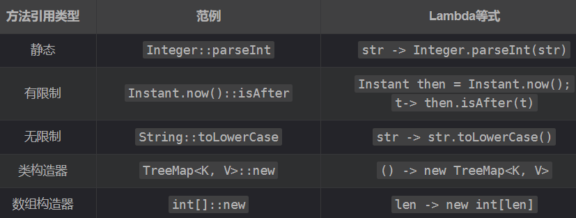
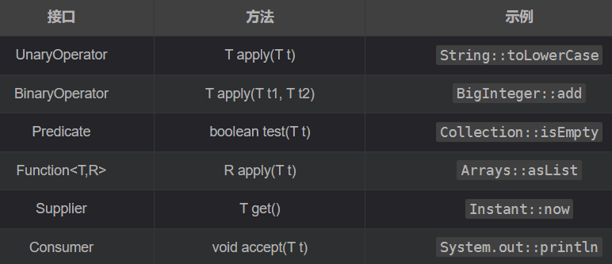

### 创建和销毁对象
#### 静态工厂代替构造器（TODO）
#### 构造函数有多个参数时要考虑使用构建器（TODO）
#### 使用private构造器或枚举类型强化Singleton属性（TODO）
#### 使用private的构造函数强化不可实例化的能力
在编写工具类时，往往这些类是不希望其被实例化出来的，例如：java.lang.Math，一个好的做法就是手动编写一个private的构造函数

```java
public class UtilityClass {
    private UtilityClass() {
        throw new AssertionError();
    }
}
```

因为显式构造器是私有的，所以不可以在类的外部访问它。AssertionError 异常不是严格要求的，但是它可以避免不小心在类的内部调用构造器，保证类在任何情况下都不会被实例化。

缺点：这个类不能被子类化，所有的构造器都必须显式或隐式地调用父类构造器，而在这情况下子类则没有可访问的父类构造器来调用。

#### 引用资源时应优先考虑依赖注入（TODO）
#### 避免创建不必要的对象
1. 创建字符串

```java
String s = new String("abc");
String s = "abc";
```

使用第一种时每次执行都会创建一个新的String实例，而这些都是重复的；第二种会在常量池中取出

2. 静态工厂方法创建对象

优先使用静态工厂方法而不是构造器来避免创建不必要的对象，如：Boolean.valueOf(String)总是要优先于构造器Boolean(String)使用。因为构造器每次被调用都会创建一个新对象，静态工厂不这样

3. 缓存大对象

```java
static boolean isRomanNumeral(String s) {
    return s.matches("^(?=.)M*(C[MD]|D?C{0,3})" + "(X[CL]|L?X{0,3})(I[XV]|V?I{0,3})$");
}
```

使用正则表达式进行匹配时，String.matches方法内部创建了一个Pattern实例，这个实例创建的成本很高，需要将该对象编译成有限状态机，并将其缓存起来

```java
public class RomanNumerals {
    private static final Pattern ROMAN = Pattern.compile(
    	"^(?=.)M*(C[MD]|D?C{0,3})" + 
        "(X[CL]|L?X{0,3})(I[XV]|V?I{0,3})$");
    
    static boolean isRomanNumeral(String s) {
    	return ROMAN.matcher(s).matches();
    }
}
```

4. 适配器（TODO）
5. for循环使用基本类型

```java
private static long sum() {
    Long sum = 0L;
    for (long i = 0; i <= Integer.MAX_VALUE; i++)
    	sum += i;
    return sum;
}
```

sum的类型是Long而不是long，由于装箱会导致程序构造了大约2^31个Long实例，运算速度下降

解决方法：sum类型改为long

#### 消除过期的对象引用
```java
public class Stack {
    private Object[] elements;

    private int size = 0;

    private static final int DEFAULT_INITIAL_CAPACITY = 16;

    public Stack(){
        elements = new Object[DEFAULT_INITIAL_CAPACITY];
    }

    public void push(Object e){
        ensureCapacity();
        elements[size ++] = e;
    }

    public Object pop(){
        if (size == 0)
            throw new EmptyStackException();
        return elements[-- size];
    }

    private void ensureCapacity() {
        if (elements.length == size)
            elements = Arrays.copyOf(elements,  2 * size + 1);
    }
}
```

上述代码中存在着内存泄漏，如果向栈中先添加元素再弹出元素，弹出来的对象不会被回收，因为栈内部维护着弹出对象的过期引用

解决方法：将出栈元素的引用设为过期即可

#### 避免使用终结方法和清除方法（TODO）
#### try-with-resources优先于try-finally
1. 如果有多个资源需要关闭时，代码会非常丑陋

```java
static void copy(String src, String dst) throws IOException {
    InputStream in = new FileInputStream(src);
    try {
        OutputStream out = new FileOutputStream(dst);
        try {
            byte[] buf = new byte[10];
            int n;
            while ((n = in.read(buf)) >= 0)
                out.write(buf, 0, n);
        } finally {
            out.close();
        }
    } finally {
        in.close();
    }
}
```

2. 异常信息会覆盖

```java
static String firstLineOfFile(String path) throws Exception{
    BufferedReader br = new BufferedReader(new FileReader(path));
    try {
        return br.readLine();
    } finally {
        br.close();
    }
}
```

如果底层物理设备异常了，br.readline()会抛出异常，调用close也会出现异常，此时第二个异常会覆盖第一个异常，这会导致调试起来很麻烦

<font style="background-color:#FBDE28;">改用try-with-resources</font>

1. 有多个资源需要被关闭时

```java
static void copy(String src, String dst) throws IOException {
    try (InputStream in = new FileInputStream(src);
         OutputStream out = new FileOutputStream(dst)){
        byte[] buf = new byte[10];
        int n;
        while ((n = in.read(buf)) >= 0)
            out.write(buf, 0, n);
    }
}
```

2. 有方法抛出异常时

```java
static String firstLineOfFile(String path) throws IOException {
    try(BufferedReader br = new BufferedReader(new FileReader(path))) {
        return br.readLine();
    }
}
```

3. 使用catch子句来处理异常

```java
static String firstLineOfFile(String path, String defaultVal) throws IOException {
    try(BufferedReader br = new BufferedReader(new FileReader(path))) {
        return br.readLine();
    } catch (IOException e){
        return defaultVal;
    }
}
```

### 对象通用方法
#### 覆盖equals时要遵守通用约定
1. 自反性：对于任何非空引用x，x.equals(x)必须返回true
2. 对称性：对于任何非空引用x和y，如果当且仅当y.equals(x)返回true，x.equals(y)必须返回true
3. 传递性：对于任何非空引用x、y、z，如果x.equals(y)返回true，y.equals(z)返回true，则x.equals(z)必须返回true
4. 一致性：对于任何非空引用x和y，如果在equals比较中使用的信息没有修改，则x.equals(y)的多次调用必须始终返回true或始终返回false
5. 对于任何非空引用x，x.equals(null)必须返回false

#### 覆盖equals时总要覆盖hashCode
#### 始终要覆盖toString
当对象传递给println、printf、字符串联结操作符+、assert或者被调试器打印出来时，toString方法会被自动调用

在实现toString时，还要决定是否要返回指定的格式，比如对于一般的类而言，使用json格式输出就很直观，但是对于一些特殊的类，比如：电话号码类，它是有自己固定的格式的

#### 谨慎地覆盖clone（TODO）
#### 考虑实现Comparable接口（TODO）
### Lambda和Stream
#### Lambda优先于匿名类
```java
Collections.sort(words, new Comparator<String>() {
	public int compare(String s1, String s2) {
		return Integer.compare(s1.length(), s2.length());
	}
});

Collections.sort(words, (s1, s2) -> Integer.compare(s1.length(), s2.length()));
Collections.sort(words, comparingInt(String::length));
words.sort(comparingInt(String::length));
```

#### 方法引用优先于Lambda


#### 优先使用标准的函数式接口


#### 谨慎使用Stream
Stream适合完成下面工作：

1. 统一转换元素序列
2. 过滤元素序列
3. 使用单个操作组合元素序列（例如：添加、连接或计算最小值）
4. 将元素序列累计到一个集合中，可能通过一些公共属性将它们分组
5. 在元素序列中搜索满足某些条件的元素

#### 优先选择Stream中无副作用的函数
1. toMap
2. groupingBy
3. groupingByConcurrent
4. joining

#### Stream要优先用Collection作为返回值
#### 谨慎使用Stream并行
并行能带来性能收益的应用场景在于ArrayList、HashMap、HashSet和ConcurrentHashMap、数组、int范围和long范围

这些数据结构有共同的特点：

1. 可以精确、轻松地分割成任意大小的子范围
2. 在顺序处理时提供了较好的引用局部性
+ 时间局部性：被引用一次的存储器位置在接下来的时间会经常被引用
+ 空间局部性：被引用一次的存储器位置在接下来的时间内，它旁边的存储位置也会被引用

没有引用局部性，线程会出现闲置，需要等待数据从内存转移到处理器的缓存中

### 方法
#### 检查参数的有效性
当编写方法或构造方法时，都应该考虑其参数有哪些限制，把这些限制写到文档里，并在方法体的开头显式检查

如果没有验证参数的有效性，可能会导致违背失败原子性：

1. 该方法可能在处理过程中失败，可能会出现费解的异常
2. 该方法可以正常返回，会默默地计算出错误的结果
3. 该方法可以正常返回，但是使得某个对象处于受损状态，在将来某个时间点会报错

对于public和protected方法，要用Java文档的@throws注解来说明会抛出哪些异常

```java
/**
* Returns a BigInteger whose value is (this mod m). This method
* differs from the remainder method in that it always returns a
* non-negative BigInteger.
*
* @param m the modulus, which must be positive
* @return this mod m
* @throws ArithmeticException if m is less than or equal to 0
*/
public BigInteger mod(BigInteger m) {
    if (m.signum() <= 0)
    	throw new ArithmeticException("Modulus <= 0: " + m);
    ... // Do the computation
}
```

#### 必要时进行保护性拷贝
#### 谨慎设计方法
1. 谨慎给方法起名

方法名应该选易于理解的，并且与同一个包里其他名称的风格一致，选择大众认可的名称

2. 不要过于追求提供便利的方法

方法太多会使类难以学习、使用、文档化、维护。只有当一项操作被经常用到时，才考虑为它提供快捷方式

3. 避免过长的参数列表，相同类型的长参数序列格外有害
+ 把一个方法分解成多个方法，每个方法只需要这些参数的一个子集
+ 创建辅助类用来保存参数的分组
+ 从对象构建到方法调用全都采用Builder模式
4. 优先使用接口作为入参类型

只要有适合的接口可用来定义参数，就优先使用这个接口，而不是使用实现该接口的类

5. 对于boolean型参数，优先使用有两个元素的枚举

#### 慎用重载
```java
public class CollectionClassifier {
    public static String classify(Set<?> s) {
        return "Set";
    }

    public static String classify(List<?> lst) {
        return "List";
    }

    public static String classify(Collection<?> c) {
        return "Unknown Collection";
    }

    public static void main(String[] args) {
        Collection<?>[] collections = {
                new HashSet<String>(),
                new ArrayList<BigInteger>(),
                new HashMap<String, String>().values()
        };
        for (Collection<?> c : collections)
            System.out.println(classify(c));
    }
}
//结果：
Unknown Collection
Unknown Collection
Unknown Collection
```

```java
class Wine {
    String name() {
        return "wine";
    }
}

class SparklingWine extends Wine {
    @Override
    String name() {
        return "sparkling wine";
    }
}

class Champagne extends SparklingWine {
    @Override
    String name() {
        return "champagne";
    }
}

public class Overriding {
    public static void main(String[] args) {
        List<Wine> wineList = Arrays.asList(
                new Wine(), new SparklingWine(), new Champagne());
        for (Wine wine : wineList)
            System.out.println(wine.name());
    }
}
//结果：
wine
sparkling wine
champagne
```

注意：重载方法是在编译（编译期类型）时做出决定的，重写方法是在运行（运行时类型）时做出决定的

#### 慎用可变参数
#### 返回空的数组或集合，不要返回null
返回长度为0的数组或集合，程序员可能忘记编写特殊情况代码来处理null返回

#### 谨慎返回optional
#### 为所有已公开的API元素写文档注释
