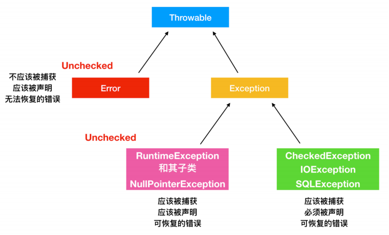
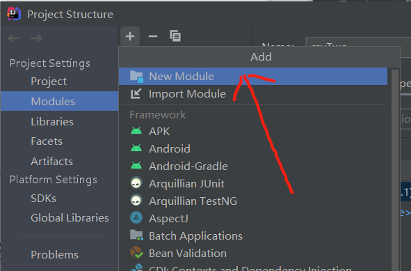
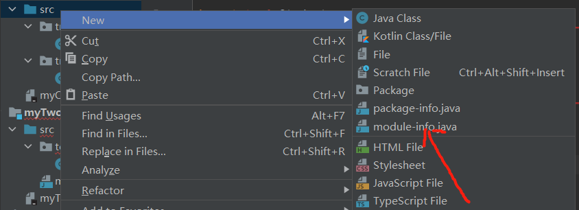

### <font style="color:rgb(51, 51, 51);">接口</font>
1. <font style="color:rgb(51, 51, 51);">接口中的方法会被隐式的指定为：public  abstract</font>
2. <font style="color:rgb(51, 51, 51);">接口中的成员变量会被隐式的指定为：public  static  final</font>

#### 默认方法
public  default  返回值类型  方法名( 参数列表 ){ }

注意：

1. 默认方法不是抽象方法，所以不强制被重写，重写的时候去掉default关键字
2. public可以省略，default不能省略

#### 静态方法
public  static  返回值类型  方法名( 参数列表 ){ }

注意：

1. 静态方法只能通过接口名调用，不能通过实现类名或对象名调用
2. public可以省略，static不能省略

```java
public static void main(String[] args) {
    Test1 test1=new Exp1();
    test1.show1();
    test1.show2();
    test1.show3();
    //test1.show4();不能使用
    Test1.show4();
}
public interface Test1 {
    void show1();
    void show2();
    default void show3() {
        System.out.println("421311");
    }
    static void show4(){
        System.out.println("123");
    }
}
```

#### 私有方法
private  返回值类型  方法名  ( 参数列表 ) { }

private  static  返回值类型  方法名  ( 参数列表 ) { }

注意：

1. 默认方法可以调用私有的静态方法和非静态方法
2. 静态方法只能调用私有的静态方法

```java
public interface Test1 {
    void show1();
    void show2();
    default void show3() {
        System.out.println("421311");
        show6();
        show5();
    }
    static void show4(){
        System.out.println("123");
        show6();
        //show5()不能使用
    }
    private void show5(){
        System.out.println("456");
    }
    private static void show6(){
        System.out.println("789");
    }
}
```

#### 函数式接口
有且仅有一个抽象方法的接口

检测是否为函数式接口：@FunctionalInterface，放在接口定义的上方，如果接口是函数式接口，编译通过，不是则编译失败

@FunctionalInterface是可选的，只要保证满足函数式接口定义的条件，也是函数式接口

```java
@FunctionalInterface
public interface MyInter {
    void show();
}
```

1. 如果方法的参数是一个函数式接口，可以使用Lambda表达式作为参数传递

```java
public static void main(String[] args) {
    startThread(new Runnable() {
        @Override
        public void run() {
            System.out.println(Thread.currentThread().getName()+"启动");
        }
    });
    startThread(()-> System.out.println(Thread.currentThread().getName()+"启动"));
}
private static void startThread(Runnable r){
    new Thread(r).start();
}
```

2. 如果方法的返回值是一个函数式接口，可以使用Lambda表达式作为结果返回

```java
public static void main(String[] args) {
    ArrayList<String>arrayList=new ArrayList<String>();
    arrayList.add("das");
    arrayList.add("fdfs");
    arrayList.add("vcxvv");
    Collections.sort(arrayList,getComparator());
    System.out.println(arrayList);
}
private static Comparator<String> getComparator(){
    /* Comparator<String>comparator=new Comparator<String>() {
            @Override
            public int compare(String o1, String o2) {
                return o1.length()-o2.length();
            }
        };
        return comparator;*/
    /* return new Comparator<String>() {
            @Override
            public int compare(String o1, String o2) {
                return o1.length()-o2.length();
            }
        };*/
    return (s1,s2)->s1.length()-s2.length();
}
```

#### Supplier接口
Supplier<T>：包含一个无参的方法

T  get( )：获得结果

```java
public static void main(String[] args) {
    String s=getString(()->"da");
    System.out.println(s);
    Integer integer=getInteger(()->123);
    System.out.println(integer);
}
private static String getString(Supplier<String> supplier){
    return supplier.get();
}
private static Integer getInteger(Supplier<Integer> supplier){
    return supplier.get();
}
```

#### Consumer接口
Consumer<T>：包含两个方法

1. void  accept( T  t )：对给定的参数执行此操作
2. default  Consumer<T>  andThen( Consumer  after )：返回一个组合的Consumer，依次执行此操作，然后执行after操作

```java
public static void main(String[] args) {
    operatorString("da",s-> System.out.println(s));
    operatorString("da",System.out::println);
    System.out.println("-----------------------");
    operatorString("da",s-> System.out.println(s),s-> System.out.println(new StringBuilder(s).reverse().toString()));
}
private static void operatorString(String s, Consumer<String>consumer){
    consumer.accept(s);
}
private static void operatorString(String s,Consumer<String>consumer,Consumer<String>consumer1){
    /* consumer.accept(s);
        consumer1.accept(s);*/
    consumer.andThen(consumer1).accept(s);
}
```

#### Predicate接口
Predicate<T>：常用的四个方法

1. boolean  test( T  t )：对给定的参数进行判断（判断逻辑由Lambda表达式实现），返回一个布尔值
2. default  Predicate<T>  negate( )：返回一个逻辑的否定，对应逻辑非
3. default  Predicate<T>  and( Predicate  other )：返回一个组合判断，对应短路与
4. default  Predicate<T>  or( Predicate  other )：返回一个组合判断，对应短路或

```java
public static void main(String[] args) {
     boolean cxz = checkString("cxz", s -> s.length() > 8);
     System.out.println(cxz);
     boolean ccxz = checkString("ccxz", s -> s.length() > 3, s -> s.length() < 11);
     System.out.println(ccxz);
}
private static boolean checkString(String s, Predicate<String>predicate){
    //return predicate.test(s);
    return predicate.negate().test(s);
}
private static boolean checkString(String s,Predicate<String>predicate,Predicate<String>predicate1){
    /*boolean test = predicate.test(s);
        boolean test1 = predicate1.test(s);
        return test&&test1;*/
    //return predicate.and(predicate1).test(s);
    return predicate.or(predicate1).test(s);
}
```

#### Function接口
Function<T,R>：常用的两个方法

1. R apply( T  t )：将此函数应用于给定的参数
2. default<V>  Function  andThen( Function  after )：返回一个组合函数，首先将该函数应用于输入，然后将after函数应用于结果

```java
public static void main(String[] args) {
    convert("100",s->Integer.parseInt(s));
    convert("100",Integer::parseInt);
    convert(100,i->String.valueOf(i+100));
    convert("100",s->Integer.parseInt(s),s->String.valueOf(s+100));
}
private static void convert(String s, Function<String,Integer>function){
    Integer apply = function.apply(s);
    System.out.println(apply);
}
private static void convert(int i,Function<Integer,String>function){
    String apply = function.apply(i);
    System.out.println(apply);
}
private static void convert(String s,Function<String,Integer>function,Function<Integer,String>function1){
    /*Integer apply = function.apply(s);
        String apply1 = function1.apply(apply);
        System.out.println(apply1);*/
    String apply = function.andThen(function1).apply(s);
    System.out.println(apply);
}
```

### Lambda表达式
1. ( )：里面没有内容，可以看成是方法形式参数为空
2. ->：用箭头指向后面要做的事情
3. { }：包含一段代码，可以看成是方法体的内容

格式：( 形式参数 ) -> { 代码块 }

```java
 public static void main(String[] args) {
     /* new Thread(new Runnable() {
            @Override
            public void run() {
                System.out.println("123");
            }
        }).start();*/
     new Thread( () -> {
         System.out.println("123");
     }).start();
 }
```

使用前提：

1. 有一个接口
2. 接口中有且仅有一个抽象方法

```java
public static void main(String[] args) {
    Eatable eatable=new EatDemo();
    use(eatable);
    use(new Eatable() {
        @Override
        public void eat() {
            System.out.println("456");
        }
    });
    use( () -> {
        System.out.println("123");
    });
}
private static void use(Eatable eatable){
    eatable.eat();
}


public interface Eatable {
    void eat();
}
public class EatDemo implements Eatable{
    @Override
    public void eat() {
        System.out.println("123");
    }
}
```

```java
public static void main(String[] args) {
    use(new Fly() {
        @Override
        public void fly(String s) {
            System.out.println(s);
        }
    });
    use( (String s)-> {
        System.out.println(s);
    });
}
private static void use(Fly fly){
    fly.fly("小鸟飞");
}


public interface Fly {
    void fly(String s);
}
```

```java
 public static void main(String[] args) {
     use( (int x,int y) -> {
         //return x+y;
         return x-y;
     });
 }
private static void use(Add add){
    System.out.println(add.add(10,20));
}


public interface Add {
    int add(int a,int b);
}
```

注意：

1. 参数的类型可以省略，但是有多个参数的情况下，不能只省略一个
2. 如果参数有且仅有一个，那么小括号可以省略
3. 如果代码块的语句只有一条，可以省略大括号和分号。如果有return，return也要省略

```java
public static void main(String[] args) {
    Runnable r=()-> System.out.println("123");
    new Thread(r).start();
    new Thread(()-> System.out.println("456")).start();
}
private static void use(Inter inter){
    inter.show();
}


public interface Inter {
    void show();
}
```

Lambda表达式与匿名内部类的区别

匿名内部类：

1. 编译之后，产生一个单独的.class字节码文件
2. 可以是接口，也可以是抽象类，还可以是具体类

Lambda表达式：

1. 编译之后，没有一个单独的.class字节码文件，对应的字节码文件会在运行时动态生成
2. 只能是接口

### Stream流
#### 生成方式
default  Stream<E>  stream( )

1. Collection体系的集合可以使用默认方法stream( )生成流
2. Map体系的集合间接的生成流
3. 数组可以通过Stream接口的静态方法of( T...  values )生成流

```java
List<String>list=new ArrayList<String>();
Stream<String> stream = list.stream();

Set<String>set=new HashSet<String>();
Stream<String> stream1 = set.stream();

Map<String,Integer>map=new HashMap<String,Integer>();
Stream<String> stream2 = map.keySet().stream();
Stream<Integer> stream3 = map.values().stream();
Stream<Map.Entry<String, Integer>> stream4 = map.entrySet().stream();

String[] strings={"czx","bc","gdf"};
Stream<String> strings1 = Stream.of(strings);
```

#### 中间操作
1. Stream<T>  filter( Predicate  predicate )：用于对流中的数据进行过滤

```java
public static void main(String[] args) {
    ArrayList<String>list=new ArrayList<String>();
    list.add("12432");
    list.add("456");
    list.add("120");
    list.add("7845");
    list.add("123");
    list.stream().filter(s->s.startsWith("1")).forEach(System.out::println);
}
```

2. Stream<T>  limit( long  maxSize )：返回此流中的元素组成的流，截取前指定参数个数的数据
3. Stream<T>  skip( long  n )：跳过指定参数个数的数据，返回由此流的剩余元素组成的流

```java
public static void main(String[] args) {
    ArrayList<String> list=new ArrayList<String>();
    list.add("12432");
    list.add("456");
    list.add("120");
    list.add("7845");
    list.add("123");
    list.stream().limit(3).forEach(s-> System.out.println(s));
    list.stream().skip(3).forEach(s-> System.out.println(s));
    list.stream().skip(2).limit(2).forEach(s-> System.out.println(s));
}
```

4. static<T>  Stream<T>  concat( Stream  a,Stream  b)：合并a和b两个流为一个流
5. Stream<T>  distinct( )：返回由该流的不同元素（根据Object.equals( Object )）组成的流（去重）

```java
public static void main(String[] args) {
    ArrayList<String> list=new ArrayList<String>();
    list.add("12432");
    list.add("456");
    list.add("120");
    list.add("7845");
    list.add("123");
    Stream<String> s1 = list.stream().limit(3);
    Stream<String> s2 = list.stream().skip(2);
    //Stream.concat(s1,s2).forEach(s-> System.out.println(s));
    Stream.concat(s1,s2).distinct().forEach(System.out::println);
}
```

6. Stream<T>  sorted( )：返回由此流的元素组成的流，根据自然顺序排序
7. Stream<T>  sorted( Comparator  comparator )：返回由该流的元素组成的流，根据提供的Comparator进行排序

```java
public static void main(String[] args) {
    ArrayList<String> list=new ArrayList<String>();
    list.add("12432");
    list.add("456");
    list.add("120");
    list.add("7845");
    list.add("123");
    //list.stream().sorted().forEach(System.out::println);
    //list.stream().sorted((s1,s2)->s1.length()-s2.length()).forEach(System.out::println);
    list.stream().sorted((s1,s2)->{
        int num=s1.length()-s2.length();
        int num1=num==0?s1.compareTo(s2):num;
        return num1;
    }).forEach(System.out::println);
}
```

8. <R>Stream<R>  map( Function  mapper )：返回由给定函数应用于此流的元素的结果组成的流

Function接口中的方法：R  apply ( T  t )

9. IntStream  mapTolnt( TolntFunction  mapper )：返回一个IntStream其中包含将给定函数应用于此流的元素的结果
+ IntStream：表示原始int流
+ ToIntFunction接口中方法：int  applyAsInt( T  value )

```java
public static void main(String[] args) {
    ArrayList<String>arrayList=new ArrayList<String>();
    arrayList.add("10");
    arrayList.add("20");
    arrayList.add("30");
    arrayList.add("40");
    arrayList.add("50");
    //arrayList.stream().map(s->Integer.parseInt(s)).forEach(System.out::println);
    //arrayList.stream().map(Integer::parseInt).forEach(System.out::println);
    //arrayList.stream().mapToInt(Integer::parseInt).forEach(System.out::println);
    int sum = arrayList.stream().mapToInt(Integer::parseInt).sum();
    System.out.println(sum);
}
```

#### 终结操作方法
void  forEach( Consumer  action )：对此流的每个元素执行操作

1. Consumer接口中的方法：void  accept( T  t )：对给定的参数执行此操作
2. long  count( )：返回此流中的元素数

```java
public static void main(String[] args) {
    ArrayList<String> list=new ArrayList<String>();
    list.add("12432");
    list.add("456");
    list.add("120");
    list.add("7845");
    list.add("123");
    //list.stream().forEach(System.out::println);
    long count = list.stream().filter(s -> s.startsWith("1")).count();
    System.out.println(count);
}
```

#### 收集操作
R  collect( Collector  collector )

1. public  static  <T>  Collector  toList( )：把元素收集到List集合
2. public  static  <T>  Collector  toSet( )：把元素收集到Set集合
3. public  static  Collector  toMap( Function  keyMapper , Function  valueMapper )：把元素收集到Map集合

```java
public static void main(String[] args) {
    ArrayList<String> list=new ArrayList<String>();
    list.add("12432");
    list.add("456");
    list.add("120");
    list.add("7845");
    list.add("123");
    Stream<String> stringStream = list.stream().filter(s -> s.length() == 3);
    List<String> collect = stringStream.collect(Collectors.toList());
    for (String s:collect){
        System.out.println(s);
    }

    Set<Integer>set=new HashSet<Integer>();
    set.add(10);
    set.add(20);
    set.add(30);
    set.add(40);
    set.add(50);
    Stream<Integer> integerStream = set.stream().filter(s -> s > 25);
    Set<Integer> collect1 = integerStream.collect(Collectors.toSet());
    for (Integer a:collect1){
        System.out.println(a);
    }
}
```

### 方法引用
#### 引用类方法
类名::静态方法

```java
public static void main(String[] args) {
    use(s-> Integer.parseInt(s));
    use(Integer::parseInt);
}
private static void use(Test3 test3){
    int num= test3.show("123");
    System.out.println(num);
}

public interface Test3 {
    int show(String i);
}
```

#### 引用对象的实例方法
对象::成员方法

```java
public static void main(String[] args) {
    use(s-> System.out.println(s.toUpperCase()));
    Exp6 exp6=new Exp6();
    use(exp6::Upper);
}
private static void use(Test4 test4){
    test4.show("dasf");
}


public interface Test4 {
    void show(String s);
}
public class Exp6 {
    public void Upper(String s){
        System.out.println(s.toUpperCase());
    }
}
```

#### 引用类的实例方法
类名::成员方法

Lambda表达式被类的实例方法替代的时候：第一个参数作为调用者，后面的参数全部传递给该方法作为参数

```java
public static void main(String[] args) {
    use( (s,a,b)->s.substring(a,b));
    use(String::substring);
}
private static void use(Test5 test5){
    String s = test5.mySubstring("123456789", 2, 6);
    System.out.println(s);
}

public interface Test5 {
    String mySubstring(String s,int a,int b);
}
```

#### 引用构造器
类名::new

```java
public class Student {
    private String name;
    private int age;
    public Student(String name, int age) {
        this.name = name;
        this.age = age;
    }
    public String getName() {
        return name;
    }
    public void setName(String name) {
        this.name = name;
    }
    public int getAge() {
        return age;
    }
    public void setAge(int age) {
        this.age = age;
    }
}


public interface Test {
    Student build(String name,int age);
}


public static void main(String[] args) {
    use( (name, age) -> new Student(name,age));
    use(Student::new);
}
private static void use(Test test){
    Student da = test.build("da", 13);
    System.out.println(da.getName()+" "+ da.getAge());
}
```

### 泛型
#### 使用方法
```java
public class Exp1 <T>{
    private T name;
    private T age;

    public Exp1() {
    }

    public T getName() {
        return name;
    }

    public void setName(T name) {
        this.name = name;
    }

    public T getAge() {
        return age;
    }

    public void setAge(T age) {
        this.age = age;
    }

    public Exp1(T name, T age) {
        this.name = name;
        this.age = age;
    }
    public void show(T t){
        System.out.println(t);
    }
    public <T> void show1(T t){
        System.out.println(t);
    }
}


public class Exp2 {
    public static void main(String[] args) {
        Exp1<String>exp1=new Exp1<String>();
        exp1.setName("12");
        System.out.println(exp1.getName());
        Exp1<Integer>exp11=new Exp1<Integer>();
        exp11.setAge(23);
        System.out.println(exp11.getAge());

        Exp1<String>exp12=new Exp1<String>();
        exp12.show("231");
        Exp1<Integer>exp13=new Exp1<Integer>();
        exp13.show(23);

        Exp1 exp14=new Exp1();
        exp14.show1(23);
        exp14.show1("56");
        exp14.show1(true);
        exp14.show1(12.32);
    }
}
```

#### 泛型通配符
类型通配符使用？表示，它的元素类型可以匹配任何类型

1. 上界通配符：<? extends ClassType>该通配符为ClassType的所有子类型。它表示的是任何类型都是ClassType类型的子类
2. 下界通配符：<? super ClassType>该通配符为ClassType的所有超类型。它表示的是任何类型的父类都是ClassType

```java
public static void main(String[] args){
    List<String> name=new ArrayList<String>();
    List<Integer> age=new ArrayList<Integer>();
    List<Number> number=new ArrayList<Number>();
    name.add("hello");
    age.add(12);
    number.add(312);
    generic(name);
    generic(age);
    generic(number);
}

public static void generic(List<?> data){
    System.out.println("Test cxun: "+data.get(0));
}
```

#### 泛型数组列表
1. 如果没有使用var关键字，可以省去右边的类型参数：ArrayList<Employee>staff=new  ArrayList<>();
2. 如果使用var声明ArrayList，就不要使用菱形语法：var  staff=new  ArrayList<Employee>();

注意：

1. ArrayList比Vector更加高效
2. 将一个原始ArrayList赋给一个类型化ArrayList会得到一个警告，使用强制类型转换不能避免警告
3. 尖括号的类型不能是基本类型，只能是Integer等包装器

#### 装箱、拆箱
1. 向ArrayList<Integer>添加int型的元素，list.add(3)会自动地变换成list.add(Integer.valueOf(3))，这种变换称为自动装箱
2. 当将一个Integer对象赋给一个int值时，将会自动地拆箱，如：int  n=list.get(i)会变换成int  n=list.get(i).intValue();

注意：

1. ==运算符可以应用于包装器对象，不过检测的是对象是否有相同的内存位置，如下面的比较通常会失败，在比较两个包装器对象时要使用equals方法
2. 自动装箱规范要求boolean、byte、char<=127，介于-128和127之间的short和int被包装到固定的对象中

```java
Integer  a=1000;
Integer  b=1000;
if(a==b)
```

### 异常
由编程错误导致的异常属于RuntimeException；如果程序本身没有问题，但由于像I/O错误这类问题导致的问题属于其他异常

派生于RuntimeException的异常包括以下问题：

1. 错误的强制类型转换
2. 数组访问越界
3. 访问null指针

不是派生于RuntimeException的异常包括：

1. 试图超越文件末尾继续读取数据
2. 试图打开一个不存在的文件
3. 试图根据给定的字符串查找class对象，而这个字符串表示的类并不存在

Java语言规范将派生于Error类或RuntimeException类的所有异常称为非检查型，其他的异常称为检查型异常



```java
//返回抛出异常的详细信息
public String getMessage();
public String getLoaclizedMessage();

//返回异常发生时的简要描述
public String toString();

//打印异常信息到标准输出流上
public void printStackTrace();
public void printStackTrace(PrintStream s);
public void printStackTrace(PrintWriter s);

//记录栈帧的当前状态
public synchronized Throwable fillInStackTrace();
```

#### 注意事项
1. 如果在子类中覆盖了超类的一个方法，子类方法中声明的检查型异常不能比超类方法中声明的异常更通用；如果超类方法没有抛出任何检查型异常，子类也不能抛出任何检查型异常
2. 捕获多个异常时，异常常量隐含为final变量
3. 当finally字句包含return语句时，有可能产生意想不到的结果。假设利用return语句从try语句块中间退出。在方法返回前，会执行finally语句块。如果finally块也有一个return语句，这个返回值将会遮蔽原来的返回值

#### 复制文件的异常处理
```java
private static void method(){
    try (FileWriter fileWriter=new FileWriter("d:\\test\\15.txt");
         FileReader fileReader=new FileReader(("d:\\test\\2.txt"))){
        char[] chars=new char[1024];
        int len;
        while ((len= fileReader.read())!=-1){
            fileWriter.write(chars,0,len);
        }
    }catch (IOException e){
        e.printStackTrace();
    }
}
//自动释放资源
private static void method1() throws IOException {
    FileWriter fileWriter=new FileWriter("d:\\test\\15.txt");
    FileReader fileReader=new FileReader(("d:\\test\\2.txt"));
    try (fileReader;fileWriter){
        char[] chars=new char[1024];
        int len;
        while ((len= fileReader.read())!=-1){
            fileWriter.write(chars,0,len);
        }
    }catch (IOException e){
        e.printStackTrace();
    }
}
//自动释放资源
private static void method2(){
    FileWriter fileWriter=null;
    FileReader fileReader=null;
    try {
        fileReader=new FileReader("d:\\test\\2.txt");
        fileWriter=new FileWriter("d:\\test\\15.txt");
        char[] chars=new char[1024];
        int len;
        while ((len= fileReader.read(chars))!=-1){
            fileWriter.write(chars,0,len);
        }
    }catch (IOException e){
        e.printStackTrace();
    }finally {
        try {
            fileWriter.close();
        } catch (IOException e) {
            e.printStackTrace();
        }
        try {
            fileReader.close();
        } catch (IOException e) {
            e.printStackTrace();
        }
    }
}
private static void method3()throws IOException{
    FileWriter fileWriter=new FileWriter("d:\\test\\15.txt");
    FileReader fileReader=new FileReader(("d:\\test\\2.txt"));
    char[] chars=new char[1024];
    int len;
    while ((len= fileReader.read())!=-1){
        fileWriter.write(chars,0,len);
    }
    fileWriter.close();
    fileReader.close();
}
```

### 枚举类
枚举类使用enum定义后在编译后继承了java.lang.Enum类，而不是普通地继承Object类，enum声明类继承了Serializable和Comparable两个接口，且采用enum声明后，该类会被编译器加上final声明（同String），故该类是无法继承的

#### 自定义实现枚举类
1. 对象属性，用private final修饰
2. 构造器私有化，private修饰
3. 对象在类中创建完成，public static final修饰
4. 可以存在其他的方法，如：对象属性的getter方法、toString方法等

```java
public class Season {
    //1.私有化属性
    private final String seasonName;
    private final String seasonDesc;
    //2.私有化构造器
    private Season(String seasonName, String seasonDesc) {
        this.seasonName = seasonName;
        this.seasonDesc = seasonDesc;
    }
    //3.声明四个对象 春夏秋冬
    public static final Season SPRING = new Season("春天","春暖花开");
    public static final Season SUMMER = new Season("夏天","烈日炎炎");
    public static final Season AUTUMN = new Season("秋天","秋高气爽");
    public static final Season WINTER = new Season("冬天","白雪皑皑");

    //4.其他方法1： 对象属性的getter方法，此时无setter方法的
    public String getSeasonName() {
        return seasonName;
    }
    public String getSeasonDesc() {
        return seasonDesc;
    }

    //4.其他方法2： toString()方法
    @Override
    public String toString() {
        return "Season{" +
                "seasonName='" + seasonName + '\'' +
                ", seasonDesc='" + seasonDesc + '\'' +
                '}';
    }
}
```

```java
public class Application {
    public static void main(String[] args) {
        // 正常使用自定义的枚举类
        Season spring = Season.SPRING;
        System.out.println(spring); // 默认调用toString方法
        System.out.println(spring.getSeasonName()); // 正常调用方法
        System.out.println("=========================");
    }
}
```

#### 使用enum关键字定义枚举类
1. 使用enum关键字代替class
2. 类的枚举对象必须在类的最开始定义
3. 有多个对象时，对象之间用英文的逗号隔开，在最后一个对象的后面用英文分号结束
4. 属性仍然用private final进行修饰
5. 构造方法仍然用private修饰
6. 可以写其他的方法：getter、重写toString()等
7. 声明枚举对象时的格式为：
+ 枚举对象名称1，枚举对象名称2.....
+ 枚举对象名称1(构造方法参数.....)，枚举对象名称2(构造方法参数......)

```java
public enum Week {
    // 枚举对象
    MONDAY ("星期一","上一天的语文课"),
    TUESDAY ("星期二","上一天的数学课"),
    WEDNESDAY ("星期三","上一天的英语课"),
    THURSDAY ("星期四","上一天的物理课"),
    FRIDAY ("星期五","上一天的化学课"),
    SATURDAY ("星期六","上一天的生物课"),
    SUNDAY ("星期日","上一天的自习课");

    //声明属性
    private final String weekName;
    private final String weekDesc;
    //构造方法
    Week(String weekName, String weekDesc) {
        this.weekName = weekName;
        this.weekDesc = weekDesc;
    }

    // 其他方法：getter方法，toString()方法等
    public String getWeekName() {
        return weekName;
    }

    public String getWeekDesc() {
        return weekDesc;
    }

    @Override
    public String toString() {
        return "Week{" +
                "weekName='" + weekName + '\'' +
                ", weekDesc='" + weekDesc + '\'' +
                '}';
    }
}
```

```java
/**
* 直接放上枚举对象的枚举类，
* 十分的简洁明了。
*/
public enum WeekSimple {
    MONDAY,TUESDAY,WEDNESDAY,THURSDAY,FRIDAY,SATURDAY,SUM;
}
```

### 模块
#### 创建模块


#### 创建描述性文件
在模块的src目录下新建一个名为module-info.java的描述性文件



#### 模块导出格式
exports  包名

```java
module myOne {
    exports try1;
}
```

#### 模块依赖格式
requires  模块名

```java
module myTwo {
    requires myOne;//按住alt+enter
}
//注意包名要不相同
```

#### 服务提供
provides  接口名  with  类名

```java
module myOne {
    exports try1;
    exports try2;

    provides MyService with Exp1;
}
```

```java
public class Exp1 implements MyService{
    @Override
    public void service() {
        System.out.println("123");
    }
}
```

```java
public interface MyService {
    void service();
}
```

#### 声明服务接口
uses  接口名

```java
module myTwo {
    requires myOne;

    uses MyService;
}
```

#### 加载服务工具
ServiceLoader

```java
public static void main(String[] args) {
    ServiceLoader<MyService> load = ServiceLoader.load(MyService.class);
    //遍历服务
    for (MyService myService:load){
        myService.service();
    }
}
```

### IO流
#### ZipInputStream（解压流）
```java
/**
 * 提供给用户使用的解压工具
 * @param srcPath
 * @param outPath
 * @throws IOException
 */
public static void decompressionFile(String srcPath, String outPath) throws IOException {
    //简单判断解压路径是否合法
    if (!new File(srcPath).isDirectory()) {
        //判断输出路径是否合法
        if (new File(outPath).isDirectory()) {
            if (!outPath.endsWith(File.separator)) {
                outPath += File.separator;
            }
            //zip读取压缩文件
            FileInputStream fileInputStream = new FileInputStream(srcPath);
            ZipInputStream zipInputStream = new ZipInputStream(fileInputStream);
            //解压文件
            decompressionFile(outPath, zipInputStream);
            //关闭流
            zipInputStream.close();
            fileInputStream.close();
        } else {
            throw new RuntimeException("输出路径不合法!");
        }
    } else {
        throw new RuntimeException("需要解压的文件不合法!");
    }
}

/**
 * ZipInputStream是逐个目录进行读取，所以只需要循环
 * @param outPath
 * @param inputStream
 * @throws IOException
 */
private static void decompressionFile(String outPath, ZipInputStream inputStream) throws IOException {
    //读取一个目录
    ZipEntry nextEntry = inputStream.getNextEntry();
    //不为空进入循环
    while (nextEntry != null) {
        String name = nextEntry.getName();
        File file = new File(outPath+name);
        //如果是目录，创建目录
        if (name.endsWith("/")) {
            file.mkdir();
        } else {
            //文件则写入具体的路径中
            FileOutputStream fileOutputStream = new FileOutputStream(file);
            BufferedOutputStream bufferedOutputStream = new BufferedOutputStream(fileOutputStream);
            int n;
            byte[] bytes = new byte[1024];
            while ((n = inputStream.read(bytes)) != -1) {
                bufferedOutputStream.write(bytes, 0, n);
            }
            //关闭流
            bufferedOutputStream.close();
            fileOutputStream.close();
        }
        //关闭当前布姆
        inputStream.closeEntry();
        //读取下一个目录，作为循环条件
        nextEntry = inputStream.getNextEntry();
    }
}
```

### 反射
#### 类加载器
<font style="background-color:#FADB14;">ClassLoader：负责加载类的对象</font>

ClassLoader中的两个方法：

1. static ClassLoader getSystemClassLoader()：返回用于委派的系统类加载器
2. ClassLoader getParent()：返回父类加载器进行委派

Java运行时具有以下内置类加载器：

1. Bootstrap class loader：虚拟机的内置类加载器，通常表示为null，并且没有父加载器
2. Platform class loader：平台类加载器可以看到所有平台类，平台类包括由平台类加载器或其祖先定义的Java  SE平台API，其实现类和JDK特定的运行时类
3. System class loader：应用程序类加载器，系统类加载器通常用于定义应用程序类路径，模块路径和JDK特定工具上的类

类加载器的继承关系：System的父加载器为Platform，而Platform的父加载器为Bootstrap

```java
public static void main(String[] args) {
    ClassLoader systemClassLoader = ClassLoader.getSystemClassLoader();
    System.out.println(systemClassLoader);

    ClassLoader parent = systemClassLoader.getParent();
    System.out.println(parent);

    ClassLoader parent1 = parent.getParent();
    System.out.println(parent1);
}
```

#### 获取Class对象的方式
1. Class.forName("全类名")：将字节码文件加载进内存，返回class对象
2. 类型.class：通过类名的属性class获取
3. 对象.getClass()：getClass()方法在Object类中定义
4. 类型.TYPE

```java
package com.reflect;

public class Test02 {
    public static void main(String[] args) throws ClassNotFoundException {
        Person person=new Student();
        Class aClass = person.getClass();
        System.out.println(aClass);

        Class aClass1 = Class.forName("com.reflect.Student");
        System.out.println(aClass1);

        Class aClass2 = Student.class;
        System.out.println(aClass2);

        System.out.println(aClass==aClass1);
        System.out.println(aClass==aClass2);

        Class type = Integer.TYPE;
        System.out.println(type);
        
        Class integerClass = Integer.class;
        System.out.println(integerClass);
    }
}

@Data
class Person{
    public String name;
}

class Student extends Person{
    public Student(){
        this.name="学生";
    }
}

class Teacher extends Person{
    public Teacher(){
        this.name="老师";
    }
}
```

<font style="background-color:#FADB14;">结论：同一个字节码文件（*.class）在一次程序运行过程中，只会被加载一次，不论通过哪一种方式获取的Class对象都是同一个</font>

```java
//只要元素类型与维度一样，就是同一个class
int[] a=new int[10];
int[] b=new int[100];
System.out.println(a.getClass().hashCode());
System.out.println(b.getClass().hashCode());
```

#### 获取成员变量
```java
@Data
public class Person {
    private String name;
    private int age;
    public int a;
    public String b;

    public Person() {
    }
    
    public Person(String name, int age) {
        this.name = name;
        this.age = age;
    }

    public void eat(){
        System.out.println("吃");
    }
    public void eat(String s){
        System.out.println("吃"+s);
    }
}
```

Field：成员变量

1. Field[]  getFields()：获取所有public修饰的成员变量
2. Field  getField(String name)：获取指定名称的public修饰的成员变量
3. Field[]  getDeclaredFields()：获取所有的成员变量，不考虑修饰符
4. Field  getDeclaredField(String name)：获取指定名称的成员变量，不考虑修饰符
5. void  set(Object  obj，Object  value)：设置值
6. get(Object  obj)：获取值
7. setAccessible(true)：暴力反射（忽略访问权限修饰符的安全检查）

```java
public static void main(String[] args) throws NoSuchFieldException, IllegalAccessException {
    Class personClass = Person.class;
    Field[] fields = personClass.getFields();
    for (Field field:fields){
        System.out.println(field);
    }
    System.out.println("-------------");

    Field a = personClass.getField("a");
    System.out.println(a);
    Person person=new Person();
    Object o = a.get(person);
    System.out.println(o);
    
    a.set(person,12);
    System.out.println(person);
    System.out.println("-------------");

    Field[] declaredFields = personClass.getDeclaredFields();
    for (Field field:declaredFields){
        System.out.println(field);
    }
    System.out.println("-------------");

    Field a1 = personClass.getDeclaredField("a");
    a1.setAccessible(true);
    Object o1 = a1.get(person);
    System.out.println(o1);
}
```

#### 获取构造方法
Constructor：构造方法

1. Constructor<?>[]  getConstructors()
2. Constructor<T>  getConstructor(类<?>...  parameterTypes)
3. Constructor<T>  getDeclaredConstructor(类<?>...  parameterTypes)
4. Constructor<?>[]  getDeclaredConstructors()

#### 创建对象
T  newInstance(Object...  initargs)

如果使用空参数构造方法创建对象，操作可以简化：Class对象.newInstance()

```java
public static void main(String[] args) throws NoSuchMethodException, InvocationTargetException, InstantiationException, IllegalAccessException {
    Class personClass = Person.class;
    Constructor constructor = personClass.getConstructor(String.class, int.class);
    System.out.println(constructor);
    
    Object dad = constructor.newInstance("dad", 12);
    System.out.println(dad);
    System.out.println("---------------");

    Constructor constructor1 = personClass.getConstructor();
    System.out.println(constructor1);
    
    Object dad1 = constructor1.newInstance();
    System.out.println(dad1);
    System.out.println("----------------");

    Object o = personClass.newInstance();
    System.out.println(o);
}
```

#### 获取成员方法
Method：方法对象

1. Method[]  getMethods()：获取所有public修饰的方法
2. Method  getMethod(String name,类<?>...  parameterTypes)
3. Method[]  getDeclaredMethods()
4. Method  getDeclaredMethod(String name,类<?>...  parameterTypes)

#### 执行方法
Object  invoke(Object  obj，Object...  args)

#### 获取方法名称
String  getName()

```java
public static void main(String[] args) throws NoSuchMethodException, InvocationTargetException, IllegalAccessException {
    Class personClass = Person.class;
    Method method = personClass.getMethod("eat");
    System.out.println(method);
    
    Person person=new Person();
    method.invoke(person);
    
    Method eat = personClass.getMethod("eat", String.class);
    eat.invoke(person,"饭");
    System.out.println("------------------");

    Method[] methods = personClass.getMethods();
    for (Method method1:methods){
        System.out.println(method1);
        String name = method1.getName();
        System.out.println(name);
    }
    
    System.out.println("------------------");
    String name = personClass.getName();
    System.out.println(name);
}
```

#### 获取类名
1. String  getName()：获取包名+类名
2. String  getSimpleName()：获取类名

```java
package com.reflect;

public class Test06 {
    public static void main(String[] args) throws ClassNotFoundException {
        Class aClass = Class.forName("com.reflect.Person");
        //获取包名+类名
        System.out.println(aClass.getName());
        //获取类名
        System.out.println(aClass.getSimpleName());
    }
}
```

#### 反射效率
```java
public class Test07 {
    public static void test01(){
        User user=new User();
        long start = System.currentTimeMillis();
        for (int i = 0; i < 100000000; i++) {
            user.getName();
        }
        long end=System.currentTimeMillis();
        System.out.println(end-start);
    }

    public static void test02() throws NoSuchMethodException, InvocationTargetException, IllegalAccessException {
        User user=new User();
        Class aClass = user.getClass();
        Method getName = aClass.getDeclaredMethod("getName", null);
        long start = System.currentTimeMillis();
        for (int i = 0; i < 100000000; i++) {
            getName.invoke(user,null);
        }
        long end=System.currentTimeMillis();
        System.out.println(end-start);
    }

    public static void test03() throws NoSuchMethodException, InvocationTargetException, IllegalAccessException {
        User user=new User();
        Class aClass = user.getClass();
        Method getName = aClass.getDeclaredMethod("getName", null);
        getName.setAccessible(true);
        long start = System.currentTimeMillis();
        for (int i = 0; i < 100000000; i++) {
            getName.invoke(user,null);
        }
        long end=System.currentTimeMillis();
        System.out.println(end-start);
    }

    public static void main(String[] args) throws InvocationTargetException, NoSuchMethodException, IllegalAccessException {
        test01();
        test02();
        test03();
    }
}
```

<font style="background-color:#FADB14;">注意：设置setAccessible()能使加快速率</font>

#### 获取父类类型
```java
Class aClass1 = Class.forName("com.reflect.Student");
System.out.println(aClass1);

Class superclass = aClass1.getSuperclass();
System.out.println(superclass);
```

注意：

1. .getClass().getResource(fileName)：表示只会在当前调用类所在的同一路径下查找该fileName文件
2. .getClass().getClassLoader().getResource(fileName)：表示只会在根目录下（/）查找该文件
3. fileName如果前面加“/”，如“/fileName”，则表示绝对路径，取/目录下的该文件；
4. fileName如果前面没有加“/”，如“fileName”，则表示相对路径，取与调用类同一路径下的该文件
5. 如果路径中包含包名，getClass().getResource("com/xxx/1.xml");包名的层级使用“/”隔开，而非“.”

#### getGenericSuperClass
从一个Class对象中，获取该对象父类接收到的参数化类型（泛型）

```java
public class Student extends Person<Integer, Boolean> {

	@SuppressWarnings("rawtypes")
	public static void main(String[] args) {
		Student student = new Student();
		Class clazz = student.getClass();
		System.out.println("获取父类对象：" + clazz.getSuperclass());
		/**
		 * getGenericSuperclass()获得带有泛型的父类
         * Type是 Java 编程语言中所有类型的公共高级接口。它们包括原始类型、参数化类型、数组类型、类型变量和基本类型。
		 */
		Type type = clazz.getGenericSuperclass();
		System.out.println(type);
		
		//ParameterizedType参数化类型，即泛型
		ParameterizedType p = (ParameterizedType)type;
		//getActualTypeArguments获取参数化类型的数组，泛型可能有多个
		Class c1 = (Class)p.getActualTypeArguments()[0];
		System.out.println(c1);
		Class c2 = (Class)p.getActualTypeArguments()[1];
		System.out.println(c2);
	}

class Person<T,T>{
}

/**
 * 运行结果：
 * 获取父类对象：class com.mycode.test.Person
 * com.mycode.test.Person<java.lang.Integer, java.lang.Boolean>
 * class java.lang.Integer
 * class java.lang.Boolean
 */
```

