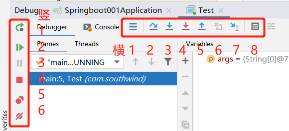
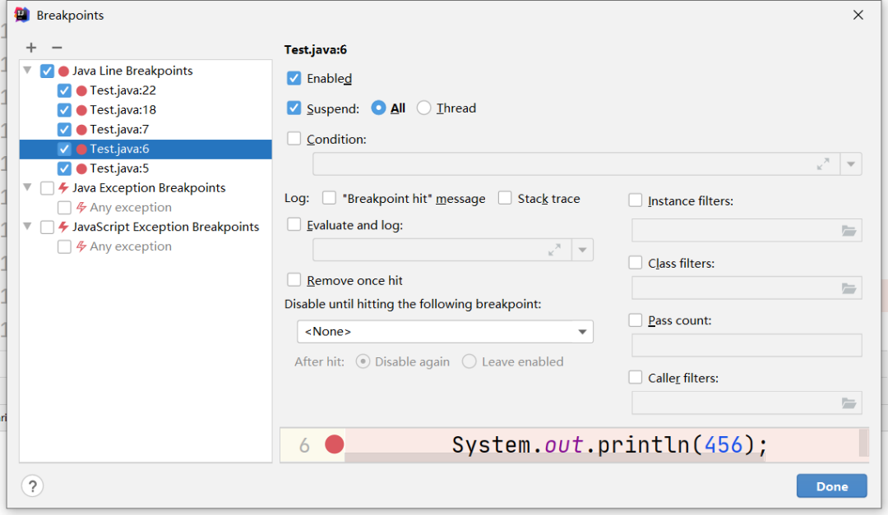
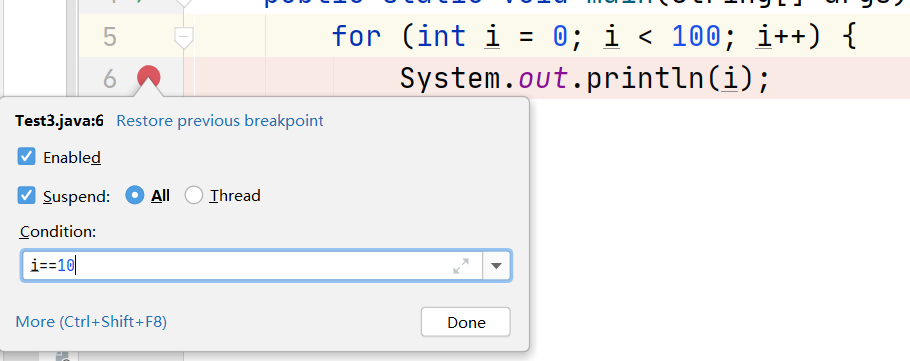
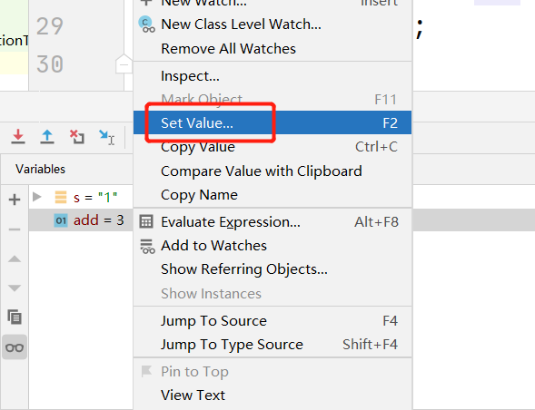
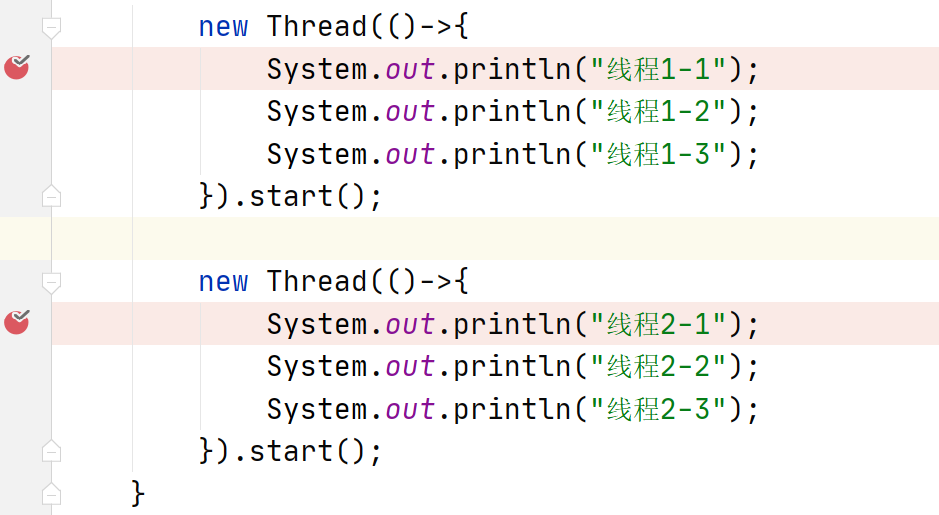
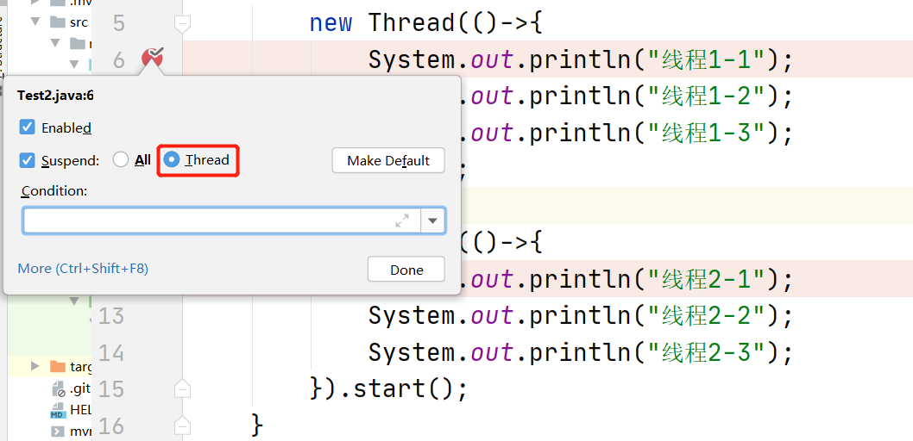

### IDEA
#### 控制台语句
1. psvm+Tab键/main+Tab键：public static void main(String[] args)
2. sout+Tab键：System.out.println()
3. souf+Tab键：System.out.printf()
4. soutm+Tab键：System.out.println(类名.方法名)
5. soutp+Tab键：System.out.println(所有方法参数名+值)

#### 查找
1. Ctrl+F：在当前文件进行文本查找
2. Ctrl+R：在当前文件进行文本替换
3. Shift+Ctrl+F：在项目进行文本查找
4. Shift+Ctrl+R：在项目进行文本替换
5. Shift+Shift：快速搜索
6. Ctrl+N：查找class
7. Ctrl+Shift+N：查找工作空间的文件
8. Ctrl+Shift+Alt+N：查找symbol（查找某个方法名）

#### 跳转切换
1. Ctrl+E：最近文件
2. Ctrl+Tab：切换文件
3. Alt+左箭头/右箭头：左/右窗口移动
4. Ctrl+Alt+左箭头/右箭头：回退/前进上一个操作位置
5. Ctrl+G：切换到类的某一行
6. Alt+1：代码区和Project窗口切换

#### 类操作
1. Ctrl+H：查看类或接口的继承关系
2. Ctrl+Alt+U：查看类的继承关系图
3. Shift+Ctrl+Alt+U：查看类的继承关系图

#### 其他
1. Ctrl+X：删除当前行
2. Ctrl+D：复制当前行
3. Alt+Insert（或右键Generate）：生成代码（如get、set方法，构造函数等）或生成包类
4. Ctrl+Alt+T：生成try catch（或者Alt+enter选择）
5. Ctrl+shift+U：实现大小写之间的转换
6. ALT+回车：导入包，自动修正
7. Ctrl+Alt+L：格式化代码
8. Ctrl+Alt+O：删除无用包
9. Ctrl+Alt+I：自动缩进
10. Ctrl+Shift+R：在当前项目中替换指定内容
11. Ctrl+P：显示方法参数信息
12. Ctrl+Alt+v：抽取变量
13. Ctrl+Alt+m：抽取方法
14. Shift+上/下箭头：选中多行
15. Alt+Shift+上/下箭头：移动一行代码
16. Alt+Enter：提示可能的操作
17. Shift+F6：重命名类、方法、字段等（全局）
18. Shift+Ctrl+Alt+C：复制方法的全路径
19. Shift+Ctrl+Alt+V：粘贴方法的全路径
20. Ctrl+J：自动生成代码

### Debug
#### 基本按钮

1. 横 1：从其他界面回到当前断点界面光标处。
2. 横 2：从断点处开始，逐行执行代码，如果遇到方法，直接跳过。
3. 横 3：从断点处开始，逐行执行代码，如果遇到方法，会进入方法，但是只能进入自定义方法，不会进入官方类库的方法。
4. 横 4：从断点处开始，逐行执行代码，如果遇到方法，会进入方法，适用于所有方法。
5. 横 5：从当前断点处回退，回到方法的调用处。
6. 横 6：回退断点，回到上一个断点处，与横 5 的区别在于，它会回到上一个方法的断点中，而横 5 只会回到上一个方法的调用处，并不会进入方法。
7. 横 7：回到断点光标处，与横 1 的区别在于，它会继续往后执行一行代码。
8. 横 8：计算表达式，在 debug 模式中，可以直接输入当前类中的任意一个方法，直接进行运算，输出结果，如下图所示。

1. 竖 1：重新运行程序，进入 debug 模式。
2. 竖 2：执行程序，但不是逐行执行，而是跳转到下一个断点处。
3. 竖 3：暂停断点，这个基本用不到。
4. 竖 4：终止程序的运行。
5. 竖 5：显示所有断点，如下图所示。

6. 竖 6：让所有断点失效，debug 不再进入断点，要恢复断点，再次点击此按钮即可。

#### 设置断点条件

#### 动态修改变量的值

设置为6，可以看到控制台输出的就是 6。当然，这只是临时的修改，下一次程序运行，结果仍然是 3。

#### 多线程断点调试

