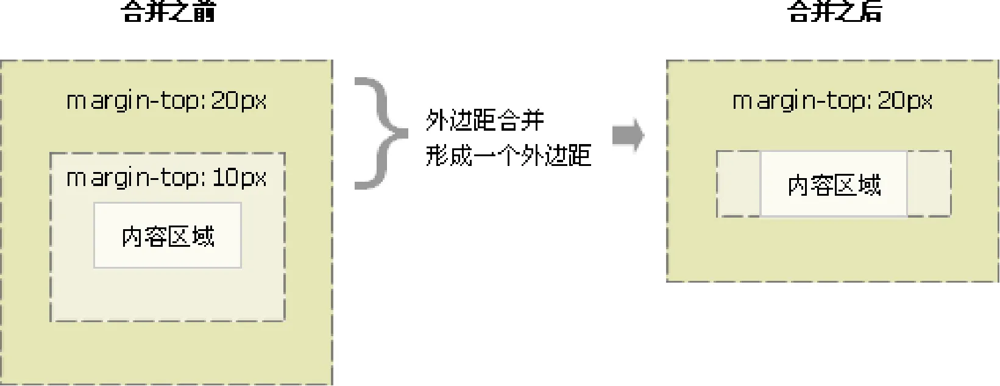

## 文档流
网页是一个多层的结构，一层摁着一层，通过 CSS 可以分别为每一层来设置样式，作为用户来讲只能看到最顶上一层。这些层中，最底下的一层称为文档流。文档流是网页的基础，我们所创建的元素默认都是在文档流中进行排列

对于我们来说元素主要有两个状态：

1. 在文档流中
2. 不在文档流中（脱离文档流）

### 块元素
1. 块元素会在页面中独占一行
2. 默认宽度是父元素的全部（会把父元素撑满）
3. 默认高度是被内容撑开（子元素）

### 行内元素
1. 行内元素不会独占页面的一行，只占自身的大小
2. 行内元素在页面中左向右水平排列（书写习惯一致）
3. 如果一行之中不能容纳下所有的行内元素，则元素会换到第二行继续自左向右排列
4. 行内元素的默认宽度和高度都是被内容撑开

### 行内块元素
1. 它们同时具有块元素和行内元素的特点
2. 和相邻行内元素（行内块）在一行上，但是他们之间会有空白缝隙
3. 一行可以显示多个（行内元素特点）
4. 默认宽度就是它本身内容的宽度（行内元素特点）
5. 高度，行高、外边距以及内边距都可以控制（块级元素特点）

### 模式转换
1. 转换为块元素：`display: block;`
2. 转换为行内元素：`display: inline;`
3. 转换为行内块：`display: inline-block;`

## 盒子模型

### 基本概念


CSS 将页面中的所有元素都设置为了一个矩形的盒子，将元素设置为矩形的盒子后，对页面的布局就变成将不同的盒子摆放到不同的位置，每一个盒子都由以下几个部分组成：

1. 内容区（content）
2. 内边距（padding）
3. 边框（border）
4. 外边距（margin）

### 内容区（content）
内容区是盒子模型的中心，它呈现了盒子的主要信息内容，这些内容可以是文本、图片等多种类型，元素中的所有的子元素和文本内容都在内容区中

`width` 和 `height` 设置排列内容区的大小

1. `width` ：设置内容区的宽度
2. `height` ：设置内容区的高度

```css
.box1{
    width: 200px; 
    height: 200px; 
    background-color: #bfa;
}
```


### 边框（border）
边框属于盒子边缘，边框里边属于盒子内部，出了边框都是盒子的外部

注意：边框的大小会影响到整个盒子的大小

1. `border: border-width border-style border-color`：简写属性，通过该属性可以同时设置边框所有的相关样式，并且没有顺序要求
+ `border-top`：上边框的宽度、颜色和样式
+ `border-right`：右边框的宽度、颜色和样式
+ `border-bottom`：下边框的宽度、颜色和样式
+ `border-left`：左边框的宽度、颜色和样式

```css
.box1{ 
	border: 10px red solid;
}
```

2. `border-width`：边框的宽度，默认 3px 
+ `border-top-width`：上边框的宽度
+ `border-right-width`：右边框的宽度
+ `border-bottom-width`：下边框的宽度
+ `border-left-width`：左边框的宽度
3. `border-color`：边框的颜色，默认使用 color 的颜色值
+ `border-top-color`：上边框的颜色
+ `border-right-color`：右边框的颜色
+ `border-bottom-color`： 下边框的颜色
+ `border-left-color`：左边框的颜色
4. `border-style`：边框的样式，没有默认值，必须指定 
+ `border-top-style`：上边框的样式
+ `border-right-style`：右边框的样式
+ `border-bottom-style`：下边框的样式
+ `border-left-style`：左边框的样式

```css
.box1{
    border-width: 10px;
    border-color: red;
    /* 
    	solid  实线 
    	dotted 点状虚线 
    	dashed 虚线 
    	double 双线 
    */
    border-style: solid;
}
```


### 内边距（padding）
内边距，也叫填充，是内容区和边框之间的距离

1. `padding-top` ：上内边距
2. `padding-right` ：右内边距
3. `padding-bottom` ：下内边距
4. `padding-left` ：左内边距
5. `padding`：内边距的简写属性，可以同时指定四个方向的内边距，规则和边框中属性值设置一样

```html
<style>
    .outer{
        width: 200px;
        height: 200px;
        border: 10px orange solid;
        padding-right: 100px;
        padding-bottom: 100px;
        padding-left: 100px;
    }

    .inner {
        width: 200px;
        height: 200px;
        background-color: greenyellow;
    }
</style>

<div class="outer">
    <div class="inner"></div>
</div>
```


可以看出，当内外 div 宽度和高度一样时，由于 outer 设置了一个 padding 属性，其盒子大小被“撑大了”。盒子可见框的大小，由内容区、内边距和边框共同决定，所以在计算盒子大小时，需要将这三个区域加到一起计算

### 外边距（margin）
外边距，也叫空白边，位于盒子的最外围，是添加在边框外周围的空间。空白边使盒子之间不会紧凑地连接在一起，是 CSS 布局的一个重要手段

注意：外边距不会影响盒子可见框的大小，但是外边距会影响盒子的位置和占用空间

1. `margin-top` ：上外边距 
+ 设置正值，元素自身向下移动
+ 设置负值，元素自身向上移动
2. `margin-right` ：右外边距 
+ 设置正值，其右边的元素向右移动
+ 设置负值，其右边的元素向左移动

注意：上述说法并不准确，对于块元素，设置 `margin-right` 不会产生任何效果
3. `margin-bottom` ：下外边距 
+ 设置正值，其下边的元素向下移动

+ 设置负值，其下边的元素向上移动

注意：上述说法并不准确，对于块元素，会有垂直方向上的边距重叠问题
4. `margin-left` ：左外边距 
+ 设置正值，元素自身向右移动
+ 设置负值，元素自身向左移动

**盒子居中**

外边距可以让块级盒子水平居中的两个条件：

1. 盒子必须指定了宽度（width）
2. 盒子左右的外边距都设置为 auto 

```css
margin-left: auto;   
margin-right: auto;
margin: auto;
margin: 0 auto;
```

### 使用注意

元素在页面中是按照自左向右的顺序排列的，所以默认情况下

1. 如果我们设置的左和上外边距则会移动元素自身
2. 而设置下和右外边距会移动其他元素

```css
.box1 {
    width: 200px;
    height: 200px;
    background-color: #bfa;
    border: 10px orange solid;

    margin-top: 100px;
    margin-right: 100px;
    margin-bottom: 100px;
    margin-left: 100px;
}
```


```css
.box1 {
    width: 200px;
    height: 200px;
    background-color: #bfa;
    border: 10px orange solid;
    margin-bottom: 100px;
}

.box2 {
    width: 200px;
    height: 200px;
    background-color: #bfa;
    border: 10px red solid;
    margin-top: 100px;
}
```


#### 相邻块元素垂直外边距的合并
当上下相邻的两个块元素（兄弟关系）相遇时，如果上面的元素有下外边距 margin-bottom，下面的元素有上外边距 margin-top ，则他们之间的垂直间距不是 margin-bottom 与 margin-top 之和。取两个值中的较大者这种现象被称为相邻块元素垂直外边距的合并。


解决方案：尽量只给一个盒子添加 margin 值。

#### 嵌套块元素垂直外边距的塌陷
对于两个嵌套关系（父子关系）的块元素，父元素有上外边距同时子元素也有上外边距，此时父元素会塌陷较大的外边距值。



解决方案：

1. 可以为父元素定义上边框。
2. 可以为父元素定义上内边距。
3. 可以为父元素添加 `overflow: hidden`

#### 清除内外边距
网页元素很多都带有默认的内外边距，而且不同浏览器默认的也不一致。因此我们在布局前，首先要清除下网页元素的内外边距。

```css
* {
  padding:0;   /* 清除内边距 */
  margin:0;    /* 清除外边距 */
}
```

注意：行内元素为了照顾兼容性，尽量只设置左右内外边距，不要设置上下内外边距。但是转换为块级和行内块元素就可以了

#### 行内元素的盒模型

1. 行内元素不支持设置宽度和高度 

```css
.s1 {
    /* 行内元素设置了宽高也没用，不会生效 */
    width: 100px;
    height: 100px;
    background-color: yellow;
}
```


2. 行内元素可以设置 `padding`，但是垂直方向 `padding` 不会影响页面的布局 

```css
.s1 {
    /* 下方的div元素并没有因span设置了padding属性，而受到位置上的影响 */
    padding: 100px;
    background-color: yellow;
}

.box1 {
    width: 200px;
    height: 200px;
    background-color: #bfa;
}
```


3. 行内元素可以设置 `border`，垂直方向的 `border` 不会影响页面的布局 

```css
.s1 {
    border: 10px orange solid;
    background-color: yellow;
}

.box1 {
    width: 200px;
    height: 200px;
    background-color: #bfa;
}
```


4. 行内元素可以设置 `margin`，垂直方向的 `margin` 不会影响页面的布局 

```css
.s1 {
    margin: 100px;
    background-color: yellow;
}

.box1 {
    width: 200px;
    height: 200px;
    background-color: #bfa;
}
```

**如果想要行内元素对页面布局产生影响呢？**

`display` 用来设置元素显示的类型

+  `inline` ：将元素设置为行内元素 
+  `block` ：将元素设置为块元素 

```css
.s1 {
    margin: 100px;
    background-color: yellow;
    /* 将行内元素设置为块元素 */
    display: block; 
}
```


+  `inline-block` ：将元素设置为行内块元素行内块，既可以设置宽度和高度又不会独占一行 

```css
.s1 {
    margin: 100px;
    background-color: yellow;
    /* 将行内元素设置为行内块元素，兼顾行内元素和块元素的特点 */
    display: inline-block; 
}
```


+  `table` ：将元素设置为一个表格 
+  `none` ：元素不在页面中显示 

```css
.s1 {
    margin: 100px;
    background-color: yellow;
    /* 将行内元素设置为none：不显示 */
    display: none; 
}
```

不显示是不显示了，但是原来属于 s1 的位置也没了。

`visibility` ：用来设置元素的显示状态

+  `visible` ：默认值，元素在页面中正常显示 
+  `hidden` ：元素在页面中隐藏不显示，但是依然占据页面的位置 

```css
.s1 {
    margin: 100px;
    background-color: yellow;
    display: block;
    visibility: hidden; 
}
```


### 属性

#### 方向

不论是 `border-width`、`border-color`、`border-style` 还是其衍生出来的属性写法，都可以指定每个方向的边框情况，设定几个值就决定了对应方向的宽度、颜色或样式

1. 四个值：`上 右 下 左`
2. 三个值：`上 左右 下`
3. 两个值：`上下 左右`
4. 一个值：`上下左右`

其实不管设置几个值，只要记住：其顺序是按顺时针方向设置的，剩下的可以由矩形的对称性推导出来

#### 盒子大小

默认情况下，盒子可见框的大小由内容区、内边距和边框共同决定

`width` 和 `height` 指的是内容区、内边距和边框的总大小

```css
.box {
    width: 200px;
    height: 200px;
    background-color: yellow;
    border: 10px red solid;
    /* box-sizing: content-box; */
    box-sizing: border-box;
}
```

`box-sizing` ：用来设置盒子尺寸的计算方式（设置 width 和 height 的作用）

+ `content-box` ：默认值，宽度和高度用来设置内容区的大小
+ `border-box` ：宽度和高度用来设置整个盒子可见框的大小


#### 圆角边框
`border-radius` 属性用于设置元素的外边框圆角。

语法： `border-radius: length`;    

1. 参数值可以为数值或百分比的形式
2. 如果是正方形，想要设置为一个圆，把数值修改为高度或者宽度的一半即可，或者直接写为 50%
3. 该属性是一个简写属性，可以跟四个值，分别代表左上角、右上角、右下角、左下角

+ `border-top-left-radius`
+ `border-top-right-radius`
+ `border-bottom-left-radius`
+ `border-bottom-right-radius`

```css
border-top-right-radius: 50px 100px;
```


`border-radius` 可以分别指定四个角的圆角

1. 四个值：`左上`  `右上`  `右下`  `左下`
2. 三个值：`左上`  `右上/左下`  `右下`
3. 两个值：`左上/右下`  `右上/左下`
4. 一个值：`左上/右上/右下/左下`

这里只要记住遵循顺时针方向和矩形中心点对称原则，与 `border` 不同的是，`border` 是从 `上` 开始顺时针设置，而圆角是从 `左上` 开始

```css
.box {
    width: 200px;
    height: 200px;
    background-color: yellow;
    border-radius: 50%;
}
```


**椭圆**

设置 `width` 和 `height` 属性不相等即可

```css
.box {
    width: 300px;
    height: 200px;
    background-color: yellow;
    border-radius: 50%;
}
```


#### 盒子阴影
`box-shadow` 属性用于在一个元素的框架周围添加阴影效果，阴影不会影响页面布局，可以设置多个由逗号分隔的效果。一个盒状阴影由相对于元素的 X 和 Y 的偏移量、模糊和扩散半径以及颜色来描述

语法： `box-shadow: h-shadow v-shadow blur spread color inset`

| 属性值   | 作用                                                         |
| -------- | ------------------------------------------------------------ |
| h-shadow | 必需，设置水平阴影的位置，可以负数                           |
| v-shadow | 必需，设置垂直阴影的位置，可以负数                           |
| blur     | 可选，模糊距离                                               |
| spread   | 可选，阴影尺寸                                               |
| color    | 可选，阴影颜色                                               |
| inset    | 可选，选择内部阴影还是外部阴影，将外部阴影（outset）改为内部阴影 |

注意：

1. 默认的是外阴影（outside），但是不可以写这个单词，否则导致阴影无效
2. 盒子阴影不占用空间，不会影响其他盒子排列

```css
.box {
    width: 200px;
    height: 200px;
    background-color: yellow;
    box-shadow: 10px 10px orange;
}
```


```css
box-shadow: 10px 10px 5px orange;
```


```css
box-shadow: 10px 10px 5px rgba(0, 0, 0, .2);
```


#### 文字阴影
使用 `text-shadow` 属性将阴影应用于文本。

语法：`text-shadow: h-shadow v-shadow blur color;`

| 属性值   | 作用                             |
| -------- | -------------------------------- |
| h-shadow | 必需的，水平阴影的位置，允许负值 |
| v-shadow | 必需的，垂直阴影的位置，允许负值 |
| blur     | 可选，模糊距离，实际是模糊程度   |
| color    | 可选，阴影的颜色                 |

#### 轮廓
`outline` 用来设置元素的轮廓线，用法和 `border` 一模一样

轮廓和边框不同点是，轮廓不会影响到可见框的大小

```css
.box {
    width: 200px;
    height: 200px;
    background-color: yellow;
    outline: 10px red solid;
}
```


## 布局

### 水平方向布局
元素在其父元素中水平方向的位置由以下几个属性共同决定

1. `margin-left`
2. `border-left`
3. `padding-left`
4. `width`
5. `padding-right`
6. `border-right`
7. `margin-right`

一个元素在其父元素中，水平布局必须要满足以下的等式

`margin-left + border-left + padding-left + width + padding-right + border-right + margin-right = 其父元素的宽度`

以上等式必须满足，如果相加结果使等式不成立，则称为过渡约束

则等式会自动调整调整的情况：

1.  如果这七个值中没有 `auto` 的情况，则浏览器会自动调整 `margin-right` 值以使等式满足 
`100 + 0 + 0 + 200 + 0 + 0 + 0 = 800` ==> `100 + 0 + 0 + 200 + 0 + 0 + 500 = 800` 
2.  如果这七个值中有 `auto` 的情况，则会自动调整 `auto` 值以使等式成立 
这七个值中有三个值可以设置为 `auto` ：`width`、`margin-left`、`maring-right` 
+ 如果某个值为 auto，则会自动调整 `auto` 的那个值以使等式成立
`200 + 0 + 0 + auto + 0 + 0 + 200 = 600` ==> `200 + 0 + 0 + 400 + 0 + 0 + 200 = 800` 
`auto + 0 + 0 + 200 + 0 + 0 + 200 = 600` ==> `400 + 0 + 0 + 200 + 0 + 0 + 200 = 800` 
`200 + 0 + 0 + 200 + 0 + 0 + auto = 600` ==> `200 + 0 + 0 + 200 + 0 + 0 + 400 = 800` 
+ 如果宽度为 `auto`，则宽度会调整到最大，其他 `auto` 的外边距会自动设置为 0 
`auto + 0 + 0 + auto + 0 + 0 + 200 = 600` ==> `0 + 0 + 0 + 600 + 0 + 0 + 200 = 800` 
`200 + 0 + 0 + auto + 0 + 0 + auto = 600` ==> `200 + 0 + 0 + 600 + 0 + 0 + 0 = 800` 
`auto + 0 + 0 + auto + 0 + 0 + auto = 600` ==> `0 + 0 + 0 + 800 + 0 + 0 + 0 = 800` 
+  如果外边距都为 `auto`，则 `auto` 的外边距会自动均分以使等式成立 
`auto + 0 + 0 + 200 + 0 + 0 + auto = 600` ==> `300 + 0 + 0 + 200 + 0 + 0 + 300 = 800` 

```html
<style>
    .box1 {
        width: 200px;
        height: 200px;
        background-color: #bfa;
        border: 10px orange solid;
        /* 下列条件等价于 margin: 0 auto */
        margin-left: auto;
        margin-right: auto;
    }
</style>
<div class="box1"></div>
```


### 垂直方向布局
#### 元素溢出
子元素是在父元素的内容区中排列的，如果子元素的大小超过了父元素，则子元素会从父元素中溢出

使用 `overflow`/`overflow-x`/`overflow-y` 属性来设置父元素如何处理溢出的子元素

可选值：`visible`/`hidden`/`scroll`/`auto`

1. `visible` ：溢出内容会在父元素外部位置显示，默认值

```html
<style>
    .box1 {
        width: 200px;
        height: 200px;
        background-color: #bfa;
        border: 10px orange solid;
        overflow: visible; /* 默认值 */
    }
</style>
<div class="box1">
    Lorem ipsum dolor sit amet consectetur adipisicing elit. Asperiores aspernatur illo inventore
    deleniti laudantium quaerat excepturi sed quidem tempore? Eaque, cumque porro. Fuga quam error cupiditate quasi
    eveniet in numquam!
</div>
```


2. `hidden` ：溢出内容会被裁剪，不会显示

```html
<style>
    .box1 {
        width: 200px;
        height: 200px;
        background-color: #bfa;
        overflow: hidden; /* 隐藏溢出内容 */
    }
</style>
<div class="box1">
    Lorem ipsum dolor sit amet consectetur adipisicing elit. Asperiores aspernatur illo inventore
    deleniti laudantium quaerat excepturi sed quidem tempore? Eaque, cumque porro. Fuga quam error cupiditate quasi
    eveniet in numquam!
</div>
```


3. `scroll` ：生成两个滚动条，通过滚动条来查看完整的内容

```html
<style>
    .box1 {
        width: 200px;
        height: 200px;
        background-color: #bfa;
        overflow: scroll;
    }
</style>
<div class="box1">
    Lorem ipsum dolor sit amet consectetur adipisicing elit. Asperiores aspernatur illo inventore
    deleniti laudantium quaerat excepturi sed quidem tempore? Eaque, cumque porro. Fuga quam error cupiditate quasi
    eveniet in numquam!
</div>
```


4. `auto` ：根据需要生成滚动条

```html
<style>
    .box1 {
        width: 200px;
        height: 200px;
        background-color: #bfa;
        overflow: auto;
    }
</style>
<div class="box1">
    Lorem ipsum dolor sit amet consectetur adipisicing elit. Asperiores aspernatur illo inventore
    deleniti laudantium quaerat excepturi sed quidem tempore? Eaque, cumque porro. Fuga quam error cupiditate quasi
    eveniet in numquam!
</div>
```


#### 边距折叠
**兄弟元素**

兄弟元素间的相邻，垂直外边距会取两者之间的较大值（两者都是正值）

特殊情况：

1. 如果相邻的外边距一正一负，则取两者的和
2. 如果相邻的外边距都是负值，则取两者中绝对值较大的

```css
.box1,.box2{ 
    width:200px; 
    height:200px; 
    font-size:100px;
}

.boxl{
    background-color: #bfa;
    /*设置一个下外边距*/
    margin-bottom: 100px;
}

.box2{
    background-color: orange;
    /*设置一个上外边距*/
    margin-top: 100px;
}
```


在网页布局中，通过谷歌浏览器或火狐浏览器预览时，发现我们定义的盒模型 width，height，margin，padding 值都是不准确的。谷歌、火狐浏览器 缩放为 80% 时，margin 值才正确

**父子元素**

父子元素间相邻外边距，子元素会传递给父元素（上外边距）

```css
.box3{
    width：200px;
    height:200px;
    background-color: #bfa;
}

.box4{
    width: 100px; 
    height: 100px;
    background-color: orange; 
    /* margin-top: 100px; */
}
```


1. 将对子元素的调整转为对父元素的调整

```css
.box3 {
    width: 200px;
    height: 200px;
    background-color: #bfa;
    padding-top: 100px; /* 不调整子元素的margin，而是转而调整父元素的padding */
}

.box4 {
    width: 100px;
    height: 100px;
    background-color: orange;
    /* margin-top: 100px; */
}
```


padding 属性会影响元素的大小，还需要计算并手动调整下父元素的高度

```css
.box3 {
    width: 200px;
    height: 100px; /* height: 200px; */
    background-color: #bfa;
    padding-top: 100px; 
}

.box4 {
    width: 100px;
    height: 100px;
    background-color: orange;
}
```


2. 仍然保留子元素的 `margin-top` 属性，但是给父元素加一个上边框

```css
.box3 {
    width: 200px;
    height: 200px;
    background-color: #bfa;
    border-top: 1px rebeccapurple solid; /* 在父元素上加一个border-top（上边框） */
}

.box4 {
    width: 100px;
    height: 100px;
    background-color: orange;
    margin-top: 100px; /* 不删除，保留 */
}
```


但是因为加了 1px 的边框，所以父元素盒子的高度也增加了 1px。那我们就需要手动调整父元素的高度，同时让边框颜色与父元素盒子颜色保持一致

```css
.box3 {
    width: 200px;
    height: 199px; /* height: 200px; */
    background-color: #bfa;
    border-top: 1px #bfa solid; 
}

.box4 {
    width: 100px;
    height: 100px;
    background-color: orange;
    margin-top: 100px;
}
```


但是子元素也往下移动了 1px 的距离，因为父元素高度少了 1px，而子元素的 margin-top 是从边框下面开始算的

```css
.box3 {
    width: 200px;
    height: 199px;
    background-color: #bfa;
    border-top: 1px #bfa solid; 
}

.box4 {
    width: 100px;
    height: 100px;
    background-color: orange;
    margin-top: 99px; /* margin-top: 100px; */
}
```


#### 脱离文档流
上述示例中，使用了 border 属性，就让子元素的外边距不去传递给父元素了，这是为什么呢？

> margin (子元素远离父元素边框)
>
> 如果父盒子没有设置 border 框着，那么他的子元素无法利用 margin-top 来远离父元素的上边框
>
> 如果使用了 margin-top 会使子元素和父元素一起往下移
>
> （子想离，父不设置 border 边框，则离得是流，不是父盒子）
>

