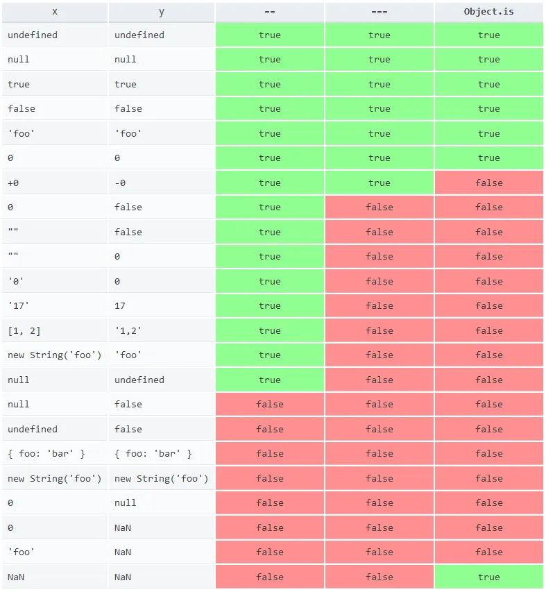

## 基本使用
### 引用方式
#### 内联方式
在页面中使用 script 标签，在 script 标签的标签体中编写 js 代码

```html
<script>
    // js代码 
</script>
```

注意：

1. \< script > 可以定义在 html 页面的任何地方，但是定义的位置会影响执行顺序
2. \< script > 可以定义多个

```html
<!DOCTYPE html>
<html lang="en">
<head>
    <meta charset="UTF-8">
    <title>Title</title>
  <script>
    alert("hello")
  </script>
</head>
<body>
<script>
  alert("hello")
</script>
</body>
</html>
```

#### 行内方式
在普通标签中编写 js 代码，一般需要结合事件属性，如 onclick、onmouseover 等

```html
<input type="button" value="点我" onclick="alert('我被点了，晕了！')">

<!--<div οnmοuseοver="alert('走开')">把鼠标移上来</div>-->

<!--<a href="" οnclick="alert('超链接被触发了')">我是超链接</a>-->

<a href="javascript:alert('超链接被触发了')">我是超链接</a>    
<!--使用超链接的href属性执行js时，必须添加javascript:-->
```

#### 外部方式
使用单独的.js 文件定义，然后在页面中使用 script 标签引入外部脚本文件

注意：如果某个 script 标签用于引入外部的 js 文件，则该 script 标签的标签体中不能再写 js 代码

```java
<script type="text/javascript" src="js文件的路径"></script>
```

### 输入和输出
1. 输入

prompt()：弹出输入框，获取用户输入的数据

2. 输出
+ 浏览器，弹出警告框

```javascript
alert("Hello World!");
```

+ 页面，输出到页面

```javascript
document.write("Hello World!");
```

+ 控制台，输出到浏览器的控制台

```javascript
console.log("Hello World!");
```

### 注释
1. 多行注释，注释中的内容不会被执行，但是可以在源代码中查看

```javascript
/*
   多行注释...
   多行注释...
   多行注释...
*/
```

2. 单行注释

```javascript
// 单行注释
```

### 书写规则
1.  JS 中严格区分大小写 
2.  JS 中每一条语句以分号 `;` 结尾，如果不写分号，浏览器会自动添加，但是会消耗一些系统资源，而且有些时候，浏览器会加错分号，所以在开发中分号必须写 
3.  JS 中会忽略多个空格和换行，所以我们可以利用空格和换行对代码进行格式化 

### 命令规则
在 JS 中所有的可以由我们自主命名的都可以称为是标识符，例如：变量名、函数名、属性名都属于标识符

命名一个标识符时需要遵守如下的规则：

1. 标识符中可以含有字母、数字、_、$
2. 标识符不能以数字开头
3. 标识符不能是 ES 中的关键字或保留字
4. 标识符一般都采用驼峰命名法（首字母小写，每个单词的开头字母大写，其余字母小写）

### 变量
Java 语言是强类型语言，而 JavaScript 是弱类型语言

1. 强类型：在开辟变量存储空间时，定义了空间将来存储的数据的数据类型，只能存储固定类型的数据
2. 弱类型：在开辟变量存储空间时，不定义空间将来的存储数据类型，可以存放任意类型的数据

语法：`var  变量名 = 初始化值（或表达式）;`

变量的定义可以使用 var，也可以不使用

1. 使用时：为局部变量
2. 不使用时：为全局变量

typeof 运算符：获取变量的类型（注意：null 运算后得到的是 object）

```html
<!DOCTYPE html>
<html lang="en">
  <head>
    <meta charset="UTF-8">
    <title>Title</title>
    <script>
      a=1
      b=2.3
      c="hello"
      d=false
      e=undefined
      document.write(typeof a+"<br>")
      document.write(typeof b+"<br>")
      document.write(typeof c+"<br>")
      document.write(typeof d+"<br>")
      document.write(typeof e+"<br>")
    </script>
  </head>
  <body>

  </body>
</html>
```

注意：let 也可以声明变量，使用 let 声明的变量支持块级作用域，而 var 声明的变量不支持块级作用域

## 数据类型
### String
在 JS 中，字符串需要使用引号引起来，使用单引号或双引号都可以，但不要混合使用

同一种引号不能嵌套，双引号不能放双引号，单引号不能放单引号

在字符串中我们可以使用 `\` 作为转义字符，当表示一些特殊符号时可以使用 `\` 进行转义

1. `\"` 表示 `"`
2. `\'` 表示 `'`
3. `\n` 表示换行
4. `\t` 制表符
5. `\\` 表示 `\`

### Number
在 JS 中，所有的数值都是 `Number` 类型，包括整数和浮点数（小数）

可以使用一个运算符 `typeof`，来检查一个变量的类型。语法：`typeof 变量`

1. 检查字符串时，会返回 `string`
2. 检查数值时，会返回 `number`

**MAX_VALUE**

JS 中可以表示的数字的最大值 `Number.MAX_VALUE=1.7976931348623157e+308`

如果使用 `Number` 表示的数字超过了最大值，则会返回一个 `Infinity`

```javascript
var a = Number.MAX_VALUE * Number.MAX_VALUE;
console.log(a); // Infinity
```

**MIN_VALUE**

大于 0 的最小值 `Number.MIN_VALUE=5e-324`

```javascript
var a = Number.MIN_VALUE * Number.MIN_VALUE;
console.log(a); // 0
```

**Infinity**

`Infinity` 表示正无穷，`-Infinity` 表示负无穷

使用 `typeof` 检查，`Infinity` 会返回 `Number`

```javascript
var a = Number.MAX_VALUE * Number.MAX_VALUE;
console.log(typeof a); // number
```

**NaN**

`NaN` 是一个特殊的数字，表示 `Not A Number`

```javascript
var a = 'abc' * 'def';
console.log(a); // NaN
```

使用 `typeof` 检查一个 `NaN` 也会返回 `number`

```javascript
var a = 'abc' * 'def';
console.log(typeof a); // number
```

**运算精度**

在 JS 中整数的运算基本可以保证精确。如果使用 JS 进行浮点运算，可能得到一个不精确的结果，所以千万不要使用 JS 进行对精确度要求比较高的运算

```javascript
var a = 0.1 + 0.2;
console.log(a); // 0.30000000000000004
```

### Boolean
布尔值只有两个，主要用来做逻辑判断，`true` 表示真，`false` 表示假

使用 `typeof` 检查一个布尔值时，会返回 `boolean`

### Null
Null 类型的值只有一个，就是 `null`，`null` 这个值专门用来表示一个为空的对象

使用 `typeof` 检查一个 `null` 值时，会返回 `object`

```javascript
var a3 = null;
console.log(a3); // null
console.log(typeof a3); // object
```

### Undefined
<font style="color:rgb(38, 38, 38);"> Undefined（未定义）类型的值只有一个，就是 undefind </font>

<font style="color:rgb(38, 38, 38);"> 当声明一个变量，但是并不给变量赋值时，它的值就是 undefined </font>

<font style="color:rgb(38, 38, 38);"> 使用 typeof 检查一个 undefined 时，也会返回 undefined </font>

```javascript
var a4;
console.log(a4); // undefind
console.log(typeof a4); // undefind
```

### 强制类型转换
#### 其他数据类型转换为 String
1. 调用被转换数据类型的 toString()方法

该方法不会影响到原变量，它会将转换的结果返回

```javascript
// Number 转换为 String
var a1 = 123;
var b1 = a1.toString();
console.log(typeof a1); // number
console.log(typeof b1); // string
// Boolean 转换为 String
var a2 = true;
var b2 = a2.toString();
console.log(typeof a2); // boolean
console.log(typeof b2); // string
```

但是注意：`null` 和 `undefined` 这两个值没有 `toString()`，如果调用他们的方法，会报错

```javascript
// Null 转换为 String
var a3 = null;
var b3 = a3.toString(); // UncaughtTypeError: Cannot read property 'toString' of null
console.log(typeof a3); 
console.log(typeof b3);
// Undefined 转换为 String
var a4 = undefined;
var b4 = a4.toString(); // UncaughtTypeError: Cannot read property 'toString' of undefined
console.log(typeof a4); 
console.log(typeof b4);
```

2. 调用 String()函数，并将被转换的数据作为参数传递给函数

使用 `String()` 函数做强制类型转换时，对于 `Number` 和 `Boolean` 实际上就是调用的 `toString()` 方法

但是对于 `null` 和 `undefined`，就不会调用 `toString()` 方法，而是将

+ `null` 直接转换为 `"null"`
+ `undefined` 直接转换为 `"undefined"`

```javascript
// Number 转换为 String
var a1 = 123;
var b1 = String(a1);
console.log(typeof a1); // number
console.log(typeof b1); // string
// Boolean 转换为 String
var a2 = true;
var b2 = String(a2);
console.log(typeof a2); // boolean
console.log(typeof b2); // string
// Null 转换为 String
var a3 = null;
var b3 = String(a3);
console.log(typeof a3); // object
console.log(typeof b3); // string
// Undefined 转换为 String
var a4 = undefined;
var b4 = String(a4);
console.log(typeof a4); // undefined
console.log(typeof b4); // string
```

#### 其他数据类型转换为 Number
1. 使用 Number()函数
+  字符串 --> 数字 
    - 如果是纯数字的字符串，则直接将其转换为数字
    - 如果字符串中有非数字的内容，则转换为 `NaN`
    - 如果字符串是一个空串或者是一个全是空格的字符串，则转换为 `0`

```javascript
// **转换方式一：使用 Number()函数**
// 纯数字的字符串
var a1 = '123';         
a1 = Number(a1);
console.log(typeof a1); // number
console.log(a1); 	    // 123
// 非数字的内容
// var a2 = 'abc';         
var a2 = undefined;
a2 = Number(a2);
console.log(typeof a2); // number
console.log(a2);        // NaN 
// 空串
// var a3 = ' ';      
var a3 = null;       
a3 = Number(a3);        
console.log(typeof a3); // number
console.log(a3);        // 0
```

+  布尔 --> 数字 
    - `true` 转成 `1`
    - `false` 转成 `0`

```javascript
var a4 = true;
a4 = Number(a4);
console.log(typeof a4); // number
console.log(a4);        // 1
var a5 = false;
a5 = Number(a5);
console.log(typeof a5); // number
console.log(a5);        // 0
```

2. 专门用来对付字符串
+ `parseInt()` 把一个字符串转换为一个整数：可以将一个字符串中的有效整数部分取出来，然后转换为 Number
+ `parseFloat()` 把一个字符串转换为一个浮点数：可以将一个字符串中的有效小数部分取出来，然后转换为 Number
+ 如果对非 String 使用 `parseInt()` 或 `parseFloat()`，它会先将其转换为 String，然后再操作

```javascript
var a1 = "123";
a1 = parseInt(a1);
console.log(typeof a1); // number
console.log(a1);        // 123
var a2 = "123.456";
a2 = parseInt(a2);
console.log(typeof a2); // number
console.log(a2);        // 123
var a3 = "123px";
a3 = parseInt(a3);
console.log(typeof a3); // number
console.log(a3);        // 123 
// var a4 = null;
// var a4 = undefined;
// var a4 = '';
// var a4 = 'abc';
// var a4 = true;
var a4 = false;
a4 = parseInt(a4);
console.log(typeof a4); // number
console.log(a4);        // NaN
```

#### 其他数据类型转换为 Boolean
1. 使用 `Boolean()` 函数
+ 数字--> 布尔 
    - 除了 `0` 和 `NaN`，其余的都是 `true`
+ 字符串--> 布尔 
    - 除了空串，其余的都是 `true`
+ `null` 和 `undefined` 都会转换为 `false`
+ 对象也会转换为 `true`

```javascript
// - 数字-—-> 布尔
//   - 除了 `0` 和 `NaN`，其余的都是 `true`
// var a1 = 0;
var a1 = NaN;
a1 = Boolean(a1);
console.log(a1); // false
var a2 = 123;
a2 = Boolean(a2);
console.log(a2); // true
// - 字符串-—-> 布尔
//   - 除了空串，其余的都是 `true`
var a3 = "123";
a3 = Boolean(a3);
console.log(a3); // true
var a4 = " ";
a4 = Boolean(a4);
console.log(a4); // true
var a5 = "";
a5 = Boolean(a5);
console.log(a5); // false
// - `null` 和 `undefined` 都会转换为 `false`
// var a6 = null;
var a6 = undefined;
a6 = Boolean(a6);
console.log(a6); // false
```

2. 隐式类型转换

为任意的数据类型做两次非运算，即可将其转换为布尔值

```javascript
var a = "123";
var b = !!a;
console.log("a="+a+",b="+b); 
```

## JS 运算
### 算数运算符
1. 当对非 Number 类型的值进行运算时，会将这些值转换为 Number 然后再运算
2. 任何值和 `NaN` 做运算都得 `NaN`

```javascript
var a1 = 123 + 456;
console.log(a1); // 579
var a2 = "123" + "456";
console.log(a2); // 123456
var a3 = "123" + 456;
console.log(a3); // 123456
var a4 = 123 + "456";
console.log(a4); // 123456
var a5 = 123 + true;
console.log(a5); // 124
var a6 = 123 + "";
console.log(a6); // 123
var a7 = 123 + null;
console.log(a7); // 123
var a8 = 123 + undefined;
console.log(a8); // NaN
var a9 = 123 + NaN;
console.log(a9); // NaN
var a10 = "123" + NaN;
console.log(a10); // 123NaN
```

```javascript
var b1 = 456 - 123;
console.log(b1); // 333
var b2 = 456 - "123";
console.log(b2); // 333
var b3 = 456 - true;
console.log(b3); // 455
var b4 = 456 - "";
console.log(b4); // 456
var b5 = 456 - null;
console.log(b5); // 456
var b6 = 456 - "abc";
console.log(b6); // NaN
var b7 = 456 - NaN;
console.log(b7); // NaN
var b8 = 456 - undefined;
console.log(b8); // NaN
```

1.  `+` 可以对两个值进行加法运算，并将结果返回 
2. `-` 可以对两个值进行减法运算，并将结果返回 
3.  `*` 可以对两个值进行乘法运算，并将结果返回 
4.  `/` 可以对两个值进行除法运算，并将结果返回 
5.  `%` 可以对两个值进行取模运算，并将结果返回 

根据这些特点，我们可以利用 `+""` 将 Number 转为 String，利用 `-0`、`*1`、`/1` 将 String 转为 Number

### 一元运算符
1. `+` 正号：正号不会对数字产生任何影响
2. `-` 负号：负号可以对数字进行负号的取反

对于非 Number 类型的值，它会将先转换为 Number，然后再运算

可以对一个其他的数据类型使用 `+`，来将其转换为 Number，它的原理和 `Number()` 函数一样

```javascript
var a = "10";
var result = +a;
console.log(typeof result);    // number
console.log("result="+result); // result = 10
result = -a;
console.log("result="+result); // result =-10
a = true;
result = +a;
console.log("result="+result); // result = 1
a = "";
result = +a;
console.log("result="+result); // result = 0
a = null;
result = +a;
console.log("result="+result); // result = 0
a = undefined;
result = +a;
console.log("result="+result); // result = NaN
a = NaN;
result = +a;
console.log("result="+result); // result = NaN
```

### 自增和自减
```javascript
var a,b;
a = 1;
b = a++;
console.log("a++ = " + b + ", a = " + a); // a++ = 1, a = 2
a = 1;
b = ++a;
console.log("++a = " + b + ", a = " + a); // ++a = 2, a = 2
```

```javascript
var a,b;
a = 1;
b = a--;
console.log("a-- = " + b + ", a = " + a); // a-- = 1, a = 0
a = 1;
b = --a;
console.log("--a = " + b + ", a = " + a); // --a = 0, a = 0
```

### 逻辑运算符
1. `!` 非
2. `&&` 与
3. `||` 或

```javascript
var a,b;
a = true;
b = !a;
console.log("a="+a+",b="+b); // a = true, b = false
b = !!a;
console.log("a="+a+",b="+b); // a = true, b = true
```

```javascript
var a;
a = true && true;   // true
console.log(a);
a = true && false;  // false
console.log(a);
a = false && true;  // false
console.log(a);
a = false && false; // false
console.log(a);
```

```javascript
var a;
a = true || true;   // true
console.log(a);
a = true || false;  // true
console.log(a);
a = false || true;  // true
console.log(a);
a = false || false; // false
console.log(a);
```

**与运算**

1. 如果第一个值为 `true`，则必然返回第二个值
2. 如果第一个值为 `false`，则直接返回第一个值

```javascript
var result;
result = 1 && 2;
console.log(result);   // 2
result = 2 && 1;
console.log(result);   // 1
result = 1 && 0;
console.log(result);   // 0
result = 0 && 1;
console.log(result);   // 0
result = "" && 1;
console.log(result);   //
result = 1 && "";
console.log(result);   //
result = null && 1;
console.log(result);   // null
result = 1 && null;
console.log(result);   // null
result = undefined && 1;
console.log(result);   // undefined	
result = 1 && undefined;
console.log(result);   // undefined
```

**或运算**

1. 如果第一个值为 `true`，则直接返回第一个值
2. 如果第一个值为 `false`，则返回第二个值

```javascript
var result;
result = 1 || 2;
console.log(result);   // 1
result = 2 || 1;
console.log(result);   // 2
result = 1 || 0;
console.log(result);   // 1
result = 0 || 1;
console.log(result);   // 1
result = "" || 1;
console.log(result);   // 1
result = 1 || "";
console.log(result);   // 1
result = null || 1;
console.log(result);   // 1
result = 1 || null;
console.log(result);   // 1
result = undefined || 1;
console.log(result);   // 1	
result = 1 || undefined;
console.log(result);   // 1
```

### 赋值运算符
`=` 可以将符号右侧的值赋值给符号左侧的变量

1. `+=` `a+=5` 等价于 `a=a+5`
2. `-=` `a-=5` 等价于 `a=a-5`
3. `*=` `a*=5` 等价于 `a=a*5`
4. `/=` `a/=5` 等价于 `a=a/5`
5. `%=` `a%=5` 等价于 `a=a%5`

### 关系运算符
通过关系运算符可以比较两个值之间的大小关系，如果关系成立它会返回 `true`，如果关系不成立则返回 `false`

1. `>`：大于号，判断符号左侧的值是否大于右侧的
2. `>=`：大于等于号，判断符号左侧的值是否大于等于右侧的
3. `<`：小于号，判断符号左侧的值是否小于右侧的
4. `<=`：小于等于号，判断符号左侧的值是否小于等于右侧的

任何值和 NaN 做任何比较都是 `false`

**非数值的情况**

对于非数值进行比较时，会将其转换为数字然后再比较

如果符号两侧的值都是字符串时，不会将其转换为数字进行比较，而是分别比较字符串中字符的 Unicode 编码

```javascript
console.log(1>true);      // false
console.log(1>=true);     // true
console.log(1>"0");       // true
console.log(10>null);     // true 
// 任何值和 NaN 做任何比较都是 `false`
console.log(10<="hello"); // false
// 比较两个字符串时，比较的是字符串的字符编码
console.log("a" < "b");   // true
// 比较字符编码时是一位一位进行比较
// 如果两位一样，则比较下一位，所以借用它来对英文进行排序
console.log("bcd" < "b"); // false
console.log("11" < "5");  // true
// 比较中文时没有意义
console.log("我" < "你"); // false
// 如果比较的两个字符串型的数字，可能会得到不可预期的结果
// 注意：在比较两个字符串型的数字时，一定一定一定要转型
console.log("12345675432" < +"5"); // false
```

### 相等运算符
1. `==` 相等

相等运算符用来比较两个值是否相等，如果相等会返回 `true`，否则返回 `false`

使用 `==` 来做相等运算：当使用 `==` 来比较两个值时，如果值的类型不同，则会自动进行类型转换，将其转换为相同的类型然后在比较

```javascript
// undefined 衍生自 null，所以这两个值做相等判断时，会返回 true
console.log(null == undefined); // true
// NaN 不和任何值相等，包括他本身
console.log(NaN == NaN); // false
// 可以通过 isNaN()函数来判断一个值是否是 NaN
// 如果该值是 NaN 则返回 true，否则返回 false
console.log(isNaN(NaN)); // true
```

2. `!=` 不相等

不相等运算符用来判断两个值是否不相等，如果不相等返回 `true`，否则返回 `false`

使用 `!=` 来做不相等运算：不相等也会对变量进行自动的类型转换，如果转换后相等它也会返回 `false`

3. `===` 全等

用来判断两个值是否全等，它和相等类似，不同的是它不会做自动的类型转换，如果两个值的类型不同，直接返回 `false`

4. `!==` 不全等

用来判断两个值是否不全等，和不等类似，不同的是它不会做自动的类型转换，如果两个值的类型不同，直接返回 `true`

```javascript
console.log("123" === 123); // false
console.log("123" !== 123); // true
```



### 条件运算符
条件运算符也叫三元运算符 `条件表达式 ? 语句1: 语句2;`

执行的流程：条件运算符在执行时，首先对条件表达式进行求值

1. 如果该值为 `true`，则执行 `语句1`，并返回执行结果
2. 如果该值为 `false`，则执行 `语句2`，并返回执行结果

```javascript
var a = 30;
var b = 40;
var c = 90;
// 两数中取 MAX
var max = a > b ? a : b;
console.log("max="+max);
// 三数中取 MAX
max = a > b ? (a > c ? a : c) : (b > c ? b : c);
console.log("max="+max);
```

如果条件的表达式的求值结果是一个非布尔值，则会将其转换为布尔值，然后再运算

```javascript
"hello" ? alert("111111") : alert("2222222");
```

## 数组
### 数组简介
数组也是一个对象，它和我们普通对象功能类似，也是用来存储一些值的，不同的是普通对象是使用字符串作为属性名的，而数组时使用数字来作为索引操作元素

```javascript
// 创建数组对象
var arr=new Array();
// 使用 typeof 检查一个数组时，会返回 object
console.log(typeof arr); // object
```

#### 向数组中添加元素
语法：`数组[索引] = 值`

```javascript
arr[0] = 10;
arr[1] = 33;
arr[2] = 22;
```

#### 读取数组中的元素
语法：`数组[索引]`

如果读取不存在的索引，不会报错而是返回 `undefined`

```javascript
console.log(arr[2]); // 22
console.log(arr[3]); // undefined
```

#### 获取数组的长度
可以使用 `length` 属性来获取数组的长度（元素的个数）

语法：`数组.length`

1. 对于连续的数组，使用 `length` 可以获取到数组的长度（元素的个数）
2. 对于非连续的数组，使用 `length` 会获取到数组的最大的索引 + 1

```javascript
console.log(arr.length); // 3
console.log(arr); // {"0": 10, "1": 33, "2": 22, "length": 3}
arr[10] = 33;
console.log(arr.length); // 11
console.log(arr); // {"0": 10, "1": 33, "10": 33, "2": 22, "length": 11}
```

#### 修改数组的长度
1. 如果修改的 `length` 大于原长度，则多出部分会空出来
2. 如果修改的 `length` 小于原长度，则多出的元素会被删除

```javascript
arr.length = 100;
console.log(arr.length); // 100
console.log(arr); // {"0": 10, "1": 33, "10": 33, "2": 22, "length": 100}
arr.length = 2;
console.log(arr.length); // 2
console.log(arr); // {"0": 10, "1": 33, "length": 2}
```

#### 向数组最后一位添加元素
语法：`数组[数组.length] = 值;`

```javascript
arr[arr.length] = 22;
console.log(arr.length); // 3
console.log(arr); // {"0": 10, "1": 33, "2": 22, "length": 3}
arr[arr.length] = 33;
console.log(arr.length); // 4
console.log(arr); // {"0": 10, "1": 33, "2": 22, "3": 33, "length": 4}
```

### 创建数组的方式
#### 使用字面量创建数组
语法：`[]`

```javascript
var arr1 = [];
console.log(arr1); // {"length": 0}
console.log(typeof arr1); // object
console.log(arr1.length); // 0
```

使用字面量创建数组时，可以在创建时就指定数组中的元素

```javascript
var arr2 = [1,2,3,4,5,10];
console.log(arr2);  // {"0": 1, "1": 2, "2": 3, "3": 4, "4": 5, "5": 10, "length": 6} 
console.log(arr2.length); // 6
```

#### 使用构造函数创建数组
使用构造函数创建数组时，也可以同时添加元素，将要添加的元素作为构造函数的参数传递

元素之间使用 `,` 隔开

```javascript
var arr3 = new Array(1,2,3,4,5);
console.log(arr3);  // {"0": 1, "1": 2, "2": 3, "3": 4, "4": 5, "length": 5} 
console.log(arr3.length); // 5
```

**字面量和构造函数只有一个数字时的区别**

```javascript
// 创建一个数组数组中只有一个元素 10
var arr4 = [10];
// 创建一个长度为 10 的数
var arr5 = new Array(10);
console.log(arr4.length);  // 1
console.log(arr5.length);  // 10
```

### 数组元素类型
#### 任意的数据类型
数字、字符串、布尔值、`null`、`undefined`

```javascript
var arr6 = [2, "13", true, null, undefined];
console.log(arr6); 
// Array(5)
// 	0: 2
// 	1: "13"
// 	2: true
// 	3: null
// 	4: undefined
// 	length: 5
```

#### 对象
```javascript
// 也可以是对象
var obj = {name:"孙悟空"};
var arr7 = [];
arr7[arr7.length] = obj;
console.log(arr7); 
// {"0":{"name": "孙悟空"}, "length": 1} 
arr7 = [{name:"孙悟空"}, {name:"沙和尚"}, {name:"猪八戒"}];
console.log(arr7); 
// {"0":{"name": "孙悟空"}, "1":{"name": "沙和尚"}, "2":{"name": "猪八戒"}, "length": 3}
```

#### 函数
```javascript
arr7 = [function(){alert(1)},function(){alert(2)}]; 
console.log(arr7); 
// {"0": "function (){alert(1)}", "1": "function (){alert(2)}", "length": 2}
```

#### 数组
数组中也可以放数组，如下这种数组我们称为二维数组

```javascript
arr7 = [[1,2,3],[4,5,6],[7,8,9]];
console.log(arr7); 
// {"0":{"0": 1, "1": 2, "2": 3, "length": 3}, "1":{"0": 4, "1": 5, "2": 6, "length": 3}, "2":{"0": 7, "1": 8, "2": 9, "length": 3}, "length": 3}
```

### 数组遍历
#### 普通 for 循环
```javascript
var arr = ["孙悟空", "猪八戒", "沙悟净", "白龙马"];
// 所谓的遍历数组，就是将数组中所有的元素都取出来
for(var i=0;i<arr.length;i++){
    console.log(arr[i]);
}
```

#### forEach 方法
一般我们都是使用 `for` 循环去遍历数组，JS 中还为我们提供了一个方法，用来遍历数组 `forEach()`

**兼容性**

这个方法只支持 IE8 以上的浏览器，IE8 及以下的浏览器均不支持该方法，所以如果需要兼容 IE8，则不要使用 `forEach`，还是使用 `for` 循环来遍历

**使用**

forEach() 方法需要一个函数作为参数，像这种函数，由我们创建但是不由我们调用的，我们称为回调函数

数组中有几个元素，函数就会执行几次，每次执行时，浏览器会将遍历到的元素以实参的形式传递进来，我们可以来定义形参，来读取这些内容

**参数**

浏览器会在回调函数中传递三个参数：

1. 第一个参数，就是当前正在遍历的元素
2. 第二个参数，就是当前正在遍历的元素的索引
3. 第三个参数，就是正在遍历的数组

```javascript
arr.forEach(function(value, index, obj){
    console.log("value = " + value);
    console.log("index = " + index);
    console.log("obj = " + obj);
});
```

