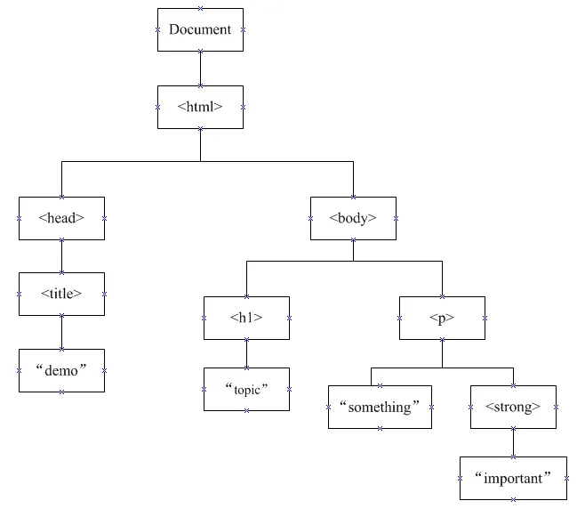
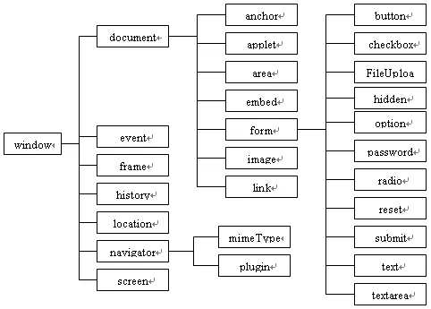
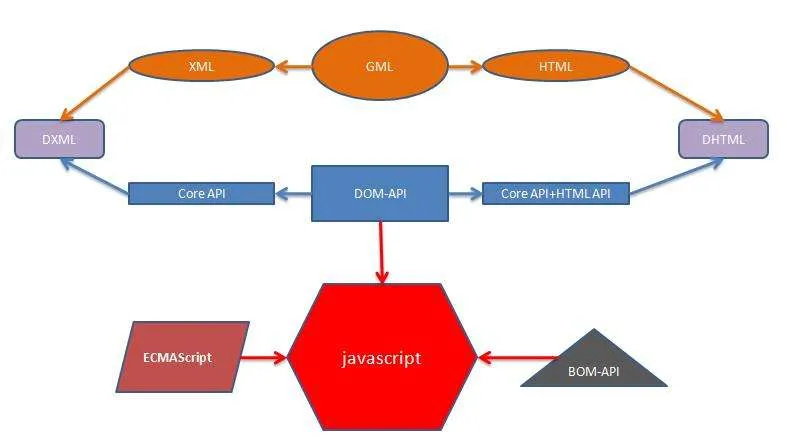
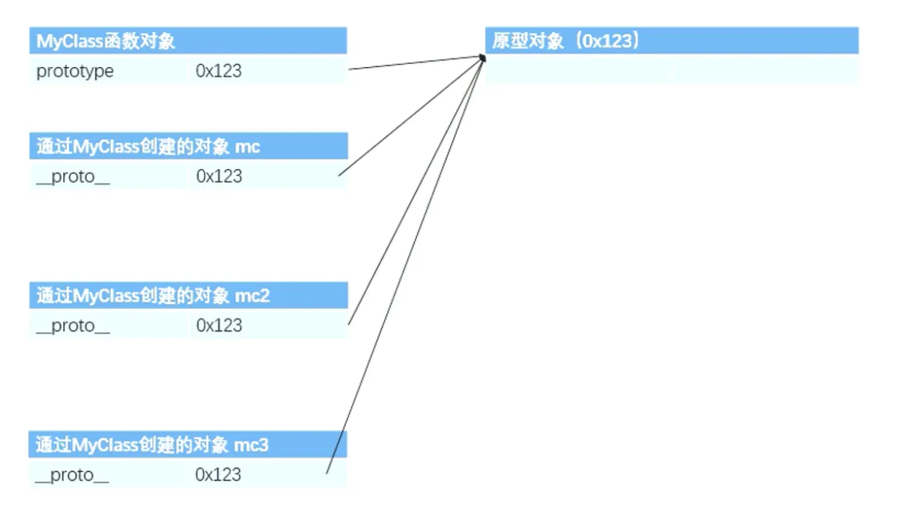
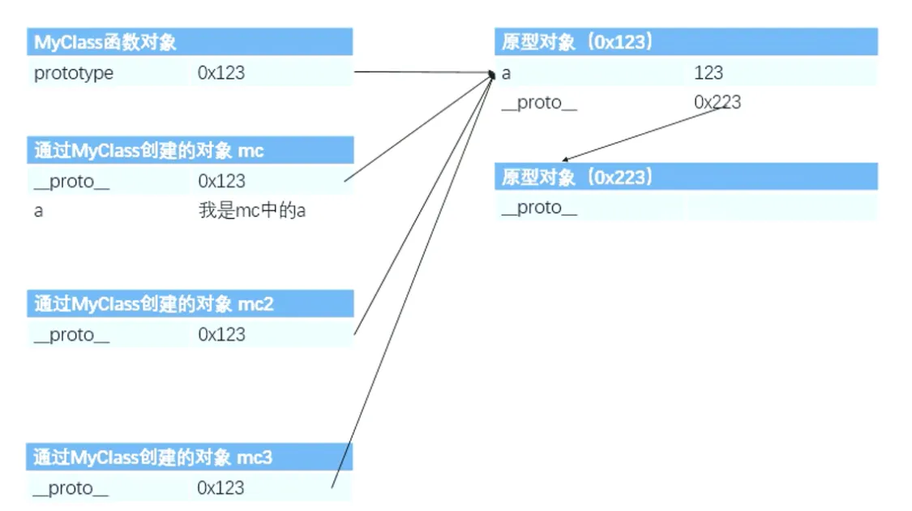
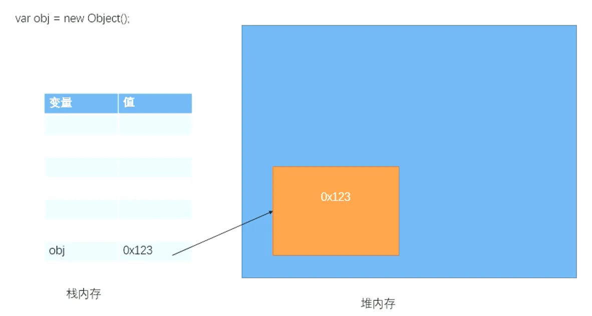

## 流程控制
### if 语句
**语法一**

```javascript
if(条件表达式) {
    语句
}
```

**语法二**

```javascript
if(条件表达式) {
	语句1...
} else {
	语句2...
}
```

**语法三**

```javascript
if(条件表达式) {
	语句1...
} else if(条件表达式) {
	语句2...
} else if(条件表达式) {
	语句3...
} else{
	语句4...
}
```

**练习**

`prompt()` 可以弹出一个提示框，该提示框中会带有一个文本框，用户可以在文本框中输入一段内容

该函数需要一个字符串作为参数，该字符串将会作为提示框的提示文字

用户输入的内容将会作为函数的返回值返回，可以定义一个变量来接收该内容

```javascript
// 练习 1
// 从键盘输入小明的期末成绩：
// 当成绩为 100 时，’奖励一辆 BMW’
// 当成绩为 [80-99] 时，’奖励一台 iphone15s'
// 当成绩为 [60-80] 时，’奖励一本参考书’
// 其他时，什么奖励也没有
var score = prompt("请输入小明的期末成绩：");
if(score == 100){
    alert("奖励一辆BMW");
} else if(score >80 && score <= 99){
    alert("奖励一台iphone15s");
} else if(score >60 && score <= 80){
    alert("奖励一本参考书");
} else{
    alert("什么奖励也没有");
}

// 练习 2
// 大家都知道，男大当婚，女大当嫁。那么女方家长要嫁女儿，当然要提出一定的条件：
// 高：180cm 以上；富：1000 万以上；帅：500 以上；如果这三个条件同时满足，则：’我一定要嫁给他’
// 如果三个条件有为真的情况，则：’嫁吧，比上不足，比下有余。’
// 如果三个条件都不满足，则：’不嫁！’

// 练习 3
// 编写程序，由键盘输入三个整数分别存入变量 num1、num2、num3，对他们进行排序，并且从小到大输出。
```

### switch 语句
```javascript
switch(条件表达式) {
    case 表达式1:
    	语句1...;
    	break;
    case 表达式2:
    	语句2...;
    	break;
    default:
        语句...;
    	break;
}
```

```javascript
// 对于成绩大于 60 分的，输出’合格’。低于 60 分的，输出’不合格’
var score = prompt("请输入成绩：");
var tmp = parseInt(score/10);
switch (tmp){
    case 10:
    case 9:
    case 8:
    case 7:
    case 6:
        alert("合格");
        break;
    default:
        alert("不合格");
        break;
}
```

### while 语句
```javascript
while(条件表达式) {
	语句...
}
```

```javascript
var i = 0;
while(true){
	document.write(i++ + "<br/>");
	if(i > 10){
    	break;
	}
}
```

### do-while 语句
``` javascript
do{
	语句...
}while(条件表达式)
```

### for 语句
``` javascript
for(① 初始化表达式; ② 条件表达式; ③ 更新表达式) {
	④ 语句...
}
```

**练习**

``` javascript
// 练习 1、打印 1-100 之间所有奇数之和
for(i = 1, result = 0; i <= 100; i++){
    if(i%2 == 1){	
        result += i;
    }
}
console.log('result ='+result);
```

### break和continue
不能在`if`语句中使用`break`和`continue`

**break**

1. `break`关键字可以用来退出`switch`或循环语句
2. `break`关键字，会立即终止离他最近的那个循环语句

可以为循环语句创建一个`label`，来标识当前的循环`label`：

循环语句使用`break`语句时，可以在`break`后跟着一个`label`，这样`break`将会结束指定的循环，而不是最近的

**continue**

1. `continue`关键字可以用来跳过当次循环
2. `continue`也是默认只会对离他最近的循环循环起作用

## 对象
### 对象分类
#### 内建对象
由ES标准中定义的对象，在任何ES的实现中都可以使用

常见内建对象有以下，都可以直接通过new调用构造函数创建对象实例：

1. Object、Function、Array、String、Number、Boolean、Date、RegExp
2. Error（EvalError、RangeError、ReferenceError、SyntaxError、TypeError、URIError）

``` javascript
// Math
Math.sqrt(2);
// String
String(2);
// Number
Number("2");
```

#### 宿主对象
由JS的运行环境提供的对象，目前来讲主要指由浏览器提供的对象，比如 `BOM DOM`

``` javascript
// console
console.log("hello");
// document
document.write("hello");
```

JavaScript实现包括三部分：

| 组成 | 作用 | 地位 | 例子 |
| :--- | :--- | :--- | --- |
| ES（ECMAScript） | 描述JS语法和基本对象 | 核心 |  |
| DOM（Document Object Model 文档对象模型） | HTML和XML的应用程序接口，处理网页内容的方法和接口 | W3C标准 | `document` |
| BOM（Browser Object Model 浏览器对象模型） | 描述与浏览器进行交互的方法和接口，处理浏览器窗口和框架 | 浏览器厂商对DOM的实现 | `window` |

**DOM**



**BOM**



**DOM 和 BOM 的关系**



#### 自定义对象
由开发人员自己创建的对象，使用`new`关键字调用的函数，是构造函数`constructor`，构造函数是专门用来创建对象的。函数使用`typeof`检查一个对象时，会返回`object`

在对象中保存的值称为属性

1. 添加或修改对象属性的语法：`对象.属性名=属性值;`
2. 读取对象属性的语法：`对象.属性名`
3. 删除对象属性的语法：`delete 对象.属性名;`

``` javascript
var obj = new Object();
// 向 obj 中添加一个 name 属性
obj.name = "孙悟空";
// 向 obj 中添加一个 gender 属性
obj.gender = "男";
// 向 obj 中添加一个 age 属性
obj.age = "18";
// 打印 obj
console.log(typeof obj); // object
console.log(obj); // {"age": "18", "gender": "男", "name": "孙悟空"}
console.log(obj.name); // 孙悟空
```

**属性名**

对象的属性名不强制要求遵守标识符的规范，什么名字都可以使用，但是我们使用还是尽量按照标识符的规范去做

如果要使用特殊的属性名，不能采用`.`的方式来操作，而需要使用另一种语法：`对象["属性名"]=属性值`，读取时也需要采用这种方式

``` javascript
obj ["name"] = "齐天大圣";
console.log(obj ["name"]); // 齐天大圣
```

使用`[]`这种形式去操作属性，更加的灵活，在`[]`中可以直接传递一个变量，这样变量值是哪个就会读取哪个属性

``` javascript
var n = "nihao";
obj [n] = "你好";
console.log(obj [n]); // 你好
```

**属性值**

JS对象的属性值，可以是任意的数据类型，包括对象

``` javascript
var obj2 = new Object();
obj2.name = "猪八戒";
obj.bro = obj2;
console.log(obj.bro.name); // 猪八戒
```

`in`**运算符**

通过该运算符可以检查一个对象中是否含有指定的属性

如果有则返回`true`，没有则返回`false`

语法：`"属性名" in 对象`

``` javascript
console.log("test" in obj); // false
console.log("name" in obj); // true
```

### 数据类型
1. 基本数据类型 `String Number Boolean Null Undefined`
2. 引用数据类型 `Object`

#### 基本数据类型
1. JS中的变量都是保存到栈内存中的，基本数据类型的值直接在栈内存中存储
2. 值与值之间是独立存在，修改一个变量不会影响其他的变量

``` javascript
var a = 1;
var b = a;
console.log("a =" + a + ", b =" + b); // a = 1, b = 1
b = 2;
console.log("a =" + a + ", b =" + b); // a = 1, b = 2
```

#### 引用数据类型
1. 对象是保存到堆内存中的
2. 每创建一个新的对象，就会在堆内存中开辟出一个新的空间，而变量保存的是对象的内存地址（对象的引用）
3. 如果两个变量保存的是同一个对象引用，当一个通过一个变量修改属性时，另一个也会受到影响

``` javascript
var obj3 = obj;
obj3.name = "斗战胜佛";
console.log(obj.name);  // 斗战胜佛
console.log(obj3.name); // 斗战胜佛
```

**比较**

1. 当比较两个基本数据类型的值时，就是比较值。
2. 而比较两个引用数据类型时，它是比较的对象的内存地址，如果两个对象是一摸一样的，但是地址不同，它也会返回`false`

``` javascript
var o1 = new Object();
var o2 = new Object();
o1 ["name"] = "周瑜";
o2 ["name"] = "周瑜";
console.log(o1 == o2); // false
```

### 对象字面量
使用对象字面量，可以在创建对象时，直接指定对象属性的语法：`{属性名: 属性值, 属性名: 属性值...}`

对象字面量的属性名可以加引号也可以不加（建议不加），如果要使用一些特殊的名字，则必须加引号

属性名和属性值是一组一组的名值对结构，名和值之间使用`:`连接，多个名值对之间使用`,`隔开

如果一个属性之后没有其他的属性了，就不要写`,`了

``` javascript
var obj = {
    name: "孙悟空",
    age: 1000,
    gender: "男",
    bor:{
        name: "猪八戒"
    }
}
console.log(obj); 
// {"age": 1000, "bor":{"name": "猪八戒"}, "gender": "男", "name": "孙悟空"}
```

### 方法
对象的属性值可以是任何的数据类型，也可以是个函数

函数也可以称为对象的属性，如果一个函数作为一个对象的属性保存，那么我们称这个函数是这个对象的方法

调用函数即调用对象的方法，但是它只是名称上的区别没有其他的区别

``` javascript
var obj2 = {
    name: "猪八戒",
    age: 18,
    sayName: function() {
        console.log(obj2.name);
    }
};
obj2.sayName(); // 猪八戒
```

### 枚举对象中的属性
使用`for...in`语句语法：

``` javascript
for(var 变量 in 对象) {
	语句...
}
```

`for...in`语句对象中有几个属性，循环体就会执行几次

每次执行时，会将对象中的一个属性的名字赋值给变量

``` javascript
var obj = {
    name: "孙悟空",
    age: 1000,
    gender: "男",
    address: "花果山"
};
for(var key in obj){
    console.log(key + "=" + obj.key);
    // name = undefined
    // age = undefined
    // gender = undefined
    // address = undefined
    console.log(key + "=" + obj [key]);
    // name = 孙悟空
    // age = 1000
    // gender = 男
    // address = 花果山
}
```

## 函数
### 函数简介
函数也是一个对象，可以封装一些功能（代码），在需要时可以执行这些功能（代码），可以保存一些代码在需要的时候调用

使用`typeof`检查一个函数对象时，会返回`function`

``` javascript
// 创建一个函数对象
// 可以将要封装的代码以字符串的形式传递给构造函数
var fun = new Function("console.log('Hello World.');");
// 封装到函数中的代码不会立即执行
// 函数中的代码会在函数调用的时候执行
// 调用函数语法：函数对象（）
// 当调用函数时，函数中封装的代码会按照顺序执行
fun(); // Hello World.
```

### 函数创建
1. 使用函数声明创建函数

``` javascript
function 函数名([形参 1, 形参 2...形参 N]) {
	语句...
}
// 调用函数
函数名();
```

**示例**

``` javascript
function fun1(){
    console.log("Hello world.");
    alert("Hello World!");
    document.write("Helloworld");
}
fun1();
```

2. 使用函数表达式（匿名函数）来创建一个函数

``` javascript
var 函数名 = function([形参 1, 形参 2...形参 N]) {
	语句...
};
// 调用函数
函数名();
```

**示例**

``` javascript
var fun1 = function(){
    console.log("Hello world.");
    alert("Hello World!");
    document.write("Helloworld");
};
fun1();
```

### 函数参数
可以在函数的`()`中来指定一个或多个形参（形式参数）多个形参之间使用`,`隔开，声明形参就相当于在函数内部声明了对应的变量

在调用函数时，可以在`()`中指定实参（实际参数）

1.  调用函数时解析器不会检查实参的类型。所以要注意是否有可能会接收到非法的参数，如果有可能则需要对参数进行类型的检查 
2.  调用函数时，解析器也不会检查实参的数量，多余实参不会被赋值。如果实参的数量少于形参的数量，则没有对应实参的形参将是`undefined` 

``` javascript
// 创建一个函数，用来计算三个数的和
function sum(a, b, c) {
    alert(a + b + c);
}
sum(1, 2, 3, 4); // 6
```

### 函数返回值
可以使用`return`来设置函数的返回值

语法：`return 值`

1. `return`后可以跟任意类型的值，`return`后的值将会作为函数的执行结果返回，可以定义一个变量，来接收该结果
2. 在函数中`return`后的语句都不会执行
3. 如果`return`语句后不跟任何值，就相当于返回一个`undefined`；如果函数中不写`return`，则也会返回`undefined`

``` javascript
// 创建一个函数，用来计算三个数的和
function sum(a, b, c) {
    // var result = a + b + c;
    // return result;
    return a + b + c;
}

// 调用函数
// 变量 result 的值就是函数的执行结果
// 函数返回什么 result 的值就是什么
var result = sum(1, 2, 3);
console.log("result = " + result);
```

**练习**

``` javascript
// 1、定义一个函数，判断一个数字是否是偶数，如果是返回 true，否则返回 false
function isEven(num){
    // if(num % 2 == 0){
    //    return true;
    // }
    // return false;
    return num % 2 == 0;
}

var result = isEven(6);
console.log(result); // true
result = isEven(7);
console.log(result); // false

// 2、定义一个函数，可以根据半径计算一个圆的面积，并返回计算结果
function calCirc(radius) {
    return 3.14 * Math.square(radius);
}

var result = calCirc(2); //
```

实参可以是任意的数据类型，也可以是一个对象。当我们的参数过多时，可以将参数封装到一个对象

``` javascript
function sayHello(o){
    console.log("我是" + o.name
                + "，今年我" + o.age 
                + "岁了，我是一个" + o.gender 
                + "人，我住在" + o.address);
}			
var obj = {
    name: "孙悟空",
    age: 1000,
    gender: "男",
    address: "花果山"
};
sayHello(obj); // 我是孙悟空，今年我 1000 岁了，我是一个男人，我住在花果山
```

实参可以是一个对象，也可以是一个函数

``` javascript
function calCirc(radius) {
    return Math.PI * Math.pow(radius, 2);
}
function fun(a){
    console.log("a = " + a);
}
fun(calCirc);  
// a = function calCirc(radius) {
//     return Math.PI * Math.pow(radius, 2);
// }
fun(calCirc(10)); // a = 314.1592653589793
```

**在函数内部再声明一个函数**

``` javascript
function fun3(){
    function fun4(){
        console.log("I'm fun4.");
    }
    fun4();
}
fun3(); // I'm fun4.

function fun5(){
    function fun6(){
        console.log("I'm fun6.");
    }
    return fun6;
}
var a = fun5(); 
a(); // I'm fun6.
fun5()();  // I'm fun6.
```

### 匿名函数
1. 用于函数的回调

``` javascript
window.οnclick = function() {
  console.log(111);
};
```

2. 用于一次性执行的函数，会自动执行（函数定义完，立即被调用，这种函数叫做立即执行函数）

``` javascript
// 函数对象()
(function(){
    console.log("I'm anoymous function.");
})(); // I'm anoymous function.
(function(a, b){
    console.log(a + b);
})(2,3); // 5
```

### call()和apply()
这两个方法都是函数对象的方法，需要通过函数对象来调用，当对函数调用`call()`和`apply()`都会调用函数执行

``` javascript
var obj = {
    name: "obj"
};
var obj2 = {
    name: "obj2"
}
function fun(){
    console.log(this.name);
}
fun.call(obj); // obj
fun.call(obj2); // obj2
```

在调用`call()`和`apply()`可以将一个对象指定为第一个参数此时这个对象将会成为函数执行时的`this`

1. `call()`方法可以将实参在对象之后依次传递
2. `apply()`方法需要将实参封装到一个数组中统一传递

``` javascript
function fun(a, b){
    console.log("a = " + a + ", b = " + b);
}
fun.call(obj, 2, 3); // a = 2, b = 3
fun.apply(obj, [2, 3]); // a = 2, b = 3
```

### arguments
在调用函数时，浏览器每次都会传递进两个隐含的参数：

1. 函数的上下文对象`this`
2. 封装实参的对象`arguments`

`arguments`是一个**类数组对象**（并非数组），可以通过索引来操作数据，也可以获取长度

``` javascript
function fun1(){
    console.log(arguments instanceof Array); // false
    console.log(Array.isArray(arguments));   // false
}
fun1();
```

在调用函数时，我们所传递的实参都会在`arguments`中保存

我们即使不定义形参，也可以通过`arguments`来使用实参，只不过比较麻烦

1. `arguments[0]`表示第一个实参
2. `arguments[1]`表示第二个实参

``` javascript
function fun2(a, b, c){
    console.log("arguments.length = " + arguments.length + ", arguments [0] = " + arguments [0]); 
}
fun2("hello"); // arguments.length = 1, arguments [0] = hello
fun2(true, "hello"); // arguments.length = 2, arguments [0] = true
```

它里边有一个属性叫做`callee`，这个属性对应一个函数对象，就是当前正在执行的函数对象

``` javascript
function fun3(){
    console.log(arguments.callee);
    // function fun3(){
    //     console.log(arguments.callee);
    // }
    console.log(arguments.callee == fun3); // true
}
fun3();
```

## 作用域
### 全局作用域
直接编写在script标签中的JS代码，都在全局作用域。在全局作用域中有一个全局对象`window`，它代表的是一个浏览器的窗口，由浏览器创建，可以直接使用

在全局作用域中：

1. 创建的变量都会作为window对象的属性保存
2. 创建的函数都会作为window对象的方法保存

全局作用域中的变量都是全局变量，在页面的任意的部分都可以访问的到

注意：不使用var声明的变量是全局变量，不推荐使用。全局作用域在页面打开时创建，在页面关闭时销毁

``` javascript
var a = 3;
console.log(window.a); //3
console.log(a); //3

b = 3;
console.log(b); //3
```

#### 变量的声明提前
使用`var`关键字声明的变量，会在所有的代码执行之前被声明

但是如果声明变量时不使用`var`关键字，则变量不会被声明提前

``` javascript
// 1、变量的声明提前
console.log("a = " + a); // a = undefined
var a = "abc";
// ==== ==相当于== ====
var a;
console.log("a = " + a); // a = undefined
a = "abc";

// 2、没有变量的声明提前，报错
console.log("b = " + b); // UncaughtReferenceError: b is not defined
b = "abc";
// ==== ==相当于== ====
console.log("b = " + b); // UncaughtReferenceError: b is not defined
window.b = "abc";
```

#### 函数的声明提前
``` javascript
函数(){
	语句...
}
```

使用函数声明形式创建的函数`function`，它会在所有的代码执行之前就被创建，所以我们可以在函数声明前来调用函数

``` javascript
fun1(); // fun1...
fun2(); // UncaughtTypeError: fun2 is not a function
// 函数声明，会被提前创建
function fun1(){
    console.log("fun1...");
}
// 函数表达式，不会被提前创建（变量会被提前声明，但函数不会被提前创建）
var fun2 = function(){
    console.log("fun2...");
}
```

### 函数作用域
调用函数时创建函数作用域，函数执行完毕以后，函数作用域销毁，每调用一次函数就会创建一个新的函数作用域，他们之间是互相独立的

1. 在函数作用域中可以访问到全局作用域的变量
2. 在全局作用域中无法访问到函数作用域的变量

当在函数作用域操作一个变量时，它会先在自身作用域中寻找，

1. 如果有就直接使用
2. 如果没有则向上一级作用域中寻找，直到找到全局作用域
3. 如果全局作用域中依然没有找到，则会报错

在函数中要访问全局变量可以使用`window`对象

``` javascript
var a = 10;
function fun2(){
    var a = 20;

    function fun3(){
        var a = 30;
        console.log(" fun3 ==> a = " + a);  // fun3 ==> a = 30
    }

    fun3();

    console.log(" fun2 ==> a = " + a); // fun2 ==> a = 20
    console.log("a = " + window.a); // a = 10
}
fun2(); 
console.log("a = " + a); // a = 10
```

在函数作用域也有声明提前的特性，使用`var`关键字声明的变量，会在函数中所有的代码执行之前被声明，函数声明也会在函数中所有的代码执行之前执行

``` javascript
// 在函数作用域也有声明提前的特性，使用 `var` 关键字声明的变量，会在函数中所有的代码执行之前被声明
function func1(){
    console.log(a);
    var a = "func1";

    // 函数声明也会在函数中所有的代码执行之前执行
    func2(); // fun2...
    function func2(){
        console.log("fun2...");
    }
}
func1(); // undefined
```

在函数中，不使用`var`声明的变量都会成为全局变量，<font style="color:rgb(38, 38, 38);">前提条件是函数需要被调用，函数被调用才会创建作用域。</font>

``` javascript
// 函数声明且调用
func3();
function func3() {
    a = 4;
}
console.log("a = " + window.a);  // a = 4
console.log("a = " + window ["a"]);   // a = 4
console.log("a = " + a);    // a = 4

// 函数声明不调用
function func4() {
    b = 4;
}
console.log("b = " + window.b);  // b = undefined
console.log("b = " + window ["b"]);   // b = undefined
console.log("b = " + b);    // UncaughtReferenceError: b is not defined
```

定义形参就相当于在函数作用域中声明了变量

``` javascript
var e = 10;
function fun5(e){
    console.log(e);
}
fun5(); // undefined
fun5(55);  // 55
```

**练习**

``` javascript
// 说出以下代码的执行结果
var a = 123; 
function fun(){
    console.log(a);
}
fun(); 			// 123
// ==== ==== ==== ==== ==== =
var a = 123; 
function fun(){
    console.log(a);
    var a = 456;
}
fun(); 			// undefined
console.log(a);  // 123
// ==== ==== ==== ==== ==== =
var a = 123; 
function fun(){
    console.log(a);
    a = 456;
}
fun(); 			// 123
console.log(a);  // 456
// ==== ==== ==== ==== ==== =
var a = 123; 
function fun(a){
    console.log(a);
    a = 456;
}
fun();			// undefined
console.log(a);  // 123
// ==== ==== ==== ==== ==== =
var a = 123; 
function fun(a){
    console.log(a);
    a = 456;
}
fun(789);		// 789
console.log(a);  // 123
```

### this
解析器在调用函数每次都会向函数内部传递进一个隐含的参数，这个隐含的参数就是`this`

`this`指向的是一个对象，这个对象我们称为函数执行的上下文对象

根据函数的调用方式的不同，`this`会指向不同的对象

1. 以函数的形式调用时，`this`永远都是`window`
2. 以方法的形式调用时，`this`就是调用方法的那个对象

``` javascript
// - 以函数的形式调用时，`this` 永远都是 `window`
function fun(){
    console.log(this.name);
}
var name = "ddd"; // ddd
fun();

// - 以方法的形式调用时，`this` 就是调用方法的那个对象
var obj = {
    name: "孙悟空",
    sayName: fun
}
obj.sayName(); // 孙悟空
```

**this用法**

1. 指向对象中的this

``` javascript
var obj1 = {
	age: 18,
	name:'老铁',
	fun: function(){
		// 在方法中的 this 就是这个方法所在的对象
		var s = this.age;
	}
}
```

2. 指向全局对象中的this

在一个普通函数也是有this的，并且这个this指向的是全局对象（window）

``` javascript
function f(){
	console.log(this);//这里可以直接打印出来运行一下。
}
```

3. this的指向

``` javascript
k = '678';
function fun(){
	console.log(this.k);
}
var o1 = {
		k:'123',
		f: fun,   //调用 fun()函数
}
var o2 = {
		k:'345',
		f: fun,    //调用 fun()函数
}
o1.f();
o2.f();
```

this运行在哪个对象下就指向哪个对象

注意：函数带括号的相当于调用函数

``` javascript
var o1 = {
  age: 18,
  fun: function () {
    console.log(this.age);
  }
}
var o2 = {
  age: 16,
  fun: o1.fun(),
}
o2.fun();
/*上面得到的结构就是 18，因为这是调用完成后的结果。*/
```

``` javascript
var o1 = {
  age: 18,
  fun: function () {
    console.log(this.age);
  }
}
var o2 = {
  age: 16,
  fun: o1.fun, //只是把 o1 的键值对中的值，给传递过来了。
}
o2.fun();
//这里没有带括号，结果就是 16，因为 fun 函数没有被调用执行。
//这里的 fun: o1.fun 就等于
fun: function () {
  console.log(this.age);
}
//只是把键值对中的值转递过来了，并没有调用。
```

## 构造函数与原型对象
### 使用工厂方法创建对象
``` javascript
function createPerson(name, age, gender){
    // 创建一个新的对象
    var obj = new Object();
    //向对象中添加属性
    obj.name = name;
    obj.age = age;
    obj.gender = gender;
    obj.sayName = function(){
        console.log(this.name);
    };
    //将新的对象返回
    return obj;
}

var obj1 = createPerson("孙悟空", 1000, "男");
var obj2 = createPerson("猪八戒", 3600, "男");
var obj3 = createPerson("沙悟净", 10000, "男");

obj1.sayName(); // 孙悟空
obj2.sayName(); // 猪八戒
obj3.sayName(); // 猪八戒
```

使用工厂方法创建的对象，使用的构造函数都是`Object`，所以创建的对象都是`Object`这个类型，就导致我们无法区分出多种不同类型的对象

### 构造函数
创建一个构造函数，专门用来创建Person对象的构造函数就是一个普通的函数

创建方式和普通函数没有区别，不同的是构造函数习惯上首字母大写

构造函数和普通函数的区别就是调用方式的不同

1. 普通函数是直接调用
2. 构造函数需要使用`new`关键字来调用

``` javascript
function Person(){
    console.log(this); // Person{}
}
// 普通函数
var fun = Person();
console.log(fun); // undefined
// 构造函数
var person = new Person();
console.log(person); // Person{}
```

#### 执行流程
1. 立刻创建一个新的对象
2. 将新建的对象设置为函数中`this`，在构造函数中可以使用`this`来引用新建的对象
3. 逐行执行函数中的代码
4. 将新建的对象作为返回值返回

``` javascript
function Dog(){

}

function Person(name, age, gender){
    //向对象中添加属性
    this.name = name;
    this.age = age;
    this.gender = gender;
    this.sayHello = function(){
        console.log("My'name is " + this.name + ", " +
                    "I'm " + this.age + " years old, " +
                    "and I'm a " + this.gender + ".");
    };
}

var person1 = new Person("孙悟空", 1000, "man");
var person2 = new Person("猪八戒", 3600, "man");
var person3 = new Person("沙悟净", 10000, "man");
var dog = new Dog();
person1.sayHello(); // My'name is 孙悟空, I'm 1000 years old, and I'm a man.
person2.sayHello(); // My'name is 猪八戒, I'm 3600 years old, and I'm a man.
person3.sayHello(); // My'name is 沙悟净, I'm 10000 years old, and I'm a man.
console.log(person1); // Person {name: "孙悟空", age: 1000, gender: "man", sayHello: ƒ}
console.log(person2); // Person {name: "猪八戒", age: 3600, gender: "man", sayHello: ƒ}
console.log(person3); // Person {name: "沙悟净", age: 10000, gender: "man", sayHello: ƒ}
console.log(typeof person1); // object
console.log(typeof person2); // object
console.log(typeof person3); // object
```

使用同一个构造函数创建的对象，我们称为一类对象，也将一个构造函数称为一个类。

我们将通过一个构造函数创建的对象，称为是该类的实例，使用`instanceof`可以检查一个对象是否是一个类的实例

语法：`对象 instanceof 构造函数`

``` javascript
console.log(person1 instanceof Person); //true
console.log(person2 instanceof Person); //true
console.log(person3 instanceof Person); //true
console.log(dog instanceof Person); 	//false
```

所有的对象都是`Object`的后代，所以任何对象和`Object`进行`instanceof`检查时都会返回`true`

``` javascript
console.log(person1 instanceof Object); //true
console.log(person2 instanceof Object); //true
console.log(person3 instanceof Object); //true
console.log(dog instanceof Object); 	//true
```

`this`的情况：

1. 当以函数的形式调用时，`this`是`window`
2. 当以方法的形式调用时，谁调用方法`this`就是谁
3. 当以构造函数的形式调用时，`this`就是新创建的那个对象

#### 构造函数修改
``` javascript
function Person(name, age, gender){
    this.name = name;
    this.age = age;
    this.gender = gender;
    this.sayHello = function(){
        console.log("My'name is " + this.name + ", " +
                    "I'm " + this.age + " years old, " +
                    "and I'm a " + this.gender + ".");
    };
}
```

创建一个Person构造函数，在Person构造函数中，为每一个对象都添加了一个sayName方法，目前我们的方法是在构造函数内部创建的，构造函数每执行一次就会创建一个新的sayName方法，即所有实例的sayName都是唯一的

这样就导致了构造函数执行一次就会创建一个新的方法，执行10000次就会创建10000个新的方法，而10000个方法都是一模一样的，这是完全没有必要，完全可以使所有的对象共享同一个方法

``` javascript
function Person(name, age, gender){
    this.name = name;
    this.age = age;
    this.gender = gender;
    this.sayHello = fun;
}
// 将 sayName 方法在全局作用域中定义
function fun(){
    console.log("My'name is " + this.name + ", " +
                "I'm " + this.age + " years old, " +
                "and I'm a " + this.gender + ".");
};
```

将函数定义在全局作用域，虽然节省了空间，但却污染了全局作用域的命名空间，而且定义在全局作用域中也很不安全

### 原型对象
#### 原型prototype
``` javascript
function Person(){

}

function MyClass(){

}

console.log(Person.prototype);
// {constructor: ƒ}
// 		constructor: ƒ Person()
// 			arguments: null
// 			caller: null
// 			length: 0
// 			name: "Person"
// 			prototype: {constructor: ƒ}
// 			__proto__: ƒ ()
// 			[[FunctionLocation]]: 09-原型对象.html: 8
// 			[[Scopes]]: Scopes [1]
// 		__proto__: Object
console.log(Person.prototype == MyClass.prototype); // false
```

我们所创建的每一个函数（不论是普通函数还是构造函数），解析器都会向函数中添加一个属性`prototype`

1. 当函数以普通函数的形式调用`prototype`时，没有任何作用
2. 当函数以构造函数的形式调用`prototype`时，它所创建的对象中都会有一个隐含的属性，指向该构造函数的原型对象，我们可以通过`__proto__`来访问该属性

``` javascript
var mc1 = new MyClass();
var mc2 = new MyClass();
var mc3 = new MyClass();
console.log(mc1.__proto__ == MyClass.prototype); // true
console.log(mc2.__proto__ == MyClass.prototype); // true
console.log(mc3.__proto__ == MyClass.prototype); // true
```



``` javascript
// 向 MyClass 中添加属性 a
MyClass.prototype.a = "123";
console.log(mc1.a);  // 123
// 向 MyClass 中添加方法 sayHello
MyClass.prototype.sayHello = function(){
  alert("hello");
}
mc3.sayHello();
```

原型对象就相当于一个公共区域，所有同一个类的实例都可以访问到这个原型对象，我们可以将对象中共有的内容，统一设置到原型对象中，当我们访问对象的一个属性或方法时，它会先在对象自身中寻找，如果有则直接使用，如果没有则会去原型对象中寻找，如果找到则直接使用

``` javascript
mc2.a = "456";
console.log(mc2.a);  // 456
```

以后我们创建构造函数时，可以将这些对象共有的属性和方法，统一添加到构造函数的原型对象中

这样不用分别为每一个对象添加，也不会影响到全局作用域，就可以使每个对象都具有这些属性和方法了

#### hasOwnProperty
``` javascript
function MyClass(){

}
MyClass.prototype.name = "I'm prototype's name.";
var mc = new MyClass();
mc.age = 18;

// 使用 in 检查对象中是否含有某个属性时，如果对象中没有但是原型中有，也会返回 true
console.log("name" in mc); // true
console.log("age" in mc); // true

// 可以使用对象的 hasOwnProperty()来检查对象自身中是否含有该属性
// 使用该方法只有当对象自身中含有属性时，才会返回 true
console.log(mc.hasOwnProperty("name")); // false
console.log(mc.hasOwnProperty("age"));  // true
console.log(mc.hasOwnProperty("hasOwnProperty"));  // false
```

**那么，**`hasOwnProperty`**是原型对象中定义的方法吗？**

因为对象中没有定义`hasOwnProperty`方法，那应该就是在原型对象中定义的了，果真如此吗？

我们用`hasOwnProperty`方法看下有没有`hasOwnProperty`它自己

``` javascript
console.log(mc.__proto__.hasOwnProperty("hasOwnProperty"));  // false
```

我们发现，原型对象中也没有`hasOwnProperty`方法，那`hasOwnProperty`究竟是哪里来的呢？

#### 原型的原型
原型对象也是对象，所以它也有原型，当我们使用一个对象的属性或方法时

1.  会先在自身中寻找，自身中如果有则直接使用 
2.  如果没有则去原型对象中寻找，有则使用 
3.  如果没有则去原型的原型中寻找，直到找到`Object`对象的原型 
4.  `Object`对象的原型没有原型，如果在`Object`中依然没有找到，则返回`undefined` 

``` javascript
console.log(mc.helloWorld);  // undefined
```



那么，按照这个原理，我们在原型的原型中使用`hasOwnProperty`方法看看

``` javascript
console.log(mc.__proto__.__proto__.hasOwnProperty("hasOwnProperty"));  // true
```

**那既然原型对象有原型，那原型的原型还有原型吗？**

话不多说，直接打印看下

``` javascript
console.log(mc.__proto__.__proto__.__proto__);  // null
```

根据上述原理，`mc.__proto__.__proto__`就是`Object`对象了

`Object`对象虽然没有原型，但也有`__proto__`，只是为`null`而已

#### toString
当我们直接在页面中打印一个对象时，事件上是输出的对象的`toString()`方法的返回值

如果我们希望在输出对象时不输出`[object Object]`，可以为对象添加一个`toString()`方法

``` javascript
function Person(name, age, gender){
    this.name = name;
    this.age = age;
    this.gender = gender;
}
var per1 = new Person("孙悟空", 1000, "man");
var per2 = new Person("猪八戒", 3600, "man");

// 当我们直接在页面中打印一个对象时，事件上是输出的对象的 `toString()` 方法的返回值
console.log(per1); // Person {name: "孙悟空", age: 1000, gender: "man"}
console.log(per1.toString()); // [object Object]

// 如果我们希望在输出对象时不输出 `[object Object]`，可以为对象添加一个 `toString()` 方法
per1.toString = function(){
    return "Person [name = " + this.name + ", age = " + this.age + ", gender = " + this.gender + "]";
}
console.log(per1); // Person {name: "孙悟空", age: 1000, gender: "man", toString: ƒ}
console.log(per1.toString()); // Person [name = 孙悟空, age = 1000, gender = man]
```

上述只是修改per1对象的`toString`方法，不会对其他对象产生影响

如果想要所有对象都执行该方法，可以修改Person原型的`toString`

``` javascript
console.log(per2.toString()); // [object Object]
// 修改 Person 原型的 toString
Person.prototype.toString = function(){
    return "Person [name = " + this.name + ", age = " + this.age + ", gender = " + this.gender + "]";
}
console.log(per2.toString()); // Person [name = 猪八戒, age = 3600, gender = man]
```

### 垃圾回收（GC）
就像人生活的时间长了会产生垃圾一样，程序运行过程中也会产生垃圾这些垃圾积攒过多以后，会导致程序运行的速度过慢，所以我们需要一个垃圾回收的机制，来处理程序运行过程中产生垃圾



当一个对象没有任何的变量或属性对它进行引用，我们将永远无法操作该对象

此时这种对象就是一个垃圾，这种对象过多会占用大量的内存空间，导致程序运行变慢


在JS中拥有自动的垃圾回收机制，会自动将这些垃圾对象从内存中销毁，我们不需要也不能进行垃圾回收的操作，我们需要做的只是要将不再使用的对象设置`null`即可

``` javascript
var obj = new Object();
// ...
obj = null
```

