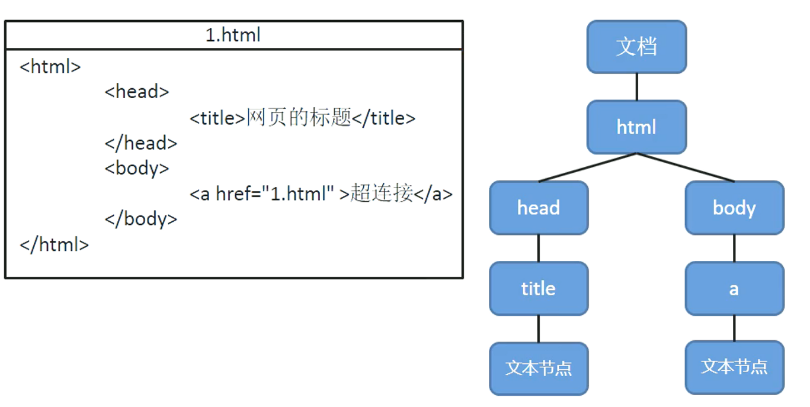
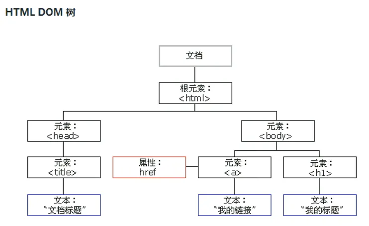
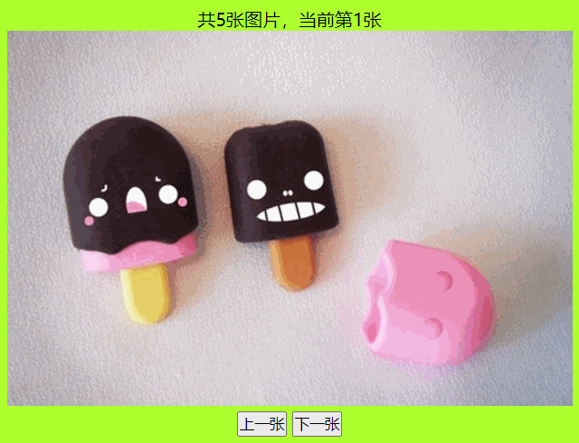
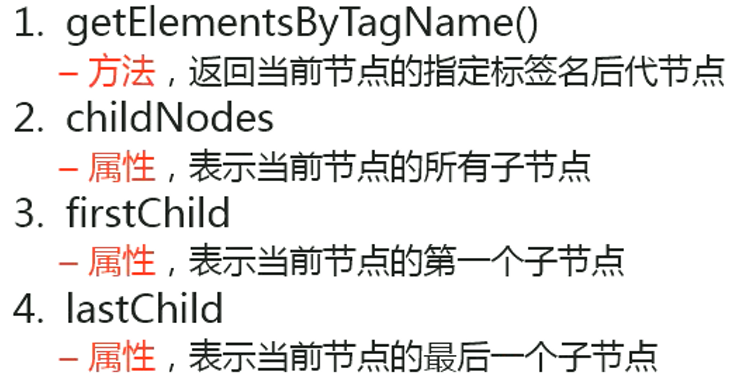
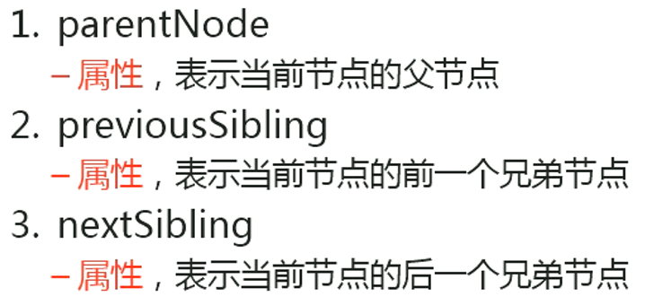
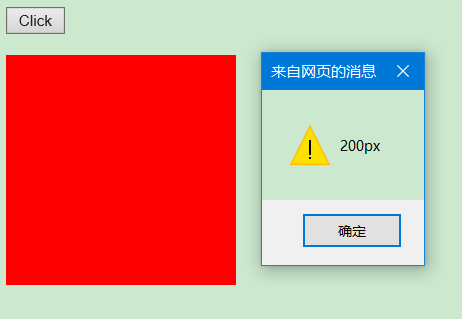
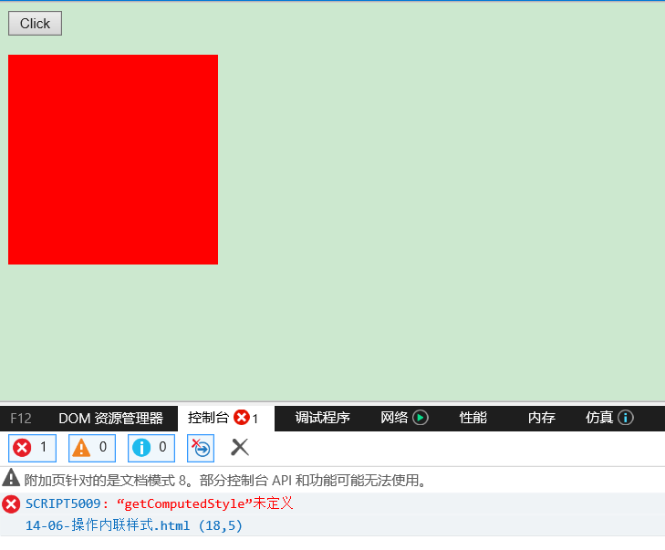
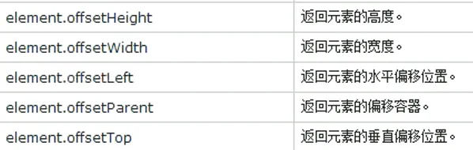
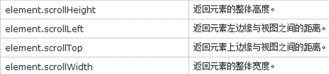

## DOM 简介
DOM，全称 Document Object Model 文档对象模型。

JS 中通过 DOM 来对 HTML 文档进行操作。只要理解了 DOM 就可以随心所欲的操作 WEB 页面。

### 文档
文档表示的就是整个的 HTML 网页文档

### 对象
对象表示将网页中的每一个部分都转换为了一个对象

### 模型
使用模型来表示对象之间的关系，这样方便我们获取对象

DOM 树体现了节点与节点之间的关系





## 节点
节点 Node，是构成我们网页的最基本的组成部分，网页中的每一个部分都可以称为是一个节点

比如：html 标签、属性、文本、注释、整个文档等都是一个节点

虽然都是节点，但是实际上他们的具体类型是不同的。比如：

1. 标签称为元素节点
2. 属性称为属性节点
3. 文本称为文本节点
4. 文档称为文档节点

节点的类型不同，属性和方法也都不尽相同

### 节点类型
节点：Node——构成 HTML 文档最基本的单元

常用节点分为四类

1. 文档节点：整个 HTML 文档
2. 元素节点：HTML 文档中的 HTL 标签
3. 属性节点：元素的属性
4. 文本节点：HTML 标签中的文本内容


### 节点属性


### 文档节点（Document）
文档节点 `document`，代表的是整个 HTML 文档，网页中的所有节点都是它的子节点

`document` 对象作为 `window` 对象的属性存在的，我们不用获取可以直接使用

通过该对象我们可以在整个文档访问内查找节点对象，并可以通过该对象创建各种节点对象

### 元素节点（Element）
HTML 中的各种标签都是元素节点，这也是我们最常用的一个节点

浏览器会将页面中所有的标签都转换为一个元素节点，我们可以通过 `document` 的方法来获取元素节点

比如：`document.getElementById()` 根据 id 属性值获取一个元素节点对象。

### 文本节点（Text）
文本节点表示的是 HTML 标签以外的文本内容，任意非 HTML 的文本都是文本节点

它包括可以字面解释的纯文本内容，文本节点一般是作为元素节点的子节点存在的

获取文本节点时，一般先要获取元素节点，再通过元素节点获取文本节点。例如：`元素节点.firstChild;`

获取元素节点的第一个子节点，一般为文本节点

### 属性节点（Attr）
属性节点表示的是标签中的一个一个的属性，这里要注意的是属性节点并非是元素节点的子节点，而是元素节点的一部分

可以通过元素节点来获取指定的属性节点。例如：`元素节点.getAttributeNode("属性名");`

**注意：我们一般不使用属性节点**

浏览器已经为我们提供文档节点对象，这个对象是 `window`

属性可以在页面中直接使用，文档节点代表的是整个网页

```javascript
// 获取 button 对象
var btn = document.getElementById("btn");
console.log(btn); // <button type="button" id="btn"> 我是一个按钮 </button>
// 修改 btn 的文本节点内容
btn.innerHTML = "I'm a button.";
```

## 文档的加载

当我们把 `script` 标签放到 `head` 中时，会报错 `UncaughtTypeError: Cannot set property 'innerHTML' of null`，这是为什么呢？

浏览器在加载一个页面时，是按照自上向下的顺序加载的，读取到一行就运行一行，如果将 `script` 标签写到页面的上边，在代码执行时，页面还没有加载，DOM 对象也没有加载，会导致无法获取到 DOM 对象

如果非要这么干，也不是没有办法，`onload` 事件会在整个页面加载完成之后才触发，可以为 window 对象绑定一个 onload 事件

```js
window.onload = function(){
    // 获取 button 对象
    var btn = document.getElementById("btn");
    // 绑定一个单击事件
    btn.onclick = function(){
        alert("Don't touch me.");
    }
}
```

该事件对应的响应函数将会在页面加载完成之后执行，这样可以确保我们的代码执行时所有的 DOM 对象已经加载完毕了

## DOM 查询

### 获取元素节点


为了方便，定义一个通用的函数，专门用来为指定元素绑定单击响应函数

```javascript
// 参数：
// 	idstr	要绑定单击响应函数的对象的 id 属性值
// 	fun		事件的回调函数，当单击元素时，该函数将会被触发
function myClick(idStr, fun){
    var btn = document.getElementById(idStr);
    btn.onclick = fun;
}
```

+  `getElementById()` 通过 id 属性获取 **一个** 元素节点对象 

```javascript
myClick("btn01", function () {
    // innerHTML 通过这个属性可以获取到元素内部的 html 代码
    alert(document.getElementById("bj").innerHTML); // 北京
});
```

+  `getElementsByTagName()` 通过标签名获取 **一组** 元素节点对象 

```javascript
myClick("btn02", function () {
    // getElementsByTagName()可以根据标签名来获取一组元素节点对象
    // 这个方法会给我们返回一个类数组对象，所有查询到的元素都会封装到对象中
    // 即使查询到的元素只有一个，也会封装到数组中返回
    var li_list = document.getElementsByTagName("li");
    alert(li_list.length); // 14
    
    var arr = [];
    for(var i=0;i<li_list.length;i++){
        arr.push(li_list[i].innerHTML);
    }
    alert(arr); // 北京, 上海, 东京, 首尔, 红警, 实况, 极品飞车, 魔兽, IOS, Android, Windows Phone, IOS, Android, Windows Phone
});
```

+  `getElementsByName()` 通过 name 属性获取 **一组** 元素节点对象 

```javascript
myClick("btn03", function () {
    var inputs = document.getElementsByName("gender");
    alert(inputs.length); // 2
    
    var arr = [];
    for(var i=0;i<inputs.length;i++){
        // innerHTML 用于获取元素内战的 HTML 代码的
        // 如果需要读取元素节点属性，直接使用 `元素.属性名`
        // 例子：`元素.id`  `元素.name`  `元素.value`
        arr.push(inputs[i].value); 
        // 注意：class 属性不能采用这种方式，读取 class 属性时需要使用 `元素.className`
        arr.push(inputs[i].className);
    }
    alert(arr); // male, hello, female, hello
});
```

**练习：图片切换**

```html
<div class="outer">
    <p id="info">共5张图片，当前第1张</p>
    
    <button type="button" id="prev">上一张</button>
    <button type="button" id="next">下一张</button>
</div>
```

```css
*{
    margin:0;
    padding:0;
}

.outer{
    width: 500px;
    margin: 50px auto;
    padding: 10px;
    background-color: greenyellow;
    /* 文本居中：内联样式当成是文本 */
    text-align: center;
}
```

```javascript
// 上一张
var prev = document.getElementById("prev");
// 下一张
var next = document.getElementById("next");
// 图片
var img = document.getElementsByTagName("img")[0];
// 信息
var info = document.getElementById("info");
// 图片集合
var imgArr = ["img/1.jpg", "img/2.jpg", "img/3.jpg", "img/4.jpg", "img/5.jpg"];
// 记录第几张
var index = 0;
// 上一张绑定单击相应事件
prev.onclick = function(){
    // 循环切换
    index = (index < 0) ? imgArr.length - 1 : index;
    // 修改 img 的 src 属性，以切换图片
    img.src = imgArr[index];
    // 修改文字提示
    info.innerHTML = "共" + imgArr.length + "张图片，当前第" + (index + 1) + "张";
    // 切换上一张
    index--;
};
// 下一张绑定单击相应事件
next.onclick = function(){
    // 循环切换			
    index = (index > imgArr.length - 1) ? 0 :index;
    // 修改 img 的 src 属性，以切换图片
    img.src = imgArr[index];
    // 修改文字提示
    info.innerHTML = "共" + imgArr.length + "张图片，当前第" + (index + 1) + "张";
    // 切换下一张
    index++;
};
```



### 获取元素节点的子节点


+  `getElementsByTagName()` 方法，返回当前节点的指定标签名后代节点 

```javascript
myClick("btn04", function () {
    var city = document.getElementById("city");
    // 获取 city 下 1i 节点
    var list = city.getElementsByTagName("li");
    alert(list.length); // 4
    
    var arr = [];
    for(var i=0;i<list.length;i++){
        arr.push(list[i].innerHTML);
    }
    alert(arr); // 北京, 上海, 东京, 首尔
});
```

+  `childNodes` 属性，表示当前节点的所有子节点 

```javascript
myClick("btn05", function () {
    var city = document.getElementById("city");
    // childNodes 属性会获取包括文本节点在内的所有节点
    // 根据 DOM 标签标签间空白也会当成文本节点
    // 注意：在 IE8 及以下的浏览器中，不会将空白文本当成子节点
    // 所以该属性在 IE8 中会返回 4 个子元素，而其他浏览器是 9 个
    var list = city.childNodes;
    alert(list.length); // 9
    
    var arr = [];
    for(var i=0;i<list.length;i++){
        arr.push(list[i]);
    }
    alert(arr); // [object Text], [object HTMLLIElement], [object Text], [object HTMLLIElement], [object Text], [object HTMLLIElement], [object Text], [object HTMLLIElement], [object Text]
});
myClick("btn05", function () {
    var city = document.getElementById("city");
    // children 属性可以获取当前元素的所有子元素
    var list = city.children;
    alert(list.length); // 4
    
    var arr = [];
    for(var i=0;i<list.length;i++){
        arr.push(list[i].innerHTML);
    }
    alert(arr); // 北京, 上海, 东京, 首尔
});
```

+  `firstChild` 属性，表示当前节点的第一个子节点 

```javascript
myClick("btn06", function () {
    var phone = document.getElementById("phone");
    // firstChild 可以获取到当前元素的第一个子节点（包括空白文本节点）
    var firstChild = phone.firstChild;				
    alert(firstChild); // [object HTMLLIElement]
    alert(firstChild.innerHTML); // IOS
});
myClick("btn06", function () {
    var phone2 = document.getElementById("phone2");
    // firstChild 可以获取到当前元素的第一个子节点（包括空白文本节点）
    var firstChild = phone2.firstChild;				
    alert(firstChild); // [object Text]
    alert(firstChild.innerHTML); // undefined
});
myClick("btn06", function () {
    var phone2 = document.getElementById("phone2");
    // firstElementchild 不支持 IE8 及以下的浏览器，如果需要兼容他们尽量不要使用
    var firstElementChild = phone2.firstElementChild;				
    alert(firstElementChild); // [object HTMLLIElement]
    alert(firstElementChild.innerHTML); // IOS
});
```

+  `lastChild` 属性，表示当前节点的最后一个子节点 

```javascript
document.getElementById("btn062").onclick = function () {
    var phone = document.getElementById("phone");
    // children 属性可以获取当前元素的所有子元素
    var lastChild = phone.lastChild;				
    alert(lastChild); // [object HTMLLIElement]
    alert(lastChild.innerHTML); // Windows Phone
});
```

### 获取父节点和兄弟节点


+ `parentNode` 属性，表示当前节点的父节点 

```javascript
myClick("btn07", function () {
    var bj = document.getElementById("bj");
    var parentNode = bj.parentNode;				
    alert(parentNode); // [object HTMLUListElement]
    alert(parentNode.innerHTML);
    // <li id="bj"> 北京 </li>
    // <li> 上海 </li>
    // <li> 东京 </li>
    // <li> 首尔 </li>
    
    // innerText
    // -该属性可以获取到元素内部的文本内容
    // -它和 innerHTML 类似，不同的是它会自动将 htm1 去除
    alert(parentNode.innerText);
    // 北京
    // 上海
    // 东京
    // 首尔
});
```

+ `previousSibling` 属性，表示当前节点的前一个兄弟节点 

```javascript
myClick("btn08", function () {
    var android = document.getElementById("android");
    // 返回#android 的前一个兄弟节点（也可能获取到空白的文本）
    var previousSibling = android.previousSibling;				
    alert(previousSibling); // [object HTMLLIElement]
    alert(previousSibling.innerHTML); // IOS
});
myClick("btn08", function () {
    var android2 = document.getElementById("android2");
    // 返回#android 的前一个兄弟节点（也可能获取到空白的文本）
    var previousSibling = android2.previousSibling;				
    alert(previousSibling); // [object Text]
    alert(previousSibling.innerHTML); // undefined
});
myClick("btn08", function () {
    var android2 = document.getElementById("android2");
    // previousElementSibling 获取前一个兄弟元素，IE8 及以下不支持
    var previousElementSibling = android2.previousElementSibling;				
    alert(previousElementSibling); // [object HTMLLIElement]
    alert(previousElementSibling.innerHTML); // IOS
});
```

+ `nextSibling` 属性，表示当前节点的后一个兄弟节点 

```javascript
myClick("btn082", function () {
    var android = document.getElementById("android");
    // 返回#android 的前一个兄弟节点（也可能获取到空白的文本）
    var nextSibling = android.nextSibling;				
    alert(nextSibling); // [object HTMLLIElement]
    alert(nextSibling.innerHTML); // Windows Phone
});
```

### document.body
在 `document` 中有一个属性 `body`，它保存的是 `body` 的引用

```javascript
// 注意：如果 script 标签是定义在 head 中的，则这里需要 window.onload = function(){}包裹，否则会出现 null 的情况
var body = document.getElementsByTagName("body");
console.log(body); // HTMLCollection [body]
body = document.body;
console.log(body); // <body> </body>
console.log(typeof body); // object
```

### document.documentElement
`document.documentElement` 保存的是 `html` 根标签

```javascript
var html = document.documentElement;
console.log(html);
```

### document.all
`document.all` 代表页面中所有的元素

```javascript
var all = document.all;
console.log(all); // HTMLAllCollection(11) [html, head, meta, title, script, script, script, body, script, script, script]
console.log(all.length); // 11
console.log(typeof all); // undefined
for(var i=0;i<all.length;i++){
    console.log(all[i]);
}

var el = document.getElementsByTagName("*");
console.log(el); // HTMLCollection(11) [html, head, meta, title, script, script, script, body, script, script, script]
console.log(all.length); // 11
console.log(typeof all); // undefined
for(var i=0;i<el.length;i++){
    console.log(el[i]);
}
```

### document.getElementsByClassName()
根据元素的 `class` 属性值查询一组元素节点对象

`getElementsByClassName()` 可以根据 `class` 属性值获取一组元素节点对象，但是该方法不支持 IE8 及以下的浏览器

```javascript
var boxs = document.getElementsByClassName("box");
console.log(boxs); // HTMLCollection(3) [div.box, div.box, div.box]
console.log(boxs.length); // 3
console.log(typeof boxs); // object
```

### document.querySelector()
需要一个选择器的字符串作为参数，可以根据一个 CSS 选择器来查询一个元素节点对象

虽然 IE8 中没有 `getElementsByClassName()` 但是可以使用 `querySelector()` 代替

使用该方法总会返回唯一的一个元素，如果满足条件的元素有多个，那么它只会返回第一个

```javascript
var div = document.querySelector(".box div");
console.log(div.innerHTML); // I'm first div.
boxs = document.querySelector(".box");
console.log(boxs); 
// <div class="box">
// 		<div> I'm first div.</div>
// </div>
```

### document.querySelectorAll()
该方法和 `querySelector()` 用法类似，不的是它会将符合条件的元素封装到一个数组中返回

即使符合条件的元素只有一个，它也会返回数组

```javascript
boxs = document.querySelectorAll(".box");
console.log(boxs); // NodeList(3) [div.box, div.box, div.box]
console.log(boxs.length); //3
```

## DOM 增删改
### document.createElement()
可以用于创建一个元素节点对象，它需要一个标签名作为参数，将会根据该标签名创建元素节点对象，并将创建好的对象作为返回值返回

### document.createTextNode()
可以用来创建一个文本节点对象，它需要一个文本内容作为参数，将会根据该内容创建文本节点，并将新的节点返回

### appendChild()
向一个父节点中添加一个新的子节点，用法：`父节点.appendChild(子节点);`

### insertBefore()
可以在指定的子节点前插入新的子节点，语法：`父节点.insertBefore(新节点, 旧节点);`

### replaceChild()
可以使用指定的子节点替换已有的子节点，语法：`父节点.replaceChild(新节点, 旧节点);`

### removeChild()
可以删除一个子节点，语法：`父节点.removeChild(子节点);`、`子节点.parentNode.removeChild(子节点);`

```javascript
// 创建一个 "广州" 节点, 添加到#city 下
var city = document.getElementById("city");
myClick("btn01",function(){
    // 创建元素节点
    var li = document.createElement("li");
    // 创建文本节点
    var gz = document.createTextNode("广州");
    // 将文本节点添加到元素节点中
    li.appendChild(gz);
    // 将元素节点添加至#city 下
    city.appendChild(li);
});

// 将 "广州" 节点插入到#bj 前面	
var bj = document.getElementById("bj");
myClick("btn02",function(){
    var li = document.createElement("li");
    var gz = document.createTextNode("广州");
    li.appendChild(gz);
    // 将元素节点插入到#bj 前面
    city.insertBefore(li,bj);
});

// 使用 "广州" 节点替换#bj 节点
myClick("btn03",function(){
    var li = document.createElement("li");
    var gz = document.createTextNode("广州");
    li.appendChild(gz);
    // 将元素节点替换#bj 节点
    city.replaceChild(li,bj);
});

// 删除#bj 节点
myClick("btn04",function(){
    // 将元素节点替换#bj 节点
    // city.removeChild(bj);
    // 更常用，不需要知道父节点是什么	
    bj.parentNode.removeChild(bj);
});

// 使用 innerHTML 将 "广州" 节点添加到#city 下
myClick("btn07",function(){
    // 使用 innerHTML 也可以完成 DOM 的增删改的相关操作
    // city.innerHTML += "<li> 广州 </li>";
    // 不过这种方式会先删除再替换，耗费性能，所以一般我们会两种方式结合使用
    var li = document.createElement("li");
    li.innerHTML = "广州";
    city.appendChild(li);
});
```

## 操作内联样式
### 修改元素内联样式
通过 JS 修改元素的内联样式，语法：`元素.style.样式名 = 样式值`

```javascript
box1.style.height = "200px";
box1.style.width = "200px";
```

注意：如果 CSS 的样式名中含有 `-`，这种名称在 JS 中是不合法的，比如 `background-color`

需要将这种样式名修改为驼峰命名法，去掉 `-`，然后将 `-` 后的字母大写

```javascript
// box1.style.background-color = "red"; // Uncaught SyntaxError: Invalid left-hand side in assignment
box1.style.backgroundColor = "red";
```

我们通过 style 属性设置的样式都是内联样式，而内联样式有较高的优先级，所以通过 JS 修改的样式往往会立即显示，但是如果在样式中写了 `!important`，则此时样式会有最高的优先级，即使通过 JS 也不能覆盖该样式，此时将会导致 JS 修改样式失效，所以尽量不要为样式添加 `!important`

我们给 `background-color` 设置 `!important` 之后，通过 `box1.style.backgroundColor = "red";` 设置的样式就“废”了

```css
background-color: yellow !important;
```

### 读取元素内联样式
通过 JS 读取元素的内联样式，语法：`元素.style.样式名`

通过 style 属性设置和读取的都是内联样式，无法读取样式表中的样式

```javascript
alert(box1.style.height); // 
box1.style.height = "200px";
alert(box1.style.height); // 200px
```

### 读取元素样式
获取元素的当前显示的样式，语法：`元素.currentStyle.样式名`

它可以用来读取当前元素正在显示的样式，如果当前元素没有设置该样式，则获取它的默认值

```javascript
alert(box1.currentStyle.height); // 100px
box1.style.height = "200px";
alert(box1.currentStyle.height); // 200px
```

不过 `currentstyle` 只有 IE 浏览器支持，其他的浏览器都不支持。我们在 IE 中测试是可行的，在 Chrome 或 Edge 中报错的：`UncaughtTypeError: Cannot read property 'height' of undefined`

不过，在其他浏览器中可以使用 `getComputedStyle()` 这个方法来获取元素当前的样式，这个方法是 `window` 的方法，可以直接使用，需要两个参数

1. 第一个：要获取样式的元素
2. 第二个：可以传递一个伪元素，一般都传 `null`

该方法会返回一个对象，对象中封装了当前元素对应的样式，可以通过 `对象.样式名` 来读取样式，如果获取的样式没有设置，则会获取到真实的值，而不是默认值。比如：没有设置 width，它不会获取到 auto，而是一个长度，但是该方法不支持 IE8 及以下的浏览器

```javascript
var obj = getComputedStyle(box1, null);
alert(obj); // [object CSSStyleDeclaration]
alert(obj.width); // 200px
alert(obj.height); // 200px
alert(obj.backgroundColor); // rgb(255, 0, 0)
```

那么问题来了，如果想要兼容 IE8 及以下的浏览器，该怎么办呢？通过 `currentStyle` 和 `getComputedStyle()` 读取到的样式都是只读的，不能修改，如果要修改必须通过 `style` 属性，那么就只能自己写个函数，来兼容所有浏览器

```javascript
// 自定义兼容所有浏览器获取元素样式的方法
function getStyle(obj, name) {
    // 判断是否有 getComputedStyle 方法
    if (getComputedStyle) {
        // 正常浏览器的方式
        return getComputedStyle(obj, null)[name];
    } else {
        // IE 的方式
        return obj.currentStyle[name];
    }
}
```

**测试结果**

1. Hbuilder 内置浏览器


2. Chrome


3. Edge


4. IE11



5. IE8



怎么 IE8 还是不行，提示 `“getComputedStyle”未定义`？这是因为执行到 if 语句时，会先在 function 中找，找不到会在全局作用域中找，全局作用域中也找不到 `getComputedStyle`，就会报错了

那么怎么解决这个问题呢？我们先改造一下 function 代码，将 `getComputedStyle` 改成 `window.getComputedStyle`

```javascript
function getStyle(obj, name) {
    // 判断是否有 getComputedStyle 方法
    if (window.getComputedStyle) {
        // 正常浏览器的方式
        return getComputedStyle(obj, null)[name];
    } else {
        // IE 的方式
        return obj.currentStyle[name];
    }
}
```

**效果**


为什么呢？因为变量找不到会报错，而属性找不到返回的是 `undefined` 而不会报错，这样就可以利用 `undefined != true` 的特点，执行 else 中的代码

同理，下面代码同样可以判断，只不过，会优先走 `currentStyle` 的方式，而我们希望的优先走 `getComputedStyle` 方法，所以不建议用

```javascript
function getStyle(obj, name) {
    // 判断是否有 currentStyle 属性
    if (obj.currentStyle) {
        // IE 的方式
        return obj.currentStyle[name];
    } else {
        // 正常浏览器的方式
        return getComputedStyle(obj, null)[name];
    }
}
```

## 其他样式相关的属性




### clientwidth、clientHeight
这两个属性可以获取元素的可见宽度和高度，这些属性都是不带 `px` 的，返回都是一个数字，可以直接进行计算

会获取元素宽度和高度，包括内容区和内边距，这些属性都是只读的，不能修改（改只有一种方式，就是通过 `元素.style.样式 = 样式值`）

```javascript
// #box1 {
// 	width: 100px;
// 	height: 100px;
// 	background-color: red;
// 	padding: 10px;
// 	border: 10px solid yellow;
// }
alert(box1.clientHeight); // 120
alert(box1.clientWidth); // 120
```

### offsetwidth、offsetHeight
获取元素的整个的宽度和高度，包括内容区、内边距和边框

```javascript
// #box1 {
// 	width: 100px;
// 	height: 100px;
// 	background-color: red;
// 	padding: 10px;
// 	border: 10px solid yellow;
// }
alert(box1.offsetHeight); // 140
alert(box1.offsetWidth); // 140
```

### offsetParent
可以用来获取当前元素的定位父元素，会获取到离当前元素最近的开启了定位（只要 `position` 不是 `sticky`）的祖先元素，如果所有的祖先元素都没有开启定位，则返回 `body`

```javascript
// <div id="box1"> </div>
alert(box1.offsetParent); // [object HTMLBodyElement]

// <div id="box2">
//     <div id="box1"> </div>
// </div>
alert(box1.offsetParent); // [object HTMLBodyElement]

//<div id="box3">
//	<div id="box2">
//		<div id="box1"> </div>
//	</div>
//</div>
alert(box1.offsetParent); // [object HTMLBodyElement]

//<div id="box3" style="position: relative;">
//	<div id="box2" style="position: relative;">
//		<div id="box1"> </div>
//	</div>
//</div>
alert(box1.offsetParent); // [object HTMLDivElement]
alert(box1.offsetParent.id); // box2

//<div id="box3" style="position: relative;">
//	<div id="box2">
//		<div id="box1"> </div>
//	</div>
//</div>
alert(box1.offsetParent); // [object HTMLDivElement]
alert(box1.offsetParent.id); // box3
```

### offsetLeft、offsetTop
当前元素相对于其定位父元素的水平或垂直偏移量

```javascript
//<div id="box3">
//	<div id="box2">
//		<div id="box1"> </div>
//	</div>
//</div>
alert(box1.offsetLeft); // 8  浏览器的默认样式
alert(box1.offsetTop); // 54

//<div id="box3">
//	<div id="box2" style="position: relative;">
//		<div id="box1"> </div>
//	</div>
//</div>
alert(box1.offsetLeft); // 0
alert(box1.offsetTop); // 0
```

### scrollHeight、scrollWidth
可以获取元素整个滚动区域的宽度和高度

```javascript
// #box4 {
// 	width: 200px;
// 	height: 300px;
// 	background-color: yellow;
// 	overflow: auto;
// }
// #box5 {
// 	width: 400px;
// 	height: 600px;
// 	background-color: #bfa;
// }
alert(box4.scrollHeight); // 600
alert(box4.scrollWidth); // 400
```

### scrollLeft、scrollTop
可以获取水平或垂直滚动条滚动的距离

```javascript
// #box4 {
// 	width: 200px;
// 	height: 300px;
// 	background-color: yellow;
// 	overflow: auto;
// }
// #box5 {
// 	width: 400px;
// 	height: 600px;
// 	background-color: #bfa;
// }
alert(box4.scrollLeft); // 0/71.19999694824219/92/... 随着水平滚动条滚动而发生变化
alert(box4.scrollTop); // 0/163.1999969482422/116/... 随着垂直滚动条滚动而发生变化
```

看这么一个问题，打印如下值，将水平和垂直滚动条滚动到底

```javascript
alert(box4.clientHeight + ", " + (box4.scrollHeight - box4.scrollTop)); // 283, 283.20001220703125
alert(box4.clientWidth + ", " + (box4.scrollWidth - box4.scrollLeft)); // 183, 183.1999969482422
```

PS：我这里打印的结果存在小数点，不知为何

+ 当满足 `scrollHeight - scrollTop == clientHeight`，说明垂直滚动条滚动到底了
+ 当满足 `scrollWidth - scrollLeft == clientwidth`，说明水平滚动条滚动到底

那么这个原理有什么用呢？

~~爱到底到底，管我什么事~~ 有些网站注册时会有一个 ~~霸王条款~~ 用户协议，要确保用户阅读协议了，才允许注册。那问题来了，怎么确保用户阅读了协议呢？就是利用了上述原理，当滚动条拖至最底部时，就可以注册了。

那么接下来，我们就做一个 ~~霸王条款~~ 用户协议

**练习**

```html
<div id="outer">
    <h3>亲爱的用户，欢迎注册本网站</h3>
    <p id="info">
        亲爱的用户，请仔细阅读以下协议，如果你不仔细阅读你就别注册
        此处省略一万字。。。
    </p>
    <div id="checkDiv">
        <input type="checkbox" name="checkInput" value="1" id="checkInput" disabled="disabled" />我已仔细阅读协议，一定遵守
    </div>
    <div id="submitDiv">
        <input type="submit" id="submitInput" disabled="disabled" value="注册"/>
    </div>
</div>
```

```css
#outer {
    width: 500px;
}

#outer,
h3,
#checkDiv,
#submitDiv,
#submitInput {
    margin: 10px auto;
}

#checkDiv {
    width: 250px;
}

#submitInput {
    display: block;
}

#info {
    height: 600px;
    overflow: auto;
}
```

```javascript
// 为滚动条绑定事件，就是为有滚动条的元素绑定事件
var info = document.getElementById("info");
var checkInput = document.getElementById("checkInput");
var submitInput = document.getElementById("submitInput");
info.onscroll = function() {
    // 当滚动条滚动到底时，启用并自动勾选协议，并启用注册按钮
    if (parseInt(info.scrollHeight - info.scrollTop) == parseInt(info.clientHeight)) {
        // 自动勾选协议
        checkInput.disabled = false;
        checkInput.checked = true;
        // 启用注册按钮
        submitInput.disabled = false;
    }
}
// 为 checkInput 绑定勾选响应事件
checkInput.onclick = function(ret) {
    // 如果勾选了协议，则启用注册按钮，否则禁用注册按钮
    if (!checkInput.checked) {
        submitInput.disabled = true;
    }
    else{
        submitInput.disabled = false;
    }
}
// 为 submit 绑定单击响应函数
submitInput.onclick = function(){
    if(confirm("确认注册吗？")){
        alert("注册成功");
    }
}
```

**效果**


