## 文档的加载
当我们把 `script` 标签放到 `head` 中时，会报错 `UncaughtTypeError: Cannot set property 'innerHTML' of null`，这是为什么呢？

浏览器在加载一个页面时，是按照自上向下的顺序加载的，读取到一行就运行一行，如果将 `script` 标签写到页面的上边，在代码执行时，页面还没有加载，DOM 对象也没有加载，会导致无法获取到 DOM 对象

如果非要这么干，也不是没有办法，`onload` 事件会在整个页面加载完成之后才触发，可以为 `window` 对象绑定一个 `onload` 事件

```javascript
window.onload = function(){
    // 获取 button 对象
    var btn = document.getElementById("btn");
    // 绑定一个单击事件
    btn.onclick = function(){
        alert("Don't touch me.");
    }
}
```

该事件对应的响应函数将会在页面加载完成之后执行，这样可以确保我们的代码执行时所有的 DOM 对象已经加载完毕了

## 事件
事件，就是文档或浏览器窗口中发生的一些特定的交互瞬间

JavaScript 与 HTML 之间的交互是通过事件实现的

对于 Web 应用来说，有下面这些代表性的事件：点击某个元素、将鼠标移动至某个元素上方、按下键盘上某个键，等等

### 事件属性


我们可以在事件对应的属性中设置一些 js 代码，这样当事件被触发时，这些代码将会执行

```html
<button type="button" id="btn" onclick="alert('Fuck');">我是一个按钮</button>
```

这种写法我们称为结构和行为耦合，不方便维护，不推荐使用

可以为按钮的对应事件绑定处理函数的形式来响应事件，这样当事件被触发时，其对应的函数将会被调用

```javascript
// 绑定一个单击事件
btn.onclick = function(){
    alert("Don't touch me.");
}
```

### 鼠标/键盘属性
**练习1：当鼠标在areaDiv中移动时，在showMsg中来显示鼠标的坐标**

```html
<div id="areaDiv"></div>
<div id="showMsg"></div>
```

```css
#areaDiv {
    border: 1px solid black;
    width: 300px;
    height: 50px;
    margin-bottom: 10px;
}

#showMsg {
    border: 1px solid black;
    width: 300px;
    height: 20px;
}
```

```javascript
var areaDiv = document.getElementById("areaDiv");
var showMsg = document.getElementById("showMsg");
// 绑定鼠标移动事件
areaDiv.onmousemove = function(event){
    console.log(event); // IE8：undefined
    // clientX 可以获取鼠标指针的水平坐标
    // cilentY 可以获取鼠标指针的垂直坐标
    var x = event.clientX;
    var y = event.clientY;
    showMsg.innerHTML = "x = " + x + ", y = " + y;
}
```

**效果**

1. 内置浏览器

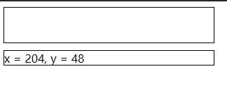

2. Chrome

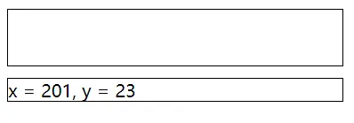

3. Edge

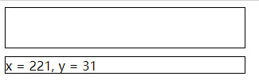

4. IE11

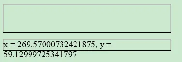

5. IE8

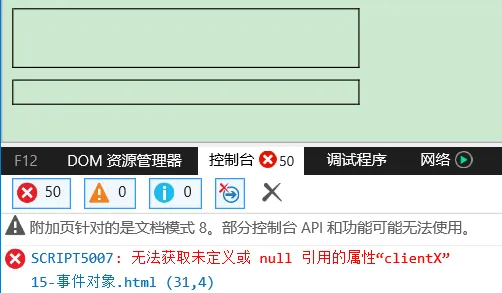

在 IE8 中，响应函数被触发时，浏览器不会传递事件对象

在 IE8 及以下的浏览器中，是将事件对象作为 `window` 对象的属性保存的，我们可以对其进行兼容性改造

```javascript
event = event || window.event;
var x = event.clientX;
var y = event.clientY;
showMsg.innerHTML = "x = " + x + ", y = " + y;
```

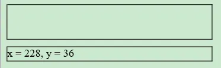

**练习2：div跟随鼠标移动**

```javascript
// 兼容性写法
event = event || window.event;
var left = event.clientX;
var top = event.clientY;
// div 随鼠标移动，注意 style 属性是有单位的
box1.style.left = (left - box1.clientWidth / 2) + "px";
box1.style.top = (top - box1.clientHeight / 2) + "px";
```


但是，当我们给 body 设置一个较大 `height` 属性值时，会发现一个问题，就是鼠标指针与 div 之间存在一定距离


这是为什么呢？

+ `clientX` 和 `clientY` 用于获取鼠标在当前的可见窗口的坐标 div 的偏移量，是相对于整个页面的
+ `pageX` 和 `pageY` 可以获取鼠标相对于当前页面的坐标，但是这个两个属性在 IE8 中不支持，所以如果需要兼容 IE8，则不要使用

```javascript
var left = event.pageX;
var top = event.pageY;
```

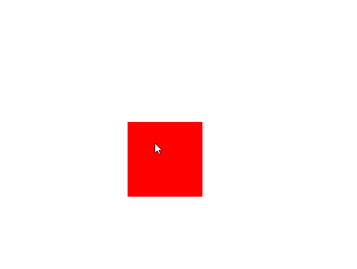

貌似好了哈，那直接测试下 IE8？

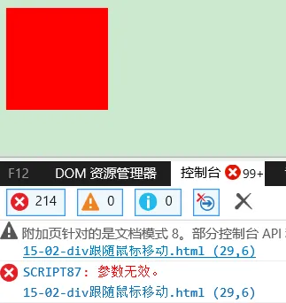

我们现在给 body 设置了一个 `height`，红色框表示可见区域大小，蓝色框表示 body 的实际区域大小

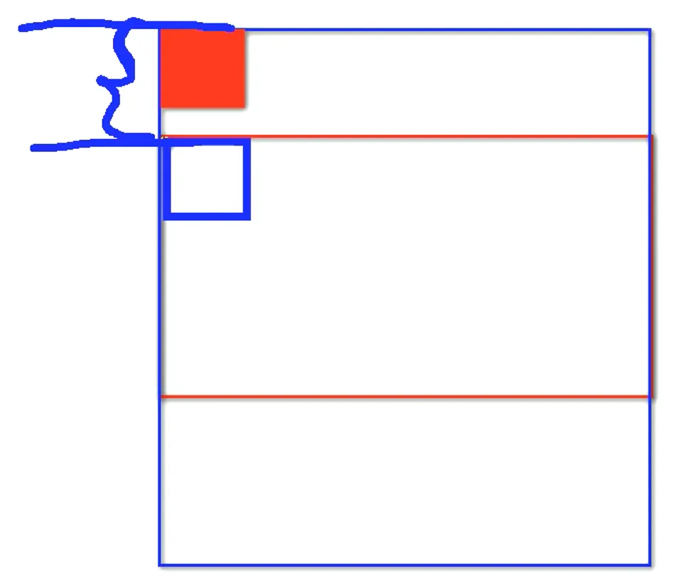

既然我们没办法使用 `pageX` 和 `pageY` 兼容 IE8，那暂时只能使用 `clientX` 和 `clientY` 了，而 `clientX` 和 `clientY` 是按照可见区域大小计算的，那让 div 的水平和垂直偏移量也按照可见区域大小计算不就行了吗？但是我们又暂时没办法让 div 总是参考可见区域大小的原点作为定位的原点，难道就没有办法了吗？

`scrollTop` 表示滚动条的垂直滚动距离，而 div 位置原点与鼠标指针原点的差距应该刚好是滚动条垂直滚动的距离，那么是不是可以利用这两个属性来“弥补” 这两者之间的距离差呢？

```javascript
box1.style.top = (document.body.scrollTop + top - box1.clientHeight / 2) + "px";
```

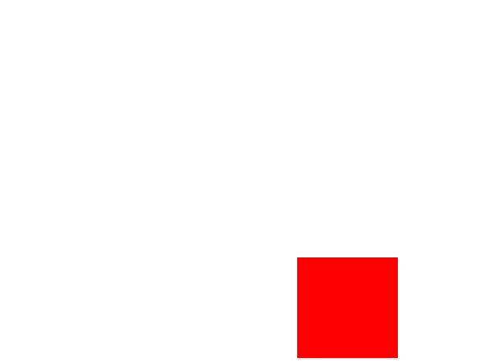

发现还是不行，要知道我们是给 body 设置的 `height` 属性，之所以出现滚动条是因为 body 的父元素容不下 body 了，所以应该获取谁的 `scrollTop` 属性？body 的父元素，即 html

```javascript
box1.style.top = (document.documentElement.scrollTop + top - box1.clientHeight / 2) + "px";
```

1. Chrome

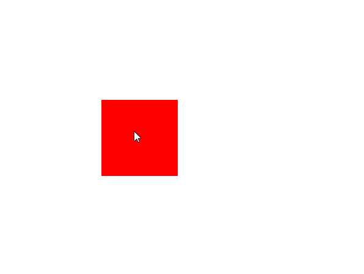

2. IE8

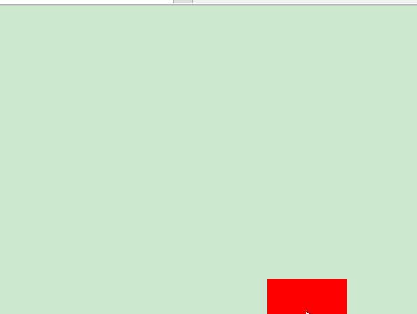

在视频中，测试的结果是 Chrome 和火狐等浏览器获取 `scrollTop` 的对象不一致，需要做兼容

> chrome 认为浏览器的滚动条是 body 的，可以通过 body.scrollTop 来获取火狐等浏览器认为浏览器的滚动条是 html 的，
>

```javascript
var st = document.body.scrollTop || document.documentElement.scrollTop;
```

但是不知道什么原因（浏览器对 `scrollTop` 和 `scrollLeft` 都统一兼容了？毕竟视频是几年前的了），我这里并没有这个问题，所以上述问题存疑，待考究，后面以我实际代码测试结果为准

同理，当水平方向有滚动条时，也要消除水平方向上的距离差，所以综合代码如下

```javascript
box1.style.left = (document.documentElement.scrollLeft + left - box1.clientWidth / 2) + "px";
box1.style.top = (document.documentElement.scrollTop + top - box1.clientHeight / 2) + "px";
```

我这里通过 `documentElement` 获取的 `scrollLeft` 和 `scrollTop` 在 Chrome、Edge、IE11、IE8 中均正常

### 事件的冒泡（Bubble）
```html
<div id="box1">
    我是div 
    <span id="s1">
        我是span
    </span>
</div>
```

```css
#box1{
    width:200px;
    height:	200px;
    background-color: #99FF99;
}
#s1{
    background-color: yellowgreen;
}
```

```javascript
document.getElementById("s1").onclick = function(){
    alert("我是span"); // 我是 span 我是 div 我是 body 我是 HTML
};
document.getElementById("box1").onclick = function(){
    alert("我是div"); // 我是 div 我是 body 我是 HTML
};
document.body.onclick = function(){
    alert("我是body"); // 我是 body 我是 HTML
};
document.documentElement.onclick = function(){
    alert("我是HTML"); // 我是 HTML
};
```

所谓的 **冒泡** 指的就是事件的向上传导，当后代元素上的事件被触发时，其祖先元素的相同事件也会被触发

在开发中大部分情况冒泡都是有用的，如果不希望发生事件冒泡可以通过事件对象来 **取消冒泡**

可以将事件对象的 `cancelBubble` 设置为 `true`，即可取消冒泡

```javascript
document.getElementById("s1").onclick = function(event){
    // 兼容 event
    event = event || window.event;
    alert("我是span"); // 我是 span
    event.cancelBubble = true;
};
```

### 事件的委派（Delegate）
```html
<button type="button" id="btn">Add</button>
<ul id="ulDiv">
    <li><a href="javascript:;">超链接1</a></li>
    <li><a href="javascript:;">超链接2</a></li>
    <li><a href="javascript:;">超链接3</a></li>
</ul>
```

```javascript
function clickFun(){
    alert("超链接");
}

window.onload = function(){
    // 为每一个超链接都绑定一个单击响应函数
    var aList = document.getElementsByTagName("a");
    for(var i=0;i<aList.length;i++){
        aList[i].onclick = clickFun;
    }
    var btn = document.getElementById("btn");
    var ulDiv = document.getElementById("ulDiv");
    btn.onclick = function(){
        var li = document.createElement("li");
        li.innerHTML = "<a href=\"javascript:;\">add超链接</a>";
        ulDiv.appendChild(li);
    };
};
```

这里我们为每一个超链接都绑定了一个单击响应函数，这种操作比较麻烦

而且这些操作只能为已有的超链接设置事件，而新添加的超链接必须重新绑定

我们希望，只绑定一次事件，即可应用到多个的元素上，即使元素是后添加的

我们可以尝试将其绑定给元素的共同的祖先元素

```javascript
ulDiv.onclick = function(){
    alert("事件委派超链接");
};
```

**事件委派** 是指将事件统一绑定给元素的共同的祖先元素

这样当后代元素上的事件触发时，会一直冒泡到祖先元素，从而通过祖先元素的响应函数来处理事件

事件委派是利用了冒泡，通过委派可以减少事件绑定的次数，提高程序的性能

但是也有个问题，我们是给整个 ul 绑定的单击响应事件，ul 是块元素，在超链接所在行点击任何位置都会触发事件

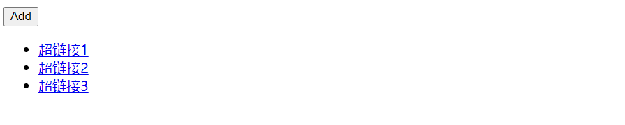

那怎么办呢？我们就需要再加一层判断： 如果触发事件的对象是我们期望的元素，则执行否则不执行

那怎么知道触发事件的对象是什么呢？

```javascript
ulDiv.onclick = function(event){
    event = event || window.event;
    // 如果触发事件的对象是我们期望的元素，则执行否则不执行
    // alert(event.target); // 点击超链接外：[object HTMLLIElement]; 点击超链接：javascript:;
    if(event.target.className == "link"){
        alert("事件委派超链接");
    }
};
```

但是这种写法有点问题，当其 `class` 属性有多个时，就不对了

```html
<li><a href="javascript:;" class="link hello">超链接1</a></li> <!-- 失效 -->
<li><a href="javascript:;" class="link">超链接2</a></li>
<li><a href="javascript:;" class="link">超链接3</a></li>
```

我这里将 `tagName` 代替 `className` 作为判断条件进行判断

```javascript
ulDiv.onclick = function(event){
    event = event || window.event;
    if(event.target.tagName == "A" || event.target.tagName == "a"){
        alert("事件委派超链接");
    }
};
```

### 事件的绑定（Bind）
#### on 事件名
使用 `对象.事件 = 函数` 的形式绑定响应函数，它只能同时为一个元素的一个事件绑定一个响应函数

不能绑定多个，如果绑定了多个，则后边会覆盖掉前边的

```javascript
var btn = document.getElementById("btn");
// 为 btn 绑定一个单击响应函数
btn.onclick = function() {
    alert(1);
};
// 为 btn 绑定第二个响应函数
btn.onclick = function() {
    alert(2); // 2
};
```

#### addEventListener()
`addEventListener()` 通过这个方法也可以为元素绑定响应函数，参数：

1. 事件的字符串，不要 `on`
2. 回调函数，当事件触发时该函数会被调用
3. 是否在捕获阶段触发事件，需要一个布尔值，一般都传 `false`

使用 `addEventListener()` 可以同时为一个元素的相同事件同时绑定多个响应函数

这样当事件被触发时，响应函数将会按照函数的绑定顺序执行

```javascript
btn.addEventListener("click", function(){
    alert(1); // 1
}, false);
btn.addEventListener("click", function(){
    alert(2); // 2
}, false);
btn.addEventListener("click", function(){
    alert(3); // 3
}, false);
```

我们直接在 IE8 中进行测试，这个方法不支持 IE8 及以下的浏览器

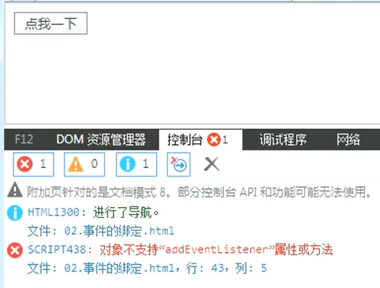

那说了半天，IE8 需要用什么方法替代呢？

#### attachEvent()
`attachEvent()` 在 IE8 中可以用来绑定事件，参数：

1. 事件的字符串，要 `on`
2. 回调函数

```javascript
btn.attachEvent("onclick", function(){
    alert(1); // 1
});
btn.attachEvent("onclick", function(){
    alert(2); // 2
});
btn.attachEvent("onclick", function(){
    alert(3); // 3
});
```

继续测试，在 IE8 中没有报错，但是执行顺序却是相反的，而且其他浏览器中直接就不行了

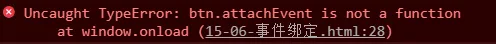

**总结：** 这个方法也可以同时为一个事件绑定多个处理函数，不同的是它是后绑定先执行，执行顺序和 `addEventListener()` 相反

看起来，我们还是要自己封装一个方法来兼容不同的浏览器

```javascript
// 定义一个函数，用来为指定元素绑定响应函数
// 参数：
// - obj 要绑定事件的对象
// - eventStr 事件的字符串
// - callback 回调函数
function bind(obj, eventStr, callback) {
    if (obj.addEventListener) {
        obj.addEventListener(eventStr, callback, false);
    } else {
        obj.attachEvent("on" + eventStr, callback);
    }
}
```

我们调用下只能自定义的 `bind` 函数

```javascript
bind(btn, "click", function() {
    alert(1);
});
```

测试下效果，发现在 IE8 和其他浏览器中均支持

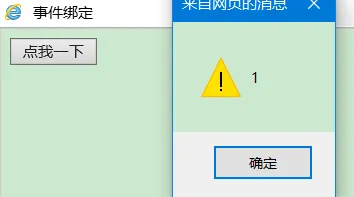

好，我们接着再看个问题

```javascript
bind(btn, "click", function() {
    alert(this); // IE8: [object window]；非 IE8：[object HTMLButtonElement]
});
```

测试发现，在 Chrome 中打印的是 `[object HTMLButtonElement]`

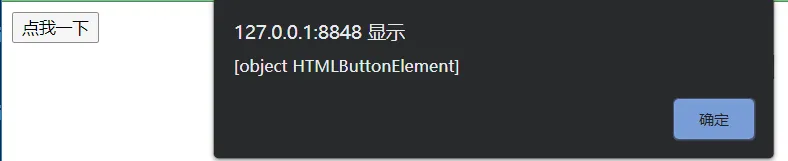

而在 IE8 中打印的却是 `[object window]`

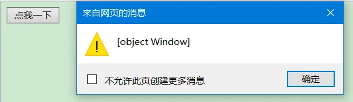

`addEventListener()` 中的 `this` 是绑定事件的对象，`attachEvent()` 中的 `this` 是 `window`，需要统一两个方法 `this`

我们之前讲过 `call` 和 `apply` 方法，`this` 是指定的那个对象，是不是可以利用 `call` 或者 `apply` 方法对 `bind` 函数进行优化呢？

```javascript
function bind(obj, eventStr, callback) {
    if (obj.addEventListener) {
        obj.addEventListener(eventStr, callback, false);
    } else {
        // this 是谁由调用方式决定
        // callback.call(obj)
        obj.attachEvent("on" + eventStr, function(){
            // 在匿名函数中调用回调函数
            callback.call(obj);
        });
    }
}
```

### 事件的传播
关于事件的传播网景公司和微软公司有不同的理解

1. 微软公司认为事件应该是由内向外传播，也就是当事件触发时，应该先触发当前元素上的事件，然后再向当前元素的祖先元素上传播，也就说件应该在 **冒泡阶段** 执行
2. 网景公司认为事件应该是由外向内传播的，也就是当前事件触发时，应该先触发当前元素的最外层的祖先元素的事件，然后在向内传播给后代元素
3. W3C 综合了两个公司的方案，将事件传播分成了三个阶段 
+ 捕获阶段：在捕获阶段时从最外层的祖先元素，向目标元素进行事件的捕获，但是默认此时不会触发事件
+ 目标阶段：事件捕获到目标元素，捕获结束开始在目标元素上触发事件
+ 冒泡阶段：事件从目标元素向他的祖先元素传递，依次触发祖先元素上的事件


如果希望在捕获阶段就触发事件，可以将 `addEventListener()` 的第三个参数设置为 `true`

一般情况下我们不会希望在捕获阶段触发事件，所以这个参数一般都是 `false`

IE8 及以下的浏览器中没有捕获阶段

## 拖拽
### 拖拽的流程
1. 当鼠标在被拖拽元素上按下时，开始拖拽 `onmousedown`
2. 当鼠标移动时被拖拽元素跟随鼠标移动 `onmousemove`
3. 当鼠标松开时，被拖拽元素固定在当前位置 `onmouseup`

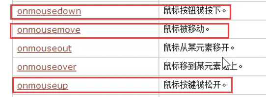

```html
<div id="box1"></div>
<div id="box2"></div>
```

```css
#box1 {
    width: 100px;
    height: 100px;
    background-color: red;
    position: absolute;
}
#box2 {
    width: 100px;
    height: 100px;
    background-color: yellow;
    position: absolute;
    left: 300px;
    top: 300px;
}
```

```javascript
var box1 = document.getElementById("box1");
// 1. 当鼠标在被拖拽元素上按下时，开始拖拽 `onmousedown`
box1.onmousedown = function(event) {
    event = event || window.event;
    var boxLeft = event.clientX - box1.offsetLeft; // 鼠标水平坐标 - 元素水平偏移量 = 鼠标原点和元素原点水平距离
    var boxTop = event.clientY - box1.offsetTop; // 鼠标垂直坐标 - 元素垂直偏移量 = 鼠标原点和元素原点垂直距离
    // 2. 当鼠标移动时被拖拽元素跟随鼠标移动 `onmousemove`
    document.onmousemove = function(event) {
        event = event || window.event;
        box1.style.left = event.clientX - boxLeft + "px";
        box1.style.top = event.clientY - boxTop + "px";
    };
    // 3. 当鼠标松开时，被拖拽元素固定在当前位置 `onmouseup`
    document.onmouseup = function(event) {
        // 取消 document 的 onmousemove 事件
        document.onmousemove = null;
        // 取消 document 的 onmouseup 事件
        document.onmouseup = null;
    };
};
```

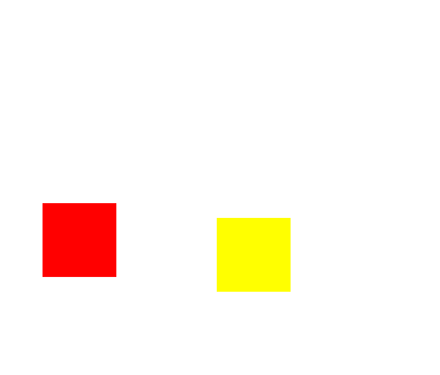

当我们拖拽一个网页中的内容时，浏览器会默认去搜索引擎中搜索内容，此时会导致拖拽功能的异常，这个是浏览器提供的默认行为

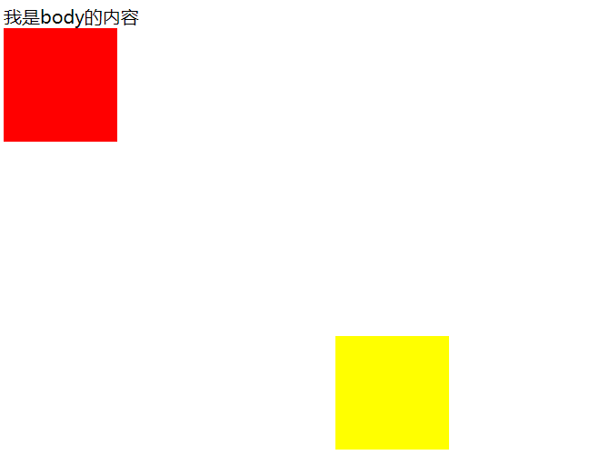

如果不希望发生这个行为，则可以通过 `return false` 来取消默认行为

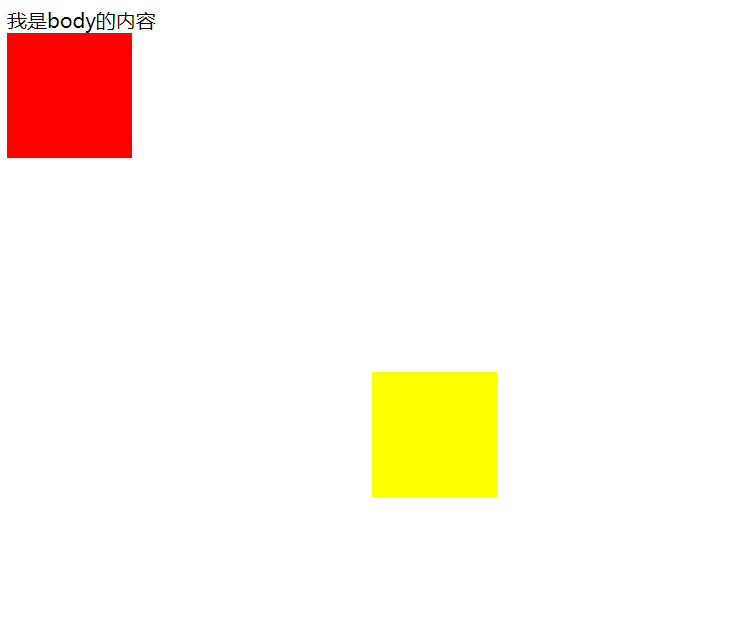

但是这招对 IE8 不起作用

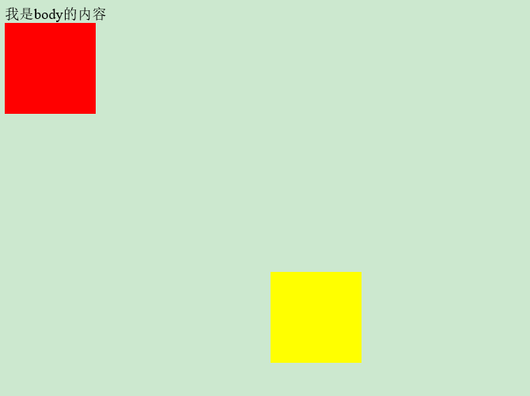

那有什么方法可以兼容 IE8 呢？我们先接着往下看

### setCapture()
```javascript
var btn1 = document.getElementById("btn1");
var btn2 = document.getElementById("btn2");

btn1.onclick = function() {
    alert(1);
}
btn2.onclick = function() {
    alert(2);
}
// 设置 btn1 对鼠标按下相关的事件进行捕获
// 当调用一个元素的 setCapture()方法以后，这个元素将会把下一次所有的鼠标按下相关的事件捕获到自身上
btn1.setCapture();
```

我们点击 btn2 按钮，发现只有刷新后的第一次点击的提示为 1，再次点击就变成了 2

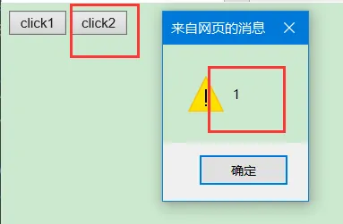

我们可以利用 `setCapture()` 方法对 IE8 浏览器的默认行为进行限制吗？当拖拽元素时捕获事件，取消拖拽时释放对事件的捕获

```javascript
var box1 = document.getElementById("box1");
// 1. 当鼠标在被拖拽元素上按下时，开始拖拽 `onmousedown`
box1.onmousedown = function(event) {
    // 设置 box1 捕获所有鼠标按下的事件
    // 只有 IE 支持，但是在火狐中调用时不会报错，而如果使用 Chrome 调用，会报错
    box1.setCapture && box1.setCapture();

    event = event || window.event;
    var boxLeft = event.clientX - box1.offsetLeft; // 鼠标水平坐标 - 元素水平偏移量 = 鼠标原点和元素原点水平距离
    var boxTop = event.clientY - box1.offsetTop; // 鼠标垂直坐标 - 元素垂直偏移量 = 鼠标原点和元素原点垂直距离
    // 2. 当鼠标移动时被拖拽元素跟随鼠标移动 `onmousemove`
    document.onmousemove = function(event) {
        event = event || window.event;
        box1.style.left = event.clientX - boxLeft + "px";
        box1.style.top = event.clientY - boxTop + "px";
    };
    // 3. 当鼠标松开时，被拖拽元素固定在当前位置 `onmouseup`
    document.onmouseup = function(event) {
        // 取消 document 的 onmousemove 事件
        document.onmousemove = null;
        // 取消 document 的 onmouseup 事件
        document.onmouseup = null;
        // 当鼠标松开时，取消对事件的捕获
        box1.releaseCapture && box1.releaseCapture();
    };
    // 取消默认行为
    return false;
};
```

测试在 IE8 中的效果

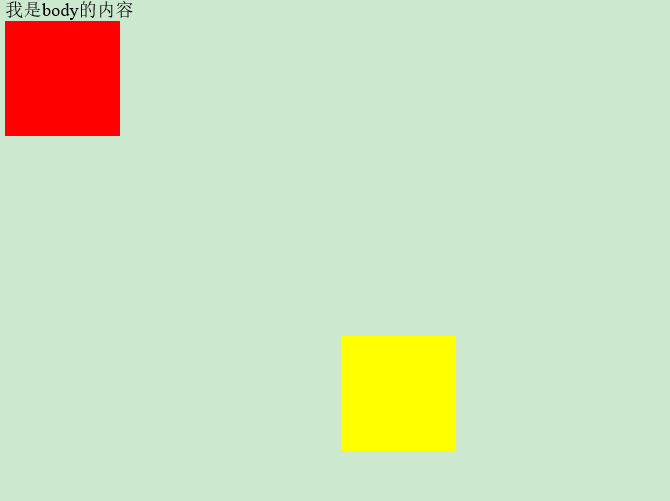

如果我想拖动 div2 呢？这个时候我们需要封装一个函数，方便我们直接传参调用

```javascript
// 拖拽方法封装成一个函数
function draw(obj){
    obj.onmousedown = function(event) {
        obj.setCapture && obj.setCapture();
        event = event || window.event;
        var boxLeft = event.clientX - obj.offsetLeft;
        var boxTop = event.clientY - obj.offsetTop;
        document.onmousemove = function(event) {
            event = event || window.event;
            obj.style.left = event.clientX - boxLeft + "px";
            obj.style.top = event.clientY - boxTop + "px";
        };
        document.onmouseup = function(event) {
            document.onmousemove = null;
            document.onmouseup = null;
            obj.releaseCapture && obj.releaseCapture();
        };
        return false;
    };
}
```

```html
<div id="box1"></div>
<div id="box2"></div>

```

```javascript
var box1 = document.getElementById("box1");
var box2 = document.getElementById("box2");
var img = document.getElementById("img");
draw(box1);
draw(box2);
draw(img);
```

**效果**

1. Chrome

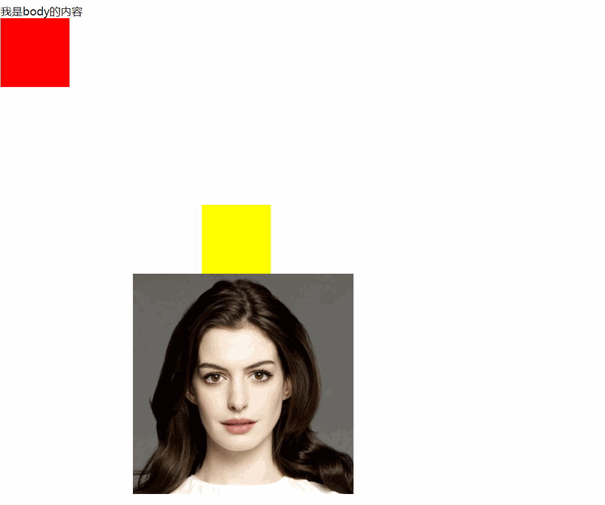

2. IE8


## 滚轮与键盘
### 滚轮事件
#### onmousewheel、DOMMouseScroll
1. `onmousewheel`：鼠标滚轮滚动的事件，会在滚轮滚动时触发，但是火狐不支持该属性
2. `DOMMouseScroll`：在火狐中使用 `DOMMouseScroll` 来绑定滚动事件，注意该事件需要通过 `addEventListener()` 函数来绑定

#### event.wheelDelta、event.detail
1. `event.wheelDelta`：可以获取鼠标滚轮滚动的方向：向上滚（120），向下滚（-120），这个值我们不看大小，只看正负
2. `event.detail`：`wheelDelta` 这个属性火狐中不支持，在火狐中使用 `event.detail` 来获取滚动的方向：向上滚（-3），向下滚（3）

#### return false、event.preventDefault()
当滚轮滚动时，如果浏览器有滚动条，滚动条会随之滚动，这是浏览器的默认行为

如果不希望发生，则可以使用 `return false` 来取消默认行为

使用 `addEventListener()` 方法绑定响应函数，取消默认行为时不能使用 `return false`，需要使用 `event` 来取消默认行为，但是 IE8 不支持 `event.preventDefault()` 这个玩意，如果直接调用会报错

```javascript
window.onload = function() {
    var box1 = document.getElementById("box1");
    box1.onmousewheel = function(event) {
        event = event || window.event;
        // alert(event.wheelDelta); // IE/内置：120/-120；Chrome/Edge：150/-150；Firefox：undefined/undefined
        // alert(event.detail); // IE/内置/Chrome/Edge：0/0；Firefox：-3/3;

        // 当鼠标滚轮向下滚动时，box1 变长
        // 当鼠标滚轮向上滚动时，box1 变短
        if (event.wheelDelta > 0 || event.detail < 0) {
            box1.style.height = box1.clientHeight - 10 + "px";
        } else {
            if (box1.clientHeight - 10 > 0) {
                box1.style.height = box1.clientHeight + 10 + "px";
            }
        }

        // 使用 addEventListener()方法绑定响应函数，取消默认行为时不能使用 return false，需要使用 event 来取消默认行为
        // 但是 IE8 不支持 event.preventDefault()这个玩意，如果直接调用会报错
        event.preventDefault && event.preventDefault();

        // 当滚轮滚动时，如果浏览器有滚动条，滚动条会随之滚动
        // 这是浏览器的默认行为，如果不希望发生，则可以取消默认行为
        return false;
    };
    // 兼容 addEventListener
    bind(box1, "DOMMouseScroll", box1.onmousewheel);
}

function bind(obj, eventStr, callback) {
    if (obj.addEventListener) {
        obj.addEventListener(eventStr, callback, false);
    } else {
        // this 是谁由调用方式决定
        // callback.call(obj)
        obj.attachEvent("on" + eventStr, function(){
            // 在匿名函数中调用回调函数
            callback.call(obj);
        });
    }
}
```

**效果**


### 键盘事件
#### onkeydown、onkeyup
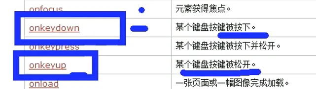

1. `onkeydown` 按键被按下
+ 如果一直按着某个按键不松手，则事件会一直触发
+ 连续触发时，第一次和第二次之间会间隔稍微长一点，其他的会非常的快，这种设计是为了防止误操作的发生
2. `onkeyup` 按键被松开

键盘事件一般都会绑定给一些可以获取到焦点的对象或者是 `document`

#### 键盘事件属性
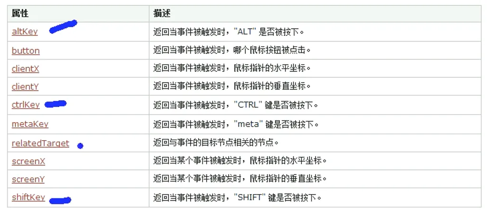

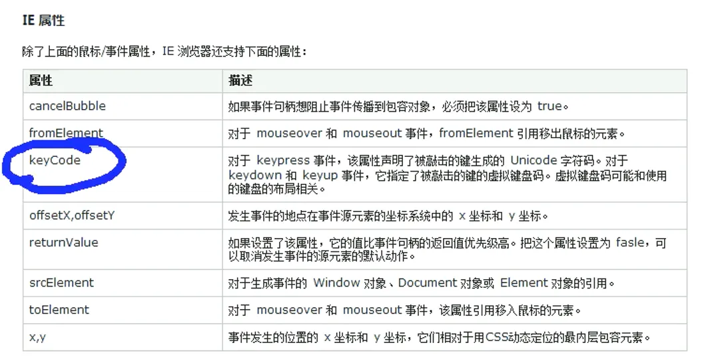

可以通过 `keyCode` 来获取按键的编码，通过它可以判断哪个按键被按下

除了 `keyCode`，事件对象中还提供了几个属性 `altKey`、`ctrlKey`、`shiftKey`

这个三个用来判断 `alt`、`ctrl` 和 `shift` 是否被按下，如果按下则返回 `true`，否则返回 `false`

**练习：键盘移动div**

```javascript
// 定义速度
var speed = 10;
var box1 = document.getElementById("box1");
// 绑定键盘响应事件
document.onkeydown = function(event) {
    event = event || window.event;
    // 按 ctrl 加速
    speed = event.ctrlKey ? 30 : 10;
    // console.log(event.keyCode); // 左：37；上：38；右：39；下：40
    switch (event.keyCode) {
        // 左移
        case 37:
            box1.style.left = box1.offsetLeft - speed + "px";
            break;
        // 上移
        case 38:
            box1.style.top = box1.offsetTop - speed + "px";
            break;
        // 右移
        case 39:
            box1.style.left = box1.offsetLeft + speed + "px";
            break;
        // 下移
        case 40:
            box1.style.top = box1.offsetTop + speed + "px";
            break;
        default:
            break;
    }
    return false;
}
```

**效果**


