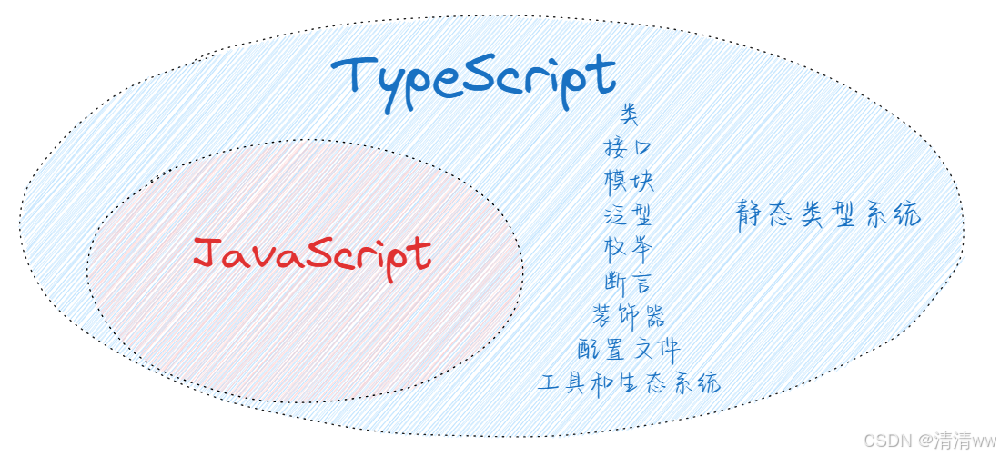

## 基本概念

TypeScript 是一种由微软开发的、基于 JavaScript 的开源编程语言。它为 JavaScript 添加了静态类型和面向对象编程特性，使得代码更加健壮、易于维护，TypeScript 提高了开发效率和代码质量，同时保持与 JavaScript 的兼容性。

TS 和 JS 之间的关系可以理解为“超集”与“子集”的关系，TS 是 JS 的一个超集，它包含了 JS 的所有特性，并且在此基础上增加了额外的特性，主要是静态类型系统。

TS 的静态类型系统：一种在编译时检查代码中变量、函数、对象等的数据类型的方法。该类型检查发生在代码运行之前，因此称为“静态”类型检查，静态类型系统的主要目的是提高代码的可读性、可维护性和减少运行时错误。



TS 扩展了 JS 的语法，使其能够添加静态类型注解。这些类型注解在编译时提供额外的检查，帮助开发者捕获潜在的错误，提高代码的可维护性和可读性。TS 最终会被编译成纯 JS 代码，因此任何支持 JS 的环境都可以运行 TS 编译后的代码。

## 基本类型

1. number：表示数字类型，包括整数和浮点数。

```js
let age: number = 30;
let price: number = 19.99;
```

2. string：表示字符串类型，可以使用单引号或双引号。

```js
let name: string = "Alice";
let sentence: string = 'I am learning TypeScript.';
```

3. boolean：表示布尔类型，只有 true 和 false 两个值。

```js
let isStudent: boolean = true;
let hasGraduated: boolean = false;
```

4. any：表示任意类型，可以赋值为任何类型的值。

```js
let value: any = "Hello, TypeScript!";
let otherValue: any = 42;
```

5. void：表示空类型，通常用于函数没有返回值的情况。

```js
function greet(): void {
  console.log("Hello!");
}

function calculate(): void {
  // 执行一些计算，但不返回任何值
}
```

6. undefined：表示一个变量已经被声明，但尚未被赋值。即该变量存在，但它的值未定义。

```js
let myVariable: string;
console.log(myVariable); // 输出: undefined
```

## 变量声明

### 作用域

作用域（Scope）是指变量、函数、类等标识符在代码中可见的范围。简单来说，作用域就是变量能被访问到的区域。TS 支持几种不同的作用域类型：

1. 全局作用域：在整个程序中都可以访问的变量和函数。

```js
let globalVar = "I am global";
function globalFunction() {
    console.log("I am a global function");
}
```

2. 函数作用域：在函数内部声明的变量和函数，只能在函数内部访问。

```js
function myFunction() {
    let localVar = "I am local to myFunction";
    function localFunction() {
        console.log("I am a local function");
    }
    console.log(localVar); // 可以访问
    localFunction(); // 可以调用
}
myFunction();
// console.log(localVar); // 错误：无法访问
// localFunction(); // 错误：无法调用
```

3. 块作用域：在代码块（如 `if`、`for` 循环或 `{}` 块）内部声明的变量，只能在块内部访问。

```js
if (true) {
    let blockVar = "I am local to this block";
    console.log(blockVar); // 可以访问
}
// console.log(blockVar); // 错误：无法访问
```

4. 模块作用域：在模块（使用 `import` 和 `export` 关键字）内部声明的变量和函数，只能在模块内部访问。

```js
// myModule.ts
export let moduleVar = "I am in the module";
export function moduleFunction() {
    console.log("I am a function in the module");
}
```

5. 类作用域：在类内部声明的变量和函数，只能在类内部访问。

```js
class MyClass {
    classVar = "I am a class variable";
    classFunction() {
        console.log("I am a class function");
    }
}
let myClassInstance = new MyClass();
console.log(myClassInstance.classVar); // 可以访问
myClassInstance.classFunction(); // 可以调用
```

### 变量提升

变量提升（Variable Hoisting）是 JavaScript 中的一种行为，它指的是在代码执行之前，JS 引擎会将所有变量的声明提升到它们所在作用域的顶部。

变量提升只适用于变量的声明，不包括变量的赋值。如果变量声明和赋值在同一行，那么赋值不会提升。

```js
console.log(a); // 输出: undefined
var a = 10;
console.log(a); // 输出: 10
```

在这个例子中，变量 a 的声明被提升到代码的顶部，但赋值没有提升。因此，在第一行打印中，变量 a 已经被声明，但还没有被赋值，所以输出 undefined。

在 TS 中，变量提升的行为与 JS 类似，但 TS 提供了更严格的类型检查和作用域规则。在 TS 中，使用 let 和 const 声明的变量不会发生变量提升，它们遵循块级作用域规则，即它们只在声明它们的代码块中可用。

以 let 为例，来看看什么是块级作用域：

```js
console.log(a); // 错误：变量 'a' 在此之前尚未声明
let a = 10;
console.log(a); // 输出: 10
 
if (true) {
  let a = 20; // 新的块级作用域，不会影响外部的 a
  console.log(a); // 输出: 20
}
 
console.log(a); // 输出: 10
```

### var 关键字

在 TypeScript 中，var、let 和 const 都是用来声明变量的关键字。但是现在 var 已经不推荐使用，let 和 const 是 ES6 引入的新特性，它们提供了更精确的作用域控制和变量声明方式。

```js
function exampleVar() {
  var x = 10;
  if (true) {
    var x = 20; // 重复声明，覆盖之前的值
  }
  console.log(x); // 输出: 20
}
exampleVar();
```

1. 函数作用域：使用 `var` 声明的变量是函数作用域的，如果变量在函数内部声明，它只能在函数内部访问。
2. 变量提升：使用 `var` 声明的变量会在代码执行之前被提升到其作用域的顶部。
3. 可以重复声明：同一个作用域内，可以使用 `var` 多次声明同一个变量。

### let 关键字

1. 块级作用域：使用 `let` 声明的变量是块级作用域的，它只能在声明它的代码块（如 `if`、`for` 循环等）内部访问。
2. 不存在变量提升：使用 `let` 声明的变量不会在代码执行之前被提升。
3. 不能重复声明：同一个作用域内，不能使用 `let` 多次声明同一个变量。

```js
function exampleLet() {
  let y = 10;
  if (true) {
    let y = 20; // 新的块级作用域，不会影响外部的 y
    console.log(y); // 输出: 20
  }
  console.log(y); // 输出: 10
}
exampleLet();
```

### const 关键字

1. 块级作用域：与 let 类似，const 也是块级作用域的。
2. 不存在变量提升：与 let 类似，const 也不会在代码执行之前被提升。
3. 不能重复声明：与 let 类似，不能在同一作用域内重复声明。
4. 常量：使用 const 声明的变量必须立即赋值，且其值不能被改变（对于基本类型），或者其引用不能被改变（对于对象类型）。

```js
function exampleConst() {
  const z = 10;
  // z = 20; // 错误：不能改变 const 变量的值
  if (true) {
    const z = 20; // 新的块级作用域，不会影响外部的 z
    console.log(z); // 输出: 20
  }
  console.log(z); // 输出: 10
}
exampleConst();
```

## 函数声明和表达式

在 TypeScript 中，我们可以通过函数声明或函数表达式来定义函数。函数声明具有函数名，而函数表达式则没有。

```js
// 函数声明
// 定义了一个名为 add 的函数，它接受两个数字类型的参数 a 和 b
// 并返回它们的和，返回值类型也是数字
function add(a: number, b: number): number {
    return a + b; // 返回参数 a 和 b 的和
}
 
// 函数表达式
// 定义了一个匿名函数并将其赋值给变量 subtract
// 这个函数接受两个数字类型的参数 a 和 b，并返回它们的差，返回值类型也是数字
const subtract = (a: number, b: number): number => {
    return a - b; // 返回参数 a 减去 b 的结果
};
```

### 函数声明

1. 使用 `function` 关键字来声明。
2. 函数声明会被提升，可以在声明之前调用它。
3. 通常用于顶层作用域或模块中。

```js
greet('清清ww'); // 输出: Hello, 清清ww!
 
function greet(name) {
  console.log('Hello, ' + name + '!');
}
 
greet('清清ww'); // 输出: Hello, 清清ww!
```

在这个例子中，我们定义了一个名为 `greet` 的函数，它接受一个参数 `name` 并打印一条问候语。由于函数声明会被提升，我们可以在声明之前调用 `greet` 函数。

### 函数表达式

1. 使用变量赋值的方式来定义函数。
2. 函数表达式不会提升，必须在定义之后才能调用。
3. 可以立即调用或作为匿名函数传递给其他函数。

```js
const greet = function(name) {
  console.log('Hello, ' + name + '!');
};
 
greet('清清ww'); // 输出: Hello, 清清ww!
```

在这个例子中，我们使用了一个函数表达式来定义一个匿名函数，并将其赋值给变量 `greet`。然后通过变量名 `greet` 来调用这个函数。由于函数表达式不会被提升，我们不能在声明之前调用它。

## 函数类型

TS 允许我们为函数定义类型。函数类型包括参数类型和返回类型。

在 TypeScript 中，函数类型是指函数的参数类型和返回类型的组合。TypeScript 允许我们为函数定义类型，以确保函数的参数和返回值符合预期的类型。函数类型通常用于函数声明、函数表达式和箭头函数。

### 函数类型声明

函数类型声明是一种显式指定函数参数类型和返回类型的方式。它使用 function 关键字，后跟参数列表和返回类型。

```js
// 函数类型声明
let greet: (name: string) => string;
 
// 函数实现
greet = function(name: string): string {
  return 'Hello, ' + name + '!';
};
 
const message = greet('清清ww');
console.log(message); // 输出: Hello, 清清ww!
```

在上面的例子中，我们首先声明了一个函数类型 `greet`，它接受一个 `string` 类型的参数 `name`，并返回一个 `string` 类型的值。然后，我们为 `greet` 赋予了一个具体的函数实现。

### 函数类型表达式

函数类型表达式是一种更简洁的函数类型声明方式。它使用箭头函数语法 `=>` 来定义函数类型。

```js
// 函数类型表达式
let greet: (name: string) => string;
 
// 函数实现
greet = (name: string): string => {
  return 'Hello, ' + name + '!';
};
 
const message = greet('清清ww');
console.log(message); // 输出: Hello, 清清ww!
```

在上面的例子中，我们使用箭头函数语法来定义函数类型 `greet`。这种方式更加简洁，但功能与函数类型声明相同。

### 函数类型推断

TypeScript 具有类型推断功能，它可以根据函数的实现自动推断函数的类型。如果没有显式指定函数类型，TypeScript 会尝试推断函数的类型。

```ts
// 函数类型推断
let greet = function(name: string): string {
  return 'Hello, ' + name + '!';
};
 
const message = greet('清清ww');
console.log(message); // 输出: Hello, 清清ww!
```

在上面的例子中，我们没有显式指定函数类型，但 TypeScript 会根据函数的实现自动推断函数的类型。

## 参数

### 可选参数

可选参数是指在调用函数时可以省略的参数，通过在参数后面添加一个问号 `?` 来表示该参数是可选的。可选参数通常位于参数列表的末尾。

```ts
// 可选参数
function greet(name: string, age?: number): string {
  if (age) {
    return `你好${name},你${age} 岁了!`;
  } else {
    return `你好, ${name}!`;
  }
}
 
console.log(greet('清清ww')); // 输出: 你好, 清清ww!
console.log(greet('清清ww', 3)); // 输出: 你好, 清清ww, 你3岁了!
```

### 默认参数

默认参数是指在调用函数时如果没有提供该参数，则使用默认值的参数。在 TypeScript 中，通过在参数后面赋值来设置默认值。

```js
// 默认参数
function greet(name: string, age: number = 3): string {
  return `你好, ${name}, 你${age}岁了!`;
}
 
console.log(greet('清清ww')); // 输出: 你好, 清清ww, 你3岁了!
console.log(greet('清清ww', 3)); // 输出: 你好, 清清ww, 你3岁了!
```

### 优先级

当同时使用可选参数和默认值时，它们的优先级是按照参数的顺序来确定的。

1. 如果一个参数既有默认值又是可选的，那么在调用函数时，如果省略了这个参数，就会使用默认值。
2. 如果一个参数是可选的但没有默认值，那么在调用函数时，可以省略这个参数，函数会将其视为 undefined。
3. 如果一个参数有默认值但不是可选的，那么在调用函数时，必须提供这个参数的值，否则会使用默认值。

```ts
// 可选参数和默认参数的优先级
function greet(name: string, age?: number = 3): string {
  return `你好, ${name}, 你${age} 岁了!`;
}
 
console.log(greet('清清ww')); // 输出: 你好, 清清ww, 你3岁了!
console.log(greet('清清ww', undefined)); // 输出: 你好, 清清ww, 你3岁了!
console.log(greet('清清ww', 4)); // 输出: 你好, 清清ww, 你4岁了!
```

### 剩余参数

剩余参数是通过在参数名前加上三个点（…）来定义的，并且它必须是函数的最后一个参数。它允许我们将多个参数收集到一个数组中（在处理不确定数量的参数时非常有用）。这样就可以在函数内部使用这个参数作为数组来访问所有的剩余参数。

注意：剩余参数必须是函数的最后一个参数。如果在剩余参数之后定义了其他参数，TypeScript 编译器会报错。

```ts
// 定义一个 Person 类型，包含 name, age 和可选的 hobbies 数组
type Person = {
    name: string;
    age: number;
    hobbies?: string[];
};
 
// 定义一个函数 createPerson，接受一个 Person 类型的对象和剩余的字符串参数作为爱好
function createPerson(person: Person, ...hobbies: string[]): Person {
    // 检查是否有提供爱好
    if (hobbies.length > 0) {
        // 如果有爱好，将它们赋值给 person 对象的 hobbies 属性
        person.hobbies = hobbies;
    }
    // 返回修改后的 person 对象
    return person;
}
 
// 创建一个基础的人物对象，包含 name 和 age 属性
let basePerson: Person = {
    name: '清清ww',
    age: 3,
};
 
// 使用 createPerson 函数添加额外的爱好，剩余参数 'eat', 'play', 'sleep' 被视为一个数组
let personWithHobbies = createPerson(basePerson, 'eat', 'play', 'sleep');
 
// 打印包含爱好的 person 对象
console.log(personWithHobbies);
```

## 接口

### 接口定义

在 TS 中，接口是一种用来描述对象结构的方式。它定义了对象应该有哪些属性，以及这些属性的类型。接口也可以用来定义方法，包括方法的参数类型和返回值类型。

接口的主要作用是在编译时提供类型检查，确保对象的结构符合预期的定义。如果对象的结构不符合接口的定义，TypeScript 编译器会在编译时给出错误提示。

```ts
interface Person {
    name: string;
    age: number;
}
 
const person: Person = {
    name: '清清ww',
    age: 3
};
```

在这个例子中，通过 interface 关键字，我们定义了一个 Person 接口，它有两个属性：name 和 age。然后创建了一个 person 对象，它的结构符合 Person 接口的定义。如果 person 对象缺少 name 或 age 属性，或者这些属性的类型不正确，TS 编译器会在编译时给出错误提示。

### 属性定义

1. 必需属性

接口中定义的必须存在的属性。在创建符合接口的对象时，必须为这些属性提供值。

```ts
interface Person {
    name: string; // 必需属性
    age: number;  // 必需属性
}
 
const person: Person = {
    name: '清清ww', // 必需属性
    age: 3       // 必需属性
};
```

2. 可选属性 ？

接口中定义的可以不存在的属性。在创建符合接口的对象时，可以选择是否为这些属性提供值。

```ts
interface Person {
    name: string;    // 必需属性
    age?: number;    // 可选属性
}
 
const person1: Person = {
    name: '清清ww', // 必需属性
    age: 3       // 可选属性，提供了值
};
 
const person2: Person = {
    name: '大头'    // 必需属性
    // age: 3       // 可选属性，没有提供值
};
```

3. 只读属性 readonly

接口中定义的只能被赋值一次的属性。在创建符合接口的对象时，必须为这些属性提供初始值，并且之后不能再次赋值。

```ts
interface Person {
    name: string;    // 必需属性
    age: number;     // 必需属性
    readonly id: number; // 只读属性
}
 
const person: Person = {
    name: '清清ww', // 必需属性
    age: 30,       // 必需属性
    id: 123        // 只读属性，提供了初始值
};
 
// person.id = 456; // 错误，只读属性不能再次赋值
```

### 方法定义

```ts
interface Person {
  name: string;
  greet(): string;
}
 
const qingQingWW: Person = {
  name: '清清ww',
  greet() {
    return `你好，我是${this.name}`;
  }
};
 
console.log(qingQingWW.greet()); // 输出：你好，我是清清ww
```

在这个例子中，`Person` 接口定义了一个 `greet` 方法，该方法没有参数且返回一个字符串。

方法可以是可选的：

```TypeScript
interface Person {
    greet(): string;    // 方法定义
    optionalMethod?(): void; // 可选方法
}
```

### 接口继承

接口继承就是一个接口可以继承另一个接口的属性和方法，是 TypeScript 中实现代码复用的重要机制。使用 `extends` 关键字实现类的继承。子类可以继承父类的属性和方法，并可以添加自己的属性和方法。

接口继承的基本语法如下：

```ts
// 定义一个基础接口，包含一个字符串属性和一个无参数的方法
interface BaseInterface {
  commonProperty: string; // 基础属性，类型为字符串
  commonMethod(): void;    // 基础方法，无参数，返回类型为void
}
 
// 定义一个扩展接口，继承自BaseInterface，并添加了额外的属性和方法
interface ExtendedInterface extends BaseInterface {
  specificProperty: number; // 扩展属性，类型为数字
  specificMethod(): void;    // 扩展方法，无参数，返回类型为void
}
```

## 类

### 类定义

在 TypeScript 中，类是一种用于创建对象的蓝图，通过使用 `class` 关键字 来创建。类可以包含属性（数据成员）和方法（函数成员）。

类定义的基本语法如下：

```ts
class ClassName {
  // 属性
  property: type;
 
  // 方法
  method(): void {
    // 方法体
  }
}
```

```ts
class Person {
  // 属性
  name: string;
  age: number;
 
  // 方法
  greet(): void {
    console.log(`你好，我是 ${this.name} ，我${this.age}岁了`);
  }
}
 
// 创建类的实例
const person = new Person('清清ww', 3);
// 调用方法
person.greet(); // 输出: 你好，我是清清ww，我三岁了.
```

### 构造函数

构造函数是类的一个特殊方法，用于在创建对象时初始化对象的属性。构造函数的名称与类名相同，并且没有返回类型。

构造函数的定义如下：

```js
constructor(参数列表) {
  // 构造函数的代码
}
```

参数列表中的参数可以是任意类型的，这些参数用于接收外部传入的值，以便在构造函数内部使用。在构造函数内部，可以使用 `this` 关键字来引用当前正在创建的实例，并将参数的值赋给实例的属性。

```ts
class Person {
  // 属性
  name: string;
  age: number;
 
  // 构造函数
  constructor(name: string, age: number) {
    this.name = name;
    this.age = age;
  }
 
  // 方法
  greet(): void {
    console.log(`你好，我是 ${this.name} ，我${this.age}岁了.`);
  }
}
 
// 创建类的实例
const person = new Person('清清ww', 3);
 
// 调用方法
person.greet(); // 输出: 你好，我是清清ww，我三岁了.
```

### 访问修饰符

TypeScript 提供了三种访问修饰符：`public`、`private` 和 `protected`，用于控制类成员的访问级别。

1. `public` 成员可以在任何地方访问

2. `private` 成员只能在类的内部访问

3. `protected` 成员可以在类的内部和子类中访问

```ts
class Person {
  public name: string; // 公共属性，可以在类的外部访问
  private age: number; // 私有属性，只能在类的内部访问
 
  constructor(name: string, age: number) {
    this.name = name;
    this.age = age;
  }
 
  public greet() {
    console.log(`你好，我是 ${this.name} ，我${this.age}岁了.`);
  }
}
 
const person = new Person('清清', 3);
person.greet(); // 可以调用 public 方法
console.log(person.name); // 可以访问 public 属性
// console.log(person.age); // 错误：Property 'age' is private and only accessible within class 'Person'.
```

```ts
class Person {
  public name: string; // 公共属性，可以在类的外部访问
  protected age: number; // 受保护属性，只能在类的内部和子类中访问
 
  constructor(name: string, age: number) {
    this.name = name;
    this.age = age;
  }
 
  public greet() {
    console.log(`你好，我是 ${this.name} ，我${this.age}岁了.`);
  }
}
 
const person = new Person('清清', 3);
person.greet(); // 可以调用 public 方法
console.log(person.name); // 可以访问 public 属性
// console.log(person.age); // 错误：Property 'age' is protected and only accessible through an instance of 'Person'.
```

### 继承

```ts
class ParentClass {
  // 父类属性和方法
}
 
class ChildClass extends ParentClass {
  // 子类属性和方法
}
```

### 多态

1. 接口与多态

```ts
// 定义一个Animal接口，它包含一个方法makeSound
interface Animal {
  makeSound(): void; // makeSound方法没有参数，也没有返回值
}
 
// Dog类实现了Animal接口，这意味着它必须提供makeSound方法的实现
class Dog implements Animal {
  makeSound() {
    console.log('Woof!'); // Dog类中的makeSound方法输出"Woof!"
  }
}
 
// Cat类也实现了Animal接口，同样需要提供makeSound方法的实现
class Cat implements Animal {
  makeSound() {
    console.log('Meow!'); // Cat类中的makeSound方法输出"Meow!"
  }
}
 
// 定义一个函数animalSound，它接受一个Animal类型的参数
function animalSound(animal: Animal) {
  animal.makeSound(); // 调用传入对象的makeSound方法
}
 
// 创建Dog和Cat的实例
const dog = new Dog();
const cat = new Cat();
 
// 调用animalSound函数，传入dog实例，输出"Woof!"
animalSound(dog); 
 
// 调用animalSound函数，传入cat实例，输出"Meow!"
animalSound(cat); 
```

2. 继承与多态

```ts
class Animal {
  makeSound() {
    console.log('Some sound!');
  }
}
 
class Dog extends Animal {
  makeSound() {
    super.makeSound(); // 调用父类的方法
    console.log('Woof!');
  }
}
 
class Cat extends Animal {
  makeSound() {
    console.log('Meow!');
  }
}
 
function animalSound(animal: Animal) {
  animal.makeSound();
}
 
const dog = new Dog();
const cat = new Cat();
 
animalSound(dog); // 输出: Some sound! Woof!
animalSound(cat); // 输出: Meow!
```

## 泛型

泛型就是“通用类型”的意思，它是一种编程语言特性，允许在定义函数、类或接口时，不预先指定具体的类型，而是使用一个占位符（通常用字母 T、U 等表示）来表示类型。这样我们就可以在运行代码之前不指定具体的数据类型，而是在使用的时候再决定，从而使得代码能够更加灵活地处理不同类型的数据。

泛型的语法是这样的：

```ts
function 函数名<T>(参数: T):T {
    // ...
}
 
class 类名<T> {
    // ...
}
 
interface 接口名<T> {
    // ...
}
```

这里的 " T " 叫泛型参数，除了 "T" 外，泛型参数还可以用 " U "、" K "、" V "、" E " 等单个大写字母表示，它们有一些约定俗成的规律：

1. T 通常代表 “Type”
2. U 和 V 可以代表 “Type” 的其他变体
3. K 通常代表 “Key”
4. V 通常代表 “Value”
5. E 通常代表 “Element”

### 泛型函数

```ts
function returnAnything<T>(thing: T): T {
    return thing;
}
```

```ts
let myNumber = returnAnything(5);  // myNumber 是数字类型
let myString = returnAnything("Hello");  // myString 是字符串类型
```

### 泛型类

```ts
class Box<T> {
    private content: T;
    constructor(value: T) {
        this.content = value;
    }
    getContent(): T {
        return this.content;
    }
}
```

```ts
let numberBox = new Box<number>(5);
let stringBox = new Box<string>("Hello");
```

### 泛型接口

```ts
interface GenericInterface<T> {
    (arg: T): T;
}
```

```ts
function identity<T>(arg: T): T {
    return arg;
}
 
let myNumberFunction: GenericFunction<number> = identity;
let myStringFunction: GenericFunction<string> = identity;
```

### 泛型约束

可以对接受的类型进行限制，只接受具有特定属性的对象。

```ts
interface Lengthwise {
    length: number;
}

function logLength<T extends Lengthwise>(arg: T) {
    console.log(arg.length);
}
```

```ts
interface HasLength { 
    length: number; 
}
 
function printLength(thing: T) { 
    console.log("The length is: " + thing.length); 
}
 
// printLength(“Hello”); // 正确，字符串有length属性 
// printLength([1, 2, 3]); // 正确，数组有length属性
// printLength(100); // 这会报错，错误的例子，数字没有length属性
```

### 多个类型参数

泛型可以接受多个类型参数，用逗号分隔。

```ts
function swap<T, U>(tuple: [T, U]): [U, T] {
    return [tuple[1], tuple[0]];
}
```

```ts
// 定义一个泛型函数，它接受数值和字符串两种类型的数据
function processData<T extends number, U extends string>(numData: T, strData: U): [T, U] {
    // 对数值数据进行加法处理
    const processedNum = numData + 10;
    // 对字符串数据进行拼接处理
    const processedStr = strData + " processed";
    
    return [processedNum, processedStr];
}
 
// 使用例子
let result = processData<Number, String>(25, "Hello");  // 返回: [35, "Hello processed"]
```

