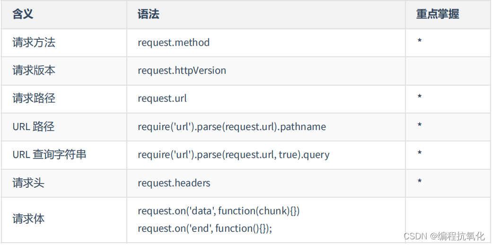
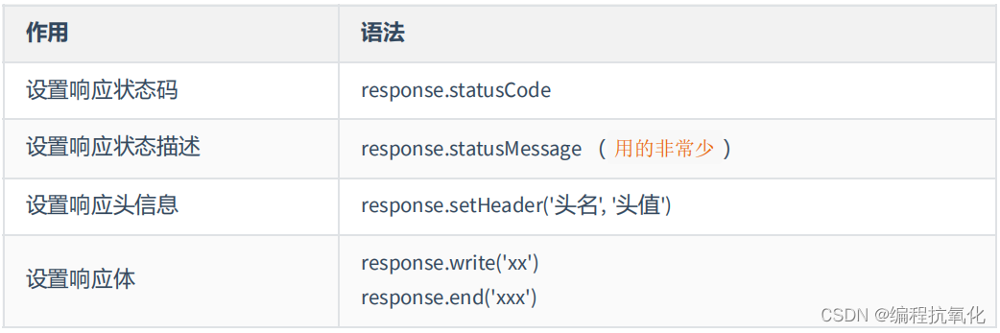

## 创建 HTTP 服务

```javascript
//1. 导入 http 模块
const http = require('http');
//2. 创建服务对象 create 创建 server 服务
// request 意为请求. 是对请求报文的封装对象, 通过 request 对象可以获得请求报文的数据
// response 意为响应. 是对响应报文的封装对象, 通过 response 对象可以设置响应报文
const server = http.createServer((request, response) => {
    response.end('Hello HTTP server'); // 设置响应体
});
//3. 监听端口, 启动服务
server.listen(9000, () => {
    console.log('服务已经启动, 端口 9000 监听中...');
});
```

http.createServer 里的回调函数的执行时机：当接收到 HTTP 请求的时候，就会执行。

浏览器请求对应端口，[http://127.0.0.1:9000](http://127.0.0.1:9000)


注意事项：

1. 命令行 ctrl + c 停止服务
2. 当服务启动后，更新代码必须重启服务才能生效
3. 响应内容中文乱码的解决办法

```javascript
response.setHeader('content-type','text/html;charset=utf-8');
```

## 获取 HTTP 请求报文



```javascript
//1. 导入 http 模块
const http = require('http');
//2. 创建服务对象 create 创建 server 服务
// request 意为请求. 是对请求报文的封装对象, 通过 request 对象可以获得请求报文的数据
// response 意为响应. 是对响应报文的封装对象, 通过 response 对象可以设置响应报文
const server = http.createServer((request, response) => {
    // 获取请求的方法类型
    console.log(request.method);
    // 获取请求的 url
    console.log(request.url);
    // 获取 http 协议的版本号
    console.log(request.httpVersion);
    // 获取 http 的请求头
    console.log(request.headers);
    // 单独获取 http 请求头的某个信息值
    console.log(request.headers.host);
    response.end('Hello HTTP server'); // 设置响应体
});
//3. 监听端口, 启动服务
server.listen(9000, () => {
    console.log('服务已经启动, 端口 9000 监听中...');
});
```

注意：

1. request.url 只能获取路径以及查询字符串，无法获取 URL 中的域名以及协议的内容
2. request.headers 将请求信息转化成一个对象，并将属性名都转化成了小写
3. 关于路径：如果访问网站的时候，只填写了 IP 地址或者是域名信息，此时请求的路径为/
4. 关于 favicon.ico：这个请求是属于浏览器自动发送的请求

## 设置 HTTP 响应报文



```javascript
//1. 导入 http 模块
const http = require('http');
//2. 创建服务对象 create 创建 server 服务
// request 意为请求. 是对请求报文的封装对象, 通过 request 对象可以获得请求报文的数据
// response 意为响应. 是对响应报文的封装对象, 通过 response 对象可以设置响应报文
const server = http.createServer((request, response) => {
    // 设置响应状态码
    response.statusCode = 404;
    // 设置响应状态的描述
    response.statusMessage = 'I love you';
    // 设置响应头
    response.setHeader('key1','value1');
    response.setHeader('key2','value2');
    // 设置响应体
    response.end('Hello HTTP server');
});
//3. 监听端口, 启动服务
server.listen(9000, () => {
    console.log('服务已经启动, 端口 9000 监听中...');
});
```

