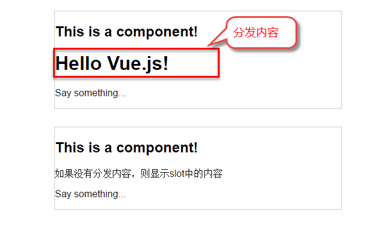
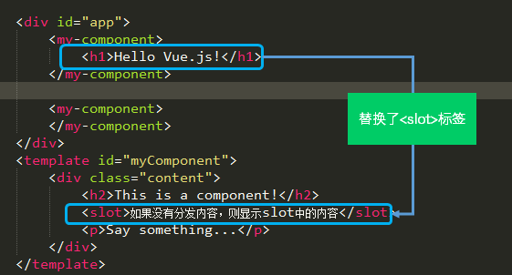
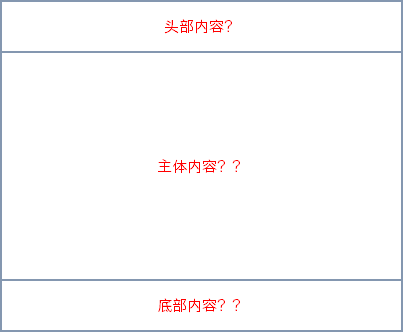

## 组件的创建和注册

### el 与 data 写法

1. el 有 2 种写法

- new Vue 时候配置 el 属性
- 先创建 Vue 实例，随后再通过 vm.$mount(‘#root’)指定 el 的值

```html
<script>
   	// 第一种 
	const vm = new Vue({
		el:'#root',
		data:{
			name:'jack',
        }
	})
    
    // 第二种
    vm.$mount('#root')
</script>
```

2. data 有 2 种写法

- 对象式

- 函数式

```html
<script>
    new Vue({
		el:'#root',
        // 第一种
		data:{
			name:'jack',
        }
        
        // 第二种
        data() {
        	return {
                name: 'jack'
            }
    	}
	})
</script>
```

注意：在组件中，data 必须使用函数式

* 对象形式

```html
let data = {
    a: 99,
    b: 100
}

let x = data;
let y = data;
// x 和 y 引用的都是同一个对象，修改 x 的值， y 的值也会改变
x.a = 66;
console.loh(x); // a:66 b:100
console.log(y); // a:66 b:100
```

* 函数形式

```html
function data() {
    return {
        a: 99,
        b: 100
    }
}
let x = data();
let y = data();
console.log(x === y); // false
// 我的理解是函数每调用一次就创建一个新的对象返回给他们
```

**使用注意**

传入 Vue 构造器的多数选项也可以用在 Vue.extend() 或 Vue.component()中，不过有两个特例： data 和 el。

Vue.js 规定：在定义组件的选项时，data 和 el 选项必须使用函数。

下面的代码在执行时，浏览器会提出一个错误

```html
Vue.component('my-component', {
	data: {
		a: 1
	}
})
```


另外，如果 data 选项指向某个对象，这意味着所有的组件实例共用一个 data。

我们应当使用一个函数作为 data 选项，让这个函数返回一个新对象：

```html
Vue.component('my-component', {
	data: function(){
		return {a : 1}
	}
})
```

使用 Vue.extend(options)创建，其中 options 和 new Vue(options)时传入的那个 options 几乎一样，但也有点区别；

区别如下：

1. el 不要写，为什么？ ——— 最终所有的组件都要经过一个 vm 的管理，由 vm 中的 el 决定服务哪个容器。
2. data 必须写成函数，为什么？ ———— 避免组件被复用时，数据存在引用关系。

### 基本步骤

Vue.js 的组件的使用有 3 个步骤：创建组件构造器、注册组件和使用组件。

```html
<!DOCTYPE html>
<html>
	<body>
		<div id="app">
			<!-- 3. #app是Vue实例挂载的元素，应该在挂载元素范围内使用组件-->
			<my-component></my-component>
		</div>
	</body>
  
	<script src="js/vue.js"></script>
	<script>
		// 1.创建一个组件构造器
		var myComponent = Vue.extend({
			template: '<div>This is my first component!</div>'
		})
		
		// 2.注册组件，并指定组件的标签，组件的HTML标签为<my-component>
		Vue.component('my-component', myComponent)
		
		new Vue({
			el: '#app'
		});
	</script>
</html>
```


注意：组件名必须全小写，一旦有大写，就会注册错误

1. Vue.extend()是 Vue 构造器的扩展，调用 Vue.extend()创建的是一个组件构造器。
2. Vue.extend()构造器有一个选项对象，选项对象的 template 属性用于定义组件要渲染的 HTML。
3. 使用 Vue.component()注册组件时，需要提供 2 个参数，第 1 个参数时组件的标签，第 2 个参数是组件构造器。
4. 组件应该挂载到某个 Vue 实例下，否则它不会生效。

请注意第 4 点，以下代码在 3 个地方使用了 \< my-component > 标签，但只有#app1 和#app2 下的 \< my-component > 标签才起到作用。

```html
<!DOCTYPE html>
<html>
	<body>
		<div id="app1">
			<my-component></my-component>
		</div>
		
		<div id="app2">
			<my-component></my-component>
		</div>
		
		<!--该组件不会被渲染-->
		<my-component></my-component>
	</body>
	<script src="js/vue.js"></script>
	<script>
		var myComponent = Vue.extend({
			template: '<div>This is a component!</div>'
		})
		
		Vue.component('my-component', myComponent)
		
		var app1 = new Vue({
			el: '#app1'
		});
		
		var app2 = new Vue({
			el: '#app2'
		})
	</script>
</html>
```

### 局部组件

如果不需要全局注册，或者是让组件使用在其它组件内，可以用选项对象的 components 属性实现局部注册。

```html
var app = new Vue({
    el: '#app',
    // 定义局部组件，这里可以定义多个局部组件
    components: {
        //组件的名字
        'navbar': {
            //组件的内容
            template: '<ul><li>首页</li><li>学员管理</li></ul>'
        }
    }
})

<div id="app">
    <navbar></navbar>
</div>
```

```html
<!DOCTYPE html>
<html>
	<body>
		<div id="app">
			<!-- 3. my-component只能在#app下使用-->
			<my-component></my-component>
		</div>
	</body>
	<script src="js/vue.js"></script>
	<script>
		// 1.创建一个组件构造器
		var myComponent = Vue.extend({
			template: '<div>This is my first component!</div>'
		})
		
		new Vue({
			el: '#app',
			components: {
				// 2. 将myComponent组件注册到Vue实例下
				'my-component' : myComponent
			}
		});
	</script>
</html>
```

由于 my-component 组件是注册在#app 元素对应的 Vue 实例下的，所以它不能在其它 Vue 实例下使用。

```html
<div id="app2">
	<!-- 不能使用my-component组件，因为my-component是一个局部组件，它属于#app-->
	<my-component></my-component>
</div>

<script>
	new Vue({
		el: '#app2'
	});
</script>
```

### 全局组件

调用 Vue.component()注册组件时，组件的注册是全局的，这意味着该组件可以在任意 Vue 示例下使用。

```html
<!DOCTYPE html>
<html lang="en">
<head>
    <meta charset="UTF-8">
    <title>My First Vue</title>
</head>
 
<body>
    <!-- view层 模板 -->
    <div id="app">
        <!-- <li> Hello, MelodyJerry! </li> -->
        <melodyjerry> Hello, MelodyJerry! </melodyjerry>
    </div>
 
    <!-- 1.导入Vue.js -->
    <script src="https://cdn.jsdelivr.net/npm/vue@2.5.21/dist/vue.min.js"></script>
    <script>
        //先注册组件，定义一个Vue组件component
        Vue.component("melodyjerry",{ //组件名必须全小写，一旦有大写，就会注册错误
            template: '<li> This is a Vue-Component. </li>'
        });
 
        //再实例化Vue
        var vm = new Vue({
            el: "#app",
        });
    </script> 
</body>
</html>
```

### 父组件和子组件

```html
<!DOCTYPE html>
<html>
	<body>
		<div id="app">
			<parent-component>
			</parent-component>
		</div>
	</body>
	<script src="js/vue.js"></script>
	<script>
		var Child = Vue.extend({
			template: '<p>This is a child component!</p>'
		})
		var Parent = Vue.extend({
			// 在Parent组件内使用<child-component>标签
			template :'<div><p>This is a Parent component</p></div><child-component></child-component>',
			components: {
				// 局部注册Child组件，该组件只能在Parent组件内使用
				'child-component': Child
			}
		})
		
		// 全局注册Parent组件
		Vue.component('parent-component', Parent)
		new Vue({
			el: '#app'
		})
	</script>
</html>
```

Child 组件是在 Parent 组件中注册的，它只能在 Parent 组件中使用，确切地说：子组件只能在父组件的 template 中使用。

请注意下面两种子组件的使用方式是错误的：

1. 以子标签的形式在父组件中使用

```html
<div id="app">
	<parent-component>
		<child-component></child-component>
	</parent-component>
</div>
```

为什么这种方式无效呢？因为当子组件注册到父组件时，Vue.js 会编译好父组件的模板，模板的内容已经决定了父组件将要渲染的 HTML。

`<parent-component>…</parent-component>` 相当于运行时，它的一些子标签只会被当作普通的 HTML 来执行，\< child-component > \</child-component > 不是标准的 HTML 标签，会被浏览器直接忽视掉。

2. 在父组件标签外使用子组件

```html
<div id="app">
	<parent-component>
	</parent-component>
	<child-component>
	</child-component>
</div>
```

### 组件注册语法糖

以上组件注册的方式有些繁琐，Vue.js 为了简化这个过程，提供了注册语法糖。

使用 Vue.component()直接创建和注册组件：

```html
// 全局注册，my-component1是标签名称
Vue.component('my-component1',{
	template: '<div>This is the first component!</div>'
})

var vm1 = new Vue({
	el: '#app1'
})
```

`Vue.component()` 的第 1 个参数是标签名称，第 2 个参数是一个选项对象，使用选项对象的 template 属性定义组件模板。使用这种方式，Vue 在背后会自动地调用 `Vue.extend()`。

在选项对象的 components 属性中实现局部注册：

```html
var vm2 = new Vue({
	el: '#app2',
	components: {
		// 局部注册，my-component2是标签名称
		'my-component2': {
			template: '<div>This is the second component!</div>'
		},
		// 局部注册，my-component3是标签名称
		'my-component3': {
			template: '<div>This is the third component!</div>'
		}
	}
})
```

### script/template 使用组件

尽管语法糖简化了组件注册，但在 template 选项中拼接 HTML 元素比较麻烦，这也导致了 HTML 和 JavaScript 的高耦合性。

庆幸的是，Vue.js 提供了两种方式将定义在 JavaScript 中的 HTML 模板分离出来。

#### script

```html
<!DOCTYPE html>
<html>
	<body>
		<div id="app">
			<my-component></my-component>
		</div>
		
		<script type="text/x-template" id="myComponent">
			<div>This is a component!</div>
		</script>
	</body>
  
	<script src="js/vue.js"></script>
	<script>
		Vue.component('my-component',{
			template: '#myComponent'
		})
		new Vue({
			el: '#app'
		})
	</script>
</html>
```

template 选项现在不再是 HTML 元素，而是一个 id，Vue.js 根据这个 id 查找对应的元素，然后将这个元素内的 HTML 作为模板进行编译。

注意：使用 \< script > 标签时，type 指定为 text/x-template，意在告诉浏览器这不是一段 js 脚本，浏览器在解析 HTML 文档时会忽略 \< script > 标签内定义的内容。

#### template

如果使用 \< template > 标签，则不需要指定 type 属性。

```html
<!DOCTYPE html>
<html>
	<head>
		<meta charset="UTF-8">
		<title></title>
	</head>
	<body>
		<div id="app">
			<my-component></my-component>
		</div>
		
		<template id="myComponent">
			<div>This is a component!</div>
		</template>
	</body>
  
	<script src="js/vue.js"></script>
	<script>
		Vue.component('my-component',{
			template: '#myComponent'
		})
		new Vue({
			el: '#app'
		})
	</script>
</html>
```

### 编辑作用域

尽管使用组件就像使用一般的 HTML 元素一样，但它毕竟不是标准的 HTML 元素，为了让浏览器能够识别它，组件会被解析为标准的 HTML 片段，然后将组件的标签替换为该 HTML 片段。

```html
<div id="app">
	<my-component>
	</my-component>
</div>

<template id="myComponent">
	<div>
		<h2>{{ msg }}</h2>
		<button v-on:click="showMsg">Show Message</button>
	</div>
</template>
<script src="js/vue.js"></script>
<script>
	new Vue({
		el: '#app',
		components: {
			'my-component': {
				template: '#myComponent',
				data: function() {
					return {
						msg: 'This is a component!'
					}
				},
				methods: {
					showMsg: function() {
						alert(this.msg)
					}
				}
			}
		}
	})
</script>
```

这段代码定义了一个 my-component 组件，\< my-component >\< my-component > 不是标准的 HTML 元素，浏览器是不理解这个元素的。那么 Vue 是如何让浏览器理解 \< my-component >\< my-component > 标签的呢？

在创建一个 Vue 实例时，除了将它挂载到某个 HTML 元素下，还要编译组件，将组件转换为 HTML 片段。
除此之外，Vue 实例还会识别其所挂载的元素下的 \< my-component > 标签，然后将 \< my-component > 标签替换为 HTML 片段。

组件在使用前，经过编译已经被转换为 HTML 片段了，组件是有一个作用域的，那么组件的作用域是什么呢？
你可以将它理解为组件模板包含的 HTML 片段，组件模板内容之外就不是组件的作用域了。

组件的模板是在其作用域内编译的，那么组件选项对象中的数据也应该是在组件模板中使用的。
考虑下面的代码，在 Vue 实例和组件的 data 选项中分别追加一个 display 属性：

```html
new Vue({
	el: '#app',
	data: {
		display: true
	},
	components: {
		'my-component': {
			template: '#myComponent',
			data: function() {
				return {
					msg: 'This is a component!',
					display: false
				}
			},
			methods: {
				showMsg: function() {
					alert(this.msg)
				}
			}
		}
	}
})
```

然后在 my-component 标签上使用指令 `v-show="display"`，这个 display 数据是来源于 Vue 实例，还是 my-component 组件呢？

```html
<div id="app">
	<my-component v-show="display">
	</my-component>
</div>
```

答案是 Vue 实例。至此，我们应该认识到组件的作用域是独立的

**父组件模板的内容在父组件作用域内编译；子组件模板的内容在子组件作用域内编译**

通俗地讲，在子组件中定义的数据，只能用在子组件的模板。在父组件中定义的数据，只能用在父组件的模板。如果父组件的数据要在子组件中使用，则需要子组件定义 props。

## props

组件实例的作用域是孤立的，这意味着不能在子组件的模板内直接引用父组件的数据，可以使用 props 把数据传给子组件。

1. 传递数据：`<Demo name="xxx"/>`

2. 接收数据：

* 第一种方式（只接收）：`props:['name']`
* 第二种方式（限制类型）：`props:{name:String}`
* 第三种方式（限制类型、限制必要性、指定默认值）：

```js
props:{
	name:{
        type:String, //类型
        required:true, //必要性
        default:'老王' //默认值
	}
}
```

3. 自定义校验

```html
props:{
	校验的属性名:{
		type:类型,// Number String
		required:true,//是否必填
		default:默认值,//默认值
		validator(value){
			//自定义校验逻辑
			return 是否通过校验
		}
	}
}
```

备注：props 是只读的，Vue 底层会监测你对 props 的修改，如果进行了修改，就会发出警告，若业务需求确实需要修改，那么请复制 props 的内容到 data 中一份，然后去修改 data 中的数据。

使用 v-model 时要切记：v-model 绑定的值不能是 props 传过来的值，因为 props 是不可以修改的！

### 基础示例
下面的代码定义了一个子组件 my-component，在 Vue 实例中定义了 data 选项。

```html
var vm = new Vue({
	el: '#app',
	data: {
		name: 'keepfool',
		age: 28
	},
	components: {
		'my-component': {
			template: '#myComponent',
			props: ['myName', 'myAge']
		}
	}
})
```

为了便于理解，你可以将这个 Vue 实例看作 my-component 的父组件。

如果我们想使父组件的数据，则必须先在子组件中定义 props 属性，也就是 props: ['myName', 'myAge'] 这行代码。

1. 定义子组件的 HTML 模板：

```html
<template id="myComponent">
	<table>
		<tr>
			<th colspan="2">
				子组件数据
			</th>
		</tr>
		<tr>
			<td>my name</td>
			<td>{{ myName }}</td>
		</tr>
		<tr>
			<td>my age</td>
			<td>{{ myAge }}</td>
		</tr>
	</table>
</template>
```

2. 将父组件数据通过已定义好的 props 属性传递给子组件：

```html
<div id="app">
	<my-component v-bind:my-name="name" v-bind:my-age="age"></my-component>
</div>
```

注意：在子组件中定义 prop 时，使用了 camelCase 命名法。由于 HTML 特性不区分大小写，camelCase 的 prop 用于特性时，需要转为 kebab-case（短横线隔开）。例如，在 prop 中定义的 myName，在用作特性时需要转换为 my-name。

在父组件中使用子组件时，通过以下语法将数据传递给子组件：

```html
<child-component v-bind:子组件prop="父组件数据属性"></child-component>
```

### 绑定类型
#### 单向绑定
既然父组件将数据传递给了子组件，那么如果子组件修改了数据，对父组件是否会有所影响呢？

我们将子组件模板和页面 HTML 稍作更改：

```html
<div id="app">
	<table>
		<tr>
			<th colspan="3">父组件数据</td>
		</tr>
		<tr>
			<td>name</td>
			<td>{{ name }}</td>
			<td><input type="text" v-model="name" /></td>
		</tr>
		<tr>
			<td>age</td>
			<td>{{ age }}</td>
			<td><input type="text" v-model="age" /></td>
		</tr>
	</table>
	<my-component v-bind:my-name="name" v-bind:my-age="age"></my-component>
</div>

<template id="myComponent">
	<table>
		<tr>
			<th colspan="3">子组件数据</td>
		</tr>
		<tr>
			<td>my name</td>
			<td>{{ myName }}</td>
			<td><input type="text" v-model="myName" /></td>
		</tr>
		<tr>
			<td>my age</td>
			<td>{{ myAge }}</td>
			<td><input type="text" v-model="myAge" /></td>
		</tr>
	</table>
</template>
```

prop 默认是单向绑定：当父组件的属性变化时，将传导给子组件，但是反过来不会。这是为了防止子组件无意修改了父组件的状态

1. 在页面上修改子组件的数据


2. 在页面上修改父组件的数据


#### 双向绑定（弃用）

可以使用 `.sync` 显式地指定双向绑定，这使得子组件的数据修改会回传给父组件。

```
<my-component v-bind:my-name.sync="name" v-bind:my-age.sync="age"></my-component>
```

#### 单次绑定（弃用）

可以使用 `.once` 显式地指定单次绑定，单次绑定在建立之后不会同步之后的变化，这意味着即使父组件修改了数据，也不会传导给子组件。

```
<my-component v-bind:my-name.once="name" v-bind:my-age.once="age"></my-component>
```

### 父组件给子组件传数据

1. App.vue

```html
<template>
  <div id="app">
    
    <Student></Student>
    <School name="haha" :age="this.age"></School>
  </div>
</template>

<script>
import School from './components/School.vue'
import Student from './components/Student.vue'

export default {
  name: 'App',
  data () {
    return {
      age: 360  
    }
  },
  components: {
    School,
    Student
  }
}
</script>

<style>
#app {
  font-family: Avenir, Helvetica, Arial, sans-serif;
  -webkit-font-smoothing: antialiased;
  -moz-osx-font-smoothing: grayscale;
  text-align: center;
  color: #2c3e50;
  margin-top: 60px;
}
</style>
```

2. School.vue

```html
<template>
  <div class="demo">
    <h2>学校名称：{{ name }}</h2>
    <h2>学校年龄：{{ age }}</h2>
    <h2>学校地址：{{ address }}</h2>
    <button @click="showName">点我提示学校名</button>
  </div>
</template>

<script>
export default {
  name: "School",
  // 最简单的写法：props: ['name', 'age']
  props: {
    name: {
      type: String,
      required: true // 必须要传的
    },
    age: {
      type: Number,
      required: true
    }
  },
  data() {
    return {
      address: "北京昌平",
    };
  },
  methods: {
    showName() {
      alert(this.name);
    },
  },
};
</script>

<style>
.demo {
  background-color: orange;
}
</style>
```

## slot

为了让组件可以组合，我们需要一种方式来混合父组件的内容与子组件自己的模板。这个处理称为内容分发，Vue.js 实现了一个内容分发 API，使用特殊的 \< slot > 元素作为原始内容的插槽。

### 单个 slot
```html
<div id="app">
	<my-component>
		<h1>Hello Vue.js!</h1>
	</my-component>

	<my-component>
	</my-component>
</div>
<template id="myComponent">
	<div class="content">
		<h2>This is a component!</h2>
		<slot>如果没有分发内容，则显示slot中的内容</slot>
		<p>Say something...</p>
	</div>
</template>

<script src="js/vue.js"></script>
<script>
	Vue.component('my-component', {
		template: '#myComponent'
	})
	new Vue({
		el: '#app'
	})
</script>
```



第一个 \< my-component > 标签有一段分发内容 `<h1>Hello Vue.js!</h1>`，渲染组件时显示了这段内容。



第二个 \< my-component > 标签则没有，渲染组件时则显示了 slot 标签中的内容。

### 指定名称的 slot
上面这个示例是一个匿名 slot，它只能表示一个插槽。如果需要多个内容插槽，则可以为 slot 元素指定 name 属性。

多个 slot 一起使用时，会非常有用。例如，对话框是 HTML 常用的一种交互方式。

在不同的运用场景下，对话框的头部、主体内容、底部可能是不一样的。



这时，使用不同名称的 slot 就能轻易解决这个问题了。

```html
<template id="dialog-template">
	<div class="dialogs">
		<div class="dialog" v-bind:class="{ 'dialog-active': show }">
			<div class="dialog-content">
				<div class="close rotate">
					<span class="iconfont icon-close" @click="close"></span>
				</div>
				<slot name="header"></slot>
				<slot name="body"></slot>
				<slot name="footer"></slot>
			</div>
		</div>
		<div class="dialog-overlay"></div>
	</div>
</template>

<script src="js/vue.js"></script>
<script>
	Vue.component('modal-dialog', {
		template: '#dialog-template',
		props: ['show'],
		methods: {
			close: function() {
				this.show = false
			}
		}
	})

	new Vue({
		el: '#app',
		data: {
			show: false
		},
		methods: {
			openDialog: function() {
				this.show = true
			},
			closeDialog: function() {
				this.show = false
			}
		}
	})
</script>
```

在定义 modal-dialog 组件的 template 时，我们使用了 3 个 slot，它们的 name 特性分别是 header、body 和 footer。在 \< modal-dialog > 标签下，分别为三个元素指定 slot 特性：

```html
<div id="app">
	<modal-dialog v-bind:show.sync="show">

		<header class="dialog-header" slot="header">
			<h1 class="dialog-title">提示信息</h1>
		</header>

		<div class="dialog-body" slot="body">
			<p>你想在对话框中放什么内容都可以！</p>
			<p>你可以放一段文字，也可以放一些表单，或者是一些图片。</p>
		</div>

		<footer class="dialog-footer" slot="footer">
			<button class="btn" @click="closeDialog">关闭</button>
		</footer>
	</modal-dialog>

	<button class="btn btn-open" @click="openDialog">打开对话框</button>
</div>
```

如果需要定制对话框的样式，我们只需要在 \< modal-dialog > 上追加一个 v-bind 指令，让它绑定一个 class。

```html
<modal-dialog v-bind:show.sync="show" v-bind:class="dialogClass">
```

然后修改一下 Vue 实例，在 data 选项中追加一个 dialogClass 属性，然后修改 openDialog()方法：

```html
new Vue({
	el: '#app',
	data: {
		show: false,
		dialogClass: 'dialog-info'
	},
	methods: {
		openDialog: function(dialogClass) {
			this.show = true
			this.dialogClass = dialogClass
		},
		closeDialog: function() {
			this.show = false
		}
	}
})
```

虽然我们在 modal-dialog 组件中定义了 3 个 slot，但是在页面中使用它时，并不用每次都指定这 3 个 slot。
比如，有时候我们可能只需要 header 和 body：

```html
<modal-dialog v-bind:show.sync="show" v-bind:class="dialogClass">
	<header class="dialog-header" slot="header">
		<h1 class="dialog-title">提示信息</h1>
	</header>

	<div class="dialog-body" slot="body">
		<p>你想在对话框中放什么内容都可以！</p>
		<p>你可以放一段文字，也可以放一些表单，或者是一些图片。</p>
	</div>
</modal-dialog>
```

### 默认插槽

```html
父组件中：
        <Category>
           <div>html结构1</div>
        </Category>
子组件中：
        <template>
            <div>
               <!-- 定义插槽 -->
               <slot>插槽默认内容...</slot>
            </div>
        </template>
```

### 具名插槽

```html
父组件中：
        <Category>
            <template slot="center">
              <div>html结构1</div>
            </template>

            <template v-slot:footer>
               <div>html结构2</div>
            </template>
        </Category>
子组件中：
        <template>
            <div>
               <!-- 定义插槽 -->
               <slot name="center">插槽默认内容...</slot>
               <slot name="footer">插槽默认内容...</slot>
            </div>
        </template>
```

1. 多个slot使用name属性区分名字

```html
<div class="dialog">
    <div class="dialog-header">
      <slot name="head"></slot>
    </div>
    <div class="dialog-content">
      <slot name="content"></slot>
    </div>
    <div class="dialog-footer">
      <slot name="footer"></slot>
    </div>
  </div>
```

2. template配合v-slot:名字 来分发对应标签，可简写为==#名字==

```html
<MyDialog>
      <template  v-slot:head><div>我是标题</div></template>
      <template v-slot:content><div>我是内容</div></template>
      <template #footer>
        <button>确认</button>
        <button>取消</button>
      </template>
    </MyDialog>
```

### 作用域插槽

数据在组件的自身（子组件），但根据数据生成的结构需要组件的使用者（父组件）来决定。（games 数据在 Category（子）组件中，但使用数据所遍历出来的结构由 App（父）组件决定）

```html
<!DOCTYPE html>
<html lang="en">
<head>
  <meta charset="UTF-8">
  <title>Title</title>
</head>
<body>
 
<div id="app">
  <cpn></cpn>
 
  <cpn>
    <!--目的是获取子组件中的pLanguages-->
    <template slot-scope="slot">
      <!--<span v-for="item in slot.data"> - {{item}}</span>-->
      <span>{{slot.data.join(' - ')}}</span>
    </template>
  </cpn>
 
  <cpn>
    <!--目的是获取子组件中的pLanguages-->
    <template slot-scope="slot">
      <!--<span v-for="item in slot.data">{{item}} * </span>-->
      <span>{{slot.data.join(' * ')}}</span>
    </template>
  </cpn>
  <!--<cpn></cpn>-->
</div>
 
<template id="cpn">
  <div>
    <slot :data="pLanguages">
      <ul>
        <li v-for="item in pLanguages">{{item}}</li>
      </ul>
    </slot>
  </div>
</template>
<script src="../js/vue.js"></script>
<script>
  const app = new Vue({
    el: '#app',
    data: {
      message: '你好啊'
    },
    components: {
      cpn: {
        template: '#cpn',
        data() {
          return {
            pLanguages: ['JavaScript', 'C++', 'Java', 'C#', 'Python', 'Go', 'Swift']
          }
        }
      }
    }
  })
</script>
 
</body>
</html>
```

```html
父组件中：
		<Category>
			<template scope="scopeData">
				<!-- 生成的是ul列表 -->
				<ul>
					<li v-for="g in scopeData.games" :key="g">{{g}}</li>
				</ul>
			</template>
		</Category>

		<Category>
			<template slot-scope="scopeData">
				<!-- 生成的是h4标题 -->
				<h4 v-for="g in scopeData.games" :key="g">{{g}}</h4>
			</template>
		</Category>
子组件中：
        <template>
            <div>
            <!-- 通过数据绑定就可以把子组件的数据传到父组件 -->
                <slot :games="games"></slot>
            </div>
        </template>
		
        <script>
            export default {
                name:'Category',
                props:['title'],
                //数据在子组件自身
                data() {
                    return {
                        games:['红色警戒','穿越火线','劲舞团','超级玛丽']
                    }
                },
            }
        </script>
```

**作用域插槽：** 定义slot插槽的同时，是可以传值的。给插值上可以绑定数据，将来使用组件时可以用

1. 给slot标签，以添加属性的方式传值

```html
<slot :id="item.id" msg="测试文本"></slot>
```

2. 所有添加的属性，都会被收集到一个对象中

```html
{id:3, msg:'测试文本'}
```

3. 在template中，通过 #插槽名"=obj" 接收，默认插槽名为default

```html
<MyTable :data="list">
      <template #default="obj">
        <button @click="del(obj.row.id)">删除</button>
      </template>
</MyTable>
```

## 父子组件之间的访问

有时候我们需要父组件访问子组件，子组件访问父组件，或者是子组件访问根组件。

针对这几种情况，Vue.js 都提供了相应的 API：

1. 父组件访问子组件：使用 `$children` 或$`refs`
2. 子组件访问父组件：使用 `$parent`
3. 子组件访问根组件：使用 `$root`

### $children

在父组件中，通过 `this.$children` 可以访问子组件。`this.$children` 是一个数组，它包含所有子组件的实例。

```html
<div id="app">
	<parent-component></parent-component>
</div>

<template id="parent-component">
	<child-component1></child-component1>
	<child-component2></child-component2>
	<button v-on:click="showChildComponentData">显示子组件的数据</button>
</template>

<template id="child-component1">
	<h2>This is child component 1</h2>
</template>

<template id="child-component2">
	<h2>This is child component 2</h2>
</template>

<script src="js/vue.js"></script>
<script>
	Vue.component('parent-component', {
		template: '#parent-component',
		components: {
			'child-component1': {
				template: '#child-component1',
				data: function() {
					return {
						msg: 'child component 111111'
					}
				}
			},
			'child-component2': {
				template: '#child-component2',
				data: function() {
					return {
						msg: 'child component 222222'
					}
				}
			}
		},
		methods: {
			showChildComponentData: function() {
				for (var i = 0; i < this.$children.length; i++) {
					alert(this.$children[i].msg)
				}
			}
		}
	})

	new Vue({
		el: '#app'
	})
</script>
```

### $refs

组件个数较多时，我们难以记住各个组件的顺序和位置，通过序号访问子组件不是很方便。

在子组件上使用 v-ref 指令，可以给子组件指定一个索引 ID：

```html
<template id="parent-component">
	<child-component1 v-ref:cc1></child-component1>
	<child-component2 v-ref:cc2></child-component2>
	<button v-on:click="showChildComponentData">显示子组件的数据</button>
</template>
```

在父组件中，则通过 `$refs.索引ID` 访问子组件的实例：

```html
showChildComponentData: function() {
	alert(this.$refs.cc1.msg);
	alert(this.$refs.cc2.msg);
}
```

### $parent

在子组件中，通过 this.$parent 可以访问到父组件的实例。

```html
<div id="app">
	<parent-component></parent-component>
</div>

<template id="parent-component">
	<child-component></child-component>
</template>

<template id="child-component">
	<h2>This is a child component</h2>
	<button v-on:click="showParentComponentData">显示父组件的数据</button>
</template>

<script src="js/vue.js"></script>
<script>
	Vue.component('parent-component', {
		template: '#parent-component',
		components: {
			'child-component': {
				template: '#child-component',
				methods: {
					showParentComponentData: function() {
						alert(this.$parent.msg)
					}
				}
			}
		},
		data: function() {
			return {
				msg: 'parent component message'
			}
		}
	})
	new Vue({
		el: '#app'
	})
</script>
```

**注意：** 尽管可以访问父链上任意的实例，不过子组件应当避免直接依赖父组件的数据，尽量显式地使用 props 传递数据。另外，在子组件中修改父组件的状态是非常糟糕的做法，因为：

1. 这让父组件与子组件紧密地耦合；

2. 只看父组件，很难理解父组件的状态。因为它可能被任意子组件修改！理想情况下，只有组件自己能修改它的状态。

## 自定义事件

有时候我们希望触发父组件的某个事件时，可以通知到子组件；触发子组件的某个事件时，可以通知到父组件。
Vue 实例实现了一个自定义事件接口，用于在组件树中通信。这个事件系统独立于原生 DOM 事件，用法也不同。

每个 Vue 实例都是一个事件触发器：

1. 使用 `$on()` 监听事件；
2. 使用 `$emit()` 在它上面触发事件；
3. 使用 `$dispatch()` 派发事件，事件沿着父链冒泡；
4. 使用 `$broadcast()` 广播事件，事件向下传导给所有的后代。

### 派发事件

```html
<div id="app">
	<p>Messages: {{ messages | json }}</p>
	<child-component></child-component>
</div>

<template id="child-component">
	<input v-model="msg" />
	<button v-on:click="notify">Dispatch Event</button>
</template>

<script src="js/vue.js"></script>
<script>
	// 注册子组件
	Vue.component('child-component', {
		template: '#child-component',
		data: function() {
			return {
				msg: ''
			}
		},
		methods: {
			notify: function() {
				if (this.msg.trim()) {
					this.$dispatch('child-msg', this.msg)
					this.msg = ''
				}
			}
		}
	})

	// 初始化父组件
	new Vue({
		el: '#app',
		data: {
			messages: []
		},
		events: {
			'child-msg': function(msg) {
				this.messages.push(msg)
			}
		}
	})
</script>
```

1. 子组件的 button 元素绑定了 click 事件，该事件指向 `notify` 方法
2. 子组件的 `notify` 方法在处理时，调用了 `$dispatch`，将事件派发到父组件的 `child-msg` 事件，并给该事件提供了一个 msg 参数
3. 父组件的 events 选项中定义了 `child-msg` 事件，父组件接收到子组件的派发后，调用 `child-msg` 事件。


### 广播事件

```html
<div id="app">
	<input v-model="msg" />
	<button v-on:click="notify">Broadcast Event</button>
	<child-component></child-component>
</div>

<template id="child-component">
	<ul>
		<li v-for="item in messages">
			父组件录入了信息：{{ item }}
		</li>
	</ul>
</template>

<script src="js/vue.js"></script>
<script>
	// 注册子组件
	Vue.component('child-component', {
		template: '#child-component',
		data: function() {
			return {
				messages: []
			}
		},
		events: {
			'parent-msg': function(msg) {
				this.messages.push(msg)
			}
		}
	})
	// 初始化父组件
	new Vue({
		el: '#app',
		data: {
			msg: ''
		},
		methods: {
			notify: function() {
				if (this.msg.trim()) {
					this.$broadcast('parent-msg', this.msg)
				}
			}
		}
	})
</script>
```

1. 父组件的 button 元素绑定了 click 事件，该事件指向 `notify` 方法
2. 父组件的 `notify` 方法在处理时，调用了 `$broadcast`，将事件派发到子组件的 `parent-msg` 事件，并给该该事件提供了一个 msg 参数
3. 子组件的 events 选项中定义了 `parent-msg` 事件，子组件接收到父组件的广播后，调用 `parent-msg` 事件。


