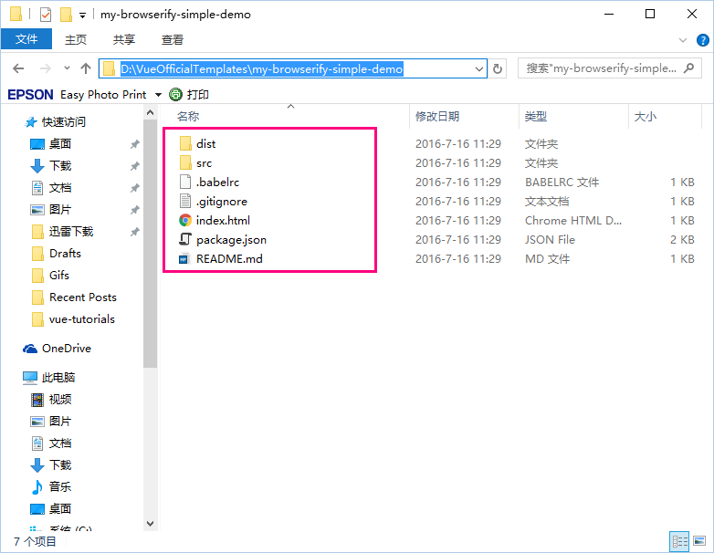

## 出现背景

用传统模式引用 vue.js 以及其他的 js 文件的，这在开发时会产生一些问题。

1. 这限定了我们的开发模式是基于页面的，而不是基于组件的，组件的所有代码都直接写在页面中，这对于一些复杂的页面来说，不是好事情，代码的可读性会较差，也不便于管理。

2. 定义在 HTML 页面中的组件，无法被其他页面重用，我们只能通过复制粘贴的方式将组件代码拷贝到其他页面，这也违反了 DRY 原则。既然组件是 Vue.js 的重要概念，我们就应该利用好它。

为了解决这些问题，Vue.js 官方提供了一些开发模板，这使得我们能够快速地配置好 vue.js 的开发环境。基于这些开发模板，将使用.vue 文件定义组件，使组件代码从 HTML 页面代码中分离出来。在定义组件时，使用一些 ES2015 的便捷语法，将会使组件开发变得更加轻松。

Vue.js 官方提供了两种类型的模板项目：

1. 基于 vue cli 和 browserify 的项目模板
2. 基于 vue cli 和 webpack 的项目模板

## browserify 介绍

Browserify 是一个 CommonJS 风格的模块及依赖管理工具，它不仅是一个打包工具，更关键的是其 JavaScript 的模块及依赖管理能力。

Browserify 参照了 Node 中的模块系统，约定用 `require()` 来引入其他模块，用 `module.exports` 来引出模块。在我看来，Browserify 不同于 RequireJS 和 Sea.js 的地方在于，它没有着力去提供一个“运行时”的模块加载器，而是强调进行预编译。预编译会带来一个额外的过程，但对应的，你也不再需要遵循一定规则去加一层包裹。因此，相比较而言，Browserify 提供的组织方式更简洁，也更符合 CommonJS 规范。

## vueify 介绍

所谓 vueify，就是使用.vue 格式的文件定义组件，一个.vue 文件就是一个组件。

在.vue 文件定义的组件内容包括 3 部分：

1. \< style > \</style > 标签：定义组件样式
2. \< template > \</template > 标签：定义组件模板
3. \< script > \</script > 标签：定义组件的各种选项，比如 data, methods 等。

vue.js 已经拥抱 ES6 了，使用.vue 文件定义组件时，需要使用 ES6 的一些语法，ES6 提供了一些较为优秀的特性，这使得定义组件的代码变得更加简洁。

## vue cli 是什么

像 Visual Studio 这样的工具，在创建项目时可以直接选择 Visual Studio 内置的一些项目模板，例如：创建一个 ASP.NET MVC 或 ASP.NET Web API 项目。

Vue.js 提供了的一系列项目模板，但它没有 Visual Studio 这种可视化的工具。通过什么方式来使用项目模板呢？这就是 vue cli 要干的事儿。

## 使用 vue-browserify-simple 模板

在 git bash 下输入以下命令：

```
vue init browserify-simple my-browserify-simple-demo
```

`browserify-simple` 是项目模板的名称，`my-browserify-simple-demo` 是你要生成的项目名称。

打开 my-browserify-simple-demo 文件夹，看到以下目录结构：



文件树结构如下：

```
├─.babelrc	// babel配置文件
├─.gitignore	
├─index.html	// 主页
├─package.json	// 项目配置文件
├─README.md  
├─dist		// 发布目录
│   ├─.gitkeep       
├─src		// 开发目录	
│   ├─App.vue	// App.vue组件
│   ├─main.js	// 预编译入口
```

**package.json**

```xml
{
  "name": "my-browserify-simple-demo",
  "description": "A Vue.js project",
  "author": "keepfool <crmug@outlook.com>",
  "scripts": {
    "watchify": "watchify -vd -p browserify-hmr -e src/main.js -o dist/build.js",
    "serve": "http-server -c 1 -a localhost",
    "dev": "npm-run-all --parallel watchify serve",
    "build": "cross-env NODE_ENV=production browserify src/main.js | uglifyjs -c warnings=false -m > dist/build.js"
  },
  "dependencies": {
    "vue": "^1.0.0"
  },
  "devDependencies": {
    "babel-core": "^6.0.0",
    "babel-plugin-transform-runtime": "^6.0.0",
    "babel-preset-es2015": "^6.0.0",
    "babel-preset-stage-2": "^6.0.0",
    "babel-runtime": "^6.0.0",
    "cross-env": "^1.0.6",
    "babelify": "^7.2.0",
    "browserify": "^12.0.1",
    "browserify-hmr": "^0.3.1",
    "http-server": "^0.9.0",
    "npm-run-all": "^1.6.0",
    "uglify-js": "^2.5.0",
    "vueify": "^8.5.2",
    "watchify": "^3.4.0"
  },
  "browserify": {
    "transform": [
      "vueify",
      "babelify"
    ]
  }
}
```

package.json 文件是项目配置文件，除了项目的一些基本信息外，有 3 个重要的节点我说明一下：

- dependencies：项目发布时的依赖
- devDependencies：项目开发时的依赖
- scripts：编译项目的一些命令

**.babelrc 文件**

.babelrc 文件定义了 ES6 的转码规则，基于 ES6 编写的 js 代码在编译时都会被 babel 转码器转换为 ES5 代码。

```
{
  "presets": ["es2015", "stage-2"],
  "plugins": ["transform-runtime"]
}
```

为什么要将 ES6 转换为 ES5 呢？因为我们将使用 ES6 的一些语法来编写.vue 组件，而有些浏览器目前还没有全面支持 ES6。

**安装依赖**

执行以下命令安装项目依赖：

```
cd my-browserify-simple-demo
npm install
```

安装完成后，目录下会产生一个 node_modules 文件夹。

**运行示例**

执行以下命令运行示例：

```
npm run dev
```

##  编译过程说明

build.js 文件是怎么产生的呢？我们把它分为两种情况：

- 开发时生成 build.js
- 发布时生成 build.js

何为开发时和发布时？开发过.NET 童鞋，可以简单的理解为 debug 模式和 release 模式。

**开发时生成 build.js**

在 package.json 文件的 scripts 节点下，有 3 行配置：

```
"scripts": {
  "watchify": "watchify -vd -p browserify-hmr -e src/main.js -o dist/build.js",
  "serve": "http-server -c 1 -a localhost",
  "dev": "npm-run-all --parallel watchify serve"
}
```

`npm run dev` 命令执行的是 `dev` 节点对应的命令 `npm-run-all --parallel watchify serve` ，这行命令是依赖于 `watchify` 的，也就是下面这行命令：

```
watchify -vd -p browserify-hmr -e src/main.js -o dist/build.js
```

你不用纠结这行命令的每个参数是什么意思，只需要理解 src/main.js –o dist/build.js 的含义：编译 src/main.js 文件，然后输出到 dist/build.js

serve 节点的命令 `http-server -c 1 -a localhost` 用于开启 http-server，http-server 是一个简易的 web 服务器。

`watchify` 是什么东东呢？`browserify` 的编译是比较缓慢的，当一个 `browserify` 项目开始变大时，编译打包的时间会变得较长。`watchify` 是一个 `browserify` 的封装，其在 package.json 中的配置和 browserify 是一样的。它可以持续件监视文件的改动，**并且只重新打包必要的文件**。在一个大型的项目中使用 `watchify`，第一次打包的时候可能还会花较长时间，但是后续的编译打包将消耗较短的时间。

**发布时生成 build.js**

在理解了上述编译过程后，发布时 build.js 就不难理解了。

```
"build": "cross-env NODE_ENV=production browserify src/main.js | uglifyjs -c warnings=false -m > dist/build.js"
```

执行 `npm run build` 命令可以生成发布时的 build.js。

uglifyjs 是基于 nodejs 的压缩程序，用于压缩 HTML/CSS/JS，执行 `npm run build` 命令后生成的 build.js 就是经过压缩的。n'p'm

## 使用 vue-browserify 模板

`simple-browserify` 模板用于构筑基于 browserify 和 vueify 的开发环境，`browserify` 模板则提供了更多内容：

- 提供了 ESLint：用于格式化 JavaScript 和检查 JavaScript 代码风格。
- 提供了单元测试：使用 PhantomJS with Karma + karma-jasmine + karma-browserify 的单元测试, 支持 ES2015 和 mock。

**生成项目**

重新打开一个 git bash 窗口，执行以下命令：

```
vue init browserify my-browserify-demo
```

`browserify` 是项目模板，`my-browserify-demo` 是项目名称。

文件目录结构如下：

```
├─.babelrc		// babel配置文件
├─.eslintrc		// eslint配置文件
├─.gitignore	
├─index.html		// 主页
├─karma.conf.js		// karma配置文件
├─package.json		// 项目配置文件
├─README.md  
├─dist			// 发布目录
│   ├─.gitkeep       
├─src			// 开发目录	
│   ├─App.vue		// App.vue组件
│   ├─main.js		// 预编译入口
│   ├─components		// 组件目录
│   ├──Hello.vue		// Hello.vue组件
├─test			// 单元测试目录	
│   ├─unit	 
│   ├──Hello.spec.js	// Hello.vue单元测试
```

**安装依赖**

执行以下两行命令，安装项目依赖：

```
cd my-browserify-demo
npm install
```

**运行示例**

执行 npm run dev 命令启动 http-server。