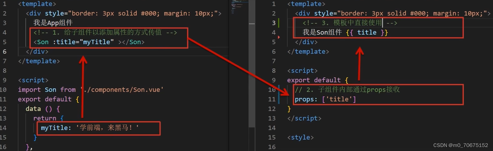
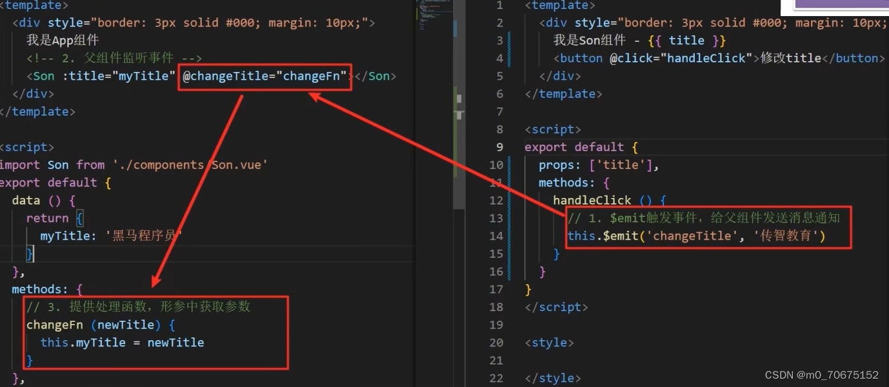

## 文件结构

```js
├── node_modules 
├── public
│   ├── favicon.ico: 页签图标
│   └── index.html: 主页面
├── src
│   ├── assets: 存放静态资源
│   │   └── logo.png
│   │── component: 存放组件
│   │   └── HelloWorld.vue
│   │── App.vue: 汇总所有组件
│   │── main.js: 入口文件
├── .gitignore: git版本管制忽略的配置
├── babel.config.js: babel的配置文件
├── package.json: 应用包配置文件 
├── README.md: 应用描述文件
├── package-lock.json：包版本控制文件
```

## render 函数

之前的写法是这样：

```js
import App from './App.vue'

new Vue({
	el:'#root',
	template:`<App></App>`,
	components:{App},
})
```

如果这样子写，运行的话会引发如下的报错

报错的意思是，是在使用运行版本的 vue ，没有模板解析器。

从上面的小知识可以知道，我们引入的 vue 不是完整版的，是残缺的（为了减小 vue 的大小）。所以残缺的 vue.js 只有通过 render 函数才能把项目给跑起来。

```js
// render最原始写的方式
// render是个函数，还能接收到参数a
// 这个 createElement 很关键，是个回调函数
new Vue({
  render(createElement) {
      console.log(typeof createElement);
      // 这个 createElement 回调函数能创建元素
      // 因为残缺的vue 不能解析 template，所以render就来帮忙解决这个问题
      // createElement 能创建具体的元素
      return createElement('h1', 'hello')
  }
}).$mount('#app')
```

因为 render 函数内并没有用到 this，所以可以简写成箭头函数。

```js
new Vue({
  // render: h => h(App),
  render: (createElement) => {
    return createElement(App)
  }
}).$mount('#app')
```

vue.js 与 vue.runtime.xxx.js 的区别：

vue.js 是完整版的 Vue，包含：核心功能+模板解析器。

vue.runtime.xxx.js 是运行版的 Vue，只包含：核心功能；没有模板解析器。

因为 vue.runtime.xxx.js 没有模板解析器，所以不能使用 template 配置项，需要使用 render 函数接收到的 createElement 函数去指定具体内容。

## ref 属性

- 被用来给元素或子组件注册引用信息（id 的替代者）
- 应用在 html 标签上获取的是真实 DOM 元素，应用在组件标签上是组件实例对象（vc）

```html
this.$refs.baseForm.组件方法()
```

```js
<template>
	<div>
		<h1 v-text="msg" ref="title"></h1>
		<button ref="btn" @click="showDOM">点我输出上方的DOM元素</button>
		<School ref="sch"/>
	</div>
</template>

<script>
	//引入School组件
	import School from './components/School'

	export default {
		name:'App',
		components:{School},
		data() {
			return {
				msg:'欢迎学习Vue！'
			}
		},
		methods: {
			showDOM(){
				console.log(this.$refs.title) //真实DOM元素
				console.log(this.$refs.btn) //真实DOM元素
				console.log(this.$refs.sch) //School组件的实例对象（vc）
			}
		},
	}
</script>
```

## mixin

混入 (mixin) 提供了一种非常灵活的方式，来分发 Vue 组件中的可复用功能。一个混入对象可以包含任意组件选项。当组件使用混入对象时，所有混入对象的选项将被“混合”进入该组件本身的选项。

```js
// 定义一个混入对象
var myMixin = {
  created: function () {
    this.hello()
  },
  methods: {
    hello: function () {
      console.log('hello from mixin!')
    }
  }
}

// 定义一个使用混入对象的组件
var Component = Vue.extend({
  mixins: [myMixin]
})
```

**选项合并**

当组件和混入对象含有同名选项时，这些选项将以恰当的方式进行“合并”。

比如，数据对象在内部会进行递归合并，并在发生冲突时以组件数据优先。

```js
var mixin = {
  data: function () {
    return {
      message: 'hello',
      foo: 'abc'
    }
  }
}

new Vue({
  mixins: [mixin],
  data: function () {
    return {
      message: 'goodbye',
      bar: 'def'
    }
  },
  created: function () {
    console.log(this.$data)
    // => { message: "goodbye", foo: "abc", bar: "def" }
  }
})
```

同名钩子函数将合并为一个数组，因此都将被调用。另外，混入对象的钩子将在组件自身钩子 **之前** 调用。

```js
var mixin = {
  created: function () {
    console.log('混入对象的钩子被调用')
  }
}

new Vue({
  mixins: [mixin],
  created: function () {
    console.log('组件钩子被调用')
  }
})

// => "混入对象的钩子被调用"
// => "组件钩子被调用"
```

值为对象的选项，例如 `methods`、`components` 和 `directives`，将被合并为同一个对象。两个对象键名冲突时，取组件对象的键值对。

```js
var mixin = {
  methods: {
    foo: function () {
      console.log('foo')
    },
    conflicting: function () {
      console.log('from mixin')
    }
  }
}

var vm = new Vue({
  mixins: [mixin],
  methods: {
    bar: function () {
      console.log('bar')
    },
    conflicting: function () {
      console.log('from self')
    }
  }
})

vm.foo() // => "foo"
vm.bar() // => "bar"
vm.conflicting() // => "from self"
```

## 插件

插件通常用来为 Vue 添加全局功能。插件的功能范围没有严格的限制。

通过全局方法 `Vue.use()` 使用插件。它需要在你调用 `new Vue()` 启动应用之前完成：

```js
// 调用 `MyPlugin.install(Vue)`
Vue.use(MyPlugin)

new Vue({
  // ...组件选项
})
```

本质：包含 install 方法的一个对象，install 的第一个参数是 Vue，第二个以后的参数是插件使用者传递的数据。

定义插件：

```js
对象.install = function (Vue, options) {
    // 1. 添加全局过滤器
    Vue.filter(....)

    // 2. 添加全局指令
    Vue.directive(....)

    // 3. 配置全局混入(合)
    Vue.mixin(....)

    // 4. 添加实例方法
    Vue.prototype.$myMethod = function () {...}
    Vue.prototype.$myProperty = xxxx
}
```

**具体案例**

1. plugin.js

```js
export default {
    install(Vue, x, y, z) {
        console.log(x, y, z)
        //全局过滤器
        Vue.filter('mySlice', function (value) {
            return value.slice(0, 4)
        })

        //定义全局指令
        Vue.directive('fbind', {
            //指令与元素成功绑定时（一上来）
            bind(element, binding) {
                element.value = binding.value
            },
            //指令所在元素被插入页面时
            inserted(element, binding) {
                element.focus()
            },
            //指令所在的模板被重新解析时
            update(element, binding) {
                element.value = binding.value
            }
        })

        //定义混入
        Vue.mixin({
            data() {
                return {
                    x: 100,
                    y: 200
                }
            },
        })

        //给Vue原型上添加一个方法（vm和vc就都能用了）
        Vue.prototype.hello = () => { alert('你好啊aaaa') }
    }
}
```

2. main.js

```js
// 引入插件
import plugin from './plugin'

// 使用插件
Vue.use(plugin)
```

## scoped 样式

1. 作用：让样式在局部生效，防止冲突。
2. 写法：`<style scoped>`

**scoped 原理**

1. 当前组件内的表圈都被添加 "data-v-hash 值" 的属性
2. css 选择器都被添加 [data-v-hash 值] 的属性选择器

```js
<style lang="less" scoped>
	.demo{
		background-color: pink;
		.atguigu{
			font-size: 40px;
		}
	}
</style>
```

## 本地存储

### LocalStorage

LocalStorage 的优点：

1. 在大小方面，LocalStorage 的大小一般为 5MB，可以储存更多的信息

2. LocalStorage 是持久储存，并不会随着页面的关闭而消失，除非主动清理，不然会永久存在

3. 仅储存在本地，不像 Cookie 那样每次 HTTP 请求都会被携带

LocalStorage 的缺点：

1. 存在浏览器兼容问题，IE8 以下版本的浏览器不支持
2. 如果浏览器设置为隐私模式，那我们将无法读取到 LocalStorage
3. LocalStorage 受到同源策略的限制，即端口、协议、主机地址有任何一个不相同，都不会访问

LocalStorage 的常用 API：

```js
// 保存数据到 localStorage
localStorage.setItem('key', 'value');

// 从 localStorage 获取数据
let data = localStorage.getItem('key');

// 从 localStorage 删除保存的数据
localStorage.removeItem('key');

// 从 localStorage 删除所有保存的数据
localStorage.clear();

// 获取某个索引的Key
localStorage.key(index)
```

LocalStorage 的使用场景:

1. 有些网站有换肤的功能，这时候就可以将换肤的信息存储在本地的 LocalStorage 中，当需要换肤的时候，直接操作 LocalStorage 即可

2. 在网站中的用户浏览信息也会存储在 LocalStorage 中，还有网站的一些不常变动的个人信息等也可以存储在本地的 LocalStorage 中

### SessionStorage

SessionStorage 和 LocalStorage 都是在 HTML5 才提出来的存储方案，SessionStorage 主要用于临时保存同一窗口(或标签页)的数据，刷新页面时不会删除，关闭窗口或标签页之后将会删除这些数据。

SessionStorage 与 LocalStorage 对比：

1. SessionStorage 和 LocalStorage 都在本地进行数据存储；

2. SessionStorage 也有同源策略的限制，但是 SessionStorage 有一条更加严格的限制，SessionStorage 只有在同一浏览器的同一窗口下才能够共享；

3. LocalStorage 和 SessionStorage 都不能被爬虫爬取；

SessionStorage 的常用 API：

```js
// 保存数据到 sessionStorage
sessionStorage.setItem('key', 'value');

// 从 sessionStorage 获取数据
let data = sessionStorage.getItem('key');

// 从 sessionStorage 删除保存的数据
sessionStorage.removeItem('key');

// 从 sessionStorage 删除所有保存的数据
sessionStorage.clear();

// 获取某个索引的Key
sessionStorage.key(index)
```

**SessionStorage 的使用场景**

由于 SessionStorage 具有时效性，所以可以用来存储一些网站的游客登录的信息，还有临时的浏览记录的信息。当关闭网站之后，这些信息也就随之消除了。

**具体案例**

1. localStorage

```html
<!DOCTYPE html>
<html>
	<head>
		<meta charset="UTF-8" />
		<title>localStorage</title>
	</head>
	<body>
		<h2>localStorage</h2>
		<button onclick="saveData()">点我保存一个数据</button>
		<button onclick="readData()">点我读取一个数据</button>
		<button onclick="deleteData()">点我删除一个数据</button>
		<button onclick="deleteAllData()">点我清空一个数据</button>

		<script type="text/javascript" >
			let p = {name:'张三',age:18}

			function saveData(){
				localStorage.setItem('msg','hello!!!')
				localStorage.setItem('msg2',666)
                // 转成 JSON 对象存进去
				localStorage.setItem('person',JSON.stringify(p))
			}
			function readData(){
				console.log(localStorage.getItem('msg'))
				console.log(localStorage.getItem('msg2'))

				const result = localStorage.getItem('person')
				console.log(JSON.parse(result))

				// console.log(localStorage.getItem('msg3'))
			}
			function deleteData(){
				localStorage.removeItem('msg2')
			}
			function deleteAllData(){
				localStorage.clear()
			}
		</script>
	</body>
</html>
```

2. sessionStorage

```html
<!DOCTYPE html>
<html>
	<head>
		<meta charset="UTF-8" />
		<title>sessionStorage</title>
	</head>
	<body>
		<h2>sessionStorage</h2>
		<button onclick="saveData()">点我保存一个数据</button>
		<button onclick="readData()">点我读取一个数据</button>
		<button onclick="deleteData()">点我删除一个数据</button>
		<button onclick="deleteAllData()">点我清空一个数据</button>

		<script type="text/javascript" >
			let p = {name:'张三',age:18}

			function saveData(){
				sessionStorage.setItem('msg','hello!!!')
				sessionStorage.setItem('msg2',666)
                // 转换成JSON 字符串存进去
				sessionStorage.setItem('person',JSON.stringify(p))
			}
			function readData(){
				console.log(sessionStorage.getItem('msg'))
				console.log(sessionStorage.getItem('msg2'))

				const result = sessionStorage.getItem('person')
				console.log(JSON.parse(result))

				// console.log(sessionStorage.getItem('msg3'))
			}
			function deleteData(){
				sessionStorage.removeItem('msg2')
			}
			function deleteAllData(){
				sessionStorage.clear()
			}
		</script>
	</body>
</html>
```

## 组件自定义事件

组件自定义事件是一种组件间通信的方式，适用于：**子组件 ===> 父组件 **

**使用场景**

A 是父组件，B 是子组件，B 想给 A 传数据，那么就要在 A 中给 B 绑定自定义事件（事件的回调在 A 中）。

**绑定自定义事件：**

第一种方式，在父组件中：`<Demo @atguigu="test"/>` 或 `<Demo v-on:atguigu="test"/>`

1. App.vue

```js
<template>
	<div class="app">
		<!-- 通过父组件给子组件绑定一个自定义事件实现：子给父传递数据（第一种写法，使用@或v-on） -->
		<Student @atguigu="getStudentName"/> 
	</div>
</template>

<script>
	import Student from './components/Student'

	export default {
		name:'App',
		components:{Student},
		data() {
			return {
				msg:'你好啊！',
				studentName:''
			}
		},
		methods: {
			getStudentName(name,...params){
				console.log('App收到了学生名：',name,params)
				this.studentName = name
			}
		}
	}
</script>

<style scoped>
	.app{
		background-color: gray;
		padding: 5px;
	}
</style>
```

2. Student.vue

```js
<template>
	<div class="student">
		<button @click="sendStudentlName">把学生名给App</button>
	</div>
</template>

<script>
	export default {
		name:'Student',
		data() {
			return {
				name:'张三',
			}
		},
		methods: {
			sendStudentlName(){
				//触发Student组件实例身上的atguigu事件
				this.$emit('atguigu',this.name,666,888,900)
			}
		},
	}
</script>

<style lang="less" scoped>
	.student{
		background-color: pink;
		padding: 5px;
		margin-top: 30px;
	}
</style>
```

第二种方式，在父组件中：

使用 `this.$refs.xxx.$on()` 这样写起来更灵活，比如可以加定时器啥的。

1. App.vue

```js
<template>
	<div class="app">
		<!-- 通过父组件给子组件绑定一个自定义事件实现：子给父传递数据（第二种写法，使用ref） -->
		<Student ref="student"/>
	</div>
</template>

<script>
	import Student from './components/Student'

	export default {
		name:'App',
		components:{Student},
		data() {
			return {
				studentName:''
			}
		},
		methods: {
			getStudentName(name,...params){
				console.log('App收到了学生名：',name,params)
				this.studentName = name
			},
		},
		mounted() {
			this.$refs.student.$on('atguigu',this.getStudentName) //绑定自定义事件
			// this.$refs.student.$once('atguigu',this.getStudentName) //绑定自定义事件（一次性）
		},
	}
</script>

<style scoped>
	.app{
		background-color: gray;
		padding: 5px;
	}
</style>
```

2. Student.vue

```js
<template>
	<div class="student">
		<button @click="sendStudentlName">把学生名给App</button>
	</div>
</template>

<script>
	export default {
		name:'Student',
		data() {
			return {
				name:'张三',
			}
		},
		methods: {
			sendStudentlName(){
				//触发Student组件实例身上的atguigu事件
				this.$emit('atguigu',this.name,666,888,900)
			}
		},
	}
</script>

<style lang="less" scoped>
	.student{
		background-color: pink;
		padding: 5px;
		margin-top: 30px;
	}
</style>
```

若想让自定义事件只能触发一次，可以使用 `once` 修饰符，或 `$once` 方法。

触发自定义事件：`this.$emit('atguigu',数据)`

使用 this.$emit() 就可以子组件向父组件传数据

**解绑自定义事件** `this.$off('atguigu')`

```js
this.$off('atguigu') //解绑一个自定义事件
// this.$off(['atguigu','demo']) //解绑多个自定义事件
// this.$off() //解绑所有的自定义事件
```

**组件上也可以绑定原生 DOM 事件，需要使用 `native` 修饰符。**

```js
<!-- 通过父组件给子组件绑定一个自定义事件实现：子给父传递数据（第二种写法，使用ref） -->
<Student ref="student" @click.native="show"/>
```

注意：通过 `this.$refs.xxx.$on('atguigu',回调)` 绑定自定义事件时，回调要么配置在 methods 中，要么用箭头函数，否则 this 指向会出问题！

## 全局事件总线

1. 创建一个都能访问到的事件总线（空 Vue 实例）

```html
import Vue from 'vue'
const Bus = new Vue()
export default Bus
```

2. A 组件（接收方），监听 Bus 实例的事件

```html
created () {
	Bus.$on('sendMsg',(msg) => {
		this.msg = msg
	})
}
```

3. B 组件（发送方），触发 Bus 实例的事件

```html
Bus.$emit('sendMsg','这是一个消息')
```

一种组件间通信的方式，适用于任意组件间通信。

1. 安装全局事件总线：

```js
new Vue({
	......
	beforeCreate() {
		Vue.prototype.$bus = this //安装全局事件总线，$bus就是当前应用的vm
	},
    ......
}) 
```

2. 使用事件总线：

接收数据：A 组件想接收数据，则在 A 组件中给$bus 绑定自定义事件，事件的回调留在 A 组件自身。

```js
methods(){
  demo(data){......}
}
......
mounted() {
  this.$bus.$on('xxxx',this.demo)
}
```

提供数据：`this.$bus.$emit('xxxx',数据)`

3. 最好在 beforeDestroy 钩子中，用$off 去解绑当前组件所用到的事件。

**示例代码**

1. School.vue

```js
<template>
	<div class="school">
		<h2>学校名称：{{name}}</h2>
		<h2>学校地址：{{address}}</h2>
	</div>
</template>

<script>
	export default {
		name:'School',
		data() {
			return {
				name:'尚硅谷',
				address:'北京',
			}
		},
        methods: {
            demo(data) {
                console.log('我是School组件，收到了数据',data)
            }
        }
		mounted() {
			// console.log('School',this)
			this.$bus.$on('hello',this.demo)
		},
		beforeDestroy() {
			this.$bus.$off('hello')
		},
	}
</script>

<style scoped>
	.school{
		background-color: skyblue;
		padding: 5px;
	}
</style>
```

2. Student.vue

```js
<template>
	<div class="student">
		<h2>学生姓名：{{name}}</h2>
		<h2>学生性别：{{sex}}</h2>
		<button @click="sendStudentName">把学生名给School组件</button>
	</div>
</template>

<script>
	export default {
		name:'Student',
		data() {
			return {
				name:'张三',
				sex:'男',
			}
		},
		mounted() {
			// console.log('Student',this.x)
		},
		methods: {
			sendStudentName(){
				this.$bus.$emit('hello',this.name)
			}
		},
	}
</script>

<style lang="less" scoped>
	.student{
		background-color: pink;
		padding: 5px;
		margin-top: 30px;
	}
</style>
```

## 消息订阅与发布

一种组件间通信的方式，适用于任意组件间通信。

1. 安装 pubsub：`npm i pubsub-js`
2. 引入: `import pubsub from 'pubsub-js'`
3. 接收数据：A 组件想接收数据，则在 A 组件中订阅消息，订阅的回调留在 A 组件自身。

```js
methods:{
  demo(data){......}
}
......
mounted() {
  this.pid = pubsub.subscribe('xxx',this.demo) //订阅消息
}
```

4. 提供数据：`pubsub.publish('xxx',数据)`
5. 最好在 beforeDestroy 钩子中，用 `PubSub.unsubscribe(pid)` 去取消订阅。

**订阅消息**

```js
<template>
	<div class="school">
		<h2>学校名称：{{name}}</h2>
		<h2>学校地址：{{address}}</h2>
	</div>
</template>

<script>
	import pubsub from 'pubsub-js'
	export default {
		name:'School',
		data() {
			return {
				name:'尚硅谷',
				address:'北京',
			}
		},
		mounted() {
			// console.log('School',this)
			/* this.$bus.$on('hello',(data)=>{
				console.log('我是School组件，收到了数据',data)
			}) */
			this.pubId = pubsub.subscribe('hello',(msgName,data)=>{
				console.log(this)
				// console.log('有人发布了hello消息，hello消息的回调执行了',msgName,data)
			})
		},
		beforeDestroy() {
			// this.$bus.$off('hello')
			pubsub.unsubscribe(this.pubId)
		},
	}
</script>

<style scoped>
	.school{
		background-color: skyblue;
		padding: 5px;
	}
</style>
```

**发布消息**

```js
<template>
	<div class="student">
		<h2>学生姓名：{{name}}</h2>
		<h2>学生性别：{{sex}}</h2>
		<button @click="sendStudentName">把学生名给School组件</button>
	</div>
</template>

<script>
	import pubsub from 'pubsub-js'
	export default {
		name:'Student',
		data() {
			return {
				name:'张三',
				sex:'男',
			}
		},
		mounted() {
			// console.log('Student',this.x)
		},
		methods: {
			sendStudentName(){
				// this.$bus.$emit('hello',this.name)
				pubsub.publish('hello',666)
			}
		},
	}
</script>

<style lang="less" scoped>
	.student{
		background-color: pink;
		padding: 5px;
		margin-top: 30px;
	}
</style>
```

## nextTick

1. 语法：`this.$nextTick(回调函数)`
2. 作用：在下一次 DOM 更新结束后执行其指定的回调。
3. 什么时候用：当改变数据后，要基于更新后的新 DOM 进行某些操作时，要在 nextTick 所指定的回调函数中执行。想要在 DOM 更新完成之后做某件事，可以使用$nextTick

```js
this.$nextTick(function(){
	this.$refs.inputTitle.focus()
}
```

## Vue 封装的过度与动画

作用：在插入、更新或移除 DOM 元素时，在合适的时候给元素添加样式类名。

元素进入的样式：

1. v-enter：进入的起点
2. v-enter-active：进入过程中
3. v-enter-to：进入的终点

元素离开的样式：

1. v-leave：离开的起点
2. v-leave-active：离开过程中
3. v-leave-to：离开的终点

使用 `<transition>` 包裹要过渡的元素，并配置 name 属性：

```js
<transition name="hello">
	<h1 v-show="isShow">你好啊！</h1>
</transition>
```

备注：若有多个元素需要过度，则需要使用 `<transition-group>`，且每个元素都要指定 `key` 值。

**单个元素过渡**

```js
<template>
	<div>
		<button @click="isShow = !isShow">显示/隐藏</button>
		<transition appear>
			<h1 v-show="isShow">你好啊！</h1>
		</transition>
	</div>
</template>

<script>
	export default {
		name:'Test',
		data() {
			return {
				isShow:true
			}
		},
	}
</script>

<style scoped>
	h1{
		background-color: orange;
	}

	.v-enter-active{
		animation: move 0.5s linear;
	}

	.v-leave-active{
		animation: move 0.5s linear reverse;
	}

	@keyframes move {
		from{
			transform: translateX(-100%);
		}
		to{
			transform: translateX(0px);
		}
	}
</style>
```

name 的作用可以让不同的元素有不同的动画效果

```js
<template>
	<div>
		<button @click="isShow = !isShow">显示/隐藏</button>
		<transition name="hello" appear>
			<h1 v-show="isShow">你好啊！</h1>
		</transition>
	</div>
</template>

<script>
	export default {
		name:'Test',
		data() {
			return {
				isShow:true
			}
		},
	}
</script>

<style scoped>
	h1{
		background-color: orange;
	}

	.hello-enter-active{
		animation: move 0.5s linear;
	}

	.hello-leave-active{
		animation: move 0.5s linear reverse;
	}

	@keyframes move {
		from{
			transform: translateX(-100%);
		}
		to{
			transform: translateX(0px);
		}
	}
</style>
```

**多个元素过渡**

```js
<template>
	<div>
		<button @click="isShow = !isShow">显示/隐藏</button>
		<transition-group name="hello" appear>
			<h1 v-show="!isShow" key="1">你好啊！</h1>
			<h1 v-show="isShow" key="2">尚硅谷！</h1>
		</transition-group>
	</div>
</template>

<script>
	export default {
		name:'Test',
		data() {
			return {
				isShow:true
			}
		},
	}
</script>

<style scoped>
	h1{
		background-color: orange;
	}
	/* 进入的起点、离开的终点 */
	.hello-enter,.hello-leave-to{
		transform: translateX(-100%);
	}
	.hello-enter-active,.hello-leave-active{
		transition: 0.5s linear;
	}
	/* 进入的终点、离开的起点 */
	.hello-enter-to,.hello-leave{
		transform: translateX(0);
	}
</style>
```

## vue 脚手架配置代理

**方法一**

在 vue.config.js 中添加如下配置：

```js
devServer:{
  proxy:"http://localhost:5000"
}
```

1. 优点：配置简单，请求资源时直接发给前端（8080）即可。
2. 缺点：不能配置多个代理，不能灵活的控制请求是否走代理。
3. 工作方式：若按照上述配置代理，当请求了前端不存在的资源时，那么该请求会转发给服务器 （优先匹配前端资源）

**方法二**

编写 vue.config.js 配置具体代理规则：

```js
module.exports = {
	devServer: {
      proxy: {
      '/api1': {// 匹配所有以 '/api1'开头的请求路径
        target: 'http://localhost:5000',// 代理目标的基础路径
        changeOrigin: true,
        pathRewrite: {'^/api1': ''}//代理服务器将请求地址转给真实服务器时会将 /api1 去掉
      },
      '/api2': {// 匹配所有以 '/api2'开头的请求路径
        target: 'http://localhost:5001',// 代理目标的基础路径
        changeOrigin: true,
        pathRewrite: {'^/api2': ''}
      }
    }
  }
}
/*
   changeOrigin设置为true时，服务器收到的请求头中的host为：localhost:5000
   changeOrigin设置为false时，服务器收到的请求头中的host为：localhost:8080
   changeOrigin默认值为true
*/
```

## 组件通信

1. 两种组件关系分类 和 对应的组件通信方案

* 父子关系 → props & $emit
* 非父子关系 → provide & inject 或 eventbys
* 通用方案 → vuex

2. 父子通信方案的核心流程

* 父传子 props:

① 父中给子添加属性值 ② 子 props 接受 ③ 使用



* 子传父$emit：

① 子 $emit 发送消息 ② 父中给子添加消息监听 ③ 父中实现处理函数



## 非父子通信

provide & inject 作用：跨层级共享数据

1. 父组件 provide 提供数据

```html
export default{
	provide () {
		return {
			//普通类型【非响应式】
			color: this.color,
			//复杂类型【响应式】（推荐）
			userInfo: this.userInfo,
		}
	}
}
```

2. 子/孙组件 inject 取值使用

```html
export default {
	inject: ['color','userInfo'],
	created () {
		console.log(this.color,this.userInfo)
	}
}
```

## .sync 修饰符

作用：可以实现子组件和父组件数据的双向绑定，简化代码

特点：prop 属性名，可以自定义，非固定为 value

场景：封装弹框类的基础组件，visible 属性 true 显示 false 隐藏

本质：就是 : 属性名 和 @update: 属性名 合写

```html
<!--父组件-->
<BaseDialog :visible.sync="isShow"></BaseDialog>
```

```html
//子组件
props:{
    visible:Boolean
  },
  methods:{
    close () {
      this.$emit('update:visible', false)
    }
  }
```

