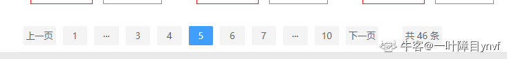
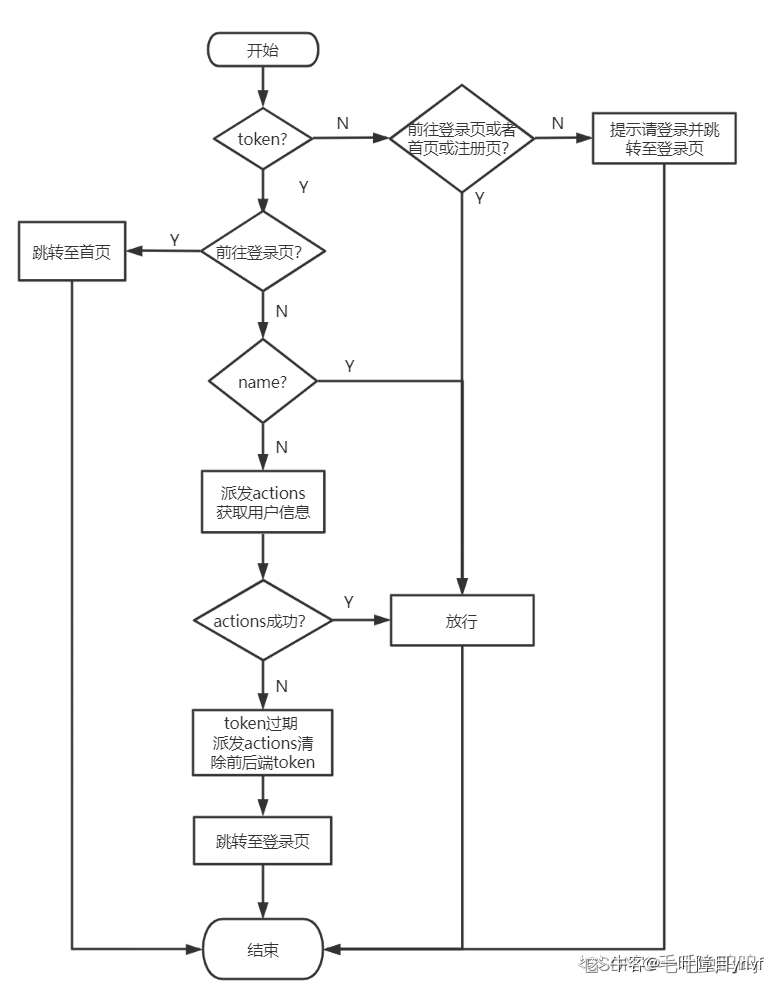

## 本地存储 token

客户端通过代码将 Token 存储到 LocalStorage 或 SessionStorage，vuex 存储数据不是持久化，刷新之后数据会消失

客户端再次发送请求时，通过请求头的 `Authorization` 字段（手动设置），将 Token 发送给服务器 每一次发请求时，将 token 放在请求头中一起发送，在请求拦截器中实现。

```html
//请求拦截器
requestAxios.interceptors.request.use((config)=>{
    if(store.state.detail.uuid_token) {
        config.headers.userTempId = store.state.detail.uuid_token;
    }
    let token = localStorage.getItem('TOKEN');
    if(token){
       config.headers['Authorization'] = 'Bearer ' + token; 
    }
    return config;
})
```

## 对 axios 二次封装

````html
//底下的代码也是创建axios实例
let requests = axios.create({
  //基础路径
  baseURL: "/api",
  //请求不能超过5S
  timeout: 5000,
});

//请求拦截器----在项目中发请求（请求没有发出去）可以做一些事情
requests.interceptors.request.use((config) => {
  //现在的问题是config是什么?配置对象
  //可以让进度条开始动
  if(store.state.detail.uuid_token){
    //请求头添加一个字段(userTempId):和后台老师商量好了
    config.headers.userTempId = store.state.detail.uuid_token;
  }
  //需要携带token带给服务器
  if(store.state.user.token){
    config.headers.token = store.state.user.token;
  }
  nprogress.start();
  return config;
});

//响应拦截器----当服务器手动请求之后，做出响应（相应成功）会执行的
requests.interceptors.response.use(
  (res) => {
    //进度条结束
    nprogress.done();
    //相应成功做的事情
    return res.data;
  },
  (err) => {
    alert("服务器响应数据失败");
  }
);
````

## 使用 mockjs 模拟数据

mockjs 生成随机数据，当前端使用 mock 模拟的数据接口时，mockjs 进行数据返回，并拦截 ajax 请求不发送给后台。

```html
//先引入mockjs模块
import mockjs from "mockjs";//把JSON数据格式引入进来
// webpack默认对外暴露：图片，JSON
import banner from "./banner.json"
import floor from "./floor.json"

//mock数据：第一个参数为请求地址，第二个参数为请求数据
mockjs.mock("/mock/banner", { code: 200, data: banner })
mockjs.mock("/mock/floor", { code: 200, data: floor })
```

```html
const mockRequests = axios.create({
    baseURL:"/mock",
    timeout:5000, //请求超时的时间5s
})

//请求拦截器
mockRequests.interceptors.request.use((config)=>{
    //config:配置对象，对象里面有一个属性很重要，header请求头
    nprogress.start();//进度条开始
    return config;
})

//响应拦截器
//参数1成功的回调，参数2失败的回调
mockRequests.interceptors.response.use((res)=>{
   nprogress.done();//进度条结束
   return res.data;//返回服务器返回的数据
},(error)=>{
    return Promise.reject(new Error('fail')) //终止promise链
})

export default mockRequests;

//采用mock发送请求
import mockRequests from "./request";
//获取Home首页轮播图banner的结构
export const getBannerList = () => mockRequests.get('/banner');
```

## 封装分页器




1. 当前是第几页 pageNo
2. 每一页需要展示多少数据 pagesize
3. 分页器一共有多少条数据 total
4. 分页器显示的连续页码个数：5 | 7
5. 对于分页器，很重要的点是计算出连续显示页面号起始数字和结束数字。 当前页在连续页的正中间

```html
 computed: {
    //总共多少页
    totalPage() {
      return Math.ceil(this.total / this.pageSize);
    },
    //计算出连续的页码的起始数字与结束数字[连续页码的数字:至少是5]
    startNumAndEndNum() {
      const { continues, pageNo, totalPage } = this;
      //先定义两个变量存储起始数字与结束数字
      let start = 0, end = 0;
      //不正常现象【总页数没有连续页码多】
      if (continues > totalPage) {
        start = 1;
        end = totalPage;
      } else {
        //正常现象【连续页码5，但是你的总页数一定是大于5的】
        start = pageNo - parseInt(continues / 2);
        end = pageNo + parseInt(continues / 2);
        //把出现不正常的现象【start数字出现0|负数】纠正
        if (start < 1) {
          start = 1;
          end = continues;
        }
        //把出现不正常的现象[end数字大于总页码]纠正
        if (end > totalPage) {
          end = totalPage;
          start = totalPage - continues + 1;
        }
      }
      return { start, end };
    },
  }
```

## 事件委托

将多个子元素的同类事件监听委托给（绑定在）共同的一个父组件上。

好处：

1. 减少内存占用（事件监听的回调变少）
2. 动态添加的内部元素也能响应

```html
 <div class="all-sort-list2" @click="goSearch" @mouseleave="leaveIndex">
          <div class="item"  v-for="(c1,index) in categoryList" v-show="index!==16" :key="c1.categoryId" :class="{cur:currentIndex===index}">
            <h3 @mouseenter="changeIndex(index)"  >
              <a :data-categoryName="c1.categoryName" :data-category1Id="c1.categoryId" >{{c1.categoryName}}</a>
            </h3>
            <div class="item-list clearfix" :style="{display:currentIndex===index?'block':'none'}">
              <div class="subitem" v-for="(c2,index) in c1.categoryChild" :key="c2.categoryId">
                <dl class="fore">
                  <dt>
                    <a :data-categoryName="c2.categoryName" :data-category2Id="c2.categoryId">{{c2.categoryName}}</a>
                  </dt>
                  <dd>
                    <em v-for="(c3,index) in c2.categoryChild"  :key="c3.categoryId">
                      <a :data-categoryName="c2.categoryName" :data-category3Id="c3.categoryId">{{c3.categoryName}}</a>
                    </em>
</dd></dl></div></div></div></div>
```

```html
goSearch(event){
      let element = event.target
      //html中会把大写转为小写
      //获取目前鼠标点击标签的categoryname,category1id,category2id,category3id，
      // 通过四个属性是否存在来判断是否为a标签，以及属于哪一个等级的a标签
      let {categoryname,category1id,category2id,category3id} = element.dataset

      //categoryname存在，表示为a标签
      if(categoryname){
        //category1id一级a标签
        //整理路由跳转的参数
        let location = {name:'Search'}//跳转路由name
        let query = {categoryName:categoryname}//路由参数

        if(category1id){
          query.category1Id = category1id
        }else if(category2id){
        //category2id二级a标签
          query.category2Id = category2id
        }else if(category3id){
        //category3id三级a标签
          query.category3Id = category3id
        }
        //整理完参数
        location.query = query
        //路由跳转
        this.$router.push(location)
      }
    },
```

## 节流和防抖

**问题描述**

给一级菜单绑定了鼠标的事件监听，当鼠标频繁进入时，事件回调被频繁执行。当用户操作很快时，移入的一级分类都应该触发鼠标进入事件，但是经过测试，只有部分的一级分类被触发了。原因是用户行为过快，导致浏览器没有反应过来。如果当前回调中有大量业务，有可能出现浏览器卡顿现象。

**防抖函数的应用场景：**

- 按钮提交场景：防止多次提交按钮，只执行最后提交的一次
- 服务端验证场景：表单验证需要服务端配合，只执行一段连续的输入事件的最后一次，还有搜索联想词功能类似生存环境请用 lodash.debounce

**节流函数的应用场景：**

- 拖拽场景：固定时间内只执行 ⼀ 次，防止超高频次触发位置变动
- 缩放场景：监控浏览器 resize
- 动画场景：避免短时间内多次触发动画引起性能问题

**问题解决**

1. 节流（throttle）：控制事件执行的时间间隔，在函数需要频繁触发时：函数执行一次后，只有大于设定的执行周期后才会执行第二次。适合多次事件按时间做平均分配触发：窗口调整（resize）+ 页面滚动（scroll）等
2. 防抖（debounce）：在函数需要频繁触发时：在规定时间内，只让最后一次生效，前面的不生效。
   适合多次事件一次响应的情况：输入框实时搜索联想（keyup/input）

**节流(throttle)函数**

控制的是给事件绑定的回调函数执行的频率，那么该函数的返回值应该是一个函数。

参数有两个

1. 获取到的回调函数 
2. 设置的时间间隔

注意点

1. 返回函数使用了闭包，闭包会永远在内存中保存，所以这个 pre 都是记录的上一次的结果
2. 修改 this 的目的是让函数的指向绑定事件的 DOM

```html
//使用形式，绑定时候throttle函数就会执行,所以this是window
window.addEventListener('scroll',throttle(()=>{},500))

//自定义
function throttle(callback,wait){
	let pre=0;
	//console.log(this);window
	//节流函数/真正的事件回调函数
	return function(...args){
		const now = Date.now();
		if(now-pre>wait){
			//callback()是window调用的，所以callback函数里的this是window,这里要修改指向事件源,
			//console.log('this2',this); //DOM
			callback.apply(this,args);
			pre = now;
		}
	}
}
```

**防抖(debounce)函数**

控制的是给事件绑定的回调函数执行的频率，那么该函数的返回值应该是一个函数。

参数有两个

1. 获取到的回调函数
2. 设置的规定时间

**思路**

1. 返回一个函数，在函数中设置定时器，在定时器中执行回调函数，注意 this 指向的改变
2. 当频繁点击的时候，如果此时已经开启定时器了说明之前触发了回调，我们需要删除定时器
3. 注意定时器的 timeId 不能在返回函数中定义，如果在返回函数中定义，那么每次触发回调的时候，都会重新定义。而我们的需求是对于当前触发的回调，timeId 需要记录之前的结果，通过 timeId 来判断之前是不是已经开启了定时器。所以这里需要利用闭包实现。

```html
//使用形式:绑定时debounce立即执行
window.addEventListener('scroll',debounce(()=>{},500)); 
//防抖函数
function debounce(callback, wait){
 	let timeId=null;
 	return funtion(...args){
		if(timeId){//之前已经有一个定时器了，这里再一次触发事件，重新开始即使
			clearTimeout(timer)；
		}
		timeId = setTimeout(()=>{
			callback.apply(this,args)；
			//执行成功之后，重置timeId,所以这里可以起作用
            timeId = null;
		},wait)			
	}
}
```

## 路由懒加载

懒加载本质是延迟加载或按需加载，即在需要的时候的时候进行加载。 首页不用设置懒加载，一个页面加载过后再次访问不会重复加载。

当打包构建应用时，JavaScript 包会变得非常大，影响页面加载。如果我们能把不同路由对应的组件分割成不同的代码块，然后当路由被访问的时候才加载对应组件，这样就更加高效了。

```html
{
    name: 'center',
    path: '/center',
    component: () => import('@/pages/Center'),//路由懒加载
    children: [
        {
            path: 'myorder',
            component: () => import('@/pages/Center/myOrder')
        }, {
            path: 'grouporder',
            component: () => import('@/pages/Center/groupOrder')
        }, , {
            path: '',//当路径默认的时候（完全的路径的/center/）
            redirect: '/center/myorder'//重定向到myorder路由
        }
    ]
},
```

## 图片懒加载

场景（图片：比用用户网络不好，服务器的数据没有回来， 总不可能让用户看白色，至少有一个默认图片在展示。）

我们请求一个带有 `n` 张图片的 html 文件实际上会发送 `n+1` 次请求，因为在浏览器解析 html 的时候遇到了 `src`，就会请求 `src` 后面的内容。

如果资源文件很大时，容易阻塞渲染引起卡顿。或者就算加载完毕，用户也不一定会滚动屏幕浏览。所以在首次打开网站时，应尽量只加载首屏内容所包含的资源。

用 vue-lazyload 插件

```html
//引入插件（图片懒加载）
import VueLazyload from 'vue-lazyload'
//引入懒加载的图片
import loadimage from '@/assets/images/111.jpg'
//注册图片懒加载插件
Vue.use(VueLazyload, {
  loading: loadimage,
})
```

## 路由跳转报错

**问题描述**

编程式路由重复点击（参数不变）， 多次执行会抛出 NavigationDuplicated 警告报错

**问题分析，为什么会报错？**

Vue router3.1 之后，`$router.push()` 返回 Promise，返回的 promise 没有设置失败的回调，没有对错误进行处理

**解决办法**

1. 对每个 `router.push()` 进行错误捕获

```html
router.push('xxxx').catch(err => {err})
```

2. push 方法还可以传入成功和失败的回调

```html
this.$router.push({
		name:'search',//路由记得命名
		params:{keyword:this.keyword},
		query:{keyword:this.keyword.toUpperCase()}
},()=>{},(err)=>{
    if(如果是NavigationDuplicated错误)
    	console.log(err)
})
```

3. 重写 push()方法

* 先保存 VueRouter 原型上的 push 方法
* 重写 push|repalce

```html
import VueRouter from 'vue-router' //引入插件
Vue.use(VueRouter) //使用插件

let originPush = VueRouter.prototype.push;
VueRouter.prototype.push = function (location, resolve, reject) {
    if (resolve && reject) {
        //当传了成功与失败的回调时
        originPush.call(this, location, resolve, reject)
    } else {
        originPush.call(this, location, () => { }, () => { })//没有传的话就返回两个 空对象
    }
}
```

## swiper 插件实现轮播图

```html
<template>
  <div class="swiper-container" ref="cur">
    <div class="swiper-wrapper">
      <div
        class="swiper-slide"
        v-for="(carousel, index) in list"
        :key="carousel.id"
      >
        
      </div>
    </div>
    <!-- 如果需要分页器 -->
    <div class="swiper-pagination"></div>

    <!-- 如果需要导航按钮 -->
    <div class="swiper-button-prev"></div>
    <div class="swiper-button-next"></div>
  </div>
</template>
```

```html
//引入Swiper
import Swiper from "swiper";
export default {
  name: "Carsousel",
  props: ["list"],
  watch: {
    list: {
      //立即监听：不管你数据有没有变化，我上来立即监听一次
      //为什么watch监听不大list：因为这个数据从来没有发生变化（数据是父亲给的，父亲给的时候就是一个对象，对象里面该有的数据都是有的）
      immediate: true,
      handler() {
        //只能监听到数据已经有了，但是v-for动态渲染结构我们还是没有办法确定的，因此还是需要用nextTick
        this.$nextTick(() => {
          var mySwiper = new Swiper(this.$refs.cur, {
            loop: true,
            // 如果需要分页器
            pagination: {
              el: ".swiper-pagination",
              //点击小球的时候也切换图片
              clickable: true,
            },
            // 如果需要前进后退按钮
            navigation: {
              nextEl: ".swiper-button-next",
              prevEl: ".swiper-button-prev",
            },
          });
        });
      },
    },
  },
};
```

**不生效时的原因**

在 new Swiper 实例之前，页面中的结构必须存在。刚开始将数据请求放在 mounted 里，但是 ajax 请求是异步的，数据是动态获取的，new Swiper 时可能数据还没有获取到，或者说页面还没有根据数据重新渲染，结构还不完整。

swiper 插件完成轮播图需要两件事：首先将 DOM 结构渲染完成，然后再创建一个 swiper 实例。 但是我们从浏览器获取数据是异步的（获取数据也在 mounted 中），所以不能保证创建 swiper 实例时（在 mounted 生命周期函数内创建这个实例）就将 DOM 结构完成了，要解决这个问题，有以下三种方法：

- update 当有其他数据时，其它数据进行更新，但轮播图的数据不更新时，都会再创建一次 swiper 实例然后再创建轮播图，所以这个方法不是特别好。
- 延时器 延时 1 秒，轮播图的功能才可以实现，此方法可行但也不是很完美。
- watch+nextTick 如果只有 watch，只能保证 bannerList 数据已经存入到仓库里了，但是不能确定 v-for 执行完毕，v-for 执行完了才能保证 DOM 结构完成，所以需要结合 nextTick 来完成。

```html
 mounted() {
      //派发action，通过vuex发起ajax请求
      this.$store.dispatch('home/reqBannerList');
      new Swiper(document.querySelector('.swiper-container'),{
        loop:true,
        pagination:{
          el:".swiper-pagination"
        },
        navigator:{
          nextEl:".swiper-button-next",
          prevEl:".swiper-button-prev"
        }
      })
   }
```

**解决办法**

watch：数据监听，监听已有数据变化。 此时只能保证数据已经获取到了，不能保证 v-for 之后 dom 渲染完毕了

$nextTick：将回调延迟到下次 DOM 更新之后执行

本质：将回调添加到任务队列中延迟执行

更新 DOM 的回调和 vm.$nextTick注册的回调，都是添加到微队列中。所以DOM会先更新完毕，然后再执行$ nextTick 的回调

## 滚动条保持原有位置

**问题描述**

当从页面跳转到新路由时，滚动条保持原有位置

**原因**

路由切换时没有重新刷新页面

**解决办法**

使用前端路由，当切换到新路由时，想要页面滚动到顶部或者保持原先的滚动位置，vue-router 可以实现，只支持在 history.pushState 的浏览器使用。 引出 H5 接口的新方法 pushState 和 replaceState，或者 hash 模式和 history 模式的区别

```html
//配置路由
export default new VueRouter({
    routes,
    scrollBehavior (to, from, savedPosition) {
        return {x:0,y:0} //每次路由切换时的滚动条位置
    }
})
```

## 三级联动

判断原本这个有无 params 参数（可能搜索框有）

```html
if (this.$route.params) {//有
    location.params = this.$route.params;
    location.query = query;
    this.$router.push(location);
}
```

但是在跳转路由的时候，若是搜索框里面是空串就会出 bug，（外加可能没有点分类，直接搜索）解决：

```html
if (this.$route.query) {
    let loction = {
      name: "search",
      params: { keyword: this.keyword || undefined },//没有则是undefined
    };
    loction.query = this.$route.query;
    this.$router.push(loction);
}
```

## ngrogress 进度条

打开一个页面时，往往会伴随一些请求，并且会在页面上方出现进度条。它的原理时，在我们发起请求的时候开启进度条，在请求成功后关闭进度条，所以只需要在 request.js 中进行配置。 

```html
import axios from "axios";
//引入进度条
import nprogress from 'nprogress';
//引入进度条样式
import "nprogress/nprogress.css";
//1、对axios二次封装
const requests = axios.create({
    //基础路径，requests发出的请求在端口号后面会跟改baseURl
    baseURL:'/api',
    timeout: 5000,
})
//2、配置请求拦截器
requests.interceptors.request.use(config => {
    //config内主要是对请求头Header配置
    //比如添加token

    //开启进度条
    nprogress.start();
    return config;
})
//3、配置相应拦截器
requests.interceptors.response.use((res) => {
    //成功的回调函数

    //响应成功，关闭进度条
    nprogress.done()
    return  res.data;
},(error) => {
    //失败的回调函数
    console.log("响应失败"+error)
    return Promise.reject(new Error('fail'))
})
//4、对外暴露
export default requests;
```

## 导航守卫

因为商城项目是要有用户，然后访问对应购物车等每个用户私有的数据的，所以在登录或未登录的时候不能跳转到一些特定的路由去，所以就要用到路由导航守卫了。

当用户未登录：要是去订单，支付，订单详情页面都把路由跳转到登录页面，为了登录之后可以直接访问原本要去的路由，则可以用 params 参数转到登录页方便跳转。

当用户登录了：要去登录或者注册页，是不行的，直接去往主页（其实这个需求可以不要）

还有就是因为 token 是存在浏览器本地的，而 name 是存在仓库的，所以要判断有 token 但是没有用户名，有就放行，没有则再获取一下用户信息，但这里要判断一下成功与失败，若是失败的话再要跳转到登录界面，因为你即便有 token，但是长时间不登录，后端的数据会更新，从而 token 会失效



```html
{
    name: 'pay',
    path: '/pay',
    component: () => import('@/pages/Pay'),
    beforeEnter: (to, from, next) => {
        //只有是从trade订单来的才能进入pay支付路由
        if (from.path == '/trade') {
            next()
        } else {
            next(false)
        }
    }
},
```

```html
//设置全局导航前置守卫
router.beforeEach(async(to, from, next) =>  {
    let token = store.state.user.token
    let name = store.state.user.userInfo.name
    //1、有token代表登录，全部页面放行
    if(token){
        //1.1登陆了，不允许前往登录页
        if(to.path==='/login'){
            next('/home')
        } else{
            //1.2、因为store中的token是通过localStorage获取的，token有存放在本地
            // 当页面刷新时，token不会消失，但是store中的其他数据会清空，
            // 所以不仅要判断token,还要判断用户信息

            //1.2.1、判断仓库中是否有用户信息，有放行，没有派发actions获取信息
            if(name)
                next()
            else{
                //1.2.2、如果没有用户信息，则派发actions获取用户信息
                try{
                    await store.dispatch('getUserInfo')
                    next()
                }catch (error){
                    //1.2.3、获取用户信息失败，原因：token过期
                    //清除前后端token，跳转到登陆页面
                    await store.dispatch('logout')
                    next('/login')
                }
            }
        }
    }else{
        //2、未登录，首页或者登录页可以正常访问
        if(to.path === '/login' || to.path === '/home' || to.path==='/register')
            next()
        else{
            alert('请先登录')
            next('/login')
        }
    }
})
```

## 跨域问题

```html
module.exports = {
    //关闭eslint校验工具
     lintOnSave:false,
     //代理跨域
     devServer:{
        proxy: {
            "/api": {
              target: "http://39.98.123.211",
              //路径不需要重写，因为所有的接口都有/api
            //   pathRewrite: {"^/api" : ""}
            },
          },
     },   
} 
```

## 项目配置

项目运行，浏览器自动打开

```json
"scripts": {
    "serve": "vue-cli-service serve --open",
    "build": "vue-cli-service build",
    "lint": "vue-cli-service lint"
},
```

src 文件夹配置别名，创建 jsconfig.json，用@/代替 src/，exclude 表示不可以使用该别名的文件

```json
 {
    "compilerOptions": {
        "baseUrl": "./",
            "paths": {
            "@/*": [
                "src/*"
            ]
        }
    },

    "exclude": [
        "node_modules",
        "dist"
    ]
 }
```

## 导航条只发送一次请求

当组件之间进行切换时，会销毁旧组件，创建新组件。所以组件中的子组件导航也会重新创建实例、重新挂载，重新发送数据请求。

**如何优化** 

对于导航组件来说，一般都是不变的，所以我们希望只发送一次数据请求。所以可以把数据请求放在根组件，根组件只会实例化一次

## footer 组件显示与隐藏

- footer 在登录注册页面是不存在的，所以要隐藏，v-if 或者 v-show
- 这里使用 v-show，因为 v-if 会频繁的操作 dom 元素消耗性能，v-show 只是通过样式将元素显示或隐藏
- 配置路由的时候，可以给路由配置元信息 meta,
- 在路由的原信息中定义 show 属性，用来给 v-show 赋值，判断是否显示 footer 组件
