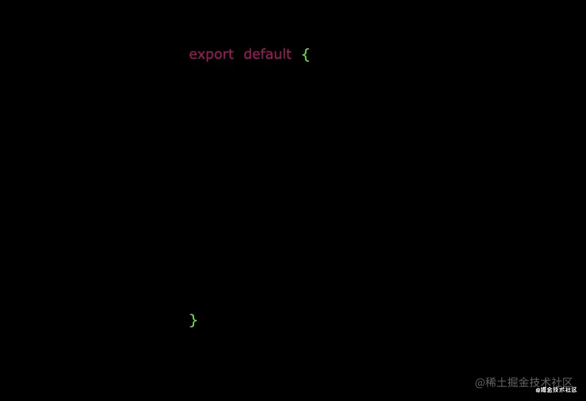
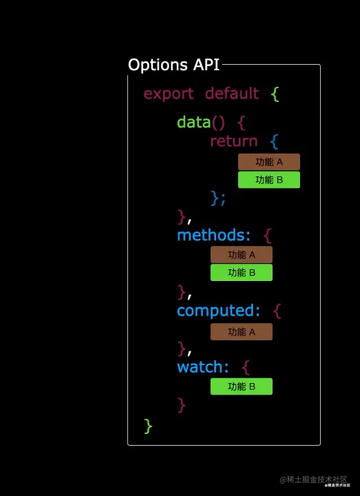
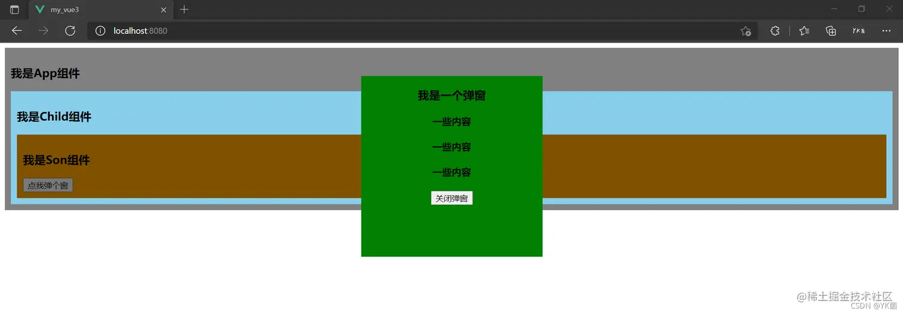
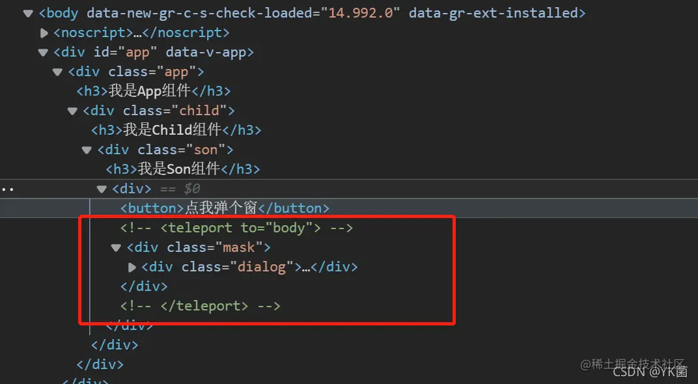
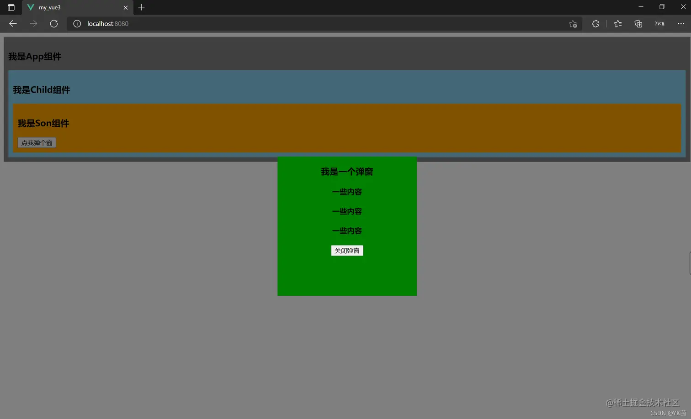
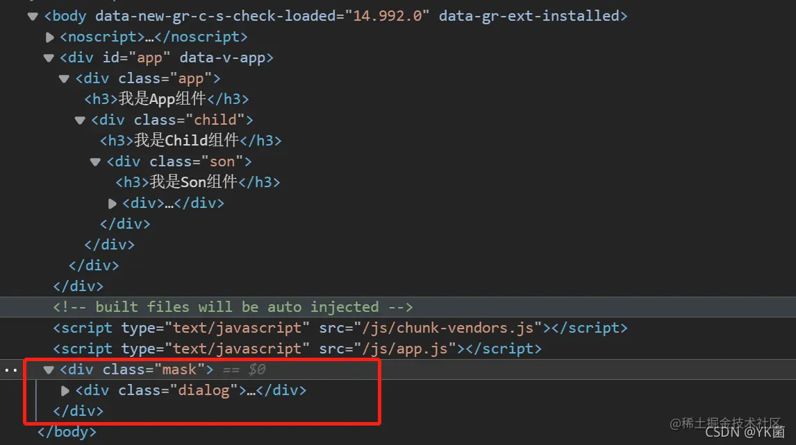

## Vue2 与 Vue3

1. 性能的提升

- 打包大小减少 **41%**
- 初次渲染快 **55%**, 更新渲染快 **133%**
- 内存减少 **54%**

2. 源码的升级

- 使用 `Proxy` 代替 `defineProperty` 实现响应式
- 重写虚拟 `DOM` 的实现和 `Tree-Shaking`

3. 拥抱 TypeScript

- Vue3 可以更好的支持 `TypeScript`

4. 新的特性

Composition API（组合 API）

- `setup` 配置
- `ref` 与 `reactive`
- `watch` 与 `watchEffect`
- `provide` 与 `inject`

新的内置组件

- `Fragment `
- `Teleport`
- `Suspense`

其他改变

- 新的生命周期钩子
- `data ` 选项应始终被声明为一个函数
- 移除 `keyCode` 支持作为 `v-on` 的修饰符

## Composition API

在 Vue2 中，我们使用的是 Options API ，配置项式的 API，我们要创建一个 Vue 实例，然后在里面传入一个配置对象，里面要写 data、methods、watch 等的东西，而 Vue3 提出了全新的 Composition API，组合式 API，我们不用直接创建 Vue 实例，而是创建一个 app，然后按需引入需要的 API，来进行使用...

**Options API 存在的问题**

使用传统 Options API（配置式 API）中，新增或者修改一个需求，就需要分别在 data，methods，computed 里修改 。





**Composition API 的优势**

我们可以更加优雅的组织我们的代码，函数。让相关功能的代码更加有序的组织在一起。


## setup

1. 理解：Vue3.0 中一个新的配置项，值为一个函数。

2. `setup` 是所有 **Composition API（组合 API）** *“ 表演的舞台 ”*。

3. 组件中所用到的：**数据**、**方法** 等等，均要配置在 `setup` 中。

4. setup 函数的两种返回值：

* 若返回一个对象，则对象中的属性、方法, 在模板中均可以直接使用。（重点关注！）

* 若返回一个渲染函数：则可以自定义渲染内容。（了解） (不常用)

```html
<template>
  <h1>博主的信息</h1>
  <h2>姓名：{{name}}</h2>
  <h2>年龄：{{age}}</h2>
  <h2>性别：{{gender}}</h2>
  <button @click="sayInfo">显示信息</button>
</template>

<script>
// import {h} from 'vue'
export default {
  name: "App",
  //此处只是测试一下setup，暂时不考虑响应式的问题。
  setup(){
    // 数据
    let name = "YK菌"
    let age = 18
    let gender = "男"

    // 方法
    function sayInfo(){
      alert(`你好${name}，你太厉害了吧`)
    }
    return {
      name,age, gender,sayInfo
    }
    // return ()=> h('h1','YK菌yyds')
  }
};
</script>
```

注意点：

1. 尽量不要与 Vue2.x 配置混用
   - Vue2.x 配置（data、methos、computed...）中 **可以访问到** setup 中的属性、方法。
   - 但在 setup 中 **不能访问到** Vue2.x 配置（data、methos、computed...）。
   - 如果有重名，`setup` 优先。
2. `setup` 不能是一个 `async` 函数，因为返回值不再是对象，而是 `promise`，模板看不到 return 对象中的属性。（后期也可以返回一个 Promise 实例，但需要 Suspense 和异步组件的配合）

`setup` 执行的时机：在 `beforeCreate` 之前执行一次，`this` 是 `undefined`。

**父组件向子组件传递属性参数**

```html
<template>
  <h1>博主的信息</h1>
  <HelloWorld msg="你好啊" school="ABC"></HelloWorld>
</template>

<script>
import HelloWorld from "./components/HelloWorld.vue";
export default {
  name: "App",
  components: { HelloWorld },
};
</script>

<style></style>
```

```html
<template>
  <h2>姓名：{{ yk.name }}</h2>
</template>

<script>
import { reactive } from "@vue/reactivity";
export default {
  name: "HelloWorld",
  props: ['msg'], // 不写全会报警告
  setup(props, context) {
    let yk = reactive({
      name: "YK菌",
    });
    console.log('props-----',props);
    console.log()
    console.log('context.attrs-----', context.attrs)
    return { yk };
  },
};
</script>
```

**自定义事件**

```html
<template>
  <h1>博主的信息</h1>
  <HelloWorld @hello="showHelloMsg"></HelloWorld>
</template>

<script>
import HelloWorld from "./components/HelloWorld.vue";
export default {
  name: "App",
  setup() {
    function showHelloMsg(value) {
      alert(`你好啊，你触发了hello事件，我收到的参数是:${value}！`);
    }
    return { showHelloMsg };
  },
  components: { HelloWorld },
};
</script>
```

```html
<template>
  <h2>姓名：{{ yk.name }}</h2>
  <button @click="test">测试触发一下HelloWorld组件的Hello事件</button>
</template>

<script>
import { reactive } from "@vue/reactivity";
export default {
  name: "HelloWorld",
  emits:["hello"], // 不写能执行，但是会报警告
  setup(props, context) {
    let yk = reactive({
      name: "YK菌",
    });
    function test() {
      context.emit("hello", "**子组件的信息**");
    }
    return { yk,test };
  },
};
</script>
```

## ref

作用：定义一个 **响应式** 的数据

语法： `const xxx = ref(initValue)`

- 创建一个包含响应式数据的 **引用对象（reference 对象，简称 ref 对象）**。
- JS 中操作数据： `xxx.value`
- 模板中读取数据：不需要 `.value`，直接：`<div>{{xxx}}</div>`

备注：

- 接收的数据可以是：基本类型、也可以是对象类型。
- 基本类型的数据：响应式依靠的是类上的 `getter` 与 `setter` 完成的（我们等下看下源码你就知道了）。
- 对象类型的数据：内部 *“ 求助 ”* 了 Vue3.0 中的一个新函数—— `reactive` 函数。

```html
<template>
  <h1>博主的信息</h1>
  <h2>姓名：{{ name }}</h2>
  <h2>年龄：{{ age }}</h2>
  <h2>职业： {{ job.type }}</h2>
  <h2>工资：{{ job.salary }}</h2>
  <button @click="sayInfo">显示信息</button>
  <button @click="changeInfo">修改信息</button>
</template>

<script>
import { ref } from "vue";
export default {
  name: "App",
  setup() {
    // 数据
    let name = ref("YK菌");
    let age = ref(18);
    let job = ref({
      type: "前端工程师",
      salary: "30K",
    });
    // 方法
    function sayInfo() {
      alert(`你好${name.value}，你太厉害了吧，薪水${job.value.salary}这么高`);
    }
    function changeInfo() {
      name.value = "三十年后的YK菌";
      age.value = 48;
      job.value.type = "工程师";
      job.value.salary = "200K";
    }
    return {
      name,
      age,
      job,
      sayInfo,
      changeInfo,
    };
  },
};
</script>
```

通过看源码可以知道调用 ref 会返回一个 RefImpl 的实例对象，RefImpl 类中有 getter 和 setter 可以检测到数据的变化

```html
function ref(value) {
    return createRef(value, false);
}

function createRef(rawValue, shallow) {
    if (isRef(rawValue)) {
        return rawValue;
    }
    return new RefImpl(rawValue, shallow);
}

class RefImpl {
    constructor(value, _shallow) {
        this._shallow = _shallow;
        this.dep = undefined;
        this.__v_isRef = true;
        this._rawValue = _shallow ? value : toRaw(value);
        this._value = _shallow ? value : convert(value);
    }
    get value() {
        trackRefValue(this);
        return this._value;
    }
    set value(newVal) {
        newVal = this._shallow ? newVal : toRaw(newVal);
        if (hasChanged(newVal, this._rawValue)) {
            this._rawValue = newVal;
            this._value = this._shallow ? newVal : convert(newVal);
            triggerRefValue(this, newVal);
        }
    }
}
```

## reactive

作用： 定义一个 **对象类型** 的响应式数据（基本类型不要用它，要用 `ref` 函数）

语法：`const 代理对象= reactive(源对象)` 接收一个对象（或数组），返回一个 **代理对象（`Proxy` 的实例对象，简称 `proxy` 对象）**

`reactive` 定义的响应式数据是“深层次的”。

内部基于 ES6 的 `Proxy` 实现，通过代理对象操作源对象内部数据进行操作

```html
<template>
  <h1>博主的信息</h1>
  <h2>姓名：{{ yk.name }}</h2>
  <h2>年龄：{{ yk.age }}</h2>
  <h2>职业： {{ yk.job.type }}</h2>
  <h2>工资：{{ yk.job.salary }}</h2>
  <h2>爱好：{{ yk.hobby }}</h2>
  <h3>测试数据：{{ yk.job.a.b.c }}</h3>
  <button @click="changeInfo">修改信息</button>
</template>

<script>
import { reactive } from "vue";
export default {
  name: "App",
  setup() {
    // 数据
    let yk = reactive({
      name: "YK菌",
      age: 18,
      hobby: ["写博客", "学习", "看书"],
      job: {
        type: "前端工程师",
        salary: "30K",
        a: {
          b: {
            c: 666,
          },
        },
      },
    });

    // 方法
    function changeInfo() {
      yk.name = "三十年后的YK菌";
      yk.age = 48;
      yk.job.type = "工程师";
      yk.job.salary = "200K";
      yk.job.a.b.c = 888;
      // 直接通过数组下标修改，可以触发响应式
      yk.hobby[0] = "写小说";
    }
    return {
      yk,
      changeInfo,
    };
  },
};
</script>
```

## Vue3.0 中的响应式原理

**Vue2.x 的响应式**

实现原理

- 对象类型：通过 `Object.defineProperty()` 对属性的读取、修改进行拦截（数据劫持）。
- 数组类型：通过重写更新数组的一系列方法来实现拦截。（对数组的变更方法进行了包裹）。

```html
Object.defineProperty(data, 'count', {
    get () {}, 
    set () {}
})
```

- 存在问题
  - **新增** 属性、**删除** 属性, 界面不会更新。
  - 直接通过 **下标修改** 数组, 界面不会自动更新。
- 解决方案
  - 使用 `Vue.set`、`Vue.delete` 或者 `vm.$set`、`vm.$delete` 这些 API

模拟 Vue2 中实现响应式

```html
//源数据
let person = {
	name:'张三',
	age:18
}
//模拟Vue2中实现响应式
let p = {}
Object.defineProperty(p,'name',{
	configurable:true,
	get(){ //有人读取name时调用
		return person.name
	},
	set(value){ //有人修改name时调用
		console.log('有人修改了name属性，我发现了，我要去更新界面！')
		person.name = value
	}
})
Object.defineProperty(p,'age',{
	get(){ //有人读取age时调用
		return person.age
	},
	set(value){ //有人修改age时调用
		console.log('有人修改了age属性，我发现了，我要去更新界面！')
		person.age = value
	}
})
```

**Vue3.0 的响应式**

```html
<template>
  <h1>博主的信息</h1>
  <h2>姓名：{{ yk.name }}</h2>
  <h2 v-show="yk.age">年龄：{{ yk.age }}</h2>
  <h2 v-show="yk.gender">性别：{{ yk.gender }}</h2>
  <h2>职业： {{ yk.job.type }}</h2>
  <h2>工资：{{ yk.job.salary }}</h2>
  <h2>爱好：{{ yk.hobby }}</h2>
  <h3>测试数据：{{ yk.job.a.b.c }}</h3>
  <button @click="changeInfo">修改信息</button>
  <button @click="addGender">增加性别</button>
  <button @click="deleteAge">删除年龄</button>
</template>

<script>
import { reactive } from "vue";
export default {
  name: "App",
  setup() {
    // 数据
    let yk = reactive({
      name: "YK菌",
      age: 18,
      hobby: ["写博客", "学习", "看书"],
      job: {
        type: "前端工程师",
        salary: "30K",
        a: {
          b: {
            c: 666,
          },
        },
      },
    });

    // 方法
    function changeInfo() {
      yk.name = "三十年后的YK菌";
      yk.age = 48;
      yk.job.type = "工程师";
      yk.job.salary = "200K";
      yk.a.b.c = 888;
      yk.hobby[0] = "写小说";
    }

    function addGender() {
      yk.gender = "男";
    }
    function deleteAge() {
      delete yk.age;
    }

    return {
      yk,
      changeInfo,
      addGender,
      deleteAge,
    };
  },
};
</script>
```

实现原理

- 通过 `Proxy`（代理）: 拦截对象中任意属性的变化， 包括：属性值的读写、属性的添加、属性的删除等。
- 通过 `Reflect`（反射）: 对源对象的属性进行操作。

模拟 Vue3 中实现响应式

```html
let person = {
	name:'YK菌',
	age:18
}

const p = new Proxy(person,{
	//有人读取p的某个属性时调用
	get(target,propName){
		console.log(`有人读取了p身上的${propName}属性`)
       // return target[propName]
		return Reflect.get(target,propName)
	},
	//有人修改p的某个属性、或给p追加某个属性时调用
	set(target,propName,value){
		console.log(`有人修改了p身上的${propName}属性，我要去更新界面了！`)
        // target[propName] = value
		return Reflect.set(target,propName,value)
	},
	//有人删除p的某个属性时调用
	deleteProperty(target,propName){
		console.log(`有人删除了p身上的${propName}属性，我要去更新界面了！`)
		// return delete target[propName]
       return Reflect.deleteProperty(target,propName)
	}
})
```

## reactive 对比 ref

- 从定义数据角度对比
  - `ref` 用来定义：**基本类型数据**。
  - `reactive` 用来定义：**对象（或数组）类型数据**。
  - 备注：`ref` 也可以用来定义 **对象（或数组）类型数据**, 它内部会自动通过 `reactive` 转为 **代理对象**。

- 从原理角度对比
  - `ref` 通过类中的的 `getter` 与 `setter` 来实现响应式（数据劫持）。
  - `reactive` 通过使用 **Proxy** 来实现响应式（数据劫持）, 并通过 **Reflect** 操作 **源对象** 内部的数据。

- 从使用角度对比
  - `ref` 定义的数据：操作数据 **需要** `.value`，读取数据时模板中直接读取 **不需要** `.value`。
  - reactive 定义的数据：操作数据与读取数据：**均不需要** `.value`。

## computed

```html
import {computed} from 'vue'

setup(){
    ...
	//计算属性 —— 简写
    let fullName = computed(()=>{
        return person.firstName + '-' + person.lastName
    })
    //计算属性 —— 完整
    let fullName = computed({
        get(){
            return person.firstName + '-' + person.lastName
        },
        set(value){
            const nameArr = value.split('-')
            person.firstName = nameArr[0]
            person.lastName = nameArr[1]
        }
    })
}
```

## watch

两个小“坑”：

- 监视 `reactive` 定义的响应式数据时：`oldValue` 无法正确获取、强制开启了深度监视（`deep` 配置失效）。
- 监视 `reactive` 定义的响应式数据中某个属性时：`deep` 配置有效。

情况一：监视 ref 定义的响应式数据

```html
//情况一：监视ref定义的响应式数据
watch(sum,(newValue,oldValue)=>{
	console.log('sum变化了',newValue,oldValue)
},{immediate:true})
```

如果用 ref 定义了一个对象

```html
watch(person.value,(newValue,oldValue)=>{
	console.log('person变化了',newValue,oldValue)
}) 

// 或者这样
watch(person,(newValue,oldValue)=>{
	console.log('person变化了',newValue,oldValue)
},{deep: true}) 
```

情况二：监视多个 ref 定义的响应式数据

```html
//情况二：监视多个ref定义的响应式数据
watch([sum,msg],(newValue,oldValue)=>{
	console.log('sum或msg变化了',newValue,oldValue)
}) 
```

情况三：监视 reactive 定义的响应式数据

- 若 watch 监视的是 reactive 定义的响应式数据，则无法正确获得 oldValue！！
- 若 watch 监视的是 reactive 定义的响应式数据，则强制开启了深度监视

```html
watch(person,(newValue,oldValue)=>{
	console.log('person变化了',newValue,oldValue)
},{immediate:true,deep:false}) //此处的deep配置不再奏效
```

情况四：监视 reactive 定义的响应式数据中的某个属性

```html
//情况四：监视reactive定义的响应式数据中的某个属性
watch(()=>person.job,(newValue,oldValue)=>{
	console.log('person的job变化了',newValue,oldValue)
},{immediate:true,deep:true}) 
```

情况五：监视 reactive 定义的响应式数据中的某些属性

```html
//情况五：监视reactive定义的响应式数据中的某些属性
watch([()=>person.job,()=>person.name],(newValue,oldValue)=>{
	console.log('person的job变化了',newValue,oldValue)
},{immediate:true,deep:true})
```

特殊情况

```html
//特殊情况
watch(()=>person.job,(newValue,oldValue)=>{
    console.log('person的job变化了',newValue,oldValue)
},{deep:true}) //此处由于监视的是reactive素定义的对象中的某个属性，所以deep配置有效
```

immediate：在侦听器创建时立即触发回调, 响应式数据变化之后继续执行回调

deep 默认机制：通过 watch 监听的 ref 对象默认是浅层侦听的，直接修改嵌套的对象属性不会触发回调执行，需要开启 deep

## watchEffect

`watch` 的套路是：既要指明监视的属性，也要指明监视的回调。

`watchEffect` 的套路是：不用指明监视哪个属性，监视的回调中用到哪个属性，那就监视哪个属性。

`watchEffect` 有点像 `computed`：

- 但 `computed` 注重的计算出来的值（回调函数的返回值），所以必须要写返回值。
- 而 `watchEffect` 更注重的是过程（回调函数的函数体），所以不用写返回值。

```html
//watchEffect所指定的回调中用到的数据只要发生变化，则直接重新执行回调。
watchEffect(()=>{
    const x1 = sum.value
    const x2 = person.age
    console.log('watchEffect配置的回调执行了')
})
```

## 生命周期

Vue3.0 中可以继续使用 Vue2.x 中的生命周期钩子，但有有两个被更名：

- `beforeDestroy` 改名为 `beforeUnmount`
- `destroyed` 改名为 `unmounted`

可以直接已配置项的形式使用生命周期钩子，也可以使用组合式 API 的形式使用，尽量统一

一般来说，组合式 API 里的钩子会比配置项的钩子先执行，组合式 API 的钩子名字有变化

Vue3.0 也提供了 Composition API 形式的生命周期钩子，与 Vue2.x 中钩子对应关系如下：

- `beforeCreate` ===> `setup()`
- `created` ==== ===> `setup()`
- `beforeMount` ===> `onBeforeMount`
- `mounted` ==== ===> `onMounted`
- `beforeUpdate` ===> `onBeforeUpdate`
- `updated` ==== ===> `onUpdated`
- `beforeUnmount` ==> `onBeforeUnmount`
- `unmounted` ==== => `onUnmounted`

## toRef

- 作用：创建一个 `ref` 对象，其 value 值指向另一个对象中的某个属性。
- 语法：`const name = toRef(person,'name')`
- 应用:   要将响应式对象中的某个属性单独提供给外部使用时。
- 扩展：`toRefs` 与 `toRef` 功能一致，但可以批量创建多个 ref 对象，语法：`toRefs(person)`

```html
<template>
	<h4>{{person}}</h4>
	<h2>姓名：{{name}}</h2>
	<h2>年龄：{{age}}</h2>
	<h2>薪资：{{job.j1.salary}}K</h2>
	<button @click="name+='~'">修改姓名</button>
	<button @click="age++">增长年龄</button>
	<button @click="job.j1.salary++">涨薪</button>
</template>

<script>
	import {ref,reactive,toRef,toRefs} from 'vue'
	export default {
		name: 'Demo',
		setup(){
			//数据
			let person = reactive({
				name:'张三',
				age:18,
				job:{
					j1:{
						salary:20
					}
				}
			})

			// const name1 = person.name
			// console.log('%%%',name1)

			// const name2 = toRef(person,'name')
			// console.log('####',name2)

			const x = toRefs(person)
			console.log('******',x)

			return {
				person,
				// name:toRef(person,'name'),
				// age:toRef(person,'age'),
				// salary:toRef(person.job.j1,'salary'),
				...toRefs(person)
			}
		}
	}
</script>
```

## shallowReactive 与 shallowRef

`shallowReactive`：只处理对象最外层属性的响应式（浅响应式）。

`shallowRef`：只处理基本数据类型的响应式，不进行对象的响应式处理。

什么时候使用?

- 如果有一个对象数据，结构比较深，但变化时只是外层属性变化 ===> `shallowReactive`。
- 如果有一个对象数据，后续功能不会修改该对象中的属性，而是生新的对象来替换 ===> `shallowRef`。

## readonly 与 shallowReadonly

`readonly`：让一个响应式数据变为只读的（深只读）。

`shallowReadonly`：让一个响应式数据变为只读的（浅只读）。

应用场景: 不希望数据被修改时。

## toRaw 与 markRaw

toRaw

- 作用：将一个由 `reactive` 生成的 **响应式对象** 转为 **普通对象**。
- 使用场景：用于读取响应式对象对应的普通对象，对这个普通对象的所有操作，不会引起页面更新。

markRaw

- 作用：标记一个对象，使其永远不会再成为响应式对象。
- 应用场景：
  1. 有些值不应被设置为响应式的，例如复杂的第三方类库等。
  2. 当渲染具有不可变数据源的大列表时，跳过响应式转换可以提高性能。

## customRef

作用：创建一个自定义的 `ref`，并对其依赖项跟踪和更新触发进行显式控制。

- 实现防抖效果

```html
<template>
  <input type="text" v-model="keyWord" />
  <h3>{{ keyWord }}</h3>
</template>

<script>
import { customRef } from "vue";
export default {
  name: "App",
  setup() {
    //自定义一个ref——名为：myRef
    function myRef(value, delay) {
      let timer;
      return customRef((track, trigger) => {
        return {
          get() {
            console.log(`有人从myRef这个容器中读取数据了，我把${value}给他了`);
            track(); // 通知Vue追踪value的变化（提前和get商量一下，让他认为这个value是有用的）
            return value;
          },
          set(newValue) {
            console.log(`有人把myRef这个容器中数据改为了：${newValue}`);
            clearTimeout(timer);
            timer = setTimeout(() => {
              value = newValue;
              trigger(); // 通知Vue去重新解析模板
            }, delay);
          },
        };
      });
    }

    // let keyWord = ref('hello') //使用Vue提供的ref
    let keyWord = myRef("hello", 500); //使用程序员自定义的ref

    return { keyWord };
  },
};
</script>
```

## provide 与 inject

作用：实现 **祖与后代组件间** 通信

套路：父组件有一个 `provide` 选项来提供数据，后代组件有一个 `inject` 选项来开始使用这些数据

1. 祖组件中：

```html
setup(){
	......
    let car = reactive({name:'奔驰',price:'40万'})
    provide('car',car) // 给自己的后代组件传递数据
    ......
}
```

2. 后代组件中：

```html
setup(props,context){
	......
    const car = inject('car') // 拿到祖先的数据
    return {car}
	......
}
```

## 响应式数据的判断

- `isRef`：检查一个值是否为一个 `ref` 对象
- `isReactive`：检查一个对象是否是由 `reactive` 创建的响应式代理
- `isReadonly`：检查一个对象是否是由 `readonly` 创建的只读代理
- `isProxy`：检查一个对象是否是由 `reactive` 或者 `readonly` 方法创建的代理

## Fragment

- 在 Vue2 中：组件必须有一个根标签
- 在 Vue3 中：组件可以没有根标签，内部会将多个标签包含在一个 `Fragment` 虚拟元素中
- 好处：减少标签层级, 减小内存占用

## Teleport

什么是 `Teleport`？—— `Teleport` 是一种能够将我们的 **组件 html 结构** 移动到指定位置的技术。

以一个弹窗组件为示例来看看，我们来个嵌套的盒子，然后在最里面的盒子设置弹窗

1. App

```html
<template>
  <div class="app">
    <h3>我是App组件</h3>
    <Child />
  </div>
</template>

<script>
import Child from "./components/Child";
export default {
  name: "App",
  components: { Child },
};
</script>

<style>
.app {
  background-color: gray;
  padding: 10px;
}
</style>
```

2. Child

```html
<template>
  <div class="child">
    <h3>我是Child组件</h3>
    <Son />
  </div>
</template>

<script>
import Son from "./Son";
export default {
  name: "Child",
  components: { Son },
};
</script>

<style>
.child {
  background-color: skyblue;
  padding: 10px;
}
</style>
```

3. Son

```html
<template>
  <div class="son">
    <h3>我是Son组件</h3>
    <Dialog />
  </div>
</template>

<script>
import Dialog from "./Dialog.vue";
export default {
  name: "Son",
  components: { Dialog },
};
</script>

<style>
.son {
  position: relative;
  background-color: orange;
  padding: 10px;
}
</style>
```

4. Dialog

```html
<template>
  <div>
    <button @click="isShow = true">点我弹个窗</button>
    <div v-if="isShow" class="mask">
      <div class="dialog">
        <h3>我是一个弹窗</h3>
        <h4>一些内容</h4>
        <h4>一些内容</h4>
        <h4>一些内容</h4>
        <button @click="isShow = false">关闭弹窗</button>
      </div>
    </div>
  </div>
</template>

<script>
import { ref } from "vue";
export default {
  name: "Dialog",
  setup() {
    let isShow = ref(false);
    return { isShow };
  },
};
</script>

<style>
.mask {
  position: absolute;
  top: 0;
  bottom: 0;
  left: 0;
  right: 0;
  background-color: rgba(0, 0, 0, 0.5);
}
.dialog {
  position: absolute;
  top: 50%;
  left: 50%;
  transform: translate(-50%, -50%);
  text-align: center;
  width: 300px;
  height: 300px;
  background-color: green;
}
</style>
```

我故意给最里面的盒子加了定位，因为相对定位会找他外层最近的定位盒子进行定位，所以效果就是这样了，我们希望这个弹窗是在 body 下呈现的





我们在 Dialog 组件中加一个 `teleport` 标签

```html
<template>
  <div>
    <button @click="isShow = true">点我弹个窗</button>
    <teleport to="body">
    <div v-if="isShow" class="mask">
      <div class="dialog">
        <h3>我是一个弹窗</h3>
        <h4>一些内容</h4>
        <h4>一些内容</h4>
        <h4>一些内容</h4>
        <button @click="isShow = false">关闭弹窗</button>
      </div>
    </div>
    </teleport>
  </div>
</template>
```





## Suspense

等待异步组件时渲染一些额外内容，让应用有更好的用户体验

1. 异步引入组件

```html
import {defineAsyncComponent} from 'vue'
const Child = defineAsyncComponent(()=>import('./components/Child.vue'))
```

2. 使用 `Suspense` 包裹组件，并配置好 `default` 与 `fallback`

```html
<template>
	<div class="app">
		<h3>我是App组件</h3>
		<Suspense>
			<template v-slot:default>
				<Child/>
			</template>
			<template v-slot:fallback>
				<h3>加载中.....</h3>
			</template>
		</Suspense>
	</div>
</template>
```

default：就是组件要显示的内容

fallback：就是组件没加载完全的“备胎”

## 组合式 API 下的子传父

1. 父组件

```html
<script setup>
// 父传子
// 1、父组件：添加属性的方式传值
// 2、子组件：通过props接受

// 子传父
// 1、在子组件内部，emit触发事件（编译器宏获取）
// 2、在父组件，通过 @ 监听

// 局部组件（导入就可使用）
import SonCom from '@/components/son-com.vue'
import { ref } from 'vue';

const money = ref(100)
const getMoney = () => {
  money.value += 10
}

const changeFn = (newMoney) => {
  money.value = newMoney
}
</script>

<template>
  <div>
    <h3>
    父组件 -- {{ money }} 
    <button @click="getMoney">挣钱</button>
    </h3>
    <SonCom 
    @changeMoney="changeFn"
    car="宝马车" 
    :money = "money" 
    ></SonCom>
  </div>
</template>
```

2. 子组件

```html
<script setup>
// 注意：由于写了setup，无法直接配置props选项
// 所有需要借助 “编译器宏” 函数接受子组件传递的数据

const props = defineProps({
    car: String,
    money: Number
})

console.log(props.car);
console.log(props.money);

const emit = defineEmits(['changeMoney'])
const buy = () => {
    // 需要emit触发事件
    emit('changeMoney', 5)
}
</script>

<template>
    <!-- 对应props传递过来的数据，模板中可以直接使用 -->
  <div class="son">
    我是子组件 -- {{ car }} -- {{ money }}
    <button @click="buy">花钱</button>
  </div>
</template>

<style scoped>
.son {
    border: 1px solid #000;
    padding: 30px;
}
</style>
```

## 模版引用

默认情况下在 \< script setup > 语法糖下组件内部的属性和方法是不开放给父组件访问的，

可以通过 defineExpose 编译宏指定哪些属性和方法允许访问

```html
<script setup>
import TestCom from '@/components/test-com.vue'
import { onMounted, ref } from 'vue';

// 模板引用（可以获取dom，也可以获取组件）
// 1、调用ref函数，生成一个ref对象
// 2、通过ref标识，进行绑定
// 3、通过ref对象.value即可访问到绑定的元素(必须渲染完成后，才能拿到)

const inp = ref(null)

// 生命周期钩子 onMounted
onMounted(() => {
  // console.log(inp.value);
  // inp.value.focus()
})

const clickFn = () => {
  inp.value.focus()
}

// -------------------------------------------------
const abc = ref(null)
const getCom = () => {
  console.log(abc.value.count)
  abc.value.sayHi()
}
</script>

<template>
  <div>
  <input ref="inp" type="text">
  <button @click="clickFn">点击让输入框聚焦</button>
</div>
  <TestCom ref="abc"></TestCom>
  <button @click="getCom">获取组件</button>
</template>
```

```html
<script setup>
const count = 999
const sayHi = () => {
    console.log('打招呼');
}

defineExpose({
    count,
    sayHi
})
</script>

<template>
  <div>
    我是用于测试的组件 -- {{ count }}
  </div>
</template>
```

## defineOptions

有 \< script setup > 之前，如果要定义 props, emits 可以轻而易举地添加一个与 setup 平级的属性。但是用了 \< script setup > 后，就没法这么干了 setup 属性已经没有了，自然无法添加与其平级的属性。

为了解决这一问题，引入了 defineProps 与 defineEmits 这两个宏。但这只解决了 props 与 emits 这两个属性。如果我们要定义组件的 name 或其他自定义的属性，还是得回到最原始的用法——再添加一个普通的 \< script > 标签。这样就会存在两个 \< script > 标签。让人无法接受。

所以在 Vue 3.3 中新引入了 defineOptions 宏。顾名思义，主要是用来定义 Options API 的选项。可以用 defineOptions 定义任意的选项， props, emits, expose, slots 除外（因为这些可以使用 defineXXX 来做到）

```html
<script setup>
defineOptions({
    name: 'LoginIndex'
})
</script>

<template>
  <div>
    我是登录页
  </div>
</template>
```

## defineModel

在 Vue3 中，自定义组件上使用 v-model，相当于传递一个 modelValue 属性，同时触发 update: modelValue 事件

我们需要先定义 props，再定义 emits 。其中有许多重复的代码。如果需要修改此值，还需要手动调用 emit 函数
