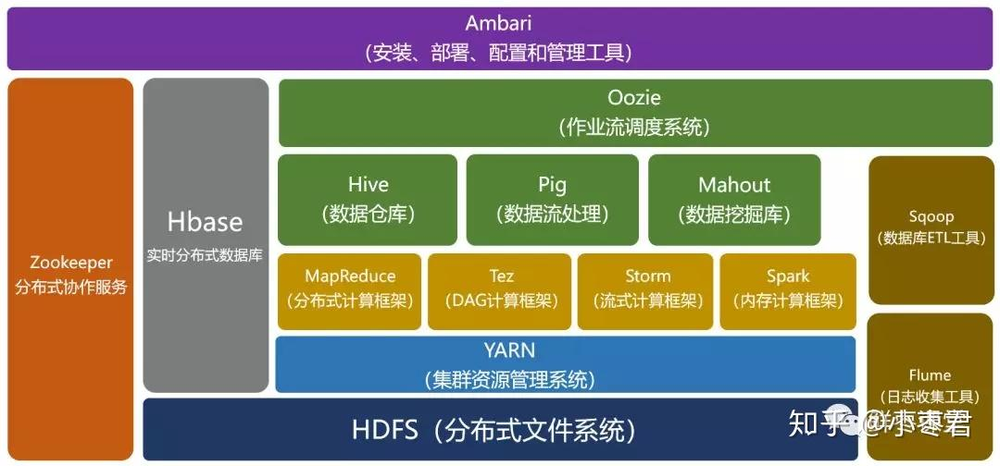
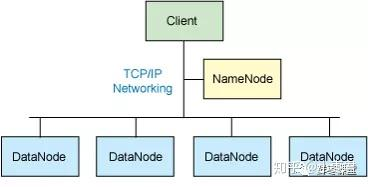
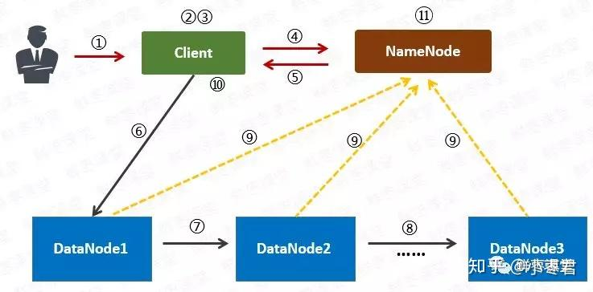
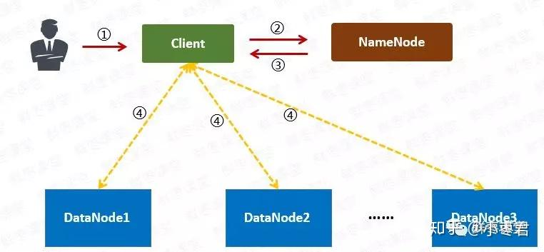
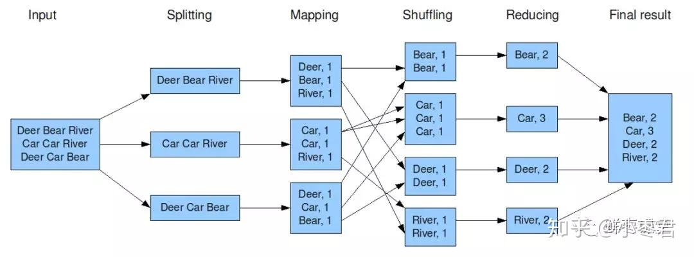
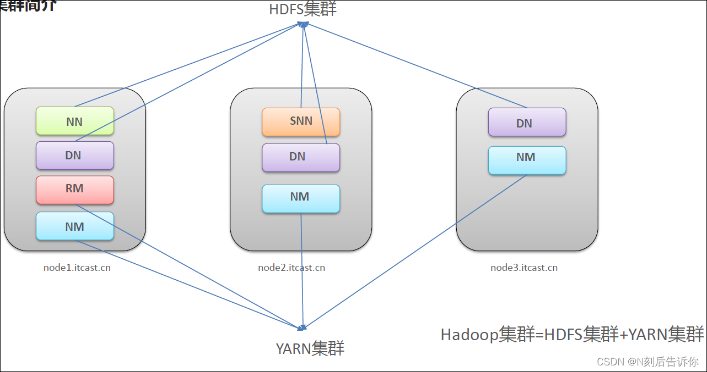

## Hadoop

### 核心架构

### HDFS

整个 HDFS 有三个重要角色：**NameNode**（名称节点）、**DataNode**（数据节点）和 **Client**（客户机）。

**NameNode：** 是 Master 节点（主节点），可以看作是分布式文件系统中的管理者，主要负责管理文件系统的命名空间、集群配置信息和存储块的复制等。NameNode 会将文件系统的 Meta-data 存储在内存中，这些信息主要包括了文件信息、每一个文件对应的文件块的信息和每一个文件块在 DataNode 的信息等。

**DataNode：** 是 Slave 节点（从节点），是文件存储的基本单元，它将 Block 存储在本地文件系统中，保存了 Block 的 Meta-data，同时周期性地将所有存在的 Block 信息发送给 NameNode。

**Client：** 切分文件；访问 HDFS；与 NameNode 交互，获得文件位置信息；与 DataNode 交互，读取和写入数据。 

**Block（块）** ：Block 是 HDFS 中的基本读写单元；HDFS 中的文件都是被切割为 block（块）进行存储的；这些块被复制到多个 DataNode 中；块的大小（通常为 64MB）和复制的块数量在创建文件时由 Client 决定。

**HDFS 的读写流程**

1. 用户向 Client（客户机）提出请求。例如，需要写入 200MB 的数据。

2. Client 制定计划：将数据按照 64MB 为块，进行切割；所有的块都保存三份。

3. Client 将大文件切分成块（block）。

4. 针对第一个块，Client 告诉 NameNode（主控节点），请帮助我，将 64MB 的块复制三份。

5. NameNode 告诉 Client 三个 DataNode（数据节点）的地址，并且将它们根据到 Client 的距离，进行了排序。

6. Client 把数据和清单发给第一个 DataNode。

7. 第一个 DataNode 将数据复制给第二个 DataNode。

8. 第二个 DataNode 将数据复制给第三个 DataNode。

9. 如果某一个块的所有数据都已写入，就会向 NameNode 反馈已完成。

10. 对第二个 Block，也进行相同的操作。

11. 所有 Block 都完成后，关闭文件。NameNode 会将数据持久化到磁盘上。

**读取流程**

1. 用户向 Client 提出读取请求。

2. Client 向 NameNode 请求这个文件的所有信息。

3. NameNode 将给 Client 这个文件的块列表，以及存储各个块的数据节点清单（按照和客户端的距离排序）。

4. Client 从距离最近的数据节点下载所需的块。

### MapReduce

MapReduce 其实是一种编程模型。这个模型的核心步骤主要分两部分：**Map（映射）** 和 **Reduce（归约）**。

当你向 MapReduce 框架提交一个计算作业时，它会首先把计算作业拆分成若干个 **Map 任务**，然后分配到不同的节点上去执行，每一个 Map 任务处理输入数据中的一部分，当 Map 任务完成后，它会生成一些中间文件，这些中间文件将会作为 **Reduce 任务** 的输入数据。Reduce 任务的主要目标就是把前面若干个 Map 的输出汇总到一起并输出。

上图是一个统计词频的任务。

1. Hadoop 将输入数据切成若干个分片，并将每个 split（分割）交给一个 map task（Map 任务）处理。

2. Mapping 之后，相当于得出这个 task 里面，每个词以及它出现的次数。

3. shuffle（拖移）将相同的词放在一起，并对它们进行排序，分成若干个分片。

4. 根据这些分片，进行 reduce（归约）。

5. 统计出 reduce task 的结果，输出到文件。

### 1.0 版本与 2.0 版本

1.0 版本中，存在一些问题：

1. 扩展性差，JobTracker 负载较重，成为性能瓶颈。

2. 可靠性差，NameNode 只有一个，万一挂掉，整个系统就会崩溃。

3. 仅适用 MapReduce 一种计算方式。

4. 资源管理的效率比较低。

2.0 版本中，在 HDFS 之上，增加了 **YARN（资源管理框架）** 层。它是一个资源管理模块，为各类应用程序提供资源管理和调度。

### 特性优点

1. scalability：扩容能力强：Hadoop 是在可用的计算机集群间分配数据并完成计算任务的，这些集群可方便灵活的方式扩展到数以千计的节点。
2. economical：成本低：Hadoop 集群允许通过部署普通廉价的机器组成集群来处理大数据，以至于成本很低。看重的是集群整体能力。
3. efficiency：效率高：通过并发数据，Hadoop 可以在节点之间动态并行的移动数据，使得速度非常快。
4. reliability：可靠性高：能自动维护数据的多份复制，并且在任务失败后能自动重新部署（redeploy）计算任务。所以 Hadoop 的按位存储和处理数据的能力值得人们信赖。

### Hadoop3.0
Hadoop 3.0 架构组件和 Hadoop 2.0 类似，3.0 着重于性能优化。

通用方面：精简内核、类路径隔离、shell 脚本重构

Hadoop HDFS：EC 纠删码、多 NameNode 支持

Hadoop MapReduce：任务本地化优化、内存参数自动推断

Hadoop YARN：Timeline Service V2、队列配置

### Hadoop 集群整体概述

Hadoop 集群包括两个集群（物理层面）：HDFS 集群、YARN 集群

1. 两个集群逻辑上分离、通常物理上在一起
2. 两个集群都是标准的主从架构集群

* HDFS 集群是一个分布式存储系统，它当中的主角色叫做 NameNode，简称 NN，从角色叫做 DataNode，简称 DN，主角色辅助角色叫做 SecondaryNameNode，简称 SNN。
* YARN 集群主要负责资源管理和任务调度，它当中的主角色叫做 ResourceManager，简称 RM，从角色叫做 NodeManager，简称 NM。

- 逻辑上分离：两个集群`互相之间没有依赖、互不影响`
- 物理上在一起：某些角色进程往往`部署在同一台物理服务器上`
- MapReduce是计算框架、代码层面的组件，没有集群之说
