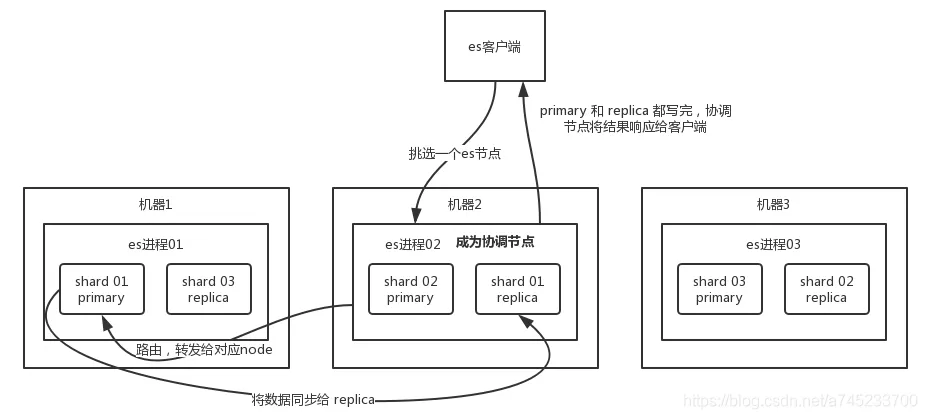
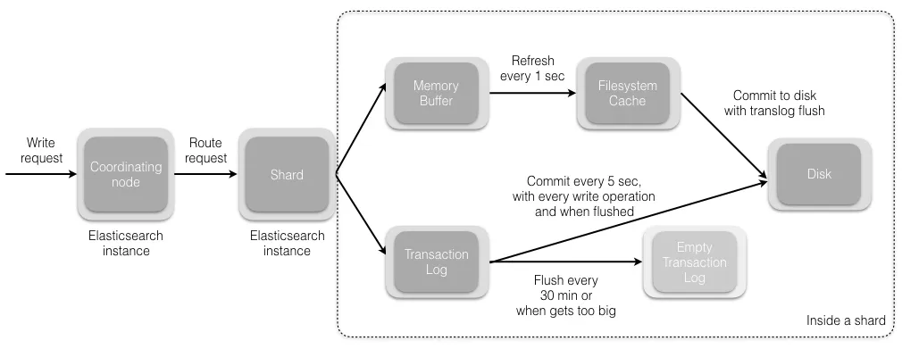

## Elasticsearch 与传统数据库的区别是什么？

Elasticsearch 与传统数据库最大的不同是，它是基于全文搜索引擎库 Lucene 构建的，因此具有全文搜索、实时搜索、分布式搜索、数据分析等功能，而传统数据库更适合于事务处理等关系型数据操作。传统数据库通常采用结构化查询语言（SQL）进行查询，而 Elasticsearch 使用 JSON 格式的查询语法，更加灵活和强大。

## Elasticsearch 和 solr 的区别

Elasticsearch（ES）和 Solr 都是流行的开源搜索引擎，它们都基于 Apache Lucene 搜索库开发而来，但在一些方面有所不同：

1. 架构：ES 是分布式架构，具有分片和副本机制，支持自动水平扩展，而 Solr 是基于主从架构，需要手动进行复制和分片。
2. 搜索语法：ES 使用 JSON 格式的查询语法，而 Solr 使用 XML 格式的查询语法。
3. 数据处理：ES 支持实时数据处理和分析，可以通过 Logstash 和 Kibana 进行数据采集和展示，而 Solr 则更专注于搜索和文本分析功能。
4. 社区和生态系统：ES 拥有更大的社区和生态系统，拥有丰富的插件和工具，而 Solr 则更专注于搜索功能本身。

总的来说，ES 更适合处理实时数据、分析、日志等场景，而 Solr 则更适合于搜索和文本分析场景。选择哪个搜索引擎要根据实际需求和技术栈来进行权衡。

## 基本概念

1. index 索引：索引类似于 mysql 中的数据库，Elasticesearch 中的索引是存在数据的地方，包含了一堆有相似结构的文档数据。
2. type 类型：类型是用来定义数据结构，可以认为是 mysql 中的一张表，type 是 index 中的一个逻辑数据分类
3. document 文档：类似于 MySQL 中的一行，不同之处在于 ES 中的每个文档可以有不同的字段，但是对于通用字段应该具有相同的数据类型，文档是 es 中的最小数据单元，可以认为一个文档就是一条记录。
4. Field 字段：Field 是 Elasticsearch 的最小单位，一个 document 里面有多个 field
5. shard 分片：单台机器无法存储大量数据，es 可以将一个索引中的数据切分为多个 shard，分布在多台服务器上存储。有了 shard 就可以横向扩展，存储更多数据，让搜索和分析等操作分布到多台服务器上去执行，提升吞吐量和性能。
6. replica 副本：任何一个服务器随时可能故障或宕机，此时 shard 可能会丢失，因此可以为每个 shard 创建多个 replica 副本。replica 可以在 shard 故障时提供备用服务，保证数据不丢失，多个 replica 还可以提升搜索操作的吞吐量和性能。primary shard（建立索引时一次设置，不能修改，默认 5 个），replica shard（随时修改数量，默认 1 个），默认每个索引 10 个 shard，5 个 primary shard，5 个 replica shard，最小的高可用配置，是 2 台服务器。

## DocValues 的作用

倒排索引也是有缺陷的，假如我们需要对数据做一些聚合操作，比如排序/分组时，lucene 内部会遍历提取所有出现在文档集合的排序字段，然后再次构建一个最终的排好序的文档集合 list，这个步骤的过程全部维持在内存中操作，而且如果排序数据量巨大的话，非常容易就造成 solr 内存溢出和性能缓慢。

DocValues 就是 es 在构建倒排索引的同时，构建了正排索引，保存了 docId 到各个字段值的映射，可以看作是以文档为维度，从而实现根据指定字段进行排序和聚合的功能。

另外 doc Values 保存在操作系统的磁盘中，当 docValues 大于节点的可用内存，ES 可以从操作系统页缓存中加载或弹出，从而避免发生内存溢出的异常，docValues 远小于节点的可用内存，操作系统自然将所有 Doc Values 存于内存中（堆外内存），有助于快速访问。

## text 和 keyword 类型的区别

两个的区别主要分词的区别：keyword 类型是不会分词的，直接根据字符串内容建立倒排索引，keyword 类型的字段只能通过精确值搜索到；Text 类型在存入 Elasticsearch 的时候，会先分词，然后根据分词后的内容建立倒排索引

## query 和 filter 的区别

1. query：查询操作不仅仅会进行查询，还会计算分值，用于确定相关度；
2. filter： 查询操作仅判断是否满足查询条件，不会计算任何分值，也不会关心返回的排序问题，同时，filter 查询的结果可以被缓存，提高性能。

## 什么是分片(Shard)和副本(Replica)？它们有什么作用？

在 Elasticsearch 中，分片（Shard）和副本（Replica）是用于处理和存储数据的重要概念。它们的作用是提高系统的性能、可用性和可伸缩性。

分片是将索引拆分为多个部分的过程，每个部分称为一个分片。每个分片都是一个独立的 Lucene 索引，它可以在集群中的任何节点上存储和处理数据。分片的数量是在索引创建时指定的，通常根据数据量和系统负载等因素进行调整。分片可以提高搜索速度和可伸缩性，因为它们可以在多个节点上并行处理搜索请求。

副本是分片的一份完全相同的拷贝，它可以在集群中的其他节点上存储。副本的数量也是在索引创建时指定的，通常用于提高系统的可用性和容错性。当一个节点无法处理请求时，副本可以接管它的工作，确保系统的连续性。副本还可以提高搜索速度，因为它们可以在多个节点上并行处理搜索请求。

例如，假设我们有一个包含 10 个分片和 2 个副本的索引。这意味着数据将被分成 10 个部分，每个部分都存储在不同的节点上，并且每个分片都有 2 个完全相同的副本，分别存储在其他节点上。这样可以提高系统的性能、可用性和可伸缩性，因为它可以同时处理多个搜索请求，并在节点故障时保持系统连续性。

分片和副本是 Elasticsearch 实现高性能和高可用性的关键。通过合理地配置它们，可以提高系统的性能、可用性和可伸缩性，并确保数据的安全性和连续性。

## es 写数据的过程

1. 客户端选择一个 node 发送请求过去，这个 node 就是 coordinating node （协调节点）
2. coordinating node 对 document 进行路由，将请求转发给对应的 node（有 primary shard）
3. 实际的 node 上的 primary shard 处理请求，然后将数据同步到 replica node
4. coordinating node 等到 primary node 和所有 replica node 都执行成功之后，就返回响应结果给客户端。

## 写数据的底层原理

1. 数据先写入 memory buffer，然后定时（默认每隔 1s）将 memory buffer 中的数据写入一个新的 segment 文件中，并进入 Filesystem cache（同时清空 memory buffer），这个过程就叫做 refresh；

ES 的近实时性：数据存在 memory buffer 时是搜索不到的，只有数据被 refresh 到  Filesystem cache 之后才能被搜索到，而 refresh 是每秒一次， 所以称 es 是近实时的，可以通过手动调用 es 的 api 触发一次 refresh 操作，让数据马上可以被搜索到；

2. 由于 memory Buffer 和 Filesystem Cache 都是基于内存，假设服务器宕机，那么数据就会丢失，所以 ES 通过 translog 日志文件来保证数据的可靠性，在数据写入 memory buffer 的同时，将数据写入 translog 日志文件中，在机器宕机重启时，es 会自动读取 translog 日志文件中的数据，恢复到 memory buffer 和 Filesystem cache 中去。

ES 数据丢失的问题：translog 也是先写入 Filesystem cache，然后默认每隔 5 秒刷一次到磁盘中，所以默认情况下，可能有 5 秒的数据会仅仅停留在 memory buffer 或者 translog 文件的 Filesystem cache 中，而不在磁盘上，如果此时机器宕机，会丢失 5 秒钟的数据。也可以将 translog 设置成每次写操作必须是直接 fsync 到磁盘，但是性能会差很多。

3. flush 操作：不断重复上面的步骤，translog 会变得越来越大，当 translog 文件默认每 30 分钟或者 阈值超过 512M 时，就会触发 commit 操作，即 flush 操作。

- 将 buffer 中的数据 refresh 到 Filesystem Cache 中去，清空 buffer；
- 创建一个新的 commit point（提交点），同时强行将 Filesystem Cache 中目前所有的数据都 fsync 到磁盘文件中；
- 删除旧的 translog 日志文件并创建一个新的 translog 日志文件，此时 commit 操作完成

## ES 的更新和删除流程

删除和更新都是写操作，但是由于 Elasticsearch 中的文档是不可变的，因此不能被删除或者改动以展示其变更；所以 ES 利用 .del 文件 标记文档是否被删除，磁盘上的每个段都有一个相应的.del 文件

1. 如果是删除操作，文档其实并没有真的被删除，而是在 .del 文件中被标记为 deleted 状态。该文档依然能匹配查询，但是会在结果中被过滤掉。
2. 如果是更新操作，就是将旧的 doc 标识为 deleted 状态，然后创建一个新的 doc。

memory buffer 每 refresh 一次，就会产生一个 segment 文件 ，所以默认情况下是 1s 生成一个 segment 文件，这样下来 segment 文件会越来越多，此时会定期执行 merge。

每次 merge 的时候，会将多个 segment 文件合并成一个，同时这里会将标识为 deleted 的 doc 给物理删除掉，不写入到新的 segment 中，然后将新的 segment 文件写入磁盘，这里会写一个 commit point ，标识所有新的 segment 文件，然后打开 segment 文件供搜索使用，同时删除旧的 segment 文件

## ES 的搜索流程

### Query 阶段

客户端发送请求到 coordinate node，协调节点将搜索请求广播到所有的 primary shard 或 replica shard。每个分片在本地执行搜索并构建一个匹配文档的大小为 from + size 的优先队列。每个分片返回各自优先队列中 所有文档的 ID 和排序值 给协调节点，由协调节点及逆行数据的合并、排序、分页等操作，产出最终结果。

### Fetch 阶段

协调节点根据 doc id 去各个节点上查询实际的 document 数据，由协调节点返回结果给客户端。

- coordinate node 对 doc id 进行哈希路由，将请求转发到对应的 node，此时会使用 round-robin 随机轮询算法，在 primary shard 以及其所有 replica 中随机选择一个，让读请求负载均衡。
- 接收请求的 node 返回 document 给 coordinate node 。
- coordinate node 返回 document 给客户端。

Query Then Fetch 的搜索类型在文档相关性打分的时候参考的是本分片的数据，这样在文档数量较少的时候可能不够准确，DFS Query Then Fetch 增加了一个预查询的处理，询问 Term 和 Document frequency，这个评分更准确，但是性能会变差。

## ES 在高并发下如何保证读写一致性？

1. 对于更新操作：可以通过版本号使用乐观并发控制，以确保新版本不会被旧版本覆盖

每个文档都有一个 `_version` 版本号，这个版本号在文档被改变时加一。Elasticsearch 使用这个 `_version` 保证所有修改都被正确排序。当一个旧版本出现在新版本之后，它会被简单的忽略。

利用 `_version` 的这一优点确保数据不会因为修改冲突而丢失。比如指定文档的 version 来做更改。如果那个版本号不是现在的，我们的请求就失败了。

2. 对于写操作，一致性级别支持 quorum/one/all，默认为 quorum，即只有当大多数分片可用时才允许写操作。但即使大多数可用，也可能存在因为网络等原因导致写入副本失败，这样该副本被认为故障，分片将会在一个不同的节点上重建。

- one：要求我们这个写操作，只要有一个 primary shard 是 active 活跃可用的，就可以执行
- all：要求我们这个写操作，必须所有的 primary shard 和 replica shard 都是活跃的，才可以执行这个写操作
- quorum：默认的值，要求所有的 shard 中，必须是大部分的 shard 都是活跃的，可用的，才可以执行这个写操作

3. 对于读操作，可以设置 replication 为 sync(默认)，这使得操作在主分片和副本分片都完成后才会返回；如果设置 replication 为 async 时，也可以通过设置搜索请求参数 `_preference` 为 primary 来查询主分片，确保文档是最新版本。

## ES 如何选举 Master 节点？

### Elasticsearch 的分布式原理

Elasticsearch 会对存储的数据进行切分，将数据划分到不同的分片上，同时每一个分片会保存多个副本，主要是为了保证分布式环境的高可用。在 Elasticsearch 中，节点是对等的，节点间会选取集群的 Master，由 Master 会负责集群状态信息的改变，并同步给其他节点。

Elasticsearch 的性能会不会很低：只有建立索引和类型需要经过 Master，数据的写入有一个简单的 Routing 规则，可以路由到集群中的任意节点，所以数据写入压力是分散在整个集群的。

### Elasticsearch 如何 选举 Master

Elasticsearch 的选主是 ZenDiscovery 模块负责的，主要包含 Ping（节点之间通过这个 RPC 来发现彼此）和 Unicast（单播模块包含一个主机列表以控制哪些节点需要 ping 通）这两部分；

- 确认候选主节点的最少投票通过数量，elasticsearch.yml 设置的值 `discovery.zen.minimum_master_nodes`;
- 对所有候选 master 的节点（`node.master: true`）根据 nodeId 字典排序，每次选举每个节点都把自己所知道节点排一次序，然后选出第一个（第 0 位）节点，暂且认为它是 master 节点。
- 如果对某个节点的投票数达到阈值，并且该节点自己也选举自己，那这个节点就是 master。否则重新选举一直到满足上述条件。

补充：master 节点的职责主要包括集群、节点和索引的管理，不负责文档级别的管理；data 节点可以关闭 http 功能。

### Elasticsearch 是如何避免脑裂现象

1. 当集群中 master 候选节点数量不小于 3 个时（`node.master: true`），可以通过设置最少投票通过数量（`discovery.zen.minimum_master_nodes`），设置超过所有候选节点一半以上来解决脑裂问题，即设置为 `(N/2)+1`；

2. 当集群 master 候选节点 只有两个时，这种情况是不合理的，最好把另外一个 `node.master` 改成 false。如果我们不改节点设置，还是套上面的 `(N/2)+1` 公式，此时 `discovery.zen.minimum_master_nodes` 应该设置为 2。这就出现一个问题，两个 master 备选节点，只要有一个挂，就选不出 master 了

## 建立索引阶段性能提升方法

1. 使用 SSD 存储介质
2. 使用批量请求并调整其大小：每次批量数据 5–15 MB 大是个不错的起始点。
3. 如果你在做大批量导入，考虑通过设置 `index.number_of_replicas: 0` 关闭副本
4. 如果你的搜索结果不需要近实时的准确度，考虑把每个索引的 `index.refresh_interval` 改到 30s
5. 段和合并：Elasticsearch 默认值是 20 MB/s。但如果用的是 SSD，可以考虑提高到 100–200 MB/s。如果你在做批量导入，完全不在意搜索，你可以彻底关掉合并限流。
6. 增加 `index.translog.flush_threshold_size` 设置，从默认的 512 MB 到更大一些的值，比如 1 GB

## ES 的深度分页与滚动搜索 scroll

**深度分页**

深度分页其实就是搜索的深浅度，比如第 1 页，第 2 页，第 10 页，第 20 页，是比较浅的；第 10000 页，第 20000 页就是很深了。搜索得太深，就会造成性能问题，会耗费内存和占用 cpu。而且 es 为了性能，他不支持超过一万条数据以上的分页查询。

那么如何解决深度分页带来的问题，我们应该避免深度分页操作（限制分页页数），比如最多只能提供 100 页的展示，从第 101 页开始就没了，毕竟用户也不会搜的那么深。

**滚动搜索**

一次性查询 1 万+数据，往往会造成性能影响，因为数据量太多了。这个时候可以使用滚动搜索，也就是 scroll。滚动搜索可以先查询出一些数据，然后再紧接着依次往下查询。

在第一次查询的时候会有一个滚动 id，相当于一个锚标记 ，随后再次滚动搜索会需要上一次搜索滚动 id，根据这个进行下一次的搜索请求。每次搜索都是基于一个历史的数据快照，查询数据的期间，如果有数据变更，那么和搜索是没有关系的。