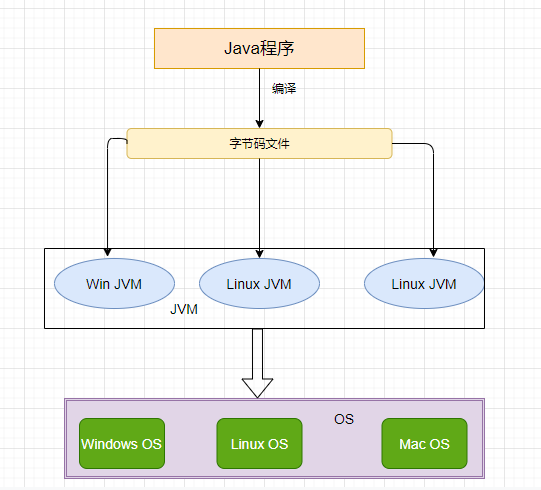
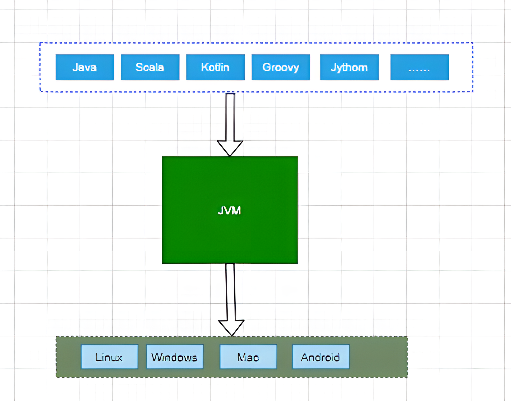
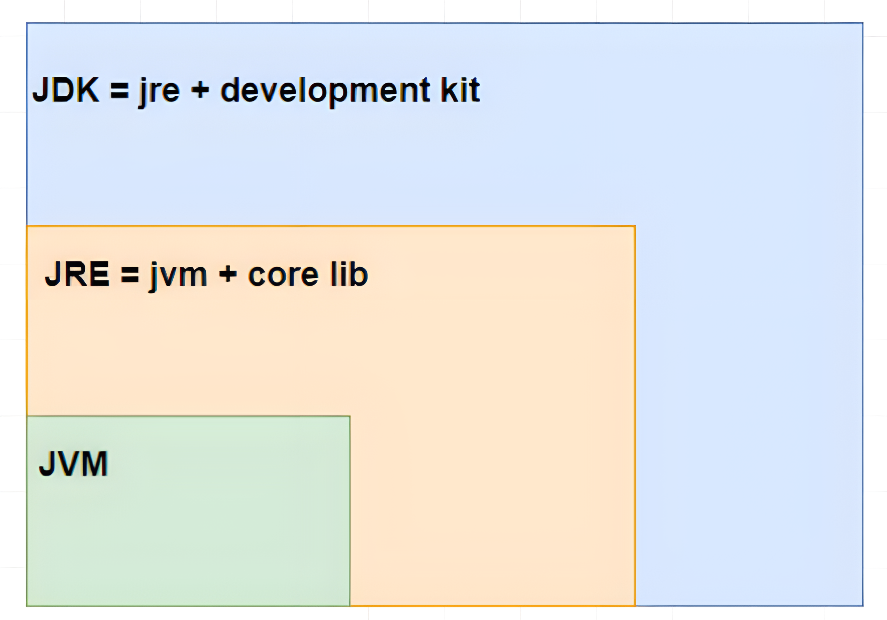
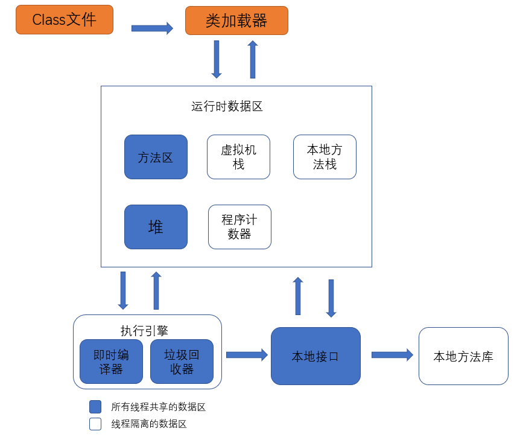

## JVM 简介

JVM 是整个 Java 平台的基石，JVM 可以看作抽象的计算机。编译器将 Java 文件编译为 Java 字节码文件（.class），接下来 JVM 对字节码文件进行解释，翻译成特定底层平台匹配的机器指令并运行。

JVM 和 Java 语言没有必然的联系，它只与 class 文件格式关联。也就是任何语言，只要能编译成符合规范的字节码文件，都是能被 JVM 运行的（即 JVM 是跨语言的平台）。

## JDK&JRE&JVM

1. JDK（Java Development Kit，Java 开发工具包）：JDK 是提供给 Java 开发人员使用的，其中包含了 Java 的开发工具，也包括了 JRE。其中的开发工具包括编译工具（javac.exe）、 打包工具（jar.exe）等。
2. JRE（Java Runtime Environment，Java 运行环境）：是 JDK 的子集，也就是包括 JRE 所有内容，以及开发应用程序所需的编译器和调试器等工具。JRE 提供了库、Java 虚拟机（JVM）和其他组件，用于运行 Java 编程语言、小程序、应用程序。
3. JVM（Java Virtual Machine，Java 虚拟机）：JVM 可以理解为是一个虚拟出来的计算机，具备着计算机的基本运算方式，它主要负责把 Java 程序生成的字节码文件。

## JVM 的组成部分

1. 类加载器
2. 运行时数据区
3. 执行引擎
4. 本地库接口

首先通过类加载器会把 Java 代码转换成字节码， 运行时数据区再把字节码加载到内存中，而字节码文件只是 JVM 的一套指令集规范，并不能直接交给底层操作系统去执行，因此需要特定的命令解析器执行引擎， 将字节码翻译成底层系统指令，再交由 CPU 去执行，而这个过程中需要调用其他语言的本地库接口来实现整个程序的功能

**JVM 字节码执行引擎**

虚拟机核心的组件就是执行引擎，它负责执行虚拟机的字节码，一般先编译成机器码执行。“虚拟机”是一个相对于“物理机”的概念，虚拟机的字节码是不能直接在物理机上运行的，需要 JVM 字节码执行引擎编译成机器码后才能在物理机上执行

## 编译与解释

1. 编译：将源代码一次性转换为机器码的过程（机器码有保存为文件，下次运行的时候直接运行机器码） 
2. 解释：将源代逐行转换为机器码并运行的过程（机器码并没有保存下来） 
3. 编译执行（编译器）：将一段程序直接翻译成机器码（对于 C/C++这种非跨平台的语言）或者中间码（Java 这种跨平台语言，需要 JVM 再将字节码编译成机器码）。编译执行是直接将所有语句都编译成了机器语言，并且保存成可执行的机器码。执行的时候，是直接进行执行机器语言，不需要再进行解释/编译。 
4. 解释执行（解释器）：在执行程序时，再将中间码（例如 Java 的字节码通过 JVM 解释成机器码）一行行的解释成机器码进行执行。这个运行过程是解释一行，执行一行。

总结：编译相当于做好了一桌子菜，可以直接开吃了；而解释就相当于吃火锅，需要一边煮一边吃

**Java 是解释执行还是编译执行？**

这个问题并没有统一的答案，JVM 规范并没有强制要求 JVM 实现应该使用哪种方式来执行程序，只能说不同的 JVM 实现的方式不一样。
有纯解释执行的、纯编译执行的（JRockit）、还有解释+编译两者混用的（HotSpot）。

## JIT

### 什么是 JIT 优化？

JIT（Just-In-Time Compilation，即时编译） 是 Java 虚拟机（JVM）中的一项关键技术，其目的是提高 Java 程序的运行效率。JIT 编译器在程序运行时，将 Java 字节码（Bytecode）动态编译为本地机器码（Native Code），使代码能够直接在底层硬件上运行，而无需逐行解释，从而大幅提升性能。

**从字节码到机器码**

当源代码转化为字节码之后，其实要运行程序，有两种选择。一种是使用 Java 解释器解释执行字节码，另一种则是使用 JIT 编译器将字节码转化为本地机器代码。

这两种方式的区别在于，前者启动速度快但运行速度慢，而后者启动速度慢但运行速度快。至于为什么会这样，其原因很简单。因为解释器不需要像 JIT 编译器一样，将所有字节码都转化为机器码，自然就少去了优化的时间。而当 JIT 编译器完成第一次编译后，其会将字节码对应的机器码保存下来，下次可以直接使用。而我们知道，机器码的运行效率肯定是高于 Java 解释器的。所以在实际情况中，为了运行速度以及效率，我们通常采用两者相结合的方式进行 Java 代码的编译执行。

### 优缺点

JIT 优化的特点：

1. 动态编译：JIT 编译发生在程序运行过程中，而不是预先编译，这使得 JVM 能根据运行时信息对代码进行优化。
2. 热点代码优化：JVM 使用“热点探测（HotSpot）”机制，识别运行频率较高的代码（即“热点代码”），并优先对其进行编译和优化。
3. 高性能：通过将热点代码编译为机器码，以及对代码执行路径、内联、循环展开等进行优化，JIT 提高了运行效率。
4. 即时编译和解释执行并存：JVM 会先解释执行代码，随着热点代码的识别和编译，性能逐渐提升。

JIT 编译的缺点：

1. 增加启动时间：由于 JIT 编译器在程序运行时编译代码，它可能导致应用程序的启动时间较长。
2. 影响应用性能：JIT 编译是需要进行热点代码检测、代码编译等动作的，这些都是要占用运行期的资源，所以，JIT 编译过程中也可能会影响应用性能。

### 优化方法

1. 方法内联：将频繁调用的小方法直接插入调用方，减少方法调用的开销。
2. 代码缓存：将编译后的热点代码保存起来，避免重复编译。
3. 循环展开：优化循环执行，以减少循环条件判断和跳转的开销。
4. 逃逸分析：分析对象的作用范围，决定是否可以在栈上分配内存，而不是在堆上分配。

### 优化技术

**热点检测**

1. 描述：JIT 编译器通过监控程序运行时的行为，识别哪些代码被频繁执行（称为热点代码），这些代码往往是程序性能的核心部分。
2. 实现：基于计数器或统计分析的方法，记录方法或循环的执行次数，当某些代码块累积执行次数超过阈值时，将其标记为热点代码并进行优化编译。

**编译优化**

1. 描述：JIT 在将字节码编译为本地机器码时，会进行一系列优化来提升性能。
2. 实现：包括指令优化（减少冗余指令）、循环展开（减少循环消耗）、常量折叠（预计算常量值）、死代码消除（移除无用代码）等多种优化技术。

**逃逸分析**

1. 描述：分析程序中对象的作用范围，判断对象是否逃逸出方法或线程的作用域。
2. 实现：

* 如果对象只在方法内部使用（未逃逸），则可以避免分配到堆内存。
* 如果对象未被线程共享（未线程逃逸），则不需要同步操作。
* 逃逸分析为后续的栈上分配、标量替换和锁消除提供基础支持。

**锁消除**

1. 描述：在单线程环境下或对象未发生线程逃逸时，移除不必要的锁操作。
2. 实现：通过逃逸分析判断同步代码块的锁对象是否只被当前线程访问，如果是，则将锁操作优化掉，从而提升性能。

**标量替换**

1. 描述：将对象的字段分解为多个标量（如基本数据类型），避免创建对象。
2. 实现：通过逃逸分析检测对象未逃逸，将其分解为成员变量的独立存储，直接在栈上分配而非堆上分配。

**栈上分配**

1. 描述：将生命周期短且未逃逸的对象分配到栈而非堆中，从而减少 GC 压力。
2. 实现：通过逃逸分析识别出局部对象，并将其内存分配在栈上，当方法执行完毕后内存自动释放。

**方法内联**

1. 描述：将被调用的方法直接嵌入到调用处，减少方法调用的开销。
2. 实现：

* JIT 编译器在热点代码中识别出小型或经常被调用的方法，将其直接展开到调用点。
* 方法内联不仅能减少方法调用的开销，还能为后续进一步优化（如常量折叠等）创造机会。

**总结**

这些优化技术相辅相成，共同提升了 JIT 编译的效率和程序的执行性能。其中，热点检测是优化的前提，逃逸分析是关键技术，而锁消除、栈上分配、标量替换和方法内联等具体优化策略则能显著降低资源开销、消除冗余操作并提升代码执行效率。

## AOT

### 什么是 AOT 编译？

AOT 编译（Ahead-Of-Time Compilation，提前编译） 是一种将 Java 字节码在程序运行前，预先编译为本地机器码的技术。与 JIT 编译的动态性质不同，AOT 编译在程序启动之前就完成，因此无需在运行时进行编译。

**源代码到机器码**

AOT 编译器的基本思想是：在程序执行前生成 Java 方法的本地代码，以便在程序运行时直接使用本地代码。

但是 Java 语言本身的动态特性带来了额外的复杂性，影响了 Java 程序静态编译代码的质量。例如 Java 语言中的动态类加载，因为 AOT 是在程序运行前编译的，所以无法获知这一信息，会导致一些问题的产生

### 特点

1. 预先编译：Java 字节码在程序启动时或之前被编译为与目标平台相关的机器码，类似于 C/C++ 的编译方式。
2. 更短的启动时间：由于运行时无需解释或 JIT 编译，程序启动速度更快。
3. 可预测性：已生成的本地机器码在运行时性能稳定，不需要动态优化。
4. 跨平台性受限：AOT 编译生成的本地代码是与平台（操作系统、架构）相关的，失去了“Write Once, Run Anywhere”的特性。

## JIT 与 AOT

### 区别

| **特性**     | **JIT 编译**                           | **AOT 编译**                       |
| ------------ | -------------------------------------- | ---------------------------------- |
| **编译时机** | 程序运行时动态编译                     | 程序启动前提前编译                 |
| **性能表现** | 初次运行可能较慢，但长时间运行性能较高 | 启动速度快，运行性能较为稳定       |
| **优化能力** | 可动态优化，根据运行时信息调整代码     | 优化能力有限，无法根据实时情况调整 |
| **跨平台性** | 无需重新编译，依赖 JVM 解释            | 与平台强绑定，缺乏跨平台性         |
| **代码大小** | 保持字节码体积较小                     | 编译后生成的本地代码体积较大       |

### 使用场景

1. JIT

* 需要长期运行，例如服务端程序（Web 服务、大数据处理）。
* 性能优化至关重要，且不在意启动时间。
* 需要跨平台运行能力。

2. AOT

* 启动时间非常关键，如命令行工具、微服务或函数计算等。
* 目标平台固定，不需要跨平台运行（如 IoT 设备、嵌入式系统）。
* 内存占用较敏感，需要更小的运行时。
