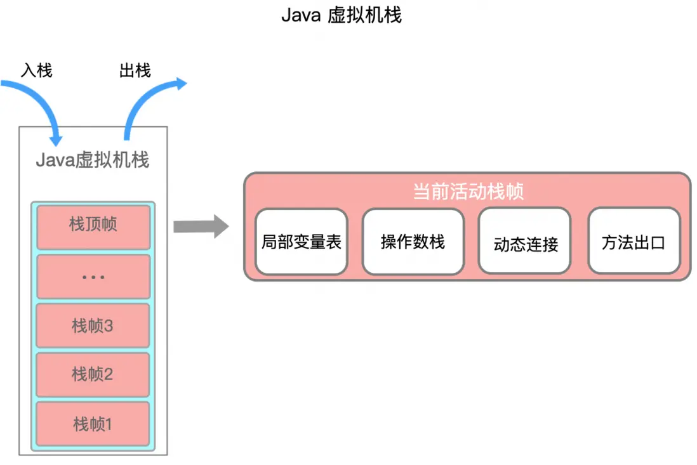
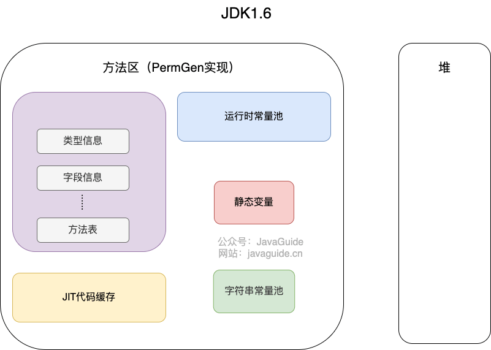
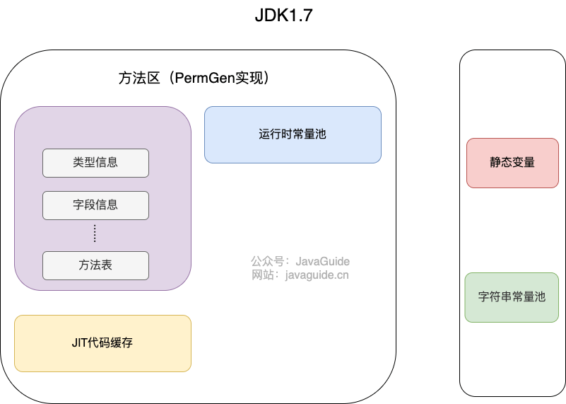

## 运行时数据区域

Java 虚拟机定义了若干种程序运行期间会使用到的运行时数据区，其中有一些会随着虚拟机启动而创建，随着虚拟机退出而销毁。另外一些则是与线程一一对应的，这些与线程对应的数据区域会随着线程开始和结束而创建和销毁。

根据《Java 虚拟机规范》的规定，Java 虚拟机所管理的内存将会包括以下几个运行时数据区域：

1. StackOverflowError：线程请求的栈深度大于虚拟机所允许的深度
2. OutOfMemoryError：如果虚拟机栈可以动态扩展，而扩展时无法申请到足够的内存

### 程序计数器

程序计数器（Program Counter Register）也被称为 PC 寄存器，是一块较小的内存空间。字节码解释器工作就是通过改变这个计数器的值来选取下一条需要执行指令的字节码指令，分支、循环、跳转、异常处理、线程恢复等基础功能都需要字节码解释器完成

1. 如果线程正在执行一个 Java 方法，这个计数器记录的是正在执行的虚拟机字节码指令的地址；

2. 如果正在执行的是 Native 方法，这个计数器的值则为 Undefined。

注意：此内存区域是唯一一个在 Java 虚拟机规范中没有规定任何 OutOfMemoryError 情况的区域

Java 虚拟机的多线程是通过线程轮流切换并分配处理器执行时间的方式来实现的，在任何一个确定的时刻，一个处理器都只会执行一条线程中的命令。因此，为了线程切换后能恢复到正确的执行位置，每条线程都需要有一个独立的程序计数器，各线程之间的计数器互不影响，独立存储，称该区域为“”线程私有”的内存

### Java 虚拟机栈

与程序计数器一样，Java 虚拟机栈（Java Virtual Machine Stack）也是线程私有的，生命周期和线程一致。

虚拟机栈描述的是 Java 方法执行的内存模型：每个方法在执行时都会创建一个栈帧用于存储局部变量表、操作数栈、动态链接、方法出口等信息。每一个方法从调用直至执行结束，就对应着一个栈帧从虚拟机栈中入栈到出栈的过程。

1. 局部变量表：存放了编译期可知的各种基本类型（boolean、byte、char、short、int、float、double、long）、对象引用（reference 类型）和 returnAddress 类型（指向了一条字节码指令的地址）

这些数据类型在局部变量表中的存储空间以局部变量槽（Slot）来表示，其中 64 位长度的 long 和 double 类型的数据会占用两个变量槽，其余的数据类型只占用一个。局部变量表所需的内存空间在编译期间完成分配，当进入一个方法时，这个方法需要在栈帧中分配多大的局部变量空间是完全确定的，在方法运行期间不会改变局部变量表的大小。

2. 操作数栈：操作数栈就是用来操作的，例如：代码中有个 i = 6*6，他在一开始的时候就是进行操作，读取我们的代码，进行计算后再放入局部变量表中去

3. 动态链接：例如方法中有个 service.add()方法，要链接到别的方法中去，这就是动态链接，存储链接的地方

4. 出口：出口正常的话就是 return，不正常的话就是抛出异常

Java 虚拟机栈可能发生如下异常情况：

1. 如果线程请求分配的栈容量超过 Java 虚拟机栈允许的最大容量时，Java 虚拟机将会抛出一个 StackOverflowError 异常。
2. 如果 Java 虚拟机栈可以动态扩展，并且扩展的动作已经尝试过，但是目前无法申请到足够的内存去完成扩展，或者在建立新的线程时没有足够的内存去创建对应的虚拟机栈，那 Java 虚拟机将会抛出一个 OutOfMemoryError 异常。

### 本地方法栈

本地方法栈（Native Method Stacks）与虚拟机栈所发挥的作用是非常相似的，其区别于 Java 虚拟机栈的是，Java 虚拟机栈为虚拟机执行 Java 方法（也就是字节码）服务，而本地方法栈则为虚拟机使用到的 Native 方法服务。

Java 虚拟机规范允许本地方法栈被实现成固定大小的或者是根据计算动态扩展和收缩的，也会有 StackOverflowError 和 OutOfMemoryError 异常

### Java 堆

对于 Java 应用程序来说，Java 堆（Java Heap）是虚拟机所管理的内存中最大的一块。Java 堆是被所有线程共享的一块内存区域，在虚拟机启动时创建。此内存区域的唯一目的就是存放对象实例，Java 里“几乎”所有的对象实例都在这里分配内存。

Java 堆是垃圾收集器管理的主要区域，也被称为“GC”堆。Java 虚拟机规定，Java 堆可以处于物理上不连续的内存空间中，只要逻辑上是连续的即可。在实现时，可以是固定大小的，也可以是可扩展的。如果在堆中没有完成实例分配，并且堆也无法扩展时，将会抛出 OutOfMemoryError 异常

### 方法区（JDK7）

方法区（Method Area）与 Java 堆一样，是各个线程共享的内存区域，用于存储已被虚拟机加载的类信息、常量、静态变量、即时编译器编译后的代码等数据

《Java 虚拟机规范》对方法区的约束是非常宽松的，除了和 Java 堆一样不需要连续的内存和可以选择固定大小或者可扩展外，甚至还可以选择不实现垃圾收集。相对而言，垃圾收集行为在这个区域的确是比较少出现的，但并非数据进入了方法区就如永久代的名字一样“永久”存在了。这区域的内存回收目标主要是针对常量池的回收和对类型的卸载，一般来说这个区域的回收效果比较难令人满意，尤其是类型的卸载，条件相当苛刻，但是这部分区域的回收有时又确实是必要的。

当方法区无法满足新的内存分配需求时，抛出 OutOfMemoryError 异常

**注意**

方法区并不真实存在，属于 Java 虚拟机规范中的一个逻辑概念，用于存储已被 JVM 加载的类信息、常量、静态变量、即时编译器编译后的代码缓存等。

在 HotSpot 虚拟机中，方法区的实现称为永久代（PermGen），但在 Java 8 及之后的版本中，已经被元空间（Metaspace）所替代。

### 运行时常量池

运行时常量池（Runtime Constant Pool）属于方法区一部分，Class 文件中除了有类的版本、字段、方法、接口等描述信息外，还有一项信息是常量池表（Constant Pool Table），用于存放编译期生成的各种字面量和符号引用，这部分内容将在类加载后存放到方法区的运行时常量池中。

编译期和运行期（String 的 intern()）都可以将常量放入池中，内存有限，无法申请时抛出 OutOfMemoryError

常量池主要用于存放两大类常量：字面量（Literal）和符号引用量（Symbolic References）。字面量相当于 Java 语言层面常量的概念，如文本字符串，声明为 final 的常量值等；符号引用则属于编译原理方面的概念，包括了如下三种类型的常量：

1. 类和接口的全限定名
2. 字段名称和描述符
3. 方法名称和描述符

**常量池的好处**

常量池是为了避免频繁的创建和销毁对象而影响系统性能，其实现了对象的共享。例如：字符串常量池，在编译阶段就把所有的字符串放到一个常量池中

1. 节省内存空间：常量池中所有相同的字符串常量被合并，只占用一个空间
2. 节省运行时间：比较字符串时，==比 equals()快，对于两个引用变量，只用== 判断引用是否相等，也就可以判断实际值是否相等

**注意**

1. 在 JDK1.6 及之前运行时常量池（逻辑包含字符串常量池）存放在方法区，此时 hotspot 虚拟机对方法区的实现为永久代（位于堆内存中）
2. 在 JDK1.7 字符串常量池从方法区拿到了堆中，这里没有提到运行时常量池，也就是说字符串常量池被单独拿到堆，运行时常量池剩下的东西还在方法区，也就是 hotspot 中的永久代
3. 在 JDK1.8hotspot 移除了永久代用元空间取而代之，这时候字符串常量池还在堆，运行时常量池还在方法区，只不过方法区的实现从永久代变成了元空间（堆外内存）

 

### 直接内存

直接内存（Direct Memory）并不是虚拟机运行时数据区的一部分，也不是《Java 虚拟机规范》中定义的内存区域。

在 JDK 1.4 中新加入了 NIO（New Input/Output）类，引入了一种基于通道（Channel）与缓冲区 （Buffer）的 I/O 方式，它可以使用 Native 函数库直接分配堆外内存，然后通过一个存储在 Java 堆里面的 DirectByteBuffer 对象作为这块内存的引用进行操作。这样能在一些场景中显著提高性能，因为避免了 在 Java 堆和 Native 堆中来回复制数据。

显然，本机直接内存的分配不会受到 Java 堆大小的限制，但是，既然是内存，则肯定还是会受到本机总内存（包括物理内存、SWAP 分区或者分页文件）大小以及处理器寻址空间的限制，一般服务器管理员配置虚拟机参数时，会根据实际内存去设置-Xmx 等参数信息，但经常忽略掉直接内存，使得各个内存区域总和大于物理内存限制（包括物理的和操作系统级的限制），从而导致动态扩展时出现 OutOfMemoryError 异常。

## JDK 的内存区域变迁

### JDK 内存区域变化

HotSpot 虚拟机是是 Sun/OracleJDK 和 OpenJDK 中的默认 Java 虚拟机，是 JVM 应用最广泛的一种实现。上面提到，Java 虚拟机规范对方法区的约束很宽松，而且 HotSpot 虚拟机在这一区域发生过一些 bug，所以 HotSpot 的方法区经历了一些变迁，我们来看看 HotSpot 虚拟机内存区域的变迁。

1. JDK1.6 时期和我们上面讲的 JVM 内存区域是一致的

2. JDK1.7 时发生了一些变化，将字符串常量池、静态变量，存放在堆上

3. 在 JDK1.8 时彻底干掉了方法区，而在直接内存中划出一块区域作为元空间，运行时常量池、类常量池都移动到元空间。

### 为什么替换掉方法区？

方法区为什么被替代了呢？当然，或者更准确的说法应该是永久代为什么被替换了？——Java 虚拟机规范规定的方法区只是换种方式实现。

1. 使用永久代来实现方法区的决定的设计导致了 Java 应用更容易遇到内存溢出的问题（永久代有-XX：MaxPermSize 的上限，即使不设置也有默认大小，而 J9 和 JRockit 只要没有触碰到进程可用内存的上限，例如 32 位系统中的 4GB 限制，就不会出问题），而且有极少数方法 （例如 String:: intern()）会因永久代的原因而导致不同虚拟机下有不同的表现。
2. 当 Oracle 收购 BEA 获得了 JRockit 的所有权后，准备把 JRockit 中的优秀功能，譬如 Java Mission Control 管理工具，移植到 HotSpot 虚拟机时，但因为两者对方法区实现的差异而面临诸多困难。考虑到 HotSpot 未来的发展，在 JDK 6 的 时候 HotSpot 开发团队就有放弃永久代，逐步改为采用本地内存（Native Memory）来实现方法区的计划了，到了 JDK 7 的 HotSpot，已经把原本放在永久代的字符串常量池、静态变量等移出，而到了 JDK 8，终于完全废弃了永久代的概念，改用与 JRockit、J9 一样在本地内存中实现的元空间（Meta-space）来代替，把 JDK 7 中永久代还剩余的内容（主要是类型信息）全部移到元空间中。

### 元空间（JDK8）

在 JDK1.7 之前，HotSpot 虚拟机把方法区当成永久代（方法区的落地实现）来进行垃圾回收，从 JDK1.8 开始，移除永久代，并把方法区移至元空间，它位于本地内存中，而不是虚拟机内存中。HotSpots 取消了永久代，并不是没有了方法区，它只是一个规范，一直存在，只不过取代永久代的是元空间而已

**与永久代的区别**

1. 存储位置不同：永久代在物理上是堆的一部分，和新生代、老年代的地址是连续的，而元空间属于本地内存
2. 存储内容不同：在原来的永久代划分中，永久代用来存放类的元数据信息、静态变量以及常量池等。现在类的元信息存储在元空间中，静态变量和常量池等并入堆中，相当于原来的永久代的数据被元空间和堆内存给瓜分了

**废弃永久代的好处**

1. 由于类的元数据分配在本地内存中，元空间的最大可分配空间就是系统可用内存空间，不会遇到永久代存在时的内存溢出错误
2. 将运行时常量池从永久代分离出来，与类的元数据分开，提升类元数据的独立性
3. 将元数据从永久代剥离出来到元空间，可以提升对元数据的管理，同时提升 GC 效率

### 本地内存、直接内存、元空间

1. 本地内存

Java 虚拟机在执行的时候会把管理的内存分配成不同的区域，这些区域被称为虚拟机内存。对于虚拟机没有直接管理的物理内存，也有一定的利用，这些被利用却不在虚拟机内存数据区的内存，我们称它为本地内存

2. 直接内存

直接内存主要被 Java NIO 使用，某种程度上指 DirectByteBuffer 对象占用的堆外内存。DirectByteBuffer 对象创建时会通过 Unsaft 类接口直接调用操作系统的 malloc 分配内存，然后将内存的起始地址和大小保存下来，据此就可以直接操作内存空间

直接内存的分配不会受到 Java 堆大小的限制，但是会受到本机总内存大小以及处理器寻址空间的限制，如果各个内存区域总和大于物理内存限制，从而导致动态扩展时出现 OutOfMemoryError 异常

3. 元空间

### 虚拟机内存与本地内存的区别

1. JVM 内存：受虚拟机内存大小的参数限制，当大小超过参数设置的大小时就会报 OOM
2. 本地内存：本地内存不受虚拟机内存参数的限制，只受物理内存容量的限制，虽然不受参数的限制，但是如果内存的占用超出物理内存的大小，同样也会报 OOM

### 直接内存与堆内存的区别

直接内存位于本地内存，不属于 JVM 内存，但是也会在物理内存耗尽的时候报 OOM。在 JDK1.4 中加入了 NIO 类，引入了一种基于通道（channel）与缓冲区（buffer）的新 IO 方式，它可以使用 native 函数直接分配堆外内存，然后通过存储在 Java 堆中的 DirectByteBuffer 对象作为这块内存的引用进行操作，这样可以在一些场景下大大提高 IO 性能，避免了在 Java 堆和 Native 堆来回复制数据

1. 直接内存申请空间耗费很高的性能，堆内存申请空间耗费比较低
2. 直接内存的 IO 读写的性能要优于堆内存，在多次读写操作的情况相差非常明显

## 堆和栈

**区别**

1. 是否共享：栈是线程独享的；堆是线程共享的。

2. 存储的内容不同：栈（局部变量表）中主要存放各种基本数据类型、对象的引用；堆中主要存放对象实例

一个对象的大小是不可估计的，或者说是可以动态变化的，但是在栈中，一个对象只对应了一个 4byte 的引用

3. 垃圾回收：栈在线程结束后自动释放内存，无须垃圾回收；堆需要垃圾回收器进行回收（GC 处理）

4. 分配方式：栈一部分是静态分配内存，一部分是动态分配内存；堆都是动态分配，因为只有在程序运行过程中才会知道对象实例等数据具体需要多少内存

5. 空间大小：堆大小远远大于栈

6. 从作用来说：栈是运行时的单位，而堆是存储的单位。栈解决程序的运行问题，即程序如何执行、如何处理数据。堆解决的是数据存储的问题，即数据怎么放、放在哪里。在 Java 中一个线程就会相应有一个线程栈与之对应，因为不同的线程执行逻辑有所不同，因此需要一个独立的线程栈

**为什么不把基本类型放堆中？**

因为基本数据类型占用的空间一般是 1~8 字节，需要空间比较少，而且因为是基本类型，所以不会出现动态增长的情况，长度固定，因此栈中存储就够了

**为什么要把堆和栈区分出来？栈中不是也可以存储数据吗？**

1. 栈代表了处理逻辑，堆代表了数据，这样分开使得处理逻辑更为清晰
2. 堆与栈的分离，使得堆中的内容可以被多个栈共享（也可以理解为多个线程访问同一个对象），另一方面，堆中的共享常量和缓存可以被所有栈访问，节省了空间
3. 栈因为运行时的需要，比如：保存系统运行的上下文，需要进行地址段的划分。由于栈只能向上增长，因此就会限制住栈存储内容的能力。堆中的对象是可以根据需要动态增长的，因此栈和堆的划分，使得动态增长成为可能，相应栈中只需记录堆中的一个地址即可