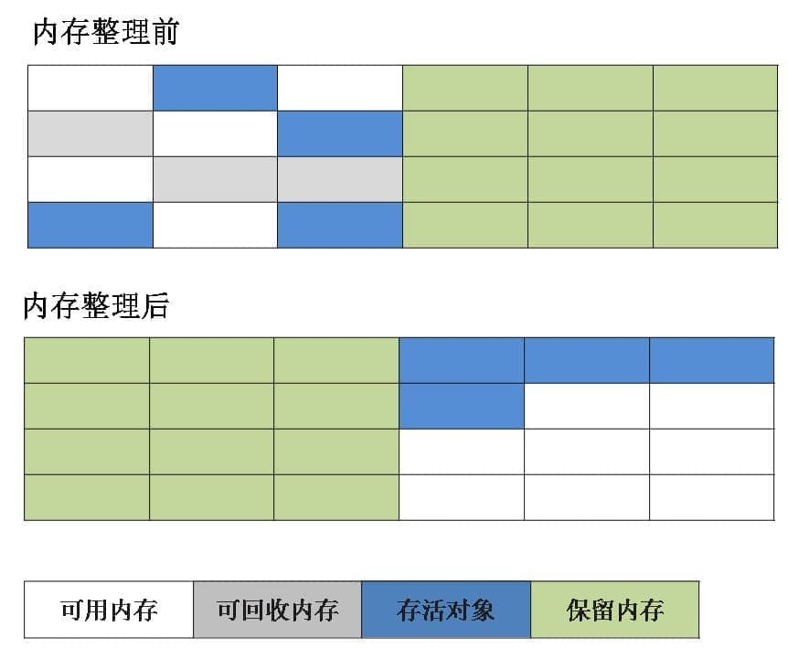
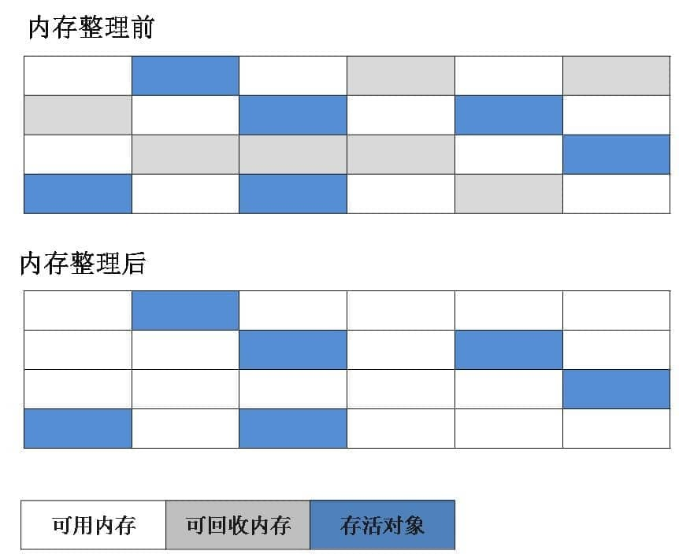
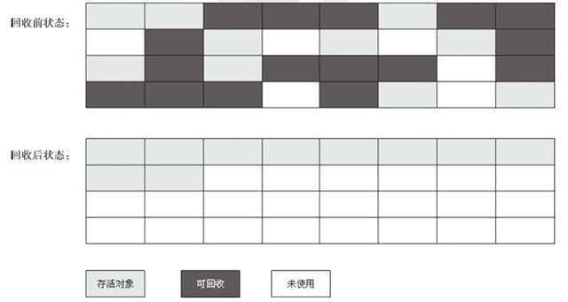

## 垃圾收集概述

垃圾收集（Garbage Collection，简称 GC）简单说，就是要干三件事：

1. 哪些内存需要回收？
2. 什么时候回收？
3. 如何回收？

在 Java 的内存区域中：

1. 程序计数器、虚拟机栈、本地方法栈 3 个区域随线程而生，随线程而灭，栈中的栈帧随着方法的进入和退出而有条不紊地执行着出栈和入栈操作，所以这几个区域的内存回收是确定的，随着方法结束或者线程结束，内存自然回收。
1. Java 堆和方法区这两个区域则有着很显著的不确定性：一个接口的多个实现类需要的内存可能会不一样，一个方法所执行的不同条件分支所需要的内存也可能不一样，只有处于运行期间，我们才能知道程序究竟会创建哪些对象，创建多少个对象，这部分内存的分配和回收是动态的。垃圾收集器所关注的正是这部分内存该如何管理。

## 垃圾收集系统

垃圾回收机制简称“GC”，GC 主要用于 Java 堆的管理，Java 中的堆是 JVM 所管理的最大的一块内存空间，主要用于存放各种类的实例对象。GC 是不定时去堆内存中清理不可达对象，不可达的对象并不会马上就会直接回收，垃圾收集器在一个 Java 程序中的执行是自动的，不清楚强制执行清除哪个对象，即使程序员能明确地判断出有一块内存已经无用了，是应该回收的，程序员也不能强制垃圾收集器回收该内存块。程序员唯一能做的就是通过调用 System.gc()方法（手动执行 GC）来“建议”执行垃圾收集器，但它是否执行，什么时候执行都是未知的，这是垃圾收集器的最主要的缺点

程序在运行过程中，会产生大量的内存垃圾（一些没有引用指向的内存对象都属于内存垃圾，因为这些对象已经无法访问，程序用不了它们，对程序而言它们已经死亡），为了确保程序运行时的性能，Java 虚拟机在程序运行的过程中不断地进行自动的垃圾回收（GC）

**finalize 方法**

finalize()方法是在每次执行 GC 操作之前时会调用的方法，可以用它做必要的清理工作。它是在 Object 类中定义的，因此所有的类都继承了它。子类覆盖 finalize()方法以整理系统资源或者执行其他清理工作。

```java
public class Test {
	public static void main(String[] args) {
		Test test = new Test();
		test = null;
		System.gc(); // 手动回收垃圾
	}

	@Override
	protected void finalize() throws Throwable {
		// gc回收垃圾之前调用
		System.out.println("gc回收垃圾之前调用的方法");
	}
}
```

## 判断对象是否存活

### 引用计数法

当一个对象被创建时，就将该对象实例分配给一个变量，该变量计数设置为 1。当任何其他变量被赋值为这个对象的引用时，计数加 1（a = b，则 b 引用的对象实例的计数器加 1），但当一个对象实例的某个引用超过了生命周期或者被设置为一个新值时，对象实例的引用计数器减 1。任何引用计数器为 0 的对象实例可以被当作垃圾收集。当一个对象实例被垃圾收集时，它引用的任何对象实例的引用计数器减 1

缺点：无法检测出循环引用。如父对象有一个对子对象的引用，子对象反过来引用父对象。这样，它们的引用计数永远不可能为 0


```java
public class Test {
	public Object object = null;
	public static void main(String[] args) {
		Test a = new Test();
		Test b = new Test();
		/**
		 * 循环引用，此时引用计数器法失效
		 */
		a.object = b;
		b.object = a;

		a = null;
		b = null;
	}
}
```

### 可达性分析法

从一个节点 GC ROOT 开始，寻找对应的引用节点，找到这个节点以后，继续寻找这个节点的引用节点，当所有的引用节点寻找完毕之后，剩余的节点则被认为是没有被引用到的节点，即无用的节点，无用的节点将会被判断是可回收的对象

可作为 GC Roots 的对象：

1. 虚拟机栈（栈帧中的本地变量表）中引用的对象 

```java
public class StackReference {
    public void greet() {
        Object localVar = new Object(); // 这里的 localVar 是一个局部变量，存在于虚拟机栈中
        System.out.println(localVar.toString());
    }

    public static void main(String[] args) {
        new StackReference().greet();
    }
}
```

当 greet 方法执行完毕后，localVar 的作用域结束，localVar 引用的 Object 对象不再由任何 GC Roots 引用（假设没有其他引用指向这个对象），因此它将有资格作为垃圾被回收掉

2. 方法区中类静态属性引用的对象

```java
public class StaticFieldReference {
    private static Object staticVar = new Object(); // 类静态变量

    public static void main(String[] args) {
        System.out.println(staticVar.toString());
    }
}
```

StaticFieldReference 类中的 staticVar 引用了一个 Object 对象，这个引用存储在元空间，可以被认为是 GC Roots。只要 StaticFieldReference 类未被卸载，staticVar 引用的对象都不会被垃圾回收。如果 StaticFieldReference 类被卸载（这通常发生在其类加载器被垃圾回收时），那么 staticVar 引用的对象也将有资格被垃圾回收（如果没有其他引用指向这个对象）。

3. 方法区中常量引用的对象

```java
public class ConstantPoolReference {
    public static final String CONSTANT_STRING = "Hello, World"; // 常量，存在于运行时常量池中
    public static final Class<?> CONSTANT_CLASS = Object.class; // 类类型常量

    public static void main(String[] args) {
        System.out.println(CONSTANT_STRING);
        System.out.println(CONSTANT_CLASS.getName());
    }
}
```

在 ConstantPoolReference 中，CONSTANT_STRING 和 CONSTANT_CLASS 作为常量存储在运行时常量池。它们可以用来作为 GC Roots。

这些常量引用的对象（字符串 "Hello, World" 和 Object.class 类对象）在常量池中，只要包含这些常量的 ConstantPoolReference 类未被卸载，这些对象就不会被垃圾回收

4. 本地方法栈中 JNI（即一般说的 Native 方法）引用的对象


### 被标记为垃圾的对象一定会被回收吗？

1. 第一次标记：如果对象在进行可达性分析后发现没有与 GC Roots 相连接的引用链，那它将会被第一次标记
2. 第二次标记：第一次标记后接着会进行一次筛选，筛选的条件是此对象是否有必要执行 finalize()方法。在 finalize()方法中没有重新与引用链建立关联关系的，将被进行第二次标记。第二次标记成功的对象将真的会被回收，如果对象在 finalize()方法中重新与引用链建立了关联关系，那么将会逃离本次回收，继续存活

### Java 引用

无论是通过引用计数算法判断对象的引用数量，还是通过可达性分析算法判断对象是否引用链可达，判定对象是否存活都和“引用”离不开关系。

Java 中的引用有四种，分为强引用（Strongly Reference）、软引用（Soft Reference）、弱引用（Weak Reference）和虚引用（Phantom Reference）4 种，这 4 种引用强度依次逐渐减弱。


#### 强引用

这类引用，只要强引用还存在，垃圾收集器永远不会回收掉被引用的对象，可以显式地将引用赋值为 null，JVM 会在合适的时间会回收该对象

```java
Object obj = new Object();
```

#### 软引用（SoftReference 类）

在系统要发生内存溢出异常之前，将会把这些对象列进回收范围之中进行二次回收

```java
Object obj = new Object();
ReferenceQueue queue = new ReferenceQueue();
SoftReference reference = new SoftReference(obj, queue);
//强引用对象滞空，保留软引用
obj = null;
```

#### 弱引用（WeakReference 类）

对象只能生存到下一次垃圾收集之前，在垃圾收集器工作时，无论内存是否足够都会回收掉只被弱引用关联的对象

```java
Object obj = new Object();
ReferenceQueue queue = new ReferenceQueue();
WeakReference reference = new WeakReference(obj, queue);
//强引用对象滞空，保留软引用
obj = null;
```

#### 虚引用（PhantomReference 类）

无法通过虚引用获取一个对象的实例，为一个对象设置虚引用关联的唯一目的就是能在这个对象被收集器回收时收到一个系统通知

```java
Object obj = new Object();
ReferenceQueue queue = new ReferenceQueue();
PhantomReference reference = new PhantomReference(obj, queue);
//强引用对象滞空，保留软引用
obj = null;
```

## 垃圾回收算法

### 什么是浮动垃圾？

由于在应用程序运行的同时进行垃圾回收，所以有些垃圾可能在垃圾回收进行完成时产生，这样就造成了“Floating Garbage”，这些垃圾需要在下次垃圾回收周期时才能回收掉。所以，并发收集器一般需要 20%的预留空间用于这些浮动垃圾

### 什么是内存碎片？

由于不同 Java 对象存活时间是不一定的，因此，在程序运行一段时间以后，如果不进行内存整理，就会出现零散的内存碎片。碎片最直接的问题就是会导致无法分配大块的内存空间，以及程序运行效率降低。

解决方法：“复制”和“标记-整理”方法都可以解决碎片的问题

### 复制算法

将可用内存按容量划分为大小相等的两块，每次只对其中一块进行 GC，当这块内存使用完时，就将还存活的对象复制到另一块上面

不足：造成空间利用率低下，因为大多数新生代对象都不会熬过第一次 GC，所以没必要 1：1 划分空间。可以分一块较大的 Eden 空间和两块较小的 Survivor 空间，每次使用 Eden 空间和其中一块 Survivor。当回收时，将 Eden 和 Survivor 中还存活的对象一次性复制到另一块 Survivor 上，最后清理 Eden 和 Survivor 空间。大小比例一般是 8：1：1，每次浪费 10%的 Survivor 空间。如果存活的大于 10%时，多出来的对象直接进入老年代




### 标记—清除算法

标记—清除算法从根集合（GC Roots）进行扫描，为每个对象存储一个标记位，记录对象的状态（活着或死亡）。分为两个阶段，一个是标记阶段，这个阶段内为每个对象更新标记位，检查对象是否死亡；第二个阶段是清除阶段，该阶段对死亡的对象进行清除，执行 GC 操作。

不足：由于“标记—清除”算法直接回收不存活的对象，因此会造成内存碎片



### 标记—整理算法

采用“标记—清除”算法一样的方式进行对象标记，但在清除时不同，在回收不存活的对象占用的空间后，会将所有的存活对象往左端空闲空间移动，并更新对应的指针。“标记—整理”算法是在“标记—清除”算法的基础上，又进行了对象的移动，因此成本更高，但是却解决了内存碎片的问题



### 分代回收算法

根据存活对象划分几块内存区，一般是分为新生代和老年代。然后根据各个年代的特点制定相应的回收算法

1. 新生代：每次垃圾回收都有大量对象死去，只有少量存活，选用“复制”算法比较合理
2. 老年代：老年代中对象存活率较高、没有额外的空间分配对它进行担保。所以使用“标记—清除”算法或者“标记—整理”算法回收

**为什么要采用分代收集算法？**

在不进行对象存活时间区分的情况下，每次垃圾回收都是对整个堆空间进行回收，花费时间相对会长，同时，因为每次回收都需要遍历所有存活对象，但实际上，对于生命周期长的对象而言，这种遍历是没有效果的，因为可能进行了很多次遍历，但是他们依旧存在

1. 年轻代的回收算法：主要以 Copying 为主
2. 老年代的回收算法：主要以 Mark-Compact 为主

## 垃圾分代

### 分代原因

可以根据各个年代的特点进行对象分区存储，更便于回收，采用最适当的算法

1. 新生代：每次垃圾收集时都发现大批对象死去，只有少量对象活着，便采用“复制”算法，只需要付出少量存活对象的复制成本就可以完成收集
2. 老年代：因为对象存活率高、没有额外空间对它进行分配担保，就必须使用“标记—整理”或者“标记—清除”算法

### 新生代

主要是用来存放新生的对象。一般占堆空间的 1/3，由于频繁创建对象，所以新生代会频繁触发 Minor GC 进行垃圾回收，采用“复制”算法

1. Eden 区：Java 新对象的出生地（如果新创建的对象占用很大则直接分配给老年代），当 Eden 区内存不够的时候就会触发一次 Minor GC，对新生代区进行一次垃圾回收
2. Servivor To：保留了一次 Minor GC 过程中的幸存者
3. Servivor From：上一次 GC 的幸存者，作为这一次 GC 的被扫描者

**新生代晋升老年代**

数据首先分配到 Eden 区当中（特殊情况：如果是大对象，那么会直接放入到老年代，大对象：需要大量连续内存空间的 Java 对象），当 Eden 没有足够空间的时候就会触发 JVM 发起一次 Minor GC，如果对象经过一次 Minor GC 还存活，并且又能被 Survivor 空间接受，那么将被移动到 Survivor 空间当中，并将其年龄设为 1。对象在 Survivor 每熬过一次 Minor GC，年龄就加 1，当年龄达到一定的程度（默认为 15）时，就会被晋升到老年代中了，晋升老年代的年龄是可以设置的

### 老年代

老年代的对象比较稳定，所以 Major GC 不会频繁执行，采用“标记-清除”算法（或“标记-整理”算法），当老年代也装不下的时候，就会抛出 OOM

### 新生代与老年代的区别

1. 老年代就一个区域；新生代又被划分为 3 个区域（Eden：From Survivor：To Survivor = 8：1：1），即：Eden = 8/10 的新生代空间大小
2. 新生代实际可用的内存空间为 9/10 的新生代空间，JVM 每次只会使用 Eden 和其中的一块 Survivor 区域来为对象服务，所以无论什么时候，总是有一块 Surivor 区域是空闲的
3. 新生代与老年代的比例值为 1：2，即：新生代 = 1/3 的堆空间大小，老年代 = 2/3 的堆空间大小
4. 方法区中的东西比老年代和新生代更不容易回收


### 永久代（回收方法区）

指内存的永久保存区域，主要存放 Class 和 Meta（元数据）的信息，Class 在被加载的时候被放入永久区域，它和存放实例的区域不同，GC 不会在主程序运行期对永久区域进行清理，所以这也导致了永久代的区域会随着加载的 Class 的增多而胀满，最终抛出 OOM 异常

注意：在 Java8 中，永久代已经被移除，被一个称为“元数据区”（元空间）的区域所取代

元空间的本质和永久代类似，最大的区别在于：元空间并不在虚拟机中，而是使用本地内存。因此，默认情况下，元空间的大小仅受本地内存限制。类的元数据放入 native memory，字符串池和类的静态变量放入 Java 堆中，这样可以加载多少类的元数据就不再由 MaxPermSize 控制，而由系统的实际可用空间来控制

## 垃圾回收

在堆中，尤其是新生代中，一次垃圾回收一般可以回收 70%~95%的空间，而永久代的垃圾收集效率远低于此，永久代垃圾回收主要两部分内容：废弃的常量和无用的类

1. 判断废弃常量：一般是判断没有该常量的引用
2. 判断无用的类（要以下三个条件都满足）：

+ 该类所有的实例都已经回收，也就是 Java 堆中不存在该类的任何实例
+ 加载该类的 ClassLoader 已经被回收
+ 该类对应的 java.lang.Class 对象没有地方引用，无法在任何地方通过反射访问该类的方法

### Minor GC

Minor GC（Young GC） 指的是发生在新生代的 GC。由于 Java 对象大都是朝生夕死的，所以 Minor GC 非常频繁，一般回收速度也比较快

触发条件：Eden 区满时，触发 Minor GC，即申请一个对象时，发现 Eden 区不够用，则触发一次 Minor GC，新创建的对象大小 > Eden 所剩空间

### Major GC

Major GC 指的是发生在老年代的 GC，通常执行 Major GC 会连着 Minor GC 一起执行，Major GC 的速度比 Minor GC 的速度慢得多

触发条件：

1. 在进行 Major GC 之前，一般都先进行了一次 Minor GC，使得有新生代的对象进入老年代，当老年代空间不足时就会触发 Major GC
2. 当无法找到足够大的连续空间分配给新创建的较大对象时（如大数组），也会触发 Major GC 进行垃圾回收腾出空间

### Full GC

Full GC 是清理整个堆空间，包括年轻代和老年代

触发条件：

1. 调用 System.gc 时，系统建议执行 Full GC，但是不一定执行
2. 老年代空间不足
3. 方法区空间不足
4. 通过 Minor GC 后进入老年代的平均大小大于老年代的可用内存
5. 由 Eden 区、survivor space1（From Space）区向 survivor space2（To Space）区复制时，对象大于 To Space 可用内存，则把该对象转存到老年代，且老年代的可用内存小于该对象大小

## 空间分配担保机制

### 谁进行空间担保？

JVM 使用分代收集算法，将堆内存划分为年轻代和老年代，两块内存分别采用不同的垃圾回收算法，空间担保指的是老年代进行空间分配担保

### 什么是空间分配担保？

在发生 Minor GC 之前，虚拟机会检查 老年代最大可用的连续空间 是否 大于新生代所有对象的总空间，

如果大于，则此次 Minor GC 是安全的

如果小于，则虚拟机会查看 HandlePromotionFailure 设置值是否允许担保失败。如果 HandlePromotionFailure = true，那么会继续检查老年代最大可用连续空间是否大于历次晋升到老年代的对象的平均大小，如果大于，则尝试进行一次 Minor GC，但这次 Minor GC 依然是有风险的；如果小于或者 HandlePromotionFailure = false，则改为进行一次 Full GC。

### 为什么要进行空间担保？

是因为新生代采用复制收集算法，假如大量对象在 Minor GC 后仍然存活（最极端情况为内存回收后新生代中所有对象均存活），而 Survivor 空间是比较小的，这时就需要老年代进行分配担保，把 Survivor 无法容纳的对象放到老年代。老年代要进行空间分配担保，前提是老年代得有足够空间来容纳这些对象，但一共有多少对象在内存回收后存活下来是不可预知的，因此只好取之前每次垃圾回收后晋升到老年代的对象大小的平均值作为参考。使用这个平均值与老年代剩余空间进行比较，来决定是否进行 Full GC 来让老年代腾出更多空间。
