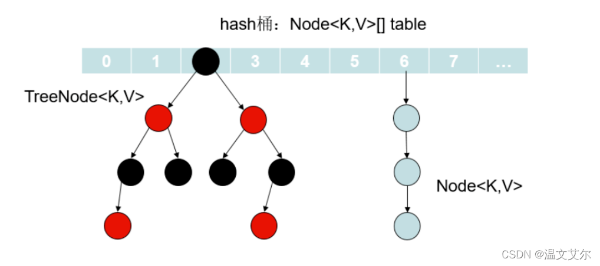

## 底层原理

### 实现方式

1. JDK1.7：Entry 数组+链表
2. JDK1.8：Node 数组+链表/红黑树，当链表上的元素个数超过 8 个并且数组长度 >= 64 时自动转化为红黑树，节点变成树节点。Entry 和 Node 都包含 key、value、hash、next 属性




### JDK7 与 JDK8 区别

1. JDK8 中添加了红黑树，当链表长度 >= 8 且数组长度 >= 64 的时候链表会变成红黑树

2. 链表新节点插入链表的顺序不同（JDK7 是插入头结点，多线程进行扩容时会出现死循环，JDK8 因为要把链表变成红黑树所以采用插入尾结点，不会死循环）

* 假设在下标为 1 处有一个长度为 2 的链表，如果再次插入一个节点，就需要 resize()扩容。


* 此时两个线程 A 和 B 执行 put()操作，A 线程先执行，执行完 transfer () 中的 Entry <K,V> next = e.next 被挂起，此时 e 指针指向 5，next 指向 7，如图所示。


* 此时线程 B 执行，将数组扩大两倍，链表仍散列在下标为 1 处，由于使用了头插法，节点位置将会交换，如图所示。


* 这时候线程 A 又执行，因为原先 e 指向 5，next 执行 7，继续执行下一条语句 e.next = newTable [i]，这时会出现 5 指向 7 的情况，如图所示。


3. hash 算法简化（JDK8）

* JDK1.7 的 HashMap 的 hash 方法源码

```java
static int hash(int h) {
    h ^= (h >>> 20) ^ (h >>> 12);
    return h ^ (h >>> 7) ^ (h >>> 4);
}
```

* JDK1.8 的 HashMap 的 hash 方法源码

```java
/**
 * 计算键的 hash 值
 */
static final int hash(Object key) {
    int h;
    return (key == null) ? 0 : (h = key.hashCode()) ^ (h >>> 16);
}
```

JDK7 中因为要让链表不要过长，所以进行了多次的异或和位运算，JDK8 中因为链表长度超过等于 8 会转红黑树，所以可以稍微减少元素的散列性，从而避免很多异或和位运算操作

4. resize 扩容机制的逻辑修改

在扩容之前，key 取余之后留下了 n 位。扩容之后，容量变为 2 倍，所以 key 取余得到的就有 n+1 位。

在这 n+1 位里面，如果第 1 位是 0，那么扩容前后这个 key 的位置还是在相同的位置（因为 hash 相同，并且余数的第 1 位是 0，和之前 n 位的时候一样，所以余数还是一样，位置就一样了）；

```java
loTail.next = null;
newTab[j] = loHead;
```

如果这 n+1 位的第一位是 1，那么就和之前的不同，那么这个 key 就应该放在之前的位置再加上之前整个数组的长度的位置

```java
hiTail.next = null;
newTab[j + oldCap] = hiHead;
```

## 属性和接口

```java
public class HashMap<K,V> extends AbstractMap<K,V> implements Map<K,V>, Cloneable, Serializable {
    // HashMap 默认的初始容量是 16
    static final int DEFAULT_INITIAL_CAPACITY = 1 << 4;
    // 最大容量
    static final int MAXIMUM_CAPACITY = 1 << 30;
    // 默认的填充因子
    static final float DEFAULT_LOAD_FACTOR = 0.75f;
    // 当桶(bucket)上的结点数大于这个值时会转成红黑树
    static final int TREEIFY_THRESHOLD = 8;
    // 当桶(bucket)上的结点数小于这个值时树转链表
    static final int UNTREEIFY_THRESHOLD = 6;
    // 桶中结构转化为红黑树对应的 table 的最小容量
    static final int MIN_TREEIFY_CAPACITY = 64;
    // 存储元素的数组，总是 2 的幂次倍
    transient Node<k,v>[] table;
    // 存放具体元素的集
    transient Set<map.entry<k,v>> entrySet;
    // 存放元素的个数，注意这个不等于数组的长度。
    transient int size;
    // 每次扩容和更改 map 结构的计数器
    transient int modCount;
    // 当前 HashMap 所能容纳键值对数量的最大值(容量*填充因子)，超过这个值，则需扩容
    int threshold;
    // 加载因子
    final float loadFactor;
}
```

## 构造方法

```java
public HashMap() {
    this.loadFactor = DEFAULT_LOAD_FACTOR;
}

public HashMap(int initialCapacity) {
    this(initialCapacity, DEFAULT_LOAD_FACTOR);
}

public HashMap(int initialCapacity, float loadFactor) {
    if (initialCapacity < 0)
        throw new IllegalArgumentException("Illegal initial capacity: " + initialCapacity);
    if (initialCapacity > MAXIMUM_CAPACITY)
        initialCapacity = MAXIMUM_CAPACITY;
    if (loadFactor <= 0 || Float.isNaN(loadFactor))
        throw new IllegalArgumentException("Illegal load factor: " + loadFactor);
    this.loadFactor = loadFactor;
    this.threshold = tableSizeFor(initialCapacity);
}

public HashMap(Map<? extends K, ? extends V> m) {
    this.loadFactor = DEFAULT_LOAD_FACTOR;
    putMapEntries(m, false);
}
```

**HashMap 的负载因子（loadFactor）为何默认是 0.75？**

1. 当负载因子是 1.0 时，意味着只有当数组的所有值全部填充了，才会发生扩容，此时会出现大量的 hash 冲突，底层的红黑树变得异常复杂，对于查询效率极其不利
2. 当负载因子是 0.5 时，意味着当数组中的元素达到了一半就开始扩容，填充的元素少了，hash 冲突也会减少，那么底层的链表长度或者是红黑树的高度就会降低，查询效率就会增加。此时空间利用率就会大大地降低，原本存储 1M 的数据，现在意味着需要 2M 的空间
3. 当负载因子是 0.75 时，空间利用率比较高，而且避免了相当多的 hash 冲突，使得底层链表或者是红黑树的高度比较低，提升了空间效率

## 查找

```java
public V get(Object key) {
    Node<K,V> e;
    return (e = getNode(hash(key), key)) == null ? null : e.value;
}

final Node<K,V> getNode(int hash, Object key) {
    Node<K,V>[] tab; Node<K,V> first, e; int n; K k;
    // 1. 定位键值对所在桶的位置
    if ((tab = table) != null && (n = tab.length) > 0 &&
        (first = tab[(n - 1) & hash]) != null) {
        if (first.hash == hash && // 1. 检查第一个节点
            ((k = first.key) == key || (key != null && key.equals(k))))
            return first;
        if ((e = first.next) != null) {
            // 2. 如果 first 是 TreeNode 类型，则调用黑红树查找方法
            if (first instanceof TreeNode)
                return ((TreeNode<K,V>)first).getTreeNode(hash, key);
                
            // 3. 如果 first 不是 TreeNode 类型，对链表进行查找
            do {
                if (e.hash == hash &&
                    ((k = e.key) == key || (key != null && key.equals(k))))
                    return e;
            } while ((e = e.next) != null);
        }
    }
    return null;
}
```

1. 判断数组是否为空且长度是否为 0，定位键值所在桶的位置
2. 检查第一个节点，如果相等就直接返回，不相等则执行下面的操作
3. 如果 first 是 TreeNode 类型，则调用红黑树查找方法，否则对链表进行查找

**位运算取模**

`first = tab [(n-1)&hash]`：算出桶在桶数组中的位置，length 总是 2 的幂，等价于对 length 取余，使用%没有位运算效率高


## 插入

```java
public V put(K key, V value) {
    return putVal(hash(key), key, value, false, true);
}

final V putVal(int hash, K key, V value, boolean onlyIfAbsent, boolean evict) {
    Node<K,V>[] tab; Node<K,V> p; int n, i;
    // 初始化桶数组 table，table 被延迟到插入新数据时再进行初始化
    if ((tab = table) == null || (n = tab.length) == 0)
        n = (tab = resize()).length;
    // 如果桶中不包含键值对节点引用，则将新键值对节点的引用存入桶中即可
    if ((p = tab[i = (n - 1) & hash]) == null)
        tab[i] = newNode(hash, key, value, null);
    else {
        Node<K,V> e; K k;
        // 如果键的值以及节点 hash 等于链表中的第一个键值对节点时，则将 e 指向该键值对
        if (p.hash == hash &&
            ((k = p.key) == key || (key != null && key.equals(k))))
            e = p;
            
        // 如果桶中的引用类型为 TreeNode，则调用红黑树的插入方法
        else if (p instanceof TreeNode)  
            e = ((TreeNode<K,V>)p).putTreeVal(this, tab, hash, key, value);
        else {
            // 对链表进行遍历，并统计链表长度
            for (int binCount = 0; ; ++binCount) {
                // 链表中不包含要插入的键值对节点时，则将该节点接在链表的最后
                if ((e = p.next) == null) {
                    p.next = newNode(hash, key, value, null);
                    // 如果链表长度大于或等于树化阈值，则进行树化操作
                    if (binCount >= TREEIFY_THRESHOLD - 1) // -1 for 1st
                        treeifyBin(tab, hash);
                    break;
                }
                
                // 条件为 true，表示当前链表包含要插入的键值对，终止遍历
                if (e.hash == hash &&
                    ((k = e.key) == key || (key != null && key.equals(k))))
                    break;
                p = e;
            }
        }
        
        // 判断要插入的键值对是否存在 HashMap 中
        if (e != null) { // existing mapping for key
            V oldValue = e.value;
            // onlyIfAbsent 表示是否仅在 oldValue 为 null 的情况下更新键值对的值
            if (!onlyIfAbsent || oldValue == null)
                e.value = value;
            afterNodeAccess(e);
            return oldValue;
        }
    }
    ++modCount;
    // 键值对数量超过阈值时，则进行扩容
    if (++size > threshold)
        resize();
    afterNodeInsertion(evict);
    return null;
}
```

1. 首次扩容：先判断数组是否为空，若数组为空则进行第一次扩容
2. 计算索引：通过 hash 算法，计算键值对在数组中的索引
3. 插入数据

+ 如果当前位置元素为空，则直接插入数据
+ 如果当前位置元素非空，且 key 已存在，则直接覆盖其 value
+ 如果当前位置元素非空，且 key 不存在，则将数据链到链表末端
+ 若链表长度 >= 8 且数组长度 >= 64，则将链表转换成红黑树，并将数据插入树中

4. 再次扩容：如果数组中元素个数超过阈值，则再次进行扩容操作


## 扩容机制

### 哈希表计算

下面这个方法保证了 HashMap 总是使用 2 的幂作为哈希表的大小

```java
/**
 * 找到大于或等于 cap 的最小 2 的幂
 */
static final int tableSizeFor(int cap) {
    int n = cap - 1;
    n |= n >>> 1;
    n |= n >>> 2;
    n |= n >>> 4;
    n |= n >>> 8;
    n |= n >>> 16;
    return (n < 0) ? 1 : (n >= MAXIMUM_CAPACITY) ? MAXIMUM_CAPACITY : n + 1;
}
```


### 扩容方法

1. 在 HashMap 中，桶数组的长度均是 2 的幂，阈值大小为桶数组长度与负载因子的乘积（threshold = capacity*loadFactor），当 HashMap 中的键值对数量超过阈值时，进行扩容
2. HashMap 按当前桶数组长度的 2 倍进行扩容，阈值也变为原来的 2 倍（如果计算过程中，阈值溢出归零，则按阈值公式重新计算）。扩容之后，要重新计算键值对的位置，并把它们移动到合适的位置上去

```java
final Node<K,V>[] resize() {
    Node<K,V>[] oldTab = table;
    int oldCap = (oldTab == null) ? 0 : oldTab.length;
    int oldThr = threshold;
    int newCap, newThr = 0;
    // 如果 table 不为空，表明已经初始化过了
    if (oldCap > 0) {
        // 当 table 容量超过容量最大值，则不再扩容
        if (oldCap >= MAXIMUM_CAPACITY) {
            threshold = Integer.MAX_VALUE;
            return oldTab;
        } 
        // 按旧容量和阈值的 2 倍计算新容量和阈值的大小
        else if ((newCap = oldCap << 1) < MAXIMUM_CAPACITY &&
                 oldCap >= DEFAULT_INITIAL_CAPACITY)
            newThr = oldThr << 1; 
    } else if (oldThr > 0)
        // 调用 HashMap(int)和 HashMap(int, float)构造方法时会产生这种情况
        /*
         * 初始化时，将 threshold 的值赋值给 newCap，
         * HashMap 使用 threshold 变量暂时保存 initialCapacity 参数的值
         */ 
        newCap = oldThr;
    else {               
        // 调用 HashMap()构造方法会产生这种情况
        /*
         * 调用无参构造方法时，桶数组容量为默认容量，阈值为默认容量与默认负载因子乘积
         */
        newCap = DEFAULT_INITIAL_CAPACITY;
        newThr = (int)(DEFAULT_LOAD_FACTOR * DEFAULT_INITIAL_CAPACITY);
    }
    
    // 特殊处理：第一个条件分支未计算 newThr 或嵌套分支在计算过程中导致 newThr 溢出归零
    // newThr 为 0 时，按阈值计算公式进行计算
    if (newThr == 0) {
        float ft = (float)newCap * loadFactor;
        newThr = (newCap < MAXIMUM_CAPACITY && ft < (float)MAXIMUM_CAPACITY ?
                  (int)ft : Integer.MAX_VALUE);
    }
    threshold = newThr;
    // 创建新的桶数组，桶数组的初始化也是在这里完成的
    Node<K,V>[] newTab = (Node<K,V>[])new Node[newCap];
    table = newTab;
    if (oldTab != null) {
        // 如果旧的桶数组不为空，则遍历桶数组，并将键值对映射到新的桶数组中
        for (int j = 0; j < oldCap; ++j) {
            Node<K,V> e;
            if ((e = oldTab[j]) != null) {
                oldTab[j] = null;
                if (e.next == null)
                    newTab[e.hash & (newCap - 1)] = e;
                else if (e instanceof TreeNode)
                    // 重新映射时，需要对红黑树进行拆分
                    ((TreeNode<K,V>)e).split(this, newTab, j, oldCap);
                else { // preserve order
                    Node<K,V> loHead = null, loTail = null;
                    Node<K,V> hiHead = null, hiTail = null;
                    Node<K,V> next;
                    // 遍历链表，并将链表节点按原顺序进行分组
                    do {
                        next = e.next;
                        if ((e.hash & oldCap) == 0) {
                            if (loTail == null)
                                loHead = e;
                            else
                                loTail.next = e;
                            loTail = e;
                        }
                        else {
                            if (hiTail == null)
                                hiHead = e;
                            else
                                hiTail.next = e;
                            hiTail = e;
                        }
                    } while ((e = next) != null);
                    // 将分组后的链表映射到新桶中
                    if (loTail != null) {
                        loTail.next = null;
                        newTab[j] = loHead;
                    }
                    if (hiTail != null) {
                        hiTail.next = null;
                        newTab[j + oldCap] = hiHead;
                    }
                }
            }
        }
    }
    return newTab;
}
```

**扩容逻辑**

1. 计算新桶数组的容量 newCap 和新阈值 newThr
2. 根据计算出的 newCap 创建新的桶数组，桶数组 table 也是在这里进行初始化的
3. 将键值对节点重新映射到新的桶数组里，如果节点是 TreeNode 类型，则需要拆分红黑树；如果是普通节点，则节点按原顺序进行分组

**注意**

```java
if (oldCap > 0) {
    // 当 table 容量超过容量最大值，则不再扩容
    if (oldCap >= MAXIMUM_CAPACITY) {
        threshold = Integer.MAX_VALUE;
        return oldTab;
    } 
    // 按旧容量和阈值的 2 倍计算新容量和阈值的大小
    else if ((newCap = oldCap << 1) < MAXIMUM_CAPACITY &&
             oldCap >= DEFAULT_INITIAL_CAPACITY)
        newThr = oldThr << 1; 
} else if (oldThr > 0)
    // 调用 HashMap(int)和 HashMap(int, float)构造方法时会产生这种情况
    /*
     * 初始化时，将 threshold 的值赋值给 newCap，
     * HashMap 使用 threshold 变量暂时保存 initialCapacity 参数的值
     */ 
    newCap = oldThr;
else {               
    // 调用 HashMap()构造方法会产生这种情况
    /*
     * 调用无参构造方法时，桶数组容量为默认容量，阈值为默认容量与默认负载因子乘积
     */
    newCap = DEFAULT_INITIAL_CAPACITY;
    newThr = (int)(DEFAULT_LOAD_FACTOR * DEFAULT_INITIAL_CAPACITY);
}
```

新阈值 newThr = oldThr << 1，移位可能会导致溢出

移位导致的溢出情况：当 loadFactor 小数位为 0，整数位可被 2 整除且大于等于 8 时，在某次计算中就可能导致 newThr 溢出归零


## 删除

```java
public V remove(Object key) {
   Node<K,V> e;
   return (e = removeNode(hash(key), key, null, false, true)) == null ? null : e.value;
}

public boolean remove(Object key, Object value) {
    return removeNode(hash(key), key, value, true, true) != null;
}

 final Node<K,V> removeNode(int hash, Object key, Object value,
                            boolean matchValue, boolean movable) {
    Node<K,V>[] tab; Node<K,V> p; int n, index;
    //当 table 不为空，并且 hash 对应的桶不为空时
    if ((tab = table) != null && (n = tab.length) > 0 &&
        (p = tab[index = (n - 1) & hash]) != null) {
        Node<K,V> node = null, e; K k; V v;
        //桶中的头节点就是我们要删除的节点
        if (p.hash == hash &&
            ((k = p.key) == key || (key != null && key.equals(k))))
            //用 node 记录要删除的头节点
            node = p;
        //头节点不是要删除的节点，并且头节点之后还有节点
        else if ((e = p.next) != null) {
            //头节点为树节点，则进入树查找要删除的节点
            if (p instanceof TreeNode)
                node = ((TreeNode<K,V>)p).getTreeNode(hash, key);
            //头节点为链表节点
            else {
                //遍历链表
                do {
                    //hash 值相等，并且 key 地址相等或者 equals
                    if (e.hash == hash &&
                        ((k = e.key) == key ||
                         (key != null && key.equals(k)))) {
                         //node 记录要删除的节点
                        node = e;
                        break;
                    }
                    //p 保存当前遍历到的节点
                    p = e;
                } while ((e = e.next) != null);
            }
        }
        //我们要找的节点不为空
        if (node != null && (!matchValue || (v = node.value) == value ||
                             (value != null && value.equals(v)))) {
            if (node instanceof TreeNode)
                //在树中删除节点
                ((TreeNode<K,V>)node).removeTreeNode(this, tab, movable);
            //我们要删除的是头节点
            else if (node == p)
                tab[index] = node.next;
            //不是头节点，将当前节点指向删除节点的下一个节点
            else
                p.next = node.next;
            ++modCount;
            --size;
            afterNodeRemoval(node);
            return node;
        }
    }
    return null;
}
```

## 其他

### get 能否判断元素是否在 map 中？

HashMap 的 get 函数的返回值不能判断一个 key 是否包含在 map 中，因为 HashMap 中允许 key 为 null，也允许 value 为 null

### 为什么用红黑树而不用 B 或 AVL 树？

1. 红黑树和 AVL 树

- AVL 树更加严格平衡，因此可以提供更快的査找效果，对于查找密集型任务使用 AVL 树没毛病，但是对于插入密集型任务，红黑树要好一些。（红黑树更通用，在添加删除来说表现较好，AVL 虽能提升一些速度但是代价太大了）
- AVL 树的旋转比红黑树的旋转更难实现和调试。

2. 红黑树和 B 树

HashMap 本来是数组+链表的形式，链表由于其查找慢的特点，所以需要被查找效率更高的树结构来替换。如果使用 B/B+树的话，在数据量不是很多的情况下，数据都会“挤在”一个结点里面，这个时候遍历效率就退化成了链表

### 什么时候转为红黑树？

1. 在链表长度大于 8 并且表的长度大于 64 的时候会转化红黑树
2. 如果当前链表长度大于 8 但表的长度小于 64 时，会先进行数组扩容

binCount 从 0 开始计算，大于等于 7 则触发 treeifyBin（树化方法）

```java
if ((e = p.next) == null) {
    p.next = newNode(hash, key, value, null);
    // 并且如果 链表的长度 大于 8 会尝试调用  treeifyBin 方法
    if (binCount >= TREEIFY_THRESHOLD - 1) // -1 for 1st
        treeifyBin(tab, hash);
    break;
}

final void treeifyBin(Node<K,V>[] tab, int hash) {
    int n, index; Node<K,V> e;
    // 如果表的长度小于 64 会先扩容！！！ 否则 扩容
    // MIN_TREEIFY_CAPACITY = 64;
    if (tab == null || (n = tab.length) < MIN_TREEIFY_CAPACITY)
        resize();
    else if ((e = tab[index = (n - 1) & hash]) != null) {
        TreeNode<K,V> hd = null, tl = null;
        do {
            TreeNode<K,V> p = replacementTreeNode(e, null);
            if (tl == null)
                hd = p;
            else {
                p.prev = tl;
                tl.next = p;
            }
            tl = p;
        } while ((e = e.next) != null);
        if ((tab[index] = hd) != null)
            hd.treeify(tab);
    }
}
```

**为什么是链表长度为 8？**

```java
* 0:    0.60653066
* 1:    0.30326533
* 2:    0.07581633
* 3:    0.01263606
* 4:    0.00157952
* 5:    0.00015795
* 6:    0.00001316
* 7:    0.00000094
* 8:    0.00000006
* more: less than 1 in ten million
```

当 hashCode 离散性很好的时候，树形 bin 用到的概率非常小，因为数据均匀分布在每个 bin 中，几乎不会有 bin 中链表长度会达到阈值，在理想情况下随机 hashCode 算法下所有 bin 节点的分布频率会遵循泊松分布，一个 bin 中链表长度达到 8 个元素的概率为 0.00000006，几乎是不可能事件

但是在随机 hashCode 下，离散性可能会变差，JDK 又不能阻止用户实现这种不好的 hash 算法，因此就可能导致不均匀的数据分布。链表长度超过 8 转为红黑树的设计，更多的是为了防止用户自己实现了不好的哈希算法时而导致链表过长，从而导致查询效率低

**为什么要数组长度大于等于 64？**

1. 避免频繁地树化
2. 减少内存占用

在数组比较小时如果出现红黑树结构，反而会降低效率，而红黑树需要进行左旋右旋、变色这些操作来保持平衡，同时数组长度小于 64 时，搜索时间相对要快些，总之是为了加快搜索速度，提高性能

红黑树相比链表需要更多的内存，尤其是在节点较少的情况下，红黑树的额外指针和结构占用更大。为了节省内存，HashMap 选择只有在数组容量达到一定规模后才树化，防止红黑树在小规模数据中带来额外的内存负担。

**转换为红黑树的操作**

先比较 key 的 hash 值决定插入方向，如果 hash 值相等的话，再比较 compare 方法，如果 key 所属对象没有直接实现 Comparable 接口，或者 compare 方法返回 0，执行 tieBreakOrder，比较两个 key 所属 Class 的 name，如果还相等，即两个对象是同一个类型，那么调用本地方法为两个对象生成 hashCode，再进行比较，hashCode 相等的话返回-1

### 什么时候转为链表？

若桶中元素小于等于 6 时，树结构还原成链表形式。红黑树的平均查找长度是 log(n)，长度为 8，查找长度为 log(8)= 3；链表的平均查找长度为 n/2，当长度为 8 时，平均查找长度为 8/2 = 4，这才有转换成树的必要

**选择 6 和 8 的原因**

中间有个差值 7 可以防止链表和树之间频繁的转换。如果涉及成链表个数超过 8 则链表转换为树结构，链表个数小于 8 则树结构转换成链表，如果一个 hashMap 不停的插入、删除元素，链表个数在 8 左右徘徊，就会频繁地发生树转链表、链表转树，效率很低

### 线程不安全

1. put 数据覆盖：多线程同时执行 put 操作，如果计算出来的索引位置是相同的，那会造成前一个 key 被后一个 key 覆盖，从而导致元素的丢失。此问题在 JDK1.7 和 JDK1.8 中都存在
2. put 和 get 并发时，可能导致 get 为 null：线程 1 进行 put 时，因为元素个数超出 threshold 而导致扩容（new 一个新的 hash 表），线程 2 此时 get，有可能导致读出为 null（新 hash 表还没有值）。此问题在 JDK1.7 和 JDK1.8 中都存在
3. 扩容死循环：JDK1.7 中的 HashMap 使用头插法插入元素，在多线程的环境下，扩容的时候有可能导致环形链表的出现，形成死循环。因此 JDK1.8 使用尾插法插入元素，在扩容时会保持链表元素原本的顺序，不会出现环形链表的问题

### 遍历

```java
public Set<K> keySet() {
    Set<K> ks = keySet;
    if (ks == null) {
        ks = new KeySet();
        keySet = ks;
    }
    return ks;
}

/**
 * 键集合
 */
final class KeySet extends AbstractSet<K> {
    public final int size()                 { return size; }
    public final void clear()               { HashMap.this.clear(); }
    public final Iterator<K> iterator()     { return new KeyIterator(); }
    public final boolean contains(Object o) { return containsKey(o); }
    public final boolean remove(Object key) {
        return removeNode(hash(key), key, null, false, true) != null;
    }
    // 省略部分代码
}

/**
 * 键迭代器
 */
final class KeyIterator extends HashIterator implements Iterator<K> {
    public final K next() { return nextNode().key; }
}

abstract class HashIterator {
    Node<K,V> next;        // next entry to return
    Node<K,V> current;     // current entry
    int expectedModCount;  // for fast-fail
    int index;             // current slot

    HashIterator() {
        expectedModCount = modCount;
        Node<K,V>[] t = table;
        current = next = null;
        index = 0;
        if (t != null && size > 0) { // advance to first entry 
            // 寻找第一个包含链表节点引用的桶
            do {} while (index < t.length && (next = t[index++]) == null);
        }
    }

    public final boolean hasNext() {
        return next != null;
    }

    final Node<K,V> nextNode() {
        Node<K,V>[] t;
        Node<K,V> e = next;
        if (modCount != expectedModCount)
            throw new ConcurrentModificationException();
        if (e == null)
            throw new NoSuchElementException();
        if ((next = (current = e).next) == null && (t = table) != null) {
            // 寻找下一个包含链表节点引用的桶
            do {} while (index < t.length && (next = t[index++]) == null);
        }
        return e;
    }
    //省略部分代码
}
```

```java
Map<Integer, Integer> map = new HashMap<>();
for (int i = 0; i < 1000000; i++) {
    map.put(i, i);
}
Set<Integer> keySet = map.keySet();
long start = System.currentTimeMillis();
for (Integer i : keySet) {
    int value = map.get(i);
}
System.out.println(System.currentTimeMillis() - start);


Iterator<Integer> iterator = map.keySet().iterator();
start = System.currentTimeMillis();
while (iterator.hasNext()) {
    Integer key = iterator.next();
    Integer value = map.get(key);
}
System.out.println(System.currentTimeMillis() - start);


Set<Map.Entry<Integer, Integer>> entries = map.entrySet();
start = System.currentTimeMillis();
for (Map.Entry<Integer, Integer> entry : entries) {
    int key = entry.getKey();
    int value = entry.getValue();
}
System.out.println(System.currentTimeMillis() - start);
```

keySet 和 entrySet 的区别：

1. keySet：返回的是只存放 key 值的 Set 集合，使用迭代器方式遍历 Set 集合，使用 get 方法获取键对应的值时就需要遍历 Map 集合
2. entrySet：返回的是存放了映射关系的 Set 集合（一个映射关系就是一个键-值对），即把 key-value 作为一个整体一对一地存放到 Set 集合当中，然后使用迭代器方式遍历该 Set 集合就可以取出 Map 中存放的键值对
