## MySQL 架构

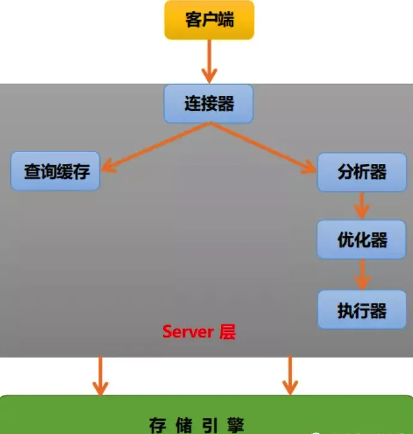

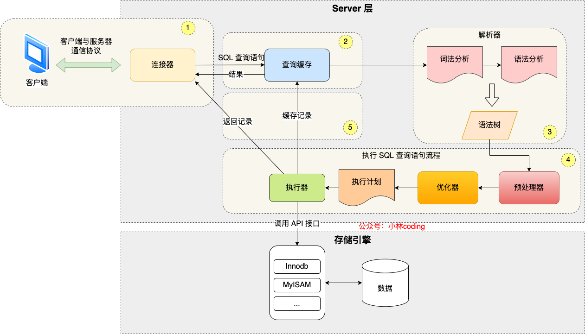

Server 层负责建立连接、分析和执行 SQL。MySQL 大多数的核心功能模块都在这实现，主要包括连接器，查询缓存、解析器、预处理器、优化器、执行器等。另外，所有的内置函数（如日期、时间、数学和加密函数等）和所有跨存储引擎的功能（如存储过程、触发器、视图等。）都在 Server 层实现。

存储引擎层负责数据的存储和提取。支持 InnoDB、MyISAM、Memory 等多个存储引擎，不同的存储引擎共用一个 Server 层。现在最常用的存储引擎是 InnoDB，从 MySQL 5.5 版本开始， InnoDB 成为了 MySQL 的默认存储引擎。我们常说的索引数据结构，就是由存储引擎层实现的，不同的存储引擎支持的索引类型也不相同，比如 InnoDB 支持索引类型是 B+树 ，且是默认使用，也就是说在数据表中创建的主键索引和二级索引默认使用的是 B+ 树索引。

### 连接器
负责和客户端建立连接，获取用户权限以及维持和管理连接。

**查看 MySQL 被连接的客户端数量**

通过 show processlist 来查询连接的状态

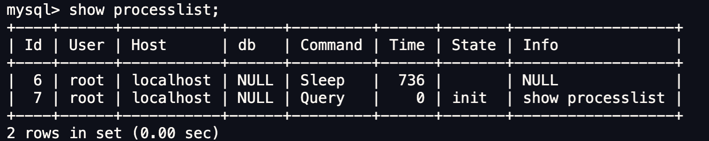

比如上图的显示结果，共有两个用户名为 root 的用户连接了 MySQL 服务，其中 id 为 6 的用户的 Command 列的状态为 Sleep ，这意味着该用户连接完 MySQL 服务就没有再执行过任何命令，也就是说这是一个空闲的连接，并且空闲的时长是 736 秒（ Time 列）。

**空闲连接会一直占用着吗？**

在用户建立连接后，即使管理员改变连接用户的权限，也不会影响到已连接的用户，默认连接时长为 8 小时，超过时间后将会被断开

```sql
mysql> show variables like 'wait_timeout';
+---------------+-------+
| Variable_name | Value |
+---------------+-------+
| wait_timeout  | 28800 |
+---------------+-------+
1 row in set (0.00 sec)
```

1. 优势：在连接时间内，客户端一直使用同一连接，避免多次连接的资源消耗
2. 劣势：在 MySQL 执行时，使用的内存被连接对象管理，由于长时间没有被释放，会导致系统内存溢出，被系统 kill，所以需要定期断开长连接，或执行大查询后断开连接。

```sql
# 手动断开空闲的连接，使用的是 kill connection + id 的命令。
mysql> kill connection +6;
Query OK, 0 rows affected (0.00 sec)
```

**MySQL 的连接数限制**

MySQL 服务支持的最大连接数由 max_connections 参数控制，比如我的 MySQL 服务默认是 151 个, 超过这个值，系统就会拒绝接下来的连接请求，并报错提示“Too many connections”。

```sql
mysql> show variables like 'max_connections';
+-----------------+-------+
| Variable_name   | Value |
+-----------------+-------+
| max_connections | 151   |
+-----------------+-------+
1 row in set (0.00 sec)
```

MySQL 的连接也跟 HTTP 一样，有短连接和长连接的概念。但是，使用长连接后可能会占用内存增多，因为 MySQL 在执行查询过程中临时使用内存管理连接对象，这些连接对象资源只有在连接断开时才会释放。如果长连接累计很多，将导致 MySQL 服务占用内存太大，有可能会被系统强制杀掉，这样会发生 MySQL 服务异常重启的现象。

**解决长连接占用内存的情况**

1. 定期断开长连接。既然断开连接后就会释放连接占用的内存资源，那么我们可以定期断开长连接。
2. 客户端主动重置连接。MySQL 5.7 版本后实现了 mysql_reset_connection() 函数的接口，注意这是接口函数不是命令，那么当客户端执行了一个很大的操作后，在代码里调用 mysql_reset_connection 函数来重置连接，达到释放内存的效果。这个过程不需要重连和重新做权限验证，但是会将连接恢复到刚刚创建完时的状态。

### 查询缓存
当接受到查询请求时，会先在查询缓存中查询（key/value 保存）是否执行过，没有的话，再走正常的执行流程。但在实际情况下，查询缓存一般没有必要设置，因为在查询涉及到的表被更新时，缓存就会被清空，所以适用于静态表。在 MySQL8.0 后，查询缓存被废除

### 分析器
1. 词法分析：如识别 select、表名、列名，判断其是否存在等
2. 语法分析：判断语句是否符合 MySQL 语法。语法解析器会根据语法规则，判断你输入的这个 SQL 语句是否满足 MySQL 语法，如果没问题就会构建出 SQL 语法树，这样方便后面模块获取 SQL 类型、表名、字段名、 where 条件等等

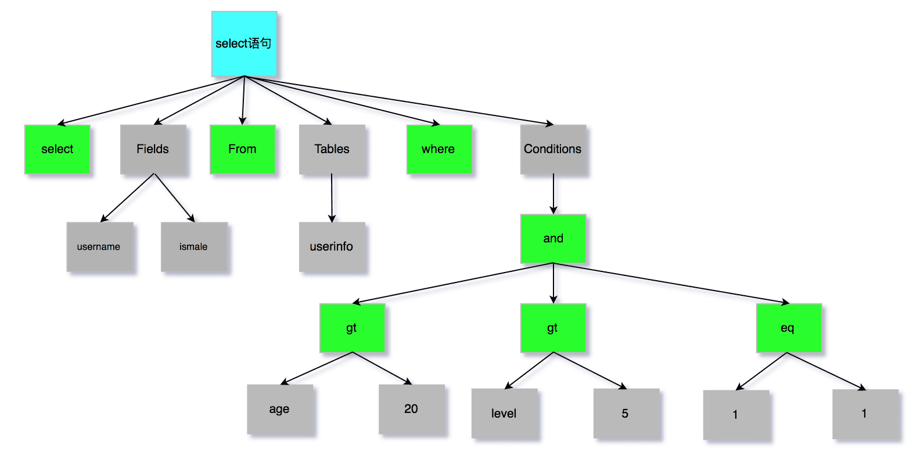

### 优化器
确定索引的使用、join 表的连接顺序等，选择最优化的方案

### 执行器
在具体执行语句前，会先进行权限的检查，通过后使用数据引擎提供的接口进行查询。如果设置了慢查询，会在对应日志中看到 rows_examined 来表示扫描的行数。在一些场景下（索引），执行器调用一次，但在数据引擎中扫描了多行，所以引擎扫描的行数和 rows_examined 并不完全相同

不预先检查权限的原因：如像触发器等情况，需要在执行器阶段才能确定权限，在优化器阶段无法验证

### 其他

#### 写入缓冲

缓冲区的设计主要是：为了通过内存的速度来弥补磁盘速度较慢对数据库造成的性能影响。在数据库中读取某页数据操作时，会先将从磁盘读到的页存放在缓冲区中，后续操作相同页的时候，可以基于内存操作。

一般来说，当你对数据库进行写操作时，都会先从缓冲区中查询是否有你要操作的页，如果有，则直接对内存中的数据页进行操作（例如修改、删除等），对缓冲区中的数据操作完成后，会直接给客户端返回成功的信息，然后 `MySQL` 会在后台利用一种名为 `Checkpoint` 的机制，将内存中更新的数据刷写到磁盘。

#### SQL 语句的执行流程

1. 应用程序把查询 SQL 语句发送给服务器端执行
2. 连接器：验证用户身份，给予权限
3. 查询缓存：如果查询缓存是打开的，服务器在接收到查询请求后，并不会直接去数据库查询，而是在数据库的查询缓存中找是否有相应的查询数据，如果存在，则直接返回给客户端。只有缓存不存在时，才会进行下面的操作
4. 分析器：对 SQL 进行词法分析和语法分析操作
5. 优化器：主要对执行的 sql 优化，选择最优的执行方案方法
6. 执行器：执行时会先看用户是否有执行权限，有才去使用这个引擎的接口
7. 引擎层：获取数据返回，如果开启查询缓存则会缓存查询结构
8. 将查询结果返回给客户端

#### SQL 的生命周期

1. 应用服务器与数据库服务器建立一个连接
2. 数据库进程拿到请求 sql
3. 解析并生成执行计划，执行
4. 读取数据到内存并进行逻辑处理
5. 通过步骤一的连接，发送结果到客户端
6. 关掉连接，释放资源

#### 日志模块

在 `MySQL` 中主要存在七种常用的日志类型，如下：

- `binlog` 二进制日志，主要记录 `MySQL` 数据库的所有写操作（增删改）。
- `redo-log` 重做/重写日志，`MySQL` 崩溃时，对于未落盘的操作会记录在这里面，用于重启时重新落盘（`InnoDB` 专有的）。
- `undo-logs` 撤销/回滚日志：记录事务开始前 [修改数据] 的备份，用于回滚事务。
- `error-log`：错误日志：记录 `MySQL` 启动、运行、停止时的错误信息。
- `general-log` 常规日志，主要记录 `MySQL` 收到的每一个查询或 `SQL` 命令。
- `slow-log`：慢查询日志，主要记录执行时间较长的 `SQL`。
- `relay-log`：中继日志，主要用于主从复制做数据拷贝。

#### 数据模块

`db.opt` 文件：主要记录当前数据库使用的字符集和验证规则等信息。

`.frm` 文件：存储表结构的元数据信息文件，每张表都会有一个这样的文件。

`.MYD` 文件：用于存储表中所有数据的文件（`MyISAM` 引擎独有的）。

`.MYI` 文件：用于存储表中索引信息的文件（`MyISAM` 引擎独有的）。

`.ibd` 文件：用于存储表数据和索引信息的文件（`InnoDB` 引擎独有的）。

`.ibdata` 文件：用于存储共享表空间的数据和索引的文件（`InnoDB` 引擎独有）。

`.ibdata1` 文件：这个主要是用于存储 `MySQL` 系统（自带）表数据及结构的文件。

`.ib_logfile0/.ib_logfile1` 文件：用于故障数据恢复时的日志文件。

`.cnf/.ini`：`MySQL` 的配置文件，`Windows` 下是 `.ini`，其他系统大多为 `.cnf`。

## 搜索引擎

### InnoDB 和 MyISAM 比较
1. 表锁差异
+ MyISAM：只支持表级锁，用户在操作 MyISAM 表时，select、update、delete、insert 语句都会给表自动加锁，如果加锁以后的表满足 insert 并发的情况下，可以在表的尾部插入新的数据
+ InnoDB：支持行级锁和表级锁，行锁提高了多用户并发操作的性能
2. 事务
+ MyISAM：强调的是性能，每次查询具有原子性，其执行速度比 InnoDB 类型更快，但是不支持事务
+ InnoDB：支持事务，具有事务提交（commit）、回滚（rollback）和崩溃修复能力的事务安全型表
3. count()
+ MyISAM：保存表的总行数，如果 select count() from table；会直接取出该值
+ InnoDB：没有保存表的总行数，需要按行扫描
4. 外键：MyISAM 不支持外键，InnoDB 支持外键
5. 全文索引：MyISAM 支持全文索引，InnoDB5.6 之前不支持全文索引

### InnoDB 为什么使用自增 id 作为主键？
1. 表的主键一般使用自增 id，不建议使用业务 id，是因为使用自增 id 可以避免页分裂。mysql 底层数据结构是 B+树，所谓的索引就是一棵 B+树，一个表有多少个索引就会有多少棵 B+树，mysql 中的数据都是按顺序保存在 B+树上的，mysql 在底层又是以数据页（一个页默认为 16K）为单位来存储数据的，如果一个数据页存满了，mysql 就会去申请一个新的数据页来存储数据。
2. 如果表使用自增主键，那么每次插入新的记录，记录就会顺序添加到当前索引节点的后续位置，当一页写满，就会自动开辟一个新的页。如果使用非自增主键（如身份证或学号），由于每次插入主键的值随机，因此每次新记录都要被插到现有索引页的中间某个位置，频繁的移动、分页操作造成了大量的碎片，得到了不够紧凑的索引结构，后续不得不通过 OPTIMIZE TABLE 来重建表并优化填充页面
3. 当往一个快满或已满的数据页中插入数据时，新插入的数据会将数据页写满，mysql 就需要申请新的数据页，并且把上个数据页中的部分数据挪到新的数据页上，这就造成了页分裂，这个大量移动数据的过程是会严重影响插入效率的
4. 主键字段的长度不要太大，因为主键字段长度越小，意味着二级索引的叶子节点越小（二级索引的叶子节点存放的数据是主键值），这样二级索引占用的空间也就越小。


**自增 ID 用完了，该怎么办？**

| 类型             | 最小值               | 最大值               | 存储大小 |
| ---------------- | -------------------- | -------------------- | -------- |
| Int（有符号）    | -2147483648          | 2147483648           | 4bytes   |
| Int（无符号）    | 0                    | 4294967295           | 4bytes   |
| Bigint（有符号） | -9223372036854775808 | 9223372036854775808  | 8bytes   |
| Bigint（无符号） | 0                    | 18446744073709551615 | 8bytes   |

解决方法：把数据类型为 bigint

表里有自增主键，当 insert 了 17 条记录之后，删除了第 15,16,17 条记录，再把 Mysql 重启，再 insert 一条记录，这条记录的 ID 是 18 还是 15？

1. 如果表的类型为 MyISAM，ID 为 18：因为 MyISAM 表会把自增主键的最大 ID 记录到数据文件里，重启 MySQL 自增主键的最大 ID 也不会丢失
2. 如果表的类型为 InnoDB，ID 为 15：InnoDB 表只是把自增主键的最大 ID 记录到内存中，所以重启数据库或者是对表进行 OPTIMIZE 操作，都会导致最大 ID 丢失

## 数据存储
### MySQL 数据存放
MySQL 的数据都是保存在磁盘的，MySQL 存储的行为是由存储引擎实现的，MySQL 支持多种存储引擎，不同的存储引擎保存的文件自然也不同。

```sql
mysql> SHOW VARIABLES LIKE 'datadir';
+---------------+-----------------+
| Variable_name | Value           |
+---------------+-----------------+
| datadir       | /var/lib/mysql/ |
+---------------+-----------------+
1 row in set (0.00 sec)
```

我们每创建一个 database（数据库） 都会在 /var/lib/mysql/ 目录里面创建一个以 database 为名的目录，然后保存表结构和表数据的文件都会存放在这个目录里

```sql
[root@xiaolin ~]#ls /var/lib/mysql/my_test
db.opt  
t_order.frm  
t_order.ibd
```

1. db.opt：用来存储当前数据库的默认字符集和字符校验规则。
2. t_order.frm：t_order 的表结构会保存在这个文件。在 MySQL 中建立一张表都会生成一个.frm 文件，该文件是用来保存每个表的元数据信息的，主要包含表结构定义。
3. t_order.ibd：t_order 的表数据会保存在这个文件。表数据既可以存在共享表空间文件（文件名：ibdata1）里，也可以存放在独占表空间文件（文件名：表名字.ibd）。这个行为是由参数 innodb_file_per_table 控制的，若设置了参数 innodb_file_per_table 为 1，则会将存储的数据、索引等信息单独存储在一个独占表空间，从 MySQL 5.6.6 版本开始，它的默认值就是 1 了，因此从这个版本之后， MySQL 中每一张表的数据都存放在一个独立的 .ibd 文件。

### 表空间结构
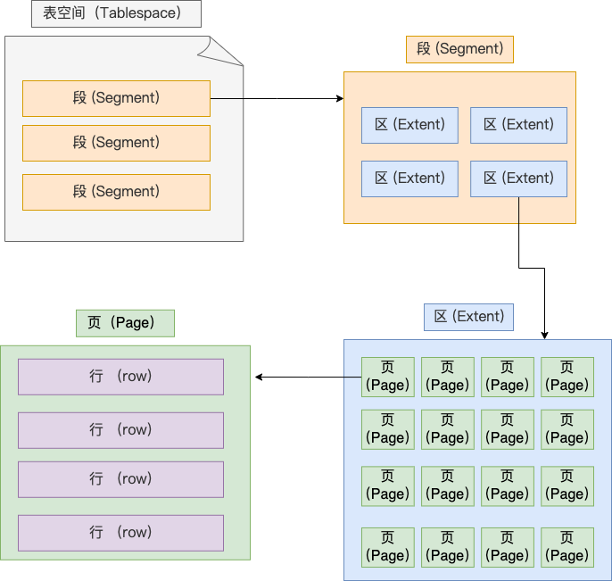

1. 行（row）

数据库表中的记录都是按行（row）进行存放的，每行记录根据不同的行格式，有不同的存储结构。

2. 页（page）

记录是按照行来存储的，但是数据库的读取并不以「行」为单位，否则一次读取（也就是一次 I/O 操作）只能处理一行数据，效率会非常低。因此，InnoDB 的数据是按「页」为单位来读写的，也就是说当需要读一条记录的时候，并不是将这个行记录从磁盘读出来，而是以页为单位，将其整体读入内存。

默认每个页的大小为 16KB，也就是最多能保证 16KB 的连续存储空间。页是 InnoDB 存储引擎磁盘管理的最小单元，意味着数据库每次读写都是以 16KB 为单位的，一次最少从磁盘中读取 16K 的内容到内存中，一次最少把内存中的 16K 内容刷新到磁盘中。

页的类型有很多，常见的有数据页、undo 日志页、溢出页等等。数据表中的行记录是用「数据页」来管理的

3. 区（extent）

InnoDB 存储引擎是用 B+ 树来组织数据的。B+ 树中每一层都是通过双向链表连接起来的，如果是以页为单位来分配存储空间，那么链表中相邻的两个页之间的物理位置并不是连续的，可能离得非常远，那么磁盘查询时就会有大量的随机 I/O，随机 I/O 是非常慢的。

解决这个问题也很简单，就是让链表中相邻的页的物理位置也相邻，这样就可以使用顺序 I/O 了，那么在范围查询（扫描叶子节点）的时候性能就会很高。

**那具体怎么解决呢？**

在表中数据量大的时候，为某个索引分配空间的时候就不再按照页为单位分配了，而是按照区（extent）为单位分配。每个区的大小为 1MB，对于 16KB 的页来说，连续的 64 个页会被划为一个区，这样就使得链表中相邻的页的物理位置也相邻，就能使用顺序 I/O 了。

4. 段（segment）

表空间是由各个段（segment）组成的，段是由多个区（extent）组成的。段一般分为数据段、索引段和回滚段等。

+ 索引段：存放 B + 树的非叶子节点的区的集合；
+ 数据段：存放 B + 树的叶子节点的区的集合；
+ 回滚段：存放的是回滚数据的区的集合

### InnoDB 行格式（TODO）
行格式（row_format），就是一条记录的存储结构。

InnoDB 提供了 4 种行格式，分别是 Redundant、Compact、Dynamic 和 Compressed 行格式。

1. Redundant 是很古老的行格式了， MySQL 5.0 版本之前用的行格式，现在基本没人用了。
2. 由于 Redundant 不是一种紧凑的行格式，所以 MySQL 5.0 之后引入了 Compact 行记录存储方式，Compact 是一种紧凑的行格式，设计的初衷就是为了让一个数据页中可以存放更多的行记录，从 MySQL 5.1 版本之后，行格式默认设置成 Compact。
3. Dynamic 和 Compressed 两个都是紧凑的行格式，它们的行格式都和 Compact 差不多，因为都是基于 Compact 改进一点东西。从 MySQL5.7 版本之后，默认使用 Dynamic 行格式。

#### Compact
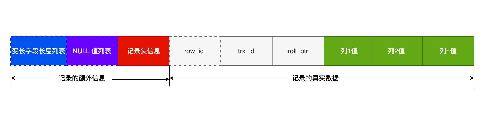

一条完整的记录分为「记录的额外信息」和「记录的真实数据」两个部分。

### 行溢出后 MySQL 的处理
MySQL 中磁盘和内存交互的基本单位是页，一个页的大小一般是 16KB，也就是 16384 字节，而一个 varchar(n) 类型的列最多可以存储 65532 字节，一些大对象如 TEXT、BLOB 可能存储更多的数据，这时一个页可能就存不了一条记录。这个时候就会发生行溢出，多的数据就会存到另外的「溢出页」中。

如果一个数据页存不了一条记录，InnoDB 存储引擎会自动将溢出的数据存放到「溢出页」中。在一般情况下，InnoDB 的数据都是存放在 「数据页」中。但是当发生行溢出时，溢出的数据会存放到「溢出页」中。

当发生行溢出时，在记录的真实数据处只会保存该列的一部分数据，而把剩余的数据放在「溢出页」中，然后真实数据处用 20 字节存储指向溢出页的地址，从而可以找到剩余数据所在的页。大致如下图所示。


上面这个是 Compact 行格式在发生行溢出后的处理。

Compressed 和 Dynamic 这两个行格式和 Compact 非常类似，主要的区别在于处理行溢出数据时有些区别。这两种格式采用完全的行溢出方式，记录的真实数据处不会存储该列的一部分数据，只存储 20 个字节的指针来指向溢出页。而实际的数据都存储在溢出页中，看起来就像下面这样：

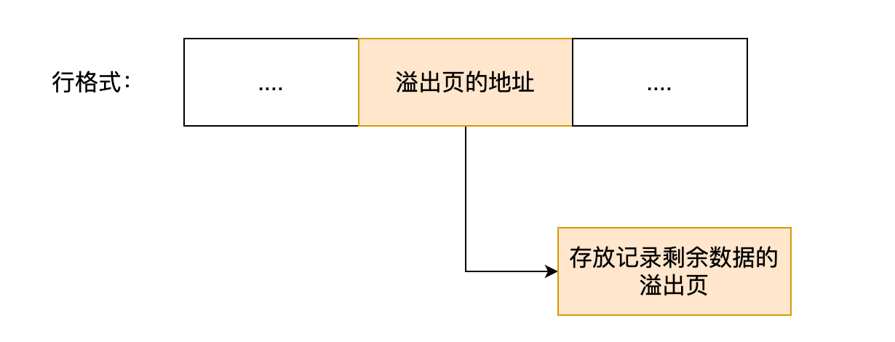

### char 和 varchar
#### char 和 varchar 的区别
1. char(n)：固定长度类型，比如：char(10)，输入“abc”时，它们占的空间还是 10 个字节，其他 7 个是空字节，适用于存储密码的 md5 值
2. varchar(n)：可变长度，存储的值是每个值占用的字节再加上一个用来记录其长度的字节的长度

#### varchar(10)和 varchar(20)的区别
1. 存储空间相同，但是对于内存的消耗是不同的
2. 对于 varchar 数据类型来说，硬盘上的存储空间虽然都是根据实际字符长度来分配存储空间的，但是对于内存来说，则不是，其是使用固定大小的内存块来保存值
3. 当 MySql 创建临时表（sort，order 等）时，varchar 会转换为 char，转换后的 char 的长度就是 varchar 的长度（因为 order by col 采用 fixed_length 计算 col 长度），在内存中的空间就变大了，在排序、统计时候需要扫描的就越多，时间就越久

**varchar(n)中 n 的最大取值**

MySQL 规定除了 TEXT、BLOBs 这种大对象类型之外，其他所有的列（不包括隐藏列和记录头信息）占用的字节长度加起来不能超过 65535 个字节。（即一行记录除了 TEXT、BLOBs 类型的列，限制最大为 65535 字节，注意是一行的总长度，不是一列）

varchar(n) 字段类型的 n 代表的是最多存储的字符数量，并不是字节大小哦。

要算 varchar(n) 最大能允许存储的字节数，还要看数据库表的字符集，因为字符集代表着 1 个字符要占用多少字节，比如 ascii 字符集，1 个字符占用 1 字节，那么 varchar(100) 意味着最大能允许存储 100 字节的数据。

```sql
CREATE TABLE test ( 
`name` VARCHAR(65535)  NULL
) ENGINE = InnoDB DEFAULT CHARACTER SET = ascii ROW_FORMAT = COMPACT;
```


从报错信息就可以知道一行数据的最大字节数是 65535（不包含 TEXT、BLOBs 这种大对象类型），其中包含了 storage overhead（即「变长字段长度列表」和 「NULL 值列表」），也就是说一行数据的最大字节数 65535，其实是包含「变长字段长度列表」和 「NULL 值列表」所占用的字节数的。所以， 我们在算 varchar(n) 中 n 最大值时，需要减去 storage overhead 占用的字节数。

这是因为我们存储字段类型为 varchar(n) 的数据时，其实分成了三个部分来存储：

1. 真实数据
2. 真实数据占用的字节数
3. NULL 标识，如果不允许为 NULL，这部分不需要

本次案例中，字段是允许为 NULL 的，所以会用 1 字节来表示「NULL 值列表」。

1. 如果变长字段允许存储的最大字节数小于等于 255 字节，就会用 1 字节表示「变长字段长度」；
2. 如果变长字段允许存储的最大字节数大于 255 字节，就会用 2 字节表示「变长字段长度」；

本次案例中，字段类型是 varchar(65535) ，字符集是 ascii，所以代表着变长字段允许存储的最大字节数是 65535，符合条件二，所以会用 2 字节来表示「变长字段长度」，只有 1 个变长字段，所以「变长字段长度列表」= 1 个「变长字段长度」占用的字节数，也就是 2 字节。

所以，在数据库表只有一个 varchar(n) 字段且字符集是 ascii 的情况下，varchar(n) 中 n 最大值 = 65535 - 2 - 1 = 65532。

## UNION 与 UNION ALL 的区别
UNION 用于把来自多个 SELECT 语句的结果组合到一个结果集合中，MySQL 会把结果集中，MySQL 会把结果集中，重复的记录删掉，而使用 UNION ALL，MySQL 会把所有的记录返回，且效率高于 UNION

## SQL 与 MySQL 的区别
1. SQL 是一种结构化查询语言，用于在数据库上执行各种操作，但 MySQL 是一个关系数据库管理系统，使用 SQL 执行所有数据库操作
2. SQL 用于访问、更新和操作数据库中的数据，用户使用时需要学习该语言，然后编写查询，而 MySQL 是一个软件，会为用户提供一个界面，只需单击一些按钮即可用于执行各种数据库操作
3. 由于 MySQL 是一个软件，所以它会定期获得各种更新，但在 SQL 中，命令是相同的

## SQL 怎么将行转成列？
1. 使用 CASE...WHEN...THEN 语句实现行转列

```plsql
SELECT userid,
SUM(CASE `subject` WHEN '语文' THEN score ELSE 0 END) AS '语文',
SUM(CASE `subject` WHEN '数学' THEN score ELSE 0 END) AS '数学',
SUM(CASE `subject` WHEN '英语' THEN score ELSE 0 END) AS '英语'
FROM tb_score
GROUP BY userid
```

2. 使用 IF()函数实现行转列

```plsql
SELECT userid,
SUM(IF(`subject`='语文',score,0)) AS '语文',
SUM(IF(`subject`='数学',score,0)) AS '数学',
SUM(IF(`subject`='英语',score,0)) AS '英语'
FROM tb_score
GROUP BY userid
```

## DROP、DELETE 与 TRUNCATE 的区别
### DROP
1. DROP 是 DDL，会隐式提交，不能回滚，不会触发触发器
2. DROP 语句删除表结构及所有数据，并将表所占用的空间全部释放
3. DROP 语句将删除表的结果所依赖的约束、触发器、索引，依赖于该表的存储过程/函数将保留，但是变为 invalid 状态

### TRUNCATE
1. TRUNCATE 是 DDL，会隐式提交，不能回滚，不会触发触发器
2. TRUNCATE 会删除表中所有记录，并且将重新设置高水线和所有的索引，缺省情况下将空间释放到 minextents 个 extent，除非使用 reuse storage。不会记录日志，所以执行速度很快，但是通过 rollback 撤销操作
3. 对于外键（foreign key）约束引用的表，不能使用 truncate table，而应使用不带 where 子句的 delete 语句
4. TRUNCATE TABLE 不能用于参与了索引视图的表
5. 当表被 TRUNCATE 后，这个表和索引所占的空间会恢复到初始大小

### DELETE
1. DELETE 是 DML，执行 DELETE 操作时，每次从表中删除一行，并且同时将该行的删除操作记录在 redo 和 undo 表空间中以便进行回滚（rollback）和重做操作，但要注意表空间要足够大，需要手动提交（commit）操作才能生效，可以通过 rollback 撤销操作
2. DELETE 可根据条件删除表中满足条件的数据，如果不指定 where，那么删除表中所有记录
3. DELETE 语句不影响表所占用的 extent，高水线（high watermark）保持原位置不变
4. DELETE 不会减少表或索引所占用的空间

### 效率
删除速度：DROP > TRUNCATE > DELETE，DELETE 需要逐行删除

## 怎样插入数据才能更高效？
### MyISAM
1. 禁用索引

对于非空表，插入记录时，MySQL 会根据表的索引对插入的记录建立索引。如果插入大量数据，建立索引会降低插入记录的速度。为了解决这种情况，可以在插入记录之前禁用索引，数据插入完毕后再开启索引。对于空表批量导入数据，则不需要进行此操作，因为 MyISAM 引擎的表是在导入数据之后才建立索引的

2. 禁用唯一性检查

插入数据时，MySQL 会对插入的记录进行唯一性校验。这种唯一性校验会降低插入记录的速度，为了降低这种情况对查询速度的影响，可以在插入记录之前禁用唯一性检查，等到记录插入完毕后再开启

3. 使用批量插入

插入多条记录时，可以使用一条 INSERT 语句插入一条记录，也可以使用一条 INSERT 语句插入多条数据，这种方法的插入速度更快。

4. 使用 LOAD DATA INFILE 批量导入

当需要批量导入数据时，如果能用 LOAD DATA INFILE 语句，就尽量使用，因为 LOAD DATA INFILE 语句导入数据的速度比 INSERT 语句快

### InnoDB
1. 禁用唯一性检查

插入数据之前执行 set unique_checks = 0 来禁止对唯一索引的检查，数据导入完成之后再运行 set unique_checks = 1

2. 禁用外键检查

插入数据之前执行禁止对外键的检查，数据插入完成之后再恢复对外键的检查

3. 禁用自动提交

插入数据之前禁止事务的自动提交，数据导入完成之后，执行恢复自动提交操作

## 分库分表

### 为什么要分库分表？

随着时间和业务的发展，库中的表会越来越多，表中的数据量也会越来越大，相应的数据操作（增删改查）的开销也会越来越大，若不进行分布式部署，而一台服务器的资源（CPU、磁盘、内存、IO 等）是有限的，最终数据库所能承载的数据量、数据处理能力都将遭遇瓶颈。所以，会进行数据库拆分处理，把原本存储在一个库的数据分块存储在多个库上，把原本存储于一个表的数据分块存储到多个表上，即分库分表

### 存在问题

1. 事务问题：分库分表后，就成了分布式事务。如果依赖数据库本身的分布式事务管理功能去执行事务，将付出高昂的性能代价；如果由应用程序去协助控制，形成程序逻辑上的事务，又会造成编程方面的负担
2. 跨库跨表的 JOIN 问题：表的关联操作将受到限制，我们无法 JOIN 位于不同分库的表，也无法 JOIN 分表粒度不同的表，结果原本一次查询能够完成的业务，可能需要多次查询才能完成
3. 额外的数据管理负担和数据运算压力：额外的数据管理负担，最为常见的是数据的定位问题和数据得增删改查得重复执行问题，这些都可以通过应用程序来解决，但必然会引起额外的逻辑运算

### 水平切分和垂直切分

1. 水平切分：指同一张表中的记录拆分到多个结构相同的表中。当一个表的数据不断增多时，水平切分是必然的选择，它可以将数据分布到集群的不同节点上，从而缓存单个数据库的压力
2. 垂直切分：将一张表按列切分成多个表，通常是按照列的关系密集程度进行切分，也可以利用垂直切分将经常被使用的列和不经常被使用的列切分到不同的表中：例如：将原来的电商数据库垂直切分成商品数据库、用户数据库等

## 大表数据多的优化

表容量主要从表的记录数、平均长度、增长量、读写量、总大小量进行评估。一般对于 OLTP 的表，建议单表不要超过 2000W 行数据量，总大小 15G 以内。访问量：单表读写量在 1600/s 以内

```sql
// 查询单个库中所有表磁盘占用大小
select
table_schema as '数据库',
table_name as '表名',
table_rows as '记录数',
truncate(data_length/1024/1024, 2) as '数据容量（MB）',
truncate(index_length/1024/1024, 2) as '索引容量（MB）'
from information_schema.tables
where table_schema=数据库
order by data_length desc, index_length desc;
```

一个表的数据量达到好几千万或者上亿时，加索引的效果没那么明显啦。性能之所以会变差，是因为维护索引的 `B+` 树结构层级变得更高了，查询一条数据时，需要经历的磁盘 IO 变多，因此查询性能变慢。

InnoDB 存储引擎最小储存单元是页，一页大小就是 `16k`。

B+树叶子存的是数据，内部节点存的是键值+指针。索引组织表通过非叶子节点的二分查找法以及指针确定数据在哪个页中，进而再去数据页中找到需要的数据；

假设 B+树的高度为 `2` 的话，即有一个根结点和若干个叶子结点。这棵 B+树的存放总记录数为 = 根结点指针数*单个叶子节点记录行数。

- 如果一行记录的数据大小为 1k，那么单个叶子节点可以存的记录数 = 16k/1k = 16.
- 非叶子节点内存放多少指针呢？我们假设主键 ID 为 **bigint 类型，长度为 8 字节**(**面试官问你 int 类型，一个 int 就是 32 位，4 字节**)，而指针大小在 InnoDB 源码中设置为 6 字节，所以就是 8+6 = 14 字节，16k/14B = 16*1024B/14B = 1170

因此，一棵高度为 2 的 B+树，能存放 `1170 * 16=18720` 条这样的数据记录。同理一棵高度为 3 的 B+树，能存放 `1170 *1170 *16 =21902400`，也就是说，可以存放两千万左右的记录。B+树高度一般为 1-3 层，已经满足千万级别的数据存储。

如果 B+树想存储更多的数据，那树结构层级就会更高，查询一条数据时，需要经历的磁盘 IO 变多，因此查询性能变慢。

解决方法：

1. 数据表分区
2. 数据库分表
3. 冷热归档

## 冷热数据

### 什么是冷热分离？

**热数据**

热数据指的是需要即时对用户进行分发的数据，即从数据源抓取之后经过数据处理，需要即时存储到可快速分发的存储介质供 API 或直接面向用户的系统使用。

热数据需要重点保障服务质量和稳定性，为了保证数据的时效性，在数据处理上也是优先级高的数据。

**冷数据**

冷数据指的是不需要即时发给用户的数据。这些数不会原样分发给用户，它们需要经过长期的积累，使我们可以从中得到基于此更高层次的分析。

**冷热分离**

冷热分离指的是在处理数据时将数据库分为冷库和热库，冷库指用于存放走到了终态的数据（冷数据）的数据库，热库用于存放还需要修改的数据（热数据）的数据库。

### 什么情况下使用冷热分离？

从冷热分离的定义我们可以知道当业务需求涉及到冷热数据，表数据量增长速度快或数据量较大时， 我们就该考虑是否使用冷热分离解决方案了。比如：

1. 数据走到终态后，只有读没有写的需求。
2. 用户能够接受新旧数据分开实现业务，比如查询新旧数据的时候分开操作。

### 如何判断一个数据到底是冷数据还是热数据？

一个数据是冷数据还是热数据，需要根据实际的业务需求来制定判定条件。满足热数据条件的归为热数据，满足冷数据条件的归为冷数据。

判定条件可以是表里的 1 个字段或多个字段组合的方式组成。时间、状态等都是比较适合用作判定条件的字段。

比如，我们管理一个订单系统，针对订单主表，我们可以使用下面两种方式作为冷热数据的界定：

1. 使用“下单时间”字段作为判定条件，3 个月内的订单数据作为热数据，3 个月前的订单数据作为冷数据。
2. 使用“完结状态”字段作为判定条件，未完结的订单作为热数据，已完结的订单作为冷数据。

关于判断冷热数据的逻辑，这里还有 2 个注意要点必须说明：

1. 如果一个数据被标识为冷数据，业务代码不会再对它进行写操作；
2. 不会同时存在读冷/热数据的需求。

### 如何触发冷热数据分离？

一般来说，冷热数据分离的触发实现有 3 种方式：业务层代码实现、binlog 实现、定时扫描数据库实现。

1. 直接修改业务代码，每次修改数据时触发冷热分离（比如每次更新了订单的状态，就去触发这个逻辑）；
2. 如果不想修改原来业务代码，可通过监听数据库变更日志 binlog 的方式来触发（数据库触发器也可）；
3. 通过定时扫描数据的方式来触发（数据库定时任务或通过程序定时任务来触发）；

|      | 修改写操作业务代码                                           | 监听数据库变更日志                                           | 定时扫描数据库                                             |
| ---- | ------------------------------------------------------------ | ------------------------------------------------------------ | ---------------------------------------------------------- |
| 优点 | 1、代码灵活可控。2、保证实时性                               | 1、与业务代码解耦。2、可以做到低延时。                       | 1、与业务代码解耦。2、可以覆盖根据时间区分冷热数据的场景。 |
| 缺点 | 1、不能按照时间区分冷热，当数据变为冷数据，期间可能没有进行任何操作。2、需要修改所有数据写操作的代码。 | 1、无法按照时间区分冷热，当数据变为冷数据，期间没有进行任何操作。2、需要考虑数据并发操作的问题，即业务代码与冷热变更代码同时操作同一数据。 | 1、不能做到实时性                                          |

## 二阶段提交

在 MySQL 中，两阶段提交的主角就是 binlog 和 redolog，我们来看一个两阶段提交的流程图：

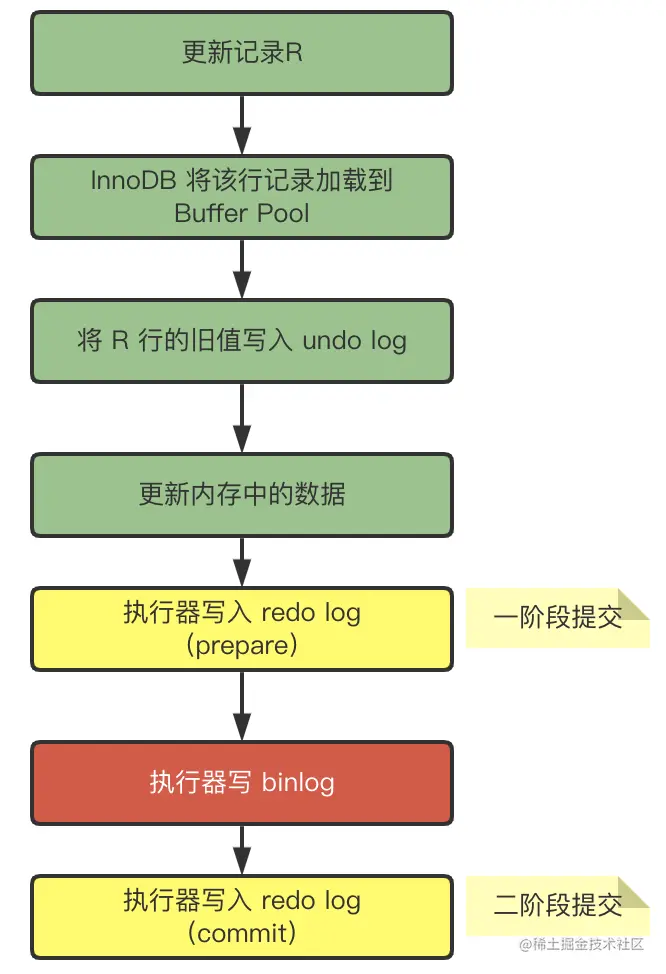

从上图中可以看出，在最后提交事务的时候，有 3 个步骤：

1. 写入 redo log，处于 prepare 状态。
2. 写 binlog。
3. 修改 redo log 状态变为 commit。

由于 `redo log` 的提交分为 `prepare` 和 `commit` 两个阶段，所以称之为两阶段提交。

**为什么需要两阶段提交**

如果没有两阶段提交，那么 binlog 和 redolog 的提交，无非就是两种形式：

1. 先写 binlog 再写 redolog。
2. 先写 redolog 再写 binlog。

假设我们要向表中插入一条记录 R，如果是先写 binlog 再写 redolog，那么假设 binlog 写完后崩溃了，此时 redolog 还没写。那么重启恢复的时候就会出问题：binlog 中已经有 R 的记录了，当从机从主机同步数据的时候或者我们使用 binlog 恢复数据的时候，就会同步到 R 这条记录；但是 redolog 中没有关于 R 的记录，所以崩溃恢复之后，插入 R 记录的这个事务是无效的，即数据库中没有该行记录，这就造成了数据不一致。

相反，假设我们要向表中插入一条记录 R，如果是先写 redolog 再写 binlog，那么假设 redolog 写完后崩溃了，此时 binlog 还没写。那么重启恢复的时候也会出问题：redolog 中已经有 R 的记录了，所以崩溃恢复之后，插入 R 记录的这个事务是有效的，通过该记录将数据恢复到数据库中；但是 binlog 中还没有关于 R 的记录，所以当从机从主机同步数据的时候或者我们使用 binlog 恢复数据的时候，就不会同步到 R 这条记录，这就造成了数据不一致。

经过上述分析后可得知：如果 `redo-log` 只写一次，那不管谁先写，都有可能造成主从同步数据时的不一致问题出现，为了解决该问题，`redo-log` 就被设计成了两阶段提交模式，设置成两阶段提交后，整个执行过程有三处崩溃点：

**情况一：** 一阶段提交之后崩溃了，即 `写入 redo log，处于 prepare 状态` 的时候崩溃了，此时：

由于 binlog 还没写，redo log 处于 prepare 状态还没提交，所以崩溃恢复的时候，这个事务会回滚，此时 binlog 还没写，所以也不会传到备库。

**情况二：** 假设写完 binlog 之后崩溃了，此时：

redolog 中的日志是不完整的，处于 prepare 状态，还没有提交，那么恢复的时候，首先检查 binlog 中的事务是否存在并且完整，如果存在且完整，则直接提交事务，如果不存在或者不完整，则回滚事务。

**情况三：** 假设 redolog 处于 commit 状态的时候崩溃了，那么重启后的处理方案同情况二。

**两阶段提交有什么问题？**

两阶段提交虽然保证了两个日志文件的数据一致性，但是性能很差，主要有两个方面的影响：

1. 磁盘 I/O 次数高：对于“双 1”配置，每个事务提交都会进行两次 fsync（刷盘），一次是 redo log 刷盘，另一次是 binlog 刷盘。
2. 锁竞争激烈：两阶段提交虽然能够保证「单事务」两个日志的内容一致，但在「多事务」的情况下，却不能保证两者的提交顺序一致，因此，在两阶段提交的流程基础上，还需要加一个锁来保证提交的原子性，从而保证多事务的情况下，两个日志的提交顺序一致。

**为什么锁竞争激烈？**

在早期的 MySQL 版本中，通过使用 prepare_commit_mutex 锁来保证事务提交的顺序，在一个事务获取到锁时才能进入 prepare 阶段，一直到 commit 阶段结束才能释放锁，下个事务才可以继续进行 prepare 操作。

通过加锁虽然完美地解决了顺序一致性的问题，但在并发量较大的时候，就会导致对锁的争用，性能不佳。

### 组提交

MySQL 引入了 binlog 组提交（group commit）机制，当有多个事务提交的时候，会将多个 binlog 刷盘操作合并成一个，从而减少磁盘 I/O 的次数，如果说 10 个事务依次排队刷盘的时间成本是 10，那么将这 10 个事务一次性一起刷盘的时间成本则近似于 1。

引入了组提交机制后，prepare 阶段不变，只针对 commit 阶段，将 commit 阶段拆分为三个过程：

1. flush 阶段：多个事务按进入的顺序将 binlog 从 cache 写入文件（不刷盘）；
2. sync 阶段：对 binlog 文件做 fsync 操作（多个事务的 binlog 合并一次刷盘）；
3. commit 阶段：各个事务按顺序做 InnoDB commit 操作；

上面的每个阶段都有一个队列，每个阶段有锁进行保护，因此保证了事务写入的顺序，第一个进入队列的事务会成为 leader，leader 领导所在队列的所有事务，全权负责整队的操作，完成后通知队内其他事务操作结束。


对每个阶段引入了队列后，锁就只针对每个队列进行保护，不再锁住提交事务的整个过程，可以看的出来，**锁粒度减小了，这样就使得多个阶段可以并发执行，从而提升效率**。

**有 binlog 组提交，那有 redo log 组提交吗？**

这个要看 MySQL 版本，MySQL 5.6 没有 redo log 组提交，MySQL 5.7 有 redo log 组提交。

在 MySQL 5.6 的组提交逻辑中，每个事务各自执行 prepare 阶段，也就是各自将 redo log 刷盘，这样就没办法对 redo log 进行组提交。

所以在 MySQL 5.7 版本中，做了个改进，在 prepare 阶段不再让事务各自执行 redo log 刷盘操作，而是推迟到组提交的 flush 阶段，也就是说 prepare 阶段融合在了 flush 阶段。

这个优化是将 redo log 的刷盘延迟到了 flush 阶段之中，sync 阶段之前。通过延迟写 redo log 的方式，为 redolog 做了一次组写入，这样 binlog 和 redo log 都进行了优化。

接下来介绍每个阶段的过程，注意下面的过程针对的是“双 1” 配置（sync_binlog 和 innodb_flush_log_at_trx_commit 都配置为 1）。

**flush 阶段**

第一个事务会成为 flush 阶段的 Leader，此时后面到来的事务都是 Follower ：

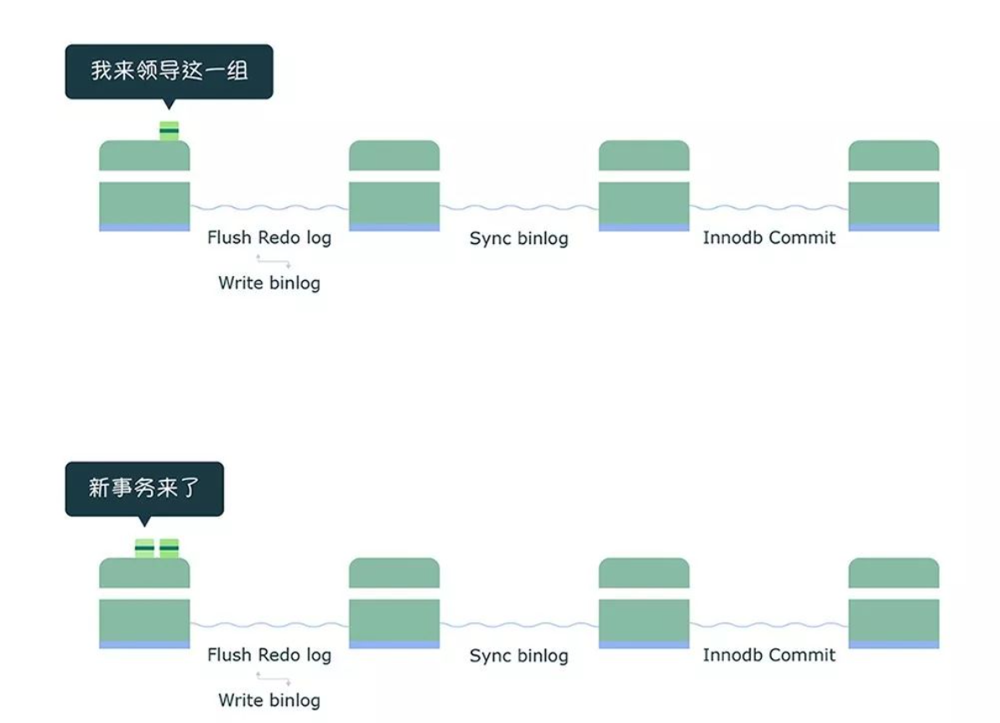

接着，获取队列中的事务组，由绿色事务组的 Leader 对 rodo log 做一次 write + fsync，即一次将同组事务的 redolog 刷盘：

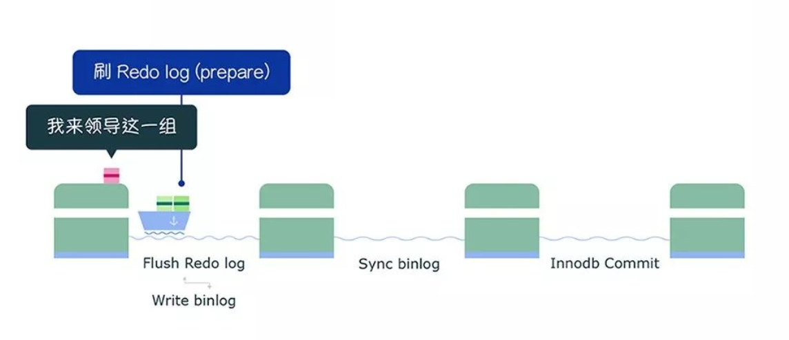

完成了 prepare 阶段后，将绿色这一组事务执行过程中产生的 binlog 写入 binlog 文件（调用 write，不会调用 fsync，所以不会刷盘，binlog 缓存在操作系统的文件系统中）。

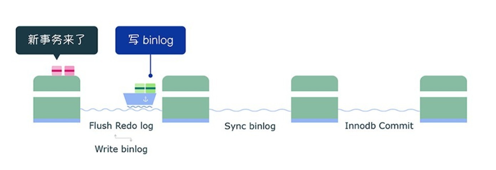

从上面这个过程，可以知道 flush 阶段队列的作用是 **用于支撑 redo log 的组提交**。

如果在这一步完成后数据库崩溃，由于 binlog 中没有该组事务的记录，所以 MySQL 会在重启后回滚该组事务。

**sync 阶段**

绿色这一组事务的 binlog 写入到 binlog 文件后，并不会马上执行刷盘的操作，而是 **会等待一段时间**，这个等待的时长由 `Binlog_group_commit_sync_delay` 参数控制，**目的是为了组合更多事务的 binlog，然后再一起刷盘**，如下过程：

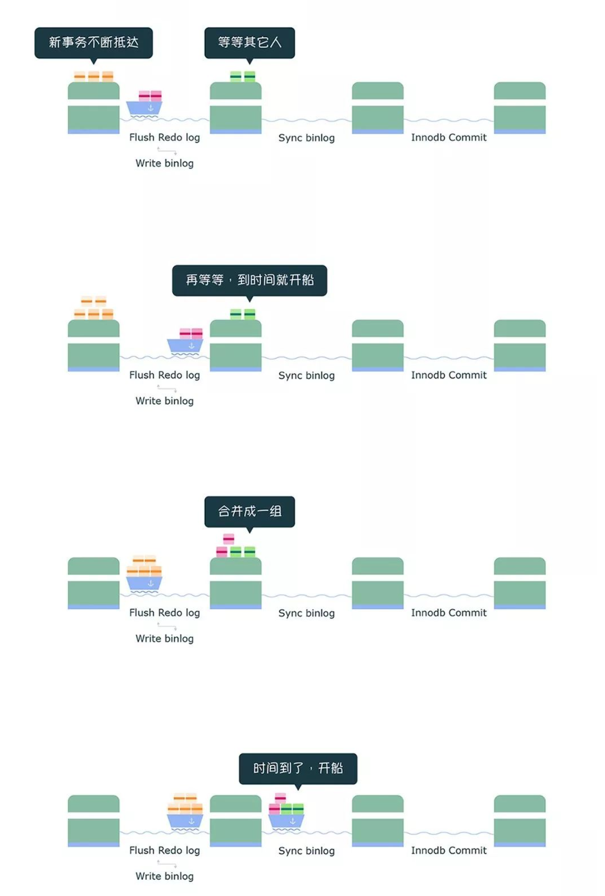

不过，在等待的过程中，如果事务的数量提前达到了 `Binlog_group_commit_sync_no_delay_count` 参数设置的值，就不用继续等待了，就马上将 binlog 刷盘，如下图：


从上面的过程，可以知道 sync 阶段队列的作用是用于支持 binlog 的组提交。

如果想提升 binlog 组提交的效果，可以通过设置下面这两个参数来实现：

1. binlog_group_commit_sync_delay = N，表示在等待 N 微妙后，直接调用 fsync，将处于文件系统中 page cache 中的 binlog 刷盘，也就是将「 binlog 文件」持久化到磁盘。

2. binlog_group_commit_sync_no_delay_count = N，表示如果队列中的事务数达到 N 个，就忽视 binlog_group_commit_sync_delay 的设置，直接调用 fsync，将处于文件系统中 page cache 中的 binlog 刷盘。

如果在这一步完成后数据库崩溃，由于 binlog 中已经有了事务记录，MySQL 会在重启后通过 redo log 刷盘的数据继续进行事务的提交

**commit 阶段**

最后进入 commit 阶段，调用引擎的提交事务接口，将 redo log 状态设置为 commit。

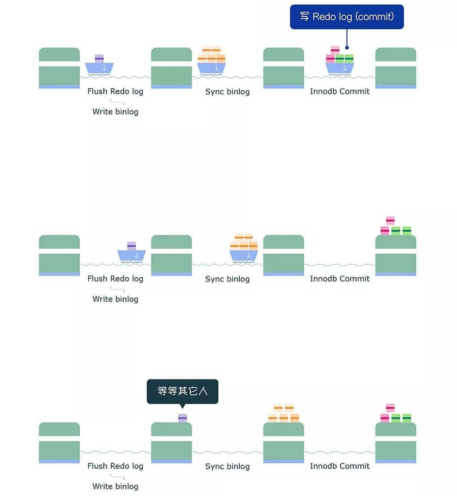

commit 阶段队列的作用是承接 sync 阶段的事务，完成最后的引擎提交，使得 sync 可以尽早的处理下一组事务，最大化组提交的效率


## 小表驱动大表

- 没有索引的情况下：

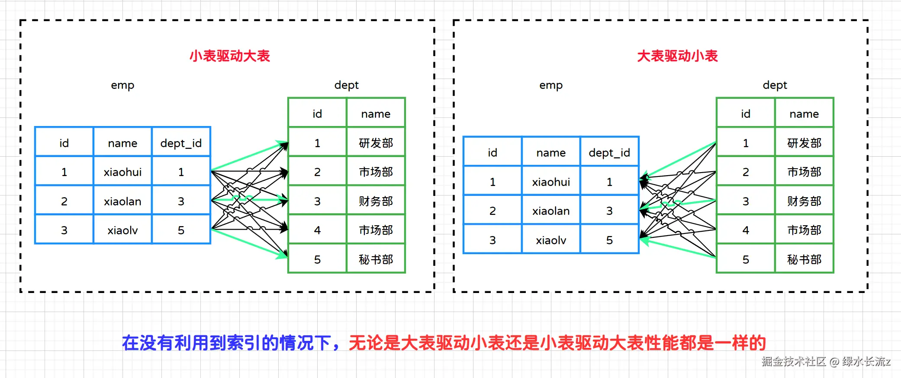

- 有用到索引的情况：

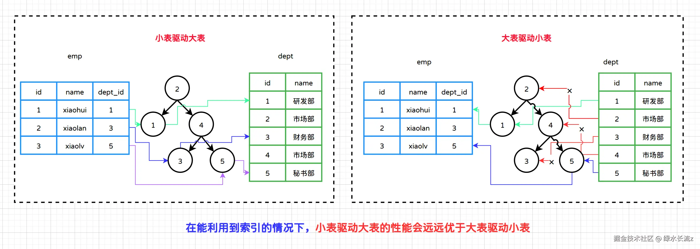

因此，小表驱动大表速度快的前提是：**两个表上根据主/外键建立了索引**，这样在根据某一条数据查找 B+树时，速度就会大大提高，若没有建立索引，则两个表无论谁当作主表，查找数据的次数都是一样的。

如果先对小表进行操作，那么总的扫描行数和匹配次数会相对较少，从而提高查询的效率。 例如，假设有表 A（小表）和表 B（大表）进行连接，如果以表 A 作为驱动表，那么遍历表 A 的成本相对较低，然后根据连接条件与表 B 进行匹配，效率会更高。

## Join 算法优化

### Nested Loop Join（NLJ）

嵌套循环连接（Nested Loop Join）是一种最基本的连接实现算法。**它先从外部表（驱动表）中获取满足条件的数据，并对每个行再遍历一次另一个表（内层表）以找到匹配的行。**

假设我们有两个表 `employees` 和 `departments`，并且我们要找出每个员工所在的部门名称。如果使用 NLJ，MySQL 将会遍历 `employees` 表中的每一行，并且针对每一行遍历 `departments` 表中的所有行，直到找到一个与当前员工的部门。

对于左表中的每一行，遍历右表的所有行寻找匹配的记录。这是一种最基本的连接方式，适用于小规模数据集或当没有合适的索引可用时。

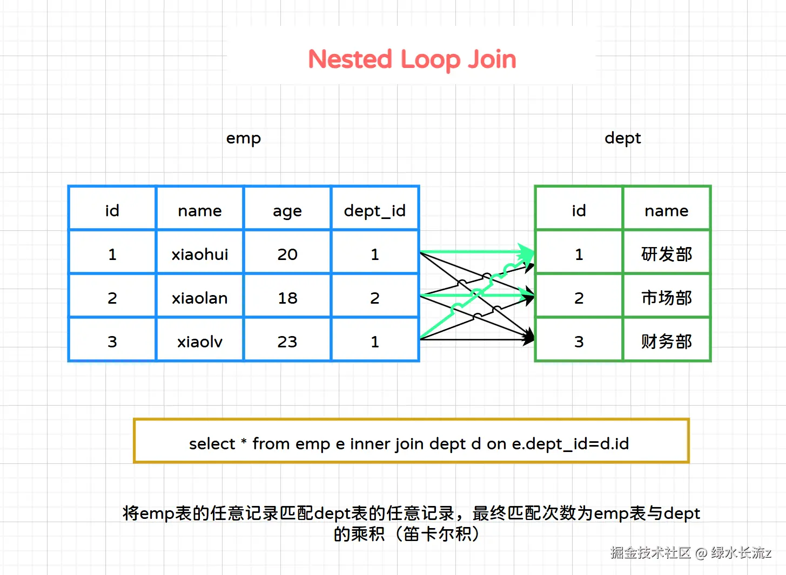

### Block Nested Loop Join（BNLJ）

Block Nested Loop 是对 NLJ 的一种改进，它利用内存中的缓存块来减少磁盘 I/O 操作。不是每次都读取整个右表（被驱动表），而是每次从右表中加载一部分数据到内存（块），然后用左表（驱动表）的一行去匹配这些块里的所有行。

BNLJ 与 NLJ 类似，但 MySQL 会尝试将尽可能多的 `departments` 行加载到内存中，然后用 `employees` 表的每一行去匹配这些已经加载到内存中的 `departments` 行。

BNLJ 是 NLJ 的一种优化版本，它试图减少不必要的磁盘 I/O 操作。它的核心思想是分批加载右表的数据到内存中，然后用左表的一行去匹配这些已经加载到内存中的块。具体来说，不是每次都扫描整个右表，而是每次只加载一部分数据（一个或多个块），并且尽可能多地利用内存中的缓存。

如图所示：

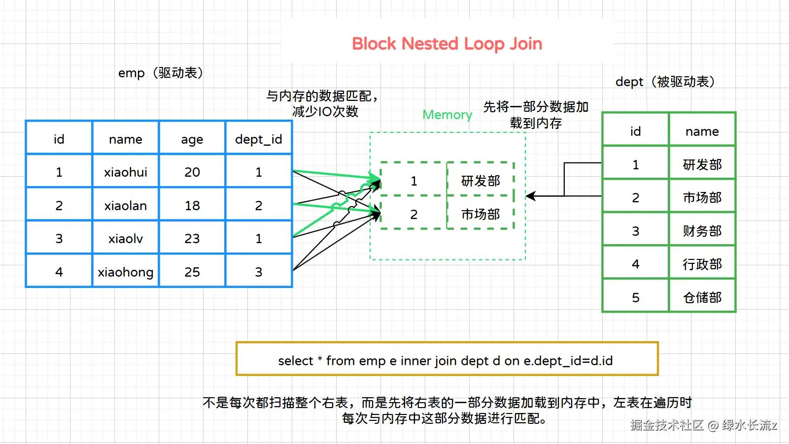

### Index Nested Loop Join（INLJ）

当右表有一个可以被有效使用的索引时，MySQL 可以直接通过索引来查找匹配的行，而不需要扫描整个表。这通常比简单的 NLJ 更快，因为它减少了需要访问的行数。

例如：如果我们为 `departments` 表上的 `id` 列创建了索引，那么 MySQL 可以直接根据 `employees.department_id` 查找 `departments` 表中的相应记录，而不是扫描整个表。

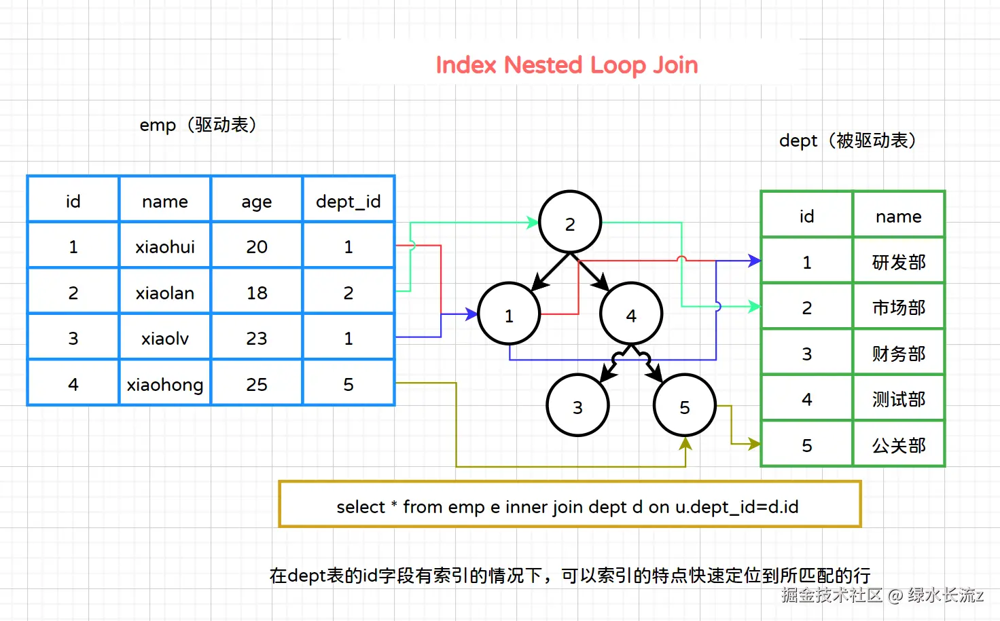

### Sort Merge Join（SMJ）

在 Sort Merge Join 中，**首先两个表按连接键排序**，之后同时遍历这两个有序列表，如果两个元素的连接键相当，则匹配成功。如果不相等则指向较小的连接键值，找到匹配的记录。

例如：如果 `employees` 和 `departments` 都是根据 `department_id` 和 `id` 排序的，那么 MySQL 可以简单地同时遍历两个表，只比较相等的键值，从而高效地完成 JOIN。

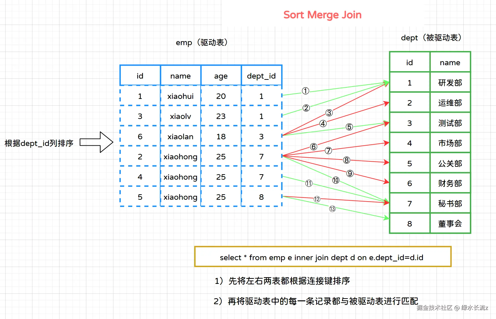

### Hash Join

Hash Join 在 MySQL 8.0.18 版本引入，且不需要索引的支持。Hash Join 在查询时首先会在内存中构建一个哈希表，然后用另一个表的数据去探测这个哈希表，检查该表中的每一行是否存在于哈希表中。这种 JOIN 方式非常适合大规模数据集，对于等值连接特别有效，尤其是在内存足够大的情况下。

Hash Join 的工作流程：

**Build Phase (构建阶段)： **

- 选择较小的表作为构建表（Build Table），并在内存中为该表构建一个哈希表。
- 对构建表中的每一行计算哈希函数，并将结果插入到这个哈希表中。这个哈希表的键是连接列上的哈希值，而值是指向该行的指针或行本身。

**Probe Phase (探测阶段)： **

- 遍历较大的表（Probe Table）中的每一行。
- 对于每行，使用相同的哈希函数计算连接列的哈希值。
- 使用这个哈希值在哈希表中查找匹配项。如果找到匹配，则输出这两行组成的连接结果。

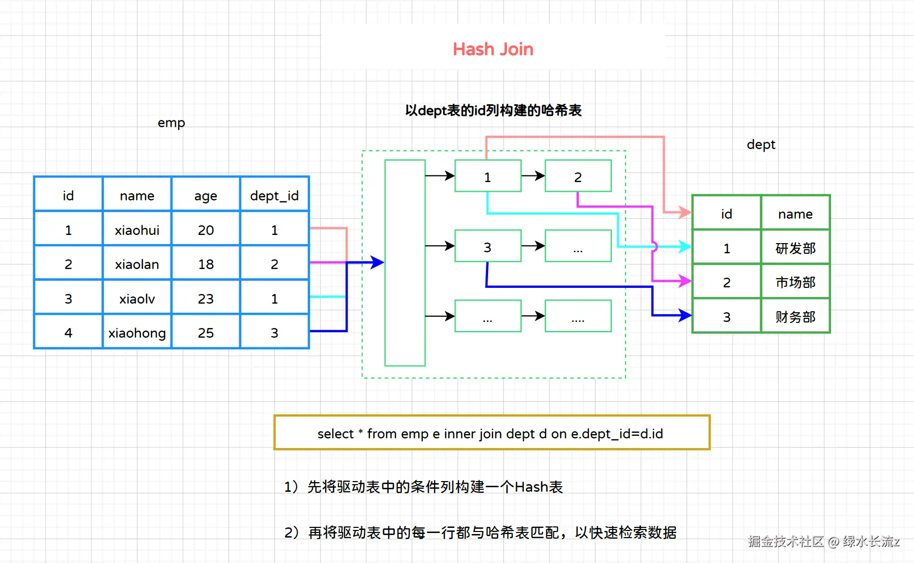

## 数据迁移

最简单的就是停机迁移，复杂点的就是不停机迁移，要考虑增量同步和全量同步的问题。

**增量同步**

增量同步：老库迁移到新库期间，增删改命令的落库不能出错

1. 同步双写：同步写新库和老库；
2. 异步双写（推荐）： 写老库，监听 binlog 异步同步到新库
3. 中间件同步工具：通过一定的规则将数据同步到目标库表

**全量同步**

全量同步：老库到新库的数据迁移，要控制好迁移效率，解决增量数据的一致性。

1. 定时任务查老库写新库
2. 使用中间件迁移数据，例如 Dbmate、Apache NiFi、Ladder、Phinx、Flyway、TiDB 等。

**数据一致性校验和补偿**

假设采用异步双写方案，在迁移完成后，逐条对比新老库数据，一致则跳过，不一致则补偿：

- 新库存在，老库不存在：新库删除数据
- 新库不存在，老库存在：新库插入数据
- 新库存在、老库存在：比较所有字段，不一致则将新库更新为老库数据

**灰度切读**

灰度发布：指黑（旧版本）与白（新版本）之间，让一些用户继续用旧版本，一些用户开始用新版本，如果用户对新版本没什么意见，就逐步把所有用户迁移到新版本，实现平滑过渡发布。

原则：

1. 有问题及时切回老库
2. 灰度放量先慢后快，每次放量观察一段时间
3. 支持灵活的规则：门店维度灰度、百 (万)分比灰度
