## 事务

### 特性（ACID）
1. 原子性（undo log）：事务是最小的执行单位，不允许分割。事务的原子性确保动作要么全部完成，要么完全不起作用
2. 一致性：执行事务前后，数据库从一个一致性状态转换到另一个一致性状态
3. 隔离性（锁和 MVCC 机制）：并发访问数据库时，一个用户的事务不被其他事务所干扰，各并发事务之间数据库是独立的
4. 持久性（redo log）：一个事务被提交之后，它对数据库中数据的改变是持久的，即使数据库发生故障也不应该对其有任何影响

### 保证事务的方法
1. 持久性是通过 redo log （重做日志）来保证的；
2. 原子性是通过 undo log（回滚日志） 来保证的；

实现原子性的关键，是当事务回滚时能够撤销所有已经成功执行的 sql 语句。InnoDB 回滚靠的是 undo log，当事务对数据库进行修改时，InnoDB 会生成对应的 undo log。如果事务执行失败或调用了 rollback，导致事务需要回滚，便可以利用 undo log 中的信息将数据回滚到修改之前的样子

3. 隔离性是通过 MVCC（多版本并发控制） 或锁机制来保证的；
+ 写操作对写操作的影响：锁机制
+ 写操作对读操作的影响：MVCC 机制
4. 一致性则是通过持久性+原子性+隔离性来保证；

### 事务并发问题
1. 幻读：一个事务读取 2 次，得到的记录条数不一致


2. 不可重复读：一个事务读取同一条记录 2 次，得到的结果不一致


3. 脏读：一个事务中访问到了另外一个事务未提交的数据


### 事务隔离级别
1. READ_UNCOMMITTED（未提交读）：最低的隔离级别，允许读取尚未提交的数据变更，可能会导致脏读、幻读或不可重复读
2. READ_COMMITTED（提交读）：允许读取并发事务已经提交的数据，可以阻止脏读，但是幻读或不可重复读仍有可能发生
3. REPEATABLE_READ（可重复读）：对同一字段的多次读取结果都是一致的，除非数据是被本身事务自己所修改，可以阻止脏读和不可重复读，但幻读仍有可能发生
4. SERIALIZABLE（串行化）：最高的隔离级别，完全服从 ACID 的隔离级别。所有的事务依次逐个执行，这样事务之间就完全不可能产生干扰。该级别可以防止脏读、不可重复读以及幻读，但这会影响程序的性能。通常情况下也不会用到该级别

### MySQL 默认的隔离级别
1. MySQL 默认采用的 REPEATABLE_READ（可重复读）隔离级别
2. Oracle 默认采用的 READ_COMMITTED（提交读）隔离级别

## MVCC（多版本并发控制）
### 数据库并发场景
1. 读-读：不存在任何问题，也不需要并发控制
2. 读-写：有线程安全问题，可能会造成事务隔离性问题，可能遇到脏读、幻读、不可重复读
3. 写-写：有线程安全问题，可能会存在更新丢失问题

### 什么是 MVCC？
数据库中同时存在多个版本的数据，并不是整个数据库的多个版本，而是某一条数据的多个版本同时存在，在某个事务对其进行操作的时候，需要查看这一条记录的隐藏列事务版本 id，比对事务 id 并根据事务隔离级别去判断读取哪个版本的数据。

多版本并发控制（MVCC：Multi-Version Concurrency Control）是一种用来解决读-写冲突的无锁并发控制，也就是为事务分配单向增长的时间戳，为每个修改保存一个版本，版本与事务时间戳关联，读操作只读该事务开始前的数据库的快照

**MVCC 可以解决的问题**

1. 在并发读写数据库时，可以做到不需要加锁，在读操作时不用阻塞写操作，写操作也不用阻塞读操作，提高了数据库并发读写的性能
2. 可以解决脏读、幻读、不可重复读等事务隔离问题，但不能解决更新丢失问题

**基本特征**

1. 每行数据都存在一个版本，每次数据更新时都更新该版本。
2. 修改时 Copy 出当前版本随意修改，各个事务之间无干扰。
3. 保存时比较版本号，如果成功（commit），则覆盖原记录；失败则放弃 copy（rollback）

### 版本链
数据库中的每行数据，除了肉眼看见的数据，还有几个隐藏字段

1. db_trx_id（最近修改/插入事务 ID）：6byte，记录创建这条记录/最后一次修改该记录的事务 ID
2. db_roll_pointer（回滚指针，版本链关键）：7byte，指向这条记录的上一个版本（存储于 rollback segment 里）
3. db_row_id（隐含的自增 ID——隐藏主键）：6byte，如果数据表没有主键，InnoDB 会自动以 db_row_id 产生一个聚簇索引
4. 删除 flag 隐藏字段：记录被更新或删除并不代表真的删除，而是删除 flag 变了


每次对数据库记录进行改动，都会记录一条 undo 日志，每条 undo 日志也都有一个 roll_pointer 属性（INSERT 操作对应的 undo 日志没有该属性，因为该记录并没有更早的版本），可以将这些 undo 日志都连起来，串成一个链表。版本链的头节点就是当前记录的最新值，每个版本中还包含生成该版本时对应的事务 id，在根据 Read View 判断版本可见性的时候会用到


### 当前读、快照读

1. 当前读：读取的数据库记录都是当前最新的版本，会对当前读取的数据进行加锁，防止其他事务修改数据，是悲观锁的一种操作。如下操作都是当前读：

+ select .... lock in share mode（共享锁）
+ select .... for update、update、insert、delete（排他锁）
+ 串行化事务隔离级别

2. 快照读：快照读的实现是基于多版本并发控制 MVCC，那么快照读读到的数据不一定是当前最新的数据，有可能是之前历史版本的数据。如：select * from core_user where id > 2;

### 增删改流程

#### 插入

当事务开启后，执行的 insert 语句都会以“insert 类型的 undo log”记录在 undo log 日志中，本次事务插入的所有的数据行的版本号字段都为当前事务的 ID。

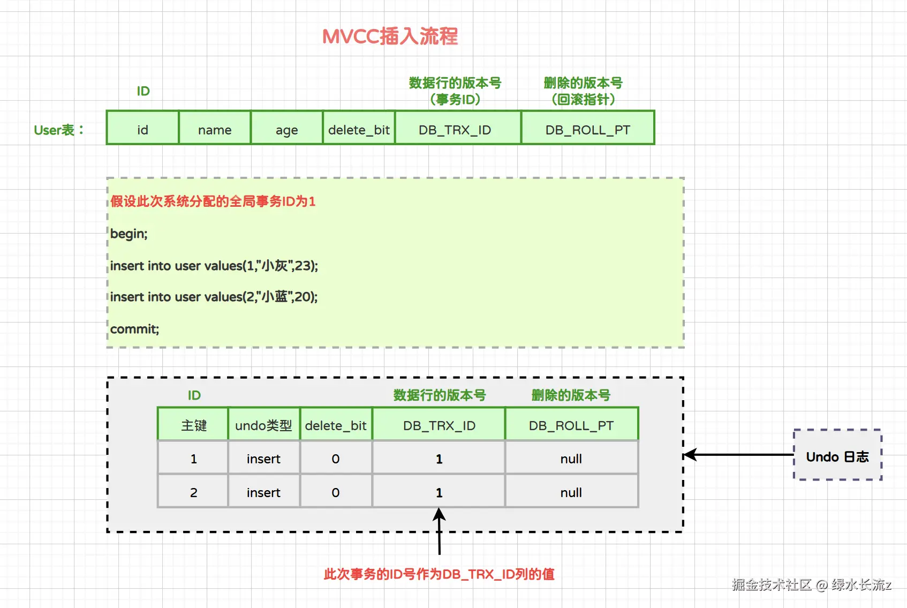

如果需要进行事务回滚，根据 undo log 中记录的主键进行 delete 操作即可。

#### 删除

当事务开启后，InnoDB 对于 delete 语句的流程是：

- 将被删除的行以“update 类型的 undo log”记录到 undo log 日志中。
- 将该行的事务 ID 设置为当前事务 ID，回滚指针设置为被删除前那条记录的事务 ID。
- 将删除标记设置为 1，表示该记录是被删除掉的记录。
- 更改表空间。

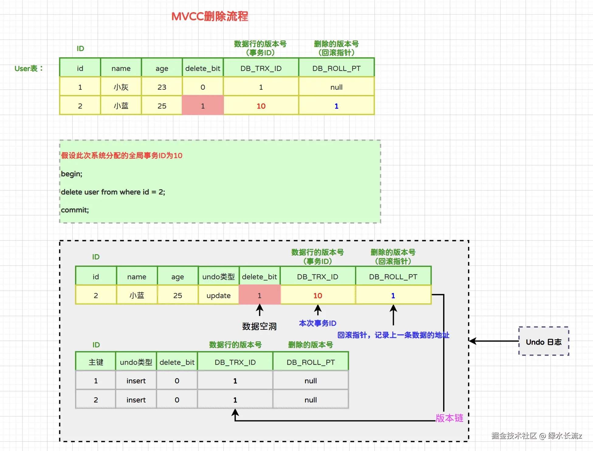

#### 修改

当事务开启后，InnoDB 对于 update 语句的流程是：

- 将被修改的行以“update 类型的 undo log”记录到 undo log 日志中。
- 将该行的事务 ID 设置为当前事务 ID，回滚指针设置为被删除前那条记录的事务 ID。
- 更改表空间。

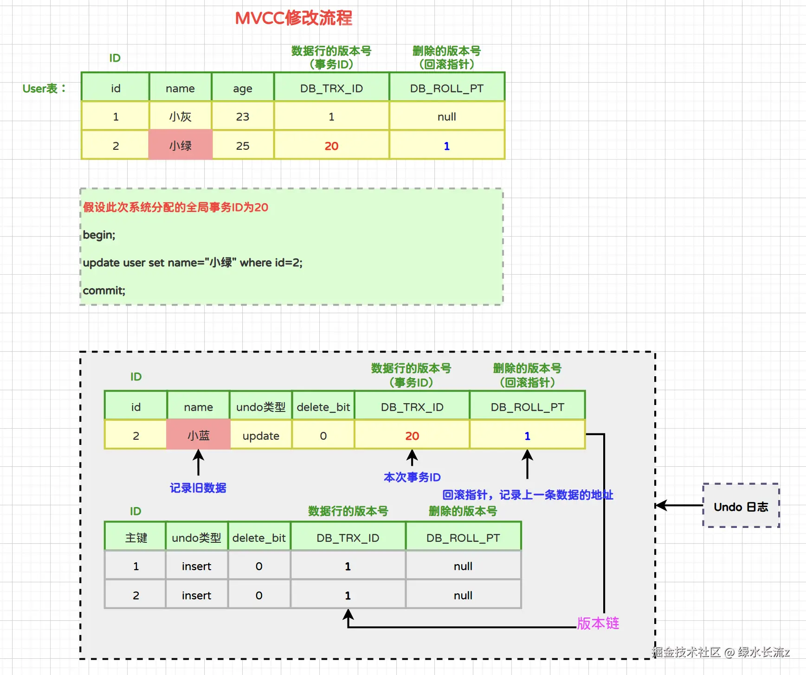

当同一条数据被修改多次，那么通过数据的事务 ID 和回滚指针能够形成一个非常好的修改链路：

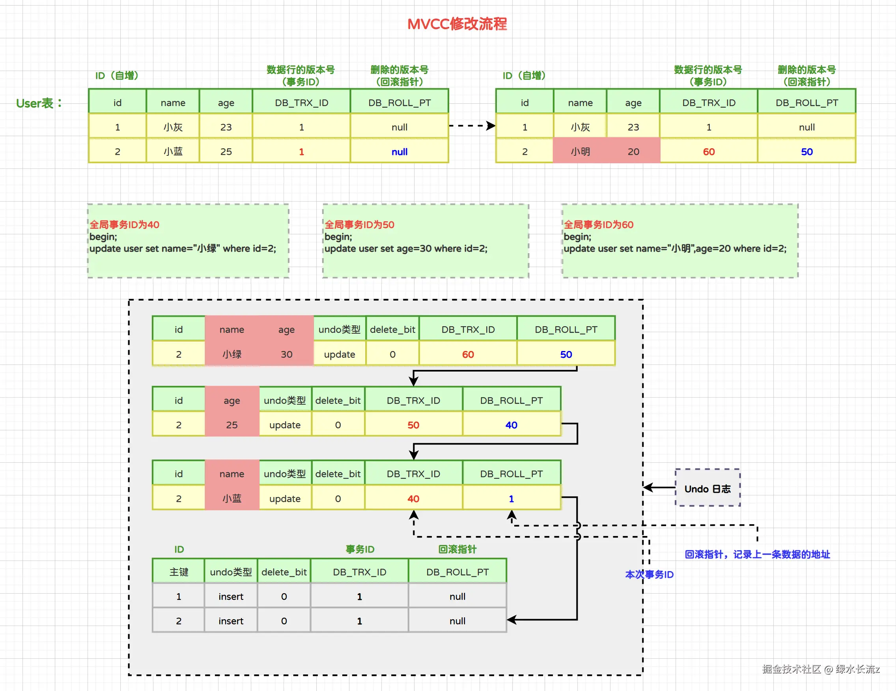

### Read View（读视图）

#### 作用

1. 事务进行快照读操作时会生成读视图，在该事务执行快照读的那一刻，会生成数据库系统当前的一个快照，记录并维护系统当前活跃事务的 ID（没有 commit，当每个事务开启时，都会被分配一个 ID，这个 ID 是递增的，所以越新的事务，ID 值越大），是系统中当前不应该被本事务看到的其他事务 id 列表
2. Read View 主要是用来做可见性判断的，即当我们某个事务执行快照读的时候，对该记录创建一个 Read View 读视图，把它比作条件用来判断当前事务能够看到哪个版本的数据，既可能是当前最新的数据，也有可能是该行记录的 undo log 里面的某个版本的数据

#### 属性

1. m_ids：当前系统中那些活跃（未提交）的读写事务 ID，它数据结构为一个 List
2. min_limit_id：表示在生成 ReadView 时，当前系统中活跃的读写事务中最小的事务 id，即 m_ids 中的最小值
3. max_limit_id：表示在生成 ReadView 时，系统中应该分配给下一个事务的 id 值
4. createor_trx_id：创建当前 ReadView 的事务 ID


#### 匹配规则

1. 如果数据事务 ID（trx_id < min_limit_id），表明生成该版本的事务在生成 Read View 前，已经提交（因为事务 ID 是递增的），所以该版本可以被当前事务访问
2. 如果（trx_id >= max_limit_id），表明生成该版本的事务在生成 Read View 后才生成，所以该版本不可以被当前事务访问
3. 如果（min_limit_id <= trx_id < max_limit_id），需要分 3 种情况讨论
+ 如果 m_ids 包含 trx_id，则代表 Read View 生成时刻，这个事务还未提交，但是如果数据的 trx_id 等于 creator_trx_id 的话，表明数据是自己生成的，因此是可见的
+ 如果 m_ids 包含 trx_id，并且 trx_id 不等于 creator_trx_id，则 Read View 生成时，事务未提交，并且不是自己生成的，所以当前事务也是看不见的
+ 如果 m_ids 不包含 trx_id，则说明你这个事务在 Read View 生成之前就已经提交了，修改的结果当前事务是能看见的

### 实现原理分析
查询一条记录基于 MVCC 的流程：

1. 获取事务自己的版本号，即事务 ID
2. 获取 Read View
3. 查询得到的数据，然后 Read View 中的事务版本号进行比较
4. 如果不符合 Read View 的可见性规则，即需要 Undo log 中历史快照
5. 最后返回符合规则的数据

InnoDB 实现 MVCC，是通过 Read View+Undo Log 实现的，Undo Log 保存了历史快照，Read View 可见性规则帮助判断当前版本的数据是否可见

#### 读已提交（RC），存在不可重复读问题的分析
1. 创建 core_user 表，插入一条初始化数据，如下：


2. 隔离级别设置为读已提交（RC），事务 A 和事务 B 同时对 core_user 表进行查询和修改操作


3. 最后事务 A 查询到的结果是 name = 曹操的记录，基于 MVCC 来分析执行流程
+ A 开启事务，首先得到一个事务 ID 为 100
+ B 开启事务，得到事务 ID 为 101
+ 事务 A 生成一个 Read View，对应的值如下

| 变量           | 值      |
| -------------- | ------- |
| m_ids          | 100,101 |
| max_limit_id   | 102     |
| min_limit_id   | 100     |
| creator_trx_id | 100     |

4. 回到版本链：开始从版本链中挑选可见的记录


由图可以看出，最新版本的列 name 的内容是孙权，该版本的 trx_id 值为 100。开始执行 Read View 可见性规则校验

```plsql
min_limit_id(100)<=trx_id(100)<102
creator_trx_id=trx_id=100
```

由此可得，trx_id = 100 的这个记录，当前事务是可见的，所以查到是 name 为孙权的记录。事务 B 进行修改操作，把名字改为曹操。把原数据拷贝到 undo log，然后对数据进行修改，标记事务 ID 和上一个数据版本在 undo log 的地址


5. 提交事务，事务 A 再次执行查询操作，新生成一个 Read View，Read View 对应的值如下：

| 变量           | 值   |
| -------------- | ---- |
| m_ids          | 100  |
| max_limit_id   | 102  |
| min_limit_id   | 100  |
| creator_trx_id | 100  |

6. 然后再次回到版本链：从版本链中挑选可见的记录


从图可得，最新版本的列 name 的内容是曹操，该版本的 trx_id 值为 101。开始执行 Read View 可见性规则校验：min_limit_id(100)<= trx_id(101)< max_limit_id(102)，但是，trx_id = 101，不属于 m_ids 集合。因此，trx_id = 101 这个记录，对于当前事务是可见的。所以 SQL 查询到的是 name 为曹操的记录

综上所述，在读已提交（RC）隔离级别下，同一个事务里，两个相同的查询，读取同一条记录（id = 1），却返回了不同的数据，因此 RC 隔离级别，存在不可重复读并发问题

**其他**

1. 案例 1

| session-01                                  | session-02                            |
| ------------------------------------------- | ------------------------------------- |
| begin;                                      |                                       |
|                                             | begin;                                |
|                                             | insert into user values(2, "小蓝",20); |
|                                             | commit;                               |
| select * from user; -- 能否查询到小蓝记录？ |                                       |
| rollback;                                   |                                       |

Tips：小蓝这条记录属于快照拍下之前就提交的事务（id < min_id），可以查询到。

2. 案例 2

| session-01                                                   | session-02                            |
| ------------------------------------------------------------ | ------------------------------------- |
| begin;                                                       |                                       |
|                                                              | begin;                                |
| select * from user; -- 拍下了快照                            |                                       |
|                                                              | insert into user values(2, "小蓝",20); |
|                                                              | commit;                               |
| -- 对于 RC 来说，这是重新拍下了快照 select * from user; -- 能否查询到小蓝？ |                                       |
| rollback;                                                    |                                       |

Tips：在新的快照中，小蓝这条记录属于拍照拍下前就已经提交的数据（id < min_id），可以被查询到。

3. 案例 3

| session-01                                                   | session-02                            |
| ------------------------------------------------------------ | ------------------------------------- |
| begin;                                                       |                                       |
| select * from user;                                          |                                       |
|                                                              | begin;                                |
|                                                              | insert into user values(2, "小蓝",20); |
|                                                              | commit;                               |
| -- 对于 RC 来说，这是重新拍下了快照 select * from user; -- 能否查询到小蓝？ |                                       |
| rollback;                                                    |                                       |

Tips：在新的快照中，小蓝这条记录属于拍照拍下前就已经提交的数据（id < min_id），可以被查询到。

#### 可重复读（RR），解决不可重复读问题的分析
实际上，各种事务隔离级别下的 Read View 工作方式是不一样的，RR 可以解决不可重复读问题，就是跟 Read View 工作方式有关

1. 在读已提交（RC）隔离级别下，同一个事务里面，每一次查询都会产生一个新的 Read View 副本，这样就可能造成同一个事务里前后读取数据可能不一致的问题（不可重复读并发问题）

2. 在可重复读（RR）隔离级别下，一个事务里只会获取一次 Read View，都是副本共用的，从而保证每次查询的数据都是一样的


1. 事务 A 再次执行查询操作，复用老的 Read View 副本，Read View 对应的值如下：

| 变量           | 值      |
| -------------- | ------- |
| m_ids          | 100,101 |
| max_limit_id   | 102     |
| min_limit_id   | 100     |
| creator_trx_id | 100     |

2. 再次回到版本链：从版本链中挑选可见的记录


从图可得，最新版本的列 name 的内容是曹操，该版本的 trx_id 值为 101。开始执行 Read View 可见性规则校验：

```plsql
min_limit_id(100)<=trx_id(101)<max_limit_id(102)
因为m_ids{100,101}包含trx_id(101)
并且creator_trx_id(100)不等于trx_id(101)
```

所以，trx_id = 101 这个记录，对于当前事务是不可见的。这时候，版本链 roll_pointer 跳到下一个版本，trx_id = 100 这个记录，再次校验是否可见：

```plsql
min_limit_id(100)<=trx_id(100)<max_limit_id(102)
因为m_ids{100,101}包含trx_id(100)
并且creator_trx_id(100)等于trx_id(100)
```

所以，trx_id = 100 这个记录，对于当前事务是可见的，即在可重复读（RR）隔离级别下，复用老的 Read View 副本，解决了不可重复读问题

**其他**

1. 案例 1

| session-01                                  | session-02                            |
| ------------------------------------------- | ------------------------------------- |
| begin;                                      |                                       |
|                                             | begin;                                |
|                                             | insert into user values(2, "小蓝",20); |
|                                             | commit;                               |
| select * from user; -- 能否查询到小蓝记录？ |                                       |
| rollback;                                   |                                       |

Tips：小蓝这条记录属于快照拍下之前就提交的事务（id < min_id），可以查询到。

2. 案例 2

| session-01                              | session-02                            |
| --------------------------------------- | ------------------------------------- |
| begin;                                  |                                       |
|                                         | begin;                                |
| select * from user; -- 拍下了快照       |                                       |
|                                         | insert into user values(2, "小蓝",20); |
|                                         | commit;                               |
| select * from user; -- 能否查询到小蓝？ |                                       |
| rollback;                               |                                       |

Tips：小蓝这条记录属于快照拍下后才存在的数据（id >= max_id），该记录对于快照来说属于未知事务的数据，因此查询不到。

3. 案例 3

| session-01                             | session-02                            |
| -------------------------------------- | ------------------------------------- |
| begin;                                 |                                       |
|                                        | begin;                                |
|                                        | insert into user values(2, "小蓝",20); |
| select * from user; --能否查询到小蓝？ |                                       |
|                                        | commit;                               |
| rollback;                              |                                       |

Tips：小蓝这条记录属于快照拍下之前就存在的事务，但还未提交，属于活跃事务 id 集合（trx_ids）中的事务的数据，因此查询不到。

4. 案例 4

| session-01                              | session-02                            |
| --------------------------------------- | ------------------------------------- |
| begin;                                  |                                       |
| select * from user;                     |                                       |
|                                         | begin;                                |
|                                         | insert into user values(2, "小蓝",20); |
|                                         | commit;                               |
| select * from user; -- 能否查询到小蓝？ |                                       |
| rollback;                               |                                       |

Tips：小蓝这条记录属于快照拍下后才存在的数据（id >= max_id），该记录对于快照来说属于未知事务的数据，因此查询不到。

#### MVCC 能否解决幻读？

**幻读解决的情况**

1. 快照读避免幻读


在执行第一个查询语句后，会创建一个 Read View，后续的查询语句利用这个 Read View，通过这个 Read View 就可以在 undo log 版本链找到事务开始时的数据，所以事务过程中每次查询的数据都是一样的，即使中途有其他事务插入了新纪录，是查询不出来这条数据的，所以就很好了避免幻读问题。

2. 当前读避免幻读

MySQL 里除了普通查询是快照读，其他都是当前读，比如 update、insert、delete，这些语句执行前都会查询最新版本的数据，然后再做进一步的操作。另外，select ... for update 这种查询语句是当前读，每次执行的时候都是读取最新的数据。


这时候，事务 B 插入的记录，就会被事务 A 的第二条查询语句查询到（因为是当前读），这样就会出现前后两次查询的结果集合不一样，这就出现了幻读。所以，Innodb 引擎为了解决「可重复读」隔离级别使用「当前读」而造成的幻读问题，就引出了间隙锁。

假设，表中有一个范围 id 为（3，5）间隙锁，那么其他事务就无法插入 id = 4 这条记录了，这样就有效的防止幻读现象的发生。


事务 A 执行了这面这条锁定读语句后，就在对表中的记录加上 id 范围为 (2, +∞] 的 next-key lock（next-key lock 是间隙锁+记录锁的组合）。然后，事务 B 在执行插入语句的时候，判断到插入的位置被事务 A 加了 next-key lock，于是事物 B 会生成一个插入意向锁，同时进入等待状态，直到事务 A 提交了事务。这就避免了由于事务 B 插入新记录而导致事务 A 发生幻读的现象。

**产生幻读的情况**

1. 幻读现象 1


在可重复读隔离级别下，事务 A 第一次执行普通的 select 语句时生成了一个 ReadView，之后事务 B 向表中新插入了一条 id = 5 的记录并提交。接着，事务 A 对 id = 5 这条记录进行了更新操作，在这个时刻，这条新记录的 trx_id 隐藏列的值就变成了事务 A 的事务 id，之后事务 A 再使用普通 select 语句去查询这条记录时就可以看到这条记录了，于是就发生了幻读。

因为这种特殊现象的存在，所以我们认为 MySQL Innodb 中的 MVCC 并不能完全避免幻读现象

2. 幻读现象 2
+ T1 时刻：事务 A 先执行「快照读语句」：select * from t_test where id > 100 得到了 3 条记录。
+ T2 时刻：事务 B 往插入一个 id = 200 的记录并提交；
+ T3 时刻：事务 A 再执行「当前读语句」 select * from t_test where id > 100 for update 就会得到 4 条记录，此时也发生了幻读现象。

要避免这类特殊场景下发生幻读的现象的话，就是尽量在开启事务之后，马上执行 select ... for update 这类当前读的语句，因为它会对记录加 next-key lock，从而避免其他事务插入一条新记录

**总结**

1. 针对快照读（普通 select 语句），是通过 MVCC 方式解决了幻读。
2. 针对当前读（select ... for update 等语句），是通过 next-key lock（记录锁+间隙锁）方式解决了幻读。
3. 如果事务中都是用快照读，那么不会产生幻读的问题，但是快照读和当前读一起使用的时候就会产生幻读

## 日志

### 分类

1. 逻辑日志：可以简单理解为记录的就是 sql 语句，例如：事务中的 UPDATE、DELETE 以及 INSERT 操作
2. 物理日志：mysql 数据最终是保存在数据页中的，物理日志记录的就是数据页变更，例如：一条更新请求对应的初始值以及更新值，在数据页做了什么

在 InnoDB 存储引擎中，所有的数据都被逻辑地存放在表空间中，表空间（tablespace）是存储引擎中最高的存储逻辑单位，在表空间的下面又包括段（segment）、区（extent）、页（page）

页是 MySQL 中磁盘和内存交换的基本单位，也是 MySQL 管理存储空间的基本单位。同一个数据库实例的所有表空间都有相同的页大小，默认情况下，表空间的页大小都为 16KB。一次最少从磁盘读取 16KB 内容到内存中，一次最少把内存中 16KB 内容刷新到磁盘中

### 作用
1. undo log（回滚日志）：是 Innodb 存储引擎层生成的日志，实现了事务中的原子性，主要用于事务回滚和 MVCC。
2. redo log（重做日志）：是 Innodb 存储引擎层生成的日志，实现了事务中的持久性，主要用于掉电等故障恢复；
3. binlog （归档日志）：是 Server 层生成的日志，主要用于数据备份和主从复制；

### change buffer

当需要更新一个数据页时，如果数据页在内存中就直接更新；而如果这个数据页还没有在内存中的话，在不影响数据一致性的前提下，InnoDB 会将这些更新操作缓存在 change buffer 中。

这样就不需要从磁盘中读入这个数据页了，在下次查询需要访问这个数据页的时候，将数据页读入内存，然后执行 change buffer 中与这个页有关的操作。通过这种方式就能保证这个数据逻辑的正确性。

注意：唯一索引的更新就不能使用 change buffer，实际上也只有普通索引可以使用。

适用场景：

1. 对于写多读少的业务来说，页面在写完以后马上被访问到的概率比较小，此时 change buffer 的使用效果最好。这种业务模型常见的就是账单类、日志类的系统。

2. 反过来，假设一个业务的更新模式是写入之后马上会做查询，那么即使满足了条件，将更新先记录在 change buffer，但之后由于马上要访问这个数据页，会立即触发 merge 过程。这样随机访问 IO 的次数不会减少，反而增加了 change buffer 的维护代价

**第一幕：Change Buffer 是个啥？**

Change Buffer，顾名思义，就是一个用来缓存变更（changes）的缓冲区（buffer）。它主要针对的是 **非唯一二级索引**（non-unique secondary index）的写入操作。

为什么是二级索引？为什么是非唯一的？ 别着急，听我慢慢道来。

- **二级索引：** 顾名思义，是相对于主键索引来说的。主键索引是数据的“身份证”，唯一且有序；而二级索引则是为了方便查询而建立的，可以理解为数据的“目录”。
- **非唯一：** 这点很重要！ Change Buffer 只对非唯一索引有效。如果索引是唯一的，那么每次写入都需要检查唯一性约束，就无法享受到 Change Buffer 带来的好处了。

换句话说，当你要修改的数据的索引不在内存中，MySQL 会将对这些索引的变更信息缓存到 Change Buffer 中，而不需要立即从磁盘读取索引页，大大提高了写入速度。

你可以把 Change Buffer 想象成一个“待办事项”列表，记录着需要应用到磁盘上的索引变更。

**第二幕：Change Buffer 的工作原理**

Change Buffer 的工作流程大致如下：

1. **写入操作：** 当你执行一个 UPDATE、INSERT 或 DELETE 操作时，如果涉及到的非唯一二级索引页不在 Buffer Pool（缓冲池）中，MySQL 不会立即去磁盘上查找并修改索引页。
2. **缓存变更：** 而是将这次变更的信息（例如，索引键值、表名、位置等）记录到 Change Buffer 中。
3. **合并操作（Merge）：** 在适当的时候（例如，系统空闲时、有查询需要访问这些索引页时、数据库关闭时），MySQL 会将 Change Buffer 中的变更信息合并到磁盘上的索引页中，这个过程称为 Merge。

你可以用一个表格来更清晰地了解这个过程：

| 步骤 | 操作                                             | 备注                                          |
| :--- | :----------------------------------------------- | :-------------------------------------------- |
| 1    | 写入操作（INSERT/UPDATE/DELETE）                 | 涉及非唯一二级索引，且索引页不在 Buffer Pool 中 |
| 2    | 写入 Change Buffer                                | 记录变更信息，包括索引键值、表名、位置等      |
| 3    | 触发 Merge 操作                                    | 系统空闲、查询需要访问、数据库关闭等          |
| 4    | 从磁盘读取索引页到 Buffer Pool                    | 如果索引页不在 Buffer Pool 中                   |
| 5    | 应用 Change Buffer 中的变更到 Buffer Pool 中的索引页 |                                               |
| 6    | 将修改后的索引页刷到磁盘                         |                                               |

**第三幕：Change Buffer 的优点与局限**

Change Buffer 的优点显而易见：

- **提高写入性能：** 避免了频繁的磁盘 I/O，尤其是在大量写入操作的情况下，性能提升非常明显。
- **减少磁盘压力：** 降低了磁盘的负载，延长了磁盘的使用寿命。

但是，Change Buffer 也不是万能的，它也有一些局限性：

- **增加了复杂度：** 引入了额外的缓存机制，增加了系统的复杂性。
- **Merge 操作的开销：** Merge 操作本身也需要消耗资源，尤其是在数据库负载较高时，可能会对性能产生一定的影响。
- **数据一致性风险：** 虽然 MySQL 保证了数据的一致性，但在 Merge 操作未完成之前，可能会出现数据短暂的不一致。
- **只对非唯一二级索引有效：** 这是最大的限制，对于唯一索引和主键索引，Change Buffer 无能为力。

**第四幕：Change Buffer 的配置与管理**

MySQL 提供了一些参数来配置和管理 Change Buffer：

- `innodb_change_buffer_max_size`: 控制 Change Buffer 占 Buffer Pool 的百分比。默认值是 25，表示 Change Buffer 最多可以使用 Buffer Pool 的 25%。 可以根据实际情况调整这个值，但要注意不要设置得太大，以免影响 Buffer Pool 的正常使用。

- `innodb_change_buffering` 控制 Change Buffer 的启用和禁用。 可以设置为以下值：
  - `all`: 缓存所有类型的操作（INSERT, UPDATE, DELETE）。
   - `none`: 禁用 Change Buffer。
  - `inserts`: 只缓存 INSERT 操作。
  - `deletes`: 只缓存 DELETE 操作。
  - `changes`: 缓存 INSERT 和 DELETE 操作。
  - `purges`: 缓存物理删除操作。

你可以使用以下命令来查看 Change Buffer 的状态：

```sql
SHOW ENGINE INNODB STATUSG
```

在输出结果中，可以找到关于 Change Buffer 的信息，例如：

```
-------------------------------------
INSERT BUFFER AND ADAPTIVE HASH INDEX
-------------------------------------
Ibuf: size 1, free list len 0, seg size 2, 0 merges
merged operations:
 insert 0, delete mark 0, delete 0
discarded operations:
 insert 0, delete mark 0, delete 0
```

**第五幕：Change Buffer 的使用场景**

Change Buffer 最适合以下场景：

- **写入密集型应用：** 例如，日志系统、消息队列等。
- **二级索引较多的表：** 如果你的表有很多二级索引，那么 Change Buffer 可以显著提高写入性能。
- **读少写多的应用：** Change Buffer 的优势在于提高写入性能，如果读操作较多，那么 Merge 操作可能会对性能产生负面影响。

**反例：**

- **读写均衡型应用：** 如果你的应用既有大量的读操作，又有大量的写操作，那么 Change Buffer 可能不会带来明显的性能提升，甚至可能降低性能。
- **唯一索引较多的表：** 如果你的表有很多唯一索引，那么 Change Buffer 几乎没有作用。

**第六幕：Change Buffer 的注意事项**

在使用 Change Buffer 时，需要注意以下几点：

- **监控 Merge 操作：** 定期监控 Merge 操作的频率和耗时，如果 Merge 操作过于频繁或耗时过长，可能需要调整 Change Buffer 的配置。
- **合理设置 Change Buffer 的大小：** Change Buffer 的大小应该根据实际情况进行调整，过大或过小都会影响性能。
- **关注数据一致性：** 虽然 MySQL 保证了数据的一致性，但在 Merge 操作未完成之前，可能会出现数据短暂的不一致，需要注意这一点。
- **定期维护索引：** 定期进行索引优化和重建，可以提高 Merge 操作的效率。

**第七幕：Change Buffer 与 Buffer Pool 的关系**

Change Buffer 和 Buffer Pool 是两个不同的缓存机制，但它们之间又密切相关。

- **Buffer Pool：** 用于缓存数据页和索引页，是 MySQL 最主要的缓存机制。
- **Change Buffer：** 用于缓存非唯一二级索引的变更信息，是 Buffer Pool 的补充。

Change Buffer 可以看作是 Buffer Pool 的一个扩展，它利用 Buffer Pool 的内存空间来缓存变更信息，从而提高写入性能。

你可以把 Buffer Pool 想象成一个大的图书馆，存放着各种各样的书籍（数据页和索引页）。而 Change Buffer 就像一个便签纸，记录着对某些书籍的修改意见。当有人需要借阅这些书籍时，图书馆管理员会先把便签纸上的修改意见应用到书籍上，然后再把书籍借给借阅者。

**第八幕：Change Buffer 的未来发展**

随着硬件技术的不断发展，Change Buffer 也在不断进化。未来，我们可以期待 Change Buffer 在以下方面有所改进：

- **更智能的 Merge 策略：** 根据系统负载和数据访问模式，动态调整 Merge 操作的频率和优先级。
- **更高效的存储结构：** 采用更高效的存储结构来存储变更信息，减少内存占用和 Merge 操作的开销。
- **更广泛的应用场景：** 将 Change Buffer 应用于更多的索引类型和操作类型，提高数据库的整体性能。

### 区别

#### redo log 与 binlog

1. 文件大小：redo log 的大小是固定的；binlog 可通过配置参数 max_binlog_size 设置每个 binlog 文件的大小
2. 实现方式：redo log 是 InnoDB 引擎层实现的，并不是所有引擎都有；binlog 是 Server 层实现的，所有引擎都可以使用 binlog 日志
3. 记录方式：redo log 采用循环写的方式记录，当写到结尾时，会回到开头循环写日志；binlog 通过追加的方式记录，当文件大小大于给定值后，后续的日志会记录到新的文件上
4. 适用场景：redo log 适用于崩溃恢复（crash-safe）；binlog 适用于主从复制和数据恢复
5. 内容形式：InnoDB 存储引擎层面的重做日志是物理日志；binlog 是逻辑日志，记录是对应的 SQL 语句

注意：如果不小心整个数据库的数据被删除了，不可以使用 redo log 文件恢复，只能使用 binlog 文件恢复。因为 redo log 文件是循环写，是会边写边擦除日志的，只记录未被刷入磁盘的数据的物理日志，已经刷入磁盘的数据都会从 redo log 文件里擦除。binlog 文件保存的是全量的日志，也就是保存了所有数据变更的情况，理论上只要记录在 binlog 上的数据，都可以恢复，所以如果不小心整个数据库的数据被删除了，得用 binlog 文件恢复数据

#### redo log 与 undo log

1. redo log 记录了此次事务「完成后」的数据状态，记录的是更新之后的值；
2. undo log 记录了此次事务「开始前」的数据状态，记录的是更新之前的值；

### binlog（归档日志）

#### 日志写入

1. binlog 用于记录数据库执行的写入性操作（不包括查询）信息，以二进制的形式保存在磁盘中。
2. binlog 是 mysql 的逻辑日志，并且由 Server 层进行记录，使用任何存储引擎的 mysql 数据库都会记录 binlog 日志。
3. binlog 是通过追加的方式进行写入的，可以通过 max_binlog_size 参数设置每个 binlog 文件的大小，当文件大小达到给定值之后，会生成新的文件来保存日志

#### 使用场景

1. 主从复制：在 Master 端开启 binlog，然后将 binlog 发送到各个 Slave 端，Slave 端重放 binlog 从而达到主从数据一致
2. 数据恢复：通过使用 mysqlbinlog 工具来恢复数据

#### 为什么有了 binlog，还要有 redo log？

redo log 主要用于 MySQL 异常重启后的一种数据恢复手段，确保了数据的一致性。

其次是为了配合 MySQL 的 WAL 机制。因为 MySQL 进行更新操作，为了能够快速响应，所以采用了异步写回磁盘的技术，写入内存后就返回。但是这样，会存在 crash 后内存数据丢失的隐患，而 redo log 具备 crash safe 的能力

**crash-safe**

指数据库系统在发生意外崩溃或故障时，能够保证数据的一致性和持久性

**binlog 可以保证 crash-safe 么？**

binlog 不可以做 crash safe，因为 crash 之前，binlog 可能没有写入完全 MySQL 就挂了。所以需要配合 redo log 才可以进行 crash safe。

**为什么 redo log 具有 crash-safe 的能力，是 binlog 无法替代的？**

1. redo log 可确保 innoDB 判断哪些数据已经刷盘，哪些数据还没有

- redo log 和 binlog 有一个很大的区别就是，一个是循环写，一个是追加写。也就是说 redo log 只会记录未刷盘的日志，已经刷入磁盘的数据都会从 redo log 这个有限大小的日志文件里删除。binlog 是追加日志，保存的是全量的日志。
- 当数据库 crash 后，想要恢复未刷盘但已经写入 redo log 和 binlog 的数据到内存时，binlog 是无法恢复的。虽然 binlog 拥有全量的日志，但没有一个标志让 innoDB 判断哪些数据已经刷盘，哪些数据还没有。
- 但 redo log 不一样，只要刷入磁盘的数据，都会从 redo log 中抹掉，因为是循环写！数据库重启后，直接把 redo log 中的数据都恢复至内存就可以了。

2. 如果 redo log 写入失败，说明此次操作失败，事务也不可能提交

- redo log 每次更新操作完成后，就一定会写入日志，如果写入失败，说明此次操作失败，事务也不可能提交。
- redo log 内部结构是基于页的，记录了这个页的字段值变化，只要 crash 后读取 redo log 进行重放，就可以恢复数据。

### redo log（重做日志）
#### Buffer Pool
InnoDB 作为 MySQL 的存储引擎，数据是存放在磁盘中的，但如果每次读写数据都需要磁盘 IO，效率会很低，为此，InnoDB 提供了缓存（Buffer Pool），InnoDB 会把存储的数据划分为若干个页，以页作为磁盘和内存交互的单位，一个页的默认大小为 16KB，因此 Buffer Pool 同样需要按页来划分，在 MySQL 启动的时候，InnoDB 会为 Buffer Pool 申请一片连续的内存空间，然后按照默认的 16KB 大小划分出一个个页，Buffer Pool 中的页就叫做缓存页

当从数据库读取数据时，会首先从 Buffer Pool 中读取，如果 Buffer Pool 中没有，则从磁盘中读取后放入 Buffer Pool，当向数据库写入数据时，会首先写入 Buffer Pool，Buffer Pool 中修改的数据定期刷新到磁盘中（这一过程称为刷脏）


#### redo log 的出现
Buffer Pool 的使用大大提高了读写数据的效率，但是也带来了新的问题：如果 MySQL 宕机，而此时 Buffer Pool 中修改的数据还没有刷新到磁盘，就会导致数据的丢失，事务的持久性无法得到保证

于是 redo log 被引入来解决这个问题，当数据修改时，除了修改 Buffer Pool 中的数据，还会在 redo log 记录这次操作，当事务提交时，会调用 fsync 接口对 redo log 进行刷盘。如果 MySQL 宕机，重启时可以读取 redo log 中的数据，对数据库进行恢复。redo log 采用的是 WAL 方法：即当事务提交时，先写重做日志，再修改页（先修改缓冲池，再刷新到磁盘），保证了数据不会因 MySQL 宕机而丢失，从而满足了持久性


既然 redo log 也需要在事务提交时将日志写入磁盘，为什么它比直接将 Buffer Pool 中修改的数据写入磁盘（即刷脏）要快呢？

1. 随机 IO：读写的内容分散在磁盘的不同位置，需要来回查找所以效率低
2. 顺序 IO：读写的内容集中在磁盘的一块，从前到后依次读取，免去了查找的过程，所以效率高

**mysql 是如何保证一致性的呢？**

最简单的做法是在每次事务提交的时候，将该事务涉及修改的数据页全部刷新到磁盘中。但是这么做会有严重的性能问题，主要体现在两个方面：

1. 刷脏是随机 IO，因为每次修改的数据位置随机，需要先找到写入位置，然后才写到磁盘，但写 redo log 是追加操作，属于顺序 IO
2. 刷脏是以数据页为单位的，MySQL 默认页大小是 16KB，一个 Page 上一个小修改都要整页写入，而 redo log 中只包含真正需要写入的部分，无效 IO 大大减少


#### redo log 详解
redo log 是 InnoDB 存储引擎生成的日志，实现了事务中的持久性，主要用于掉电等故障恢复，主要包括两部分：内存中的日志缓冲（redo log buffer）和磁盘上的日志文件（redo log file）


**WAL 技术**

mysql 每执行一条 DML 语句，先将记录写入 redo log buffer（用户空间），后续某个时间点再一次性将多个操作记录写到 redo log file（磁盘）。这种先写日志、再写磁盘的技术就是 WAL（Write-Ahead Logging）技术

mysql 支持三种将 redo log buffer 写入 redo log file 的时机，可以通过 innodb_flush_log_at_trx_commit 参数配置，各参数值含义如下：

1. 0（延迟写）：事务提交时不会将 redo log buffer 中日志写入到 os buffer，而是每秒写入 os buffer 并调用 fsync()写入到 redo log file 中。即设置为 0 时是（大约）每秒刷新写入到磁盘中的，当系统崩溃，会丢失 1 秒钟的数据
2. 1（实时写，实时刷）：事务每次提交都会将 redo log buffer 中的日志写入 os buffer 并调用 fsync()刷到 redo log file 中。这种方式即使系统崩溃也不会丢失任何数据，但是因为每次提交都写入磁盘，IO 的性能较差
3. 2（实时写，延迟刷）：每次提交都仅写入到 os buffer，然后每秒调用 fsync()将 os buffer 中的日志写入到 redo log file


#### redo log 记录形式
redo log 实际上记录数据页的变更，而这种变更记录是没必要全部保存，因此 redo log 实际上采用了大小固定、循环写入的方式，当写到结尾时，会回到开头循环写日志


在 Innodb 中，既有 redo log 需要刷盘，还有数据页也需要刷盘，redo log 存在的意义主要就是降低对数据页刷盘的要求。在上图中

1. write pos 表示 redo log 当前记录的 LSN（逻辑序列号）位置
2. check point 表示数据页更改记录刷盘后对应 redo log 所处的 LSN（逻辑序列号）位置
3. write pos 到 check point 之间的部分是 redo log 空着的部分，用于记录新的记录
4. check point 到 write pos 之间是 redo log 待落盘的数据页更改记录
5. 当 write pos 追上 check point 时，会先推动 check point 向前移动，空出位置再记录新的日志

注意：

1. 启动 Innodb 的时候，不管上次是正常关闭还是异常关闭，总是会进行恢复操作，因为 redo log 记录的是数据页的物理变化，因此恢复的时候速度比逻辑日志（如 binlog）要快很多。重启 Innodb 时，首先会检查磁盘中数据页的 LSN，如果数据页的 LSN 小于日志中的 LSN，则会从 checkpoint 开始恢复
2. 在宕机前正处于 checkpoint 的刷盘过程，且数据页的刷盘进度超过了日志页的刷盘进度，此时会出现数据页中记录的 LSN 大于日志中的 LSN，这时超出日志进度的部分将不会重做，因为这本身就表示已经做的事情无需再重做

#### redo log 执行流程


1. MySQL 客户端将请求语句 update T set a = 1 where id = 666，发往 MySQL Server 层。
2. MySQL Server 层接收到 SQL 请求后，对其进行分析、优化、执行等处理工作，将生成的 SQL 执行计划发到 InnoDB 存储引擎层执行。
3. InnoDB 存储引擎层将 a 修改为 1 的这个操作记录到内存中。
4. 记录到内存以后会修改 redo log 的记录，会在添加一行记录，其内容是需要在哪个数据页上做什么修改。
5. 此后，将事务的状态设置为 prepare ，说明已经准备好提交事务了。
6. 等到 MySQL Server 层处理完事务以后，会将事务的状态设置为 commit，也就是提交该事务。
7. 在收到事务提交的请求以后，redo log 会把刚才写入内存中的操作记录写入到磁盘中，从而完成整个日志的记录过程。

#### 两阶段提交

MySQL 将 redo log 的写入拆成了两个步骤：prepare 和 commit，中间再穿插写入 binlog，这就是 "两阶段提交"。


**为什么需要两阶段提交呢?**

如果不用两阶段提交的话，可能会出现这样情况

1. 先写 redo log，crash 后 binlog 备份恢复时少了一次更新，与当前数据不一致。

2. 先写 binlog，crash 后，由于 redo log 没写入，事务无效，所以后续 binlog 备份恢复时，数据不一致。

两阶段提交就是为了保证 redo log 和 binlog 数据的安全一致性。只有在这两个日志文件逻辑上高度一致了才能放心的使用。

在恢复数据时，redo log 状态为 commit 则说明 binlog 也成功，直接恢复数据；如果 redo log 是 prepare，则需要查询对应的 binlog 事务是否成功，决定是回滚还是执行

#### 当数据库 crash 后，如何恢复未刷盘的数据到内存中？

根据 redo log 和 binlog 的两阶段提交，未持久化的数据分为几种情况：

1. change buffer 写入，redo log 虽然做了 fsync 但未 commit，binlog 未 fsync 到磁盘，这部分数据丢失。
2. change buffer 写入，redo log fsync 未 commit，binlog 已经 fsync 到磁盘，先从 binlog 恢复 redo log，再从 redo log 恢复 change buffer。
3. change buffer 写入，redo log 和 binlog 都已经 fsync，直接从 redo log 里恢复。

#### 工作原理

首先在操作表时，会将表数据从磁盘（.idb）加载到内存缓冲池中（Buffer Pool），对表所有的操作都会记录一份到 Redo Buffer 日志（内存中的 Redo 日志）中，其根据一定的策略将数据刷新到 Redo Log 中（磁盘中的 Redo 日志）。在事务最终要提交时（执行了 commit），如果数据库或系统突然宕机，那么当数据库或系统重启时，就可以根据 Redo Log 日志中的记录进行数据的恢复。

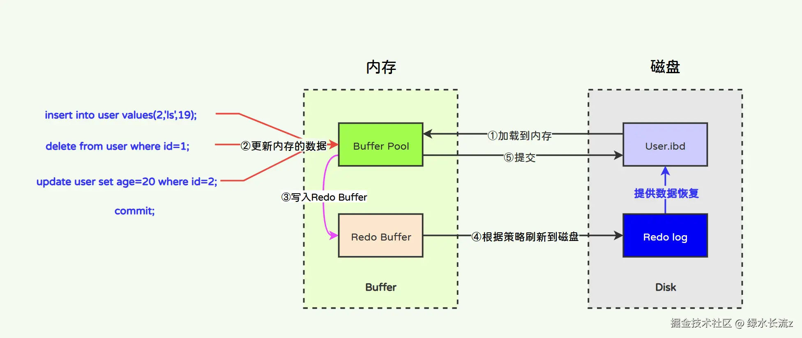

在提交事务时，为什么不直接将数据写入数据库表呢？而是要先写入 Redo Log 中呢？看似好像“多此一举”？其实不然。写入 Redo Log 的好处如下：

- 原因一：Redo Log 的结构简单。

Redo Log 记录的是物理层面上的数据修改，因此 Redo 也叫物理日志。这些修改记录包含了数据页的物理地址（Page Number）和修改的具体内容（如页内数据的前后变化）。在系统重启时，InnoDB 会读取 Redo Log 文件，并根据其中的记录重做对数据页的修改。

Redo Log 的日志格式：

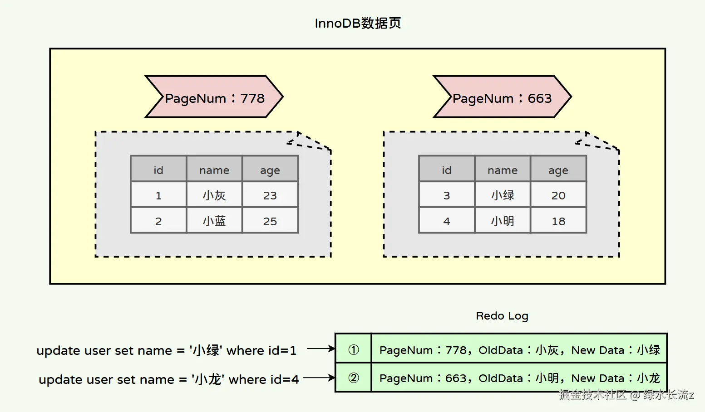

正因为 Redo Log 中记录的数据结构简单，只记录一些物理地址以及一些变更状态等信息。因此数据先写入 Redo Log 要比直接写入到表快多了。其次，Redo Log 作为“临时存储的数据区域”，当 Redo Buffer 中的数据已经到达一定大小后，Redo Buffer 也会将这部分数据写入到 Redo Log 中，此时数据还未提交，但是已经写入到磁盘中了。

- 原因二：顺序 IO 性能远高于随机 IO。

数据在 MySQL 中存储是以页为单位，事务中操作的数据可能遍布在不同的页中，如果直接写入到磁盘中对应的页中，是随机 IO 写入，效率低。

而 Redo Log 是通过往 Redo Log 日志中追加数据的方式，属于顺序 IO，效率高。这样可能会影响 Redo Log 恢复数据时的性能，但可以保证在提交时期能够快速写入 Redo Log 日志记录本次事务的更改。

### undo log（回滚日志）

原子性是通过 undo log 实现的，undo log 主要用于记录数据被修改之前的日志，在表信息修改之前会先把数据拷贝到 undo log 里，当事务进行回滚时可以通过 undo log 里的日志进行数据还原，比如：一条 INSERT 语句，对应一条 DELETE 的 undo log，对于每个 UPDATE 语句，对应一条相反的 UPDATE 的 undo  log，这样在发生错误时，就能回滚到事务之前的数据状态

Redo 属于物理日志，即记录了数据库页的物理修改操作，比如页上的哪些字节被更改，具体到物理结构上。Undo 属于逻辑日志，即记录了从逻辑角度如何撤销已经发生的变更的信息，第一步第二步该如何做等，通常包括了反向操作所需要的数据。

#### 用途

1. 保证事务进行 rollback 时的原子性和一致性，当事务进行回滚的时候可以用 undo log 的数据进行恢复
2. 用于 MVCC 快照读的数据，在 MVCC 多版本控制中，通过读取 undo log 的历史版本数据可以实现不同事务版本号都拥有自己独立的快照数据版本

#### 种类

1. insert undo log：代表事务在 insert 新记录时产生的 undo log，只在事务回滚时需要，并且在事务提交后可以被立即丢弃
2. update undo log（主要）：事务在进行 update 或 delete 时产生的 undo log，不仅在事务回滚时需要，在快照读时也需要，所以不能随便删除，只有在快速读或事务回滚不涉及该日志，对应的日志才会被 purge 线程统一清除

#### insert 类型 Undo Log

当事务开启后，执行的 insert 语句都会以“insert 类型的 undo log”记录在 undo log 日志中，本次事务插入的所有的数据行的版本号字段都为当前事务的 ID。

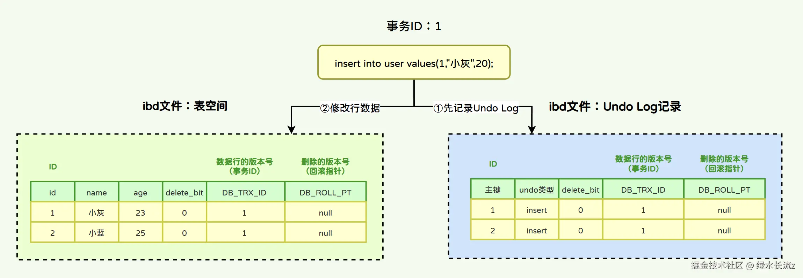

如果需要进行事务回滚，根据 undo log 中记录的主键进行 delete 操作即可。

#### delete 类型 Undo Log

当事务开启后，InnoDB 对于 delete 语句的流程是：

- 将被删除的行以“update 类型的 undo log”记录到 undo log 日志中。
- 将该行的事务 ID 设置为当前事务 ID，回滚指针设置为被删除前那条记录的事务 ID。
- 将删除标记设置为 1，表示该记录是被删除掉的记录。
- 更改表空间。

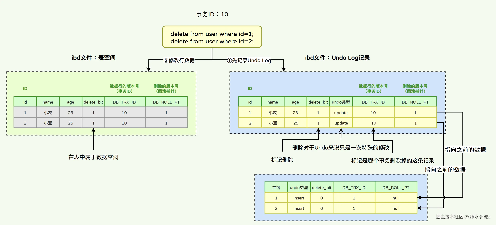

#### update 类型 Undo Log

当事务开启后，InnoDB 对于 update 语句的流程是：

- 将被修改的行以“update 类型的 undo log”记录到 undo log 日志中。
- 将该行的事务 ID 设置为当前事务 ID，回滚指针设置为被删除前那条记录的事务 ID。
- 更改表空间。

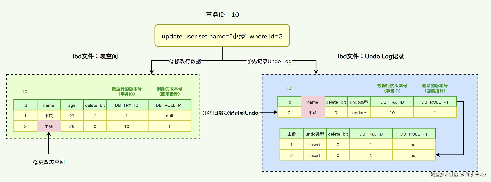

当同一条数据被修改多次，那么 Undo Log 将通过数据的事务 ID 和回滚指针能够形成一个非常好的修改链路：

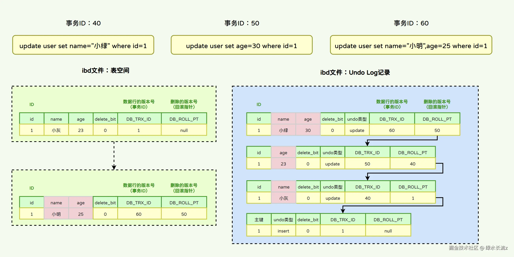

#### 工作原理

`InnoDB` 在 `MySQL` 启动时，会在内存中构建一个 `BufferPool`，而这个缓冲池主要存放两类东西，一类是数据相关的缓冲，如索引、锁、表数据等，另一类则是各种日志的缓冲，如 `Undo、Redo....` 等日志。当一条写 `SQL` 执行时，MySQL 并不会直接去往磁盘中的 ibd 文件写数据，而是先修改内存中的 Buffer Pool，这样性能就能得到极大的提升。

与 Redo Log 一样，Undo Log 也存在内存缓冲区，即 Undo Log Buffer。当一条写 `SQL` 执行时，不会直接去往磁盘中的 `xx.ibdata` 文件中的 Undo Log 写数据，而是会写在 `undo_log_buffer` 缓冲区中，因为工作线程直接去写磁盘太影响效率了，写进缓冲区后会由后台线程去刷写磁盘。

- Undo Log 完整的工作原理如下：

首先在操作表时，会将表数据从磁盘（.idb）加载到内存中（Buffer），**对表的 update/delete 等操作 InnoDB 都会事先将修改前的数据备份到 Undo Buffer 中**，这样当事务进行回滚时可以根据 Undo Buffer 中的内容进行事务的回滚操作，除此之外，**Undo Buffer 提供了数据的快照读取**，在事务未提交之前，Undo 日志可以作为并发读写时的读快照，来保证事务的可重复读；

事务做到一半了，失败了，那就要将数据还原到未提交之前的状态，undo 就是记录这些事务步骤的。当然了 redo 也记录了，但是 redo 里面东西太繁杂，不可能什么事都找它（主要是 Redo 和 Undo 的格式不一样，应用场景也不一样），于是就将事务步骤写入另外一个地方：undo，以后遇到回滚了就去查找因此在每一步操作时都会写入磁盘中的 Undo Log；

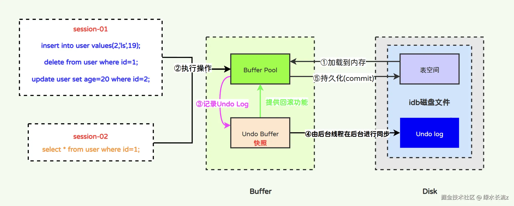

#### Purge 线程

事务提交后 Undo Log 日志并不会马上删除，因为其他事务很可能需要用到该数据。直接移除可能会导致其他事务读不到数据。那么对于废弃的 undo log 日志在什么时候删除呢？另外磁盘表中的被标记为删除的记录（数据空洞），也需要进行空间释放。这些数据都是由 MySQL 内部的线程——Purge 线程来执行后台删除。

- 针对于 `insert undo log`，因为 `insert` 操作的记录，只对事务本身可见，对其他事务不可见。故该 `undo log` 在事务提交后就没有用，就会直接删除。
- 针对于 `update undo log`，该 `undo log` 需要支持 `MVCC` 机制，因此不能在事务提交时就进行删除。提交时放入 `undo log` 链表，有专门的 `purge` 线程进行删除。
