## 共享锁与排他锁

### 共享锁（S 锁）

定义：**一个事务已获取共享锁，当另一个事务尝试对具备共享锁的数据进行读操作时，可正常读；进行写操作时，会被共享锁排斥**。

共享锁的意思很简单，也就是不同事务之间不会排斥，可以同时获取锁并执行。但这里所谓的不会排斥，仅仅只是指 **不会排斥其他事务来读数据，但其他事务尝试写数据时，就会出现排斥性**，举个例子理解：

> 事务 `T1` 对 `ID=18` 的数据加了一个共享锁，此时事务 `T2、T3` 也来读取 `ID=18` 的这条数据，这时 `T2、T3` 是可以获取共享锁执行的；但此刻又来了一个事务 `T4`，它则是想对 `ID=18` 的这条数据执行修改操作，此时共享锁会出现排斥行为，不允许 `T4` 获取锁执行。

在 `MySQL` 中，我们可以在 `SQL` 语句后加上相关的关键字来使用共享锁，**语法** 如下：

```sql
SELECT ... LOCK IN SHARE MODE;
-- MySQL8.0之后也优化了写法，如下：
SELECT ... FOR SHARE;
```

这种通过在 `SQL` 后添加关键字的加锁形式，被称为显式锁，而实际上为数据库设置了不同的事务隔离级别后，`MySQL` 也会对 `SQL` 自动加锁，这种形式则被称之为隐式锁。

样例：做个关于共享锁的小测试，先打开两个 cmd 窗口并于 mysql 建立连接

```sql
-- 窗口1：
-- 开启一个事务
begin;
-- 获取共享锁并查询 id=2 的数据
select * from bank_balance where id=2 lock in share mode;
```

```sql
-- 窗口2：
-- 开启一个事务
begin;
-- 获取共享锁并查询 id=2 的数据
select * from bank_balance where id=2 lock in share mode;

-- 尝试修改id=2的数据
update bank_balance set balance=230 where id=2;
```

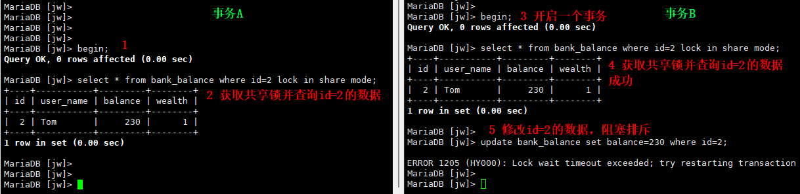

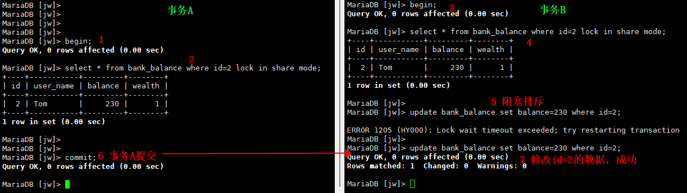

- 当窗口 1 获取了共享锁，窗口 2 执行查询/读操作时 可获取共享锁、正常读；但当窗口 2 执行修改/写操作时 窗口 2 没反应、未执行成功。
- 而当窗口 1 中事务 A 提交后，窗口 2 事务 B 的写操作才能继续往下执行。

由上可见，**一个事务已获取共享锁，当另一个事务尝试对具备共享锁的数据进行读操作时，可正常读；进行写操作时，会被共享锁排斥**。因此从这个实验中可以得知：共享锁也具备排他性，会排斥其他尝试写的线程，当有线程尝试修改同一数据时会陷入阻塞，直至持有共享锁的事务结束才能继续执行

### 排他锁（X 锁）

**当一个线程获取到独占锁后，会排斥其他线程（进行读写操作），如若其他线程也想对共享资源/同一数据进行操作，必须等到当前线程释放锁并竞争到锁资源才行**。

> 值得注意的一点是：排他锁并不是只能用于写操作，对于一个读操作，咱们也可以手动地指定为获取排他锁，**当一个事务在读数据时，获取了排他锁，那当其他事务来读、写同一数据时，都会被排斥**。比如事务 `T1` 对 `ID=18` 的这条数据加了一个排他锁，此时 `T2` 来加排他锁读取这条数据，`T3` 来修改这条数据，都会被 `T1` 排斥。

在 `MySQL` 中，可以通过如下方式显式获取独占锁：

```sql
SELECT ... FOR UPTATE;
```

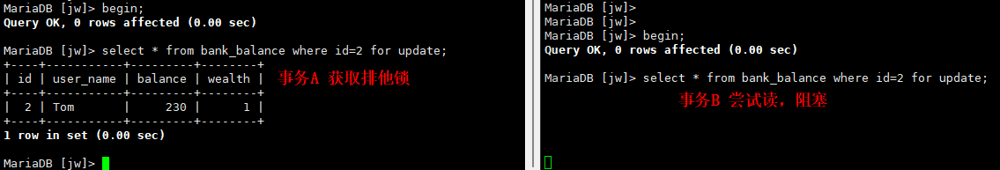

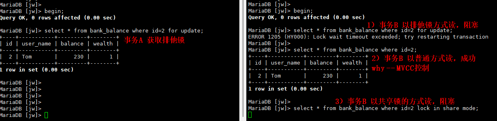

当两个事务同时获取排他锁，尝试读取一条相同的数据时，其中一个事务就会陷入阻塞，直至另一个事务结束才能继续往下执行；

但是 `select * from bank_balance where id=2` 这种普通读 不会被阻塞，也就是另一个事务不获取排他锁读数据，而是以普通的方式读数据，这种方式则可以立刻执行，`Why`？是因为读操作默认加共享锁吗？并不是，因为你尝试加共享锁读这条数据时依旧会被排斥。

可以明显看到，第二个事务中尝试通过加共享锁的方式读取这条数据，依旧会陷入阻塞状态，那前面究竟是因为啥原因才导致的能读到数据呢？其实这跟另一种并发控制技术有关，即 `MVCC` 机制

增、删、改都会对数据添加 X 锁，在查询语句中使用 for update 也会添加 X 锁

|      | S 锁 | X 锁 |
| :--- | :--- | ---- |
| S 锁 | √    | ×    |
| X 锁 | ×    | ×    |

### MySQL 锁的释放

在前面的测试中，每次都仅获取了锁，但好像从未释放过锁？其实 `MySQL` 中释放锁的动作都是隐式的，毕竟如果交给咱们来释放，很容易由于操作不当造成死锁问题发生。因此对于锁的释放工作，`MySQL` 自己来干，就类似于 `JVM` 中的 `GC` 机制一样，把内存释放的工作留给了自己完成。

- 但对于锁的释放时机，在不同的隔离级别中也并不相同，比如在“读未提交”级别中，是 `SQL` 执行完成后就立马释放锁；而在“可重复读”级别中，是在事务结束后才会释放。

> 如果完全按照数据库规范来实现 `RC` 隔离级别，为了保证其他事务可以读到未提交的数据，那就必须得在 `SQL` 执行完成后，立马释放掉锁，这时另一个事务才能读到 `SQL` 对应写的数据，但在 `InnoDB` 引擎中，它基于 `MVCC` 机制实现了该效果，为此，`InnoDB` 的 `RC` 级别中，`SQL` 执行结束后并不会释放锁。

## 全局锁

### 介绍

全局锁就是对整个数据库实例加锁，加锁后整个实例就处于只读状态，后续的 DML 的写语句，DDL 语句，已经更新操作的事务提交语句都将被阻塞。

其典型的使用场景是做全库的逻辑备份，对所有的表进行锁定，从而获取一致性视图，保证数据的完整性。

为什么全库逻辑备份，就需要加全局锁呢？  ——我们分析下 不加全局锁 可能存在的问题、以及加了全局锁后的情况。

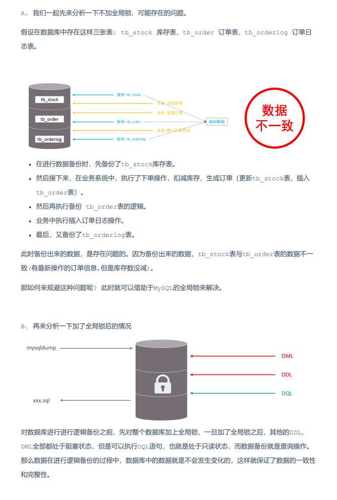

### 语法

```sql
# 加全局锁、获取全局锁
flush tables with read lock;  

# 数据备份。具体指令可见 
mysqldump -u 用户名 -p 数据库名 > /back/backup.sql

# 释放全局锁
unlock tables;
```

### 特点

数据库中加全局锁，是一个比较重的操作，存在以下问题：

- 如果在主库上备份，那么在备份期间都不能执行更新，业务基本上就得停摆。
- 如果在从库上备份，那么在备份期间从库不能执行主库同步过来的二进制日志（binlog），会导致主从延迟。

在 InnoDB 引擎中，我们可以在备份时加上参数 --single-transaction 参数来完成不加锁的一致性数据备份。

```sql
mysqldump --single-transaction -uroot –p123456 test > backup.sql
```

## 表级锁

### 介绍

表级锁，每次操作锁住整张表。锁定粒度大，发生锁冲突的概率最高，并发度最低。应用在 MyISAM、InnoDB、BDB 等存储引擎中。

表级锁：每次操作锁住整张表。主要分为三类

- 表锁（分为表共享读锁 read lock、表独占写锁 write lock）
- 元数据锁（meta data lock，MDL）：基于表的元数据加锁，加锁后整张表不允许其他事务操作。这里的元数据可以简单理解为一张表的表结构
- 意向锁（分为意向共享锁、意向排他锁）：这个是 `InnoDB` 中为了支持多粒度的锁，为了兼容行锁、表锁而设计的，使得表锁不用检查每行数据是否加锁，使用意向锁来减少表锁的检查

### 表锁

表锁应该是听的最多的一种锁，因为实现起来比较简单，同时应用范围也比较广泛，几乎所有的存储引擎都会支持这个粒度的锁，比如常用的 `MyISAM、InnoDB、Memory` 等各大引擎都实现了表锁。

使用表锁的开销相对较小，加锁快，不会产生死锁；但是加锁粒度大，发生锁冲突的概率更高，并发度更低。在 innoDB 存储引擎中不推荐使用表锁，只有在没有事务支持的存储引擎中才会使用，如 MyISAM

**对于表锁，分为两类**：

- 表共享读锁（read lock）
- 表独占写锁（write lock）

**语法**：

- 加锁：lock tables 表名... read/write
- 释放锁：unlock tables / 客户端断开连接

**特点**：

A.读锁

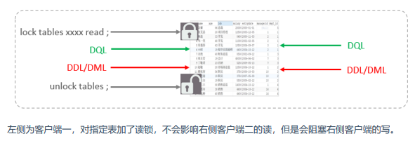

B.写锁

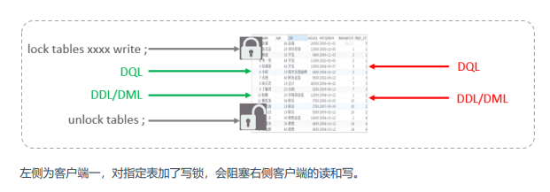

结论: **读锁不会阻塞其他客户端的读，但是会阻塞写。写锁既会阻塞其他客户端的读，又会阻塞其他客户端的写**。

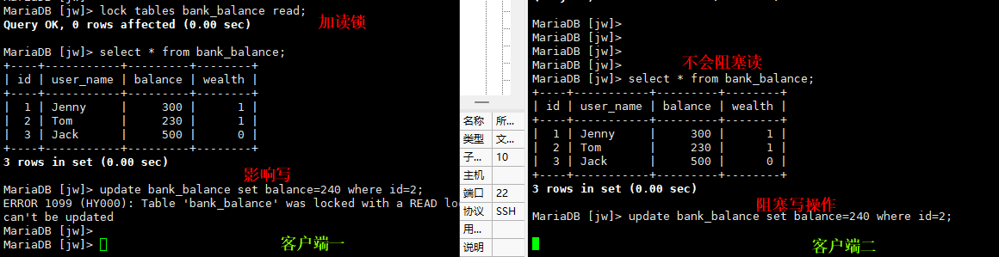

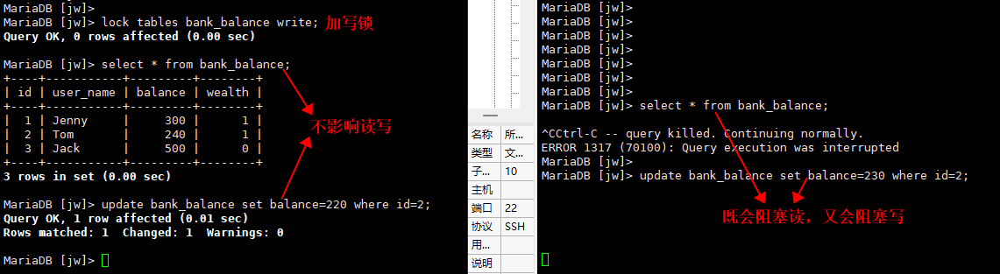

但要注意，不同引擎的表锁也在实现上以及加锁方式上有些许不同，但归根结底，表锁的意思也就以表作为锁的基础，将锁加在表上，一张表只能存在一个同一类型的表锁。

上面这段话中提到过，不同的存储引擎的表锁在使用方式上也有些不同，比如 `InnoDB` 是一个支持多粒度锁的存储引擎，它的锁机制是基于聚簇索引实现的，当 `SQL` 执行时，如果能在聚簇索引命中数据，则加的是行锁，如无法命中聚簇索引的数据则加的是表锁，比如：

```sql
select * from bank_balance for update;
```

这条 `SQL` 就无法命中聚簇索引，此时自然加的就是表级别的排他锁，但是这个表级锁，并不是真正意义上的表锁，是一个“伪表锁”，但作用是相同的，锁了整张表。

而反观 `MyISAM` 引擎，由于它并不支持聚簇索引，所以无法再以 `InnoDB` 的这种形式去对表上锁，因此如若要在 `MyISAM` 引擎中使用表锁，又需要使用额外的语法，如下：

```sql
-- MyISAM引擎中获取读锁（具备读-读可共享特性）
LOCK TABLES `table_name` READ;

-- MyISAM引擎中获取写锁（具备写-读、写-写排他特性）
LOCK TABLES `table_name` WRITE;

-- 查看目前库中创建过的表锁（in_use>0表示目前正在使用的表锁）
SHOW OPEN TABLES WHERE in_use > 0;

-- 释放已获取到的锁
UNLOCK TABLES;
```

如上便是 `MyISAM` 引擎中，获取表级别的共享锁和排他锁的方式，但这里的关键词其实叫做 `READ、WEITE`，翻译过来也就是读、写的意思，因此关于 **共享锁就是读锁、排他锁就是写锁** 的说法，估计就是因此而来的。

> 不过 `MyISAM` 引擎中，获取了锁还需要自己手动释放锁，否则会造成死锁现象出现，因为如果不手动释放锁，就算事务结束也不会自动释放，除非当前的数据库连接中断时才会释放。

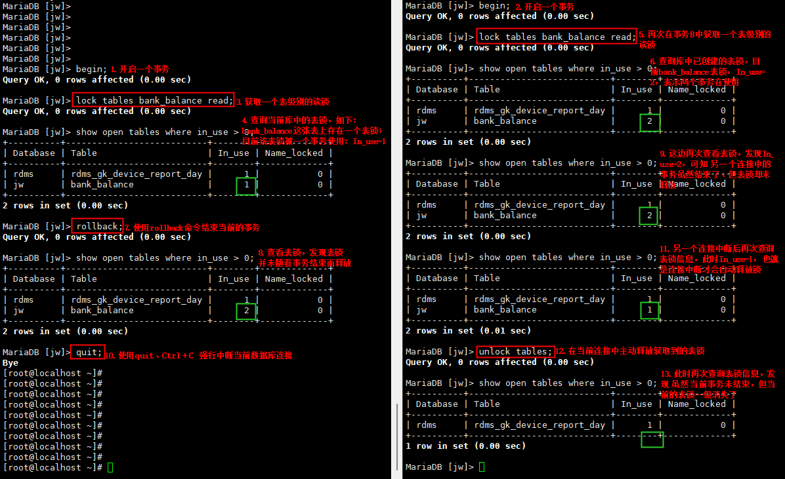

InnoDB 表锁显式获取后，必须要自己主动释放，否则结合数据库连接池，由于数据库连接是长存的，就会导致表锁一直被占用。

当你加了 `read` 读锁后，再尝试加 `write` 写锁，就会发现无法获取锁，当前线程会陷入阻塞，反过来也是同理。

### 元数据锁（Meta Data Lock）

`Meta Data Lock` 元数据锁，也被简称为 `MDL` 锁，这是基于表的元数据加锁，什么意思呢？我们在上文讲过：表锁是基于整张表加锁，行锁是基于一条数据加锁，那这个表的元数据是什么呢？**所有存储引擎的表都会存在一个 `.frm` 文件，这个文件中主要存储表的结构（`DDL` 语句，包括表结构的定义信息、创建删除修改表等）**。而 **`MDL` 锁就是基于 `.frm` 文件中的元数据加锁** 的。这里的元数据 可以简单理解为就是一张表的表结构。 也就是说，某一张表涉及到未提交的事务时，是不能够修改这张表的表结构的。

MDL 加锁过程是系统自动控制，无需显式使用，在访问一张表的时候会自动加上，**当对一张表进行增删改查的时候，加 MDL 读锁(共享)；当对表结构进行变更操作的时候，加 MDL 写锁(排他)**。MDL 锁主要作用是维护表元数据的数据一致性，在表上有活动事务的时候，不可以对元数据进行写入操作。**为了避免 DML 与 DDL 冲突，保证读写的正确性**。

MDL 是在 `MySQL5.5` 版本后再开始支持的，一般来说咱们用不上，因此也无需手动获取锁，主要在 **更改表结构时使用**，比如你要向一张表创建/删除一个索引、修改一个字段的名称/数据类型、增加/删除一个表字段等这类情况。因为毕竟当你的表结构正在发生更改，假设此时有其他事务来对表做 `CRUD` 操作，自然就会出现问题，比如我刚删了一个表字段，结果另一个事务中又按原本的表结构插入了一条数据，这显然会存在风险，因此 `MDL` 锁在加锁后，整张表不允许其他事务做任何操作。

常见的 SQL 操作，所添加的元数据锁：

| 对应 SQL                                                      | 锁类型                                  | 说明                                             |
| :----------------------------------------------------------- | :-------------------------------------- | :----------------------------------------------- |
| lock tables xxx read/write（表锁）                           | SHARED_READ_ONLY / SHARED_NO_READ_WRITE |                                                  |
| select、select ... lock in share mode（普通读、共享锁）      | SHARED_READ（元数据共享锁）             | 与 SHARED_READ、SHARED_WRITE 兼容，与 EXCLUSIVE 互斥 |
| insert、update、delete、select ... for update（增、改、删、排他锁） | SHARED_WRITE（元数据共享锁）            | 与 SHARED_READ、SHARED_WRITE 兼容，与 EXCLUSIVE 互斥 |
| alter table ...（修改表结构）                                | EXCLUSIVE（元数据排他锁）               | 与其他的 MDL 都互斥                                |

演示：

当执行 SELECT、INSERT、UPDATE、DELETE 等语句时，添加的是元数据共享锁（SHARED_READ / SHARED_WRITE），之间是兼容的

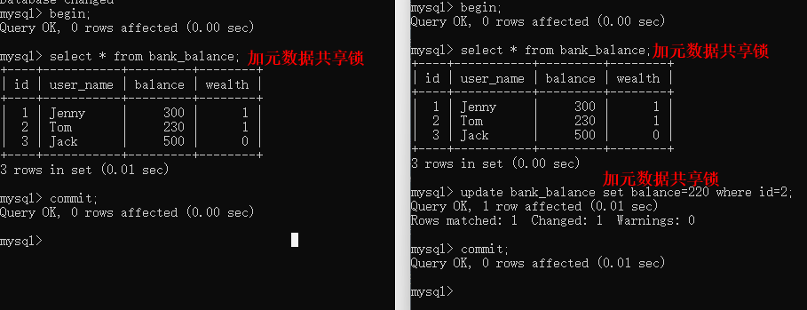

当执行 SELECT 语句时，添加的是元数据共享锁（SHARED_READ）。此时如果想更改表结构、加元数据排他锁（EXCLUSIVE），会阻塞排斥。


我们可以通过下面的 SQL，来查看数据库中的元数据锁的情况：

```sql
select object_type,object_schema,object_name,lock_type,lock_duration from performance_schema.metadata_locks;
```

注意版本，`metadata_locks` 表是 MySQL 5.6 版本及之后引入的。如果你正在使用的 MySQL 版本低于 5.6，那么该表将不存在。你可以通过运行 `SELECT VERSION();` 来检查你的 MySQL 版本

### 意向锁（Intention Lock）

为了避免 DML 在执行时，加的行锁与表锁的冲突，在 InnoDB 中引入了意向锁，使得表锁不用检查每行数据是否加锁，使用意向锁来减少表锁的检查。

`InnoDB` 引擎是一种支持多粒度锁的引擎，而意向锁则是 `InnoDB` 中为了支持多粒度的锁，为了 **兼容行锁、表锁** 而设计的，怎么理解这句话呢？先来看一个例子：

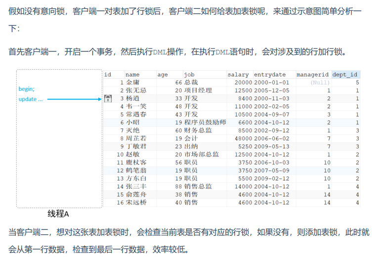

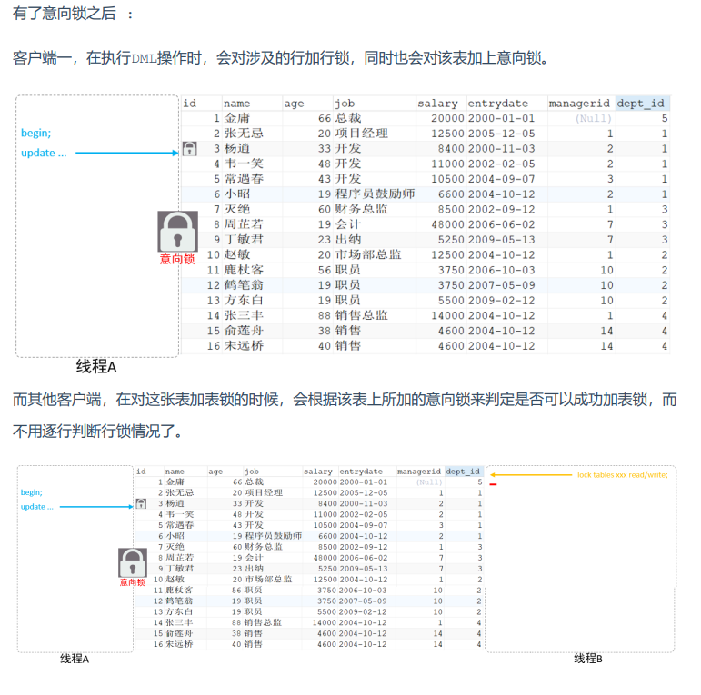

> 假设一张表中有一千万条数据，现在事务 `T1` 对 `ID=8888888` 的这条数据加了一个行锁，此时来了一个事务 `T2`，想要获取这张表的表级别写锁，经过前面的一系列讲解，大家应该知道写锁必须为排他锁，也就是在同一时刻内，只允许当前事务操作，如果表中存在其他事务已经获取了锁，目前事务就无法满足“独占性”，因此不能获取锁。
>
> 那思考一下，由于 `T1` 是对 `ID=8888888` 的数据加了行锁，那 `T2` 获取表锁时，是不是得先判断一下表中是否存在其他事务在操作？但因为 `InnoDB` 中有行锁的概念，所以表中任何一行数据上都有可能存在事务加锁操作，为了能精准的知道答案，`MySQL` 就得 **将整张表的 `1000W` 条数据全部遍历一次，然后逐条查看是否有锁存在**，那这个效率自然会非常的低。
>
> 有人可能会说，慢就慢点怎么了，能接受！但实际上不仅仅存在这个问题，还有另外一个致命问题，比如现在 `MySQL` 已经判断到了第 `567W` 行数据，发现前面的数据上都没有锁存在，正在继续往下遍历。
>
> 要记住 `MySQL` 是支持并发事务的，也就是 `MySQL` 正在扫描后面的每行数据是否存在锁时，万一 **又来了一个事务在扫描过的数据行上加了个锁** 怎么办？比如在第 `123W` 条数据上加了一个行锁。那难道又重新扫描一遍嘛？这就陷入了死循环，行锁和表锁之间出现了兼容问题。

由于行锁和表锁之间存在兼容性问题，提出了意向锁。意向锁实际上也是一种特殊的表锁，意向锁其实是一种“挂牌告知”的思想，好比日常生活中的出租车，一般都会有一个牌子，表示它目前是“空车”还是“载客”状态，而意向锁也是这个思想。

比如当事务 `T1` 打算对 `ID=8888888` 这条数据加一个行锁之前（行级别的读锁或写锁），就会先加一个表级别的意向锁。此时当事务 `T2` 尝试获取一个表级锁时，就会先看一下表上是否有意向锁，如果有的话再判断一下与自身是否冲突，比如表上存在一个意向共享锁，目前 `T2` 要获取的是表级别的读锁，那自然不冲突可以获取。但反之，如果 `T2` 要获取一个表级的写锁时，就会出现冲突，`T2` 事务则会陷入阻塞，直至 `T1` 释放了锁（事务结束）为止。

**分类**

- 意向共享锁（IS）：由语句 select ... lock in share mode 添加，与表锁共享锁（read）兼容，与表锁排他锁（write）互斥。在准备给表数据添加一个 S 锁时，需要先获得该表的 IS 锁
- 意向排他锁（IX）：由 insert、update、delete、select...for update 添加 。与表锁共享锁(read)及排他锁(write)都互斥，意向锁之间不会互斥。在准备给表数据添加一个 X 锁时，需要先获得该表的 IX 锁

> 一旦事务提交了，意向共享锁、意向排他锁，都会自动释放。

可以通过以下 SQL，查看意向锁及行锁的加锁情况：

```sql
select object_schema,object_name,index_name,lock_type,lock_mode,lock_data from performance_schema.data_locks;
```

注意版本，MySQL 之前某些版本不支持 `data_locks` 表，即该表可能不存在。可以通过运行 `SELECT VERSION();` 来检查你的 MySQL 版本。

**演示**

A.意向共享锁与表读锁是兼容的

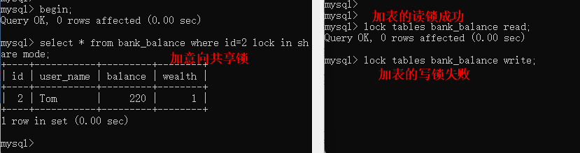

B.意向排他锁与表读锁、写锁都是互斥的

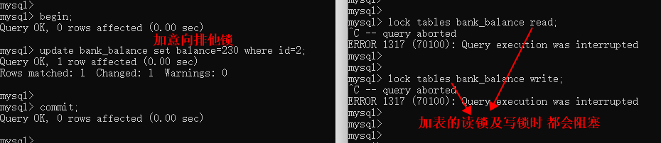

## 行级锁

### 介绍

行级锁，每次操作锁住对应的行数据。锁定粒度最小，发生锁冲突的概率最低，并发度最高。在 `MySQL` 诸多的存储引擎中，仅有 `InnoDB` 引擎支持行锁（不考虑那些闭源自研的），MyISAM 等引擎不支持行锁【因为 `InnoDB` 支持聚簇索引——将 [数据存储](https://cloud.tencent.com/product/cos?from_column=20065&from=20065) 与索引放到了一块，索引结构的叶子节点保存了 **行数据**。在之前简单聊到过，`InnoDB` 中如果能够命中索引数据，就会加行锁，无法命中则会加表锁】。

InnoDB 的数据是基于索引组织的，行锁是通过 **对索引上的索引项加锁** 来实现的，而 **不是对记录加的锁**。对于行级锁，主要分为以下三类：行锁、间隙锁、临键锁

- 行锁（Record Lock）：锁定单个行记录的锁，防止其他事务对此行进行 update 和 delete。在 RC、RR 隔离级别下都支持
- 间隙锁（Gap Lock）：锁定索引记录间隙（不含该记录），左右开区间，确保索引记录间隙不变，防止其他事务在这个间隙进行 insert，产生幻读。在 RR 隔离级别下都支持
- 临键锁（Next-Key Lock）：行锁和间隙锁组合，同时锁住数据，并锁住数据前面的间隙 Gap，左开右闭。 在 RR 隔离级别下支持

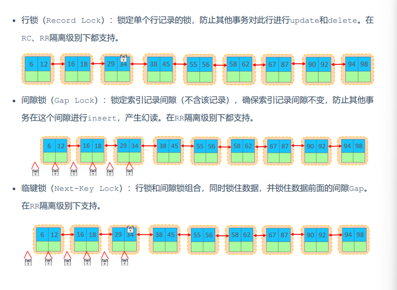

### 行锁 / 记录锁（Record Lock）

行锁（Record Lock），也称为记录锁，一行表数据、一条表记录本身就是同一个含义。锁定单个行记录的锁，防止其他事务对此行进行 update 和 delete。在 RC、RR 隔离级别下都支持。

锁住一行数据，在索引上才能加锁，非索引会升级为表级锁。

**介绍**

InnoDB 实现了以下两种类型的行锁：

- 共享锁（S）：允许一个事务去读一行，阻止其他事务获得相同数据集的排它锁。
- 排他锁（X）：允许获取排他锁的事务更新数据，阻止其他事务获得相同数据集的共享锁和排他锁。

**语法**

```sql
-- 获取行级别的共享锁
select * from bank_balance where id = 1 lock in share mode;

-- 获取行级别的排他锁
select * from bank_balance where id = 1 for update;
```

想要使用 `InnoDB` 的行锁就是这样写的，如果你的 `SQL` 能命中索引数据，那也就自然加的就是行锁，反之则是表锁。但网上很多资料都流传着一个说法：`InnoDB` 引擎的表锁没啥用，其实这句话会存在些许误导性，因为意向锁、自增锁、`MDL` 锁都是表锁，也包括 `InnoDB` 的行锁是基于索引实现的，例如在 `update` 语句修改数据时，假设 `where` 后面的条件无法命中索引，那咋加行锁呢？此时没办法就必须得加表锁了，因此 `InnoDB` 的表锁是有用的。

### 间隙锁（Gap Lock）

锁定索引记录间隙（不含该记录），左右开区间，确保索引记录间隙不变，防止其他事务在这个间隙进行 insert，产生幻读。在 RR 隔离级别下都支持

```sql
mysql> select * from bank_balance;
+----+-----------+---------+--------+
| id | user_name | balance | wealth |
+----+-----------+---------+--------+
|  1 | Jenny     |     300 |      1 |
|  2 | Tom       |     230 |      1 |
|  3 | Jack      |     500 |      0 |
|  9 | Rose      |     360 |      0 |
+----+-----------+---------+--------+
```

上述这张表最后两条数据，id 字段从 3 跳到了 9，那么 3~9 两者之间的范围则被称为”间隙“，而间隙锁主要锁定的就是这块范围。

> 那为何又说间隙锁是用来解决幻读问题的呢？因为幻读的概念是：一个事务在执行时，另一个事务插入了一条数据，从而导致第一个事务操作完成之后发现结果与预想的不一致，跟产生了幻觉一样。 好比拿上述表举例子，现在要将 `ID>2` 的用户余额改为 `100`，因此事务 `T1` 先查到了 `ID>2` 的 `3、9` 两条数据并上锁了，然后开始更改用户余额，但此时事务 `T2` 过来又插入了一条 `ID=6、balance=320` 的数据并提交，等 `T1` 修改完了 `3、9` 两条数据后，此时再次查询 `ID>2` 的数据时，结果发现了 `ID=6` 的这条数据余额并未被修改、数据行比原来还多了。
>
> 在上述这个例子中，`T2` 因为新增并提交了事务，所以 `T1` 再次查询时也能看到 `ID=6` 的这条数据，就跟产生了幻觉似的，对于这种新增数据，专业的叫法称之为幻影数据。
>
> 为了防止出现安全问题，所以 `T1` 在操作之前会对目标数据加锁，但在 `T1` 事务执行时，这条幻影数据还不存在，因此就会出现一个新的问题：不知道把锁加在哪儿，毕竟想要对 `ID=6` 的数据加锁，就是加了个寂寞。普通的行锁无法解决该问题，也不能加表锁、太影响性能了，此时间隙锁就应运而生，主要对间隙区域加锁

**加间隙锁的规则**

- 索引上的等值查询(唯一索引)，给不存在的记录加锁时, 优化为间隙锁
- 索引上的等值查询(非唯一普通索引)，向右遍历时最后一个值不满足查询需求时，next-key lock 退化为间隙锁
- 索引上的范围查询(唯一索引) -- 会访问到不满足条件的第一个值为止

注意：间隙锁唯一目的是防止其他事务插入间隙。间隙锁可以共存，一个事务采用的间隙锁不会阻止另一个事务在同一间隙上采用间隙锁

```sql
select * from bank_balance where id=6 lock in share mode;
```

### 临建锁（Next-Key Lock）

临键锁是间隙锁的 `Plus` 版本，或者可以说成是一种由记录锁+间隙锁组成的锁：

- 记录锁：锁定的范围是表中具体的一条行数据。
- 间隙锁：锁定的范围是左右开区间，但不包含当前这一条真实数据，只锁间隙区域。

而临键锁则是两者的结合体，加锁后，即锁定 **左开右闭** 的区间（每个临键锁是左开右闭区间），也会锁定当前行数据。

实际上在 `InnoDB` 中，除开一些特殊情况外，当尝试对一条数据加锁时，默认加的是临键锁，而并非记录锁、间隙锁。也就是说，在前面举例幻读问题中，当 `T1` 要对 `ID>2` 的用户做修改余额，锁定 3 `、9` 这两条行数据时，默认会加的是临键锁，也就是当事务 `T2` 尝试插入 `ID=6` 的数据时，因为有临建锁存在，因此无法再插入这条“幻影数据”，也就至少保障了 `T1` 事务执行过程中，不会碰到幻读问题。

间隙锁和临建锁的目的都是用来解决可重复读的问题，如果在读提交级别，间隙锁和临建锁都会失效。

### 行锁的粒度粗化

行锁并不是一成不变的，行锁会在某些特殊情况下发生粗化，主要有两种情况：

- 在内存中专门分配了一块空间存储锁对象，当该区域满了后，就会将行锁粗化为表锁。
- 当做范围性写操作时，由于要加的行锁较多，此时行锁开销会较大，也会粗化成表锁。

当然，这两种情况其实很少见，因此只需要知道有锁粗化这回事即可，这种锁粗化的现象其实在 `SQLServer` 数据库中更常见，因为 `SQLServer` 中的锁机制是基于行记录实现的，而 `MySQL` 中的锁机制则是基于事务实现的

## 加锁规则

MySQL 中数据加锁的规则可以归纳为以下三种：

**两个原则**

- 加锁的基本单位是 next-key lock，前开后闭
- 查找过程中访问到的对象才会加锁

**两个优化**

- 索引上的等值查询，给唯一索引加锁的时候，next-key lock 退化为行锁
- 索引上的等值查询，向右遍历时且最后一个值不满足等值条件的时候，next-key lock 退化为间隙锁

**一个 BUG**

- 唯一索引上的范围查询会访问到不满足条件的第一个值为止
