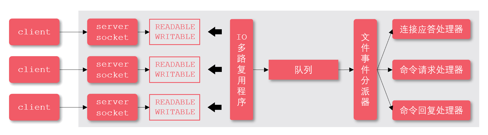

## Redis 的用处

1. Redis 最常用来做缓存，是实现分布式缓存的首先中间件
2. Redis 可以作为数据库，实现诸如点赞、关注、排行等对性能要求极高的互联网需求
3. Redis 可以作为计算工具，能用很小的代价，统计诸如 PV/UV、用户在线天数等数据
4. Redis 还有很多其他的使用场景，例如：可以实现分布式锁，可以作为消息队列使用，Session 共享

## Redis 和 Memcached 的区别

共同点：

1. 都是基于内存的数据库，一般都用来当作缓存使用
2. 都有过期策略
3. 两者的性能都非常高

区别：

1. 数据结构：Redis 支持的数据类型更丰富（String、Hash、List、Set、ZSet）；而 Memcached 只支持最简单的 key-value 数据类型
2. 持久化方式：Redis 支持数据的持久化，可以将内存中的数据保存在磁盘中，重启的时候可以再次加载进行使用；而 Memcached 没有持久化功能，数据全部存在内存之后，Memcached 重启或者挂掉后，数据就没了
3. 数据分片方式：Redis 原生支持集群模式；Memcached 没有原生的集群模式，需要依靠客户端来实现往集群中分片写入数据
4. 处理数据方式：Redis 支持发布订阅模型、Lua 脚本、事务等功能；而 Memcached 不支持

## 非关系型和关系型数据库

**关系型数据库（SQL）**

指的是使用关系模式（二维表格模型）来组织数据的数据库

优点：

1. 采用二维表结构非常贴近正常开发逻辑
2. 支持通用的 SQL 语句
3. 丰富的完整性大大减少了数据冗余和数据不一致的问题
4. 可以用 SQL 句子对多个表之间做非常繁杂的查询
5. 关系型数据库提供对事务的支持，能保证系统中事务的正确执行，同时提供事务的恢复、回滚、并发控制和死锁问题的解决
6. 数据存储在磁盘中，安全可靠

缺点：

1. 高并发读写能力差：网站类用户的并发性访问非常高，而一台数据库的最大连接数有限，且硬盘 I/O 有限，不能满足很多人同时连接
2. 海量数据情况下读写效率差：对大数据量的表进行读写操作时，需要等待较长的时间等待响应
3. 数据模型灵活度低：关系型数据库的数据模型定义严格，无法快速容纳新的数据类型（需要提前知道存储什么样类型的数据）
4. 可扩展性不足

**非关系型数据库（NOSQL）**

通常指数据以对象的形式存储在数据库中，而对象之间的关系通过每个对象自身的属性来决定，常用于存储非结构化的数据

优点：

1. 非关系型数据库存储数据的格式可以是 key-value、文档、图片形式等，关系型数据库则只支持基础类型
2. 速度快、效率高。NOSQL 可以使用硬盘或者随机存储器作为载体，而关系型数据库只能使用硬盘
3. 海量数据的维护和处理非常轻松，成本低
4. 可以实现数据的分布式处理

缺点：

1. 非关系型数据库没有事务处理，无法保证数据的完整性和安全性
2. 复杂表关联查询不容易实现

## Redis 为什么这么快？

1. 完全基于内存，绝大部分请求是纯粹的内存操作，非常快速

2. 数据结构简单，对数据操作也简单

3. 采用单线程，避免了不必要的上下文切换和竞争条件，也不存在多进程或者多线程导致的切换而消耗 CPU，不用去考虑各种锁的问题，不存在加锁释放锁操作，没有因为可能出现死锁而导致的性能消耗

Redis 客户端对服务端的每次调用都经历了发送命令，执行命令，返回结果三个过程。其中执行命令阶段，由于 Redis 是单线程来处理命令的，所有每一条到达服务端的命令不会立刻执行，所有的命令都会进入一个队列中，然后逐个被执行。并且多个客户端发送的命令的执行顺序是不确定的。但是可以确定的是不会有两条命令被同时执行，不会产生并发问题，这就是 Redis 的单线程基本模型。

4. 使用多路 I/O 复用模型，非阻塞 IO

使用 I/O 多路复用重新来同时监听多个套接字，并根据套接字目前执行的任务来为套接字关联不同的事件处理器，当被监听的套接字准备好执行连接应答（accept）、读取（read）、写入（write）、关闭（close）等操作时，与操作相对应的文件事件就会产生，这时文件事件处理器就会调用套接字之前关联好的事件处理器来处理这些事件

多个 socket 可能会并发产生不同的操作，每个操作对应不同的文件事件，但是 IO 多路复用程序会监听多个 socket，会将 socket 产生的事件放入队列中排队，事件分派器每次从队列中取出一个事件，把该事件交给对应的事件处理器进行处理

## Redis 是单线程还是多线程的？

Redis 是单线程的，主要是指 Redis 的网络 I/O 和键值对读写（增删改查）是由一个线程来完成的；而 Redis 的其他功能，如：持久化、集群数据同步等，则是依赖其他线程来执行的。说 Redis 是单线程的是一种习惯的说法，它的底层不是单线程的

1. Redis6.0 前采用单线程的原因

因为 Redis 是基于内存的操作，CPU 不是 Redis 的瓶颈，Redis 的瓶颈最有可能是机器内存的大小或者网络 I/O，既然单线程容易实现，而且 CPU 不会成为瓶颈，那就顺利成章地采用单线程的方案

2. Redis6.0 后引入多线程的原因

Redis 的主要工作（网络 I/O 和执行命令）一直是单线程模型，但是因为随着网络硬件的性能提升，Redis 的性能瓶颈有时会出现在网络 I/O 的处理上，所以为了提高网络 I/O 的并行度，Redis6.0 对于网络 I/O 采用多线程来处理，但是对于命令的执行，Redis 仍然使用单线程来处理

**多线程模式下，是否存在线程并发安全问题？**

在 redis 的多线程模式下，获取、解析命令，以及输出结果着两个过程，可以配置成多线程执行的，因为它毕竟是我们定位到的主要耗时点，但是命令的执行，也就是内存操作，依然是单线程运行的。所以，Redis 的多线程部分只是用来处理网络数据的读写和协议解析，执行命令仍然是单线程顺序执行，也就不存在并发安全问题。

## 布隆过滤器（BloomFilter）

布隆过滤器是一种 space efficient 的概率型数据结构，用于判断一个元素是否在集合中，哈希表也能用于判断元素是否在集合中，但是布隆过滤器只需要哈希表的 1/8 或 1/4 的空间复杂度就能完成同样的问题。

算法思想：首先分配一块内存空间做 bit 数组，数组的 bit 位初始值全部设为 0，加入元素时，采用 k 个相互独立的 hash 函数计算，然后将元素 hash 映射的 k 个位置全部设置为 1，检测 key 是否存在，仍然用这 k 个 hash 函数计算出 k 个位置，如果位置全部为 1，则表明 key 存在，否则不存在

缺点：

1. 哈希函数会出现碰撞，所以布隆过滤器会存在误判，误判率指 BloomFilter 判断某个 key 存在，但它实际不存在的概率，因为它存的是 key 的 hash 值，而非 key 的值，所以有概率存在这样的 key，它们内容不同，但多次 hash 后的 hash 值都相同
2. 布隆过滤器不允许删除元素，删除意味着需要将对应的 k 个 bits 位置设置为 0，其中有可能是其他元素对应的位

**使用场景**

1. 解决 Redis 缓存穿透问题
2. 邮件过滤，实现邮件黑名单过滤
3. 爬虫爬过的网站过滤，爬过的网站不再爬取
4. 推荐过的新闻不再推荐

## Redis 如何做内存优化？

1. 控制 key 的数量

当使用 Redis 存储大量数据时，通常会存在大量键，过多的键同样会消耗大量内存。Redis 本质是一个数据结构服务器，使用 Redis 时不要进入一个误区，大量使用 get/set 这样的 API，把 Redis 当成 Memcached 使用。对应存储相同的数据内存利用 Redis 的数据结构降低外层键的数量，也可以节省大量内存

2. 缩减键值对象

降低 Redis 内存使用最直接的方式就是缩减键（key）和值（value）的长度

+ key 长度：在设计键时，在完整描述业务情况下，键值越短越好
+ value 长度：值对象缩减比较复杂，常见需求是把业务对象序列化成二进制数组放入 Redis。首先应该在业务上精简业务对象，去掉不必要的属性避免存储无效数据，其次在序列化工具选择上，应该选择更高效的序列化工具来降低字节数组大小

3. 编码优化

Redis 内部针对不同类型存在编码的概念，所谓编码就是具体使用哪种底层数据结构来实现，编码不同将直接影响数据的内存占用和读写效率

## Redis 热 Key 问题

### 多热算热？

到底“多热算热”呢，这个其实现需要根据实际的业务情况以及你自己的缓存服务器的整体存储情况而定。

JD 有一个框架叫做 hotkey，他就是专门做热 key 检测的，他的热 key 定义是在单位时间内访问超过设定的阈值频次就是热 key，这个阈值需要业务自己设定，并不断的调整和优化。 一般来说，如果一个 key 在 1 秒内被访问次数达到上千次，就可以认为是热 key 了。

### 产生原因

1. 用户消费的数据远大于生产的数据，如商品秒杀、热点新闻、热点评论等读多写少的场景。

双十一秒杀商品，短时间内某个爆款商品可能被点击/购买上百万次，或者某条爆炸性新闻等被大量浏览，此时会造成一个较大的请求 Redis 量，这种情况下就会造成热点 Key 问题。

2. 请求分片集中，超过单台 Redis 服务器的性能极限。

在服务端读数据进行访问时，往往会对数据进行分片切分，例如采用固定 Hash 分片，hash 落入同一台 redis 服务器，如果瞬间访问量过大，超过机器瓶颈时，就会导致热点 Key 问题的产生。

### 解决方式

#### 根据经验，提前预测
这种方法在大多数情况下还是比较有效的。比较常见的就是电商系统中，会在秒杀、抢购等业务开始前就能预测出热 key。但是，这种方法局限性也很大，有些热 key 是完全没办法预测的

#### 实时收集

还有一种热点数据的发现机制，那就是实时收集，比如客户端、服务端或者在代理层，都可以对实时数据进行采集，然后进行统计汇总，达到一定数量之后，就会被识别为热 key。

具体的收集方式也有很多种，可以在客户端收集、也可以统一在代理层收集、还可以通过 redis 的自带命令进行收集：redis4.0.3 中提供了 redis-cli 的热点 key 发现功能，执行 redis-cli 时加上-hotkeys 选项即可。

#### 多级缓存
解决热 key 问题最主要的方式就是加缓存。通过缓存的方式尽量减少系统交互，使得用户请求可以提前返回，这样既能提升用户体验，也能减少系统压力。

缓存的方式由很多，有些数据可以缓存在客户端浏览器中，有些数据可以缓存在距离用户就近的 CDN 中，有些数据可以通过 Redis 等这类缓存框架进行缓存，还有一些可以通过服务器本地缓存进行。

这种使用多个缓存的情况，就组成了二级缓存、三级缓存等多级缓存了。总之，通过缓存的方式尽量减少用户的访问链路的长度。

#### 热 key 备份
有了缓存之后，还会带来一个问题，那就是热点数据如果都被缓存在同一个缓存服务器上，那么这个服务器也可能被打挂。

所以，很多人在加了缓存之后，还可能同时部署多个缓存服务器，如 Redis 同时部署多个服务器集群。并且实时的将热点数据同步分发到多个缓存服务器集群中，一旦有的集群扛不住了，立即做切换。

单纯的对于 Redis 热 key 缓存来说，Redis 是有分片机制的，同一个热 key 可能会都保存在同一个分片中，所以还可以在多个分片中都把热 key 同步一份，使得查询可以同时从多个分片进行，减少某一个分片的压力。

因为有分片，还有一种情况，就是可能多个热 key 都会分到同一个分片中，为了减少这种情况的发生，可以增加更多的分片来分担流量。

#### 热 key 拆分 

热 key 拆分成多个 key，在每一个 key 后面加一个后缀名，然后把这些 key 分散到多个阶段中。

这样在客户端请求的时候，可以根据一定的规则计算得出一个固定的 key，这样多次请求就会被分散到不同的节点上了。

## Redis 大 key 问题

### 什么是 Big Key?

通俗易懂的讲，Big Key 就是某个 key 对应的 value 很大，占用的 redis 空间很大，本质上是大 value 问题。key 往往是程序可以自行设置的，value 往往不受程序控制，因此可能导致 value 很大。

redis 中这些 Big Key 对应的 value 值很大，在序列化/反序列化过程中花费的时间很大，因此当我们操作 Big Key 时，通常比较耗时，这就可能导致 redis 发生阻塞，从而降低 redis 性能。

用几个实际的例子对大 Key 的特征进行描述：

1. 一个 String 类型的 Key，它的值为 5MB（数据过大）；
2. 一个 List 类型的 Key，它的列表数量为 20000 个（列表数量过多）；
3. 一个 ZSet 类型的 Key，它的成员数量为 10000 个（成员数量过多）；
4. 一个 Hash 格式的 Key，它的成员数量虽然只有 1000 个但这些成员的 value 总大小为 100MB（成员体积过大）；

在实际业务中，大 Key 的判定仍然需要根据 Redis 的实际使用场景、业务场景来进行综合判断。通常都会以数据大小与成员数量来判定。

### 产生场景

1. redis 数据结构使用不恰当

将 Redis 用在并不适合其能力的场景，造成 Key 的 value 过大，如使用 String 类型的 Key 存放大体积二进制文件型数据。

2. 未及时清理垃圾数据

没有对无效数据进行定期清理，造成如 HASH 类型 Key 中的成员持续不断的增加。即一直往 value 塞数据，却没有删除机制，value 只会越来越大。

3. 对业务预估不准确

业务上线前规划设计考虑不足没有对 Key 中的成员进行合理的拆分，造成个别 Key 中的成员数量过多。

4. 明星、网红的粉丝列表、某条热点新闻的评论列表

假设我们使用 List 数据结构保存某个明星/网红的粉丝，或者保存热点新闻的评论列表，因为粉丝数量巨大，热点新闻因为点击率、评论数会很多，这样 List 集合中存放的元素就会很多，可能导致 value 过大，进而产生 Big Key 问题。

### 危害

1. 阻塞请求

Big Key 对应的 value 较大，我们对其进行读写的时候，需要耗费较长的时间，这样就可能阻塞后续的请求处理。Redis 的核心线程是单线程，单线程中请求任务的处理是串行的，前面的任务完不成，后面的任务就处理不了。

2. 内存增大

读取 Big Key 耗费的内存比正常 Key 会有所增大，如果不断变大，可能会引发 OOM（内存溢出），或达到 redis 的最大内存 maxmemory 设置值引发写阻塞或重要 Key 被逐出。

3. 阻塞网络

读取单 value 较大时会占用服务器网卡较多带宽，自身变慢的同时可能会影响该服务器上的其他 Redis 实例或者应用。

4. 影响主从同步、主从切换

删除一个大 Key 造成主库较长时间的阻塞并引发同步中断或主从切换。

### 解决方法

1. 对大 Key 进行拆分

将一个 Big Key 拆分为多个 key-value 这样的小 Key，并确保每个 key 的成员数量或者大小在合理范围内，然后再进行存储，通过 get 不同的 key 或者使用 mget 批量获取。

2. 对大 Key 进行清理

对 Redis 中的大 Key 进行清理，从 Redis 中删除此类数据。Redis 自 4.0 起提供了 UNLINK 命令，该命令能够以非阻塞的方式缓慢逐步的清理传入的 Key，通过 UNLINK，你可以安全的删除大 Key 甚至特大 Key。

3. 监控 Redis 的内存、网络带宽、超时等指标

通过监控系统并设置合理的 Redis 内存报警阈值来提醒我们此时可能有大 Key 正在产生，如：Redis 内存使用率超过 70%，Redis 内存 1 小时内增长率超过 20%等。

4. 定期清理失效数据

如果某个 Key 有业务不断以增量方式写入大量的数据，并且忽略了其时效性，这样会导致大量的失效数据堆积。可以通过定时任务的方式，对失效数据进行清理。

5. 压缩 value

使用序列化、压缩算法将 key 的大小控制在合理范围内，但是需要注意序列化、反序列化都会带来一定的消耗。如果压缩后，value 还是很大，那么可以进一步对 key 进行拆分。
