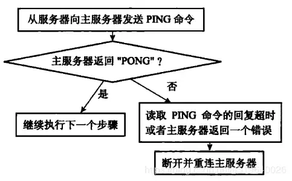
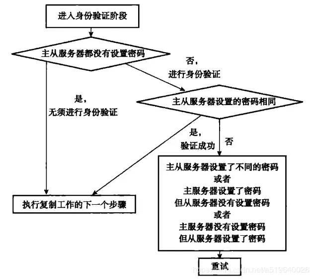

## Redis 主从复制（Master-Slave）

### 什么是主从复制？

指将一台 Redis 服务器的数据，复制到其他的 Redis 服务器，前者称为主节点（master），后者称为从节点（slave），数据的复制是单向的，只能由主节点到从节点。默认情况下，每台 Redis 服务器都是主节点，且一个主节点可以有多个从节点（或没有从节点），但一个从节点只能有一个主节点


### 作用

1. 读写分离：主节点写，从节点读，提高服务器的读写负载能力
2. 数据冗余：主从复制实现了数据的热备份，是持久化之外的一种数据冗余方式
3. 故障恢复：当主节点出现问题时，可以由从节点提供服务，实现快速的故障恢复，实际上是一种服务的冗余
4. 负载均衡：在主从复制的基础上，配合读写分离，可以由主节点提供写服务，由从节点提供读服务（即写 Redis 数据时应用连接主节点，读 Redis 数据时应用连接从节点），分担服务器负载，尤其是在写少读多的场景下，通过多个从节点分担读负载，可以大大提高 Redis 服务器的并发量
5. 高可用基石：主从复制是哨兵和集群能够实施的基础，因此说主从复制是 Redis 高可用的基础

### 层层链路


如果主机断开了连接，可以使用 salveof no one 让自己成为主节点，其他节点就可以手动连接到最新的这个主节点。如果这个时候老大修复了，那就只能重新连接该最新的主节点

### 只读从服务器

从 Redis 2.6 开始， 从服务器支持只读模式， 并且该模式为从服务器的默认模式。只读从服务器会拒绝执行任何写命令， 所以不会出现因为操作失误而将数据不小心写入到了从服务器的情况。

只读模式由 redis.conf 文件中的 slave-read-only 选项控制， 也可以通过 CONFIG SET 命令来开启或关闭这个模式。

即使从服务器是只读的， DEBUG 和 CONFIG 等管理式命令仍然是可以使用的， 所以我们还是不应该将服务器暴露给互联网或者任何不可信网络。 不过， 使用 redis.conf 中的命令改名选项， 我们可以通过禁止执行某些命令来提升只读从服务器的安全性。

### 实现原理

主从复制功能的详细步骤可以分为：

1. 设置主节点的地址和端口

在从服务器设置需要同步的主服务器信息，包括机器 IP、端口。主从复制的开启，完全是在从节点发起的，不需要我们在主节点做任何事情。

2. 建立套接字连接

在 slaveof 命令执行之后，从服务器会根据设置的 ip 和端口，向主服务器建立 socket 连接

3. 发送 PING 命令

从节点成为主节点的客户端之后，发送 ping 命令进行首次请求，目的是检查 socket 连接是否可用，以及主节点当前是否能够处理请求。

从节点发送 ping 命令后，可能出现 3 种情况：

* 返回 pong：说明 socket 连接正常，且主节点当前可以处理请求，复制过程继续。
* 超时：一定时间后从节点仍未收到主节点的回复，说明 socket 连接不可用，则从节点断开 socket 连接，并重连。
* 返回 pong 以外的结果：如果主节点返回其他结果，如正在处理超时运行的脚本，说明主节点当前无法处理命令，则从节点断开 socket 连接，并重连



4. 身份验证

如果从节点中设置了 masterauth 选项，则从节点需要向主节点进行身份验证；没有设置该选项，则不需要验证。从节点进行身份验证是通过向主节点发送 auth 命令进行的，auth 命令的参数即为配置文件中的 masterauth 的值。

如果主节点设置密码的状态，与从节点 masterauth 的状态一致（一致是指都存在，且密码相同，或者都不存在），则身份验证通过，复制过程继续；如果不一致，则从节点断开 socket 连接，并重连。



5. 同步

同步就是将从节点的数据库状态更新成主节点当前的数据库状态。具体执行的方式是：从节点向主节点发送 psync 命令（Redis2.8 以前是 sync 命令），开始同步。

数据同步阶段是主从复制最核心的阶段，根据主从节点当前状态的不同，可以分为 `全量复制` 和 `部分复制`

6. 命令传播

经过上面同步操作，此时主从的数据库状态其实已经一致了，但这种一致的状态的并不是一成不变的。

在完成同步之后，也许主服务器马上就接受到了新的写命令，执行完该命令后，主从的数据库状态又不一致。

数据同步阶段完成后，主从节点进入命令传播阶段；在这个阶段主节点将自己执行的写命令发送给从节点，从节点接收命令并执行，从而保证主从节点数据的一致性

**延迟与不一致**

命令传播是异步的过程，即主节点发送写命令后并不会等待从节点的回复；因此实际上主从节点之间很难保持实时的一致性，延迟在所难免。数据不一致的程度，与主从节点之间的网络状况、主节点写命令的执行频率、以及主节点中的 `repl-disable-tcp-nodelay` 配置等有关。

`repl-disable-tcp-nodelay` 配置如下：

- 假如设置成 yes，则 redis 会合并小的 TCP 包从而节省带宽，但会增加同步延迟（40ms），造成 master 与 slave 数据不一致
- 假如设置成 no，则 redis master 会立即发送同步数据，没有延迟

概括来说就是：前者关注性能，后者关注一致性

具体发送频率与 Linux 内核的配置有关，默认配置为 40ms。当设置为 no 时，TCP 会立马将主节点的数据发送给从节点，带宽增加但延迟变小。一般来说，只有当应用对 Redis 数据不一致的容忍度较高，且主从节点之间网络状况不好时，才会设置为 yes；多数情况使用默认值 no

**Redis 是如何保证主从服务器一致处于连接状态以及命令是否丢失？**

命令传播阶段，从服务器会利用心跳检测机制定时的向主服务发送消息

### 全量同步


Redis 全量复制一般发生在 Slave 初始化阶段，这时 Slave 需要将 Master 上的所有数据都复制一份

1. 从服务器连接主服务器，发送 SYNC 命令
2. 主服务器接收到 SYNC 命令后，执行 fork 创建一个子进程，开始执行 BGSAVE 命令生成 RDB 文件并使用缓冲区记录此后执行的所有写命令
3. 主服务器 BGSAVE 执行完后，向所有从服务器发送此快照
4. 主节点接着将生成快照、发送快照期间积压的命令发送给从节点
5. 主节点不断地将新执行的写命令同步到从节点，从节点执行传播来的命令后，从库中的数据也就得到了更新。

**注意**

1. 命令存在传播时延，所以任意时刻不能保证主从节点间数据完全一致
2. fork 的时候，当内存使用量较大时，执行时间较长，且如果主库中有不少的写入，由于写时复制机制，会额外消耗不少的内存，还会增大响应时间
3. 主节点通过网络将 RDB 文件发送给从节点，对主从节点的带宽都会带来很大的消耗

**如果主从间网络闪断怎么办？**

假如主从之间的网络出现了故障，连接意外断开，主节点无法继续传播命令至该从节点，之后网络恢复，从节点重新连接上主节点后，主节点不能再继续传播新接收到的命令了，因为从节点已经漏掉了一些命令，此时从节点需要重头再来，再次执行全部的同步过程，这要付出很高的代价

#### 无盘全量同步和无盘加载

Redis 执行全量复制时，需要生成当前数据库的一份快照，执行 fork 创建子进程，子进程遍历所有数据并编码后写入 RDB 文件中，RDB 生成后，在主进程中，会读取此文件并发送给从节点。读写磁盘上的 RDB 文件是比较耗资源的，在主进程中执行势必会导致 Redis 的响应时间变长。一个优化方案是 dump 后直接将数据通过 socket 发送数据给从节点，不需要将数据先写入到 RDB 中。Redis6.0 中实现了这种无盘全量同步和无盘加载的策略

采用无盘全量同步，避免了对磁盘的操作，但在一般情况下，在子进程中直接使用网络发送数据，这比在子进程中生成 RDB 要慢，这意味着子进程需要存活的时间相对较长，子进程存在的时间越长，写时复制造成的影响就越大，进而导致消耗的内存会更多

在全量复制时候，从节点一般是先接收 RDB 将其存在本地，接收完成后再载入 RDB，同样地，从节点也可以直接载入主节点发来的数据，避免将其存入本地的 RDB 文件中，而后再次磁盘加载

### 部分重同步

部分复制：用于网络中断等情况后的复制，只将中断期间主节点执行的写命令发送给从节点，与全量复制相比更加高效。需要注意的是，如果网络中断时间过长，导致主节点没有能够完整地保存中断期间执行的写命令，则无法进行部分复制，仍使用全量复制。

在主节点中维护了一个复制积压缓冲区（其默认大小为 1MB），命令一方面会传播到从节点，另外还会记录在这个缓冲区中，保持所有的命令是不必要的，Redis 中使用了一个环形的缓冲区，这样就可以只保留最近的一些命令了。当主从节点 offset 的差距过大超过缓冲区长度时，将无法执行部分复制，只能执行全量复制


Redis 的实现中是对字节进行编号（复制偏移），当从节点重新连接后，从节点只需要告诉主节点自己最后收到的命令的编号，主节点就知道该从什么位置发送命令了


1. 如果是第一次进行主从复制，自然是不知道主节点的编号，复制偏移量也无意义，此时使用 PSYNC ? -1 来进行全量同步，如果从节点指定的复制偏移量不在主节点的复制积压缓冲区的范围内，部分同步会失败，会转向全量同步
2. 有了部分同步，网络闪断后就可以避免全量同步了，但是因为主节点只能保留最近的部分命令，保存多少取决于复制积压缓冲区的大小。如果从节点断开时间过长，或者断开期间主节点新执行的写命令足够多，漏掉的命令就无法全部保存到复制积压缓存区中，加大复制积压缓冲区可以尽可能多地避免全量同步，但这同时会造成额外的内存消耗

**假设从节点重启了怎么办？**

部分同步依赖主节点的编号和复制偏移量，从节点在初次同步的时候会获取到主节点的编号，并在之后的同步中不断调整复制偏移量，这些信息都存储在内存中。当从节点意外重启后，尽管本地存有 RDB 或 AOF 文件，还是需要进行一次全量同步，但实际上完全可以载入本地数据，并执行部分同步即可

**假设主从切换了怎么办？**

假如主节点意外宕机，外围监控组件执行了主从切换，此时其他从节点对应的主节点就变化了，从节点中记录的主节点编号就匹配不上新的主节点了，此时会进行一次全量同步，但实际上所有的从节点在主从切换之前同步进度应该是差不多的，而且新提升的从节点包含的数据应该最全，切换后所有从节点都执行一次全量同步，这实在不合理


#### 同源增量同步

切主后，从节点需要和新主节点全量同步，本质原因是新的主节点不认原主节点的编号，如果从节点发送 PSYNC <原主节点编号> <复制偏移量>，新的主节点能够识别主节点的编号其实是原主节点，且自己的数据就是从该节点复制来的，那么新的主节点应该明白，它和其他从节点师出同门，应该接收部分同步，识别只需要让从节点在切换为主节点时，将自己之前的主节点的编号记录下来即可

Redis4.0 以后，主从切换后，新的主节点会将先前的主节点记录下来，观察 info replication 的结果，可以看到 master_replid 和 master_replid2 两个编号，前者是当前主节点的编号，后者为先前主节点的编号

#### 共享主从复制缓冲区

在主节点的视角中，从节点就是一个客户端，从节点发送了 PSYNC 命令后，主节点就要与它们完成全量同步，并不断地把写命令同步给从节点。Redis 的每个客户端连接上存在一个发送缓冲区

主节点执行了写命令后，就会将命令内容写入到各个连接的发送缓冲区中，发送缓冲区存储的是待传播的命令，这就意味着多个发送缓冲区中的内容其实是相同的，而且这些命令还在复制积压缓冲区中存了一份，这就造成了大量的内存浪费，尤其是存在很多从节点的时候


在 Redis7.0 后，让发送缓冲区与复制积压缓冲区共享，避免了数据的重复，可有效节省内存

### 心跳检测机制

进入命令传播阶段候，master 与 slave 间需要进行信息交换，使用心跳机制进行维护，实现双方连接保持在线

1. master 心跳：

* 指令：PING
* 周期：由 repl-ping-slave-period 决定，默认 10 秒
* 作用：判断 slave 是否在线
* 查询：INFO replication 获取 slave 最后一次连接时间间隔，lag 项维持在 0 或 1 视为正常

2. slave 心跳任务

* 指令：REPLCONF ACK {offset}
* 周期：1 秒
* 作用：汇报 slave 自己的复制偏移量，获取最新的数据变更指令；判断 master 是否在线

心跳检测机制的作用有三个：

1. 检查主从服务器的网络连接状态

主节点信息中可以看到所属的从节点的连接信息：

* state 表示从节点状态
* offset 表示复制偏移量
* lag 表示延迟值（几秒之前有过心跳检测机制）

2. 辅助实现 min-slaves 选项

Redis.conf 配置文件中有下方两个参数

```tex
# 未达到下面两个条件时，写操作就不会被执行
# 最少包含的从服务器
# min-slaves-to-write 3
# 延迟值
# min-slaves-max-lag 10
```

如果将两个参数的注释取消，那么如果从服务器的数量少于 3 个，或者三个从服务器的延迟（lag）大于等于 10 秒时，主服务器都会拒绝执行写命令

3. 检测命令丢失

在从服务器的连接信息中可以看到复制偏移量，如果此时主服务器的复制偏移量与从服务器的复制偏移量不一致时，主服务器会补发缺失的数据

## 出现问题

### 延迟与不一致

由于主从复制的命令传播是异步的，延迟与数据的不一致不可避免。如果应用对数据不一致的接受程度程度较低，可能的优化措施包括：

1. 优化主从节点之间的网络环境（如在同机房部署）；
2. 监控主从节点延迟（通过 offset）判断，如果从节点延迟过大，通知应用不再通过该从节点读取数据；
3. 使用集群同时扩展写负载和读负载等。

在命令传播阶段以外的其他情况下，从节点的数据不一致可能更加严重，例如连接在数据同步阶段，或从节点失去与主节点的连接时等。从节点的 slave-serve-stale-data 参数便与此有关：它控制这种情况下从节点的表现；如果为 yes（默认值），则从节点仍能够响应客户端的命令，如果为 no，则从节点只能响应 info、slaveof 等少数命令。该参数的设置与应用对数据一致性的要求有关；如果对数据一致性要求很高，则应设置为 no。

### 数据过期

在单机版 Redis 中，存在两种删除策略：

1. 惰性删除：服务器不会主动删除数据，只有当客户端查询某个数据时，服务器判断该数据是否过期，如果过期则删除。

2. 定期删除：服务器执行定时任务删除过期数据，但是考虑到内存和 CPU 的折中（删除会释放内存，但是频繁的删除操作对 CPU 不友好），该删除的频率和执行时间都受到了限制。

在主从复制场景下，为了主从节点的数据一致性，从节点不会主动删除数据，而是由主节点控制从节点中过期数据的删除。由于主节点的惰性删除和定期删除策略，都不能保证主节点及时对过期数据执行删除操作，因此，当客户端通过 Redis 从节点读取数据时，很容易读取到已经过期的数据。

Redis 3.2 中，从节点在读取数据时，增加了对数据是否过期的判断：如果该数据已过期，则不返回给客户端；将 Redis 升级到 3.2 可以解决数据过期问题。

### 故障切换

在没有使用哨兵的读写分离场景下，应用针对读和写分别连接不同的 Redis 节点；当主节点或从节点出现问题而发生更改时，需要及时修改应用程序读写 Redis 数据的连接；连接的切换可以手动进行，或者自己写监控程序进行切换，但前者响应慢、容易出错，后者实现复杂，成本都不算低。

### 复制超时

在复制连接建立过程中及之后，主从节点都有机制判断连接是否超时，其意义在于：

1. 如果主节点判断连接超时，其会释放相应从节点的连接，从而释放各种资源，否则无效的从节点仍会占用主节点的各种资源（输出缓冲区、带宽、连接等）；此外连接超时的判断可以让主节点更准确的知道当前有效从节点的个数，有助于保证数据安全（配合前面讲到的 min-slaves-to-write 等参数）。
2. 如果从节点判断连接超时，则可以及时重新建立连接，避免与主节点数据长期的不一致。

主从复制超时判断的核心，在于 repl-timeout 参数，该参数规定了超时时间的阈值（默认 60s），对于主节点和从节点同时有效；主从节点触发超时的条件分别如下：

1. 主节点：每秒 1 次调用复制定时函数 replicationCron()，在其中判断当前时间距离上次收到各个从节点 REPLCONF ACK 的时间，是否超过了 repl-timeout 值，如果超过了则释放相应从节点的连接。

2. 从节点：从节点对超时的判断同样是在复制定时函数中判断，基本逻辑是：

* 如果当前处于连接建立阶段，且距离上次收到主节点的信息的时间已超过 repl-timeout，则释放与主节点的连接；
* 如果当前处于数据同步阶段，且收到主节点的 RDB 文件的时间超时，则停止数据同步，释放连接；
* 如果当前处于命令传播阶段，且距离上次收到主节点的 PING 命令或数据的时间已超过 repl-timeout 值，则释放与主节点的连接。

**注意**

1. 数据同步阶段：在主从节点进行全量复制 bgsave 时，主节点需要首先 fork 子进程将当前数据保存到 RDB 文件中，然后再将 RDB 文件通过网络传输到从节点。如果 RDB 文件过大，主节点在 fork 子进程+保存 RDB 文件时耗时过多，可能会导致从节点长时间收不到数据而触发超时；此时从节点会重连主节点，然后再次全量复制，再次超时，再次重连……这是个悲伤的循环。为了避免这种情况的发生，除了注意 Redis 单机数据量不要过大，另一方面就是适当增大 repl-timeout 值，具体的大小可以根据 bgsave 耗时来调整。
2. 命令传播阶段：如前所述，在该阶段主节点会向从节点发送 PING 命令，频率由 repl-ping-slave-period 控制；该参数应明显小于 repl-timeout 值（后者至少是前者的几倍）。否则，如果两个参数相等或接近，网络抖动导致个别 PING 命令丢失，此时恰巧主节点也没有向从节点发送数据，则从节点很容易判断超时。
3. 慢查询导致的阻塞：如果主节点或从节点执行了一些慢查询（如 keys *或者对大数据的 hgetall 等）导致服务器阻塞；阻塞期间无法响应复制连接中对方节点的请求，可能导致复制超时。
