## 对象系统

Redis 中的每个对象都由一个 redisObject 结构表示，该结构中和保存数据有关的三个属性分别是 type 属性、 encoding 属性和 ptr 属性

Redis 使用对象来表示数据库中的键和值，每次当我们在 Redis 的数据库中新创建一个键值对时，我们至少会创建两个对象，一个对象用作键值对的键（键对象），另一个对象用作键值对的值（值对象）。

```c++
typedef struct redisObiect{
	//类型
	unsigned type:4;
	//编码
	unsigned encoding:4;
	//指向底层数据结构的指针
	void *ptr;
}
```


## 简单动态字符串（SDS）

### 什么是 SDS？

Redis 默认并未直接使用 C 字符串（C 字符串仅仅作为字符串字面量，用在一些无需对字符串进行修改的地方，如打印日志）。而是以 Struct 的形式构造了一个 SDS 的抽象类型。当 Redis 需要一个可以被修改的字符串时，就会使用 SDS 来表示。在 Redis 数据库里，包含字符串值的键值对都是由 SDS 实现的（Redis 中所有的键都是由字符串对象实现的即底层是由 SDS 实现，Redis 中所有的值对象中包含的字符串对象底层也是由 SDS 实现）。


```c++
struct sdshdr{
    //记录buf数组中未使用字节的数量 如上图free为0代表未使用字节的数量为0
    int free;
    //记录buf数组中已使用字节的数量即sds的长度 如上图len为5代表未使用字节的数量为5
    int len;
    //字节数组用于保存字符串 sds遵循了c字符串以空字符结尾的惯例目的是为了重用c字符串函数库里的函数
    char buf[];
}
```

**Redis5.0 的 SDS 的数据结构**

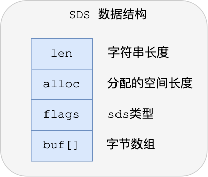

1. len：记录了字符串长度。这样获取字符串长度的时候，只需要返回这个成员变量值就行，时间复杂度只需要 O（1）。

2. alloc：分配给字符数组的空间长度。这样在修改字符串的时候，可以通过 `alloc - len` 计算出剩余的空间大小，可以用来判断空间是否满足修改需求，如果不满足的话，就会自动将 SDS 的空间扩展至执行修改所需的大小，然后才执行实际的修改操作，所以使用 SDS 既不需要手动修改 SDS 的空间大小，也不会出现前面所说的缓冲区溢出的问题。

3. flags：用来表示不同类型的 SDS。一共设计了 5 种类型，分别是 sdshdr5、sdshdr8、sdshdr16、sdshdr32 和 sdshdr64。
4. buf []：字节数组，用来保存实际数据。不仅可以保存字符串，也可以保存二进制数据。

### 为什么要使用 SDS？


#### 缓冲区溢出


C 字符串，如果程序员在字符串修改的时候如果忘记给字符串重新分配足够的空间，那么就会发生内存溢出，如上图所示，忘记给 s1 分配足够的内存空间，s1 的数据就会溢出到 s2 的空间，导致 s2 的内容被修改。而 Redis 提供的 SDS 其内置的空间分配策略则可以完全杜绝这种事情的发生。当 API 需要对 SDS 进行修改时，API 会首先会检查 SDS 的空间是否满足条件，如果不满足，API 会自动对它动态扩展，然后再进行修改。


#### 内存重分配

**C 字符串内存重分配**

在 C 字符串中，如果对字符串进行修改，那么我们就不得不面临内存重分配。因为 C 字符串是由一个 N+1 长度的数组组成，如果字符串的长度变长，我们就必须对数组进行扩容，否则会产生内存溢出。而如果字符串长度变短，我们就必须释放掉不再使用的空间，否则会发生内存泄漏。

**SDS 空间分配策略**

对于 Redis 这种具有高性能要求的内存数据库，如果每次修改字符串都要进行内存重分配，无疑是巨大的性能损失。而 Redis 的 SDS 提供了两种空间分配策略来解决这个问题。

1. 空间预分配

我们知道在数组进行扩容的时候，往往会申请一个更大的数组，然后把数组复制过去。为了提升性能，我们在分配空间的时候并不是分配一个刚刚好的空间，而是分配一个更大的空间。Redis 同样基于这种策略提供了空间预分配。当执行字符串增长操作并且需要扩展内存时，程序不仅仅会给 SDS 分配必需的空间还会分配额外的未使用空间，其长度存到 free 属性中。其分配策略如下:

* 如果修改后 len 长度将小于 1M，这时分配给 free 的大小和 len 一样，例如修改过后为 10 字节，那么给 free 也是 10 字节，buf 实际长度变成了 10+10+1 = 21byte

* 如果修改后 len 长度将大于等于 1M，这时分配给 free 的长度为 1M，例如修改过后为 30M，那么给 free 是 1M.buf 实际长度变成了 30M+1M+1byte


2. 惰性空间释放

惰性空间释放用于字符串缩短的操作。当字符串缩短时，程序并不是立即使用内存重分配来回收缩短出来的字节，而是使用 free 属性记录起来，并等待将来使用。


Redis 通过空间预分配和惰性空间释放策略在字符串操作中一定程度上减少了内存重分配的次数。但这种策略同样会造成一定的内存浪费，因此 Redis SDS API 提供相应的 API 让我们在有需要的时候真正的释放 SDS 的未使用空间

#### 二进制安全

C 字符串中的字符必须符合某种编码（比如 ASCII），并且除了字符串的末尾之外，字符串里面不能包含空字符，否则最先被程序读入的空字符将被误认为是字符串结尾，这些限制使得 C 字符串只能保存文本数据，而不能保存像图片、音频、视频、压缩文件这样的二进制数据。如果有一种使用空字符来分割多个单词的特殊数据格式，就不能用 C 字符串来表示，如 "Redis\0String"，C 字符串的函数会把'\0'当做结束符来处理，而忽略到后面的 "String"。而 SDS 的 buf 字节数组不是在保存字符，而是一系列二进制数组，SDS API 都会以二进制的方式来处理 buf 数组里的数据，使用 len 属性的值而不是空字符来判断字符串是否结束。

### 时间复杂度

1. 获取 SDS 长度：由于 SDS 中提供了 len 属性，因此我们可以直接获取时间复杂度为 O(1)，C 字符串为 O(n)。
2. 获取 SDS 未使用空间长度：时间复杂度为 0(1)，原因同 1。
3. 清除 SDS 保存的内容：由于惰性空间分配策略，复杂度为 O(1)。
4. 创建一个长度为 N 的字符串：时间复杂度为 O(n)。
5. 拼接一个长度为 N 的 C 字符串：时间复杂度为 O(n)。
6. 拼接一个长度为 N 的 SDS 字符串：时间复杂度为 O(n)。

Redis 在获取字符串长度上的时间复杂度为常数级 O(1)。

## 压缩列表（ziplist）

### 什么是压缩列表？

数组要求每个元素的大小相同，如果我们要存储不同长度的字符串，那么就需要用最大长度的字符串大小作为元素的大小（假设是 20 个字节），存储小于 20 个字节长度的字符串的时候，便会浪费部分存储空间


数组能够占用一片连续的空间，可以很好地利用 CPU 缓存访问数据，如果我们想要保留这种优势，又想节省存储空间，我们可以对数组进行压缩

但是我们在遍历它的时候不知道每个元素的大小，因此也无法计算出下一个节点的具体位置，可以给每个节点增加一个 length 的属性。 如此我们在遍历节点的之后就知道每个节点的长度（占用内存的大小），就可以很容易计算出下一个节点再内存中的位置。这种结构就像一个简单的压缩列表了。

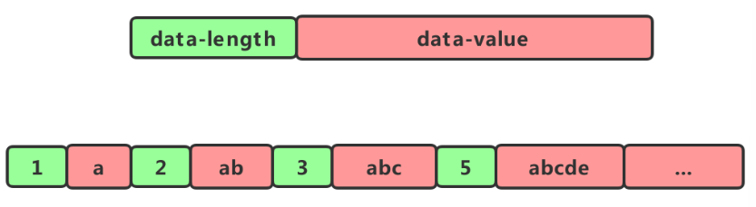

### 使用场景

压缩列表（ziplist）是列表和哈希的底层实现之一。

1. 当一个列表只包含少量列表项，并且每个列表项要么就是小整数值，要么就是长度比较短的字符串，那么 Redis 就会使用压缩列表来做列表的底层实现
2. 当一个哈希只包含少量键值对，并且每个键值对的键和值要么就是小整数值，要么就是长度比较短的字符串，那么 Redis 就会使用压缩列表来做哈希的底层实现

### 实现原理

**压缩列表构成**

压缩列表是 Redis 为了节约内存而开发的，是由一系列特殊编码的连续内存块组成的顺序型（sequential）数据结枃。一个压缩列表可以包含任意多个节点（entry）， 每个节点可以保存一个字节数组或者一个整数值


如上图，展示了一个总长为 80 字节，包含 3 个节点的压缩列表。如果我们有一个指向压缩列表起始地址的指针 p，那么表为节点的地址就是 P+60，复杂度是 O(1)。

而查找其他元素时，就没有这么高效了，只能逐个查找，此时的复杂度就是 O(N) 了，因此压缩列表不适合保存过多的元素

**压缩列表节点构成**

每个压缩列表节点可以保存一个字节数组或者一个整数值

字节数组可以是以下的 3 种：

1. 长度小于等于 63（2^6-1）字节的字节数组
2. 长度小于等于 16383（2^14-1）字节的字节数组
3. 长度小于等于 4294967295（2^32-1）字节的字节数组

整数值可以是以下的 6 种：

1. 4 位长，介于 0 至 12 之间的无符号整数
2. 1 字节长的有符号整数
3. 3 字节长的有符号整数
4. int16_t 类型整数
5. int32_t 类型整数
6. int64_t 类型整数

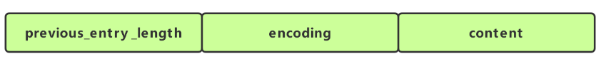

节点的 previous_entry_length 属性以字节为单位，记录了压缩列表中前一个节点的长度，previous_entry_length 属性的长度可以是 1 字节或者 5 字节

1. 如果前一节点的长度小于 254 字节，那么 previous_entry_length 属性的长度为 1 字节，前一节点的长度就保存在这一个字节里面
2. 如果前一节点的长度大于等于 254 字节，那么 previous_entry_length 属性的长度为 5 字节：其中属性的第一字节会被设置为 0xFW（十进制 254），而之后的四个字节则用于保存前一节点的长度

节点的 encoding 属性记录了节点的 content 属性所保存数据的类型以及长度

1. 1 字节、2 字节或者 5 字节长，值的最高位为 00、01 或者 10 的是字节数组编码，这种编码表示节点的 content 属性保存着字节数组，数组的长度由编码除去最高两位之后的其他位记录
2. 1 字节长，值的最高位为 11 开头的整数编码，这种编码表示节点的 content 属性保存着整数值，整数值的类型和长度由编码除去最高两位之后的其他位记录

节点的 content 属性负责保存节点的值，节点值可以是一个字节数组或者整数，值的类型和长度由节点的 encoding 属性决定

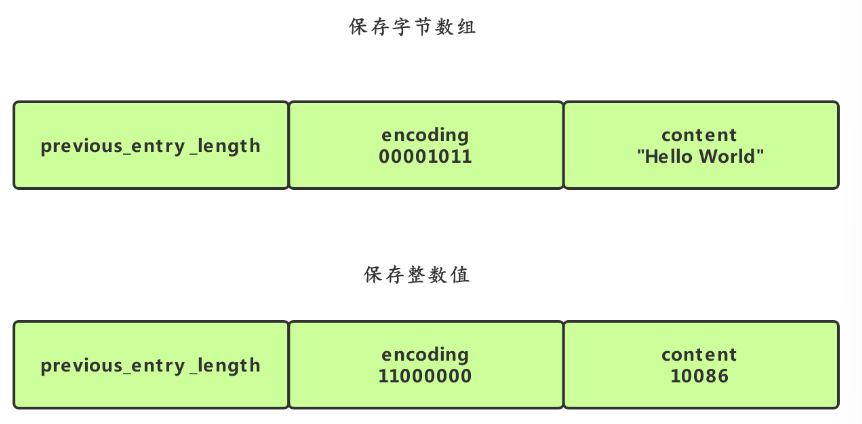

- 编码的最高两位 00 表示节点保存的是一个字节数组。
- 编码的后六位 001011 记录了字节数组的长度 11。
- content 属性保存着节点的值 "hello world"。
- 编码 11000000 表示节点保存的是一个 int16_t 类型的整数值;
- content 属性保存着节点的值 10086

### 连锁更新

压缩列表新增某个元素或修改某个元素时，如果空间不够，压缩列表占用的内存空间就需要重新分配。而当新插入的元素较大时，可能会导致后续元素的 prevlen 占用空间都发生变化，从而引起「连锁更新」问题，导致每个元素的空间都要重新分配，造成访问压缩列表性能的下降。

现在假设一个压缩列表中有多个连续的、长度在 250～253 之间的节点，如下图：


因为这些节点长度值小于 254 字节，所以 prevlen 属性需要用 1 字节的空间来保存这个长度值。

这时，如果将一个长度大于等于 254 字节的新节点加入到压缩列表的表头节点，即新节点将成为 e1 的前置节点，如下图：


因为 e1 节点的 prevlen 属性只有 1 个字节大小，无法保存新节点的长度，此时就需要对压缩列表的空间重分配操作，并将 e1 节点的 prevlen 属性从原来的 1 字节大小扩展为 5 字节大小。


e1 原本的长度在 250～253 之间，因为刚才的扩展空间，此时 e1 的长度就大于等于 254 了，因此原本 e2 保存 e1 的 prevlen 属性也必须从 1 字节扩展至 5 字节大小。

正如扩展 e1 引发了对 e2 扩展一样，扩展 e2 也会引发对 e3 的扩展，而扩展 e3 又会引发对 e4 的扩展.... 一直持续到结尾。

### 时间复杂度

| 操作                                                         | 时间复杂度                                                   |
| ------------------------------------------------------------ | ------------------------------------------------------------ |
| 创建一个新的压缩列表                                         | O(1)                                                         |
| 创建一个包含给定值的新节点, 并将这个新节点添加到压缩列表的表头或者表尾 | 平均 O(N)，最坏 O(N^2)(可能发生连锁更新)                     |
| 将包含给定值的新节点插入到给定节点之后                       | 平均 O(N)，最坏 O(N^2)(可能发生连锁更新)                     |
| 返回压缩列表给定索引上的节点                                 | O(N)                                                         |
| 在压缩列表中査找并返回包含了给定值的节点                     | 因为节点的值可能是一个字节数组，所以检查节点值和给定值是否相同的复杂度为 O(N)，而查找整个列表的复杂度则为(N^2) |
| 返回给定节点的下一个节点                                     | O(1)                                                         |
| 返回给定节点的前一个节点                                     | O(1)                                                         |
| 获取给定节点所保存的值                                       | O(1)                                                         |
| 从压缩列表中删除给定的节点                                   | 平均 O(N)，最坏 O(N^2)(可能发生连锁更新)                     |
| 删除压缩列表在给定索引上的连续多个                           | 平均 O(N)，最坏 O(N^2)(可能发生连锁更新)                     |
| 返回压缩列表目前占用的内存字节数                             | O(1)                                                         |
| 返回压缩列表目前包含的节点数量                               | 节点数量小于 65535 时为 O(1)， 大于 65535 时为 O(N)          |

## 链表（linkedlist）

### 双向无环链表


Redis 链表使用双向无环链表。如图所示，Redis 使用一个 listNode 结构来表示。

```c++
typedef struct listNode{ 
	// 前置节点 
	struct listNode *prev; 
	// 后置节点 
	struct listNode *next; 
	// 节点的值 
	void *value; 
} listNode;
```

### list 结构

同时 Redis 为了方便的操作链表，提供了一个 list 结构来持有链表。如下图所示


```c++
typedef struct list{
    //表头节点
    listNode *head;
    //表尾节点
    listNode *tail;
    //链表所包含的节点数量
    unsigned long len;
    //节点值复制函数
    void *(*dup)(void *ptr);
    //节点值释放函数
    void *(*free)(void *ptr);
    //节点值对比函数
    int (*match)(void *ptr,void *key);
}list;
```

Redis 链表结构其主要特性如下:

- 双向：链表节点带有前驱、后继指针获取某个节点的前驱、后继节点的时间复杂度为 0(1)。
- 无环: 链表为非循环链表表头节点的前驱指针和表尾节点的后继指针都指向 NULL，对链表的访问以 NULL 为终点。
- 带表头指针和表尾指针：通过 list 结构中的 head 和 tail 指针，获取表头和表尾节点的时间复杂度都为 O(1)。
- 带链表长度计数器: 通过 list 结构的 len 属性获取节点数量的时间复杂度为 O(1)。
- 多态：链表节点使用 void*指针保存节点的值，并且可以通过 list 结构的 dup、free、match 三个属性为节点值设置类型特定函数，所以链表可以用来保存各种不同类型的值。

### 时间复杂度

链表在 Redis 中的应用非常广泛，列表对象的底层实现之一就是链表。此外如发布订阅、慢查询、监视器等功能也用到了链表。我们现在简单想一想 Redis 为什么要使用双向无环链表这种数据结构，而不是使用数组、单向链表等。既然列表对象的底层实现之一是链表，那么我们通过一个表格来分析列表对象的常用操作命令。如果分别使用数组、单链表和双向链表实现列表对象的时间复杂度对照如下:

| 操作\时间复杂度                   | 数组 | 单链表 | 双向链表 |
| --------------------------------- | ---- | ------ | -------- |
| rpush(从右边添加元素)             | O(1) | O(1)   | O(1)     |
| lpush(从左边添加元素)             | O(N) | O(1)   | O(1)     |
| lpop (从右边删除元素)             | O(1) | O(1)   | O(1)     |
| rpop (从左边删除元素)             | O(N) | O(1)   | O(1)     |
| lindex(获取指定索引下标的元素)    | O(1) | O(N)   | O(N)     |
| len (获取长度)                    | O(N) | O(N)   | O(1)     |
| linsert(向某个元素前或后插入元素) | O(N) | O(N)   | O(1)     |
| lrem (删除指定元素)               | O(N) | O(N)   | O(N)     |
| lset (修改指定索引下标元素)       | O(N) | O(N)   | O(N)     |

我们可以看到在列表对象常用的操作中双向链表的优势所在。但双向链表因为使用两个额外的空间存储前驱和后继指针，因此在数据量较小的情况下会造成空间上的浪费（因为数据量小的时候速度上的差别不大，但空间上的差别很大）。这是一个时间换空间还是空间换时间的思想问题，Redis 在列表对象中小数据量的时候使用压缩列表作为底层实现，而大数据量的时候才会使用双向无环链表。

## 快速列表（quicklist）

### 基本结构

quicklist 实际上是 zipList 和 linkedList 的混合体，它将 linkedList 按段切分，每一段使用 zipList 来紧凑存储，多个 zipList 之间使用双向指针串接起来。


```c++
typedef struct quicklist {
    quicklistNode *head;
    quicklistNode *tail;
    unsigned long count;        /* total count of all entries in all ziplists */
    unsigned long len;          /* number of quicklistNodes */
    int fill : QL_FILL_BITS;              /* fill factor for individual nodes */
    unsigned int compress : QL_COMP_BITS; /* depth of end nodes not to compress;0=off */
    unsigned int bookmark_count: QL_BM_BITS;
    quicklistBookmark bookmarks[];
} quicklist;
```

- head：指向头节点（左侧第一个节点）的指针。
- tail：指向尾节点（右侧第一个节点）的指针。
- count：所有 ziplist 数据项的个数总和。
- len：quicklist 节点的个数。
- fill：16bit，ziplist 大小设置，存放 `list-max-ziplist-size` 参数的值。
- compress：16bit，节点压缩深度设置，存放 `list-compress-depth` 参数的值。

```c++
typedef struct quicklistNode {
    struct quicklistNode *prev; //上一个node节点
    struct quicklistNode *next; //下一个node
    unsigned char *zl;            //保存的数据 压缩前ziplist 压缩后压缩的数据
    unsigned int sz;             /* ziplist size in bytes */
    unsigned int count : 16;     /* count of items in ziplist */
    unsigned int encoding : 2;   /* RAW==1 or LZF==2 */
    unsigned int container : 2;  /* NONE==1 or ZIPLIST==2 */
    unsigned int recompress : 1; /* was this node previous compressed? */
    unsigned int attempted_compress : 1; /* node can't compress; too small */
    unsigned int extra : 10; /* more bits to steal for future usage */
} quicklistNode;
```

- prev：指向链表前一个节点的指针。
- next：指向链表后一个节点的指针。
- zl：数据指针。如果当前节点的数据没有压缩，那么它指向一个 ziplist 结构；否则，它指向一个 quicklistLZF 结构。
- sz：表示 zl 指向的 ziplist 的总大小（包括 `zlbytes`, `zltail`, `zllen`, `zlend` 和各个数据项）。需要注意的是：如果 ziplist 被压缩了，那么这个 sz 的值仍然是压缩前的 ziplist 大小。
- count：表示 ziplist 里面包含的数据项个数。这个字段只有 16bit。
- encoding：表示 ziplist 是否压缩了（以及用了哪个压缩算法）。目前只有两种取值：2 表示被压缩了（而且用的是 LZF 压缩算法），1 表示没有压缩。
- container：是一个预留字段。本来设计是用来表明一个 quicklist 节点下面是直接存数据，还是使用 ziplist 存数据，或者用其它的结构来存数据（用作一个数据容器，所以叫 container）。但是，在目前的实现中，这个值是一个固定的值 2，表示使用 ziplist 作为数据容器。
- recompress：当我们使用类似 lindex 这样的命令查看了某一项本来压缩的数据时，需要把数据暂时解压，这时就设置 recompress = 1 做一个标记，等有机会再把数据重新压缩。
- attempted_compress：这个值只对 Redis 的自动化测试程序有用。我们不用管它。
- extra：其它扩展字段。目前 Redis 的实现里也没用上。

```c++
typedef struct quicklistLZF {
    unsigned int sz; /* LZF size in bytes*/
    char compressed[];
} quicklistLZF;
```

quicklistLZF 结构表示一个被压缩过的 ziplist。其中：

- sz：表示压缩后的 ziplist 大小。
- compressed：是个柔性数组（flexible array member），存放压缩后的 ziplist 字节数组。

### 插入

quicklist 可以选择在头部或者尾部进行插入（`quicklistPushHead` 和 `quicklistPushTail`），而不管是在头部还是尾部插入数据，都包含两种情况：

- 如果头节点（或尾节点）上 ziplist 大小没有超过限制（即 `_quicklistNodeAllowInsert` 返回 1），那么新数据被直接插入到 ziplist 中（调用 `ziplistPush`）。
- 如果头节点（或尾节点）上 ziplist 太大了，那么新创建一个 quicklistNode 节点（对应地也会新创建一个 ziplist），然后把这个新创建的节点插入到 quicklist 双向链表中。

也可以从任意指定的位置插入。`quicklistInsertAfter` 和 `quicklistInsertBefore` 就是分别在指定位置后面和前面插入数据项。这种在任意指定位置插入数据的操作，要比在头部和尾部的进行插入要复杂一些。

- 当插入位置所在的 ziplist 大小没有超过限制时，直接插入到 ziplist 中就好了；
- 当插入位置所在的 ziplist 大小超过了限制，但插入的位置位于 ziplist 两端，并且相邻的 quicklist 链表节点的 ziplist 大小没有超过限制，那么就转而插入到相邻的那个 quicklist 链表节点的 ziplist 中；
- 当插入位置所在的 ziplist 大小超过了限制，但插入的位置位于 ziplist 两端，并且相邻的 quicklist 链表节点的 ziplist 大小也超过限制，这时需要新创建一个 quicklist 链表节点插入。
- 对于插入位置所在的 ziplist 大小超过了限制的其它情况（主要对应于在 ziplist 中间插入数据的情况），则需要把当前 ziplist 分裂为两个节点，然后再其中一个节点上插入数据。

### 查找

list 的查找操作主要是对 index 的，我们的 quicklist 的节点是由一个一个的 ziplist 构成的，每个 ziplist 都有大小。所以我们就只需要先根据我们每个 node 的个数，从而找到对应的 ziplist，调用 ziplist 的 index 就能成功找到。

### 删除

区间元素删除的函数是 `quicklistDelRange`

quicklist 在区间删除时，会先找到 start 所在的 quicklistNode，计算删除的元素是否小于要删除的 count，如果不满足删除的个数，则会移动至下一个 quicklistNode 继续删除，依次循环直到删除完成为止。

`quicklistDelRange` 函数的返回值为 int 类型，当返回 1 时表示成功的删除了指定区间的元素，返回 0 时表示没有删除任何元素。

### 时间复杂度

| 操作                                            | 时间复杂度 |
| ----------------------------------------------- | ---------- |
| quicklistCreate：创建 quicklist                 | ？         |
| quicklistInsertAfter：在某个元素的后面添加数据  | ？         |
| quicklistInsertBefore：在某个元素的前面添加数据 | ？         |
| quicklistReplaceAtIndex：替换某个元素           | ？         |
| quicklistDelEntry：删除单个元素                 | ？         |
| quicklistDelRange：删除区间元素                 | ？         |
| quicklistPushHead：头部插入元素                 | ？         |
| quicklistPushTail：尾部插入元素                 | ？         |

## 字典（hashtable）

### 结构


**字典**

```c++
typedef struct dict{
     //类型特定函数
     void *type;
     //私有数据
     void *privdata;
     //哈希表
     dictht ht[2];
     //rehash 索引 当rehash不在进行时 值为-1
     int trehashidx; 
}dict;
```

type 属性和 privdata 属性是针对不同类型的键值对，为创建多态字典而设置的。

- type 属性是一个指向 dictType 结构的指针，每个 dictType 用于操作特定类型键值对的函数，Redis 会为用途不同的字典设置不同的类型特定函数。
- privdata 属性则保存了需要传给给那些类型特定函数的可选参数。

```c++
typedef struct dictType{
     //计算哈希值的函数 
     unsigned int  (*hashFunction) (const void *key);
     //复制键的函数
     void *(*keyDup) (void *privdata,const void *key);
     //复制值的函数
     void *(*keyDup) (void *privdata,const void *obj);
      //复制值的函数
     void *(*keyCompare) (void *privdata,const void *key1, const void *key2);
     //销毁键的函数
     void (*keyDestructor) (void *privdata, void *key);
     //销毁值的函数
     void (*keyDestructor) (void *privdata, void *obj);
}dictType;
```

- ht 属性是一个包含两个项的数组，数组中的每个项都是一个 dictht 哈希表， 一般情况下，字典只使用 ht [0] 哈希表, ht [1] 哈希表只会对 ht [0] 哈希表进行 rehash 时使用。
- trehashidx 记录了 rehash 目前的进度，如果目前没有进行 rehash，值为-1。

**散列表**

```c++
typedef struct dictht{
     //哈希表数组，C语言中，*号是为了表明该变量为指针，有几个* 号就相当于是几级指针，这里是二级指针，理解为指向指针的指针
     dictEntry **table;
     //哈希表大小
     unsigned long size;
     //哈希表大小掩码，用于计算索引值
     unsigned long sizemask;
     //该哈希已有节点的数量
     unsigned long used;
}dictht;
```

- table 属性是一个数组，数组中的每个元素都是一个指向 dict.h/dictEntry 结构的指针，每个 dictEntry 结构保存着一个键值对
- size 属性记录了哈希表的大小，也是 table 数组的大小
- used 属性则记录哈希表目前已有节点(键值对)的数量
- sizemask 属性的值总是等于 size-1(从 0 开始)，这个属性和哈希值一起决定一个键应该被放到 table 数组的哪个索引上面（索引下标值）。

**散列表节点**

```c++
//哈希表节点定义dictEntry结构表示，每个dictEntry结构都保存着一个键值对。
typedef struct dictEntry{
    //键
    void *key;
    //值
    union {
        void *val;
        uint64_t u64;
        int64_t s64;
        double d;
    } v;
    // 指向下个哈希表节点，形成链表
    struct dictEntry *next;
}dictEntry;
```

key 属性保存着键值中的键，而 v 属性则保存着键值对中的值，其中键值(v 属性)可以是一个指针，或 uint64_t 整数，或 int64_t 整数。 next 属性是指向另一个哈希表节点的指针，这个指针可以将多个哈希值相同的键值对连接在一起，解决键冲突问题。

### 解决散列冲突

#### 链表法

当有两个或以上的键被分配到散列表数组同一个索引上时，就发生了键冲突。Redis 使用链表法解决散列冲突。每个散列表节点都有一个 next 指针，多个散列表节点 next 可以用 next 指针构成一个单向链表，被分配到同一个索引上的多个节点可以使用这个单向链表连接起来。


#### rehash

随着操作的进行，散列表中保存的键值对会也会不断地增加或减少，为了保证负载因子维持在一个合理的范围，当散列表内的键值对过多或过少时，内需要定期进行 rehash，以提升性能或节省内存。Redis 的 rehash 的步骤如下:


1. 为字典的 ht [1] 散列表分配空间，这个空间的大小取决于要执行的操作以及 ht [0] 当前包含的键值对数量(即: ht [0].used 的属性值)

- 扩展操作：ht [1] 的大小为 第一个大于等于 ht [0].used*2 的 2 的 n 次方幂。如: ht [0].used = 3 则 ht [1] 的大小为 8，ht [0].used = 4 则 ht [1] 的大小为 8。
- 收缩操作：ht [1] 的大小为 第一个大于等于 ht [0].used 的 2 的 n 次方幂。


2. 将保存在 ht [0] 中的键值对重新计算键的散列值和索引值，然后放到 ht [1] 指定的位置上。


3. 将 ht [0] 包含的所有键值对都迁移到了 ht [1] 之后，释放 ht [0], 将 ht [1] 设置为 ht [0]，并创建一个新的 ht [1] 哈希表为下一次 rehash 做准备。


**rehash 操作需要满足以下条件:**

负载因子 = 哈希表已保存节点数量/哈希表大小

1. 服务器目前没有执行 BGSAVE(rdb 持久化)命令或者 BGREWRITEAOF(AOF 文件重写)命令，并且散列表的负载因子大于等于 1。
2. 服务器目前正在执行 BGSAVE 命令或者 BGREWRITEAOF 命令，并且负载因子大于等于 5。
3. 当负载因子小于 0.1 时，程序自动开始执行收缩操作。

Redis 这么做的目的是基于操作系统创建子进程后写时复制技术，避免不必要的写入操作。

#### 渐进式 rehash

对于 rehash 我们思考一个问题如果散列表当前大小为 1GB，要想扩容为原来的两倍大小，那就需要对 1GB 的数据重新计算哈希值，并且从原来的散列表搬移到新的散列表。这种情况听着就很耗时，而生产环境中甚至会更大。为了解决一次性扩容耗时过多的情况，可以将扩容操作穿插在插入操作的过程中，分批完成。当负载因子触达阈值之后，只申请新空间，但并不将老的数据搬移到新散列表中。当有新数据要插入时，将新数据插入新散列表中，并且从老的散列表中拿出一个数据放入到新散列表。每次插入一个数据到散列表，都重复上面的过程。经过多次插入操作之后，老的散列表中的数据就一点一点全部搬移到新散列表中了。这样没有了集中的一次一次性数据搬移，插入操作就都变得很快了。

Redis 为了解决这个问题采用渐进式 rehash 方式。以下是 Redis 渐进式 rehash 的详细步骤:

1. 为 `ht[1]` 分配空间， 让字典同时持有 `ht[0]` 和 `ht[1]` 两个哈希表。
2. 在字典中维持一个索引计数器变量 `rehashidx` ， 并将它的值设置为 `0` ，表示 rehash 工作正式开始。
3. 在 rehash 进行期间， 每次对字典执行添加、删除、查找或者更新操作时， 程序除了执行指定的操作以外， 还会顺带将 `ht[0]` 哈希表在 `rehashidx` 索引上的所有键值对 rehash 到 `ht[1]` ， 当 rehash 工作完成之后， 程序将 `rehashidx` 属性的值增一。
4. 随着字典操作的不断执行， 最终在某个时间点上， `ht[0]` 的所有键值对都会被 rehash 至 `ht[1]` ， 这时程序将 `rehashidx` 属性的值设为 `-1` ， 表示 rehash 操作已完成。

**说明: **

1. 因为在进行渐进式 rehash 的过程中，字典会同时使用 `ht[0]` 和 `ht[1]` 两个哈希表，所以在渐进式 rehash 进行期间，字典的删除（delete）、查找（find）、更新（update）等操作会在两个哈希表上进行。

2. 在渐进式 rehash 执行期间，新添加到字典的键值对一律会被保存到 `ht[1]` 里面，而 `ht[0]` 则不再进行任何添加操作：这一措施保证了 `ht[0]` 包含的键值对数量会只减不增，并随着 rehash 操作的执行而最终变成空表。

### 时间复杂度

| 操作                                           | 时间复杂度                      |
| ---------------------------------------------- | ------------------------------- |
| 创建一个新字典                                 | O(1)                            |
| 将给定的键值对添加到字典内                     | O(1)                            |
| 将给定的键值对添加到字典内，如果键存在则替换之 | O(1)                            |
| 返回给定键的值                                 | O(1)                            |
| 从字典中随机返回一个键值对                     | O(1)                            |
| 从字典中删除给定键所对应的键值对               | O(1)                            |
| 释放给定字典以及字典中包含的键值对             | O(N)，N 为字典包含的键值对的数量 |

## 整数集合（intset）

### 结构

整数集合（intset）是 Redis 用于保存整数值的集合抽象数据结构，它可以保存类型为 int16_t、int32_t 或者 int64_t 的整数值，并且保证集合中不会出现重复元素

```c++
//每个 intset 结构表示一个整数集合
typedef struct intset{
    //编码方式
    uint32_t encoding;
    //集合中包含的元素数量
    uint32_t length;
    //保存元素的数组
    int8_t contents[];
} intset;
```

1. contents 数组是整数集合的底层实现，整数集合的每个元素都是 contents 数组的个数组项（item），各个项在数组中按值的大小从小到大有序地排列，并且数组中不包含任何重复项
2. length 属性记录了数组的长度
3. intset 结构将 contents 属性声明为 int8_t 类型的数组，但实际上 contents 数组并不保存任何 int8_t 类型的值，contents 数组的真正类型取决于 encoding 属性的值。encoding 属性的值为 INTSET_ENC_INT16，则数组就是 uint16_t 类型，数组中的每一个元素都是 int16_t 类型的整数值（-32768-32767），encoding 属性的值为 INTSET_ENC_INT32，则数组就是 uint32_t 类型，数组中的每一个元素都是 int32_t 类型的整数值（-2147483648-2147483647）

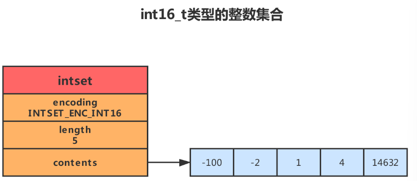

如上图，为一 int16_t 类型的整数集合，我们可以看到数组中存储了 5 个 int16_t 类型的整数，它们按照从小到大的顺序依次排列。这个时候我们思考一个问题。如果这个时候存入一个 int32_t 类型的整数会怎么样？内存溢出？这个时候就要提到整数集合的升级。

### 升级过程

每当我们要将一个新元素添加到整数集合里面，并且新元素的类型比整数集合现有所有元素的类型都要长时，整数集合需要先进行升级，然后才能将新元素添加到整数集合里面。升级整数集合并添加新元素的过程如下：

1. 根据新元素的类型，扩展整数集合底层数组的空间大小，并为新元素分配空间
2. 将底层数组现有的所有元素都转换成与新元素相同的类型，并将类型转换后的元素放置到正确的位置上，而且在放置元素的过程中，需要维持底层数组的有序性质不变
3. 将新元素添加到底层数组里面


优点：

1. 提升灵活性

因为 C 语言是静态类型语言，为了避免类型错误，我们通常不会将两种不同类型的值放在同一个数据结构里面，但是整数集合可以通过自动升级底层数组来适应新元素，所以我们可以随意地将 int16_t、int32_t 或者 int64_t 类型的整数添加到集合中，而不必担心出现类型错误

2. 节约内存

要让一个数组可以同时保存 int16_t、int32_t、int64_t 三种类型的值, 最简单的做法就是直接使用 int64t 类型的数组作为整数集合的底层实现。不过这样一来, 即使添加到整数集合里面的都是 int16_t 类型或者 int32_t 类型的值, 数组都需要使用 int64_t 类型的空间去保存它们, 从而出现浪费内存的情况。

整数集合既可以让集合能同时保存三种不同类型的值，又可以确保升级操作只会在有需要的时候进行，这可以尽量节省内存。如果我们一直只向整数集合添加 int16_t 类型的值，那么整数集合的底层实现就会一直是 int16_t 类型的数组，只有我们要将 int32_t 类型或者 int64_t 类型的值添加到集合时，程序才会对数组进行升级

### 降级

整数集合不支持降级操作，一旦对数组进行了升级，编码就会一直保持升级后的状态，即一旦我们向一个 int16_t 的整数集合内添加了一个 int32_t 的元素后，整数集合将升级到 int32_t 类型，即使后续的操作中我们删除了这个元素，整数集合还是会保持 int32_t 类型的状态

### 时间复杂度

| 操作                     | 时间复杂度 |
| ------------------------ | ---------- |
| 创建一个新的整数集合     | O(1)       |
| 添加指定元素到集合       | O(N)       |
| 移除指定元素             | O(N)       |
| 判断指定元素是否在集合中 | O(logN)    |
| 随机返回一个元素         | O(1)       |
| 取出在指定索引上的元素   | O(1)       |
| 返回集合包含的元素个数   | O(1)       |
| 返回集合占用的内存字节数 | O(1)       |

## 跳跃表（skiplist）

### 什么是跳跃表？

对于一个单链表来说，即便链表中存储的数据是有序的，如果我们要想在其中查找某个数据，也只能从头到尾遍历链表，这样查找效率就会很低，时间复杂度很高，为 O（n）。如果我们想要提高其查找效率，可以考虑在链表上建立索引的方式，每两个结点提取一个结点到上一级我们把抽出来的那一级叫做索引

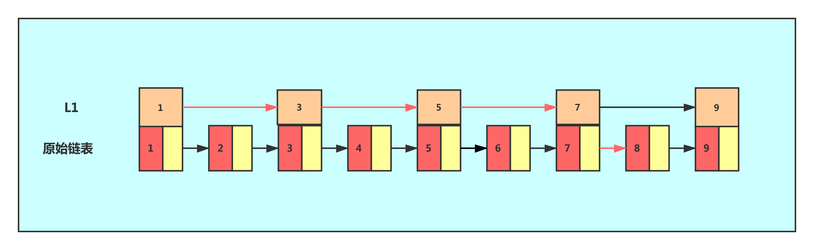

这时，假设我们要查找节点 8，可以先在索引层上遍历，当遍历到索引层中值为 7 的节点时，发现下一个节点是 9，那么要查找的节点 8 肯定就在这两个节点之间，就下降到链表层继续遍历就找到了节点 8，原先在链表中需要遍历 8 个节点，现在只要遍历 5 个节点

结论：加一层索引之后，查找一个节点需要遍历的节点个数减少了，查找效率提高了，同理再加一级索引

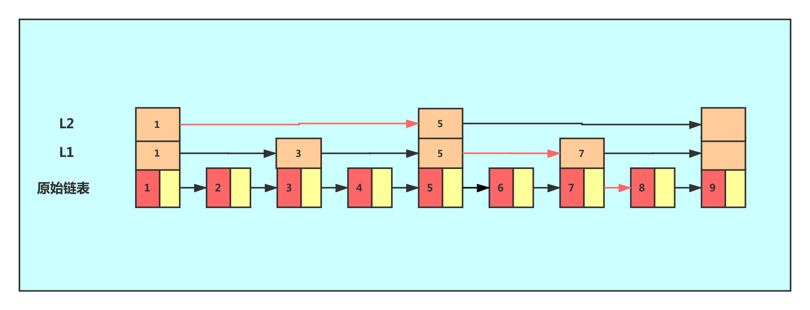


Redis 使用跳跃表作为有序集合键的底层实现之一，如果一个有序集合包含的元素数量比较多，又或者有序集合中元素的成员是比较长的字符串时，Redis 就会使用跳跃表来作为有序集合健的底层实现。

这里我们需要思考一个问题——为什么元素数量比较多或者成员是比较长的字符串的时候 Redis 要使用跳跃表来实现？

从上面我们可以知道，跳跃表在链表的基础上增加了多级索引以提升查找的效率，但其是一个空间换时间的方案，必然会带来一个问题——索引是占内存的。原始链表中存储的有可能是很大的对象，而索引结点只需要存储关键值和几个指针，并不需要存储对象，因此当节点本身比较大或者元素数量比较多的时候，其优势必然会被放大，而缺点则可以忽略。

### 实现原理

Redis 的跳跃表由 zskiplistNode 和 skiplist 两个结构定义，其中 zskiplistNode 结构用于表示跳跃表节点，而 zskiplist 结构则用于保存跳跃表节点的相关信息，比如节点的数量，以及指向表头节点和表尾节点的指针等等。


上图展示了一个跳跃表示例，其中最左边的是 skiplist 结构，该结构包含以下属性。

1. header：指向跳跃表的表头节点，通过这个指针程序定位表头节点的时间复杂度就为 O(1)
2. tail：指向跳跃表的表尾节点，通过这个指针程序定位表尾节点的时间复杂度就为 O(1)
3. level：记录目前跳跃表内，层数最大的那个节点的层数（表头节点的层数不计算在内），通过这个属性可以在 O(1)的时间复杂度内获取层高最好的节点的层数。
4. length：记录跳跃表的长度, 也即是, 跳跃表目前包含节点的数量（表头节点不计算在内），通过这个属性，程序可以在 O(1)的时间复杂度内返回跳跃表的长度。

结构右方的是四个 zskiplistNode 结构，该结构包含以下属性

1. 层(level)：

节点中用 L1、L2、L3 等字样标记节点的各个层，L1 代表第一层, L2 代表第二层，以此类推。

每个层都带有两个属性：前进指针和跨度。

* 前进指针：每个层都有一个指向表尾方向的前进指针（level [i].forward 属性），用于从表头向表尾方向访问节点

* 跨度：层的跨度（level [i].span 属性）记录了前进指针所指向节点和当前节点的距离（跨度越大、距离越远），指向 NULL 的所有前进指针的跨度都为 0，因为它们没有连向任何节点。在上图中，连线上带有数字的箭头就代表前进指针，而那个数字就是跨度。当程序从表头向表尾进行遍历时，访问会沿着层的前进指针进行。

每次创建一个新跳跃表节点的时候，程序都根据幂次定律（powerlaw, 越大的数出现的概率越小）随机生成一个介于 1 和 32 之间的值作为 level 数组的大小，这个大小就是层的“高度”。

2. 后退(backward)指针：

节点中用 BW 字样标记节点的后退指针，它指向位于当前节点的前一个节点。后退指针在程序从表尾向表头遍历时使用。与前进指针所不同的是每个节点只有一个后退指针，因此每次只能后退一个节点。

3. 分值(score)：

各个节点中的 1.0、2.0 和 3.0 是节点所保存的分值。节点的分值是一个 double 类型浮点数，在跳跃表中, 节点按各自所保存的分值从小到大排列。

4. 成员对象(oj)：

各个节点中的 o1、o2 和 o3 是节点所保存的成员对象。在同一个跳跃表中，各个节点保存的成员对象必须是唯一的，但是多个节点保存的分值却可以是相同的：分值相同的节点将按照成员对象在字典序中的大小来进行排序，成员对象较小的节点会排在前面（靠近表头的方向）， 而成员对象较大的节点则会排在后面（靠近表尾的方向）。

节点的成员对象是一个指针，指向一个字符串对象，而字符串对象则保存着一个 SDS 值


```c++
typedef struct zskiplistNode {
    // 层
    struct zskiplistLevel {
        // 前进指针
        struct zskiplistNode *forward;
        // 跨度
        unsigned int span;
    } level[];
    //  后退指针
    struct zskiplistNode *backward;
    // 分值
    double score;
    // 成员对象
    robj *obj;
} zskiplistNode;

typedef struct zskiplist {
    // 表头节点和表尾节点
    struct zskiplistNode *header, *tail;
    // 表中节点数量
    unsigned long length;
    // 表中层数最大的节点的层数
    int level;
} zskiplist;

typedef struct zset {
    dict *dict;
    zskiplist *zsl;
} zset;
```

### 查询

查找一个跳表节点的过程时，跳表会从头节点的最高层开始，逐一遍历每一层。在遍历某一层的跳表节点时，会用跳表节点中的 SDS 类型的元素和元素的权重来进行判断，共有两个判断条件：

- 如果当前节点的权重「小于」要查找的权重时，跳表就会访问该层上的下一个节点。
- 如果当前节点的权重「等于」要查找的权重时，并且当前节点的 SDS 类型数据「小于」要查找的数据时，跳表就会访问该层上的下一个节点。

如果上面两个条件都不满足，或者下一个节点为空时，跳表就会使用目前遍历到的节点的 level 数组里的下一层指针，然后沿着下一层指针继续查找，这就相当于跳到了下一层接着查找。


如果要查找「元素：abcd，权重：4」的节点，查找的过程是这样的：

1. 先从头节点的最高层开始，L2 指向了「元素：abc，权重：3」节点，这个节点的权重比要查找节点的小，所以要访问该层上的下一个节点；
2. 但是该层的下一个节点是空节点（ leve [2] 指向的是空节点），于是就会跳到「元素：abc，权重：3」节点的下一层去找，也就是 leve [1]；
3. 「元素：abc，权重：3」节点的 leve [1] 的下一个指针指向了「元素：abcde，权重：4」的节点，然后将其和要查找的节点比较。虽然「元素：abcde，权重：4」的节点的权重和要查找的权重相同，但是当前节点的 SDS 类型数据「大于」要查找的数据，所以会继续跳到「元素：abc，权重：3」节点的下一层去找，也就是 leve [0]；
4. 「元素：abc，权重：3」节点的 leve [0] 的下一个指针指向了「元素：abcd，权重：4」的节点，该节点正是要查找的节点，查询结束。

### 插入

插入 level = 3，key = 1 时

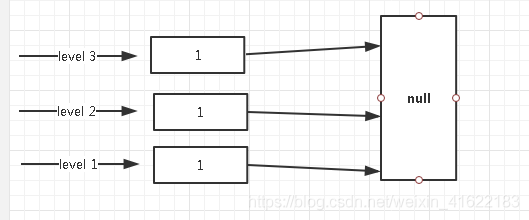

插入 level = 1，key = 2

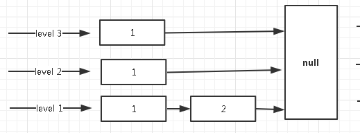

插入 level = 2，key = 3

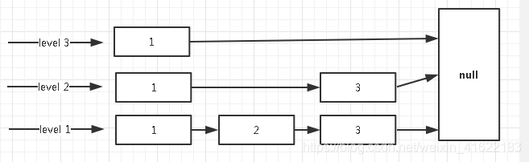

插入 level = 3，key = 5

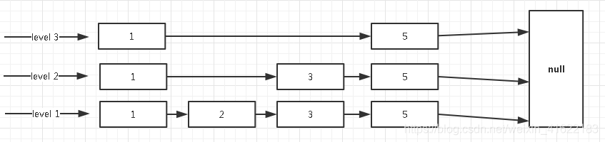

插入 level = 1，key = 66

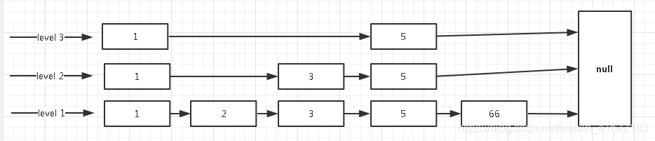

插入 level = 2，key = 100

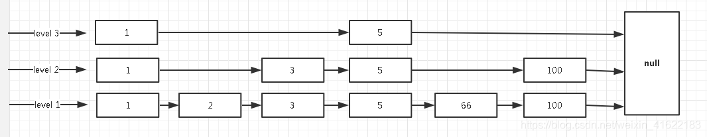

### 节点层数设置

跳表的相邻两层的节点数量的比例会影响跳表的查询性能。


这时，如果想要查询节点 6，那基本就跟链表的查询复杂度一样，就需要在第一层的节点中依次顺序查找，复杂度就是 O(N) 了。所以，为了降低查询复杂度，我们就需要维持相邻层结点数间的关系。

跳表的相邻两层的节点数量最理想的比例是 2:1，查找复杂度可以降低到 O(logN)。


**那怎样才能维持相邻两层的节点数量的比例为 2 : 1 呢？**

如果采用新增节点或者删除节点时，来调整跳表节点以维持比例的方法的话，会带来额外的开销。

Redis 则采用一种巧妙的方法是，跳表在创建节点的时候，随机生成每个节点的层数，并没有严格维持相邻两层的节点数量比例为 2 : 1 的情况。

具体的做法是，跳表在创建节点时候，会生成范围为 [0-1] 的一个随机数，如果这个随机数小于 0.25（相当于概率 25%），那么层数就增加 1 层，然后继续生成下一个随机数，直到随机数的结果大于 0.25 结束，最终确定该节点的层数。

这样的做法，相当于每增加一层的概率不超过 25%，层数越高，概率越低，层高最大限制是 64。

如果层高最大限制是 64，那么在创建跳表「头节点」的时候，就会直接创建 64 层高的头节点。

### 为什么用跳表而不用平衡树？

1. 从内存占用上来比较，跳表比平衡树更灵活一些。平衡树每个节点包含 2 个指针（分别指向左右子树），而跳表每个节点包含的指针数目平均为 1/(1-p)，具体取决于参数 p 的大小。如果像 Redis 里的实现一样，取 p = 1/4，那么平均每个节点包含 1.33 个指针，比平衡树更有优势。

2. 在做范围查找的时候，跳表比平衡树操作要简单。在平衡树上，我们找到指定范围的小值之后，还需要以中序遍历的顺序继续寻找其它不超过大值的节点。如果不对平衡树进行一定的改造，这里的中序遍历并不容易实现。而在跳表上进行范围查找就非常简单，只需要在找到小值之后，对第 1 层链表进行若干步的遍历就可以实现。

3. 从算法实现难度上来比较，跳表比平衡树要简单得多。平衡树的插入和删除操作可能引发子树的调整，逻辑复杂，而跳表的插入和删除只需要修改相邻节点的指针，操作简单又快速。

### 时间复杂度

| 操作                                                         | 时间复杂度                                |
| ------------------------------------------------------------ | ----------------------------------------- |
| 创建一个跳跃表                                               | O(1)                                      |
| 释放给定跳跃表以及其中包含的节点                             | O(N)                                      |
| 添加给定成员和分值的新节点                                   | 平均 O(logN)，最坏 O(logN)(N 为跳跃表的长度) |
| 删除除跳跃表中包含给定成员和分值的节点                       | 平均 O(logN)，最坏 O(logN)(N 为跳跃表的长度) |
| 返回给定成员和分值的节点再表中的排位                         | 平均 O(logN)，最坏 O(logN)(N 为跳跃表的长度) |
| 返回在给定排位上的节点                                       | 平均 O(logN)，最坏 O(logN)(N 为跳跃表的长度) |
| 给定一个分值范围，返回跳跃表中第一个符合这个范围的节点       | O(1)                                      |
| 给定一个分值范围，返回跳跃表中最后一个符合这个范围的节点     | 平均 O(logN)，最坏 O(logN)(N 为跳跃表的长度) |
| 给定一个分值范围，除跳跃表中所有在这个范围之内的节点         | 平均 O(logN)，最坏 O(logN)(N 为跳跃表的长度) |
| 给定一个排位范围，除跳跃表中所有在这个范围之内的节点         | O(N)，N 为被除节点数量                     |
| 给定一个分值范围(range)，比如 0 到 15,20 到 28，诸如此类，如果跳跃表中有至少一个节点的分值在这个范围之内，那么返回 1，否则返回 0 | O(N)，N 为被除节点数量                     |

## listpack

quicklist 虽然通过控制 quicklistNode 结构里的压缩列表的大小或者元素个数，来减少连锁更新带来的性能影响，但是并没有完全解决连锁更新的问题。

listpack 采用了压缩列表的很多优秀的设计，比如还是用一块连续的内存空间来紧凑地保存数据，并且为了节省内存的开销，listpack 节点会采用不同的编码方式保存不同大小的数据。

listpack 结构：


listpack 头包含两个属性，分别记录了 listpack 总字节数和元素数量，listpack 头包含两个属性，分别记录了 listpack 总字节数和元素数量，

每个 listpack 节点结构如下：


1. encoding：定义该元素的编码类型，会对不同长度的整数和字符串进行编码

2. data：实际存放的数据

3. len：encoding+data 的总长度

listpack 没有压缩列表中记录前一个节点长度的字段了，listpack 只记录当前节点的长度，当我们向 listpack 加入一个新元素的时候，不会影响其他节点的长度字段的变化，从而避免了压缩列表的连锁更新问题。
