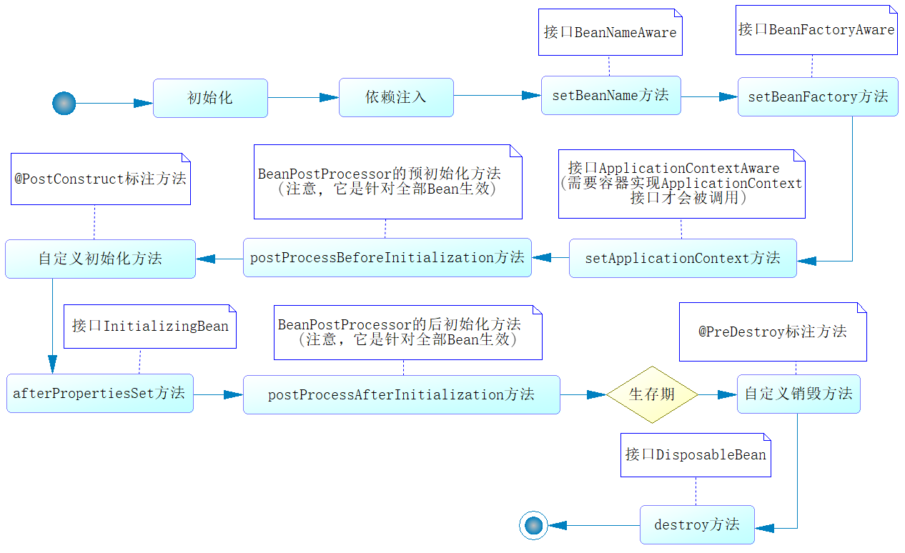
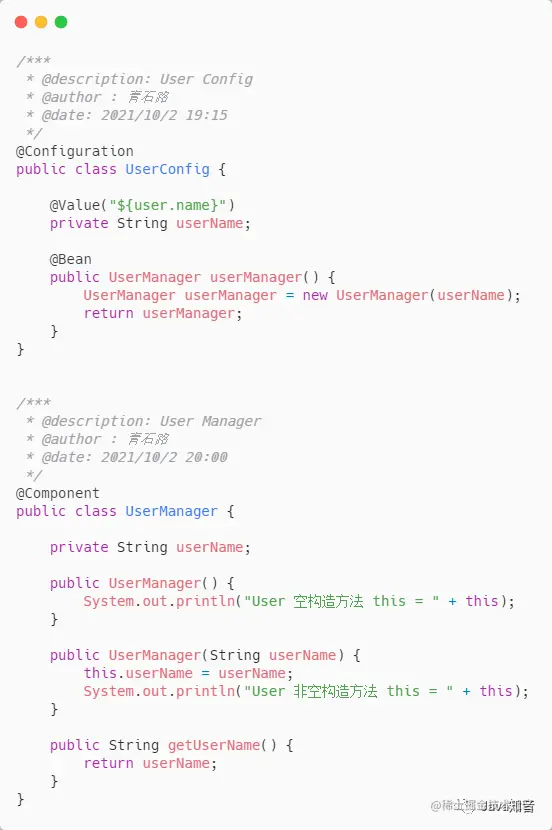
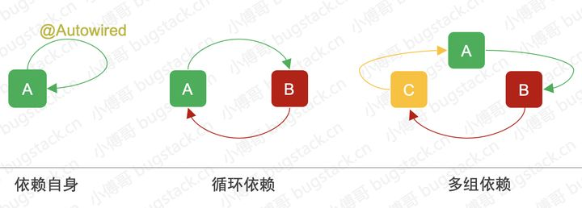

## AOP（面向切面编程）

### 什么是 AOP？

AOP 利用一种称为“横切”的技术，剖解开封装的对象内部，并将那些影响了多个类的公共行为封装到一个可重用模块，并将其名为“Aspect”，即切面。简单地说，就是将那些与业务无关，却为业务模块所共同调用的逻辑或责任封装起来，便于减少系统的重复代码，降低模块间的耦合度

1. 连接点（join point）：在应用执行过程中能够插入切面的一个点，这些点可以是调用方法时、修改一个字段时
2. 切点（point cut）：切面不单单应用于单个方法，也可能是多个类的不同方法，这时可以通过指示器的规则去定义，从而适配连接点
3. 通知（advice）：按照约定的流程下的方法，分为前置通知、后置通知、环绕通知、返回后通知和异常通知，它会根据约定织入流程中
4. 引入（introduction）：指引入新的类和其方法，增强现有 bean 的功能
5. 切面（aspect）：是一个可以定义切点、各类通知和引入的内容，Spring AOP 将通过它的信息来增强 bean 的功能或者将对应的方法织入流程
6. 织入（weaving）：是一个通过动态代理技术，为原有服务对象生成代理对象，然后将与切点定义匹配的连接点拦截，并按约定将各类通知织入约定流程的过程
7. 目标对象（target）：被代理对象

**连接点和切点的区别**

比如开车经过一条高速公路，这条高速公路上有很多个出口（连接点），但是我们不会每个出口都会出去，只会选择我们需要的那个出口（切点）开出去。

### 通知类型（Advice）

1. 前置通知（Before advice）

在某连接点（JoinPoint）之前执行的通知，但这个通知不能阻止连接点前的执行。

2. 后置通知（After advice）

当某连接点退出的时候执行的通知（不论是正常返回还是异常退出）。

3. 返回后通知（After return advice）

在某连接点正常完成后执行的通知，不包括抛出异常的通知。

4. 环绕通知（Around advice）

包围一个连接点的通知，类似 Web 中 Servlet 中的 Filter 的 doFilter 方法，可以在方法的调用前后完成自定义的行为，也可以选择不执行。

5. 抛出异常后通知（After throwing advice）

在方法抛出异常退出时执行的通知。

**使用案例**

```java
@Aspect
@Component
public class logUtils {
    @Pointcut("execution(public int caculator.Interface.MyCaculator.*(int,int))")
    public void test(){}

    @Before("test()")
    public static void logStart(JoinPoint joinPoint){
        System.out.println("logUtil前置方法【"+joinPoint.getSignature().getName()+"】开始执行" + "调用的参数是:" + Arrays.asList(joinPoint.getArgs()));
    }

    @AfterReturning(value = "test()",returning = "result")
    public void logReturn(JoinPoint joinPoint,Object result){
        System.out.println("logUtil返回方法【"+joinPoint.getSignature().getName()+"】执行完毕" + "返回的结果是:" + result);
    }

    @AfterThrowing(value= "test()",throwing = "exception")
    public void logException(JoinPoint joinPoint,Exception exception){
        System.out.println("logUtil异常方法【"+joinPoint.getSignature().getName()+"】出现异常" + "异常的原因是:" + exception);
    }

    @After("test()")
    public static void logAfter(JoinPoint joinPoint){
          System.out.println("logUtil结束方法【"+joinPoint.getSignature().getName()+"】结束执行");
    }
}      
```

```java
@Aspect
@Component
public class LogUtils {
    @Pointcut("execution(public int caculator.noInterface.MyCaculator.*(int ,int))")
    public void test(){}

//--------------------@Around方法测试---------------------------
    @Around("test()")
    public Object myAround(ProceedingJoinPoint pjp) throws Exception {
        Object result = null;
        String name = pjp.getSignature().getName();
        try {
            System.out.println("环绕前置通知【"+name+"】开始执行" + "调用的参数是:" + Arrays.asList(pjp.getArgs()));
            result = pjp.proceed(pjp.getArgs());//类似于 Objet result = method.invoke(customer, args);
            System.out.println("环绕返回通知【"+name+"】执行完毕" + "返回的结果是:" + result);
        } catch (Throwable t) {
            System.out.println("环绕异常通知【"+name+"】出现异常" + "异常的原因是:" + t.getCause());
        } finally {
            System.out.println("环绕结束通知【"+name+"】结束执行");
        }
        return result;
    }
}
```

### 织入方式

1. 编译期织入：在 Java 编译期，采用特殊的编译器，将切面织入到 Java 类中
2. 类加载期织入：通过特殊的类加载器，在类字节码加载到 JVM 时，织入切面
3. 运行期织入：采用 CGLIB 工具或 JDK 动态代理进行切面的织入

### 应用场景

1. 日志记录
2. 权限验证
3. 事务管理
4. 方法性能监控

### 代理方式
1. JDK 动态代理：通过反射实现一个代理接口的匿名类，主要通过 Proxy 和 InvocationHandler 实现，只能对实现了接口的类生成代理，当 Bean 实现接口时，Spring 就会用 JDK 的动态代理
2. CGLIB 动态代理：通过字节码增强技术动态地创建代理对象，如果目标对象没有实现接口，Spring 采用 CGLIB 动态代理

**注意**

1. 如果目标对象实现了接口，默认情况下会采用 JDK 的动态代理实现 AOP，也可以强制使用 CGLIB 实现 AOP
2. 如果目标对象没有实现接口，必须使用 CGLIB 库，Spring 会自动在 JDK 动态代理和 CGLIB 之间转换
3. JDK 代理要实现 InvocationHandler，CGLIB 要实现 MethodInterceptor

#### 静态和动态代理区别
1. 静态代理：由程序员创建或工具生成代理类的源码，再编译代理类，静态就是指在程序运行前就已经存在代理类的字节码文件，代理类和委托类的关系在运行前就确定了
2. 动态代理：动态代理的源码是在程序运行期间由 JVM 根据反射等机制动态生成，所以不存在代理类的字节码文件，代理类和委托类的关系是在程序运行时确定

#### JDK 动态代理
```java
/**
 * JDK 动态代理 Service
 */
public interface TestService {	
	int add();
}

public class TestServiceImpl implements TestService {
	@Override
	public int add() {
		System.out.println("开始执行add...");
		return 0;
	}
}
```

```java
/**
 * JDK 的动态代理实现
 */
public class JDKDynamicProxy implements InvocationHandler {
    //被代理的目标对象
    private Object proxyObj;  
   
    /**
     * Object newProxyInstance(ClassLoader loader, Class <?> [] interfaces, InvocationHandler h)
     * loader    : 类加载器 一个 ClassLoader 对象，定义了由哪个 ClassLoader 对象来对生成的代理对象进行加载
     * interfaces: 一个 Interface 对象的数组，表示的是我将要给我需要代理的对象提供一组什么接口，如果我提供了一组接口给它，那么这个代理对象就宣称实现了该接口(多态)，这样我就能调用这组接口中的方法了
     * h         : 一个 InvocationHandler 对象，表示的是当我这个动态代理对象在调用方法的时候，会关联到哪一个 InvocationHandler 对象上
     */
      public Object newProxy(Object proxyObj){  
          this.proxyObj = proxyObj;
          //返回一个代理对象  
          return Proxy.newProxyInstance(proxyObj.getClass().getClassLoader(), proxyObj.getClass().getInterfaces(), this);  
      }  
 
     /**
      * 执行目标对象
      * Object  proxy：被代理的对象
      * Method  method：要调用的方法
      * Object  args []：方法调用时所需要的参数
      */
      @Override
      public Object invoke(Object proxy, Method method, Object[] args) throws Throwable {      
            before();
            Object object = method.invoke(this.proxyObj, args);  // 通过反射机制调用目标对象的方法
            after();      
            return object;  
      }

      public void before(){
            System.out.println("开始执行目标对象之前...");
      }
    
      public void after(){
            System.out.println("开始执行目标对象之后...");
	  }
}
```

```java
/**
 * 动态代理测试
 */
public class ProxyTest {
	
	public static void main(String[] args) {
		// 我们要代理的真实对象
		TestService testService = new TestServiceImpl();
		testService.add();// 不是用代理
		System.out.println("===================================");
		JDKDynamicProxy JDKDynamicProxyTarget = new JDKDynamicProxy();
		TestService testServiceProxy = (TestService) JDKDynamicProxyTarget.newProxy(testService);
		// 执行代理类的方法
		testServiceProxy.add();
	}
}
```

#### CGLIB 代理
```java
/**
 * 未实现接口的类
 */
public class TestCGLIBServiceImpl {
    public int add() {
        System.out.println("开始执行add...");
        return 0;
    }
}
```

```java
/**
 * 基于 CGLIB 实现
 */
public class CGLIBProxy implements MethodInterceptor {
 
	private Object targetObject;// 被代理的目标对象
 
	/**
	 * 构造代理对象
	 * @param targetObject 传递的真实对象
	 * @return 代理对象
	 */
	public Object createProxyInstance(Object targetObject) {
		this.targetObject = targetObject;
		Enhancer enhancer = new Enhancer();
		enhancer.setSuperclass(targetObject.getClass());// 设置代理目标
		enhancer.setCallback(this);// 设置回调
		return enhancer.create();
	}
 
	/**
	 * 在代理实例上处理方法调用并返回结果
	 * @param object ： 代理类
	 * @param method  ：被代理的方法
	 * @param args ：该方法的参数数组
	 * @param methodProxy : 方法代理
	 */
	@Override
	public Object intercept(Object object, Method method, Object[] args, MethodProxy methodproxy) throws Throwable {
		Object result = null;
		try {
			System.out.println("前置处理开始 ...");
			result = methodproxy.invoke(targetObject, args);// 执行目标对象的方法
			System.out.println("后置处理开始  ...");
		} catch (Exception e) {
			System.out.println(" 异常处理 ...");
		} finally {
			System.out.println(" 调用结束 ...");
		}
		return result;
	}
}
```

```java
/**
 * 测试 CGLIB 代理
 */
public class ProxyTest {
	
	 public static void main(String[] args) {
         //我们要代理的真实对象
         TestCGLIBServiceImpl testCGLIB = new TestCGLIBServiceImpl();
         testCGLIB.add();
         System.out.println("======================================");
         CGLIBProxy CGLIBproxy = new CGLIBProxy();
         TestCGLIBServiceImpl testCGLIBProxy = (TestCGLIBServiceImpl) CGLIBproxy.createProxyInstance(testCGLIB);
         testCGLIBProxy.add();
      }
}
```

#### JDK 和 CGLIB 的区别
1. JDK 动态代理利用拦截器（必须实现 InvocationHandler）加上反射机制生成一个代理接口的匿名类，在调用具体方法前调用 InvokeHandler 来处理；CGLIB 动态代理利用 ASM 框架对代理对象类生成的 class 文件加载进来，通过修改其字节码生成子类来处理
2. JDK 动态代理只能对实现了接口的类生成代理，而不能针对类；CGLIB 是针对类实现代理，主要是对指定的类生成一个子类，覆盖其中的方法，并覆盖其中方法的增强，但是因为采用的是继承，所以该类或方法最好不要生成 final，对于 final 类或方法，是无法继承的
3. CGLIB 底层是 ASM 字节码生成框架，但是字节码技术生成代理类，在 JDK1.6 之前比使用 JAVA 反射的效率要高；在 JDK1.6 之后对 JDK 动态代理进行了优化，在调用次数比较少时效率高于 CGLIB 代理效率，在大量调用的时候 JDK 的效率高。对于单例的对象因为无需频繁创建代理对象，采用 CGLIB 动态代理比较合适。反之，对于多例的对象因为需要频繁地创建代理对象，则 JDK 动态代理比较合适
4. CGLIB 不能对声明 final 的方法进行代理，因为 CGLIB 是动态生成代理对象，final 关键字修饰的类不可变只能被引用不能被修改

## IOC（控制反转）

### 什么是 IOC？

在传统的 Java 应用中，一个类想要调用另一个类中的属性或方法，通常会先在其代码中通过 new Object()的方式将对象创建出来，然后才能实现属性或方法的调用。但在 Spring 应用中，Java 对象创建的控制权是掌握在 IOC 容器中的，调用者则变成了被动的一方，被动的等待 IOC 容器创建它所需要的对象（Bean）。

1. 没有 IoC 之前：

我需要一个女朋友，刚好大街上突然看到了一个小姐姐，人很好看，于是我就自己主动上去搭讪，要她的微信号，找机会聊天关心她，然后约她出来吃饭，打听她的爱好，三观。。。

2. 有了 IoC 之后：

我需要一个女朋友，于是我就去找婚介所，告诉婚介所，我需要一个长的像赵露思的，会打 Dota2 的，于是婚介所在它的人才库里开始找，找不到它就直接说没有，找到它就直接介绍给我。

实现步骤如下：

1. 开发人员通过 XML 配置文件、注解、Java 配置类等方式，对 Java 对象进行定义，例如：在 XML 配置文件中使用 \< bean > 标签，在 Java 类上使用@Component 注解等
2. Spring 启动时，IOC 容器会自动根据对象定义，将这些对象创建并管理起来，这些被 IOC 容器创建并管理的对象被称为 Spring Bean
3. 当我们想要使用某个 Bean 时，可以直接从 IOC 容器中获取（例如通过 ApplicationContext 的 getBean()方法），而不需要手动通过代码（例如 new Object()的方式）创建

### 什么是 DI？

IOC 是一种思想，DI 是实现 IOC 的具体方式，比如说利用注入机制（如构造器注入、Setter 注入）将依赖传递给目标对象。

**为什么要使用 IoC 呢？**

在平时的 Java 开发中，如果我们要实现某一个功能，可能至少需要两个以上的对象来协助完成，在没有 Spring 之前，每个对象在需要它的合作对象时，需要自己 new 一个，比如说 A 要使用 B，A 就对 B 产生了依赖，也就是 A 和 B 之间存在了一种耦合关系。

有了 Spring 之后，就不一样了，创建 B 的工作交给了 Spring 来完成，Spring 创建好了 B 对象后就放到容器中，A 告诉 Spring 我需要 B，Spring 就从容器中取出 B 交给 A 来使用。

至于 B 是怎么来的，A 就不再关心了，这就是 IoC 的好处，它降低了对象之间的耦合度，使得程序更加灵活，更加易于维护。

### IOC 实现原理

实现原理：工厂模式+反射机制

```java
interface Fruit {
   public abstract void eat();
}
 
class Apple implements Fruit {
    public void eat(){
        System.out.println("Apple");
    }
}
 
class Orange implements Fruit {
    public void eat(){
        System.out.println("Orange");
    }
}
 
class Factory {
    public static Fruit getInstance(String ClassName) {
        Fruit f=null;
        try {
            f=(Fruit)Class.forName(ClassName).newInstance();
        } catch (Exception e) {
            e.printStackTrace();
        }
        return f;
    }
}
 
class Client {
    public static void main(String[] a) {
        Fruit f=Factory.getInstance("io.github.dunwu.spring.Apple");
        if(f!=null){
            f.eat();
        }
    }
}
```

### 装配机制

1. 在 XML 中进行显式配置
2. 在 Java 中进行显式配置
3. 隐式的 bean 发现机制和自动装配
+ 组件装配（component scanning）：Spring 会自动发现应用上下文中所创建的 bean
+ 自动装配（autowiring）：Spring 自动满足 bean 之间的依赖

（使用的优先性：3 > 2 > 1）尽可能地使用自动配置的机制，显式配置越少越好。当必须显式配置 bean 的时候（如：有些源码不是由你来维护的，而当你需要为这些代码配置 bean 的时候），推荐使用类型安全比 XML 更加强大的 JavaConfig。最后只有当你想要使用便利的 XML 命名空间，并且在 JavaConfig 中没有同样的实现时，才使用 XML

**使用案例**

1. 通过 XML 文件将配置加载到 IOC 容器中

```xml
<?xml version="1.0" encoding="UTF-8"?>
<beans xmlns="http://www.springframework.org/schema/beans"
       xmlns:xsi="http://www.w3.org/2001/XMLSchema-instance"
       xsi:schemaLocation="http://www.springframework.org/schema/beans http://www.springframework.org/schema/beans/spring-beans.xsd">
  <!--若没写id，则默认为com.test.Man#0,#0为一个计数形式-->
  <bean id="man" class="com.test.Man"></bean>
</beans>
```

```java
public class Test {
    public static void main(String[] args) {
        //加载项目中的 spring 配置文件到容器
        //ApplicationContext context = new ClassPathXmlApplicationContext("resouces/applicationContext.xml");
        //加载系统盘中的配置文件到容器
        ApplicationContext context = new FileSystemXmlApplicationContext("E:/Spring/applicationContext.xml");
        //从容器中获取对象实例
        Man man = context.getBean(Man.class);
        man.driveCar();
    }
}
```

2. 通过 JAVA 注解的方式将配置加载到 IOC 容器

```java
//同 xml 一样描述 bean 以及 bean 之间的依赖关系
@Configuration
public class ManConfig {
    
    @Bean
    public Man man() {
        return new Man(car());
    }
    
    @Bean
    public Car car() {
        return new QQCar();
    }
}
```

```java
public class Test {
    public static void main(String[] args) {
        //从 java 注解的配置中加载配置到容器
        ApplicationContext context = new AnnotationConfigApplicationContext(ManConfig.class);
        //从容器中获取对象实例
        Man man = context.getBean(Man.class);
        man.driveCar();
    }
}
```

3. 隐式的 bean 发现机制和自动装配

```java
//这个简单的注解表明该类回作为组件类，并告知 Spring 要为这个创建 bean。
@Component
public class GameDisc implements Disc{
    @Override
    public void play() {
        System.out.println("我是马里奥游戏光盘。");
    }
}
```

注意：组件扫描默认是不启用的，还需要显式配置一下 Spring，从而命令它去寻找@Component 注解的类，并为其创建 bean

```java
@Configuration
@ComponentScan
public class DiscConfig {
}
```

### BeanFactory

1. BeanFactory

是 Spring bean 容器的根接口，提供获取 bean，是否包含 bean，是否单例与原型，获取 bean 类型，bean 别名的方法。最主要的方法就是 getBean(String beanName)

```java
public interface BeanFactory {
    String FACTORY_BEAN_PREFIX = "&";
    
    //根据名称获取 Bean
    Object getBean(String name) throws BeansException;
    
    //根据名称和类型获取 Bean
    <T> T getBean(String name, Class<T> requiredType) throws BeansException;
    
    //根据类型获取 Bean
    <T> T getBean(Class<T> requiredType) throws BeansException;
    
    //获取 Bean
    Object getBean(String name, Object... args) throws BeansException; 
    <T> T getBean(Class<T> requiredType, Object... args) throws BeansException;
    
    //是否为单例
    boolean isSingleton(String name) throws NoSuchBeanDefinitionException;
    
    //是否为原型
    boolean isPrototype(String name) throws NoSuchBeanDefinitionException;
    
    //类型、名称是否匹配
    boolean isTypeMatch(String name, ResolvableType typeToMatch) throws NoSuchBeanDefinitionException;
    boolean isTypeMatch(String name, Class<?> typeToMatch) throws NoSuchBeanDefinitionException;
    
    //根据实例名称获取类型
    Class<?> getType(String name) throws NoSuchBeanDefinitionException;
    
    //根据实例名称获取实例别名数组
    String[] getAliases(String name);
}
```

```java
public static void main(String[] args) {
    BeanFactory context = new ClassPathXmlApplicationContext("Beans.xml");
    HelloWorld obj = context.getBean("helloWorld", HelloWorld.class);
    obj.getMessage();
}
```

FACTORY_BEAN_PERFIX = "&"：&前缀的字符串可以用来引用一个 Factory 实例，把它和工厂产生的 Bean 区分开，即如果一个 FactoryBean 的名字为 a，那么，&a 会得到那个 Factory

```java
public class FactoryTest implements FactoryBean<String> {
    @Override
    public String getObject() throws Exception { 
		return "test12345";  
    }

    @Override
    public Class<?> getObjectType() {    
		return String.class; 
    }

    @Override
    public boolean isSingleton() {  
		return true; 
    }

    @Override
    public String toString() { 
		return "A FactoryBean"; 
    }

    public static void main(String[] args) {
        DefaultListableBeanFactory factory = new DefaultListableBeanFactory();
        factory.registerBeanDefinition("test", new RootBeanDefinition(FactoryTest.class));//注册一个 FactoryBean 类型的 BeanDefinition
        System.out.println(factory.getBean("test"));//获取 Bean，也就是调用了 FactoryBean 的 getObject
        System.out.println(factory.getBean("&test"));//& 获取 FactoryBean
    }
}

/* 运行结果
test12345 
A FactoryBean
*/
```

2. BeanFactory 的三个子接口

ListableBeanFactory：提供了批量获取 Bean 的方法

```java
public interface ListableBeanFactory extends BeanFactory {
    //BeanDefinition 相关
    boolean containsBeanDefinition(String beanName); 
    int getBeanDefinitionCount(); 
    String[] getBeanDefinitionNames(); 

    //跟据 bean 的类型获取 bean .它不会检查嵌套的 FactoryBean 创建的 bean 
    String[] getBeanNamesForType(ResolvableType type); 
    String[] getBeanNamesForType(Class<?> type); 
    String[] getBeanNamesForType(Class<?> type, boolean includeNonSingletons, boolean allowEagerInit); 
    <T> Map<String, T> getBeansOfType(Class<T> type) throws BeansException; 
    <T> Map<String, T> getBeansOfType(Class<T> type, boolean includeNonSingletons, boolean allowEagerInit) throws BeansException; 

     //根据注解查找相关 BeanName 数组
    String[] getBeanNamesForAnnotation(Class<? extends Annotation> annotationType); 
    //根据注解查找相关 Bean 的 Map
    Map<String, Object> getBeansWithAnnotation(Class<? extends Annotation> annotationType) throws BeansException; 
    //查找一个 Bean 上的注解
    <A extends Annotation> A findAnnotationOnBean(String beanName, Class<A> annotationType) throws NoSuchBeanDefinitionException; 
}
```

```java
@Controller(value = "OK")
public class FactoryTest {

    public static void main(String[] args) {
        DefaultListableBeanFactory factory = new DefaultListableBeanFactory();
        RootBeanDefinition definition = new RootBeanDefinition(FactoryTest.class);
        factory.registerBeanDefinition("test", definition);

        System.out.println(Arrays.toString(factory.getBeanNamesForAnnotation(Controller.class)));
        System.out.println(factory.getBeansWithAnnotation(Controller.class));
        System.out.println(factory.findAnnotationOnBean("test",Controller.class));
    }
}

/* 运行结果
[test] 
{test = FactoryTest@d041cf}
@org.springframework.stereotype.Controller(value = OK)
*/
```

AutowireCapableBeanFactory：在 BeanFactory 基础上实现对已存在实例的管理

```java
public interface AutowireCapableBeanFactory extends BeanFactory {

    int AUTOWIRE_NO = 0;//不使用自动装配 
    int AUTOWIRE_BY_NAME = 1;//通过名称自动装配 
    int AUTOWIRE_BY_TYPE = 2;//通过类型自动装配  
    int AUTOWIRE_CONSTRUCTOR = 3;//构造器装配 
    @Deprecated
    int AUTOWIRE_AUTODETECT = 4;//已过时  


    //------ 创建外部Bean实例的典型方法---------------------------
    //根据指定 Class 创建一个全新的 Bean 实例
    <T> T createBean(Class<T> beanClass) throws BeansException;
    //给定对象，根据注释、后处理器等，进行自动装配
    void autowireBean(Object existingBean) throws BeansException;
    // 根据 Bean 名的 BeanDefinition 装配这个未加工的 Object，执行回调和各种后处理器。
    Object configureBean(Object existingBean, String beanName) throws BeansException;
    //分解 Bean 在工厂中定义的这个指定的依赖 descriptor
    Object resolveDependency(DependencyDescriptor descriptor, String beanName) throws BeansException; 


    //-----------Bean实例生命周期相关方法-------------------
    // 根据给定的类型和指定的装配策略，创建一个新的 Bean 实例
    Object createBean(Class<?> beanClass, int autowireMode, boolean dependencyCheck) throws BeansException;
    
    Object autowire(Class<?> beanClass, int autowireMode, boolean dependencyCheck) throws BeansException; 
    //根据名称或类型自动装配
    void autowireBeanProperties(Object existingBean, int autowireMode, boolean dependencyCheck) throws BeansException; 
    //自动装配
    void applyBeanPropertyValues(Object existingBean, String beanName) throws BeansException;
    //初始化一个 Bean...
    Object initializeBean(Object existingBean, String beanName) throws BeansException;
    //初始化之前执行 BeanPostProcessors
    Object applyBeanPostProcessorsBeforeInitialization(Object existingBean, String beanName) throws BeansException;
    //初始化之后执行 BeanPostProcessors
    Object applyBeanPostProcessorsAfterInitialization(Object existingBean, String beanName) throws BeansException;
    //销毁一个 Bean
    void destroyBean(Object existingBean);
    //分解指定的依赖
    Object resolveDependency(DependencyDescriptor descriptor, String beanName,
            Set<String> autowiredBeanNames, TypeConverter typeConverter) throws BeansException;
}
```

HierarchicalBeanFactory：提供父容器的访问功能

3. ConfigurableBeanFactory

主要单例 bean 的注册，生成实例，以及统计单例 bean

```java
public interface ConfigurableBeanFactory extends HierarchicalBeanFactory, SingletonBeanRegistry {

    //常亮-单例
    String SCOPE_SINGLETON = "singleton"; 
    //常量-原型
    String SCOPE_PROTOTYPE = "prototype";
    //设置父 BeanFactory
    void setParentBeanFactory(BeanFactory parentBeanFactory) throws IllegalStateException; 
    //以下四个：设置和获取 BeanClassLoader
    void setBeanClassLoader(ClassLoader beanClassLoader); 
    ClassLoader getBeanClassLoader(); 
    void setTempClassLoader(ClassLoader tempClassLoader); 
    ClassLoader getTempClassLoader();

    //是否需要缓存 bean metadata, 比如 bean difinition 和 解析好的 classes.默认开启缓存
    void setCacheBeanMetadata(boolean cacheBeanMetadata); 
    boolean isCacheBeanMetadata();

    // 定义用于解析 bean definition 的表达式解析器
    void setBeanExpressionResolver(BeanExpressionResolver resolver); 
    BeanExpressionResolver getBeanExpressionResolver();

    //类型转化器
    void setConversionService(ConversionService conversionService); 
    ConversionService getConversionService();

    //属性编辑器
    void addPropertyEditorRegistrar(PropertyEditorRegistrar registrar);

    //BeanFactory 用来转换 bean 属性值或者参数值的自定义转换器
    void registerCustomEditor(Class<?> requiredType, Class<? extends PropertyEditor> propertyEditorClass); 
    void copyRegisteredEditorsTo(PropertyEditorRegistry registry);

    //类型转换器
    void setTypeConverter(TypeConverter typeConverter); 
    TypeConverter getTypeConverter(); 
    void addEmbeddedValueResolver(StringValueResolver valueResolver); 
    String resolveEmbeddedValue(String value);

    //Bean 处理器
    void addBeanPostProcessor(BeanPostProcessor beanPostProcessor); 
    int getBeanPostProcessorCount();

    //作用域定义
    void registerScope(String scopeName, Scope scope); 
    String[] getRegisteredScopeNames(); 
    Scope getRegisteredScope(String scopeName);

    //访问权限控制
    AccessControlContext getAccessControlContext();

    //合并其他 ConfigurableBeanFactory 的配置, 包括上面说到的 BeanPostProcessor, 作用域等
    void copyConfigurationFrom(ConfigurableBeanFactory otherFactory);

    //bean 定义处理
    void registerAlias(String beanName, String alias) throws BeanDefinitionStoreException; 
    void resolveAliases(StringValueResolver valueResolver); 
    BeanDefinition getMergedBeanDefinition(String beanName) throws NoSuchBeanDefinitionException; 
    boolean isFactoryBean(String name) throws NoSuchBeanDefinitionException;

    //bean 创建状态控制.在解决循环依赖时有使用
    void setCurrentlyInCreation(String beanName, boolean inCreation); 
    boolean isCurrentlyInCreation(String beanName);

    //处理 bean 依赖问题
    void registerDependentBean(String beanName, String dependentBeanName); 
    String[] getDependentBeans(String beanName); 
    String[] getDependenciesForBean(String beanName);

    //bean 生命周期管理-- 销毁 bean
    void destroyBean(String beanName, Object beanInstance); 
    void destroyScopedBean(String beanName); 
    void destroySingletons();
}
```

4. ConfigurableListableBeanFactory

继承了上述的所有接口，增加了其他功能，比如：类加载器、类型转化、属性编辑器、BeanPostProcessor、作用域、bean 定义、处理 bean 依赖关系、bean 如何销毁...

```java
public interface ConfigurableListableBeanFactory
        extends ListableBeanFactory, AutowireCapableBeanFactory, ConfigurableBeanFactory {

    //设置忽略的依赖关系, 注册找到的特殊依赖
    void ignoreDependencyType(Class<?> type); 
    void ignoreDependencyInterface(Class<?> ifc); 
    void registerResolvableDependency(Class<?> dependencyType, Object autowiredValue); 
    boolean isAutowireCandidate(String beanName, DependencyDescriptor descriptor)
            throws NoSuchBeanDefinitionException;

    // 获取 bean 定义 (可以访问属性值跟构造方法的参数值)
    BeanDefinition getBeanDefinition(String beanName) throws NoSuchBeanDefinitionException;

    //迭代 BeanNames
    Iterator<String> getBeanNamesIterator();

    //清除元数据缓存
    void clearMetadataCache();

    //锁定配置信息.在调用 refresh 时会使用到.
    void freezeConfiguration(); 
    boolean isConfigurationFrozen();

    //预加载不是懒加载的单例.用于解决循环依赖问题
    void preInstantiateSingletons() throws BeansException;
}
```

5. 实现类 DefaultListableBeanFactory

### ApplicationContext

应用上下文，继承 BeanFactory 接口，他是 Spring 的一个更高级的容器，提供了更多的有用的功能

1. 国际化（MessageSource）
2. 访问资源，如 URL 和文件（ResourceLoader）
3. 载入多个（有继承关系）上下文，使得每一个上下文都专注于一个特定的层次，比如应用的 web 层
4. 消息发送、相应机制（ApplicationEventPublisher）
5. AOP（拦截器）

```java
public class HelloWorldApp{
   public static void main(String[] args) {
      ApplicationContext context=new ClassPathXmlApplicationContext("beans.xml");
      HelloWorld obj = (HelloWorld) context.getBean("helloWorld");
      obj.getMessage();
   }
}
```

| ApplicationContext 常用实现类          | 作用                                                         |
| ------------------------------------- | ------------------------------------------------------------ |
| AnnotationConfigApplicationContext    | 从一个或多个基于 Java 的配置类中加载上下文定义，适用于 Java 注解的方式 |
| ClassPathXmlApplicationContext        | 从类路径下的一个或多个 xml 配置文件中加载上下文定义，适用于 xml 配置的方式 |
| FileSystemXmlApplicationContext       | 从文件系统下的一个或多个 xml 配置文件中加载上下文，即系统盘符中加载 xml 配置文件 |
| AnnotationConfigWebApplicationContext | 专门为 web 应用准备的，适用于注解方式                          |
| XmlWebApplicationContext              | 从 web 应用下的一个或多个 xml 配置文件加载上下文定义，适用于 xml 配置方式 |

### BeanFactory 和 ApplicationContext 的区别

1. 依赖关系：BeanFactory 是 Spring 里面最底层的接口，包含了各种 Bean 的定义，如：读取 Bean 配置文档，管理 Bean 的加载等；ApplicationContext 作为 BeanFactory 的派生，除了提供 BeanFactory 所具有的功能外，还提供了更完整的框架功能，如：支持国际化，统一的资源文件访问方式等
2. 加载方式：BeanFactory 在启动的时候不会去实例化 Bean，只有从容器中拿 Bean 的时候才会去实例化；ApplicationContext 在启动的时候就把所有的 Bean 全部实例化了，它还可以为 Bean 配置 lazy-init = true 来让 Bean 延迟实例化
+ 延迟实例化的优点：应用启动的时候占用资源很少，对资源要求较高的应用比较有优势
+ 不延迟实例化的优点：所有的 Bean 在启动的时候都加载，系统运行的速度快，在启动的时候所有的 Bean 都加载了，我们就能在系统启动的时候，尽早地发现系统中的配置问题，建议 web 应用在启动的时候就把所有的 Bean 都加载了（把费时的操作放到系统启动中完成）
3. 注册方式：BeanFactory 手动注册；ApplicationContext 自动注册

| 不同     | BeanFactory                                                  | ApplicationContext                                           |
| -------- | ------------------------------------------------------------ | ------------------------------------------------------------ |
| 依赖关系 | 是 Spring 里面最底层的接口，包含了各种 Bean 的定义，读取 bean 配置文档，管理 bean 的加载、实例化，控制 bean 的生命周期，维护 bean 之间的依赖关系。 | 作为 BeanFactory 的派生，除了提供 BeanFactory 所具有的功能外，还提供了更完整的框架功能：继承 MessageSource，因此支持国际化。统一的资源文件访问方式。提供在监听器中注册 bean 的事件。同时加载多个配置文件。载入多个（有继承关系）上下文 ，使得每一个上下文都专注于一个特定的层次，比如应用的 web 层。 |
| 加载方式 | 采用的是延迟加载形式来注入 Bean 的，即只有在使用到某个 Bean 时(调用 getBean())，才对该 Bean 进行加载实例化。这样，我们就不能发现一些存在的 Spring 的配置问题。如果 Bean 的某一个属性没有注入，BeanFacotry 加载后，直至第一次使用调用 getBean 方法才会抛出异常。 | 它是在容器启动时，一次性创建了所有的 Bean。这样，在容器启动时，我们就可以发现 Spring 中存在的配置错误，这样有利于检查所依赖属性是否注入。ApplicationContext 启动后预载入所有的单实例 Bean，通过预载入单实例 bean , 确保当你需要的时候，你就不用等待，因为它们已经创建好了。 |
| 创建方式 | 以编程的方式创建                                             | 以声明的形式创建；如使用 `ContextLoader`                      |
| 注册方式 | 手动注册                                                     | 自动注册                                                     |

**ApplicationContext 通常的实现**

1. FileSystemXmlApplicationContext：此容器从一个 XML 文件中加载 beans 的定义，XML Bean 配置文件的全路径名必须提供给它的构造函数

```java
ApplicationContext context = new FileSystemXmlApplicationContext(“bean.xml”);
```

2. ClassPathXmlApplicationContext：从 classpath 的 XML 配置文件中读取上下文，并生成上下文定义。应用程序上下文从程序环境变量中

```java
ApplicationContext context = new ClassPathXmlApplicationContext(“bean.xml”);
```

3. WebXmlApplicationContext：由 Web 应用的 XML 文件读取上下文。

### BeanFactory 和 FactoryBean 的区别

1. BeanFactory 是 IOC 最基本的容器，负责生产和管理 bean，它为其他具体的 IOC 容器的实现提供了最基本的规范
2. FactoryBean 是一个接口，为 IOC 容器中 Bean 的实现提供了更加灵活的方法，FactoryBean 在 IOC 容器的基础上给 Bean 的实现加上了一个简单工厂模式和装饰模式。

与普通 Bean 的区别：当在 IOC 容器中的 Bean 实现了 FactoryBean 后，通过 getBean(String BeanName)获取到的 Bean 对象并不是 FactoryBean 的实现类对象，而是这个实现类中的 getObject()方法返回的对象。要想获取 FactoryBean 的实现类，就要 getBean(&BeanName)，在这个 BeanName 之前加上&

**使用案例**

```java
public interface FactoryBean<T> {  
    T getObject() throws Exception;  
    Class<?> getObjectType();  
    boolean isSingleton();  
} 
```

```java
public class FactoryBeanPojo implements FactoryBean{
    private String type;

    @Override
    public Object getObject() throws Exception {
        if("student".equals(type)){
            return new Student();			
        }else{
            return new School();
        }
    }

    @Override
    public Class getObjectType() {
        return School.class;
    }

    @Override
    public boolean isSingleton() {
        return true;
    }

    public String getType() {
        return type;
    }

    public void setType(String type) {
        this.type = type;
    }
}
```

```java
@Data
public class School {
	private String schoolName;
	private String address;
	private int studentNumber;
}
```

```java
public class FactoryBeanTest {
    public static void main(String[] args){
        String url = "com/spring/config/BeanConfig.xml";
        ClassPathXmlApplicationContext cpxa = new ClassPathXmlApplicationContext(url);
        Object school=  cpxa.getBean("factoryBeanPojo");
        FactoryBeanPojo factoryBeanPojo= (FactoryBeanPojo) cpxa.getBean("&factoryBeanPojo");
        System.out.println(school.getClass().getName());
        System.out.println(factoryBeanPojo.getClass().getName());
    }
}

//输出结果：
//com.spring.bean.Student
//com.spring.bean.FactoryBeanPojo
```

## Bean

### Spring 是如何管理 Bean 的？

1. @ComponentScan 用于声明扫描策略，通过它的声明，容器就知道要扫描哪些包下带有声明的类，也可以知道哪些特定的类是排除在外的
2. @Component、@Repository、@Service、@Controller 用于声明 Bean，它们的作用一样，但是语义不同。@Component 用于声明通用的 Bean，@Repository 用于声明 Dao 层的 bean，@Service 用于声明业务层的 bean，@Controller 用于声明视图层的控制器 Bean，被这些注解声明的类就可以被容器扫描并创建
3. @Autowired、@Qualifier 用于注入 Bean，即告诉容器应该为当前属性注入哪个 bean。其中@Autowired 是按照 bean 的类型进行匹配的，如果这个属性的类型具有多个 bean，就可以通过@Qualifier 指定 bean 的名称，以消除歧义
4. @Scope 用于声明 bean 的作用域，默认情况下 bean 是单例的，即在整个容器中这个类型只有一个实例，可以通过@Score 注解指定 prototype 值将其声明为多例的，也可以将 Bean 声明为 session 作用域、request 作用域等，但最常用的还是默认的单例模式
5. @PostConstruct、@PreDestory 用于声明 Bean 的生命周期。其中，被@PostConstruct 修饰的方法将在 bean 实例化被调用，@PreDestory 修饰的方式将在容器销毁前被调用

### Bean 的初始化方式

1. 使用@PostConstruct 注解修饰方法
2. 实现 InitalizingBean 接口中的 afterProperties 方法
3. 配置 bean 的 init-method 方法

使用场景：bean 在属性注入后加载数据库数据到本地内存

注意：同一个 bean 可以配置多个 postConstruct 方法

### Bean 的作用域

默认情况下，Bean 在 Spring 容器中是单例的，可以通过@Scope 注解修改 Bean 的作用域

| 类型          | 说明                                                         |
| ------------- | ------------------------------------------------------------ |
| singleton     | 在 Spring 容器中仅存在一个实例，即 Bean 以单例的形式存在         |
| prototype     | 每次调用 getBean()时，都是执行 new 操作，返回一个新的实例       |
| request       | 每个 HTTP 请求都会创建一个新的 Bean                             |
| session       | 同一个 HTTP Session 共享一个 Bean，不同的 HTTP Session 使用不同的 Bean |
| globalSession | 同一个全局的 Session 共享一个 Bean，一般用于 Portlet 环境         |

### Bean 的生命周期


1. 实例化：Spring 首先使用构造方法或者工厂方法创建一个 Bean 的实例。在这个阶段，Bean 只是一个空的 Java 对象，还未设置任何属性。

2. 属性赋值：Spring 将配置文件中的属性值或依赖的 Bean 注入到该 Bean 中。这个过程称为依赖注入，确保 Bean 所需的所有依赖都被注入。
3. 初始化：Spring 调用 afterPropertiesSet 方法，或通过配置文件指定的 init-method 方法，完成初始化。
4. 使用中：Bean 准备好可以使用了。
5. 销毁：在容器关闭时，Spring 会调用 destroy 方法，完成 Bean 的清理工作。




1. Spring 启动，查找并加载需要被 Spring 管理的 Bean，进行 Bean 的实例化
2. Bean 实例化后，对 Bean 的引入和值注入到 Bean 的属性中
3. 如果 Bean 实现了 BeanNameAware 接口的话，Spring 将 Bean 的 id 传递给 setBeanName()方法
4. 如果 Bean 实现了 BeanFactoryAware 接口的话，Spring 将调用 setBeanFactory()方法传入当前工厂实例的引用
5. 如果 Bean 实现了 ApplicationContextAware 接口的话，Spring 将调用 Bean 的 setApplicationContext()方法传入当前 ApplicationContext 实例的引用
6. 如果 Bean 实现了 BeanPostProcessor 接口，Spring 就将调用该接口的预初始化方法 postProcessBeforeInitialization()方法对 Bean 进行加工操作，Spring 的 AOP 就是利用它实现的（在 bean 初始化之前执行）
7. 如果 Bean 实现了 InitializingBean 接口，Spring 将调用它们的 afterPropertiesSet()方法。（实例化-> 生成对象-> 属性填充后会进行 afterPropertiesSet 方法，可以用在一些特殊情况中，即某个对象的某个属性需要经过外界得到，比如：查询数据库等方式）
8. 如果在配置文件中通过 init-method 属性声明了初始化方法，该方法也会被调用
9. 如果 Bean 实现了 BeanPostProcessor 接口，Spring 就将调用该接口的初始化 postProcessAfterInitialization() 方法（在 bean 初始化之后执行）
10. 此时，Bean 已经准备就绪，可以被应用程序使用了，它们将一直驻留在应用上下文中，直到应用上下文被销毁
11. 如果在 \< bean > 中指定了该 Bean 的作用域为 singleton，则将该 Bean 放入 Spring IOC 的缓存池中，触发 Spring 对该 Bean 的生命周期管理；如果在 \< bean > 中指定了该 Bean 的作用域为 prototype，则将该 Bean 交给调用者，调用者管理该 Bean 的生命周期，Spring 不再管理该 Bean
12. 如果 Bean 实现了 DisposableBean 接口，Spring 将调用它的 destroy()接口方法销毁 Bean；同样，如果在配置文件中使用了 destroy-method 声明销毁方法，该方法也会被调用

**自定义 Bean 的生命周期**

Bean 的生命周期回调方法主要有两种：

1. 初始化回调方法：在 Spring Bean 被初始化后调用，执行一些自定义的回调操作
2. 销毁回调方法：在 Spring Bean 被销毁前调用，执行一些自定义的回调操作

注意：如果一个 Bean 中有多种生命周期回调方法时，优先级顺序为：注解 > 接口 > XML 配置

1. 注解 

```java
/**
* 通过注解指定生命周期回调方法
*/
public class AnnotationLifeCycleBean {
    private static final Log LOGGER = LogFactory.getLog(AnnotationLifeCycleBean.class);
    //网站名称
    private String webName;
    //网站地址
    private String url;

    public AnnotationLifeCycleBean(String webName, String url) {
        this.webName = webName;
        this.url = url;
    }

    @Override
    public String toString() {
        return "AnnotationLifeCycleBean{" +
                "webName='" + webName + '\'' +
                ", url='" + url + '\'' +
                '}';
    }

    /**
     * 初始化回调方法
     */
    @PostConstruct
    public void init() {
        LOGGER.info("通过 @PostConstruct 注解，指定初始化方法：init() 方法");
    }

    /**
     * 销毁回调方法
     */
    @PreDestroy
    public void destroy() {
        LOGGER.info("通过 @PreDestroy 注解，指定初始化方法：destroy() 方法");
    }
}
```

```xml
<beans xmlns="http://www.springframework.org/schema/beans"
       xmlns:xsi="http://www.w3.org/2001/XMLSchema-instance"
       xmlns:context="http://www.springframework.org/schema/context"
       xsi:schemaLocation="http://www.springframework.org/schema/beans
    http://www.springframework.org/schema/beans/spring-beans-3.0.xsd
    http://www.springframework.org/schema/context
            http://www.springframework.org/schema/context/spring-context.xsd">
    <!--注解扫描-->
    <context:component-scan base-package="net.biancheng.c"></context:component-scan>

    <!--通过 XML 配置指定生命周期回调方法-->
    <bean id="annotationLifeCycleBean" class="net.biancheng.c.AnnotationLifeCycleBean">
        <constructor-arg name="webName" value="C语言中文网3"></constructor-arg>
        <constructor-arg name="url" value="c.biancheng.net"></constructor-arg>
    </bean>
</beans>
```

```java
public class MainApp {
    private static final Log LOGGER = LogFactory.getLog(MainApp.class);

    public static void main(String[] args) {
        //获取 ClassPathXmlApplicationContext 容器
        ClassPathXmlApplicationContext context = new ClassPathXmlApplicationContext("Beans.xml");
        AnnotationLifeCycleBean annotationLifeCycleBean = context.getBean("annotationLifeCycleBean", AnnotationLifeCycleBean.class);
        LOGGER.info(annotationLifeCycleBean);
        //手动销毁 Bean
        context.close();
    }
}
```

2. 接口 

```java
/***
* 使用接口，实现初始化回调 和销毁回调
*/
public class LifeCycleBean implements InitializingBean, DisposableBean {
    private static final Log LOGGER = LogFactory.getLog(LifeCycleBean.class);
    //网站名称
    private String webName;
    //网站地址
    private String url;

    public void setWebName(String webName) {
        this.webName = webName;
    }

    public void setUrl(String url) {
        this.url = url;
    }

    @Override
    public String toString() {
        return "LifeCycleBean{" +
                "webName='" + webName + '\'' +
                ", url='" + url + '\'' +
                '}';
    }

    /**
     * 初始化回调逻辑
     *
     * @throws Exception
     */
    @Override
    public void afterPropertiesSet() throws Exception {
        LOGGER.info(" 调用接口：InitializingBean，方法：afterPropertiesSet，无参数");
    }

    /**
     * 销毁回调逻辑
     * @throws Exception
     */
    @Override
    public void destroy() throws Exception {
        LOGGER.info(" 调用接口：DisposableBean，方法：destroy，无参数");
    }
}
```

```xml
<beans xmlns="http://www.springframework.org/schema/beans"
       xmlns:xsi="http://www.w3.org/2001/XMLSchema-instance"
       xsi:schemaLocation="http://www.springframework.org/schema/beans
   http://www.springframework.org/schema/beans/spring-beans-3.0.xsd">

    <bean id="lifeCycleBean" class="net.biancheng.c.LifeCycleBean">
        <property name="webName" value="C语言中文网"></property>
        <property name="url" value="c.biancheng.net"></property>
    </bean>
</beans>
```

```java
public class MainApp {
    private static final Log LOGGER = LogFactory.getLog(MainApp.class);

    public static void main(String[] args) {
        //获取 ClassPathXmlApplicationContext 容器
        ClassPathXmlApplicationContext context = new ClassPathXmlApplicationContext("Beans.xml");
        LifeCycleBean lifeCycleBean = context.getBean("lifeCycleBean", LifeCycleBean.class);
        LOGGER.info(lifeCycleBean);
        //手动销毁 Bean
        context.close();
    }
}
```

3. XML 配置 

```java
/**
* 通过 XML 配置指定生命周期回调方法
*/
public class XMLLifeCycleBean {
    private static final Log LOGGER = LogFactory.getLog(XMLLifeCycleBean.class);
    //网站名称
    private String webName;
    //网站地址
    private String url;

    public void setWebName(String webName) {
        this.webName = webName;
    }

    public void setUrl(String url) {
        this.url = url;
    }

    @Override
    public String toString() {
        return "XMLLifeCycleBean{" +
                "webName='" + webName + '\'' +
                ", url='" + url + '\'' +
                '}';
    }

    /**
     * 初始化回调方法
     */
    public void init() {
        LOGGER.info("在 XML 配置中通过 init-method 属性指定初始化方法：init() 方法");
    }

    /**
     * 销毁回调方法
     */
    public void destroy() {
        LOGGER.info("在 XML 配置中通过 destroy-method 属性指定回调方法：destroy() 方法");
    }
}
```

```xml
<beans xmlns="http://www.springframework.org/schema/beans"
       xmlns:xsi="http://www.w3.org/2001/XMLSchema-instance"
       xsi:schemaLocation="http://www.springframework.org/schema/beans
   http://www.springframework.org/schema/beans/spring-beans-3.0.xsd">

    <!--通过 XML 配置指定生命周期回调方法-->
    <bean id="xmlLifeCycleBean" class="net.biancheng.c.XMLLifeCycleBean" init-method="init" destroy-method="destroy">
        <property name="webName" value="C语言中文网2"></property>
        <property name="url" value="c.biancheng.net"></property>
    </bean>
</beans>
```

```java
public class MainApp {
    private static final Log LOGGER = LogFactory.getLog(MainApp.class);

    public static void main(String[] args) {
        //获取 ClassPathXmlApplicationContext 容器
        ClassPathXmlApplicationContext context = new ClassPathXmlApplicationContext("Beans.xml");
        XMLLifeCycleBean xmlLifeCycleBean = context.getBean("xmlLifeCycleBean", XMLLifeCycleBean.class);
        LOGGER.info(xmlLifeCycleBean);
        //手动销毁 Bean
        context.close();
    }
}
```

### Spring 框架中的单例 bean 是线程安全的吗？

有状态：数据存储功能

无状态：不会保存数据

1. 原型 Bean

每次创建一个新对象，也就是线程之间不存在 Bean 共享，自然是不会有线程安全的问题

2. 单例 Bean

所有线程都共享一个单例实例 Bean，因此是存在资源的竞争。如果单例 Bean 是一个无状态 Bean，即线程中的操作不会对 Bean 的成员执行查询以外的操作，那么这个单例 Bean 是线程安全的。比如 SpringMVC 的 Controller、Service、Dao 等，这些 Bean 大多是无状态的，只关注于方法本身

**@Controller、@Service 是不是线程安全的？**

默认配置下不是的，因为默认情况下@Controller 没有加上@Scope，没有加@Scope 就是默认值 singleton、单例的，系统只会初始化一次 Controller 容器，所以每次请求的都是同一个 Controller 容器，当然是非线程安全的

```java
@RestController
public class TestController {
    private int var = 0;
    
    @GetMapping(value = "/test_var")
    public String test() {
        System.out.println("普通变量var:" + (++var));
        return "普通变量var:" + var ;
    }
}

//发起三次请求，结果如下：
//普通变量 var: 1
//普通变量 var: 2
//普通变量 var: 3
```

```java
@RestController
@Scope(value = "prototype") //加上@Scope 的实例不一定是线程安全的
public class TestController {
    private int var = 0;
    
    @GetMapping(value = "/test_var")
    public String test() {
        System.out.println("普通变量var:" + (++var));
        return "普通变量var:" + var ;
    }
}

//发起三次请求，结果如下：
//普通变量 var: 1
//普通变量 var: 1
//普通变量 var: 1
```

```java
@RestController
@Scope(value = "prototype")
public class TestController {
    private int var = 0;
    private static int staticVar = 0;
 
    @GetMapping(value = "/test_var")
    public String test() {
        System.out.println("普通变量var:" + (++var)+ "---静态变量staticVar:" + (++staticVar));
        return "普通变量var:" + var + "静态变量staticVar:" + staticVar;
    }
}

//发起三次请求，结果如下：
//普通变量 var: 1---静态变量 staticVar: 1
//普通变量 var: 1---静态变量 staticVar: 2
//普通变量 var: 1---静态变量 staticVar: 3
```

```java
@Configuration
public class MyConfig {
    @Bean
    public User user(){
        return new User();
    }
}

@RestController
@Scope(value = "singleton") // prototype singleton
public class TestController {
    private int var = 0; // 定义一个普通变量
 
    private static int staticVar = 0; // 定义一个静态变量
 
    @Value("${test-int}")
    private int testInt; // 从配置文件中读取变量
 
    ThreadLocal<Integer> tl = new ThreadLocal<>(); // 用 ThreadLocal 来封装变量
 
    @Autowired
    private User user; // 注入一个对象来封装变量
 
    @GetMapping(value = "/test_var")
    public String test() {
        tl.set(1);
        System.out.println("先取一下user对象中的值："+user.getAge()+"===再取一下hashCode:"+user.hashCode());
        user.setAge(1);
        System.out.println("普通变量var:" + (++var) + "===静态变量staticVar:" + (++staticVar) + "===配置变量testInt:" + (++testInt)
                + "===ThreadLocal变量tl:" + tl.get()+"===注入变量user:" + user.getAge());
        return "普通变量var:" + var + ",静态变量staticVar:" + staticVar + ",配置读取变量testInt:" + testInt + ",ThreadLocal变量tl:"
                + tl.get() + "注入变量user:" + user.getAge();
    }
}

//发起三次请求，结果如下：
//先取一下 user 对象中的值：0 === 再取一下 hashCode: 241165852
//普通变量 var: 1 === 静态变量 staticVar: 1== = 配置变量 testInt: 1 === ThreadLocal 变量 tl: 1== = 注入变量 user: 1
//先取一下 user 对象中的值：1 === 再取一下 hashCode: 241165852
//普通变量 var: 2 === 静态变量 staticVar: 2== = 配置变量 testInt: 2 === ThreadLocal 变量 tl: 1== = 注入变量 user: 1
//先取一下 user 对象中的值：1 === 再取一下 hashCode: 241165852
//普通变量 var: 3 === 静态变量 staticVar: 3== = 配置变量 testInt: 3 === ThreadLocal 变量 tl: 1== = 注入变量 user: 1
```

```java
public class MyConfig {

    //改变 Bean 为原型模式
    @Bean
    @Scope(value = "prototype")
    public User user(){
        return new User();
    }    
}

//发起三次请求，结果如下：
//先取一下 user 对象中的值：0 === 再取一下 hashCode: 1612967699
//普通变量 var: 1 === 静态变量 staticVar: 1== = 配置变量 testInt: 1 === ThreadLocal 变量 tl: 1== = 注入变量 user: 1
//先取一下 user 对象中的值：0 === 再取一下 hashCode: 985418837
//普通变量 var: 1 === 静态变量 staticVar: 2== = 配置变量 testInt: 1 === ThreadLocal 变量 tl: 1== = 注入变量 user: 1
//先取一下 user 对象中的值：0 === 再取一下 hashCode: 1958952789
//普通变量 var: 1 === 静态变量 staticVar: 3== = 配置变量 testInt: 1 === ThreadLocal 变量 tl: 1== = 注入变量 user: 1
```

总结：

1. 在@Controller、@Service 等容器中，默认情况下，scope 值是单例 singleton 的，也是线程不安全的
2. 尽量不要在@Controller、@Service 等容器中定义静态变量，不论是单例（singleton）还是多实例（prototype）都是线程不安全的
3. 默认注入的 Bean 对象，在不设置 scope 的时候也是线程不安全的
4. 定义变量的话，用 ThreadLocal 来封装，这个是线程安全的

### 如何处理线程并发问题？

1. 在一般情况下，只有无状态的 Bean 才可以在多线程环境下共享，在 Spring 中，绝大部分 Bean 都可以声明为 singleton 作用域，因为 Spring 对一些 Bean 中非线程安全状态采用 ThreadLocal 进行处理，解决线程安全问题
2. ThreadLocal 和线程同步机制都是为了解决多线程中相同变量的访问冲突问题。同步机制采用了“时间换空间”的方式，仅提供一份变量，不同的线程在访问前需要获取锁，没获得锁的线程则需要排队；而 ThreadLocal 采用了“空间换时间”的方式，避免了加锁的情况
3. ThreadLocal 会为每一个线程提供一个独立的变量副本，从而隔离了多个线程对数据的访问冲突，因为每一个线程都拥有自己的变量副本，从而也就没有必要对该变量进行同步了。ThreadLocal 提供了线程安全的共享对象，在编写多线程代码时，可以把不安全的变量封装进 ThreadLocal

### @Autowired 和 getBean 的区别

依赖注入：如果要获取的那个 Bean 不存在，@Autowired 方式可以去实例化那个对象，从而获取 Bean；ApplicationContext.getBean()不能去实例化对象，只能获取 null

1. @Autowired 会触发依赖注入，如果注入的对象还未注册到容器，则会先注册它；getBean 不会触发依赖注入，如果注入的对象还未注册到容器，不会去注册它，只会获得一个 null
2. @Autowired 默认是单例，就算是将 bean 加注解改为多例，此时注入仍为单例；getBean 默认是单例，但可将 bean 加注解改为多例，此时 getBean 获取即为多例

**@Autowired 实例 **

```java
@RestController
@RequestMapping("/hello")
public class HelloController {
    @Autowired
    private UserService userService;
 
    @GetMapping("/test1")
    public String test1() {
        return userService.toString();
    }
 
    @GetMapping("/test2")
    public String test2() {
        return userService.toString();
    }
}
```

```java
@Component
public class UserService {
}
```

结果：都是单例的，将 UserService 改为多例，结果也是多例的

```java
@Component
@Scope(ConfigurableBeanFactory.SCOPE_PROTOTYPE)
public class UserService {
}
```

**getBean 实例 **

```java
@RestController
public class HelloController implements ApplicationContextAware {
    private ApplicationContext applicationContext;
 
    @GetMapping("/test1")
    public String test1() {
        UserService userService = applicationContext.getBean(UserService.class);
        return userService.toString();
    }
 
    @GetMapping("/test2")
    public String test2() {
        UserService userService = applicationContext.getBean(UserService.class);
        return userService.toString();
    }
 
    @Override
    public void setApplicationContext(ApplicationContext applicationContext) throws BeansException {
        this.applicationContext = applicationContext;
    }
}
```

结果：是单例的，将 UserService 改为多例，结果是多例的

### @Component 和@Bean 的区别

1. @Component 注解作用于类，@Bean 作用于方法
2. @Component 通常是通过类路径扫描来自动侦测以及自动装配到 Spring 容器中，@Bean 通过是我们在标有该注解的方法中产生这个 bean，@Bean 告诉 Spring 这是某个类的实例，当我们需要用它的时候还给我
3. 如果想将第三方的类变成组件，且没有源代码，此时没法使用@Component 进行自动配置，只能使用@Bean

注意：当@Component 和@Bean 同时作用在一个类上，@Bean 会覆盖掉@Component 定义的 UserManager，SpringBoot 升级后新增了配置项 allowBeanDefinitionOverriding 来控制是否允许 BeanDefinition 覆盖，默认情况下是不允许的，将控制权交给开发人员



## Spring 事务

1. 原子性：事务是最小的执行单位，不允许分割。事务的原子性确保动作要么全部完成，要么完全不起作用
2. 一致性：执行事务前后，数据保持一致
3. 隔离性：并发访问数据库时，一个用户的事务不被其他事务所干扰，各并发事务之间数据库是独立的
4. 持久性：一个事务被提交之后，它对数据库中数据的改变是持久的，即使数据库发生故障也不应该对其有任何影响

### @Transactional

当@Transactional 注解作用于类上时，该类的所有 public 方法都具有该类型的事务属性，在@Transactional 注解中如果不配置 rollbackFor 属性，那么事务只会在遇到 RuntimeException  的时候才会回滚，加上 rollbackFor = Exception.class 可以让事务在遇到非运行时异常时也回滚

### 事务管理

#### 分类

1. 编程式事务：使用 TransactionTemplate 或者直接使用底层的 PlatformTransactionManager，对于编程式事务管理，spring 推荐使用 TransactionTemplate
2. 声明式事务：建立在 AOP 之上的，其本质是对方法前后进行拦截，然后在目标方法开始之前创建或者加入一个事务，在执行完目标方法之后根据执行情况提交或者回滚事务。声明式事务最大的优点就是不需要通过编程的方式管理事务，这样就不需要在业务逻辑代码中掺杂事务管理的代码，只需在配置文件中做相关的事务规则声明（或通过基于@Transactional 注解的方法），便可以将事务规则应用到业务逻辑中

#### 编程式事务管理

```xml
<!-- 配置事务管理器 -->
<bean id="transactionManager" class="org.springframework.jdbc.datasource.DataSourceTransactionManager">
    <property name="dataSource" ref="dataSource" />
</bean>

<!--配置事务管理的模板-->
<bean id="transactionTemplate" class="org.springframework.transaction.support.TransactionTemplate">
    <property name="transactionManager" ref="transactionManager"></property>
    <!--定义事务隔离级别,-1表示使用数据库默认级别-->
    <property name="isolationLevelName" value="ISOLATION_DEFAULT"></property>
    <property name="propagationBehaviorName" value="PROPAGATION_REQUIRED"></property>
</bean>
```

```xml
<select id="sum" resultType="java.lang.Integer">
    SELECT SUM(money) FROM tbl_account;
</select>
```

```java
//方便测试直接写的 sql
@Override
public void insert(String sql, boolean flag) throws Exception {
    dao.insertSql(sql);
    // 如果 flag 为 true ，抛出异常
    if (flag){
        throw new Exception("has exception!!!");
    }
}

//获取总金额
@Override
public Integer sum(){
    return dao.sum();
}
```

```java
@RunWith(SpringJUnit4ClassRunner.class)
@ContextConfiguration(locations = {"classpath:spring-test.xml"})
public class TransactionTest{
    @Resource
    private TransactionTemplate transactionTemplate;
    @Autowired
    private BaseSevice baseSevice;

    @Test
    public void transTest() {
        System.out.println("before transaction");
        Integer sum1 = baseSevice.sum();
        System.out.println("before transaction sum: "+sum1);
        System.out.println("transaction....");
        transactionTemplate.execute(new TransactionCallbackWithoutResult() {
            @Override
            protected void doInTransactionWithoutResult(TransactionStatus status) {
                try{
                    baseSevice.insert("INSERT INTO tbl_account VALUES (100);",false);
                    baseSevice.insert("INSERT INTO tbl_account VALUES (100);",false);
                } catch (Exception e){
                    //对于抛出 Exception 类型的异常且需要回滚时, 需要捕获异常并通过调用 status 对象的 setRollbackOnly()方法告知事务管理器当前事务需要回滚
                    status.setRollbackOnly();
                    e.printStackTrace();
                }
           }
        });
        System.out.println("after transaction");
        Integer sum2 = baseSevice.sum();
        System.out.println("after transaction sum: "+sum2);
    }
}
```

#### 声明式事务管理

```xml
<tx:advice id="advice" transaction-manager="transactionManager">
  <tx:attributes>
    <tx:method name="insert" propagation="REQUIRED" read-only="false"  rollback-for="Exception"/>
  </tx:attributes>
</tx:advice>

<aop:config>
  <aop:pointcut id="pointCut" expression="execution (* com.gray.service.*.*(..))"/>
  <aop:advisor advice-ref="advice" pointcut-ref="pointCut"/>
</aop:config>
```

```java
@Test
public void transTest() {
    System.out.println("before transaction");
    Integer sum1 = baseSevice.sum();
    System.out.println("before transaction sum: "+sum1);
    System.out.println("transaction....");
    try{
        baseSevice.insert("INSERT INTO tbl_account VALUES (100);",true);
    } catch (Exception e){
        e.printStackTrace();
    }
    System.out.println("after transaction");
    Integer sum2 = baseSevice.sum();
    System.out.println("after transaction sum: "+sum2);
}
```

基于@Transactional 注解

```xml
<!-- 声明式事务管理 配置事物的注解方式注入-->
<tx:annotation-driven transaction-manager="transactionManager"/>
```

```java
@Transactional(rollbackFor=Exception.class)
public void insert(String sql, boolean flag) throws Exception {
    dao.insertSql(sql);
    // 如果 flag 为 true ，抛出异常
    if (flag){
        throw new Exception("has exception!!!");
    }
}
```

#### 两者区别

1. 编程式事务需要在代码中直接加入处理事务的逻辑，可能需要在代码中显式调用 beginTransaction()、commit()、rollback()等事务管理相关的方法
2. 声明式事务是在 a 方法外围添加注解或者直接在配置文件中定义，a 方法需要事务处理，在 spring 中会通过配置文件在 a 方法前后拦截，并添加事务，使用的是 AOP 面向切面的思想
3. 编程式事务侵入性比较强，但处理粒度更细

### 事务隔离级别

1. TransactionDefinition.ISOLATION_DEFAULT（使用后端数据库默认的隔离级别）：MySQL 默认采用的 REPEATABLE_READ 隔离级别，Oracle 默认采用的 READ_COMMITTED 隔离级别
2. TransactionDefinition.ISOLATION_READ_UNCOMMITTED（未提交读）：最低的隔离级别，允许读取尚未提交的数据变更，可能会导致脏读、幻读或不可重复读
3. TransactionDefinition.ISOLATION_READ_COMMITTED（提交读）：允许读取并发事务已经提交的数据，可以阻止脏读，但是幻读或不可重复读仍有可能发生
4. TransactionDefinition.ISOLATION_REPEATABLE_READ（可重复读）：对同一字段的多次读取结果都是一致的，除非数据是本身事务自己所修改，可以阻止脏读和不可重复读，但幻读仍有可能发生
5. TransactionDefinition.ISOLATION_SERIALIZABLE（序列化）：最高的隔离级别，完全服从 ACID 的隔离级别。所有的事务依次逐个执行，这样事务之间就完全不可能产生干扰，该级别可以防止脏读、不可重复读以及幻读，但是这将严重影响程序的性能，通常情况下也不会用到该级别

### Spring 事务传播方式

1. PROPAGATION_REQUIRED：如果当前没有事务，则新建一个事务；如果已存在一个事务，则加入到这个事务中
2. PROPAGATION_REQUIRES_NEW：新建事务，如果当前存在事务，则把当前事务挂起
3. PROPAGATION_SUPPORTS：支持当前事务，如果当前没有事务，则以非事务方式执行
4. PROPAGATION_NOT_SUPPORTED：以非事务方式执行操作，如果当前存在事务，则把当前事务挂起
5. PROPAGATION_MANDAORY：使用当前的事务，如果当前没有事务，则抛出异常
6. PROPAGATION_NEVER：以非事务方式执行操作，如果当前存在事务，则抛出异常
7. PROPAGATION_NESTED：如果当前存在事务，则在嵌套事务内执行；如果当前没有事务，则执行与 PROPAGATION_REQUIRED 类似的操作

注意：Spring 默认的事务传播方式为 PROPAGATION_REQUIRED

**NESTED 和 REQUIRED 的区别 **

REQUIRED 情况下，调用方存在事务时，则被调用方和调用方使用同一个事务，那么被调用方出现异常时，由于共用一个事务，所以无论是否 catch 异常，事务都会回滚；而在 NESTED 情况下，被调用方发生异常时，调用方可以 catch 其异常，这样只有子事务回滚，父事务不会回滚

**NESTED 和 REQUIRED_NEW 的区别 **

REQUIRED_NEW 是新建一个事务并且新开始的这个事务与原有事务无关，原有事务回滚，不会影响新开启的事务；而 NESTED 则是当前存在事务时会开启一个嵌套事务，父事务回滚时，子事务也会回滚

### 事务失效的情况

1. 没有被 Spring 管理

```java
// @Service
public class OrderServiceImpl implements OrderService {
    
    @Transactional
    public void updateOrder(Order order) {
        // update order
    }   
}
```

2. 方法不是 public 类型的

@Transactional 只有修饰 public 方法时才会生效，修饰 protected、private 或者包内可见的方法均不会生效

解决方法：@Transactional 修饰 public 方法即可（或者@Transactional 修饰类，需要事务生效的方法都为 public）

3. 数据源未配置事务管理器

```java
@Bean
public PlatformTransactionManager transactionManager(DataSource dataSource) {
    return new DataSourceTransactionManager(dataSource);
}
```

4. 自身调用问题

```java
@Service
public class OrderServiceImpl implements OrderService {
    
    public void update(Order order) {
        updateOrder(order);
    }
    
    @Transactional
    public void updateOrder(Order order) {
        // update order
    }    
}
```

因为它们发生了自身调用，就调该类自己的方法，而没有经过 Spring 的代理类，默认只有在外部调用事务才会生效

解决方法：在当前类注入自己，在 update 方法中通过该引用调用 updateOrder 方法

5. 异常类型错误

```java
@Service
public class OrderServiceImpl implements OrderService {
    
    @Transactional
    public void updateOrder(Order order) {
        try {
            // update order
        } catch(RuntimeException e) {
            throw new Exception("更新错误");
        }
    }   
}
```

这样事务也是不生效的，因为默认回滚的是：RuntimeException

6. 异常被吞了，然后又不抛出来，事务怎么回滚

```java
@Service
public class OrderServiceImpl implements OrderService {
    
    @Transactional
    public void updateOrder(Order order) {
        try {
            // update order
        } catch (Exception e){
            e.printStackTrace();
        }
    } 
}
```

7. 数据库引擎不支持事务

MyISAM 引擎是不支持事务操作的，InnoDB 才是支持事务的引擎，一般要支持事务都会使用 InnoDB

8. 传播方式不支持事务

```java
@Service
public class OrderServiceImpl implements OrderService {
    
    @Transactional
    public void update(Order order) {
        updateOrder(order);
    }
    
    @Transactional(propagation = Propagation.NOT_SUPPORTED)
    public void updateOrder(Order order) {
        // update order
    }  
}
```

Propagation.NOT_SUPPORTED：表示不以事务运行，当前若存在事务则挂起。都主动不支持以事务方式运行了，那事务生效也白搭

9. 类或方法用 final 或 static 修饰

因为 Spring 事务是用动态代理实现，因此如果方法使用了 final 或 static 修饰，则代理类无法对目标方法进行重写，所以就不存在事务功能

10. 将注解标注在接口方法上

@Transactional 是支持标注在方法与类上的，一旦标注在接口上，对应接口实现类的代理方式如果是 CGLIB，将通过生成子类的方式生成目标类的代理，将无法解析到@Transactional，从而事务失效

11. 多线程调用


事务信息是跟线程绑定的，因此在多线程环境下，事务的信息都是独立的，将会导致 Spring 在接管事务上出现差异

## Spring 使用的设计模式

### 工厂模式

Spring 使用工厂模式通过 BeanFactory、ApplicationContext 实现 Bean 的创建和管理

```java
ApplicationContext context = new ClassPathXmlApplicationContext("applicationContext.xml");
MyBean myBean = context.getBean(MyBean.class);
```

### 单例模式

Spring 中的 Bean 默认为单例模式，这样可以保证 Bean 的唯一性，减少系统开销

```java
ApplicationContext context = new AnnotationConfigApplicationContext(AppConfig.class);
MyService myService1 = context.getBean(MyService.class);
MyService myService2 = context.getBean(MyService.class);

// This will print "true" because both references point to the same instance
System.out.println(myService1 == myService2);
```

### 代理模式

Spring 的 AOP 功能用到了 JDK 的动态代理和 CGLIB 字节码生成技术（如事务管理、日志记录、权限控制等）

```java
@Transactional
public void myTransactionalMethod() {
    // 方法实现
}
```

### 策略模式

Spring 支持两种动态代理实现方式，一种是 JDK 提供的动态代理实现方式，另一种是 Cglib 提供的动态代理实现方式。

Spring 会在运行时动态地选择不同的动态代理实现方式。这个应用场景实际上就是策略模式的典型应用场景，一般是通过环境变量、状态值、计算结果等动态地决定使用哪个策略。

### 模板方法

Spring 中的 RestTemplate、JmsTemplate、JpaTemplate 这些以 Template 结尾的类

### 观察者模式

定义对象一种一对多的依赖关系，当一个对象的状态发生改变时，所有依赖于它的对象都会得到通知被自动更新，如 Spring 中 listener 的实现 ApplicationListener

#### 事件（ApplicationEvent）

ApplicationEvent 是所有事件对象的父类，所有的事件都需要继承 ApplicationEvent，并且通过 source 得到事件源

1. 上下文更新事件（ContextRefreshedEvent）：在调用 ConfigurableApplicationContext 接口中的 refresh()方法时被触发
2. 上下文开始事件（ContextStartedEvent）：当容器调用 ConfigurableApplicationContext 的 start()方法/重新开始容器时触发该事件
3. 上下文停止事件（ContextStoppedEvent）：当容器调用 ConfigurableApplicationContext 的 stop()方法停止容器时触发该事件
4. 上下文关闭事件（ContextClosedEvent）：当 ApplicationContext 被关闭时触发该事件，容器被关闭时，其管理的所有单例 Bean 都被销毁
5. 请求处理事件（RequestHandledEvent）：在 Web 应用中，当一个 http 请求（request）结束触发该事件，如果一个 Bean 实现了 ApplicationListener 接口，当一个 ApplicationEvent 被发布以后，Bean 会自动被通知

#### 事件监听（ApplicationListener）

该类中只有一个方法 onApplicationEvent，当监听的事件发生后该方法会被执行

#### 事件发布（ApplicationContext）

ApplicationContext 是 Spring 中的核心容器，在事件监听中 ApplicationContext 可以作为事件的发布者，因为 ApplicationContext 继承自 ApplicationEventPublisher，在 ApplicationEventPublisher 中定义了事件发布的方法 publishEvent

#### 事件管理（ApplicationEventMulticaster）

ApplicationEventMulticaster 用于事件监听器的注册和事件的广播，监听器的注册是通过它来实现的，它的作用是把 ApplicationContext 发布的 Event 广播给它的监听器列表

### 适配器模式

Spring AOP 的增强或通知（Advice）使用到了适配器模式，SpringMVC 中也是用到了适配器模式适配 Controller

## Spring 自动装配

### @Autowired 的原理

Spring 在容器启动阶段，会先实例化 Bean，然后再对 Bean 进行初始化操作，在初始化阶段，会通过调用 Bean 后置处理器来完成对属性的赋值等操作。同理，要想实现@Autowired 的功能，肯定也是通过后置处理器来完成的，这个后置处理器就是 AutowiredAnnotationBeanPostProcessor

**何时被加入？**

当调用 AnnotationConfigApplicationContext applicationContext = new AnnotationConfigApplicationContext(AppConfig.class)启动容器的时候，在构造方法中会调用到 this()方法，在 this()方法中最终会调用到 registerAnnotationConfigProcessors()方法，在该方法中，Spring 会向容器注册 7 个 Spring 内置的 Bean，其中就包括 AutowiredAnnotationBeanPostProcessor

```java
public static Set<BeanDefinitionHolder> registerAnnotationConfigProcessors(
			BeanDefinitionRegistry registry, @Nullable Object source) {
	// 省略部分代码...
	
	Set<BeanDefinitionHolder> beanDefs = new LinkedHashSet<>(8);
	// 注册 AutowiredAnnotationBeanPostProcessor, 这个 bean 的后置处理器用来处理@Autowired 的注入
	if (!registry.containsBeanDefinition(AUTOWIRED_ANNOTATION_PROCESSOR_BEAN_NAME)) {
		RootBeanDefinition def = new RootBeanDefinition(AutowiredAnnotationBeanPostProcessor.class);
		def.setSource(source);
		beanDefs.add(registerPostProcessor(registry, def, AUTOWIRED_ANNOTATION_PROCESSOR_BEAN_NAME));
	}

	// 注册 CommonAnnotationBeanPostProcessor，用来处理如@Resource 等符合 JSR-250 规范的注解
	if (jsr250Present && !registry.containsBeanDefinition(COMMON_ANNOTATION_PROCESSOR_BEAN_NAME)) {
		RootBeanDefinition def = new RootBeanDefinition(CommonAnnotationBeanPostProcessor.class);
		def.setSource(source);
		beanDefs.add(registerPostProcessor(registry, def, COMMON_ANNOTATION_PROCESSOR_BEAN_NAME));
	}
	return beanDefs;
}
```

**AutowiredAnnotationBeanPostProcessor 是何时被调用的呢？**

Spring 在创建 bean 的过程中，最终会调用到 doCreateBean()方法，在 doCreateBean()方法中会使用 populateBean()方法，来为 bean 进行属性填充，完成自动装配等工作

```java
protected void populateBean(String beanName, RootBeanDefinition mbd, @Nullable BeanWrapper bw) {
	if (hasInstAwareBpps || needsDepCheck) {
		if (pvs == null) {
			pvs = mbd.getPropertyValues();
		}
		PropertyDescriptor[] filteredPds = filterPropertyDescriptorsForDependencyCheck(bw, mbd.allowCaching);
		if (hasInstAwareBpps) {
			for (BeanPostProcessor bp : getBeanPostProcessors()) {
				if (bp instanceof InstantiationAwareBeanPostProcessor) {
					InstantiationAwareBeanPostProcessor ibp = (InstantiationAwareBeanPostProcessor) bp;
					// 执行后置处理器，填充属性，完成自动装配
					// 在这里会调用到 AutowiredAnnotationBeanPostProcessor
					pvs = ibp.postProcessPropertyValues(pvs, filteredPds, bw.getWrappedInstance(), beanName);
					if (pvs == null) {
						return;
					}
				}
			}
		}
	}
}
```

在 populateBean()方法中一共调用了两次后置处理器，第一次是为了判断是否需要属性填充，如果不需要进行属性填充，那么就会直接进行 return，如果需要进行属性填充，那么方法就会继续向下执行，后面会进行第二次后置处理器的调用，这个时候，就会调用到 AutowiredAnnotationBeanPostProcessor 的 postProcessPropertyValues()方法，在该方法中就会进行@Autowired 注解的解析，然后实现自动装配（上面代码中，只贴出了执行一次后置处理器的代码，另外一个省略了）

在该方法中，会先调用 findAutowiringMetadata()方法解析出 bean 中带有@Autowired 注解、@Inject 和@Value 注解的属性和方法，然后调用 metadata.inject()方法，进行属性填充

```java
public PropertyValues postProcessPropertyValues(
			PropertyValues pvs, PropertyDescriptor[] pds, Object bean, String beanName) throws BeanCreationException {
	// 解析出 bean 中带有@Autowired 注解、@Inject 和@Value 注解的属性和方法
	// 至于如何解析的，findAutowiringMetadata()方法比较复杂，这里就不展开了，
    // Spring 中提供了很多对注解等元数据信息读取的方法，进行了大量的封装。
	// 如果不是自己亲自参与开发 Spring 的话，很难摸透它封装的那些数据结构。
	InjectionMetadata metadata = findAutowiringMetadata(beanName, bean.getClass(), pvs);
	try {
		// 自动装配，实现依赖注入
		metadata.inject(bean, beanName, pvs);
	}
	catch (BeanCreationException ex) {
		throw ex;
	}
	catch (Throwable ex) {
		throw new BeanCreationException(beanName, "Injection of autowired dependencies failed", ex);
	}
	return pvs;
}

protected void inject(Object bean, @Nullable String beanName, 
                      @Nullable PropertyValues pvs) throws Throwable {
    Field field = (Field) this.member;
    Object value;
    // 判断缓存（第一次注入 userService 的时候，肯定没有缓存，所以会进入到 else 里面）
    // 当第一次注入完成后，会将 userService 缓存到 cachedFieldValue 这个属性中，
    // 这样当其他的类同样需要注入 userService 时，就会从这儿的缓存当中读取了。
    if (this.cached) {
        value = resolvedCachedArgument(beanName, this.cachedFieldValue);
    }
    else {
        DependencyDescriptor desc = new DependencyDescriptor(field, this.required);
        desc.setContainingClass(bean.getClass());
        Set<String> autowiredBeanNames = new LinkedHashSet<>(1);
        TypeConverter typeConverter = beanFactory.getTypeConverter();
        try {
            // 通过 beanFactory.resolveDependency()方法，来从容器中找到 userService 属性对应的值。
            value = beanFactory.resolveDependency(desc, beanName, autowiredBeanNames, typeConverter);
        }
        catch (BeansException ex) {
            throw new UnsatisfiedDependencyException(null, beanName, new InjectionPoint(field), ex);
        }
        // 省略部分代码...
        // 省略的这部分代码就是将 value 进行缓存，缓存到 cachedFieldValue 属性中
    }
    if (value != null) {
        // 通过 Java 的反射，为属性进行复制
        ReflectionUtils.makeAccessible(field);
        field.set(bean, value);
    }
}
```

```java
public Object doResolveDependency(DependencyDescriptor descriptor, @Nullable String beanName,
			@Nullable Set<String> autowiredBeanNames, @Nullable TypeConverter typeConverter) throws BeansException {

	InjectionPoint previousInjectionPoint = ConstructorResolver.setCurrentInjectionPoint(descriptor);
	try {
		Object shortcut = descriptor.resolveShortcut(this);
		if (shortcut != null) {
			return shortcut;
		}
		// 省略部分不重要的代码...
		
		// 属性的类型可能是数组、集合、Map 类型，所以这一步是处理数组类型、Collection、Map 类型的属性
		Object multipleBeans = resolveMultipleBeans(descriptor, beanName, autowiredBeanNames, typeConverter);
		if (multipleBeans != null) {
			return multipleBeans;
		}
		// 根据需要注入的类型 type，从容器中找到有哪些匹配的 Bean。
		Map<String, Object> matchingBeans = findAutowireCandidates(beanName, type, descriptor);
		// 如果从容器中没有找到，且@Autowired 的 required 属性为 true，那么则会抛出异常
		if (matchingBeans.isEmpty()) {
			if (isRequired(descriptor)) {
				raiseNoMatchingBeanFound(type, descriptor.getResolvableType(), descriptor);
			}
			return null;
		}

		String autowiredBeanName;
		Object instanceCandidate;

		// 先根据类型匹配出可以依赖注入的 bean 的 Class，如果匹配出多个，则再根据属性名匹配
		if (matchingBeans.size() > 1) {
			autowiredBeanName = determineAutowireCandidate(matchingBeans, descriptor);
			if (autowiredBeanName == null) {
				if (isRequired(descriptor) || !indicatesMultipleBeans(type)) {
					// 当匹配到多个 bean 的 Class，但是却不知道要选择哪一个注入时，就会抛出异常
					return descriptor.resolveNotUnique(type, matchingBeans);
				}
				else {
					// In case of an optional Collection/Map, silently ignore a non-unique case:
					// possibly it was meant to be an empty collection of multiple regular beans
					// (before 4.3 in particular when we didn't even look for collection beans).
					return null;
				}
			}
			instanceCandidate = matchingBeans.get(autowiredBeanName);
		}
		else {
			// We have exactly one match.
			// 只匹配到一个，则就使用匹配到这个类型
			Map.Entry<String, Object> entry = matchingBeans.entrySet().iterator().next();
			autowiredBeanName = entry.getKey();
			instanceCandidate = entry.getValue();
		}

		if (autowiredBeanNames != null) {
			autowiredBeanNames.add(autowiredBeanName);
		}
		// 此处 instanceCandidate = UserServiceImpl.class
		if (instanceCandidate instanceof Class) {
			// instanceCandidate 是注入属性的类型，这个需要根据 Class，通过 FactoryBean 的 getBean()方法，创建该类型的单例 bean
			instanceCandidate = descriptor.resolveCandidate(autowiredBeanName, type, this);
		}
		Object result = instanceCandidate;
		if (result instanceof NullBean) {
			// 如果没从容器中找到对应的 bean，则需要判断属性值是否是必须注入的，
			// 即@Autowired(required = false/true), 如果为 true, 则抛异常，这就是经常项目启动时，我们看到的异常
			if (isRequired(descriptor)) {
				raiseNoMatchingBeanFound(type, descriptor.getResolvableType(), descriptor);
			}
			result = null;
		}
		if (!ClassUtils.isAssignableValue(type, result)) {
			throw new BeanNotOfRequiredTypeException(autowiredBeanName, type, instanceCandidate.getClass());
		}
		return result;
	}
	finally {
		ConstructorResolver.setCurrentInjectionPoint(previousInjectionPoint);
	}
}
```

### @Autowired 和@Resource 注解的区别

1. @Autowired 是 Spring 提供的注解；@Resource 是 JDK 提供的注解
2. @Autowired 只能按类型注入；@Resource 默认按名称注入，也支持按类型注入
3. @Autowired 按类型装配依赖对象，默认情况下它要求依赖对象必须存在，如果允许 null 值，可以设置它 required 属性为 false，如果想使用按名称装配，可以结合@Qualifier 注解一起使用
4. @Resource 有两个属性：name 和 type。name 属性指定 byName，如果没有指定 name 属性，当注解标注在字段上，即默认取字段的名称作为 bean 名称寻找依赖对象，当注解标注在属性的 setter 方法上，即默认取属性名作为 bean 名称寻找依赖对象。注意：@Resource 如果没有指定 name 属性，并且按照默认的名称仍然找不到依赖对象时，@Resource 注解会回退到按类型装配

在 Spring 框架 xml 配置中共有 5 种自动装配：

- no：默认的方式是不进行自动装配的，通过手工设置 ref 属性来进行装配 bean。
- byName：通过 bean 的名称进行自动装配，如果一个 bean 的 property 与另一 bean 的 name 相同，就进行自动装配。
- byType：通过参数的数据类型进行自动装配。
- constructor：利用构造函数进行装配，并且构造函数的参数通过 byType 进行装配。
- autodetect：自动探测，如果有构造方法，通过 construct 的方式自动装配，否则使用 byType 的方式自动装配。

### Spring 注入方式

1. 构造器依赖注入
2. Setter 方法注入：Setter 方法注入是容器通过调用无参构造器或无参 static 工程方法实例化 bean 之后，调用该 bean 的 Setter 方法，即实现了基于 Setter 的依赖注入
3. 基于注解的注入

**构造方法和 setter 方法注入的区别**

1. setter 注入可以将依赖项部分注入，使用 setter 注入不能保证所有的依赖都被注入
2. 构造方法注入不能部分注入，构造方法需要传入所需要的参数，构造方法注入直到你所有的依赖都注入后才开始创建实例
3. 如果为同一属性提供 setter 和构造方法注入，setter 注入将覆盖构造方法注入，但是构造方法注入不能覆盖 setter 注入值

### 怎么检测是否存在循环依赖？



```java
public class ABTest{
    public static void main(String[] args){
        new ClazzA();
    }
}

class ClazzA{
    private ClazzB b=new ClazzB();
}

class ClazzB{
    private ClazzA a=new ClazzA();
}
```

检测循环依赖相对比较容易，Bean 在创建的时候可以给该 Bean 打标，如果递归调用回来发现正在创建中的话，即说明循环依赖了

### 循环依赖处理的三种情况

1. 构造器的循环依赖：这种依赖 Spring 是处理不了的，直接抛出 BeanCurrentlyInCreationException 异常
2. 单例模式下的 setter 循环依赖：通过“三级缓存”处理循环依赖
3. 非单例循环依赖：无法处理


第四种可以，第五种不可以的原因是 Spring 在创建 Bean 时默认会根据自然排序进行创建，所以 A 会先于 B 进行创建。

**为什么构造器无法解决循环依赖？**

创建 Bean 对象，调用顺序为：

1. 调用构造函数
2. 放到三级缓存
3. 属性赋值，其中调用构造函数时会触发所依赖的 bean 对象的创建

```java
// bean 对象实例创建的核心实现方法
protected Object doCreateBean(final String beanName, final RootBeanDefinition mbd, final @Nullable Object[] args)
    throws BeanCreationException {
    // 省略其他代码
    // 1. 调用构造函数创建该 bean 对象，若不存在构造函数注入，顺利通过
    instanceWrapper = createBeanInstance(beanName, mbd, args);

    // 2. 在 singletonFactories 缓存中，放入该 bean 对象，以便解决循环依赖问题
    addSingletonFactory(beanName, () -> getEarlyBeanReference(beanName, mbd, bean));

    // 3. populateBean 方法：bean 对象的属性赋值
    populateBean(beanName, mbd, instanceWrapper);

    // 省略其他代码
    return exposedObject;
}
```

加入三级缓存是在实例化 Bean 后进行的，实例化 Bean 需要调用构造器，这就要求实例化 ClassA 的时候，缓存中已经存在 ClassB，反过来实例化 ClassB 的时候，缓存中已经存在 ClassA，这是不可能的，所以无法解决构造器循环依赖

### Spring 循环依赖处理流程

Spring 单例对象的初始化大略分为三步：

1. createBeanInstance：实例化，其实就是调用对象的构造方法实例化对象
2. populateBean：填充属性，主要是对 bean 的依赖属性进行填充
3. initializeBean：初始化，调用 spring xml 中的 init 方法

**三级缓存 **

1. singletonObjects：一级缓存，用于保存实例化、注入、初始化完成的 bean 实例
2. earlySingletonObjects：二级缓存，用于保存实例化完成的 bean 实例（完成实例化但是尚未初始化的、提前曝光的单例对象的 cache）
3. singletonFactories：三级缓存，用于保存 bean 创建工厂，以便于后面扩展有机会创建代理对象（进入实例化阶段的单例对象工厂的 cache）

```plsql
/** 维护着所有创建完成的Bean */
private final Map<String, Object> singletonObjects = new ConcurrentHashMap<String, Object>(256);
/** 维护着所有半成品的Bean */
private final Map<String, Object> earlySingletonObjects = new HashMap<String, Object>(16);
/** 维护着创建中Bean的ObjectFactory */
private final Map<String, ObjectFactory<?>> singletonFactories = new HashMap<String, ObjectFactory<?>>(16);
```

```java
/**
* 返回指定名称（原始）单例对象。
* 检查已经实例化的单例，也允许对当前创建的单例对象的早期引用(用于解决循环依赖)
*/
protected Object getSingleton(String beanName, boolean allowEarlyReference) {
    //Spring 首先从一级缓存 singletonObjects 中获取。
    Object singletonObject = this.singletonObjects.get(beanName);
    
    //isSingletonCurrentlyInCreation()判断当前单例 bean 是否正在创建中，也就是没有初始化
    //完成(比如 A 的构造器依赖了 B 对象所以得先去创建 B 对象， 或则在 A 的 populateBean 过程中依
    //赖了 B 对象，得先去创建 B 对象，这时的 A 就是处于创建中的状态。)
    if (singletonObject == null && isSingletonCurrentlyInCreation(beanName)) {
        synchronized (this.singletonObjects) {
            //尝试从二级缓存 earlySingletonObjects 中获取。
            singletonObject = this.earlySingletonObjects.get(beanName);
            
            //allowEarlyReference 是否允许从 singletonFactories 中通过 getObject 拿到对象
            if (singletonObject == null && allowEarlyReference) {
                //尝试从三级缓存 singletonFactory.getObject()(三级缓存)获取
                ObjectFactory<?> singletonFactory = this.singletonFactories.get(beanName);
                
                // 如果从三级缓存中获取到
                // 则从 singletonFactories 中移除，并放入 earlySingletonObjects 中。
                // 其实也就是从三级缓存移动到了二级缓存。
                if (singletonFactory != null) {
                    singletonObject = singletonFactory.getObject();
                    this.earlySingletonObjects.put(beanName, singletonObject);
                    this.singletonFactories.remove(beanName);
                }
            }
        }
    }
    return (singletonObject != NULL_OBJECT ? singletonObject : null);
}
```

**循环依赖案例**

```java
@Service
public class TestService1 {
    @Autowired
    private TestService2 testService2;

    public void test1() {
    }
}

@Service
public class TestService2 {
    @Autowired
    private TestService1 testService1;

    public void test2() {
    }
}
```

**处理流程**


1. 创建 A 实例，实例化的时候把 A 的对象工厂放入三级缓存，表示 A 开始实例化了，虽然这个对象还不完整，但是先曝光出来让大家知道。


2. A 注入属性时，发现依赖 B，此时 B 还没有被创建出来，所以去实例化 B。
3. 同样，B 注入属性时发现依赖 A，它就从缓存里找 A 对象。依次从一级到三级缓存查询 A。

发现可以从三级缓存中通过对象工厂拿到 A，虽然 A 不太完善，但是存在，就把 A 放入二级缓存，同时删除三级缓存中的 A，此时，B 已经实例化并且初始化完成了，把 B 放入一级缓存。


4. 接着 A 继续属性赋值，顺利从一级缓存拿到实例化且初始化完成的 B 对象，A 对象创建也完成，删除二级缓存中的 A，同时把 A 放入一级缓存
5. 最后，一级缓存中保存着实例化、初始化都完成的 A、B 对象。


**三级缓存为什么要使用工厂而不是直接使用引用？**

这个工厂的目的在于延迟对实例化阶段生成的对象的代理，只有真正发生循环依赖的时候，才去提前生成代理对象，否则只会创建一个工厂并将其放入到三级缓存中，但是不会去通过这个工厂去真正创建对象

### 为什么需要三级缓存？

**可以去掉第二级缓存吗？**

不行，主要是为了生成代理对象。如果是没有代理的情况下，使用二级缓存解决循环依赖也是 OK 的。但是如果存在代理，三级没有问题，二级就不行了。

因为三级缓存中放的是生成具体对象的匿名内部类，获取 Object 的时候，它可以生成代理对象，也可以返回普通对象。使用三级缓存主要是为了保证不管什么时候使用的都是一个对象。

假设只有二级缓存的情况，往二级缓存中放的显示一个普通的 Bean 对象，Bean 初始化过程中，通过 BeanPostProcessor 去生成代理对象之后，覆盖掉二级缓存中的普通 Bean 对象，那么可能就导致取到的 Bean 对象不一致了。

在普通的循环依赖的情况下，三级缓存是没有任何作用的，三级缓存实际上跟 Spring 的 AOP 相关。将 A 从三级缓存放到二级缓存时，会对 A 进行一些特殊处理，即如果 A 被 AOP 代理了，就需要创建代理对象放入二级缓存

**如果缺少第二级缓存会有什么问题？**

如果没有二级缓存，Spring 无法在未完成初始化的情况下暴露 Bean。会导致代理 Bean 的循环依赖问题，因为某些代理逻辑无法在三级缓存中提前暴露。最终可能抛出 BeanCurrentlyInCreationException。

**为什么不一开始就创建代理对象呢？**

这会违反 Bean 的初始化设计（bean 实例化、属性设置、初始化之后在进行 AOP），三级缓存是为了在被代理的 bean 被引用时提前创建代理对象，而没有被引用的 bean 则还是在初始化的最后阶段创建代理对象

**在给 B 注入的时候为什么要注入一个代理对象？**

当对 A 进行了 AOP 代理时，说明我们希望从容器中获取到的是 A 代理后的对象而不是 A 本身，因此把 A 当作依赖进行注入时也要注入它的代理对象

**初始化的时候是 A 对象，Spring 是在哪里将代理对象放到容器中的？**


在完成初始化后，Spring 又调用了一次 getSingleton 方法，false 可以理解为禁用三级缓存，在为 B 中注入 A 时已经将三级缓存中的工厂取出，并从工厂中获取到了一个对象放入到了二级缓存中，所以这里的 getSingleton 方法做的时间就是从二级缓存中获取到这个代理后的 A 对象

## Spring AOP VS AspectJ AOP

AOP 实现的关键在于代理模式，AOP 代理主要分为静态代理和动态代理。

静态代理的代表为 AspectJ；动态代理则以 Spring AOP 为代表。

- AspectJ 是静态代理的增强，所谓静态代理，就是 AOP 框架会在编译阶段生成 AOP 代理类，因此也称为编译时增强，它会在编译阶段将 AspectJ(切面)织入到 Java 字节码中，运行的时候就是增强之后的 AOP 对象。
- Spring AOP 使用的动态代理，所谓的动态代理就是说 AOP 框架不会去修改字节码，而是每次运行时在内存中临时为方法生成一个 AOP 对象，这个 AOP 对象包含了目标对象的全部方法，并且在特定的切点做了增强处理，并回调原对象的方法。
