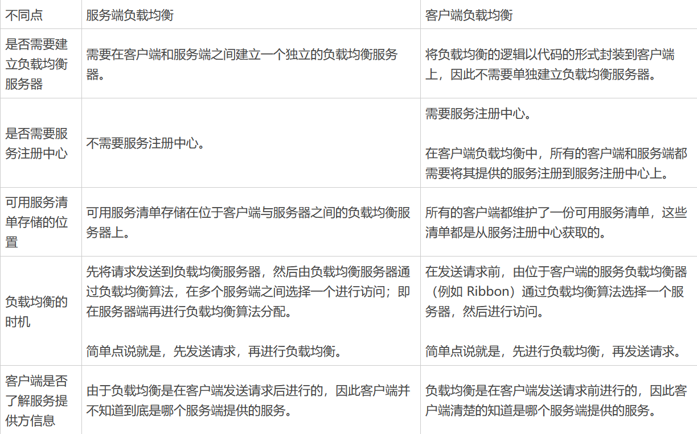

## SpringBoot 和 SpringCloud

1. SpringBoot 专注于快速方便的开发单个个体微服务；SpringCloud 是关注全局的微服务协调整理治理框架，他将 SprongBoot 开发的一个单体微服务整合并管理起来，为各个微服务之间提供配置管理、服务发现、断路器、路由、微代理、事件总线、全局锁、分布式会话等
2. SpringBoot 可以离开 SpringCloud 独立使用开发项目，但是 SpringCloud 离不开 SpringBoot，属于依赖的关系

## 注册中心

### 作用

1. 服务注册：各个服务在启动时向注册中心注册自己的网络地址、服务实例信息和其他相关元数据。这样，其他服务就可以通过注册中心获取到当前可用的服务列表。
2. 服务发现：客户端通过向注册中心查询特定服务的注册信息，获得可用的服务实例列表。这样客户端就可以根据需要选择合适的服务进行调用，实现了服务间的解耦。
3. 负载均衡：注册中心可以对同一服务的多个实例进行负载均衡，将请求分发到不同的实例上，提高整体的系统性能和可用性。
4. 故障恢复：注册中心能够监测和检测服务的状态，当服务实例发生故障或下线时，可以及时更新注册信息，从而保证服务能够正常工作。
5. 服务治理：通过注册中心可以进行服务的配置管理、动态扩缩容、服务路由、灰度发布等操作，实现对服务的动态管理和控制。

### 组件区别

| 特性     | Eureka                           | ZooKeeper                          | Nacos                              |
| -------- | -------------------------------- | ---------------------------------- | ---------------------------------- |
| 开发公司 | Netflix                          | Apache 基金会                      | 阿里巴巴                           |
| CAP      | AP（可用性和分区容忍性）         | CP（一致性和分区容忍性）           | 既支持 AP，也支持 CP               |
| 功能     | 服务注册与发现                   | 分布式协调、配置管理、分布式锁     | 服务注册与发现、配置管理、服务管理 |
| 定位     | 适用于构建基于 HTTP 的微服务架构 | 通用的分布式协调服务框架           | 适用于微服务和云原生应用           |
| 访问协议 | HTTP                             | TCP                                | HTTP/DNS                           |
| 自我保护 | 支持                             | -                                  | 支持                               |
| 数据存储 | 内嵌数据库、多个实例形成集群     | ACID 特性的分布式文件系统 ZAB 协议 | 内嵌数据库、MySQL 等               |
| 健康检查 | Client Beat                      | Keep Alive                         | TCP/HTTP/MYSQL/Client Beat         |
| 特点     | 简单易用、自我保护机制           | 高性能、强一致性                   | 动态配置管理、流量管理、灰度发布等 |

可以看到 Eureka 和 ZooKeeper 的最大区别是一个支持 AP，一个支持 CP，Nacos 既支持既支持 AP，也支持 CP。

### Eureka


#### 实现原理

1. 服务注册与发现：当一个服务实例启动时，它会向 Eureka Server 发送注册请求，将自己的信息注册到注册中心。Eureka Server 会将这些信息保存在内存中，并提供 REST 接口供其他服务查询。服务消费者可以通过查询服务实例列表来获取可用的服务提供者实例，从而实现服务的发现。
2. 服务健康检查：Eureka 通过心跳机制来检测服务实例的健康状态。服务实例会定期向 Eureka Server 发送心跳，也就是续约，以表明自己的存活状态。如果 Eureka Server 在一定时间内没有收到某个服务实例的心跳，则会将其标记为不可用，并从服务列表中移除，下线实例。
3. 服务负载均衡：Eureka 客户端在调用其他服务时，会从本地缓存中获取服务的注册信息。如果缓存中没有对应的信息，则会向 Eureka Server 发送查询请求。Eureka Server 会返回一个可用的服务实例列表给客户端，客户端可以使用负载均衡算法选择其中一个进行调用。

#### 怎么实现高可用？


1. 多实例部署：通过将多个 Eureka Server 实例部署在不同的节点上，可以实现高可用性。当其中一个实例发生故障时，其他实例仍然可以提供服务，并保持注册信息的一致性。
2. 服务注册信息的复制：当一个服务实例向 Eureka Server 注册时，每个 Eureka Server 实例都会复制其他实例的注册信息，以保持数据的一致性。当某个 Eureka Server 实例发生故障时，其他实例可以接管其工作，保证整个系统的正常运行。
3. 自我保护机制：Eureka 还具有自我保护机制。当 Eureka Server 节点在一定时间内没有接收到心跳时，它会进入自我保护模式。在自我保护模式下，Eureka Server 不再剔除注册表中的服务实例，以保护现有的注册信息。这样可以防止由于网络抖动或其他原因导致的误剔除，进一步提高系统的稳定性。

#### 心跳机制（续约）
在应用启动后，节点每隔 30 秒向服务端发送一次心跳，告诉服务端自己还活着，如果服务端在多个心跳周期内（默认 90 秒）没有接收到某个节点的心跳，将会从服务注册表中把这个服务节点移除

#### 服务剔除机制
注册到 Eureka 的服务可能由于内存溢出或网络故障等原因使得服务不能正常地工作，而服务注册中心并未收到“服务下线”的请求。服务注册中心在启动时会创建一个定时任务，默认每隔一段时间（默认为 60 秒）将当前清单中超时（默认为 90 秒）没有续约的服务剔除

#### 自我保护机制
Eureka 服务端会检查最近 15 分钟内所有节点正常心跳占比，如果超过 85%的客户端节点都没有正常的心跳，就会触发自我保护机制，Eureka 就认为客户端与注册中心出现了网络故障，会自动进入自我保护机制

1. 服务端不再从注册列表中移除因为长时间没收到心跳而应该过期的服务
2. 服务端仍然能够接受新服务的注册和查询请求，但是不会被同步到其他节点上，保证当前节点依然可用
3. 当网络稳定时，当前服务端新的注册信息会被同步到其他节点中

#### 其他

1. 客户端启动时如何注册到服务端？

Eureka 客户端在启动时，首先会创建一个心跳的定时任务，定时向服务端发送心跳信息，服务端会对客户端心跳做出响应，如果响应状态码为 404 时，表示服务端没有该客户端的服务信息，那么客户端则会向服务端发送注册请求，注册信息包括服务名、IP、端口、唯一实例 ID 等信息

2. 服务端如何保存客户端服务信息？

客户端通过 Jersey 框架将服务实例信息发送到服务端，服务端将客户端信息放在一个 ConcurrentHashMap 对象中

3. 客户端如何拉取服务端已保存的信息？

客户端拉取服务端服务信息是通过一个定时任务定时拉取的，每次拉取后刷新本地已保存的信息，需要使用时直接从本地获取

### Nacos

## 配置中心

### Nacos

#### 实现原理


1. 配置信息存储：Nacos 默认使用内嵌数据库 Derby 来存储配置信息，还可以采用 MySQL 等关系型数据库。
2. 注册配置信息：服务启动时，Nacos Client 会向 Nacos Server 注册自己的配置信息，这个注册过程就是把配置信息写入存储，并生成版本号。
3. 获取配置信息：服务运行期间，Nacos Client 通过 API 从 Nacos Server 获取配置信息。Server 根据键查找对应的配置信息，并返回给 Client。
4. 监听配置变化：Nacos Client 可以通过注册监听器的方式，实现对配置信息的监听。当配置信息发生变化时，Nacos Server 会通知已注册的监听器，并触发相应的回调方法。

#### 长轮询机制

一般来说客户端和服务端的交互分为两种：推（Push）和拉（Pull），Nacos 在 Pull 的基础上，采用了长轮询来进行配置的动态刷新。

在长轮询模式下，客户端定时向服务端发起请求，检查配置信息是否发生变更。如果没有变更，服务端会 "hold" 住这个请求，即暂时不返回结果，直到配置发生变化或达到一定的超时时间。


1. 客户端发起 Pull 请求，服务端检查配置是否有变更。如果没有变更，则设置一个定时任务，在一段时间后执行，并将当前的客户端连接加入到等待队列中。
2. 在等待期间，如果配置发生变更，服务端会立即返回结果给客户端，完成一次 "推送" 操作。
3. 如果在等待期间没有配置变更，等待时间达到预设的超时时间后，服务端会自动返回结果给客户端，即使配置没有变更。
4. 如果在等待期间，通过 Nacos Dashboard 或 API 对配置进行了修改，会触发一个事件机制，服务端会遍历等待队列，找到发生变更的配置项对应的客户端连接，并将变更的数据通过连接返回，完成一次 "推送" 操作。

通过长轮询的方式，Nacos 客户端能够实时感知配置的变化，并及时获取最新的配置信息。同时，这种方式也降低了服务端的压力，避免了大量的长连接占用内存资源。

### SpringCloud Config

#### 作用

1. 集中管理配置文件
2. 不同环境不同配置，动态化的配置更新，分环境部署，比如/dev、/test、/prod、/beta、/release
3. 运行期间动态调整配置，不再需要在每个服务部署的机器上编写配置文件，服务会向配置中心统一拉取配置自己的信息
4. 当配置发生变动时，服务不需要重启即可感知到配置的变化并应用新的配置
5. 将配置信息以 REST 接口的形式暴露
6. post、curl 访问刷新即可

### SpringCloud Bus

## 远程调用

### 组件区别

|          | Feign                                                        | Dubbo                                                        |
| -------- | ------------------------------------------------------------ | ------------------------------------------------------------ |
| 定义     | Feign 是一个声明式的 Web 服务客户端，用于简化 HTTP API 的调用。 | Dubbo 是一个分布式服务框架，用于构建面向服务的微服务架构。   |
| 通信方式 | 基于 HTTP 协议，使用 RESTful 风格的接口进行定义和调用。      | 基于 RPC 协议，支持多种序列化协议如 gRPC、Hessian 等。       |
| 服务发现 | 通常结合服务注册中心（如 Eureka、Consul）进行服务发现和负载均衡。 | 通过 ZooKeeper、Nacos 等进行服务注册和发现，并提供负载均衡功能。 |
| 服务治理 | 不直接提供服务治理功能，需要结合其他组件或框架进行服务治理。 | 提供服务注册与发现、负载均衡、容错机制、服务降级等服务治理功能。 |
| 跨语言性 | 支持跨语言通信，可以使用 HTTP 作为通信协议实现不同语言之间的通信。 | 支持跨语言通信，通过 Dubbo 的 IDL 生成不同语言的客户端和服务端代码。 |
| 生态系统 | 集成了 Spring Cloud 生态系统，与 Spring Boot 无缝集成。      | 拥有完整的生态系统，包括注册中心、配置中心、监控中心等组件。 |
| 适用场景 | 适用于构建 RESTful 风格的微服务架构，特别适合基于 HTTP 的微服务调用。 | 适用于构建面向服务的微服务架构，提供更全面的服务治理和容错机制。 |

需要注意的是，Feign 和 Dubbo 并不是互斥的关系。实际上，Dubbo 可以使用 HTTP 协议作为通信方式，而 Feign 也可以集成 RPC 协议进行远程调用。选择使用哪种远程调用方式取决于具体的业务需求和技术栈的选择。

### OpenFeign

#### Feign 与 OpenFeign

OpenFeign 是 Spring Cloud 在 Feign 的基础上支持了 SpringMVC 的注解，如@RequesMapping 等等。OpenFeign 的@FeignClient 可以解析 SpringMVC 的@RequestMapping 注解下的接口，并通过动态代理的方式产生实现类，实现类中做负载均衡并调用其他服务。

#### 特点

1. 声明式 API：Feign 允许开发者使用简单的注解来定义和描述对远程服务的访问。通过使用注解，开发者可以轻松地指定 URL、HTTP 方法、请求参数、请求头等信息，使得远程调用变得非常直观和易于理解。

```java
@FeignClient(name = "example", url = "https://api.example.com")
public interface ExampleService {
    @GetMapping("/endpoint")
    String getEndpointData();
}
```

2. 集成负载均衡：Feign 集成了 Ribbon 负载均衡器，可以自动实现客户端的负载均衡。它可以根据服务名和可用实例进行动态路由，并分发请求到不同的服务实例上，提高系统的可用性和可伸缩性。
3. 容错机制：Feign 支持集成 Hystrix 容错框架，可以在调用远程服务时提供容错和断路器功能。当远程服务不可用或响应时间过长时，Feign 可以快速失败并返回预设的响应结果，避免对整个系统造成级联故障。

#### 为什么 Feign 第一次调用耗时很长？

主要原因是由于 Ribbon 的懒加载机制，当第一次调用发生时，Feign 会触发 Ribbon 的加载过程，包括从服务注册中心获取服务列表、建立连接池等操作，这个加载过程会增加首次调用的耗时。

```yaml
ribbon:
   eager-load:
     enabled: true
       clients: service-1
```

**那怎么解决这个问题呢？**

可以在应用启动时预热 Feign 客户端，自动触发一次无关紧要的调用，来提前加载 Ribbon 和其他相关组件。这样，就相当于提前进行了第一次调用。

**Ribbon-eager-load（饥饿加载）模式**

Ribbon 对于负载 Client 是在服务启动后，发生调用的时候才会去创建 Client，所以在第一次发生 http 请求调用的时候，不光要算上 http 的请求时间，还要算上 Client 的创建时间，所以第一次调用的时候才会很慢。

#### 认证传递实现

比较常见的一个做法是，使用拦截器传递认证信息。可以通过实现 RequestInterceptor 接口来定义拦截器，在拦截器里，把认证信息添加到请求头中，然后将其注册到 Feign 的配置中。

```java
@Configuration
public class FeignClientConfig {

    @Bean
    public RequestInterceptor requestInterceptor() {
        return new RequestInterceptor() {
            @Override
            public void apply(RequestTemplate template) {
             // 添加认证信息到请求头中
             template.header("Authorization", "Bearer " + getToken());
            }
        };
    }

    private String getToken() {
        // 获取认证信息的逻辑，可以从 SecurityContext 或其他地方获取
        // 返回认证信息的字符串形式
        return "your_token";
    }
}
```

#### 负载均衡

在 Feign 中，负载均衡是通过集成 Ribbon 来实现的。

Ribbon 是 Netflix 开源的一个客户端负载均衡器，可以与 Feign 无缝集成，为 Feign 提供负载均衡的能力。

Ribbon 通过从服务注册中心获取可用服务列表，并通过负载均衡算法选择合适的服务实例进行请求转发，实现客户端的负载均衡。

### Ribbon

#### 负载均衡策略
1. RoundRobinRule（轮询策略）：按照顺序依次选择
2. RandomRule（随机策略）：随机选择一个服务
3. RetryRule（重试策略）：先按照轮询的策略获取服务，如果服务获取失败，则在指定的时间内重试，获取可用的服务
4. RestAvailableRule（最小连接策略）：先过滤由于多次访问故障而处于断路器跳闸状态的服务，然后选择一个并发量最小的服务
5. AvailabilityFulteringRule（可用性敏感策略）：先过滤故障实例，再选择并发量最小的实例
6. WeightedResponseTimeRule（权重策略）：刚开始使用轮询策略并开启一个计时器，每一段时间收集一次所有服务提供者的平均响应时间，然后再给每个服务提供者附上一个权重，权重越高被选中的概率也越大
7. ZoneAvoidanceRule（区域敏感策略）：默认规则，复合判断 server 所在区域的性能和 server 的可用性选择服务器

#### 底层实现原理

Ribbon 使用 discoveryClient 从注册中心读取目标服务信息，对同一接口请求进行计数，使用%取余算法获取目标服务集群索引，返回获取到的目标服务信息。

#### 服务端负载均衡


当客户端发送请求时，该请求不会直接发送到服务端进行处理，而是全部交给负载均衡服务器，由负载均衡服务器按照某种算法（例如轮询、随机等），从其维护的可用服务清单中选择一个服务端，然后进行转发

#### 客户端负载均衡


客户端负载均衡是将负载均衡逻辑以代码的形式封装到客户端上，即负载均衡位于客户端，客户端通过服务注册中心获取到一份服务端提供的可用服务清单，有了服务清单后，负载均衡器会在客户端发送请求前通过负载均衡算法选择一个服务端实例再进行访问，以达到负载均衡的目的

#### 客户端和服务端区别


#### Ribbon 和 Nginx 的区别
1. Nginx 是服务器负载均衡，客户端所有请求都会交给 Nginx，然后由 Nginx 实现转发请求，即负载均衡是由服务端实现的
2. Ribbon 本地负载均衡，在调用微服务接口时候，会在注册中心上获取注册信息服务列表之后缓存在 JVM 本地，从而在本地实现 RPC 远程服务调用技术

## 网关

### 什么是 API 网关？

API 网关（API Gateway）是一种中间层服务器，用于集中管理、保护和路由对后端服务的访问。它充当了客户端与后端服务之间的入口点，提供了一组统一的接口来管理和控制 API 的访问。

主要功能包括：

1. 路由转发：API 网关根据请求的 URL 路径或其他标识，将请求路由到相应的后端服务。通过配置路由规则，可以灵活地将请求分发给不同的后端服务。
2. 负载均衡：API 网关可以在后端服务之间实现负载均衡，将请求平均分发到多个实例上，提高系统的吞吐量和可扩展性。
3. 安全认证与授权：API 网关可以集中处理身份验证和授权，确保只有经过身份验证的客户端才能访问后端服务。它可以与身份提供者（如 OAuth、OpenID Connect）集成，进行用户认证和授权操作。
4. 缓存：API 网关可以缓存后端服务的响应，减少对后端服务的请求次数，提高系统性能和响应速度。
5. 监控与日志：API 网关可以收集和记录请求的指标和日志，提供实时监控和分析，帮助开发人员和运维人员进行故障排查和性能优化。
6. 数据转换与协议转换：API 网关可以在客户端和后端服务之间进行数据格式转换和协议转换，如将请求从 HTTP 转换为 WebSocket，或将请求的参数进行格式转换，以满足后端服务的需求。
7. API 版本管理：API 网关可以管理不同版本的 API，允许同时存在多个 API 版本，并通过路由规则将请求正确地路由到相应的 API 版本上。

### 作用

统一管理微服务请求、权限控制、负载均衡、路由转发、监控、安全控制黑名单和白名单

网关和过滤器的区别：网关是对所有服务的请求进行分析过滤，过滤器是对单个服务而言

### Zuul

#### 什么是 Zuul？
Zuul 是对 SpringCloud 提供的路由方案，他会根据请求的路径不同，网关会定位到指定的微服务，并代理请求到不同的微服务接口，它对外隐蔽了微服务的真正接口地址

1. 动态路由表：Zuul 支持 Eureka 路由和手动配置路由，这两种都支持自动更新
2. 路由定位：根据请求路径，Zuul 有自己的一套定位服务规则以及路由表达式匹配
3. 反向代理：客户端请求到路由网关，网关受理之后，在对目标发送请求，拿到响应之后再给客户端

#### Zuul 和 Nginx
1. 实现方式：Zuul 采用 Ribbon+Eureka 实现本地负载均衡；Nginx 采用服务器实现负载均衡
2. 适用场景：Zuul 适合微服务中各服务的负载均衡；Nginx 适合于服务器端负载均衡

### GateWay

#### Gateway 和 Zuul
1. 是否支持同步：Gateway 支持异步；Zuul 仅支持同步
2. 内部实现：Gateway 对比 Zuul 多依赖了 spring-webflux，在 spring 的支持下，功能更强大，内部实现了限流、负载均衡等，扩展性也更强
3. Spring Cloud Gateway 还 支持 WebSocket， 并且与 Spring 紧密集成拥有更好的开发体验

#### 执行流程

1. 客户端向 Spring Cloud Gateway 发出请求。然后在 Gateway Handler Mapping 中找到与请求相匹配的路由，将其发送到 Gateway Web Handler。
2. Handler 再通过指定的过滤器链来将请求发送到我们实际的服务执行业务逻辑，然后返回。
3. 过滤器之间用虚线分开是因为过滤器可能会在发送代理请求之前（“pre”）或之后（“post”）执行业务逻辑。
4. Filter 在“pre”类型的过滤器可以做参数校验、权限校验、流量监控、日志输出、协议转换等，
5. 在“post”类型的过滤器中可以做响应内容、响应头的修改，日志的输出，流量监控等有着非常重要的作用。

## 断路器

### 什么是断路器？

当一个服务调用另一个服务由于网络原因或自身原因出现问题，调用者就会等待被调用者的响应。当更多的服务请求到这些资源导致更多的请求等待，发生连锁效应（雪崩效应）

1. 打开状态：一段时间内达到一定的次数无法调用，并且多次监测没有恢复的迹象，断路器完全打开，那么下次请求就不会请求到该服务
2. 半开状态：短时间内有恢复迹象，断路器会将部分请求发给该服务，正常调用时断路器关闭
3. 关闭状态：当服务一直处于正常状态，能正常调用

### Hystrix

#### 特点

1. 服务熔断（Circuit Breaker）：Hystrix 通过设置阈值来监控服务的错误率或响应时间。当错误率或响应时间超过预设的阈值时，熔断器将会打开，后续的请求将不再发送到实际的服务提供方，而是返回预设的默认值或错误信息。这样可以快速隔离故障服务，防止故障扩散，提高系统的稳定性和可用性。
2. 服务降级（Fallback）：当服务熔断打开时，Hystrix 可以提供一个备用的降级方法或返回默认值，以保证系统继续正常运行。开发者可以定义降级逻辑，例如返回缓存数据、执行简化的逻辑或调用其他可靠的服务，以提供有限但可用的功能。

```java
@Service
public class MyService {

    @HystrixCommand(fallbackMethod = "fallbackMethod")
    public String myServiceMethod() {
        // 实际的服务调用逻辑
        // ...
    }

    public String fallbackMethod() {
        // 降级方法的逻辑，当服务调用失败时会执行此方法
        // 可以返回默认值或执行其他备用逻辑
        // ...
    }
}
```

3. 请求缓存（Request Caching）：Hystrix 可以缓存对同一请求的响应结果，当下次请求相同的数据时，直接从缓存中获取，避免重复的网络请求，提高系统的性能和响应速度。
4. 请求合并（Request Collapsing）：Hystrix 可以将多个并发的请求合并为一个批量请求，减少网络开销和资源占用。这对于一些高并发的场景可以有效地减少请求次数，提高系统的性能。
5. 实时监控和度量（Real-time Monitoring and Metrics）：Hystrix 提供了实时监控和度量功能，可以对服务的执行情况进行监控和统计，包括错误率、响应时间、并发量等指标。通过监控数据，可以及时发现和解决服务故障或性能问题。
6. 线程池隔离（Thread Pool Isolation）：Hystrix 将每个依赖服务的请求都放在独立的线程池中执行，避免因某个服务的故障导致整个系统的线程资源耗尽。通过线程池隔离，可以提高系统的稳定性和可用性。

#### 实现延迟和容错的方法

1. 包裹请求：使用 HystrixCommand 包裹对依赖的调用逻辑，每个命令在独立线程中执行。这使用了设计模式中的“命令模式”。
2. 跳闸机制：当某服务的错误率超过一定的阈值时，Hystrix 可以自动或手动跳闸，停止请求该服务一段时间。
3. 资源隔离：Hystrix 为每个依赖都维护了一个小型的线程池（或者信号量）。如果该线程池已满，发往该依赖的请求就被立即拒绝，而不是排队等待，从而加速失败判定。
4. 监控：Hystrix 可以近乎实时地监控运行指标和配置的变化，例如成功、失败、超时、以及被拒绝的请求等。
5. 回退机制：当请求失败、超时、被拒绝，或当断路器打开时，执行回退逻辑。回退逻辑由开发人员自行提供，例如返回一个缺省值。
6. 自我修复：断路器打开一段时间后，会自动进入“半开”状态。

#### 工作流程

1. 创建 HystrixCommand（用在依赖的服务返回单个操作结果的时候） 或 HystrixObserableCommand（用在依赖的服务返回多个操作结果的时候） 对象。
2. 命令执行。其中 HystrixComand 实现了下面前两种执行方式；而 HystrixObservableCommand 实现了后两种执行方式：execute()：同步执行，从依赖的服务返回一个单一的结果对象， 或是在发生错误的时候抛出异常。queue()：异步执行， 直接返回 一个 Future 对象， 其中包含了服务执行结束时要返回的单一结果对象。observe()：返回 Observable 对象，它代表了操作的多个结果，它是一个 Hot Obserable（不论 "事件源" 是否有 "订阅者"，都会在创建后对事件进行发布，所以对于 Hot Observable 的每一个 "订阅者" 都有可能是从 "事件源" 的中途开始的，并可能只是看到了整个操作的局部过程）。toObservable()：同样会返回 Observable 对象，也代表了操作的多个结果，但它返回的是一个 Cold Observable（没有 "订阅者" 的时候并不会发布事件，而是进行等待，直到有 "订阅者" 之后才发布事件，所以对于 Cold Observable 的订阅者，它可以保证从一开始看到整个操作的全部过程）。
3. 若当前命令的请求缓存功能是被启用的， 并且该命令缓存命中， 那么缓存的结果会立即以 Observable 对象的形式 返回。
4. 检查断路器是否为打开状态。如果断路器是打开的，那么 Hystrix 不会执行命令，而是转接到 fallback 处理逻辑（第 8 步）；如果断路器是关闭的，检查是否有可用资源来执行命令（第 5 步）。
5. 线程池/请求队列/信号量是否占满。如果命令依赖服务的专有线程池和请求队列，或者信号量（不使用线程池的时候）已经被占满， 那么 Hystrix 也不会执行命令， 而是转接到 fallback 处理逻辑（第 8 步）。
6. Hystrix 会根据我们编写的方法来决定采取什么样的方式去请求依赖服务。HystrixCommand.run() ：返回一个单一的结果，或者抛出异常。HystrixObservableCommand.construct()：返回一个 Observable 对象来发射多个结果，或通过 onError 发送错误通知。
7. Hystrix 会将 "成功"、"失败"、"拒绝"、"超时" 等信息报告给断路器， 而断路器会维护一组计数器来统计这些数据。断路器会使用这些统计数据来决定是否要将断路器打开，来对某个依赖服务的请求进行 "熔断/短路"。
8. 当命令执行失败的时候， Hystrix 会进入 fallback 尝试回退处理， 我们通常也称该操作为 "服务降级"。而能够引起服务降级处理的情况有下面几种：第 4 步：当前命令处于 "熔断/短路" 状态，断路器是打开的时候。第 5 步：当前命令的线程池、 请求队列或 者信号量被占满的时候。第 6 步：HystrixObservableCommand.construct() 或 HystrixCommand.run() 抛出异常的时候。
9. 当 Hystrix 命令执行成功之后， 它会将处理结果直接返回或是以 Observable 的形式返回。

### Sentinel

#### 采用的限流算法

Sentinel 使用滑动窗口限流算法来实现限流。

滑动窗口限流算法是一种基于时间窗口的限流算法。它将一段时间划分为多个时间窗口，并在每个时间窗口内统计请求的数量。通过动态地调整时间窗口的大小和滑动步长，可以更精确地控制请求的通过速率。

#### 实现集群限流

Sentinel 利用了 Token Server 和 Token Client 的机制来实现集群限流。

开启集群限流后，Client 向 Token Server 发送请求，Token Server 根据配置的规则决定是否限流。


## 链路跟踪

## 服务监控
