## 分布式理论

### CAP 理论

1. C（Consistency）：一致性，所有节点访问同一份最新的数据副本
2. A（Availability）：可用性，非故障的节点在合理的时间内返回合理的响应（不是错误或超时的响应）
3. P（Partition Tolerance）：分区容错性，分布式系统出现网络分区的时候，仍然能够对外提供服务

注意：分布式系统理论上不可能选择 CA 架构，只能选择 CP 或者 AP 架构

| 选择 | 说明                                                         |
| ---- | ------------------------------------------------------------ |
| CA   | 放弃分区容错性，加强一致性和可用性，其实就是传统的单机场景   |
| AP   | 放弃一致性（这里说的一致性是强一致性），追求分区容错性和可用性，这是很多分布式系统设计时的选择，例如很多 NoSQL 系统就是如此 |
| CP   | 放弃可用性，追求一致性和分区容错性，基本不会选择，网络问题会直接让整个系统不可用 |

**不能 CA 的理由**

若系统出现“网络分区”，系统中的某个节点在进行写操作，为了保证 C，必须要禁止其他节点的读写操作，这就和 A 发生冲突了。为了保证 A，其他节点的读写操作正常的话，那就和 C 发生冲突了

**网络分区**

分布式系统中，多个节点之前的网络本来是连通的，但是因为某些故障（比如部分节点网络出了问题）某些节点之间不连通了，整个网络就分成了几块区域，这就叫网络分区

### BASE 理论

BASE 理论作为 CAP 的延伸，其核心特点在于放弃强一致性，追求最终一致性

1. 基本可用

指分布式系统在出现不可预知故障的时候，允许损失部分可用性

+ 响应时间上的损失：正常情况下，处理用户请求需要 0.5s 返回结果，但是由于系统出现故障，处理用户请求的时间变为 3s
+ 系统功能上的损失：正常情况下，用户可以使用系统的全部功能，但是由于系统访问量突然剧增，系统的部分非核心功能无法使用
2. 软状态

指允许系统中的数据存在中间状态（CAP 理论中的数据不一致），并认为该中间状态的存在不会影响系统的整体可用性，即允许系统在不同节点的数据副本之间进行数据同步的过程存在延时

3. 最终一致性

系统中所有的数据副本，在经过一段时间的同步后，最终能够达到一个一致的状态，因此，最终一致性的本质是需要系统保证最终数据能够达到一致，而不需要实时保证系统数据的一致性

### 一致性理论

1. 强一致性：读写操作后，能立刻看到更新过的数据
2. 弱一致性：能容忍部分或者全部数据看不到
3. 最终一致性：经过一段时间后，能够看到更新后的数据

## 分布式 ID

### UUID

UUID 是通过唯一标识码的缩写，其目的是让分布式系统中所有元素都有唯一的目的辨识标识，无需中央控制器进行指定，一般有一组 32 位数的 16 进制数字所构成，格式为：xxxxxxxx-xxxx-xxxx-xxxx-xxxxxxxxxxxx

优点：

1. 降低全局节点的压力，主键生成速度快
2. 生成的主键全局唯一，跨服务器合并数据方便

缺点：

1. UUID 占用 16 个字符，空间占用大
2. UUID 不是递增有序的数据，不方便排序，数据写入 IO 随机性大，索引效率下降

### 数据库自增主键

MySQL 数据库设置主键且自增

优点：

1. int 和 bigint 类型占用空间小，且数字类型索引的查询速度优于字符串索引类型
2. 主键自增，IO 写入连续性好

缺点：

1. 由于 MySQL 数据存储在磁盘中，导致其并发性能不高
2. 设置分布式 ID 要考虑数据库的分库分表，改造复杂
3. 由于主键是自增的，数据容易泄露

### Redis 自增

Redis 计数器，incr 命令实现原子性自增

优点：Redis 使用内存，并发性能好

缺点：

1. 由于是内存存储，数据容易丢失
2. 数据自增，容易泄露

### 雪花算法

分布式 ID 经典解决方案

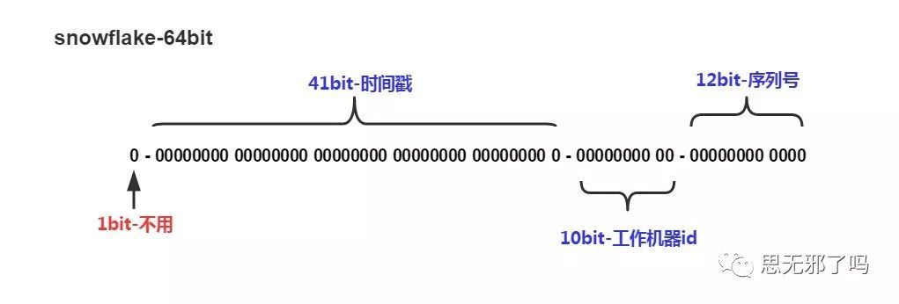

1. 2^41/1000 \*60\* 60 \*24\* 365 = 69，这个时间戳可以使用 69 年不重复，对于大部分系统够用了
2. 10 位的数据机器位，所以可以部署在 1024 个节点
3. 12 位的序列，在毫秒的时间戳内计数，支持每个节点每毫秒产生 4096 个 ID 序号，所以最大可以支持单节点差不多 4 百万的并发量

优点：

1. 高性能高可用：生成时不依赖于数据库，完全在内存中生成
2. 容量大：每秒钟能生成数百万的自增 ID
3. ID 自增：存储数据库中，索引效率高

缺点：强依赖时钟回拨，有非常小的概率 ID 会重复

## 分布式事务

### 什么是分布式事务？

分布式事务：在分布式系统中一次操作需要由多个服务协同完成，这种由不同的服务之间通过网络协同完成的事务称为分布式事务

**分类**

1. 刚性事务：通常无业务改造，要使分布式事务达到像本地事务一样，具备数据强一致性，原生支持回滚/隔离性，低并发，适合短事务

* 原则：满足 CAP 的 CP 理论
* 缺点：由于同步阻塞，处理效率低，不适合大型网站分布式场景

2. 柔性事务：不要求强一致性，而是要求最终一致性，允许有中间状态，即 AP 状态

与刚性事务相比，柔性事务的特点为：

* 有业务改造
* 最终一致性
* 实现补偿接口
* 实现资源锁定接口
* 高并发，适合长事务

### 二阶段提交（2PC）

1. 准备阶段

事务管理器给每个参与者发送 prepare 消息，每个数据库参与者在本地执行事务，并写本地的 Undo/Redo 日志，此时事务没有提交（Undo 日志是记录修改前的数据，用于数据库回滚；Redo 日志是记录修改后的数据，用于提交事务后写入数据文件）

2. 提交阶段

如果事务管理器收到了参与者的执行失败或者超时消息时，直接给每个参与者发送回滚（Rollback）消息；否则，发送提交（Commit）消息。参与者根据事务管理器的指令执行提交或者回滚操作，并释放事务处理过程中使用的锁资源

**成功情况**

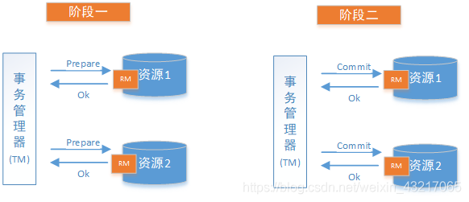

**失败情况**

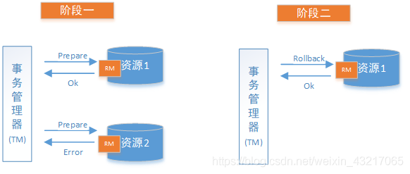

**缺点**

1. 同步阻塞：参与者在等待协调者的指令时，其实是在等待其他参与者的响应，在此过程中，参与者是无法进行其他操作的，即阻塞了其运行。倘若参与者与协调者之间网络异常导致参与者一直收不到协调者信息，那么会导致参与者一直阻塞下去
2. 单点问题：在 2PC 中，一切请求都来自协调者，所以协调者的地址是至关重要的，如果协调者宕机，那么就会使参与者一直阻塞并占用事务资源。如果协调者也是分布式，使用选主方式提供服务，那么在一个协调者挂掉后，可以选取另一个协调者继续后续的服务，可以解决单点问题，但是新协调者无法知道上一个事务的全部状态信息，所以也无法顺利处理上一个事务
3. 数据不一致：Commit 事务过程中 Commit 请求/Rollback 请求可能因为协调者宕机或协调者与参与者网络问题丢失，那么就导致了部分参与者没有收到 Commit/Rollback 请求，而其他参与者则正常收到执行了 Commit/Rollback 操作，没有收到请求的参与者则继续阻塞。这时，参与者之间的数据就不再一致了，当参与者执行 Commit/Rollback 后会向协调者发送 ACK，然而协调者不论是否收到所有的参与者的 ACK，该事务也不会再有其他补救措施了
4. 环境可靠性：依赖协调者 Prepare 请求发出后，等待响应，然而如果有参与者宕机或协调者之间的网络中断，都会导致协调者无法收到所有参与者的响应，那么在 2PC 中，协调者会等待一定时间，然后超时后，会触发事务中断，在这个过程中，协调者和所有其他参与者都是处于阻塞的

### 三阶段提交（3PC）

三阶段提交主要是为了解决两阶段提交协议的阻塞问题，2PC 存在的问题是当协调者崩溃时，参与者不能做出最后的选择，因此参与者可能在协调者恢复之前保持阻塞

三阶段提交有两个改动点：

1. 同时在协调者和参与者中都引入了超时机制
2. 插入了一个准备阶段，保证了在最后提交阶段之前各参与节点的状态是一致的

**CanCommit 阶段**

尝试获取数据库锁，如果可以就返回 Yes

**PreCommit 阶段**

在 2PC 中只有协调者可以超时，参与者没有超时机制，在 3PC 中协调者和参与者都引入了超时机制

1. 事务预提交：参与者接收到 PreCommit 请求后，会执行事务操作，并将 undo 和 redo 信息记录到事务日志中
2. 响应反馈：如果参与者成功地执行了事务操作，则返回 ACK 响应，同时开始等待最终指令

假如有任何一个参与者向协调者发送了 No 响应，或者等待超时之后，协调者都没有接收到参与者的响应，那么就执行事务的中断

1. 发送中断请求：协调者向所有参与者发送 abort 请求
2. 中断事务：参与者收到来自协调者的 abort 请求之后（或超时之后，仍未收到协调者的请求），执行事务的中断

**DoCommit 阶段**

1. 执行提交：发送提交请求，协调者接收到参与者发送的 ACK 响应，那么他将从预提交状态进入到提交状态，并向所有参与者发送 doCommit 请求

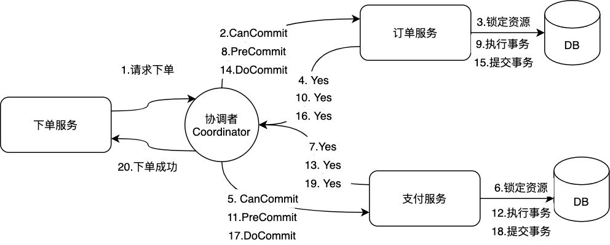

2. 中断事务：协调者没有接收到参与者发送的 ACK 响应（可能是接受者发送的不是 ACK 响应，也可能响应中断），那么就会执行中断事务

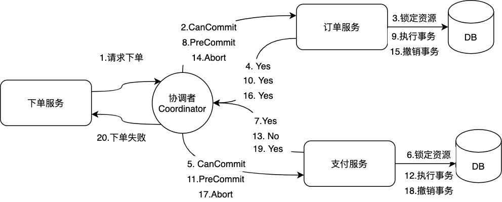

3. 其他情况：如果参与者无法及时接收到来自协调者的 doCommit 或者 abort 请求，会在等待超时之后，会继续进行事务的提交

**3PC 无法解决的问题**

由于网络原因，协调者发送的 abort 响应没有及时被参与者接收到，那么参与者在等待超时之后执行了 commit 操作，这样就和其他接收到 abort 命令并执行回滚的参与者之间存在数据不一致的情况。所以可以认为，无论是二阶段提交还是三阶段提交都无法彻底解决分布式的一致性问题

### TCC 模式（补偿事务）

TCC（Try Confirm Cancel）是应用层的两阶段提交，所以对代码的侵入性强，其核心思想是：针对每个操作，都要实现对应的确认和补偿操作，也就是业务逻辑的每个分支都需要实现 try、confirm、cancel 三个操作，第一阶段由业务代码编排来调用 Try 接口进行资源预留，当所有参与者的 Try 接口都成功了，事务协调者提交事务，并调用参与者的 confirm 接口真正提交业务操作，否则调用每个参与者的 cancel 接口回滚事务，并且由于 confirm 或者 cancel 有可能会重试，因此对应的部分需要支持幂等。

**执行流程**

1. Try：完成所有业务检查（一致性），预留业务资源（准隔离性）
2. Confirm：确认执行业务操作，不做任何业务检查，只使用 Try 阶段预留的业务资源
3. Cancel：取消 Try 阶段预留的业务资源

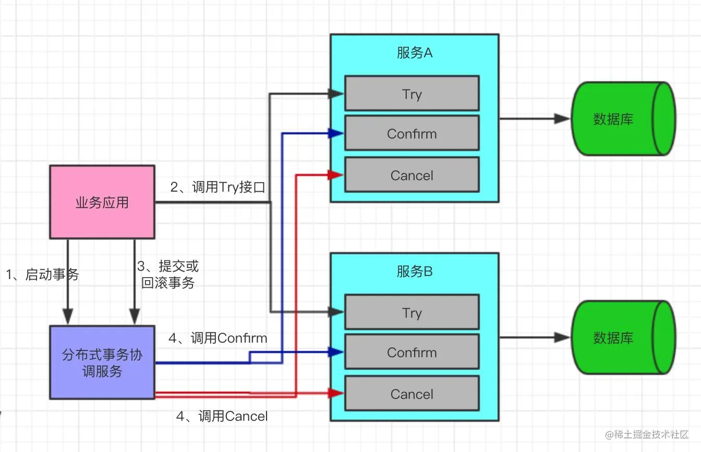

**幂等控制**

1. 问题：因为网络抖动等原因，分布式事务框架可能会重复调用同一个分布式事务中的一个分支事务的二阶段接口，所以分支事务的二阶段接口 Confirm/Cancel 需要能够保证幂等性（执行一次和多次的结果一样），如果二阶段接口不能保证幂等性，则会产生严重的问题，造成资源的重复使用或者重复释放，进而导致业务故障
2. 解决：事务状态控制记录作为控制手段，状态可分为初始状态、已确认、已回滚，只有初始状态才允许执行二阶段，其他状态直接返回结果

**空回滚**

1. 问题：事务协调器在调用 TCC 服务的一阶段 Try 操作时，可能会出现因为丢包而导致的网络超时，此时事务协调器会触发二阶段回滚，TCC 服务在未收到 Try 请求的情况下收到 Cancel 请求
2. 出现场景：网络超时、服务超时
3. 解决方法：当 Try 方法被成功执行后，会插入一条记录，标识该分支事务处于初始状态。当二阶段的 Cancel 方法被调用时，可以通过查询控制表的对应记录进行判断。如果记录存在且状态为初始态，就表示一阶段已成功执行，可以正常执行回滚操作，释放预留的资源；如果记录不存在则表示一阶段未执行，本次为空回滚，不释放任何资源

**资源悬挂**

1. 问题：事务协调器在调用 TCC 服务的一阶段 Try 操作时，可能会出现因网络拥堵而导致的超时，此时事务协调器会触发二阶段回滚，调用 TCC 服务的 Cancel 操作，在此之后，拥堵在网络的一阶段 Try 数据包被 TCC 服务收到，出现了二阶段 Cancel 请求比一阶段 Try 请求先执行的情况
2. 解决：事务状态控制记录作为控制手段，二阶段发现无记录时插入记录，一阶段执行时检查记录是否存储

**2PC 和 TCC 的区别**

2PC 主要是在 DB 层，TCC 主要在应用层，由代码编写

### SAGA 模式

Saga 事务核心思想是将长事务拆分为多个本地短事务并依次正常提交，如果所有短事务均执行成功，那么分布式事务提交；如果出现某个参与者执行本地事务失败，则由 Saga 事务协调器协调根据相反顺序调用补偿操作，回滚已提交的参与者，使分布式事务回到最初始的状态。

Saga 事务基本协议如下：

1. 每个 Saga 事务由一系列幂等的有序子事务(sub-transaction) Ti 组成。
2. 每个 Ti 都有对应的幂等补偿动作 Ci，补偿动作用于撤销 Ti 造成的结果。

与 TCC 事务补偿机制相比，TCC 有一个预留(Try)动作，相当于先保存一个草稿，然后才提交；Saga 事务没有预留动作，直接提交

对于事务异常，Saga 提供了两种恢复策略，分别如下

**向后恢复(backward recovery)**

当执行事务失败时，补偿所有已完成的事务，是“一退到底”的方式，这种做法的效果是撤销掉之前所有成功的子事务，使得整个 Saga 的执行结果撤销。如下图

从上图可知事务执行到了支付事务 T3，但是失败了，因此事务回滚需要从 C3, C2, C1 依次进行回滚补偿，对应的执行顺序为：T1, T2, T3, C3, C2, C1。

**向前恢复(forward recovery)**

对于执行不通过的事务，会尝试重试事务，这里有一个假设就是每个子事务最终都会成功，这种方式适用于必须要成功的场景，事务失败了重试，不需要补偿。流程如下图：

Saga 事务有两种不同的实现方式，分别如下：

**命令协调（Order Orchestrator）**

中央协调器（Orchestrator，简称 OSO）以命令/回复的方式与每项服务进行通信，全权负责告诉每个参与者该做什么以及什么时候该做什么。整体流程如下图：

中央协调器 OSO 必须事先知道执行整个事务所需的流程，如果有任何失败，它还负责通过向每个参与者发送命令来撤销之前的操作来协调分布式的回滚，基于中央协调器协调一切时，回滚要容易得多，因为协调器默认是执行正向流程，回滚时只要执行反向流程即可

**事件编排（Event Choreographyo）**

命令协调方式基于中央协调器实现，所以有单点风险，但是事件编排方式没有中央协调器。事件编排的实现方式中，每个服务产生自己的时间并监听其他服务的事件来决定是否应采取行动。

在事件编排方法中，第一个服务执行一个事务，然后发布一个事件，该事件被一个或多个服务进行监听，这些服务再执行本地事务并发布（或不发布）新的事件。当最后一个服务执行本地事务并且不发布任何事件时，意味着分布式事务结束，或者它发布的事件没有被任何 Saga 参与者听到都意味着事务结束。

命令协调设计的优缺点：

1. 优点：

服务之间关系简单，避免服务间循环依赖，因为 Saga 协调器会调用 Saga 参与者，但参与者不会调用协调器。
程序开发简单，只需要执行命令/回复(其实回复消息也是一种事件消息)，降低参与者的复杂性。
易维护扩展，在添加新步骤时，事务复杂性保持线性，回滚更容易管理，更容易实施和测试。

2. 缺点：

* 中央协调器处理逻辑容易变得庞大复杂，导致难以维护。
* 存在协调器单点故障风险。

事件编排设计的优缺点：

1. 优点：

* 避免中央协调器单点故障风险。
* 当涉及的步骤较少服务开发简单，容易实现。

2. 缺点：

* 服务之间存在循环依赖的风险。
* 当涉及的步骤较多，服务间关系混乱，难以追踪调测。

### 本地消息表

本地消息表的核心思路就是将分布式事务拆分成本地事务进行处理，在该方案中主要有两种角色：事务主动方和事务被动方。事务主动发起方需要额外新建事务消息表，并在本地事务中完成业务处理和记录事务消息，并轮询事务消息表的数据发送事务消息，事务被动方基于消息中间件消费事务消息表中的事务。

这样可以避免以下两种情况导致的数据不一致性：

* 业务处理成功、事务消息发送失败
* 业务处理失败、事务消息发送成功

**执行流程**

1. 事务主动方在同一个本地事务中处理业务和写消息表操作
2. 事务主动方通过消息中间件，通知事务被动方处理事务消息。消息中间件可以基于 Kafka、RocketMQ 消息队列，事务主动方主动写消息到消息队列，事务消费方消费并处理消息队列中的消息。
3. 事务被动方通过消息中间件，通知事务主动方事务已处理的消息。
4. 事务主动方接收中间件的消息，更新消息表的状态为已处理。

一些必要的容错处理如下：

1. 当 ① 处理出错，由于还在事务主动方的本地事务中，直接回滚即可
2. 当 ②、③ 处理出错，由于事务主动方本地保存了消息，只需要轮询消息重新通过消息中间件发送，通知事务被动方重新读取消息处理业务即可。
3. 如果是业务上处理失败，事务被动方可以发消息给事务主动方回滚事务
4. 如果事务被动方已经消费了消息，事务主动方需要回滚事务的话，需要发消息通知事务主动方进行回滚事务。

**优点**

从应用设计开发的角度实现了消息数据的可靠性，消息数据的可靠性不依赖于消息中间件，弱化了对 MQ 中间件特性的依赖。

方案轻量，容易实现。

**缺点**

与具体的业务场景绑定，耦合性强，不可公用

消息数据与业务数据同库，占用业务系统资源

业务系统在使用关系型数据库的情况下，消息服务性能会受到关系型数据库并发性能的局限

### MQ 事务消息

基于MQ的分布式事务方案本质上是对本地消息表的封装，整体流程与本地消息表一致，唯一不同的就是将本地消息表存在了MQ内部，而不是业务数据库中

优点：实现逻辑简单，开发成本比较低

缺点：

1. 与业务场景绑定，高耦合，不可公用
2. 本地消息表与业务数据表在同一个库，占用业务系统资源，量大可能会影响数据库性能

**RocketMQ事务消息**

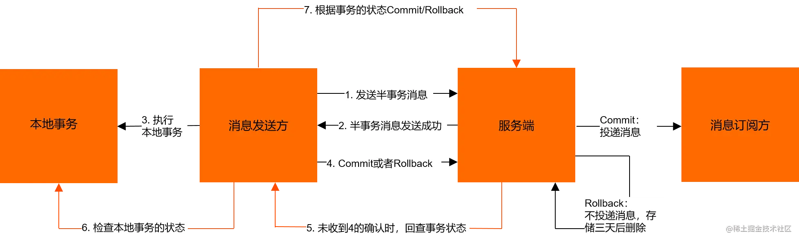

1. 发送方将半事务消息发送至消息队列 RocketMQ 服务端
2. 消息队列 RocketMQ 服务端将消息持久化成功之后，向发送方返回 Ack 确认消息已经发送成功，此时消息为半事务消息
3. 发送方开始执行本地事务逻辑
4. 发送方根据本地事务执行结果向服务端提交二次确认（Commit 或是 Rollback），服务端收到 Commit 状态则将半事务消息标记为可投递，订阅方最终将收到该消息；服务端收到 Rollback 状态则删除半事务状态，订阅方将不会接受该消息

### 最大努力通知

最大努力通知也称为定期校对，是对MQ事务方案的进一步优化。它在事务主动方增加了消息校对的接口，如果事务被动方没有接收到主动方发送的消息，此时可以调用事务主动方提供的消息校对的接口主动获取

在可靠消息事务中，事务主动方需要将消息发送出去，并且让接收方成功接收消息，这种可靠性发送是由事务主动方保证的；但是最大努力通知，事务主动方仅仅是尽最大努力（重试，轮询....）将事务发送给事务接收方，所以存在事务被动方接收不到消息的情况，此时需要事务被动方主动调用事务主动方的消息校对接口查询业务消息并消费，这种通知的可靠性是由事务被动方保证的。

所以最大努力通知适用于业务通知类型，例如微信交易的结果，就是通过最大努力通知方式通知各个商户，既有回调通知，也有交易查询接口。

### AT 模式

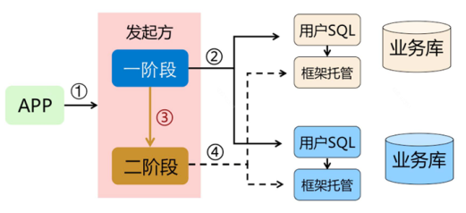

1. 一阶段

Seate 会拦截“业务 SQL”，首先解析 SQL 语句，找到“业务 SQL”要更新的业务数据，在业务数据被更新前，将其保存成“before image”，然后执行“业务 SQL”更新业务数据，在业务数据更新之后，再将其保存成“after image”，最后生成行锁。以上操作全部在一个数据库事务内完成，保证了一阶段操作的原子性

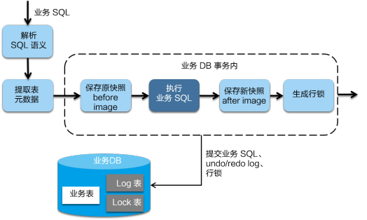

2. 二阶段提交

将一阶段保存的快照数据和行锁删掉，完成数据清理即可

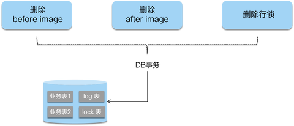

3. 二阶段回滚

用“before image”还原业务数据，但在还原前要首先校验脏写，对比“数据库当前业务数据”和“after image”，如果两份数据完全一致就说明没有脏写，可以还原业务数据，如果不一致就说明有脏写，出现脏写就需要转人工处理

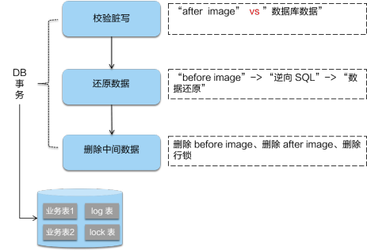

### XA 模式

## 分布式微服务

### 限流算法

#### 计数器限流算法
在指定周期内累加访问次数，当访问次数达到设定的阈值时，触发限流策略，当进入下一个时间周期时会将访问次数清零

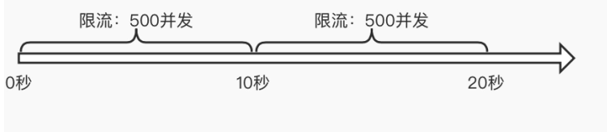

临界问题：当在 8-10 秒和 10-12 秒内分别并发 500，虽然没有超过阈值，但如果算 8-12 秒，则并发数高达 1000，已经超过了原先定义的 10 秒内不超过 500 的并发量

突刺现象：如果在单位时间 10 秒内的前 100ms，通过了 500 个请求，则后面的 9900ms 都无法接受任何请求，也就无法应对短时间高并发

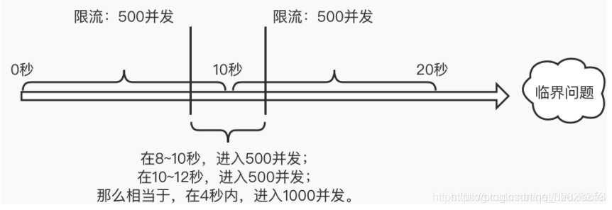

#### 滑动窗口限流法
为了避免计数器中的临界问题，让限制更加平滑，将固定窗口中分割出多个小时间窗口，分别在每个小的时间窗口中记录访问次数，然后根据时间往前滑动并删除过期的小时间窗口，最终只需要统计每个小时间窗口不超过阈值/n 以及在滑动窗口范围内的所有小时间窗口的总的计数不超过阈值即可

缺点：无法应对短时间高并发（突刺现象）

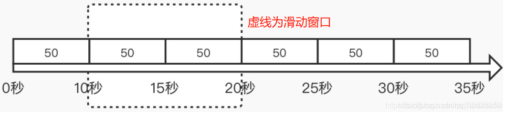

#### 漏桶限流算法
核心思想：不管上面的水流速度有多快，漏桶水滴的流出速度始终保持不变

不足：无法应对突发的并发流量，因为流程速率一直都是恒定的，最后给服务的请求数量的速率是恒定的，多余的请求将无法通过，在桶内等待

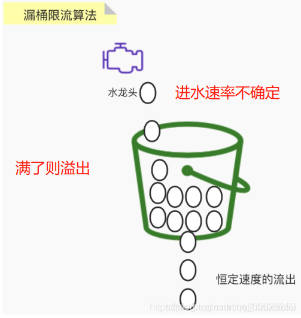

#### 令牌桶限流算法
速度恒定、令牌桶大小固定，如果令牌桶被填满，则会丢弃生成的令牌，如果桶内没有令牌则出现限流策略

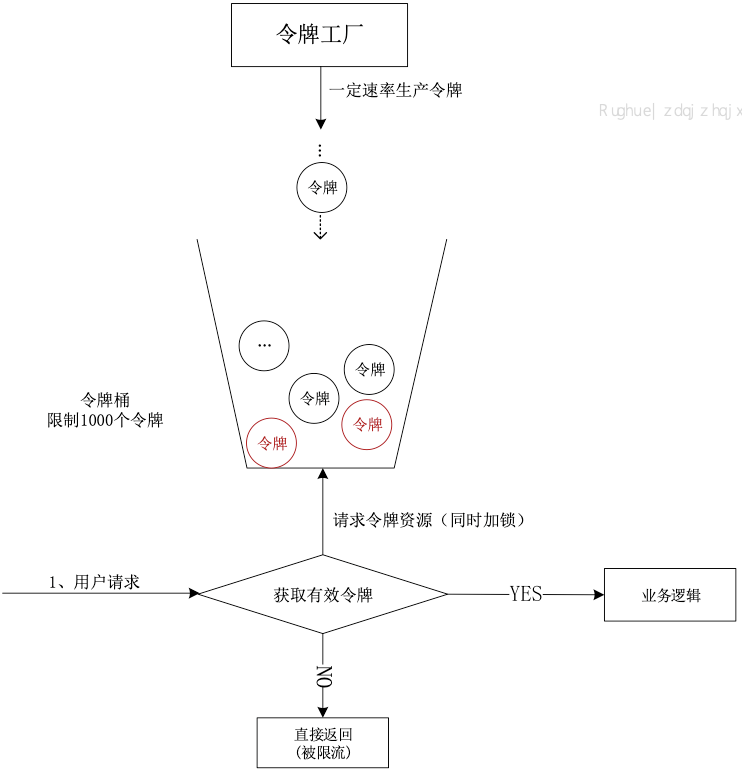

### 负载均衡算法

1. 轮询法

将请求按照顺序轮询地分配到服务器上，均衡地对待每个服务器，不关心服务器的连接数和负载情况

轮询法的目的在于均衡，但是后台服务器并不是完全一样的，有的性能高有的性能低，性能高的就不能真正发挥作用

2. 随机法

根据服务器列表的大小随机获取一台来访问，随着调用量增大，实际效果会接近轮询法

3. 源地址哈希法

获取客户端的 IP，然后通过 hash 函数计算出一个 hash 值，用该 hash 值对服务器列表的大小进行取模运算，该值就是要访问的服务器的序列号

好处：在服务器列表不变的情况下，每次客户端访问的服务器都是同一个服务器，利用这个特性可以有状态的 session 会话，无需额外的操作就能实现粘贴会话

4. 加权轮询法

对轮询法的一个改进，根据服务器的性能不同，给每个服务器配置一个权重，根据权重进行轮询，让每个服务器的性能最大化的发挥

5. 加权随机法

和加权轮询法一样，随机的时候，根据服务器的性能有一个随机的权重

6. 最小连接数法

由于后台服务器的配置不尽相同，对请求的处理有快有慢，它正是根据后端服务器当前的连接情况，动态地选取其中当前积压连接数最少的一台服务器来处理当前请求，尽可能地提高后台服务器利用率，将负载合理地分流到每一台服务器

### 微服务

#### 服务雪崩

在微服务中，假如一个或者多个服务出现故障，如果这时候，依赖的服务还在不断发起请求，或者重试，那么这些请求的压力会不断在下游堆积，导致下游服务的负载急剧增加。不断累计之下，可能会导致故障的进一步加剧，可能会导致级联式的失败，甚至导致整个系统崩溃，这就叫服务雪崩。

服务 A 调用服务 B，服务 B 调用服务 C，当大量请求突然请求服务 A（服务 A 本身可以抗住这些请求），但是服务 C 存在请求堆积，从而会使服务 B 请求堆积，从而服务 A 不可用

#### 服务限流
在高并发情况下为了保护系统，可以对访问服务的请求进行数量上的限制，从而防止系统不被大量请求压垮

#### 服务降级

服务降级是也是一种微服务架构中的容错机制，用于在系统资源紧张或服务故障时保证核心功能的可用性。

当系统出现异常情况时，服务降级会主动屏蔽一些非核心或可选的功能，而只提供最基本的功能，以确保系统的稳定运行。通过减少对资源的依赖，服务降级可以保证系统的可用性和性能。

它可以根据业务需求和系统状况来制定策略，例如替换耗时操作、返回默认响应、返回静态错误页面等

在暴增的流量请求下，对一些非核心业务、非关键业务进行有选择性的放弃，一次来释放系统资源，保证核心业务的正常运行。通过是对一些业务请求返回一个统一的结果，可以理解是一种快速失败 FailOver 的策略，一般通过配置中心配置开关实现降级

#### 服务熔断

服务熔断是微服务架构中的容错机制，用于保护系统免受服务故障或异常的影响。当某个服务出现故障或异常时，服务熔断可以快速隔离该服务，确保系统稳定可用。

它通过监控服务的调用情况，当错误率或响应时间超过阈值时，触发熔断机制，后续请求将返回默认值或错误信息，避免资源浪费和系统崩溃。服务熔断还支持自动恢复，重新尝试对故障服务的请求，确保服务恢复正常后继续使用

保护业务系统不被外部大流量或者下游系统的异常而拖垮。如果开启了熔断，订单服务可以在下游调用出现部分异常时，调节流量请求，比如：在出现了 10%的失败后，减少 50%的流量请求，如果继续出现 50%的异常，则减少 80%的流量请求，在检测到下游服务正常后，先恢复 30%的流量，然后恢复 50%的流程，最后是全部流量

## 算法

### Basic Paxos 算法

1. 提议者（Proposer）：提议者负责接受客户端发起的提议，然后尝试让接受者接受该提议，同时保证即使多个提议者的提议之间产生了冲突，那么算法都能进行下去
2. 接受者（Acceptor）：负责对提议者的提议投票，同时需要记住自己的投票历史
3. 学习者（Learner）：如果有超过半数接受者就某个提议达成了共识，那么学习者就需要接受这个提议，并就该提议作出运算，然后将运算结果返回给客户端

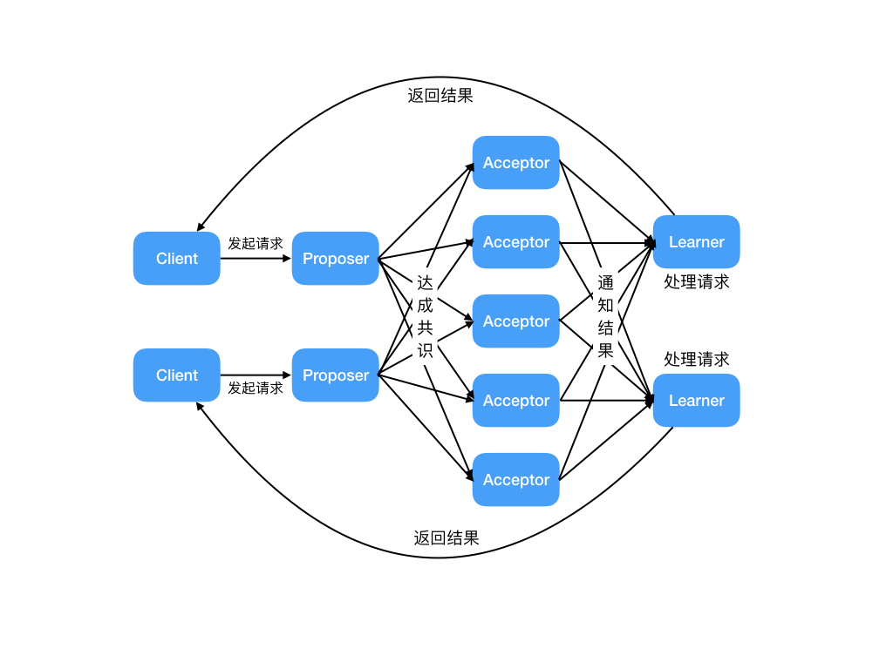

### Raft 算法

#### Raft 角色

1. 跟随者（Follower）：普通群众，默默接收和来自领导者的消息，当领导者心跳信息超时的时候，就主动站出来，推荐自己当候选人。
2. 候选人（Candidate）：候选人将向其他节点请求投票 RPC 消息，通知其他节点来投票，如果赢得了大多数投票选票，就晋升当领导者。
3. 领导者（Leader）：霸道总裁，一切以我为准。处理写请求、管理日志复制和不断地发送心跳信息，通知其他节点“我是领导者，我还活着，你们不要”发起新的选举，不用找新领导来替代我

#### 初始状态

初始状态下，集群中所有节点都是跟随者的状态。

如下图所示，有三个节点(Node) a、b、c，任期（Term）都为 0。

#### 成为候选者

Raft 算法实现了随机超时时间的特性，每个节点等待领导者节点心跳信息的超时时间间隔是随机的。比如 A 节点等待超时的时间间隔 150 ms，B 节点 200 ms，C 节点 300 ms。那么 a 先超时，最先因为没有等到领导者的心跳信息，发生超时。如下图所示，三个节点的超时计时器开始运行。

当 A 节点的超时时间到了后，A 节点成为候选者，并增加自己的任期编号，Term 值从 0 更新为 1，并给自己投了一票。

- Node A：Term = 1, Vote Count = 1。
- Node B：Term = 0。
- Node C：Term = 0。

#### 投票

**第一步**：节点 A 成为候选者后，向其他节点发送请求投票 RPC 信息，请它们选举自己为领导者。

**第二步**：节点 B 和 节点 C 接收到节点 A 发送的请求投票信息后，在编号为 1 的这届任期内，还没有进行过投票，就把选票投给节点 A，并增加自己的任期编号。

**第三步**：节点 A 收到 3 次投票，得到了大多数节点的投票，从候选者成为本届任期内的新的领导者。

**第四步**：节点 A 作为领导者，固定的时间间隔给 节点 B 和节点 C 发送心跳信息，告诉节点 B 和 C，我是领导者，组织其他跟随者发起新的选举。

**第五步**：节点 B 和节点 C 发送响应信息给节点 A，告诉节点 A 我是正常的。

#### 任期

英文单词是 term，领导者是有任期的。

- **自动增加**：跟随者在等待领导者心跳信息超时后，推荐自己为候选人，会增加自己的任期号，如上图所示，节点 A 任期为 0，推举自己为候选人时，任期编号增加为 1。
- **更新为较大值**：当节点发现自己的任期编号比其他节点小时，会更新到较大的编号值。比如节点 A 的任期为 1，请求投票，投票消息中包含了节点 A 的任期编号，且编号为 1，节点 B 收到消息后，会将自己的任期编号更新为 1。
- **恢复为跟随者**：如果一个候选人或者领导者，发现自己的任期编号比其他节点小，那么它会立即恢复成跟随者状态。这种场景出现在分区错误恢复后，任期为 3 的领导者受到任期编号为 4 的心跳消息，那么前者将立即恢复成跟随者状态。
- **拒绝消息**：如果一个节点接收到较小的任期编号值的请求，那么它会直接拒绝这个请求，比如任期编号为 6 的节点 A，收到任期编号为 5 的节点 B 的请求投票 RPC 消息，那么节点 A 会拒绝这个消息。

#### 选举规则

一个任期内，领导者一直都会领导者，直到自身出现问题（如宕机），或者网络问题（延迟），其他节点发起一轮新的选举。

在一次选举中，每一个服务器节点最多会对一个任期编号投出一张选票，投完了就没了。

#### 大多数

假设一个集群由 N 个节点组成，那么大多数就是至少 N/2+1。例如：3 个节点的集群，大多数就是 2。

#### 心跳超时

为了防止多个节点同时发起投票，会给每个节点分配一个随机的选举超时时间。这个时间内，节点不能成为候选者，只能等到超时。比如上述例子，节点 A 先超时，先成为了候选者。这种巧妙的设计，在大多数情况下只有一个服务器节点先发起选举，而不是同时发起选举，减少了因选票瓜分导致选举失败的情况。

#### 领导者故障

如果领导者节点出现故障，则会触发新的一轮选举。如下图所示，领导者节点 A 发生故障，节点 B 和 节点 C 就会重新选举 Leader。

**第一步** ：节点 A 发生故障，节点 B 和节点 C 没有收到领导者节点 A 的心跳信息，等待超时。

**第二步**：节点 C 先发生超时，节点 C 成为候选人。

**第三步**：节点 C 向节点 A 和节点 B 发起请求投票信息。

**第四步**：节点 C 响应投票，将票投给了 C，而节点 A 因为发生故障了，无法响应 C 的投票请求。

**第五步**：节点 C 收到两票（大多数票数），成为领导者。

**第六步**：节点 C 向节点 A 和 B 发送心跳信息，节点 B 响应心跳信息，节点 A 不响应心跳信息，因为 A 故障了

## RPC

### 基本概念

1. 客户端（服务消费端）：调用远程方法的一端
2. 客户端 Stub（桩）：代理类，把你调用方法、类、方法参数等信息传递到服务端
3. 网络传输：把调用的方法的信息等传输到服务端，然后服务端执行完之后再把返回结果通过网络传输给你传输回来
4. 服务端 Stub（桩）：接收到客户端执行方法的请求后，去指定对应的方法，然后返回结果给客户端的类
5. 服务端（服务提供端）：提供远程方法的一端

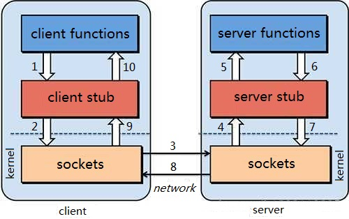

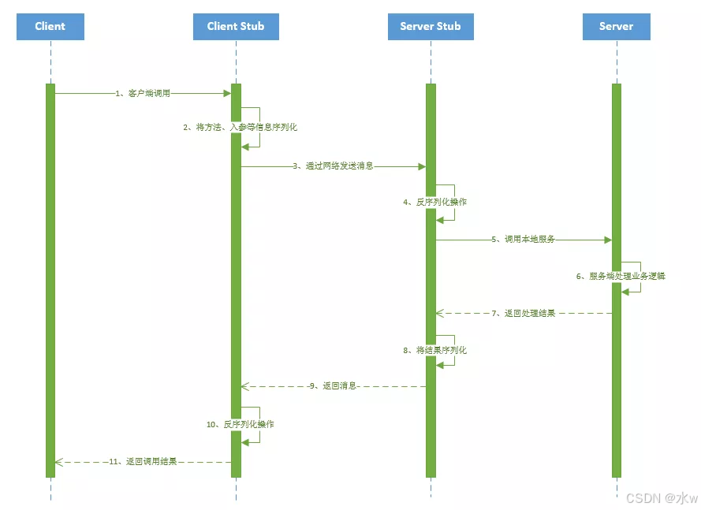

**处理逻辑**

1. 客户端（client）以本地调用方式（即以接口的方式）调用服务
2. 客户端存根（client stub）接收到调用后，负责将方法、参数等组装成能够进行网络传输的消息体（将消息体对象序列化为二进制）
3. 客户端通过 sockets 将消息发送到服务端
4. 服务端存根（server stub）收到消息后进行解码（将消息对象反序列化）
5. 服务端存根（server stub）根据解码结果调用本地服务
6. 本地服务执行并将结果返回给服务端存根（server stub）
7. 服务端存根（server stub）将返回结果打包成消息（将结果消息对象序列化）
8. 服务端（server）通过 sockets 将消息发送到客户端
9. 客户端存根（client stub）接收到结果消息，并进行解码（将结果消息反序列化）
10. 客户端（client）得到最终结果

RPC 的目标是要把 2、3、4、7、8、9 这些步骤都封装起来

注意：无论是何种类型的数据，最终都需要转换成二进制流在网络上进行传输，数据的发送方需要把对象转换为二进制流，而数据的接收方则需要把二进制流再恢复为对象

**核心功能**

RPC 的核心功能主要由 5 个模块组成。如果想要自己实现一个 RPC，最简单的方式要实现三个技术点，分别是：

1. 服务寻址
2. 数据流的序列化和反序列化
3. 网络传输

### HTTP 和 RPC 的区别

1. HTTP 是应用层协议，用于传输超文本数据，基于请求-响应模型，常用于 Web 开发、API 调用等场景，HTTP 本质是客户端和服务端约定好的一种通信格式。
2. RPC 是远程过程调用协议，用于实现分布式系统中不同节点之间的通信，基于方法调用模型，常用于构建面向服务的微服务架构，RPC 的通信可以用 HTTP 协议，也可以自定义协议，是不做约束的。

在微服务架构中，Feign 和 Dubbo 都是用于实现远程调用的框架，Feign 基于 HTTP 协议，Dubbo 基于 RPC 协议。

|          | HTTP                                                         | RPC                                                          |
| -------- | ------------------------------------------------------------ | ------------------------------------------------------------ |
| 定义     | HTTP（超文本传输协议）是一种用于传输超文本的协议。           | RPC（远程过程调用）是一种用于实现分布式系统中不同节点之间通信的协议。 |
| 通信方式 | 基于请求-响应模型，客户端发送请求，服务器返回响应。          | 基于方法调用模型，客户端调用远程方法并等待结果。             |
| 传输协议 | 基于 TCP 协议，可使用其他传输层协议如 TLS/SSL 进行安全加密。 | 可以使用多种传输协议，如 TCP、UDP 等。                       |
| 数据格式 | 基于文本，常用的数据格式有 JSON、XML 等。                    | 可以使用各种数据格式，如二进制、JSON、Protocol Buffers 等。  |
| 接口定义 | 使用 RESTful 风格的接口进行定义，常用的方法有 GET、POST、PUT、DELETE 等。 | 使用 IDL（接口定义语言）进行接口定义，如 Protocol Buffers、Thrift 等。 |
| 跨语言性 | 支持跨语言通信，可以使用 HTTP 作为通信协议实现不同语言之间的通信。 | 支持跨语言通信，可以使用 IDL 生成不同语言的客户端和服务端代码。 |
| 灵活性   | 更加灵活，适用于不同类型的应用场景，如 Web 开发、API 调用等。 | 更加高效，适用于需要高性能和低延迟的分布式系统。             |

### 优缺点

1. 优点：

* 透明性：RPC 隐藏了网络通信的底层细节，使得分布式系统的通信看起来像是本地调用。
* 封装性：RPC 允许远程过程调用，提高了代码的封装性和复用性。
* 跨语言性：RPC 框架通常支持多种编程语言，使得不同语言的应用能够进行通信。

2. 缺点：

* 复杂性：RPC 通常需要定义接口，使用 IDL 进行描述，这增加了开发的复杂性。
* 性能开销：与本地调用相比，RPC 通信涉及序列化、网络传输和反序列化等操作，可能引入一定的性能开销。
* 网络不稳定性：分布式环境中，网络故障或不稳定性可能导致 RPC 失败，需要额外的处理机制。

### 使用场景

1. 微服务架构：RPC 广泛应用于分布式系统中，尤其是在微服务架构中。在微服务架构中，各个服务通常需要相互通信。RPC 可以用于服务之间的通信，使得不同的服务可以通过调用彼此的函数来完成任务。
2. 跨平台应用：RPC 可以用于跨平台调用，例如一个 Java 程序可以通过 RPC 调用一个用 Python 编写的函数。
3. 分布式计算：如大数据处理和计算密集型任务，可以通过 RPC 在多台机器间分配和管理计算任务。
4. 客户端-服务器架构：传统的客户端-服务器应用可以通过 RPC 实现，例如前端应用程序通过 RPC 调用后端的服务。

## 架构设计

### 主备

给现有的服务搭建一个备用的服务，两者功能完全一致，区别在于平时只有主应用对外提供服务能力；而备应用则只需要保证与主应用能力一致，随时待机即可，并不用对外提供服务；当主应用出现故障之后，将备应用切换为主应用，原主应用下线；迅速的主备切换可以有效的缩短故障时间

基于上面的描述，主备架构特点比较清晰，采用冗余的方案，加一台备用服务，缺点就是资源浪费

其次就是这个架构模型最需要考虑的则是如何实现主备切换？

1. 人工
2. VIP (虚拟 ip) + keepalived 机制

### 主从

主从一般又叫做读写分离，主提供读写能力，而从则只提供读能力

鉴于当下的互联网应用，绝大多数都是读多写少的场景；读更容易成为性能瓶颈，所以采用读写分离，可以有效的提高整个集群的响应能力

主从架构可以区分为：一主多从 + 一主一从再多从

主要特点：

1. 添加从，源头依然是数据冗余的思想
2. 读写分离，主负责读写，从只负责读，可以视为负载均衡策略
3. 从需要向主同步数据，若所有的从都同步于主，对主的压力依然可能很大；所以就有了主从从的模式

关键问题：

1. 主从延迟
2. 主的写瓶颈
3. 主挂之后如何选主

### 多主多从

一主多从面临单主节点的瓶颈问题，那就考虑多主多从的策略，同样是主负责提供读写，从提供读；

但是这里有一个核心点在于多主之间的数据同步，如何保证数据的一致性是这个架构模型的重点

如 MySql 的双主双从可以说是一个典型的应用场景，在实际使用的时候除了上面的一致性之外，还需要考虑主键 id 冲突的问题

### 普通集群

无主节点，集群中所有的应用职能对等，没有主次之分（当下绝大多数的业务服务都属于这种），一个请求可以被集群中任意一个服务响应；这种也可以叫做去中心化的设计模式，如 redis 的集群模式，eureka 注册中心，以可用性为首要目标

对于普通集群模式而言，重点需要考虑的点在于

1. 资源竞争：如何确保一个资源在同一时刻只能被一个业务操作

如现在同时来了申请退款和货物出库的请求，如果不对这个订单进行加锁，两个请求同时响应，将会导致发货又退款了，导致财货两失

2. 数据一致性：如何确保所有的实例数据都是一致的，或者最终是一致的
   

* 如应用服务使用 jvm 缓存，那么如何确保所有实例的 jvm 缓存一致？
* 如 Eureka 的分区导致不同的分区的注册信息表不一致

### 数据分片

前面几个的架构中，采用的是数据冗余的方式，即所有的实例都有一个全量的数据，而这里的数据分片，则从数据拆分的思路来处理，将全量的数据，通过一定规则拆分到多个系统中，每个系统包含部分的数据，减小单个节点的压力，主要用于解决数据量大的场景

比如 redis 的集群方式，通过 hash 槽的方式进行分区

## 其他

### QPS

QPS（Queries Per Second） 是每秒的查询率，它表示一台服务每秒响应的查询的次数。

具体来说，QPS 反映了系统在高并发环境下处理请求的能力。一个高 QPS 的系统能够在单位时间内处理更多的请求，从而提供更好的用户体验和更高的吞吐量；相反，QPS 较低的系统可能在面对大量请求时会出现响应延迟或请求失败的情况。

比如：假设服务器 1 秒响应 500 次请求，那么此时 QPS 就是 500。

### TPS

TPS（Transactions Per Second） 表示每秒事务处理的数量，一个事务表示客户端向服务器发送请求，然后响应的过程。

整体上来说，一个 TPS 包括了三个部分：

1. 用户请求服务器
2. 服务器自己的内部处理
3. 服务器返回给用户

这样一个完整的过程就是一个 TPS。

比如：用户在 jd 上下单的时候，每当用户下单请求被服务器接受到之后，服务需要保存订单、扣减商品库存、确认支付等等这一些列的操作，所有过程都完成后，将结果响应给客户端。这个完整的过程就是一次事务，TPS 则表示每秒内可以完成多少次这样的请求。

**TPS 与 QPS 的区别**

QPS 基本类似于 TPS，但是不同的是，对于一个页面的一次访问，形成一个 TPS；但一次页面请求，可能产生多次对服务器的请求，服务器对这些请求，就可计入“QPS”之中。如，访问一个页面会请求服务器 2 次，一次访问，产生一个“T”，产生 2 个“Q”。

### RT

RT（Response-time）响应时间，这个表示执行一个请求从开始到最后收到响应数据所花费的总时间，即从客户端发起请求到收到服务器响应结果的时间。

如果忽略网络传输时间，响应时间是处理时间和等待时间的总和，其中：

- 处理时间是完成请求要求的工作所需的时间
- 等待时间是请求在被处理之前必须在队列中等待的时间

计算公式：RT = 并发数 / QPS
