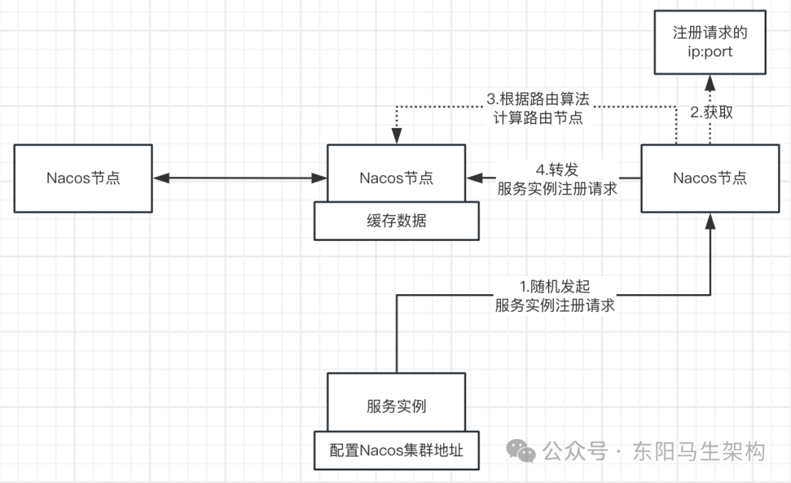
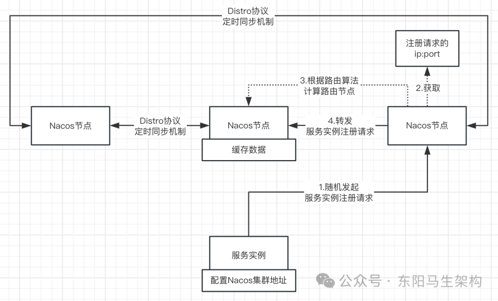
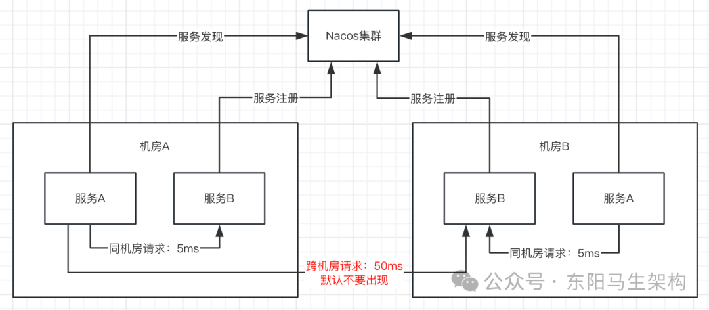
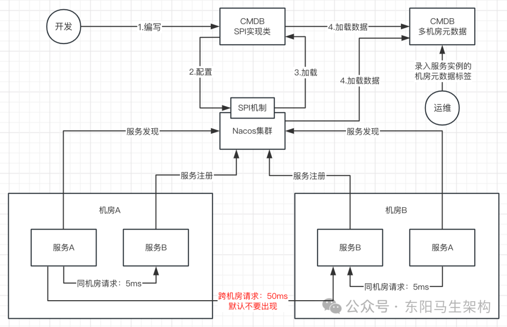

## 基于 Distro 协议在启动后的运行规则

### Nacos 集群启动后会按如下规则运行

1. Nacos 集群的每个节点都可以处理写请求

Nacos 集群节点收到写请求后：首先根据要注册的服务实例的 IP: 端口 + 路由算法，计算出所属集群节点。然后把服务实例注册请求转发到负责该服务实例数据的集群节点中。接着负责该服务实例数据的集群节点就会解析请求，把数据存储到内存里。同时会定期执行同步任务，把本节点负责的数据同步到其他节点。最终每个节点都会存储全量的服务实例数据。

2. 新加入 Nacos 集群的节点会拉取全量数据

新加入 Nacos 集群的节点会轮询 Nacos 集群的所有节点，然后发送请求出去拉取各节点的数据，所以 Nacos 集群的每个节点上都会有所有已注册的服务实例的数据。

3. 每个节点都会定期发送心跳给其他节点

Nacos 集群的节点通过心跳请求进行数据校验，主要是交换数据的校验值。如果发现其他节点上的数据与自己的不一致，就会全量拉取数据进行补齐。

4. Nacos 集群的每个节点都可以处理读请求

因为每个节点都有全量数据，所以每个节点都可以处理读请求。

### Distro 协议 + 定时数据同步与 AP + 心跳检验与网络分区

Distro 协议兼顾了 CAP 中的 AP。在这个协议下，所有节点通过定期数据同步 + 心跳校验实现数据最终一致。这个协议能让每个节点都有全量数据。

如果出现某节点宕机，不影响集群可用性。如果出现网络分区，同样不影响集群可用性。因为不同的网络分区只会读写分区中的 Nacos 节点，此时只是没办法同步数据而已。虽然数据会不一致，但一旦分区恢复后，心跳校验机制运作起来，数据会自动补齐。

## 基于 Distro 协议在处理服务实例注册时的写路由

首先，服务实例会随机选择 Nacos 集群中的一个节点发起注册请求。

然后，Nacos 集群节点收到写请求后：会根据要注册的服务实例的 IP: 端口 + 路由算法，计算出所属的集群节点。

接着，把服务实例注册请求转发到负责该服务实例数据的集群节点中。负责该服务实例数据的节点会解析请求，缓存服务实例数据到内存中。

## 由于写路由造成的数据分片以及随机读问题

由于 Nacos 集群节点收到写请求后：会根据要注册的服务实例的 IP: 端口 + 路由算法，计算出所属的集群节点。所以会导致数据分片，即每个节点仅负责管理一部分的服务实例数据。

服务实例进行服务发现时，只能随机选择一个 Nacos 节点来读取数据。对 Nacos 集群节点进行随机读的时候，由于每个节点只负责处理部分数据，所以可能出现读取不到刚向集群注册的数据的随机读问题。

## 写路由 + 数据分区 + 读路由的 CP 方案分析

在数据分区 + 随机读的情况下，此时为了读取到数据，有两种解决方案。

**方案一：** 让随机选择的节点重新进行读路由

**方案二：** 让随机选择的节点也拥有全部数据

如果采用方案一，也就是写路由 + 数据分片 + 读路由的架构设计。那么读写某个服务实例的数据，只能由 Nacos 集群中的其中一个节点处理。如果节点宕机，那么对应的该服务实例数据就不可用。虽然该节点的数据不可用，但也是对所有用户都不可用，视图是一致的。视图是一致的，说明要么都能读到数据，要么都读不到数据。所以这种方案会存在可用性的问题，但优点是数据是强一致的。也就是牺牲了 CAP 中的 A，没有了可用性，但保证了 CP。

Nacos 的 Distro 协议则使用了方案二。某个节点宕机后，该节点的数据不会全部不可用，可能会丢失部分数据。也就是牺牲了 CAP 中的 C，不能确保强一致性，但保证了 AP。加上 Distro 协议的同步机制，可以让各节点的数据实现最终一致性。

## 基于 Distro 协议的定时同步机制

Nacos 集群中的每个节点，虽然通过写路由只写入由自己处理的数据，但同时也会定期执行同步任务，把本节点负责的数据同步到其他节点，最终每个节点都会存储全量的集群数据。

同步机制的存在保证了各节点的数据最终是一致的。

## 基于 Distro 协议的心跳校验下的数据同步补偿机制

Nacos 集群的节点通过心跳请求进行数据校验，主要是交换数据的校验值。如果发现其他节点上的数据与自己的不一致，就会全量拉取数据进行补齐。

当出现网络分区时，两分区间的节点无法通信，此时自然就无法定时同步。但当分区恢复后，节点之间通过心跳校验机制，数据可以快速自动补齐

## 基于 Raft 协议实现的弱 CP 模式

Nacos 集群节点在启动时会选举出一个 Leader 节点，由 Leader 节点负责数据的写入，并将数据同步给其他节点。Leader 节点成功写入数据的判断依据是，过半节点都成功同步数据了

## Nacos 集群模式下的 lookup 寻址机制

### 单机寻址

Nacos 通过 "-m standalone" 模式来启动时，会读取自己本机的 IP: 端口，然后构造对象放入到 ServerMemberManager，它是专门负责管理所有节点信息的组件。

### 文件寻址

cluster.conf 里会写入各个节点地址，节点启动时会读取这个文件的内容。同时节点会针对这个文件施加监听器，如果发现文件有变动，会进行重新读取。但是需要手工维护每个节点的 cluster.conf 文件，比较适合常规的、三节点、小规模的生产集群部署。

### 地址服务器寻址

如果 Nacos 需要进行大规模的集群部署，一般会采用这个方案。也就是使用一个 Web 服务器来维护一份 cluster.conf，然后所有的 Nacos 都定时请求这个 Web 服务器获取最新的地址列表。

## Nacos 打通 CMDB 实现跨机房的就近访问

### 多机房部署时跨机房访问的延迟问题

当服务进行多机房或者多地域部署时，跨地域的服务访问往往延迟较高。一个城市内的机房间的典型网络延迟在 1ms 左右，而跨城市的网络延迟，例如广州到北京大概为 50ms。

### Nacos 的服务发现组件对接 CMDB 实现相同地域的就近访问

此时的希望就是能否让服务消费者和服务提供者实现同地域就近访问。一般在企业的生产实践中，这样的需求是通过打通 CMDB 来实现的。

CMDB 一般用于存放与机器设备、应用、服务等相关的元数据，当企业的机器达到一定规模后就需要 CMDB 来存储和管理它们的元数据。

有一些广泛使用的属性，如机器的 IP、主机名、机房、应用、Region 等，这些数据一般会在机器部署时录入到 CMDB，运维或者监控平台会使用这些数据进行展示或者相关的运维操作。

通过让 Nacos 的服务发现组件对接 CMDB，然后配置好访问规则，就可以实现服务消费者到服务提供者的就近访问。

如果 Nacos 进行了多机房部署，由于 CMDB 会存储多机房的元数据，那么就可以基于 CMDB 实现同机房就近访问。

## Nacos 基于 SPI 动态扩展机制来获取 CMDB 的数据

**Nacos 应如何获取 CMDB 里的数据**

基本上每个企业都会购买或自研搭建自己的 CMDB。为了能够解耦各企业的 CMDB，一个比较好的策略是使用 SPI 机制。

Nacos 约定 CMDB 的抽象调用接口，然后由各企业添加自己的 CMDB 插件，无需任何代码上的重新构建，即可在运行状态下对接上企业的 CMDB。

Nacos 定义了一个 SPI 接口，里面包含了与第三方 CMDB 约定的一些方法。依照约定实现相应的 SPI 接口后，将实现打成 jar 包放到 Nacos 安装目录，重启 Nacos 即可让 Nacos 与 CMDB 的数据打通。

所以如果希望 Nacos 可以获取加载 CMDB 里的数据，那么就需要根据 Nacos 的 SPI 接口，编写 CMDB 实现类并配置到 Nacos 中。

这样 Nacos 启动时就会动态扫描和加载编写的 CMDB 接口实现类。通过编写的 CMDB 实现类，就可以加载 CMDB 里的数据了。

