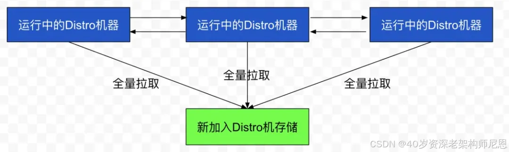
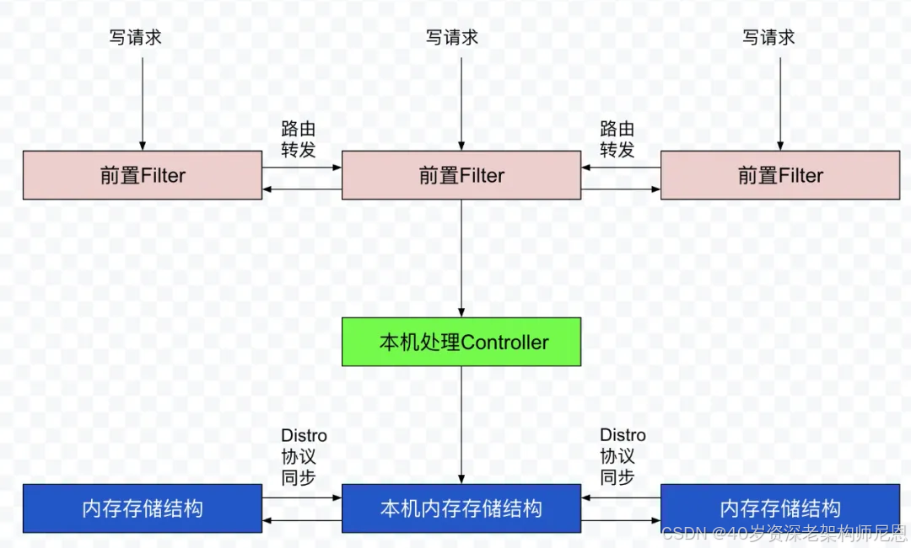
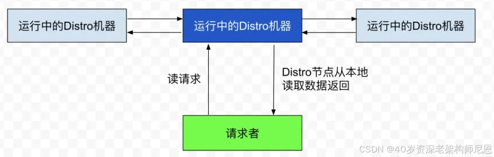

## 临时实例和永久实例

### 临时实例

1. 临时实例在注册到注册中心之后仅仅只保存在服务端内部一个缓存中，不会持久化到磁盘
2. 这个服务端内部的缓存在注册中心届一般被称为 **服务注册表**
3. 当服务实例出现异常或者下线之后，就会把这个服务实例从服务注册表中剔除

### 永久实例

1. 永久服务实例不仅仅会存在服务注册表中，同时也会被持久化到磁盘文件中
2. 当服务实例出现异常或者下线，Nacos 只会将服务实例的健康状态设置为不健康，并不会对将其从服务注册表中剔除
3. 所以这个服务实例的信息你还是可以从注册中心看到，只不过处于不健康状态

### 为什么 Nacos 要将服务实例分为临时实例和永久实例?

1. **临时实例** 就比较适合于业务服务，服务下线之后可以不需要在注册中心中查看到

2. **永久实例** 就比较适合需要运维的服务，这种服务几乎是永久存在的，比如说 MySQL、Redis 等等

MySQL、Redis 等服务实例可以通过 SDK 手动注册。对于这些服务，我们需要一直看到服务实例的状态，即使出现异常，也需要能够查看时实的状态

在 SpringCloud 环境底下，一般其实都是业务服务，所以默认注册服务实例都是临时实例

当然如果你想改成永久实例，可以通过下面这个配置项来完成

```yaml
spring
  cloud:
    nacos:
      discovery:
        #ephemeral单词是临时的意思，设置成false，就是永久实例了
        ephemeral: false
```

在 1.x 版本中，一个服务中可以既有临时实例也有永久实例，服务实例是永久还是临时是由服务实例本身决定的

但是 2.x 版本中，一个服务中的所有实例要么都是临时的要么都是永久的，是由服务决定的，而不是具体的服务实例，所以在 2.x 可以说是 **临时服务** 和 **永久服务**


**为什么 2.x 把临时还是永久的属性由实例本身决定改成了由服务决定?**

其实很简单，你想想，假设对一个 MySQL 服务来说，它的每个服务实例肯定都是永久的，不会出现一些是永久的，一些是临时的情况吧

所以临时还是永久的属性由服务本身决定其实就更加合理了

## 服务注册

所谓的服务注册，就是通过注册中心提供的客户端 SDK（或者是控制台）将服务本身的一些元信息，比如 ip、端口等信息发送到注册中心服务端

服务端在接收到服务之后，会将服务的信息保存到前面提到的服务注册表中

### 1.x 版本的实现

在 Nacos 在 1.x 版本的时候，服务注册是通过 Http 接口实现的


### 2.x 版本的实现

2.x 版本相比于 1.x 版本最主要的升级就是客户端和服务端通信协议的改变，由 1.x 版本的 Http 改成了 2.x 版本 gRPC

> gRPC 是谷歌公司开发的一个高性能、开源和通用的 RPC 框架，Java 版本的实现底层也是基于 Netty 来的

之所以改成了 gRPC，主要是因为 Http 请求会频繁创建和销毁连接，白白浪费资源

所以在 2.x 版本之后，为了提升性能，就将通信协议改成了 gRPC

根据官网显示，整体的效果还是很明显，相比于 1.x 版本，注册性能总体提升至少 2 倍

> 虽然通信方式改成了 gRPC，但是 2.x 版本服务端依然保留了 Http 注册的接口，所以用 1.x 的 Nacos SDK 依然可以注册到 2.x 版本的服务端

**具体的实现**

Nacos 客户端在启动的时候，会通过 gRPC 跟服务端建立长连接

这个连接会一直存在，之后客户端与服务端所有的通信都是基于这个长连接来的

当客户端发起注册的时候，就会通过这个长连接，将服务实例的信息发送给服务端

服务端拿到服务实例，跟 1.x 一样，也会存到服务注册表

除了注册之外，**当注册的是临时实例时**，2.x 还会将服务实例信息存储到客户端中的一个缓存中，供 Redo 操作

所谓的 Redo 操作，其实就是一个补偿机制，本质是个定时任务，默认每 3s 执行一次

这个定时任务作用是，当客户端与服务端重新建立连接时（因为一些异常原因导致连接断开）

那么之前注册的服务实例肯定还要继续注册服务端（断开连接服务实例就会被剔除服务注册表）

所以这个 Redo 操作一个很重要的作用就是重连之后的重新注册的作用

> 除了注册之外，比如服务订阅之类的操作也需要 Redo 操作，当连接重新建立，之前客户端的操作都需要 Redo 一下

### 总结

1.x 版本是通过 Http 协议来进行服务注册的

2.x 由于客户端与服务端的通信改成了 gRPC 长连接，所以改成通过 gRPC 长连接来注册

2.x 比 1.x 多个 Redo 操作，当注册的服务实例是临时实例是，出现网络异常，连接重新建立之后，客户端需要将服务注册、服务订阅之类的操作进行重做

**既然 2.x 有 Redo 机制保证客户端与服务端通信正常之后重新注册，那么 1.x 有类似的这种 Redo 机制么？**

心跳机制

## 心跳机制

心跳机制，也可以被称为 **保活机制**，它的作用就是服务实例告诉注册中心我这个服务实例还活着

在正常情况下，服务关闭了，那么服务会主动向 Nacos 服务端发送一个服务下线的请求

Nacos 服务端在接收到请求之后，会将这个服务实例从服务注册表中剔除

但是对于异常情况下，比如出现网络问题，可能导致这个注册的服务实例无法提供服务，处于不可用状态，也就是不健康

而此时在没有任何机制的情况下，服务端是无法知道这个服务处于不可用状态

所以为了避免这种情况，一些注册中心，就比如 Nacos、Eureka，就会用心跳机制来判断这个服务实例是否能正常

**在 Nacos 中，心跳机制仅仅是针对临时实例来说的，临时实例需要靠心跳机制来保活**

心跳机制在 1.x 和 2.x 版本的实现也是不一样的

### 1.x 心跳实现

在 1.x 中，心跳机制实现是通过客户端和服务端各存在的一个定时任务来完成的

在服务注册时，发现是临时实例，客户端会开启一个 5s 执行一次的定时任务


这个定时任务会构建一个 Http 请求，携带这个服务实例的信息，然后发送到服务端

在 Nacos 服务端也会开启一个定时任务，默认也是 5s 执行一次，去检查这些服务实例最后一次心跳的时间，也就是客户端最后一次发送 Http 请求的时间

- 当最后一次心跳时间超过 15s，但没有超过 30s，会把这服务实例标记成不健康
- 当最后一次心跳超过 30s，直接把服务从服务注册表中剔除


这就是 1.x 版本的心跳机制，本质就是两个定时任务

其实 1.x 的这个心跳还有一个作用，就是跟上一节说的 gRPC 时 Redo 操作的作用是一样的

服务在处理心跳的时候，发现心跳携带这个服务实例的信息在注册表中没有，此时就会添加到服务注册表

### 2.x 心跳实现

在 2.x 版本之后，由于通信协议改成了 gRPC，客户端与服务端保持长连接，所以 2.x 版本之后它是利用这个 gRPC 长连接本身的心跳来保活

一旦这个连接断开，服务端就会认为这个连接注册的服务实例不可用，之后就会将这个服务实例从服务注册表中提出剔除

除了连接本身的心跳之外，Nacos 还有服务端的一个主动检测机制

Nacos 服务端也会启动一个定时任务，默认每隔 3s 执行一次

这个任务会去检查超过 20s 没有发送请求数据的连接

一旦发现有连接已经超过 20s 没发送请求，那么就会向这个连接对应的客户端发送一个请求

如果请求不通或者响应失败，此时服务端也会认为与客户端的这个连接异常，从而将这个客户端注册的服务实例从服务注册表中剔除

所以对于 2.x 版本，主要是两种机制来进行保活：

- 连接本身的心跳机制，断开就直接剔除服务实例
- Nacos 主动检查机制，服务端会对 20s 没有发送数据的连接进行检查，出现异常时也会主动断开连接，剔除服务实例

### 总结

心跳机制仅仅针对临时实例而言

1.x 心跳机制是通过客户端和服务端两个定时任务来完成的，客户端定时上报心跳信息，服务端定时检查心跳时间，超过 15s 标记不健康，超过 30s 直接剔除

1.x 心跳机制还有类似 2.x 的 Redo 作用，服务端发现心跳的服务信息不存在会，会将服务信息添加到注册表，相当于重新注册了

2.x 是基于 gRPC 长连接本身的心跳机制和服务端的定时检查机制来的，出现异常直接剔除

## 健康检查

前面说了，心跳机制仅仅是临时实例用来保护的机制

而对于永久实例来说，一般来说无法主动上报心跳

就比如说 MySQL 实例，肯定是不会主动上报心跳到 Nacos 的，所以这就导致无法通过心跳机制来保活

所以针对永久实例的情况，Nacos 通过一种叫 **健康检查** 的机制去判断服务实例是否活着

健康检查跟心跳机制刚好相反，心跳机制是服务实例向服务端发送请求

而所谓的健康检查就是服务端 **主动** 向服务实例发送请求，去探测服务实例是否活着

健康检查机制在 1.x 和 2.x 的实现机制是一样的

Nacos 服务端在会去创建一个健康检查任务，这个任务每次执行时间间隔会在 2000~7000 毫秒之间

当任务触发的时候，会根据设置的健康检查的方式执行不同的逻辑，目前主要有以下三种方式：

- TCP
- HTTP
- MySQL

**TCP** 的方式就是根据服务实例的 ip 和端口去判断是否能连接成功，如果连接成功，就认为健康，反之就任务不健康

**HTTP** 的方式就是向服务实例的 ip 和端口发送一个 Http 请求，请求路径是需要设置的，如果能正常请求，说明实例健康，反之就不健康

**MySQL** 的方式是一种特殊的检查方式，他可以执行下面这条 Sql 来判断数据库是不是主库


默认情况下，都是通过 TCP 的方式来探测服务实例是否还活着

## 服务发现

所谓的服务发现就是指当有服务实例注册成功之后，其它服务可以发现这些服务实例

Nacos 提供了两种发现方式：

- 主动查询
- 服务订阅

**主动查询** 就是指客户端主动向服务端查询需要关注的服务实例，也就是拉（pull）的模式

**服务订阅** 就是指客户端向服务端发送一个订阅服务的请求，当被订阅的服务有信息变动就会主动将服务实例的信息推送给订阅的客户端，本质就是推（push）模式

在我们平时使用时，一般来说都是选择使用订阅的方式，这样一旦有服务实例数据的变动，客户端能够第一时间感知

并且 Nacos 在整合 SpringCloud 的时候，默认就是使用订阅的方式

对于这两种服务发现方式，1.x 和 2.x 版本实现也是不一样

服务查询其实两者实现都很简单

1.x 整体就是发送 Http 请求去查询服务实例，2.x 只不过是将 Http 请求换成了 gRPC 的请求

服务端对于查询的处理过程都是一样的，从服务注册表中查出符合查询条件的服务实例进行返回

不过对于服务订阅，两者的机制就稍微复杂一点

在 Nacos 客户端，不论是 1.x 还是 2.x 都是通过 SDK 中的 `NamingService#subscribe` 方法来发起订阅的


当有服务实例数据变动的时，客户端就会回调 `EventListener`，就可以拿到最新的服务实例数据了

虽然 1.x 还是 2.x 都是同样的方法，但是具体的实现逻辑是不一样的

### 1.x 服务订阅实现

在 1.x 版本的时候，服务订阅的处理逻辑大致会有以下三步：

第一步，客户端在启动的时候，会去构建一个叫 PushReceiver 的类

这个类会去创建一个 UDP Socket，端口是随机的


其实通过名字就可以知道这个类的作用，就是通过 UDP 的方式接收服务端推送的数据的

第二步，调用 `NamingService#subscribe` 来发起订阅时，会先去服务端查询需要订阅服务的所有实例信息

之后会将所有服务实例数据存到客户端的一个 **内部缓存中**


并且在查询的时候，会将这个 UDP Socket 的端口作为一个参数传到服务端

服务端接收到这个 UDP 端口后，后续就通过这个端口给客户端推送服务实例数据

第三步，会为这次订阅开启一个不定时执行的任务

> 之所以不定时，是因为这个当执行异常的时候，下次执行的时间间隔就会变长，但是最多不超过 60s，正常是 10s，这个 10s 是查询服务实例是服务端返回的

这个任务会去从服务端查询订阅的服务实例信息，然后更新内部缓存

> 既然有了服务变动推送的功能，为什么还要定时去查询更新服务实例信息呢?

其实很简单，那就是因为 UDP 通信不稳定导致的

虽然有 Push，但是由于 UDP 通信自身的不确定性，有可能会导致客户端接收变动信息失败

所以这里就加了一个定时任务，弥补这种可能性，属于一个兜底的方案。

这就是 1.x 版本的服务订阅的实现


### 2.x 服务订阅的实现

由于 2.x 版本换成了 gRPC 长连接的方式，所以 2.x 版本服务数据变更推送已经完全抛弃了 1.x 的 UDP 做法

当有服务实例变动的时候，服务端直接通过这个长连接将服务信息发送给客户端

客户端拿到最新服务实例数据之后的处理方式就跟 1.x 是一样了

除了处理方式一样，2.x 也继承了 1.x 的其他的东西

比如客户端依然会有服务实例的缓存

定时对比机制也保留了，只不过这个定时对比的机制默认是关闭状态

之所以默认关闭，主要还是因为长连接还是比较稳定的原因

当客户端出现异常，接收不到请求，那么服务端会直接跟客户端断开连接

当恢复正常，由于有 Redo 操作，所以还是能拿到最新的实例信息的

所以 2.x 版本的服务订阅功能的实现大致如下图所示


这里还有个细节需要注意

在 1.x 版本的时候，任何服务都是可以被订阅的

但是在 2.x 版本中，只支持订阅临时服务，对于永久服务，已经不支持订阅了

### 总结

服务查询 1.x 是通过 Http 请求；2.x 通过 gRPC 请求

服务订阅 1.x 是通过 UDP 来推送的；2.x 就基于 gRPC 长连接来实现的

1.x 和 2.x 客户端都有服务实例的缓存，也有定时对比机制，只不过 1.x 会自动开启；2.x 提供了一个开个，可以手动选择是否开启，默认不开启

## 数据一致性

由于 Nacos 是支持集群模式的，所以一定会涉及到分布式系统中不可避免的数据一致性问题

### 服务实例的责任机制

什么是服务实例的责任机制？

比如上面提到的服务注册、心跳管理、监控检查机制，当只有一个 Nacos 服务时，那么自然而言这个服务会去检查所有的服务实例的心跳时间，执行所有服务实例的健康检查任务


但是当出现 Nacos 服务出现集群时，为了平衡各 Nacos 服务的压力，Nacos 会根据一定的规则让每个 Nacos 服务只管理一部分服务实例的

当然每个 Nacos 服务的注册表还是全部的服务实例数据


## Nacos 的 AP 和 CP

Nacos 其实目前是同时支持 AP 和 CP 的

具体使用 AP 还是 CP 得取决于 Nacos 内部的具体功能，并不是有的文章说的可以通过一个配置自由切换。

就以服务注册举例来说，对于临时实例来说，Nacos 会优先保证可用性，也就是 AP

对于永久实例，Nacos 会优先保证数据的一致性，也就是 CP

接下来我们就来讲一讲 Nacos 的 CP 和 AP 的实现原理

### Nacos 的 AP 实现

对于 AP 来说，Nacos 使用的是阿里自研的 Distro 协议

在这个协议中，每个服务端节点是一个平等的状态，每个服务端节点正常情况下数据是一样的，每个服务端节点都可以接收来自客户端的读写请求

当某个节点刚启动时，他会向集群中的某个节点发送请求，拉取所有的服务实例数据到自己的服务注册表中


这样其它客户端就可以从这个服务节点中获取到服务实例数据了

当某个服务端节点接收到注册 **临时服务实例** 的请求，不仅仅会将这个服务实例存到自身的服务注册表，同时也会向其它所有服务节点发送请求，将这个服务数据同步到其它所有节点


所以此时从任意一个节点都是可以获取到所有的服务实例数据的。

即使数据同步的过程发生异常，服务实例也成功注册到一个 Nacos 服务中，对外部而言，整个 Nacos 集群是可用的，也就达到了 AP 的效果

同时为了满足 BASE 理论，Nacos 也有下面两种机制保证最终节点间数据最终是一致的：

- 失败重试机制
- 定时对比机制

**失败重试机制** 是指当数据同步给其它节点失败时，会每隔 3s 重试一次，直到成功

**定时对比机制** 就是指，每个 Nacos 服务节点会定时向所有的其它服务节点发送一些认证的请求

这个请求会告诉每个服务节点 **自己负责的服务实例** 的对应的版本号，这个版本号随着服务实例的变动就会变动

如果其它服务节点的数据的版本号跟自己的对不上，那就说明其它服务节点的数据不是最新的

此时这个 Nacos 服务节点就会将自己负责的服务实例数据发给不是最新数据的节点，这样就保证了每个节点的数据是一样的了。

### Nacos 的 CP 实现

Nacos 的 CP 实现是基于 Raft 算法来实现的

在 1.x 版本早期，Nacos 是自己手动实现 Raft 算法

在 2.x 版本，Nacos 移除了手动实现 Raft 算法，转而拥抱基于蚂蚁开源的 JRaft 框架

在 Raft 算法，每个节点主要有三个状态

- Leader，负责所有的读写请求，一个集群只有一个
- Follower，从节点，主要是负责复制 Leader 的数据，保证数据的一致性
- Candidate，候选节点，最终会变成 Leader 或者 Follower

集群启动时都是节点 Follower，经过一段时间会转换成 Candidate 状态，再经过一系列复杂的选择算法，选出一个 Leader


当有写请求时，如果请求的节点不是 Leader 节点时，会将请求转给 Leader 节点，由 Leader 节点处理写请求

比如，有个客户端连到的上图中的 `Nacos服务2` 节点，之后向 `Nacos服务2` 注册服务

`Nacos服务2` 接收到请求之后，会判断自己是不是 Leader 节点，发现自己不是

此时 `Nacos服务2` 就会向 Leader 节点发送请求，Leader 节点接收到请求之后，会处理服务注册的过程

为什么说 Raft 是保证 CP 的呢？

主要是因为 Raft 在处理写的时候有一个判断过程

- 首先，Leader 在处理写请求时，不会直接数据应用到自己的系统，而是先向所有的 Follower 发送请求，让他们先处理这个请求
- 当超过半数的 Follower 成功处理了这个写请求之后，Leader 才会写数据，并返回给客户端请求处理成功
- 如果超过一定时间未收到超过半数处理成功 Follower 的信号，此时 Leader 认为这次写数据是失败的，就不会处理写请求，直接返回给客户端请求失败

所以，一旦发生故障，导致接收不到半数的 Follower 写成功的响应，整个集群就直接写失败，这就很符合 CP 的概念了。

不过这里还有一个小细节需要注意

Nacos 在处理查询服务实例的请求直接时，并不会将请求转发给 Leader 节点处理，而是直接查当前 Nacos 服务实例的注册表

这其实就会引发一个问题

如果客户端查询的 Follower 节点没有及时处理 Leader 同步过来的写请求（过半响应的节点中不包括这个节点），此时在这个 Follower 其实是查不到最新的数据的，这就会导致数据的不一致

所以说，虽然 Raft 协议规定要求从 Leader 节点查最新的数据，但是 Nacos 至少在读服务实例数据时并没有遵守这个协议

当然对于其它的一些数据的读写请求有的还是遵守了这个协议。

## Distro 协议（AP 实现）

### 设计思想

Distro 协议的主要设计思想如下：

- Nacos 每个节点是平等的都可以处理写请求，同时把新数据同步到其他节点。
- 每个节点只负责部分数据，定时发送自己负责数据的校验值到其他节点来保持数据一致性。
- 每个节点独立处理读请求，及时从本地发出响应。

### 数据初始化

新加入的 Distro 节点会进行全量数据拉取。具体操作是轮询所有的 Distro 节点，通过向其他的机器发送请求拉取全量数据。



在全量拉取操作完成之后，Nacos 的每台机器上都维护了当前的所有注册上来的非持久化实例数据。

### 数据校验

在 Distro 集群启动之后，各台机器之间会定期的发送心跳。心跳信息主要为各个机器上的所有数据的元信息（之所以使用元信息，是因为需要保证网络中数据传输的量级维持在一个较低水平）。这种数据校验会以心跳的形式进行，即每台机器在固定时间间隔会向其他机器发起一次数据校验请求。


一旦在数据校验过程中，某台机器发现其他机器上的数据与本地数据不一致，则会发起一次全量拉取请求，将数据补齐。

### 写操作

对于一个已经启动完成的 Distro 集群，在一次客户端发起写操作的流程中，当注册非持久化的实例的写请求打到某台 Nacos 服务器时，Distro 集群处理的流程图如下。



整个步骤包括几个部分（图中从上到下顺序)：

1. 前置的 Filter 拦截请求，并根据请求中包含的 IP 和 port 信息计算其所属的 Distro 责任节点，并将该请求转发到所属的 Distro 责任节点上。
2. 责任节点上的 Controller 将写请求进行解析。
3. Distro 协议定期执行 Sync 任务，将本机所负责的所有的实例信息同步到其他节点上。

### 读操作

由于每台机器上都存放了全量数据，因此在每一次读操作中，Distro 机器会直接从本地拉取数据。快速响应。



对于读操作都进行及时的响应。在网络分区的情况下，对于所有的读操作也能够正常返回；当网络恢复时，各个 Distro 节点会把各数据分片的数据进行合并恢复。