## 负载均衡原理

### 根据应用名查找地址列表

XxlJob 在选择机器时利用 AppNam 做去 mysql 里查询 executor 的地址列表。

### ExecutorRouteStrategyEnum

ExecutorRouteStrategyEnum 是一个枚举类，此枚举类里根据负载均衡的策略名称来是实例化对应的策略实例类，此处的写法有点像设计模式中的策略模式，常规的策略模式会通过一个 map 来实例化各种策略，枚举也是一个不错的选择。

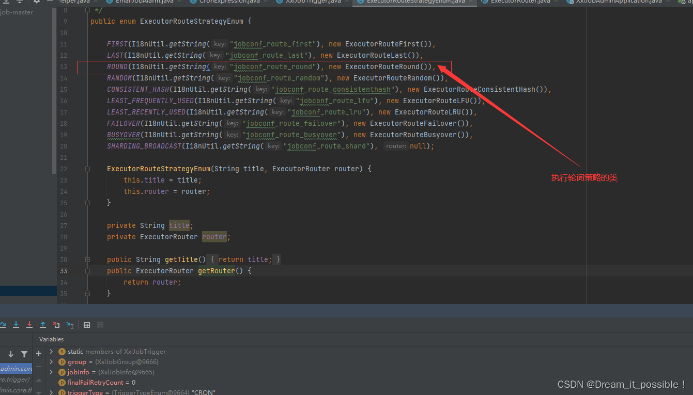

### ExecutorRouteRound

ExecutorRouteRound 实现了 ExecutorRouter 接口的 route 方法，轮询的思想很简单，就是每次需要算出当前的 addressList 的同时，需要明确下一次的 addressList 是配置的一个 next 地址。

```java
@Override
public ReturnT<String> route(TriggerParam triggerParam, List<String> addressList) {
    String address = addressList.get(count(triggerParam.getJobId())%addressList.size());
    return new ReturnT<String>(address);
}
```

### 计算 server 地址

1. routeCountEachJob 的 key 为 JobId，value 为 Job 的执行的次数。

2)  每调用一次 count，routeCountEachJob 对应的 JobId 的 value 值+1。

3)  当前时间 > CACHE_VALID_TIME 超过 24 小时，那么主动清理掉缓存，对于时间周期长的任务，可以不用考虑到负载均衡，因此可以清掉 cache。

```java
private static ConcurrentMap<Integer, AtomicInteger> routeCountEachJob = new ConcurrentHashMap<>();
private static long CACHE_VALID_TIME = 0;

private static int count(int jobId) {
    // cache clear
    if (System.currentTimeMillis() > CACHE_VALID_TIME) {
        routeCountEachJob.clear();
        CACHE_VALID_TIME = System.currentTimeMillis() + 1000*60*60*24;
    }

    AtomicInteger count = routeCountEachJob.get(jobId);
    if (count == null || count.get() > 1000000) {
        // 初始化时主动Random一次，缓解首次压力
        count = new AtomicInteger(new Random().nextInt(100));
    } else {
        // count++
        count.addAndGet(1);
    }
    routeCountEachJob.put(jobId, count);
    return count.get();
}
```

## 任务触发

在 xxl-job-admin 项目中也会配置一个类似于 `XxlJobSpringExecutor` 的 Bean，叫 `XxlJobAdminConfig`

```java
//实现了InitializingBean接口，在初始化是会执行afterPropertiesSet方法
@Component
public class XxlJobAdminConfig implements InitializingBean, DisposableBean {

    @Override
    public void afterPropertiesSet() throws Exception {
        adminConfig = this;

        xxlJobScheduler = new XxlJobScheduler();
        xxlJobScheduler.init();
    }
}
```

```java
public class XxlJobScheduler  {
    
    public void init() throws Exception {
        // init i18n
        initI18n();

        //初始化admin的任务触发线程池
        JobTriggerPoolHelper.toStart();

        //监控和维护注册的执行器实例
        JobRegistryHelper.getInstance().start();

        //job任务执行失败处理
        JobFailMonitorHelper.getInstance().start();

        //job任务结果丢失处理
        JobCompleteHelper.getInstance().start();

        //admin的日志记录
        JobLogReportHelper.getInstance().start();

        //job任务触发
        JobScheduleHelper.getInstance().start();

        logger.info(">>>>>>>>> init xxl-job admin success.");
    }
}
```

```java
public void start(){
    //开启任务线程
    scheduleThread = new Thread(new Runnable() {
        @Override
        public void run() {
            ......

            //通过数据库实现的分布式锁来保证任务在同一时间只会被其中的一个调度中心触发一次
            preparedStatement = conn.prepareStatement(  "select * from xxl_job_lock where lock_name = 'schedule_lock' for update" );
            preparedStatement.execute();

            //查询xxl_job_info这张表中下一次执行的时间 <= 当前时间 + 5s的任务，5s是XxlJob写死的，被称为预读时间，提前读出来，保证任务能准时触发
            //查询到任务之后，调度线程会去将这些任务根据执行时间划分为三个部分：
            //1、当前时间已经超过任务下一次执行时间5s以上的任务
            //2、当前时间已经超过任务下一次执行时间，但是但不足5s的任务
            //3、还未到触发时间，但是一定是5s内就会触发执行的
            List<XxlJobInfo> scheduleList = XxlJobAdminConfig.getAdminConfig().getXxlJobInfoDao().scheduleJobQuery(nowTime + PRE_READ_MS, preReadCount);
            for (XxlJobInfo jobInfo: scheduleList) {
                //超过5秒以上会根据任务配置的调度过期策略来选择要不要执行
                //调度过期策略就两种,一种直接忽略，一种就是立马执行一次
                if (nowTime > jobInfo.getTriggerNextTime() + PRE_READ_MS) {
                    MisfireStrategyEnum misfireStrategyEnum = MisfireStrategyEnum.match(jobInfo.getMisfireStrategy(), MisfireStrategyEnum.DO_NOTHING);
                    if (MisfireStrategyEnum.FIRE_ONCE_NOW == misfireStrategyEnum) {
                        //执行一次
                        JobTriggerPoolHelper.trigger(jobInfo.getId(), TriggerTypeEnum.MISFIRE, -1, null, null, null);
                    }
                 //没有超过5秒则就直接立马执行一次，之后如果判断任务下一次执行时间就在5s内，会直接放到一个时间轮里面，等待下一次触发执行
                } else if (nowTime > jobInfo.getTriggerNextTime()) {
                    JobTriggerPoolHelper.trigger(jobInfo.getId(), TriggerTypeEnum.CRON, -1, null, null, null);
                    //还没到执行时间，所以不会立马执行，也是直接放到时间轮里面，等待触发执行
                } else {
                    // 1、make ring second
                    int ringSecond = (int)((jobInfo.getTriggerNextTime()/1000)%60);
                    // 2、push time ring
                    pushTimeRing(ringSecond, jobInfo.getId());
                    // 3、fresh next
                    refreshNextValidTime(jobInfo, new Date(jobInfo.getTriggerNextTime()));
                }
            }
        }
    }
    scheduleThread.setDaemon(true);
    scheduleThread.setName("xxl-job, admin JobScheduleHelper#scheduleThread");
    scheduleThread.start();
}
```

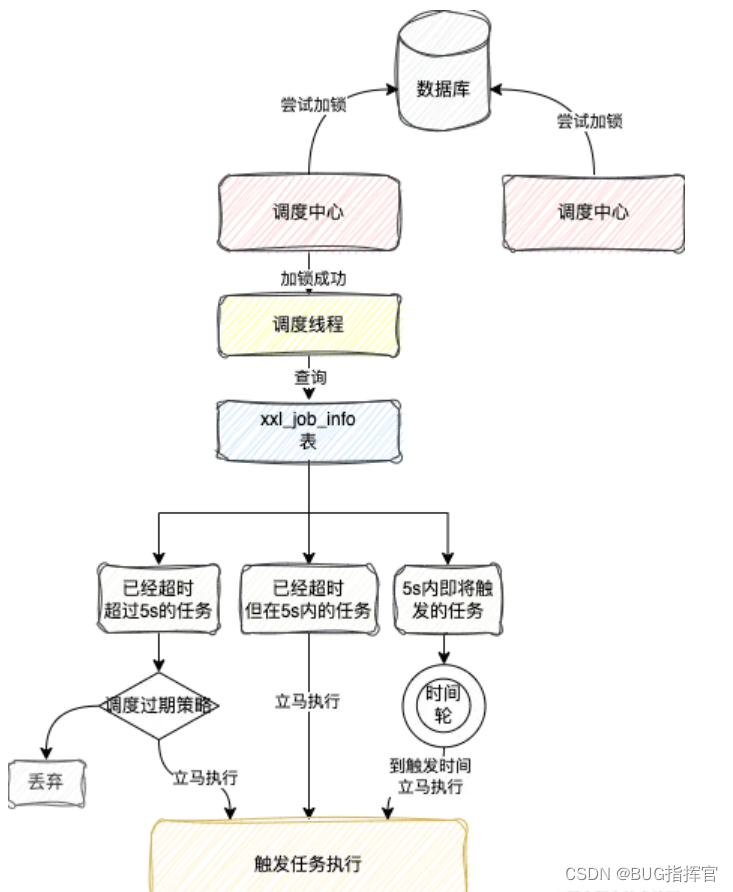

调度中心在启动的时候，会开启一个线程，这个线程的作用就是来计算任务触发时机，这里我把这个线程称为 **调度线程**

这个调度线程会去查询 `xxl_job_info` 这张表

这张表存了任务的一些基本信息和任务下一次执行的时间

调度线程会去查询 **下一次执行的时间 <= 当前时间 + 5s** 的任务

查询到任务之后，调度线程会去将这些任务根据执行时间划分为三个部分：

* 当前时间已经超过任务下一次执行时间 5s 以上，也就是需要在 2023-11-29 08:00:05（不包括 05s）之前的执行的任务
* 当前时间已经超过任务下一次执行时间，但是但不足 5s，也就是在 2023-11-29 08:00:05 和 2023-11-29 08:00:10（不包括 10s）之间执行的任务
* 还未到触发时间，但是一定是 5s 内就会触发执行的

对于第一部分的已经超过 5s 以上时间的任务，会根据任务配置的 **调度过期策略** 来选择要不要执行

对于第二部分的超时时间在 5s 以内的任务，就直接立马执行一次，之后如果判断任务下一次执行时间就在 5s 内，会直接放到一个时间轮里面，等待下一次触发执行

对于第三部分任务，由于还没到执行时间，所以不会立马执行，也是直接放到时间轮里面，等待触发执行

当这批任务处理完成之后，不论是前面是什么情况，调度线程都会去重新计算每个任务的下一次触发时间，然后更新 xxl_job_info 这张表的下一次执行时间

**JobTriggerPoolHelper.trigger()**

当任务达到了触发条件，并不是由调度线程直接去触发执行器的任务执行，调度线程会将这个触发的任务交给线程池去执行，并且 Xxl-Job 为了进一步优化任务的触发，将这个触发任务执行的线程池划分成快线程池和慢线程池两个线程池

在调用执行器的 Http 接口触发任务执行的时候，Xxl-Job 会去记录每个任务的触发所耗费的时间，当任务一次触发的时间超过 500ms，那么这个任务的慢次数就会加 1，如果这个任务一分钟内触发的慢次数超过 10 次，接下来就会将触发任务交给慢线程池去执行，所以快慢线程池就是避免那种频繁触发并且每次触发时间还很长的任务阻塞其它任务的触发的情况发生

```java
public static void trigger(int jobId, TriggerTypeEnum triggerType, int failRetryCount, String executorShardingParam, String executorParam, String addressList) {
    //执行addTrigger方法
    helper.addTrigger(jobId, triggerType, failRetryCount, executorShardingParam, executorParam, addressList);
}


public void addTrigger(final int jobId,
                       final TriggerTypeEnum triggerType,
                       final int failRetryCount,
                       final String executorShardingParam,
                       final String executorParam,
                       final String addressList) {

    //选择快慢线程池
    ThreadPoolExecutor triggerPool_ = fastTriggerPool;
    AtomicInteger jobTimeoutCount = jobTimeoutCountMap.get(jobId);
    if (jobTimeoutCount!=null && jobTimeoutCount.get() > 10) {
        //慢线程池
        triggerPool_ = slowTriggerPool;
    }

    triggerPool_.execute(new Runnable() {
        @Override
        public void run() {
            long start = System.currentTimeMillis();
            try {
                // do trigger
                XxlJobTrigger.trigger(jobId, triggerType, failRetryCount, executorShardingParam, executorParam, addressList);
            } catch (Exception e) {
                logger.error(e.getMessage(), e);
            }
        }
    });
}


public static void trigger(int jobId,
                           TriggerTypeEnum triggerType,
                           int failRetryCount,
                           String executorShardingParam,
                           String executorParam,
                           String addressList) {
   ......

    //如果执行器路由策略是分片广播的话
    if (ExecutorRouteStrategyEnum.SHARDING_BROADCAST==ExecutorRouteStrategyEnum.match(jobInfo.getExecutorRouteStrategy(), null)
            && group.getRegistryList()!=null && !group.getRegistryList().isEmpty()
            && shardingParam==null) {
        //分片执行
        for (int i = 0; i < group.getRegistryList().size(); i++) {
            processTrigger(group, jobInfo, finalFailRetryCount, triggerType, i, group.getRegistryList().size());
        }
    } else {
        if (shardingParam == null) {
            shardingParam = new int[]{0, 1};
        }
        processTrigger(group, jobInfo, finalFailRetryCount, triggerType, shardingParam[0], shardingParam[1]);
    }
}


private static void processTrigger(XxlJobGroup group, XxlJobInfo jobInfo, int finalFailRetryCount, TriggerTypeEnum triggerType, int index, int total){
        // 1、save log-id

        // 2、init trigger-param

        // 3、init address
        String address = null;
        ReturnT<String> routeAddressResult = null;
        //分片广播处理
        if (group.getRegistryList()!=null && !group.getRegistryList().isEmpty()) {
            if (ExecutorRouteStrategyEnum.SHARDING_BROADCAST == executorRouteStrategyEnum) {
                if (index < group.getRegistryList().size()) {
                    address = group.getRegistryList().get(index);
                } else {
                    address = group.getRegistryList().get(0);
                }
            } else {
                //选择路由
                routeAddressResult = executorRouteStrategyEnum.getRouter().route(triggerParam, group.getRegistryList());
                if (routeAddressResult.getCode() == ReturnT.SUCCESS_CODE) {
                    address = routeAddressResult.getContent();
                }
            }
        } else {
            routeAddressResult = new ReturnT<String>(ReturnT.FAIL_CODE, I18nUtil.getString("jobconf_trigger_address_empty"));
        }

        // 4、trigger remote executor
        ReturnT<String> triggerResult = null;
        if (address != null) {
            //远程调用执行器执行任务
            triggerResult = runExecutor(triggerParam, address);
        } else {
            triggerResult = new ReturnT<String>(ReturnT.FAIL_CODE, null);
        }

        // 5、collection trigger info
        // 6、save log trigger-info
    }
}

public static ReturnT<String> runExecutor(TriggerParam triggerParam, String address){
    ReturnT<String> runResult = null;
    try {
        //根据注册地址返回ExecutorBiz对象，这里是用map缓存起来，一个地址对应一个ExecutorBiz，也就是ExecutorBizClient实现类
        //private static ConcurrentMap<String, ExecutorBiz> executorBizRepository = new ConcurrentHashMap<String, ExecutorBiz>();
        ExecutorBiz executorBiz = XxlJobScheduler.getExecutorBiz(address);
        //调用run方法
        runResult = executorBiz.run(triggerParam);
    } catch (Exception e) {
        logger.error(">>>>>>>>>>> xxl-job trigger error, please check if the executor[{}] is running.", address, e);
        runResult = new ReturnT<String>(ReturnT.FAIL_CODE, ThrowableUtil.toString(e));
    }
    return runResult;
}

@Override
public ReturnT<String> run(TriggerParam triggerParam) {
    //通过post请求远程调用
    return XxlJobRemotingUtil.postBody(addressUrl + "run", accessToken, timeout, triggerParam, String.class);
}
```

**路由策略**

1. 一致性 Hash：一致性 Hash 可以理解，就是 Hash 函数(hashcode%size)的 size 保持不变，从而保证了 Hash 函数的前后一致性
2. 最不经常使用（LFU：Least Frequently Used）：Xxl-Job 内部会有一个缓存，统计每个任务每个地址的使用次数，每次都选择使用次数最少的地址，这个缓存每隔 24 小时重置一次
3. 最近最久未使用（LRU：Least Recently Used）：将地址存到 LinkedHashMap 中，它利用 LinkedHashMap 可以根据元素访问（get/put）顺序来给元素排序的特性，快速找到最近最久未使用（未访问）的节点
4. 故障转移：调度中心都会去请求每个执行器，只要能接收到响应，说明执行器正常，那么任务就会交给这个执行器去执行
5. 忙碌转移：调度中心也会去请求每个执行器，判断执行器是不是正在执行当前需要执行的任务（任务执行时间过长，导致上一次任务还没执行完，下一次又触发了），如果在执行，说明忙碌，不能用，否则就可以用
6. 分片广播：XxlJob 给每个执行器分配一个编号，从 0 开始递增，然后向所有执行器触发任务，告诉每个执行器自己的编号和总共执行器的数据，我们可以通过 XxlJobHelper#getShardIndex 获取到编号，XxlJobHelper#getShardTotal 获取到执行器的总数据量，分片广播就是将任务量分散到各个执行器，每个执行器只执行一部分任务，加快任务的处理

## 任务执行

当执行器接收到调度中心的请求时，会把请求交给 `ExecutorBizImpl` 来处理

```java
@Override
protected void channelRead0(final ChannelHandlerContext ctx, FullHttpRequest msg) throws Exception {
    bizThreadPool.execute(new Runnable() {
        @Override
        public void run() {
            Object responseObj = process(httpMethod, uri, requestData, accessTokenReq); 
        }
    });
}


//包括beat、idleBeat、run、kill、log请求都是通过ExecutorBizImpl来实现的
private Object process(HttpMethod httpMethod, String uri, String requestData, String accessTokenReq) {
    try {
        switch (uri) {
            case "/beat":
                return executorBiz.beat();
            case "/idleBeat":
                IdleBeatParam idleBeatParam = GsonTool.fromJson(requestData, IdleBeatParam.class);
                return executorBiz.idleBeat(idleBeatParam);
            case "/run":
                TriggerParam triggerParam = GsonTool.fromJson(requestData, TriggerParam.class);
                //最终会调用到ExecutorBizImpl的run方法实现
                return executorBiz.run(triggerParam);
            case "/kill":
                KillParam killParam = GsonTool.fromJson(requestData, KillParam.class);
                return executorBiz.kill(killParam);
            case "/log":
                LogParam logParam = GsonTool.fromJson(requestData, LogParam.class);
                return executorBiz.log(logParam);
            default:
                return new ReturnT<String>(ReturnT.FAIL_CODE, "invalid request, uri-mapping(" + uri + ") not found.");
        }
    } catch (Exception e) {
        logger.error(e.getMessage(), e);
        return new ReturnT<String>(ReturnT.FAIL_CODE, "request error:" + ThrowableUtil.toString(e));
    }
}
```

executorBiz.run(TriggerParam triggerParam)，会根据传入的条件构建出 IJobHandler 和 JobThread，最终会放到队列中等待触发

```java
public ReturnT<String> run(TriggerParam triggerParam) {
    //根据传入的JobId，加载旧的jobHandler和jobThread（如果一个任务已经执行过一次，会存入jobThreadRepository这个本地的Map里）
    JobThread jobThread = XxlJobExecutor.loadJobThread(triggerParam.getJobId());
    IJobHandler jobHandler = jobThread!=null?jobThread.getHandler():null;
    String removeOldReason = null;

    //根据不同的GlueType，构建不同的IJobHandler
    GlueTypeEnum glueTypeEnum = GlueTypeEnum.match(triggerParam.getGlueType());
    //如果类型是Bean的话，则会构建为MethodJobHandler
    if (GlueTypeEnum.BEAN == glueTypeEnum) {
       //直接从map缓存中取，在初始化jobHandler的那一步，都已经全部放入到map中
        IJobHandler newJobHandler = XxlJobExecutor.loadJobHandler(triggerParam.getExecutorHandler());
        //校验jobThread，如果满足以下条件则会终止
        if (jobThread!=null && jobHandler != newJobHandler) {
            removeOldReason = "change jobhandler or glue type, and terminate the old job thread.";
            jobThread = null;
            jobHandler = null;
        }
        //校验jobHandler
        if (jobHandler == null) {
            jobHandler = newJobHandler;
            if (jobHandler == null) {
                return new ReturnT<String>(ReturnT.FAIL_CODE, "job handler [" + triggerParam.getExecutorHandler() + "] not found.");
            }
        }
     //如果类型是GLUE的话，则会构建为GlueJobHandler
    } else if (GlueTypeEnum.GLUE_GROOVY == glueTypeEnum) {

     //如果类型是Script的话，ScriptJobHandler
    } else if (glueTypeEnum!=null && glueTypeEnum.isScript()) {

    } else {
        return new ReturnT<String>(ReturnT.FAIL_CODE, "glueType[" + triggerParam.getGlueType() + "] is not valid.");
    }

    //如果jobThread不为null，则根据阻塞策略进行相应的操作
    if (jobThread != null) {
        ExecutorBlockStrategyEnum blockStrategy = ExecutorBlockStrategyEnum.match(triggerParam.getExecutorBlockStrategy(), null);
        //如果当前阻塞策略是DISCARD_LATER，也就是丢弃后续调度
        if (ExecutorBlockStrategyEnum.DISCARD_LATER == blockStrategy) {
            //jobThread正在运行或在触发队列中，则返回错误信息
            if (jobThread.isRunningOrHasQueue()) {
                return new ReturnT<String>(ReturnT.FAIL_CODE, "block strategy effect："+ExecutorBlockStrategyEnum.DISCARD_LATER.getTitle());
            }
        //如果当前阻塞策略是COVER_EARLY，也就是覆盖之前调度
        } else if (ExecutorBlockStrategyEnum.COVER_EARLY == blockStrategy) {
            //jobThread正在运行或在触发队列中，则终止旧的任务线程，并将任务线程设置为 null
            if (jobThread.isRunningOrHasQueue()) {
                removeOldReason = "block strategy effect：" + ExecutorBlockStrategyEnum.COVER_EARLY.getTitle();
                jobThread = null;
            }
        //如果是单机串行SERIAL_EXECUTION，则放入队列中触发
        } else {
            // just queue trigger
        }
    }
    //如果jobThread任务线程为null，注册一个新的任务线程
    if (jobThread == null) {
        jobThread = XxlJobExecutor.registJobThread(triggerParam.getJobId(), jobHandler, removeOldReason);
    }
    //将触发参数推送到任务线程的触发队列中，等待执行
    ReturnT<String> pushResult = jobThread.pushTriggerQueue(triggerParam);
    return pushResult;
}
```

```java
private static ConcurrentMap<Integer, JobThread> jobThreadRepository = new ConcurrentHashMap<Integer, JobThread>();

public static JobThread registJobThread(int jobId, IJobHandler handler, String removeOldReason){
    //new了一个JobThread对象，并且调用start方法启动
    JobThread newJobThread = new JobThread(jobId, handler);
    newJobThread.start();
    logger.info(">>>>>>>>>>> xxl-job regist JobThread success, jobId:{}, handler:{}", new Object[]{jobId, handler});

    JobThread oldJobThread = jobThreadRepository.put(jobId, newJobThread);	
    if (oldJobThread != null) {
        oldJobThread.toStop(removeOldReason);
        oldJobThread.interrupt();
    }
    return newJobThread;
}
```

```java
@Override
public void run() {
    //toStop不为true则循环调用
    while(!toStop){
        running = false;
        idleTimes++;

        TriggerParam triggerParam = null;
        try {
            //从队列triggerQueue中取TriggerParam对象，最多等待三秒
            triggerParam = triggerQueue.poll(3L, TimeUnit.SECONDS);
            if (triggerParam!=null) {
                running = true;
                idleTimes = 0;
                triggerLogIdSet.remove(triggerParam.getLogId());

                //如果任务设置了超时时间，则new一个FutureTask对象异步执行任务，通过futureTask.get()方法，设置超时时间，然后捕获TimeoutException异常来实现
                if (triggerParam.getExecutorTimeout() > 0) {
                    Thread futureThread = null;
                    try {
                        FutureTask<Boolean> futureTask = new FutureTask<Boolean>(new Callable<Boolean>() {
                            @Override
                            public Boolean call() throws Exception {
                                XxlJobContext.setXxlJobContext(xxlJobContext);
                                   //通过该方法真正执行任务
                                handler.execute();
                                return true;
                            }
                        });
                        futureThread = new Thread(futureTask);
                        futureThread.start();

                        Boolean tempResult = futureTask.get(triggerParam.getExecutorTimeout(), TimeUnit.SECONDS);
                    } catch (TimeoutException e) {

                        XxlJobHelper.log("<br>----------- xxl-job job execute timeout");
                        XxlJobHelper.log(e);
                        // handle result
                        XxlJobHelper.handleTimeout("job execute timeout ");
                    } finally {
                        futureThread.interrupt();
                    }
                } else {
                    //如果没有设置超时时间，直接执行任务
                    handler.execute();
                }

                //如果任务执行失败或结果丢失，调用XxlJobHelper.handleFail()方法进行处理
                  //如果任务执行成功，记录执行结果信息
                if (XxlJobContext.getXxlJobContext().getHandleCode() <= 0) {
                    XxlJobHelper.handleFail("job handle result lost.");
                } else {
                    String tempHandleMsg = XxlJobContext.getXxlJobContext().getHandleMsg();
                    tempHandleMsg = (tempHandleMsg!=null&&tempHandleMsg.length()>50000)
                            ?tempHandleMsg.substring(0, 50000).concat("...")
                            :tempHandleMsg;
                    XxlJobContext.getXxlJobContext().setHandleMsg(tempHandleMsg);
                }
                XxlJobHelper.log("<br>----------- xxl-job job execute end(finish) -----------<br>----------- Result: handleCode="
                        + XxlJobContext.getXxlJobContext().getHandleCode()
                        + ", handleMsg = "
                        + XxlJobContext.getXxlJobContext().getHandleMsg()
                );

            } else {
                  //空闲次数计数器idleTimes。如果idleTimes达到阈值（30 次），相当于有30次都没有执行对应的任务，就从执行器缓存中删除这个任务
                if (idleTimes > 30) {
                    if(triggerQueue.size() == 0) {
                        XxlJobExecutor.removeJobThread(jobId, "excutor idel times over limit.");
                    }
                }
            }
        } catch (Throwable e) {
            if (toStop) {
                XxlJobHelper.log("<br>----------- JobThread toStop, stopReason:" + stopReason);
            }
            //处理异常信息
            StringWriter stringWriter = new StringWriter();
            e.printStackTrace(new PrintWriter(stringWriter));
            String errorMsg = stringWriter.toString();

            XxlJobHelper.handleFail(errorMsg);

            XxlJobHelper.log("<br>----------- JobThread Exception:" + errorMsg + "<br>----------- xxl-job job execute end(error) -----------");
        } finally {
            if(triggerParam != null) {
                //如果任务线程未被停止，将推送回调信息push到回调线程TriggerCallbackThread
                if (!toStop) {
                    TriggerCallbackThread.pushCallBack(new HandleCallbackParam(
                            triggerParam.getLogId(),
                            triggerParam.getLogDateTime(),
                            XxlJobContext.getXxlJobContext().getHandleCode(),
                            XxlJobContext.getXxlJobContext().getHandleMsg() )
                    );
                } else {
                    //如果任务线程被停止，则推送线程停止信息到回调线程TriggerCallbackThread
                    TriggerCallbackThread.pushCallBack(new HandleCallbackParam(
                            triggerParam.getLogId(),
                            triggerParam.getLogDateTime(),
                            XxlJobContext.HANDLE_CODE_FAIL,
                            stopReason + " [job running, killed]" )
                    );
                }
            }
        }
    }

    //如果线程被停止后触发队列不为空，则推送线程停止信息到回调线程
    while(triggerQueue !=null && triggerQueue.size()>0){
        TriggerParam triggerParam = triggerQueue.poll();
        if (triggerParam!=null) {
            // is killed
            TriggerCallbackThread.pushCallBack(new HandleCallbackParam(
                    triggerParam.getLogId(),
                    triggerParam.getLogDateTime(),
                    XxlJobContext.HANDLE_CODE_FAIL,
                    stopReason + " [job not executed, in the job queue, killed.]")
            );
        }
    }
}
```

JobThread 会将任务执行的结果发送到一个内存队列中

执行器启动的时候会开启一个处理发送任务执行结果的线程：TriggerCallbackThread

这个线程会不停地从队列中获取所有的执行结果，将执行结果批量发送给调度中心

调用中心接收到请求时，会根据执行的结果修改这次任务的执行状态和进行一些后续的事，比如失败了是否需要重试，是否有子任务需要触发等等

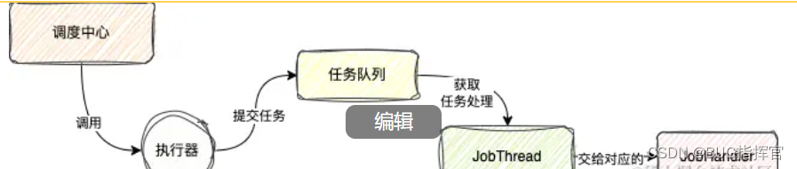

**为什么不直接处理，而是交给队列，从队列中获取任务呢？**

如果调度中心选择的 **执行器实例正在处理定时任务**，那么此时该怎么处理呢？这时就跟 **阻塞处理策略** 有关了

阻塞处理策略总共有三种：

- 单机串行
- 丢弃后续调度
- 覆盖之前调度

## 调度中心

调度中心是一个单独的 Web 服务，主要是用来触发定时任务的执行

它提供了一些页面操作，我们可以很方便地去管理这些定时任务的触发逻辑

调度中心依赖数据库，所以数据都是存在数据库中的

调度中心也支持集群模式，但是它们所依赖的数据库必须是同一个

所以同一个集群中的调度中心实例之间是没有任何通信的，数据都是通过数据库共享的

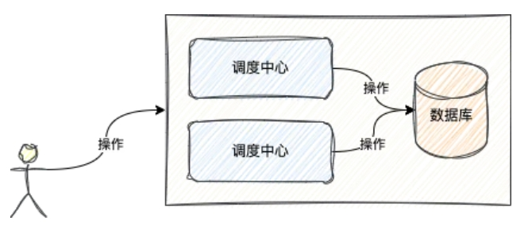

## 执行器

执行器是用来执行具体的任务逻辑的

执行器你可以理解为就是平时开发的服务，一个服务实例对应一个执行器实例

每个执行器有自己的名字，为了方便，你可以将执行器的名字设置成服务名

## 任务

调用中心是用来控制定时任务的触发逻辑，而执行器是具体执行任务的，这是一种任务和触发逻辑分离的设计思想，这种方式的好处就是使任务更加灵活，可以随时被调用，还可以被不同的调度规则触发。

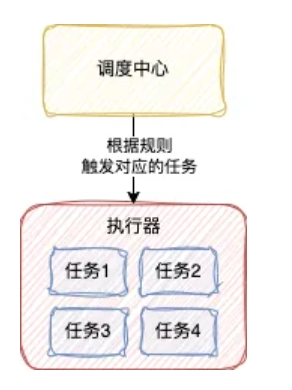

## 执行器入口

在配置执行器组件时，会配置一个 `XxlJobSpringExecutor` 的 Bean

```java
@Bean
public XxlJobSpringExecutor xxlJobExecutor() {
    logger.info(">>>>>>>>>>> xxl-job config init.");
    XxlJobSpringExecutor xxlJobSpringExecutor = new XxlJobSpringExecutor();
    //设置调用中心的连接地址
    xxlJobSpringExecutor.setAdminAddresses(adminAddresses);
    //设置执行器的名称
    xxlJobSpringExecutor.setAppname(appname);
    //设置执行器IP
    xxlJobSpringExecutor.setIp(ip);
    //执行器端口号
    xxlJobSpringExecutor.setPort(port);
    //调度中心通讯token
    xxlJobSpringExecutor.setAccessToken(accessToken);
    //任务执行日志存放的目录
    xxlJobSpringExecutor.setLogPath(logPath);
    //执行器日志文件保存天数
    xxlJobSpringExecutor.setLogRetentionDays(logRetentionDays);
    return xxlJobSpringExecutor;
}
```

`XxlJobSpringExecutor` 这个类就是执行器的入口，该类实现了 `SmartInitializingSingleton` 接口，经过 Bean 的生命周期，会调用 `afterSingletonsInstantiated` 这个方法

```java
public class XxlJobSpringExecutor extends XxlJobExecutor implements ApplicationContextAware, SmartInitializingSingleton, DisposableBean {
    private static final Logger logger = LoggerFactory.getLogger(XxlJobSpringExecutor.class);

    @Override
    public void afterSingletonsInstantiated() {
        // init JobHandler Repository (for method)
        initJobHandlerMethodRepository(applicationContext);
        GlueFactory.refreshInstance(1);
        try {
            super.start();
        } catch (Exception e) {
            throw new RuntimeException(e);
        }
    }
}
```

### JobHandler

JobHandler 其实就是一个定时任务的封装，一个定时任务会对应一个 JobHandler 对象，注册 JobHandler 时就是 new 一个 JobHandler 对象放入到维护的 map 集合中

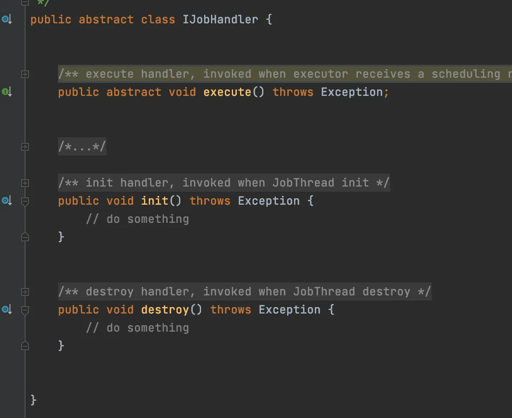

当执行器执行任务的时候，就会调用 JobHandler 的 execute 方法

JobHandler 有三种实现：

1. MethodJobHandler：方法的实现
2. GlueJobHandler：支持动态修改任务执行的代码
3. ScriptJobHandler：处理脚本任务

```java
public class MethodJobHandler extends IJobHandler {
    
    @Override
    public void execute() throws Exception {
        Class<?>[] paramTypes = method.getParameterTypes();
        //通过反射调用方法
        if (paramTypes.length > 0) {
            method.invoke(target, new Object[paramTypes.length]);       
        } else {
            method.invoke(target);
        }
    }
}
```

`MethodJobHandler` 会在项目启动的时候就会创建，`GlueJobHandler` 和 `ScriptJobHandler` 都是任务触发时才会创建

### 初始化 JobHandler

所谓的初始化 JobHandler 就是指执行器启动的时候会去 Spring 容器中找到加了 `@XxlJob` 注解的 Bean，JobHandler 其实就是一个定时任务的封装

解析注解，然后封装成一个 MethodJobHandler 对象，最终存到 XxlJobSpringExecutor 成员变量的一个本地的 Map 缓存中

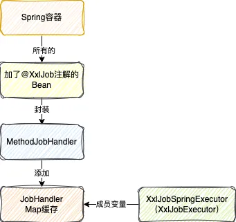

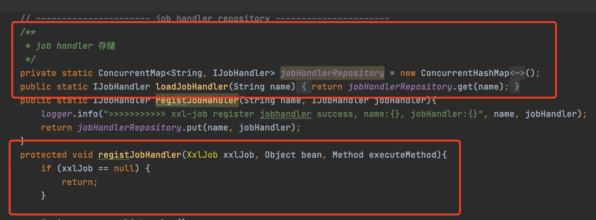

```java
private void initJobHandlerMethodRepository(ApplicationContext applicationContext) {
    if (applicationContext == null) {
        return;
    }
    //getBeanNamesForType获取所有beanNames的集合
    String[] beanDefinitionNames = applicationContext.getBeanNamesForType(Object.class, false, true);
    for (String beanDefinitionName : beanDefinitionNames) {
        Object bean = null;
        //如果是懒加载也就是加了@Lazy注解的，直接跳过
        Lazy onBean = applicationContext.findAnnotationOnBean(beanDefinitionName, Lazy.class);
        if (onBean!=null){
            logger.debug("xxl-job annotation scan, skip @Lazy Bean:{}", beanDefinitionName);
            continue;
        }else {
            //获取当前的bean
            bean = applicationContext.getBean(beanDefinitionName);
        }
        //key为Method方法，值为XxlJob注解的集合
        Map<Method, XxlJob> annotatedMethods = null;
        try {
            //通过selectMethods方法返回map对象
            annotatedMethods = MethodIntrospector.selectMethods(bean.getClass(),
                    new MethodIntrospector.MetadataLookup<XxlJob>() {
                        @Override
                        public XxlJob inspect(Method method) {
                            //当前method有没有加XxlJob注解
                            return AnnotatedElementUtils.findMergedAnnotation(method, XxlJob.class);
                        }
                    });
        } catch (Throwable ex) {
            logger.error("xxl-job method-jobhandler resolve error for bean[" + beanDefinitionName + "].", ex);
        }
        if (annotatedMethods==null || annotatedMethods.isEmpty()) {
            continue;
        }
        for (Map.Entry<Method, XxlJob> methodXxlJobEntry : annotatedMethods.entrySet()) {
            //获取当前Entry的key和value
            Method executeMethod = methodXxlJobEntry.getKey();
            XxlJob xxlJob = methodXxlJobEntry.getValue();
            //注册
            registJobHandler(xxlJob, bean, executeMethod);
        }
    }
}
```

```java
public static <T> Map<Method, T> selectMethods(Class<?> targetType, final MetadataLookup<T> metadataLookup) {
    //返回的map集合
    final Map<Method, T> methodMap = new LinkedHashMap<>();
    Set<Class<?>> handlerTypes = new LinkedHashSet<>();
     //添加给定类实现的所有接口的集合，相当于把当前类的上一级全部添加进来
    handlerTypes.addAll(ClassUtils.getAllInterfacesForClassAsSet(targetType));
    for (Class<?> currentHandlerType : handlerTypes) {
        //调用doWithMethods方法，传入函数式接口实现
        ReflectionUtils.doWithMethods(currentHandlerType, method -> {
            Method specificMethod = ClassUtils.getMostSpecificMethod(method, targetClass);
            //调用外层的inspect方法返回结果，也就是XxlJob注解
            T result = metadataLookup.inspect(specificMethod);
            if (result != null) {
                Method bridgedMethod = BridgeMethodResolver.findBridgedMethod(specificMethod);
                if (bridgedMethod == specificMethod || metadataLookup.inspect(bridgedMethod) == null) {
                    //将method和result放入methodMap中
                    methodMap.put(specificMethod, result);
                }
            }
        }, ReflectionUtils.USER_DECLARED_METHODS);
    }
    //最后返回map对象
    return methodMap;
}
```

```java
public static void doWithMethods(Class<?> clazz, MethodCallback mc, @Nullable MethodFilter mf) {
    //获取到当前类的声明的所有方法数组
    Method[] methods = getDeclaredMethods(clazz, false);
    for (Method method : methods) {
        if (mf != null && !mf.matches(method)) {
            continue;
        }
        try {
            //调用doWith方法，也就是外层的函数式接口实现
            mc.doWith(method);
        }
        catch (IllegalAccessException ex) {
            throw new IllegalStateException("Not allowed to access method '" + method.getName() + "': " + ex);
        }
    }
    //对父类或者接口做同样的处理
    if (clazz.getSuperclass() != null && (mf != USER_DECLARED_METHODS || clazz.getSuperclass() != Object.class)) {
        doWithMethods(clazz.getSuperclass(), mc, mf);
    }
    else if (clazz.isInterface()) {
        for (Class<?> superIfc : clazz.getInterfaces()) {
            doWithMethods(superIfc, mc, mf);
        }
    }
}
```

```java
protected void registJobHandler(XxlJob xxlJob, Object bean, Method executeMethod){
    if (xxlJob == null) {
        return;
    }
    //xxlJob的value值
    String name = xxlJob.value();
    Class<?> clazz = bean.getClass();
    //方法名
    String methodName = executeMethod.getName();
    if (name.trim().length() == 0) {
        throw new RuntimeException("xxl-job method-jobhandler name invalid, for[" + clazz + "#" + methodName + "] .");
    }
    //如果name存在重复的，则会抛出异常
    if (loadJobHandler(name) != null) {
        throw new RuntimeException("xxl-job jobhandler[" + name + "] naming conflicts.");
    }
    executeMethod.setAccessible(true);

    //获取init和destroy方法
    .....

    // registry jobhandler
    //这里new了一个MethodJobHandler对象作为参数，后面会详细说明
    registJobHandler(name, new MethodJobHandler(bean, executeMethod, initMethod, destroyMethod));
}
```

```java
//维护的map集合，key是xxljob注解中设置的value值，value是IJobHandler对象
private static ConcurrentMap<String, IJobHandler> jobHandlerRepository = new ConcurrentHashMap<String, IJobHandler>();

public static IJobHandler loadJobHandler(String name){
    return jobHandlerRepository.get(name);
}

//注册JobHandler就是放入到jobHandlerRepository这个map集合中
public static IJobHandler registJobHandler(String name, IJobHandler jobHandler){
    logger.info(">>>>>>>>>>> xxl-job register jobhandler success, name:{}, jobHandler:{}", name, jobHandler);
    return jobHandlerRepository.put(name, jobHandler);
}
```

### 创建一个 HTTP 服务器

除了初始化 JobHandler 之外，执行器还会创建一个 Http 服务器

这个服务器端口号就是通过 XxlJobSpringExecutor 配置的端口，demo 中就是设置的是 9999，底层是基于 Netty 实现的

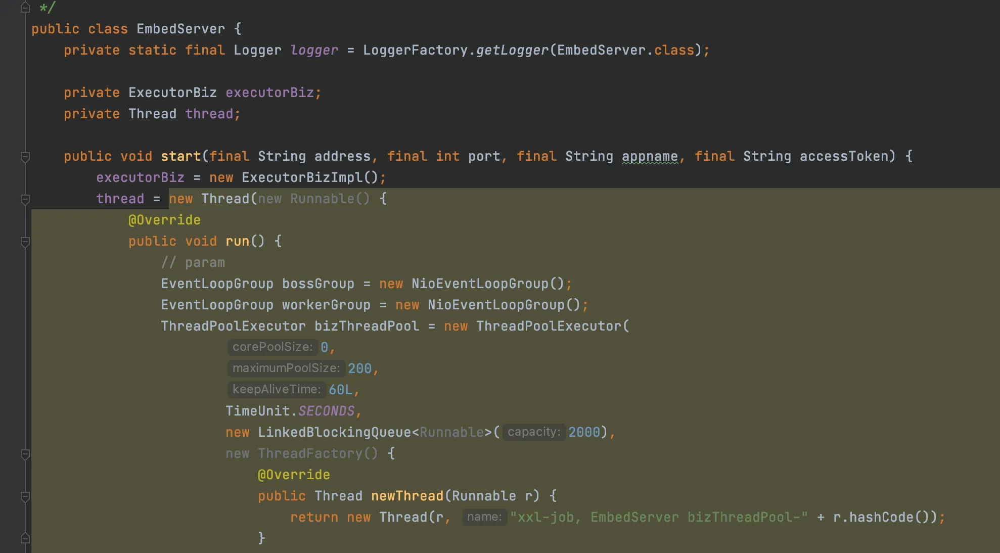

这个 Http 服务端会接收来自调度中心的请求

**当执行器接收到调度中心的请求时，会把请求交给 ExecutorBizImpl 来处理**

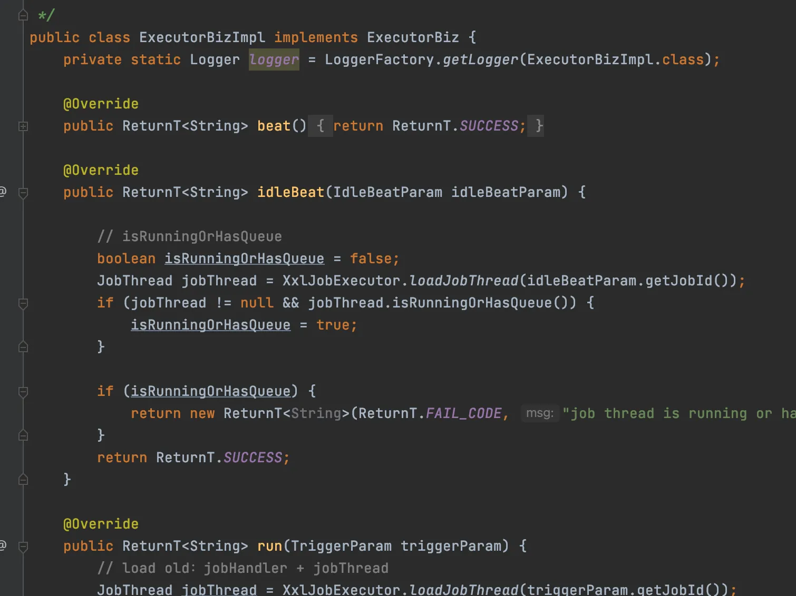

这个类非常重要，所有调度中心的请求都是这里处理的

ExecutorBizImpl 实现了 ExecutorBiz 接口

当你翻源码的时候会发现，ExecutorBiz 还有一个 ExecutorBizClient 实现

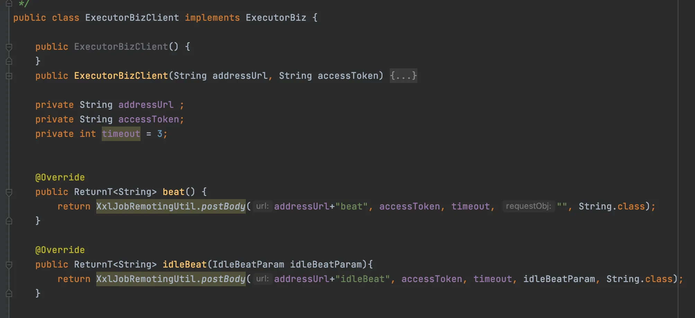

ExecutorBizClient 的实现就是发送 http 请求，所以这个实现类是在调度中心使用的，用来访问执行器提供的 http 接口


## 注册到调度中心

当执行器启动的时候，会启动一个注册线程，这个线程会往调度中心注册当前执行器的信息，包括两部分数据

- 执行器的名字，也就是设置的 appname
- 执行器所在机器的 ip 和端口，这样调度中心就可以访问到这个执行器提供的 Http 接口

前面提到每个服务实例都会对应一个执行器实例，所以调用中心会保存每个执行器实例的地址

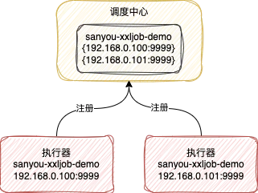

调用完 `initJobHandlerMethodRepository` 方法后，会执行 super.start()方法

```java
public void start() throws Exception {
    //初始化日志
    XxlJobFileAppender.initLogPath(logPath);

    //初始化admin集合
    initAdminBizList(adminAddresses, accessToken);

    //初始化日志清理的线程
    JobLogFileCleanThread.getInstance().start(logRetentionDays);

    //初始化执行器回调线程
    TriggerCallbackThread.getInstance().start();

    //初始化执行器服务端
    initEmbedServer(address, ip, port, appname, accessToken);
}
```

```java
private void initEmbedServer(String address, String ip, int port, String appname, String accessToken) throws Exception {

    //如果没有指定端口，默认9999端口
    port = port>0?port: NetUtil.findAvailablePort(9999);
    //没有指定ip，通过IpUtil.getIp()方法获取ip
    ip = (ip!=null&&ip.trim().length()>0)?ip: IpUtil.getIp();

    //生成注册地址，默认使用指定的address，如果没有指定，则使用ip:port
    if (address==null || address.trim().length()==0) {
        String ip_port_address = IpUtil.getIpPort(ip, port);
        address = "http://{ip_port}/".replace("{ip_port}", ip_port_address);
    }
    embedServer = new EmbedServer();
    //调用start方法
    embedServer.start(address, port, appname, accessToken);
}
```

```java
//创建一个Http服务器,底层是基于Netty实现的,这个Http服务端会接收来自调度中心的请求
public void start(final String address, final int port, final String appname, final String accessToken) {
    //当执行器接收到调度中心的请求时，会把请求交给ExecutorBizImpl来处理
    //ExecutorBiz还有一个ExecutorBizClient实现类，主要是用来发送http请求，所以这个实现类是在调度中心使用的，用来访问执行器提供的http接口
    executorBiz = new ExecutorBizImpl();
    thread = new Thread(new Runnable() {
        @Override
        public void run() {
            ......
            // start registry
            startRegistry(appname, address);
            ......
        }
    }
    thread.setDaemon(true);
    thread.start();
}
```

```java
public void startRegistry(final String appname, final String address) {
    // start registry
    ExecutorRegistryThread.getInstance().start(appname, address);
}
```

```java
//如果admin是集群部署的话，就会向每台服务器调用registry方法区注册
@Override
public ReturnT<String> registry(RegistryParam registryParam) {
    //通过post接口调用
    return XxlJobRemotingUtil.postBody(addressUrl + "api/registry", accessToken, timeout, registryParam, String.class);
}
```

```java
//JobApiController.java
@RequestMapping("/{uri}")
@ResponseBody
@PermissionLimit(limit=false)
public ReturnT<String> api(HttpServletRequest request, @PathVariable("uri") String uri, @RequestBody(required = false) String data) {
    ......

    if ("callback".equals(uri)) {
        List<HandleCallbackParam> callbackParamList = GsonTool.fromJson(data, List.class, HandleCallbackParam.class);
        return adminBiz.callback(callbackParamList);
    } else if ("registry".equals(uri)) {
        RegistryParam registryParam = GsonTool.fromJson(data, RegistryParam.class);
        //调用registry方法
        return adminBiz.registry(registryParam);
    } else if ("registryRemove".equals(uri)) {
        RegistryParam registryParam = GsonTool.fromJson(data, RegistryParam.class);
        return adminBiz.registryRemove(registryParam);
    } else {
        return new ReturnT<String>(ReturnT.FAIL_CODE, "invalid request, uri-mapping("+ uri +") not found.");
    }
}
```

```java
//最终注册就是往xxl_job_registry表中插入一条记录
public ReturnT<String> registry(RegistryParam registryParam) {
    // async execute
    registryOrRemoveThreadPool.execute(new Runnable() {
        @Override
        public void run() {
             //先执行更新语句，如果不存在，则执行插入语句
            int ret = XxlJobAdminConfig.getAdminConfig().getXxlJobRegistryDao().registryUpdate(registryParam.getRegistryGroup(), registryParam.getRegistryKey(), registryParam.getRegistryValue(), new Date());
            if (ret < 1) {
              //执行插入方法
XxlJobAdminConfig.getAdminConfig().getXxlJobRegistryDao().registrySave(registryParam.getRegistryGroup(), registryParam.getRegistryKey(), registryParam.getRegistryValue(), new Date());
                // fresh
                freshGroupRegistryInfo(registryParam);
            }
        }
    });
    return ReturnT.SUCCESS;
}
```

当执行器启动的时候，会启动一个注册线程，这个线程会往调度中心注册当前执行器的信息，包括两部分数据

- 执行器的名字，也就是设置的 appname
- 执行器所在机器的 ip 和端口，这样调度中心就可以访问到这个执行器提供的 Http 接口

## 任务触发

### 任务如何触发？

调度中心在启动的时候，会开启一个线程，这个线程的作用就是来计算任务触发时机，这里我把这个线程称为 **调度线程**

这个调度线程会去查询 `xxl_job_info` 这张表

这张表存了任务的一些基本信息和任务下一次执行的时间

调度线程会去查询 **下一次执行的时间 <= 当前时间 + 5s** 的任务

这个 5s 是 XxlJob 写死的，被称为预读时间，提前读出来，保证任务能准时触发

查询到任务之后，调度线程会去将这些任务根据执行时间划分为三个部分：

- 当前时间已经超过任务下一次执行时间 5s 以上，也就是需要在 `2023-11-29 08:00:05`（不包括 05s）之前的执行的任务
- 当前时间已经超过任务下一次执行时间，但是但不足 5s，也就是在 `2023-11-29 08:00:05` 和 `2023-11-29 08:00:10`（不包括 10s）之间执行的任务
- 还未到触发时间，但是一定是 5s 内就会触发执行的

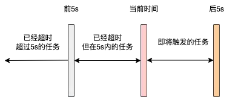

对于第一部分的已经超过 5s 以上时间的任务，会根据任务配置的 **调度过期策略** 来选择要不要执行

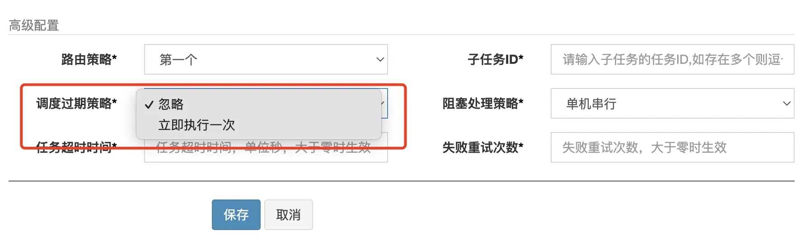

对于第二部分的超时时间在 5s 以内的任务，就直接立马执行一次，之后如果判断任务下一次执行时间就在 5s 内，会直接放到一个时间轮里面，等待下一次触发执行

对于第三部分任务，由于还没到执行时间，所以不会立马执行，也是直接放到时间轮里面，等待触发执行

当这批任务处理完成之后，不论是前面是什么情况，调度线程都会去重新计算每个任务的下一次触发时间，然后更新 `xxl_job_info` 这张表的下一次执行时间

由于调度中心可以是集群的形式，每个调度中心实例都有调度线程，那么如何保证任务在同一时间只会被其中的一个调度中心触发一次？

我猜你第一时间肯定想到分布式锁，但是怎么加呢？

XxlJob 实现就比较有意思了，它是基于八股文中常说的通过数据库来实现的分布式锁的

在调度之前，调度线程会尝试执行下面这句 sql

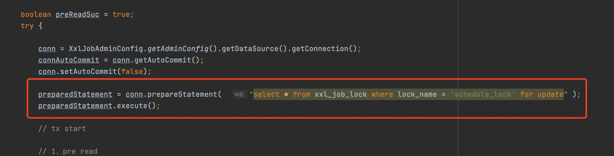

一旦执行成功，说明当前调度中心成功抢到了锁，接下来就可以执行调度任务了

当调度任务执行完之后再去关闭连接，从而释放锁

由于每次执行之前都需要去获取锁，这样就保证在调度中心集群中，同时只有一个调度中心执行调度任务

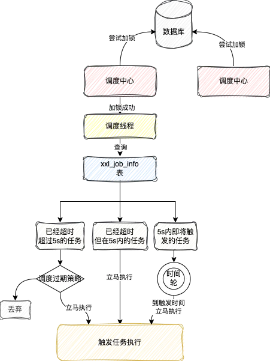

### 快慢线程池的异步触发任务优化

当任务达到了触发条件，并不是由调度线程直接去触发执行器的任务执行

调度线程会将这个触发的任务交给线程池去执行

所以上图中的最后一部分触发任务执行其实是线程池异步去执行的

那么，为什么要使用线程池异步呢？

主要是因为触发任务，需要通过 Http 接口调用具体的执行器实例去触发任务

这一过程必然会耗费时间，如果调度线程去做，就会耽误调度的效率

所以就通过异步线程去做，调度线程只负责判断任务是否需要执行

并且，Xxl-Job 为了进一步优化任务的触发，将这个触发任务执行的线程池划分成 **快线程池** 和 **慢线程池** 两个线程池

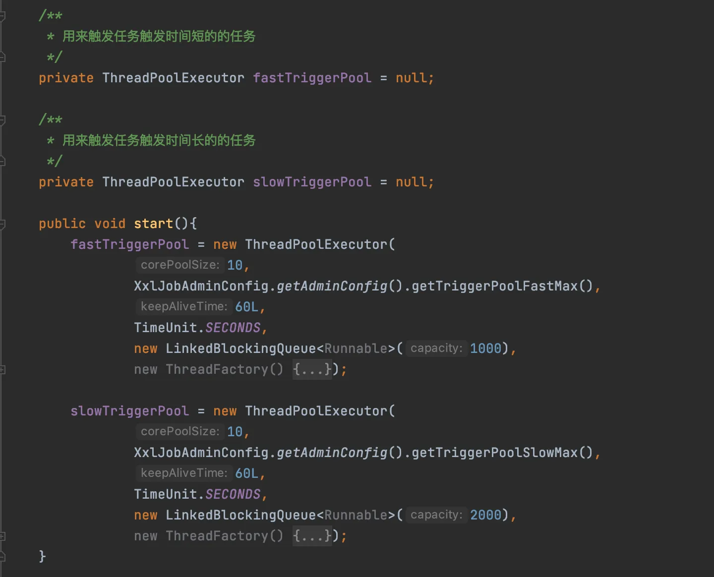

在调用执行器的 Http 接口触发任务执行的时候，Xxl-Job 会去记录每个任务的触发所耗费的时间

注意并不是任务执行时间，只是整个 Http 请求耗时时间，这是因为执行器执行任务是异步执行的，所以整个时间不包括任务执行时间，这个后面会详细说

当任务一次触发的时间超过 500ms，那么这个任务的慢次数就会加 1

如果这个任务 **一分钟内触发的慢次数超过 10 次**，接下来就会将触发任务交给慢线程池去执行

所以快慢线程池就是避免那种频繁触发并且每次触发时间还很长的任务阻塞其它任务的触发的情况发生

### 如何选择执行器实例？

**最不经常使用**（LFU：Least Frequently Used）：Xxl-Job 内部会有一个缓存，统计每个任务每个地址的使用次数，每次都选择使用次数最少的地址，这个缓存每隔 24 小时重置一次

**最近最久未使用**（LRU：Least Recently Used）：将地址存到 LinkedHashMap 中，它利用 LinkedHashMap 可以根据元素访问（get/put）顺序来给元素排序的特性，快速找到最近最久未使用（未访问）的节点

**故障转移**：调度中心都会去请求每个执行器，只要能接收到响应，说明执行器正常，那么任务就会交给这个执行器去执行

**忙碌转移**：调度中心也会去请求每个执行器，判断执行器是不是正在执行当前需要执行的任务（任务执行时间过长，导致上一次任务还没执行完，下一次又触发了），如果在执行，说明忙碌，不能用，否则就可以用

**分片广播**：XxlJob 给每个执行器分配一个编号，从 0 开始递增，然后向所有执行器触发任务，告诉每个执行器自己的编号和总共执行器的数据

我们可以通过 XxlJobHelper#getShardIndex 获取到编号，XxlJobHelper#getShardTotal 获取到执行器的总数据量

分片广播就是将任务量分散到各个执行器，每个执行器只执行一部分任务，加快任务的处理

### 执行器如何去执行任务？

当执行器接收到调度中心的请求时，会把请求交给 ExecutorBizImpl 来处理

当执行器接收到请求，在 **正常情况下**，执行器会去为这个任务创建一个单独的线程，这个线程被称为 `JobThread`

每个任务在触发的时候都有单独的线程去执行，保证不同的任务执行互不影响

之后任务并不是直接交给线程处理的，而是直接放到一个内存队列中，线程直接从队列中获取任务

那就得讲讲不正常的情况了

如果调度中心选择的 **执行器实例正在处理定时任务**，那么此时该怎么处理呢？**

这时就跟 **阻塞处理策略** 有关了

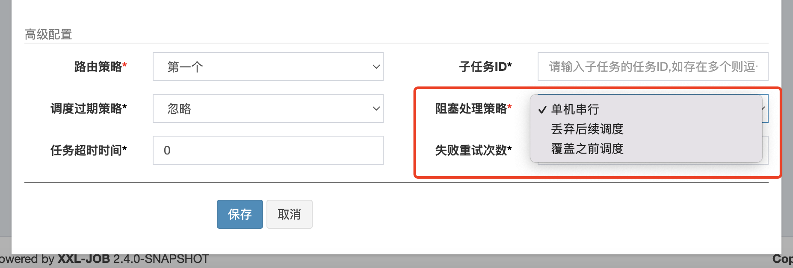

阻塞处理策略总共有三种：

- 单机串行
- 丢弃后续调度
- 覆盖之前调度

**单机串行** 的实现就是将任务放到队列中，由于队列是先进先出的，所以就实现串行，这也是为什么放在队列的原因

**丢弃调度** 的实现就是执行器什么事都不用干就可以了，自然而然任务就丢了

**覆盖之前调度** 的实现就很暴力了，他是直接重新创建一个 JobThread 来执行任务，并且尝试打断之前的正在处理任务的 JobThread，丢弃之前队列中的任务

这里需要注意的一点就是，**阻塞处理策略是对于单个执行器上的任务来生效的，不同执行器实例上的同一个任务是互不影响的**

比如说，有一个任务有两个执行器 A 和 B，路由策略是轮询

任务第一次触发的时候选择了执行器实例 A，由于任务执行时间长，任务第二次触发的时候，执行器的路由到了 B，此时 A 的任务还在执行，但是 B 感知不到 A 的任务在执行，所以此时 B 就直接执行了任务

所以此时你配置的什么阻塞处理策略就没什么用了

如果业务中需要保证定时任务同一时间只有一个能运行，需要把任务路由到同一个执行器上，比如路由策略就选择 `第一个`

### 任务执行结果的回调

当任务处理完成之后，执行器会将任务执行的结果发送给调度中心

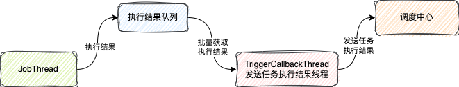

如上图所示，这整个过程也是异步化的

- JobThread 会将任务执行的结果发送到一个内存队列中
- 执行器启动的时候会开启一个处发送任务执行结果的线程：TriggerCallbackThread
- 这个线程会不停地从队列中获取所有的执行结果，将执行结果批量发送给调度中心
- 调用中心接收到请求时，会根据执行的结果修改这次任务的执行状态和进行一些后续的事，比如失败了是否需要重试，是否有子任务需要触发等等

到此，一次任务的就算真正处理完成了

## 时间对齐

scheduleThread 作为时间调度线程，自身的时间是如何对齐到整秒上的呢？

下图可见，在线程启动的同时，sleep 了 5000-System.currentTimeMillis()%1000 个毫秒。

举例：现在是 17:37:05 的 100ms，那么上述公式 = 4900ms，从现在开始睡眠 4900ms，唤醒的时刻，便是整秒的 17:37:10。

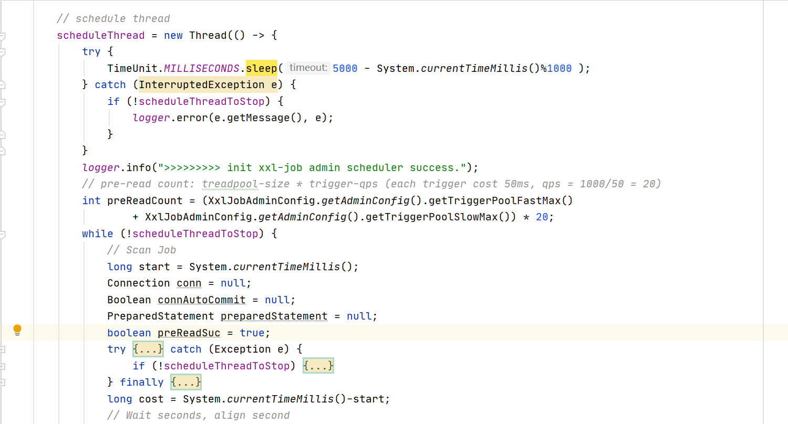

那么为什么是 5s 呢？再看预读时间变量，一致。预读时间变量的作用是每次读取现在开始的未来 5s 内的任务，用于处理执行。

shceduled 线程在 while 循环的最后还有一次时间对齐：如果预读处理了一些数据，那么就等待到下一个整 s，如果没有预读到数据说明当前无任务，直接等待下一个 5s。

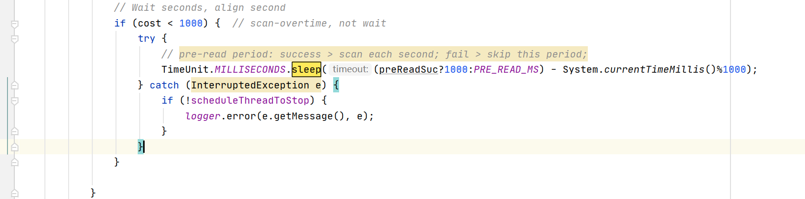

## ringThread 时间轮（算法）线程

思考一下，我们实现一个遵循 cron 表达式的调度功能会怎么做？

方案 1，启动一个线程，计算将要执行时间到当前时间的秒数，直接 sleep 这个秒数。当执行完一次任务后，再计算下次执行时间到当前时间的秒数，继续 sleep。
这个方法想想也不是不行，但是缺点是，当我们需要多个 cron 任务时，需要开启多个线程，造成资源的浪费。

方案 2，只用一个守护线程，任务死循环扫任务数据，拿执行时间距离当前最近的任务，如果该任务时间等同于当前时间（或者在当前之间很小的一个范围内），则执行，否则不执行，等待下一个循环。
此方案似乎解决了线程数量爆炸的问题，但是又会引入一个新的问题，如果某一个任务执行时间太长，显然会阻塞其他任务，导致其他任务不能及时执行。

方案 3，在方案 2 的基础上，责任拆分，一个线程为调度线程，另外有一个线程池为执行线程池，这样便可以一定程度避免长任务阻塞的问题。

但是，毫无限制的死循环查询数据，无论这个任务数据存在数据库还是其他地方，似乎都不是一个优雅的方案。那么有没有一种方式，能如同时钟一般，指针到了才执行对应时间的任务。

时间轮算法：顾名思义，时间轮其实很简单，就是用实际的时钟刻度槽位来存储任务，如下图，我们以小时为单位，9:00 执行 A 任务，10:00 执行 B，C 任务。

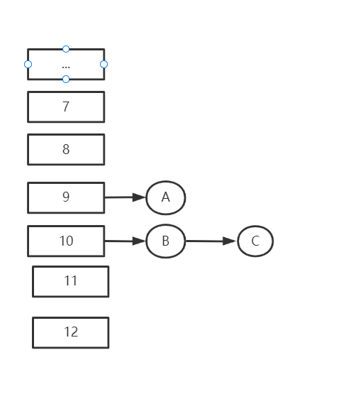

这里的刻度当然也可以更细致，比如把一天切分成 246060 个秒的刻度，秒的刻度上挂任务。

我们只需要在方案 3 的基础上改造：声明一个变量 Map <时间刻度，所属任务集合>。

任务增加时，只需要增加到对应的时间轮上。

仍然有一个线程在死循环，按照秒的刻度 1 秒执行一次，到达这一秒时从 Map 中取出对应任务，使用线程池进行执行。

时间轮算法也不是完美的，如果某一个刻度上的任务太多，即便任务的执行使用线程池处理，仍然可能会导致执行到下一秒还没完成。毕竟我们对任务的调度，总要对任务的状态等细节进行处理，尤其是这些状态的更新依赖数据库等外部数据源时。

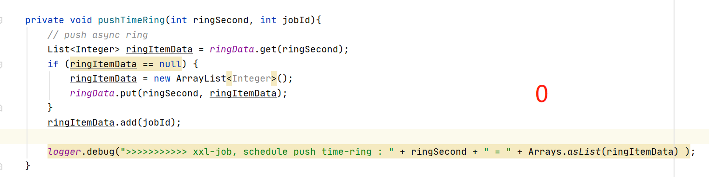

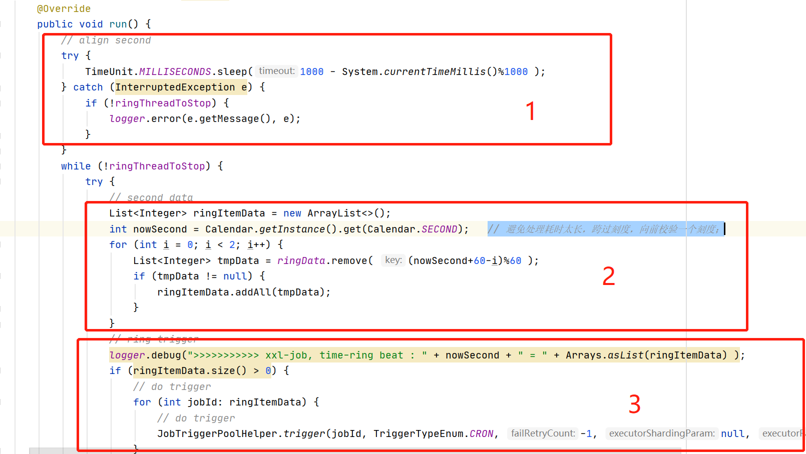

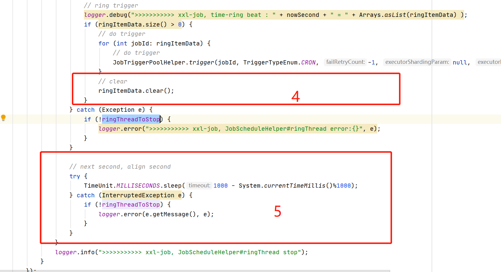

1. 线程启动时，对齐这一秒。
2. 通过当前秒获取 ringData 中的任务，同时为了防止之前有延时产生，也检查一下前一秒的刻度中是否还存在未处理的任务。
3. 触发任务，扔到快慢线程池去处理。
4. 清理临时变量。
5. 对齐这一秒。

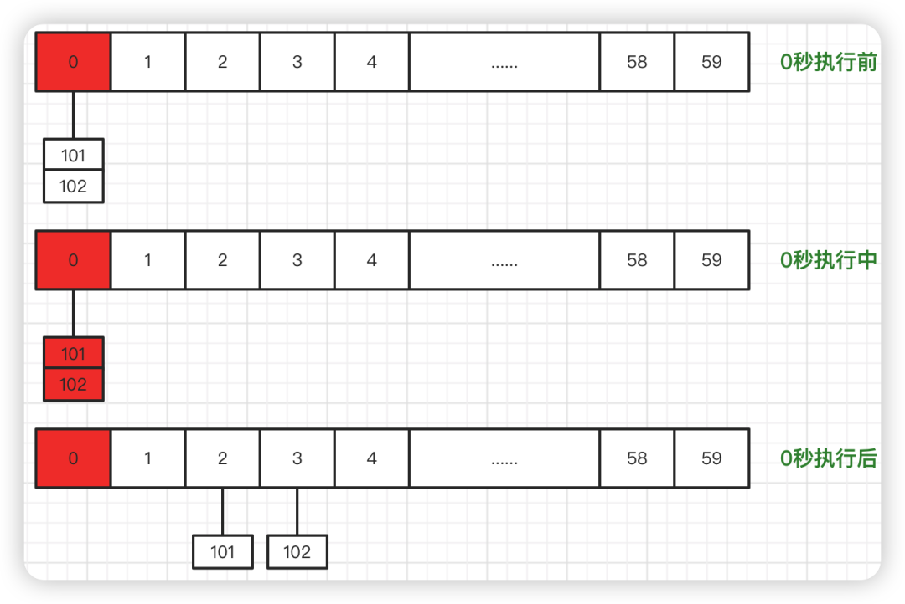

这里我把 0 时刻拆成了三个阶段，分别是：

- 执行前：读取该时刻有哪些任务待执行，拿到任务 id；
- 执行中：通过任务 id 查询任务的运行策略，执行任务；
- 执行后：更新任务的下次执行时间；

然后时间指针往前推动一个时刻，到了 1 秒时刻。此时刻时间轮中的任务并未发生变化。

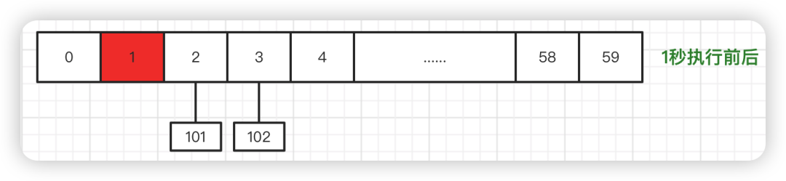

到了第 2 秒时刻，预读线程将 jobid 103 加入时间轮，并执行该数组下标下的任务：

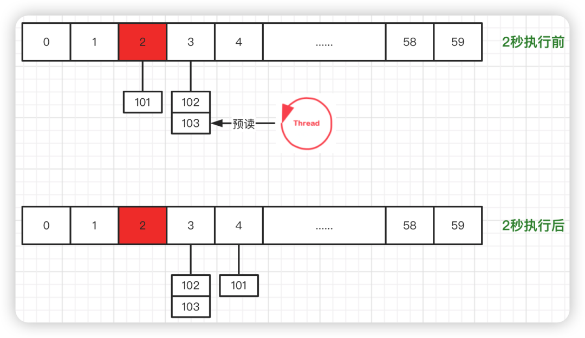

这样到了第 3 秒时刻，任务的数组下标又会被更新。

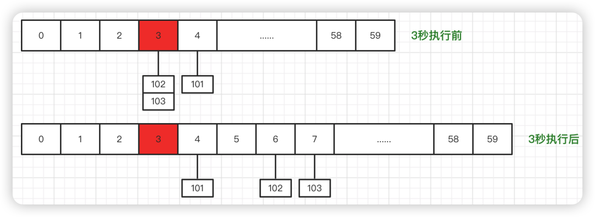

那么这种以秒为刻度的时间轮有没有误差呢？

任务调度的精准度是取决于时间轮的刻度的。举个例子，我们把 0 秒时刻的这 1s 拆成 1000ms。

假设任务都是在第 500ms 完成该时刻秒内所有任务的调度的，501ms 有一个新的任务被预读线程加载进来了，那么轮到下次调度，就要等到第 1 秒时刻的第 500ms，误差相差了一个刻度即 1s。如果以 0.5 秒为一个刻度，那么误差就变小了，是 500ms。

## 执行器注销

**主动注销**

主动注销的发起时机是在 Spring 容器正常关闭时，XXL-JOB 的执行器类 `XxlJobSpringExecutor` 实现了 `DisposableBean` 接口，这个接口提供了一个 `destory` 方法。

在后续的流程中，会停止 Netty 服务，中断探活线程，并向调度中心发送 `removeRegistry` 请求。

`stop` 的状态修改后，这里的探活循环就会停止，进而会调用到下面的 `registryRemove` 方法。

调度中心收到请求后，也会通过 `registryOrRemoveThreadPool` 线程池进行异步处理，最终将 `xxl_job_registry` 中对应的执行器信息删除掉。

**被动注销**

调度中心初始化时，会启动一个监控线程 `registryMonitorThread`，这个线程每 30 秒会触发一次探活操作（即每循环一次 sleep 30 秒），探活操作触发时会查询 `xxl_job_registry` 表中的数据，将 `update_time` 与当前时间的差值大于 90s 的数据查询出来，将这部分数据删掉掉。

把 `sleep` 的时间差也考虑进去的话，就是执行器在 **最多 120 秒** 内都没有发送新的注册请求来 **维持心跳** 的话，这个执行器就会被调度中心注销掉。

**心跳是怎么维持的呢？**

看了上面执行器发起注册的流程，大概也能猜到了，执行器里面的 `registryThread` 每 30 秒会调用一次调度中心的注册接口，调度中心收到请求后，更新 `update-time` 的值。

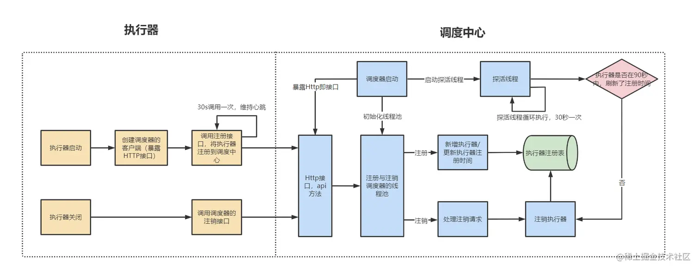

1. 调度中心启动了一个 Tomcat 作为 Web 容器，暴露出 **注册与注销** 的接口，可以供执行器调用。
2. 执行器在启动 Netty 服务暴露出调度接口后，将自己的 name、ip、端口信息通过调度中心的 **注册** 接口传输到调度中心，同时每 30 秒会调用一次注册接口，用于更新注册信息。
3. 同理，在执行器停止的时候，也会请求调度中心的 **注销** 接口，进行注销。
4. 调度中心在接收到 **注册或注销** 请求后，会操作 `xxl_job_registry` 表，新增或删除执行器的注册信息。
5. 调度中心会启动一个探活线程，将 90 秒都没有更新注册信息的执行器删除掉。

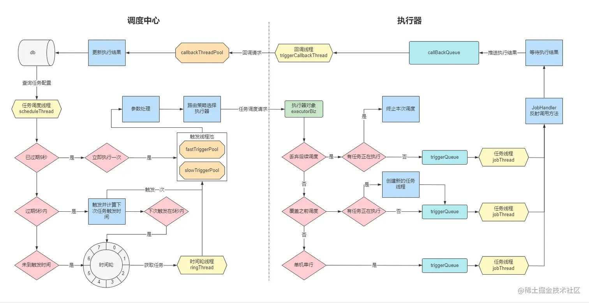
