## RocketMQ 生产者是如何发送消息的

### 创建 Topic 时为何要指定 MessageQueue 数量

要使用 RocketMQ，首先需要部署出一套 RocketMQ 集群。有了 RocketMQ 集群后，就可以根据业务需求创建出一些 Topic，比如用于存放订单支付成功消息的 Topic：OrderPaySuccess。

这些 Topic 可以通过 RocketMQ 可视化工作台来创建。在创建 Topic 时需要指定一个关键的参数——MessageQueue，表示指定这个 Topic 对应了多少个队列，也就是多少个 MessageQueue 数据分片。

### Topic、MessageQueue 和 Broker 之间的关系

比如现在有一个 Topic，已经为它指定创建了 4 个 MessageQueue，那么这个 Topic 的数据在 Broker 集群中是如何分布的呢？

由于每个 Topic 的数据都是分布式存储在多个 Broker 中的(如下图示)，而为了决定这个 Topic 的哪些数据放在这个 Broker 上、哪些数据放在那个 Broker 上，所以 RocketMQ 引入了 MessageQueue。

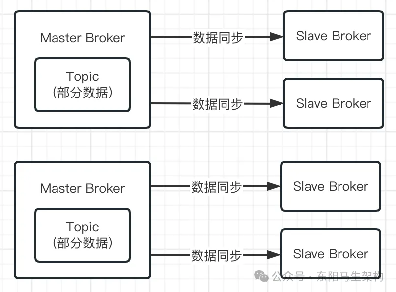

一个 MessageQueue 本质上就是一个数据分片。假设某个 Topic 有 1 万条数据，而且这个 Topic 有 4 个 MessageQueue，那么可以认为会在每个 MessageQueue 中放入 2500 条数据。当然这不是绝对的，有可能有的 MessageQueue 数据多，有的数据少，这要根据消息写入 MessageQueue 的策略来决定。如果假设每个 MessageQueue 会平均分配这个 Topic 的数据，那么每个 Broker 就会有两个 MessageQueue，如下图示：

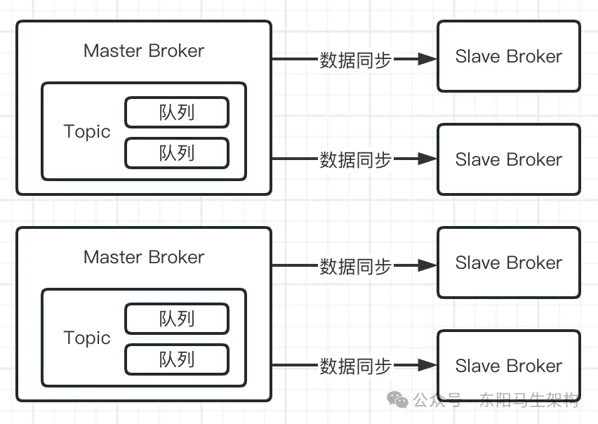

通过将一个 Topic 的数据拆分为多个 MessageQueue 数据分片，然后在每个 Broker 上都会存储一部分 MessageQueue 数据分片，这样就可以实现 Topic 数据的分布式存储

### 生产者发送消息时写入哪个 MessageQueue

由于生产者会和 NameServer 进行通信来获取 Topic 的路由数据，所以生产者可以从 NameServer 中得知：一个 Topic 有几个 MessageQueue、每个 MessageQueue 在哪台 Broker 机器上。

假设消息写入 MessageQueue 的策略是：生产者会均匀把消息写入每个 MessageQueue。也就是生产者发送 20 条数据出去，4 个 MessageQueue 都会各自写入 5 条数据。

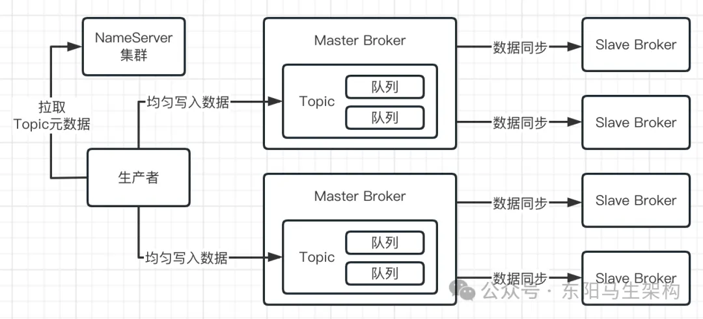

那么通过这个策略，就可以让生产者把写入请求分散给多个 Broker，可以让每个 Broker 都均匀分摊写入请求压力。如果单个 Broker 可以抗每秒 7 万并发，那么两个 Broker 就可以抗每秒 14 万并发，这样就实现了 RocketMQ 集群抗下每秒 10 万+超高并发。

另外，通过该策略可让一个 Topic 的数据分散在多个 MessageQueue 中，进而分散在多个 Broker 机器中，从而实现 RocketMQ 集群分布式存储海量的消息数据。

### 如果某个 Broker 出现故障了怎么办

如果某个 Broker 临时出现故障了，比如 Master Broker 挂了，那么需要等待其他 Slave Broker 自动热切换为 Master Broker，此时对这一组 Broker 来说就没有 Master Broker 可以写入了。

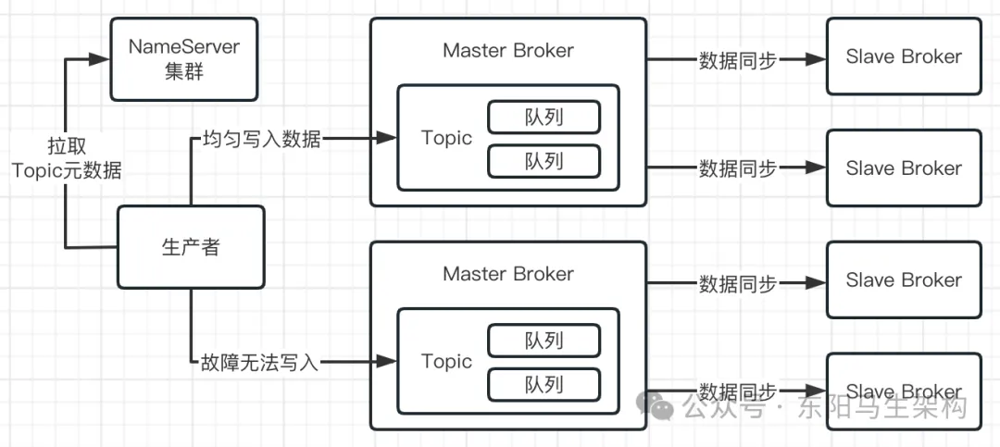

如果按照前面的策略来均匀把数据写入各个 Broker 上的 MessageQueue，那么会导致在一段时间内，每次访问到这个挂掉的 Master Broker 都会访问失败。对于这个问题，通常来说可以在 Producer 中开启一个开关，就是 sendLatencyFaultEnable。

一旦打开了这个开关，那么会有一个自动容错机制。如果某次访问一个 Broker 发现网络延迟有 500ms，然后还无法访问，那么就会自动回避访问这个 Broker 一段时间。比如在接下来 3000ms 内，就不会访问这个 Broker 了。

这样就可以避免一个 Broker 故障后，短时间内生产者频繁发送消息到这个故障的 Broker 上去，出现较多次数的异常。通过 sendLatencyFaultEnable 开关，生产者会自动回避一段时间不去访问故障的 Broker，过段时间再去进行访问。因为过一段时间后，这个故障的 Master Broker 就已经恢复好了，它的 Slave Broker 已切换为 Master 可以正常工作了。

## Broker 是如何持久化接收到的消息到磁盘上

### 为什么 Broker 的数据存储机制是 MQ 的核心

实际上类似 RocketMQ、Kafka、RabbitMQ 的消息中间件系统，它们不只是简单提供写入消息和获取消息的功能，它们还提供强大的数据存储能力，能把亿万级的海量消息存储在自己的服务器磁盘上。

这样各种不同的系统从 MQ 中消费消息时，才可以从 MQ 服务器的磁盘中读取到自己需要的消息。如果 MQ 不在机器磁盘上存储大量消息，而是放在内存里，那么要么内存放不下、要么机器重启后内存里的消息数据丢失。

所以 Broker 数据存储是 MQ 的核心，它决定了生产者写入消息的吞吐量、决定了消息不能丢失、决定了消费者获取消息的吞吐量。

### Broker 收到的消息会顺序写入 CommitLog

当生产者的消息发送到一个 Broker 上时，Broker 会对这个消息做什么事情？

首先 Broker 会把这个消息顺序写入磁盘上的一个日志文件 CommitLog，也就是直接追加写入这个日志文件的末尾。一个 CommitLog 日志文件限定最多 1GB，如果一个 CommitLog 日志文件写满了 1GB，就会创建另一个新的 CommitLog 日志文件。所以，磁盘上会有很多个 CommitLog 日志文件。

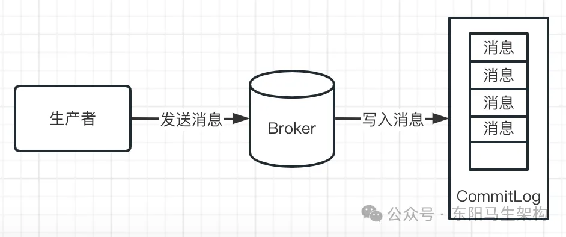

### MessageQueue 在 ConsumeQueue 目录下的物理存储位置

一个 Topic 的数据会分布式存储在多个 Broker 中，为了决定这个 Topic 的哪些数据应该放在哪个 Broker 上，RocketMQ 引入了 MessageQueue。通过将一个 Topic 的数据拆分为多个 MessageQueue 数据分片，然后在每个 Broker 上都会存储一部分 MessageQueue 数据分片，从而实现 Topic 数据的分布式存储。

如果这个 Broker 收到的消息都是写入到 CommitLog 日志文件中进行存储的，那么 MessageQueue 到底体现在哪里？

其实在一个 Broker 中，它存储的某个 Topic 的一部分 MessageQueue 会有一系列如下格式的 ConsumeQueue 文件：

```bash
$HOME/store/consumequeue/{topic}/{queueId}/{fileName}
```

这个格式的含义是：由于每个 Topic 在一台 Broker 上都会有一些 MessageQueue，所以{topic}指代的就是某个 Topic，{queueId}指代的就是某个 MessageQueue。然后对于存储在这台 Broker 机器上的 Topic 下的一个 MessageQueue，它会有很多个 ConsumeQueue 文件。这个 ConsumeQueue 文件里存储的是一条消息对应在 CommitLog 文件中的 offset 偏移量。

假设有一个 Topic，它有 4 个 MessageQueue 在两台 Broker 机器上，那么每台 Broker 机器会存储两个 MessageQueue 文件。此时如果生产者选择对其中一个 MessageQueue 发起写入消息的请求，那么消息会发送到其中一个 Broker 上，然后这个 Broker 首先会把消息写入到 CommitLog 文件中。

下图加入了两个 ConsumeQueue，其中 ConsumeQueue0 和 ConsumeQueue1 分别对应着 Topic 里的 MessageQueue0 和 MessageQueue1。也就是这个 Topic 的 MessageQueue0 和 MessageQueue1 就放在这个 Broker 机器上，而且每个 MessageQueue 此时在磁盘上就对应着一个 ConsumeQueue，即 MessageQueue0 对应着该 Broker 磁盘上的 ConsumeQueue0，MessageQueue1 对应着该 Broker 磁盘上的 ConsumeQueue1。

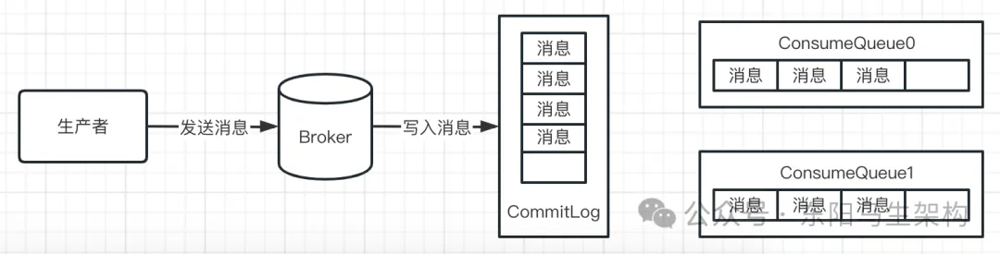

接着假设这个 Topic 的名字叫：TopicOrderPaySuccess，那么此时在这个 Broker 的磁盘上应该有如下两个路径的文件：

```bash
$HOME/store/consumequeue/TopicOrderPaySuccess/MessageQueue0/ConsumeQueue0磁盘文件；
$HOME/store/consumequeue/TopicOrderPaySuccess/MessageQueue1/ConsumeQueue1磁盘文件；
```

当这个 Broker 收到一条消息并首先写入到一个 CommitLog 文件后，就会将这条消息在这个 CommitLog 文件中的物理位置，也就是文件偏移量 offset，写入到这条消息所属的 MessageQueue 对应的 ConsumeQueue 文件中。

比如现在生产者发送一条消息给 MessageQueue0，此时 Broker 就会将这条消息在 CommitLog 日志文件中的 offset 偏移量，写入到 MessageQueue0 对应的 ConsumeQueue0 中。所以 ConsumeQueue0 中存储的是：一条消息在 CommitLog 文件中的物理位置(即 offset 偏移量)，也可以理解 ConsumeQueue 中的一个物理位置其实是对 CommitLog 文件中一条消息的地址引用。

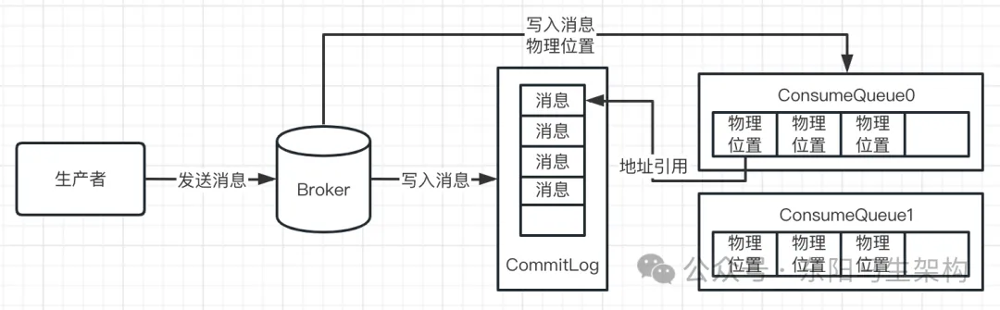

此外，在 ConsumeQueue 中存储的不只是消息在 CommitLog 中的 offset 偏移量，还会包含消息的长度、Tag、HashCode。ConsumeQueue 中的一条数据是 20 字节，每个 ConsumeQueue 文件会保存 30 万条数据，所以每个文件大概是 5.72MB。

所以，Topic 的每个 MessageQueue 都对应了 Broker 机器上的多个 ConsumeQueue 文件，ConsumeQueue 文件中保存了对应 MessageQueue 的所有消息在 CommitLog 文件中的物理位置(即 offset 偏移量)。

### 如何让消息写入 CommitLog 文件时的性能几乎等于往内存写入消息时的性能

生产者把消息写入到 Broker 时，Broker 会直接把消息写入磁盘上的 CommitLog 文件，那么 Broker 是如何提升整个过程的性能的呢？

这部分的性能提升会直接提升 Broker 处理消息写入的吞吐量。假设写入一条消息到 CommitLog 文件需要 10ms，每个线程每秒可以处理 100 个写入消息的请求，那么 100 个线程每秒只能处理 1 万个写入消息的请求。但是如果把写入一条消息到 CommitLog 文件的性能优化为只需要 1ms，那么每个线程每秒可以处理 1000 个写入消息的请求，100 个线程每秒就可以处理 10 万个写入消息的请求。所以可以明显看到，Broker 把接收到的消息写入 CommitLog 文件的性能，对 RocketMQ 的 TPS 有很大的影响。

RocketMQ 中的 Broker 会基于 OS 操作系统的 PageCache 和顺序写来提升往 CommitLog 文件写入消息的性能。

首先，Broker 会以顺序的方式将消息写入到 CommitLog 文件，也就是每次写入时就是在文件末尾追加一条数据即可，对文件进行顺序写的性能要比随机写的性能高得多。

然后，数据写入 CommitLog 文件时，不是直接写入底层的物理磁盘文件，而是先进入 OS 的 PageCache 内存缓存，然后再由 OS 的后台线程选一个时间，通过异步的方式将 PageCache 内存缓冲中的数据刷入到 CommitLog 磁盘文件。

如下图示，数据先写入 OS 的 PageCache 缓存，然后再由 OS 自己的线程将缓存里的数据刷入磁盘中。所以采用磁盘文件顺序写 + OS PageCache 写入 + OS 异步刷盘策略，可以让消息写入 CommitLog 的性能跟写入内存里是差不多的，从而让 Broker 能高吞吐地处理每秒大量的消息写入请求。

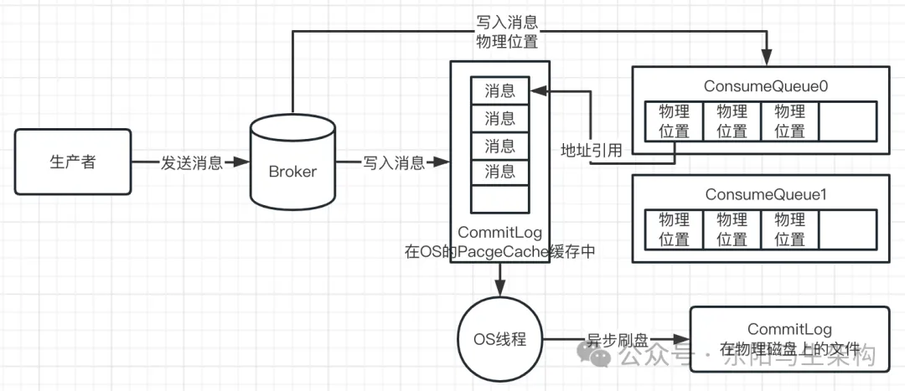

### 同步刷盘与异步刷盘

如果采用上述模式，也就是异步刷盘的模式，生产者把消息发送给 Broker 后，Broker 会将消息写入 OS 的 PageCache 中，然后就直接返回 ACK 给生产者了，此时生产者就会认为消息写入成功了。

虽然生产者认为消息写入成功，但实际上该消息此时是在 Broker 机器上的 OS 的 PageCache 中。如果此时 Broker 机器直接宕机，就会导致在 PageCache 中的这条消息丢失。所以，异步刷盘模式虽然可以让消息写入的吞吐量非常高，但会有数据丢失的风险。

如果使用同步刷盘的模式，那么生产者发送一条消息给 Broker 时，Broker 会直接把消息刷入到磁盘文件中，然后才返回 ACK 给生产者，此时生产者才知道消息写入成功。只要消息进入了磁盘文件，除非磁盘坏了，否则数据就不会丢失。

如果 Broker 还没有来得及把数据同步刷入磁盘，自己就挂了。那么生产者就会感知到消息发送失败，然后会不停地进行重试发送，直到有 Slave Broker 切换成 Master Broker 可以重新写入消息，从而保证消息数据不丢失。

如果强制每次消息写入都要直接刷入磁盘，那么必然会导致每条消息的写入性能急剧下降，从而导致消息写入的吞吐量急剧下降。

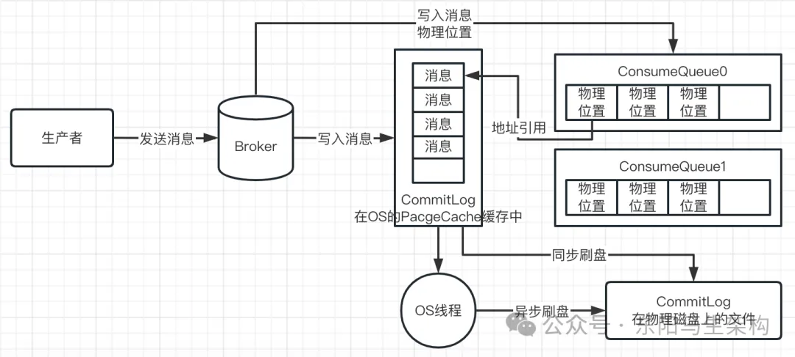

## 基于 DLedger 技术的 Broker 主从同步原理

### Broker 的高可用架构原理

介绍完 Broker 的数据存储原理后，接下来说明：Broker 接收到消息写入请求后，是如何将消息同步给其他 Broker 做多副本冗余的。

Producer 发送消息到 Broker 后，Broker 首先会将消息写入到 CommitLog 文件中，然后会将这条消息在这个 CommitLog 文件中的文件偏移量 offset，写入到这条消息所属的 MessageQueue 对应的 ConsumeQueue 文件中。

如果要让 Broker 实现高可用，那么必须要有一组 Broker：一个 Leader Broker 写入数据，两个 Follower Broker 备份数据。当 Leader Broker 接收到写入请求写入数据后，直接把数据同步给其他的 Follower Broker。这样，一条数据就会在三个 Broker 上有三份副本。此时如果 Leader Broker 宕机，那么就让其他 Follower Broker 自动切换为新的 Leader Broker，继续接收写入请求。

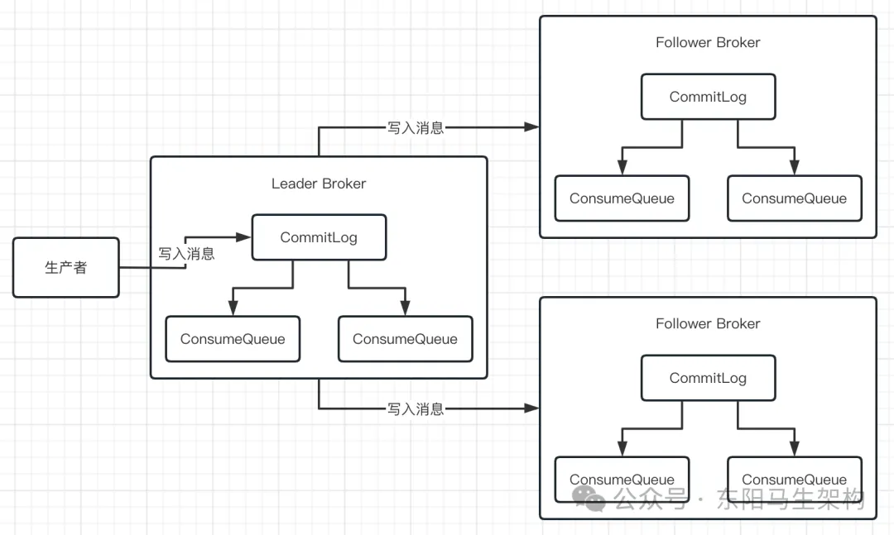

### 基于 DLedger 技术替换 Broker 的 CommitLog

其实，Broker 的上述高可用架构就是基于 DLedger 技术来实现的。所以，接下来先介绍 DLedger 技术可以干什么。

DLedger 技术也有一个 CommitLog 机制。把数据交给 DLedger，DLedger 就会将数据写入 CommitLog 文件里。所以，如果基于 DLedger 技术来实现 Broker 高可用架构，实际上就是由 DLedger 来管理 CommitLog，替换掉原来由 Broker 自己来管理 CommitLog。

同时，使用 DLedger 来管理 CommitLog 后，Broker 还是可以基于 DLedger 管理的 CommitLog 去构建出各个 ConsumeQueue 文件的。


### DLedger 如何基于 Raft 协议选举 Leader

既然会使用 DLedger 替换各个 Broker 上的 CommitLog 管理组件，那么每个 Broker 上都会有一个 DLedger 组件。如果我们配置了一组 Broker，比如有 3 台机器，那么 DLedger 会如何从 3 台机器里选举出一个 Leader 呢？DLedger 是基于 Raft 协议来进行 Leader Broker 选举的，那么 Raft 协议中是如何进行多台机器的 Leader 选举的呢？

这需要通过三台机器互相投票，然后选出一个 Broker 作为 Leader。简单来说，三台 Broker 机器启动时，都会给自己投票选自己作为 Leader，然后把这个投票发送给其他 Broker。

比如 Broker01、Broker02、Broker03 各自先投票给自己，然后再把自己的投票发送给其他 Broker。在第一轮选举中，每个 Broker 收到所有投票后发现，每个 Broker 都在投票给自己，所以第一轮选举是失败的。

接着每个 Broker 都会进入一个随机时间的休眠，比如 Broker01 休眠 3 毫秒，Broker02 休眠 5 毫秒，Broker03 休眠 4 毫秒。假设 Broker01 先苏醒过来，那么当它苏醒过来后，就会继续尝试投票给自己，并且将自己的投票发送给其他 Broker。

接着 Broker03 休眠 4 毫秒后苏醒，它发现 Broker01 已经发来了一个投票是投给 Broker01 的。此时因为它自己还没有开始投票，所以会尊重别人的选择，直接把票投给 Broker01 了，同时把自己的投票发送给其他 Broker。

接着 Broker02 休眠 5 毫秒后苏醒，它发现 Broker01 投票给 Broker01，Broker03 也投票给 Broker01，而此时它自己还没有开始投票，于是也会把票投给 Broker01，并且把自己的投票发送给给其他 Broker。

最后，所有 Broker 都会收到三张投票，都是投给 Broker01 的，那么 Broker01 就会当选成为 Leader。其实只要有(3 / 2) + 1 个 Broker 投票给某个 Broker，那么就会选举该 Broker 为 Leader，这个半数加 1 就是大多数的意思。

以上就是 Raft 协议中选举 Leader 算法的简单描述。

Raft 协议确保可以选出 Broker 成为 Leader 的核心设计就是：当一轮选举选不出 Leader 时，就让各 Broker 进行随机休眠，先苏醒过来的 Broker 会投票给自己，其他 Broker 苏醒后会收到发来的投票，然后根据这些投票也把票投给那个 Broker。这样，依靠这个随机休眠的机制，基本上可以快速选举出一个 Leader。

**总结：** 在三台 Broker 机器刚启动时，就是靠基于 Raft 协议的 DLedger 来实现 Leader 选举的。当选举出一个 Broker 成为 Leader 后，其他 Broker 就是 Follower 了。只有 Leader 可以处理数据写入请求，Follower 只能处理 Leader 的同步数据请求或者 Leader 高负载下的消费者拉取数据请求。

### DLedger 如何基于 Raft 协议进行多副本同步

Leader Broker 收到数据写入请求后，会由 DLedger 把数据同步给其他 Follower Broker。其中，数据同步会分为两个阶段：一是 uncommitted 阶段，二是 commited 阶段。

首先 Leader Broker 上的 DLedger 会将数据标记为 uncommitted 状态，然后通过自己的 DLedgerServer 把 uncommitted 状态的数据发送给 Follower Broker 的 DLedgerServer。接着 Follower Broker 的 DLedger 的 DLedgerServer 收到 uncommitted 状态的数据后，会返回一个 ACK 给 Leader Broker 的 DLedger 的 DLedgerServer。

如果 Leader Broker 收到超过半数的 Follower Broker 返回 ACK，那么就将数据标记为 committed 状态。然后 Leader Broker 的 DLedger 的 DLedgerServer 就会发送 commited 状态的数据给 Follower Broker 的 DLedger 的 DLedgerServer，让它们也把数据标记为 comitted 状态。

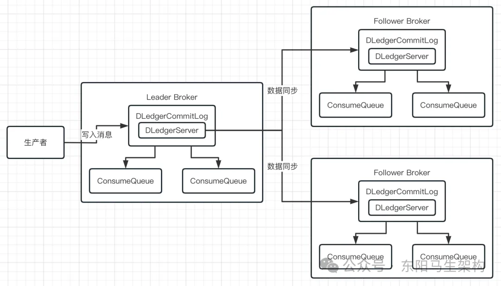

### 如果 Leader Broker 崩溃了怎么办

对于高可用的 Broker 架构而言，无论是写入 CommitLog 日志，还是多副本同步数据，都是由 DLedger 来实现的。

如果 Leader Broker 挂了，那么剩下的两个 Follower Broker 就会重新发起选举。它们会由 DLedger 基于 Raft 协议选举出一个新的 Leader Broker 继续对外提供服务，而且会对没有完成数据同步的 Follower Broker 进行恢复性操作，保证数据不丢失。

### 采用 Raft 协议同步数据是否会影响 TPS

使用 DLedger 技术管理 CommitLog 后，可以自动在一组 Broker 中选举出一个 Leader。然后在 Leader 接收消息写入请求时，会基于 DLedger 技术将消息写入到本地 CommitLog 中，这个和 Broker 自己写入 CommitLog 没什么区别。

但有区别的是：Leader Broker 上的 DLedger 收到消息写入请求，将 uncommitted 消息写入到本地存储后，还需要基于 Raft 协议，采用两阶段的方式把 uncommitted 消息同步给其他 Follower Broker，而且必须要超半数的 Follower Broker 的 DLedger 对 uncommitted 消息返回 ACK，此时 Leader Broker 才能返回 ACK 给生产者。

那么不需要等待 Follower Broker 它们执行完 commit 操作后，Leader Broker 再返回 ACK 给生产者吗？

实际上只要有超过半数的 Follower Broker 都写入 uncommitted 消息后，就可以返回 ACK 给生产者了。哪怕此时 Leader Broker 宕机，超过半数的 Follower Broker 上也是有这个消息的，只不过是 uncommitted 状态。但新选举的 Leader Broker 可以根据剩余 Follower Broker 上该消息的状态去进行数据恢复，比如把消息状态调整为 committed。

也就是说，这样的架构对每次写入都增加了一个成本：每次写入都必须有超过半数的 Follower Broker 都写入消息才可以算做一次写入成功。这样做确实会对 Leader Broker 的写入性能产生影响而降低 TPS，但并不是必须要在所有场景都这么做。

## 消费者进行消息拉取和消费的过程

### 什么是消费者组

消费者组的意思就是给一组消费者起一个名字。比如有一个 Topic 叫 TopicOrderPaySuccess，库存系统、积分系统、营销系统、仓储系统都要去消费这个 Topic 中的消息，那么此时就应该给这四个系统分别起一个消费者组名字，如下所示：

```undefined
stock_consumer_group、marketing_consumer_group、
credit_consumer_group、wms_consumer_group
```

设置消费者组的方式是在代码里进行的，如下所示：

```java
DefaultMQPushConsumer consumer = new DefaultMQPushConsumer("stock_consumer_group");
```

假设库存系统部署了 4 台机器，每台机器上的消费者组的名字都是 stock_consumer_group，那么这 4 台机器就同属于一个消费者组。以此类推，每个系统的几台机器都是属于各自的消费者组。

下图展示了两个系统，每个系统都有 2 台机器，每个系统都有一个自己的消费者组。

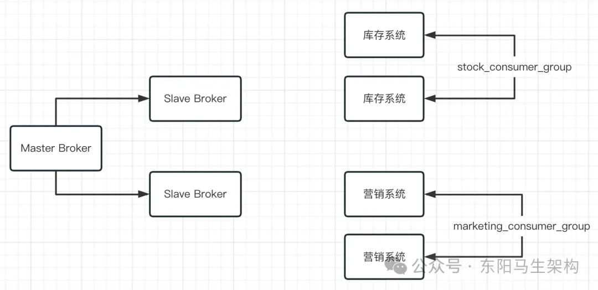

### 不同消费者组之间的关系

假设库存系统和营销系统作为两个消费者组，都订阅了 TopicOrderPaySuccess 这个订单支付成功消息的 Topic，此时如果订单系统作为生产者发送了一条消息到这个 Topic，那么这条消息会被如何消费呢？

一般情况下，这条消息进入 Broker 后，库存系统和营销系统作为两个消费者组，每个组都会拉取到这条消息。也就是说，这个订单支付成功的消息，库存系统会获取到一条，营销系统也会获取到一条，它们俩都会获取到这条消息。

但库存系统这个消费者组里有两台机器，是两台机器都获取到这条消息、还是只有一台机器会获取到这条消息？

一般情况下，库存系统的两台机器中只有一台机器会获取到这条消息，营销系统也是同理。

下图展示了对于同一条订单支付成功的消息，库存系统的一台机器获取到了、营销系统的一台机器也获取到了。所以在消费时，不同的系统应该设置不同的消费者组。如果不同的消费者组订阅了同一个 Topic，对 Topic 里的同一条消息，每个消费者组都会获取到这条消息。

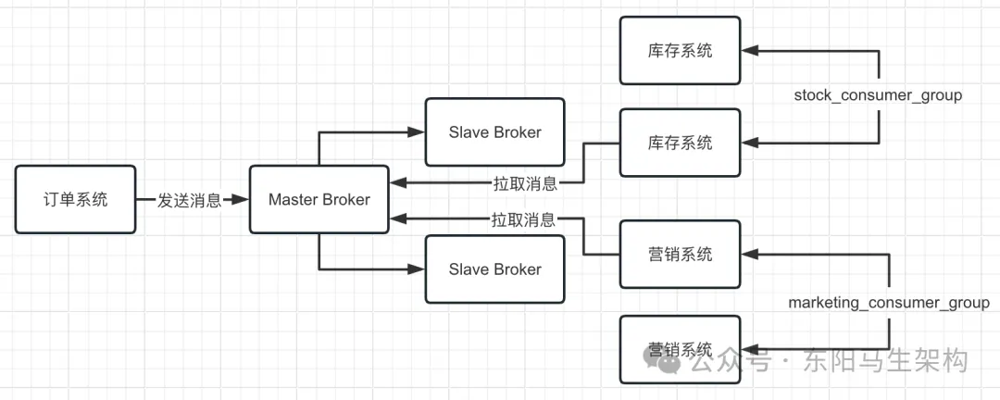

### 集群模式消费 vs 广播模式消费

对于一个消费者组而言，它获取到一条消息后，如果消费者组内部有多台机器，到底是只有一台机器可以获取到这个消息，还是每台机器都可以获取到这个消息？这就是集群模式和广播模式的区别。

默认情况下都是集群模式：即一个消费者组获取到一条消息，只会交给组内的一台机器去处理，不是每台机器都可以获取到这条消息的。

但是可以通过如下设置来改变为广播模式：

```scss
consumer.setMessageModel(MessageModel.BROADCASTING);
```

如果修改为广播模式，那么对于消费者组获取到的一条消息，组内每台机器都可以获取到这条消息。但是相对而言，广播模式用的很少，基本上都是使用集群模式来进行消费的。

### MessageQueue 和 ConsumeQueue 以及 CommitLog 之间的关系

在创建 Topic 时，需要设置 Topic 有多少个 MessageQueue。Topic 中的多个 MessageQueue 会分散在多个 Broker 上，一个 Broker 上的一个 MessageQueue 会有多个 ConsumeQueue 文件。但在一个 Broker 的运行过程中，一个 MessageQueue 只会对应一个 ConsumeQueue 文件。

对于 Broker 而言，存储在一个 Broker 上的所有 Topic 的所有 MessageQueue 数据都会写入一个统一的 CommitLog 文件，一个 Broker 收到的所有消息都会往 CommitLog 文件里面写。 

对于 Topic 的各个 MessageQueue 而言，则是通过各个 ConsumeQueue 文件来存储属于 MessageQueue 的消息在 CommitLog 文件中的物理地址(即 offset 偏移量)。

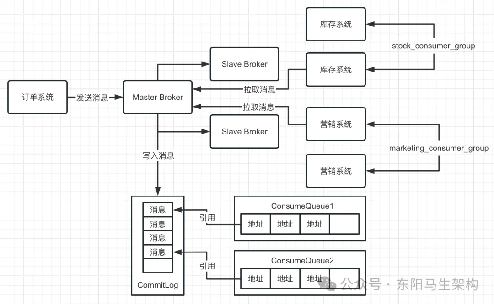

### MessageQueue 与消费者的关系

一个 Topic 上的多个 MessageQueue 是如何让一个消费者组中的多台机器来进行消费的？可以简单理解为，它会均匀将 MessageQueue 分配给消费者组的多台机器来消费。

举个例子，假设 TopicOrderPaySuccess 有 4 个 MessageQueue，这 4 个 MessageQueue 分布在两个 Master Broker 上，每个 Master Broker 上有 2 个 MessageQueue。然后库存系统作为一个消费者组，库存系统里有两台机器。那么正常情况下，最好就是让这两台机器各自负责 2 个 MessageQueue 的消费。比如库存系统的机器 01 从 Master Broker01 上消费 2 个 MessageQueue，库存系统的机器 02 从 Master Broker02 上消费 2 个 MessageQueue。这样就可以把消费的负载均摊到两台 Master Broker 上。

所以大致可以认为一个 Topic 的多个 MessageQueue 会均匀分摊给消费者组内的多个机器去消费。

这里的一个原则是：一个 MessageQueue 只能被一个消费者机器去处理，但是一台消费者机器可以负责多个 MessageQueue 的消息处理。

### 一般选择 Push 消费模式

既然一个消费者组内的多台机器会分别负责一部分 MessageQueue 的消费的，那么每台机器都必须要连接到对应的 Broker，尝试消费里面 MessageQueue 对应的消息。于是就涉及到两种消费模式了，一个是 Push 模式、一个是 Pull 模式。

这两个消费模式本质上是一样的，都是消费者机器主动发送请求到 Broker 机器去拉取一批消息来处理。

Push 消费模式是基于 Pull 消费模式来实现的，只不过它的名字叫做 Push 而已。在 Push 模式下，Broker 会尽可能实时把新消息交给消费者进行处理，它的消息时效性会更好。

一般我们使用 RocketMQ 时，消费模式通常都选择 Push 模式，因为 Pull 模式的代码写起来更加复杂和繁琐，而且 Push 模式底层本身就是基于 Pull 模式来实现的，只不过时效性更好而已。

### Push 消费模式的实现思路

当消费者发送请求到 Broker 去拉取消息时，如果有新的消息可以消费，那么就马上返回一批消息给消费者处理。消费者处理完之后，会接着发送请求到 Broker 机器去拉取下一批消息。

所以，消费者机器在 Push 模式下处理完一批消息，会马上发起请求拉取下一批消息，消息处理的时效性非常好，看起来就像 Broker 一直不停地推送消息到消费机器一样。

此外，Push 模式下有一个请求挂起和长轮询的机制：当拉取消息的请求发送到 Broker，Broker 却发现没有新的消息可以处理时，就会让处理请求的线程挂起，默认是挂起 15 秒。然后在挂起期间，Broker 会有一个后台线程，每隔一会就检查一下是否有新的消息。如果有新的消息，就主动唤醒被挂起的请求处理线程，然后把消息返回给消费者。

可见，常见的 Push 消费模式，本质也是消费者不断发送请求到 Broker 去拉取一批一批的消息。

### Broker 如何读取消息返回给消费者

Broker 在收到消费者的拉取请求后，是如何将消息读取出来，然后返回给消费者的？这涉及到 ConsumeQueue 和 CommitLog。

假设一个消费者发送了拉取请求到 Broker，表示它要拉取 MessageQueue0 中的消息，然后它之前都没拉取过消息，所以就从这个 MessageQueue0 中的第一条消息开始拉取。

于是，Broker 就会找到 MessageQueue0 对应的 ConsumeQueue0，从里面找到第一条消息的 offset。接着 Broker 就需要根据 ConsumeQueue0 中找到的第一条消息的 offset，去 CommitLog 中根据这个 offset 读取出这条消息的数据，然后把这条消息的数据返回给消费者。

所以消费者在消费消息时，本质就是：首先根据要消费的 MessageQueue 以及开始消费的位置，去找到对应的 ConsumeQueue。然后在 ConsumeQueue 中读取要消费的消息在 CommitLog 中的 offset 偏移量。接着到 CommitLog 中根据 offset 读取出完整的消息数据，最后将完整的消息数据返回给消费者。

### 消费者处理消息、进行 ACK 响应和提交消费进度

消费者拉取到一批消息后，就会将这批消息传入注册的回调函数，如下所示：

```java
consumer.registerMessageListener(new MessageListenerConcurrently() {
    @Override
    public ConsumeConcurrentlyStatus consumeMessage(List<MessageExt> msgs, ConsumeConcurrentlyContext context) {
        //处理消息
        //标记该消息已经被成功消费
        return ConsumeConcurrentlyStatus.CONSUME_SUCCESS;    
    }
});
```

当消费者处理完这批消息后，消费者就会提交目前的一个消费进度到 Broker 上，然后 Broker 就会存储消费者的消费进度。

比如现在对 ConsumeQueue0 的消费进度就是在 offset = 1 的位置，那么 Broker 会记录下一个 ConsumeOffset 来标记该消费者的消费进度。这样下次这个消费者组只要再次拉取这个 ConsumeQueue 的消息，就可以从 Broker 记录的消费位置开始继续拉取，不用重头开始拉取了。

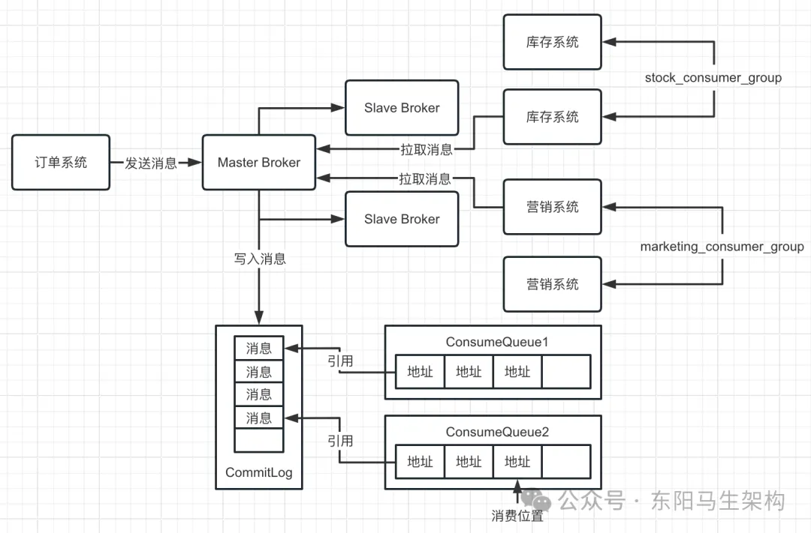

### 消费者组出现宕机或扩容应如何处理

此时会进入一个 Rebalance 环节，也就是重新给各个消费者分配各自需要处理的 MessageQueue。

比如现在机器 01 负责 MessageQueue0 和 MessageQueue1，机器 02 负责 MessageQueue2 和 MessageQueue3。如果现在机器 02 宕机了，那么机器 01 就会接管机器 02 之前负责的 MessageQueue2 和 MessageQueue3。如果此时消费者组加入了一台机器 03，那么就可以把机器 02 负责的 MessageQueue3 转移给机器 03，然后机器 01 只负责一个 MessageQueue2 的消费，这就是负载重平衡。

## 消费者从 Master 或 Slave 上拉取消息的策略

### 消费者什么时候会从 Slave Broker 上拉取消息

Broker 在实现高可用架构时会有主从之分。消费者可以从 Master Broker 上拉取消息，也可以从 Slave Broker 上拉取消息，具体要看 Master Broker 的机器负载。

刚开始消费者都是连接到 Master Broker 机器去拉取消息的，然后如果 Master Broker 机器觉得自己负载比较高，就会告诉消费者下次可以去 Slave Broker 拉取消息。

### CommitLog 会基于 PageCache 提升写性能

当 Broker 收到一个消息写入请求时，首先会把消息写入到 OS 的 PageCache，然后 OS 会有后台线程过一段时间后异步把 OS 的 PageCache 中的消息刷入 CommitLog 磁盘文件中。

依靠这个将消息写入 CommitLog 时先进入 OS 的 PageCache 而不是直接写入磁盘的机制，才可以实现 Broker 写 CommitLog 文件的性能是内存写级别的，才可以实现 Broker 超高的消息写入吞吐量。

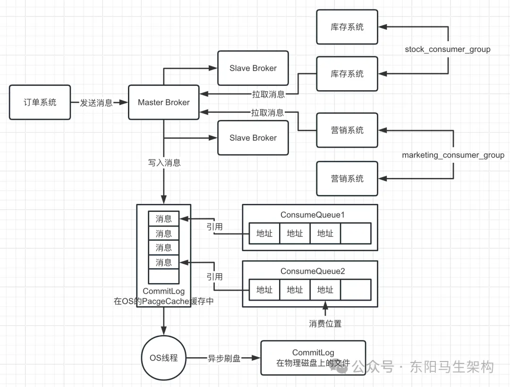

### ConsumeQueue 会基于 PageCache 提升性能

当消费者发送大量请求给 Broker 高并发读取消息时，Broker 的 ConsumeQueue 文件的读操作就会变得非常频繁，而且会极大影响消费者拉取消息的性能和吞吐量。因此，ConsumeQueue 同样也会基于 OS 的 PageCache 来进行优化。即向 Broker 的 ConsumeQueue 文件写入消息时，会先写入 OS 的 PageCache。而且 OS 自己也有一个优化机制，就是读取一个磁盘文件的某数据时会自动把整个磁盘文件的数据缓存到 OS 的 PageCache 中。

由于 ConsumeQueue 文件主要用来存放消息的 offset，所以每个 ConsumeQueue 文件是很小的，30 万条消息的 offset 也就 5.72MB 而已。因此 ConsumeQueue 文件不会占用多少空间，它们整体的数据量很小，完全可以被缓存在 PageCache 中。

这样，当消费者拉取消息时，Broker 就可以直接到 OS 的 PageCache 里读取 ConsumeQueue 文件里的内容，其读取性能与读内存时的性能是一样的，从而保证了消费消息时的高性能以及高吞吐。

### CommitLog 基于 PageCache + 磁盘来一起读

当消费者拉取消息时，首先会读 OS 的 PageCache 里的少量 ConsumeQueue 数据，这时的性能是极高的，然后会根据读取到的 offset 去 CommitLog 文件里读取完整的消息数据。那么从 CommitLog 文件里读取完整的消息数据时，既会从 OS 的 PageCache 里读取，也会从磁盘里读取。

由于 CommitLog 文件是用来存放消息的完整数据的，所以它的数据量会很大。毕竟一个 CommitLog 文件就有 1GB，所以整体可能多达几个 TB。这么多的 CommitLog 数据，不可能都放在 OS 的 PageCache 里。因为 OS 的 PageCache 用的也是机器的内存，一般也就几十个 GB 而已。何况 Broker 自身的 JVM 也要用一些内存，那么留给 OS 的 PageCache 的内存就只有一部分罢了，比如 10GB~20GB。所以是无法把 CommitLog 的全部数据都放在 OS 的 PageCache 里来提升消息者拉取时的性能的。

也就是说，CommitLog 主要是利用 OS 的 PageCache 来提升消息的写入性能。当 Broker 不停写入消息时，会先往 OS 的 PageCache 里写，这里可能会累积 10GB~20GB 的数据。之后 OS 会自动把 PageCache 里比较旧的一些数据刷入到 CommitLog 文件，以腾出空间给新写入的消息。

因此有这样的结论：当消费者向 Broker 拉取消息时，可以轻松从 OS 的 PageCache 里读取到少量 ConsumeQueue 文件里的 offset，这时候的性能是极高的。但当 Broker 去 CommitLog 文件里读取完整消息数据时，那么就会有两种可能。

第一种可能：如果读取的是刚刚写入 CommitLog 文件的消息，那么这些消息大概率还停留在 OS 的 PageCache 中。此时 Broker 可以直接从 OS 的 PageCache 里读取完整的消息数据，这时是内存读取，性能会很高。

第二种可能：如果读取的是较早之前写入 CommitLog 文件的消息，那么这些消息可能早就被刷入磁盘了，已经不在 OS 的 PageCache 里了。此时 Broker 只能从 CommitLog 文件里读取完整的消息数据了，这时的性能是比较差的。

### 何时从 PageCache 读以及何时从磁盘读

如果消费者一直在快速地拉取和消费消息，紧紧的跟上生产者往 Broker 写入消息的速度，那么消费者每次拉取时几乎都是在拉取最近刚写入 CommitLog 的消息，这些消息的数据几乎都可以从 OS 的 PageCache 里读取到。

如果 Broker 的负载很高导致消费者拉取消息的速度很慢，或者消费者拉取到一批消息后处理的性能很低导致处理速度很慢，那么都会导致消费者拉取消息的速度跟不上生产者写入消息的速度。

比如生产者都已经写入 10 万条消息了，结果消费者才拉取 2 万条消息进行消费。此时可能有 5 万条最新的消息是在 OS 的 PageCache 里，有 3 万条还没拉取去消费的消息只在磁盘里的 CommitLog 文件了。那么当消费者再拉取消息时，必然大概率需要从磁盘里的 CommitLog 文件中读取消息。接着，之前在 OS 的 PageCache 里的 5 万条消息可能又被刷入磁盘了，取而代之的是更加新的几万条消息在 OS 的 PageCache 里。当消费者再次拉取时，又会从磁盘里的 CommitLog 文件中读取那 5 万条消息，从而形成恶性循环。

### Master Broker 什么时候会让消费者从 Slave Broker 拉取消息

假设 Broker 已经写入了 10 万条消息，但是消费者仅仅拉取了 2 万条消息进行消费。那么下次消费者拉取消息时，会从第 2 万零 1 条数据开始继续往后拉取，此时 Broker 还有 8 万条消息是没有被拉取。

然后 Broker 知道最多还可以往 OS 的 PageCache 里放入多少条消息，比如最多也只能放 5 万条消息。这时候消费者过来拉取消息，Broker 发现该消费者还有 8 万条消息没有拉取，而这 8 万是大于内存最多存放的 5 万。因此 Broker 便知肯定有 3 万条消息目前是在磁盘上的，而不在 OS 的 PageCache 内存里。于是，在这种情况下，Broker 就会告诉消费者，这次会给它从磁盘里读取 3 万条消息，但下次消费者要去 Slave Broker 拉取消息了。

其实这个问题的本质就是：将消费者当前没有拉取的消息数量和 Broker 最多可以存放在 OS 的 PageCache 内存里的消息数量进行对比，如果消费者没拉取的消息总大小超过了最大能使用的 PageCache 内存大小，那么说明后续 Broker 会频繁从磁盘中加载数据，于是此时 Broker 就会通知消费者下次要从 Slave Broker 加载数据了。

## RocketMQ 如何基于 Netty 进行高性能网络通信

### Reactor 主线程与长短连接

首先，Broker 有一个 Reactor 主线程，这个线程会负责监听一个网络端口，比如监听个 2888，39150 这样的端口。接着，假设有一个 Producer 现在想要跟 Broker 建立一个 TCP 长连接。

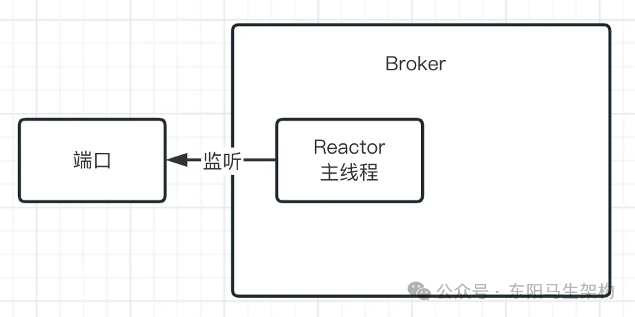

什么是短连接：

如果要向对方发送一个请求，必须要建立连接 -> 发送请求 -> 接收响应 -> 断开连接。下一次要向对方发送请求时，这个过程得重新来一遍。每次建立一个连接后，使用这个连接发送请求的时间是很短的，很快就会断开连接，由于存在时间太短，便叫短连接。

什么是长连接：

如果要发送一个请求，必须要建立一个连接 -> 发送请求 -> 接收响应 -> 发送请求 -> 接收响应 -> 发送请求 -> 接收响应。可见，当建立好一个长连接后，可以不停的发送请求和接收响应，此时连接不会断开，等到不需要时再断开。这个连接会存在很长时间，所以叫长连接。

什么是 TCP 长连接：

TCP 就是一个协议，所谓协议的意思就是，按照 TCP 这个协议规定好的步骤建立连接，按照它规定好的步骤发送请求。比如要建立一个 TCP 连接，必须先给对方发送它规定好的几个数据，然后对方按照规定返回几个数据，接着再给对方发送几个数据，一切都按 TCP 的规定来，这就双方就可以建立一个 TCP 连接。所以 TCP 长连接，就是按 TCP 协议建立的长连接。

### Producer 和 Broker 建立一个长连接

假设有一个 Producer 要跟 Broker 建立一个 TCP 长连接，此时 Broker 上的 Reactor 主线程会在端口上监听到这个 Producer 建立连接的请求。

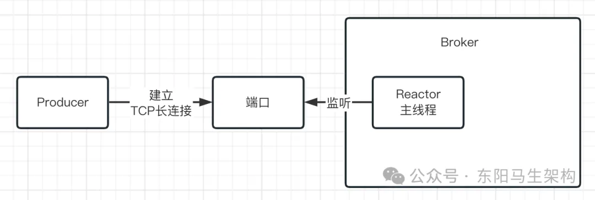

接着这个 Reactor 主线程就专门会负责跟这个 Producer 按照 TCP 协议规定的一系列步骤和规范，建立好一个长连接。而在 Broker 中，会使用一个叫 SocketChannel 的对象来代表跟 Producer 之间建立的这个长连接。

Producer 里会有一个 SocketChannel，Broker 里也会有一个 SocketChannel，这两个 SocketChannel 就代表了它们俩建立好的这个长连接。

既然 Producer 和 Broker 之间已经通过 SocketChannel 维持了一个长连接了，接着 Producer 就会通过这个 SocketChannel 去发送消息给 Broker。

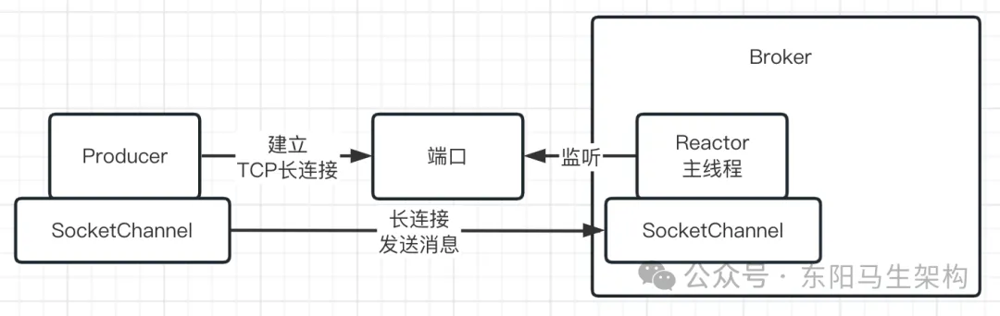

### 基于 Reactor 线程池监听连接中的请求

此时还不能让 Producer 发送消息给 Broker，因为虽然有一个 SocketChannel 组成的长连接，但它仅仅是一个长连接而已。假设 Producer 此时通过 SocketChannel 发送消息给到 Broker 那边的 SocketChannel 了，但是 Broker 中应该用哪个线程来负责从 SocketChannel 里获取这个消息呢？

从 SocketChannel 里获取消息的工作，会通过一个叫 Reactor 线程池(默认有 3 个线程)来负责。Reactor 主线程建立好的每个连接 SocketChannel，都会交给这个 Reactor 线程池里的其中一个线程去监听请求。有了 Reactor 线程池后，就可以让 Producer 发送请求过来了。Producer 发送一个消息到达 Broker 里的 SocketChannel，此时 Reactor 线程池里的一个线程就会监听到该 SocketChannel 中有请求到达。

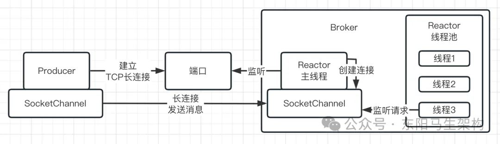

### 基于 Worker 线程池完成一系列准备工作

接着 Reactor 线程从 SocketChannel 中读取出一个请求，这个请求在正式进行处理之前，必须先进行一些准备工作和预处理，比如 SSL 加密验证、编码解码、连接空闲检查、网络连接管理等事情。那么这些事情又会由哪个线程来负责处理呢？

这些准备工作和预处理会由一个叫 Worker 线程池(默认有 8 个线程)来负责。也就是 Reactor 线程从 SocketChannel 中读取出一个请求后，就会交给 Worker 线程池中的一个线程进行处理，来完成上述一系列的准备工作和预处理

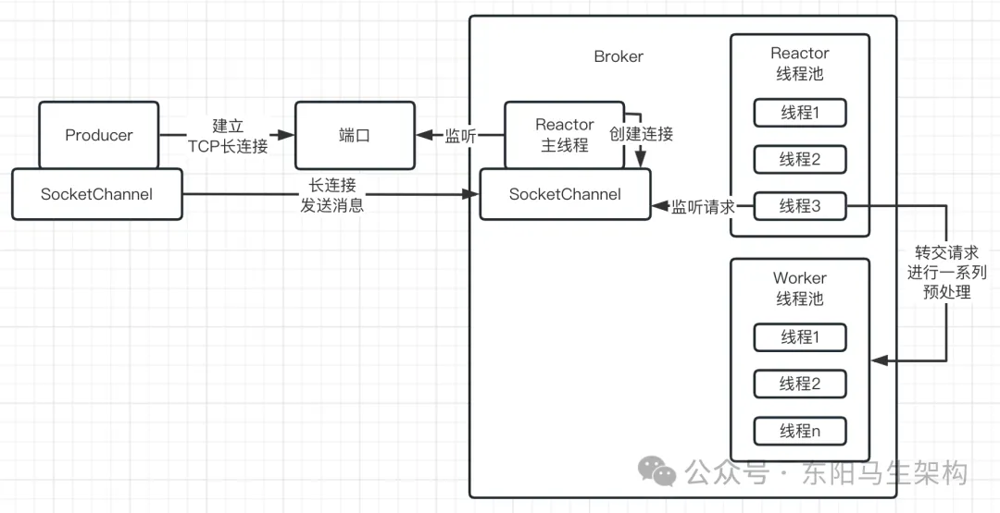

### 基于业务线程池完成请求的处理

当 Worker 线程完成了一系列的预处理后，比如 SSL 加密验证、编码解码、连接空闲检查、网络连接管理等，接着就要对这个请求进行正式的业务处理了。

正式的业务处理逻辑，就包括了 Broker 数据存储过程。也就是 Broker 接收到消息后，要写入 CommitLog 文件，以及 ConsumeQueue 文件等。

所以，此时就需要继续把经过一系列预处理过后的请求转交给业务线程池。比如把发送消息的请求转交给 SendMessage 线程池，这个 SendMessage 线程数是可以配置的，配置得越多，处理发送消息请求的吞吐量就越高。

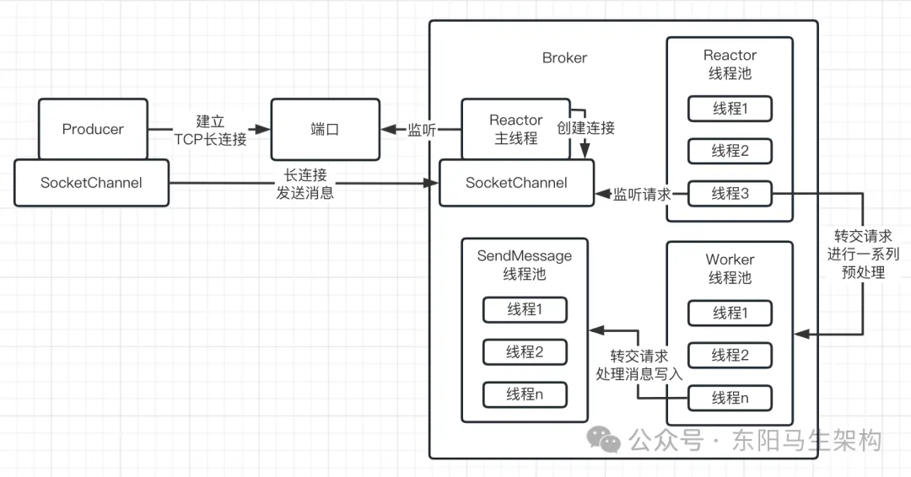

### 为什么这套网络通信框架是高性能以及高并发的

假设只有一个线程来处理所有的网络连接的请求，包括读写磁盘文件之类的业务操作，那么必然会导致并发能力很低。

所以必须专门分配一个 Reactor 主线程出来，专门负责和 Producer + Consumer 建立长连接。一旦连接建立好之后，大量的长连接会均匀分配给 Reactor 线程池里的多个线程。

每个 Reactor 线程负责监听一部分的连接请求，这也是一个优化点。通过多线程并发监听不同连接的请求，可以有效提升大量并发请求过来时的处理能力，也就是提升网络框架的并发能力。

接着后续对大量并发过来的请求都基于 Worker 线程池进行预处理。当 Worker 线程池预处理多个请求时，Reactor 线程还是可以有条不紊的继续监听和接收大量连接的请求是否到达。

最后读写磁盘文件之类的操作都是交给业务线程池来处理，当它并发执行多个请求的磁盘读写操作时，不会影响其他线程池同时接收请求、预处理请求

## 基于 mmap 内存映射实现磁盘文件的高性能读写

### mmap 是 Broker 读写磁盘文件的核心技术

Broker 中大量使用了 mmap 技术去实现 CommitLog 这种大磁盘文件的高性能读写优化。Broker 对磁盘文件的写入主要是通过直接写入 OS 的 PageCache 来实现性能优化的。因为直接写入 OS 的 PageCache 的性能与写入内存一样，之后 OS 内核中的线程会异步把 PageCache 中的数据刷入到磁盘文件，这个过程中就涉及到了 mmap 技术。

### 传统文件 IO 操作的多次数据拷贝问题

如果 RocketMQ 没有使用 mmap 技术，而是使用普通的文件 IO 操作去进行磁盘文件的读写，那么会存在多次数据拷贝的性能问题。

假设有个程序需要对磁盘文件发起 IO 操作，需要读取文件里的数据到程序，那么会经过以下一个顺序：

首先从磁盘上把数据读取到内核 IO 缓冲区，然后从内核 IO 缓存区里读取到用户进程私有空间，程序才能拿到该文件里的数据。

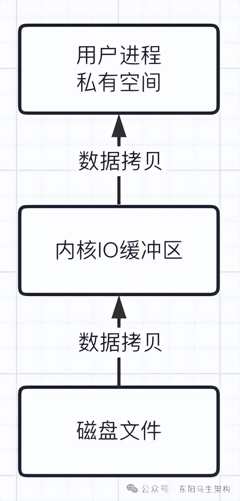

为了读取磁盘文件里的数据，发生了两次数据拷贝。这就是普通 IO 操作的一个弊端，必然涉及到两次数据拷贝操作，这对磁盘读写性能是有影响的。

如果要将一些数据写入到磁盘文件里去，也是一样的过程。必须先把数据写入到用户进程私有空间，然后从用户进程私有空间再进入内核 IO 缓冲区，最后进入磁盘文件里。在数据进入磁盘文件的过程中，同样发生了两次数据拷贝。

### RocketMQ 如何基于 mmap 技术 + PageCache 技术进行文件读写优化

RocketMQ 底层对 CommitLog、ConsumeQueue 之类的磁盘文件的读写操作，基本上都会采用 mmap 技术来实现。具体到代码层面，第一步就是基于 JDK NIO 包下的 MappedByteBuffer 的 map()方法：将一个磁盘文件(比如一个 CommitLog 文件，或者是一个 ConsumeQueue 文件)映射到内存里来。

**关于内存映射：** 可能有人会误以为是直接把那些磁盘文件里的数据读取到内存中，但这并不完全正确。因为刚开始建立映射时，并没有任何的数据拷贝操作，其实磁盘文件还是停留在那里，只不过 map()方法把物理上的磁盘文件的一些地址和用户进程私有空间的一些虚拟内存地址进行了一个映射。

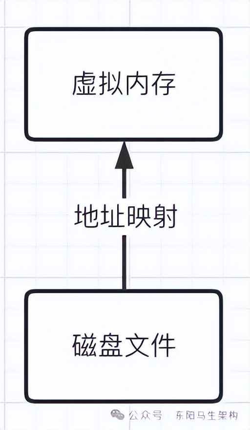

这个地址映射的过程，就是 JDK NIO 包下的 MappedByteBuffer.map()方法做的事情，其底层就是基于 mmap 技术实现的。另外这个 mmap 技术在进行文件映射时，一般有大小限制，在 1.5GB~2GB 之间。所以 RocketMQ 才让 CommitLog 单个文件在 1GB、ConsumeQueue 文件在 5.72MB，不会太大。这样限制了 RocketMQ 底层文件的大小后，就可以在进行文件读写时，很方便的进行内存映射了。

**关于 PageCache：** 实际上 PageCache 在这里就是对应于虚拟内存。

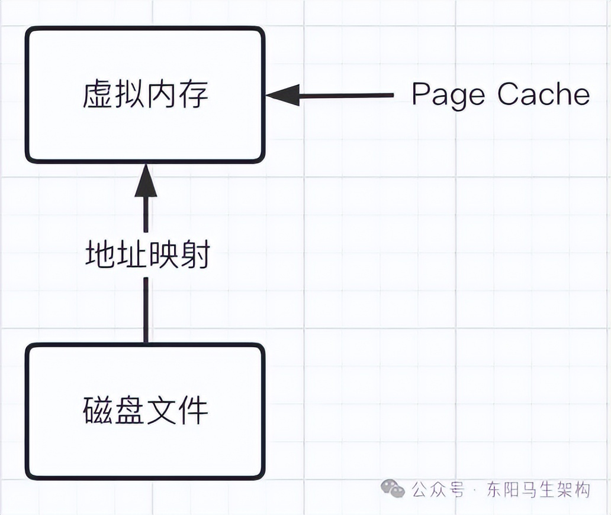

### 基于 mmap 技术 + PageCache 技术来实现高性能的文件读写

第二步就可以对这个已经映射到内存里的磁盘文件进行读写操作了。比如程序要写入消息数据到 CommitLog 文件： 

首先程序把一个 CommitLog 文件通过 MappedByteBuffer 的 map()方法映射其地址到程序的虚拟内存地址。

接着程序就可以对这个 MappedByteBuffer 执行写入操作了，写入时消息数据会直接进入 PageCache。

然后过一段时间后，由 OS 的线程异步刷入磁盘中。

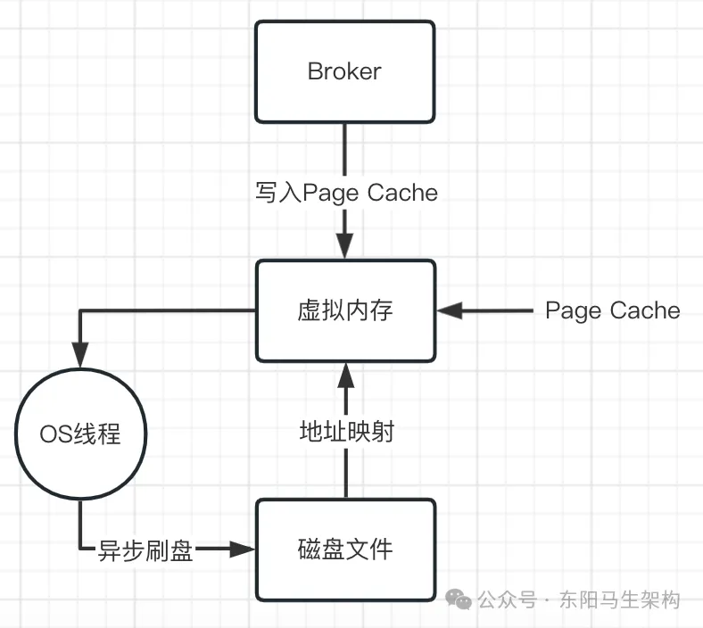

从上图可以看出，只有一次数据拷贝的过程，也就是从 PageCache 里拷贝到磁盘文件。这个就是使用 mmap 技术后，相比于普通 IO 的一个性能优化。

接着如果要从磁盘文件里读取数据：那么就会判断一下，当前要读取的数据是否在 PageCache 里，如果在则可以直接从 PageCache 里读取。

比如刚写入 CommitLog 的数据还在 PageCache 里，此时消费者来消费肯定是从 PageCache 里读取数据的。但如果 PageCache 里没有要的数据，那么此时就会从磁盘文件里加载数据到 PageCache 中。

而且 PageCache 技术在加载数据时 **，** 还会将需要加载的数据块的临近的其他数据块也一起加载到 PageCache 里。

可见在读取数据时，其实也只发生了一次拷贝，而不是两次拷贝，所以这个性能相比于普通 IO 又提高了。

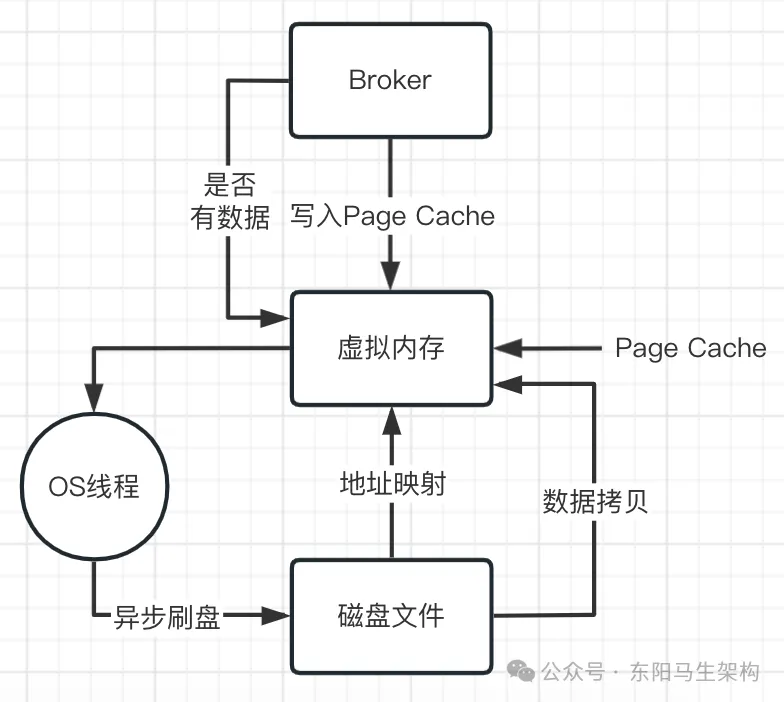

### 内存预映射机制 + 文件预热机制

下面是 Broker 针对上述磁盘文件高性能读写机制做的一些优化：

1. 内存预映射机制

Broker 会针对磁盘上的各种 CommitLog、ConsumeQueue 文件预先分配好 MappedFile，也就是提前对一些可能接下来要读写的磁盘文件，提前使用 MappedByteBuffer 执行 map()方法完成映射，这样后续读写文件时，就可以直接执行了。

2. 文件预热

在提前对一些文件完成映射之后，因为映射不会直接将数据加载到内存里来，那么后续在读取 CommitLog、ConsumeQueue 时，其实有可能会频繁的从磁盘里加载数据到内存中去。所以在执行完 map()方法之后，会进行 madvise 系统调用，就是提前尽可能多的把磁盘文件加载到内存里去。

通过上述优化，才能真正实现这么一个效果：就是写磁盘文件时都是进入 PageCache 的，保证写入高性能。同时尽可能多的通过 map() + madvise 的映射后预热机制，把磁盘文件里的数据尽可能多的加载到 PageCache 里来，后续对 ConsumeQueue、CommitLog 进行读取时，才能尽量从内存读取数据。
