## RocketMQ 的整体架构与运行流程

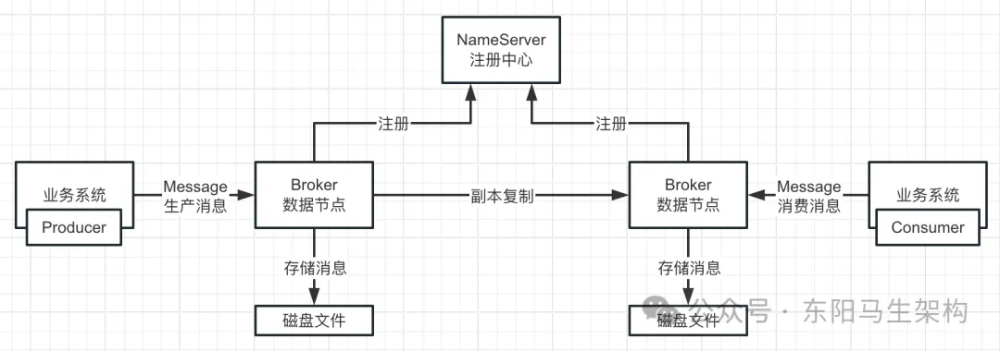

## 基于 NameServer 管理 Broker 集群的架构

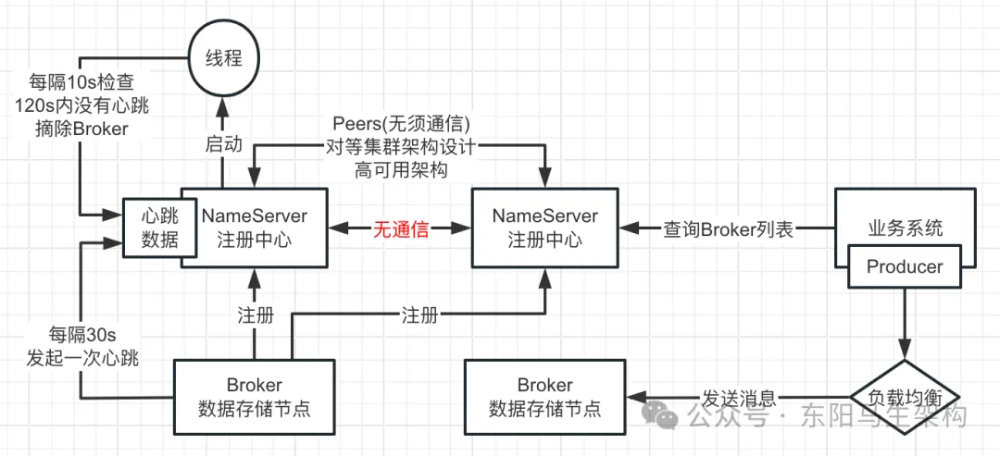

## Broker 集群的主从复制架构

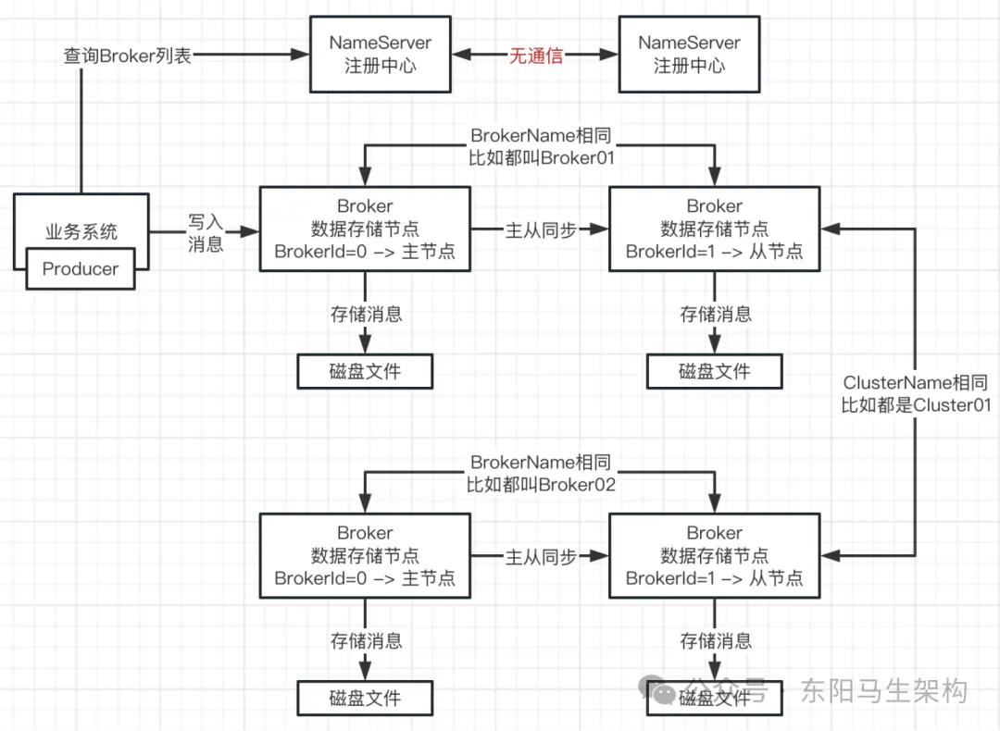

## 基于 Topic 和 Queue 实现的数据分片架构

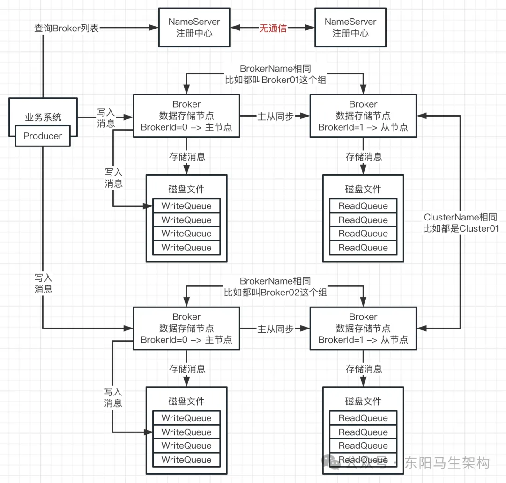

## Broker 基于 Pull 模式的主从复制原理

### Broker 主从复制的 Push 模式和 Pull 模式

1. Push 同步模式：Producer 往 Broker 主节点写入数据后，Broker 主节点会主动把数据推送 Push 到 Broker 从节点里。
2. Pull 同步模式：Producer 往 Broker 主节点写入数据后，Broker 主节点会等待从节点发送拉取数据的 Pull 请求。Broker 主节点收到从节点的拉取数据请求后，才会把数据发送给从节点。

其实，Broker 发送消息给 Consumer 进行消费，同样也是有两种模式：Push 模式和 Pull 模式。

1. Push 消费模式：就是 Broker 会主动把消息发送给消费者，消费者是被动接收 Broker 推送过来的消息，然后进行处理。
2. Pull 消费模式：就是 Broker 不会主动推送消息给消费者，而是消费者主动发送请求到 Broker 去拉取消息，然后进行处理。

### Broker 基于 Pull 模式的主从复制原理

Broker 主节点在启动后，会监听来自从节点的连接请求。Broker 从节点在启动后，会主动向主节点发起连接请求。

首先，当 Broker 主节点和从节点建立好网络连接后，各自会初始化一些组件。Broker 主节点会创建并初始化一个 HAConnection 组件，专门用于处理从节点的同步请求。Broker 从节点会创建并初始化两个组件，一个是 HAClient 主从同步请求线程、一个是 HAClient 主从同步响应线程。

然后，Broker 从节点的 HAClient 主从同步请求线程，会不断发送主从同步请求，到主节点的 HAConnection 组件，期间会带上从节点向主节点已拉取的最大的物理偏移量 max offset。

接着，主节点的 HAConnection 组件便会到磁盘文件取出最大物理偏移量 max offset 之后的数据，然后返回给从节点。

之后，从节点的 HAClient 主从同步响应线程便会对收到的这些 max offset 之后的数据进行处理，写入到其磁盘文件中。

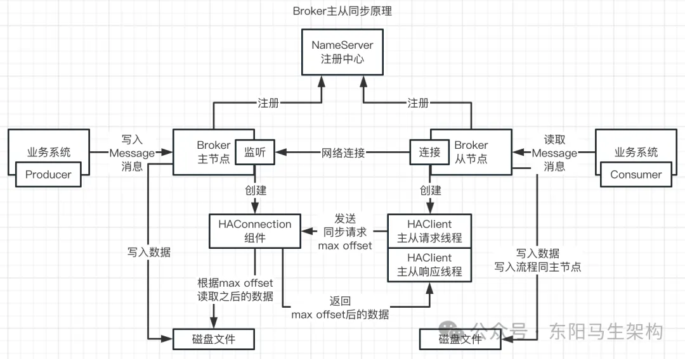

### Push 消费模式 vs Pull 消费模式

一个消费者组内的多台机器会分别负责一部分 MessageQueue 的消费。那么每台机器就必须要连接到对应的 Broker，尝试消费里面的 MessageQueue 对应的消息。此时就涉及到两种消费模式了：Push 消费模式和 Pull 消费模式。

实际上，这两个消费模式本质是一样的，都是消费者机器主动发送请求到 Broker 机器去拉取一批消息来处理。Push 消费模式底层是基于 Pull 消费模式来实现的，只不过它的名字叫做 Push 而已。意思是 Broker 会尽可能实时的把新消息交给消费者机器来进行处理，它的消息时效性会更好。

一般使用 RocketMQ 时，消费模式通常选择 Push 模式，因为 Pull 模式的代码写起来更加复杂和繁琐，而且 Push 模式底层本身就是基于消息拉取的方式来实现的，只不过时效性更好而已。

Push 模式的实现思路：当消费者发送请求到 Broker 去拉取消息时，如果有新的消息可以消费就马上返回一批消息到消费机器去处理，处理完之后会接着立刻发送请求到 Broker 机器去拉取下一批消息。

所以消费者在 Push 模式下处理完一批消息，会马上发起请求拉取下一批消息。消息处理的时效性非常好，看起来就像 Broker 一直不停地推送消息给消费者一样。

此外，Push 模式下有一个请求挂起和长轮询机制。当拉取消息的请求发送到 Broker，结果发现没有新的消息给处理时，就会让请求线程挂起，默认是挂起 15 秒。然后这个期间 Broker 会有后台线程每隔一会儿就去检查一下是否有新的消息。另外在这个挂起过程中，如果有新的消息到达了会主动唤醒挂起的线程，然后把消息返回给消费者。

当然消费者进行消息拉取的底层源码是比较复杂的，涉及大量细节，但核心思路大致如此。需要注意：哪怕是常用的 Push 消费模式，本质也是消费者不停地发送请求到 Broker 去拉取一批一批的消息。

## Broker 层面到底如何做到数据 0 丢失

第一种场景：Broker 主节点 JVM 进程崩溃 ==> 数据在 PageCache，即便异步刷盘也不影响。

第二种场景：Broker 主节点服务器崩溃 ==> 数据在 PageCache，异步刷盘会丢失，同步刷盘不丢失。

第三种场景：Broker 主节点服务器硬盘坏掉 ==> 如果 Broker 从节点数据还没同步最新的，就会丢失。

Broker 要做到数据 0 丢失，需要同步刷盘 + 同步复制。也就是 Producer 向 Broker 主节点写数据时，Broker 主节点返回写入成功响应的前提是：主节点落盘成功 + 从节点同步成功。

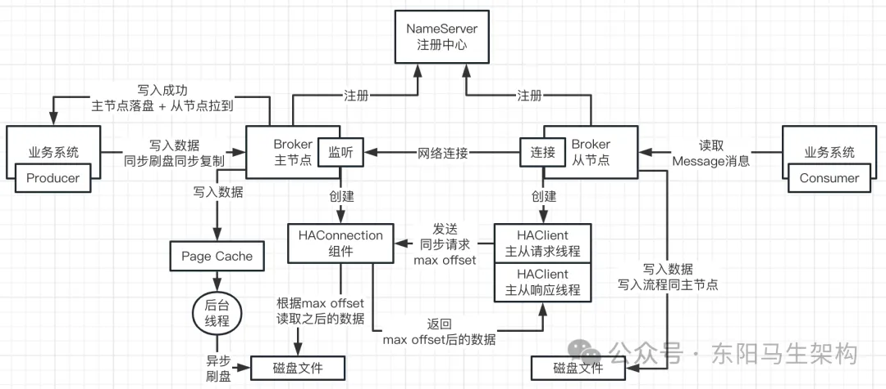

## 数据 0 丢失与写入高并发的取舍

Producer 将一条消息发送给 Broker：

若 Broker 采用异步刷盘 + 异步复制，那么基本几 ms ~ 几十 ms 即可返回写入成功的响应。

若 Broker 采用同步刷盘 + 异步复制，那么需要几十 ms ~ 几百 ms 才可返回写入成功的响应。

若 Broker 采用同步刷盘 + 同步复制，那么需要几百 ms ~ 几 s 才可返回写入成功的响应。

同步复制需要等待：从节点发送 Pull 请求 + 读磁盘数据 + 网络发送数据到从节点 + 从节点写数据到磁盘 + 等下一次 Pull 请求。

Broker 默认采用的是异步刷盘 + 异步复制。

## RocketMQ 读写分离主从漂移设计

### 优先从 Broker 主节点消费消息

RocketMQ 是不倾向让 Producer 和 Consumer 进行读写分离的，而是倾向让写和读都由主节点来负责。从节点则用于进行数据复制和同步来实现热备份，如果主节点挂了才会选择从节点进行数据读取。所以 Consumer 默认下会消费 Broker 主节点的 ConsumeQueue 里的消息。

### 读写分离主从漂移的规则

如果 Broker 主节点过于繁忙，比如积压了大量写和读的消息超过本地内存的 40%，那么当 Consumer 向 Broker 主节点发起一次拉取消息的请求后，Broker 主节点会通知 Consumer 下一次去该 Broker 的某个从节点拉取消息。

而当 Consumer 向 Broker 从节点拉取消息一段时间后，从节点发现自己本地消息积压小于本地内存 30%，拉取消息很顺利，那么 Broker 从节点会通知 Consumer 下一次回到 Broker 主节点去拉取消息。

## RocketMQ 为什么采取惰性读写分离模式

### 什么是惰性读写分离模式

惰性读写分离其实就是上面说的读写分离主从漂移。这种漂移指的是：主从机器对外提供一个完整的服务，客户端有时候访问主、有时候访问从。

惰性读写分离不属于彻底的读写分离，从节点的数据更多时候是用于备用。在以下两种情况下，Consumer 才会选择到从节点去读取消费数据。

情况一：如果主节点过于繁忙，积压没有消费的消息太多，已经超过本地内存 40%。此时主节点可能出现大量读写线程并发运行，机器运行效率可能已经降低，来不及处理这么多的请求，那么主节点就会让消费请求漂移到从节点去读取消费数据。如果在从节点消费得非常好，消息的积压数量很快下降到从节点本地内存的 30%以内，就又会让 Consumer 漂移回主节点消费。

情况二：如果主节点崩溃了，那么 Consumer 也只能到从节点去读取数据进行消费。

### MQ 要实现真正的读写分离比较麻烦

RocketMQ 作为一个 MQ，一个 Topic 对应多个 Queue，可以认为支持去从节点读取数据进行消费。

Kafka 作为一个 MQ，一个 Topic 对应多个 Partition，不同节点组成 Leader 和 Follower 主从结构进行数据复制，不支持去从节点读取数据进行。

MQ 作为一个特殊的中间件系统，它要维护每个 Consumer 对一个 Queue/Partition 的消费进度。如果要实现真正的读写分离，那么维护这个消费进度就会非常麻烦。

比如在从节点上进行读取消费时，一旦这个从节点宕机，此时主节点和其他从节点是不知道该从节点的消费进度的，消费进度要进行集中式保存就比较麻烦。

所以考虑到消费进度的维护和保存，通常各个 MQ 都会让消费者在主节点进行读和写，这样就可以简单地对消费进度进行集中式维护和存储。

### Broker 从节点每隔 10 秒同步消费进度

由于 Consumer 向 RocketMQ 的 Broker 主节点进行消费时，有时候会漂移到 Broker 从节点进行消费。所以 Broker 从节点会每隔 10s 去 Broker 主节点进行元数据同步，比如同步给主节点最新的消费进度

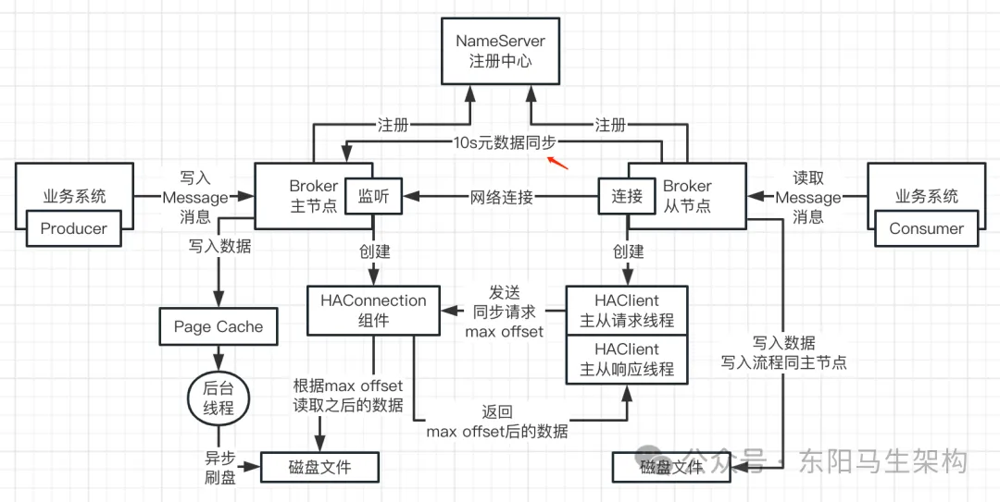

由此可见，RocketMQ 采用惰性读写分离，主要是为了避免维护不同消费者组去不同从节点消费时产生的复杂的消费进度。

## Broker 数据与服务是否都实现高可用了

### RocketMQ4.5.0 之前

Broker 主节点崩溃后，是没有高可用主从切换机制的，从节点只用于热备份，保证大部分的数据不会丢失而已。 

由于 Broker 提供的服务就两个：一个是写数据、一个是读数据。所以此时主节点崩溃后，只能靠从节点提供有限的数据和服务了，即只能提供读数据服务而不能提供写数据服务。对应的 Producer 都会出现写数据失败，但是 Consumer 可以继续去从节点读取数据进行有限的消费，数据消费完就没了。

此外主节点崩溃后，从节点可能存在有些最新的数据没来得及同步过来，出现数据丢失的问题，所以数据和服务没有实现高可用。

### RocketMQ4.5.0 之后

实现了主从同步 + 主从切换的高可用机制，保证数据和服务都是高可用的。

注意：在 RocketMQ4.5.0 以前的老版本，只是实现了单纯的主从复制，只能做到大部分数据不丢失，效果不是特别好。某个 Broker 分组内的主节点挂掉后，从节点是没法接管主节点的工作的。

## Broker 数据与服务的数据一致性设计

要实现主从数据强一致同步：

情况一：如果主从同步采用 Pull 模式

那么 Broker 主节点就要等待从节点过来 Pull 数据，从而增加 Producer 的写请求耗时，此时整个写请求的性能损耗比较大。

情况二：如果主从同步采用 Push 模式

Broker 主节点将消息写入 PageCache 后，就 Push 给从节点进行同步，那么写请求只要等待从节点的 Push 成功即可返回。Broker 从节点继续采取异步刷盘的策略，它收到主节点 Push 的消息后，直接写入 PageCache 就返回给主节点。此时整个写请求的性能损耗比较小。

## Broker 基于 Raft 协议的主从架构设计

如果基于 Raft 协议，那么一组 Broker 最少需要使用三台机器。

**当这 3 台 Broker 启动后**

会基于 Raft 协议进行 Leader 选举，选举出的 Leader 便会成为 Broker 主节点。

**当 Producer 往 Broker 主节点发起写请求时**

Broker 主节点首先会将新消息先写入到 OS 的 PageCache 中，接着将新消息同步 Push 到其余两台从节点。由于基于 Raft 协议，所以只要 Broker 主节点发现过半数 Broker 节点(包括它自己)写入新消息成功，那么 Broker 主节点就可以返回写入成功。而 Broker 从节点收到主节点的 Push 新消息请求后，也是首先写入 OS 的 PageCache，然后就直接返回写入成功给 Broker 主节点。

**当 Broker 主节点宕机后**

剩余的两台 Broker 从节点便会根据 Raft 协议进行 Leader 选举，选举其中一台 Broker 作为新的主节点。这样一个 Broker 主节点 + 一个 Broker 从节点，依然可以满足 Raft 协议，继续提供写服务和保证数据及服务的高可用。

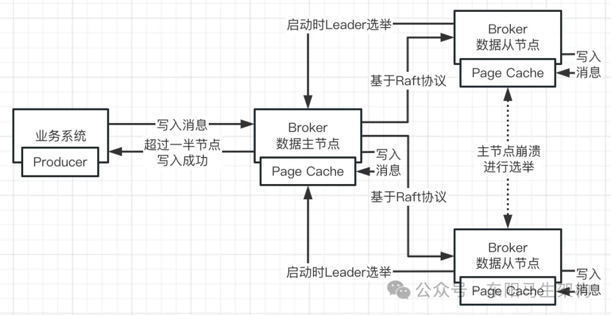

## Raft 协议的 Leader 选举算法介绍

说明一：各个节点在启动时都是 Follower。

说明二：每个 Follower 都会给自己设置一个 150ms~300ms 之间的一个随机时间，可以理解为一个随机的倒计时时间。也就是说，有的 Follower 可能倒计时是 150ms、有的 Follower 可能倒计时是 200ms，每个 Follower 的倒计时一般不一样。这时必然会存在一个 Follower，它的倒计时是最小的，它会最先到达倒计时的时间。

说明三：第一个完成倒计时的 Follower 会把自己的身份转变为 Candidate，变成一个 Leader 候选者，会开始竞选 Leader。于是它会给自己投票想成为 Leader，此外它还会发送请求给其他节点表示它完成了一轮投票，希望对方也投票给自己。

说明四：其他还处于倒计时中的 Follower 节点收到这个请求后，如果发现自己还没给其他 Candidate 投过票，那么就把它自己的票投给这个 Candidate，并发送请求给其他节点进行通知。如果发现自己已经给其他 Candidate 投过票，那么就忽略这个 Candidate 发送过来的请求。

说明五：当某个 Candidate 发现自己的得票数已超半数 quorum，那么它就成为 Leader 了，这时它会向其他节点发送 Leader 心跳。那些节点收到这个 Leader 的心跳后，就会重置自己的倒计时，比如原来的倒计时还剩 10ms，收到 Leader 心跳时就重置为 200ms。Follower 节点通过 Leader 的心跳去不断重置自己的倒计时，不让倒计时到达，以此来维持 Leader 的地位，否则倒计时一到达，它就会从 Follower 转变为 Candidate 发起新一轮的 Leader 选举。

## Broker 基于状态机实现的 Leader 选举

### 什么是状态设计模式

就是系统可以维护多个 State 状态，多个 State 状态之间可以进行切换。每次切换到一个新的 State 状态后，执行的行为是不同的，行为是跟 State 状态是绑定在一起的。状态机就是状态设计模式的一个运用

### 什么是状态机

状态设计模式可以演变成一个状态机，即 StateMachine。状态机和状态设计模式一样，可以维护多个 State 状态，不同的 State 状态可以对应不同的行为。RocketMQ 的 Broker 就是采取状态机机制来实现 Leader 选举的

### 使用状态机机制实现 Leader 选举

说明一：同一个组的每个 Broker 节点在启动时都会有一个状态机 StateMachine，这个状态机会对节点状态进行判断。而这些节点在启动时的初始化状态都是 Follower，所以状态机就会根据 Follower 状态让节点执行 maintainAsFollower 行为。

说明二：maintainAsFollower 行为会判断是否收到 Leader 的心跳包。如果没收到心跳包就等待倒计时结束，节点切换成 Candidate 状态。如果收到心跳包就重置倒计时，节点切换成 Follower 状态。

说明三：当状态机发现节点的状态由 Follower 变成了 Candidate，那么就会让节点执行 maintainAsCandidate 行为。

说明四：刚开始启动时各个节点都没有收到心跳包，都在等待各自的随机倒计时的结束。假设节点 A 的倒计时先结束，其节点状态由 Follower 切换为 Candidate。

说明五：maintainAsCandidate 行为会发起一轮新的投票，比如节点 A 会先投票给自己，然后发送该投票结果给组内的其他节点。组内其他节点收到该投票结果后会进行投票响应，如果发现其状态为 Follower 且没投过票，响应就是投票给节点 A。

说明六：节点 A 收到其他节点的投票响应后，其状态机就会判断是否有超过半数的节点都对自己投票了。如果没有收到半数投票，就重置倒计时，等待下轮选举投票。如果收到半数投票，就开始把自己切换为 Leader 状态。当状态机发现节点的状态由 Candidate 变成了 Leader，就会让节点执行 maintainAsLeader 行为。

说明七：maintainAsLeader 行为会定时发送 HeartBeat 心跳请求给其他 Follower 节点。当其他 Follower 节点收到心跳请求包后，就会重置倒计时，并且返回心跳结果响应给 Leader 节点，然后等待倒计时结束。

说明八：当 Leader 节点收到这些心跳结果响应后，会判断是否超过半数节点进行了心跳响应。如果是则继续定时发送 HeartBeat 心跳请求给其他 Follower 节点，如果不是则把状态切换为 Candidate 状态。

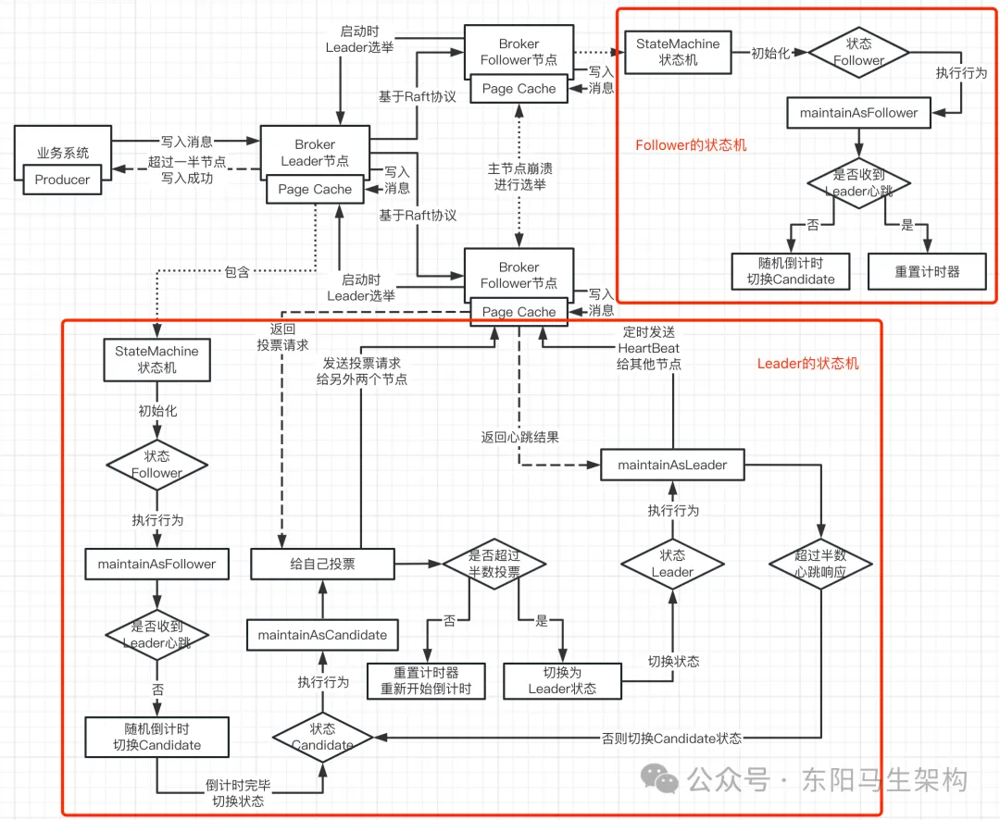

注意关键点：是否超半数投票 + 是否超半数心跳响应。

## Broker 基于 DLedger 的数据写入流程

在 Raft 协议下，RocketMQ 的 Leader 可以对外提供读和写服务，Follower 则一般不对外提供服务，仅仅进行数据复制和同步，以及在 Leader 故障时完成 Leader 重新选举继续对外服务。

DLedger 是一个实现了 Raft 协议的框架，它实现了 Leader 如何选举、数据如何复制、主从如何切换等功能。当 Broker 拿到一条消息准备写入时，就会切换为基于 DLedger 来进行写入，不过 DLedger 里写的不叫消息，而叫日志。

Broker 节点的 DLedger 也是先往 PageCache 里写日志，然后会有后台线程进行异步刷盘将日志写入磁盘。而 Leader 节点的 DLedger 在往 PageCache 写完日志后，会异步复制日志到其他 Follower 节点，然后 Leader 节点会同步阻塞等待这些 Follower 节点写入日志的结果。当 Leader 节点发现过半 Follower 节点写入消息成功后，才会向 Producer 返回写入成功的响应，代表这条消息写入成功。

如下是 Broker 基于 DLedger 的数据写入流程：

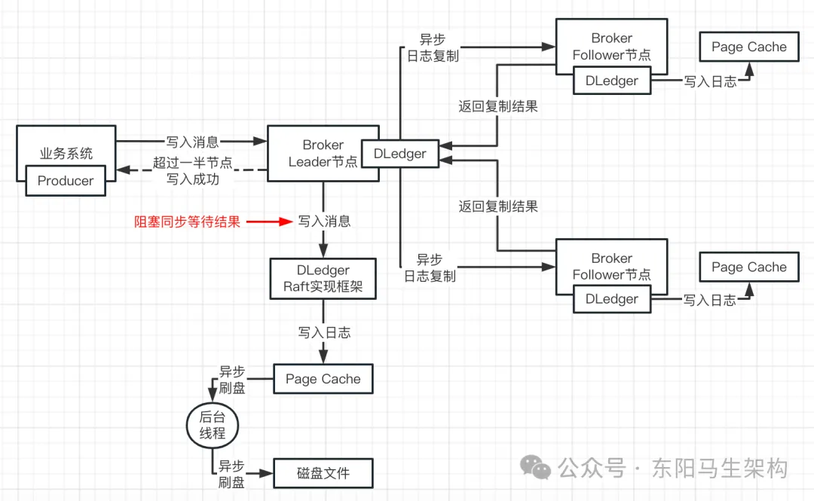

## Broker 引入 DLedger 后的存储兼容设计

### 过半节点写成功才返回写入成功

在基于 DLedger 的数据写入过程中，消息仅仅写入 Leader 上 DLedger 的 PageCache 时，还不能代表这条消息的写入已经成功。还需要等待超过半数节点写入成功后，Leader 向 Producer 返回这条消息已经写入成功了，才能让消费者去消费该条消息。

### DLedger 的日志格式

消息被写入 DLedger 的 PageCache 时，由于数据会被调整为 DLedger 的日志格式，不再是没有使用 DLedger 时写入 PageCache 的 CommitLog 消息格式，那么该如何兼容这个 DLedger 的日志格式？

DLedger 的日志会分成 Body 和 Header 两部分：Header 部分中会包含很多的 Header 头字段，Body 部分会包含长度不固定的 Body 体。

所以 DLedger 的一条日志中，会把 CommitLog 原始的一条数据放入到其 Body 部分，也就是：一条 DLedger 日志 = Header(多个头字段) + Body(CommitLog 原始数据)。

因此使用 DLedger 写入消息到 PageCache 后，后台线程异步刷盘到 CommitLog 文件的每一条数据都会有 "Header + Body"。此时如果从 ConsumeQueue 获取到偏移量后继续从 Header 开始去计算就找不到原始的 CommitLog 数据了。

所以需要对 ConsumeQueue 的数据也进行设计兼容：ConsumeQueue 的一条数据里的 offset 物理偏移量，需要更改为 CommitLog 里一条数据的 Body 的起始物理偏移量。

## Broker 主从节点之间的元数据同步

元数据包括：Topic 路由信息(比如 Topic 在当前的 Broker 组里有几个 Queue)、消费进度数据。

因为这些元数据都是存储在 Broker 的 Leader 节点上的，也需要同步到 Broker 的 Follower 节点，所以 Follower 节点会启动一个定时任务每 10s 去 Leader 节点同步元数据。

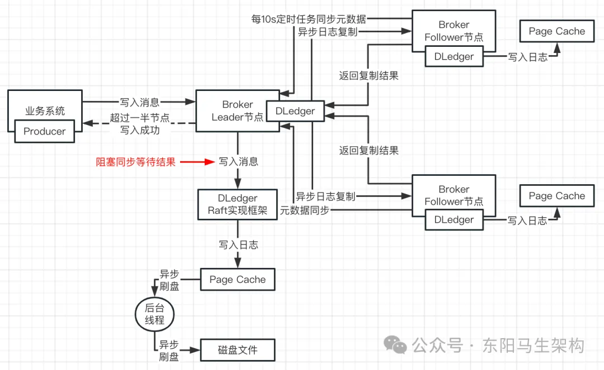

## Broker 基于 Raft 协议的主从切换机制

Broker 基于 Raft 协议的主从切换机制如下：

说明一：Broker 组内的各个节点一开始启动时都是 Follower 状态，都会判断自己是否有收到 Leader 心跳包。由于刚开始启动时没有 Leader，所以各个节点不会收到心跳包，于是都会等待随机倒计时结束，准备切换成 Candidate 状态。

说明二：其中的一个节点必然会优先结束随机倒计时并切换成 Candidate 状态。该节点切换成 Candidate 状态后，就会发起一轮新的选举，也就是给自己进行投票，并且把该投票也发送给其他节点。

说明三：其他节点收到该投票后，就会判断自己是否已给某节点投票。此时这些节点并没有给某节点投过票，并且都还处于 Follower 状态，其倒计时还没有结束，于是这些节点便会把票投给第一个结束随机倒计时的节点。否则，就忽略该投票。

说明四：第一个结束随机倒计时的节点收到其他节点的投票信息后，会判断投自己的票是否已超半数。如果是，则把 Candidate 状态切换成 Leader 状态。

说明五：第一个结束随机倒计时的节点把状态切换成 Leader 后，就会定时给其他节点发送 HeartBeat 心跳。其他节点收到心跳后，就会重置倒计时。

所以只要 Leader 正常运行，定时发送心跳过来重置倒计时，那么这些节点的倒计时永远不会结束，从而这些节点会一直维持着 Follower 状态。

说明六：这样，处于 Leader 状态的节点，和一直维持 Follower 状态的那些节点，就会正常工作。Producer 的消息会往 Leader 节点进行写入，然后会被复制到 Follower 节点。Consumer 消费消息也会从 Leader 节点进行读取，然后其 Leader 节点的元数据也会定时同步到 Follower 节点上。

之所以 Leader 节点能一直维持其 Leader 地位，是因为 Leader 节点会一直定时给 Follower 节点发送 HeartBeat 心跳，然后让这些 Follower 节点一直在重置自己的随机倒计时，让倒计时永远无法结束。否则，一旦 Follower 节点的随机倒计时结束，它就会将自己的状态切换成 Candidate，并发起一轮新的 Leader 选举。

说明七：假设此时 Leader 节点崩溃了，比如 Broker JVM 进程进行了正常的重启。那么该 Leader 节点就无法给 Follower 节点定时发送 HeartBeat 心跳了。于是那些 Follower 节点便会判断出没有收到心跳包，从而会等待其倒计时结束，切换成 Candidate 状态。

其中必定会有一个 Follower 节点先结束倒计时切换成 Candidate 状态，然后发起新的 Leader 选举。当它发现有过半数节点给自己投票了之后，便会切换成 Leader 状态，完成主从切换，恢复工作。

说明八：由于新的 Leader 之前是有完整的消息数据和元数据，所以新 Leader 只要切换成功，Consumer 和 Producer 继续往新 Leader 读写即可。新的 Leader 会继续给其他 Follower 节点同步数据、定时发送 Leader 心跳包让 Follower 节点无法切换成 Candidate 状态。

注意：基于 Raft 协议的 Broker 集群，每一组 Broker 至少需要部署 3 个节点。

## Consumer 端如何负载均衡分配 Queue

### 关于 Topic 的 Queue 分配问题

**谁来负责把一个 Topic 的多个 Queue 分配到多个 Consumer**

Consumer 自己可以负责进行分配。每个 Consumer 都可以获取到一个 Topic 有多少个 Queue，以及自己所处的 ConsumerGroup 里有多少个 Consumer，每个 Consumer 都可以按照相同的算法去做一次分配。

**一个 Topic 里的 Queue 信息应该从哪里获取**

从 NameServer 获取 Topic 里的 Queue 信息。Broker 往 NameServer 进行注册和发送心跳时，都会带上该 Broker 上的 Topic 路由信息，可以理解为通过 Broker 也能获取完整的 Topic 路由信息(只需向所有 Broker 查询即可)。

**如何知道一个 ConsumerGroup 里到底有多少个 Consumer**

每个 Broker 都可以知道一个 ConsumerGroup 的所有 Consumer。Consumer 启动时，会向所有的 Broker 进行注册。所以每个 Broker 都可以知道一个 ConsumerGroup 的所有 Consumer 都有哪些，可以通过随便一个 Broker 来获取 Topic 的路由信息 + ConsumerGroup 信息。

### Consumer 的 RebalanceService 组件和算法

Consumer 中会有一个 RebalanceService 组件，负责每隔 20 秒去拉取 Topic 的 Queue 信息、ConsumerGroup 信息，然后根据算法分配 Queue，最后确认自己要拉取哪些 Queue 上的信息

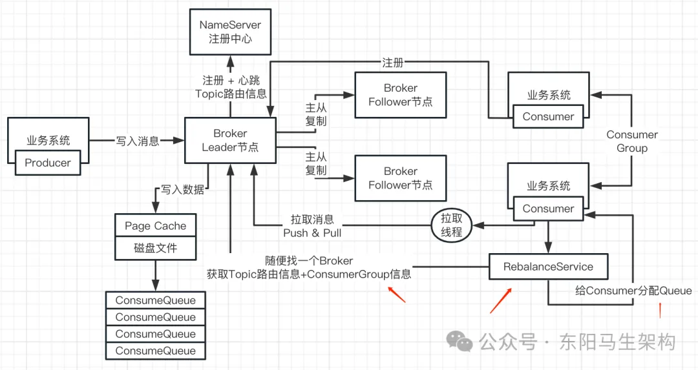

这些算法有：平均分配算法(热门)、轮询分配算法(热门)、一致性 Hash(冷门)、机房分配(冷门)、配置分配(冷门)。

假设有两个 Broker 组、某个 Topic 有 8 个 Queue：q1、q2、q3、q4、q5、q6、q7、q8，还有 2 个 Consumer：Consumer1、Consumer2。

如果按照平均分配算法进行分配，那么 Consumer1 可能会分配到这 4 个 Queue：q1、q2、q3、q4，Consumer2 可能会分配到这 4 个 Queue：q5、q6、q7、q8。

如果按照轮询分配算法进行分配，那么 Consumer1 可能会分配到这 4 个 Queue：q1、q3、q5、q7，Consumer2 可能会分配到这 4 个 Queue：q2、q4、q6、q8。

## Consumer 消息拉取的挂起机制分析

Consumer 拉取消息时会有两种机制：长轮询机制(Long Polling)和短轮询机制(Short Polling)。Consumer 如果没有开启长轮询机制(Long Polling)，那么就会使用短轮询机制(Short Polling)去拉取消息。

### 短轮询机制(Short Polling)

短轮询指的是短时间(默认 1 秒)挂起去进行消息拉取，这个 1 秒可以由 shortPollingMillis 参数进行控制。当 Consumer 发起请求去 Leader 节点拉取消息时，默认会采用短轮询机制。

如果 Leader 节点上处理该请求的线程时，发现没有消息就会挂起 1 秒，挂起过程中并不会有响应返回给 Consumer。1 秒后该线程会苏醒，然后再去检查 Leader 节点是否有消息了，如果还是没有消息，就返回 Not Found Message 给 Consumer。

### 长轮询机制(Long Polling)

长轮询其实指的就是长时间挂起去进行消息拉取。在开启了长轮询机制的情况下，当 Consumer 发起请求去 Leader 节点拉取消息时，如果 Leader 节点上处理该请求的线程发现没有消息，那么就会直接挂起，挂起过程中并不会有响应返回给 Consumer。

同时，Leader 节点中会有一个长轮询后台线程，每隔 5 秒去检查 Leader 节点是否有新的消息进来。如果检查到有新消息则唤醒挂起的线程，并判断该消息是否是 Consumer 所感兴趣的。如果不是 Consumer 感兴趣的，则再判断是否长轮询超时，如果超时则返回 Not Found Message 给 Consumer。

当 Consumer 采用 Push 模式去拉取消息时，那么会：挂起 + 每隔 5 秒检查 + 超时时间为 15 秒，15 秒都没拉到消息就超时返回。

当 Consumer 采用 Pull 模式去拉取消息时，那么会：挂起 + 每隔 5 秒检查 + 超时时间为 20 秒，20 秒都没拉到消息就超时返回。

### 总结 Consumer 的 Push 模式和 Pull 模式

实际上，这两个消费模式本质是一样的，都是消费者机器主动发送请求到 Broker 机器去拉取一批消息来进行处理。

Push 消费模式底层也是基于消费者 Pull 模式来实现的，只不过它的名字叫做 Push 而已。意思是 Broker 会尽可能实时的把新消息交给消费者机器来进行处理，它的消息时效性会更好。

一般使用 RocketMQ 时，消费模式通常都是选择 Push 模式，因为 Pull 模式的代码写起来更加的复杂和繁琐，而且 Push 模式底层本身就是基于消息拉取的方式来实现的，只不过时效性更好而已。

Push 模式的实现思路：当消费者发送请求到 Broker 去拉取消息时，如果有新的消息可以消费就马上返回一批消息到消费机器去处理，处理完之后会接着立刻发送请求到 Broker 机器去拉取下一批消息。

所以，消费机器在 Push 模式下，会处理完一批消息，马上发起请求拉取下一批消息，消息处理的时效性非常好，看起来就像 Broker 一直不停的推送消息到消费机器一样。

此外，Push 模式下有一个请求挂起和长轮询的机制：当拉取消息的请求发送到 Broker，结果发现没有新的消息给处理时，就会让请求线程挂起，默认是挂起 15 秒。然后在这个期间，Broker 会有一个后台线程，每隔 5 秒就去检查一下是否有新的消息。另外在这个挂起过程中，如果有新的消息到达了会主动唤醒挂起的线程，然后把消息返回给消费者。

## Consumer 的处理队列与并发消费

### PullMessageService 线程和 ProcessQueue

Consumer 中负责拉取消息的线程只有一个，就是 PullMessageService 线程。Consumer 从 Broker 拉取到消息后，会有一个 ProcessQueue 处理队列，用于进行消息中转。

Consumer 的 PullMessageService 线程拉取到消息后，会将消息写入一个叫 ProcessQueue 的内存数据结构中，这个 ProcessQueue 数据结构的作用其实是用来对消息进行中转用的。

由于 Consumer 负责消费的会是 Broker 中的某几个 ConsumeQueue 里的消息，所以 Consumer 拉取到的 ConsumeQueue 数据都会写到其内存的某几个 ProcessQueue 里面。也就是 Consumer 从 Broker 中拉取了几个 ConsumeQueue 的数据，就会对应有几个 ProcessQueue，可以理解 ProcessQueue 和 ConsumeQueue 之间存在一一对应的映射关系。

### ConsumeMessageThread 消息消费线程

Consumer 把拉取到的消息写入 ProcessQueue 完成中转后，就会提交消费任务到一个线程池里。通过这个线程池，就可以开辟多个 ConsumeMessageThread 线程(即消息消费线程)，来对消息进行并发消费。线程池里的每个线程处理消费消息完毕后，就会回调用户自己写代码实现的回调监听处理函数，处理具体业务。

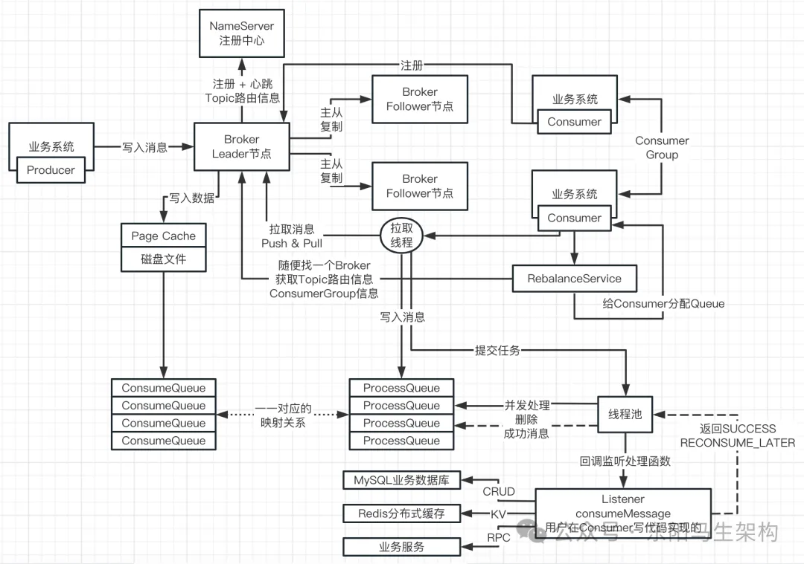

### 消费者并发消费总结

说明一：Consumer 在启动时会往 Broker 注册，会通过 RebalanceService 组件获取 Topic 路由信息和 ConsumerGroup 信息。然后 RebalanceService 组件会通过负载均衡算法实现 Queue 到 Consumer 的分配，确定自己要拉取哪些 Queue。

说明二：Consumer 在拉取 Queue 的消息时会有长轮询和短轮询两种模式，默认采用短轮询拉取消息。

说明三：当 Consumer 拉取到消息后，就会写入在内存中和 ConsumeQueue 一一对应的 ProcessQueue 队列，并提交任务到线程池，由线程池里的线程并发地从 ProcessQueue 获取消息进行处理。

说明四：这些线程从 ProcessQueue 获取到消息后，就会回调用户实现的回调监听处理函数 listener.consumeMessage()。当回调监听处理函数执行完毕后，便会返回 SUCCESS 给线程，线程便会删除 ProcessQueue 里的该消息，这样线程又可以继续从 ProcessQueue 里获取下一条消息进行处理。

## Consumer 处理成功后的消费进度管理

### 消息从 ProcessQueue 中删除后要提交消费进度

当线程池里的线程从 ProcessQueue 获取到某消息，并回调用户实现的回调监听处理函数 listener.consumeMessage()，然后执行成功返回线程 SUCCESS 后，就可以将该消息从 ProcessQueue 中删掉了。

当消息从 ProcessQueue 中删掉后，Consumer 需要向 Broker 的 Leader 节点提交消息对应的 ConsumeQueue 的消费进度。因为 Broker 的 Leader 节点需要维护和管理：每个 ConsumeQueue 被各个 ConsumeGroup 消费的进度。

### 消费进度先存本地内存再异步提交

当回调监听处理函数返回 SUCCESS 后，Consumer 本地的内存里会存储该 Consumer 对 ConsumeQueue 的消费进度。然后 Consumer 端会有一个后台线程，异步提交这个消费进度到 Broker 的 Leader 节点。即 Consumer 会先将消费进度提交到自己的本地内存里，接着有一个后台线程异步提交消费进度到 Leader 节点。

Broker 的 Leader 节点收到 Consumer 提交的消费进度后，也会先存放到自己的内存中。然后 Broker 也会有一个后台线程将消费进度异步刷入磁盘文件里。

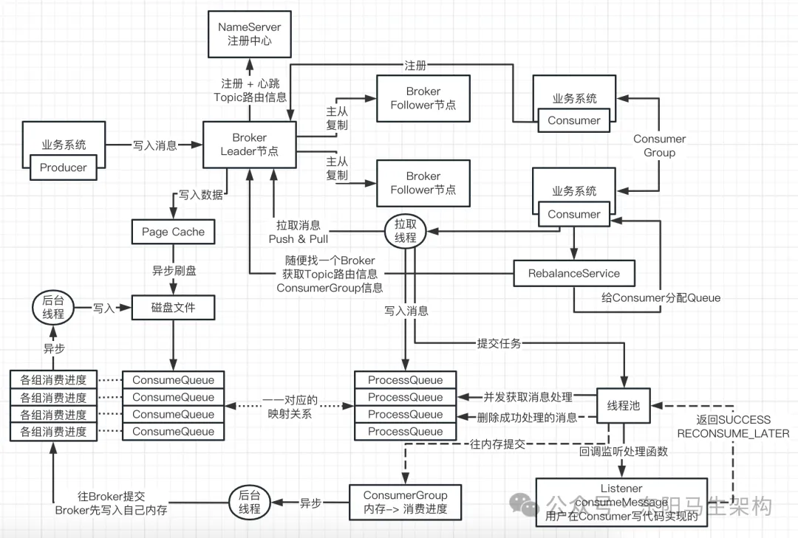

## Consumer 消息重复消费原理剖析

### 消息被重复消费的消费端原因

由于一条消息被消费后，消费进度不管在 Consumer 端还是在 Broker 端，都会先进入内存。所以当消费进度还在内存时机器崩溃了或者系统重启，那么就会导致消息重复消费。

### 造成消费端重复消费消息的场景

主要就是如下两个情景造成消费被重复消息：

情景一：Consumer 端消费完消息后，消费进度还没进入内存或已经写入内存但还没提交给 Broker，机器宕机或系统重启。

情景二：Broker 端收到 Consumer 提交的消费进度还没写入内存或刚写入内存，还没刷入磁盘，机器宕机或系统重启。

对于 Consumer 消息重复消费的问题，在 Consumer 端需要实现一套严格的分布式锁和幂等性保障机制来进行处理。

## Consumer 处理失败时的延迟消费机制

### 处理失败返回 RECONSUME_LATER

Consumer 端线程池里的线程从 ProcessQueue 获取到某消息后：如果在回调用户实现的回调监听处理函数 listener.consumeMessage()时，消费失败返回了 RECONSUME_LATER。那么 Consumer 也会把 ProcessQueue 里的这条消息进行删除，然后返回一个处理消息失败的 ACK 给 Broker。

### 消息进入 RETRY_Topic 并检查延迟时间

Broker 收到这个处理消息失败的 ACK 后，会对该消息的 Topic 进行改写，改写成 RETRY_Topic\_%。该消息也就成为了延迟消息，接着将消息写入到 RETRY_Topic_%对应的 CommitLog 和 ConsumeQueue 中。然后 Broker 端会有一个延迟消息的后台线程对改写 Topic 的 ConsumeQueue 进行检查，检查里面的消息是否达到延迟时间。其中延迟时间会有多个，并且可以进行配置。

### 消息到达延迟时间再次进入原 Topic 重新消费

如果达到延迟时间，就会把该消息取出来再次进行改写 Topic，改写为原来的 Topic。这样该消息会被写入到原 Topic 对应的 CommitLog 对应的 CommitLog 和 ConsumeQueue 中，从而让该消息被 Consumer 在后续的消费中拉取到，进行重新消费。

## ConsumerGroup 变动时的重平衡机制

每当一个 ConsumerGroup 中少了一个 Consumer(机器宕机或重启)、或者多了一个 Consumer(新增机器)时，就需要重新分配 Topic 的那些 Queue 给 Consumer，而这部分工作会由 Consumer 端的 RebalanceService 组件完成。

RebalanceService 组件会每隔 20 秒去 Broker 拉取最新的 Topic 路由信息 + ConsumerGroup 信息。

当某个 Consumer 宕机后，Broker 是知道该宕机的 Consumer 对其负责的 ConsumeQueue 的消费进度的。所以在最多 20 秒后，其他 Consumer 就会进行重新的负载均衡，将宕机 Consumer 负责的 ConsumeQueue 分配好。

当 ConsumerGroup 新增一个 Consumer 时，由于新增的 Consumer 会往 Broker 进行注册，所以 Broker 能知道新增 Consumer。新老 Consumer 都会每隔 20 秒拉取最新的 Topic 路由信息 + ConsumerGroup 信息。这样新老 Consumer 都可以通过 RebalanceService 重平衡组件重新分配 ConsumeQueue。