## 全链路分析为什么用户支付完成后却没有收到红包

### 客服反馈用户支付后没收到红包

有用户反馈，按照规则，在支付成功后应该是可以拿到一个现金红包的，但是他在支付完一个订单后，却没有收到这个现金红包，于是就反馈给了客服。

技术团队经过排查，找了系统中打印的很多日志，发现一个奇怪的现象。正常情况下，订单系统在完成支付后，会推送一条消息到 RocketMQ，然后红包系统会从 RocketMQ 中消费到这条消息去给用户发送现金红包，如下图示。

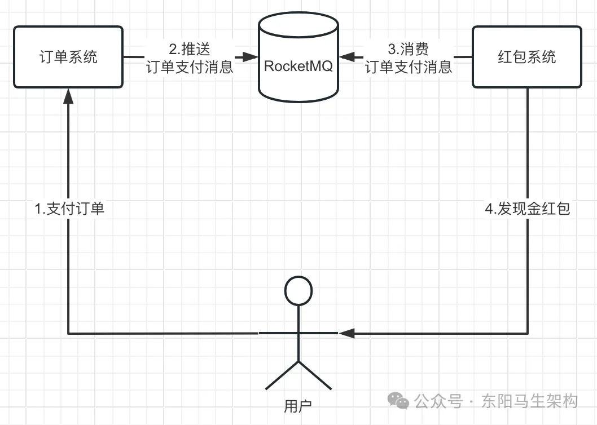

但是从订单系统和红包系统当天那个时间段的日志来看，居然只看到订单系统推送消息到 RocketMQ 的日志，却没看到红包系统从 RocketMQ 中消费消息以及发现金红包的日志。问题可能就出在这里，订单支付消息在传输过程中丢失了，导致现金红包没有派发出去。所以接下来需要分析，在使用 RocketMQ 的过程中，到底有哪些地方会导致消息丢失。

### 订单系统推送消息到 RocketMQ 可能会丢失消息

订单系统在接收到订单支付成功的回调后，会推送一条订单支付成功的消息到 RocketMQ。在这个过程中，是有可能会出现丢失消息的情况的。因为订单系统在推送消息到 RocketMQ 时是通过网络去进行传输的，如果网络发生了抖动，就会导致网络通信失败，于是可能某条消息就没有成功投递给 RocketMQ。所以订单系统投递消息到 RocketMQ 可能会因为网络问题而导致失败。

除此之外，还有其他的原因可能会导致订单系统推送消息到 RocketMQ 失败。比如 RocketMQ 确实收到消息了，但是它网络通信模块的代码出现了异常，导致消息没成功处理。比如生产者在写消息到 RocketMQ 的过程中，刚好遇到了某个 Leader Broker 故障，其他的 Follower Broker 正在尝试切换为 Leader Broker，这个过程中也可能会有异常。

所以我们在使用任何一个 MQ 时，无论是 RocketMQ、还是 RabbitMQ、或者是 Kafka，首先都要明确一点：不一定发送消息出去就一定会成功、也有可能会失败，此时代码里可能会抛出异常、也有可能不会抛异常

### 消息到达 RocketMQ 后也可能会丢失消息

即使订单系统成功把消息写入了 RocketMQ，那么消息也有可能出现丢失。因为根据 RocketMQ 的底层原理可以知道：消息写入 RocketMQ 后，RocketMQ 可能仅仅是把这个消息写入到 PageCache 里，也就是 OS 管理的一个缓冲区，这本质也属于内存。

当生产者认为已经向 RocketMQ 成功写入了一条消息，但实际上该消息可能只是仅仅进入 OS 的 PageCache，还没刷入磁盘。此时如果 Broker 机器宕机，那么 OS 的 PageCache 中的数据也就丢失了。

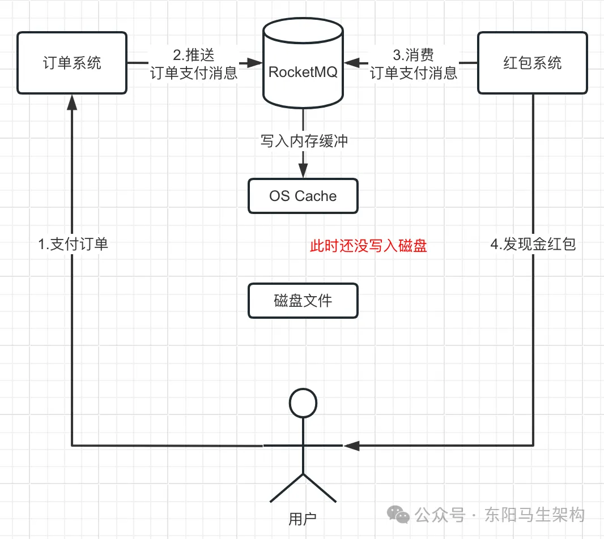

所以根据 RocketMQ 底层原理，消息数据在进入 OS 的 PageCache 时，如果碰上机器宕机，那么内存里的数据必然会丢失。此后机器即便重启了，并启动好 Broker 进程，那么这条消息数据也没了

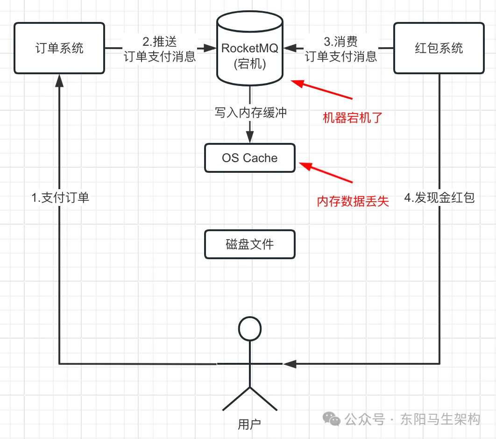

### 就算消息进入磁盘了也不是万无一失

当 Broker 把消息写入了 OS 的 PageCache，操作系统会在一段时间后把消息从内存中刷入磁盘文件里。

但是即便写入 RocketMQ 的一条消息已经进入 Broker 机器的磁盘文件里了，那么这条消息也是有可能会丢失的。因为如果 Broker 机器的磁盘出现了故障，比如磁盘坏了，那么上面存储的数据就可能会丢失。

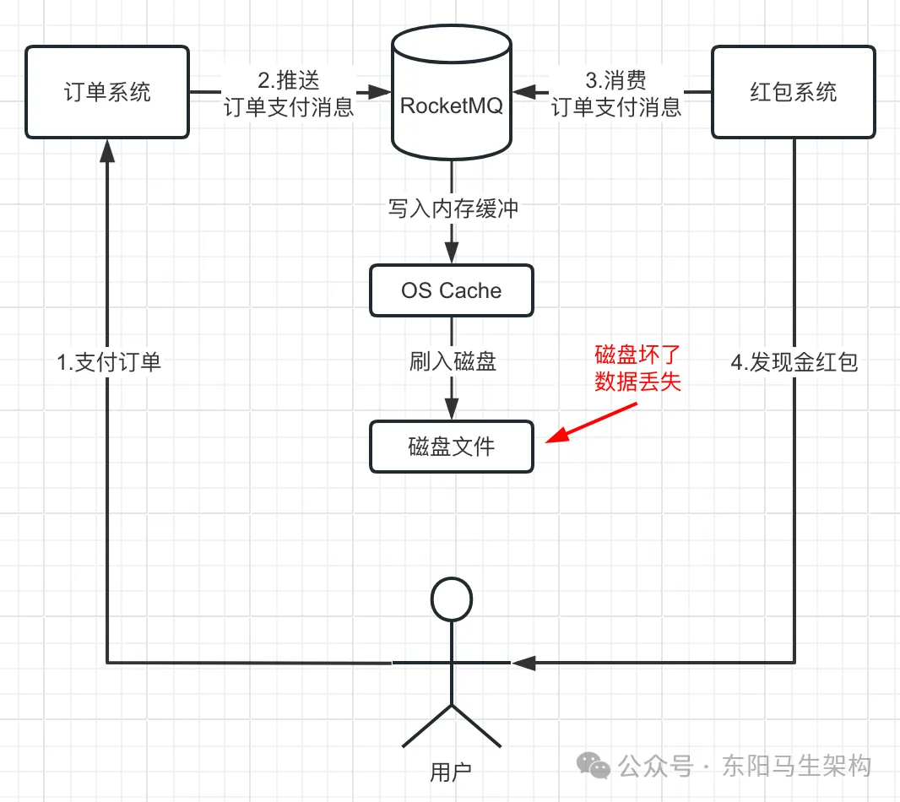

### 即使红包系统获取到消息也可能会丢失

即使红包系统顺利从 RocketMQ 里获取到一条消息，那么它也不一定能把现金红包发出去。要解释这种情况，需要了解消息 offset 的概念。

offset 表示的是消息的位置，代表了消息的标识。如下图示，假设有两条消息，offset 分别为 1 和 2。现在红包系统已经获取到了消息 1，然后消息 1 此时就在红包系统的内存里，正准备运行代码去派发现金红包(还没派发)。

由于默认情况下，RocketMQ 的消费者会自动提交已经消费的 offset。如果此时红包系统在还没处理完根据消息 1 派发红包的情况下，提交了消息 1 的 offset 到 Broker，标识已成功处理了消息 1。接着恰好红包系统突然重启或者宕机、或者在派发红包时更新数据库失败了。那么此时内存里的消息 1 必然会丢失，而且红包也还没发出去。

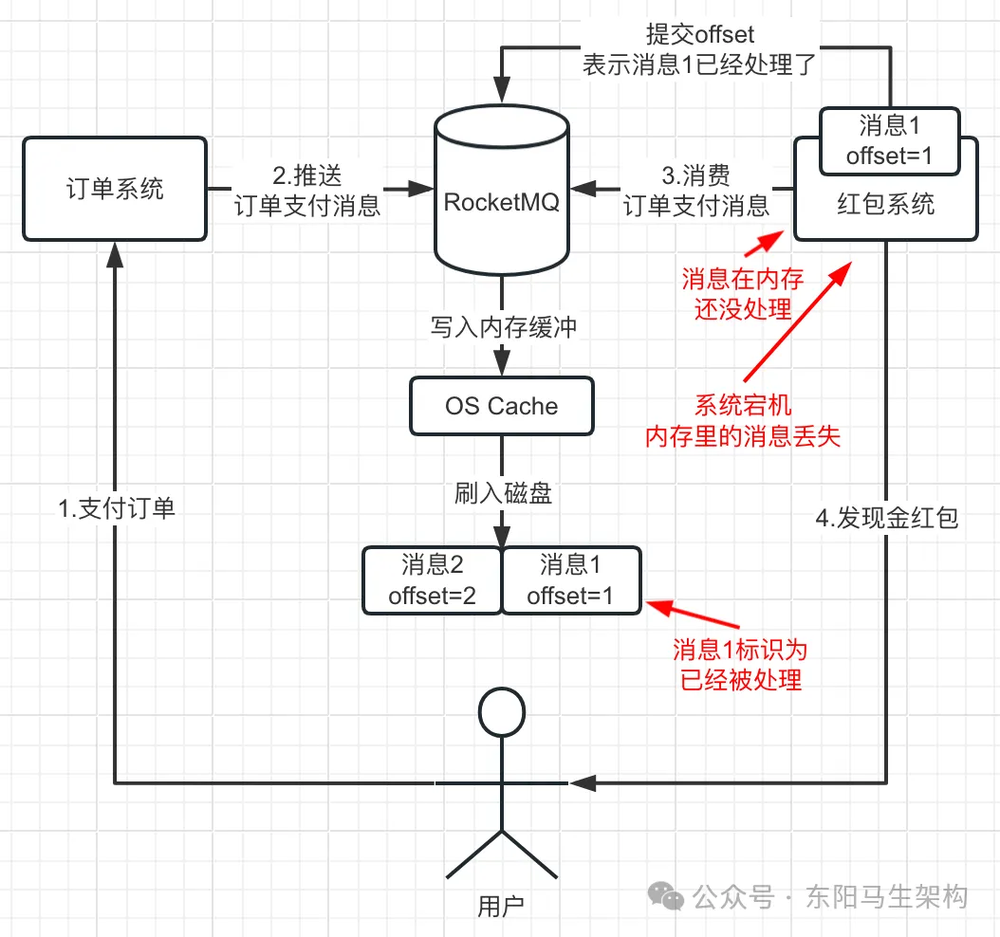

### 用户支付完后红包没发送出去的原因汇总

原因一：订单系统推送消息到 RocketMQ 失败了，消息没有被成功发送到 RocketMQ 上

原因二：消息确实推送到 RocketMQ 了，但是结果 Broker 机器故障，把消息弄丢了

原因三：红包系统拿到了消息，但是在红包还没发完的时候把消息弄丢了

如果订单系统推送了消息，结果红包系统连消息都没收到，那么可能消息根本就没发到 RocketMQ，或者 RocketMQ 弄丢了消息。如果红包系统收到了消息，结果红包没派发，那么就是红包系统弄丢了消息。

## RocketMQ 的事务消息机制实现发送消息零丢失

### 解决消息丢失的第一个问题：推送消息时丢失

首先要解决的第一个问题，就是在订单系统推送消息到 RocketMQ 的过程中，可能会因为常见的网络故障等问题导致推送消息失败。

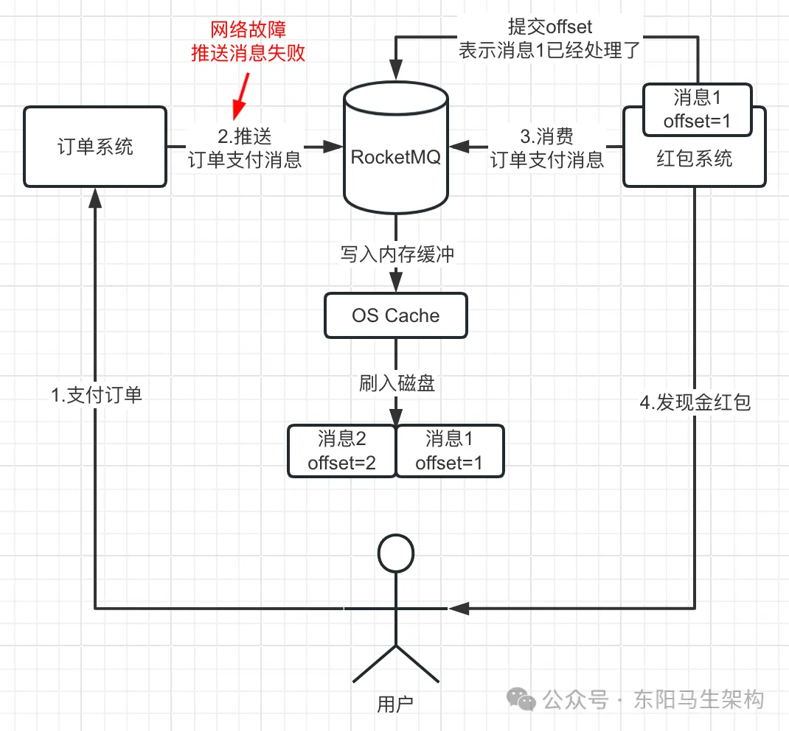

在 RocketMQ 中，有一个事务消息机制。凭借这个事务消息机制，就可以确保订单系统推送的消息一定会成功写入 RocketMQ，不会出现推送消息失败。

### 事务消息机制之发送 half 消息试探是否正常

订单系统收到一个订单支付成功的回调后，需要在自己的订单数据库里做一些增删改操作，比如更新订单状态等。然后发一条消息到 RocketMQ，让其他关注这个订单支付成功消息的系统可以从 RocketMQ 获取消息做对应的处理。

在基于 RocketMQ 的事务消息机制中，首先会让订单系统发送一条 half 消息到 RocketMQ 中。这个 half 消息本质就是一个订单支付成功的消息，只不过该消息状态是 half 状态，此时红包系统是看不见该 half 消息的。然后订单系统会等待接收这个 half 消息写入成功的响应通知。

可以想象一下，假设订单系统在收到订单支付成功的通知后，直接进行本地的数据库操作，比如更新订单状态为已完成，然后再发送消息给 RocketMQ，结果才发现 RocketMQ 挂了报异常。这时就会导致没法通过消息通知到红包系统去派发红包，那用户一定会发现自己订单支付了，结果红包没收到。

所以订单系统在收到订单支付成功的通知后做的第一件事，不是先让订单系统做一些增删改操作，而是先发一个 half 消息给 RocketMQ 以及等待它的成功响应，也就是初步和 RocketMQ 建立联系和沟通，从而让订单系统确认 RocketMQ 还活着，RocketMQ 也会知道订单系统后续可能想发送一条很关键的不希望丢失的消息给它。

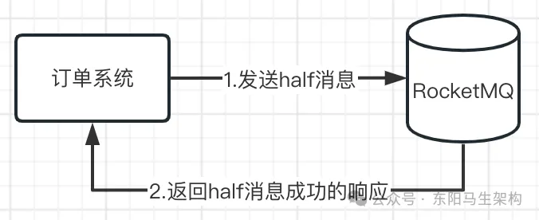

### 事务消息机制之如果 half 消息写入失败

如果订单系统发送 half 消息给 RocketMQ 失败了，可能因为订单系统报错了、可能因为 RocketMQ 挂了、或者网络故障了等原因导致 half 消息都没发送成功，此时订单系统应该执行一系列的回滚操作，比如对订单状态做一个更新，让状态变成 "关闭交易"，同时通知支付系统自动进行退款。 

因为订单虽然支付了，但是包括派发红包、发送优惠券之类的后续操作无法执行，所以此时需要把钱款退还给用户，表示交易失败了。

### 事务消息机制之如果 half 消息写入成功

如果订单系统发送 half 消息给 RocketMQ 成功了，此时订单系统就应该在自己本地的数据库里执行一些增删改操作。因为一旦 half 消息写成功，就说明 RocketMQ 肯定已经收到了这条消息、RocketMQ 还活着而且目前生产者可以跟 RocketMQ 正常沟通，所以订单系统下一步应该执行自己的增删改操作。

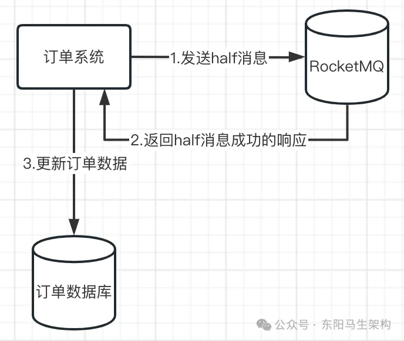

### 事务消息机制之如果本地事务执行失败

如果订单系统更新数据库失败了，比如数据库也出现网络异常、或者数据库挂了，那么订单系统就无法把订单更新为 "已完成" 这个状态。

此时应该让订单系统发送一个 rollback 请求给 RocketMQ，意思是 RocketMQ 可以把订单系统之前发过来的 half 消息删除掉。

订单系统发送 rollback 请求给 RocketMQ 删除 half 消息后，订单系统就必须执行回退流程，通知支付系统退款。当然回退流程中可能还要考虑订单系统自己的高可用降级机制：比如数据库无法更新时，订单系统需要在机器本地磁盘文件里写入订单支付失败的记录，然后订单系统会启动一个后台线程在 MySQL 数据库恢复后再把订单状态更新为 "已关闭"

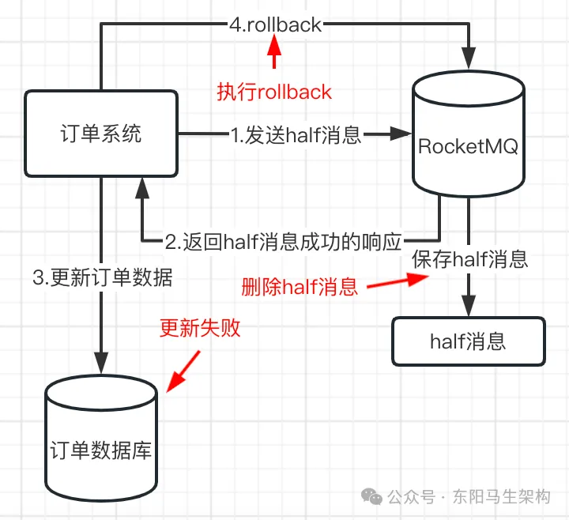

### 事务消息机制之如果本地事务执行成功

如果订单系统成功完成了本地事务的操作，比如把订单状态都更新为 "已完成"，那么订单系统就可以发送一个 commit 请求给 RocketMQ，要求 RocketMQ 对之前的 half 消息进行 commit 操作，让红包系统可以看见这个订单支付成功消息。

所谓的 half 消息实际就是订单支付成功的消息，只不过它的状态是 half。也就是当消息的状态是 half 状态时，红包系统是看不见该消息的，没法获取到该消息。必须等到订单系统执行 commit 请求，该 half 消息被 commit 后，红包系统才可以看到和获取该消息进行后续处理。

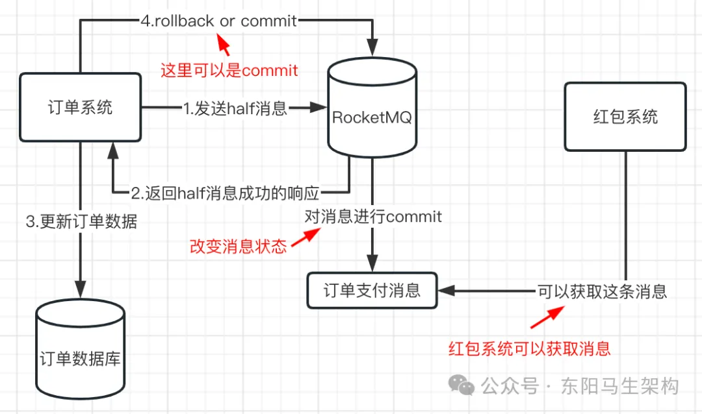

### 事务消息机制之没收到 half 消息成功的响应

如果订单系统把 half 消息发送给 RocketMQ 了，RocketMQ 也把 half 消息保存下来了，但是订单系统却没能收到 RocketMQ 返回的响应，那么此时会发生什么事情？

订单系统没收到响应，可能是由于网络超时问题，也可能是由于其他的异常问题。如果订单系统没能收到 RocketMQ 返回 half 消息成功的响应，那么就会误以为发送 half 消息到 RocketMQ 失败了，从而执行退款流程，订单状态也会被标记为 "已关闭"。

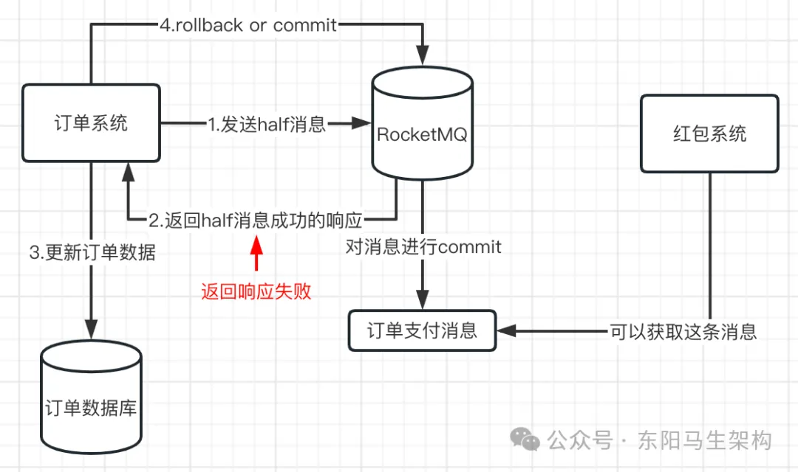

但此时 RocketMQ 已经存下来一条 half 消息了，那么对这条 half 消息应该怎么处理？其实 RocketMQ 里有一个补偿流程，它会扫描自己处于 half 状态的消息。如果订单系统一直没有对这个消息执行 commit/rollback 操作，超过一定时间，RocketMQ 就会回调订单系统的一个接口。

RocketMQ 会通过该接口询问订单系统：这个 half 消息到底怎么回事？到底是打算 commit 这个消息还是要 rollback 这个消息？这时订单系统的这个接口就会去查一下数据库，看看这个订单当前的状态，如果发现订单状态是“已关闭”，那么订单系统就要发送 rollback 请求给 RocketMQ 去删除那个 half 消息。

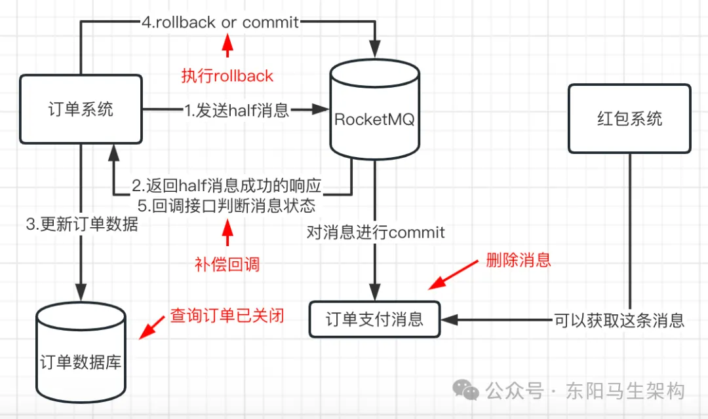

### 事务消息机制之 rollback 或 commit 发送失败

**场景一：**

如果订单系统收到了 half 消息写入成功的响应，同时尝试对自己的数据库更新了。然后根据失败或者成功去执行了 rollback 或者 commit 请求，发送给 RocketMQ 了。结果因为网络故障，导致 rollback 或者 commit 请求发送失败了。

这时候因为 RocketMQ 里的消息一直是 half 状态，所以 RocketMQ 过了一定的超时时间就会发现这个 half 消息有问题，于是就会回调订单系统的接口。然后订单系统的接口就可以判断一下订单状态是否为 "已完成"，并决定执行 commit 请求还是 rollback 请求。

因此这个回调就是一个补偿机制：如果订单系统没收到 half 消息的响应，或者 rollback、commit 请求没发送成功，RocketMQ 都会来询问订单系统如何处理 half 消息。

**场景二：**

如果订单系统收到了 half 消息写入成功的响应，同时尝试对自己的数据库更新了。然后根据失败或者成功去执行了 rollback 或者 commit 请求，发送给 RocketMQ 了。但此时 RocketMQ 却挂掉了，导致 rollback 或者 commit 请求发送失败。

这时候就需要等 RocketMQ 自己重启，重启后它会扫描 half 状态的消息，然后还是通过补偿机制，回调订单系统的接口。

### RocketMQ 事务消息的全流程总结

**情况一：** 如果 RocketMQ 有问题或者网络有问题，half 消息根本都发不出去。此时 half 消息肯定是失败的，那么订单系统就不会执行后续的流程。

**情况二：** 如果 half 消息发送出去了，但是 half 消息的响应没有收到，然后执行了退款流程。那么 RocketMQ 会有补偿机制来回调订单系统询问要 commit 还是 rollback，此时订单系统选择 rollback 删除消息就可以了，不会执行后续流程。

**情况三：** 如果订单系统收到 half 消息的响应了，结果订单系统自己更新数据库失败了。那么它也会进行回滚，不会执行后续流程。

**情况四：** 如果订单系统收到 half 消息的响应了，然后还更新自己数据库成功了，订单状态是 "已完成"。此时必然会发送 commit 请求给 RocketMQ，一旦消息 commit 了，那么必然保证红包系统可以收到这个消息。而且即使 commit 请求发送失败了，RocketMQ 也会有补偿机制，通过回调订单系统的接口来判断是否重新发送 commit 请求。

总之，只要订单系统本地事务成功了，那么必然会保证 RocketMQ 里的 half 消息被 commit，从而让红包系统看到该消息。

所以，通过 RocketMQ 的事务消息机制，可以保证订单系统一旦成功执行了数据库操作，就一定会通知到红包系统派发红包，至少订单系统到 RocketMQ 之间的消息发送不会出现消息丢失的问题。

## RocketMQ 事务消息机制的底层实现原理

### half 消息是如何对消费者不可见的

前面介绍了 RocketMQ 事务消息的全流程，在这个流程中，第一步会由订单系统发送一个 half 消息给 RocketMQ。对于这个 half 消息，红包系统刚开始是看不到它的，没法消费这条消息进行处理。那么这个 half 消息是如何做到不让红包系统看到的呢？这就涉及到 RocketMQ 底层采取的一个巧妙的设计了。

假设订单系统发送了一个 half 状态的订单支付消息到 OrderPaySuccessTopic 里，然后红包系统也订阅了这个 OrderPaySuccessTopic 从里面获取消息。

根据前面 RocketMQ 的底层原理可知：向一个 Topic 写入消息，首先会定位这个 Topic 的某个 MessageQueue，然后会定位一台 Broker 机器，接着会将消息写入到这个 Broker 机器的 CommitLog 文件，同时将消息偏移量写入到该 Broker 机器上的 MessageQueue 对应的 ConsumeQueue 文件。

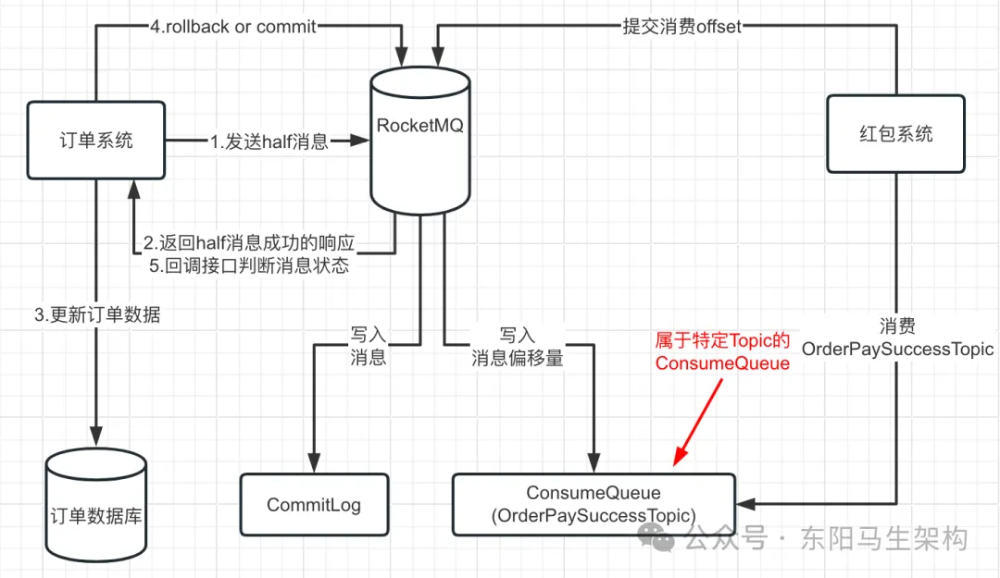

通过上图可知：如果要写入一条 half 消息到 OrderPaySuccessTopic 里，需要先定位到这个 Topic 的一个 MessageQueue，然后定位到 RocketMQ 的一台 Broker 机器上，接着将 half 消息写入到该 Broker 机器上的 CommitLog 文件，同时消息的 offset 会写入该到 Broker 机器上的 MessageQueue 对应的 ConsumeQueue，该 ConsumeQueue 是属于 OrderPaySuccuessTopic 的，最后红包系统才能从这个 ConsumeQueue 里获取到写入的这个 half 消息。

但实际上红包系统却没法看到这条 half 消息，原因是 RocketMQ 一旦发现生产者发送的是一个 half 消息，那么它就不会把这个 half 消息的 offset 写入 OrderPaySuccessTopic 的 ConsumeQueue 里，而是会把这条 half 消息写入到自己内部的 RMQ_SYS_TRANS_HALF_TOPIC 这个 Topic 对应的一个 ConsumeQueue 里。

所以对于事务消息机制下的 half 消息：RocketMQ 是写入内部 Topic 的 ConsumeQueue 的，不是写入生产者指定的 OrderPaySuccessTopic 的 ConsumeQueue 的。因此红包系统自然就无法从 OrderPaySuccessTopic 的 ConsumeQueue 中看到这条 half 消息了。

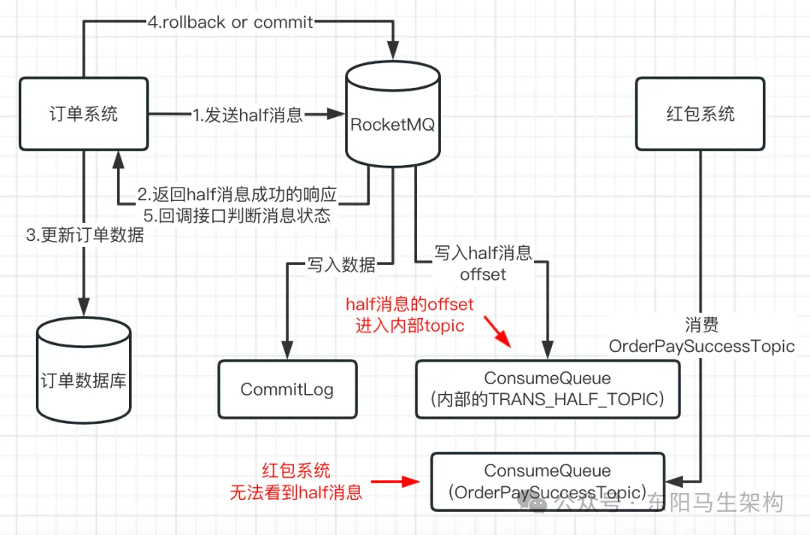

### 订单系统何时会收到 half 消息成功的响应

在什么情况下订单系统会收到 half 消息成功的响应呢？简单来说，必须要 half 消息进入到 RocketMQ 内部的 RMQ_SYS_TRANS_HALF_TOPIC 的 ConsumeQueue 文件了，此时才会认为 half 消息写入成功，然后才会返回响应给订单系统。

所以一旦订单系统收到 half 消息写入成功的响应，那就代表着这个 half 消息已经在 RocketMQ 内部了。

### 如果没有执行 rollback 或 commit 会怎样

如果因为网络故障，订单系统没收到 half 消息的响应，或者发送的 rollback/commit 请求失败了，那么 RocketMQ 会怎么处理呢？

其实 RocketMQ 会有一个定时任务，定时扫描 RMQ_SYS_TRANS_HALF_TOPIC 中的 half 消息。如果这些消息超过一定时间还是 half 消息，就会回调订单系统的接口来判断这个 half 消息是要 rollback 还是 commit。

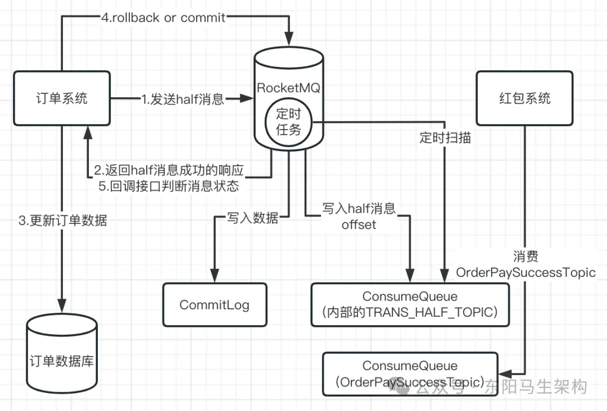

### 处理 rollback 请求时如何标记消息回滚

假设订单系统发送了 rollback 请求，那么 RocketMQ 就需要对消息进行回滚。RocketMQ 会删除对应的 half 消息，但并不是在磁盘文件里删除。

RocketMQ 内部有一个 OP_TOPIC，在处理 half 消息的 rollback 请求时，会向这个 Topic 写入一条 OP 记录，标记这个 half 消息为 rollback 状态。

如果订单系统一直没有执行 commit/rollback，RocketMQ 会回调订单系统的接口去判断 half 消息的状态。但是 RocketMQ 最多回调 15 次，如果 15 次之后订单系统都没法告知 half 消息的状态，就自动把 half 消息标记为 rollback 状态。

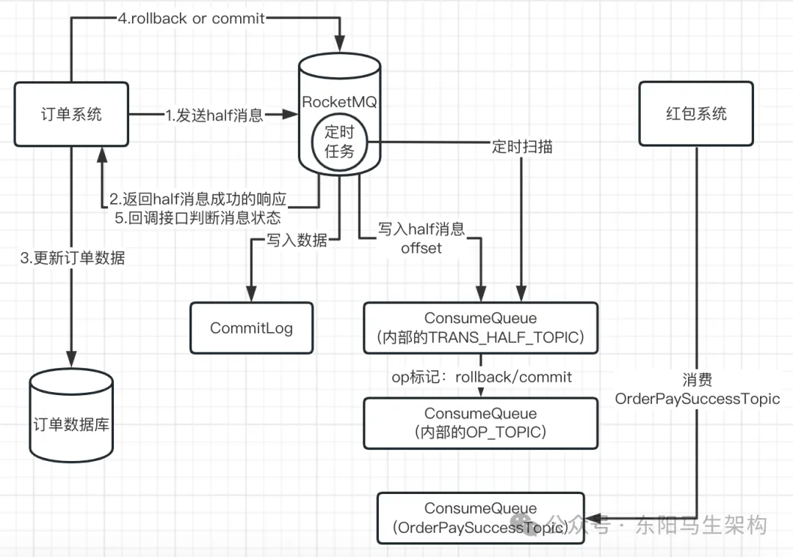

### 处理 commit 请求时如何让消息可见

假设订单系统发送了 commit 请求，那么 RocketMQ 需要让消息可见。

RocketMQ 在处理 half 消息的 commit 请求时，首先会在 OP_TOPIC 里写入一条 OP 记录，然后标记这条 half 消息为 commit 状态，接着会把 RMQ_SYS_TRANS_HALF_TOPIC 中的 half 消息写入到 OrderPaySuccessTopic 的 ConsumeQueue 里，这样红包系统才可以看到这条消息并进行消费。

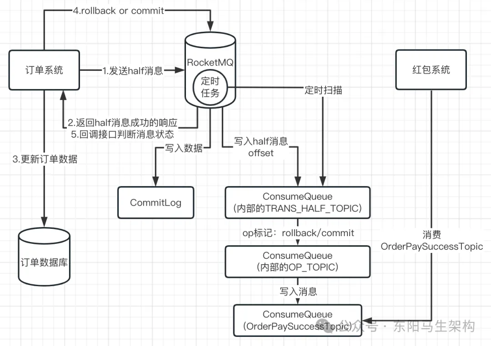

## 同步刷盘+Raft 协议同步实现发送消息零丢失

### 使用事务消息机制就一定不会丢消息吗

RocketMQ 的事务消息机制是 RocketMQ 非常核心以及重要的一个功能，该功能可以实现在生产消息的环节不丢失数据，而且最重要的是，可以保证两个业务系统的数据一致性。但是即使在生产消息时用了事务消息机制，也未必就真的可以保证数据不丢失。

假设现在订单系统已经通过事务消息的机制，通过 half 消息 + commit 的方式，在 RocketMQ 里提交了消息。也就是对于 RocketMQ 而言，那条消息已经进入到它的存储层了，可以被红包系统看到了。

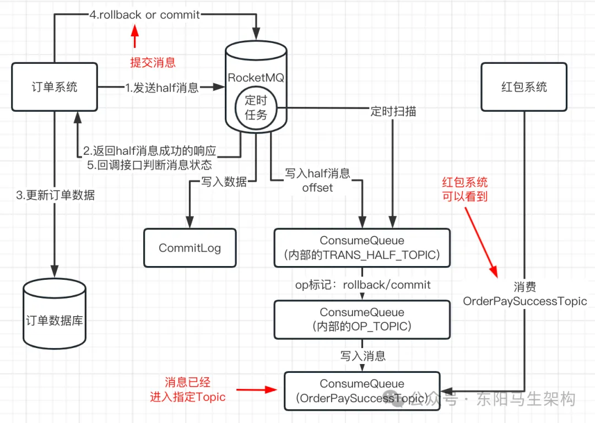

由上图可见，生产者生产的这条消息在 commit 之后，会从内部的 TRANS_HALF_TOPIC 进入生产者的 OrderPaySuccessTopic 中。但是这条消息此时仅仅是进入生产者指定的 Topic 而已，仅仅是可以被红包系统看到而已，此时红包系统可能还没来得及去获取这条消息。

然而恰好在此时，这条消息还停留在 OS 的 PageCache 中，还没进入到 ConsumeQueue 磁盘文件里，然后这台 Broker 机器突然宕机了，OS 的 PageCache 中的数据全部丢失。从而导致这条消息也会丢失，红包系统再也没机会读到这条消息了。

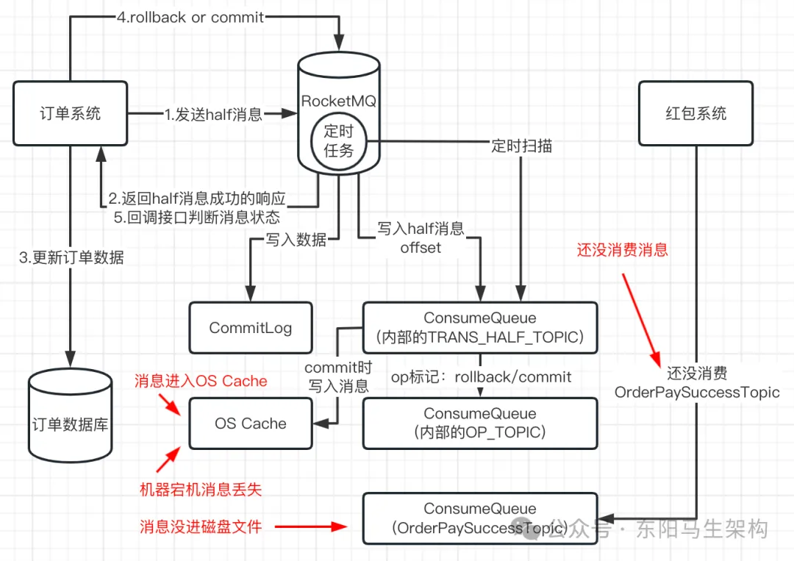

### 消息进了磁盘就不会丢了吗

即使这条消息已经进入了 OrderPaySuccessTopic 的 ConsumeQueue 磁盘文件了，不只是停留在 OS 的 PageCache 里了，此时消息也未必一定不会丢失。

即使消息已经进入磁盘文件，但是这个时候红包系统还没来得及消费这条消息，然后此时这台机器的 PageCache 已经没有了这条消息，同时磁盘突然坏了。这样也一样会导致消息丢失，而且这条消息可能再也找不回来了。

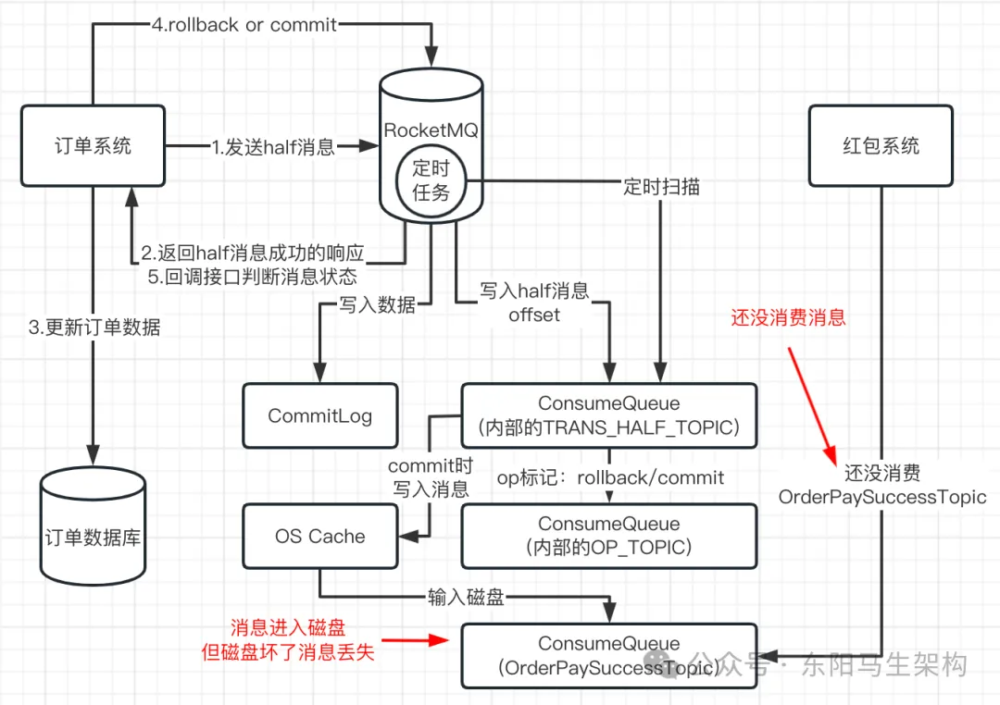

### 保证消息写入 MQ 不代表不丢失

所以需要明确一个前提：无论是通过比较简单的同步发送消息 + 反复重试的方案，还是事务消息机制的方案，哪怕已经确保消息成功写入了 RocketMQ，此时消息也未必就不会丢失。

因为即使写入 RocketMQ 成功，这条消息也大概率是还停留在 OS 的 PageCache 中，一旦 RocketMQ 机器宕机，其内存里的数据也都会丢失。甚至哪怕消息已经进入了 RocketMQ 机器的磁盘文件，一旦磁盘坏了，消息也同样可能会丢失。

如果消息丢失了，消费者还没来得及消费，那么该消息就永远没机会被消费了

### 异步刷盘 vs 同步刷盘

所以到底怎么去确保消息写入 RocketMQ 后，RocketMQ 自己不会丢失数据呢？解决这个问题的第一个关键点，就是将异步刷盘调整为同步刷盘。

所谓的异步刷盘指的是：消息即使成功写入了 RocketMQ，它也只是在机器的 OS PageCache 中，还没有进入磁盘里，要过一会儿等操作系统自己把 PageCache 里的数据刷入磁盘文件中

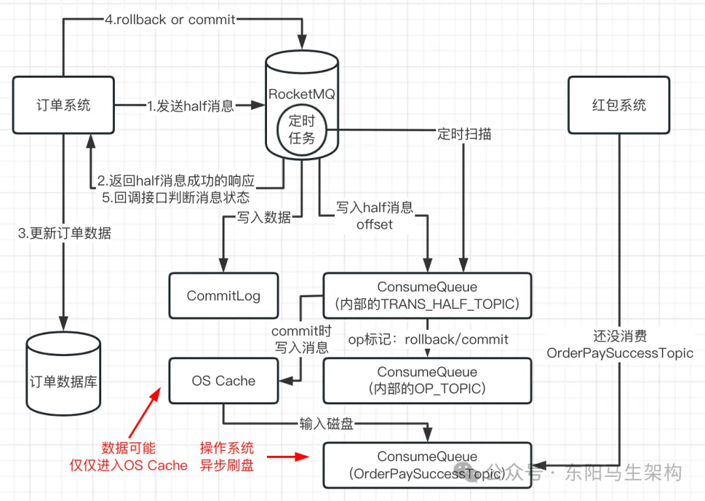

所以在异步刷盘的模式下，消息写入的吞吐量肯定是极高的，毕竟消息只要进入 OS 的 PageCache 这个内存就可以了。写消息的性能就是写内存的性能，但是这个情况下可能就会有数据丢失的风险。

因此如果一定要确保数据零丢失，可以调整 RocketMQ 的刷盘策略为同步刷盘。需要调整 Broker 的配置文件，将 flushDiskType 参数的值设置为 SYNC_FLUSH，flushDiskType 参数的默认值是 ASYNC_FLUSH，即异步刷盘。

如果调整为同步刷盘后，写入 RocketMQ 的每条消息，只要 RocketMQ 返回写入成功，那么消息就一定是已进入磁盘文件。比如发送 half 消息时，只要 RocketMQ 返回响应就是 half 消息发送成功了，那么就说明消息已经进入磁盘文件。

所以如果使用同步刷盘的策略，是可以确保写入 RocketMQ 的消息一定是已经进入磁盘文件的。

### 通过主从架构避免磁盘故障导致数据丢失

如何避免磁盘故障导致的数据丢失？其实解决方法很简单，就是对 Broker 使用主从架构的模式。

也就一个 Master Broker 必须要有一个 Slave Broker 去同步它的数据。而且 Master Broker 中的一条消息写入成功，Slave Broker 也必须是写入成功，保证数据有多个副本的冗余。

这样一来，一条消息只要写入成功了，那么主从两个 Broker 上就会都有这条数据。此时如果 Master Broker 的磁盘坏了，但是 Slave Broker 上至少还是有数据的，数据不会因为磁盘故障而丢失。

Broker 的主从同步架构，一般是基于 DLedger 技术和 Raft 协议实现的。所以如果采用了基于 DLedger 技术和 Raft 协议的主从同步架构，那么对于所有的消息写入，只要写入成功，就一定会通过 Raft 协议同步给其他的 Broker 机器。

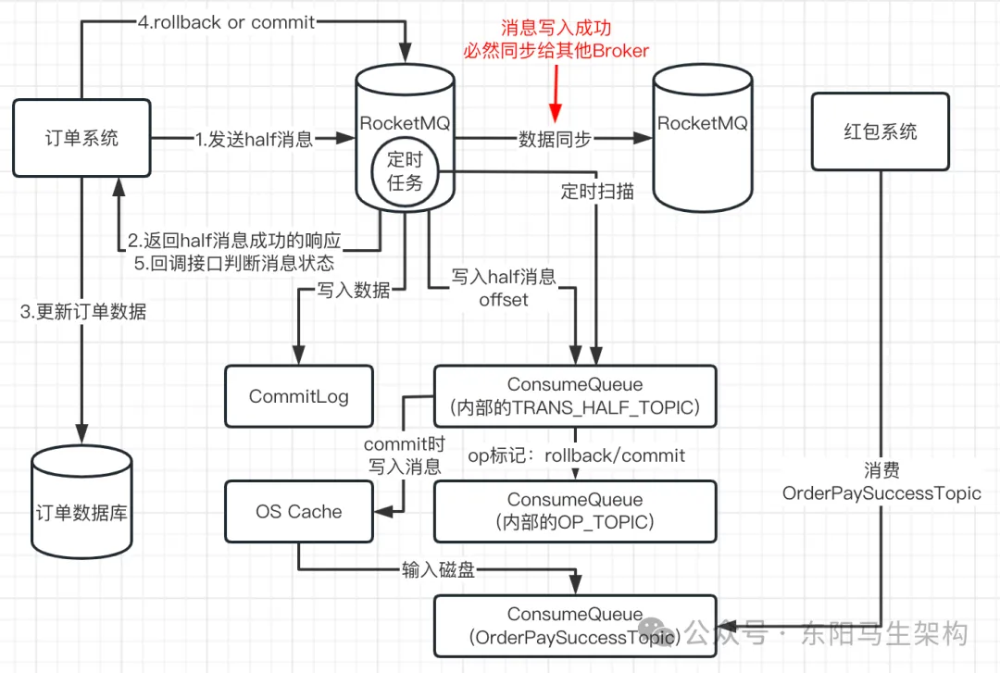

### RocketMQ 确保数据零丢失的方案总结

 根据以上分析可知：只要把 Broker 的刷盘策略调整为同步刷盘，那么就绝对不会因为机器宕机而丢失数据。只要采用了基于 DLedger 技术和 Raft 协议的主从架构的 Broker 集群，那么一条消息写入成功，就意味着多个 Broker 机器都写入了，此时任何一台机器的磁盘故障，数据也是不会丢失的。

这样，只要 Broker 层面保证写入的数据不丢失，后续就一定可以让消费者消费到这条消息。

## 基于 RocketMQ 全链路的消息零丢失方案总结

### 对全链路消息零丢失方案进行总结

**一.发送消息到 RocketMQ 的零丢失**

方案一：同步发送消息 + 反复重试

方案二：事务消息机制

两者都有保证消息发送零丢失的效果，但是经过分析，事务消息方案整体会更好一些。

**二.RocketMQ 收到消息之后的零丢失**

开启同步刷盘策略 + 主从架构同步机制

只要让一个 Broker 收到消息后同步写入磁盘，同时同步复制给其他 Broker，然后再返回响应给生产者表示写入成功，那么就可以保证 RocketMQ 自己不会丢失消息。

**三.消费消息的零丢失**

RocketMQ 的消费者可以保证处理完消息后，才会提交消息的 offset 给 Broker，所以只要注意避免采用多线程异步处理消息时提前提交 offset 即可。

如果想要保证在一条消息基于 RocketMQ 流转时绝对不会丢失，那么可以采取上述一整套方案。

### 消息零丢失方案会导致吞吐量大幅度下降

一.在发送消息到 RocketMQ 的环节中，如果生产者仅仅只是简单的把消息发送到 RocketMQ。那么不过就是一次普通的网络请求罢了，生产者发送请求到 RocketMQ 然后接收返回的响应。这个性能自然很高，吞吐量也是很高的。如下图示：

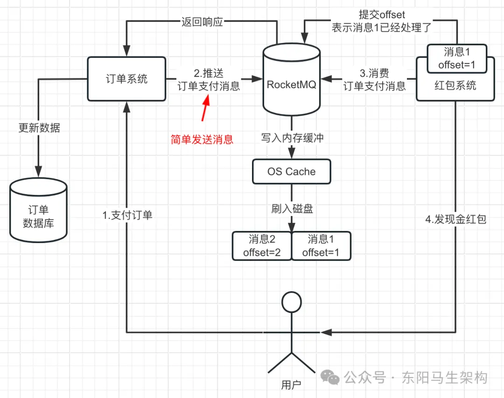

二.如果生产者改成了基于事务消息的机制之后，那么此时实现原理如下图示，会涉及到 half 消息、commit or rollback、写入内部 Topic、回调机制等诸多复杂的环节。生产者光是成功发送一条消息，至少要 half + commit 两次请求。

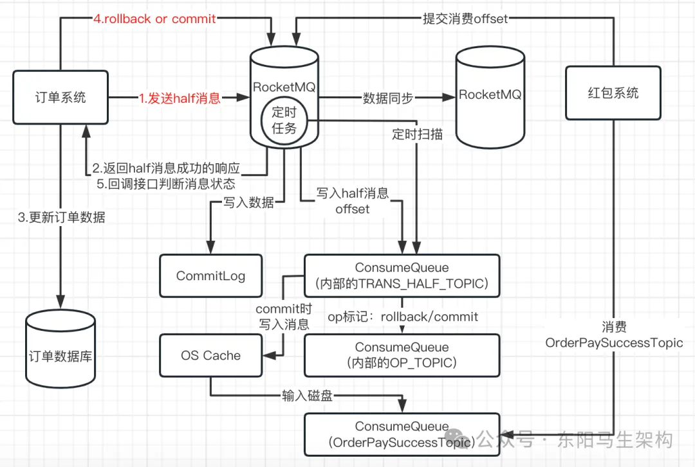

所以当生产者一旦上了如此复杂的方案之后，势必会导致生产者发送消息的性能大幅度下降，从而导致发送消息到 RocketMQ 的吞吐量大幅度下降。

三.当 Broker 收到消息后，一样会让性能大幅度下降。首先 RocketMQ 的一台 Broker 机器收到消息后，会直接把消息刷入磁盘，这个性能就远远低于直接写入 OS PageCache 的性能。写入 OS 的 PageCache 相当于是写内存，可能仅仅需要 0.1ms，但是写入磁盘文件可能就需要 10ms。

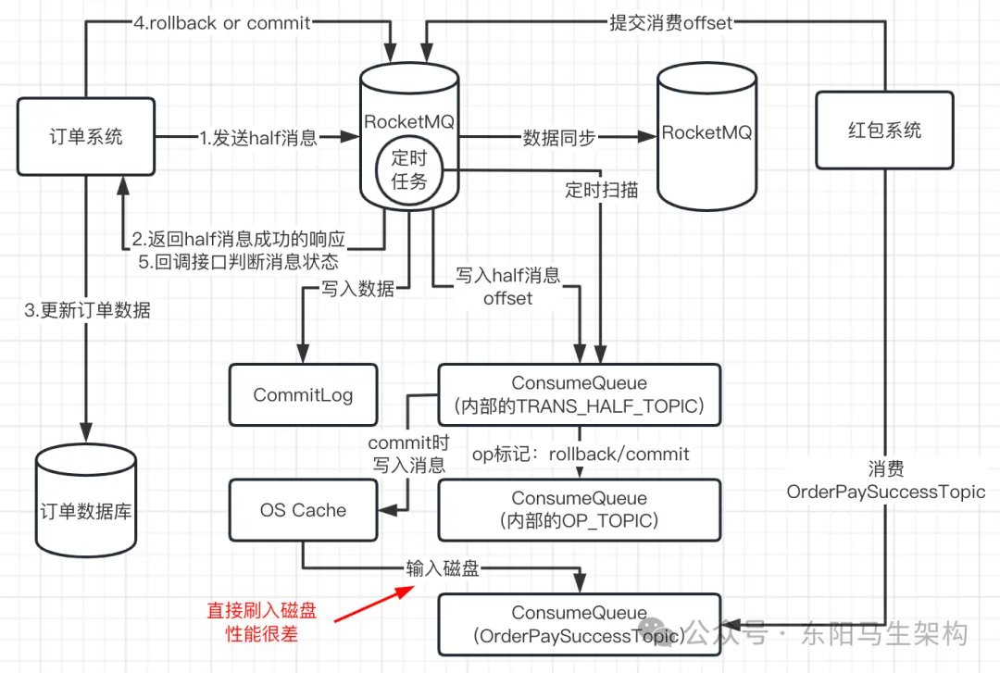

四.接着这台 Broker 还需要把消息复制给其他 Broker 完成多副本的冗余。这个过程涉及到两台 Broker 机器之间的网络通信 + 另外一台 Broker 机器需要写数据到自己本地磁盘，同样会比较慢。

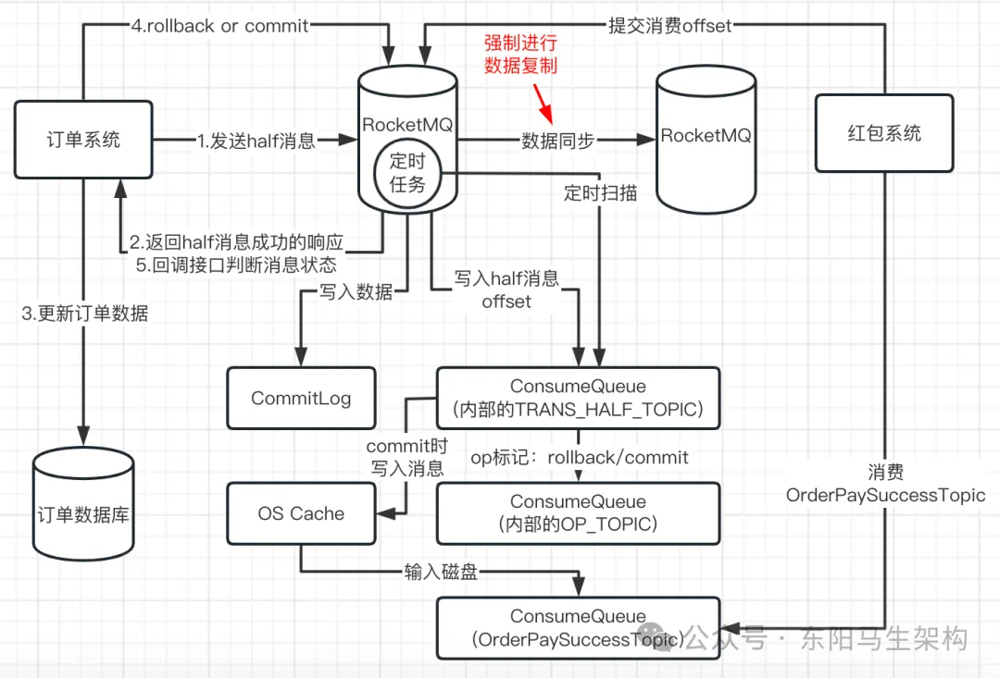

在 Broker 完成了上述两个步骤后，接着才能返回响应告诉生产者这次消息写入已经成功。

由此可见，写入一条消息需要强制同步刷磁盘，而且还需要同步复制消息给其他 Broker 机器。这两个步骤可能就让原本只要 10ms 完成的变成 100ms 完成了。所以也势必会导致性能和吞吐量大幅下降。

五.当消费者拿到消息之后，比如开启一个子线程去处理这批消息，然后就直接返回 CONSUME_SUCCESS 状态，接着就可以去处理下一批消息了。如果这样的话，该消费者消费消息的速度会很快，吞吐量也会很高。

但为了保证数据不丢失，消费者必须在处理完一批消息后再返回 CONSUME_SUCCESS 状态。那么消费者处理消息的速度就会降低，吞吐量自然会下降。

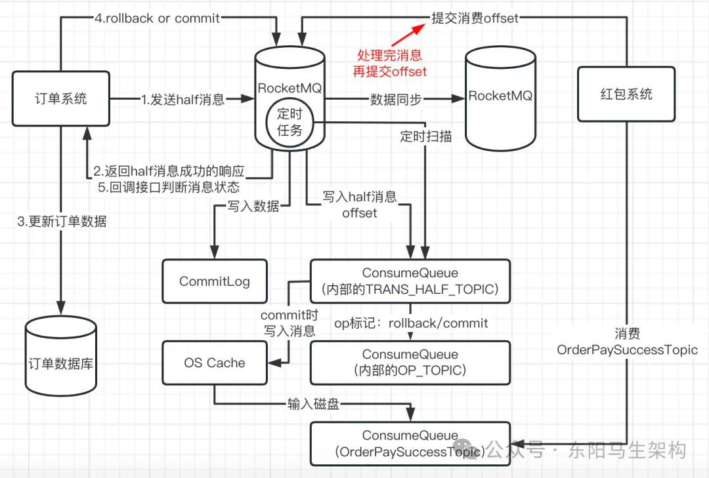

### 消息零丢失方案到底适合什么场景

所以如果系统一定要使用消息零丢失方案，那么必然导致从头到尾的性能下降以及吞吐量下降，因此一般不要轻易在一个业务里使用如此重的一套方案。

一般来说，与金钱、交易以及核心数据相关的系统和核心链路，可以使用这套消息零丢失方案。

比如支付系统，它是绝对不能丢失任何一条消息的，性能可以低一些，但是不能有任何一笔支付记录丢失。比如订单系统，公司一般是不能轻易丢失一个订单的，毕竟一个订单就对应一笔交易。如果订单丢失，用户还支付成功了，轻则要给用户赔付损失，重则弄不好要经受官司。特别是一些 B2B 领域的电商，一笔线上交易可能多大几万几十万。

所以，对于这种非常核心的场景和少数核心链路的系统，才会建议使用这套复杂的消息零丢失方案。