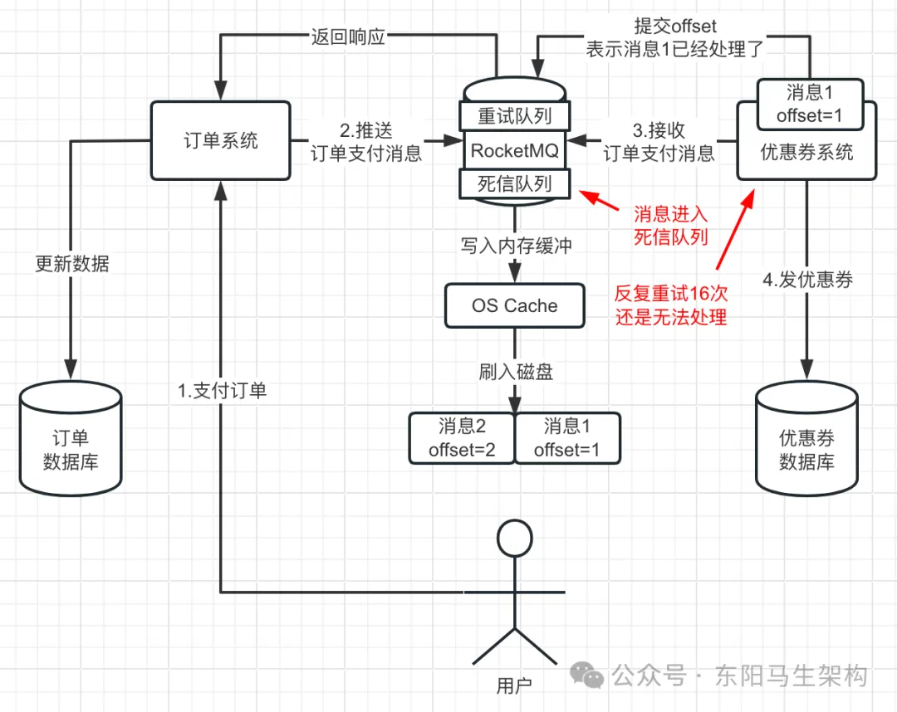
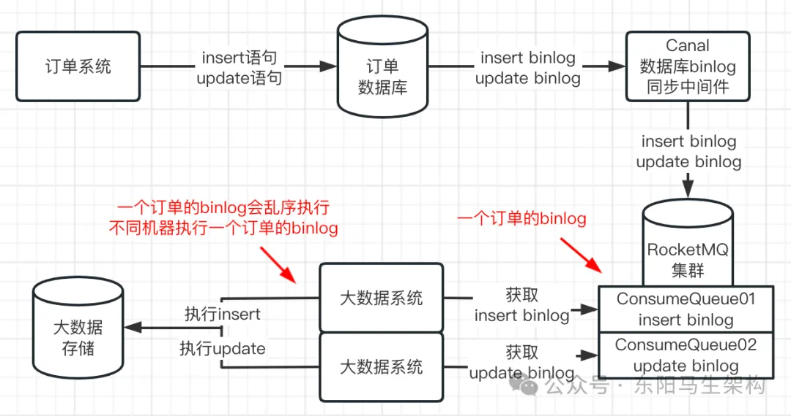
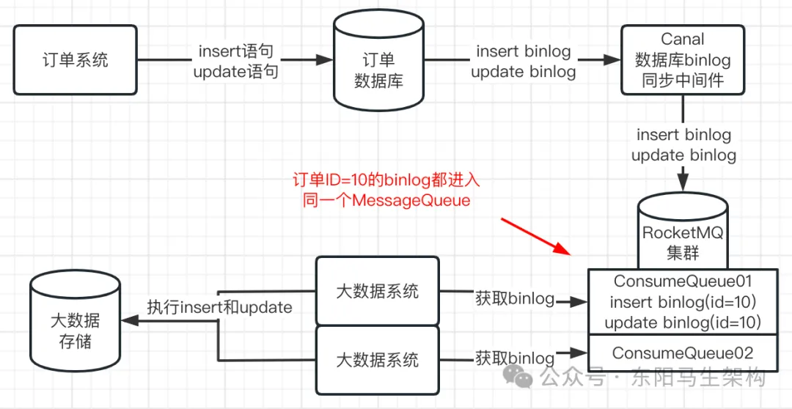

## 如何用死信队列处理优惠券系统数据库宕机

### RocketMQ 如何让消费者进行消费重试

RocketMQ 在收到返回的 RECONSUME_LATER 状态后，是如何让消费者进行消费重试的？

简单来说，RocketMQ 会有一个针对这个 ConsumerGroup 的重试队列。如果返回了 RECONSUME_LATER 状态，RocketMQ 就会把这批消息放到这个消费组的重试队列中。

比如消费组的名称是 VoucherConsumers，意思是优惠券系统的消费组，那么 RocketMQ 会有一个名为%RETRY%VoucherConsumers 的重试队列。


然后过一段时间后，重试队列中的消息会再次给到消费者，让消费者进行处理。如果再次失败，又返回了 RECONSUME_LATER，那么会再过一段时间让消费者继续进行重试处理，默认最多重试 16 次。每次重试之间的间隔时间是不一样的，这个间隔时间可以如下进行配置：

```ini
messageDelayLevel=1s 5s 10s 30s 1m 2m 3m 4m 5m 6m 7m 8m 9m 10m 20m 30m 1h 2h
```

### 如果连续重试 16 次还是无法处理消息

在 16 次的重试范围内，如果处理消息成功了，那么自然就没问题了。但是如果消费者对一批消息重试了 16 次还是无法处理成功，这时就需要另外一个队列了，该队列叫做死信队列。所谓死信队列，就是死掉的消息就会放这个队列里。

所谓死掉的消息，其实就是一批消息交给消费者处理，消费者重试了 16 次都没法处理成功，那么 RocketMQ 就认为它们死掉了，然后会把这批消息放入死信队列中。

死信队列的名字是%DLQ%VoucherConsumers，这可以在 RocketMQ 的管理后台上看到。



那么死信队列中的消息应该怎么处理呢，这个就看使用场景了。比如可以专门启动一个后台线程订阅%DLQ%VoucherConsumers 这个死信队列，然后对死信队列中的消息一直不停地进行重试处理。

## 如何解决 RocketMQ 的消息乱序问题

### RocketMQ 中消息乱序的原因

在订单数据库的同步过程中，产生消息乱序问题的根本原因是：属于同一个订单的 binlog 进入了不同的 MessageQueue，从而导致一个订单的 binlog 被不同机器上的 Consumer 获取来处理，最终导致这一个订单的 binlog 被乱序执行。所以这个消息乱序的原因可如下图示：



### 让同一订单的 binlog 进入同一 MessageQueue

所以要解决消息乱序的问题，方法就是让同一个订单的 binlog 进入同一个 MessageQueue 里。具体的做法就是往 RocketMQ 发送 binlog 时根据订单 ID 对 MessageQueue 的数量进行取模来选择一个 MessageQueue。

比如有一个订单 ID 是 10，它有 2 条 binlog，对这两条 binlog，用订单 ID = 10 对 MessageQueue 的数量进行取模。如果 MessageQueue 一共有 8 个，那么此时订单 ID = 10 对 8 取模就是 2。也就是说，凡是订单 ID = 10 的 binlog，都应该进入位置为 2 的 MessageQueue 中。

通过这个方法，就可以让一个订单的 binlog 都按顺序进入同一个 MessageQueue 中。

```java
SendResult sendResult = producer.send(
    message,
    new MessageQueueSelector() {
        @Override
        public MessageQueue select(List<MessageQueue> mqs, Message msg, Object arg) {
            //根据订单ID选择发送queue
            Long orderId = (Long) arg;
            long index = orderId % mqs.size();//用订单ID对MessageQueue数量取模
            return mqs.get((int) index);//返回一个MessageQueue
        }
    },
    orderId//这里传入订单ID
);
```



### 消费者获取 binlog 时也需要有序

首先，MySQL 数据库中存储的 binlog 一定都是有序的。比如订单系统对订单数据库执行了两条 SQL，先是 insert 语句，然后是 update 语句。那么 MySQL 数据库在磁盘文件里会按顺序先写入 insert 语句的 binlog，然后再写入 update 语句的 binlog。

然后，从 MySQL 数据库中获取 binlog 时，此时必须按 binlog 的顺序来获取。也就是 Canal 作为一个中间件从 MySQL 中获取 binlog 时，需要按 binlog 的顺序来获取。

接着，Canal 将 binlog 发送给 RocketMQ 时，必须要将同一个订单的 binlog 都发送到同一个 MessageQueue 里，而且发送时也必须严格按照顺序来发送。

只有这样，才能让同一个订单的 binlog 有序地进入同一个 MessageQueue。之后消费者从这个 MessageQueue 中获取这个订单的 binlog 时，才能有序地获取。

由于一个 Consumer 可以处理多个 MessageQueue 的消息，但是一个 MessageQueue 只能交给同一个 Consumer 来处理，所以同一个订单的 binlog 有序地进入同一个 MessageQueue 后，会有序地交给同一个 Consumer 来处理。

### 如果消息处理失败了不能进入重试队列

消费者处理消息时，可能会因为底层存储挂了导致消息处理失败，此时可以返回消息的 RECONSUME_LATER 状态，这样 Broker 过一会儿会自动让消费者进行重试。

但是为了保证消息有序，不能让处理失败的消息进入重试队列。因为如果消费者获取到一个订单的一条 insert binlog，结果处理失败了，此时返回了 RECONSUME_LATER。那么这条消息就会进入重试队列，过一会儿才交给消费者重试。但此时 Broker 会直接把下一条消息，也就是这个订单的 update binlog 交给消费者来处理。此时如果消费者执行成功了，发现根本没有数据可以更新，又会出现消息乱序的问题。

所以为了保证消息有序，如果消息处理失败，就必须返回 SUSPEND_CURRENT_QUEUE_A_MOMENT 状态，该状态的意思是先等一会儿再继续处理这批消息。而不能把这批消息放入重试队列，然后直接处理下一批消息。

### 有序消息方案与其他消息方案的结合

如果消费者一定要求消息是有序的，那么必须要让：同一个订单的 binlog 都进入同一个 MessageQueue 中 + Cannel 获取和发送 binlog 时要有序 + binlog 写入 MessageQueue 时要有序 + 消费者处理消息时要有序 + 消息处理失败时不能进入重试队列而要暂停等待继续处理。

如果在这个方案的基础上还要确保消息不丢失，那么可以和消息零丢失方案结合起来。如果还要避免消息重复处理，那么还需要在消费者处理消息时，判断消息是否已经处理过，已经处理过就不能重复处理了。
