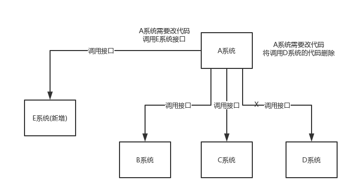
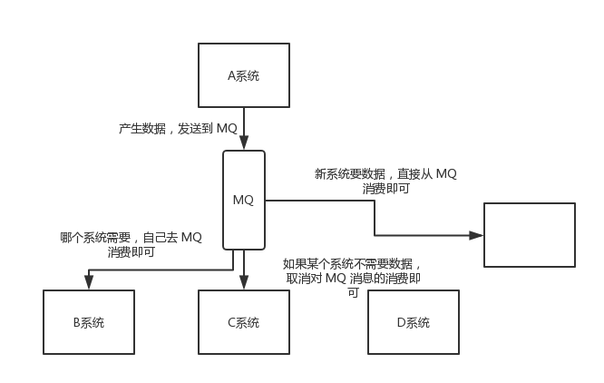
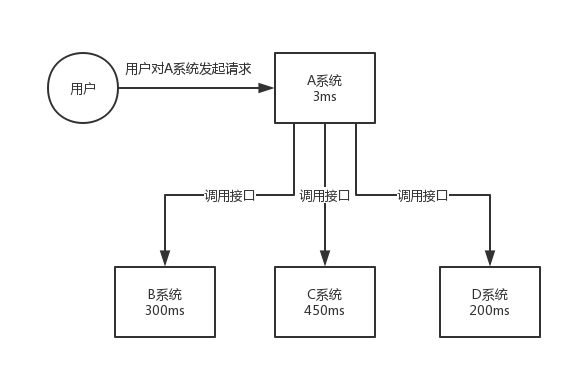
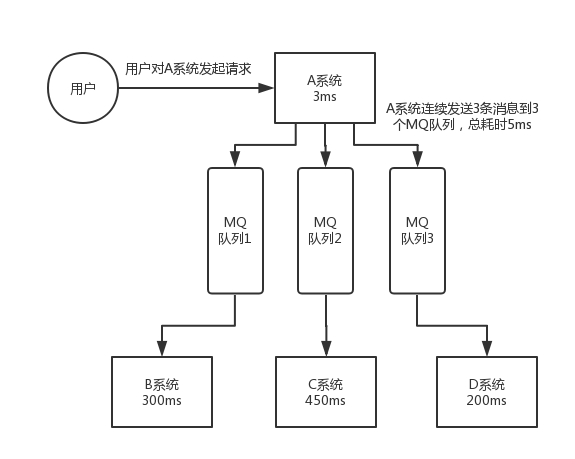
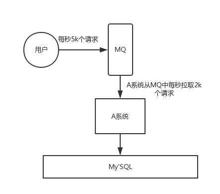
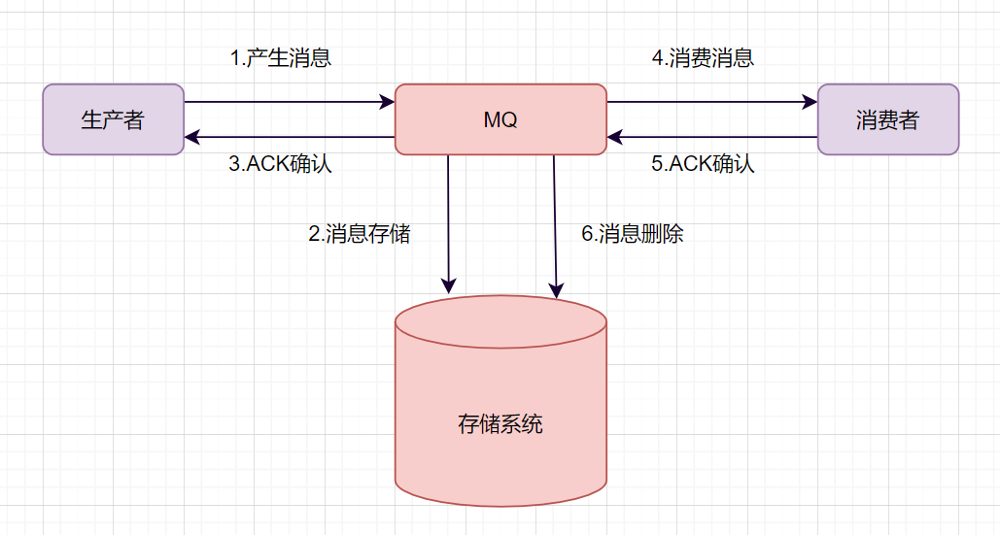
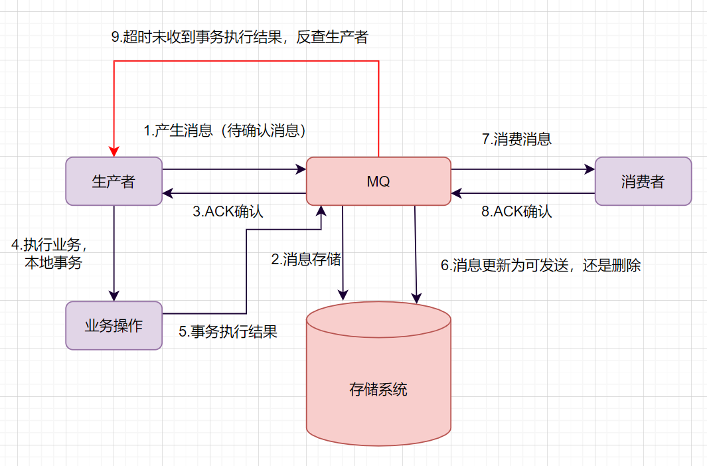

## 消息中间件

### 比较

| 特性       | Kafka                                                        | RocketMQ                                                     | RabbitMQ                                                     |
| ---------- | ------------------------------------------------------------ | ------------------------------------------------------------ | ------------------------------------------------------------ |
| 单机吞吐量 | 17.3w/s                                                      | 11.6w/s                                                      | 2.6w/s（消息做持久化）                                       |
| 开发语言   | Scala/Java                                                   | Java                                                         | Erlang                                                       |
| 主要维护者 | Apache                                                       | Alibaba                                                      | Mozilla/Spring                                               |
| 订阅形式   | 基于 topic，按 topic 进行正则匹配的发布订阅模式                 | 基于 topic/messageTag，按消息类型、属性进行正则匹配的发布订阅模式 | 提供了 4 种：direct、topic、headers 和 fanout，fanout 就是广播模式 |
| 持久化     | 支持大量堆积                                                 | 支持大量堆积                                                 | 支持少量堆积                                                 |
| 顺序消息   | 支持                                                         | 支持                                                         | 不支持                                                       |
| 集群方式   | 天然的 Leader-Slave，无状态集群，每台服务器既是 Master 也是 Slave | 常用“多对多 Master-Slave”模式，开源版本需手动切换 Slave 变成 Master | 支持高阶集群，“复制”模式。对高级集群模式支持不多             |
| 性能稳定性 | 较差                                                         | 一般                                                         | 好                                                           |

| **特性**     | Kafka        | RabbitMQ      | RocketMQ       | ActiveMQ/Artemis | AWS SQS    | NATS              |
| :----------- | :----------- | :------------ | :------------- | :--------------- | :--------- | :---------------- |
| **吞吐量**   | 极高         | 中等          | 高             | 中等             | 中等       | 高                |
| **延迟**     | 高（批量）   | 低            | 低             | 中等             | 中等       | 极低              |
| **可靠性**   | 高（持久化） | 高（ACK 机制） | 高（事务消息） | 中等             | 高（托管） | 中等（JetStream） |
| **协议支持** | 自定义协议   | AMQP、MQTT 等  | 自定义协议     | 多协议           | HTTP/HTTPS | NATS 协议          |
| **扩展性**   | 强（分布式） | 中等（集群）  | 强（分布式）   | 弱               | 自动扩展   | 强                |
| **适用场景** | 大数据流处理 | 企业级应用    | 金融/电商交易  | 传统企业应用     | 云原生应用 | 实时通信          |

#### Kafka

1. 特点：

- 高吞吐量：设计用于处理大规模数据流（如日志、事件流），支持每秒百万级消息。
- 持久化存储：消息持久化到磁盘，支持长期保留和重放。
- 分布式架构：基于分区（Partition）和副本（Replica）机制，支持水平扩展和高可用。
- 流处理：与 Kafka Streams 或 Flink 结合，支持实时流处理。
- 协议：基于自定义二进制协议（TCP）。

2. 适用场景：

- 大数据日志收集与处理。
- 实时流数据处理（如点击流、监控数据）。
- 事件溯源（Event Sourcing）和消息总线。

3. 缺点：

- 配置复杂（需依赖 ZooKeeper）。
- 不适合低延迟场景（默认批量发送）。

#### RabbitMQ

1. 特点：

- 灵活的路由：支持多种消息模式（点对点、发布/订阅），通过 Exchange 和 Binding 实现复杂路由。
- 协议支持：原生支持 AMQP 协议，同时兼容 MQTT、STOMP 等。
- 可靠性：支持消息确认（ACK）、持久化、事务。
- 管理界面：提供友好的 Web 管理界面。
- 社区生态：成熟稳定，社区活跃。

2. 适用场景：

- 需要灵活路由和消息确认的业务（如订单处理）。
- 中小规模企业级应用。
- 多协议兼容场景（如 IoT 设备接入）。

3. 缺点：

- 吞吐量低于 Kafka（单队列性能受限）。
- 集群扩展性较弱（镜像队列需手动配置）。

#### RocketMQ

1. 特点：

- 高吞吐与低延迟：结合了 Kafka 的高吞吐和 RabbitMQ 的低延迟。
- 事务消息：支持分布式事务（如两阶段提交）。
- 顺序消息：严格保证消息顺序（通过队列分区）。
- 中国特色：由阿里开源，适合国内电商等高并发场景。

2. 适用场景：

- 电商交易、金融支付等高可靠性场景。
- 需要事务消息和严格顺序的业务。

3. 缺点：

- 国际社区生态较弱（文档和工具较少）。
- 部署复杂度较高。

#### ActiveMQ

1. 特点：

- 协议支持：支持 JMS、AMQP、MQTT 等多种协议。
- 轻量级：适合资源有限的场景。
- 嵌入式支持：可嵌入到 Java 应用中。

2. 适用场景：

- 传统企业应用（如 JMS 兼容系统）。
- 小型项目或原型开发。

3. 缺点：

- 吞吐量和扩展性不如 Kafka/RocketMQ。
- ActiveMQ 旧版本存在稳定性问题（Artemis 是改进版）。

### 作用

#### 解耦

A 系统通过接口调用发送数据到 B、C、C 三个系统，那如果现在 E 系统也要这个数据呢？那如果 C 系统现在不需要了呢？现在 A 系统又要发送第二种数据了呢？这样的话 A 系统的维护成本就非常的高，而且 A 系统要时时刻刻考虑 B、C、D、E 四个系统如果出现故障该怎么办？A 系统是重发还是先把消息保存起来呢？使用消息队列就可以解决这个问题，A 系统只负责生产数据，不需要考虑消息被哪个系统来消费

#### 异步

A 系统需要发送个请求给 B 系统处理，由于 B 系统需要查询数据库花费时间较长，以至于 A 系统要等待 B 系统处理完毕后再发送下个请求，造成 A 系统资源浪费。使用消息队列后，A 系统生产完消息后直接丢进消息队列，不用等待 B 系统的结果，直接继续去干自己的事情了

总耗时为 3+300+450+200 = 953ms，换成消息队列后总耗时为 3+5 = 8ms，速度加快了

#### 削峰

A 系统调用 B 系统处理数据，每天 0 点到 12 点，A 系统风平浪静，每秒并发请求数量就 100 个，结果到 12 点-13 点，每秒并发请求数量突然暴增到 1 万条，但是 B 系统最大的处理能力就只能是每秒钟处理 1000 个请求，这样系统很容易就会崩掉。这种情况可以引入消息队列，把请求数据先存入消息队列中，消费系统再根据自己的消费能力拉取消费

### 推和拉模式

#### Push 模式

服务器端根据用户需要，有目的、按时将用户感兴趣的信息主动发送到用户的客户端

优点：

1. 对用户要求低，方便用户获取需要的信息
2. 及时性好，服务器端及时地向客户端推送更新的动态信息

缺点：

1. 不能确保发送成功，Push 模式采用广播方式，只要服务器端和客户端在同一个频道上，推模式才有效，用户才能接收到消息
2. 没有信息状态跟踪，Push 模式采用开环控制技术，一个信息推送后的状态，比如客户端是否接收等，无从得知
3. 针对性较差，推送的信息可能并可能满足客户端的个性化需求

#### Pull 模式

客户端主动从服务器端获取信息

优点：

1. 针对性强，能满足客户端的个性化需求
2. 信息传输量较小，网络中传输的知识客户端的请求和服务器端对该请求的响应
3. 服务器端的任务轻，服务器端知识被动接收查询，对客户端的查询请求做出响应

缺点：

1. 实时性较差，针对于服务器端实时更新的信息，客户端难以获取实时信息
2. 对于客户端用户的要求较高，需要对服务器端具有一定的了解

### 组成

1. Broker（消息服务器）：作为 server 提供消息核心服务
2. Producer（消息生产者）：业务的发起方，负责生产消息传输给 broker
3. Consumer（消息消费者）：业务的处理方，负责从 broker 获取消息并进行业务逻辑处理
4. Topic（主题）：发布订阅模式下的消息统一汇集地，不同生产者向 topic 发送消息，由 MQ 服务器分发到不同的订阅者，实现消息的广播
5. Queue（队列）：PTP 模式下，特定生产者向特定 queue 发送消息，消费者订阅特定的 queue 完成指定消息的接收
6. Message（消息体）：根据不同通信协议定义的固定格式进行编码的数据包，来封装业务数据，实现消息的传输

### 优缺点

优点：

1. queue 实现了负载均衡，将 producer 生产的消息发送到消息队列中，由多个消费者消费，但一个消息只能被一个消费者接受，当没有消费者可用时，这个消息会保存直到有一个可用的消费者
2. topic 实现了发布和订阅，当发布一个消息，所有订阅这个 topic 的服务都能得到这个消息，所有从 1 到 N 个订阅者都能得到一个消息的拷贝

缺点：

1. 降低系统的可用性：系统引入的外部依赖越多，越容易挂掉
2. 系统复杂度提高：使用 MQ 后可能需要保证消息没有被重复消费、处理消息丢失的情况，保证消息传递的顺序性等等
3. 一致性问题：A 系统处理完了直接返回成功了，但要是 B、C、D 三个系统，B 和 D 两个系统写库成功了，结果 C 系统写库失败了，就造成数据不一致了

### 模式分类

1. PTP 点对点

使用 queue 作为通信载体，消息生产者生产消息发送到 queue 中，然后消息消费者从 queue 中取出并且消费消息，消息被消费以后，queue 中不再存储，所以消息消费者不可能消费到已经被消费的消息，queue 存在多个消费者，但是对一个消息而言，只会有一个消费者可以消费

2. Pub/Sub 发布订阅（广播）

使用 topic 作为通信载体，消息生产者（发布）将消息发布到 topic 中，同时有多个消息消费者（订阅）消费该消息，发布到 topic 的消息会被所有订阅者消费

### RocketMQ VS RabbitMQ

区别：

1. 语言：RabbitMQ 使用 Erlang 语言开发；RocketMQ 使用 Java 语言开发

2. 功能特性：RabbitMQ 提供了丰富的消息队列模型和灵活的路由机制，适用于多种场景。而 RocketMQ 则更注重顺序消息和事务消息的支持，适用于对消息顺序和一致性要求较高的场景

* 事务消息：RocketMQ 提供了分布式事务消息的支持，可以保证消息生产和本地事务的原子性。RabbitMQ 没有直接提供事务消息的支持，需要通过其他方式实现。
* 消息过滤：RocketMQ 支持基于 Tag 和 SQL 的消息过滤，方便消费者按需订阅消息。RabbitMQ 的消息过滤相对较弱。
* 消息路由：RabbitMQ 支持多种 Exchange 类型（Direct、Topic、Fanout、Headers），提供更丰富的消息路由策略。RocketMQ 主要使用 Topic 进行消息路由，相对简单。

3. 吞吐量：RocketMQ 在吞吐量方面通常优于 RabbitMQ，尤其是在高并发场景下。RocketMQ 更偏向于高吞吐的消息传递，而 RabbitMQ 更注重消息的可靠性和灵活性

4. 实现架构不同

使用建议：

1. 如果系统对消息顺序和一致性要求较高，且希望在大规模分布式场景下保持高性能，那么 RocketMQ 可能是一个更好的选择。
2. 如果系统对消息队列的模型有较高要求，需要支持多种消息传递模式，并且希望快速上手和集成，那么 RabbitMQ 可能更适合你。

### RocketMQ VS Kafka

**为什么 kafka 比 RocketMQ 吞吐量更高**

kafka 性吞吐量更高主要是由于 Producer 端将多个小消息合并，批量发向 Broker。kafka 采用异步发送的机制，当发送一条消息时，消息并没有发送到 broker 而是缓存起来，然后直接向业务返回成功，当缓存的消息达到一定数量时再批量发送。

此时减少了网络 io，从而提高了消息发送的性能，但是如果消息发送者宕机，会导致消息丢失，业务出错，所以理论上 kafka 利用此机制提高了 io 性能却降低了可靠性。

**RocketMQ 为何无法使用同样的方式 **

- RocketMQ 通常使用的 Java 语言，缓存过多消息会导致频繁 GC。
- Producer 调用发送消息接口，消息未发送到 Broker，向业务返回成功，此时 Producer 宕机，会导致消息丢失，业务出错。
- Producer 通常为分布式系统，且每台机器都是多线程发送，我们认为线上的系统单个 Producer 每秒产生的数据量有限，不可能上万。
- 缓存的功能完全可以由上层业务完成。

**为什么选择 RocketMQ**

当 broker 里面的 topic 的 partition 数量过多时，kafka 的性能却不如 rocketMq。

kafka 和 rocketMq 都使用文件存储，但是 kafka 是一个分区一个文件，当 topic 过多，分区的总量也会增加，kafka 中存在过多的文件，当对消息刷盘时，就会出现文件竞争磁盘，出现性能的下降。一个 partition（分区）一个文件，顺序读写。一个分区只能被一个消费组中的一个 消费线程进行消费，因此可以同时消费的消费端也比较少。

rocketMq 所有的队列都存储在一个文件中，每个队列的存储的消息量也比较小，因此 topic 的增加对 rocketMq 的性能的影响较小。rocketMq 可以存在的 topic 比较多，可以适应比较复杂的业务。

## 如何保证消息不被丢失？

### 生产者不丢消息

生产端如何保证不丢消息呢？确保生产的消息能到达存储端。

如果是 RocketMQ 消息中间件，Producer 生产者提供了三种发送消息的方式，分别是：

- 同步发送
- 异步发送
- 单向发送

生产者要想发消息时保证消息不丢失，可以：

- 采用同步方式发送，send 消息方法返回成功状态，就表示消息正常到达了存储端 Broker。
- 如果 send 消息异常或者返回非成功状态，可以重试。
- 可以使用事务消息，RocketMQ 的事务消息机制就是为了保证零丢失来设计的

### 存储端不丢消息

如何保证存储端的消息不丢失呢？确保消息持久化到磁盘。大家很容易想到就是刷盘机制。

刷盘机制分同步刷盘和异步刷盘：

- 生产者消息发过来时，只有持久化到磁盘，RocketMQ 的存储端 Broker 才返回一个成功的 ACK 响应，这就是同步刷盘。它保证消息不丢失，但是影响了性能。
- 异步刷盘的话，只要消息写入 PageCache 缓存，就返回一个成功的 ACK 响应。这样提高了 MQ 的性能，但是如果这时候机器断电了，就会丢失消息。

Broker 一般是集群部署的，有 master 主节点和 slave 从节点。消息到 Broker 存储端，只有主节点和从节点都写入成功，才反馈成功的 ack 给生产者。这就是同步复制，它保证了消息不丢失，但是降低了系统的吞吐量。与之对应的就是异步复制，只要消息写入主节点成功，就返回成功的 ack，它速度快，但是会有性能问题。

### 消费阶段不丢消息

消费者执行完业务逻辑，再反馈会 Broker 说消费成功，这样才可以保证消费阶段不丢消息。

## 如何保证消息不被重复消费？

常用方法：

1. 幂等性设计：确保消息的处理逻辑具有幂等性，即无论重复执行多少次，结果都保持一致。这可以通过设计消息处理逻辑来实现，使得重复处理相同的消息不会产生副作用。例如，可以使用数据库的唯一键约束或其他幂等性控制机制来确保这一点。
2. 消息去重标识：在消息中添加唯一标识或消息序列号。消费者在处理消息时，通过记录已处理的标识，避免重复处理相同标识的消息。这样，即使消息被重复发送，消费者也能识别并忽略重复的消息。
3. 消息消费确认机制：消费者在成功处理消息后，及时向消息队列发送确认。消息队列在收到确认后，可以删除或标记已消费的消息，从而避免重复消费。这种机制确保了消息只会被消费一次。
4. 分布式锁：对于需要严格保证消息顺序性的场景，可以使用分布式锁来确保同一时间只有一个消费者处理消息。这可以防止多个消费者同时处理同一消息，从而避免重复消费。
5. 日志和监控：记录消息的处理状态和结果，包括处理成功或失败的记录。通过监控这些日志，可以及时发现并处理重复消费的问题。同时，日志还可以用于故障排查和性能优化。

## 如何保证消息的顺序性？

常用方法：

1. 单线程消费

最简单直接的方式是使用单线程来处理消息队列中的消息。由于单线程是顺序执行的，因此可以确保消息按照它们在队列中的顺序被处理。然而，这种方法的缺点是可能无法充分利用多核处理器的并行处理能力，导致性能瓶颈。

2. 对消息进行编号

在发送消息时，为每条消息分配一个唯一的递增编号。消费者在处理消息时，根据编号的顺序来执行。这种方法可以在多线程环境下保持消息的顺序性，但需要注意编号的生成和管理，以避免编号冲突或丢失。

3. 使用专门的排序队列

一些消息队列系统提供了专门的排序队列功能，允许按照特定的顺序消费消息。例如，在 RabbitMQ 中，可以通过设置消息的优先级或使用时间戳来确保消息的顺序性。在 Kafka 中，虽然不直接支持排序队列，但可以通过设计消息键（key）和分区策略来实现类似的效果。

4. 在消费者端进行排序

如果消息队列系统本身不支持排序功能，可以在消费者端实现排序逻辑。消费者可以接收一批消息，然后在本地按照特定的顺序对它们进行排序，再依次处理。这种方法会增加消费者端的复杂性和处理延迟，但可以在一定程度上保证消息的顺序性。

5. 利用分布式锁或事务

对于需要跨多个队列或系统保证消息顺序性的复杂场景，可以考虑使用分布式锁或事务机制来确保操作的原子性和顺序性。然而，这种方法可能会引入额外的复杂性和性能开销。

## 如何处理大量消息在 MQ 里长时间积压？

常用方法：

1. 优化消费者逻辑：通过多线程处理消息、批量消费消息等方式，减少消息处理的时间，提高消费者的处理能力。
2. 增加消息队列的容量：通过增加队列的分区数、长度等方式，扩展消息队列的容量，以存储更多的消息，缓解消息堆积的压力。
3. 设置消息过期时间：对于长时间未被消费的消息，可以设置过期时间，使其在一定时间后自动过期并被丢弃，避免消息长时间堆积。
4. 增加消费者数量：通过增加消费者的数量，提高消息的消费速度，减少消息堆积的情况。
5. 调整消息的持久化策略：根据实际需求，调整消息的持久化策略，例如将消息持久化到磁盘上，以保证消息不丢失，但可能会影响消息的处理速度。
6. 建立监控和报警机制：实时监控消息队列的状态和消息堆积情况，当队列中的消息堆积达到一定阈值时，及时发出报警通知，以便及时处理。

## 如何保证消息在消息队列的安全性？

1. 加密与解密

* 使用 SSL/TLS 等加密协议对消息进行加密，确保消息在传输过程中的机密性。
* 对于存储在消息队列中的敏感数据，可以采用加密算法进行加密存储，防止未授权访问。

2. 身份验证与授权

* 实施严格的身份验证机制，如使用用户名、密码、API 密钥或其他认证方式，验证用户的身份。
* 根据用户的角色或权限设置不同的操作权限，防止未经授权的用户对消息队列进行恶意操作。

3. 消息签名与完整性校验：

* 发送方可以使用私钥对消息进行签名，接收方使用公钥进行验证，确保消息的完整性和来源的真实性。
* 在数据传输过程中，发送方可以对数据进行完整性校验并生成校验值，接收方则通过对比校验值来检测信息是否被篡改。

4. 访问控制与 IP 白名单：

* 限制用户对消息队列的访问和操作权限，防止恶意操作。
* 设置 IP 白名单，只允许特定的 IP 地址或地址段访问消息队列，防止非法用户的访问和攻击。

5. 监控与日志记录：

* 实时监控消息队列的访问和操作行为，及时发现异常活动。
* 记录所有与消息队列相关的操作日志，以便在发生安全问题时进行追溯和分析。

6. 定期审查与更新：

* 定期对消息队列的安全配置和策略进行审查，确保其有效性。
* 及时更新消息队列软件和相关组件，以修复已知的安全漏洞。

7. 加强网络安全意识：

* 提高用户和管理员的网络安全意识，教育他们如何识别和应对潜在的安全威胁。
* 谨慎处理来自不可信来源的消息和附件，避免点击不明链接或下载未知文件。

## 什么是消息的可靠性传输？如何保证消息的可靠性？

消息的可靠性传输指的是在消息队列系统中，确保消息从发送者到接收者之间的传输过程中不会丢失，即使在系统出现故障的情况下也能保证消息的完整性和正确性。这是数据通信中不可或缺的关键因素，对于保障信息的安全性和正确性具有重要的意义。

为了保证消息的可靠性传输，可以采用以下策略和技术：

1. 使用可靠的通信协议：使用如 TCP 这样的可靠传输协议，可以在传输数据时进行确认和重传，保证数据的完整性和可靠性。
2. 重传机制：在数据传输过程中，设置重传机制。当数据包丢失或者出现错误时，可以重新发送数据包，保证数据的完整性和可靠性。
3. 数据校验：使用数据校验技术，如 CRC 校验、校验和等，检测传输过程中数据是否出错或被篡改，确保数据的完整性和可靠性。
4. 增加冗余：使用冗余数据技术，如数据备份、冗余磁盘阵列等。当数据发生丢失或错误时，可以使用备份数据进行恢复，确保数据的完整性和可靠性。
5. 消息持久化：在消息队列层面，确保消息被持久化存储。即使在系统宕机的情况下，消息也不会丢失。大多数消息队列中间件都提供了消息持久化的配置选项。
6. 消息确认机制：生产者发送消息后，需要等待消息队列的确认响应。只有当收到消息队列成功接收的确认时，才认为消息发送成功。这可以通过消息中间件提供的事务或确认机制实现。
7. 消费者幂等处理：为防止消费者处理消息失败导致消息丢失，可以在消费者端实现消息的幂等处理。确保即使消息多次消费也不会对业务造成影响。
8. 使用加密和认证技术：如 SSL/TLS 协议，保障数据传输过程的安全性和可靠性，避免数据被篡改和窃取。

## 什么是消息的压缩？为什么需要压缩消息？

消息的压缩是指使用特定的压缩算法，将原始消息的大小减小，以减少存储和网络传输的资源消耗。在消息队列系统中，如 RabbitMQ 和 Kafka，都支持对消息进行压缩。例如，Kafka 使用端到端的块压缩功能，当启用该功能时，数据由生产者压缩，以压缩格式写入服务器，并由消费者解压缩。

**为什么需要压缩消息？**

1. 减少存储需求：压缩后的消息占用更少的存储空间，这对于存储资源有限的环境尤为重要。通过减少存储需求，可以降低存储成本，并提高存储设备的利用率。

2. 降低网络传输负载：在分布式系统中，消息经常需要在不同的节点之间进行传输。压缩消息可以减少传输的数据量，从而降低网络带宽的消耗，提高传输效率。这对于跨数据中心镜像数据或在大规模分布式系统中传输大量消息的场景特别有用。

3. 提高处理效率：由于压缩后的消息更小，消费者在处理消息时可以更快地加载和解析它们，从而提高处理效率。这在处理大量消息的高并发场景中尤为重要。

然而，需要注意的是，压缩和解压缩过程本身会消耗一定的计算资源。因此，在选择是否使用消息压缩时，需要根据具体的业务场景和需求进行权衡。在需要节省存储空间和降低网络传输负载的场景中，使用消息压缩通常是一个有效的策略。

## 什么是消息的确认机制？为什么需要确认机制？

消息的确认机制是指发送者发送消息后，等待接收者确认消息已经被正确接收和处理的一种协议。在消息队列系统中，这通常意味着消息被从队列中成功地消费并处理。这种机制主要用于确保消息的可靠性、顺序性以及处理异常情况。

**为什么需要确认机制？**

1. 确保消息的可靠性：没有确认机制的话，发送者不会知道消息是否已经被成功处理。如果消息在传输过程中丢失，或者接收者在处理消息时出现错误，没有确认机制可能会导致数据丢失或者处理错误。确认机制可以确保消息只会被消费一次，从而避免重复处理或消息丢失的问题。
2. 确保消息的顺序性：在某些应用场景中，消息的处理顺序非常重要。确认机制可以确保消息以正确的顺序被处理。例如，在顺序消费的场景下，只有当一个消息被确认消费后，才会发送下一个消息。
3. 处理异常情况：当消费者从队列中取出消息之后，如果消费过程中出现异常导致消费失败，确认机制可以避免该消息被错误地标记为已消费，从而防止消息丢失。此外，通过限制消费者一次只处理一个消息并等待确认，可以提高系统的稳定性和可靠性。

## 如何保证数据一致性，事务消息如何实现？

1. 生产者产生消息，发送到 MQ 服务器

2. MQ 收到消息后，将消息持久化到存储系统。

3. MO 服务器返回 ACk 到生产者。

4. MQ 服务器把消息 push 给消费者

5. 消费者消费完消息，响应 ACK

6. MQ 服务器收到 ACK，认为消息消费成功，即在存储中删除消息。

我们举个下订单的例子吧。订单系统创建完订单后，再发送消息给下游系统。如果订单创建成功，然后消息没有成功发送出去，下游系统就无法感知这个事情，出导致数据不一致。

1. 生产者产生消息，发送一条半事务消息到 MQ 服务器
2. MQ 收到消息后，将消息持久化到存储系统，这条消息的状态是待发送状态
3. MO 服务器返回 ACK 确认到生产者，此时 MQ 不会触发消息推送事件
4. 生产者执行本地事务
5. 如果本地事务执行成功，即 commit 执行结果到 MQ 服务器; 如果执行失败，发送 rollback。
6. 如果是正常的 commit，MQ 服务器更新消息状态为可发送；如果是 rollback，即删除消息。
7. 如果消息状态更新为可发送，则 MQ 服务器会 push 消息给消费者。消费者消费完就回 ACK
8. 如果 MQ 服务器长时间没有收到生产者的 commit 或者 rollback，它会反查生产者，然后根据查询到的结果执行最终状态。

## 怎么实现一个消息队列？

1. 首先是消息队列的整体流程，producer 发送消息给 broker，broker 存储好，broker 再发送给 consumer 消费，consumer 回复消费确认等。
2. producer 发送消息给 broker，broker 发消息给 consumer 消费，那就需要两次 RPC 了，RPC 如何设计呢?可以参考开源框架 Dubbo，你可以说说服务发现、序列化协议等等
3. broker 考虑如何持久化呢，是放文件系统还是数据库呢，会不会消息堆积呢，消息堆积如何处理呢
4. 消费关系如何保存呢?点对点还是广播方式呢?广播关系又是如何维护呢?zk 还是 configserver
5. 消息可靠性如何保证呢?如果消息重复了，如何幂等处理呢?
6. 消息队列的高可用如何设计呢?可以参考 Kafka 的高可用保障机制。多副本 → > leader &follower -> broker 挂了重新选举 leader 即可对外服务
7. 消息事务特性，与本地业务同个事务，本地消息落库; 消息投递到服务端，本地才删除; 定时任务扫描本地消息库，补偿发送。
8. MO 得伸缩性和可扩展性，如果消息积压或者资源不够时，如何支持快速扩容，提高吞吐?可以参照-下 Kafka 的设计理念，broker -> topic -> partition，每个 partition 放一个机, 器，就存一部分数据。如果现在资源不够了，简单啊，给 topic 增加 partition，然后做数据迁移，增加机器，不就可以存放更多数据，提供更高的吞吐量了?

