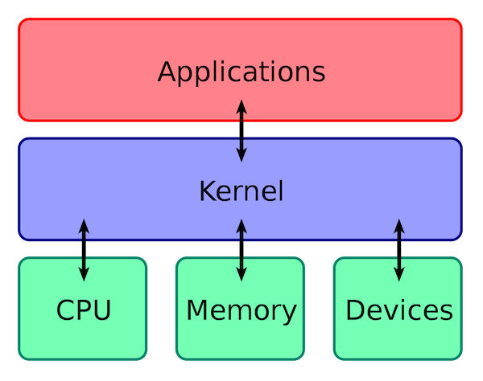
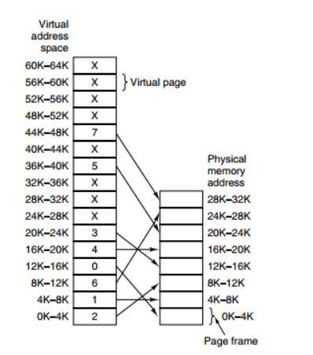
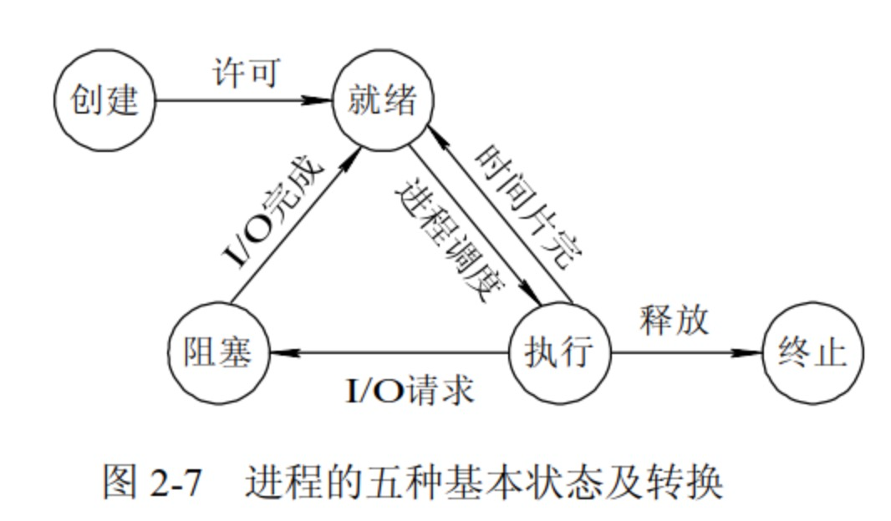
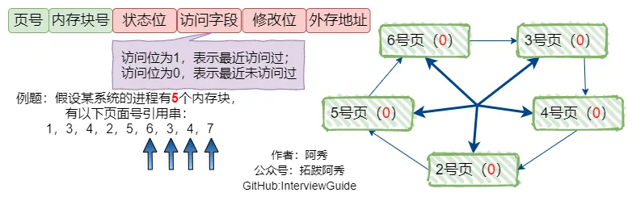
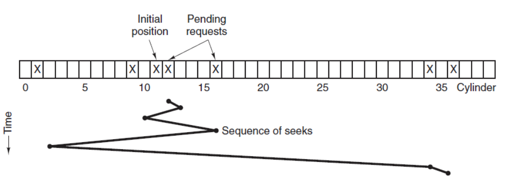

## 操作系统

### 什么是操作系统？

1. 操作系统（OS）是管理计算机硬件与软件资源的程序，是计算机的基石
2. 操作系统本质上是一个运行在计算机上的软件程序，用于管理计算机硬件和软件资源
3. 操作系统存储屏蔽了硬件层的复杂性
4. 操作系统的内核（Kernel）是操作系统的核心部分，它负责系统的内存管理，硬件设备的管理，文件系统的管理以及应用程序的管理



### 什么是内核？

计算机是由各种外部硬件设备组成的，比如内存、CPU、硬盘等，如果每个应用都要和这些硬件设备对接通信协议，那这样太累了，所以这个中间人就由内核负责，让内核作为应用连接硬件设备的桥梁，应用程序只需关系与内核交互，不用关心硬件的细节

### 内核的作用

内核是操作系统的核心，负责管理系统的进程、内存、设备驱动程序、文件和网络系统，决定着系统的性能和稳定性

1. 内存管理：追踪记录有多少内存，存储了什么以及存储在哪里
2. 进程管理：确定哪些进程可以使用中央处理器（CPU）、何时使用以及持续多长时间
3. 设备驱动程序：充当硬件与进程之间的调解程序/解释程序
4. 系统调用和安全防护：从流程接收服务请求

在正确实施的情况下，内核对于用户是不可见的，它在自己的小世界工作，并从中分配内存和跟踪所有内容的存储位置，用户所看到的内容（例如 Web 浏览器和文件被称为用户空间）通过系统调用接口（SCI）与内核进行交互

### 用户态和内核态

1. 内核态：处于内核态的 CPU 可以访问任意的数据，包括外围设备，比如网卡、硬盘等，处于内核态的 CPU 可以从一个程序切换到另外一个程序，并且占用 CPU 不会发生抢占情况，一般处于特权级 0 的状态我们称之为内核态
2. 用户态：处于用户态的 CPU 只能受限地访问内存，并且不允许访问外围设备，用户态下的 CPU 不允许独占，CPU 能够被其他程序获取

**为什么要有用户态和内核态呢？**

主要是访问能力的限制的考量，计算机中有一些比较危险的操作，比如设置时钟、内存清理，这些都需要在内核态下完成，如果随意进行这些操作，那你的系统得崩溃多少次

### 用户态到内核态的切换

陷阱指令（trap 进内核）：用户态到内核态的转换

应用程序处于特权级 3，操作系统内核处于特权级 0，如果用户程序想要访问操作系统资源时，会发起系统调用，陷入内核，这样 CPU 就进入了内核态，执行内核代码


切换方法：

1. 系统调用：系统调用本身就是中断，但是是软件中断，跟硬中断不同
2. 异常：如果当前进程运行在用户态，这个时候发生了异常事件，就会触发切换。例如：缺页异常
3. 外设中断：当外设完成用户的请求时，会向 CPU 发送中断信号


执行流程：

1. 用户程序会调用 glibc 库，glibc 是一个标准库（核心库），定义了很多关键 API，glibc 知道针对不同体系结构调用系统调用的正确方法，它会根据体系结构应用程序的二进制接口设置用户进行传递的参数，来准备系统调用
2. glibc 库调用软件中断指令（SWI），这个指令通过更新 CPSR 寄存器将模式改为超级用户模式，然后跳转到地址 0X08 处
3. 此时整个过程仍处于用户态下，在执行 SWI 指令后，允许进行执行内核代码，MMU 现在允许内核虚拟内存访问
4. ........

### 外中断和异常

1. 外中断：指由 CPU 执行指令以外的事件引起，如：I/O 完成中断，表示设备输入/输出处理已经完成，处理器能够发送下一个输入/输出请求。此外还有时钟中断、控制台中断等


2. 异常：由 CPU 执行指令的内部事件引起，如：非法操作码、地址越界、算术溢出等

## 内存管理

#### 物理地址
它是地址转换的最终地址，进程在运行时执行指令和访问数据最后都要通过物理地址从主存中存取，<font style="background-color:#FADB14;"> 是内存单元真正的地址 </font>

#### 逻辑地址
指计算机用户看到的地址。例如：当创建一个长度为 100 的整型数组时，操作系统返回一个逻辑上的连续空间（指针指向数组第一个元素的内存地址，由于整型元素的大小为 4 个字节，故第二个元素的地址时起始地址加 4，以此类推）。事实上，<font style="background-color:#FADB14;"> 逻辑地址并不一定是元素存储的真实地址 </font>，即数组元素的物理地址（在内存条中所处的位置）并非是连续的，只是操作系统通过地址映射，将逻辑地址映射成连续的

#### 虚拟内存
为了更好地管理内存，操作系统将内存抽象成地址空间，每个程序拥有自己的地址空间，这些地址空间被分割成多个块，每一块称为一页。这些页被映射到物理内存，但不需要映射到连续的物理内存，也不需要所有页都必须在物理内存中。当程序引用不到在物理内存中的页时，由硬件执行必要的映射，将缺失的部分装入物理内存并重新执行失败的指令

它使得应用程序认为它拥有连续的可用的内存（一个连续完整的地址空间），实际上，它通常是被分隔成多个物理内存碎片，还有部分暂时存储在外部磁盘存储器上，在需要时进行数据交换。虚拟内存允许程序不用将地址空间中的每一页都映射到物理内存，即一个程序不需要全部调入内存就可以运行，这使得有限的内存运行大程序成为可能

<font style="background-color:#FADB14;"> 为什么有虚拟内存？</font>

如果第一个程序在 2000 的位置上写入一个新的值，将会擦掉第二个程序存放在相同位置上的所有内存，所以同时运行两个程序是根本行不通的，这两个程序会立即崩溃

例如：有一台计算机可以产生 16 位地址，那么一个程序的地址空间范围时是 0~64K，该计算机只有 32KB 的物理内存，虚拟内存技术允许该计算机运行一个 64K 大小的程序



#### 分页与分段
1. 段是信息的逻辑单位，它是根据用户的需要划分的，因此段对用户是可见的；页是信息的物理单位，是为了管理内存的方便而划分的，对用户是透明的
2. 段的大小不固定，由它所完成的功能决定；页大小固定，由系统决定
3. 段向用户提供二维地址空间；页向用户提供的是一维地址空间
4. 段是信息的逻辑单位，便于存储保护和信息的共享；页的保护和共享受到限制

#### 内存分段


<font style="background-color:#FADB14;"> 分段会产生内存碎片 </font>

内存碎片主要分为：内部内存碎片和外部内存碎片

产生原因：由于每个段的长度长度不固定，所以多个段未必能恰好使用所有的内存空间，会产生多个不连续的小物理内存，导致新的程序无法被装载，所以会出现外部内存碎片的问题

解决方法：内存交换


<font style="background-color:#FADB14;"> 分段会导致内存交换效率低 </font>

对于多进程的系统来说，用分段的方式，外部内存碎片很容易产生，这时不得不重新 swap 内存区域，这个过程会产生性能瓶颈。因为硬盘的访问速度要比内存慢太多了，每一次内存交换，都需要把一大段连续的内存数据写到硬盘上

#### 内存分页


#### 常见内存分配错误
1. 内存分配未成功，却使用了它
2. 内存分配虽然成功，但是尚未初始化就引用它
3. 内存分配成功并且已经初始化，但操作越过了内存的边界
4. 忘记了释放内存，造成内存泄露
5. 释放了内存却继续使用它
+ 程序中的对象调用关系过于复杂，实在难以搞清楚某个对象究竟是否已经释放了内存，此时应该重新设计数据结构，从根本上解决对象管理的混乱局面
+ 函数的 return 语句写错了，注意不要返回指向“栈内存”的“指针”或者“引用”，因为内存函数体结束时被自动销毁
+ 使用 free 或 delete 释放了内存后，没有将指针设置为 NULL，导致产生“野指针”

#### 内存交换
设计思想：内存空间紧张时，系统将内存中某些进程暂时换出外存，把外存中某些已具备运行条件的进程换入内存（进程在内存与磁盘间动态调度）

<font style="background-color:#FBDE28;"> 被换出的进程保存在哪里？</font>

保存在磁盘（外存）中。具有对换功能的操作系统中，通常把磁盘空间分为文件区和对换区两部分。

1. 文件区主要用于存放文件，主要追求存储空间的利用率，因此对文件区空间的管理采用离散分配方式
2. 对换区空间只占磁盘空间的小部分，被换出的进程数据就存放在对换区，由于对换的速度直接影响到系统的整体速度，因此对换区空间的管理主要追求换入换出速度，通过对换区采用连续分配方式。

总之，对换区的 I/O 速度比文件区的更快

#### 抖动（颠簸）
刚刚换出的页面马上又要换入内存，刚刚换入的页面马上又要换出内存

产生抖动的主要原因：进程频繁访问的页面数目高于可用的物理块数（分配给进程的物理块不够）

注意：为进程分配的物理块太少，会使进程发送抖动线程；为进程分配的物理块太多，又会降低系统整体的并发度，降低某些资源的利用率

#### 缓冲区溢出
1. 缓冲区：为暂时置放输出或输入资源的内存。
2. 缓冲区溢出：指当计算机向缓冲区填充数据时超出了缓冲区本身的容量，溢出的数据覆盖在合法数据上。
3. 造成缓冲区溢出的主要原因：程序中没有仔细检查用户输入是否合理。计算机中，缓冲区溢出会造成的危害主要有以下两点：程序崩溃导致拒绝服务和跳转并且执行一段恶意代码

## 并发和并行

1. 并行是指两个或多个事件在同一时刻发生，并发是指两个或多个事件在同一时间间隔发生
2. 并行是在不同实体上的多个事件，并发是在同一实体上的多个事件

## 同步、异步、阻塞、非阻塞

1. 同步：当一个同步调用发出后，调用者要一直等待返回结果。通知后，才能进行后续的执行
2. 异步：当一个异步过程调用发出后，调用者不能立刻得到返回结果。实际处理这个调用的部件在完成后，通过状态、通知和回调来通知调用者
3. 阻塞：指调用结果返回前，当前线程会被挂起，即阻塞
4. 非阻塞：指即使调用结果没返回，也不会阻塞当前线程

## 进程和线程

1. 进程：进程是系统进行资源分配和调度的一个独立单位，是系统中的并发执行的单位
2. 线程：线程是进程的一个实体，也是 CPU 调度和分派的基本单位，它是比进程更小的能独立运行的基本单位

#### 区别
1. 进程是 <font style="background-color:#FADB14;"> 资源分配 </font> 的最小单位；而线程是 <font style="background-color:#FADB14;"> CPU 调度 </font> 的最小单位
2. 创建进程或撤销进程，系统都要为之分配或回收资源，操作系统开销远大于创建或撤销线程时的开销
3. 不同进程地址空间相互独立，同一进程内的线程共享同一地址空间，一个进程的线程在另一个进程内是不可见的
4. 进程间不会相互影响，而一个线程挂掉将可能导致整个进程挂掉
5. 进程切换时需要刷新 TLB 并获取新的地址空间，然后切换硬件上下文和内核栈；线程切换时只需要切换硬件上下文和内核栈

#### 有了进程，为什么还要有线程？
进程可以使多个程序并发执行，以提高资源的利用率和系统的吞吐量，但其带来了一些缺点：

1. 进程在同一时间只能干一件事情
2. 进程在执行的过程中如果阻塞，整个进程就会被挂起，即使进程中有这些工作不依赖于等待的资源，仍然不会执行

#### 进程切换为什么比线程更消耗资源？
1. 一个程序运行起来后，会使用很多资源，比如使用寄存器、内存、文件等，每当切换进程时，必须要考虑保存当前进程的状态。状态包括存放在内存中的程序的代码和数据，它的栈、通用目的寄存器的内容、程序计数器、环境变量以及打开的文件描述符的集合，这个状态叫做 <font style="background-color:#FADB14;"> 上下文 </font>。可见切换进程时保存的状态不少，而且由于虚拟内存机制，进程切换时需要刷新 TLB 并获取新的地址空间
2. 线程存在于进程中，一个进程可以有一个或多个线程，线程是运行在进程上下文中的逻辑流，这个线程可以独立完成一项任务，同样线程有自己的上下文，包括唯一的整数线程 ID、栈、栈指针、程序计数器、通用目的寄存器和条件码，<font style="background-color:#FADB14;"> 可以理解为线程上下文是进程上下文的子集 </font>。由于保存线程的上下文明显比进程的上下文小，因此系统切换线程时，必然开销更小

#### 进程的状态转换


1. 就绪-> 执行：对就绪状态的进程，当进程调度按一种选定的策略从中选中一个就绪进程，为之分配了处理机后，该进程便由就绪状态变为执行状态
2. 执行-> 阻塞：正在执行的进程因发生某等待事件而无法执行，则进程由执行变为阻塞状态，如：进程提出输入/输出请求而变成等待外部设备传输信息的状态，进程申请资源（主存空间或外部设备）得不到满足时变成等待资源状态等
3. 阻塞-> 就绪：处于阻塞状态的进程，在其等待的事件已经发生，如：输入/输出完成，资源得到满足或错误处理完毕时，处于等待状态的进程并不马上转入执行状态，而是先转入就绪状态，然后再由系统进程调度程序在适当的时候将该进程转为执行状态
4. 执行-> 就绪：正在执行的进程，因时间片用完而被暂停执行，或在采用抢先式优先级调度算法的系统中，当有更高优先级的进程要运行而被迫让出处理机时，该进程便由执行状态转变为就绪状态

#### 进程的五种状态
1. 创建状态：进程在创建时需要申请一个空白 PCB，向其中填写控制和管理进程的信息，完成资源分配。如果创建工作无法完成，比如资源无法满足，就无法被调度运行
2. 就绪状态：进程已经准备好，已分配到所需资源，只要分配到 CPU 就能够立即运行
3. 执行状态：进程处于就绪状态被调度后，进程进入执行状态
4. 阻塞状态：正在执行的进程由于某些事件（I/O 事件，申请缓存区失败）而暂时无法运行，进程受到阻塞，在满足请求时进入就绪状态等待系统调用
5. 终止状态：进程结束，或出现错误，或被系统终止，进入终止状态，无法再执行



#### 进程的调度算法
1. 先来先服务调度算法（FCFS）：先来先服务比较适合于长作业进程，不利于短作业进程
2. 时间片轮转调度算法（RR）：用于分时系统中的进程调度。每次调度时，总是选择就绪队列的队首进程，让其在 CPU 上运行一个系统预先设置好的时间片。一个时间片内没有完成运行的进程，返回到就绪队列末尾重新排队，等待下一次调度
3. 短作业优先调度算法（SJF）：从后备队列中选择一个或若干个估计运行时间最短的作业，将它们调入内存运行
4. 最短剩余时间优先调度算法：进程调度总是选择预期剩余时间最短的进程，当一个进程加入到就绪队列时，它可能比当前运行的进程具有更短的剩余时间，因此只要新进程就绪，调度程序就可能抢占当前正在运行的进程
5. 高响应比优先调度算法：R =(W+S)/S（R 为相应比，W 为等待处理的时间，S 为预计的服务时间）。在每次进程作业调度时，先计算后备作业队列中每个作业的相应比，从中选出响应比最高的作业投入运行
6. 优先级调度算法：每次从后备作业队列中选择优先级最高的一个或几个作业，将它们调入内存，分配必要的资源，创建进程并放入就绪队列
7. 多级反馈队列

一个进程需要执行 100 个时间片，如果采用时间片轮转调度算法，那么需要交换 100 次多级队列是为这种需要连续执行多个时间片的进程考虑，它设置了多个队列，每个队列大小都不同，例如：1、2、4、8......，进程在第一个队列没执行完，就会被移到下一个队列


#### 进程终止的方式
1. 正常退出（自愿的）

当编译器完成了所给定程序的编译之后，编译器会执行一个系统调用告诉操作系统它完成了工作。这个调用在 UNIX 中是 exit，在 Windows 中是 ExitProcess

2. 错误退出（自愿的）

如果用户执行如下命令：cc foo.c，为了能够编译 foo.c 但是该文件不存在，于是编译器就会发出声明并退出。在给出了错误参数时，面向屏幕的交互式进程通常并不会直接退出，用户需要知道发生了什么并想要进行重试，所以这时候应用程序通常会弹出一个对话框告知用户发生了系统错误，是需要重试还是退出

3. 严重错误（非自愿的）

如：执行了一条非法指令，引用不存在的内存，或者除数是 0 等。在有些系统比如 UNIX 中，进程可以通知操作系统，它希望自行处理某种类型的错误，在这类错误中，进程会收到信号（中断），而不是在这类错误出现时直接终止进程

4. 被其他进程杀死（非自愿的）

某个进程执行系统调用告诉操作系统杀死某个进程。在 UNIX 中，这个系统调用是 kill；在 Win32 中对应的函数是 TerminateProceess

#### 守护进程、僵尸进程和孤儿进程
1. 守护进程

指在后台运行的、没有控制终端与之相连的进程。它独立于控制终端，周期性地执行某种任务。Linux 的大多数服务器就是用守护进程的方式实现的，如 web 服务器进程 http 等

2. 孤儿进程

如果 <font style="background-color:#FADB14;"> 父进程先退出，子进程还没退出 </font>，那么子进程的父进程将变为 init 进程（注：任何一个进程都必须有父进程）。一个父进程退出，而它的一个或多个子进程还在运行，那么那些子进程将成为孤儿进程。孤儿进程将被 init 进程（进程号为 1）所收养，并由 init 进程对它们完成状态收集工作

3. 僵尸进程

如果 <font style="background-color:#FADB14;"> 子进程先退出，父进程还没退出 </font>，那么子进程必须等到父进程捕获到了子进程的退出状态才真正结束，否则这个时候子进程就成为僵尸进程

设置僵尸进程的目的是维护子进程的信息，以便父进程在以后某个时候获取。这些信息至少包括进程 ID，进程的终止状态，以及该进程使用的 CPU 时间，所以当终止子进程的父进程调用 wait 或 waitpid 时就可以得到这些信息。如果一个进程终止，而该进程有子进程处于僵尸状态，那么它的所有僵尸子进程的父进程 ID 将被重置为 1（init 进程）。继承这些子进程的 init 进程将被清理它们（也就是说 init 进程将 wait 它们，从而去除它们的僵尸状态）

#### 如何避免僵尸进程？
1. 通过 signal（SIGCHLD，SIG_IGN）通知内核对子进程的结束不关心，由内核回收。如果不想让父进程挂起，可以在父进程中加入一条语句：signal（SIGCHLD，SIG_IGN）表示父进程忽略 SIGCHLD 信号，该信号是子进程退出的时候向父进程发送的
2. 父进程调用 wait/waitpid 等函数等待子进程结束，如果尚无子进程退出 wait 会导致父进程阻塞。waitpid 可以通过传递 WNOHANG 使父进程不阻塞立即返回
3. 如果父进程很忙可以用 signal 注册信号处理函数，在信号处理函数调用 wait/waitpid 等待子进程退出
4. 通过两次调用 fork。父进程首先调用 fork 创建一个子进程然后 waitpid 等待子进程退出，子进程再 fork 一个孙子进程后退出。这样子进程退出后会被父进程等待回收，而对于孙子进程其父进程已经退出，所以孙子进程成为一个孤儿进程，孤儿进程由 init 进程接管，孙子进程结束后，init 会等待回收

#### 线程崩溃，进程一定会崩溃吗？
当进程中的一个线程崩溃时，会导致其所属进程的所有线程崩溃（这里是针对 C/C++语言，Java 中的线程崩溃不会造成进程崩溃）

一般来说，如果线程是因为非法访问内存引起的崩溃，那么进程肯定会崩溃，我没什么系统要让进程崩溃呢？

在进程中，各个线程的地址空间是共享的，既然是共享，那么某个线程对地址的非法访问就会导致内存的不确定性，进而可能会影响到其他线程，这种操作是危险的，操作系统会认为这很可能导致一系列严重的后果，干脆让整个进程崩溃

线程共享代码段、数据段、地址空间，文件非法访问内存有以下情况：

1. 针对只读内存写入数据

```cpp
#include <stdio.h>
#include <stdlib.h>
int main() {
    char *s = "hello world";
    // 向只读内存写入数据，崩溃
    s[1] = 'H'; 
}
```

2. 访问了进程没有权限访问的地址空间

```cpp
#include <stdio.h>
#include <stdlib.h>
int main() {
  int *p = (int *)0xC0000fff;
  // 针对进程的内核空间写入数据，崩溃
  *p = 10; 
}
```

3. 访问了不存在的内存

```cpp
#include <stdio.h>
#include <stdlib.h>
int main() {
  int *a = NULL;
  *a = 1;     
}
```

进程崩溃的机制：

1. CPU 执行正常的进程指令
2. 调用 kill 系统调用向进程发送信号
3. 进程收到操作系统发的信号，CPU 暂停当前程序运行，并将控制权转交给操作系统
4. 调用 kill 系统向进程发送信号（假设为 11，即 SIGSEGV，一般非法访问内存报的都是这个错误）
5. 操作系统根据情况执行相应的信号处理程序（函数），一般执行完信号处理程序逻辑后会让进程退出

在第 5 步中，如果进程没有注册自己的信号处理函数，那么操作系统会执行默认的信号处理程序（一般最后会让进程退出），但如果注册了，则会执行自己的信号处理函数，这样的话就给了进程一个垂死挣扎的机会，它收到 kill 信号后，可以调用 exit()来退出，也可以使用 sigsetmp、siglongjmp 这两个函数来恢复进程的执行

注意：虽然给进程发送了 kill 信号，但如果进程自己定义了信号处理函数或者无视信号就有机会逃出生天，kill -9 命令例外，不管进程是否定义了信号处理函数，都会马上被干掉

StackoverflowError 和 NPE 都属于非法访问内存，JVM 自定义了自己的信号处理函数，拦截了 SIGSEGV 信号，针对这两者不让它们崩溃

## 进程间的通信方式

#### 匿名管道
1. 它是半双工的，数据只能单向流动，具有固定的读端和写端
2. 它只能用于 <font style="background-color:#FADB14;"> 父子进程或者兄弟进程 </font> 之间的进程的通信
3. 它可以看成是一种特殊的文件，对于它的读写也可以使用普通的 read、write 等函数，但是它不是普通的文件，并不属于其他任何文件系统，并且只存在于内存中

#### 命名管道（FIFO）
匿名管道由于没有名字，只能用于亲缘关系的进程间通信，所以提出了有名管道（FIFO）	

1. FIFO 可以 <font style="background-color:#FADB14;"> 在无关的进程之间交换数据 </font>，与无名管道不同
2. FIFO 有路径名与之相关联，它以一种特殊设备文件形式存在于文件系统中，即使与有名管道的创建进程不存在亲缘关系的进程，只要可以访问该路径，就能够彼此通过有名管道相互通信
3. FIFO 的名字存在于文件系统中，内容存放在内存中

#### 消息队列
与管道的区别：

1. 与管道（无名管道：只存在于内存中的文件；命名管道：存在于实际的磁盘介质或者文件系统）不同的是消息队列存放在内核中，只有在内核重启（即操作系统重启）或者显式地删除一个消息队列时，该消息队列才会被真正地删除
2. 消息队列在某个进程往一个队列写入消息之前，并不需要另外某个进程在该队列上等待消息的到达

特点：

1. 消息队列是消息的链接表，存放在内核中，一个消息队列由一个标识符 ID 来标识
2. 消息队列是面向记录的，其中的消息具有特定的格式以及特定的优先级
3. 消息队列独立于发送与接收进程，进程终止时，消息队列及其内容并不会被删除
4. 管道和消息队列的通信数据都是先进先出的原则
5. 消息队列可以实现消息的随机查询，消息不一定要以先进先出的次序读取，也可以按消息的类型读取
6. 消息队列允许一个或多个进程向它写入与读取消息

#### 信号（signal）
1. 信号是 Linux 系统这种用于进程间相互通信或者操作的一种机制，信号可以在任何时候发给某一进程，而无需知道该进程的状态
2. 如果该进程当前并未处于执行状态，则该信号就由内核保存起来，直到该进程恢复执行并传递给它为止
3. 如果一个信号被进程设置为阻塞，则该信号的传递被延迟，直到其阻塞被取消时才被传递给进程

#### 信号量（semaphore）
1. 信号量是一个计数器，用于实现进程间的互斥与同步，而不是用于存储进程间通信数据
2. 信号量用于进程间同步，若要在进程间传递数据需要结合共享内存
3. 信号量基于操作系统的 PV 操作，程序对信号量的操作都是原子操作
4. 每次对信号量的 PV 操作不局限于对信号量加 1 或减 1，而且可以加减任意正整数
5. 支持信号量组

#### 共享内存（Shared Memory）
1. 共享内存：指两个或多个进程共享一个给定的存储区，进程间本身的内存是相互隔离的
2. 共享内存是最快的一种 IPC，因为进程是直接对内存进程存取

## 线程的通信方式

#### 锁机制
包括互斥锁、条件变量、读写锁，互斥锁提供了以排他方式防止数据结构被并发修改的方法，读写锁允许多个线程同时读共享数据，而对写操作是互斥的，条件变量可以以原子的方式阻塞进程，直到某个特定条件真为止，对条件的测试是在互斥锁的保护下进行的

#### 信号量机制（Semaphore）
包括无名线程信号量和命名线程信号量

#### 信号机制（Signal）
类似进程间的信号处理，线程间的通信目的主要是用于线程同步，所以线程没有像进程通信中的用于数据交换的通信机制

## 协程

协程是微线程，在子程序内部执行，可在子程序内部中断，转而执行别的子程序，在适当的时候再返回来接着执行

#### 优点
1. 协程调用跟切换比线程效率高：协程执行效率极高，协程不需要多线程的锁机制，可以不加锁的访问全局变量，所以上下文的切换非常快
2. 协程占用内存少：执行协程只需要极少的栈内存（大概是 4~5KB），而默认情况下，线程栈的大小为 1MB
3. 切换开销更少：协程直接操作栈 <font style="background-color:#FADB14;"> 基本没有内核切换的开销 </font>，所以切换开销比线程少

#### 线程与协程的区别
1. 一个线程可以有多个协程
2. 协程执行效率极高，协程直接操作栈基本没有内核切换的开销，所以上下文的切换非常快，切换开销比线程更小
3. 协程不需要多线程的锁机制，因为多个协程从属于一个线程，<font style="background-color:#FADB14;"> 不存在同时写变量冲突 </font>，效率比线程高，避免了加锁解锁的开销

## 锁

#### 死锁
指多个进程在运行过程中因争夺资源而造成的一种僵局，当进程处于这种僵持状态时，若无外力作用，它们都将无法再向前推进。例如：此时有一个线程 A，已经持有了锁 A，但是试图获取锁 B，线程 B 持有锁 B，而试图获取锁 A，这种情况下就会产生死锁


#### 产生死锁的原因
1. 竞争不可抢占性资源。例如：p1 已经打开 F1，想去打开 F2，p2 已经打开 F2，想去打开 F1，但是 F1 和 F2 都是不可抢占的，这时发生死锁
2. 竞争可消耗性资源。例如：进程间通信，如果顺序不当，会产生死锁，p1 发消息 m1 给 p2，p1 接收 p3 的消息 m3，p2 接收 p1 的 m1，发 m2 给 p3，以此类推，如果进程之间是先发信息的那么可以完成通信，但是如果是先接收信息就会产生死锁
3. 进程推进顺序不当。例如：进程 A 和进程 B 相互等待对方的数据

#### 死锁产生的必要条件
1. 互斥条件：进程要求对所分配的资源进行排他性控制，即在一段时间内某资源仅为一进程所占用
2. 请求和保持条件：当进程因请求资源而阻塞时，对已获得的资源保持不放
3. 不可剥夺条件：进程已获得的资源在未使用完之前，不能剥夺，只能在使用完时由自己释放
4. 环路等待条件：在发生死锁时，必然存在一个进程-资源的环形链

#### 解决死锁的基本方法
<font style="background-color:#FADB14;"> 预防死锁 </font>

1. 破坏请求条件：一次性分配所有资源，这样就不会再有请求了
2. 破坏请求与保持条件：只要有一个资源得不到分配，也不给这个进程分配其他的资源
3. 破坏不可剥夺条件：当某进程获得了部分资源，但得不到其他资源，则释放已占有的资源
4. 破坏环路等待条件：系统给每类资源赋予一个编号，每一个进程按编号递增的顺序请求资源，释放则相反

<font style="background-color:#FADB14;"> 避免死锁 </font>

银行家算法

<font style="background-color:#FADB14;"> 检测死锁 </font>

<font style="background-color:#FADB14;"> 解除死锁 </font>

1. 资源剥夺：挂起某些死锁进程，并抢占它的资源，将这些资源分配给其他死锁进程（但应该防止被挂起的进程长时间得不到资源）
2. 撤销进程：强制撤销部分、甚至全部死锁进程并剥夺这些进程的资源（撤销的原则可以按进程优先级和撤销进程代价的高低进行）
3. 进程回退：让一个或多个进程回退到足以避免死锁的地步，进程回退时自愿释放资源而不是被剥夺，要求系统保持进程的历史信息，设置还原点

#### 读写锁
1. 多个读者可以同时进行读
2. 写者必须互斥（只允许一个写者写，也不能读者写者同时进行）
3. 写者优先于读者（一旦有写者，则后续读者必须等待，唤醒时优先考虑写者）

#### 自旋锁
如果进线程无法取得锁，进线程不会立刻放弃 CPU 时间片，而是一直循环尝试获取锁，直到获取为止。如果别的线程长时期占有锁，那么自旋就是在浪费 CPU 做无用功，但是自旋锁一般应用于加锁时间很短的场景，效率比较高

#### 互斥锁
1. 一次只能一个线程拥有互斥锁，其他线程只有等待
2. 互斥锁是在抢锁失败的情况下主动放弃 CPU 进入睡眠状态直到锁的状态改变时再唤醒，而操作系统负责线程调度，为了实现锁的状态发送改变时唤醒阻塞的线程或者进程，需要把锁交给操作系统管理，所以互斥锁在加锁操作时涉及上下文的切换。互斥锁实际的效率还是可以让人接受的，加锁的时间大概是 100ns 左右，而实际上互斥锁的一种可能的实现是先自旋一段时间，当自旋的时间超过阈值之后再将线程投入睡眠中，因此在并发运算中使用互斥锁（每次占用锁的时间很短）的效果可能不亚于使用自旋锁

#### 条件变量
互斥锁一个明显的缺点是只有两种状态：锁定和非锁定。而条件变量通过允许线程阻塞和等待另一个线程发送信号的方法弥补了互斥锁的不足，常和互斥锁一起使用，以免出现竞态条件。当条件不满足时，线程往往解开相应的互斥锁并阻塞线程然后等待条件发生变化。一旦其他的某个线程改变了条件变量，它将通知相应的条件变量唤醒一个或多个正被此条件变量阻塞的线程。

总的来说，互斥锁是线程间互斥的机制，条件变量则是同步机制

## 页面置换算法

1. 最佳置换算法（OPT）：选择以后不再使用或者未来最长时间内不再被访问的页淘汰


2. 先进先出置换算法（FIFO）：先进先出，即淘汰最早调入的页面


3. 最近最久未使用算法（LRU）：选择最近最久未使用的页面予以淘汰


4. 时钟置换算法（Clock）：也叫最近未用算法（NRU），该算法为每个页面设置一个访问位，将内存中的所有页面都通过链接指针链成一个循环队列



## 磁盘调度算法

1. 先来先服务

按照磁盘请求的顺序进行调度

2. 最短寻道时间优先

优先调度与当前磁头所在磁盘距离最近的磁道

缺点：如果新到达的磁盘请求总是比一个在等待的磁道请求近，那么在等待的磁道请求会一直等待下去，即出现饥饿现象



3. 电梯扫描算法

电梯总是保持一个方向运行，直到该方向没有请求为止，然后改变运行方向


## 一个程序从开始运行到结束的完整过程

#### 预编译
主要处理源代码文件中的以“#”开头的预编译指令

#### 编译
1. 词法分析
2. 语法分析
3. 语义分析
4. 优化
5. 目标代码生成
6. 目标代码优化

#### 汇编
将汇编代码转变成机器可以执行的指令（机器码文件），经汇编之后，产生目标文件

#### 链接
1. 静态链接

函数和数据被编译进一个二进制文件，在使用静态库的情况下，在编译链接可执行文件时，链接器从库中复制这些函数和数据并把它们和应用程序的其他模块组合起来创建最终的可执行文件

2. 动态链接

把程序按照模块拆分成各个相对独立部分，在程序运行时才将它们链接在一起形成一个完整的程序，而不是像静态链接一样把所有程序模块都链接成一个单独的可执行文件


