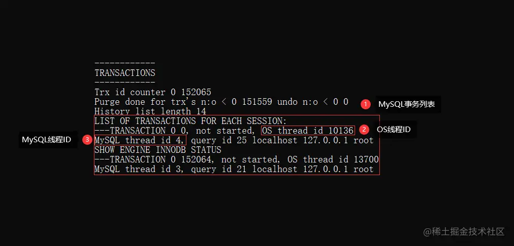

## Explain 查看 SQL 执行情况

### 查看索引使用情况

使用 Explain 命令来查看语句的执行计划，MySQL 在执行某个语句之前，会将该语句过一遍查询优化器，之后会拿到对语句的分析，也就是执行计划，其中包含了很多信息，可以通过其中和索引相关的信息来分析是否命中了索引，比如：possible_keys，key，key_len 分别说明了此语句可能会使用的索引、实际使用的索引以及使用的索引长度

### 基本使用

```sql
mysql> EXPLAIN SELECT DISTINCT(trade_date) FROM order WHERE user_id=1 ORDER BY trade_date DESC LIMIT 10;
+----+-------------+-------------------+------------+------+----------------------+--------------+---------+-------+------+----------+--------------------------+
| id | select_type | table             | partitions | type | possible_keys        | key          | key_len | ref   | rows | filtered | Extra                    |
+----+-------------+-------------------+------------+------+----------------------+--------------+---------+-------+------+----------+--------------------------+
|  1 | SIMPLE      | order             | NULL       | ref  | PRIMARY,idx_user_trade|idx_user_trade| 768    | const |   20 |   100.00 | Using where; Using index |
+----+-------------+-------------------+------------+------+----------------------+--------------+---------+-------+------+----------+--------------------------+
1 row in set, 1 warning (0.03 sec)
```

1. id：执行的序号，值越大越先执行；

2. select_type：当前执行的 `select` 语句其具体的查询类型

* `SIMPLE`：简单的 `select` 查询语句，不包含 `union`、子查询语句。
* `PRIMARY`：`union` 或子查询语句中，最外层的主 `select` 语句。
* `SUBQUEPY`：包含在主 `select` 语句中的第一个子查询，如 `select ... xx = (select ...)`。
* `DERIVED`：派生表，指包含在 `from` 中的子查询语句，如 `select ... from (select ...)`。
* `DEPENDENT SUBQUEPY`：复杂 `SQL` 中的第一个 `select` 子查询（依赖于外部查询的结果集）。
* `UNCACHEABLE SUBQUERY`：不缓存结果集的子查询语句。
* `UNION`：多条语句通过 `union` 组成的查询中，第二个以及更后面的 `select` 语句。
* `UNION RESULT`：`union` 的结果集。
* `DEPENDENT UNION`：含义同上，但是基于外部查询的结果集来查询的。
* `UNCACHEABLE UNION`：含义同上，但查询出的结果集不会加入缓存。
* `MATERIALIZED`：采用物化的方式执行的包含派生表的查询语句。

3. table：查询涉及的表；

4. partitions：查询涉及的表的哪些分区；

5. type：访问类型，指明了 MySQL 以何种方式查找表中符合条件的行，这个也是需要重点关注的一项指标，包含的类型为：ALL, index, range, ref, eq_ref, const/system, NULL，性能依次变好，其中：

+ ALL：全表扫描，基于表中所有的数据，逐行扫描并过滤符合条件的数据
+ index：全索引扫描，和全表扫描类似，但这个是把索引树遍历一次，会比全表扫描要快。
+ range：基于索引字段进行范围查询，如 `between、<、>、in....` 等操作时出现的情况。
+ index_subquery：和上面含义相同，区别：这个是基于非主键、唯一索引字段进行 in 操作。
+ unique_subquery：执行基于主键索引字段，进行 in 操作的子查询语句会出现的情况。
+ index_merge：多条件查询时，组合使用多个索引来检索数据的情况。
+ ref_or_null：基于次级(非主键)索引做条件查询时，该索引字段允许为 `null` 出现的情况。
+ fulltext：基于全文索引字段进行查询时出现的情况。
+ ref：基于非主键或非唯一索引字段查找数据时（即次级索引）会出现的情况；
+ eq_ref：连表查询时，基于主键、唯一索引字段匹配数据的情况，会出现多次索引查找；
+ const：通过索引一趟查找后就能获取到数据，基于唯一、主键索引字段查询数据时的情况。
+ system：表中只有一行数据，这是 const 的一种特例。
+ NULL：在执行阶段不需要访问表，直接从索引返回需要的值。

完整的性能排序：`null → system → const → eq_ref → ref → fulltext → ref_or_null → index_merge → unique_subquery → index_subquery → range → index → all`

一般在做索引优化时，一般都会要求最好优化到 `ref` 级别，至少也要到 `range` 级别，也就是最少也要基于次级索引来检索数据，不允许出现 `index、all` 这类全扫描的形式。

6. possible_keys：该次查询可以使用的索引；

7. key：该次查询实际使用的索引；

* `possible_keys` 有值，`key` 为空：出现这种情况多半是由于表中数据不多，因此 `MySQL` 会放弃索引，选择走全表查询，也有可能是因为 `SQL` 导致索引失效。
* `possible_keys、key` 都为空：表示当前表中未建立索引、或查询语句中未使用索引字段检索数据。

8. key_len：使用索引时，所使用的索引值的最大字节数，当 type 为 NULL 时，该值也为 NULL；

- 如果索引是前缀索引，这里则只会使用创建前缀索引时，声明的前 `N` 个字节来检索数据。
- 如果是联合索引，这里只会显示当前 `SQL` 会用到的索引字段长度，可能不是全匹配的情况。
- 如果一个索引字段的值允许为空，`key_len` 的长度会为：索引字段长度 `+1`。

9. ref：显示索引查找过程中，查询时会用到的常量或字段：

`const`：如果显示这个，则代表目前是在基于主键字段值或数据库已有的常量（如 `null`）查询数据。

- `select ... where 主键字段 = 主键值;`
- `select ... where 索引字段 is null;`

显示具体的字段名：表示目前会基于该字段查询数据。

`func`：如果显示这个，则代表当与索引字段匹配的值是一个函数，如：

- `select ... where 索引字段 = 函数(值);`

10. rows：估计查找到所需要的行，大概需要扫描读取多少数据行，这个值越小越好；即存储引擎大概需要读取并返回 rows 的值这么多行数据给 server 层；通常与下面的 filtered 一起分析，即如果 rows 为 5，而实际需要的查询结果为 1 条记录，则 filtered 的值为大概为 1/5；如下

```sql
mysql> explain SELECT type, expire_date, id FROM test WHERE id='11111' AND type=3 AND price BETWEEN 80 AND 80.999;
+----+-------------+-------------------+------------+------+---------------+-------------+---------+-------------+------+----------+-------------+
| id | select_type | table             | partitions | type | possible_keys | key         | key_len | ref         | rows | filtered | Extra       |
+----+-------------+-------------------+------------+------+---------------+-------------+---------+-------------+------+----------+-------------+
|  1 | SIMPLE      | test			   | NULL       | ref  | idx_ul_type   | idx_id_type | 769     | const,const |    5 |    11.11 | Using where |
+----+-------------+-------------------+------------+------+---------------+-------------+---------+-------------+------+----------+-------------+
1 row in set, 1 warning (0.00 sec)
```

SQL 执行情况：这条 SQL 实际返回了一条记录。如果把 price BETWEEN 80 AND 80.999 的条件去掉，则返回 5 条记录

索引情况如下：在 id 和 type 的两个列建了一个联合索引，不包含 price 列，故由于 price 没有索引，实际存储引擎会读取并返回 5 条记录给 server 层，server 层在根据 price BETWEEN 80 AND 80.999 再过滤最后剩下一条记录

如果把 price 加到 idx_id_type 索引中，即 idx_id_type (id, type, price) ，则执行情况如下：

```sql
mysql> explain SELECT type, expire_date, id FROM test WHERE ul='11111' AND type=3 AND price BETWEEN 80 AND 80.999;
+----+-------------+-------------------+------------+-------+---------------+-------------+---------+------+------+----------+-----------------------+
| id | select_type | table             | partitions | type  | possible_keys | key         | key_len | ref  | rows | filtered | Extra                 |
+----+-------------+-------------------+------------+-------+---------------+-------------+---------+------+------+----------+-----------------------+
|  1 | SIMPLE      | test			   | NULL       | range | idx_id_type   | idx_id_type | 778     | NULL |    1 |   100.00 | Using index condition |
+----+-------------+-------------------+------------+-------+---------------+-------------+---------+------+------+----------+-----------------------+
1 row in set, 1 warning (0.00 sec)
```

11. filtered：此查询条件所过滤的数据的百分比，表示存储引擎返回的数据在 server 层过滤后，剩下多少满足查询的记录数量的比例；越大表示存储引擎返回给 server 层的都是有用的，故说明效率较高，通常都是 100%；
12. Extra：此处执行的额外信息，一次 SQL 查询的 Extra 可以包含以下的一条或多条，包括：

+ Using where：表示 SQL 语句存在 WHERE 条件，不是获取全表数据，一般使用了 WHERE 条件都会有这个；
+ Using index：表示使用覆盖索引返回数据，不需要访问表，通常是指该查询性能较好；
+ Using index condition：和 `Using where` 类似，要返回的列未完全被索引覆盖，需要回表。
+ Using temporary：表示使用了临时表来进行分组、排序或者多表 join，通常表示查询效率不高，需要优化；
+ Using filesort：表示需要使用一个外部文件索引来对结果进行排序，而不是直接根据内部索引顺序从表中读取数据，这个过程通常需要消耗比较大的 CPU 资源，需要优化。

### 索引优化参考项

`key`：如果该值为空，则表示未使用索引查询，此时需要调整 `SQL` 或建立索引。

`type`：这个字段决定了查询的类型，如果为 `index、all` 就需要进行优化。

`rows`：这个字段代表着查询时可能会扫描的数据行数，较大时也需要进行优化。

`filtered`：这个字段代表着查询时，表中不会扫描的数据行占比，较小时需要进行优化。

`Extra`：这个字段代表着查询时的具体情况，在某些情况下需要根据对应信息进行优化。

## MySQL 慢查询

### 什么是慢查询？

MySQL 提供的一种日志记录，用来记录在 MySQL 中相应时间超过阈值的语句。默认位于 `MySQL` 的安装目录下，也可以通过 `slow_query_log_file=/xxx/xxx/xx.log` 的方式去手动指定。

具体环境中，运行时间超过 long_query_time 值的 SQL 语句，则会被记录到慢查询日志中。long_query_time 的默认值为 10，意思是记录运行 10 秒以上的语句，默认情况下，MySQL 数据库并不启动慢查询日志，需要手动来设置这个参数

- `slow_query_log`：取值为 `on、off`，默认为 `off` 关闭，项目上线前需要手动开启。
- `long_query_time`：指定记录慢查询日志的阈值，单位是秒，要指定更细粒度可以用小数表示。

### 慢查询优化

1. 开启慢查询日志（默认关闭）

可以通过配置文件 my.ini 或 my.cnf 中的 log-slow-queries 选项打开，也可以在 MySQL 服务启动的时候使用--log-slow-queries [= file_name] 启动慢查询日志

启动慢查询日志时，需要在 my.ini 或者 my.cnf 文件中配置 long_query_time 选项指定记录阈值，如果某条查询语句的查询时间超过了这个值，这个查询过程将被记录到慢查询日志文件中

2. 分析慢查询日志

利用 explain 关键字可以模拟优化器执行 SQL 查询语句，来分析 sql 慢查询语句

3. 常见慢查询优化

+ 索引没起作用的情况
+ 优化数据库结构
+ 分解关联查询
+ 优化 LIMIT 分页

### 基本使用

```sql
-- 在 MySQL 客户端中直接使用 set 的方式修改

-- 先开启慢查询日志
set global slow_query_log = on;

-- 再查询默认的慢查询阈值（默认为 10 秒）
show variables like 'long_query_time';
+-----------------+-----------+
| Variable_name   | Value     |
+-----------------+-----------+
| long_query_time | 10.000000 |
+-----------------+-----------+

-- 手动修改慢查询阈值（设置为 10ms）
set global long_query_time = 0.01;

-- 由于前面使用了 global 关键字设置了全局生效，因此需要重新连接
quit

-- 重连后再次查询慢查询阈值（已生效）
show variables like 'long_query_time';
+-----------------+----------+
| Variable_name   | Value    |
+-----------------+----------+
| long_query_time | 0.010000 |
+-----------------+----------+

-- 查看慢查询日志
show variables like 'slow_query_log_file';
```

### 优化 SQL 查询语句

1. 用索引可以提高查询，减少服务器端扫描的行数，最有效的方法是使用索引来覆盖查询
2. 对查询进行优化，应尽量避免全表扫描，首先应考虑在 where 及 order by 涉及的列上建立索引
3. select 子句中避免使用*号，只返回必要的列
4. 使用 limit 语句来限制返回的数据，只返回必要的行
5. 应尽量避免在 where 子句中对字段进行 is null 值判断，否则将导致引擎放弃使用索引而进行全表扫描，使用 is not null
6. where 子句中使用 or 来连接条件，也会导致引擎放弃使用索引而进行全表扫描
7. in 和 not in 也要慎用，否则会导致全表扫描
8. 缓存重复查询的数据：使用缓存可以避免在数据库中进行查询，特别在要查询的数据经常被重复查询时，缓存带来的查询性能提升将会是非常明显的

**如何创建索引？**

select * from t where a =? and b =? order by c;

select * from t where b =?;

解决方法：创建索引(a, b, c)或(b, a, c)

### 表中几千万条数据的情况

建议按照以下顺序进行优化：

1. 优化 SQL 和索引
2. 增加缓存，如：memcached、redis
3. 读写分离，可以采用主从复制，也可以采用主主复制
4. 使用 MySQL 自带的分区表，这对应用是透明的，无需改代码，但 SQL 代码是要针对分区表做优化的
5. 做垂直拆分，即根据模块的耦合度，将一个大的系统拆分为多个小的系统
6. 做水平拆分，要选择一个合理的 sharding key，为了有好的查询效率，表结构也要改动，做一定的冗余，应用也要改，sql 中尽量带 sharding key，将数据定位到限定的表上去查，而不是扫描全部的表

## 问题排查

### 排查手段

1. 使用 show processlist 命令查看当前所有连接信息
2. 使用 Explain 命令查询 SQL 语句执行计划
3. 开启慢查询日志，查看慢查询的 SQL

### 客户端连接异常

1. 数据库总体的现有连接数，超出了 `MySQL` 中的最大连接数，此时再出现新连接时会出异常。

2. 客户端数据库连接池与 `MySQL` 版本不匹配，或超时时间过小，也可能导致出现连接中断。

3. `MySQL、Java` 程序所部署的机器不位于同一个网段，两台机器之间网络存在通信故障。

这种情况，问题一般都出在交换机上面，由于 `Java` 程序和数据库两者不在同一个网段，所以相互之间通信需要利用交换机来完成，但默认情况下，交换机和防火墙一般会认为时间超过 `3~5` 分钟的连接是不正常的，因此就会中断相应的连接，而有些低版本的数据库连接池，如 `Druid` 只会在获取连接时检测连接是否有效，此时就会出现一个问题：

> 交换机把两个网段之间的长连接嘎了，但是 `Druid` 因为只在最开始检测了一次，后续不会继续检测连接是否有效，所以会认为获取连接后是一直有效的，最终就导致了数据库连接出现异常（后续高版本的 `Druid` 修复了该问题，可以配置间隔一段时间检测一次连接）。

4. 部署 `MySQL` 的机器资源被耗尽，如 `CPU`、硬盘过高，导致 `MySQL` 没有资源分配给新连接。

### MySQL 死锁频发

`SHOW ENGINE INNODB STATUS\G;`：查看 `InnoDB` 存储引擎的运行状态日志。

当出现死锁时，`MySQL` 会将死锁对应的信息记录到该日志中，但这个日志会记录着 `InnoDB` 运行期间的所有状态日志，因此输入之后，要先找到 `LATEST DETECTED DEADLOCK` 这块区域的日志：


在事务信息除开列出了导致死锁的 `SQL` 语句外，还给出了两个事务对应的线程 `ID`、登录的用户和 `IP`、事务的存活时间与系统线程 `ID`、持有的锁信息与等待的锁信息.....。

### 数据库 CPU 飙升

排查过程：

1. 使用 top 命令观察，确定是 MySQLd 导致还是其他原因
2. 此时可以再通过 `top -Hp [PID]` 命令查看该进程中 `CPU` 占用率最高的线程：
3. 如果是 MySQLd 导致的，show processlist，查看 session 情况，确定是不是有消耗资源的 sql 正在运行
4. 找出消耗高的 sql，看看执行计划是否准确，索引是否缺失，数据量是否太大

处理：

1. kill 掉这些线程（同时观察 CPU 使用率是否下降）
2. 进行相应的调整（比如说加索引、改 sql、改内存参数）
3. 重新跑这些 sql

其他情况：

也有可能是每个 sql 消耗资源并不多，但是突然之间，有大量的 session 连进来导致 CPU 飙升，这种情况就需要跟应用一起来分析为何连接数会激增，再做出相应的调整，比如说限制连接数等

**查看 OS 线程 ID 与 MySQL 线程 ID 关系（MySQL5.7 及以上）**

在 `MySQL5.7` 及以上的版本中，`MySQL` 会自带一个名为 `performance_schema` 的库，在其中有一张名为 `threads` 的表，其中表中有一个 `thread_os_id` 字段，其中会保存每个连接/工作线程与操作系统线程之间的关系（在 `5.7` 以下的版本是隐式的，存在于 `MySQL` 内部无法查看）。

```sql
-- 先连接 MySQL 数据库
mysql -uroot -p
Enter password: ***

-- 进入 performance_schema 库
use performance_schema;

-- 查询 threads 表（竖排输出）
SELECT * FROM threads\G;
```

执行上述命令后，会输出所有已创建的线程，查询之后的最终结果如下：


从上述中可以明显看出 `MySQL` 线程和 `OS` 线程之间的关系，当通过前面的 `top` 指令拿到 `CPU` 利用率最高的线程 `ID` 后，在再这里找到与之对应的 `MySQL` 线程，同时也能够看到此线程正在执行的 `SQL` 语句，最后优化对应 `SQL` 语句的逻辑即可。

**查看 OS 线程 ID 与 MySQL 线程 ID 关系（MySQL5.6 及以下）**

`SHOW ENGINE INNODB STATUS\G;` 执行之后可以查看 `InnoDB` 引擎的运行时日志，在里面有一个 `TRANSACTIONS` 板块，统计着所有存活事务的信息，此时也可以从中得到相应的 `OS` 线程、`MySQL` 线程的映射关系，如下：



但是这种方式仅能够获取到 `OS` 线程、`MySQL` 线程之间的映射关系，无法获取到对应线程/连接正在执行的 `SQL` 语句，此时如果线程还在运行，则可以通过 `show processlist;` 查询，如下：


但这种方式只能看到正在执行的 `SQL` 语句，无法查询到最近执行过的语句，所以这种方式仅适用于：线上 `SQL` 还在继续跑的情况，如果 `SQL` 已经执行结果，其实 `CPU` 的占用率也会下降，这类偶发性的 `CPU` 占用过高也无需排查，我们要优化的是那些一直导致 `CPU` 过高的 `SQL` 语句。

### MySQL 磁盘 100%

所谓的磁盘 `100%` 不是指磁盘空间被用光，而是指磁盘 `IO` 达到 `100%` 利用率，这种情况下一般会导致其他读写操作都被阻塞，因为操作系统中的 `IO` 总线会被占满，无法让给其他线程来读写数据，先来总结一下出现磁盘 `IO` 占用过高的原因：

1. 突然大批量变更库中数据，需要执行大量写入操作，如主从数据同步时就会出现这个问题。
2. `MySQL` 处理的整体并发过高，磁盘 `I/O` 频率跟不上，比如是机械硬盘材质，读写速率过慢。
3. 内存中的 `BufferPool` 缓冲池过小，大量读写操作需要落入磁盘处理，导致磁盘利用率过高。
4. 频繁创建和销毁临时表，导致内存无法存储临时表数据，因而转到磁盘存储，导致磁盘飙升。
5. 执行某些 `SQL` 时从磁盘加载海量数据，如超 `12` 张表的联查，并每张表数据较大，最终导致 `IO` 打满。
6. 日志刷盘频率过高，其实这条是 ①、② 的附带情况，毕竟日志的刷盘频率，跟整体并发直接挂钩。

一般情况下，磁盘 `IO` 利用率居高不下，甚至超过 `100%`，基本上是由于上述几个原因造成的，当需要排查磁盘 `IO` 占用率过高的问题时，可以先通过 `iotop` 工具找到磁盘 `IO` 开销最大的线程，然后利用 `pstack` 工具查看其堆栈信息，从堆栈信息来判断具体是啥原因导致的，如果是并发过高，则需要优化整体架构。如果是执行 `SQL` 加载数据过大，需要优化 `SQL` 语句......

磁盘利用率过高的问题其实也比较好解决，方案如下：

1. 如果磁盘不是 `SSD` 材质，请先将磁盘升级成固态硬盘，`MySQL` 对 `SSD` 硬盘做了特殊优化。
2. 在项目中记得引入 `Redis` 降低读压力，引入 `MQ` 对写操作做流量削峰。
3. 调大内存中 `BufferPool` 缓冲池的大小，最好设置成机器内存的 `70~75%` 左右。
4. 撰写 `SQL` 语句时尽量减少多张大表联查，不要频繁的使用和销毁临时表。

## 常用命令

1. 查看数据库配置的最大连接数：show VARIABLES like 'max_connections';

2. 查看当前数据库运行的所有线程、命令、状态、耗时、SQL：SHOW PROCESSLIST;

* 如果是 root 用户执行，能看到所有用户的当前的连接状态。如果是普通账号，只能看到当前账号占用的数据库连接。

* show proccesslist 只能列出前 100 条，如果想看全数据的话要使用 show full processlist。 

3. 查看当前运行的所有事务：select * from information_schema.INNODB_TRX

4. 查看当前出现的锁：

* MySQL8 前：select * from information_schema.INNODB_LOCKS

* MySQL8：select * from performance_schema.data_locks;

| Column name | Description                                                  |
| :---------- | :----------------------------------------------------------- |
| lock_id     | 锁 ID                                                        |
| lock_trx_id | 事务 ID, 可以连 INNODB_TRX 表查事务详情                      |
| lock_mode   | 锁的模式：S, X, IS, IX, S_GAP, X_GAP, IS_GAP, IX_GAP, or AUTO_INC |
| lock_type   | 锁的类型：RECORD 行锁、表锁                                  |
| lock_table  | 加锁的表                                                     |
| lock_index  | 如果是 lock_type = "RECORD" 行级锁，为锁住的索引，如果是表锁为 null |
| lock_space  | 如果是 lock_type = "RECORD" 行级锁，为锁住对象的 Tablespace ID，如果是表锁为 null |
| lock_page   | 如果是 lock_type = "RECORD" 行级锁，为锁住页号，如果是表锁为 null |
| lock_rec    | 如果是 lock_type = "RECORD" 行级锁，为锁住页号，如果是表锁为 null |
| lock_data   | 事务锁住的主键值，若是表锁，则该值为 null                    |

5. 查看锁等待的对应关系

* MySQL8 之前：select * from information_schema.INNODB_LOCK_WAITS
* MySQL8：select * from performance_schema.data_lock_waits;

6. 查看 Innodb 状态：SHOW ENGINE INNODB STATUS

7. 查询当前锁性能状态：SHOW STATUS LIKE 'innodb_row_lock_%'

* Innodb_row_lock_current_waits：当前等待锁的数量
* Innodb_row_lock_time：系统启动到现在、锁定的总时间长度
* Innodb_row_lock_time_avg：每次平均锁定的时间
* Innodb_row_lock_time_max：最长一次锁定时间
* Innodb_row_lock_waits：系统启动到现在、总共锁定次数

8. 查看慢 SQL 是否启用：

* MySQL8 之前：show variables like 'log_slow_queries'; 
* MySQL8：show variables like 'slow_query_log';

9. 开启慢查询命令

* MySQL8 之前：set global log_slow_queries = on; 
* MySQL8：set global slow_query_log = on; 

10. 查看慢查询参数，即设置超过多少秒的查询归为了慢查询：show global  variables like 'long_query_time';

11. 设置超过 1 秒就会被认为慢查询：set global long_query_time = 1;

12. 查看慢查询存放日志：show variables like 'slow_query_log_file';

如果没有指定参数 slow_query_log_file，系统默认会给一个缺省的文件(host_name)-slow.log

13. 查看慢查询：select * from mysql.slow_log;

14. 查询有多少条慢查询记录：show global status like '%Slow_queries%';

**日志分析工具 mysqldumpslow**

1. -s：是表示按照何种方式排序

* c：访问计数
* l：锁定时间
* r：返回记录
* t：查询时间
* al：平均锁定时间
* ar：平均返回记录数
* at：平均查询时间

2. -t：是 top n 的意思，即为返回前面多少条的数据；
3. -g：后边可以写一个正则匹配模式，大小写不敏感的；

```sql
-- 得到返回记录集最多的 10 个 SQL。
mysqldumpslow -s r -t 10 /database/mysql/mysql06_slow.log

-- 得到访问次数最多的 10 个 SQL
mysqldumpslow -s c -t 10 /database/mysql/mysql06_slow.log

-- 得到按照时间排序的前 10 条里面含有左连接的查询语句。
mysqldumpslow -s t -t 10 -g “left join” /database/mysql/mysql06_slow.log

-- 另外建议在使用这些命令时结合 | 和 more 使用 ，否则有可能出现刷屏的情况。
mysqldumpslow -s r -t 20 /mysqldata/mysql/mysql06-slow.log | more
```

