## 复杂度

### 时间复杂度

1. 找出算法中的基本语句，算法中执行次数最多的那条语句就是基本语句
2. 计算基本语句的执行次数的数量级，只需保留 f(n)的最高次幂正确即可

```java
for (i=1; i<=n; i++)
	x++;

for (i=1; i<=n; i++)
	for (j=1; j<=n; j++)
  		x++;
```

第一个 for 循环的次数为 n 次，第二个 for 循环的次数为 n^2 次，则整个算法的时间复杂度为 O(n+n^2)= O(n^2)

常见的算法时间复杂度由小到大依次为：Ο(1)＜Ο(log2n)＜Ο(n)＜Ο(nlog2n)＜Ο(n²)＜Ο(n³)＜…＜Ο(2^n)＜Ο(n!)< O(n^n)

### 空间复杂度

空间复杂度是对一个算法在运行过程中临时占用的存储空间大小的量度，一般也作为问题规模 n 的函数，以数量级形式给出，记作：S(n)= O(g(n))

1. 方法中创建了 4 个变量，执行了 1 次，所以空间复杂度为 O(1)

```java
int fun(int n){
    int i,j,k,s;
    s=0;
    for (i=0;i<=n;i++)
           for (j=0;j<=i;j++)
                   for (k=0;k<=j;k++)
                      s++;
    return(s);
}
```

2. 方法中每次创建了 1 个变量，执行了 n-k 次，所以空间复杂度为 O(n)

```java
void fun(int a[],int n,int k){
   //数组 a 共有 n 个元素
    int i;
    if (k==n-1)
       for (i=0;i<n;i++)
           printf("%d\n",a[i]);  //执行 n 次
    else{  
    	for (i=k;i<n;i++)
        	a[i]=a[i]+i*i;    　　//执行 n-k 次
		fun(a,n,k+1);
    }
}
```

## 排序算法

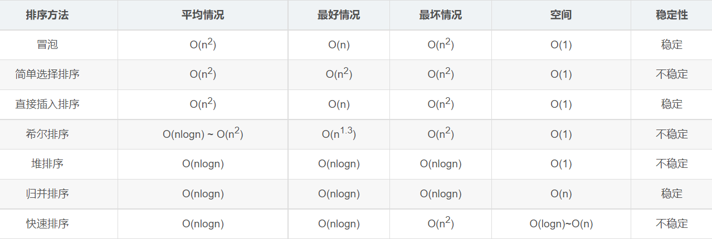

#### 稳定性
若待排序的序列中，存在多个具有相同关键字的记录，经过排序，这些记录的相对次序保持不变，则称该算法是稳定的；若经排序后，记录的相对次序发生了改变，则称该算法是不稳定的

#### 快速排序
1. 最好的情况：每次选的 pivot 几乎能把数据均分成两半，这样递归树的深度就是 logN，这样快排的时间复杂度为 O(NlogN)
2. 最坏的情况：每次找的 pivot 将数组分成两部分，其中有一部分是空，这样递归树就变成了一棵倾斜的树，树的深度为 n-1，这样时间复杂度就变成了 O(N^2)。一般当数据有序或者局部有序的时候会出现这种坏的情况，比如：数组正序或者逆序

解决方法：

1. 选 pivot 的时候可以随机选，而不是每次选第一个或者最后一个
2. 对子数组进行快排序的时候可以先扫描一遍，如果子数组有序就不用再快排了

## 哈希冲突

#### 开放地址法
1. 线性探测

按顺序决定哈希值时，如果某数据的哈希值已经存在，则在原来哈希值的基础上往后加一个单位，直至不发生哈希冲突

2. 再平方探测

按顺序决定哈希值时，如果某数据的哈希值已经存在，则在原来哈希值的基础上先加 1 的平方个单位，若仍然存在则减 1 的平方个单位。随之是 2 的平方、3 的平方等等，直至不发生哈希冲突

3. 伪随机探测

按顺序决定哈希值时，如果某数据已经存在，通过随机函数随机生成一个数，在原来哈希值的基础上加上随机数，直至不发生哈希冲突

#### 链式地址法
对于相同的哈希值，使用链表进行连接，使用数据存储每一个链表

#### 建立公共溢出区
建立公共溢出区存储所有哈希冲突的数据

#### 再哈希法
对于冲突的哈希值再次进行哈希处理，直至没有哈希冲突

## 平衡二叉树（AVL）

#### 出现背景
二叉搜索树能提高查询的效率为 O（logn），但是当插入{1，2，3，4，5，6}这种数据的时候，二叉树就像一个链表一样，搜索效率变为 O（n）

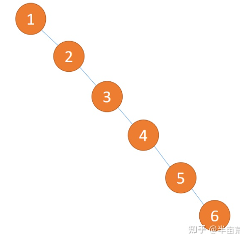

#### 特点
平衡因子（BF）：左子树和右子树高度差（左子树高度-右子树高度）

1. 是二叉排序树
2. 任何一个节点的左子树或者右子树都是平衡二叉树（左右高度差小于等于 1）

<font style="background-color:#FADB14;"> 不是平衡二叉树的情况 </font>

1. 不是二叉排序树


2. 中间节点子树高度差大于 1

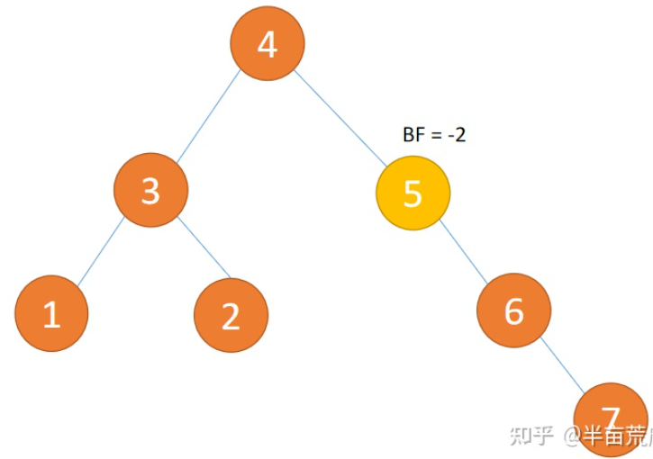

#### 旋转方式
1. 左旋
+ 旧根节点为新根节点的左子树
+ 新根节点的左子树（如果存在）为旧根节点的右子树
2. 右旋
+ 旧根节点为新根节点的右子树
+ 新根节点的右子树（如果存在）为旧根节点的左子树

#### 旋转类型
1. LL 型：插入左孩子的左子树，右旋
2. RR 型：插入右孩子的右子树，左旋
3. LR 型：插入左孩子的右子树，先左旋，再右旋
4. RL 型：插入右孩子的左子树，先右旋，再左旋

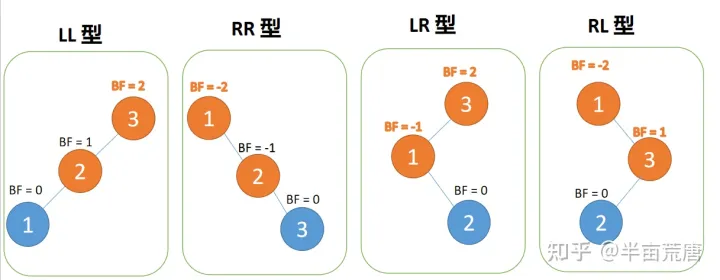

<font style="background-color:#FADB14;"> LL 型（右旋）</font>

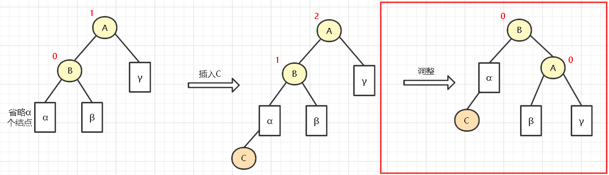

<font style="background-color:#FADB14;"> RR 型（左旋）</font>

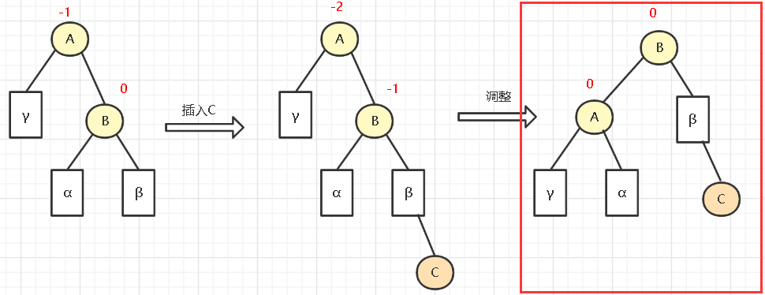

<font style="background-color:#FADB14;"> LR 型（先左旋，再右旋）</font>


<font style="background-color:#FADB14;"> RL 型（先右旋，再左旋）</font>


#### 删除节点
<font style="background-color:#FADB14;"> 节点为叶子节点 </font>

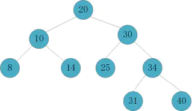

删除节点 14，仍处于平衡状态，不旋转


删除节点 7，树失衡，进行旋转


删除叶子节点的步骤：

1. 将该节点直接从树中删除
2. 其父节点的子树高度的变化将导致父节点平衡因子的变化，通过向上检索并推算是否失衡
3. 如果其父节点未失衡，则继续向上检索推算其父节点的父节点是否失衡.....如此反复推断，直到根节点；如果向上推算过程中发现了失衡的现象，进行相应的旋转

<font style="background-color:#FADB14;"> 节点只有左子树或右子树 </font>


将值为 40 的节点删除，先用其右子树与之替换，然后删除该节点


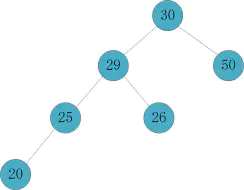


删除节点只有右子树或左子树的步骤：

1. 将右子树（左子树）替代原有删除节点的位置
2. 节点 C 被删除后，则以 C 的父节点 B 为起始推算点，依次向上检索推算各节点（父、祖先）是否失衡
3. 如果其父节点未失衡，则继续向上检索推算其父节点的父节点是否失衡.....如此反复推断，直到根节点；如果向上推算过程中发现了失衡的现象，则进行旋转

<font style="background-color:#FADB14;"> 节点既有左子树又有右子树 </font>


删除节点 20，节点 20 的平衡因子为 1，因此我们从节点的左子树中找到最大值，最大值为节点 15，对两个节点的值进行替换


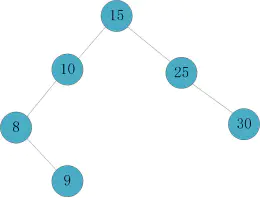


删除节点既有左子树又有右子树的步骤：

1. 如果该节点的平衡因子为 0 或者 1，则找到其左子树中具有最大值的节点 max，将 max 的内容与节点的内容交换，并且 max 即为新的要删除的节点（max 节点要么是一个叶子节点，要么是一个没有右子树的节点）
2. 如果该节点的平衡因子为-1，则找到其右节点中具有最小值的节点 min，将 min 的内容与节点的内容交换，并且 min 即为新的要删除的节点

## B-树（B 树）

#### 出现背景
1. 数据库索引为什么要使用树结构存储？

因为树的查询效率高，而且可以保持有序

2. 为什么索引没有使用二叉查找树来实现呢？

从算法逻辑上来说，二叉查找树的查找速度和比较次数都是最小的，但是得考虑磁盘 IO 的问题，数据库索引是存储在磁盘上的，当数据量比较大的时候，索引的大小可能有几个 G 甚至更多。当利用索引查询的时候，不能把整个索引全部加载到内存中，能做的只有逐一加载每一个磁盘页，这里的磁盘页对应着索引树的结点

最坏情况下，磁盘 IO 的次数等于索引树的高度，为了减少磁盘 IO 次数，我们就需要把原本“瘦高”的树结构变得“矮胖”

#### 特点
B 树的每一个节点最多包含 k 个孩子，k 被称为 B 树的阶，k 取决于磁盘页的大小

一个 m 阶的 B 树具有如下几个特征：

1. 根结点至少有两个子节点（即最少只有 1 个关键字）
2. 每个节点至多拥有 m 棵子树（即最多有 m-1 个关键字）
3. 除根节点外，其他每个分支至少有 t = ⌈m/2⌉ 棵子树（即 ⌈m/2⌉-1 个关键字）
4. 所有的叶子结点都位于同一层
5. 每个节点中的元素从小到大排列，节点当中 k-1 个元素正好是 k 个孩子包含的元素的值域分划。

B-树主要应用于文件系统以及部分数据库索引，如：非关系型数据库 MongoDB

**例：3 阶 B-树**

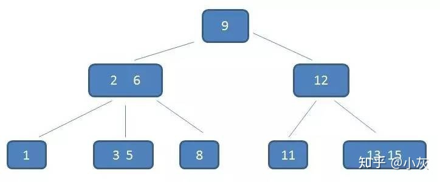

观察（2，6）节点，符合特征

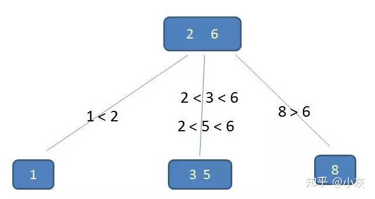

#### 查找
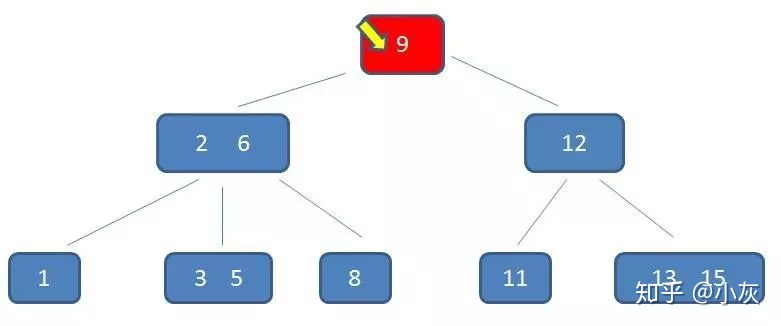  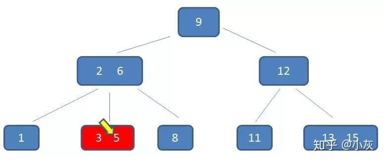

B-树在查询中的比较次数其实不比二叉查找树少，尤其当单一节点中的元素数量很多时，可是相比磁盘 IO 的速度，内存中的比较耗时几乎可以忽略，所以只要树的高度足够低，IO 次数足够少，就可以提升查找性能，相比之下节点内部元素多一些也没有关系，仅仅是多了几次交互，只要不超过磁盘页的大小即可

#### 添加
对高度为 h 的 m 阶 B 树，新节点一般是插在第 h 层，通过检索可以确定关键码应插入的位置

1. 若该节点中关键码个数小于 m-1，则直接插入
2. 若该节点中关键码个数等于 m-1，则将引起节点的分裂，以中间关键码为界将节点一分为二，产生一个新节点，并把中间关键码插入到父节点（h-1 层）中
3. 向父亲节点插入中间关键字的时候，重复以上两个步骤，最坏情况是一直分裂到根节点，建立一个新的根节点，整个 B 树增加一层

<font style="background-color:#FADB14;"> 添加节点 Q </font>

#### 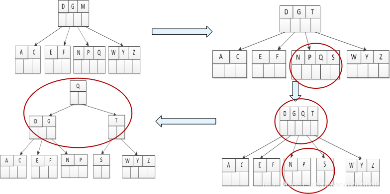  

删除
t = ⌈m/2⌉

1. 如果 target 在叶节点 x 中，则直接从 x 中删除 target，情况 2 和 3 会保证当在叶子节点找到 target 时，肯定能借节点或合并成功而不会引起父节点的关键字个数少于 t-1
2. 如果 target 在内部节点（非叶子节点中）x 中
+ 如果 x 的左分支节点 y 至少包含 t 个关键字，则找出 y 的最右的关键字 prev，并替换 target，并在 y 中递归删除 prev
+ 如果 x 的右分支节点 z 至少包含 t 个关键字，则找出 z 的最左的关键字 next，并替换 target，并在 z 中递归删除 next
+ 如果 y 和 z 都只有 t-1 个关键字，则将 target 与 z 合并到 y 中，使得 y 有 2t-1 个关键字，再从 y 中递归删除 target
3. 如果关键字不在内部节点 x 中，则必然在 x 的某个分支节点 p [i] 为根的子树中（即叶子节点），如果 p [i] 节点只有 t-1 个关键字，则执行以下步骤，以保证我们降至一个包含至少 t 个关键字的节点，然后通过对 x 的某个合适的子节点递归而结束
+ 如果 p [i-1] 拥有至少 t 个关键字，则将 x 的某个关键字降至 p [i] 中，将 p [i-1] 的最大关键字上升至 x 中
+ 如果 p [i+1] 拥有至少 t 个关键字，则将 x 的某个关键字降至 p [i] 中，将 p [i+1] 的最小关键字上升至 x 中
+ 否则将 p [i] 与其中一个兄弟合并，将 x 的一个关键字降至合并的节点中，成为中间关键字

<font style="background-color:#FADB14;"> 5 阶 B 树（最多有 4 个关键字，最少有 2 个关键字）</font>


在上面的 B 树中删除 21，删除后节点中的关键字个数仍然大于等于 2，所以删除结束


删除节点 27，位于非叶子节点中，从 27 替换它，然后在 28（原 27）的右孩子节点中删除 28，当前叶子节点的关键字的个数小于 2，而它的右兄弟节点中有 3 个记录，可以从兄弟节点借取一个 key


接着删除节点 32，当删除后，当前节点中只有 1 个 key，而右兄弟节点中也仅有 2 个 key，所以只能让父节点中的 30 下移和这两个孩子节点中的 key 合并


## B+树

#### 特点
B+树的查询性能比 B 树高

一个 m 阶的 B+树具有如下几个特征：

1. 有 k 个子树的中间节点包含有 k 个元素（B 树中是 k-1 个元素），每个元素不保存数据，只用来索引，所有数据都保存在叶子节点
2. 所有的叶子结点中包含了全部元素的信息，及指向含这些元素记录的指针，且叶子结点本身依关键字的大小自小而大顺序链接。
3. 所有的中间节点元素都同时存在于子节点，在子节点元素中是最大（或最小）元素。

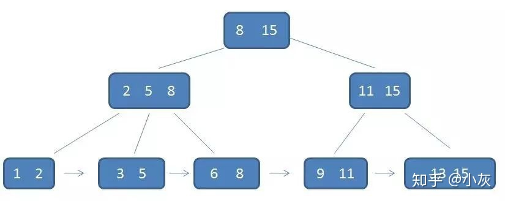

每一个父节点的元素都出现在子节点中，是子节点的最大（或最小）元素，根节点的最大元素，等同于整个 B+树的最大元素，以后无论插入删除多少元素，始终要保持最大元素在根节点

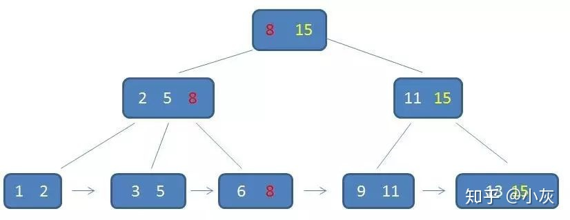

所有叶子节点包含了全量元素信息，并且每一个叶子节点都带有指向下一个节点的指针，形成了一个有序链表

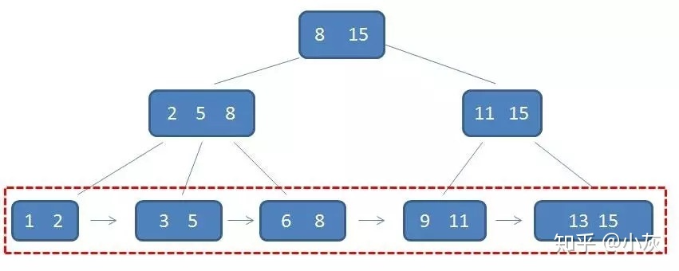

#### 卫星数据
卫星数据：索引元素指向的数据记录，比如数据库中的某一行。在 B-树中，无论中间节点还是叶子节点都带有卫星数据

1. B-树中，所有节点中带有卫星数据

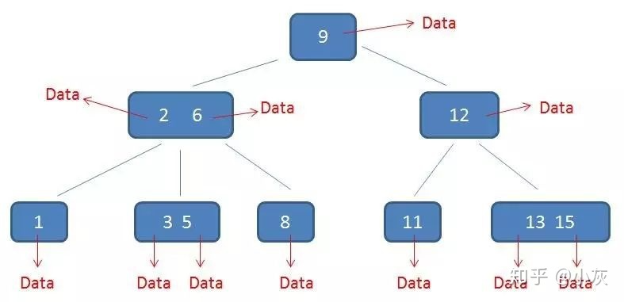

2. B+树中，只有叶子节点带有卫星数据，其余中间节点仅仅是索引，没有任何数据关联

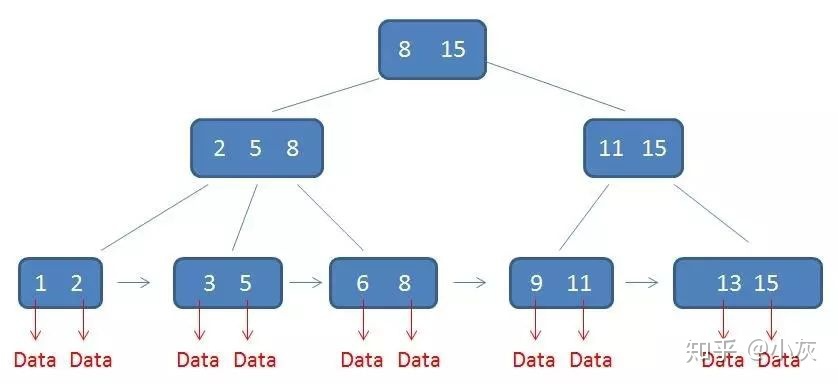

注意：在数据库的聚集索引中，叶子节点直接包含卫星数据，在非聚集索引中，叶子节点带有指向卫星数据的指针

#### 查找
1. B+树的中间节点没有卫星数据，所以同样大小的磁盘页可以容纳更多的节点元素。意味着，数据量相同的情况下，B+树的结构比 B-树更加“矮胖”，因此查询时 IO 次数也更少
2. B-树的查找性能并不稳定（最好情况是只查根节点，最坏情况是查到叶子节点），而 B+树的每一次查找都是稳定的

B-树的范围查找过程：查询范围为 3 到 11 的元素

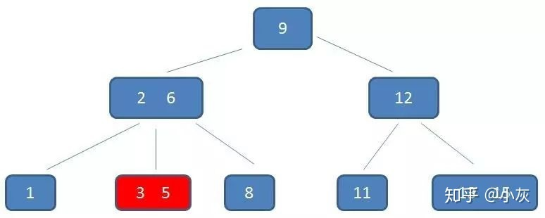 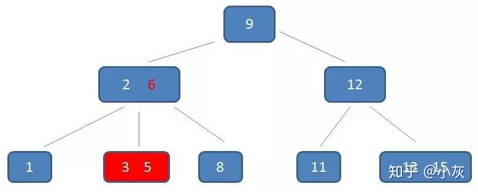 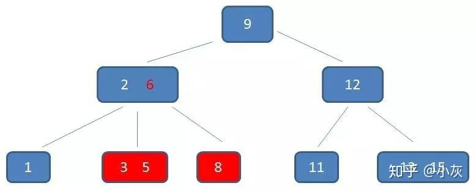  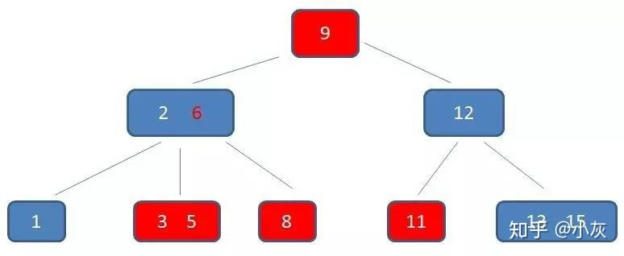

B+树的范围查找过程：查找到范围的下限

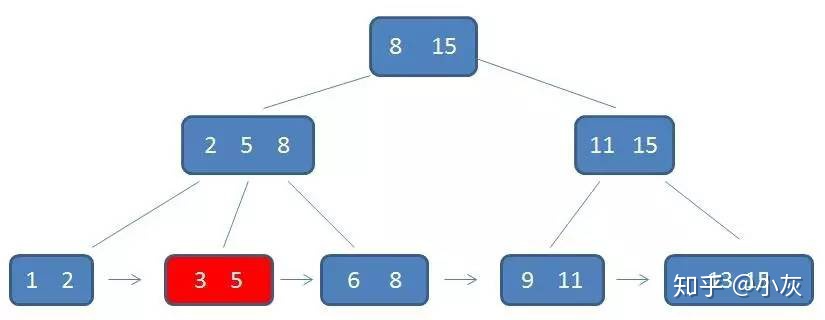 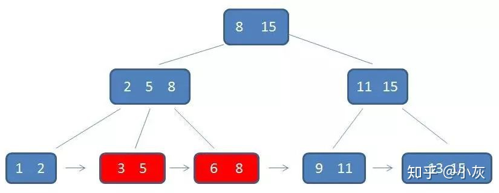 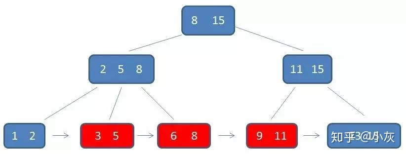

B+树相比 B-树的优势：

1. IO 次数更少
2. 查询性能稳定
3. 范围查询简便

#### 插入
1. 若为空树，创建一个叶子节点，然后将记录插入其中，此时这个叶子节点也是根节点，插入操作结束
2. 针对叶子类型节点：根据 key 值找到叶子节点，向这个叶子节点插入记录。插入后，若当前节点 key 的个数小于等于 m-1，则插入结束。否则将这个叶子节点分裂成左右两个叶子节点，左叶子节点包含前 m/2 个记录，右节点包含剩下的记录，将第 m/2+1 个记录的 key 进位到父节点中（父节点一定是索引类型节点），进位到父节点的 key 左孩子指针向左节点，右孩子指针向右节点，将当前节点的指针指向父节点，然后执行第 3 步
3. 针对索引类型节点：若当前节点 key 的个数小于等于 m，则插入结束。否则，将这个索引类型节点分裂成两个索引节点，左索引节点包含前（m-1）/2 个 key，右节点包含 m-（m-1）/2 个 key，将第 m/2 个 key 进位到父节点中，进位到父节点的 key 左孩子指向左节点，进位到父节点的 key 右孩子指向右节点。将当前节点的指针指向父节点，然后重复第 3 步

#### 删除
如果叶子节点中没有相应的 key，则删除失败。否则执行下面的步骤

1. 删除叶子节点中对应的 key，删除后若节点的 key 的个数大于等于 ⌈m/2⌉-1，删除操作节点。否则执行第 2 步
2. 若兄弟节点 key 的个数大于 ⌈m/2⌉-1，向兄弟节点借一个 key，同时用借到的 key 替换父节点中的 key，删除结束。否则执行第 3 步
3. 若兄弟节点中没有多余的 key，则当前节点和兄弟节点合并成一个新的叶子节点，并删除父节点中的 key（父节点中的这个 key 两边的孩子指针就变成了一个指针，指向这个新的叶子节点），将当前节点指向父节点（为索引节点）。执行第 4 步
4. 若索引节点 key 的个数大于等于 ⌈m/2⌉-1，则删除操作结束
5. 若兄弟节点 key 的个数大于 ⌈m/2⌉-1，父节点 key 下移，兄弟节点 key 上移，删除结束
6. 当前节点和兄弟节点及父节点下移 key 合并成一个新的节点，将当前节点指向父节点，重复第 4 步

注意：通过 B+树的删除操作后，索引节点中存在的 key，不一定在叶子节点中存在对应的记录

## 2-3 树

#### 出现背景
平衡二叉树保证了在最差的情况下，二叉树依然能够保持绝对的平衡，即左右两个子树的高度差的值不超过 1，但是这回带来一个问题，那就是平衡二叉树的定义过于严格，导致每次插入或者删除一个元素之后，要去维护二叉树整体的平衡，这样产生的代价又太大了。2-3 树就是把平衡的定义适当放宽，维护平衡的开销也可以接受

#### 特点
2-3 树：指每个具有子节点的节点要么有两个子节点和一个数据元素，要么有三个子节点和两个数据元素的自平衡的树，它的所有叶子节点都具有相同的高度

#### 插入
1. 插入节点 10


2. 插入节点 9


3. 插入节点 8，已有 3 个元素，不满足 2-3 树的定义，需要把 3 节点分裂成 2 节点

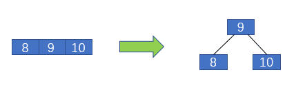

4. 插入节点 7

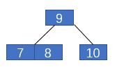

5. 插入节点 6，已有 3 个元素，不满足 2-3 树的定义，需要把 3 节点分裂成 2 节点

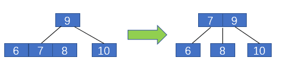

6. 插入节点 5

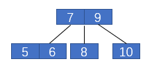

7. 插入节点 4，已有 3 个元素，不满足 2-3 树的定义，需要把 3 节点分裂成 2 节点，重复此操作

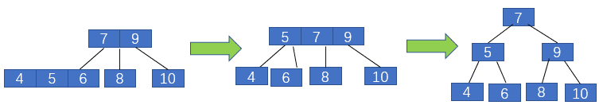

#### 删除（TODO）
+ 删除的是叶子节点
1. 删除的关键字为 3 节点中的关键字，直接将 3 节点变为 2 节点就可以了
2. 删除的关键字为 2 节点，但是它的父节点的右孩子为 3 节点，如：删除下图的 1，将 6 代替 4 的位置，4 代替 1 的位置，将右孩子变为 2 节点


3. 删除的节点关键字为 2 节点，但是它父亲和它父亲的右孩子都是 2 节点，如：删除下图中的 4，将根节点 8 的右孩子的最小值代替 8 的位置，8 的左孩子的最大值用 8 代替，将 6 和 7 向左旋转


4. 树为满二叉树就减少高度


5. 删除的节点关键字为 2 节点，但是它的父亲为 3 节点，如：下图删除 10，将 12、14 节点变为 2 节点，12 和 13 组成 3 节点


+ 删除的是非叶子节点
1. 删除的节点关键字为 2 节点，用删除的关键字的后继代替删除的关键字即可


2. 

## 红黑树

#### 出现背景
自平衡的二叉树平衡二叉树保证了在最差的情况下，二叉树依然能够保持绝对的平衡，即左右两个子树的高度差的绝对值不超过 1。但是这又会带来一个问题，那就是平衡二叉树的定义过于严格，导致每次插入或者删除一个元素之后，都要去维护二叉树整体的平衡，这样产生额外的代价又太大了。二叉搜索树可能退化成链表，而平衡二叉树维护平衡的代价开销又太大了，那怎么办呢？这就要谈到“中庸之道”的智慧了。说白了就是把平衡的定义适当放宽，不那么严格，这样二叉树既不会退化成链表，维护平衡的开销也可以接受。

#### 特点
1. 根节点是黑色
2. 除根节点，其他节点是红色或黑色
3. 每个叶子节点都是黑色的空节点（NIL 节点）
4. 每个红色节点的两个子节点都是黑色（从每个叶子到根的所有路径上不能有两个连续的红色节点）
5. 从任一节点到其每个叶子的所有路径都包含相同数目的黑色节点

上述规则保证了红黑树的自平衡，红黑树从根到叶子的最长路径不会超过最短路径的 2 倍

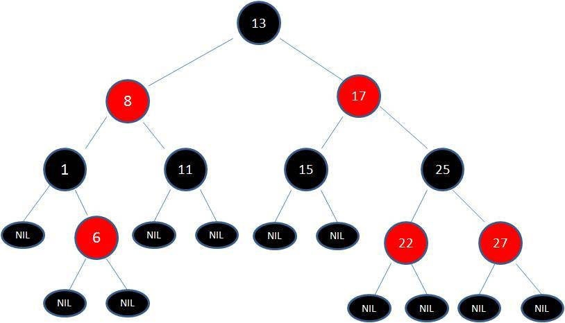

#### 2-3 与红黑树的关系
在 2-3 树中，根节点只能是 2 节点或者 3 节点，2 节点与 3 节点在红黑树中的等价形式，如下图所示：

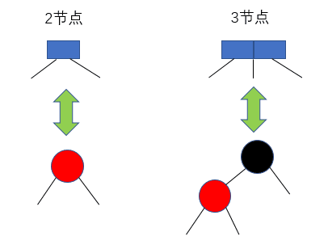

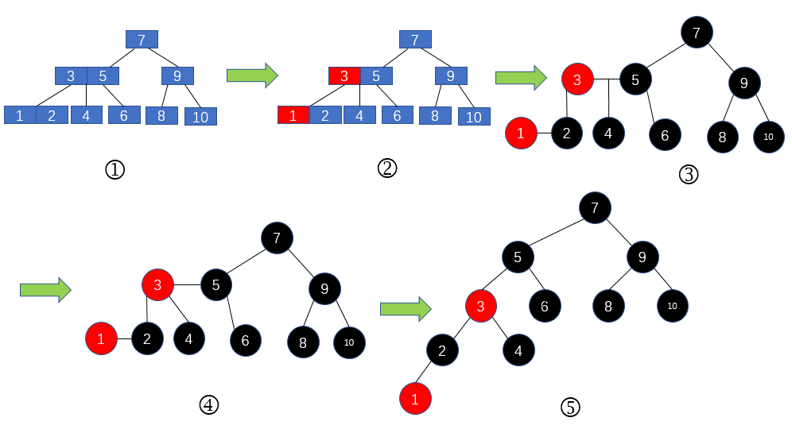

#### 破坏规则的情况
向原红黑树插入值为 21 的新节点

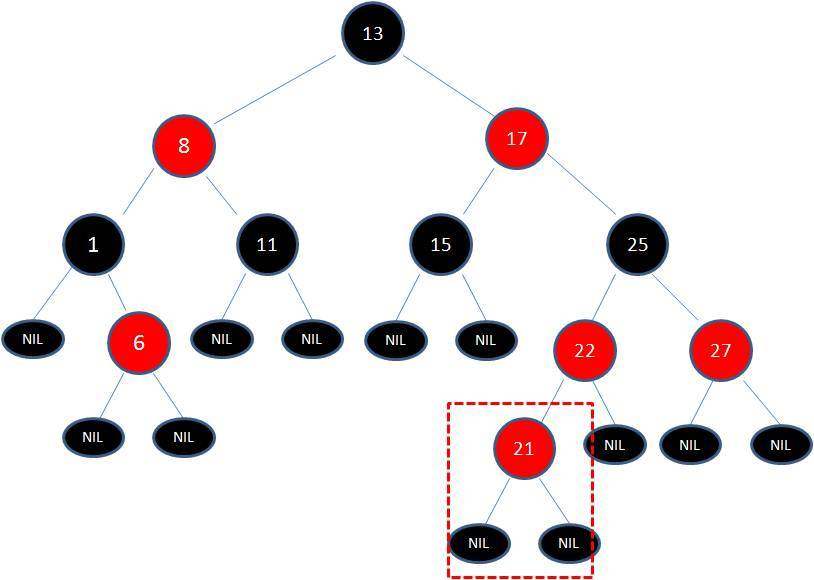

#### 调整平衡的方法
1. 变色

节点 21 和节点 22 连续出现了红色，不符合规则 4，所以把节点 22 从红色变成黑色

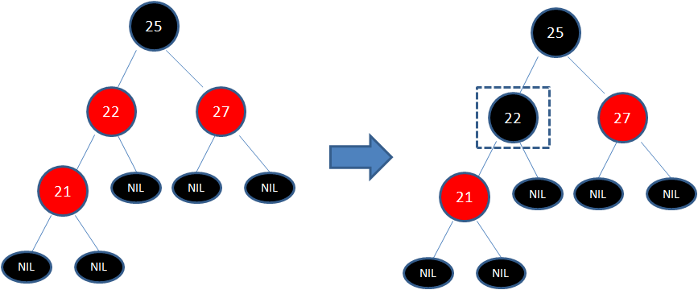

因为凭空多出的黑色节点打破了规则 5，所以发生连锁反应，需要继续把节点 25 从黑色变成红色，因为节点 25 和节点 27 又形成了两个连续的红色节点，需要继续把节点 27 从红色变成黑色

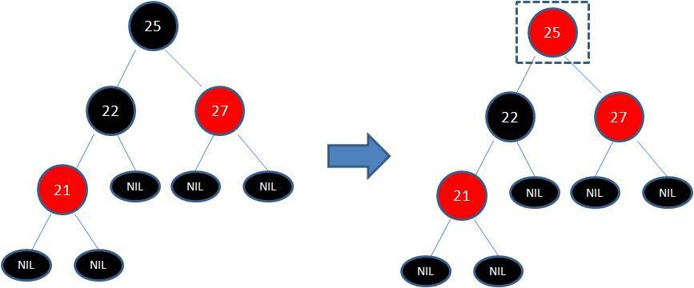

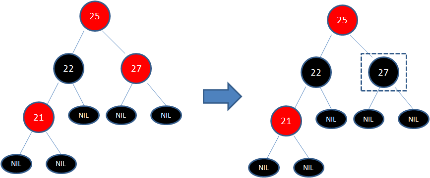

2. 旋转

<font style="background-color:#FADB14;"> 左旋 </font>

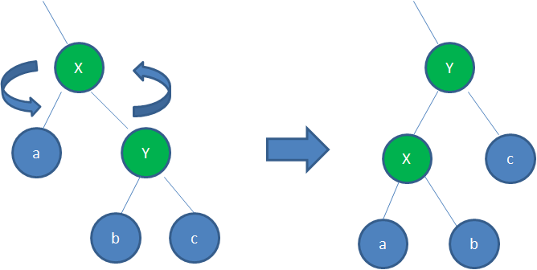

<font style="background-color:#FADB14;"> 右旋 </font>

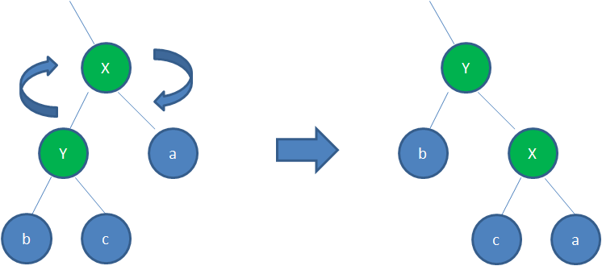

## B 树和 B+树的区别

B 树中每个节点同时存储 key 和 data，而 B+树中只有叶子节点才存储 data，非叶子节点只存储 key。InnoDB 对 B+树进行了优化，在每个叶子节点上增加了一个指向相邻叶子节点的链表指针，形成了带有顺序指针的 B+树，提高区间访问的性能

B+树优点：

1. B+树在非叶子节点上不含数据信息，因此在内存页中能够存放更多的 key，数据存放得更加紧密，具有更好的空间利用率，访问叶子节点上关联的数据也具有更好的缓存命中率
2. B+树的叶子节点都是相连的，因此对整棵树的遍历只需要一次线性遍历叶子节点即可；而 B 树则需要进行每一层的递归遍历，相邻的元素可能在内存中不相邻，所以缓存命中性没有 B+树高，但是 B 树每个节点都包含 key 和 value，因此经常访问的元素可能离根节点更近，访问更迅速

