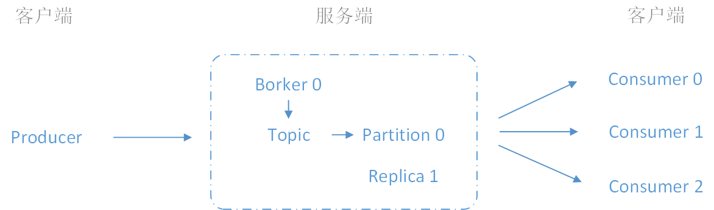
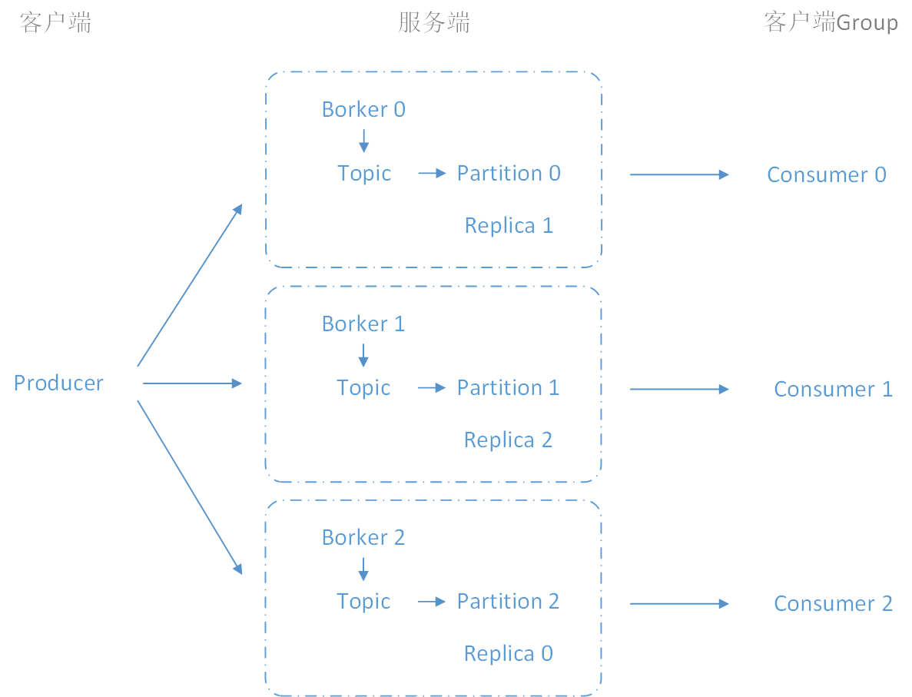
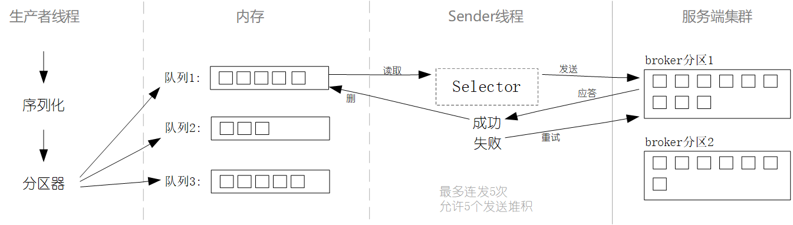
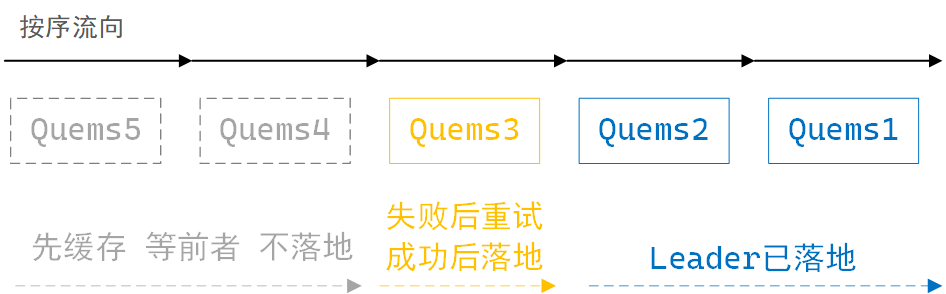

## 关键术语

| 术语      | 语义                                                         |
| --------- | ------------------------------------------------------------ |
| Producer  | 客户端，生产者，消息提供者，负责发出消息到服务端 Broker       |
| Broker    | 服务端，负责处理生产者的消息，分发到 Topic                    |
| Topic     | 服务端，消息的主题，消息的管道，消息的区分                   |
| Partition | 服务端，Topic 消息的存储块，多个分区(副本)间的消息同步，确保消息不会丢失 |
| Consumer  | 客户端，消费者，读取(消费)服务端 Partition 的消息              |

## 基础架构

### 单机模式

一个生产者，多个消费者。



### 集群模式

一个生产者，多个 Borker 的集群模式，分区交叉同步副本，一个消费者组；
分区并行消费，对应多个消费者，形成消费组；当一个 Server 宕机后，不影响数据的丢失。



## 生产者线程

Producer 生产者是数据的入口，它先将数据序列化后于内存的不同队列中，它用 push 模式再将内存中的数据发送到服务端的 broker，以追加的方式到各自分区中存储。生产者端有两大线程，以先后的顺序，分别负责各自的任务处理，可并行或同步的方式，完成生产者端的所有处理过程。

### 生产者端的两大线程

- 生产者线程：先将数据按规则放到内存当中
- Sender 线程：再将内存中的数据发送到 broker

生产者线程发送数据，经过序列化后再内存中分队列存储，每个队列中的数据块默认为 16K，每个数据块的过期时间为 0ms。

内存中有多个分区队列，消息是如何分队列的呢？

### 生产者线程的分区工作原理/三大分区策略

- 线程中的 send 方法指定分区号的，按指定分区存放
- 线程中的 send 方法无分区号的，有 key value 的，按 key 的 hash 值计算出一个固定区号存放
- 线程中的 send 方法只有 value 的，一个数据块填满后，随机按序平均存放到不同的分区

### 生产者线程也可以自定义分区策略

- 自定义类实现 Partitioner 接口
- 重写 Partition 方法（按收到的消息，指定到分区）
- 实现类配置到 Producer Properties 中

## Sender 线程

Sender 线程处理生产者线程于内存中的队列数据块，它建立内存队列与服务端 broder 分区的数据通道，当数据块达到 16K 或超过过期时间，从内存中取出数据块并发送到服务端 broker 对应的分区；默认情况下，不用等 broker 分区的应答，最多连续发送 5 个数据块，失败时重发；数据块发送成功后，内存队列中的相应数据块删除，再进行下一次的发送。

> 服务端 broker 分区中，有两种不同的角色，leader 和 副本，leader 负责接收数据，并把数据同步给各个副本以做备份，当 leader 发生异常状况后，可自动启用副本继续运行。后续章节再继续阐述 broker 分区的内容。

当 Sender 线程将内存中的数据块发送给服务端的 broker leader 时，

### borker 对 Sender 线程的应答机制

- 0：broker leader 接收的数据，不用等保存到磁盘就及时应答给 Sender 线程
- 1：leader 保存磁盘后，不用等同步给副本，就应答给负责发送的 Sender 线程
- all：leader 和副本全部都磁盘保存完成后，再应答给负责发送的 Sender 线程

**按实际场景可以选择 broker 不同的应答机制：**

* 如果对数据的完整性要求最高的话，应答机制 all 是最好的选择，如银行流水数据；
* 如果对处理速度要求最高的话，允许偶然个别数据的缺失，应答机制 0 是最好的选择，如日志。

## 生产者端 - 整体运行示例图

为了更好的直观的便于理解，以图例方式展现上述所有的阐述内容：



## 分区数据与副本

Kafka 的 partition 会有多个副本，其中有一个 leader 角色的副本，它负责接收 producer 端发送的数据；也可以通过克隆 leader 的方式创建更多的副本，leader 与其它副本保持数据同步，也就是为了在极端情况下的数据备份，每个分区的副本交错的存在于其它分区中，尽量以平均方式存放于各分区中，也可以手动指定存放的分区（假设是因服务器硬件的配置不同），当极端情况下，leader 宕机后，自动启用副本作为新 leader 角色，负责接收消息。

leader 与副本保持通信，副本持续向 leader 发送健康请求，超过默认 30 秒无连接的副本，从关联的副本中删除关系；副本数据默认为 1 个，通常我们至少设置为 2 个。

```bash
# 副本数量配置项（默认为1）
mis.insync.replicas
```

以上这种，能够和 leader 保持同步的 follower + leader 本身 组成的运作全过程，称之为（In-Sync Replicas）**ISR 同步机制**。

## 精准数据

### 数据的不重复

- broker 单次启动运行，会有一个唯一的运行编号
- 每个分区都会有一个唯一的分区编号
- producer 发送的每条消息都会有一个唯一的消息编号

像以上这种，对每个环节都会有唯一编号，kafka 很方便的区分出每条消息的归属，为幂等性。

```bash
# 幂等性（默认开启）
enable.idempotence = true
```

### 数据防丢失

通过以上内容的了解，为防止数据的丢失，这里可以这样做：

1. 应答机制设为 all，确保 leader 和副本都保存完成
2. 分区副本至少有两个，确保随时有可启用的副本数据

当做到 **数据不重复 + 数据防丢失**，体现出数据的完整性、安全性、一致性。

### 数据的按序

broker 中的 leader 在接收数据时，分区缓存按序最多可存 5 个请求数据，成功的消息请求会落地，消息请求按序落地磁盘，若一次消息请求失败，producer 会尝试重发，此时 leader 分区的数据落地动作会暂停，但会缓存新收到的请求数据，积满 5 个后暂停接收，直至之前失败的消息请求成功后，再从此消息处，重新开始按序落地磁盘。多分区按发送序号落地磁盘。

leader 分区缓存接收消息示意图：



## Leader partition 的自动平衡

假如，个别 broker 中的分区过多，个别 broker 中的分区过少，这不符合负载均衡。

kafka 默认开启了每间隔一段时间，自动检测分区分布的差异值是否超过了警戒值，当超过设定的警戒值时，自动触发平均分布的动作。

```bash
# 开启自动平衡分布（默认）
auto.leader.rebalance.enable = true
# 不平衡警戒触发值（默认1%）
leader.imbalance.per.broker.percentage
# 检测间隔时间（默认300秒）
leader.imbalance.check.interval.seconds = 300
```

通常不建议开启，或者把警戒触发值调大，或者把间隔时间设长，为减少被触发的次数；频繁性的触发平均分配，造成不必要的资源消耗。

## 管理节点(Broker)

通常是向集群中添加新节点；每个 broker 启动后，会先向 ZK 注册，每个 broker 有个选举 leader 的 controller，按注册的顺序为 leader 角色的替代者，leader 的 contraller 负责监听 ZK 的 broker.Ids 并管理。以下阐述对节点(broker)的管理操作。

### 注册新节点

首先确保各 IP 及主机名的对应，便于后续节点相关的配置。

再次确保一个全新的节点，broker.id 的设置、zookeeper.connect 的配置、数据及日志目录为空。

启动该节点（自动注册并加入集群中）

### 手动设定节点分区

```bash
# 指定成员节点，重新分配分区，自动将数据同步到其它节点
bin/kafka-reassign-partitions.sh --broker-list '0,1,2'
```

减少/删除节点，同上，改变 --broker-list 的成员节点，数据将自动同步到其它节点。

## 宕机后的数据同步

leader(broker)宕机恢复后，以当前 leader 数据为准，这里为了数据的一致性。

副本(broker)宕机恢复后，向 leader 请求同步数据。

## 存储机制

Topic 在每个 Broker 下存储所属的 Partition，Partition 下由 Index、Log 两类文件组成。

### 写入

Log 由多个 Segment 文件组成，接收到的新消息永远是以追加的方式于 Segment 文件中，每个 Segment 文件容量最多为 1GB，Segment 的文件个数随着数据量的累积而增加，每个消息有自增编号，这种只追加不修改的方式避免了变更前的查询消耗。

### 查询

Index 文件仅记录固定消息量的索引编号范围，Kafka 在查询时，先从 Index 中定位到小范围的索引编号区间，再去 Log 中在小范围的数据块中查询具体数据，此索引区间的查询方式称为 - 稀疏索引。

## 高效读写

- 分布式、多分区、各线程并行处理
- 稀疏索引 - 小范围快速定位要消费的数据
- 数据文件，只追加不修改的顺序写方式（利用了物理磁盘的优势）
- 缓存技术 - 大量减少 IO（由系统层面负责 IO 动作）
- 零拷贝技术 - 解放 CPU，大量减少数据块的 Copy，数据直接从磁盘到网卡送出（利用了操作系统的技术）

## 文件清理

### 过期时长

```bash
# 数据文件过期时长配置项，三选一
log.retention.hours			# 小时，默认7天
log.retention.minutes		# 分钟
log.retention.ms			# 毫秒
# 删除的容量警戒值，默认-1无穷大
log.retention.bytes
# 检查过期间隔，默认5分钟
log.retention.check.interval.ms
```

### 清理方式

```bash
log.cleanup.policy = delect | compact
```

#### delect

1. 以 Segment 文件最后一条消息的时间为删除依据，删除已过期的 Segment 整个文件。
2. 以 Log 文件总大小为准，超过 log.retention.bytes 配置的警戒值，删除最早的 Segment 文件。

#### compact

对于相同的 key，仅保留最后一次的 value，所有数据启用压缩策略（offset 的 id 就不会连续，后续说明）。

## 消费流程

### 消费者发起网络消费请求

```bash
# 每批次最小抓取设置（推荐1字节）
fetch.min.bytes
# 每批次最大抓取大小设置（推荐500ms）
fetch.max.bytes
# 未达到大小的超时设置（推荐50M）
fetch.max.wait.ms
```

### 拉取数据到内存消费队列中

```bash
# 单次拉取最大消息条数设置（推荐500条）
max.poll.records
```

反序列化处理（对应了 Producer 端的序列化动作）

拦截器处理（如：汇总统计记录）

### 数据的后续处理

保存等的消费端动作。

## Offset

当一个消费者挂掉或重启后，是否还记得消费到的位置了？offset 解决了此问题。

对于每一个 topic，都会维持一个分区日志，分区中的每一个记录都会分配一个 Id 来表示顺序，称之为 offset，offset 用来唯一的标识分区中每条记录，并将每次的消费位置提交到 topic 中。消费者恢复启动后接着按序消费数据。

### 自动提交

```bash
# 开启自动提交
enable.auto.commit = true
# 每次提交间隔（推荐5秒）
auto.commit.interval.ms = 5000
```

### 手动提交

先关闭自动提交后，在 Consumer 客户端的代码中，通过调用方法函数提交，通常的方法名：

```bash
# 同步提交，等提交完成才可下一次再消费
.CommitSync
# 异步提交，可直接进行下一个消费，也有可能提交失败
.CommitAync
```

### 指定消费

在 Consumer 客户端的代码中，手动指定 offset 的位置进行消费，关联到的方法函数名：

```bash
# 按指定时间得出offset值
.offsetsForTimes
# 按指定offset值继续消费
.seek
```

### 初始策略

```bash
##### 当无 offset 时：(初次消费)
# - none：引发异常
# - earliest：从头开始消费
# - latest：从此刻开始消费
auto.offset.reset = earliest | latest | none
```

### 消费现象

**重复消费**：offset 未提交成功，下次消费还是旧的 offset。

**漏消费**：offset 提交成功，消费者端后续的数据处理未完成（建议下游步骤事务处理）。

## 消费者组

为了实现横向扩展，应用程序需要创建一个消费者群组，然后往群组里添加消费者来提高处理效率，群组里的每个消费者只处理一部分消息。

消费者组是逻辑上的一个消费者，是由一个或多个消费者实例组成，具有可扩展性和可容错性，消费者组内的消费者共享一个 GroupId 组成；组内每个消费者负责消费不同分区数据，并行消费数据；当组内一个消费者挂了之后，其它消费者要自动承担它的消费任务 - **组内再平衡**。

### 触发再平衡

消费成员与 Broker 分区保持心跳连接，或者消费成员处理消息时间过长，会被认为此消费者需要被移除，触发组内消费成员任务再分配。以下配置任其一条件触发再平衡：

```bash
# 心跳连接超时的 移除条件（建议45秒）
session.timeout.ms
# 消息处理超时的 移除条件（建议5分钟）
max.poll.interval.ms
```

### 再平衡策略

```bash
# 再平衡策略配置项（可多策略组合）
partition.assignment.strategy = Range | RoundRobin | Sticky | CooperativeSticky
```

- Range：单个 Topic 内的重新平均分配
- RoundRobin：所有 Topic 的全部消费者，一起重新分配
- Sticky：一次小范围重新分配；仅调整需要的，避免大规模重新分配
- CooperativeSticky：可多次小范围重新调整，直至最终效果

## 提升吞吐量

- 增加分区，增加消费者，两者一一对应起来，并行消费
- 调整一次最多拉取的消息条数（500 条）
- 调整单次抓取的数据最大容量（50M）