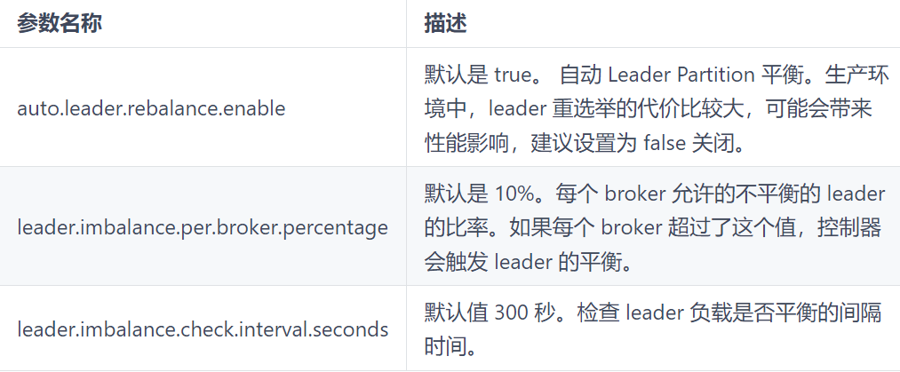
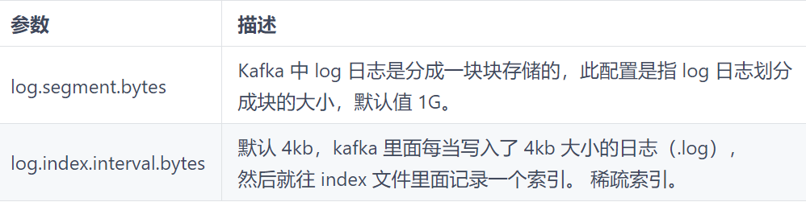
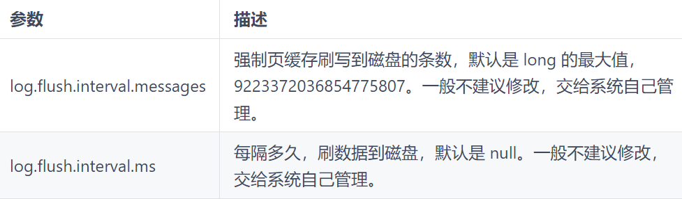

## 基础架构

1. 为方便扩展，并提高吞吐量，一个 topic 分为多个 partition
2. 配合分区的设计，提出消费者组的概念，组内每个消费者并行消费
3. 为提高可用性，为每个 partition 增加若干副本，类似 NameNode HA
4. ZK 中记录谁是 leader，Kafka2.8.0 以后也可以配置不采用 ZK


1. Producer：消息生产者，就是向 Kafka broker 发消息的客户端。
2. Consumer：消息消费者，向 Kafka broker 取消息的客户端。
3. Consumer Group（CG）：消费者组，由多个 consumer 组成。消费者组内每个消费者负责消费不同分区的数据，一个分区只能由一个组内消费者消费；消费者组之间互不影响。所有的消费者都属于某个消费者组，即消费者组是逻辑上的一个订阅者。
4. Broker：一台 Kafka 服务器就是一个 broker。一个集群由多个 broker 组成。一个 broker 可以容纳多个 topic。
5. Topic： 可以理解为一个队列，生产者和消费者面向的都是一个 topic。
6. Partition： 为了实现扩展性，一个非常大的 topic 可以分布到多个 broker（即服务器）上，一个 topic 可以分为多个 partition，每个 partition 是一个有序的队列。
7. Replica：副本。一个 topic 的每个分区都有若干个副本，一个 Leader 和若干个 Follower。
8. Leader：每个分区多个副本的 "主"，生产者发送数据的对象，以及消费者消费数据的对象都是 Leader。
9. Follower：每个分区多个副本中的 "从"，实时从 Leader 中同步数据，保持和 Leader 数据的同步。Leader 发生故障时，某个 Follower 会成为新的 Leader。

## 命令行操作


### kafka-topics
1. --bootstrap-server <String: server toconnect to>：连接的 Kafka Broker 主机名称和端口号。
2. --topic <String: topic>：操作的 topic 名称。
3. --create：创建主题
4. --delete：删除主题
5. --alter：修改主题
6. --list：查看所有主题
7. --describe：查看主题详细描述
8. --partitions <Integer: # of partitions>：设置分区数。
9. --replication-factor <Integer: replication factor>：设置分区副本。
10. --config <String: name=value>：更新系统默认的配置。

```shell
查看操作主题命令参数
./bin/kafka-topics.sh 

# 查看当前服务器中的所有 topic
./bin/kafka-topics.sh --bootstrap-server localhost:9092 --list

# 查看 first 主题的详情
./bin/kafka-topics.sh --bootstrap-server localhost:9092 --describe --topic first

# 修改分区数（注意：分区数只能增加，不能减少）
./bin/kafka-topics.sh --bootstrap-server localhost:9092 --alter --topic first --partitions 3

# 删除 topic
./bin/kafka-topics.sh --bootstrap-server localhost:9092 --delete --topic first 
```

### kafka-console-producer
1. --bootstrap-server <String: server toconnect to>：连接的 Kafka Broker 主机名称和端口号。
2. --topic <String: topic>：操作的 topic 名称。

```shell
生产者发送消息
./bin/kafka-console-producer.sh --bootstrap-server localhost:9092 --topic first
>hello world
>yooome yooome
```

### kafka-console-consumer
1. --bootstrap-server <String: server toconnect to>：连接的 Kafka Broker 主机名称和端口号。
2. --topic <String: topic>：操作的 topic 名称。
3. --from-beginning：从头开始消费。
4. --group <String: consumer group id>：指定消费者组名称。

```shell
消费 first 主题中的数据
./bin/kafka-console-consumer.sh --bootstrap-server localhost:9092 --topic first

# 把主题中所有的数据都读取出来（包括历史数据）
./bin/kafka-console-consumer.sh --bootstrap-server localhost:9092 --topic first --from-beginning
```

## 生产者
### 消息发送原理
在消息发送的过程中，涉及到了两个线程（main 线程和 Sender 线程）。在 main 线程中创建了一个双端队列 RecordAccumulator。main 线程将消息发送给 RecordAccumlator，Sender 线程不断从 RecordAccumulator 中拉取消息发送到 Kafka Broker


### 分区
便于合理使用存储资源，每个 Partition 在一个 Broker 上存储，可以把海量的数据按照分区切割成一块一块数据存储在多台 Broker 上。合理控制分区的任务，可以实现负载均衡的效果。

提高并行度，生产者可以以分区为单位发送数据；消费者可以以分区为单位进行消费数据。


### 数据可靠性


总结：

1. acks = 0，生产者发送过来数据就不管了，可靠性差，效率高；
2. acks = 1，生产者发送过来数据 Leader 应答，可靠性中等，效率中等；
3. acks =-1，生产者发送过来数据 Leader 和 ISR 队列里面所有 Follwer 应答，可靠性，效率低；

在生产环境中，acks = 0 很少使用；acks = 1，一般用于传输普通的日志，允许丢个别数据；acks =-1，一般用于传输和钱相关的数据，对可靠性要求比较高的场景。

### 数据重复性


1. 至少一次（At Least Once） = ACK 级别设置为-1 + 分区副本大于等于 2 + ISR 里应答的最小副本数量大于等于 2 ；
2. 最多一次（At Most Once）= ACK 级别设置为 0 ；
3. 精确一次（Exactly Once）：对于一些非常重要的信息，比如和钱相关的数据，要求数据既不能重复也不丢失。

总结：

+ At Least Once 可以保证数据不丢失，但是不能保证数据不重复；
+ At Most Once 可以保证数据不重复，但是不能保证数据不丢失。

#### 幂等性
1. 幂等性：指 Producer 不论向 Broker 发送多少次重复数据，Broker 端都只会持久化一条，保证了不重复。
2. 精确一次（Exactly Once）= 幂等性 + 至少一次（ack =-1 + 分区副本数 >= 2 + ISR 最小副本数量 >= 2)。
3. 重复数据的判断标准：具有 <PID, Partition, SeqNumber> 相同主键的消息提交时，Broker 只会持久化一条。其中 PID 是 Kafka 每次重启都会分配一个新的；Partition 表示分区号；Sequence Number 是单调自增的。

所以幂等性只能保证的是在单分区单会话内不重复

使用幂等性：开启参数 enable.idempotence 默认为 true，false 关闭。


#### 事务


### 数据有序性
#### 有序


#### 无序

kafka 在 1.x 版本之前保证数据单分区有序，条件如下：

max.in.flight.requests.per.connection = 1（不需要考虑是否开启幂等性）。

kafka 在 1.x 及以后版本保证数据单分区有序，条件如下：

1. 未开启幂等性：max.in.flight.requests.per.connection 需要设置为 1。
2. 开启幂等性：max.in.flight.requests.per.connection 需要设置小于等于 5。

原因说明：因为在 kafka1.x 以后，启用幂等后，kafka 服务端会缓存 producer 发来的最近 5 个 request 的元数据，故无论如何，都可以保证最近 5 个 request 的数据都是有序的。


## Broker
### 工作原理
#### zookeeper 存储信息


#### 工作流程


### 节点服役
1. 增加一个节点 4 时，先单独启动
2. 创建一个要均衡的主题

```shell
[atguigu@hadoop102 kafka]$ vim topics-to-move.json
{
  "topics": [
  	{"topic": "first"}
  ],
  "version": 1
}
```

3. 生成一个负载均衡的计划

```shell
[atguigu@hadoop102 kafka]$ bin/kafka-reassign-partitions.sh --
bootstrap-server hadoop102:9092 --topics-to-move-json-file 
topics-to-move.json --broker-list "0,1,2,3" --generate
Current partition replica assignment
{"version":1,"partitions":[{"topic":"first","partition":0,"replic
as":[0,2,1],"log_dirs":["any","any","any"]},{"topic":"first","par
tition":1,"replicas":[2,1,0],"log_dirs":["any","any","any"]},{"to
pic":"first","partition":2,"replicas":[1,0,2],"log_dirs":["any","
any","any"]}]}
Proposed partition reassignment configuration
{"version":1,"partitions":[{"topic":"first","partition":0,"replic
as":[2,3,0],"log_dirs":["any","any","any"]},{"topic":"first","par
tition":1,"replicas":[3,0,1],"log_dirs":["any","any","any"]},{"to
pic":"first","partition":2,"replicas":[0,1,2],"log_dirs":["any","
any","any"]}]}
```

4. 复制上面的信息，创建副本存储计划，存储在各个节点中

```shell
[atguigu@hadoop102 kafka]$ vim increase-replication-factor.json
{"version":1,"partitions":[{"topic":"first","partition":0,"replic
as":[2,3,0],"log_dirs":["any","any","any"]},{"topic":"first","par
tition":1,"replicas":[3,0,1],"log_dirs":["any","any","any"]},{"to
pic":"first","partition":2,"replicas":[0,1,2],"log_dirs":["any","
any","any"]}]}
```

5. 执行副本存储计划

```shell
[atguigu@hadoop102 kafka]$ bin/kafka-reassign-partitions.sh --
bootstrap-server hadoop102:9092 --reassignment-json-file 
increase-replication-factor.json --execute
```

6. 验证副本存储计划

```shell
[atguigu@hadoop102 kafka]$ bin/kafka-reassign-partitions.sh --
bootstrap-server hadoop102:9092 --reassignment-json-file 
increase-replication-factor.json --verify
Status of partition reassignment:
Reassignment of partition first-0 is complete.
Reassignment of partition first-1 is complete.
Reassignment of partition first-2 is complete.
Clearing broker-level throttles on brokers 0,1,2,3
Clearing topic-level throttles on topic first
```

### 节点退役
1. 创建一个均衡主题

```shell
[atguigu@hadoop102 kafka]$ vim topics-to-move.json
{
  "topics": [
  	{"topic": "first"}
  ],
  "version": 1
}
```

2. 创建执行计划

```shell
bootstrap-server hadoop102:9092 --topics-to-move-json-file 
topics-to-move.json --broker-list "0,1,2" --generate
Current partition replica assignment
{"version":1,"partitions":[{"topic":"first","partition":0,"replic
as":[2,0,1],"log_dirs":["any","any","any"]},{"topic":"first","par
tition":1,"replicas":[3,1,2],"log_dirs":["any","any","any"]},{"to
pic":"first","partition":2,"replicas":[0,2,3],"log_dirs":["any","
any","any"]}]}
Proposed partition reassignment configuration
{"version":1,"partitions":[{"topic":"first","partition":0,"replicas":[2,0,1],"log_dirs":["any","any","any"]},{"topic":"first","par
tition":1,"replicas":[0,1,2],"log_dirs":["any","any","any"]},{"to
pic":"first","partition":2,"replicas":[1,2,0],"log_dirs":["any","
any","any"]}]}
```

3. 创建副本存储计划，存储在所有节点中

```shell
[atguigu@hadoop102 kafka]$ vim increase-replication-factor.json
{"version":1,"partitions":[{"topic":"first","partition":0,"replic
as":[2,0,1],"log_dirs":["any","any","any"]},{"topic":"first","par
tition":1,"replicas":[0,1,2],"log_dirs":["any","any","any"]},{"to
pic":"first","partition":2,"replicas":[1,2,0],"log_dirs":["any","
any","any"]}]}
```

4. 执行副本存储计划

```shell
[atguigu@hadoop102 kafka]$ bin/kafka-reassign-partitions.sh --
bootstrap-server hadoop102:9092 --reassignment-json-file 
increase-replication-factor.json --execute
```

5. 验证副本存储计划

```shell
[atguigu@hadoop102 kafka]$ bin/kafka-reassign-partitions.sh --
bootstrap-server hadoop102:9092 --reassignment-json-file 
increase-replication-factor.json --verify
Status of partition reassignment:
Reassignment of partition first-0 is complete.
Reassignment of partition first-1 is complete.
Reassignment of partition first-2 is complete.
Clearing broker-level throttles on brokers 0,1,2,3
Clearing topic-level throttles on topic first
```

6. 删除节点 4

### kafka 副本
#### 基本信息
1. Kafka 副本作用：提高数据可靠性。
2. Kafka 默认副本 1 个，生产环境一般配置为 2 个，保证数据可靠性；太多副本会增加磁盘存储空间，增加网络上数据传输，降低效率。
3. Kafka 中副本为：Leader 和 Follower。Kafka 生产者只会把数据发往 Leader，然后 Follower 找 Leader 进行同步数据。
4. Kafka 分区中的所有副本统称为 AR（Assigned Repllicas）。

AR = ISR + OSR

+ ISR：表示 Leader 保持同步的 Follower 集合。如果 Follower 长时间未 向 Leader 发送通信请求或同步数据，则该 Follower 将被踢出 ISR。该时间阈值由 replica.lag.time.max.ms 参数设定，默认 30s 。Leader 发生故障之后，就会从 ISR 中选举新的 Leader。
+ OSR：表示 Follower 与 Leader 副本同步时，延迟过多的副本

#### Leader 选举过程
Kafka 集群中有一个 broker 的 Controller 会被选举为 Controller Leader ，负责管理集群 broker 的上下线，所有 topic 的分区副本分配 和 Leader 选举等工作


#### Leader 和 Follower 故障处理
1. LEO（Log End Offset）: 每个副本的最后一个 offset，LEO 其实就是最新的 offset + 1。
2. HW（High Watermark）：所有副本中最小的 LEO。


#### 分区副本分配
如果 kafka 服务器只有 4 个节点，那么设置 kafka 的分区数大于服务器台数，在 kafka 底层如何分配存储副本呢？

<font style="background-color:#FBDE28;"> 创建 16 分区，3 个副本 </font>

```shell
[atguigu@hadoop102 kafka]$ bin/kafka-topics.sh --bootstrap-server 
hadoop102:9092 --create --partitions 16 --replication-factor 3 --
topic second
```

```shell
[atguigu@hadoop102 kafka]$ bin/kafka-topics.sh --bootstrap-server 
hadoop102:9092 --describe --topic second
Topic: second4 Partition: 0 Leader: 0 Replicas: 0,1,2 Isr: 0,1,2
Topic: second4 Partition: 1 Leader: 1 Replicas: 1,2,3 Isr: 1,2,3
Topic: second4 Partition: 2 Leader: 2 Replicas: 2,3,0 Isr: 2,3,0
Topic: second4 Partition: 3 Leader: 3 Replicas: 3,0,1 Isr: 3,0,1
Topic: second4 Partition: 4 Leader: 0 Replicas: 0,2,3 Isr: 0,2,3
Topic: second4 Partition: 5 Leader: 1 Replicas: 1,3,0 Isr: 1,3,0
Topic: second4 Partition: 6 Leader: 2 Replicas: 2,0,1 Isr: 2,0,1
Topic: second4 Partition: 7 Leader: 3 Replicas: 3,1,2 Isr: 3,1,2
Topic: second4 Partition: 8 Leader: 0 Replicas: 0,3,1 Isr: 0,3,1
Topic: second4 Partition: 9 Leader: 1 Replicas: 1,0,2 Isr: 1,0,2
Topic: second4 Partition: 10 Leader: 2 Replicas: 2,1,3 Isr: 2,1,3
Topic: second4 Partition: 11 Leader: 3 Replicas: 3,2,0 Isr: 3,2,0
Topic: second4 Partition: 12 Leader: 0 Replicas: 0,1,2 Isr: 0,1,2
Topic: second4 Partition: 13 Leader: 1 Replicas: 1,2,3 Isr: 1,2,3
Topic: second4 Partition: 14 Leader: 2 Replicas: 2,3,0 Isr: 2,3,0
Topic: second4 Partition: 15 Leader: 3 Replicas: 3,0,1 Isr: 3,0,1
```


在生产环境中，每台服务器的配置和性能不一致，但是 kafka 只会根据自己的代码规则创建对应的分区副本，就会导致个别服务器存储压力较大，所有需要手动调整分区副本的存储

创建一个新的 topic，4 个分区，两个副本，名称为 three，将该 topic 的所有副本都存储到 broker0 和 broker1 两台服务器上


1. 创建一个新的 topic，名称为 three

```shell
[atguigu@hadoop102 kafka]$ bin/kafka-topics.sh --bootstrap-server 
hadoop102:9092 --create --partitions 4 --replication-factor 2 --
topic three
```

2. 查看分区副本存储情况

```shell
[atguigu@hadoop102 kafka]$ bin/kafka-topics.sh --bootstrap-server 
hadoop102:9092 --describe --topic three
```

3. 创建副本存储计划（所有副本都指定存储在 broker0、broker1 中）

```shell
[atguigu@hadoop102 kafka]$ vim increase-replication-factor.json
{
  "version":1,
  "partitions":[{"topic":"three","partition":0,"replicas":[0,1]},
  {"topic":"three","partition":1,"replicas":[0,1]},
  {"topic":"three","partition":2,"replicas":[1,0]},
  {"topic":"three","partition":3,"replicas":[1,0]}] 
}
```

4. 执行副本存储计划

```shell
[atguigu@hadoop102 kafka]$ bin/kafka-reassign-partitions.sh --
bootstrap-server hadoop102:9092 --reassignment-json-file 
increase-replication-factor.json --execute
```

5. 验证副本存储计划

```shell
[atguigu@hadoop102 kafka]$ bin/kafka-reassign-partitions.sh --
bootstrap-server hadoop102:9092 --reassignment-json-file 
increase-replication-factor.json --verify
```

6. 查看分区副本存储情况

```shell
[atguigu@hadoop102 kafka]$ bin/kafka-topics.sh --bootstrap-server 
hadoop102:9092 --describe --topic three
```

#### Leader Partition 负载平衡

正常情况下，Kafka 本身会自动把 Leader Partition 均匀分散在各个机器上，来保证每台机器的读写吞吐量都是均匀的。但是如果某 些 broker 宕机，会导致 Leader Partition 过于集中在其他少部分几台 broker 上，这会导致少数几台 broker 的读写请求压力过高，其他宕机的 broker 重启之后都是 follower partition，读写请求很低，造成集群负载不均衡。




#### 增加副本因子
在生产环境当中，由于某个主题的重要等级需要提升，我们考虑增加副本。副本数的增加需要先制定计划，然后根据计划执行。

1. 创建 topic

```shell
[atguigu@hadoop102 kafka]$ bin/kafka-topics.sh --bootstrap-server 
hadoop102:9092 --create --partitions 3 --replication-factor 1 --
topic four
```

2. 手动增加副本存储，创建副本存储计划（所有副本都指定存储在 broker0、broker1、broker2 中）

```shell
[atguigu@hadoop102 kafka]$ vim increase-replication-factor.json
{"version":1,"partitions":[{"topic":"four","partition":0,"replica
s":[0,1,2]},{"topic":"four","partition":1,"replicas":[0,1,2]},{"t
opic":"four","partition":2,"replicas":[0,1,2]}]}
```

3. 执行副本存储计划

```shell
[atguigu@hadoop102 kafka]$ bin/kafka-reassign-partitions.sh --
bootstrap-server hadoop102:9092 --reassignment-json-file 
increase-replication-factor.json --execute
```

### 文件存储
#### 存储机制

**Topic数据的存储机制**


**index文件和log文件详解**




#### 清理策略
Kafka 中默认的日志保存时间为 7 天，可以通过调整如下参数修改保存时间。

1. log.retention.hours，最低优先级小时，默认 7 天。
2. log.retention.minutes，分钟。
3. log.retention.ms，最高优先级毫秒。
4. log.retention.check.interval.ms，负责设置检查周期，默认 5 分钟。

那么日志一旦超过了设置的时间，怎么处理呢？Kafka 中提供的日志清理策略有 delete 和 compact 两种。

1. delete 日志清除：将过期数据删除

log.retention.bytes，默认等于-1，表示无穷大

log.cleanup.policy = delete 所有数据启用清除策略

+ 基于时间：默认打开。以 segment 中所有记录中的最大时间戳作为该文件时间戳。
+ 基于大小：默认关闭。超过设置的所有日志总大小，清除最早的 segment 。
2. compact 日志压缩：对于相同 key 的不同 value 值，值保留最后一个版本。

log.cleanup.policy = compact 所有数据启动压缩策略


压缩后的 offset 可能是不连续的，比如上图中没有 6，当从这些 offset 消费消息时，将会拿到比这个 offset 大的 offset 对应的消息，实际上会拿到 offset 为 7 的消息，并从这个位置开始消费。

这种策略只适合特殊场景，比如消息的 key 是用户 ID，value 是用户的资料，通过这种压缩策略，整个消息集里就保存了所有用户最新的资料

### 读写数据
1. Kafka 本身是分布式集群，可以采用分区技术，并行高度。
2. 读数据采用稀疏索引，可以快速定位要消费的数据
3. 顺序写磁盘，kafka 的 producer 生产数据，要写入到 log 文件中，写的过程是一直追加到文件末端，为顺序写。有数据表明，同样的磁盘，顺序写能到 600M/s，而随机写只有 100 k/s。这与磁盘的机械机构有关，顺序写之所以快，是因为为其省去了大量磁头寻址的时间。


1. 零拷贝：Kafka 的数据加工处理操作交由 Kafka 生产者和 Kafka 消费者处理。Kafka Broker 应用层不关系存储的数据，所以就不用走应用层，传输效率高。
2. PageCache 页缓存：Kafka 重度依赖底层操作系统提供的 PageCache 功能。当上层有写操作时，操作系统只是将数据写入 PageCache。当读操作发生时，先从 PageCache 中查找，如果找不到，再去磁盘中读取。实际上 PageCache 是把尽可能多的空闲内存都当做了磁盘缓存来使用




## 消费者
### 消费方式
1. pull（拉）模式：consumer 采用从 broker 中主动拉去数据。Kafka 采用这种方式。
2. push（推）模式：Kafka 没有采用这种方式，因为由 broker 决定消息发送速率，很难适应所有消费者的消费速率。例如推送的速度是 50m/s，Consumer1，Consumer2 就来不及处理消息。

注意：pull 模式不足之处是，如果 Kafka 没有数据，消费者可能会陷入循环中，一直返回空数据。


### 工作流程


### 消费组原理
Consumer Group （CG）：消费者组，由多个 consumer 组成。形成一个消费者组的条件，是所有消费者的 groupid 相同。

1. 消费者组内每个消费者负责消费不同分区的数据，一个分区只能由一个组内消费者消费。
2. 消费者组之间互不影响。所有的消费者都属于某个消费者组，即消费者组是逻辑上的一个订阅者。


1. coordinator：辅助实现消费者组的初始化和分区的分配
2. coordinator 节点选择 = groupid 的 hashcode 值%50（_consumer_offsets 的分区数量）

例如： groupid 的 hashcode 值 = 1，1% 50 = 1，那么__consumer_offsets 主题的 1 号分区，在哪个 broker 上，就选择这个节点的 coordinator 作为这个消费者组的老大。消费者组下的所有的消费者提交 offset 的时候就往这个分区去提交 offset。


### 分区分配和再平衡
1. 一个 consumer group 中有多个 consumer 组成， 一个 topic 有多个 partition 组成，现在的问题是，到底由哪个 consumer 来消费哪个 partition 的数据。
2. Kafka 有四种主流的分区分配策略：Range、RoundRobin、Sticky、CooperativeSticky。可以通过配置参数 partition.assignment.strategy，修改分区的分配策略。默认策略是 Range+ CooperativeSticky。Kafka 可以同时使用多个分区分配策略。

#### Range 和再平衡
首先对同一个 topic 里面的分区按照序号进行排序，并对消费者按照字母顺序进行 排序。

假如现在有 7 个分区， 3 个消费者，排序后的分区将会是 0,1,2,3,4,5,6；消费者排序完成之后将会是 C0, C1, C2。通过 partitions 数/consumer 数 来决定每个消费者应该消费几个分区。如果除不尽，那么前面几个消费者将会多消费 1 个分区。

注意：如果只是针对 1 个 topic 而言，C0 消费者多消费 1 个分区影响不是很大。但是如果有 N 多个 topic，那么针对每个 topic，消费者 C0 都将多消费 1 个分区，topic 越多，C0 消费的分区会比其他消费者明显多消费 N 个分区。容易产生数据倾斜！

#### RoundRobin 和再平衡
RoundRobin 轮询分区策略，是把所有的 partition 和所有的 consumer 都列出来，然后按照 hashcode 进行排序，最后通过轮询算法来分配 partition 给到各个消费者。


#### Sticky 和再平衡
粘性分区定义：可以理解为分配的结果带有“粘性的”。即在执行一次新的分配之前，考虑上一次分配的结果，尽量少的调整分配的变动，可以节省大量的开销。粘性分区会尽量均衡的放置分区到消费者上面，在出现同一消费者组内消费者出现问题的时候，会尽量保持原有分配的分区不变化。

### offset 位移
#### 默认维护位置


__consumer_offsets 主题里面采用 key 和 value 的方式存储数据。key 是 group.id+topic+分区号，value 就是当前 offset 的值。每隔一段时间，kafka 内部会对这个 topic 进行 compact，也就是每个 group.id+topic+分区号就保留最新数据。

#### 自动提交 offset


#### 手动提交 offset
手动提交 offset 的方法有两种：分别是 commitSync（同步提交）和 commitAsync（异步提交）。两者的相同点是，都会将本次提交的一批数据最高的偏移量提交；不同点是，同步提交阻塞当前线程，一直到提交成功，并且会自动失败重试（由不可控因素导致，也会出现提交失败）；而异步提交则没有失败重试机制，故有可能提交失败。

1. commitSync（同步提交）：必须等待 offset 提交完毕，再去消费下一批数据。
2. commitAsync（异步提交） ：发送完提交 offset 请求后，就开始消费下一批数据了。

#### 指定 offset 消费
auto.offset.reset = earliest | latest | none 默认是 latest。

当 Kafka 中没有初始偏移量（消费者组第一次消费）或服务器上不再存在当前偏移量时（例如该数据已被删除），该怎么办？

1. earliest：自动将偏移量重置为最早的偏移量，--from-beginning。
2. latest（默认值）：自动将偏移量重置为最新偏移量。
3. none：如果未找到消费者组的先前偏移量，则向消费者抛出异常。


#### 漏消费和重复消费
1. 重复消费：已经消费了数据，但是 offset 没有提交。


2. 漏消费：先提交 offset 后消费，有可能会造成数据的漏消费。当 offset 被提交时，数据还在内存中未落盘，此时刚好消费者线程被 kill 掉，那么 offset 已经提交，但是数据未处理，导致这部分内存中的数据丢失。


### 数据积压


