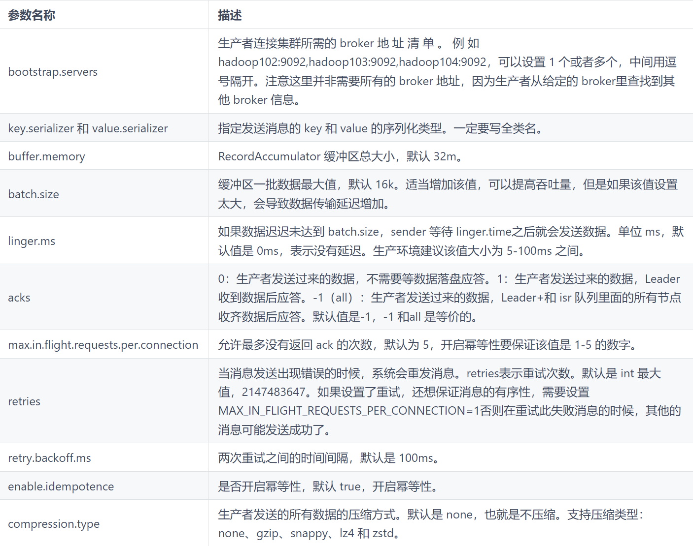
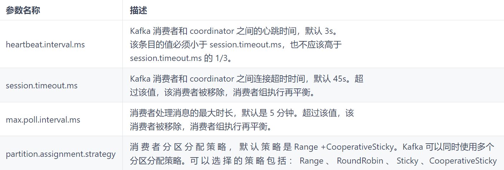
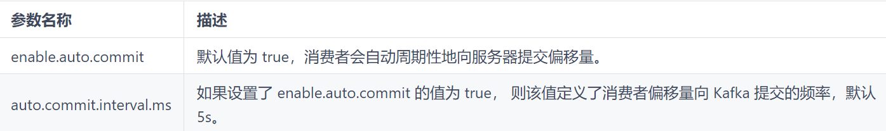
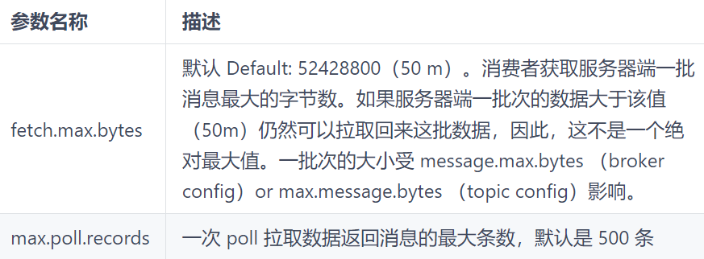

## Java 使用

### Topic 操作
```java
/**
 * 对 Topic 的 CRUD
 */
@Slf4j
public class KafkaAdminTest {

    public static Properties props = new Properties();

    static {
        props.put(AdminClientConfig.BOOTSTRAP_SERVERS_CONFIG, KafkaConstants.BOOTSTRAP_SERVER);
        props.put("request.timeout.ms", 60000);
    }

    public static void main(String[] args) throws ExecutionException, InterruptedException {
        createTopic();
        describeTopic();
    }

    public static void createTopic() throws ExecutionException, InterruptedException {
        String topicName = KafkaConstants.TOPIC_NAME;
        try (AdminClient adminClient = AdminClient.create(props)) {
            /**
             * 2 代表分区
             * 1 代表副本
             */
            NewTopic newTopic = new NewTopic(topicName, 2, (short) 1);
            CreateTopicsResult topics = adminClient.createTopics(Collections.singletonList(newTopic));
            log.info("{}", topics.all().get());
        }
    }

    public static void listTopic() throws ExecutionException, InterruptedException {
        ListTopicsOptions listTopicsOptions = new ListTopicsOptions();
        listTopicsOptions.listInternal(true);
        try (AdminClient adminClient = AdminClient.create(props)) {
            ListTopicsResult listTopicsResult = adminClient.listTopics(listTopicsOptions);
            Collection<TopicListing> topicListings = listTopicsResult.listings().get();
            log.info("{}", topicListings);
            /**
             * [(name = quickstart-events, topicId = rPIXse70QvK3Rri24a-bNg, internal = false), (name = myTopic1, topicId = E6i1TbWXTz-11yKI207ZLA, internal = false), (name =__consumer_offsets, topicId = 38T6UsJSRn2BL6tnfj5Wfg, internal = true)]
             */
        }
    }

    public static void deleteTopic() throws ExecutionException, InterruptedException {
        String topicName = KafkaConstants.TOPIC_NAME;
        try (AdminClient adminClient = AdminClient.create(props)) {
            DeleteTopicsResult deleteTopicsResult = adminClient.deleteTopics(Sets.newHashSet(topicName));
            log.info("{}", deleteTopicsResult);
        }
    }

    public static void describeTopic() throws ExecutionException, InterruptedException {
        String topicName = KafkaConstants.TOPIC_NAME;
        try (AdminClient adminClient = AdminClient.create(props)) {
            DescribeTopicsResult topicsResult = adminClient.describeTopics(Arrays.asList(topicName));
            Map<String, TopicDescription> topicDescription = topicsResult.all().get();
            log.info("{}", topicDescription);
            /**
             * {myTopic1 =(name = myTopic1, internal = false, partitions =(partition = 0, leader = x.x.x.x: 9092 (id: 1 rack: null), replicas = x.x.x.x: 9092 (id: 1 rack: null), isr = x.x.x.x: 9092 (id: 1 rack: null)),(partition = 1, leader = x.x.x.x: 9092 (id: 1 rack: null), replicas = x.x.x.x: 9092 (id: 1 rack: null), isr = x.x.x.x: 9092 (id: 1 rack: null)), authorizedOperations = null)}
             */
        }
    }
}
```

### 生产者


#### 异步发送
```xml
<dependency>
  <groupId>org.apache.kafka</groupId>
  <artifactId>kafka-clients</artifactId>
  <version>3.0.0</version>
</dependency>
```

```java
public class CustomProducer {
    public static void main(String[] args) {
        // 1. 创建 kafka 生产者配置对象
        Properties properties = new Properties();
        // 2. 给 kafka 配置对象添加配置信息：bootstrap.servers
        properties.put(ProducerConfig.BOOTSTRAP_SERVERS_CONFIG, "localhost:9092");
        // key, value 序列化（必须）：key.serializer，value.serializer
        properties.put(ProducerConfig.KEY_SERIALIZER_CLASS_CONFIG, "org.apache.kafka.common.serialization.StringSerializer");
        properties.put(ProducerConfig.VALUE_SERIALIZER_CLASS_CONFIG, "org.apache.kafka.common.serialization.StringSerializer");
        // 3. 创建 kafka 生产者对象
        KafkaProducer<String, String> kafkaProducer = new KafkaProducer<String, String>(properties);
        // 4. 调用 send 方法, 发送消息
        // 方法返回的是一个 Future 对象，不调用 get 则不会阻塞
        for (int i = 0; i < 5; i++) {
            kafkaProducer.send(new ProducerRecord<>("first", "yooome" + i));
        }
        // 5. 关闭资源
        kafkaProducer.close();
    }
}
```

```java
public class CustomProducerCallback {
    public static void main(String[] args) throws InterruptedException {
        // 1. 创建 Kafka 生产者的配置对象
        Properties properties = new Properties();
        // 2. 给 kafka 配置对象添加配置信息
        properties.put(ProducerConfig.BOOTSTRAP_SERVERS_CONFIG, "localhost:9092");
        // 3. key 序列化 key.serializer，value.serializer
        properties.put(ProducerConfig.KEY_SERIALIZER_CLASS_CONFIG, StringSerializer.class.getName());
        // 4. value 序列化 value.serializer
        properties.put(ProducerConfig.VALUE_SERIALIZER_CLASS_CONFIG, StringSerializer.class.getName());
        // 5. 创建 kafka 生产者对象
        KafkaProducer<String,String> kafkaProducer = new KafkaProducer<String, String>(properties);
        for (int i = 0; i < 5; i++) {
            kafkaProducer.send(new ProducerRecord<>("first", "yooome " + i), new Callback() {
                // 该方法在 Producer 收到 ack 时调用，为异步调用
                @Override
                public void onCompletion(RecordMetadata recordMetadata, Exception e) {
                    if (e == null) {
                        // 没有异常，输出信息到控制台
                        System.out.println(" 主题：" + recordMetadata.topic() + " -> " + " 分区 " + recordMetadata.partition());
                    }else {
                        e.printStackTrace();
                    }
                }
            });
            // 延迟一会会看到数据发往不同分区
            //Thread.sleep(2);
        }
        // 5. 关闭资源
        kafkaProducer.close();
    }
}
```

#### 同步发送
```java
public class CustomProducerCallback {
    public static void main(String[] args) throws InterruptedException, ExecutionException {
        // 1. 创建 Kafka 生产者的配置对象
        Properties properties = new Properties();
        // 2. 给 kafka 配置对象添加配置信息
        properties.put(ProducerConfig.BOOTSTRAP_SERVERS_CONFIG, "localhost:9092");
        // 3. key 序列化 key.serializer，value.serializer
        properties.put(ProducerConfig.KEY_SERIALIZER_CLASS_CONFIG, StringSerializer.class.getName());
        // 4. value 序列化 value.serializer
        properties.put(ProducerConfig.VALUE_SERIALIZER_CLASS_CONFIG, StringSerializer.class.getName());
        // ACK 应答级别
        //properties.put("acks", "all");
        properties.put(ProducerConfig.ACKS_CONFIG, "all");
        // 重试次数
        properties.put("retries", 0);
        // 批次大小
        properties.put("batch.size", 16384);
        // 等待时间
        properties.put("linger.ms", 10000);
        // RecordAccumulator 缓冲区大小
        properties.put("buffer.memory", 33554432);
        
        // 5. 创建 kafka 生产者对象
        KafkaProducer<String,String> kafkaProducer = new KafkaProducer<String, String>(properties);
        for (int i = 0; i < 5; i++) {
            //异步发送
            // kafkaProducer.send(new ProducerRecord <>("first", "kafka" + i));
            // 6. 同步发送
            // 方法返回的是一个 Future 对象，不调用 get 则不会阻塞
            kafkaProducer.send(new ProducerRecord<>("first","kafka" + i)).get();
        }
        // 7. 关闭资源
        kafkaProducer.close();
    }
}
```

#### 分区
**分区策略**


1. 指明 partition 的情况下，直接将指明的值作为 partition 值；例如：partition = 0，所有数据写入分区 0。
2. 没有指明 partition 值但有 key 的情况下，将 key 的 hash 值与 topic 的 partition 数进行取余得到 partition 值；例如：key1 的 hash 值 = 5，key2 的 hash 值 = 6，topic 的 partition 数 = 2，那么 key1 对应的 value1 写入 1 号分区，key2 对应的 value2 写入 0 号分区。
3. 既没有 partition 值又没有 key 值的情况下，Kafka 采用 Sticky Partition（粘性分区器），会随机选择一个分区，并尽可能一直使用该分区，待该分区的 batch 已满或者已完成，Kafka 在随机一个分区进行使用（和上一次的分区不同）。例如：第一次随机选择 0 号分区，等 0 号分区当前批次满了（默认 16K）或者；linger.ms 设置的时间到，Kafka 在随机一个分区进行使用（如果还是 0 会继续随机）。

```java
public class CustomProducerCallbackPartitions {
    public static void main(String[] args) throws InterruptedException, ExecutionException {
        // 1. 创建 Kafka 生产者的配置对象
        Properties properties = new Properties();
        // 2. 给 kafka 配置对象添加配置信息
        properties.put(ProducerConfig.BOOTSTRAP_SERVERS_CONFIG, "localhost:9092");
        // 3. key 序列化 key.serializer，value.serializer
        properties.put(ProducerConfig.KEY_SERIALIZER_CLASS_CONFIG, StringSerializer.class.getName());
        // 4. value 序列化 value.serializer
        properties.put(ProducerConfig.VALUE_SERIALIZER_CLASS_CONFIG, StringSerializer.class.getName());
        // 5. 创建 kafka 生产者对象
        KafkaProducer<String,String> kafkaProducer = new KafkaProducer<String, String>(properties);
        for (int i = 0; i < 5; i++) {
            //异步发送
            // kafkaProducer.send(new ProducerRecord <>("first", "kafka" + i));
            // 6. 同步发送
            kafkaProducer.send(new ProducerRecord<>("first", 0, "", "ka ka ka " + i), new Callback() {
                @Override
                public void onCompletion(RecordMetadata recordMetadata, Exception e) {
                    if (e == null){
                        System.out.println(" 主题： " +
                                recordMetadata.topic() + "->" + "分区：" + recordMetadata.partition()
                        );
                    }else {
                        e.printStackTrace();
                    }
                }
            }).get();
        }
        // 7. 关闭资源
        kafkaProducer.close();
    }
}
```

```java
public class CustomProducerCallbackPartitions {
    public static void main(String[] args) throws InterruptedException, ExecutionException {
        // 1. 创建 Kafka 生产者的配置对象
        Properties properties = new Properties();
        // 2. 给 kafka 配置对象添加配置信息
        properties.put(ProducerConfig.BOOTSTRAP_SERVERS_CONFIG, "localhost:9092");
        // 3. key 序列化 key.serializer，value.serializer
        properties.put(ProducerConfig.KEY_SERIALIZER_CLASS_CONFIG, StringSerializer.class.getName());
        // 4. value 序列化 value.serializer
        properties.put(ProducerConfig.VALUE_SERIALIZER_CLASS_CONFIG, StringSerializer.class.getName());
        // 5. 创建 kafka 生产者对象
        KafkaProducer<String,String> kafkaProducer = new KafkaProducer<String, String>(properties);
        for (int i = 0; i < 5; i++) {
            //异步发送
            // kafkaProducer.send(new ProducerRecord <>("first", "kafka" + i));
            // 6. 同步发送
            // 依次指定 key 值为 a, b, f ，数据 key 的 hash 值与 3 个分区求余，分别发往 1、2、0
            kafkaProducer.send(new ProducerRecord<>("first",  "f"," fffffff " + i), new Callback() {
                @Override
                public void onCompletion(RecordMetadata recordMetadata, Exception e) {
                    if (e == null){
                        System.out.println(" 主题： " +
                                recordMetadata.topic() + "->" + "分区：" + recordMetadata.partition()
                        );
                    }else {
                        e.printStackTrace();
                    }
                }
            }).get();
        }
        // 7. 关闭资源
        kafkaProducer.close();
    }
}
```

**自定义分区器**

```java
public class DefaultPartitioner implements Partitioner {
   ....
}
```

```java
public class MyPartitioner implements Partitioner {
    
    @Override
    public int partition(String s, Object key, byte[] bytes, Object value, byte[] bytes1, Cluster cluster) {
        // 获取消息
        String msgValue = value.toString();
        // 创建 partition
        int partition;
        if (msgValue.contains("yooome")) {
            partition = 0;
        } else {
            partition = 1;
        }
        return partition;
    }

    @Override
    public void close() {

    }

    @Override
    public void configure(Map<String, ?> map) {

    }
}
```

```java
public class CustomProducerCallbackPartitions {
    public static void main(String[] args) throws InterruptedException, ExecutionException {
        // 1. 创建 Kafka 生产者的配置对象
        Properties properties = new Properties();
        MyPartitioner myPartitioner = new MyPartitioner();
        // 2. 给 kafka 配置对象添加配置信息
        properties.put(ProducerConfig.BOOTSTRAP_SERVERS_CONFIG, "localhost:9092");
        // 3. key 序列化 key.serializer，value.serializer
        properties.put(ProducerConfig.KEY_SERIALIZER_CLASS_CONFIG, StringSerializer.class.getName());
        // 4. value 序列化 value.serializer
        properties.put(ProducerConfig.VALUE_SERIALIZER_CLASS_CONFIG, StringSerializer.class.getName());
        properties.put(ProducerConfig.PARTITIONER_CLASS_CONFIG, myPartitioner.getClass().getName());
        // 5. 创建 kafka 生产者对象
        KafkaProducer<String, String> kafkaProducer = new KafkaProducer<String, String>(properties);
        for (int i = 0; i < 5; i++) {
            //异步发送
            // kafkaProducer.send(new ProducerRecord <>("first", "kafka" + i));
            // 6. 同步发送
            // 依次指定 key 值为 a, b, f ，数据 key 的 hash 值与 3 个分区求余，分别发往 1、2、0
            kafkaProducer.send(new ProducerRecord<>("first", "yooome fffffff " + i), new Callback() {
                @Override
                public void onCompletion(RecordMetadata recordMetadata, Exception e) {
                    if (e == null) {
                        System.out.println(" 主题： " +
                                recordMetadata.topic() + "->" + "分区：" + recordMetadata.partition()
                        );
                    } else {
                        e.printStackTrace();
                    }
                }
            }).get();
        }
        // 7. 关闭资源
        kafkaProducer.close();
    }
}
```

#### 吞吐量设置
```java
public class CustomProducerParameters {
    public static void main(String[] args) throws ExecutionException, InterruptedException {
        // 1. 创建 Kafka 生产者的配置对象
        Properties properties = new Properties();
        // 2. 给 kafka 配置对象添加配置信息
        properties.put(ProducerConfig.BOOTSTRAP_SERVERS_CONFIG, "localhost:9092");
        // 3. key 序列化 key.serializer，value.serializer
        properties.put(ProducerConfig.KEY_SERIALIZER_CLASS_CONFIG, StringSerializer.class.getName());
        // 4. value 序列化 value.serializer
        properties.put(ProducerConfig.VALUE_SERIALIZER_CLASS_CONFIG, StringSerializer.class.getName());
        // batch size 批次大小，默认 16k
        properties.put(ProducerConfig.BATCH_SIZE_CONFIG, 16384);
        // linger.ms : 等待时间， 默认 0
        properties.put(ProducerConfig.LINGER_MS_CONFIG, 0);
        // 缓冲区大小
        properties.put(ProducerConfig.BUFFER_MEMORY_CONFIG, 33554432);
        //  compression.type：压缩，默认 none，可配置值 gzip、snappy、lz4 和 zstd
        // properties.put(ProducerConfig.COMPRESSION_TYPE_CONFIG, "snappy");

        // 5. 创建 kafka 生产者对象
        KafkaProducer<String, String> kafkaProducer = new KafkaProducer<String, String>(properties);
        for (int i = 0; i < 5; i++) {
            //异步发送
            // kafkaProducer.send(new ProducerRecord <>("first", "kafka" + i));
            // 6. 同步发送
            // 依次指定 key 值为 a, b, f ，数据 key 的 hash 值与 3 个分区求余，分别发往 1、2、0
            kafkaProducer.send(new ProducerRecord<>("first", "ProducerRecord" + i));
        }
        // 7. 关闭资源
        kafkaProducer.close();
    }
}
```

#### ack 设置

acks：-1（all）：生产者发送过来的数据，Leader 和 ISR 队列里面的所有节点收齐数据后应答。

```java
public class CustomProducerAck {
    public static void main(String[] args) {
        // 1. 创建 Kafka 生产者的配置对象
        Properties properties = new Properties();
        // 2. 给 kafka 配置对象添加配置信息
        properties.put(ProducerConfig.BOOTSTRAP_SERVERS_CONFIG, "localhost:9092");
        // 3. key 序列化 key.serializer，value.serializer
        properties.put(ProducerConfig.KEY_SERIALIZER_CLASS_CONFIG, StringSerializer.class.getName());
        // 4. value 序列化 value.serializer
        properties.put(ProducerConfig.VALUE_SERIALIZER_CLASS_CONFIG, StringSerializer.class.getName());
        // 设置 acks
        properties.put(ProducerConfig.ACKS_CONFIG, "all");
        // 重试次数
        properties.put(ProducerConfig.RETRIES_CONFIG, 3);
        // 5. 创建 kafka 生产者对象
        KafkaProducer<String, String> kafkaProducer = new KafkaProducer<String, String>(properties);
        for (int i = 0; i < 5; i++) {
            //异步发送
            // kafkaProducer.send(new ProducerRecord <>("first", "kafka" + i));
            // 6. 同步发送
            // 依次指定 key 值为 a, b, f ，数据 key 的 hash 值与 3 个分区求余，分别发往 1、2、0
            kafkaProducer.send(new ProducerRecord<>("first", "acks acks " + i));
        }
        // 7. 关闭资源
        kafkaProducer.close();
    }
}
```

#### 幂等性
```java
public void produceIdempotence(String msg) {
    // 设置幂等之后，重试次数将变为 Integer.MAX_VALUE  次， 且 acks 被设为 all
    /**
     * Producer ID（即 PID）和 Sequence Number
     * PID。每个新的 Producer 在初始化的时候会被分配一个唯一的 PID，这个 PID 对用户是不可见的。
     * Sequence Numbler。（对于每个 PID，该 Producer 发送数据的每个 <Topic, Partition> 都对应一个从 0 开始单调递增的 Sequence Number。Broker 端在缓存中保存了这 seq number，对于接收的每条消息，如果其序号比 Broker 缓存中序号大于 1 则接受它，否则将其丢弃。这样就可以实现了消息重复提交了。
     * 它只能保证单分区上的幂等性，即一个幂等性 Producer 能够保证某个主题的一个分区上不出现重复消息，它无法实现多个分区的幂等性。其次，它只能实现单会话上的幂等性，不能实现跨会话的幂等性。
     */
    properties.put("enable.idempotence", "true");//开启幂等性
    try {
        kafkaProducer = new KafkaProducer(properties);
        long startTime = System.currentTimeMillis();
        kafkaProducer.send(new ProducerRecord(KafkaConstants.TOPIC_NAME, msg, msg), new ProducerCallBack(startTime, msg));
    } catch (Exception e) {
        log.error("", e);
    } finally {
        kafkaProducer.close();
    }
}
```

#### 事务
注意：开启事务必须开启幂等性

```java
// 1. 初始化事务
void initTransactions();
// 2. 开启事务
void beginTransaction() throws ProducerFencedException;
// 3. 在事务内提交已经消费的偏移量(主要用于消费者)
void sendOffsetsToTransaction(Map<TopicPartition,OffsetAndMetadata> offsets, String consumerGroupId) throws ProducerFencedException;
// 4. 提交事务
void commitTransaction() throws ProducerFencedException;
// 5. 放弃事务(类似于回滚事务的操作)
void abortTransaction() throws ProducerFencedException;
```

```java
public class CustomProducerTransactions {
    public static void main(String[] args) {
        // 1. 创建 Kafka 生产者的配置对象
        Properties properties = new Properties();
        // 2. 给 kafka 配置对象添加配置信息
        properties.put(ProducerConfig.BOOTSTRAP_SERVERS_CONFIG, "localhost:9092");
        // 3. key 序列化 key.serializer，value.serializer
        properties.put(ProducerConfig.KEY_SERIALIZER_CLASS_CONFIG, StringSerializer.class.getName());
        // 4. value 序列化 value.serializer
        properties.put(ProducerConfig.VALUE_SERIALIZER_CLASS_CONFIG, StringSerializer.class.getName());
        // 设置 事务 id(必须)，事务 id 任意起名
        properties.put(ProducerConfig.TRANSACTIONAL_ID_CONFIG,"transaction_id_0");
        // 5. 创建 kafka 生产者对象
        KafkaProducer<String, String> kafkaProducer = new KafkaProducer<String, String>(properties);
        // 初始化事务
        kafkaProducer.initTransactions();
        // 开启事务
        kafkaProducer.beginTransaction();
        try {
            for (int i = 0; i < 5; i++) {
                //异步发送
                // kafkaProducer.send(new ProducerRecord <>("first", "kafka" + i));
                // 6. 同步发送
                // 依次指定 key 值为 a, b, f ，数据 key 的 hash 值与 3 个分区求余，分别发往 1、2、0
                kafkaProducer.send(new ProducerRecord<>("first", "transaction"));
            }
            // 提交事务
            kafkaProducer.commitTransaction();
        }catch (Exception e){
            // 终止事务
            kafkaProducer.abortTransaction();
        }finally {
            // 7. 关闭资源
            kafkaProducer.close();
        }
    }
}
```

#### 拦截器

```java
//时间拦截器
//在消息发送前将时间戳信息加到消息value的最前部
public class TimeInterceptor implements ProducerInterceptor<String, String>{
    @Override
    public ProducerRecord<String, String> onSend(ProducerRecord<String, String> producerRecord){
        // 1.取出数据
        String value = producerRecord.value();
        // 2.创建一个新的ProducerRecord对象，并返回//将
        return new ProducerRecord<>(producerRecord.topic(), producerRecord.partition(), producerRecord.key(),
                System.currentTimeMillis() + "," + value);
    }

    @Override
    public void onAcknowledgement(RecordMetadata recordMetadata, Exception e){

    }

    @Override
    public void close(){

    }

    @Override
    public void configure(Map<String, ?> map){

    }
}
```

```java
//计数拦截器
//在消息发送后更新成功发送消息或发送失败的消息数
public class CounterInterceptor implements ProducerInterceptor<String,String>{
    int success = 0;
    int error = 0;

    @Override
    public ProducerRecord<String, String> onSend(ProducerRecord<String, String> producerRecord){
        return producerRecord;
    }

    @Override
    public void onAcknowledgement(RecordMetadata recordMetadata, Exception e){
        if (recordMetadata != null) {
            success++;
        } else {
            error++;
        }
    }

    @Override
    public void close(){
        System.out.println("success：" + success);
        System.out.println("error：" + error);
    }

    @Override
    public void configure(Map<String, ?> map){

    }
}
```

```java
public class InterceptorProducer{
    public static void main(String[] args) {
        String server = "162.14.109.33:9092";
        // 1.创建配置信息
        Properties properties = new Properties();
        properties.put(ProducerConfig.BOOTSTRAP_SERVERS_CONFIG,server);
        properties.put(ProducerConfig.KEY_SERIALIZER_CLASS_CONFIG, "org.apache.kafka.common.serialization.StringSerializer");
        properties.put(ProducerConfig.VALUE_SERIALIZER_CLASS_CONFIG, "org.apache.kafka.common.serialization.StringSerializer");

        // 添加拦截器
        ArrayList<String> interceptors = new ArrayList<>();
        interceptors.add("com.fmy.kafka.interceptor.TimeInterceptor");
        interceptors.add("com.fmy.kafka.interceptor.CounterInterceptor");
        properties.put(ProducerConfig.INTERCEPTOR_CLASSES_CONFIG, interceptors);

        // 2.创建生产者对象
        KafkaProducer<String, String> producer = new KafkaProducer<>(properties);

        // 3.发送数据
        for (int i = 0; i < 5; i++){
            producer.send(new ProducerRecord<>("test2", "fmy", "这是带拦截器的生产者发送的消息!"));
        }

        // 4.关闭资源
        producer.close();
    }
}
```


### 消费者







#### 独立消费者（订阅主题）


```java
public class CustomConsumer {
    public static void main(String[] args) {
        // 1. 创建 kafka 生产者配置对象
        Properties properties = new Properties();
        // 2. 给 kafka 配置对象添加配置信息：bootstrap.servers
        properties.put(ConsumerConfig.BOOTSTRAP_SERVERS_CONFIG, "localhost:9092");
        // key, value 序列化（必须）：key.serializer，value.serializer
        properties.put(ConsumerConfig.KEY_DESERIALIZER_CLASS_CONFIG, StringDeserializer.class.getName());
        properties.put(ConsumerConfig.VALUE_DESERIALIZER_CLASS_CONFIG, StringDeserializer.class.getName());
		// 消费者组
        properties.put(ConsumerConfig.GROUP_ID_CONFIG, "test");
        /* 开启自动提交 */
        properties.put(ConsumerConfig.ENABLE_AUTO_COMMIT_CONFIG, true);
        /* 自动提交的延时 */
        properties.put(ConsumerConfig.AUTO_COMMIT_INTERVAL_MS_CONFIG, "1000");
        /* 关闭自动提交 */
        //properties.put(ConsumerConfig.ENABLE_AUTO_COMMIT_CONFIG, false);
        
        // 3. 创建 kafka 生产者对象
        KafkaConsumer<String, String> kafkaConsumer = new KafkaConsumer<String, String>(properties);

        ArrayList<String> topic = new ArrayList<>();
        topic.add("first");
        kafkaConsumer.subscribe(topic);
        // 拉去数据打印
        while (true) {
            ConsumerRecords<String, String> consumerRecords = kafkaConsumer.poll(Duration.ofSeconds(1));
            for (ConsumerRecord<String,String> consumerRecord : consumerRecords) {
                System.out.println("consumerRecord: " + consumerRecord);
            }
        }
    }
}
```

#### 独立消费者（订阅分区）


```java
public class CustomConsumerPartition {
    public static void main(String[] args) {
        // 1. 创建 kafka 生产者配置对象
        Properties properties = new Properties();
        // 2. 给 kafka 配置对象添加配置信息：bootstrap.servers
        properties.put(ConsumerConfig.BOOTSTRAP_SERVERS_CONFIG, "localhost:9092");
        // key, value 序列化（必须）：key.serializer，value.serializer
        properties.put(ConsumerConfig.KEY_DESERIALIZER_CLASS_CONFIG, StringDeserializer.class.getName());
        properties.put(ConsumerConfig.VALUE_DESERIALIZER_CLASS_CONFIG, StringDeserializer.class.getName());

        properties.put(ConsumerConfig.GROUP_ID_CONFIG, "test");
        // 3. 创建 kafka 生产者对象
        KafkaConsumer<String, String> kafkaConsumer = new KafkaConsumer<String, String>(properties);

        ArrayList<TopicPartition> topicPartitions = new ArrayList<>();
        topicPartitions.add(new TopicPartition("first", 0));
        kafkaConsumer.assign(topicPartitions);
        // 拉去数据打印
        while (true) {
            ConsumerRecords<String, String> consumerRecords = kafkaConsumer.poll(Duration.ofSeconds(1));
            for (ConsumerRecord<String, String> consumerRecord : consumerRecords) {
                System.out.println("consumerRecord: " + consumerRecord);
            }
        }
    }
}
```

#### 消费者组


```java
public class CustomConsumer {
    public static void main(String[] args) {
        // 1. 创建 kafka 生产者配置对象
        Properties properties = new Properties();
        // 2. 给 kafka 配置对象添加配置信息：bootstrap.servers
        properties.put(ConsumerConfig.BOOTSTRAP_SERVERS_CONFIG, "localhost:9092");
        // key, value 序列化（必须）：key.serializer，value.serializer
        properties.put(ConsumerConfig.KEY_DESERIALIZER_CLASS_CONFIG, StringDeserializer.class.getName());
        properties.put(ConsumerConfig.VALUE_DESERIALIZER_CLASS_CONFIG, StringDeserializer.class.getName());

        properties.put(ConsumerConfig.GROUP_ID_CONFIG, "test");
        // 3. 创建 kafka 生产者对象
        KafkaConsumer<String, String> kafkaConsumer = new KafkaConsumer<String, String>(properties);

        ArrayList<String> topic = new ArrayList<>();
        topic.add("first");
        kafkaConsumer.subscribe(topic);
        // 拉去数据打印
        while (true) {
            ConsumerRecords<String, String> consumerRecords = kafkaConsumer.poll(Duration.ofSeconds(1));
            for (ConsumerRecord<String,String> consumerRecord : consumerRecords) {
                System.out.println("consumerRecord: " + consumerRecord);
            }
        }
    }
}
```

同时启动多个消费者后，消息会分发到各个消费者

#### 自动提交 offset
```java
public class CustomConsumerAutoOffset {
    public static void main(String[] args) {
        // 1. 创建 kafka 消费者配置类
        Properties properties = new Properties();
        // 2. 添加配置参数
        // 添加连接
        properties.put(ConsumerConfig.BOOTSTRAP_SERVERS_CONFIG, "localhost:9092");
        // 配置序列化 必须
        properties.put(ConsumerConfig.KEY_DESERIALIZER_CLASS_CONFIG,
                "org.apache.kafka.common.serialization.StringDeserializer");
        properties.put(ConsumerConfig.VALUE_DESERIALIZER_CLASS_CONFIG,
                "org.apache.kafka.common.serialization.StringDeserializer");
        // 配置消费者组
        properties.put(ConsumerConfig.GROUP_ID_CONFIG, "test");
        // 是否自动提交 offset
        properties.put(ConsumerConfig.ENABLE_AUTO_COMMIT_CONFIG, true);
        // 提交 offset 的时间周期 1000ms，默认 5s
        properties.put(ConsumerConfig.AUTO_COMMIT_INTERVAL_MS_CONFIG, 1000);
        //3. 创建 kafka 消费者
        KafkaConsumer<String, String> consumer = new KafkaConsumer<>(properties);
        //4. 设置消费主题 形参是列表
        consumer.subscribe(Arrays.asList("first"));
        //5. 消费数据
        while (true) {
        	// 读取消息
            ConsumerRecords<String, String> consumerRecords = consumer.poll(Duration.ofSeconds(1));
        	// 输出消息
            for (ConsumerRecord<String, String> consumerRecord : consumerRecords) {
                System.out.println(consumerRecord.value());
            }
        }
    }
}
```

#### 手动提交 offset
```java
public class CustomConsumerByHandSync {
    public static void main(String[] args) {
        // 1. 创建 kafka 生产者配置对象
        Properties properties = new Properties();
        // 2. 给 kafka 配置对象添加配置信息：bootstrap.servers
        properties.put(ConsumerConfig.BOOTSTRAP_SERVERS_CONFIG, "localhost:9092");
        // key, value 序列化（必须）：key.serializer，value.serializer
        properties.put(ConsumerConfig.KEY_DESERIALIZER_CLASS_CONFIG, StringDeserializer.class.getName());
        properties.put(ConsumerConfig.VALUE_DESERIALIZER_CLASS_CONFIG, StringDeserializer.class.getName());

        properties.put(ConsumerConfig.GROUP_ID_CONFIG, "test");
        // 是否自动提交 offset
        properties.put(ConsumerConfig.ENABLE_AUTO_COMMIT_CONFIG, false);

        // 3. 创建 kafka 生产者对象
        KafkaConsumer<String, String> kafkaConsumer = new KafkaConsumer<String, String>(properties);
        ArrayList<String> topic = new ArrayList<>();
        topic.add("first");
        kafkaConsumer.subscribe(topic);
        // 拉去数据打印
        while (true) {
            ConsumerRecords<String, String> consumerRecords = kafkaConsumer.poll(Duration.ofSeconds(1));
            for (ConsumerRecord<String,String> consumerRecord : consumerRecords) {
                System.out.println("consumerRecord: " + consumerRecord.value());
            }
            // 同步提交 offset
            kafkaConsumer.commitSync();
        }
    }
}
```

```java
public class CustomConsumerByHandSync {
    public static void main(String[] args) {
        // 1. 创建 kafka 生产者配置对象
        Properties properties = new Properties();
        // 2. 给 kafka 配置对象添加配置信息：bootstrap.servers
        properties.put(ConsumerConfig.BOOTSTRAP_SERVERS_CONFIG, "localhost:9092");
        // key, value 序列化（必须）：key.serializer，value.serializer
        properties.put(ConsumerConfig.KEY_DESERIALIZER_CLASS_CONFIG, StringDeserializer.class.getName());
        properties.put(ConsumerConfig.VALUE_DESERIALIZER_CLASS_CONFIG, StringDeserializer.class.getName());

        properties.put(ConsumerConfig.GROUP_ID_CONFIG, "test");
        // 是否自动提交 offset
        properties.put(ConsumerConfig.ENABLE_AUTO_COMMIT_CONFIG, false);

        // 3. 创建 kafka 生产者对象
        KafkaConsumer<String, String> kafkaConsumer = new KafkaConsumer<String, String>(properties);
        ArrayList<String> topic = new ArrayList<>();
        topic.add("first");
        kafkaConsumer.subscribe(topic);
        // 拉去数据打印
        while (true) {
            ConsumerRecords<String, String> consumerRecords = kafkaConsumer.poll(Duration.ofSeconds(1));
            for (ConsumerRecord<String,String> consumerRecord : consumerRecords) {
                System.out.println("consumerRecord: " + consumerRecord.value());
            }
            // 异步提交 offset
            kafkaConsumer.commitAsync();
        }
    }
}
```

#### 指定 offset 消费
1. earliest：自动将偏移量重置为最早的偏移量，--from-beginning。
2. latest（默认值）：自动将偏移量重置为最新偏移量。
3. none：如果未找到消费者组的先前偏移量，则向消费者抛出异常。

```java
public class CustomConsumerSeek {
    public static void main(String[] args) {
        // 1. 创建 kafka 生产者配置对象
        Properties properties = new Properties();
        // 2. 给 kafka 配置对象添加配置信息：bootstrap.servers
        properties.put(ConsumerConfig.BOOTSTRAP_SERVERS_CONFIG, "localhost:9092");
        // key, value 序列化（必须）：key.serializer，value.serializer
        properties.put(ConsumerConfig.KEY_DESERIALIZER_CLASS_CONFIG, StringDeserializer.class.getName());
        properties.put(ConsumerConfig.VALUE_DESERIALIZER_CLASS_CONFIG, StringDeserializer.class.getName());

        properties.put(ConsumerConfig.GROUP_ID_CONFIG, "test2");
        // 3. 创建 kafka 生产者对象
        KafkaConsumer<String, String> kafkaConsumer = new KafkaConsumer<String, String>(properties);

        ArrayList<String> topic = new ArrayList<>();
        topic.add("first");
        kafkaConsumer.subscribe(topic);
        Set<TopicPartition> assignment= new HashSet<>();
        while (assignment.size() == 0) {
            kafkaConsumer.poll(Duration.ofSeconds(1));
        	// 获取消费者分区分配信息（有了分区分配信息才能开始消费）
            assignment = kafkaConsumer.assignment();
        }
        // 遍历所有分区，并指定 offset 从 1700 的位置开始消费
        for (TopicPartition tp: assignment) {
            kafkaConsumer.seek(tp, 1700);
        }

        // 拉去数据打印
        while (true) {
            ConsumerRecords<String, String> consumerRecords = kafkaConsumer.poll(Duration.ofSeconds(1));
            for (ConsumerRecord<String,String> consumerRecord : consumerRecords) {
                System.out.println("consumerRecord: " + consumerRecord);
            }
        }
    }
}
```

#### 指定时间消费
```java
public class CustomConsumerSeek {
    public static void main(String[] args) {
        // 1. 创建 kafka 生产者配置对象
        Properties properties = new Properties();
        // 2. 给 kafka 配置对象添加配置信息：bootstrap.servers
        properties.put(ConsumerConfig.BOOTSTRAP_SERVERS_CONFIG, "localhost:9092");
        // key, value 序列化（必须）：key.serializer，value.serializer
        properties.put(ConsumerConfig.KEY_DESERIALIZER_CLASS_CONFIG, StringDeserializer.class.getName());
        properties.put(ConsumerConfig.VALUE_DESERIALIZER_CLASS_CONFIG, StringDeserializer.class.getName());

        properties.put(ConsumerConfig.GROUP_ID_CONFIG, "test2");
        // 3. 创建 kafka 生产者对象
        KafkaConsumer<String, String> kafkaConsumer = new KafkaConsumer<String, String>(properties);

        ArrayList<String> topic = new ArrayList<>();
        topic.add("first");
        kafkaConsumer.subscribe(topic);
        Set<TopicPartition> assignment = new HashSet<>();
        while (assignment.size() == 0) {
            kafkaConsumer.poll(Duration.ofSeconds(1));
			// 获取消费者分区分配信息（有了分区分配信息才能开始消费）
            assignment = kafkaConsumer.assignment();
        }
        HashMap<TopicPartition, Long> timestampToSearch = new HashMap<>();
        // 封装集合存储，每个分区对应一天前的数据
        for (TopicPartition topicPartition : assignment) {
            timestampToSearch.put(topicPartition, System.currentTimeMillis() - 1 * 24 * 3600 * 1000);
        }
        // 获取从 1 天前开始消费的每个分区的 offset
        Map<TopicPartition, OffsetAndTimestamp> offsets = kafkaConsumer.offsetsForTimes(timestampToSearch);
        // 遍历每个分区，对每个分区设置消费时间。
        for (TopicPartition topicPartition : assignment) {
            OffsetAndTimestamp offsetAndTimestamp = offsets.get(topicPartition);
        	// 根据时间指定开始消费的位置
            if (offsetAndTimestamp != null) {
                kafkaConsumer.seek(topicPartition, offsetAndTimestamp.offset());
            }
        }

        // 拉去数据打印
        while (true) {
            ConsumerRecords<String, String> consumerRecords = kafkaConsumer.poll(Duration.ofSeconds(1));
            for (ConsumerRecord<String, String> consumerRecord : consumerRecords) {
                System.out.println("consumerRecord: " + consumerRecord);
            }
        }
    }
}
```

#### 自定义存储 offset

offset 的维护是相当繁琐的，因为需要考虑到消费者的 Rebalance。

当有新的消费者加入消费者组、已有的消费者退出消费者组或者所订阅的消费者主题的分区发生变化，就会触发到分区的重新分配，重新分配的过程叫做 Rebalance。

消费者发生 Rebalance 后，每个消费者消费的分区就会发生变化。因此消费者要首先获取到自己被重新分配到的分区，并且定位到每个分区最近提交的 offset 位置继续消费。

要实现自定义存储 offset，需要借助 ConsumerRebalanceListener。其中提交和获取 offset 的方法，需要根据所选的 offset 存储系统自行实现。

```java
public class CustomerConsumer {
    private static Map<TopicPartition, Long> currentOffset = new HashMap<>();

    public static void main(String[] args) {
        String server = "162.14.109.33:9092";
        //创建配置信息
        Properties properties = new Properties();
        //Kafka 集群
        properties.put(ConsumerConfig.BOOTSTRAP_SERVERS_CONFIG, server);
        //消费者组，只要 group.id 相同，就属于同一个消费者组
        properties.put(ConsumerConfig.GROUP_ID_CONFIG, "bigData");
        //关闭自动提交 offset
        properties.put(ConsumerConfig.ENABLE_AUTO_COMMIT_CONFIG, false);
        //Key 和 Value 的反序列化类
        properties.put(ConsumerConfig.KEY_DESERIALIZER_CLASS_CONFIG, "org.apache.kafka.common.serialization.StringDeserializer");
        properties.put(ConsumerConfig.VALUE_DESERIALIZER_CLASS_CONFIG, "org.apache.kafka.common.serialization.StringDeserializer");

        //创建一个消费者
        KafkaConsumer<String, String> consumer = new KafkaConsumer<>(properties);

        //消费者订阅主题
        consumer.subscribe(Collections.singletonList("test2"), new ConsumerRebalanceListener() {

            //该方法会在 Rebalance 之前调用
            @Override
            public void
            onPartitionsRevoked(Collection<TopicPartition> partitions) {
                commitOffset(currentOffset);
            }

            //该方法会在 Rebalance 之后调用
            @Override
            public void
            onPartitionsAssigned(Collection<TopicPartition> partitions) {
                currentOffset.clear();
                for (TopicPartition partition : partitions) {
                    consumer.seek(partition, getOffset(partition));
                    //定位到最近提交的 offset 位置继续消费
                }
            }
        });

        while (true) {
            ConsumerRecords<String, String> records = consumer.poll(Duration.ofMillis(100));//消费者拉取数据
            for (ConsumerRecord<String, String> record : records) {
                System.out.printf("offset = %d, key = %s, value = %s\n", record.offset(), record.key(), record.value());
                currentOffset.put(new TopicPartition(record.topic(), record.partition()), record.offset());
            }
            commitOffset(currentOffset);//异步提交
        }
    }

    //获取某分区的最新 offset
    private static long getOffset(TopicPartition partition) {
        return 0;
    }

    //提交该消费者所有分区的 offset
    private static void commitOffset(Map<TopicPartition, Long> currentOffset) {
    }
}
```

## SpringBoot 整合

```xml
<dependency>
    <groupId>org.springframework.kafka</groupId>
    <artifactId>spring-kafka</artifactId>
</dependency>
```

```yaml
server:
  port: 8080

spring:
  #kafka配置
  kafka:
    #这里改为你的kafka服务器ip和端口号，可以设置多个，以逗号分隔
    bootstrap-servers: xxx:9092
    #=============== producer  =======================
    producer:
      #如果该值大于零时，表示启用重试失败的发送次数
      retries: 0
      #每当多个记录被发送到同一分区时，生产者将尝试将记录一起批量处理为更少的请求，默认值为16384(单位字节)
      batch-size: 16384
      #生产者可用于缓冲等待发送到服务器的记录的内存总字节数，默认值为3355443
      buffer-memory: 33554432
      #key的Serializer类，实现类实现了接口org.apache.kafka.common.serialization.Serializer
      key-serializer: org.apache.kafka.common.serialization.StringSerializer
      #value的Serializer类，实现类实现了接口org.apache.kafka.common.serialization.Serializer
      value-serializer: org.apache.kafka.common.serialization.StringSerializer
      # 0-不应答。1-leader 应答。all-所有 leader 和 follower 应答。
      acks: 1 
    #=============== consumer  =======================
    consumer:
      #用于标识此使用者所属的使用者组的唯一字符串
      group-id: test-consumer-group
      #当Kafka中没有初始偏移量或者服务器上不再存在当前偏移量时该怎么办，默认值为latest，表示自动将偏移重置为最新的偏移量
      #可选的值为latest, earliest, none
      auto-offset-reset: earliest
      #消费者的偏移量将在后台定期提交，默认值为true
      enable-auto-commit: true
      #如果'enable-auto-commit'为true，则消费者偏移自动提交给Kafka的频率（以毫秒为单位），默认值为5000。
      auto-commit-interval: 100
      #密钥的反序列化器类，实现类实现了接口org.apache.kafka.common.serialization.Deserializer
      key-deserializer: org.apache.kafka.common.serialization.StringDeserializer
      #值的反序列化器类，实现类实现了接口org.apache.kafka.common.serialization.Deserializer
      value-deserializer: org.apache.kafka.common.serialization.StringDeserializer
```

```java
@Configuration
public class kafkaConfig {

    @Autowired
    private KafkaAdmin kafkaAdmin;

    @PostConstruct
    public void init() {
        /**
         * init topic
         */
        AdminClient adminClient = AdminClient.create(kafkaAdmin.getConfig());
        adminClient.deleteTopics(Lists.newArrayList(KafkaConstants.TOPIC_NAME));
        List<NewTopic> topics = new ArrayList<>();
        topics.add(new NewTopic(KafkaConstants.TOPIC_NAME, 3, (short) 1));
        adminClient.createTopics(topics);
        System.out.println("创建topic成功");
    }
}
```

```java
@RestController
@RequestMapping
public class Producer {

    @Autowired
    private KafkaTemplate<String, Object> kafkaTemplate;

    @GetMapping("/send-msg")
    public String send(@RequestParam String msg) {
        //生产消息
        ListenableFuture<SendResult<String, Object>> listenableFuture = kafkaTemplate.send(KafkaConstants.TOPIC_NAME, msg, msg);
        listenableFuture.addCallback(new ListenableFutureCallback<SendResult<String, Object>>() {
            @Override
            public void onFailure(Throwable throwable) {
                throwable.printStackTrace();
            }

            @Override
            public void onSuccess(SendResult<String, Object> stringObjectSendResult) {
                System.out.println(stringObjectSendResult);
            }
        });
        return msg;
    }
}
```

```java
@Component
public class Consumer {

    /**
     * org.springframework.kafka.annotation.KafkaListener 可以指定分区，指定 groupId 等参数
     *
     * @param record
     */
    @KafkaListener(topics = {KafkaConstants.TOPIC_NAME})
    public void handMessage(ConsumerRecord<String, String> record) {
        String topic = record.topic();
        String msg = record.value();
        System.out.println("消费者接受消息：topic-->" + topic + ",msg->>" + msg);
    }
}  
```

```java
/**
 * 指定 topic、partition、offset 消费
 * 同时监听 topic1 和 topic2，监听 topic1 的 0 号分区、topic2 的 "0 号和 1 号" 分区，指向 1 号分区的 offset 初始值为 8
 **/
@KafkaListener(id = "consumer1",groupId = "felix-group",topicPartitions = {
        @TopicPartition(topic = "topic1", partitions = { "0" }),
        @TopicPartition(topic = "topic2", partitions = "0", partitionOffsets = @PartitionOffset(partition = "1", initialOffset = "8"))
})
public void onMessage2(ConsumerRecord<?, ?> record) {
    System.out.println("topic:"+record.topic()+"|partition:"+record.partition()+"|offset:"+record.offset()+"|value:"+record.value());
}
```

① id：消费者 ID；

② groupId：消费组 ID；

③ topics：监听的 topic，可监听多个；

④ topicPartitions：可配置更加详细的监听信息，可指定 topic、parition、offset 监听。

上面 onMessage2 监听的含义：监听 topic1 的 0 号分区，同时监听 topic2 的 0 号分区和 topic2 的 1 号分区里面 offset 从 8 开始的消息。

注意：topics 和 topicPartitions 不能同时使用；

### 创建 Topic

我们也可以不手动创建 topic，在执行代码 kafkaTemplate.send("topic1", normalMessage)发送消息时，kafka 会帮我们自动完成 topic 的创建工作，但这种情况下创建的 topic 默认只有一个分区，分区也没有副本。所以，我们可以在项目中新建一个配置类专门用来初始化 topic，如下

```java
@Configuration
public class KafkaInitialConfiguration {
    // 创建一个名为 testtopic 的 Topic 并设置分区数为 8，分区副本数为 2
    @Bean
    public NewTopic initialTopic() {
        return new NewTopic("testtopic",8, (short) 2 );
    }

    // 如果要修改分区数，只需修改配置值重启项目即可
    // 修改分区数并不会导致数据的丢失，但是分区数只能增大不能减小
    @Bean
    public NewTopic updateTopic() {
        return new NewTopic("testtopic",10, (short) 2 );
    }
}
```

### 带回调的生产者

```java
@GetMapping("/kafka/callbackOne/{message}")
public void sendMessage2(@PathVariable("message") String callbackMessage) {
    kafkaTemplate.send("topic1", callbackMessage).addCallback(success -> {
        // 消息发送到的 topic
        String topic = success.getRecordMetadata().topic();
        // 消息发送到的分区
        int partition = success.getRecordMetadata().partition();
        // 消息在分区内的 offset
        long offset = success.getRecordMetadata().offset();
        System.out.println("发送消息成功:" + topic + "-" + partition + "-" + offset);
    }, failure -> {
        System.out.println("发送消息失败:" + failure.getMessage());
    });
}
```

```java
@GetMapping("/kafka/callbackTwo/{message}")
public void sendMessage3(@PathVariable("message") String callbackMessage) {
    kafkaTemplate.send("topic1", callbackMessage).addCallback(new ListenableFutureCallback<SendResult<String, Object>>() {
        @Override
        public void onFailure(Throwable ex) {
            System.out.println("发送消息失败："+ex.getMessage());
        }
  
        @Override
        public void onSuccess(SendResult<String, Object> result) {
            System.out.println("发送消息成功：" + result.getRecordMetadata().topic() + "-"
                    + result.getRecordMetadata().partition() + "-" + result.getRecordMetadata().offset());
        }
    });
}
```

### 批量消费

```properties
# 设置批量消费
spring.kafka.listener.type=batch
# 批量消费每次最多消费多少条消息
spring.kafka.consumer.max-poll-records=50
```

```java
@KafkaListener(id = "consumer2",groupId = "felix-group", topics = "topic1")
public void onMessage3(List<ConsumerRecord<?, ?>> records) {
    System.out.println(">>>批量消费一次，records.size()="+records.size());
    for (ConsumerRecord<?, ?> record : records) {
        System.out.println(record.value());
    }
}
```

### 异常处理器

通过异常处理器，我们可以处理 consumer 在消费时发生的异常。

新建一个 ConsumerAwareListenerErrorHandler 类型的异常处理方法，用@Bean 注入，BeanName 默认就是方法名，然后我们将这个异常处理器的 BeanName 放到@KafkaListener 注解的 errorHandler 属性里面，当监听抛出异常的时候，则会自动调用异常处理器

```java
// 新建一个异常处理器，用@Bean 注入
@Bean
public ConsumerAwareListenerErrorHandler consumerAwareErrorHandler() {
    return (message, exception, consumer) -> {
        System.out.println("消费异常："+message.getPayload());
        return null;
    };
}

// 将这个异常处理器的 BeanName 放到@KafkaListener 注解的 errorHandler 属性里面
@KafkaListener(topics = {"topic1"},errorHandler = "consumerAwareErrorHandler")
public void onMessage4(ConsumerRecord<?, ?> record) throws Exception {
    throw new Exception("简单消费-模拟异常");
}

// 批量消费也一样，异常处理器的 message.getPayload()也可以拿到各条消息的信息
@KafkaListener(topics = "topic1",errorHandler="consumerAwareErrorHandler")
public void onMessage5(List<ConsumerRecord<?, ?>> records) throws Exception {
    System.out.println("批量消费一次...");
    throw new Exception("批量消费-模拟异常");
}
```

### 消息过滤器

消息过滤器可以在消息抵达 consumer 之前被拦截，在实际应用中，我们可以根据自己的业务逻辑，筛选出需要的信息再交由 KafkaListener 处理，不需要的消息则过滤掉。

配置消息过滤只需要为 监听器工厂 配置一个 RecordFilterStrategy（消息过滤策略），返回 true 的时候消息将会被抛弃，返回 false 时，消息能正常抵达监听容器

```java
@Component
public class KafkaConsumer {
    @Autowired
    ConsumerFactory consumerFactory;

    // 消息过滤器
    @Bean
    public ConcurrentKafkaListenerContainerFactory filterContainerFactory() {
        ConcurrentKafkaListenerContainerFactory factory = new ConcurrentKafkaListenerContainerFactory();
        factory.setConsumerFactory(consumerFactory);
        // 被过滤的消息将被丢弃
        factory.setAckDiscarded(true);
        // 消息过滤策略
        factory.setRecordFilterStrategy(consumerRecord -> {
            if (Integer.parseInt(consumerRecord.value().toString()) % 2 == 0) {
                return false;
            }
            //返回 true 消息则被过滤
            return true;
        });
        return factory;
    }

    // 消息过滤监听
    @KafkaListener(topics = {"topic1"},containerFactory = "filterContainerFactory")
    public void onMessage6(ConsumerRecord<?, ?> record) {
        System.out.println(record.value());
    }
}
```

### 消息转发

在实际开发中，我们可能有这样的需求，应用 A 从 TopicA 获取到消息，经过处理后转发到 TopicB，再由应用 B 监听处理消息，即一个应用处理完成后将该消息转发至其他应用，完成消息的转发。

在 SpringBoot 集成 Kafka 实现消息的转发也很简单，只需要通过一个@SendTo 注解，被注解方法的 return 值即转发的消息内容

```java
/**
 * 消息转发
 * 从 topic1 接收到的消息经过处理后转发到 topic2
 **/
@KafkaListener(topics = {"topic1"})
@SendTo("topic2")
public String onMessage7(ConsumerRecord<?, ?> record) {
    return record.value()+"-forward message";
}
```

### 定时启动、停止监听器

默认情况下，当消费者项目启动的时候，监听器就开始工作，监听消费发送到指定 topic 的消息，那如果我们不想让监听器立即工作，想让它在我们指定的时间点开始工作，或者在我们指定的时间点停止工作，该怎么处理呢——使用 KafkaListenerEndpointRegistry，下面我们就来实现：

① 禁止监听器自启动；

② 创建两个定时任务，一个用来在指定时间点启动定时器，另一个在指定时间点停止定时器；

新建一个定时任务类，用注解@EnableScheduling 声明，KafkaListenerEndpointRegistry 在 SpringIO 中已经被注册为 Bean，直接注入，设置禁止 KafkaListener 自启动

```java
@EnableScheduling
@Component
public class CronTimer {

    /**
     * @KafkaListener 注解所标注的方法并不会在 IOC 容器中被注册为 Bean，
     * 而是会被注册在 KafkaListenerEndpointRegistry 中，
     * 而 KafkaListenerEndpointRegistry 在 SpringIOC 中已经被注册为 Bean
     **/
    @Autowired
    private KafkaListenerEndpointRegistry registry;

    @Autowired
    private ConsumerFactory consumerFactory;

    // 监听器容器工厂(设置禁止 KafkaListener 自启动)
    @Bean
    public ConcurrentKafkaListenerContainerFactory delayContainerFactory() {
        ConcurrentKafkaListenerContainerFactory container = new ConcurrentKafkaListenerContainerFactory();
        container.setConsumerFactory(consumerFactory);
        //禁止 KafkaListener 自启动
        container.setAutoStartup(false);
        return container;
    }

    // 监听器
    @KafkaListener(id="timingConsumer",topics = "topic1",containerFactory = "delayContainerFactory")
    public void onMessage1(ConsumerRecord<?, ?> record){
        System.out.println("消费成功："+record.topic()+"-"+record.partition()+"-"+record.value());
    }

    // 定时启动监听器
    @Scheduled(cron = "0 42 11 * * ? ")
    public void startListener() {
        System.out.println("启动监听器...");
        // "timingConsumer" 是@KafkaListener 注解后面设置的监听器 ID, 标识这个监听器
        if (!registry.getListenerContainer("timingConsumer").isRunning()) {
            registry.getListenerContainer("timingConsumer").start();
        }
        //registry.getListenerContainer("timingConsumer").resume();
    }

    // 定时停止监听器
    @Scheduled(cron = "0 45 11 * * ? ")
    public void shutDownListener() {
        System.out.println("关闭监听器...");
        registry.getListenerContainer("timingConsumer").pause();
    }
}
```

