## 基本概念

### 消息（Message）
消息系统所传输信息的物理载体，生产和消费数据的最小单位，每条消息必须属于一个主题

### 主题（Topic）
1. Topic 表示一类消息的集合，每个主题包含若干条消息，每条消息只能属于一个主题，是 RocketMQ 进行消息订阅的基本单位。

topic：message = 1：n，message：topic = 1：1

2. 一个生产者可以同时发送多种 Topic 的消息，而一个消费者只对某种特定的 Topic 感兴趣，即只可以订阅和消费一种 Topic 的消息

producer：topic = 1：n，consumer：topic = 1：1

### 标签（Tag）
为消息设置的标签，用于同一主题下区分不同类型的消息。来自同一业务单元的消息，可以根据不同业务目的在同一主题下设置不同标签。消费者可以根据 Tag 实现对不同子主题的不同消费逻辑，实现更好的扩展性

Topic 是消息的一级分类，Tag 是消息的二级分类

### 队列、分区（Queue、Partition）
存储消息的物理实体。一个 Topic 中可以包含多个 Queue，每个 Queue 中存放的就是该 Topic 的消息。一个 Topic 的 Queue 也称为一个 Topic 中消息的分区（Partition）

一个 Topic 的 Queue 中的消息只能被一个消费者组中的一个消费者消费；一个 Queue 中的消息不允许同一个消费者组中的多个消费者同时消费

### 分片（Broker）
指存放到相应 Topic 的 Broker，每个分片会创建相应数量的分区，每个 Queue 都是相同的。

对于 RocketMQ，一个 Topic 可以分布在各个 Broker 上，我们可以把一个 Topic 分布在一个 Broker 上的子集定义为一个 Topic 分片

对应上图，TopicA 有 3 个 Topic 分片，分布在 Broker1、Broker2 和 Broker3 上，TopicB 有 2 个 Topic 分片，分布在 Broker1 和 Broker2 上，TopicC 有 2 个 Topic 分片，分布在 Broker2 和 Broker3 上

### 消息标识（MessageId/Key）
RocketMQ 中每个消息拥有唯一的 MessageId，且可以携带具有业务标识的 Key，以方便对消息的查询。MessageId 有两个：在生产者 send()消息时会自动生成一个 MessageId（msgId），当消息到达 Broker 后，Broker 也会自动生成一个 MessageId（offsetMsgId）。msgId、offetMsgId 与 key 都称为消息标识

1. msgId：由 producer 端生成，其生成规则为：producerIp+进程 pid+MessageClientIDSetter 类的 ClassLoader 的 hashCode+当前时间+AutomicInteger 自增计数器
2. offsetMsgId：由 broker 端生成，其生成规则为：brokerIp+物理分区的 offset（Queue 中的偏移量）
3. key：由用户指定的业务相关的唯一标识

## 系统架构
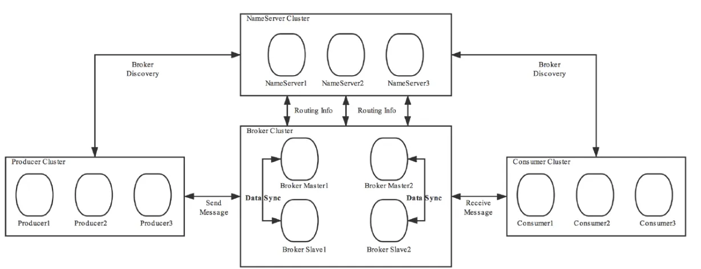

### Producer（生产者）
Producer 通过 MQ 的负载均衡模块选择相应的 Broker 集群队列进行消息投递，投递的过程支持快速失败并且低延迟。RocketMQ 中的消息生产者都是以生产者组（Producer Group）的形式出现的，生产者组是同一类生产者的集合，这类 Producer 发送相同 Topic 类型的消息，一个生产者组可以同时发送多个主题的消息

### Consumer（消费者）
一个消息消费者会从 Broker 服务器中获取到消息，并对消息进行相关业务处理

RocketMQ 中的消息消费者都是以消费者组（Consumer Group）的形式出现的，消费者组是同一类消费者的集合，这类 Consumer 消费的是同一个 Topic 类型的消息，一类消费者只能消费一种 Topic 的消息

容错：一个 Consumer 挂了，该 Consumer Group 中还有别的 Consumer 可以接着消费

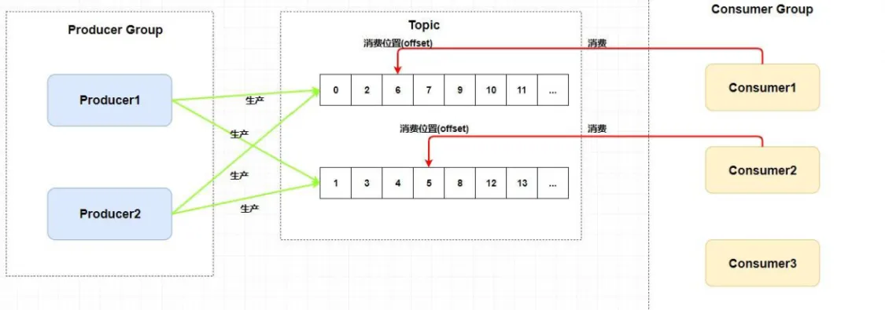

消费者组中 Consumer 的数量应该小于等于订阅 Topic 的 Queue 数量，如果超出 Queue 数量，则多出的 Consumer 将不能消费消息

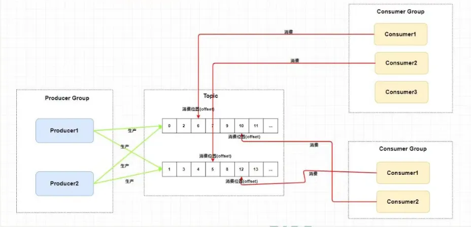

注意：

1. 一个 Topic 类型的消息可以被多个消费者组消费
2. 一个消费者组消费者必须订阅完全相同的 Topic
3. 一个消费者组只能消费一个 Topic 的消息，不能同时消费多个 Topic 的消息

### NameServer（注册中心）
NameServer 是一个 Broker 与 Topic 路由的注册中心，支持 Broker 的动态注册与发现

主要功能：

1. Broker 管理：接受 Broker 集群的注册信息并且保存下来作为路由信息的基本数据；提供心跳检测机制，检查 Broker 是否还存活
2. 路由信息管理：每个 NameServer 中都保存着 Broker 集群的整个路由信息和用于客户端查询的队列信息；Producer 和 Consumer 通过 NameServer 可以获取整个 Broker 集群的路由信息，从而进行消息的投递和消费

#### 路由注册
NameServer 通常也是以集群的方式部署，不过，NameServer 是无状态的，即 NameServer 集群中各个节点间是无差异的，各节点间相互不进行信息通讯

数据同步：在 Broker 节点启动时，轮询 NameServer 列表，与每个 NameServer 节点建立长连接，发起注册请求。在 NameServer 内部维护着 1 个 Broker 列表，用来动态存储 Broker 的信息

1. 注意：与其他 zk、euraka、nacos 等注册中心不同，别的都是注册一个然后内部通信，Name Server 是所有都要注册
2. 优点：无状态的集群搭建很简单
3. 缺点：对于 Broker 必须明确指出 NameServer 地址，未指出的不会进行注册，使得扩容、维护不方便

Broker 节点为了证明自己是活着的，为了维护与 NameServer 之间的长连接，会将最新的信息以心跳包的方式上报给 NameServer，每 30 秒发送一次心跳。心跳包中包含 BrokerId、Broker 地址（IP+port）、Broker 名称、Broker 所属集群名称等等。NameServer 在接收到心跳包后，会更新心跳时间戳，记录这个 Broker 的最新存活时间

#### 路由剔除
由于 Broker 关机、宕机或网络抖动等原因，NameServer 没有收到 Broker 的心跳，NameServer 可能将其从 Broker 列表中剔除。NameServer 中有一个定时任务，每隔 10 秒就会扫描一次 Broker 表，查看每一个 Broker 的最新心跳时间戳距离当前时间是否超过 120 秒，如果超过，则会判定 Broker 失效，然后将其从 Broker 列表中剔除

#### 路由发现
RocketMQ 的路由发现采用的是 Pull 模型，当 Topic 路由信息出现变化时，NameServer 不会主动推送到客户端，而是客户端定时拉取主题最新的路由。默认客户端每 30 秒会拉取一次最新的路由

1. Pull 模型：客户端隔一段时间去拉取服务端的数据，可能存在“前脚拉完，后脚就改”的情况，实时性差
2. Push 模型：服务端被客户端订阅后，一旦发生改变，立马推送到客户端，保证数据一致，实时性较好，但是需要一直维护两边的长连接，占用资源
3. Long Pulling 模型：长轮询模型，客户端隔一段时间去拉取服务端的数据，且不立刻断开连接，而是服务端保持一段时间和客户端的连接，即 Pull 模型和 Push 模型的整合。nacos 的配置中心用的就是这个，监控服务端的配置信息，一旦变更，客户端立马变更，实时性较好，对资源占用较少

#### 客户端 Name Server 选择策略
这里的客户端指：producer 和 consumer，客户端在配置时必须要写上 NameServer 集群的地址，客户端首先会选择一个随机数，然后再与 NameServer 节点数量取模，此时得到的就是所要连接的节点索引，然后就会进行连接。如果连接失败，则会采用 round-robin 轮询策略，逐个尝试着去连接其他节点（即首先采用随机策略进行选择，连接失败后再使用轮询策略）

### Broker（消息中转者）
Broker 充当着消息中转角色，负责存储消息、转发消息。Broker 在 RocketMQ 系统中负责接收并存储从生产者发送来的消息，同时为消费者的拉取请求作准备。Broker 同时也存储着消息相关的元数据，包括消费者组消费进度偏移 offset、主题、队列等

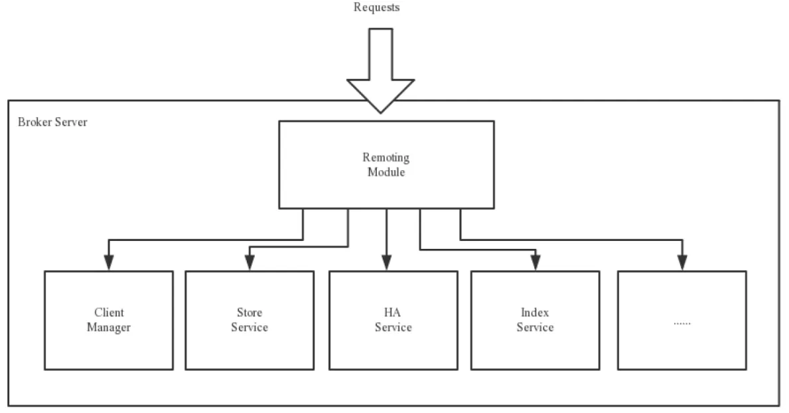

1. Remoting Module：整个 Broker 的实体，负责处理来自 clients 端的请求
2. Client Manager：客户端管理器。负责接收、解析客户端（Producer/Consumer）请求，管理客户端。例如：维护 Consumer 的 Topic 订阅消息
3. Store Service：存储访问。提供方便简单的 API 接口，处理消息存储到物理硬盘和消息查询功能
4. HA Service：高可用服务，提供 Master Broker 和 Slave Broker 之间的数据同步功能
5. Index Service：索引服务。根据特定的 Message key，对投递到 Broker 的消息进行索引服务，同时也提供根据 Message Key 对消息进行快速查询的功能

### 工作流程
1. 启动 NameServer，NameServer 启动后开始监听端口，等待 Broker、Producer、Consumer 连接
2. 启动 Broker 时，Broker 会与所有的 NameServer 建立并保持长连接，然后每 30 秒向 NameServer 定时发送心跳包
3. 发送消息前，可以先创建 Topic，创建 Topic 时需要指定该 Topic 要存储在哪些 Broker 上。在创建 Topic 时也会将 Topic 与 Broker 的关系写入到 NameServer 中，也可以在发送消息时自动创建 Topic
4. Producer 发送消息，启动时先跟 NameServer 集群中的其中一台建立长连接，并从 NameServer 中获取路由信息，即当前发送的 Topic 消息的 Queue 与 Broker 的地址（IP+Port）的映射关系。然后根据算法策略从队列中选择一个 Queue，与队列所在的 Broker 建立长连接从而向 Broker 发消息。在获取到路由信息后，Producer 会首先将路由信息缓存到本地，再每 30 秒从 NameServer 更新一次路由信息
5. Consumer 跟其中一台 NameServer 建立长连接，获取其所订阅 Topic 的路由信息，然后根据算法策略从路由信息中获取到其所要消费的 Queue，然后直接跟 Broker 建立长连接，开始消费其中的消息。Consumer 在获取到路由信息后，同样也会每 30 秒从 NameServer 更新一次路由信息，不同于 Producer 的是，Consumer 还会向 Broker 发送心跳，以确保 Broker 的存活状态

## 集群
### 复制策略
复制策略是 Broker 的 Master 与 Slave 间的数据同步方式

1. 同步复制：消息写入 master 后，master 会等待 slave 同步数据成功后才向 producer 返回成功 ACK
2. 异步复制：消息写入到 master 后，master 立即向 producer 返回成功 ACK，无需等待 slave 同步数据成功

### 刷盘策略
刷盘策略指的是 broker 中消息的落盘方式，即消息发送到 Broker 内存后消息持久化到磁盘的方式。

1. 同步刷盘：当消息持久化到 Broker 的磁盘后才算是消息写入成功
2. 异步刷盘：当消息持久化到 Broker 的内存后即表示写入成功，无需等待消息持久化到磁盘
+ 消息写到 Broker 的内存，一般是写入到了 PageCache
+ 消息写入到 PageCache 后立即返回成功 ACK，但并不会立即做落盘操作，而是当 PageCache 到达一定量时会自动进行落盘

### 单 Master
只有一个 Broker，存在单点问题（系统中一点失效，就会让整个系统无法运行）

### 多 Master
broker 集群仅由多个 master 构成，不存在 slave。同一个 Topic 的各个 Queue 会平均分布在各个 master 节点上。

1. 优点：配置简单，单个 Master 宕机或重启维护对应用无影响，在磁盘配置为 RAID10 时，即使机器宕机不可恢复情况下，由于 RAID10 磁盘非常可靠，消息不会丢失（异步刷盘丢失少量信息，同步刷盘一条也不会丢失），性能最高
2. 缺点：单台机器宕机期间，这台机器上未被消费的信息在机器恢复之前不可订阅（不可消费），消息实时性会受到影响。

以上优缺点都是在集群配置磁盘阵列的基础上做的，如果没有配置磁盘阵列，就会出现大量数据丢失现象。

### 多 Master 多 Slave 异步
broker 集群由多个 master 构成，每个 master 又配置了多个 slave（在配置 RAID 磁盘阵列的情况下，一个 master 一般配置一个 slave 即可）。master 和 slave 的关系是主备关系，即 master 负责处理消息的读写请求，而 slave 仅负责消息的备份与 master 宕机后的角色切换。

异步复制策略：即消息写入到 master 成功后，master 立即向 producer 返回成功 ACK，无需等待 salve 同步数据成功。

1. 当 master 宕机后 slave 能够自动切换为 master。不过由于 slave 从 master 的同步具有短暂的延迟（毫秒级），所以当 master 宕机后，这种异步复制方式可能存在少量消息丢失问题。
2. Slave 从 Master 同步的延迟越短，其可能丢失的消息就越少。
3. 对于 Master 的 RAID 磁盘阵列，若使用的也是同步复制策略，同样也存在延迟问题，同样也可能会丢失消息，但 RAID 阵列的延迟是微秒级的（硬件支持），所以其丢失的数据量会更少。

### 多 Master 多 Slave 同步
同步双写：指的是消息写入 master 成功后，master 会等待 slave 同步数据成功后才向 producer 返回成功 ACK，即 master 与 slave 都要写入成功后才返回成功 ACK，也即双写。

该模式与异步复制模式相比，优点是消息的安全性更高，不存在消息丢失的情况。但单个消息的 RT 略高，从而导致性能要略低（大约低 10%）。

该模式存在一个大的问题：对于目前的版本，Master 宕机后，Slave 不会自动切换到 Master

### 多 Master+RAID 阵列
## RAID 磁盘阵列
RAID 磁盘阵列：廉价冗余磁盘阵列，由于当时大容量磁盘比较昂贵，RAID 的基本思想就是将多个容量较小、相对廉价的磁盘进行有机组合，从而以较低的成本获得与昂贵大容量磁盘相当的容量、性能、可靠性。由于磁盘价格和成本的不断降低，“廉价”已经毫无意义。因此后来决定用“独立”代替“廉价”，于是 RAID 变成了独立磁盘冗余阵列。但是内容没有改变。

### 镜像技术
镜像技术是一种冗余技术，为磁盘提供数据备份功能，防止磁盘发生故障而造成数据丢失。对于 RAID 而言，采用镜像技术最典型的用法就是，同时在磁盘阵列中产生两个完全相同的数据副本，并且分布在两个不同的磁盘上。镜像提供了完全的数据冗余能力，当一个数据副本失效不可用时，外部系统仍可正常访问另一副本，不会对应用系统运行和性能产生影响，而且镜像不需要额外的计算和校验，故障修复非常快，直接复制即可。镜像技术可以从多个副本进行并发读取数据，提供更高的读 I/O 性能，但不能并行写数据，写多个副本通常会导致一定的 I/O 性能下降。

镜像技术提供了非常高的数据安全性，其代价也是非常昂贵的，需要至少双倍的存储空间。高成本限制了镜像的广泛应用，主要应用于至关重要的数据保护，这种场合下的数据丢失可能会造成非常巨大的损失。

### 数据条带技术
数据条带化技术是一种自动将 I/O 操作负载均衡到多个物理磁盘上的技术。更具体地说就是，将一块连续的数据分成很多小部分并把它们分别存储到不同磁盘上。这就能使多个进程可以并发访问数据的多个不同部分，从而获得最大程度上的 I/O 并行能力，极大地提升性能。

### 数据校验技术
数据校验技术是指，RAID 要在写入数据的同时进行校验计算，并将得到的校验数据存储在 RAID 成员磁盘中。校验数据可以集中保存在某个磁盘或分散存储在多个不同磁盘中。当其中一部分数据出错时，就可以对剩余数据和校验数据进行反校验计算重建丢失的数据。

数据校验技术相对于镜像技术的优势在于节省大量开销，但由于每次数据读写都要进行大量的校验运算，对计算机的运算速度要求很高，且必须使用硬件 RAID 控制器。在数据重建恢复方面，检验技术比镜像技术复杂得多且慢得多。

### RAID 分类
1. 软 RAID：所有功能均由操作系统和 CPU 完成，没有独立的 RAID 控制处理芯片和 I/O 处理芯片，效率自然最低
2. 硬 RAID：配备了专门的 RAID 控制处理芯片和 I/O 处理芯片以及阵列缓冲，不占用 CPU 资源，效率很高，但成本也很高。
3. 混合 RAID：具备 RAID 控制处理芯片，但没有专门的 I/O 处理芯片，需要 CPU 和驱动程序来完成。性能和成本在软 RAID 和硬 RAID 之间。

### JBOD
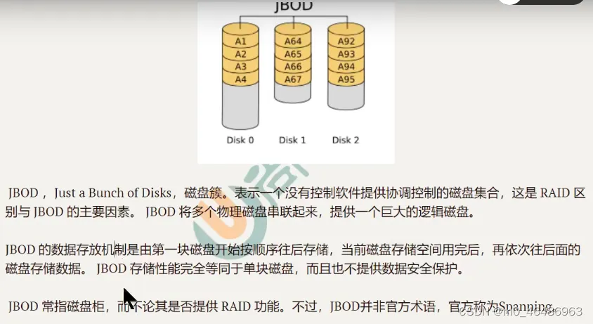

### RAID0

RAID0 与 JBOD 共同点：

1. 存储容量：都是成员磁盘容量的总和
2. 磁盘利用率：都是 100%，其都没有做任何的数据冗余备份

RAID0 与 JBOD 不同点：

1. JBOD：数据是吮吸存放的，一个磁盘存满后才会开始存放到下一个磁盘
2. RAID：各个磁盘中的数据写入时并行的，是通过数据条带技术写入的。其读写性能是 JBOD 的 N 倍。

应用场景：对数据的顺序读写要求不高，对数据的安全性和可靠性不高，但对系统性能要求很高的场景。

### RAID1
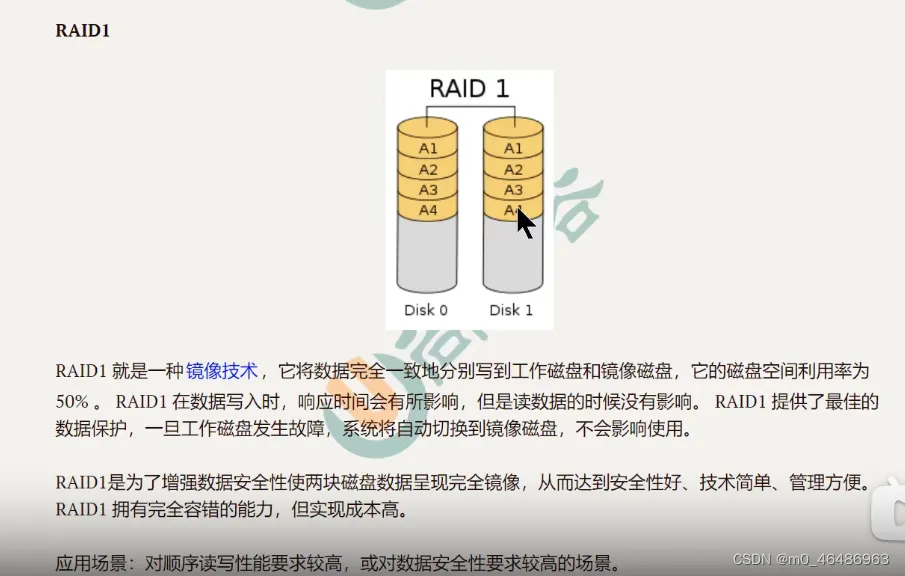

### RAID10
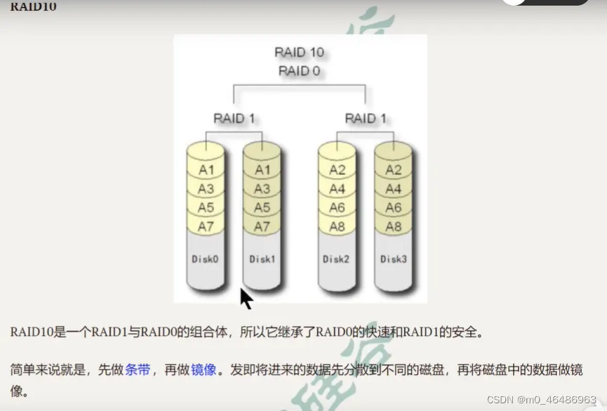

### RAID01
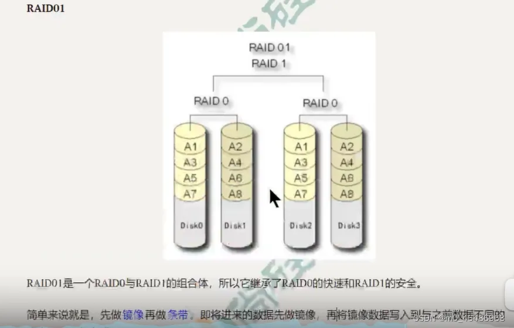

## 工作原理
### 消息的生产
#### 消息生产过程
Producer 可以将消息写入到某 Broker 中的 Queue 中，其经历了如下过程：

1. Producer 发送消息之前，会先向 NameServer 发出获取消息 Topic 的路由信息的请求
2. Nameserver 返回该 Topic 的路由表和 Broker 列表
3. Producer 根据代码中指定的 Queue 选择策略，从 Queue 列表中选出一个队列，用于后续存储消息
4. Producer 对消息进行一些特殊处理，例如，消息本身超过 4M，则会对其进行压缩
5. Producer 想选择出的 Queue 所在的 Broker 发出 RPC 请求，将消息发送到选择的 Queue 上

路由表：实际上就是一个 Map，key 为 Topic 名称，value 是一个 QueueData 实例列表，QueueData 并不是一个 Queue 对应一个 Queuedata，而是一个 Broker 中该 Topic 的所有 Queue 对应一个 QueueData。即只要涉及到该 Topic 的 Broker，一个 Broker 对应一个 Queue，QueueData 中包含 brokerName。简单来说，路由表的 key 为 Topic 名称，value 则为所有涉及该 Topic 的 BrokerName 列表。

Broker 列表：其实际也是一个 Map，key 为 brokerName，value 为 BrokerData，一个 BrokerData 对应着 BrokerName 相同的 Master-slave 集群。BrokerData 中包含 BrokerName 及一个 map，该 map 的 key 为 brokerId，value 为 broker 对应的地址，brokerId 为 0 表示该 Broker 为 Master，非 0 为 salve。

#### Queue 选择算法
1. 轮询算法：默认选择算法，该算法保证了每个 Queue 中可以均匀的获取到消息

存在问题：由于某些原因，在某些 Broker 上的 Queue 可能投递延迟较严重，从而导致 Producer 的缓存队列中出现较大的消息积压，影响消息的投递性能。

2. 最小投递延迟算法：该算法会统计每次消息投递的时间延迟，然后根据统计出的结果将消息投递到时间延迟最小的 Queue。如果延迟相同，则采用轮询算法投递。该算法可以有效提升消息的投递性能。

存在问题：消息在 Queue 上的分配不均匀，投递延迟小的 Queue 其可能存在大量的消息。而对该 Queue 的消费者压力会增大，降低消息的消费能力，可能会导致 MQ 中消息的堆积。

### 消息的存储

RocketMQ 中的消息存储在本地文件系统中，这些相关文件默认在当前用户主目录下的 store 目录中。

1. abort：该文件在 Broker 启动后会自动创建，正常关闭 Broker，该文件会自动消失。若在没有启动 Broker 情况下，发现这个文件是存在的，则说明之前 Broker 的关闭是非正常关闭。
2. checkpoint：其中存放着 commintlog、consumerqueue、index 文件的最后刷盘时间
3. commitlog：其中存放着 commitlog 文件，而消息是写在 commitlog 文件中的
4. config：存放着 Broker 运行期间的一些配置数据
5. consumequeue：其中存放着 consumer queue 文件，队列就放在这个目录中
6. index：其中存放着消息索引文件 indexFile
7. lock：运行期间使用到的全局资源锁

#### commitlog 文件

在很多资料中 commitlog 目录中的文件简单就称为 commitlog 文件。但在源码中，该文件被命名为 mappedFile

**目录与文件**

commitlog 目录中存放着很多的 mappedFile 文件，当前 Broker 中所有消息都是落盘到这些 mappedFile 文件中的。mappedFile 文件容量为 1G（其中存放的数据可能会小于 1G，因为该文件剩余的容量不足以储存下一条消息，此时下一条消息就会储存到另一个 mappedFile 文件中），文件由 20 位十进制数构成，表示当前文件的第一条消息的起始唯一偏移量。

1. 第一个 mappedFile 文件名一定为 20 个 0
2. 如果第一个文件储存了不足 1G 的消息，第二个文件的的偏移量就是第一个文件存放消息的大小，以此类推，第 n 个文件就为前 n-1 个文件大小之和

需要注意的是，一个 Broker 中仅包含着一个 commit log 目录，所有的 mappedFile 文件都是存放在该目录中的。即无论当前 Broker 中存放着多少 Topic 的消息，这些消息都是被顺序写入到 mappedFile 文件中的。也就是说，这些消息再 Broker 中存放时并没有按照 Topic 进行分类存放。

**消息单元**

mappedFile 文件内容有一个个的消息单元构成。每个消息单元中包含消息总长度 MsgLen、消息的物理位置 physicalOffset、消息体内容 Body、消息体长度 BodyLength、消息主题 Topic、Topic 长度 TopicLength、消息生产者 BornHost、消息发送时间戳 BornTimestamp、消息所在的队列 QueueId、消息再 Queue 中储存的偏移量 QueueOffset 等近 20 项详细相关属性。

一个 mappedFile 文件中第 m+1 个消息单元的 commitlog offset 偏移量
L（m + 1） = L（m） + MsgLen（m）（m > 0)

#### consumeQueue 文件

为了提高效率，会为每个在~/store/consumeQueue 中创建一个目录，目录名为 Topic 名称。在该 Topic 目录下，会在为每个该 Topic 的 Queue 创建一个目录，目录名为 queueId。每个目录中存放着若干 consumequeue 文件，consumequeue 文件是 commitlog 的索引文件，可以根据 consume queue 定位到具体的消息。

consumequeue 文件名也是由 20 位数字构成，表示当前文件的第一个索引条目的起始偏移量。与 mappedFile 文件名不同的是，其后续文件名是固定的。因为 consumequeue 文件大小是固定不变的。

**索引条目**

每个 consumequeue 文件可以包含 30W 个索引条目，每个索引条目包含了三个消息重要属性：消息在 mappedFile 文件中的偏移量 CommitLogOffset、消息长度、消息 Tag 的 hashCode 值。这三个属性占 20 个字节，所以每个文件的大小是固定的 30W*20 字节

一个 consumequeue 文件中所有消息的 Topic 一定是相同的。但每条消息 Tag 可能不同的

#### 对文件写入

**消息写入**

一条消息进入到 Broker 后经历了以下几个过程才最终被持久化。

1. Borker 会根据 queueId 获取到该消息对应索引条目要在 consumequeue 目录的写入偏移量，即 QueueOffset
2. 将 queueId、queueOffset 等数据，与消息一起封装为消息单元
3. 将消息单元写入到 commitlog，同时形成消息索引条目
5. 将消息索引条目分发到相应的 consumequeue

**消息拉取**

当 Conusmer 来拉取消息时会经历以下几个步骤：

1. Consumer 获取到其要消费消息所在 Queue 的消费偏移量 offset 计算出要消费消息的消息 offset

消费 offset 及消费进度，consumer 对某个 Queue 的消费 offset，即消费到了该 Queue 的第几条消息

消息 offset = 消费 offset + 1

2. Consumer 向 Broker 发送拉取请求，其中会包含其拉取消息的 Queue、消息 offset 以及消息 Tag

3. Broker 计算在该 consume queue 中的 queueOffset

queueOffset = 消息 offset * 20 字节

4. 从该 queueOffset 处开始向后查找第一个指定 Tag 的索引条目

5. 解析该索引条目的前 8 个字节，即可定位到该消息在 commitlog 中的 commitlog offset

6. 从对应的 commitlog offset 中读取消息单元，并发送给 Consumer

### indexFile

除了通过通常的指定 Topic 进行消息消费外，RocketMQ 还提供了根据 key 进行消息查询的功能。该查询是通过 store 目录中的 index 子目录中的 indexFile 进行索引实现的快速查询。当然，这个 indexFile 中的索引数据实在包含了 key 的消息被发送到 Broker 时写入的。如果消息中没有包含 key，则不会写入。

#### indexFile 结构

每个 Broker 中包含一组 indexFile，每个 indexFile 都是以一个时间戳命名的（这个 indexFile 被创建时的时间戳）。每个 indexFile 由三部分构成：indexHeader，slots 槽位，indexes 索引数据。每个 indexFile 文件中包含 500W 个 slot 槽。而每个 slot 槽又可能会挂在很多的 index 索引单元。

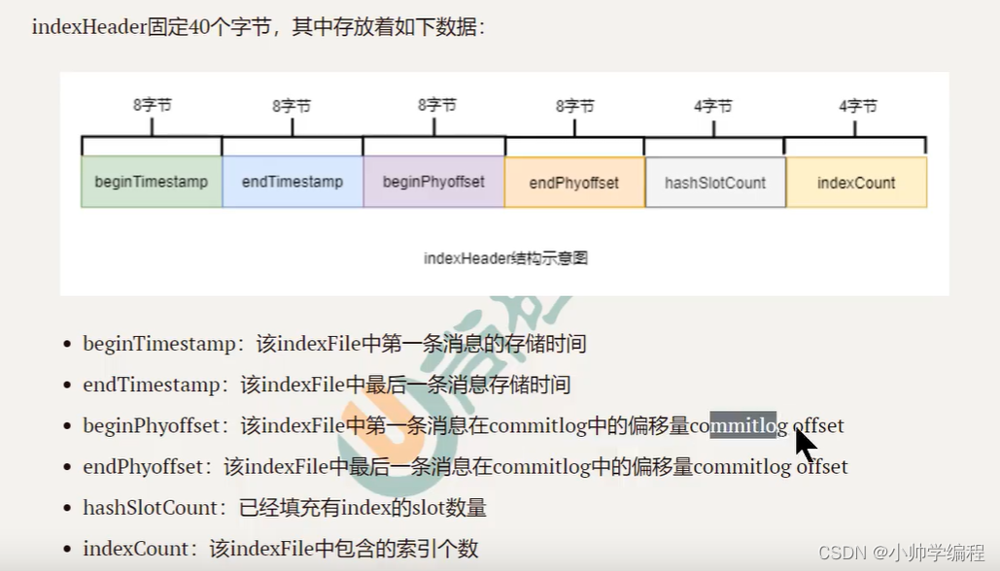

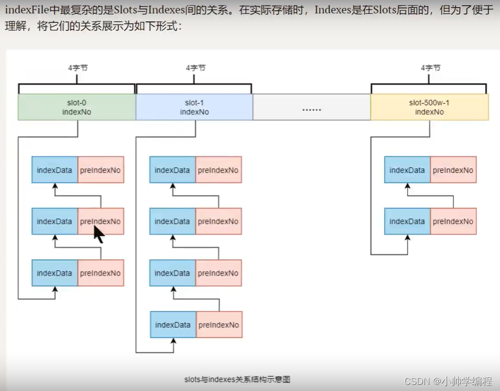

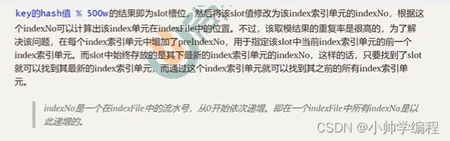

如何将 slot 的值修改为该 index 索引单元的 indexNo？

indexNo 是索引单元在 indexes 的标号，indexes 中存放着所有的索引单元，slot 槽中存放的是最新的索引单元对应的 indexNo，indexes 中的索引单元是按照索引单元存入时间顺序放入的，indexNo 等于消息索引在 indexed 中第几个索引单元的值减一，因为在 indexex 中的索引单元是以 0 开始的

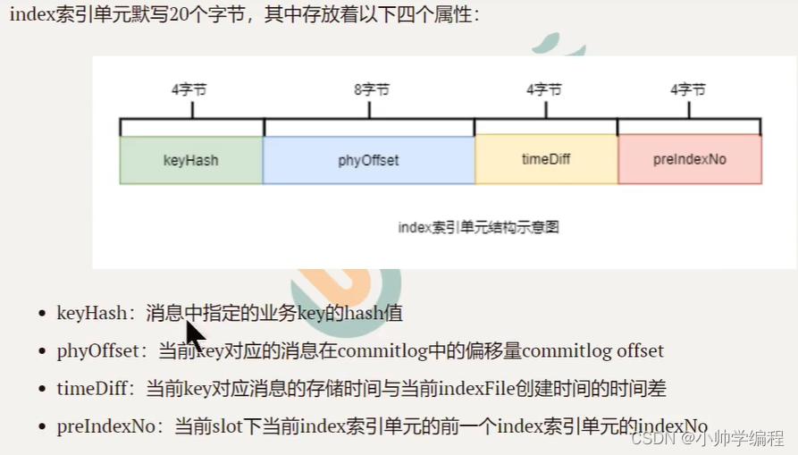

#### 文件名的作用

indexFile 的文件名为当前文件被创建时的时间戳。这个时间戳有什么用处？

根据业务 key 进行查询时，查询条件除了 key 之外，还需要指定一个要查询的时间戳，表示要查询不大于该时间戳的最新消息，即查询指定时间戳之前存储的最新消息。这个时间戳文件可以简化查询，提高查询效率。

indexFile 文件是何时被创建的？其创建的条件有两个：

1. 当第一条带有 key 的消息发送来后，系统发现没有 indexFile，此时会创建一个 indexFile 文件

2. 当一个 index File 中挂载的 index 索引单元数量超过 2000W 个时，会创建新的 indexFile。当带 key 的消息发送到来后，系统会找到最新的 indexFile，并从 indexHeader 的最后字节中读取到 indexCount。若 index Count >= 2000W 时，会场艰辛的 indexFile

由此可以推算出，一个 index File 的最大大小是（40+500w*+ 2000W\*20）字节

#### 查询流程

当消费者通过业务key来查询相应的消息时，其需要经过一个相对比较负责的查询流程。不过，在分析查询流程之前，首先要清楚几个定位计算的式子：

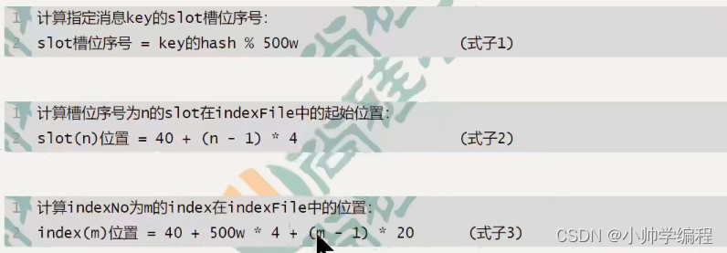

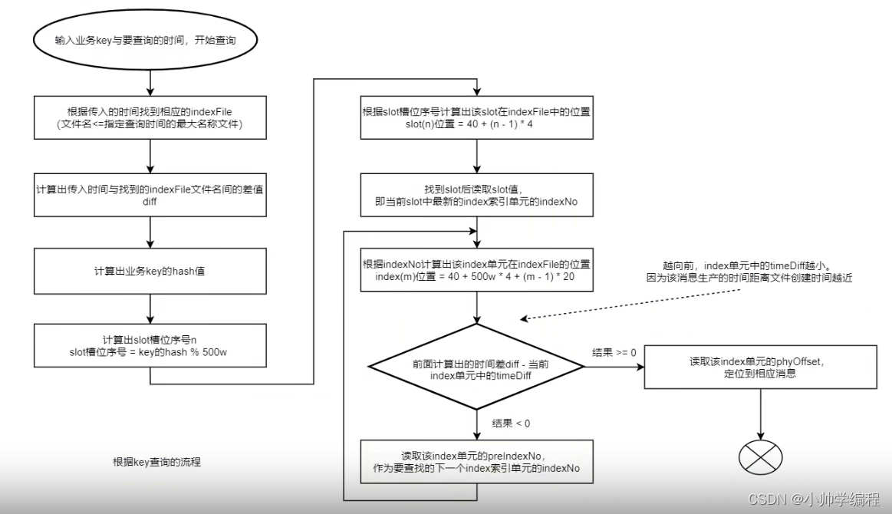

### 消息的消费
#### 获取消费方式
1. 拉取式消费

Consumer 主动从 Broker 中拉取消息，主动权由 Consumer 控制。一旦获取了批量消息，就会启动消费过程。不过，该方式的实时性较弱，即 Broker 中有了新的消息时消费者并不能及时发现并消费。

由于拉取时间间隔是由用户指定的，所以以在设置该间隔时需要注意平稳：间隔太短，空请求比例会增加；间隔太长，消息的实时性太差

2. 推送式消费

该模式下 Broker 收到数据后会主动推送给 Consumer，该获取方式一般实时性较高。

该获取方式是典型的发布-订阅模式，即 Consumer 向其关联的 Queue 注册了监听器，一旦发现有新的消息到来就会触发回调的执行，回调方法是 Consumer 去 Queue 拉取消息。而这些都是基于 Consumer 与 Broker 间的长连接，长连接的维护是需要消耗系统资源的。

#### 消费模式
1. 广播模式

广播消费模式下，相同 Consumer Group 的每个 Consumer 实例都接受同一个 Topic 的全量消息，即每条消息都会被发送到 Consumer Group 中的每个 Consumer

2. 集群模式

集群消费模式下，相同 Consumer Group 的每个 Consumer 实例平均分摊到同一个 Topic 的消息，即每条消息只会被发送到 Consumer Group 中的某个 Consumer

#### 消费进度保存
1. 广播模式：消费进度保存在 consumer 端。因为广播模式下 consumer group 中每个 consumer 都会消费所有的消息，但他们的消费进度是不同。所以 consumer 各自保存各自的消费进度。
2. 集群模式：消费进度保存在 broker 中。consumer group 中的所有 consumer 共同消费同一个 Topic 中的消息，同一条消息只能被消费一次，消费进度会参与到了消费的负载均衡中，故消费进度是需要共享的。

### Rebalance 机制
Rebalance 即再均衡，指将一个 Toic 下的多个 Queue 在同一个 ConsumerGroup 中的多个 Consumer 间进行重新分配的过程

Rebalance 机制的本意是为了提高消息的并行消费能力。例如：一个 Topic 下 5 个队列，在只有一个消费者的情况下，这个消费者将负责消费这 5 个队列的消息。如果我们此时增加一个消费者，那么就可以给其中一个消费者分配 2 个队列，给另一个分配 3 个队列，从而提高下并行消费能力

#### 产生原因
1. 消费者所订阅 Topic 的 Queue 数量发生变化
+ Broker 扩容或缩容
+ Broker 升级运维
+ Broker 与 NameServer 间的网络异常
+ Queue 扩容或缩容
2. 消费者组中消费者数量发生变化
+ Consumer Group 扩容或缩容
+ Consumer 升级运维
+ Consumer 与 NameServer 间网络异常

#### 危害
1. 消费暂停

在只有一个 Consumer 时，其负责消费所有的队列；再新增一个 Consumer 后，会触发 Rebalance 的发生。此时原 Consumer 就需要暂停部分队列的消费，等到这些队列分配给新的 Consumer 后，这些暂停消费的队列才能继续被消费

2. 消费重复

Consumer 在消费新分配给自己的队列时，必须接着之前 Consumer 提交的消费进度的 offset 继续消费。然而默认消费下，offset 是异步提交的，这个异步会导致提交到 Broker 的 offset 与 Consumer 实际消费的消息的不一致，这个不一致的差值就是可能重复消息的消息

+ 同步提交: consumer 提交了其消费完毕的一批消息的 offset 给 broker 后，需要等待 broker 的成功 ACK。当收到 ACK 后，consumer 才会继续获取并消费下一批消息。在等待 ACK 期间，consumer 是阻塞的。
+ 异步提交: consumer 提交了其消费完毕的一批消息的 offset 给 broker 后，不需要等待 broker 的成功 ACK，consumer 可以直接获取并消费下一批消息
3. 消费突刺

由于 Rebalance 可能导致重复消费，如果需要重复消费的过多，或者因为 Rebalance 暂停时间过长从而导致挤压了部分消息。那么有可能会导致在 Rebalance 结束之后瞬间需要消费很多消息

#### Rebalance 过程
在 Broker 中维护着多个 Map 集合，这些集合中动态存放着 Topic 中 Queue 的消息、Consumer Group 中 Consumer 实例的信息。一旦发现消费者所订阅的 Queue 数量发生变化 ，或消费者组中消费者数量发生变化，立即向 Consumer Group 中每个实例发出 Rebalance 通知。

Consumer 实例在接收到通知后会采用 Queue 分配算法自己获取到相应的 Queue，即由 Consumer 实例自行进行 Rebalance。

Broker 中的配置：

1. TopicConfigManager：key 是 topic 名称，value 是 TopicConfig，TopicConfig 中维护着该 Topic 中所有 Queue 的数据
2. ConsumerManager：key 是 ConsumerGroupId，Value 是 ConsumerGroupInfo，Consumer GroupInfo 中维护着该 Group 中所有 Consumer 实例数据。
3. ConsumerOffsetMagager：key 为 Topic 与订阅该 Topic 的 Group 的组合，value 是一个内层 Map。内层 Map 的 key 为 QueueId，内层 Map 的 Value 为该 Queue 的消费进度 Offset

#### Queue 分配算法
1. 平均分配策略

根据 avg = QueueCount / ConsumerCount 的计算结果进行分配的。如果能够整除，则按顺序将 avg 个 Queue 逐个分配 Consumer；如果不能整除，则将多余的 Queue 按照 Consumer 顺序逐个分配

2. 环形平均分配策略

根据消费者的顺序，依次在由 queue 队列组成的环星图中逐个分配。该算法不用事先计算每个 Consumer 需要分配几个 Queue，直接一个一个分即可

3. 一致性 hash 策略

该算法会将 consumer 的 hash 值作为 Node 节点存放到 hash 环上，然后将 queue 的 hash 值也放到 hash 环上，通过顺时针方向，距离 queue 最近的那个 consumer 就是该 queue 要分配的 consumer

4. 同机房策略

该算法会根据 Queue 的部署机房和 consumer 的位置，过滤出当前 consumer 相同机房的 queue。然后按照平均分配策略或者环形平均策略对同机房 queue 进行分配。如果没有同机房 queue，则按照平均策略或者环形分配策略对所有 queue 进行分配

### offset 管理
#### offset 本地管理模式
当消费模式为广播模式，offset 使用本地模式储存。因为每条消息会被所有的消费者消费，每个消费者管理自己的消费进度，各个消费之间不存在消费进度的交集。

Consumer 在广播消费模式下 offset 相关数据以 json 的形式持久化到 Consumer 本地磁盘文件中，默认文件路径为当前用户主目录下的.roketmq_offsets/&{clientId}/${group}/offsets.json。其中，clientid 为当前消费者 id，默认为 ip@DEFAULT；group 为消费者组名称。

#### offset 远程管理模式
当消费模式为集群消费时，offset 使用远程模式管理，因为所有 Consumer 实例对消息采用的是均衡消费，所有 Consumer 共享 Queue 的消费进度。

Consumer 在集群消费模式下 offset 相关数据以 json 的形式持久化到 Broker 磁盘文件中，文件路径为当前用户主目录下的 store/config/consumeroffset.josn

Broker 启动时会加载这个文件，并写入到一个双层 Map，外层 Map 的 key 为 topic@group，value 为内层 map，内层 map 的 key 为 queueId，value 为 offset。当发生 Rebalance 时，新的 Consumer 会从该 Map 中获取到相应的数据来继续消费。

集群模式下 offset 采用远程管理模式，主要是为了保证 Rebalance 机制

#### offset 用途
当消费完一批消息后，Consumer 会提交其消费进度 offset 给 Broker，Broker 在收到消息进度后会将其更新到那个双层 Map（ConsumerOffsetManager）及 consumerOffset.json 文件中，然后向该 Consumer 进行 ACK，而 ACK 内容中包含了三项数据：当前队列的最小 offset、最大 offset、及下次消费的起始 offset（nextBeginOffset）

#### offset 响应
集群消费模式下，Consumer 消费完消息后会向 Broker 提交消费进度 offset，其提交方式分为两种：

1. 同步提交：消费者在消费完一批消息后会向 Broker 提交这些消息的 offset，然后等待 broker 的成功响应。如在等待超时之前收到了成功响应，则继续读取下一批消息进行消费。 若没有受到响应，则会重新提交，直到获取到响应。而在这个等待过程中，消费者是阻塞的，其严重影响了消费者的吞吐量。
2. 异步提交：消费者在消费完一批消费后向 Broker 提交 offset，但无需等待 Broker 的成功响应，可以继续读取并消费下一批消息。这种方式增加了消费者的吞吐量。但需要注意，broker 在收到提交的 offset 后，还是会像消费者进行响应。

### 消息清除
消息是被顺序存储在 CommitLog 文件的，且消息大小不定长，所以消息的清理是不可能以消息为单位进行清理的，而是以 commitlog 文件为单位进行清理的，否则会急剧下降清理效率，并实现逻辑复杂。

commitlog 文件存在一个过期时间，默认为 72 小时，即三天，除了用户手动清理外，一下情况下也会被自动清理，无论文件中的消息是否给消费过：

1. 文件过期，且达到清理时间点（默认为凌晨 4 点）后，自动清理过期文件。
2. 文件过期，且磁盘空间占用率以达到过期清理警戒线（默认 75%）后，无论是否达到清理时间点，都会自动清理过期文件。
3. 磁盘占用率达到清理警戒线（默认为 85%）后，开始按照设定好的规则清理文件，无论是否过期，默认会从最老的文件开始清理。
4. 磁盘占用率达到系统危险警戒线（默认为 90%）后，Broker 将拒绝消息写入。

